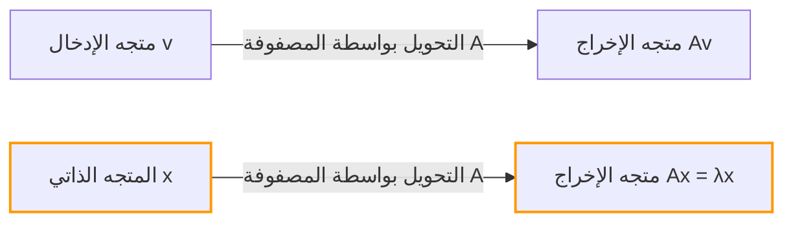
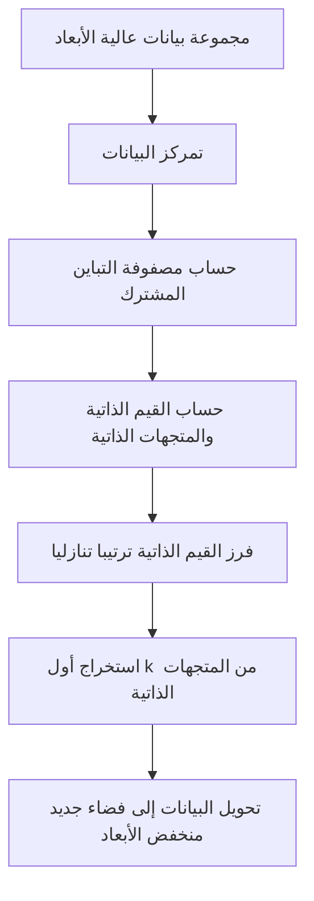

## مقدمة

عند تعلم الجبر الخطي، قد تكون العقبات الأولى التي يواجهها الكثير من الناس هي "ضرب المصفوفات" أو "المحددات". ومع ذلك، وراء هذه العقبات يكمن المصدر الحقيقي للقوة الهائلة للجبر الخطي في العلوم والهندسة الحديثة: **القيم الذاتية** (Eigenvalues) و **المتجهات الذاتية** (Eigenvectors).

من تقليل الأبعاد (PCA) في التعلم الآلي وخوارزمية PageRank التي دعمت محرك بحث جوجل، إلى التصميم الزلزالي للمباني ومعادلة شرودنغر في ميكانيكا الكم، تظهر [القيم الذاتية والمتجهات الذاتية](https://kenji.blog/ar/p/eigenvalues-and-eigenvectors/) في كل مكان.

الهدف من هذا المقال ليس فقط تتبع الصيغ الرياضية بل الفهم البديهي لـ "معناها الهندسي". سنشرح بشكل شامل كل شيء، من طرق الحساب العملية إلى التطبيقات في العالم الحقيقي.

## التحويلات الخطية والحدس الهندسي

لفهم [القيم الذاتية والمتجهات الذاتية](https://kenji.blog/ar/p/eigenvalues-and-eigenvectors/)، تحتاج أولاً إلى تغيير منظورك حول "ما هي المصفوفة". المصفوفة ليست مجرد شبكة من الأرقام. إنها **محول (Transformation)** في الفضاء.

العملية $A\mathbf{v}$، حيث تضرب متجهًا $\mathbf{v}$ بمصفوفة $A$، تعني تحويل المتجه $\mathbf{v}$ إلى متجه جديد آخر $\mathbf{v}'$.

$$ \mathbf{v}' = A\mathbf{v} $$

بشكل عام، عند ضرب متجه بمصفوفة، يتغير كل من "اتجاهه" و "مقداره". ومع ذلك، بغض النظر عن كيفية تشويه الفضاء بأكمله، قد توجد متجهات خاصة يكون فيها **"الاتجاه لا يتغير على الإطلاق (أو ينعكس تمامًا)"**. هذه هي **المتجهات الذاتية**. وعامل المقياس الذي يمثل "مقدار التمدد (أو الانكماش)" بواسطة التحويل هو **القيمة الذاتية**.

هندسيًا، عند إجراء تحويل خطي يمد أو يدور الفضاء، لا يعدو كونه عملية إيجاد متجهات تظل على نفس الخط تمامًا قبل التحويل وبعده.



## تعريف [القيم الذاتية والمتجهات الذاتية](https://kenji.blog/ar/p/eigenvalues-and-eigenvectors/) والخلفية الرياضية

رياضيًا، بالنسبة لمصفوفة مربعة $A$، إذا كان هناك متجه غير صفري $\mathbf{v}$ ومقياس $\lambda$ يلبي الشرط التالي، يُطلق على $\mathbf{v}$ اسم **متجه ذاتي** للمصفوفة $A$، ويطلق على $\lambda$ اسم **قيمة ذاتية**.

$$ A\mathbf{v} = \lambda \mathbf{v} $$

المهم هنا هو أن الجانب الأيسر هو "حاصل ضرب مصفوفة ومتجه"، بينما الجانب الأيمن هو "حاصل ضرب مقياس ومتجه". يتم تقليل التحويل متعدد الأبعاد المعقد بواسطة المصفوفة إلى ضرب قياسي بسيط (مقياس 1D) لاتجاهات محددة (المتجهات الذاتية).

دعونا نعيد كتابة هذه المعادلة. لنفترض أن $I$ هي مصفوفة الوحدة، لذلك يمكننا كتابة $\mathbf{v} = I\mathbf{v}$:

$$ A\mathbf{v} = \lambda I\mathbf{v} $$
$$ A\mathbf{v} - \lambda I\mathbf{v} = \mathbf{0} $$
$$ (A - \lambda I)\mathbf{v} = \mathbf{0} $$

الشرط الضروري والكافي لمتجه غير صفري $\mathbf{v}$ لتحقيق هذه المعادلة هو أن المصفوفة $(A - \lambda I)$ لا تملك معكوسًا، مما يعني أن محددها يجب أن يكون صفرًا.

$$ \det(A - \lambda I) = 0 $$

يسمى هذا **المعادلة المميزة (Characteristic Equation)**.

## المعادلة المميزة وخطوات الحساب المحددة

الآن، دعونا نحسب [القيم الذاتية والمتجهات الذاتية](https://kenji.blog/ar/p/eigenvalues-and-eigenvectors/) يدويًا باستخدام مصفوفة محددة $2 \times 2$. هذه خطوة شائعة جدًا في امتحانات الجبر الخطي.

كمثال، فكر في المصفوفة التالية $A$:

$$
A = \begin{pmatrix} 4 & 1 \\ 2 & 3 \end{pmatrix}
$$

### الخطوة 1: حساب القيم الذاتية

أولاً، نحل المعادلة المميزة $\det(A - \lambda I) = 0$ لإيجاد القيم الذاتية $\lambda$.

$$
A - \lambda I = \begin{pmatrix} 4 & 1 \\ 2 & 3 \end{pmatrix} - \begin{pmatrix} \lambda & 0 \\ 0 & \lambda \end{pmatrix} = \begin{pmatrix} 4-\lambda & 1 \\ 2 & 3-\lambda \end{pmatrix}
$$

نحسب محددها:

$$
\det(A - \lambda I) = (4-\lambda)(3-\lambda) - (1)(2) = (\lambda^2 - 7\lambda + 12) - 2 = \lambda^2 - 7\lambda + 10
$$

نجعل هذا مساويًا للصفر:

$$
\lambda^2 - 7\lambda + 10 = 0
$$

من خلال تحليلها:

$$
(\lambda - 2)(\lambda - 5) = 0
$$

لذلك، القيم الذاتية هي $\lambda_1 = 2$ و $\lambda_2 = 5$.

### الخطوة 2: حساب المتجهات الذاتية

لكل قيمة ذاتية، نجد المتجه الذاتي المقابل. نحل $(A - \lambda I)\mathbf{v} = \mathbf{0}$. ليكن $\mathbf{v} = \begin{pmatrix} x \\ y \end{pmatrix}$.

**الحالة 1: عندما تكون القيمة الذاتية 2**

$$
(A - 2I) \begin{pmatrix} x \\ y \end{pmatrix} = \begin{pmatrix} 2 & 1 \\ 2 & 1 \end{pmatrix} \begin{pmatrix} x \\ y \end{pmatrix} = \begin{pmatrix} 0 \\ 0 \end{pmatrix}
$$

هذا يعطينا المعادلة $2x + y = 0$. بما أن $y = -2x$، يمكن كتابة المتجه الذاتي كـ $\begin{pmatrix} c \\ -2c \end{pmatrix}$ باستخدام ثابت $c$. بأخذ أبسط شكل صحيح عن طريق تعيين $x = 1$:

$$
\mathbf{v}_1 = \begin{pmatrix} 1 \\ -2 \end{pmatrix}
$$

**الحالة 2: عندما تكون القيمة الذاتية 5**

$$
(A - 5I) \begin{pmatrix} x \\ y \end{pmatrix} = \begin{pmatrix} -1 & 1 \\ 2 & -2 \end{pmatrix} \begin{pmatrix} x \\ y \end{pmatrix} = \begin{pmatrix} 0 \\ 0 \end{pmatrix}
$$

هذا يعطي $-x + y = 0$، مما يعني $x = y$. باختيار نسبة عدد صحيح بسيطة كما كان من قبل، أحد المتجهات الذاتية هو:

$$
\mathbf{v}_2 = \begin{pmatrix} 1 \\ 1 \end{pmatrix}
$$

الآن، لقد وجدنا جميع [القيم الذاتية والمتجهات الذاتية](https://kenji.blog/ar/p/eigenvalues-and-eigenvectors/) للمصفوفة $A$.

## حساب [القيم الذاتية والمتجهات الذاتية](https://kenji.blog/ar/p/eigenvalues-and-eigenvectors/) باستخدام بايثون (Python)

في العمل العملي الحديث، لا يتم حساب القيم الذاتية للمصفوفات الكبيرة يدويًا أبدًا. باستخدام NumPy، وهي مكتبة حساب رقمي في بايثون، يمكنك حسابها في بضعة أسطر فقط من التعليمات البرمجية.

```python
import numpy as np

# تعريف المصفوفة A
A = np.array([[4, 1],
              [2, 3]])

# حساب القيم الذاتية والمتجهات الذاتية
eigenvalues, eigenvectors = np.linalg.eig(A)

print("القيم الذاتية (Eigenvalues):", eigenvalues)
print("المتجهات الذاتية (Eigenvectors):\n", eigenvectors)

# مثال على المخرجات:
# القيم الذاتية (Eigenvalues): [5. 2.]
# المتجهات الذاتية (Eigenvectors):
#  [[ 0.70710678 -0.4472136 ]
#   [ 0.70710678  0.89442719]]
```

تُرجع الدالة `np.linalg.eig` الخاصة بـ NumPy المتجهات الذاتية الطبيعية (بطول 1). يمكنك التأكد من أنها مضاعفات ثابتة للمتجهات $\begin{pmatrix} 1 \\ 1 \end{pmatrix}$ و $\begin{pmatrix} 1 \\ -2 \end{pmatrix}$ التي حسبناها يدويًا، مما يؤكد أنها تشير في نفس الاتجاه تمامًا.

## تقطير المصفوفة وفوائدها القوية

يعد **تقطير المصفوفة (Matrix Diagonalization)** أحد أهم تطبيقات [القيم الذاتية والمتجهات الذاتية](https://kenji.blog/ar/p/eigenvalues-and-eigenvectors/). التقطير هو عملية تحليل مصفوفة معقدة $A$ باستخدام مصفوفة قطرية يسهل حسابها $D$ على النحو التالي:

$$ A = P D P^{-1} $$

هنا، $P$ عبارة عن مصفوفة يتم فيها ترتيب المتجهات الذاتية كمتجهات عمود، و $D$ عبارة عن مصفوفة قطرية مع القيم الذاتية المقابلة على قطرها.

باستخدام مثالنا السابق:

$$
P = \begin{pmatrix} 1 & 1 \\ -2 & 1 \end{pmatrix}, \quad D = \begin{pmatrix} 2 & 0 \\ 0 & 5 \end{pmatrix}
$$

لماذا هذا التقطير مهم جدا؟ لأنه **يجعل حساب قوى المصفوفات أسهل بكثير**.

على سبيل المثال، لنفترض أنك تريد حساب القوة 100 لـ $A$. يعد حساب $A^{100}$ مباشرةً حسابًا هائلاً. ومع ذلك، باستخدام التقطير:

$$
A^{100} = (P D P^{-1})(P D P^{-1}) \dots (P D P^{-1}) = P D^{100} P^{-1}
$$

تصبح جميع $P^{-1}P$ الوسيطة مصفوفة الوحدة $I$ وتلغى، وتقلص إلى معادلة بسيطة للغاية. رفع المصفوفة القطرية $D$ إلى قوة يتطلب ببساطة رفع عناصرها القطرية إلى تلك القوة:

$$
D^{100} = \begin{pmatrix} 2^{100} & 0 \\ 0 & 5^{100} \end{pmatrix}
$$

هذه الخاصية هي تقنية لا غنى عنها عند التنبؤ بالحالات طويلة الأجل في نماذج الاحتمالات مثل [سلاسل ماركوف](https://kenji.blog/ar/p/markov-chain/)، عند حل أنظمة المعادلات التفاضلية، أو حتى عند البحث عن الحد العام لتسلسل فيبوناتشي.

## تطبيقات العالم الحقيقي للقيم الذاتية والمتجهات الذاتية

لقد نظرنا في الجوانب الرياضية حتى الآن، لكن هذه المفاهيم تعمل كمحركات لحل التحديات المختلفة في العالم الحقيقي.

### 1. تحليل المكونات الرئيسية (PCA) وعلم البيانات

في مجالات التعلم الآلي وعلم البيانات، توجد تقنية تسمى **تحليل المكونات الرئيسية (PCA)** والتي تضغط البيانات عالية الأبعاد (على سبيل المثال، بيانات الصور مع مئات البكسل أو كمية كبيرة من سجلات سلوك المستخدم) في بُعد أقل قابل للتحليل.

في PCA، نحسب [القيم الذاتية والمتجهات الذاتية](https://kenji.blog/ar/p/eigenvalues-and-eigenvectors/) لمصفوفة التباين المشترك للبيانات.
- **المتجه الذاتي**: يمثل اتجاه "المحور الجديد (المكون الرئيسي)" حيث يتم تعظيم تباين البيانات.
- **القيمة الذاتية**: يمثل مقدار التباين (كمية المعلومات) للبيانات على طول هذا المحور الجديد.

من خلال اختيار المتجهات الذاتية بترتيب تنازلي لقيمها الذاتية، يمكننا تقليل أبعاد البيانات مع تقليل فقدان المعلومات. يتيح ذلك تصور البيانات، ويسرع تدريب نماذج التعلم الآلي، ويزيل التشويش.



### 2. خوارزمية PageRank من جوجل

خلال فجر الإنترنت، الخوارزمية التي دفعت محرك بحث Google إلى صدارة العالم كانت **PageRank**. لقد مثلت بنية الرابط بين صفحات الويب كمصفوفة ضخمة وصممت رياضيًا الفكرة القائلة بأن "الصفحات المرتبطة من صفحات مهمة هي أيضًا مهمة."

والمثير للدهشة أن "درجة أهمية" كل صفحة ويب هي بالضبط **المتجه الذاتي المقابل لأكبر قيمة ذاتية تبلغ 1** لمصفوفة الارتباط العملاقة هذه (أو مصفوفة احتمالية الانتقال). كان نظام Google الأولي عبارة عن محرك حساب تكراري هائل مخصص للعثور على المتجه الذاتي لمصفوفة بمليارات الأبعاد.

### 3. ميكانيكا الكم والأنظمة الفيزيائية

في عالم الفيزياء، وخاصة في ميكانيكا الكم، يتم تمثيل الكميات الفيزيائية التي يمكن ملاحظتها (مثل الطاقة والزخم) كـ "مؤثرات هيرميتية (مصفوفات)". وقيم القياس المحتملة التي تم الحصول عليها من خلال الملاحظة هي **القيم الذاتية** لذلك المؤثر، وتصبح حالة النظام بعد القياس **المتجه الذاتي** (الحالة الذاتية) المقابلة.

معادلة شرودنغر الشهيرة:

$$ \hat{H}\psi = E\psi $$

هذه المعادلة ليست سوى مشكلة القيمة الذاتية للهاميلتوني $\hat{H}$ (مؤثر الطاقة). هنا، $E$ هي القيمة الذاتية للطاقة، و $\psi$ هي دالة الموجة (الحالة الذاتية).

أيضًا، في الفيزياء الكلاسيكية، مثل تحليل اهتزاز الجسور والمباني، أو في الصوتيات، لا غنى عن القيم الذاتية لتمثيل "الترددات الطبيعية (ترددات الرنين)"، بينما تمثل المتجهات الذاتية "أنماط الاهتزاز (أشكال التمايل)". أثناء التصميم، يتم إجراء تحليل للقيمة الذاتية للتأكد من أن ترددات طبيعية معينة لا تتطابق مع ترددات القوى الخارجية (مثل الرياح أو الزلازل) لمنع فشل الرنين.

## خاتمة

للوهلة الأولى، قد تبدو [القيم الذاتية والمتجهات الذاتية](https://kenji.blog/ar/p/eigenvalues-and-eigenvectors/) بمثابة ألغاز رياضية مجردة. ومع ذلك، هندسيًا، هي عملية استخراج "المحاور الأساسية التي لا تتغير أبدًا وسط التحويلات المعقدة بواسطة المصفوفات"، وتتراوح تطبيقاتها من علوم الكمبيوتر إلى علوم البيانات والفيزياء النظرية والهندسة الميكانيكية.

- **المتجه الذاتي**: الاتجاه الأساسي أو الوضع الأساسي لنظام لا يغير اتجاهه بعد التحويل.
- **القيمة الذاتية**: عامل المقياس (الأهمية، الطاقة، التردد، إلخ) الذي يمثل مدى تمدد أو تقلص هذا الاتجاه بواسطة التحويل.

مع أخذ هذه الصورة البديهية في الاعتبار، سترى أن الجبر الخطي ليس مجرد قائمة من قواعد الحساب، بل هو لغة قوية للغاية لوصف عالمنا المعقد ببساطة والكشف عن هياكله المخفية. عند تعلم رياضيات أكثر تقدمًا أو خوارزميات التعلم الآلي، ستصبح هذه المفاهيم الأساسية أسلحتك الأكثر موثوقية.
