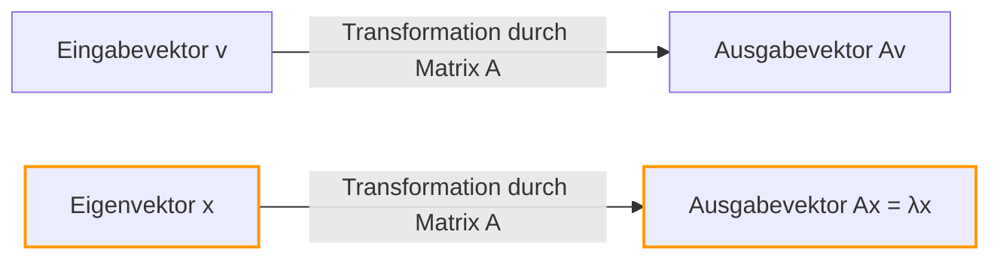
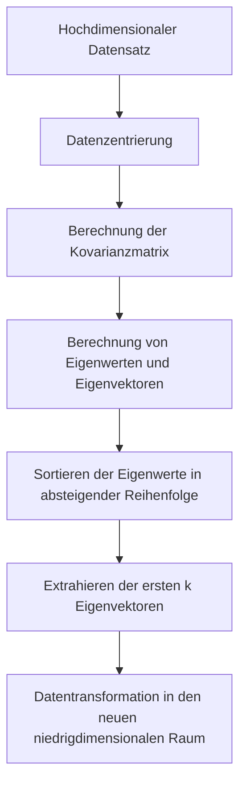

## Einführung

Beim Erlernen der linearen Algebra sind die ersten Hürden, auf die viele Menschen stoßen, möglicherweise die "Matrixmultiplikation" oder die "Determinanten". Jenseits dieser Hürden liegt jedoch die wahre Quelle der immensen Macht der linearen Algebra in der modernen Wissenschaft und Technik: **Eigenwerte** (Eigenvalues) und **Eigenvektoren** (Eigenvectors).

Von der Dimensionsreduktion (PCA) beim maschinellen Lernen und dem PageRank-Algorithmus, der die Google-Suchmaschine angetrieben hat, bis hin zum erdbebensicheren Design von Gebäuden und der Schrödinger-Gleichung in der Quantenmechanik tauchen [Eigenwerte und Eigenvektoren](https://kenji.blog/de/p/eigenvalues-and-eigenvectors/) überall auf.

Das Ziel dieses Artikels ist es nicht nur, mathematischen Formeln zu folgen, sondern ihre "geometrische Bedeutung" intuitiv zu verstehen. Wir erklären umfassend alles von praktischen Berechnungsmethoden bis hin zu realen Anwendungen.

## Lineare Transformationen und geometrische Intuition

Um [Eigenwerte und Eigenvektoren](https://kenji.blog/de/p/eigenvalues-and-eigenvectors/) zu verstehen, müssen Sie zunächst Ihre Perspektive darauf ändern, "was eine Matrix ist". Eine Matrix ist nicht nur ein Gitter von Zahlen. Sie ist ein **Transformator (Transformation)** im Raum.

Die Operation $A\mathbf{v}$, bei der Sie einen Vektor $\mathbf{v}$ mit einer Matrix $A$ multiplizieren, bedeutet die Transformation des Vektors $\mathbf{v}$ in einen anderen, neuen Vektor $\mathbf{v}'$.

$$ \mathbf{v}' = A\mathbf{v} $$

Im Allgemeinen ändern sich "Richtung" und "Größe" eines Vektors, wenn Sie ihn mit einer Matrix multiplizieren. Egal wie sehr jedoch der gesamte Raum verzerrt wird, es kann spezielle Vektoren geben, deren **"Richtung sich überhaupt nicht ändert (oder sich genau umkehrt)"**. Dies sind die **Eigenvektoren**. Und der Skalierungsfaktor, der darstellt, "wie sehr er gestreckt (oder gestaucht) wurde" durch die Transformation, ist der **Eigenwert**.

Geometrisch betrachtet ist das Durchführen einer linearen Transformation, die den Raum streckt oder dreht, nichts anderes als der Prozess der Suche nach Vektoren, die vor und nach der Transformation auf genau derselben Linie bleiben.



## Definition von Eigenwerten und Eigenvektoren und mathematischer Hintergrund

Mathematisch gesehen wird für eine quadratische Matrix $A$, wenn ein Nicht-Null-Vektor $\mathbf{v}$ und ein Skalar $\lambda$ existieren, die die folgende Bedingung erfüllen, $\mathbf{v}$ als **Eigenvektor** der Matrix $A$ bezeichnet, und $\lambda$ als **Eigenwert**.

$$ A\mathbf{v} = \lambda \mathbf{v} $$

Das Wichtige hierbei ist, dass die linke Seite das "Produkt aus einer Matrix und einem Vektor" ist, während die rechte Seite das "Produkt aus einem Skalar und einem Vektor" ist. Die komplexe mehrdimensionale Transformation durch die Matrix reduziert sich auf eine einfache skalare Multiplikation (1D-Skalierung) für bestimmte Richtungen (die Eigenvektoren).

Lassen Sie uns diese Gleichung umschreiben. Sei $I$ die Einheitsmatrix, sodass wir $\mathbf{v} = I\mathbf{v}$ schreiben können:

$$ A\mathbf{v} = \lambda I\mathbf{v} $$
$$ A\mathbf{v} - \lambda I\mathbf{v} = \mathbf{0} $$
$$ (A - \lambda I)\mathbf{v} = \mathbf{0} $$

Die notwendige und hinreichende Bedingung dafür, dass ein Nicht-Null-Vektor $\mathbf{v}$ diese Gleichung erfüllt, ist, dass die Matrix $(A - \lambda I)$ keine Inverse hat, was bedeutet, dass ihre Determinante null sein muss.

$$ \det(A - \lambda I) = 0 $$

Dies wird die **charakteristische Gleichung (Characteristic Equation)** genannt.

## Charakteristische Gleichung und spezifische Berechnungsschritte

Lassen Sie uns nun die [Eigenwerte und Eigenvektoren](https://kenji.blog/de/p/eigenvalues-and-eigenvectors/) mit einer bestimmten $2 \times 2$-Matrix von Hand berechnen. Dies ist ein sehr häufiger Schritt in Klausuren zur linearen Algebra.

Betrachten wir als Beispiel die folgende Matrix $A$:

$$
A = \begin{pmatrix} 4 & 1 \\ 2 & 3 \end{pmatrix}
$$

### Schritt 1: Berechnung der Eigenwerte

Zuerst lösen wir die charakteristische Gleichung $\det(A - \lambda I) = 0$, um die Eigenwerte $\lambda$ zu finden.

$$
A - \lambda I = \begin{pmatrix} 4 & 1 \\ 2 & 3 \end{pmatrix} - \begin{pmatrix} \lambda & 0 \\ 0 & \lambda \end{pmatrix} = \begin{pmatrix} 4-\lambda & 1 \\ 2 & 3-\lambda \end{pmatrix}
$$

Wir berechnen ihre Determinante:

$$
\det(A - \lambda I) = (4-\lambda)(3-\lambda) - (1)(2) = (\lambda^2 - 7\lambda + 12) - 2 = \lambda^2 - 7\lambda + 10
$$

Wir setzen dies auf Null:

$$
\lambda^2 - 7\lambda + 10 = 0
$$

Durch Ausklammern:

$$
(\lambda - 2)(\lambda - 5) = 0
$$

Daher sind die Eigenwerte $\lambda_1 = 2$ und $\lambda_2 = 5$.

### Schritt 2: Berechnung der Eigenvektoren

Für jeden Eigenwert finden wir den entsprechenden Eigenvektor. Wir lösen $(A - \lambda I)\mathbf{v} = \mathbf{0}$. Sei $\mathbf{v} = \begin{pmatrix} x \\ y \end{pmatrix}$.

**Fall 1: Wenn der Eigenwert 2 ist**

$$
(A - 2I) \begin{pmatrix} x \\ y \end{pmatrix} = \begin{pmatrix} 2 & 1 \\ 2 & 1 \end{pmatrix} \begin{pmatrix} x \\ y \end{pmatrix} = \begin{pmatrix} 0 \\ 0 \end{pmatrix}
$$

Dies gibt uns die Gleichung $2x + y = 0$. Da $y = -2x$, kann der Eigenvektor als $\begin{pmatrix} c \\ -2c \end{pmatrix}$ unter Verwendung einer Konstanten $c$ geschrieben werden. Wenn wir die einfachste ganzzahlige Form annehmen, indem wir $x = 1$ setzen:

$$
\mathbf{v}_1 = \begin{pmatrix} 1 \\ -2 \end{pmatrix}
$$

**Fall 2: Wenn der Eigenwert 5 ist**

$$
(A - 5I) \begin{pmatrix} x \\ y \end{pmatrix} = \begin{pmatrix} -1 & 1 \\ 2 & -2 \end{pmatrix} \begin{pmatrix} x \\ y \end{pmatrix} = \begin{pmatrix} 0 \\ 0 \end{pmatrix}
$$

Dies ergibt $-x + y = 0$, was bedeutet, dass $x = y$ ist. Durch Wahl eines einfachen ganzzahligen Verhältnisses wie zuvor ist einer der Eigenvektoren:

$$
\mathbf{v}_2 = \begin{pmatrix} 1 \\ 1 \end{pmatrix}
$$

Jetzt haben wir alle [Eigenwerte und Eigenvektoren](https://kenji.blog/de/p/eigenvalues-and-eigenvectors/) für die Matrix $A$ gefunden.

## Berechnung von Eigenwerten und Eigenvektoren mit Python

In der modernen praktischen Arbeit berechnet man niemals die Eigenwerte von großen Matrizen von Hand. Mit NumPy, einer Bibliothek für numerische Berechnungen in Python, können Sie sie in nur wenigen Codezeilen berechnen.

```python
import numpy as np

# Definition der Matrix A
A = np.array([[4, 1],
              [2, 3]])

# Berechnung der Eigenwerte und Eigenvektoren
eigenvalues, eigenvectors = np.linalg.eig(A)

print("Eigenwerte (Eigenvalues):", eigenvalues)
print("Eigenvektoren (Eigenvectors):\n", eigenvectors)

# Ausgabebeispiel:
# Eigenwerte (Eigenvalues): [5. 2.]
# Eigenvektoren (Eigenvectors):
#  [[ 0.70710678 -0.4472136 ]
#   [ 0.70710678  0.89442719]]
```

Die Funktion `np.linalg.eig` von NumPy gibt normalisierte Eigenvektoren (mit der Länge 1) zurück. Sie können bestätigen, dass es sich um konstante Vielfache der von uns von Hand berechneten Vektoren $\begin{pmatrix} 1 \\ 1 \end{pmatrix}$ und $\begin{pmatrix} 1 \\ -2 \end{pmatrix}$ handelt, was bedeutet, dass sie in genau dieselbe Richtung zeigen.

## Matrixdiagonalisierung und ihre weitreichenden Vorteile

Eine der wichtigsten Anwendungen von Eigenwerten und Eigenvektoren ist die **Matrixdiagonalisierung**. Die Diagonalisierung ist der Prozess, eine komplexe Matrix $A$ unter Verwendung einer leicht berechenbaren Diagonalmatrix $D$ wie folgt zu zerlegen:

$$ A = P D P^{-1} $$

Hierbei ist $P$ eine Matrix, bei der die Eigenvektoren als Spaltenvektoren angeordnet sind, und $D$ ist eine Diagonalmatrix mit den entsprechenden Eigenwerten auf ihrer Diagonale.

Unter Verwendung unseres vorherigen Beispiels:

$$
P = \begin{pmatrix} 1 & 1 \\ -2 & 1 \end{pmatrix}, \quad D = \begin{pmatrix} 2 & 0 \\ 0 & 5 \end{pmatrix}
$$

Warum ist diese Diagonalisierung so wichtig? Weil sie **die Berechnung von Matrixpotenzen drastisch erleichtert**.

Nehmen wir beispielsweise an, Sie möchten $A$ mit 100 potenzieren. Die direkte Berechnung von $A^{100}$ erfordert einen enormen Rechenaufwand. Unter Verwendung der Diagonalisierung gilt jedoch:

$$
A^{100} = (P D P^{-1})(P D P^{-1}) \dots (P D P^{-1}) = P D^{100} P^{-1}
$$

Alle dazwischenliegenden $P^{-1}P$ werden zur Einheitsmatrix $I$ und heben sich gegenseitig auf, was sich auf eine sehr einfache Gleichung reduziert. Um die Diagonalmatrix $D$ zu potenzieren, müssen lediglich ihre Diagonalelemente mit dieser Potenz potenziert werden:

$$
D^{100} = \begin{pmatrix} 2^{100} & 0 \\ 0 & 5^{100} \end{pmatrix}
$$

Diese Eigenschaft ist eine unverzichtbare Technik bei der Vorhersage langfristiger Zustände in Wahrscheinlichkeitsmodellen wie Markov-Ketten, bei der Lösung von Systemen linearer Differentialgleichungen oder sogar bei der Suche nach dem allgemeinen Glied der [Fibonacci](https://kenji.blog/de/p/fibonacci/)-Folge.

## Reale Anwendungen von Eigenwerten und Eigenvektoren

Bisher haben wir die mathematischen Aspekte untersucht, aber diese Konzepte dienen als Motoren zur Lösung verschiedener Herausforderungen in der realen Welt.

### 1. Hauptkomponentenanalyse (PCA) und Datenwissenschaft

In den Bereichen des maschinellen Lernens und der Datenwissenschaft gibt es eine Technik namens **Hauptkomponentenanalyse (PCA)**, die hochdimensionale Daten (z. B. Bilddaten mit Hunderten von Pixeln oder eine große Menge von Benutzerverhaltenshistorien) in eine analysierbare niedrigere Dimension komprimiert.

Bei der PCA berechnen wir die [Eigenwerte und Eigenvektoren](https://kenji.blog/de/p/eigenvalues-and-eigenvectors/) der Kovarianzmatrix der Daten.
- **Eigenvektor**: Repräsentiert die Richtung der "neuen Achse (Hauptkomponente)", in der die Varianz der Daten maximiert wird.
- **Eigenwert**: Repräsentiert die Menge der Varianz (Informationsmenge) der Daten entlang dieser neuen Achse.

Indem wir die Eigenvektoren in absteigender Reihenfolge ihrer Eigenwerte auswählen, können wir die Dimensionen der Daten reduzieren und gleichzeitig den Informationsverlust minimieren. Dies ermöglicht die Datenvisualisierung, beschleunigt das Training von Modellen des maschinellen Lernens und entfernt Rauschen.



### 2. Der PageRank-Algorithmus von Google

In den Anfängen des Internets war der Algorithmus, der die Google-Suchmaschine an die Weltspitze brachte, **PageRank**. Er stellte die Linkstruktur zwischen Webseiten als eine massive Matrix dar und modellierte mathematisch die Idee, dass "Seiten, auf die von wichtigen Seiten verlinkt wird, ebenfalls wichtig sind".

Erstaunlicherweise ist der "Wichtigkeitswert" jeder Webseite genau der **Eigenvektor, der dem größten Eigenwert von 1** für diese riesige Linkmatrix (oder Übergangswahrscheinlichkeitsmatrix) entspricht. Das ursprüngliche System von Google war eine massive iterative Berechnungsmaschine, die darauf abzielte, den Eigenvektor einer Matrix mit Milliarden von Dimensionen zu finden.

### 3. Quantenmechanik und physikalische Systeme

In der Welt der Physik, insbesondere in der Quantenmechanik, werden beobachtbare physikalische Größen (wie Energie und Impuls) als "hermitesche Operatoren (Matrizen)" dargestellt. Und die durch Beobachtung ermittelten möglichen Messwerte sind die **Eigenwerte** dieses Operators, und der [Zustand](https://kenji.blog/de/p/state-management-history-redux-context-recoil-zustand/) des Systems nach der Messung wird zum entsprechenden **Eigenvektor** (Eigenzustand).

Die berühmte Schrödinger-Gleichung:

$$ \hat{H}\psi = E\psi $$

Diese Gleichung ist nichts anderes als ein Eigenwertproblem für den Hamilton-Operator $\hat{H}$ (den Energieoperator). Hier ist $E$ der Energieeigenwert und $\psi$ ist die Wellenfunktion (Eigenzustand).

Auch in der klassischen Physik, wie bei der Schwingungsanalyse von Brücken und Gebäuden oder in der Akustik, sind Eigenwerte unerlässlich, um "Eigenfrequenzen (Resonanzfrequenzen)" darzustellen, während Eigenvektoren "Schwingungsmoden (Formen des Schwankens)" darstellen. Während der Konstruktion wird eine Eigenwertanalyse durchgeführt, um sicherzustellen, dass bestimmte Eigenfrequenzen nicht mit den Frequenzen äußerer Kräfte (wie Wind oder Erdbeben) übereinstimmen, um ein Resonanzversagen zu verhindern.

## Fazit

Auf den ersten Blick mögen [Eigenwerte und Eigenvektoren](https://kenji.blog/de/p/eigenvalues-and-eigenvectors/) wie abstrakte mathematische Rätsel erscheinen. Geometrisch betrachtet handelt es sich jedoch um die Operation der Extraktion der "wesentlichen Achsen, die sich bei komplexen Transformationen durch Matrizen niemals ändern", und ihre Anwendungen reichen von Informatik über Datenwissenschaft bis hin zur theoretischen Physik und dem Maschinenbau.

- **Eigenvektor**: Die wesentliche Richtung oder der Modus eines Systems, das seine Ausrichtung nach einer Transformation nicht ändert.
- **Eigenwert**: Der Skalierungsfaktor (Wichtigkeit, Energie, Frequenz usw.), der darstellt, wie sehr diese Richtung durch die Transformation gestreckt oder gestaucht wird.

Wenn Sie dieses intuitive Bild im Hinterkopf behalten, werden Sie erkennen, dass die lineare Algebra nicht nur eine Liste von Berechnungsregeln ist, sondern eine extrem mächtige Sprache, um unsere komplexe Welt einfach zu beschreiben und ihre verborgenen Strukturen aufzudecken. Wenn Sie fortgeschrittenere Mathematik oder Algorithmen für maschinelles Lernen erlernen, werden diese grundlegenden Konzepte zu Ihren zuverlässigsten Waffen.
