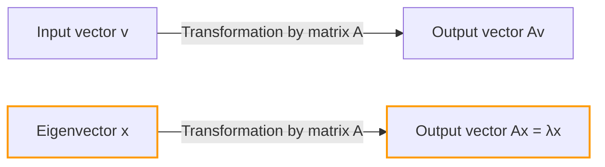
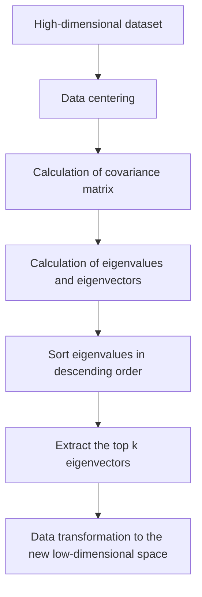

## Introduction

When learning linear algebra, the first hurdles many people face might be "matrix multiplication" or "determinants". However, beyond those lies the true source of linear algebra's immense power in modern science and engineering: **eigenvalues** and **eigenvectors**.

From dimensionality reduction (PCA) in machine learning and the PageRank algorithm that powered Google's search engine, to the seismic design of buildings and the Schrödinger equation in quantum mechanics, eigenvalues and eigenvectors make an appearance everywhere. 

In this article, our goal is not just to follow the math formulas but to intuitively understand their "geometric meaning". We will comprehensively explain everything from practical calculation methods to real-world applications.

## Linear Transformations and Geometric Intuition

To understand eigenvalues and eigenvectors, you first need to shift your perspective on "what a matrix is". A matrix is not just a grid of numbers. It is a **transformation** in space.

The operation $A\mathbf{v}$, where you multiply a vector $\mathbf{v}$ by a matrix $A$, means transforming the vector $\mathbf{v}$ into a new vector $\mathbf{v}'$.

$$ \mathbf{v}' = A\mathbf{v} $$

Generally, when you multiply a vector by a matrix, both its "direction" and "magnitude" change. However, no matter how the entire space is distorted, there may be special vectors whose **"direction does not change at all (or exactly reverses)"**. These are the **eigenvectors**. And the scale factor representing "how much it was stretched (or shrunk)" by the transformation is the **eigenvalue**.

Geometrically, when performing a linear transformation that stretches or rotates space, it is nothing more than the process of finding vectors that stay on the exact same line before and after the transformation.



## Definition of [Eigenvalues and Eigenvectors](https://kenji.blog/en/p/eigenvalues-and-eigenvectors/) and Mathematical Background

Mathematically, for a square matrix $A$, if there exists a non-zero vector $\mathbf{v}$ and a scalar $\lambda$ that satisfy the following condition, $\mathbf{v}$ is called an **eigenvector** of matrix $A$, and $\lambda$ is called an **eigenvalue**.

$$ A\mathbf{v} = \lambda \mathbf{v} $$

What is important here is that the left side is a "product of a matrix and a vector", while the right side is a "product of a scalar and a vector". The complex multi-dimensional transformation by the matrix is reduced to a simple scalar multiplication (1D scaling) for specific directions (eigenvectors).

Let's rewrite this equation. Let $I$ be the identity matrix, so we can write $\mathbf{v} = I\mathbf{v}$:

$$ A\mathbf{v} = \lambda I\mathbf{v} $$
$$ A\mathbf{v} - \lambda I\mathbf{v} = \mathbf{0} $$
$$ (A - \lambda I)\mathbf{v} = \mathbf{0} $$

The necessary and sufficient condition for a non-zero vector $\mathbf{v}$ to satisfy this equation is that the matrix $(A - \lambda I)$ does not have an inverse, meaning its determinant must be zero.

$$ \det(A - \lambda I) = 0 $$

This is called the **Characteristic Equation**.

## Characteristic Equation and Specific Calculation Steps

Now, let's calculate the eigenvalues and eigenvectors by hand using a specific $2 \times 2$ matrix. This is a very common step in linear algebra exams.

As an example, consider the following matrix $A$:

$$
A = \begin{pmatrix} 4 & 1 \\ 2 & 3 \end{pmatrix}
$$

### Step 1: Calculating the Eigenvalues

First, we solve the characteristic equation $\det(A - \lambda I) = 0$ to find the eigenvalues $\lambda$.

$$
A - \lambda I = \begin{pmatrix} 4 & 1 \\ 2 & 3 \end{pmatrix} - \begin{pmatrix} \lambda & 0 \\ 0 & \lambda \end{pmatrix} = \begin{pmatrix} 4-\lambda & 1 \\ 2 & 3-\lambda \end{pmatrix}
$$

We calculate the determinant:

$$
\det(A - \lambda I) = (4-\lambda)(3-\lambda) - (1)(2) = (\lambda^2 - 7\lambda + 12) - 2 = \lambda^2 - 7\lambda + 10
$$

We set this to zero:

$$
\lambda^2 - 7\lambda + 10 = 0
$$

By factoring it out:

$$
(\lambda - 2)(\lambda - 5) = 0
$$

Therefore, the eigenvalues are $\lambda_1 = 2$ and $\lambda_2 = 5$.

### Step 2: Calculating the Eigenvectors

For each eigenvalue, we find the eigenvector. We solve $(A - \lambda I)\mathbf{v} = \mathbf{0}$. Let $\mathbf{v} = \begin{pmatrix} x \\ y \end{pmatrix}$.

**Case 1: When the eigenvalue is 2**

$$
(A - 2I) \begin{pmatrix} x \\ y \end{pmatrix} = \begin{pmatrix} 2 & 1 \\ 2 & 1 \end{pmatrix} \begin{pmatrix} x \\ y \end{pmatrix} = \begin{pmatrix} 0 \\ 0 \end{pmatrix}
$$

This gives us the equation $2x + y = 0$. Since $y = -2x$, the eigenvector can be written as $\begin{pmatrix} c \\ -2c \end{pmatrix}$ using a constant $c$. Taking the simplest form by setting $x = 1$:

$$
\mathbf{v}_1 = \begin{pmatrix} 1 \\ -2 \end{pmatrix}
$$

**Case 2: When the eigenvalue is 5**

$$
(A - 5I) \begin{pmatrix} x \\ y \end{pmatrix} = \begin{pmatrix} -1 & 1 \\ 2 & -2 \end{pmatrix} \begin{pmatrix} x \\ y \end{pmatrix} = \begin{pmatrix} 0 \\ 0 \end{pmatrix}
$$

This gives $-x + y = 0$, meaning $x = y$. Choosing a simple integer ratio as before, one of the eigenvectors is:

$$
\mathbf{v}_2 = \begin{pmatrix} 1 \\ 1 \end{pmatrix}
$$

Now, we have found all the eigenvalues and eigenvectors for matrix $A$.

## Calculating [Eigenvalues and Eigenvectors](https://kenji.blog/en/p/eigenvalues-and-eigenvectors/) with Python

In modern practical work, you never calculate the eigenvalues of large matrices by hand. Using NumPy, a numerical computation library in Python, you can calculate them in just a few lines.

```python
import numpy as np

# Definition of matrix A
A = np.array([[4, 1],
              [2, 3]])

# Calculate eigenvalues and eigenvectors
eigenvalues, eigenvectors = np.linalg.eig(A)

print("Eigenvalues:", eigenvalues)
print("Eigenvectors:\n", eigenvectors)

# Output example:
# Eigenvalues: [5. 2.]
# Eigenvectors:
#  [[ 0.70710678 -0.4472136 ]
#   [ 0.70710678  0.89442719]]
```

NumPy's `np.linalg.eig` function returns normalized eigenvectors (with a length of 1). You can confirm they are scalar multiples of the vectors $\begin{pmatrix} 1 \\ 1 \end{pmatrix}$ and $\begin{pmatrix} 1 \\ -2 \end{pmatrix}$ we calculated by hand, meaning they point in the exact same directions.

## Matrix Diagonalization and Its Powerful Benefits

One of the most important applications of eigenvalues and eigenvectors is **matrix diagonalization**. Diagonalization is the process of decomposing a complex matrix $A$ using an easily calculable diagonal matrix $D$ as follows:

$$ A = P D P^{-1} $$

Here, $P$ is a matrix with the eigenvectors arranged as column vectors, and $D$ is a diagonal matrix with the corresponding eigenvalues on its diagonal.

Using our previous example:

$$
P = \begin{pmatrix} 1 & 1 \\ -2 & 1 \end{pmatrix}, \quad D = \begin{pmatrix} 2 & 0 \\ 0 & 5 \end{pmatrix}
$$

Why is this diagonalization so important? Because **it makes calculating matrix powers dramatically easier**.

For instance, suppose you want to calculate $A$ to the power of 100. Calculating $A^{100}$ directly is an enormous amount of computation. However, using diagonalization:

$$
A^{100} = (P D P^{-1})(P D P^{-1}) \dots (P D P^{-1}) = P D^{100} P^{-1}
$$

All the intermediate $P^{-1}P$ pairs become the identity matrix $I$ and cancel out, reducing it to a very simple equation. Raising the diagonal matrix $D$ to a power simply requires raising its diagonal elements to that power:

$$
D^{100} = \begin{pmatrix} 2^{100} & 0 \\ 0 & 5^{100} \end{pmatrix}
$$

This property is an indispensable technique when predicting long-term states in probability models like Markov chains, when solving systems of differential equations, or even when finding the general term of the Fibonacci sequence.

## Real-World Applications of [Eigenvalues and Eigenvectors](https://kenji.blog/en/p/eigenvalues-and-eigenvectors/)

We have looked at the mathematical aspects so far, but these concepts serve as the engines that solve various real-world problems.

### 1. Principal Component Analysis (PCA) and Data Science

In the fields of machine learning and data science, there is a technique called **Principal Component Analysis (PCA)** which compresses high-dimensional data (for example, image data with hundreds of pixels or large amounts of user behavior history) into a lower dimension that can be analyzed.

In PCA, we calculate the eigenvalues and eigenvectors of the data's covariance matrix.
- **Eigenvector**: Represents the direction of the "new axis (principal component)" where the data's variance is maximized.
- **Eigenvalue**: Represents the amount of variance (amount of information) of the data along that new axis.

By selecting the eigenvectors in descending order of their eigenvalues, we can reduce the dimensions of the data while minimizing information loss. This enables data visualization, speeds up the training of machine learning models, and removes noise.



### 2. Google's PageRank Algorithm

During the dawn of the internet, the algorithm that propelled Google's search engine to the top of the world was **PageRank**. It represented the link structure between web pages as a massive matrix and mathematically modeled the idea that "pages linked from important pages are also important."

Surprisingly, the "importance score" of each web page is precisely the **eigenvector corresponding to the largest eigenvalue of 1** for this giant link matrix (or transition probability matrix). Google's initial system was a massive iterative calculation engine dedicated to finding the eigenvector of a matrix with billions of dimensions.

### 3. Quantum Mechanics and Physical Systems

In the realm of physics, especially in quantum mechanics, observable physical quantities (such as energy and momentum) are represented as "Hermitian operators (matrices)". And the possible measurement values obtained by observation are the **eigenvalues** of that operator, and the state of the system after the measurement becomes the corresponding **eigenvector** (eigenstate).

The famous Schrödinger equation:

$$ \hat{H}\psi = E\psi $$

This equation is nothing more than an eigenvalue problem for the Hamiltonian $\hat{H}$ (the energy operator). Here, $E$ is the energy eigenvalue, and $\psi$ is the wave function (eigenstate).

Also, in classical physics, such as vibration analysis of bridges and buildings, or in acoustics, eigenvalues are indispensable for representing "natural frequencies (resonance frequencies)", while eigenvectors represent "vibration modes (shapes of swaying)". During design, eigenvalue analysis is performed to ensure that specific natural frequencies do not match the frequencies of external forces (like wind or earthquakes) to prevent resonance failure.

## Conclusion

At first glance, eigenvalues and eigenvectors might seem like abstract mathematical puzzles. Geometrically, however, it is the operation of extracting the "essential axes that never change amidst complex transformations by matrices", and its applications range widely across computer science, data science, theoretical physics, and mechanical engineering.

- **Eigenvector**: The essential direction or mode of a system that does not change its orientation after a transformation.
- **Eigenvalue**: The scale factor (importance, energy, frequency, etc.) representing how much that direction is expanded or contracted by the transformation.

By keeping this intuitive image in mind, you will come to see that linear algebra is not just a list of calculation rules, but an extremely powerful language for simply describing our complex world and uncovering its hidden structures. When learning more advanced mathematics or machine learning algorithms, these fundamental concepts will become your most reliable weapons.
