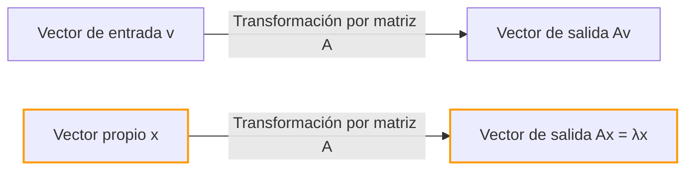
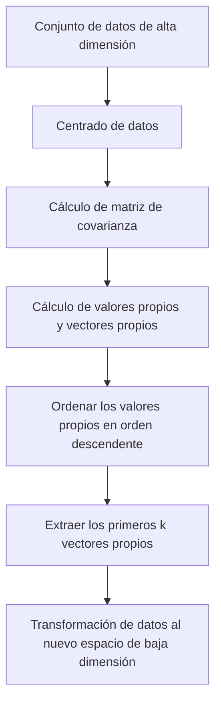

## Introducción

Al aprender álgebra lineal, los primeros obstáculos a los que se enfrentan muchas personas pueden ser la "multiplicación de matrices" o los "determinantes". Sin embargo, más allá de esos obstáculos se encuentra la verdadera fuente del inmenso poder del álgebra lineal en la ciencia y la ingeniería modernas: los **valores propios** (Eigenvalues) y los **vectores propios** (Eigenvectors).

Desde la reducción de dimensionalidad (PCA) en el aprendizaje automático y el algoritmo PageRank que impulsó el motor de búsqueda de Google, hasta el diseño sísmico de edificios y la ecuación de Schrödinger en mecánica cuántica, los valores propios y los vectores propios aparecen en todas partes.

El objetivo de este artículo no es solo seguir las fórmulas matemáticas, sino comprender intuitivamente su "significado geométrico". Explicaremos de manera exhaustiva todo, desde los métodos de cálculo prácticos hasta sus aplicaciones en el mundo real.

## Transformaciones lineales e intuición geométrica

Para comprender los valores propios y los vectores propios, primero debe cambiar su perspectiva sobre "qué es una matriz". Una matriz no es solo una cuadrícula de números. Es un **transformador (Transformation)** en el espacio.

La operación $A\mathbf{v}$, donde se multiplica un vector $\mathbf{v}$ por una matriz $A$, significa transformar el vector $\mathbf{v}$ en un nuevo vector $\mathbf{v}'$.

$$ \mathbf{v}' = A\mathbf{v} $$

Generalmente, cuando se multiplica un vector por una matriz, tanto su "dirección" como su "magnitud" cambian. Sin embargo, no importa cómo se distorsione todo el espacio, pueden existir vectores especiales cuya **"dirección no cambia en absoluto (o se invierte exactamente)"**. Estos son los **vectores propios**. Y el factor de escala que representa "cuánto fue estirado (o encogido)" por la transformación es el **valor propio**.

Geométricamente, al realizar una transformación lineal que estira o rota el espacio, no es más que el proceso de encontrar vectores que permanecen en la misma línea antes y después de la transformación.



## Definición de valores propios y vectores propios y antecedentes matemáticos

Matemáticamente, para una matriz cuadrada $A$, si existe un vector distinto de cero $\mathbf{v}$ y un escalar $\lambda$ que satisfagan la siguiente condición, $\mathbf{v}$ se denomina **vector propio** de la matriz $A$, y $\lambda$ se denomina **valor propio**.

$$ A\mathbf{v} = \lambda \mathbf{v} $$

Lo importante aquí es que el lado izquierdo es el "producto de una matriz y un vector", mientras que el lado derecho es el "producto de un escalar y un vector". La compleja transformación multidimensional de la matriz se reduce a una simple multiplicación escalar (escala 1D) para direcciones específicas (los vectores propios).

Reescribamos esta ecuación. Sea $I$ la matriz identidad, por lo que podemos escribir $\mathbf{v} = I\mathbf{v}$:

$$ A\mathbf{v} = \lambda I\mathbf{v} $$
$$ A\mathbf{v} - \lambda I\mathbf{v} = \mathbf{0} $$
$$ (A - \lambda I)\mathbf{v} = \mathbf{0} $$

La condición necesaria y suficiente para que un vector distinto de cero $\mathbf{v}$ satisfaga esta ecuación es que la matriz $(A - \lambda I)$ no tenga inversa, lo que significa que su determinante debe ser cero.

$$ \det(A - \lambda I) = 0 $$

A esto se le llama **ecuación característica (Characteristic Equation)**.

## Ecuación característica y pasos de cálculo específicos

Ahora, calculemos los valores propios y los vectores propios a mano utilizando una matriz específica de $2 \times 2$. Este es un paso muy común en los exámenes de álgebra lineal.

Como ejemplo, consideremos la siguiente matriz $A$:

$$
A = \begin{pmatrix} 4 & 1 \\ 2 & 3 \end{pmatrix}
$$

### Paso 1: Cálculo de los valores propios

Primero, resolvemos la ecuación característica $\det(A - \lambda I) = 0$ para encontrar los valores propios $\lambda$.

$$
A - \lambda I = \begin{pmatrix} 4 & 1 \\ 2 & 3 \end{pmatrix} - \begin{pmatrix} \lambda & 0 \\ 0 & \lambda \end{pmatrix} = \begin{pmatrix} 4-\lambda & 1 \\ 2 & 3-\lambda \end{pmatrix}
$$

Calculamos su determinante:

$$
\det(A - \lambda I) = (4-\lambda)(3-\lambda) - (1)(2) = (\lambda^2 - 7\lambda + 12) - 2 = \lambda^2 - 7\lambda + 10
$$

Igualamos esto a cero:

$$
\lambda^2 - 7\lambda + 10 = 0
$$

Al factorizarlo:

$$
(\lambda - 2)(\lambda - 5) = 0
$$

Por lo tanto, los valores propios son $\lambda_1 = 2$ y $\lambda_2 = 5$.

### Paso 2: Cálculo de los vectores propios

Para cada valor propio, encontramos el vector propio correspondiente. Resolvemos $(A - \lambda I)\mathbf{v} = \mathbf{0}$. Sea $\mathbf{v} = \begin{pmatrix} x \\ y \end{pmatrix}$.

**Caso 1: Cuando el valor propio es 2**

$$
(A - 2I) \begin{pmatrix} x \\ y \end{pmatrix} = \begin{pmatrix} 2 & 1 \\ 2 & 1 \end{pmatrix} \begin{pmatrix} x \\ y \end{pmatrix} = \begin{pmatrix} 0 \\ 0 \end{pmatrix}
$$

Esto nos da la ecuación $2x + y = 0$. Como $y = -2x$, el vector propio se puede escribir como $\begin{pmatrix} c \\ -2c \end{pmatrix}$ usando una constante $c$. Tomando la forma entera más simple estableciendo $x = 1$:

$$
\mathbf{v}_1 = \begin{pmatrix} 1 \\ -2 \end{pmatrix}
$$

**Caso 2: Cuando el valor propio es 5**

$$
(A - 5I) \begin{pmatrix} x \\ y \end{pmatrix} = \begin{pmatrix} -1 & 1 \\ 2 & -2 \end{pmatrix} \begin{pmatrix} x \\ y \end{pmatrix} = \begin{pmatrix} 0 \\ 0 \end{pmatrix}
$$

Esto da $-x + y = 0$, lo que significa $x = y$. Eligiendo una proporción de enteros simple como antes, uno de los vectores propios es:

$$
\mathbf{v}_2 = \begin{pmatrix} 1 \\ 1 \end{pmatrix}
$$

Ahora, hemos encontrado todos los valores propios y los vectores propios de la matriz $A$.

## Cálculo de valores propios y vectores propios con Python

En el trabajo práctico moderno, nunca se calculan a mano los valores propios de matrices grandes. Usando NumPy, una biblioteca de cálculo numérico en Python, puede calcularlos en solo unas pocas líneas de código.

```python
import numpy as np

# Definición de la matriz A
A = np.array([[4, 1],
              [2, 3]])

# Calcular valores propios y vectores propios
eigenvalues, eigenvectors = np.linalg.eig(A)

print("Valores propios (Eigenvalues):", eigenvalues)
print("Vectores propios (Eigenvectors):\n", eigenvectors)

# Ejemplo de salida:
# Valores propios (Eigenvalues): [5. 2.]
# Vectores propios (Eigenvectors):
#  [[ 0.70710678 -0.4472136 ]
#   [ 0.70710678  0.89442719]]
```

La función `np.linalg.eig` de NumPy devuelve vectores propios normalizados (con una longitud de 1). Puede confirmar que son múltiplos constantes de los vectores $\begin{pmatrix} 1 \\ 1 \end{pmatrix}$ y $\begin{pmatrix} 1 \\ -2 \end{pmatrix}$ que calculamos a mano, lo que confirma que apuntan exactamente en la misma dirección.

## Diagonalización de matrices y sus poderosos beneficios

Una de las aplicaciones más importantes de los valores propios y vectores propios es la **diagonalización de matrices**. La diagonalización es el proceso de descomponer una matriz compleja $A$ utilizando una matriz diagonal $D$ fácilmente calculable de la siguiente manera:

$$ A = P D P^{-1} $$

Aquí, $P$ es una matriz donde los vectores propios están dispuestos como vectores columna, y $D$ es una matriz diagonal con los valores propios correspondientes en su diagonal.

Usando nuestro ejemplo anterior:

$$
P = \begin{pmatrix} 1 & 1 \\ -2 & 1 \end{pmatrix}, \quad D = \begin{pmatrix} 2 & 0 \\ 0 & 5 \end{pmatrix}
$$

¿Por qué es tan importante esta diagonalización? Porque **hace que calcular las potencias de matrices sea dramáticamente más fácil**.

Por ejemplo, supongamos que desea calcular $A$ a la potencia de 100. Calcular $A^{100}$ directamente requiere una cantidad enorme de cálculo. Sin embargo, usando la diagonalización:

$$
A^{100} = (P D P^{-1})(P D P^{-1}) \dots (P D P^{-1}) = P D^{100} P^{-1}
$$

Todos los $P^{-1}P$ intermedios se convierten en la matriz identidad $I$ y se cancelan, reduciéndose a una ecuación muy simple. Elevar la matriz diagonal $D$ a una potencia simplemente requiere elevar sus elementos diagonales a esa potencia:

$$
D^{100} = \begin{pmatrix} 2^{100} & 0 \\ 0 & 5^{100} \end{pmatrix}
$$

Esta propiedad es una técnica indispensable al predecir estados a largo plazo en modelos de probabilidad como las cadenas de Markov, al resolver sistemas de ecuaciones diferenciales, o incluso al buscar el término general de la secuencia de [Fibonacci](https://kenji.blog/es/p/fibonacci/).

## Aplicaciones en el mundo real de los valores propios y vectores propios

Hasta ahora hemos analizado los aspectos matemáticos, pero estos conceptos actúan como motores para resolver diversos desafíos en el mundo real.

### 1. Análisis de componentes principales (PCA) y ciencia de datos

En los campos del aprendizaje automático y la ciencia de datos, existe una técnica llamada **Análisis de componentes principales (PCA)** que comprime datos de alta dimensión (por ejemplo, datos de imágenes con cientos de píxeles o una gran cantidad de historiales de comportamiento del usuario) en una dimensión inferior analizable.

En PCA, calculamos los valores propios y vectores propios de la matriz de covarianza de los datos.
- **Vector propio**: Representa la dirección del "nuevo eje (componente principal)" donde se maximiza la varianza de los datos.
- **Valor propio**: Representa la cantidad de varianza (cantidad de información) de los datos a lo largo de ese nuevo eje.

Al seleccionar los vectores propios en orden descendente de sus valores propios, podemos reducir las dimensiones de los datos y minimizar la pérdida de información. Esto permite la visualización de datos, acelera el entrenamiento de modelos de aprendizaje automático y elimina el ruido.



### 2. Algoritmo PageRank de Google

En los albores de Internet, el algoritmo que impulsó al motor de búsqueda de Google al número uno del mundo fue **PageRank**. Representaba la estructura de enlaces entre páginas web como una matriz enorme y modelaba matemáticamente la idea de que "las páginas enlazadas desde páginas importantes también son importantes".

Sorprendentemente, la "puntuación de importancia" de cada página web es precisamente el **vector propio correspondiente al valor propio más grande de 1** para esta matriz de enlaces gigante (o matriz de probabilidad de transición). El sistema inicial de Google era un enorme motor de cálculo iterativo dedicado a buscar el vector propio de una matriz con miles de millones de dimensiones.

### 3. Mecánica cuántica y sistemas físicos

En el mundo de la física, especialmente en la mecánica cuántica, las cantidades físicas observables (como la energía y el momento) se representan como "operadores hermitianos (matrices)". Y los posibles valores de medición obtenidos por observación son los **valores propios** de ese operador, y el estado del sistema después de la medición se convierte en el **vector propio** correspondiente (estado propio).

La famosa ecuación de Schrödinger:

$$ \hat{H}\psi = E\psi $$

Esta ecuación no es más que un problema de valor propio para el Hamiltoniano $\hat{H}$ (el operador de energía). Aquí, $E$ es el valor propio de la energía, y $\psi$ es la función de onda (estado propio).

También, en la física clásica, como el análisis de vibración de puentes y edificios, o en acústica, los valores propios son indispensables para representar "frecuencias naturales (frecuencias de resonancia)", mientras que los vectores propios representan "modos de vibración (formas de balanceo)". Durante el diseño, se realiza un análisis de valores propios para asegurar que las frecuencias naturales específicas no coincidan con las frecuencias de fuerzas externas (como el viento o los terremotos) para prevenir fallas por resonancia.

## Conclusión

A primera vista, los valores propios y los vectores propios pueden parecer acertijos matemáticos abstractos. Geométricamente, sin embargo, es la operación de extraer los "ejes esenciales que nunca cambian en medio de complejas transformaciones por matrices", y sus aplicaciones van desde la informática hasta la ciencia de datos, la física teórica y la ingeniería mecánica.

- **Vector propio**: La dirección o el modo esencial de un sistema que no cambia de orientación después de una transformación.
- **Valor propio**: El factor de escala (importancia, energía, frecuencia, etc.) que representa cuánto se estira o reduce esa dirección por la transformación.

Teniendo en mente esta imagen intuitiva, verá que el álgebra lineal no es solo una lista de reglas de cálculo, sino un lenguaje extremadamente poderoso para describir simplemente nuestro complejo mundo y descubrir sus estructuras ocultas. Al aprender matemáticas más avanzadas o algoritmos de aprendizaje automático, estos conceptos fundamentales se convertirán en sus armas más confiables.
