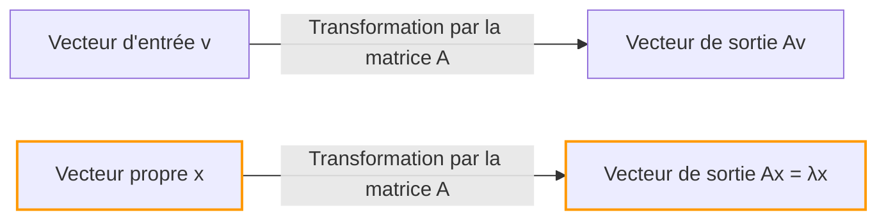
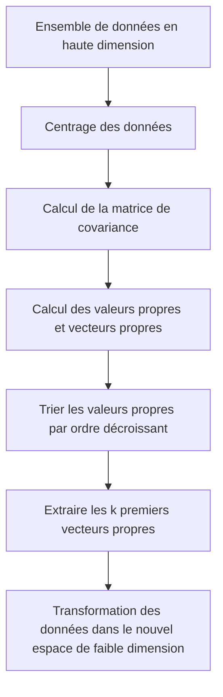

## Introduction

Lors de l'apprentissage de l'algèbre linéaire, le premier obstacle que beaucoup rencontrent est la "multiplication de matrices" ou les "déterminants". Cependant, au-delà de ces obstacles se trouve la véritable source de l'immense pouvoir de l'algèbre linéaire dans la science et l'ingénierie modernes : les **valeurs propres** (Eigenvalues) et les **vecteurs propres** (Eigenvectors).

De la réduction de dimension (ACP) en apprentissage automatique et l'algorithme PageRank qui a propulsé le moteur de recherche de Google, jusqu'à la conception parasismique des bâtiments et l'équation de Schrödinger en mécanique quantique, les valeurs propres et les vecteurs propres apparaissent partout.

L'objectif de cet article n'est pas seulement de suivre des formules mathématiques, mais de comprendre intuitivement leur "signification géométrique". Nous expliquerons de manière exhaustive tout, des méthodes de calcul pratiques aux applications dans le monde réel.

## Transformations linéaires et intuition géométrique

Pour comprendre les valeurs propres et les vecteurs propres, vous devez d'abord changer votre perspective sur ce qu'est une matrice. Une matrice n'est pas qu'une simple grille de nombres. C'est un **transformateur (Transformation)** dans l'espace.

L'opération $A\mathbf{v}$, où vous multipliez un vecteur $\mathbf{v}$ par une matrice $A$, signifie transformer le vecteur $\mathbf{v}$ en un autre nouveau vecteur $\mathbf{v}'$.

$$ \mathbf{v}' = A\mathbf{v} $$

Généralement, lorsque vous multipliez un vecteur par une matrice, sa "direction" et sa "taille" changent. Cependant, peu importe comment tout l'espace est déformé, il peut exister des vecteurs spéciaux dont **"la direction ne change pas du tout (ou s'inverse exactement)"**. Ce sont les **vecteurs propres**. Et le facteur d'échelle représentant "combien il a été étiré (ou rétréci)" par la transformation est la **valeur propre**.

Géométriquement, lors de l'exécution d'une transformation linéaire qui étire ou fait tourner l'espace, ce n'est rien d'autre que le processus de recherche de vecteurs qui restent sur la même ligne avant et après la transformation.



## Définition des valeurs propres et des vecteurs propres et contexte mathématique

Mathématiquement, pour une matrice carrée $A$, s'il existe un vecteur non nul $\mathbf{v}$ et un scalaire $\lambda$ qui satisfont à la condition suivante, $\mathbf{v}$ est appelé un **vecteur propre** de la matrice $A$, et $\lambda$ est appelé une **valeur propre**.

$$ A\mathbf{v} = \lambda \mathbf{v} $$

Ce qui est important ici, c'est que le côté gauche est le "produit d'une matrice et d'un vecteur", tandis que le côté droit est le "produit d'un scalaire et d'un vecteur". La transformation multidimensionnelle complexe de la matrice se réduit à une simple multiplication scalaire (mise à l'échelle 1D) pour des directions spécifiques (les vecteurs propres).

Modifions cette équation. Soit $I$ la matrice identité, nous pouvons donc écrire $\mathbf{v} = I\mathbf{v}$ :

$$ A\mathbf{v} = \lambda I\mathbf{v} $$
$$ A\mathbf{v} - \lambda I\mathbf{v} = \mathbf{0} $$
$$ (A - \lambda I)\mathbf{v} = \mathbf{0} $$

La condition nécessaire et suffisante pour qu'un vecteur non nul $\mathbf{v}$ satisfasse cette équation est que la matrice $(A - \lambda I)$ n'ait pas d'inverse, ce qui signifie que son déterminant doit être nul.

$$ \det(A - \lambda I) = 0 $$

Ceci est appelé l'**équation caractéristique (Characteristic Equation)**.

## Équation caractéristique et étapes de calcul spécifiques

Maintenant, calculons manuellement les valeurs propres et les vecteurs propres en utilisant une matrice $2 \times 2$ spécifique. C'est une étape très courante dans les examens d'algèbre linéaire.

À titre d'exemple, considérons la matrice $A$ suivante :

$$
A = \begin{pmatrix} 4 & 1 \\ 2 & 3 \end{pmatrix}
$$

### Étape 1 : Calcul des valeurs propres

Tout d'abord, nous résolvons l'équation caractéristique $\det(A - \lambda I) = 0$ pour trouver les valeurs propres $\lambda$.

$$
A - \lambda I = \begin{pmatrix} 4 & 1 \\ 2 & 3 \end{pmatrix} - \begin{pmatrix} \lambda & 0 \\ 0 & \lambda \end{pmatrix} = \begin{pmatrix} 4-\lambda & 1 \\ 2 & 3-\lambda \end{pmatrix}
$$

Nous calculons son déterminant :

$$
\det(A - \lambda I) = (4-\lambda)(3-\lambda) - (1)(2) = (\lambda^2 - 7\lambda + 12) - 2 = \lambda^2 - 7\lambda + 10
$$

Nous mettons cela à zéro :

$$
\lambda^2 - 7\lambda + 10 = 0
$$

En factorisant :

$$
(\lambda - 2)(\lambda - 5) = 0
$$

Par conséquent, les valeurs propres sont $\lambda_1 = 2$ et $\lambda_2 = 5$.

### Étape 2 : Calcul des vecteurs propres

Pour chaque valeur propre, nous trouvons le vecteur propre correspondant. Nous résolvons $(A - \lambda I)\mathbf{v} = \mathbf{0}$. Soit $\mathbf{v} = \begin{pmatrix} x \\ y \end{pmatrix}$.

**Cas 1 : Lorsque la valeur propre est de 2**

$$
(A - 2I) \begin{pmatrix} x \\ y \end{pmatrix} = \begin{pmatrix} 2 & 1 \\ 2 & 1 \end{pmatrix} \begin{pmatrix} x \\ y \end{pmatrix} = \begin{pmatrix} 0 \\ 0 \end{pmatrix}
$$

Cela nous donne l'équation $2x + y = 0$. Puisque $y = -2x$, le vecteur propre peut s'écrire comme $\begin{pmatrix} c \\ -2c \end{pmatrix}$ en utilisant une constante $c$. En prenant la forme entière la plus simple en définissant $x = 1$ :

$$
\mathbf{v}_1 = \begin{pmatrix} 1 \\ -2 \end{pmatrix}
$$

**Cas 2 : Lorsque la valeur propre est de 5**

$$
(A - 5I) \begin{pmatrix} x \\ y \end{pmatrix} = \begin{pmatrix} -1 & 1 \\ 2 & -2 \end{pmatrix} \begin{pmatrix} x \\ y \end{pmatrix} = \begin{pmatrix} 0 \\ 0 \end{pmatrix}
$$

Cela donne $-x + y = 0$, ce qui signifie $x = y$. En choisissant un rapport d'entier simple comme précédemment, un des vecteurs propres est :

$$
\mathbf{v}_2 = \begin{pmatrix} 1 \\ 1 \end{pmatrix}
$$

Maintenant, nous avons trouvé toutes les valeurs propres et les vecteurs propres pour la matrice $A$.

## Calcul des valeurs propres et des vecteurs propres avec Python

Dans le travail pratique moderne, on ne calcule jamais manuellement les valeurs propres de grandes matrices. En utilisant NumPy, une bibliothèque de calcul numérique en Python, vous pouvez les calculer en quelques lignes de code.

```python
import numpy as np

# Définition de la matrice A
A = np.array([[4, 1],
              [2, 3]])

# Calcul des valeurs propres et des vecteurs propres
eigenvalues, eigenvectors = np.linalg.eig(A)

print("Valeurs propres (Eigenvalues) :", eigenvalues)
print("Vecteurs propres (Eigenvectors) :\n", eigenvectors)

# Exemple de sortie :
# Valeurs propres (Eigenvalues) : [5. 2.]
# Vecteurs propres (Eigenvectors) :
#  [[ 0.70710678 -0.4472136 ]
#   [ 0.70710678  0.89442719]]
```

La fonction `np.linalg.eig` de NumPy renvoie des vecteurs propres normalisés (avec une longueur de 1). Vous pouvez confirmer qu'ils sont des multiples constants des vecteurs $\begin{pmatrix} 1 \\ 1 \end{pmatrix}$ et $\begin{pmatrix} 1 \\ -2 \end{pmatrix}$ que nous avons calculés à la main, ce qui confirme qu'ils pointent exactement dans la même direction.

## Diagonalisation de matrice et ses puissants avantages

L'une des applications les plus importantes des valeurs propres et des vecteurs propres est la **diagonalisation de matrice**. La diagonalisation est le processus de décomposition d'une matrice complexe $A$ à l'aide d'une matrice diagonale $D$ facilement calculable comme suit :

$$ A = P D P^{-1} $$

Ici, $P$ est une matrice où les vecteurs propres sont disposés sous forme de vecteurs colonnes, et $D$ est une matrice diagonale avec les valeurs propres correspondantes sur sa diagonale.

En utilisant notre exemple précédent :

$$
P = \begin{pmatrix} 1 & 1 \\ -2 & 1 \end{pmatrix}, \quad D = \begin{pmatrix} 2 & 0 \\ 0 & 5 \end{pmatrix}
$$

Pourquoi cette diagonalisation est-elle si importante ? Parce qu' **elle rend le calcul des puissances matricielles considérablement plus facile**.

Par exemple, supposons que vous souhaitiez calculer $A$ à la puissance 100. Calculer directement $A^{100}$ nécessite une quantité énorme de calculs. Cependant, en utilisant la diagonalisation :

$$
A^{100} = (P D P^{-1})(P D P^{-1}) \dots (P D P^{-1}) = P D^{100} P^{-1}
$$

Tous les $P^{-1}P$ intermédiaires deviennent la matrice identité $I$ et s'annulent, se réduisant à une équation très simple. Élever la matrice diagonale $D$ à une puissance nécessite simplement d'élever ses éléments diagonaux à cette puissance :

$$
D^{100} = \begin{pmatrix} 2^{100} & 0 \\ 0 & 5^{100} \end{pmatrix}
$$

Cette propriété est une technique indispensable pour prédire les états à long terme dans des modèles de probabilité tels que les chaînes de Markov, lors de la résolution de systèmes d'équations différentielles, ou même lors de la recherche du terme général de la suite de [Fibonacci](https://kenji.blog/fr/p/fibonacci/).

## Applications concrètes des valeurs propres et des vecteurs propres

Jusqu'à présent, nous avons examiné les aspects mathématiques, mais ces concepts agissent comme des moteurs pour résoudre divers défis du monde réel.

### 1. Analyse en composantes principales (ACP) et science des données

Dans les domaines de l'apprentissage automatique et de la science des données, il existe une technique appelée **analyse en composantes principales (ACP - PCA en anglais)** qui compresse des données de grande dimension (par exemple, des données d'image avec des centaines de pixels ou une grande quantité d'historiques de comportement d'utilisateurs) dans une dimension inférieure analysable.

Dans l'ACP, nous calculons les valeurs propres et les vecteurs propres de la matrice de covariance des données.
- **Vecteur propre** : Représente la direction du "nouvel axe (composante principale)" où la variance des données est maximisée.
- **Valeur propre** : Représente la quantité de variance (quantité d'informations) des données le long de ce nouvel axe.

En sélectionnant les vecteurs propres par ordre décroissant de leurs valeurs propres, nous pouvons réduire les dimensions des données tout en minimisant la perte d'informations. Cela permet la visualisation des données, accélère la formation des modèles d'apprentissage automatique et supprime le bruit.



### 2. L'algorithme PageRank de Google

À l'aube d'Internet, l'algorithme qui a propulsé le moteur de recherche de Google au premier rang mondial était le **PageRank**. Il représentait la structure des liens entre les pages web sous la forme d'une énorme matrice et modélisait mathématiquement l'idée selon laquelle "les pages liées depuis des pages importantes sont elles-mêmes importantes".

Étonnamment, le "score d'importance" de chaque page web est précisément le **vecteur propre correspondant à la plus grande valeur propre de 1** pour cette matrice de liens géante (ou matrice de probabilité de transition). Le système initial de Google était un énorme moteur de calcul itératif dédié à la recherche du vecteur propre d'une matrice ayant des milliards de dimensions.

### 3. Mécanique quantique et systèmes physiques

Dans le monde de la physique, en particulier en mécanique quantique, les grandeurs physiques observables (telles que l'énergie et la quantité de mouvement) sont représentées par des "opérateurs hermitiens (matrices)". Et les valeurs de mesure possibles obtenues par observation sont les **valeurs propres** de cet opérateur, et l'état du système après la mesure devient le **vecteur propre** (état propre) correspondant.

La célèbre équation de Schrödinger :

$$ \hat{H}\psi = E\psi $$

Cette équation n'est rien d'autre qu'un problème de valeurs propres pour le Hamiltonien $\hat{H}$ (l'opérateur d'énergie). Ici, $E$ est la valeur propre de l'énergie, et $\psi$ est la fonction d'onde (état propre).

Aussi, en physique classique, comme l'analyse vibratoire des ponts et des bâtiments, ou en acoustique, les valeurs propres sont indispensables pour représenter les "fréquences naturelles (fréquences de résonance)", tandis que les vecteurs propres représentent les "modes de vibration (formes de balancement)". Lors de la conception, une analyse des valeurs propres est effectuée pour s'assurer que les fréquences naturelles spécifiques ne correspondent pas aux fréquences des forces externes (comme le vent ou les tremblements de terre) pour empêcher une défaillance par résonance.

## Conclusion

À première vue, les valeurs propres et les vecteurs propres peuvent sembler être des énigmes mathématiques abstraites. Géométriquement, cependant, il s'agit de l'opération d'extraction des "axes essentiels qui ne changent jamais au milieu des transformations complexes par des matrices", et ses applications s'étendent de l'informatique à la science des données, à la physique théorique et à l'ingénierie mécanique.

- **Vecteur propre** : La direction ou le mode essentiel d'un système qui ne change pas d'orientation après une transformation.
- **Valeur propre** : Le facteur d'échelle (importance, énergie, fréquence, etc.) représentant de combien cette direction est étirée ou rétrécie par la transformation.

En gardant cette image intuitive à l'esprit, vous en viendrez à voir que l'algèbre linéaire n'est pas seulement une liste de règles de calcul, mais un langage extrêmement puissant pour décrire simplement notre monde complexe et découvrir ses structures cachées. Lors de l'apprentissage de mathématiques plus avancées ou d'algorithmes d'apprentissage automatique, ces concepts fondamentaux deviendront vos armes les plus fiables.
