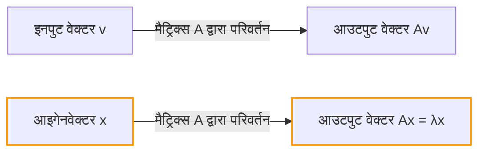
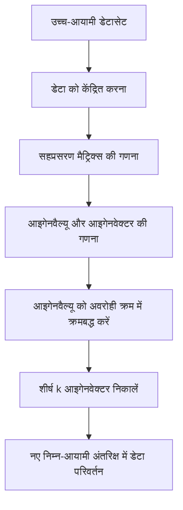

## परिचय

रैखिक बीजगणित (linear algebra) सीखते समय, बहुत से लोगों को सबसे पहली बाधा "मैट्रिक्स गुणन" (matrix multiplication) या "सारणिक" (determinants) लग सकती है। हालांकि, उन बाधाओं से परे আধুনিক विज्ञान और इंजीनियरिंग में रैखिक बीजगणित की अपार शक्ति का वास्तविक स्रोत है: **आइगेनवैल्यू** (Eigenvalues) और **आइगेनवेक्टर** (Eigenvectors)।

मशीन लर्निंग में डायमेंशनलिटी रिडक्शन (PCA) और Google के सर्च इंजन को संचालित करने वाले PageRank एल्गोरिदम से लेकर इमारतों के भूकंपीय डिजाइन और क्वांटम यांत्रिकी में श्रोडिंगर समीकरण तक, आइगेनवैल्यू और आइगेनवेक्टर हर जगह दिखाई देते हैं।

इस लेख का लक्ष्य केवल गणितीय सूत्रों का पालन करना नहीं है बल्कि उनके "ज्यामितीय अर्थ" को सहज रूप से समझना है। हम व्यावहारिक गणना विधियों से लेकर वास्तविक दुनिया के अनुप्रयोगों तक हर चीज को व्यापक रूप से समझाएंगे।

## रैखिक परिवर्तन और ज्यामितीय अंतर्ज्ञान

आइगेनवैल्यू और आइगेनवेक्टर को समझने के लिए, आपको सबसे पहले "मैट्रिक्स क्या है" इस पर अपना दृष्टिकोण बदलना होगा। मैट्रिक्स केवल संख्याओं का ग्रिड नहीं है। यह अंतरिक्ष में एक **ट्रांसफॉर्मर (Transformation)** है।

ऑपरेशन $A\mathbf{v}$, जहां आप एक वेक्टर $\mathbf{v}$ को मैट्रिक्स $A$ से गुणा करते हैं, का अर्थ है वेक्टर $\mathbf{v}$ को दूसरे नए वेक्टर $\mathbf{v}'$ में बदलना।

$$ \mathbf{v}' = A\mathbf{v} $$

आमतौर पर, जब आप किसी वेक्टर को मैट्रिक्स से गुणा करते हैं, तो उसकी "दिशा" और "परिमाण" दोनों बदल जाते हैं। हालांकि, चाहे पूरी जगह कितनी भी विकृत हो जाए, कुछ खास वेक्टर ऐसे हो सकते हैं जिनकी **"दिशा बिल्कुल नहीं बदलती (या बिल्कुल उलट जाती है)"**। इन्हें **आइगेनवेक्टर** कहते हैं। और वह स्केल फैक्टर जो यह दर्शाता है कि परिवर्तन द्वारा इसे "कितना खींचा (या सिकोड़ा) गया", वह **आइगेनवैल्यू** है।

ज्यामितीय रूप से, एक रैखिक परिवर्तन करते समय जो अंतरिक्ष को खींचता या घुमाता है, यह उन वेक्टर्स को खोजने की प्रक्रिया से ज्यादा कुछ नहीं है जो परिवर्तन से पहले और बाद में बिल्कुल उसी रेखा पर रहते हैं।



## आइगेनवैल्यू और आइगेनवेक्टर की परिभाषा और गणितीय पृष्ठभूमि

गणितीय रूप से, एक वर्ग मैट्रिक्स $A$ के लिए, यदि कोई गैर-शून्य वेक्टर $\mathbf{v}$ और एक स्केलर $\lambda$ मौजूद है जो निम्नलिखित शर्त को पूरा करता है, तो $\mathbf{v}$ को मैट्रिक्स $A$ का **आइगेनवेक्टर** कहा जाता है, और $\lambda$ को **आइगेनवैल्यू** कहा जाता है।

$$ A\mathbf{v} = \lambda \mathbf{v} $$

यहाँ महत्वपूर्ण बात यह है कि बायां भाग "एक मैट्रिक्स और एक वेक्टर का गुणनफल" है, जबकि दायां भाग "एक स्केलर और एक वेक्टर का गुणनफल" है। मैट्रिक्स द्वारा जटिल बहु-आयामी परिवर्तन विशिष्ट दिशाओं (आइगेनवेक्टर) के लिए एक साधारण स्केलर गुणन (1D स्केलिंग) में कम हो जाता है।

आइए इस समीकरण को फिर से लिखें। मान लीजिए $I$ पहचान मैट्रिक्स (identity matrix) है, इसलिए हम $\mathbf{v} = I\mathbf{v}$ लिख सकते हैं:

$$ A\mathbf{v} = \lambda I\mathbf{v} $$
$$ A\mathbf{v} - \lambda I\mathbf{v} = \mathbf{0} $$
$$ (A - \lambda I)\mathbf{v} = \mathbf{0} $$

एक गैर-शून्य वेक्टर $\mathbf{v}$ के इस समीकरण को संतुष्ट करने के लिए आवश्यक और पर्याप्त शर्त यह है कि मैट्रिक्स $(A - \lambda I)$ का कोई व्युत्क्रम (inverse) नहीं है, जिसका अर्थ है कि इसका सारणिक (determinant) शून्य होना चाहिए।

$$ \det(A - \lambda I) = 0 $$

इसे **विशेषता समीकरण (Characteristic Equation)** कहा जाता है।

## विशेषता समीकरण और विशिष्ट गणना चरण

अब, आइए एक विशिष्ट $2 \times 2$ मैट्रिक्स का उपयोग करके आइगेनवैल्यू और आइगेनवेक्टर की गणना हाथ से करें। यह रैखिक बीजगणित की परीक्षाओं में बहुत ही सामान्य कदम है।

उदाहरण के रूप में, निम्नलिखित मैट्रिक्स $A$ पर विचार करें:

$$
A = \begin{pmatrix} 4 & 1 \\ 2 & 3 \end{pmatrix}
$$

### चरण 1: आइगेनवैल्यू की गणना

सबसे पहले, हम आइगेनवैल्यू $\lambda$ खोजने के लिए विशेषता समीकरण $\det(A - \lambda I) = 0$ को हल करते हैं।

$$
A - \lambda I = \begin{pmatrix} 4 & 1 \\ 2 & 3 \end{pmatrix} - \begin{pmatrix} \lambda & 0 \\ 0 & \lambda \end{pmatrix} = \begin{pmatrix} 4-\lambda & 1 \\ 2 & 3-\lambda \end{pmatrix}
$$

हम इसके सारणिक की गणना करते हैं:

$$
\det(A - \lambda I) = (4-\lambda)(3-\lambda) - (1)(2) = (\lambda^2 - 7\lambda + 12) - 2 = \lambda^2 - 7\lambda + 10
$$

हम इसे शून्य पर सेट करते हैं:

$$
\lambda^2 - 7\lambda + 10 = 0
$$

इसका गुणनखंड (factoring) करने पर:

$$
(\lambda - 2)(\lambda - 5) = 0
$$

इसलिए, आइगेनवैल्यू $\lambda_1 = 2$ और $\lambda_2 = 5$ हैं।

### चरण 2: आइगेनवेक्टर की गणना

प्रत्येक आइगेनवैल्यू के लिए, हम संबंधित आइगेनवेक्टर खोजते हैं। हम $(A - \lambda I)\mathbf{v} = \mathbf{0}$ को हल करते हैं। मान लें कि $\mathbf{v} = \begin{pmatrix} x \\ y \end{pmatrix}$।

**स्थिति 1: जब आइगेनवैल्यू 2 हो**

$$
(A - 2I) \begin{pmatrix} x \\ y \end{pmatrix} = \begin{pmatrix} 2 & 1 \\ 2 & 1 \end{pmatrix} \begin{pmatrix} x \\ y \end{pmatrix} = \begin{pmatrix} 0 \\ 0 \end{pmatrix}
$$

इससे हमें समीकरण $2x + y = 0$ मिलता है। क्योंकि $y = -2x$, आइगेनवेक्टर को एक स्थिरांक $c$ का उपयोग करके $\begin{pmatrix} c \\ -2c \end{pmatrix}$ के रूप में लिखा जा सकता है। $x = 1$ सेट करके सबसे सरल पूर्णांक रूप लेने पर:

$$
\mathbf{v}_1 = \begin{pmatrix} 1 \\ -2 \end{pmatrix}
$$

**स्थिति 2: जब आइगेनवैल्यू 5 हो**

$$
(A - 5I) \begin{pmatrix} x \\ y \end{pmatrix} = \begin{pmatrix} -1 & 1 \\ 2 & -2 \end{pmatrix} \begin{pmatrix} x \\ y \end{pmatrix} = \begin{pmatrix} 0 \\ 0 \end{pmatrix}
$$

यह $-x + y = 0$ देता है, जिसका अर्थ है $x = y$। पहले की तरह एक सरल पूर्णांक अनुपात चुनना, आइगेनवेक्टर्स में से एक है:

$$
\mathbf{v}_2 = \begin{pmatrix} 1 \\ 1 \end{pmatrix}
$$

अब, हमने मैट्रिक्स $A$ के लिए सभी आइगेनवैल्यू और आइगेनवेक्टर खोज लिए हैं।

## पायथन (Python) के साथ आइगेनवैल्यू और आइगेनवेक्टर की गणना

आधुनिक व्यावहारिक कार्य में, आप कभी भी बड़े मैट्रिक्स के आइगेनवैल्यू की गणना हाथ से नहीं करते हैं। पायथन में एक संख्यात्मक गणना लाइब्रेरी, NumPy का उपयोग करके, आप कोड की कुछ ही पंक्तियों में उनकी गणना कर सकते हैं।

```python
import numpy as np

# मैट्रिक्स A की परिभाषा
A = np.array([[4, 1],
              [2, 3]])

# आइगेनवैल्यू और आइगेनवेक्टर की गणना करें
eigenvalues, eigenvectors = np.linalg.eig(A)

print("आइगेनवैल्यू (Eigenvalues):", eigenvalues)
print("आइगेनवेक्टर (Eigenvectors):\n", eigenvectors)

# आउटपुट उदाहरण:
# आइगेनवैल्यू (Eigenvalues): [5. 2.]
# आइगेनवेक्टर (Eigenvectors):
#  [[ 0.70710678 -0.4472136 ]
#   [ 0.70710678  0.89442719]]
```

NumPy का `np.linalg.eig` फ़ंक्शन सामान्यीकृत (1 की लंबाई के साथ) आइगेनवेक्टर देता है। आप पुष्टि कर सकते हैं कि वे हमारे द्वारा हाथ से गिने गए वेक्टर $\begin{pmatrix} 1 \\ 1 \end{pmatrix}$ और $\begin{pmatrix} 1 \\ -2 \end{pmatrix}$ के निरंतर गुणज हैं, इस बात की पुष्टि करते हुए कि वे ठीक एक ही दिशा में इशारा करते हैं।

## मैट्रिक्स विकर्णीकरण (Diagonalization) और इसके शक्तिशाली लाभ

आइगेनवैल्यू और आइगेनवेक्टर के सबसे महत्वपूर्ण अनुप्रयोगों में से एक **मैट्रिक्स विकर्णीकरण (matrix diagonalization)** है। विकर्णीकरण एक आसानी से गणना योग्य विकर्ण मैट्रिक्स $D$ का उपयोग करके एक जटिल मैट्रिक्स $A$ को विघटित करने की प्रक्रिया है:

$$ A = P D P^{-1} $$

यहाँ, $P$ एक मैट्रिक्स है जहाँ आइगेनवेक्टर कॉलम वेक्टर के रूप में व्यवस्थित होते हैं, और $D$ एक विकर्ण मैट्रिक्स है जिसके विकर्ण पर संबंधित आइगेनवैल्यू होते हैं।

हमारे पिछले उदाहरण का उपयोग करते हुए:

$$
P = \begin{pmatrix} 1 & 1 \\ -2 & 1 \end{pmatrix}, \quad D = \begin{pmatrix} 2 & 0 \\ 0 & 5 \end{pmatrix}
$$

यह विकर्णीकरण इतना महत्वपूर्ण क्यों है? क्योंकि **यह मैट्रिक्स की घात (powers) की गणना को नाटकीय रूप से आसान बना देता है**।

उदाहरण के लिए, मान लें कि आप 100 की घात तक $A$ की गणना करना चाहते हैं। सीधे $A^{100}$ की गणना करना बहुत बड़ी गणना है। हालाँकि, विकर्णीकरण का उपयोग करते हुए:

$$
A^{100} = (P D P^{-1})(P D P^{-1}) \dots (P D P^{-1}) = P D^{100} P^{-1}
$$

सभी मध्यवर्ती $P^{-1}P$ पहचान मैट्रिक्स $I$ बन जाते हैं और एक बहुत ही सरल समीकरण को कम करते हुए रद्द हो जाते हैं। विकर्ण मैट्रिक्स $D$ को एक घात तक बढ़ाने के लिए बस उसके विकर्ण तत्वों को उस घात तक बढ़ाने की आवश्यकता होती है:

$$
D^{100} = \begin{pmatrix} 2^{100} & 0 \\ 0 & 5^{100} \end{pmatrix}
$$

यह गुण मार्कोव श्रृंखला जैसे संभाव्यता मॉडल में दीर्घकालिक स्थितियों की भविष्यवाणी करते समय, अंतर समीकरणों की प्रणालियों को हल करते समय, या यहां तक कि फाइबोनैचि अनुक्रम के सामान्य शब्द की खोज करते समय एक अनिवार्य तकनीक है।

## आइगेनवैल्यू और आइगेनवेक्टर के वास्तविक दुनिया के अनुप्रयोग

हमने अब तक गणितीय पहलुओं को देखा है, लेकिन ये अवधारणाएं वास्तविक दुनिया की विभिन्न चुनौतियों को हल करने वाले इंजन के रूप में कार्य करती हैं।

### 1. प्रिंसिपल कंपोनेंट एनालिसिस (PCA) और डेटा साइंस

मशीन लर्निंग और डेटा साइंस के क्षेत्र में, **प्रिंसिपल कंपोनेंट एनालिसिस (PCA)** नामक एक तकनीक है जो उच्च-आयामी डेटा (उदाहरण के लिए, सैकड़ों पिक्सेल के साथ छवि डेटा या बड़ी मात्रा में उपयोगकर्ता व्यवहार इतिहास) को एक विश्लेषण योग्य निचले आयाम में संपीड़ित करती है।

PCA में, हम डेटा के सहप्रसरण मैट्रिक्स (covariance matrix) के आइगेनवैल्यू और आइगेनवेक्टर की गणना करते हैं।
- **आइगेनवेक्टर**: उस "नए अक्ष (प्रमुख घटक)" की दिशा का प्रतिनिधित्व करता है जहां डेटा का विचरण अधिकतम होता है।
- **आइगेनवैल्यू**: उस नए अक्ष के साथ डेटा के विचरण (सूचना की मात्रा) की मात्रा का प्रतिनिधित्व करता है।

उनके आइगेनवैल्यू के अवरोही क्रम में आइगेनवेक्टर का चयन करके, हम सूचना के नुकसान को कम करते हुए डेटा के आयामों को कम कर सकते हैं। यह डेटा विज़ुअलाइज़ेशन में सक्षम बनाता है, मशीन लर्निंग मॉडल के प्रशिक्षण को गति देता है, और शोर (noise) को हटाता है।



### 2. Google का PageRank एल्गोरिदम

इंटरनेट की शुरुआत में, जिस एल्गोरिदम ने Google के सर्च इंजन को दुनिया के शीर्ष पर पहुँचाया, वह **PageRank** था। इसने वेब पेजों के बीच लिंक संरचना को एक विशाल मैट्रिक्स के रूप में दर्शाया और इस विचार को गणितीय रूप से मॉडल किया कि "महत्वपूर्ण पेजों से जुड़े पेज भी महत्वपूर्ण हैं।"

हैरानी की बात है कि, प्रत्येक वेब पेज का "महत्व स्कोर" ठीक इस विशाल लिंक मैट्रिक्स (या संक्रमण संभाव्यता मैट्रिक्स) के लिए **1 के सबसे बड़े आइगेनवैल्यू से संबंधित आइगेनवेक्टर** है। Google की प्रारंभिक प्रणाली एक विशाल पुनरावृत्तीय गणना इंजन थी जो अरबों आयामों वाले मैट्रिक्स के आइगेनवेक्टर को खोजने के लिए समर्पित थी।

### 3. क्वांटम यांत्रिकी और भौतिक प्रणालियाँ

भौतिकी की दुनिया में, विशेष रूप से क्वांटम यांत्रिकी में, अवलोकनीय भौतिक मात्राओं (जैसे ऊर्जा और संवेग) को "हर्मिटियन ऑपरेटर (मैट्रिक्स)" के रूप में दर्शाया जाता है। और अवलोकन द्वारा प्राप्त संभावित माप मान उस ऑपरेटर के **आइगेनवैल्यू** हैं, और माप के बाद सिस्टम की स्थिति संबंधित **आइगेनवेक्टर** (आइगेनस्टेट) बन जाती है।

प्रसिद्ध श्रोडिंगर समीकरण:

$$ \hat{H}\psi = E\psi $$

यह समीकरण हैमिल्टनियन $\hat{H}$ (ऊर्जा ऑपरेटर) के लिए आइगेनवैल्यू समस्या से ज्यादा कुछ नहीं है। यहाँ, $E$ ऊर्जा आइगेनवैल्यू है, और $\psi$ तरंग फलन (आइगेनस्टेट) है।

इसके अलावा, शास्त्रीय भौतिकी में, जैसे कि पुलों और इमारतों का कंपन विश्लेषण, या ध्वनिकी में, आइगेनवैल्यू "प्राकृतिक आवृत्तियों (अनुनाद आवृत्तियों)" का प्रतिनिधित्व करने के लिए अपरिहार्य हैं, जबकि आइगेनवेक्टर "कंपन मोड (झूलने के आकार)" का प्रतिनिधित्व करते हैं। डिजाइन के दौरान, यह सुनिश्चित करने के लिए एक आइगेनवैल्यू विश्लेषण किया जाता है कि अनुनाद विफलता को रोकने के लिए विशिष्ट प्राकृतिक आवृत्तियां बाहरी ताकतों (जैसे हवा या भूकंप) की आवृत्तियों से मेल नहीं खाती हैं।

## निष्कर्ष

पहली नज़र में, आइगेनवैल्यू और आइगेनवेक्टर अमूर्त गणितीय पहेली की तरह लग सकते हैं। हालाँकि, ज्यामितीय रूप से, यह "आवश्यक अक्षों को निकालने का संचालन है जो मैट्रिक्स द्वारा जटिल परिवर्तनों के बीच कभी नहीं बदलते हैं", और इसके अनुप्रयोग कंप्यूटर विज्ञान से लेकर डेटा विज्ञान, सैद्धांतिक भौतिकी और मैकेनिकल इंजीनियरिंग तक व्यापक रूप से फैले हुए हैं।

- **आइगेनवेक्टर**: किसी सिस्टम की आवश्यक दिशा या मोड जो परिवर्तन के बाद अपना अभिविन्यास नहीं बदलता है।
- **आइगेनवैल्यू**: वह स्केल फैक्टर (महत्व, ऊर्जा, आवृत्ति, आदि) जो यह दर्शाता है कि उस दिशा को परिवर्तन द्वारा कितना बढ़ाया या सिकोड़ा गया है।

इस सहज ज्ञान युक्त छवि को ध्यान में रखते हुए, आप देखेंगे कि रैखिक बीजगणित केवल गणना नियमों की सूची नहीं है, बल्कि हमारी जटिल दुनिया का आसानी से वर्णन करने और इसकी छिपी संरचनाओं को उजागर करने के लिए एक अत्यंत शक्तिशाली भाषा है। अधिक उन्नत गणित या मशीन लर्निंग एल्गोरिदम सीखते समय, ये मूलभूत अवधारणाएँ आपके सबसे विश्वसनीय हथियार बन जाएँगी।
