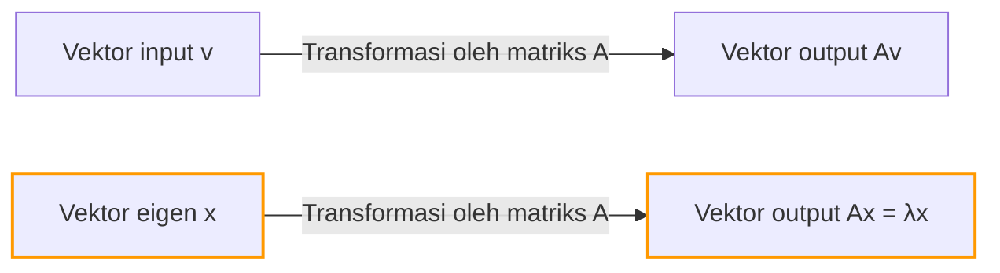
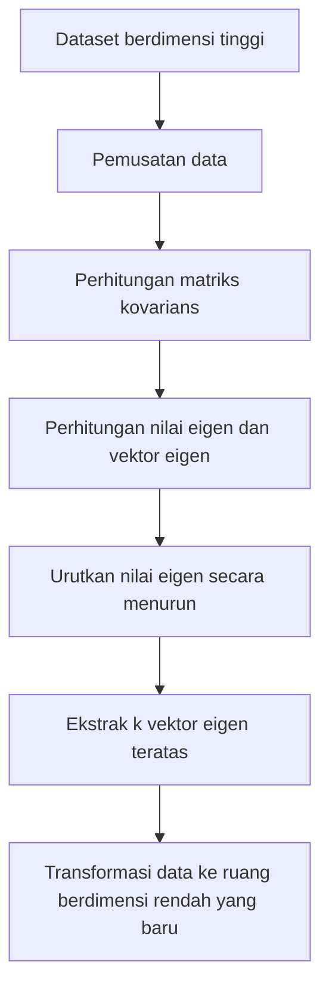

## Pengantar

Saat mempelajari aljabar linier, rintangan pertama yang dihadapi banyak orang mungkin adalah "perkalian matriks" atau "determinan". Namun, di luar rintangan tersebut terletak sumber sebenarnya dari kekuatan besar aljabar linier dalam sains dan teknik modern: **nilai eigen** (Eigenvalues) dan **vektor eigen** (Eigenvectors).

Dari pengurangan dimensi (PCA) dalam pembelajaran mesin dan algoritma PageRank yang menggerakkan mesin telusur Google, hingga desain seismik bangunan dan persamaan Schrödinger dalam mekanika kuantum, nilai eigen dan vektor eigen muncul di mana-mana.

Tujuan artikel ini bukan hanya untuk mengikuti rumus matematika tetapi untuk secara intuitif memahami "makna geometris"-nya. Kami akan secara komprehensif menjelaskan semuanya, mulai dari metode perhitungan praktis hingga aplikasinya di dunia nyata.

## Transformasi Linier dan Intuisi Geometris

Untuk memahami nilai eigen dan vektor eigen, Anda pertama-tama perlu mengubah perspektif Anda tentang "apa itu matriks". Matriks bukan sekadar kisi angka. Ini adalah **transformator (Transformation)** dalam ruang.

Operasi $A\mathbf{v}$, di mana Anda mengalikan vektor $\mathbf{v}$ dengan matriks $A$, berarti mengubah vektor $\mathbf{v}$ menjadi vektor baru lainnya $\mathbf{v}'$.

$$ \mathbf{v}' = A\mathbf{v} $$

Umumnya, saat Anda mengalikan vektor dengan matriks, "arah" dan "besarnya" berubah. Namun, tidak peduli bagaimana seluruh ruang terdistorsi, mungkin ada vektor khusus yang **"arahnya tidak berubah sama sekali (atau tepat berbalik)"**. Ini adalah **vektor eigen**. Dan faktor skala yang mewakili "berapa banyak vektor itu ditarik (atau menyusut)" oleh transformasi adalah **nilai eigen**.

Secara geometris, saat melakukan transformasi linier yang menarik atau memutar ruang, itu tidak lain adalah proses menemukan vektor yang tetap berada pada garis yang sama persis sebelum dan sesudah transformasi.



## Definisi [Nilai Eigen dan Vektor Eigen](https://kenji.blog/id/p/eigenvalues-and-eigenvectors/) dan Latar Belakang Matematika

Secara matematis, untuk matriks persegi $A$, jika terdapat vektor bukan nol $\mathbf{v}$ dan skalar $\lambda$ yang memenuhi kondisi berikut, $\mathbf{v}$ disebut **vektor eigen** dari matriks $A$, dan $\lambda$ disebut **nilai eigen**.

$$ A\mathbf{v} = \lambda \mathbf{v} $$

Yang penting di sini adalah sisi kiri adalah "produk dari matriks dan vektor", sedangkan sisi kanan adalah "produk dari skalar dan vektor". Transformasi multidimensi yang kompleks oleh matriks direduksi menjadi perkalian skalar sederhana (penskalaan 1D) untuk arah tertentu (vektor eigen).

Mari kita tulis ulang persamaan ini. Misalkan $I$ adalah matriks identitas, sehingga kita dapat menulis $\mathbf{v} = I\mathbf{v}$:

$$ A\mathbf{v} = \lambda I\mathbf{v} $$
$$ A\mathbf{v} - \lambda I\mathbf{v} = \mathbf{0} $$
$$ (A - \lambda I)\mathbf{v} = \mathbf{0} $$

Kondisi yang diperlukan dan cukup agar vektor bukan nol $\mathbf{v}$ memenuhi persamaan ini adalah bahwa matriks $(A - \lambda I)$ tidak memiliki invers, yang berarti determinannya harus nol.

$$ \det(A - \lambda I) = 0 $$

Ini disebut **Persamaan Karakteristik (Characteristic Equation)**.

## Persamaan Karakteristik dan Langkah Perhitungan Spesifik

Sekarang, mari kita hitung nilai eigen dan vektor eigen dengan tangan menggunakan matriks $2 \times 2$ tertentu. Ini adalah langkah yang sangat umum dalam ujian aljabar linier.

Sebagai contoh, perhatikan matriks $A$ berikut:

$$
A = \begin{pmatrix} 4 & 1 \\ 2 & 3 \end{pmatrix}
$$

### Langkah 1: Menghitung Nilai Eigen

Pertama, kita selesaikan persamaan karakteristik $\det(A - \lambda I) = 0$ untuk menemukan nilai eigen $\lambda$.

$$
A - \lambda I = \begin{pmatrix} 4 & 1 \\ 2 & 3 \end{pmatrix} - \begin{pmatrix} \lambda & 0 \\ 0 & \lambda \end{pmatrix} = \begin{pmatrix} 4-\lambda & 1 \\ 2 & 3-\lambda \end{pmatrix}
$$

Kita hitung determinannya:

$$
\det(A - \lambda I) = (4-\lambda)(3-\lambda) - (1)(2) = (\lambda^2 - 7\lambda + 12) - 2 = \lambda^2 - 7\lambda + 10
$$

Kita setel ini ke nol:

$$
\lambda^2 - 7\lambda + 10 = 0
$$

Dengan memfaktorkannya:

$$
(\lambda - 2)(\lambda - 5) = 0
$$

Oleh karena itu, nilai eigennya adalah $\lambda_1 = 2$ dan $\lambda_2 = 5$.

### Langkah 2: Menghitung Vektor Eigen

Untuk setiap nilai eigen, kita cari vektor eigen yang sesuai. Kita selesaikan $(A - \lambda I)\mathbf{v} = \mathbf{0}$. Misalkan $\mathbf{v} = \begin{pmatrix} x \\ y \end{pmatrix}$.

**Kasus 1: Saat nilai eigen adalah 2**

$$
(A - 2I) \begin{pmatrix} x \\ y \end{pmatrix} = \begin{pmatrix} 2 & 1 \\ 2 & 1 \end{pmatrix} \begin{pmatrix} x \\ y \end{pmatrix} = \begin{pmatrix} 0 \\ 0 \end{pmatrix}
$$

Ini memberi kita persamaan $2x + y = 0$. Karena $y = -2x$, vektor eigen dapat ditulis sebagai $\begin{pmatrix} c \\ -2c \end{pmatrix}$ menggunakan konstanta $c$. Mengambil bentuk bilangan bulat paling sederhana dengan menetapkan $x = 1$:

$$
\mathbf{v}_1 = \begin{pmatrix} 1 \\ -2 \end{pmatrix}
$$

**Kasus 2: Saat nilai eigen adalah 5**

$$
(A - 5I) \begin{pmatrix} x \\ y \end{pmatrix} = \begin{pmatrix} -1 & 1 \\ 2 & -2 \end{pmatrix} \begin{pmatrix} x \\ y \end{pmatrix} = \begin{pmatrix} 0 \\ 0 \end{pmatrix}
$$

Ini memberikan $-x + y = 0$, yang berarti $x = y$. Memilih rasio bilangan bulat sederhana seperti sebelumnya, salah satu vektor eigennya adalah:

$$
\mathbf{v}_2 = \begin{pmatrix} 1 \\ 1 \end{pmatrix}
$$

Sekarang, kita telah menemukan semua nilai eigen dan vektor eigen untuk matriks $A$.

## Menghitung [Nilai Eigen dan Vektor Eigen](https://kenji.blog/id/p/eigenvalues-and-eigenvectors/) dengan Python

Dalam kerja praktik modern, Anda tidak pernah menghitung nilai eigen dari matriks besar dengan tangan. Dengan menggunakan NumPy, perpustakaan komputasi numerik dengan Python, Anda dapat menghitungnya hanya dalam beberapa baris kode.

```python
import numpy as np

# Definisi matriks A
A = np.array([[4, 1],
              [2, 3]])

# Hitung nilai eigen dan vektor eigen
eigenvalues, eigenvectors = np.linalg.eig(A)

print("Nilai Eigen (Eigenvalues):", eigenvalues)
print("Vektor Eigen (Eigenvectors):\n", eigenvectors)

# Contoh keluaran:
# Nilai Eigen (Eigenvalues): [5. 2.]
# Vektor Eigen (Eigenvectors):
#  [[ 0.70710678 -0.4472136 ]
#   [ 0.70710678  0.89442719]]
```

Fungsi `np.linalg.eig` NumPy mengembalikan vektor eigen yang dinormalisasi (dengan panjang 1). Anda dapat mengonfirmasi bahwa mereka adalah kelipatan konstan dari vektor $\begin{pmatrix} 1 \\ 1 \end{pmatrix}$ dan $\begin{pmatrix} 1 \\ -2 \end{pmatrix}$ yang kita hitung dengan tangan, mengonfirmasi bahwa mereka menunjuk ke arah yang persis sama.

## Diagonalisasi Matriks dan Manfaatnya yang Sangat Kuat

Salah satu aplikasi paling penting dari nilai eigen dan vektor eigen adalah **diagonalisasi matriks**. Diagonalisasi adalah proses mengurai matriks kompleks $A$ menggunakan matriks diagonal $D$ yang mudah dihitung sebagai berikut:

$$ A = P D P^{-1} $$

Di sini, $P$ adalah matriks tempat vektor eigen disusun sebagai vektor kolom, dan $D$ adalah matriks diagonal dengan nilai eigen yang sesuai pada diagonalnya.

Menggunakan contoh kita sebelumnya:

$$
P = \begin{pmatrix} 1 & 1 \\ -2 & 1 \end{pmatrix}, \quad D = \begin{pmatrix} 2 & 0 \\ 0 & 5 \end{pmatrix}
$$

Mengapa diagonalisasi ini sangat penting? Karena **itu membuat perhitungan pangkat matriks jauh lebih mudah**.

Misalnya, misalkan Anda ingin menghitung $A$ pangkat 100. Menghitung $A^{100}$ secara langsung merupakan komputasi yang sangat besar. Namun, menggunakan diagonalisasi:

$$
A^{100} = (P D P^{-1})(P D P^{-1}) \dots (P D P^{-1}) = P D^{100} P^{-1}
$$

Semua pasangan $P^{-1}P$ menengah menjadi matriks identitas $I$ dan saling meniadakan, mereduksi ke persamaan yang sangat sederhana. Menaikkan matriks diagonal $D$ ke pangkat cukup mengharuskan menaikkan elemen diagonalnya ke pangkat tersebut:

$$
D^{100} = \begin{pmatrix} 2^{100} & 0 \\ 0 & 5^{100} \end{pmatrix}
$$

Properti ini merupakan teknik yang sangat penting saat memprediksi keadaan jangka panjang dalam model probabilitas seperti [Rantai Markov](https://kenji.blog/id/p/markov-chain/), saat menyelesaikan sistem persamaan diferensial, atau bahkan saat mencari suku umum barisan [Fibonacci](https://kenji.blog/id/p/fibonacci/).

## Aplikasi [Nilai Eigen dan Vektor Eigen](https://kenji.blog/id/p/eigenvalues-and-eigenvectors/) di Dunia Nyata

Kita telah melihat aspek matematika sejauh ini, tetapi konsep-konsep ini bertindak sebagai mesin yang memecahkan berbagai tantangan dunia nyata.

### 1. Principal Component Analysis (PCA) dan Sains Data

Di bidang pembelajaran mesin dan sains data, terdapat teknik yang disebut **Principal Component Analysis (PCA)** yang mengompresi data berdimensi tinggi (misalnya, data gambar dengan ratusan piksel atau riwayat perilaku pengguna dalam jumlah besar) ke dimensi yang lebih rendah yang dapat dianalisis.

Dalam PCA, kami menghitung nilai eigen dan vektor eigen dari matriks kovarians data.
- **Vektor eigen**: Mewakili arah "sumbu baru (komponen utama)" tempat varians data dimaksimalkan.
- **Nilai eigen**: Mewakili jumlah varians (jumlah informasi) data di sepanjang sumbu baru tersebut.

Dengan memilih vektor eigen dalam urutan menurun dari nilai eigennya, kita dapat mengurangi dimensi data sambil meminimalkan kehilangan informasi. Ini memungkinkan visualisasi data, mempercepat pelatihan model pembelajaran mesin, dan menghilangkan noise.



### 2. Algoritma PageRank Google

Di awal mula internet, algoritma yang mendorong mesin telusur Google ke puncak dunia adalah **PageRank**. Itu mewakili struktur tautan antar halaman web sebagai matriks besar dan secara matematis memodelkan gagasan bahwa "halaman yang ditautkan dari halaman penting juga penting."

Secara mengejutkan, "skor penting" setiap halaman web tepatnya adalah **vektor eigen yang sesuai dengan nilai eigen terbesar 1** untuk matriks tautan raksasa (atau matriks probabilitas transisi) ini. Sistem awal Google adalah mesin perhitungan iteratif masif yang didedikasikan untuk menemukan vektor eigen matriks dengan miliaran dimensi.

### 3. Mekanika Kuantum dan Sistem Fisika

Di dunia fisika, terutama dalam mekanika kuantum, besaran fisika yang dapat diamati (seperti energi dan momentum) direpresentasikan sebagai "operator Hermitian (matriks)". Dan kemungkinan nilai pengukuran yang diperoleh melalui observasi adalah **nilai eigen** dari operator tersebut, dan keadaan sistem setelah pengukuran menjadi **vektor eigen** (keadaan eigen) yang sesuai.

Persamaan Schrödinger yang terkenal:

$$ \hat{H}\psi = E\psi $$

Persamaan ini tidak lain adalah masalah nilai eigen untuk Hamiltonian $\hat{H}$ (operator energi). Di sini, $E$ adalah nilai eigen energi, dan $\psi$ adalah fungsi gelombang (keadaan eigen).

Selain itu, dalam fisika klasik, seperti analisis getaran jembatan dan bangunan, atau dalam akustik, nilai eigen sangat diperlukan untuk merepresentasikan "frekuensi alami (frekuensi resonansi)", sedangkan vektor eigen mewakili "mode getaran (bentuk ayunan)". Selama perancangan, analisis nilai eigen dilakukan untuk memastikan bahwa frekuensi alami tertentu tidak cocok dengan frekuensi gaya eksternal (seperti angin atau gempa bumi) untuk mencegah kegagalan resonansi.

## Kesimpulan

Sekilas, nilai eigen dan vektor eigen mungkin tampak seperti teka-teki matematika abstrak. Namun secara geometris, ini adalah operasi mengekstrak "sumbu esensial yang tidak pernah berubah di tengah transformasi kompleks oleh matriks", dan aplikasinya berkisar dari ilmu komputer hingga sains data, fisika teoritis, dan teknik mesin.

- **Vektor eigen**: Arah atau mode penting dari sistem yang tidak mengubah orientasinya setelah transformasi.
- **Nilai eigen**: Faktor skala (kepentingan, energi, frekuensi, dll.) yang mewakili seberapa banyak arah itu ditarik atau disusutkan oleh transformasi.

Dengan mengingat gambaran intuitif ini, Anda akan melihat bahwa aljabar linier bukan sekadar daftar aturan perhitungan, melainkan bahasa yang sangat kuat untuk menggambarkan dunia kita yang kompleks secara sederhana dan mengungkap strukturnya yang tersembunyi. Saat mempelajari matematika yang lebih maju atau algoritma pembelajaran mesin, konsep fundamental ini akan menjadi senjata Anda yang paling andal.
