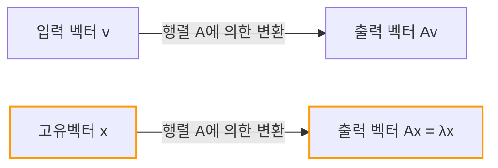
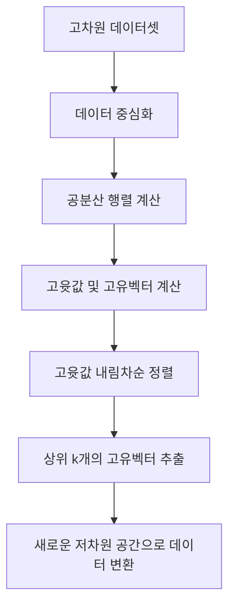

## 서론

선형대수학을 배울 때 많은 사람들이 처음 겪는 장벽은 아마도 '행렬의 곱셈'이나 '행렬식'일 것입니다. 하지만 이러한 장벽을 넘어섰을 때 만나는 **고윳값** (Eigenvalue) 과 **고유벡터** (Eigenvector) 야말로 선형대수학이 현대 과학과 공학에서 막강한 위력을 발휘하는 근원입니다.

머신러닝에서의 차원 축소 (PCA), 구글의 검색 엔진을 지탱한 PageRank 알고리즘, 건물의 내진 설계부터 양자역학의 슈뢰딩거 방정식에 이르기까지 [고윳값과 고유벡터](https://kenji.blog/p/eigenvalues-and-eigenvectors/)는 어디에나 등장합니다.

본 문서에서는 단순히 수학 공식을 따라가는 것을 넘어 그 '기하학적 의미'를 직관적으로 이해하는 것을 목표로 하며, 실용적인 계산 방법부터 실제 세계에서의 응용까지 포괄적으로 설명합니다.

## 행렬에 의한 선형 변환과 기하학적 직관

[고윳값과 고유벡터](https://kenji.blog/p/eigenvalues-and-eigenvectors/)를 이해하기 위해서는 먼저 '행렬이란 무엇인가'에 대한 관점을 바꿔야 합니다. 행렬은 단순한 숫자들의 배열이 아닙니다. 공간 내의 **변환기 (Transformation)** 입니다.

어떤 벡터 $\mathbf{v}$ 에 행렬 $A$ 를 곱하는 작업 $A\mathbf{v}$ 는 벡터 $\mathbf{v}$ 를 다른 새로운 벡터 $\mathbf{v}'$ 로 변환한다는 것을 의미합니다.

$$ \mathbf{v}' = A\mathbf{v} $$

일반적으로 벡터에 행렬을 곱하면 그 벡터는 '방향'도 '크기'도 모두 변해버립니다. 하지만 전체 공간이 어떻게 왜곡되더라도 **'방향이 전혀 변하지 않는 (또는 완전히 반대가 되는)'** 특별한 벡터가 존재할 수 있습니다. 이것이 바로 **고유벡터** 입니다. 그리고 그 벡터가 변환에 의해 '얼마나 늘어나거나 줄어들었는지'를 나타내는 배율이 바로 **고윳값** 입니다.

기하학적으로 보면, 공간을 잡아늘리거나 회전시키는 선형 변환을 수행할 때, 변환 전후로 동일한 선상에 머무르는 벡터를 찾는 작업에 다름 아닙니다.



## [고윳값과 고유벡터](https://kenji.blog/p/eigenvalues-and-eigenvectors/)의 정의 및 수학적 배경

수학적으로, 정방행렬 $A$ 에 대하여 다음 조건을 만족하는 영이 아닌 벡터 $\mathbf{v}$ 와 스칼라 $\lambda$ 가 존재할 때, $\mathbf{v}$ 를 행렬 $A$ 의 **고유벡터**, $\lambda$ 를 **고윳값** 이라고 부릅니다.

$$ A\mathbf{v} = \lambda \mathbf{v} $$

여기서 중요한 점은 왼쪽 항은 '행렬과 벡터의 곱'이고, 오른쪽 항은 '스칼라와 벡터의 곱'이라는 것입니다. 행렬에 의한 복잡한 다차원 변환이 특정 방향(고유벡터)에 대해서는 단순한 상수배(1차원 축소 및 확대)와 같아진다는 매우 단순한 관계로 귀결됩니다.

이 식을 변형해 보겠습니다. 단위행렬을 $I$ 라고 하면 $\mathbf{v} = I\mathbf{v}$ 로 쓸 수 있으므로,

$$ A\mathbf{v} = \lambda I\mathbf{v} $$
$$ A\mathbf{v} - \lambda I\mathbf{v} = \mathbf{0} $$
$$ (A - \lambda I)\mathbf{v} = \mathbf{0} $$

이 방정식을 만족하는 영이 아닌 벡터 $\mathbf{v}$ 가 존재하기 위한 필요충분조건은 행렬 $(A - \lambda I)$ 가 역행렬을 가지지 않는 것, 즉 그 행렬식이 0이 되는 것입니다.

$$ \det(A - \lambda I) = 0 $$

이것을 **특성 방정식 (Characteristic Equation)** 또는 **고유 방정식** 이라고 부릅니다.

## 특성 방정식과 구체적인 계산 단계

그러면 구체적인 $2 \times 2$ 행렬을 사용하여 손으로 [고윳값과 고유벡터](https://kenji.blog/p/eigenvalues-and-eigenvectors/)를 구해보겠습니다. 이는 선형대수학 시험 등에서도 자주 출제되는 단계입니다.

예를 들어, 다음과 같은 행렬 $A$ 를 생각해 보겠습니다.

$$
A = \begin{pmatrix} 4 & 1 \\ 2 & 3 \end{pmatrix}
$$

### 단계 1: 고윳값 계산

먼저 특성 방정식 $\det(A - \lambda I) = 0$ 을 풀어 고윳값 $\lambda$ 를 구합니다.

$$
A - \lambda I = \begin{pmatrix} 4 & 1 \\ 2 & 3 \end{pmatrix} - \begin{pmatrix} \lambda & 0 \\ 0 & \lambda \end{pmatrix} = \begin{pmatrix} 4-\lambda & 1 \\ 2 & 3-\lambda \end{pmatrix}
$$

행렬식을 계산합니다.

$$
\det(A - \lambda I) = (4-\lambda)(3-\lambda) - (1)(2) = (\lambda^2 - 7\lambda + 12) - 2 = \lambda^2 - 7\lambda + 10
$$

이것을 0으로 둡니다.

$$
\lambda^2 - 7\lambda + 10 = 0
$$

인수분해하면,

$$
(\lambda - 2)(\lambda - 5) = 0
$$

따라서 고윳값은 $\lambda_1 = 2$ 와 $\lambda_2 = 5$ 가 됩니다.

### 단계 2: 고유벡터 계산

각각의 고윳값에 대해 고유벡터를 구합니다. $(A - \lambda I)\mathbf{v} = \mathbf{0}$ 을 풉니다. $\mathbf{v} = \begin{pmatrix} x \\ y \end{pmatrix}$ 라고 합니다.

**경우 1: 고윳값이 2인 경우**

$$
(A - 2I) \begin{pmatrix} x \\ y \end{pmatrix} = \begin{pmatrix} 2 & 1 \\ 2 & 1 \end{pmatrix} \begin{pmatrix} x \\ y \end{pmatrix} = \begin{pmatrix} 0 \\ 0 \end{pmatrix}
$$

이로 인해 $2x + y = 0$ 이라는 방정식을 얻습니다. $y = -2x$ 이므로, 고유벡터는 상수 $c$ 를 사용하여 $\begin{pmatrix} c \\ -2c \end{pmatrix}$ 로 쓸 수 있습니다. 가장 단순한 형태로서 $x = 1$ 로 두면,

$$
\mathbf{v}_1 = \begin{pmatrix} 1 \\ -2 \end{pmatrix}
$$

이 됩니다.

**경우 2: 고윳값이 5인 경우**

$$
(A - 5I) \begin{pmatrix} x \\ y \end{pmatrix} = \begin{pmatrix} -1 & 1 \\ 2 & -2 \end{pmatrix} \begin{pmatrix} x \\ y \end{pmatrix} = \begin{pmatrix} 0 \\ 0 \end{pmatrix}
$$

이로 인해 $-x + y = 0$, 즉 $x = y$ 가 됩니다. 이전과 마찬가지로 단순한 정수비를 선택하면, 고유벡터 중 하나는,

$$
\mathbf{v}_2 = \begin{pmatrix} 1 \\ 1 \end{pmatrix}
$$

이 됩니다.

이제 행렬 $A$ 의 [고윳값과 고유벡터](https://kenji.blog/p/eigenvalues-and-eigenvectors/)를 모두 구했습니다.

## Python을 이용한 [고윳값과 고유벡터](https://kenji.blog/p/eigenvalues-and-eigenvectors/) 계산

현대의 실무에서는 큰 행렬의 고윳값을 손으로 계산하는 일은 없습니다. Python의 수치 계산 라이브러리인 NumPy를 사용하면 불과 몇 줄만으로 계산이 가능합니다.

```python
import numpy as np

# 행렬 A의 정의
A = np.array([[4, 1],
              [2, 3]])

# 고윳값과 고유벡터 계산
eigenvalues, eigenvectors = np.linalg.eig(A)

print("고윳값 (Eigenvalues):", eigenvalues)
print("고유벡터 (Eigenvectors):\n", eigenvectors)

# 출력 예시:
# 고윳값 (Eigenvalues): [5. 2.]
# 고유벡터 (Eigenvectors):
#  [[ 0.70710678 -0.4472136 ]
#   [ 0.70710678  0.89442719]]
```

NumPy의 `np.linalg.eig` 함수는 정규화된 (길이가 1인) 고유벡터를 반환합니다. 손으로 구한 벡터 $\begin{pmatrix} 1 \\ 1 \end{pmatrix}$ 나 $\begin{pmatrix} 1 \\ -2 \end{pmatrix}$ 의 상수배로 되어 있어, 같은 방향을 가리키고 있음을 확인할 수 있습니다.

## 행렬의 대각화와 그 강력한 이점

[고윳값과 고유벡터](https://kenji.blog/p/eigenvalues-and-eigenvectors/)의 가장 중요한 응용 중 하나가 **행렬의 대각화** 입니다. 대각화란 복잡한 행렬 $A$ 를 계산이 쉬운 대각행렬 $D$ 를 사용하여 다음과 같이 분해하는 것입니다.

$$ A = P D P^{-1} $$

여기서 $P$ 는 고유벡터를 열 벡터로 배열한 행렬이고, $D$ 는 대응하는 고윳값을 대각 성분으로 갖는 대각행렬입니다.

앞서 본 예를 사용하면,

$$
P = \begin{pmatrix} 1 & 1 \\ -2 & 1 \end{pmatrix}, \quad D = \begin{pmatrix} 2 & 0 \\ 0 & 5 \end{pmatrix}
$$

가 됩니다. 이 대각화가 왜 중요한 것일까요? 그것은 **행렬의 거듭제곱 계산이 획기적으로 쉬워지기 때문** 입니다.

예를 들어, $A$ 를 $100$ 제곱하고 싶다고 가정해 봅시다. $A^{100}$ 을 직접 계산하는 것은 매우 엄청난 계산량이 됩니다. 하지만 대각화를 이용하면,

$$
A^{100} = (P D P^{-1})(P D P^{-1}) \dots (P D P^{-1}) = P D^{100} P^{-1}
$$

중간의 $P^{-1}P$ 가 모두 단위행렬 $I$ 가 되어 사라지므로, 매우 단순한 식으로 귀결됩니다. 대각행렬 $D$ 의 거듭제곱은 단순히 대각 성분을 거듭제곱하기만 하면 됩니다.

$$
D^{100} = \begin{pmatrix} 2^{100} & 0 \\ 0 & 5^{100} \end{pmatrix}
$$

이 성질은 마르코프 연쇄와 같은 확률 모델에서 장기적인 상태를 예측할 때나 미분방정식 계를 풀 때, 나아가 피보나치 수열의 일반항을 구하는 문제 등에서 필수적인 테크닉이 됩니다.

## 현실 세계에서의 고윳값 및 고유벡터의 응용

지금까지 수학적인 측면을 살펴보았지만, 이러한 개념들은 현실 세계의 다양한 문제를 해결하는 엔진 역할을 하고 있습니다.

### 1. 주성분 분석 (PCA) 과 데이터 사이언스

머신러닝이나 데이터 사이언스 분야에서 고차원의 데이터(예: 수백 픽셀의 이미지 데이터나 수많은 사용자 행동 이력)를 분석 가능한 저차원으로 압축하는 **주성분 분석 (Principal Component Analysis, PCA)** 이라는 기법이 있습니다.

PCA에서는 데이터의 공분산 행렬의 [고윳값과 고유벡터](https://kenji.blog/p/eigenvalues-and-eigenvectors/)를 계산합니다.
- **고유벡터**: 데이터의 분산이 가장 커지는 '새로운 축(주성분)'의 방향을 나타냅니다.
- **고윳값**: 그 새로운 축을 따른 데이터 분산의 크기(정보량)를 나타냅니다.

고윳값이 큰 고유벡터부터 순서대로 선택함으로써, 정보의 손실을 최소화하면서 데이터의 차원을 축소할 수 있습니다. 이를 통해 데이터 시각화나 머신러닝 모델의 학습 속도 향상, 노이즈 제거가 가능해집니다.



### 2. 구글의 PageRank 알고리즘

인터넷 여명기에 구글의 검색 엔진을 세계 1위로 밀어 올린 것은 **PageRank** 라는 알고리즘입니다. 웹페이지 간의 링크 구조를 거대한 행렬로 표현하고, '중요한 페이지로부터 링크된 페이지 역시 중요하다'라는 개념을 수리 모델화했습니다.

놀랍게도 각 웹페이지의 '중요도 점수'는 바로 이 거대한 링크 행렬(또는 전이 확률 행렬)의 **최대 고윳값 1에 대응하는 고유벡터** 그 자체인 것입니다. 구글의 초기 시스템은 본질적으로 수십억 차원의 거대 행렬의 고유벡터를 구하기 위한 거대한 반복 계산 시스템이었습니다.

### 3. 양자역학 및 물리 시스템

물리학의 세계, 특히 양자역학에서 관측 가능한 물리량(에너지, 운동량 등)은 '에르미트 연산자(행렬)'로 표현됩니다. 그리고 관측을 통해 얻을 수 있는 측정값은 그 연산자의 **고윳값** 이며, 측정 후 시스템의 상태는 대응하는 **고유벡터** (고유상태)로 붕괴됩니다.

유명한 슈뢰딩거 방정식:

$$ \hat{H}\psi = E\psi $$

이 방정식은 바로 해밀토니안 $\hat{H}$ (에너지 연산자)의 고윳값 문제에 다름 아닙니다. 여기서 $E$ 가 에너지 고윳값, $\psi$ 가 파동함수(고유상태)입니다.

또한 고전 물리학에서도 다리나 건물의 진동 해석, 음향 공학에서 고윳값은 '고유 진동수(공진 주파수)'를, 고유벡터는 '진동 모드(흔들림의 형태)'를 나타내는 데 필수적입니다. 설계 시 외부에서 가해지는 힘(바람이나 지진)의 진동수와 특정 고유 진동수가 일치하여 공진 파괴가 일어나지 않도록 고윳값 해석이 수행됩니다.

## 결론

얼핏 보면 [고윳값과 고유벡터](https://kenji.blog/p/eigenvalues-and-eigenvectors/)는 추상적인 수학 퍼즐처럼 보일지도 모릅니다. 하지만 기하학적으로 볼 때 이는 '행렬에 의한 복잡한 변환 속에서 결코 변하지 않는 본질적인 축'을 추출하는 작업이며, 그 응용 범위는 컴퓨터 과학, 데이터 사이언스, 이론 물리학, 기계 공학까지 다방면에 걸쳐 있습니다.

- **고유벡터**: 변환에 의해 방향이 변하지 않는, 시스템의 본질적인 방향 또는 모드.
- **고윳값**: 그 방향이 변환에 의해 얼마나 확대·축소되는지를 나타내는 스케일 팩터(중요도, 에너지, 주파수 등).

이러한 직관적인 이미지를 가짐으로써 선형대수학이 단순한 계산 규칙의 나열이 아니라 복잡한 세계를 단순하게 기술하고 숨겨진 구조를 밝혀내기 위한 극히 강력한 언어라는 것을 알 수 있을 것입니다. 보다 고도의 수학이나 머신러닝 알고리즘을 배울 때, 이 기초 개념은 여러분의 가장 든든한 무기가 될 것입니다.
