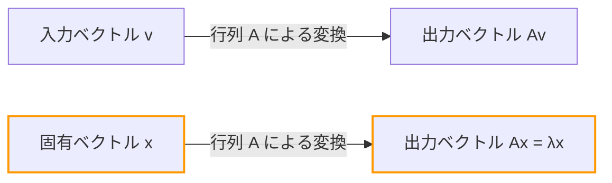
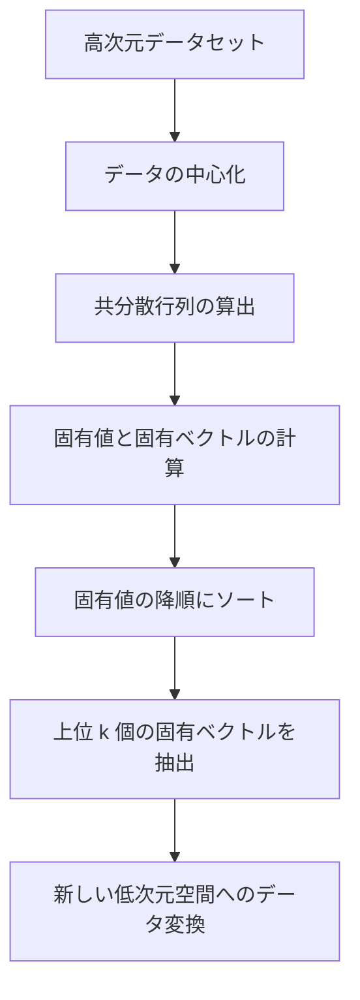

## はじめに

線形代数を学ぶ際、多くの人が最初の壁として感じるのが「行列の乗算」や「[行列式](/p/geometric-meaning-of-determinant/)」かもしれません。しかし、それらを乗り越えた先にある **固有値** (Eigenvalue) と **固有ベクトル** (Eigenvector) こそが、線形代数が現代の科学や工学において絶大な威力を発揮する源泉です。

機械学習における次元圧縮 (PCA)、Googleの[検索エンジン](/p/how-search-engines-work/)を支えたPageRankアルゴリズム、建物の耐震設計から量子力学のシュレーディンガー方程式に至るまで、[固有値と固有ベクトル](https://kenji.blog/p/eigenvalues-and-eigenvectors/)はあらゆる場所で顔を出します。本記事では、数式を追うだけでなく、その「幾何学的な意味」を直感的に理解することを目標とし、実践的な計算手法から実世界での応用までを網羅的に解説します。

## 行列による線形変換と幾何学的直観

[固有値と固有ベクトル](https://kenji.blog/p/eigenvalues-and-eigenvectors/)を理解するためには、まず「行列とは何か」という視点を変える必要があります。行列は単なる数字の並びではありません。空間における **変換器 (Transformation)** です。

あるベクトル $\mathbf{v}$ に行列 $A$ を掛けるという操作 $A\mathbf{v}$ は、ベクトル $\mathbf{v}$ を別のベクトル $\mathbf{v}'$ に変換することを意味します。

$$ \mathbf{v}' = A\mathbf{v} $$

一般的に、ベクトルに行列を掛けると、そのベクトルは「向き」も「大きさ」も変わってしまいます。しかし、空間全体がどのように歪んでも、**「向きが全く変わらない（あるいは真逆になるだけ）」** という特別なベクトルが存在することがあります。これが **固有ベクトル** です。そして、そのベクトルが変換によって「どれだけ引き伸ばされたか（または縮んだか）」を表す倍率が **固有値** です。

幾何学的には、空間を引き伸ばしたり回転させたりするような線形変換を行った際、変換の前後で同一線上に留まるベクトルを探す作業に他なりません。



## [固有値と固有ベクトル](https://kenji.blog/p/eigenvalues-and-eigenvectors/)の定義と数学的背景

数学的には、正方行列 $A$ に対して、次の条件を満たすゼロではないベクトル $\mathbf{v}$ と、スカラー $\lambda$ が存在するとき、$\mathbf{v}$ を行列 $A$ の **固有ベクトル**、$\lambda$ を **固有値** と呼びます。

$$ A\mathbf{v} = \lambda \mathbf{v} $$

ここで重要なのは、左辺は「行列とベクトルの積」、右辺は「スカラーとベクトルの積」であるということです。行列による複雑な多次元の変換が、特定の方向（固有ベクトル）に対しては単なる定数倍（1次元の拡縮）に等しくなるという、非常にシンプルな関係に帰着します。

この式を変形してみましょう。単位行列を $I$ とすると、$\mathbf{v} = I\mathbf{v}$ と書けるので、

$$ A\mathbf{v} = \lambda I\mathbf{v} $$
$$ A\mathbf{v} - \lambda I\mathbf{v} = \mathbf{0} $$
$$ (A - \lambda I)\mathbf{v} = \mathbf{0} $$

この方程式を満たす非ゼロのベクトル $\mathbf{v}$ が存在するための必要十分条件は、行列 $(A - \lambda I)$ が逆行列を持たないこと、すなわちその[行列式](/p/geometric-meaning-of-determinant/)がゼロになることです。

$$ \det(A - \lambda I) = 0 $$

これを **特性方程式 (Characteristic Equation)** または **固有方程式** と呼びます。

## 特性方程式と具体的な計算手順

それでは、具体的な $2 \times 2$ 行列を用いて、手計算で[固有値と固有ベクトル](https://kenji.blog/p/eigenvalues-and-eigenvectors/)を求めてみましょう。線形代数の試験などでも頻出のステップです。

例として、次の行列 $A$ を考えます。

$$
A = \begin{pmatrix} 4 & 1 \\ 2 & 3 \end{pmatrix}
$$

### ステップ 1: 固有値の計算

まず、特性方程式 $\det(A - \lambda I) = 0$ を解いて固有値 $\lambda$ を求めます。

$$
A - \lambda I = \begin{pmatrix} 4 & 1 \\ 2 & 3 \end{pmatrix} - \begin{pmatrix} \lambda & 0 \\ 0 & \lambda \end{pmatrix} = \begin{pmatrix} 4-\lambda & 1 \\ 2 & 3-\lambda \end{pmatrix}
$$

[行列式](/p/geometric-meaning-of-determinant/)を計算します。たすき掛けの要領で計算します。

$$
\det(A - \lambda I) = (4-\lambda)(3-\lambda) - (1)(2) = (\lambda^2 - 7\lambda + 12) - 2 = \lambda^2 - 7\lambda + 10
$$

これをゼロと置きます。

$$
\lambda^2 - 7\lambda + 10 = 0
$$

因数分解すると、

$$
(\lambda - 2)(\lambda - 5) = 0
$$

したがって、固有値は $\lambda_1 = 2$ と $\lambda_2 = 5$ になります。

### ステップ 2: 固有ベクトルの計算

それぞれの固有値に対して、固有ベクトルを求めます。$(A - \lambda I)\mathbf{v} = \mathbf{0}$ を解きます。$\mathbf{v} = \begin{pmatrix} x \\ y \end{pmatrix}$ とします。

**ケース 1: 固有値が 2 の場合**

$$
(A - 2I) \begin{pmatrix} x \\ y \end{pmatrix} = \begin{pmatrix} 2 & 1 \\ 2 & 1 \end{pmatrix} \begin{pmatrix} x \\ y \end{pmatrix} = \begin{pmatrix} 0 \\ 0 \end{pmatrix}
$$

これにより $2x + y = 0$ という方程式が得られます。$y = -2x$ ですから、固有ベクトルは定数 $c$ を用いて $\begin{pmatrix} c \\ -2c \end{pmatrix}$ と書けます。最もシンプルな形として $x = 1$ と置くと、

$$
\mathbf{v}_1 = \begin{pmatrix} 1 \\ -2 \end{pmatrix}
$$

となります。

**ケース 2: 固有値が 5 の場合**

$$
(A - 5I) \begin{pmatrix} x \\ y \end{pmatrix} = \begin{pmatrix} -1 & 1 \\ 2 & -2 \end{pmatrix} \begin{pmatrix} x \\ y \end{pmatrix} = \begin{pmatrix} 0 \\ 0 \end{pmatrix}
$$

これにより $-x + y = 0$、つまり $x = y$ となります。先ほどと同様にシンプルな整数比を選ぶと、固有ベクトルの一つは、

$$
\mathbf{v}_2 = \begin{pmatrix} 1 \\ 1 \end{pmatrix}
$$

となります。

これで、行列 $A$ の[固有値と固有ベクトル](https://kenji.blog/p/eigenvalues-and-eigenvectors/)がすべて求まりました。

## Pythonによる[固有値と固有ベクトル](https://kenji.blog/p/eigenvalues-and-eigenvectors/)の計算

現代の実務において、大きな行列の固有値を手計算で求めることはありません。Pythonの数値計算ライブラリであるNumPyを使用すれば、わずか数行で計算が可能です。

```python
import numpy as np

# 行列Aの定義
A = np.array([[4, 1],
              [2, 3]])

# 固有値と固有ベクトルを計算
eigenvalues, eigenvectors = np.linalg.eig(A)

print("固有値 (Eigenvalues):", eigenvalues)
print("固有ベクトル (Eigenvectors):\n", eigenvectors)

# 出力イメージ:
# 固有値 (Eigenvalues): [5. 2.]
# 固有ベクトル (Eigenvectors):
#  [[ 0.70710678 -0.4472136 ]
#   [ 0.70710678  0.89442719]]
```

NumPyの `np.linalg.eig` 関数は、正規化された（長さが1の）固有ベクトルを返します。手計算で求めたベクトル $\begin{pmatrix} 1 \\ 1 \end{pmatrix}$ や $\begin{pmatrix} 1 \\ -2 \end{pmatrix}$ の定数倍になっており、同じ方向を指していることが確認できます。

## 行列の対角化とその強力な恩恵

[固有値と固有ベクトル](https://kenji.blog/p/eigenvalues-and-eigenvectors/)の最も重要な応用のひとつが **行列の[対角化](/p/diagonalization-and-jordan-normal-form/)** です。[対角化](/p/diagonalization-and-jordan-normal-form/)とは、複雑な行列 $A$ を、計算が容易な対角行列 $D$ を用いて次のように分解することです。

$$ A = P D P^{-1} $$

ここで、$P$ は固有ベクトルを列ベクトルとして並べた行列、$D$ は対応する固有値を対角成分に持つ対角行列です。

先ほどの例を用いると、

$$
P = \begin{pmatrix} 1 & 1 \\ -2 & 1 \end{pmatrix}, \quad D = \begin{pmatrix} 2 & 0 \\ 0 & 5 \end{pmatrix}
$$

となります。この[対角化](/p/diagonalization-and-jordan-normal-form/)がなぜ重要なのでしょうか？それは、**行列の累乗計算が劇的に簡単になる** からです。

たとえば、$A$ を $100$ 乗したいとします。$A^{100}$ を直接計算するのは非常に大変な計算量となります。しかし、[対角化](/p/diagonalization-and-jordan-normal-form/)を利用すると、

$$
A^{100} = (P D P^{-1})(P D P^{-1}) \dots (P D P^{-1}) = P D^{100} P^{-1}
$$

途中の $P^{-1}P$ がすべて単位行列 $I$ になって消えるため、非常にシンプルな式に帰着します。対角行列 $D$ の累乗は、単に対角成分を累乗するだけで済みます。

$$
D^{100} = \begin{pmatrix} 2^{100} & 0 \\ 0 & 5^{100} \end{pmatrix}
$$

この性質は、[マルコフ連鎖](https://kenji.blog/p/markov-chain/)などの確率モデルで長期的な状態を予測する際や、微分方程式の系を解く際、さらには[フィボナッチ](https://kenji.blog/p/fibonacci/)数列の一般項を求めるような問題において不可欠なテクニックとなります。

## 現実世界における固有値・固有ベクトルの応用

ここまで数学的な側面を見てきましたが、これらの概念は現実世界の様々な課題を解決するエンジンの役割を果たしています。

### 1. 主成分分析 (PCA) とデータサイエンス

機械学習やデータサイエンスの分野で、高次元のデータを分析可能な低次元に圧縮する **主成分分析 (Principal Component Analysis, PCA)** という手法があります。

PCAでは、データの共分散行列の[固有値と固有ベクトル](https://kenji.blog/p/eigenvalues-and-eigenvectors/)を計算します。
- **固有ベクトル**: データの分散が最も大きくなる「新しい軸（主成分）」の方向を表します。
- **固有値**: その新しい軸に沿ったデータの分散の大きさ（情報量）を表します。

固有値が大きい固有ベクトルから順に選ぶことで、情報の損失を最小限に抑えながらデータの次元を削減できます。これにより、データの可視化や機械学習モデルの学習の高速化、ノイズの除去が可能になります。



### 2. GoogleのPageRankアルゴリズム

インターネット黎明期、Googleの[検索エンジン](/p/how-search-engines-work/)を世界一に押し上げたのは **PageRank (ページランク)** というアルゴリズムです。ウェブページ間のリンク構造を巨大な行列として表現し、「重要なページからリンクされているページもまた重要である」という考え方を数理モデル化しました。

驚くべきことに、各ウェブページの「重要度スコア」は、この巨大なリンク行列（または推移確率行列）の **最大の固有値 1 に対応する固有ベクトル** そのものなのです。Googleの初期のシステムは、数十億もの次元を持つ巨大な行列の固有ベクトルを求めるための巨大な反復計算システムでした。

### 3. 量子力学と物理システム

物理学の世界、特に量子力学において、観測可能な物理量（エネルギー、運動量など）は「エルミート演算子（行列）」として表されます。そして、観測によって得られる可能性のある測定値は、その演算子の **固有値** であり、測定後のシステムの状態は対応する **固有ベクトル** （固有状態）になります。

有名なシュレーディンガー方程式：

$$ \hat{H}\psi = E\psi $$

この方程式は、ハミルトニアン $\hat{H}$ （エネルギーの演算子）の固有値問題に他なりません。ここで $E$ がエネルギー固有値、$\psi$ が波動関数（固有状態）です。

また、古典物理学においても、橋や建物の振動解析、音響工学において固有値は「固有振動数（共振周波数）」を、固有ベクトルは「振動モード（揺れ方の形）」を表すために不可欠です。設計の際、特定の固有振動数が外部からの力（風や地震）の振動数と一致して共振破壊を起こさないようにするために、固有値解析が行われます。

## まとめ

[固有値と固有ベクトル](https://kenji.blog/p/eigenvalues-and-eigenvectors/)は、一見すると抽象的な数学のパズルに思えるかもしれません。しかし、幾何学的には「行列による複雑な変換の中で、決して変化しない本質的な軸」を抽出する操作であり、その応用範囲はコンピュータサイエンス、データサイエンス、理論物理学、機械工学まで多岐にわたります。

- **固有ベクトル**: 変換によって向きが変わらない、システムの本質的な方向・モード。
- **固有値**: その方向が変換によってどれだけ拡大・縮小されるかを表すスケールファクター（重要度・エネルギー量・周波数など）。

この直感的なイメージを持つことで、線形代数が単なる計算ルールの羅列ではなく、複雑な世界をシンプルに記述し、隠れた構造を暴き出すための極めて強力な言語であることが見えてくるはずです。より高度な数学や機械学習のアルゴリズムを学ぶ上で、この基礎概念はあなたの最も信頼できる武器となるでしょう。
