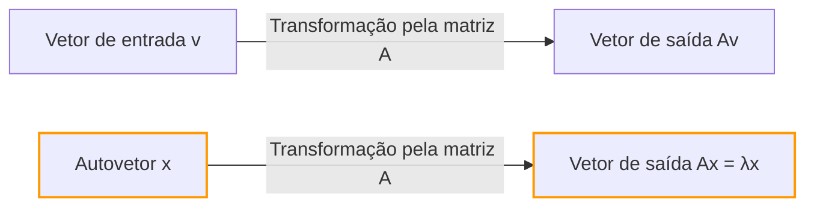
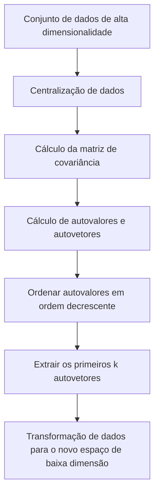

## Introdução

Ao aprender álgebra linear, os primeiros obstáculos que muitas pessoas enfrentam podem ser a "multiplicação de matrizes" ou os "determinantes". No entanto, além desses obstáculos está a verdadeira fonte do imenso poder da álgebra linear na ciência e engenharia modernas: os **autovalores** (Eigenvalues) e **autovetores** (Eigenvectors).

Desde a redução de dimensionalidade (PCA) no aprendizado de máquina e o algoritmo PageRank que impulsionou o mecanismo de busca do Google, até o projeto sísmico de edifícios e a equação de Schrödinger na mecânica quântica, autovalores e autovetores aparecem em toda parte.

O objetivo deste artigo não é apenas seguir as fórmulas matemáticas, mas entender intuitivamente o seu "significado geométrico". Explicaremos de forma abrangente tudo, desde os métodos de cálculo práticos até suas aplicações no mundo real.

## Transformações Lineares e Intuição Geométrica

Para entender autovalores e autovetores, primeiro você precisa mudar sua perspectiva sobre "o que é uma matriz". Uma matriz não é apenas uma grade de números. É um **transformador (Transformation)** no espaço.

A operação $A\mathbf{v}$, onde você multiplica um vetor $\mathbf{v}$ por uma matriz $A$, significa transformar o vetor $\mathbf{v}$ em um novo vetor $\mathbf{v}'$.

$$ \mathbf{v}' = A\mathbf{v} $$

Geralmente, quando você multiplica um vetor por uma matriz, sua "direção" e "magnitude" mudam. No entanto, não importa como todo o espaço seja distorcido, podem existir vetores especiais cuja **"direção não muda de forma alguma (ou inverte exatamente)"**. Esses são os **autovetores**. E o fator de escala que representa "o quanto foi esticado (ou encolhido)" pela transformação é o **autovalor**.

Geometricamente, ao realizar uma transformação linear que estica ou rotaciona o espaço, isso nada mais é do que o processo de encontrar vetores que permanecem exatamente na mesma linha antes e depois da transformação.



## Definição de [Autovalores e Autovetores](https://kenji.blog/pt/p/eigenvalues-and-eigenvectors/) e Contexto Matemático

Matematicamente, para uma matriz quadrada $A$, se existir um vetor não nulo $\mathbf{v}$ e um escalar $\lambda$ que satisfaçam a seguinte condição, $\mathbf{v}$ é chamado de **autovetor** da matriz $A$, e $\lambda$ é chamado de **autovalor**.

$$ A\mathbf{v} = \lambda \mathbf{v} $$

O importante aqui é que o lado esquerdo é um "produto de uma matriz e um vetor", enquanto o lado direito é o "produto de um escalar e um vetor". A transformação multidimensional complexa da matriz é reduzida a uma simples multiplicação escalar (escala 1D) para direções específicas (os autovetores).

Vamos reescrever esta equação. Seja $I$ a matriz identidade, então podemos escrever $\mathbf{v} = I\mathbf{v}$:

$$ A\mathbf{v} = \lambda I\mathbf{v} $$
$$ A\mathbf{v} - \lambda I\mathbf{v} = \mathbf{0} $$
$$ (A - \lambda I)\mathbf{v} = \mathbf{0} $$

A condição necessária e suficiente para que um vetor não nulo $\mathbf{v}$ satisfaça esta equação é que a matriz $(A - \lambda I)$ não possua inversa, o que significa que seu determinante deve ser zero.

$$ \det(A - \lambda I) = 0 $$

Isto é chamado de **Equação Característica (Characteristic Equation)**.

## Equação Característica e Passos de Cálculo Específicos

Agora, vamos calcular os autovalores e os autovetores à mão usando uma matriz específica de $2 \times 2$. Este é um passo muito comum em provas de álgebra linear.

Como exemplo, considere a seguinte matriz $A$:

$$
A = \begin{pmatrix} 4 & 1 \\ 2 & 3 \end{pmatrix}
$$

### Passo 1: Calculando os Autovalores

Primeiro, resolvemos a equação característica $\det(A - \lambda I) = 0$ para encontrar os autovalores $\lambda$.

$$
A - \lambda I = \begin{pmatrix} 4 & 1 \\ 2 & 3 \end{pmatrix} - \begin{pmatrix} \lambda & 0 \\ 0 & \lambda \end{pmatrix} = \begin{pmatrix} 4-\lambda & 1 \\ 2 & 3-\lambda \end{pmatrix}
$$

Calculamos o seu determinante:

$$
\det(A - \lambda I) = (4-\lambda)(3-\lambda) - (1)(2) = (\lambda^2 - 7\lambda + 12) - 2 = \lambda^2 - 7\lambda + 10
$$

Igualamos isso a zero:

$$
\lambda^2 - 7\lambda + 10 = 0
$$

Fatorando:

$$
(\lambda - 2)(\lambda - 5) = 0
$$

Portanto, os autovalores são $\lambda_1 = 2$ e $\lambda_2 = 5$.

### Passo 2: Calculando os Autovetores

Para cada autovalor, encontramos o autovetor correspondente. Resolvemos $(A - \lambda I)\mathbf{v} = \mathbf{0}$. Seja $\mathbf{v} = \begin{pmatrix} x \\ y \end{pmatrix}$.

**Caso 1: Quando o autovalor é 2**

$$
(A - 2I) \begin{pmatrix} x \\ y \end{pmatrix} = \begin{pmatrix} 2 & 1 \\ 2 & 1 \end{pmatrix} \begin{pmatrix} x \\ y \end{pmatrix} = \begin{pmatrix} 0 \\ 0 \end{pmatrix}
$$

Isso nos dá a equação $2x + y = 0$. Como $y = -2x$, o autovetor pode ser escrito como $\begin{pmatrix} c \\ -2c \end{pmatrix}$ usando uma constante $c$. Tomando a forma inteira mais simples definindo $x = 1$:

$$
\mathbf{v}_1 = \begin{pmatrix} 1 \\ -2 \end{pmatrix}
$$

**Caso 2: Quando o autovalor é 5**

$$
(A - 5I) \begin{pmatrix} x \\ y \end{pmatrix} = \begin{pmatrix} -1 & 1 \\ 2 & -2 \end{pmatrix} \begin{pmatrix} x \\ y \end{pmatrix} = \begin{pmatrix} 0 \\ 0 \end{pmatrix}
$$

Isso dá $-x + y = 0$, o que significa que $x = y$. Escolhendo uma razão inteira simples como antes, um dos autovetores é:

$$
\mathbf{v}_2 = \begin{pmatrix} 1 \\ 1 \end{pmatrix}
$$

Agora, encontramos todos os autovalores e autovetores para a matriz $A$.

## Calculando [Autovalores e Autovetores](https://kenji.blog/pt/p/eigenvalues-and-eigenvectors/) com Python

No trabalho prático moderno, nunca calculamos os autovalores de grandes matrizes à mão. Usando NumPy, uma biblioteca de computação numérica em Python, você pode calculá-los em apenas algumas linhas de código.

```python
import numpy as np

# Definição da matriz A
A = np.array([[4, 1],
              [2, 3]])

# Calcular autovalores e autovetores
eigenvalues, eigenvectors = np.linalg.eig(A)

print("Autovalores (Eigenvalues):", eigenvalues)
print("Autovetores (Eigenvectors):\n", eigenvectors)

# Exemplo de saída:
# Autovalores (Eigenvalues): [5. 2.]
# Autovetores (Eigenvectors):
#  [[ 0.70710678 -0.4472136 ]
#   [ 0.70710678  0.89442719]]
```

A função `np.linalg.eig` da biblioteca NumPy retorna autovetores normalizados (com comprimento 1). Você pode confirmar que eles são múltiplos constantes dos vetores $\begin{pmatrix} 1 \\ 1 \end{pmatrix}$ e $\begin{pmatrix} 1 \\ -2 \end{pmatrix}$ que calculamos à mão, confirmando que eles apontam exatamente na mesma direção.

## Diagonalização de Matrizes e Seus Benefícios Poderosos

Uma das aplicações mais importantes de autovalores e autovetores é a **diagonalização de matrizes**. A diagonalização é o processo de decompor uma matriz complexa $A$ usando uma matriz diagonal $D$ facilmente calculável, da seguinte forma:

$$ A = P D P^{-1} $$

Aqui, $P$ é uma matriz onde os autovetores estão dispostos como vetores coluna, e $D$ é uma matriz diagonal com os autovalores correspondentes em sua diagonal.

Usando nosso exemplo anterior:

$$
P = \begin{pmatrix} 1 & 1 \\ -2 & 1 \end{pmatrix}, \quad D = \begin{pmatrix} 2 & 0 \\ 0 & 5 \end{pmatrix}
$$

Por que essa diagonalização é tão importante? Porque **ela torna o cálculo de potências de matrizes dramaticamente mais fácil**.

Por exemplo, suponha que você queira calcular $A$ elevado a 100. Calcular $A^{100}$ diretamente exige uma quantidade imensa de cálculos. No entanto, usando a diagonalização:

$$
A^{100} = (P D P^{-1})(P D P^{-1}) \dots (P D P^{-1}) = P D^{100} P^{-1}
$$

Todos os $P^{-1}P$ intermediários se tornam a matriz identidade $I$ e se cancelam, reduzindo a uma equação muito simples. Elevar a matriz diagonal $D$ a uma potência requer simplesmente elevar seus elementos da diagonal àquela potência:

$$
D^{100} = \begin{pmatrix} 2^{100} & 0 \\ 0 & 5^{100} \end{pmatrix}
$$

Esta propriedade é uma técnica indispensável ao prever estados de longo prazo em modelos de probabilidade como cadeias de Markov, ao resolver sistemas de equações diferenciais, ou mesmo ao procurar o termo geral da sequência de [Fibonacci](https://kenji.blog/pt/p/fibonacci/).

## Aplicações no Mundo Real de [Autovalores e Autovetores](https://kenji.blog/pt/p/eigenvalues-and-eigenvectors/)

Até agora examinamos os aspectos matemáticos, mas esses conceitos atuam como motores para resolver vários desafios no mundo real.

### 1. Análise de Componentes Principais (PCA) e Ciência de Dados

Nos campos do aprendizado de máquina e da ciência de dados, existe uma técnica chamada **Análise de Componentes Principais (PCA)** que comprime dados de alta dimensionalidade (por exemplo, dados de imagem com centenas de pixels ou uma grande quantidade de histórico de comportamento de usuários) em uma dimensão inferior e analisável.

No PCA, calculamos os autovalores e os autovetores da matriz de covariância dos dados.
- **Autovetor**: Representa a direção do "novo eixo (componente principal)" onde a variância dos dados é maximizada.
- **Autovalor**: Representa a quantidade de variância (quantidade de informação) dos dados ao longo desse novo eixo.

Ao selecionar os autovetores em ordem decrescente de seus autovalores, podemos reduzir as dimensões dos dados minimizando a perda de informação. Isso permite a visualização de dados, acelera o treinamento de modelos de aprendizado de máquina e remove ruídos.



### 2. O Algoritmo PageRank do Google

Nos primórdios da internet, o algoritmo que impulsionou o mecanismo de busca do Google para o topo do mundo foi o **PageRank**. Ele representou a estrutura de links entre páginas da web como uma matriz enorme e modelou matematicamente a ideia de que "páginas vinculadas a partir de páginas importantes também são importantes".

Surpreendentemente, a "pontuação de importância" de cada página da web é precisamente o **autovetor correspondente ao maior autovalor de 1** para esta matriz gigante de links (ou matriz de probabilidade de transição). O sistema inicial do Google era um enorme motor de cálculo iterativo dedicado a encontrar o autovetor de uma matriz com bilhões de dimensões.

### 3. Mecânica Quântica e Sistemas Físicos

No mundo da física, especialmente na mecânica quântica, grandezas físicas observáveis (como energia e momento) são representadas por "operadores hermitianos (matrizes)". E os valores de medição possíveis obtidos por observação são os **autovalores** daquele operador, e o estado do sistema após a medição se torna o **autovetor** (autoestado) correspondente.

A famosa equação de Schrödinger:

$$ \hat{H}\psi = E\psi $$

Essa equação nada mais é do que um problema de autovalor para o Hamiltoniano $\hat{H}$ (o operador de energia). Aqui, $E$ é o autovalor de energia e $\psi$ é a função de onda (autoestado).

Além disso, na física clássica, como na análise de vibração de pontes e edifícios, ou na acústica, os autovalores são indispensáveis para representar "frequências naturais (frequências de ressonância)", enquanto os autovetores representam "modos de vibração (formas de oscilação)". Durante o projeto, uma análise de autovalores é realizada para garantir que frequências naturais específicas não correspondam às frequências de forças externas (como vento ou terremotos) para evitar falhas por ressonância.

## Conclusão

À primeira vista, autovalores e autovetores podem parecer quebra-cabeças matemáticos abstratos. Geometricamente, no entanto, trata-se da operação de extrair os "eixos essenciais que nunca mudam no meio de transformações complexas por matrizes", e suas aplicações variam da ciência da computação à ciência de dados, física teórica e engenharia mecânica.

- **Autovetor**: A direção ou modo essencial de um sistema que não muda de orientação após uma transformação.
- **Autovalor**: O fator de escala (importância, energia, frequência, etc.) que representa o quanto essa direção é esticada ou encolhida pela transformação.

Tendo em mente essa imagem intuitiva, você verá que a álgebra linear não é apenas uma lista de regras de cálculo, mas uma linguagem extremamente poderosa para descrever de forma simples o nosso mundo complexo e revelar suas estruturas ocultas. Ao aprender matemática mais avançada ou algoritmos de aprendizado de máquina, esses conceitos fundamentais se tornarão suas armas mais confiáveis.
