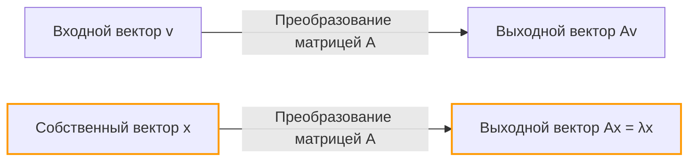
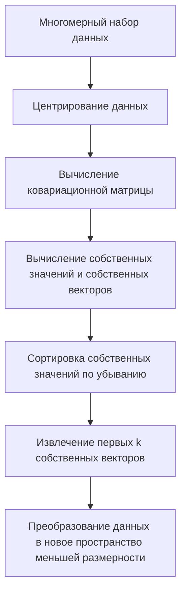

## Введение

При изучении линейной алгебры первыми препятствиями, с которыми сталкиваются многие, могут быть "умножение матриц" или "определители". Однако за этими препятствиями кроется истинный источник колоссальной мощи линейной алгебры в современной науке и технике: **собственные значения** (Eigenvalues) и **собственные векторы** (Eigenvectors).

От уменьшения размерности (PCA) в машинном обучении и алгоритма PageRank, который лег в основу поисковой системы Google, до сейсмостойкого проектирования зданий и уравнения Шредингера в квантовой механике — собственные значения и собственные векторы встречаются повсюду.

Цель этой статьи — не просто следовать математическим формулам, а интуитивно понять их "геометрический смысл". Мы подробно объясним всё: от практических методов вычислений до реальных применений в жизни.

## Линейные преобразования и геометрическая интуиция

Чтобы понять собственные значения и собственные векторы, вам сначала нужно изменить свой взгляд на то, "что такое матрица". Матрица — это не просто таблица чисел. Это **преобразователь (Transformation)** в пространстве.

Операция $A\mathbf{v}$, когда вы умножаете вектор $\mathbf{v}$ на матрицу $A$, означает преобразование вектора $\mathbf{v}$ в другой, новый вектор $\mathbf{v}'$.

$$ \mathbf{v}' = A\mathbf{v} $$

Обычно, когда вы умножаете вектор на матрицу, изменяются как его "направление", так и "величина". Однако, независимо от того, как искажается все пространство, могут существовать специальные векторы, чье **"направление совершенно не меняется (или меняется на строго противоположное)"**. Это и есть **собственные векторы**. А масштабный коэффициент, представляющий, "насколько он был растянут (или сжат)" преобразованием, является **собственным значением**.

Геометрически при выполнении линейного преобразования, которое растягивает или вращает пространство, это не что иное, как процесс поиска векторов, которые остаются на той же самой прямой до и после преобразования.



## Определение собственных значений и собственных векторов и математическая основа

Математически, для квадратной матрицы $A$, если существует ненулевой вектор $\mathbf{v}$ и скаляр $\lambda$, удовлетворяющие следующему условию, $\mathbf{v}$ называется **собственным вектором** матрицы $A$, а $\lambda$ называется **собственным значением**.

$$ A\mathbf{v} = \lambda \mathbf{v} $$

Здесь важно то, что левая часть — это "произведение матрицы на вектор", в то время как правая часть — "произведение скаляра на вектор". Сложное многомерное преобразование с помощью матрицы сводится к простому умножению на скаляр (одномерное масштабирование) для определенных направлений (собственных векторов).

Давайте перепишем это уравнение. Пусть $I$ — единичная матрица, так что мы можем написать $\mathbf{v} = I\mathbf{v}$:

$$ A\mathbf{v} = \lambda I\mathbf{v} $$
$$ A\mathbf{v} - \lambda I\mathbf{v} = \mathbf{0} $$
$$ (A - \lambda I)\mathbf{v} = \mathbf{0} $$

Необходимым и достаточным условием для того, чтобы ненулевой вектор $\mathbf{v}$ удовлетворял этому уравнению, является то, что матрица $(A - \lambda I)$ не имеет обратной, что означает, что ее определитель должен быть равен нулю.

$$ \det(A - \lambda I) = 0 $$

Это называется **характеристическим уравнением (Characteristic Equation)**.

## Характеристическое уравнение и конкретные шаги расчета

Теперь давайте вручную вычислим собственные значения и собственные векторы, используя конкретную матрицу $2 \times 2$. Это очень распространенный шаг на экзаменах по линейной алгебре.

В качестве примера рассмотрим следующую матрицу $A$:

$$
A = \begin{pmatrix} 4 & 1 \\ 2 & 3 \end{pmatrix}
$$

### Шаг 1: Вычисление собственных значений

Сначала мы решаем характеристическое уравнение $\det(A - \lambda I) = 0$, чтобы найти собственные значения $\lambda$.

$$
A - \lambda I = \begin{pmatrix} 4 & 1 \\ 2 & 3 \end{pmatrix} - \begin{pmatrix} \lambda & 0 \\ 0 & \lambda \end{pmatrix} = \begin{pmatrix} 4-\lambda & 1 \\ 2 & 3-\lambda \end{pmatrix}
$$

Вычисляем его определитель:

$$
\det(A - \lambda I) = (4-\lambda)(3-\lambda) - (1)(2) = (\lambda^2 - 7\lambda + 12) - 2 = \lambda^2 - 7\lambda + 10
$$

Приравниваем его к нулю:

$$
\lambda^2 - 7\lambda + 10 = 0
$$

Раскладываем на множители:

$$
(\lambda - 2)(\lambda - 5) = 0
$$

Следовательно, собственные значения равны $\lambda_1 = 2$ и $\lambda_2 = 5$.

### Шаг 2: Вычисление собственных векторов

Для каждого собственного значения мы находим соответствующий собственный вектор. Мы решаем $(A - \lambda I)\mathbf{v} = \mathbf{0}$. Пусть $\mathbf{v} = \begin{pmatrix} x \\ y \end{pmatrix}$.

**Случай 1: Когда собственное значение равно 2**

$$
(A - 2I) \begin{pmatrix} x \\ y \end{pmatrix} = \begin{pmatrix} 2 & 1 \\ 2 & 1 \end{pmatrix} \begin{pmatrix} x \\ y \end{pmatrix} = \begin{pmatrix} 0 \\ 0 \end{pmatrix}
$$

Это дает нам уравнение $2x + y = 0$. Поскольку $y = -2x$, собственный вектор можно записать как $\begin{pmatrix} c \\ -2c \end{pmatrix}$ с использованием константы $c$. Принимая простейшую целую форму путем установки $x = 1$:

$$
\mathbf{v}_1 = \begin{pmatrix} 1 \\ -2 \end{pmatrix}
$$

**Случай 2: Когда собственное значение равно 5**

$$
(A - 5I) \begin{pmatrix} x \\ y \end{pmatrix} = \begin{pmatrix} -1 & 1 \\ 2 & -2 \end{pmatrix} \begin{pmatrix} x \\ y \end{pmatrix} = \begin{pmatrix} 0 \\ 0 \end{pmatrix}
$$

Это дает $-x + y = 0$, что означает $x = y$. Выбирая простое отношение целых чисел, как и раньше, один из собственных векторов равен:

$$
\mathbf{v}_2 = \begin{pmatrix} 1 \\ 1 \end{pmatrix}
$$

Теперь мы нашли все собственные значения и собственные векторы для матрицы $A$.

## Вычисление собственных значений и собственных векторов с помощью Python

В современной практической работе никто не вычисляет собственные значения больших матриц вручную. Используя NumPy, библиотеку для числовых вычислений на Python, вы можете вычислить их всего за несколько строк кода.

```python
import numpy as np

# Определение матрицы A
A = np.array([[4, 1],
              [2, 3]])

# Вычисление собственных значений и собственных векторов
eigenvalues, eigenvectors = np.linalg.eig(A)

print("Собственные значения (Eigenvalues):", eigenvalues)
print("Собственные векторы (Eigenvectors):\n", eigenvectors)

# Пример вывода:
# Собственные значения (Eigenvalues): [5. 2.]
# Собственные векторы (Eigenvectors):
#  [[ 0.70710678 -0.4472136 ]
#   [ 0.70710678  0.89442719]]
```

Функция `np.linalg.eig` из NumPy возвращает нормализованные собственные векторы (длиной 1). Вы можете убедиться, что они являются константными кратными векторов $\begin{pmatrix} 1 \\ 1 \end{pmatrix}$ и $\begin{pmatrix} 1 \\ -2 \end{pmatrix}$, которые мы вычислили вручную, подтверждая, что они указывают в абсолютно том же направлении.

## Диагонализация матриц и ее мощные преимущества

Одним из важнейших применений собственных значений и собственных векторов является **диагонализация матриц**. Диагонализация — это процесс разложения сложной матрицы $A$ с использованием легко вычисляемой диагональной матрицы $D$ следующим образом:

$$ A = P D P^{-1} $$

Здесь $P$ — матрица, в которой собственные векторы расположены в виде векторов-столбцов, а $D$ — диагональная матрица с соответствующими собственными значениями на ее диагонали.

Используя наш предыдущий пример:

$$
P = \begin{pmatrix} 1 & 1 \\ -2 & 1 \end{pmatrix}, \quad D = \begin{pmatrix} 2 & 0 \\ 0 & 5 \end{pmatrix}
$$

Почему эта диагонализация так важна? Потому что **она делает возведение матриц в степень значительно проще**.

Например, предположим, что вы хотите вычислить $A$ в 100-й степени. Прямое вычисление $A^{100}$ требует огромного объема вычислений. Однако, используя диагонализацию:

$$
A^{100} = (P D P^{-1})(P D P^{-1}) \dots (P D P^{-1}) = P D^{100} P^{-1}
$$

Все промежуточные $P^{-1}P$ становятся единичной матрицей $I$ и сокращаются, сводясь к очень простому уравнению. Возведение диагональной матрицы $D$ в степень просто требует возведения ее диагональных элементов в эту степень:

$$
D^{100} = \begin{pmatrix} 2^{100} & 0 \\ 0 & 5^{100} \end{pmatrix}
$$

Это свойство является незаменимым методом при прогнозировании долгосрочных состояний в вероятностных моделях, таких как марковские цепи, при решении систем дифференциальных уравнений или даже при поиске общего члена последовательности Фибоначчи.

## Применение собственных значений и собственных векторов в реальном мире

До сих пор мы рассматривали математические аспекты, но эти концепции действуют как двигатели для решения различных задач в реальном мире.

### 1. Метод главных компонент (PCA) и наука о данных

В областях машинного обучения и науки о данных существует метод, называемый **методом главных компонент (PCA)**, который сжимает многомерные данные (например, данные изображений с сотнями пикселей или большой объем историй поведения пользователей) в анализируемую меньшую размерность.

В PCA мы вычисляем собственные значения и собственные векторы ковариационной матрицы данных.
- **Собственный вектор**: Представляет направление "новой оси (главной компоненты)", где дисперсия данных максимальна.
- **Собственное значение**: Представляет величину дисперсии (количество информации) данных вдоль этой новой оси.

Выбирая собственные векторы в порядке убывания их собственных значений, мы можем уменьшить размерность данных при минимизации потери информации. Это позволяет визуализировать данные, ускоряет обучение моделей машинного обучения и удаляет шум.



### 2. Алгоритм PageRank от Google

На заре развития интернета алгоритмом, который вывел поисковую систему Google на первое место в мире, был **PageRank**. Он представлял структуру ссылок между веб-страницами в виде массивной матрицы и математически моделировал идею о том, что "страницы, на которые ссылаются важные страницы, также являются важными".

Удивительно, но "оценка важности" каждой веб-страницы — это в точности **собственный вектор, соответствующий наибольшему собственному значению, равному 1** для этой гигантской матрицы ссылок (или матрицы вероятностей переходов). Первоначальная система Google была массивным двигателем итеративных вычислений, предназначенным для поиска собственного вектора матрицы с миллиардами измерений.

### 3. Квантовая механика и физические системы

В мире физики, особенно в квантовой механике, наблюдаемые физические величины (такие как энергия и импульс) представлены как "эрмитовы операторы (матрицы)". И возможные значения измерения, полученные при наблюдении, являются **собственными значениями** этого оператора, а состояние системы после измерения становится соответствующим **собственным вектором** (собственным состоянием).

Знаменитое уравнение Шредингера:

$$ \hat{H}\psi = E\psi $$

Это уравнение есть не что иное, как проблема собственных значений для гамильтониана $\hat{H}$ (оператора энергии). Здесь $E$ — собственное значение энергии, а $\psi$ — волновая функция (собственное состояние).

Также в классической физике, такой как анализ вибрации мостов и зданий, или в акустике, собственные значения незаменимы для представления "собственных частот (резонансных частот)", в то время как собственные векторы представляют "формы колебаний". Во время проектирования проводится анализ собственных значений, чтобы гарантировать, что определенные собственные частоты не совпадают с частотами внешних сил (таких как ветер или землетрясения) для предотвращения резонансного разрушения.

## Заключение

На первый взгляд, собственные значения и собственные векторы могут показаться абстрактными математическими головоломками. Однако геометрически это операция извлечения "существенных осей, которые никогда не меняются среди сложных преобразований с помощью матриц", и ее применения варьируются от информатики до науки о данных, теоретической физики и машиностроения.

- **Собственный вектор**: Основное направление или мода системы, которая не меняет своей ориентации после преобразования.
- **Собственное значение**: Масштабный коэффициент (важность, энергия, частота и т. д.), показывающий, насколько это направление растягивается или сжимается при преобразовании.

Имея в виду этот интуитивно понятный образ, вы увидите, что линейная алгебра — это не просто список правил вычислений, а чрезвычайно мощный язык для простого описания нашего сложного мира и раскрытия его скрытых структур. При изучении более продвинутой математики или алгоритмов машинного обучения эти фундаментальные концепции станут вашим самым надежным оружием.
