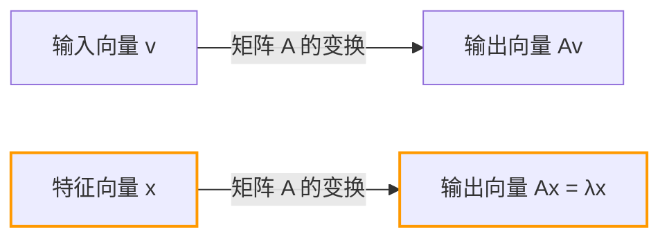
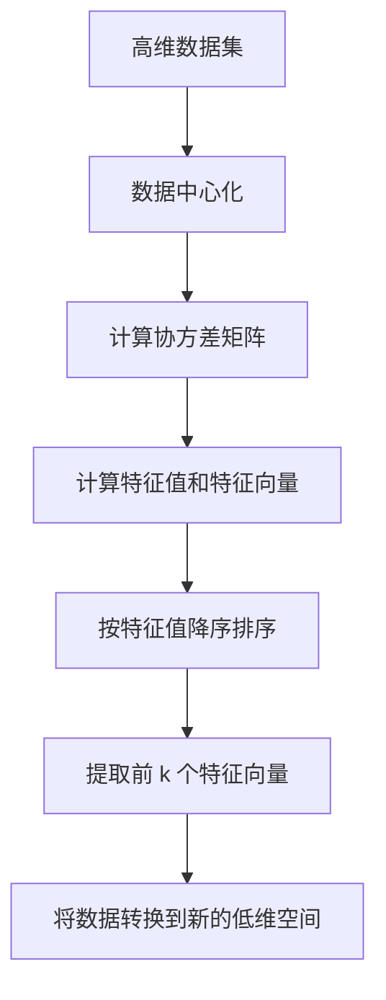

## 引言

在学习线性代数时，许多人遇到的第一个难关可能是“矩阵乘法”或“行列式”。然而，跨越这些障碍之后，真正的威力源泉在于 **特征值** (Eigenvalue) 与 **特征向量** (Eigenvector)，它们正是线性代数在现代科学与工程中发挥巨大作用的核心。

从机器学习中的降维技术 (PCA)、支撑谷歌搜索引擎的PageRank算法，到建筑物的抗震设计以及量子力学中的薛定谔方程，特征值和特征向量无处不在。

本文的目标不仅是推导数学公式，更在于直观地理解其“几何意义”。我们将从具体的计算方法一直讲解到它们在现实世界中的广泛应用。

## 矩阵线性变换与几何直观

为了理解特征值和特征向量，你首先需要转变对“什么是矩阵”的看法。矩阵不仅仅是数字的排列，它是空间中的 **变换器 (Transformation)**。

将一个向量 $\mathbf{v}$ 乘以矩阵 $A$ 的操作 $A\mathbf{v}$，意味着将向量 $\mathbf{v}$ 转换为另一个新向量 $\mathbf{v}'$。

$$ \mathbf{v}' = A\mathbf{v} $$

一般来说，将向量乘以矩阵后，该向量的“方向”和“大小”都会发生改变。然而，无论整个空间如何扭曲，可能存在一种特殊的向量，其 **“方向完全不发生改变（或恰好完全反向）”**。这就是 **特征向量**。而表示该向量在变换后“被拉伸或压缩了多少”的倍率，就是 **特征值**。

从几何学上看，在进行拉伸或旋转空间的线性变换时，这其实就是寻找在变换前后依然保持在同一直线上的向量的过程。



## [特征值与特征向量](https://kenji.blog/p/eigenvalues-and-eigenvectors/)的定义及数学背景

在数学上，对于一个方阵 $A$，如果存在一个非零向量 $\mathbf{v}$ 和一个标量 $\lambda$，满足以下条件，那么 $\mathbf{v}$ 就被称为矩阵 $A$ 的 **特征向量**，而 $\lambda$ 则被称为 **特征值**。

$$ A\mathbf{v} = \lambda \mathbf{v} $$

这里的关键在于，等式的左边是“矩阵与向量的乘积”，而右边是“标量与向量的乘积”。矩阵所带来的复杂的多维变换，对于特定的方向（特征向量）来说，退化为了简单的常数倍乘（一维缩放）。

让我们来变换一下这个等式。设 $I$ 为单位矩阵，所以我们可以写成 $\mathbf{v} = I\mathbf{v}$：

$$ A\mathbf{v} = \lambda I\mathbf{v} $$
$$ A\mathbf{v} - \lambda I\mathbf{v} = \mathbf{0} $$
$$ (A - \lambda I)\mathbf{v} = \mathbf{0} $$

为了让满足此方程的非零向量 $\mathbf{v}$ 存在，其充要条件是矩阵 $(A - \lambda I)$ 没有逆矩阵，也就是说它的行列式必须为零。

$$ \det(A - \lambda I) = 0 $$

这被称为 **特征方程 (Characteristic Equation)**。

## 特征方程与具体计算步骤

接下来，让我们使用一个具体的 $2 \times 2$ 矩阵，手动计算其特征值和特征向量。这是线性代数考试中非常常见的一步。

作为一个例子，我们考虑以下矩阵 $A$：

$$
A = \begin{pmatrix} 4 & 1 \\ 2 & 3 \end{pmatrix}
$$

### 步骤 1: 计算特征值

首先，求解特征方程 $\det(A - \lambda I) = 0$ 来得到特征值 $\lambda$。

$$
A - \lambda I = \begin{pmatrix} 4 & 1 \\ 2 & 3 \end{pmatrix} - \begin{pmatrix} \lambda & 0 \\ 0 & \lambda \end{pmatrix} = \begin{pmatrix} 4-\lambda & 1 \\ 2 & 3-\lambda \end{pmatrix}
$$

计算其行列式：

$$
\det(A - \lambda I) = (4-\lambda)(3-\lambda) - (1)(2) = (\lambda^2 - 7\lambda + 12) - 2 = \lambda^2 - 7\lambda + 10
$$

将其设为零：

$$
\lambda^2 - 7\lambda + 10 = 0
$$

通过因式分解：

$$
(\lambda - 2)(\lambda - 5) = 0
$$

因此，特征值为 $\lambda_1 = 2$ 和 $\lambda_2 = 5$。

### 步骤 2: 计算特征向量

对于每一个特征值，我们来求解对应的特征向量。即解方程 $(A - \lambda I)\mathbf{v} = \mathbf{0}$。设 $\mathbf{v} = \begin{pmatrix} x \\ y \end{pmatrix}$。

**情况 1: 当特征值为 2 时**

$$
(A - 2I) \begin{pmatrix} x \\ y \end{pmatrix} = \begin{pmatrix} 2 & 1 \\ 2 & 1 \end{pmatrix} \begin{pmatrix} x \\ y \end{pmatrix} = \begin{pmatrix} 0 \\ 0 \end{pmatrix}
$$

由此得到方程 $2x + y = 0$。因为 $y = -2x$，所以使用常数 $c$，特征向量可以写成 $\begin{pmatrix} c \\ -2c \end{pmatrix}$。取最简单的整数形式令 $x = 1$：

$$
\mathbf{v}_1 = \begin{pmatrix} 1 \\ -2 \end{pmatrix}
$$

**情况 2: 当特征值为 5 时**

$$
(A - 5I) \begin{pmatrix} x \\ y \end{pmatrix} = \begin{pmatrix} -1 & 1 \\ 2 & -2 \end{pmatrix} \begin{pmatrix} x \\ y \end{pmatrix} = \begin{pmatrix} 0 \\ 0 \end{pmatrix}
$$

由此得到 $-x + y = 0$，即 $x = y$。和前面一样选择简单的整数比，其中一个特征向量为：

$$
\mathbf{v}_2 = \begin{pmatrix} 1 \\ 1 \end{pmatrix}
$$

现在，我们求出了矩阵 $A$ 的所有特征值和特征向量。

## 使用Python计算[特征值与特征向量](https://kenji.blog/p/eigenvalues-and-eigenvectors/)

在现代实际应用中，我们绝不会手工去计算大型矩阵的特征值。借助Python的数值计算库NumPy，只需短短几行代码即可完成。

```python
import numpy as np

# 定义矩阵A
A = np.array([[4, 1],
              [2, 3]])

# 计算特征值和特征向量
eigenvalues, eigenvectors = np.linalg.eig(A)

print("特征值 (Eigenvalues):", eigenvalues)
print("特征向量 (Eigenvectors):\n", eigenvectors)

# 输出示例:
# 特征值 (Eigenvalues): [5. 2.]
# 特征向量 (Eigenvectors):
#  [[ 0.70710678 -0.4472136 ]
#   [ 0.70710678  0.89442719]]
```

NumPy的 `np.linalg.eig` 函数返回的是标准化（长度为1）后的特征向量。可以看出它们是我们手算的向量 $\begin{pmatrix} 1 \\ 1 \end{pmatrix}$ 和 $\begin{pmatrix} 1 \\ -2 \end{pmatrix}$ 的常数倍，这证实了它们指向完全相同的方向。

## 矩阵的对角化及其强大优势

特征值和特征向量最重要的应用之一是 **矩阵的对角化**。对角化是指将一个复杂的矩阵 $A$ 利用一个容易计算的对角矩阵 $D$ 分解为如下形式：

$$ A = P D P^{-1} $$

其中，$P$ 是将特征向量作为列向量排列成的矩阵，而 $D$ 是以对应的特征值作为对角线元素的对角矩阵。

使用之前的例子：

$$
P = \begin{pmatrix} 1 & 1 \\ -2 & 1 \end{pmatrix}, \quad D = \begin{pmatrix} 2 & 0 \\ 0 & 5 \end{pmatrix}
$$

为什么这种对角化如此重要？那是因为 **它使矩阵的幂运算变得极其简单**。

例如，假设你想计算 $A$ 的 $100$ 次方。直接计算 $A^{100}$ 的计算量大得惊人。但是，如果利用对角化：

$$
A^{100} = (P D P^{-1})(P D P^{-1}) \dots (P D P^{-1}) = P D^{100} P^{-1}
$$

中间的 $P^{-1}P$ 全部化为单位矩阵 $I$ 从而被消去，这就变成了一个非常简单的等式。对角矩阵 $D$ 的幂运算，只需要将其对角元素进行幂运算即可：

$$
D^{100} = \begin{pmatrix} 2^{100} & 0 \\ 0 & 5^{100} \end{pmatrix}
$$

这一性质在预测[马尔可夫链](https://kenji.blog/p/markov-chain/)等概率模型中的长期状态、求解微分方程组，甚至在推导斐波那契数列的通项公式时，都是不可或缺的技巧。

## [特征值与特征向量](https://kenji.blog/p/eigenvalues-and-eigenvectors/)在现实世界中的应用

刚才我们探讨了数学层面，但这些概念在解决现实世界的各种挑战时发挥着引擎般的作用。

### 1. 主成分分析 (PCA) 与数据科学

在机器学习和数据科学领域，有一种被称为 **主成分分析 (Principal Component Analysis, PCA)** 的技术，它可以将高维数据（例如包含数百像素的图像数据或大量用户行为记录）压缩为可分析的低维度。

在PCA中，我们会计算数据协方差矩阵的特征值和特征向量。
- **特征向量**：代表数据方差最大的“新轴（主成分）”方向。
- **特征值**：代表数据沿着该新轴的方差大小（信息量）。

通过按照特征值降序选择特征向量，我们可以最大限度地减少信息损失，同时降低数据的维度。这不仅有助于数据可视化、加快机器学习模型的训练速度，还能有效去除噪声。



### 2. 谷歌的PageRank算法

在互联网黎明期，将谷歌搜索引擎推向世界第一的正是 **PageRank** 算法。该算法将网页间的链接结构表示为一个巨大的矩阵，并将“被重要网页链接的网页也是重要的”这一思想用数学模型表达出来。

令人惊讶的是，每个网页的“重要性得分”，恰恰就是这个巨大链接矩阵（或状态转移概率矩阵）中 **最大特征值 1 所对应的特征向量**。谷歌早期的系统，本质上就是一个用来求解具有数十亿维度的巨型矩阵特征向量的巨大迭代计算系统。

### 3. 量子力学与物理系统

在物理学世界中，尤其是在量子力学里，可观测的物理量（如能量、动量等）都被表示为“厄米算符（矩阵）”。而通过观测可能得到的测量值，正是该算符的 **特征值**，测量后系统的状态则会坍缩为对应的 **特征向量**（本征态）。

著名的薛定谔方程：

$$ \hat{H}\psi = E\psi $$

这个方程无非就是哈密顿算符 $\hat{H}$（能量算符）的特征值问题。这里 $E$ 是能量特征值，$\psi$ 是波函数（本征态）。

此外，在经典物理学中，如桥梁和建筑的振动分析、声学工程中，特征值对于表示“固有频率（共振频率）”不可或缺，而特征向量则表示“振型（晃动的形态）”。在设计时，必须进行特征值分析，以确保特定的固有频率不会与外部力（如风或地震）的频率重合，从而防止共振破坏。

## 总结

乍看之下，[特征值与特征向量](https://kenji.blog/p/eigenvalues-and-eigenvectors/)可能像是抽象的数学谜题。但在几何上，它是从矩阵产生的复杂变换中，提取出“绝不改变的本质轴”的操作。它的应用范围非常广泛，涵盖了计算机科学、数据科学、理论物理和机械工程等领域。

- **特征向量**：变换后方向不变的，系统最本质的方向或模式。
- **特征值**：代表该方向在变换后被拉伸或压缩了多少的缩放因子（重要度、能量、频率等）。

掌握了这种直观的意象，你就会发现线性代数不仅仅是一堆计算规则，它是一门极其强大的语言，能够用简单的方式描述复杂的世界，并揭示其隐藏的结构。在学习更高级的数学或机器学习算法时，这些基础概念将成为你最可靠的武器。
