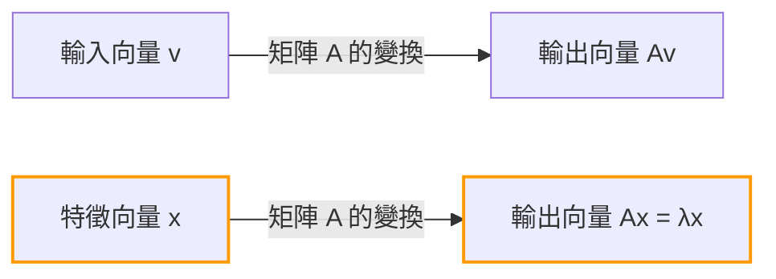
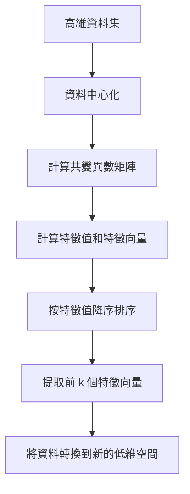

## 引言

在學習線性代數時，許多人遇到的第一個難關可能是「矩陣乘法」或「行列式」。然而，跨越這些障礙之後，真正的威力源泉在於 **特徵值** (Eigenvalue) 與 **特徵向量** (Eigenvector)，它們正是線性代數在現代科學與工程中發揮巨大作用的核心。

從機器學習中的降維技術 (PCA)、支撐Google搜尋引擎的PageRank演算法，到建築物的抗震設計以及量子力學中的薛丁格方程式，特徵值和特徵向量無處不在。

本文的目標不僅是推導數學公式，更在於直觀地理解其「幾何意義」。我們將從具體的計算方法一直講解到它們在現實世界中的廣泛應用。

## 矩陣線性變換與幾何直觀

為了理解特徵值和特徵向量，你首先需要轉變對「什麼是矩陣」的看法。矩陣不僅僅是數字的排列，它是空間中的 **變換器 (Transformation)**。

將一個向量 $\mathbf{v}$ 乘以矩陣 $A$ 的操作 $A\mathbf{v}$，意味著將向量 $\mathbf{v}$ 轉換為另一個新向量 $\mathbf{v}'$。

$$ \mathbf{v}' = A\mathbf{v} $$

一般來說，將向量乘以矩陣後，該向量的「方向」和「大小」都會發生改變。然而，無論整個空間如何扭曲，可能存在一種特殊的向量，其 **「方向完全不發生改變（或恰好完全反向）」**。這就是 **特徵向量**。而表示該向量在變換後「被拉伸或壓縮了多少」的倍率，就是 **特徵值**。

從幾何學上看，在進行拉伸或旋轉空間的線性變換時，這其實就是尋找在變換前後依然保持在同一直線上的向量的過程。



## 特徵值與特徵向量的定義及數學背景

在數學上，對於一個方陣 $A$，如果存在一個非零向量 $\mathbf{v}$ 和一個純量 $\lambda$，滿足以下條件，那麼 $\mathbf{v}$ 就被稱為矩陣 $A$ 的 **特徵向量**，而 $\lambda$ 則被稱為 **特徵值**。

$$ A\mathbf{v} = \lambda \mathbf{v} $$

這裡的關鍵在於，等式的左邊是「矩陣與向量的乘積」，而右邊是「純量與向量的乘積」。矩陣所帶來的複雜的多維變換，對於特定的方向（特徵向量）來說，退化為了簡單的常數倍乘（一維縮放）。

讓我們來變換一下這個等式。設 $I$ 為單位矩陣，所以我們可以寫成 $\mathbf{v} = I\mathbf{v}$：

$$ A\mathbf{v} = \lambda I\mathbf{v} $$
$$ A\mathbf{v} - \lambda I\mathbf{v} = \mathbf{0} $$
$$ (A - \lambda I)\mathbf{v} = \mathbf{0} $$

為了讓滿足此方程式的非零向量 $\mathbf{v}$ 存在，其充要條件是矩陣 $(A - \lambda I)$ 沒有反矩陣，也就是說它的行列式必須為零。

$$ \det(A - \lambda I) = 0 $$

這被稱為 **特徵方程式 (Characteristic Equation)**。

## 特徵方程式與具體計算步驟

接下來，讓我們使用一個具體的 $2 \times 2$ 矩陣，手動計算其特徵值和特徵向量。這是線性代數考試中非常常見的一步。

作為一個例子，我們考慮以下矩陣 $A$：

$$
A = \begin{pmatrix} 4 & 1 \\ 2 & 3 \end{pmatrix}
$$

### 步驟 1: 計算特徵值

首先，求解特徵方程式 $\det(A - \lambda I) = 0$ 來得到特徵值 $\lambda$。

$$
A - \lambda I = \begin{pmatrix} 4 & 1 \\ 2 & 3 \end{pmatrix} - \begin{pmatrix} \lambda & 0 \\ 0 & \lambda \end{pmatrix} = \begin{pmatrix} 4-\lambda & 1 \\ 2 & 3-\lambda \end{pmatrix}
$$

計算其行列式：

$$
\det(A - \lambda I) = (4-\lambda)(3-\lambda) - (1)(2) = (\lambda^2 - 7\lambda + 12) - 2 = \lambda^2 - 7\lambda + 10
$$

將其設為零：

$$
\lambda^2 - 7\lambda + 10 = 0
$$

透過因式分解：

$$
(\lambda - 2)(\lambda - 5) = 0
$$

因此，特徵值為 $\lambda_1 = 2$ 和 $\lambda_2 = 5$。

### 步驟 2: 計算特徵向量

對於每一個特徵值，我們來求解對應的特徵向量。即解方程式 $(A - \lambda I)\mathbf{v} = \mathbf{0}$。設 $\mathbf{v} = \begin{pmatrix} x \\ y \end{pmatrix}$。

**情況 1: 當特徵值為 2 時**

$$
(A - 2I) \begin{pmatrix} x \\ y \end{pmatrix} = \begin{pmatrix} 2 & 1 \\ 2 & 1 \end{pmatrix} \begin{pmatrix} x \\ y \end{pmatrix} = \begin{pmatrix} 0 \\ 0 \end{pmatrix}
$$

由此得到方程式 $2x + y = 0$。因為 $y = -2x$，所以使用常數 $c$，特徵向量可以寫成 $\begin{pmatrix} c \\ -2c \end{pmatrix}$。取最簡單的整數形式令 $x = 1$：

$$
\mathbf{v}_1 = \begin{pmatrix} 1 \\ -2 \end{pmatrix}
$$

**情況 2: 當特徵值為 5 時**

$$
(A - 5I) \begin{pmatrix} x \\ y \end{pmatrix} = \begin{pmatrix} -1 & 1 \\ 2 & -2 \end{pmatrix} \begin{pmatrix} x \\ y \end{pmatrix} = \begin{pmatrix} 0 \\ 0 \end{pmatrix}
$$

由此得到 $-x + y = 0$，即 $x = y$。和前面一樣選擇簡單的整數比，其中一個特徵向量為：

$$
\mathbf{v}_2 = \begin{pmatrix} 1 \\ 1 \end{pmatrix}
$$

現在，我們求出了矩陣 $A$ 的所有特徵值和特徵向量。

## 使用Python計算特徵值與特徵向量

在現代實際應用中，我們絕不會手工去計算大型矩陣的特徵值。藉助Python的數值計算庫NumPy，只需短短幾行程式碼即可完成。

```python
import numpy as np

# 定義矩陣A
A = np.array([[4, 1],
              [2, 3]])

# 計算特徵值和特徵向量
eigenvalues, eigenvectors = np.linalg.eig(A)

print("特徵值 (Eigenvalues):", eigenvalues)
print("特徵向量 (Eigenvectors):\n", eigenvectors)

# 輸出範例:
# 特徵值 (Eigenvalues): [5. 2.]
# 特徵向量 (Eigenvectors):
#  [[ 0.70710678 -0.4472136 ]
#   [ 0.70710678  0.89442719]]
```

NumPy的 `np.linalg.eig` 函式返回的是標準化（長度為1）後的特徵向量。可以看出它們是我們手算的向量 $\begin{pmatrix} 1 \\ 1 \end{pmatrix}$ 和 $\begin{pmatrix} 1 \\ -2 \end{pmatrix}$ 的常數倍，這證實了它們指向完全相同的方向。

## 矩陣的對角化及其強大優勢

特徵值和特徵向量最重要的應用之一是 **矩陣的對角化**。對角化是指將一個複雜的矩陣 $A$ 利用一個容易計算的對角矩陣 $D$ 分解為如下形式：

$$ A = P D P^{-1} $$

其中，$P$ 是將特徵向量作為行向量排列成的矩陣，而 $D$ 是以對應的特徵值作為對角線元素的對角矩陣。

使用之前的例子：

$$
P = \begin{pmatrix} 1 & 1 \\ -2 & 1 \end{pmatrix}, \quad D = \begin{pmatrix} 2 & 0 \\ 0 & 5 \end{pmatrix}
$$

為什麼這種對角化如此重要？那是因為 **它使矩陣的次方運算變得極其簡單**。

例如，假設你想計算 $A$ 的 $100$ 次方。直接計算 $A^{100}$ 的計算量大得驚人。但是，如果利用對角化：

$$
A^{100} = (P D P^{-1})(P D P^{-1}) \dots (P D P^{-1}) = P D^{100} P^{-1}
$$

中間的 $P^{-1}P$ 全部化為單位矩陣 $I$ 從而被消去，這就變成了一個非常簡單的等式。對角矩陣 $D$ 的次方運算，只需要將其對角元素進行次方運算即可：

$$
D^{100} = \begin{pmatrix} 2^{100} & 0 \\ 0 & 5^{100} \end{pmatrix}
$$

這一性質在預測馬可夫鏈等機率模型中的長期狀態、求解微分方程式組，甚至在推導費氏數列的一般項公式時，都是不可或缺的技巧。

## 特徵值與特徵向量在現實世界中的應用

剛才我們探討了數學層面，但這些概念在解決現實世界的各種挑戰時發揮著引擎般的作用。

### 1. 主成分分析 (PCA) 與資料科學

在機器學習和資料科學領域，有一種被稱為 **主成分分析 (Principal Component Analysis, PCA)** 的技術，它可以將高維資料（例如包含數百像素的圖像資料或大量使用者行為紀錄）壓縮為可分析的低維度。

在PCA中，我們會計算資料共變異數矩陣的特徵值和特徵向量。
- **特徵向量**：代表資料變異數最大的「新軸（主成分）」方向。
- **特徵值**：代表資料沿著該新軸的變異數大小（資訊量）。

透過按照特徵值降序選擇特徵向量，我們可以最大限度地減少資訊損失，同時降低資料的維度。這不僅有助於資料視覺化、加快機器學習模型的訓練速度，還能有效去除雜訊。



### 2. Google的PageRank演算法

在網際網路黎明期，將Google搜尋引擎推向世界第一的正是 **PageRank** 演算法。該演算法將網頁間的連結結構表示為一個巨大的矩陣，並將「被重要網頁連結的網頁也是重要的」這一思想用數學模型表達出來。

令人驚訝的是，每個網頁的「重要性分數」，恰恰就是這個巨大連結矩陣（或狀態轉移機率矩陣）中 **最大特徵值 1 所對應的特徵向量**。Google早期的系統，本質上就是一個用來求解具有數十億維度的巨型矩陣特徵向量的巨大迭代計算系統。

### 3. 量子力學與物理系統

在物理學世界中，尤其是在量子力學裡，可觀測的物理量（如能量、動量等）都被表示為「厄米算符（矩陣）」。而透過觀測可能得到的測量值，正是該算符的 **特徵值**，測量後系統的狀態則會塌縮為對應的 **特徵向量**（本徵態）。

著名的薛丁格方程式：

$$ \hat{H}\psi = E\psi $$

這個方程式無非就是哈密頓算符 $\hat{H}$（能量算符）的特徵值問題。這裡 $E$ 是能量特徵值，$\psi$ 是波函數（本徵態）。

此外，在古典物理學中，如橋樑和建築的振動分析、聲學工程中，特徵值對於表示「固有頻率（共振頻率）」不可或缺，而特徵向量則表示「振型（晃動的形態）」。在設計時，必須進行特徵值分析，以確保特定的固有頻率不會與外部力（如風或地震）的頻率重合，從而防止共振破壞。

## 總結

乍看之下，特徵值與特徵向量可能像是抽象的數學謎題。但在幾何上，它是從矩陣產生的複雜變換中，提取出「絕不改變的本質軸」的操作。它的應用範圍非常廣泛，涵蓋了計算機科學、資料科學、理論物理和機械工程等領域。

- **特徵向量**：變換後方向不變的，系統最本質的方向或模式。
- **特徵值**：代表該方向在變換後被拉伸或壓縮了多少的縮放因子（重要度、能量、頻率等）。

掌握了這種直觀的意象，你就會發現線性代數不僅僅是一堆計算規則，它是一門極其強大的語言，能夠用簡單的方式描述複雜的世界，並揭示其隱藏的結構。在學習更高級的數學或機器學習演算法時，這些基礎概念將成為你最可靠的武器。
