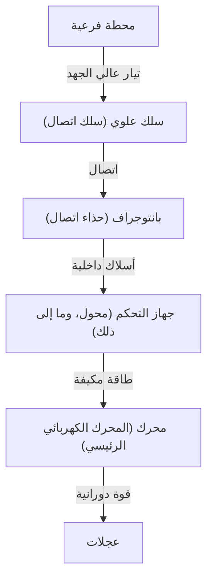

في المجتمع الحديث، تعتبر القطارات وسيلة نقل لا غنى عنها في حياتنا. تحمل السكك الحديدية ملايين الأشخاص كل يوم وتعمل كشرايين للمدن، ولكن وراءها تكمن بلورة للهندسة والفيزياء المتقدمة للغاية. يعلم الجميع أن "القطارات تعمل بالكهرباء"، ولكن كيف بالضبط يتم تحويل الطاقة التي يتم الحصول عليها من خطوط النقل إلى "قوة دفع" قادرة على دفع هيكل سيارة يزن مئات الأطنان بسرعات تزيد عن 100 كيلومتر في الساعة؟

يتعمق هذا المقال في الآليات الفنية لكيفية عمل القطارات. سنشرح بالتفصيل التقنيات الأساسية التي تدعم السكك الحديدية الحديثة، من رحلة الكهرباء من البانتوجراف إلى المحرك، وأحدث تقنية تحكم في محول VVVF، والكبح المتجدد الصديق للبيئة.

## 1. إمدادات الطاقة وجمع التيار: دور البانتوجراف

مصدر الطاقة لتشغيل القطار هو الكهرباء الموردة من الخارج. في كثير من الحالات، يتم أخذ الطاقة من "سلك علوي (سلك اتصال)" ممتد فوق المسارات. الجهاز الحاسم الذي يوجه هذه الطاقة إلى السيارة هو "البانتوجراف".

### الاتصال بين السلك العلوي والبانتوجراف
يتدفق تيار مباشر عالي الجهد أو تيار متردد (على سبيل المثال، 1500 فولت تيار مستمر، 20000 فولت تيار متردد) عبر السلك العلوي. يتم ضغط البانتوجراف باستمرار على السلك العلوي بضغط معين بواسطة الضغط الهوائي أو قوة الزنبرك. أثناء السفر، يحتك جزء البانتوجراف المسمى "حذاء الاتصال" بشكل مكثف بالسلك العلوي، لكن حذاء الاتصال يستخدم مواد خاصة قائمة على الكربون أو المعادن للحفاظ على اتصال كهربائي موثوق به مع منع التآكل.

في القطارات عالية السرعة مثل شينكانسن، تحدث "ظاهرة موجية" حيث يتموج السلك العلوي، لذلك يلزم وجود قابلية تتبع عالية لمنع "فقدان الاتصال"، حيث ينفصل البانتوجراف عن السلك العلوي.

## 2. قلب الدفع: محرك التيار المتردد والتحكم في محول VVVF

كانت القطارات القديمة (سيارات محركات التيار المستمر) تتحكم في السرعة عن طريق ضبط الجهد باستخدام المقاومات، لكن كان لهذا عيوب مثل "فقدان كبير للطاقة (حرارة)" و"صعوبة صيانة فرش المحرك". تستخدم القطارات الحديثة "محركات حثية للتيار المتردد ثلاثية الطور (أو محركات متزامنة)"، والتي تعد أكثر كفاءة ولا تحتاج إلى صيانة.

ومع ذلك، إذا كانت الكهرباء المرسلة من السلك العلوي تيارًا مباشرًا، فلا يمكنها تدوير محرك تيار متردد كما هو. هنا يأتي دور "محول VVVF (محول الجهد المتغير والتردد المتغير)".

### كيف يعمل محول VVVF
يرمز VVVF إلى "الجهد المتغير، التردد المتغير". المحول هو جهاز يحول التيار المستمر إلى تيار متردد، ولكن محول VVVF لا يمكنه فقط تحويله بل **التحكم بحرية في مستوى الجهد والتردد**.

تتناسب سرعة دوران محرك التيار المتردد مع "التردد"، وتعتمد القوة (عزم الدوران) التي يولدها على "نسبة الجهد إلى التردد". من خلال تدويره ببطء وبقوة كبيرة بتردد منخفض وجهد منخفض عند البدء، ثم زيادة التردد والجهد مع زيادة السرعة، يتم تحقيق تسارع سلس للغاية وعالي الكفاءة.

تستخدم أحدث المحولات أشباه موصلات طاقة من الجيل التالي مثل SiC (كربيد السيليكون) و GaN (نيتريد الغاليوم)، والتي تقلل بشكل كبير من فقدان الطاقة وتساهم في جعل المعدات أصغر وأخف وزنًا.

## 3. من المحرك إلى العجلات: آلية نقل الطاقة

عندما يتم إرسال الطاقة التي يتم التحكم فيها بشكل صحيح بواسطة المحول إلى المحرك، يبدأ عمود الدوران للمحرك بالدوران بسرعة عالية. ومع ذلك، حتى إذا تم نقل دوران المحرك مباشرة إلى العجلات، فلن تكون هناك قوة كافية ولن يتحرك القطار. هنا تكون هناك حاجة إلى آلية تباطؤ باستخدام "التروس".

يتم توصيل ترس صغير (ترس بنيون) بعمود الدوران للمحرك، ويتم توصيل ترس كبير (ترس رئيسي) بمحور العجلة. عن طريق تدوير الترس الكبير بالترس الصغير، تقل سرعة الدوران، ولكن يزداد "عزم الدوران (قوة الدوران)" في المقابل. من خلال هذه الآلية، يتم تحويل الدوران عالي السرعة للمحرك إلى قوة الدفع الهائلة اللازمة لتحريك جسم القطار الثقيل.

بالإضافة إلى ذلك، لمنع انتقال اهتزازات المحرك مباشرة إلى المحور، يتم استخدام أدوات التوصيل الخاصة (أدوات التوصيل المرنة) مثل "أدوات التوصيل WN" و"أدوات التوصيل TD"، مما يحسن راحة الركوب ويقلل الضوضاء.

## 4. تقنية التوقف: الكبح المتجدد والفرامل الهوائية

بالنسبة للقطارات، من الأهمية بمكان ليس فقط الجري ولكن التوقف بأمان وموثوقية. تتوقف القطارات الحديثة بشكل أساسي عن طريق تنسيق نوعين من الفرامل.

### الكبح المتجدد (الفرامل الكهربائية)
يصبح المحرك "مصدر طاقة" عندما تمر الكهرباء من خلاله، ولكن على العكس من ذلك، عندما يتم تدويره بالقوة من الخارج، فإنه يصبح "مولدًا". يستخدم الكبح المتجدد هذا المبدأ.
عند الكبح، يتم تبديل تحكم المحول، ويتم استخدام قوة دوران العجلات لتدوير المحرك وتوليد الكهرباء. لأن توليد الكهرباء يتطلب كمية كبيرة من الطاقة (المقاومة)، فهذا يعمل كقوة كبح. علاوة على ذلك، يتم إرجاع الكهرباء المولدة هنا إلى السلك العلوي وإعادة استخدامها كطاقة للقطارات الأخرى التي تعمل في مكان قريب. هذا يحقق وفورات كبيرة في الطاقة.

### الفرامل الهوائية (الفرامل الاحتكاكية)
على غرار فرامل القرص في السيارة، فهذه فرامل مادية تتوقف عن طريق الاحتكاك عن طريق الضغط على أحذية الفرامل ضد العجلات أو الأقراص. نظرًا لأن الكبح المتجدد يصبح غير فعال عندما تنخفض السرعة بشكل كبير، يتم تنشيط هذه الفرامل الهوائية قبل التوقف مباشرة أو في حالات الطوارئ.

في القطارات الحديثة، يعتبر "التحكم في المزج"، حيث يحسب الكمبيوتر على الفور نسبة الكبح المتجدد إلى الفرامل الهوائية ويخلق تلقائيًا قوة الكبح المثلى، أمرًا شائعًا.

## استنتاج

تعمل القطارات التي نستخدمها بشكل عرضي من خلال مزيج من التقنيات المتقدمة المتعددة: "جمع التيار بواسطة البانتوجراف"، و"التحكم الدقيق في الطاقة بواسطة محول VVVF باستخدام أشباه موصلات الطاقة"، و"تحويل الطاقة بواسطة محركات وتروس التيار المتردد عالية الكفاءة"، و"الكبح المتجدد الذي لا يهدر الطاقة".

تستمر هذه التقنيات في التطور اليوم، وتستمر تحديات المهندسين نحو تحقيق نظام النقل النهائي الأكثر هدوءًا، والذي يتمتع براحة قيادة أفضل، وتأثير أقل على البيئة.
