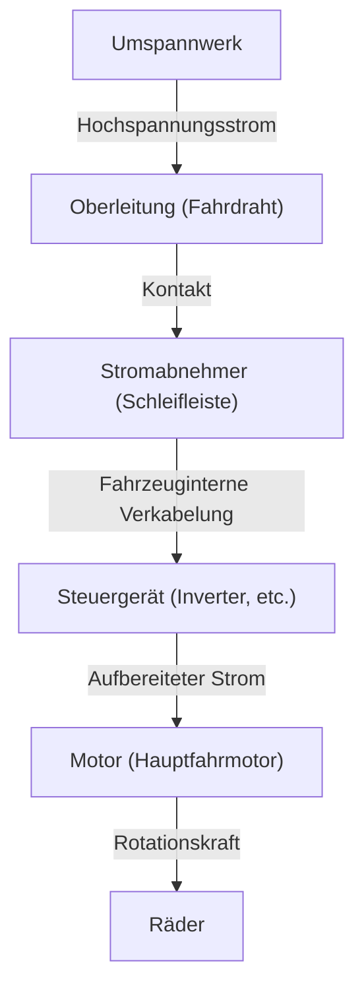

In der modernen Gesellschaft sind Züge ein unverzichtbares Transportmittel in unserem Leben. Eisenbahnen befördern täglich Millionen von Menschen und fungieren als Adern der Städte, aber dahinter verbirgt sich eine Kristallisation von extrem fortschrittlicher Ingenieurskunst und Physik. Jeder weiß, dass "Züge mit Strom fahren", aber wie genau wird die aus den Übertragungsleitungen gewonnene Energie in einen "Antrieb" umgewandelt, der in der Lage ist, eine Karosserie von Hunderten von Tonnen mit Geschwindigkeiten von über 100 Stundenkilometern anzutreiben?

Dieser Artikel befasst sich eingehend mit den technischen Mechanismen der Funktionsweise von Zügen. Wir werden die Kerntechnologien, die moderne Eisenbahnen unterstützen, im Detail erklären, vom Weg des Stroms vom Stromabnehmer zum Motor über die neueste VVVF-Inverter-Steuerungstechnologie bis hin zum umweltfreundlichen regenerativen Bremsen.

## 1. Stromversorgung und Stromabnahme: Die Rolle des Stromabnehmers

Die Energiequelle für den Betrieb eines Zuges ist von außen zugeführter Strom. In vielen Fällen wird der Strom aus einer "Oberleitung (Fahrdraht)" entnommen, die über die Gleise gespannt ist. Die entscheidende Vorrichtung, die diesen Strom in das Fahrzeug leitet, ist der "Stromabnehmer" (Pantograph).

### Kontakt zwischen Oberleitung und Stromabnehmer
Durch die Oberleitung fließt Hochspannungs-Gleichstrom oder -Wechselstrom (z. B. 1500 V DC, 20000 V AC). Der Stromabnehmer wird durch pneumatischen Druck oder Federkraft ständig mit einem bestimmten Druck gegen die Oberleitung gedrückt. Während der Fahrt reibt das Teil des Stromabnehmers, das als "Schleifleiste" bezeichnet wird, stark an der Oberleitung, aber die Schleifleiste verwendet spezielle Materialien auf Kohlenstoff- oder Metallbasis, um einen zuverlässigen elektrischen Kontakt aufrechtzuerhalten und gleichzeitig Verschleiß zu vermeiden.

Bei Hochgeschwindigkeitszügen wie dem Shinkansen tritt ein "Wellenphänomen" auf, bei dem die Oberleitung wellenförmig verläuft. Daher ist eine hohe Nachführbarkeit erforderlich, um einen "Kontaktverlust" zu verhindern, bei dem sich der Stromabnehmer von der Oberleitung trennt.

## 2. Das Herz des Antriebs: AC-Motor und VVVF-Invertersteuerung

Ältere Züge (Gleichstrom-Triebwagen) steuerten die Geschwindigkeit durch Einstellen der Spannung mithilfe von Widerständen, was jedoch Nachteile wie "großer Energieverlust (Wärme)" und "schwierige Wartung der Motorbürsten" mit sich brachte. Moderne Züge verwenden "Dreiphasen-Wechselstrom-Induktionsmotoren (oder Synchronmotoren)", die effizienter und wartungsfrei sind.

Wenn der von der Oberleitung gesendete Strom jedoch Gleichstrom ist, kann er einen Wechselstrommotor nicht ohne Weiteres drehen. Hier kommt der "VVVF-Inverter (Variable Voltage Variable Frequency Inverter)" ins Spiel.

### Wie der VVVF-Inverter funktioniert
VVVF steht für "Variable Voltage, Variable Frequency" (variable Spannung, variable Frequenz). Ein Inverter (Wechselrichter) ist ein Gerät, das Gleichstrom in Wechselstrom umwandelt, aber der VVVF-Inverter kann ihn nicht nur umwandeln, sondern auch **den Spannungspegel und die Frequenz frei steuern**.

Die Drehzahl eines Wechselstrommotors ist proportional zur "Frequenz", und die von ihm erzeugte Kraft (Drehmoment) hängt vom "Verhältnis von Spannung zu Frequenz" ab. Durch langsames Drehen mit großer Kraft bei niedriger Frequenz und niedriger Spannung beim Anfahren und anschließendes Erhöhen der Frequenz und Spannung mit zunehmender Geschwindigkeit wird eine extrem sanfte und hocheffiziente Beschleunigung erreicht.

Die neuesten Inverter verwenden Leistungshalbleiter der nächsten Generation wie SiC (Siliziumkarbid) und GaN (Galliumnitrid), die den Leistungsverlust erheblich reduzieren und dazu beitragen, die Ausrüstung kleiner und leichter zu machen.

## 3. Vom Motor zu den Rädern: Kraftübertragungsmechanismus

Wenn der vom Inverter richtig gesteuerte Strom an den Motor gesendet wird, beginnt sich die rotierende Welle des Motors mit hoher Geschwindigkeit zu drehen. Selbst wenn die Drehung des Motors jedoch direkt auf die Räder übertragen wird, reicht die Kraft nicht aus und der Zug bewegt sich nicht. Hier ist ein Verzögerungsmechanismus mit "Zahnrädern" erforderlich.

Ein kleines Zahnrad (Ritzel) ist an der rotierenden Welle des Motors befestigt, und ein großes Zahnrad (Großrad) ist an der Radachse befestigt. Durch Drehen des großen Zahnrads mit dem kleinen Zahnrad nimmt die Drehzahl ab, aber das "Drehmoment (Rotationskraft)" nimmt entsprechend zu. Durch diesen Mechanismus wird die Hochgeschwindigkeitsrotation des Motors in den massiven Antrieb umgewandelt, der benötigt wird, um den schweren Zugkörper zu bewegen.

Um zu verhindern, dass die Vibrationen des Motors direkt auf die Achse übertragen werden, werden außerdem spezielle Kupplungen (flexible Kupplungen) wie "WN-Kupplungen" und "TD-Kupplungen" verwendet, die den Fahrkomfort verbessern und Geräusche reduzieren.

## 4. Technologie zum Anhalten: Regeneratives Bremsen und Druckluftbremse

Für Züge ist es das Wichtigste, nicht nur zu fahren, sondern sicher und zuverlässig anzuhalten. Moderne Züge halten hauptsächlich an, indem sie zwei Arten von Bremsen koordinieren.

### Regeneratives Bremsen (Elektrische Bremse)
Ein Motor wird zu einer "Energiequelle", wenn Strom durch ihn fließt, aber umgekehrt wird er zu einem "Generator", wenn er zwangsweise von außen gedreht wird. Das regenerative Bremsen nutzt dieses Prinzip.
Beim Bremsen wird die Invertersteuerung umgeschaltet und die Rotationskraft der Räder wird verwendet, um den Motor zu drehen und Strom zu erzeugen. Da die Stromerzeugung viel Energie (Widerstand) erfordert, wirkt dies als Bremskraft. Darüber hinaus wird der hier erzeugte Strom an die Oberleitung zurückgegeben und als Strom für andere in der Nähe fahrende Züge wiederverwendet. Dadurch werden erhebliche Energieeinsparungen erzielt.

### Druckluftbremse (Reibungsbremse)
Ähnlich wie bei den Scheibenbremsen eines Autos handelt es sich um eine physikalische Bremse, die durch Reibung stoppt, indem Bremsbacken gegen die Räder oder Scheiben gedrückt werden. Da die regenerative Bremse wirkungslos wird, wenn die Geschwindigkeit extrem stark abfällt, wird diese Druckluftbremse kurz vor dem Anhalten oder in Notfällen aktiviert.

Bei neueren Zügen ist die "Mischsteuerung" üblich, bei der ein Computer das Verhältnis von regenerativem Bremsen zu Druckluftbremsen sofort berechnet und automatisch die optimale Bremskraft erzeugt.

## Fazit

Die Züge, die wir beiläufig nutzen, funktionieren durch eine Kombination mehrerer fortschrittlicher Technologien: "Stromabnahme durch Stromabnehmer", "präzise Leistungssteuerung durch VVVF-Inverter unter Verwendung von Leistungshalbleitern", "Leistungsumwandlung durch hocheffiziente Wechselstrommotoren und Getriebe" und "regeneratives Bremsen, das keine Energie verschwendet".

Diese Technologien entwickeln sich heute weiter, und die Herausforderungen der Ingenieure gehen weiter in Richtung der Realisierung des ultimativen Transportsystems, das leiser ist, einen besseren Fahrkomfort bietet und die Umwelt weniger belastet.
