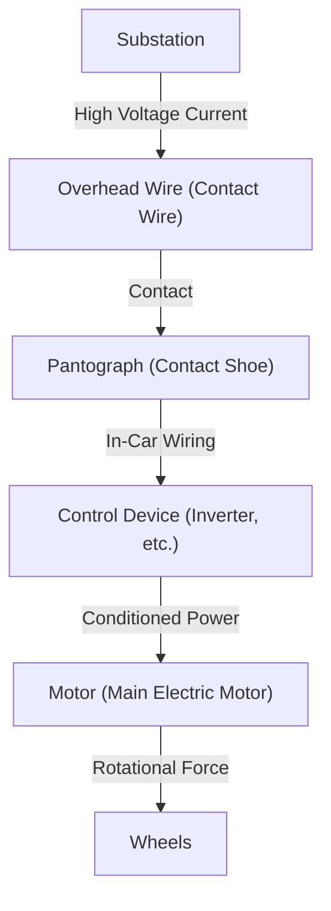

In modern society, trains are an indispensable means of transportation in our lives. Railways carry millions of people every day and function as the arteries of cities, but behind them lies a crystallization of extremely advanced engineering and physics. Everyone knows that "trains run on electricity," but exactly how is the power obtained from transmission lines converted into "propulsion" capable of driving a car body weighing hundreds of tons at speeds of over 100 kilometers per hour?

This article delves deeply into the technical mechanisms of how trains work. We will explain in detail the core technologies that support modern railways, from the journey of electricity from the pantograph to the motor, the latest VVVF inverter control technology, and environmentally friendly regenerative braking.

## 1. Power Supply and Current Collection: The Role of the Pantograph

The energy source for a train to run is electricity supplied from the outside. In many cases, power is taken in from an "overhead wire (contact wire)" stretched above the tracks. The crucial device that guides this power into the vehicle is the "pantograph."

### Contact Between the Overhead Wire and the Pantograph
High voltage direct current or alternating current (e.g., 1500V DC, 20000V AC) flows through the overhead wire. The pantograph is constantly pressed against the overhead wire with a certain pressure by pneumatic pressure or spring force. While traveling, the part of the pantograph called the "contact shoe" rubs intensely against the overhead wire, but the contact shoe uses special carbon-based or metal-based materials to maintain reliable electrical contact while preventing wear.

On high-speed trains like the Shinkansen, a "wave phenomenon" occurs where the overhead wire undulates, so high followability is required to prevent "contact loss," where the pantograph separates from the overhead wire.

## 2. The Heart of Propulsion: AC Motor and VVVF Inverter Control

Older trains (DC motor cars) controlled speed by adjusting the voltage using resistors, but this had drawbacks such as "large energy loss (heat)" and "difficult maintenance of the motor brushes." Modern trains use "three-phase AC induction motors (or synchronous motors)," which are more efficient and maintenance-free.

However, if the electricity sent from the overhead wire is direct current, it cannot turn an AC motor as is. This is where the "VVVF Inverter (Variable Voltage Variable Frequency Inverter)" comes in.

### How the VVVF Inverter Works
VVVF stands for "Variable Voltage, Variable Frequency." An inverter is a device that converts direct current into alternating current, but the VVVF inverter can not only convert it but also **freely control the voltage level and frequency**.

The rotational speed of an AC motor is proportional to the "frequency," and the force (torque) it generates depends on the "ratio of voltage to frequency." By turning it slowly and with great force at a low frequency and low voltage when starting, and then increasing the frequency and voltage as speed increases, extremely smooth and highly efficient acceleration is achieved.

The latest inverters employ next-generation power semiconductors such as SiC (Silicon Carbide) and GaN (Gallium Nitride), which significantly reduce power loss and contribute to making the equipment smaller and lighter.

## 3. From Motor to Wheels: Power Transmission Mechanism

When power properly controlled by the inverter is sent to the motor, the rotating shaft of the motor begins to rotate at high speed. However, even if the rotation of the motor is transmitted directly to the wheels, there is not enough force and the train will not move. This is where a deceleration mechanism using "gears" is needed.

A small gear (pinion gear) is attached to the motor's rotating shaft, and a large gear (bull gear) is attached to the wheel axle. By turning the large gear with the small gear, the rotational speed decreases, but the "torque (rotational force)" increases correspondingly. Through this mechanism, the high-speed rotation of the motor is converted into the massive propulsion needed to move the heavy train body.

In addition, to prevent the motor's vibrations from being transmitted directly to the axle, special couplings (flexible couplings) such as "WN couplings" and "TD couplings" are used, improving ride comfort and reducing noise.

## 4. Technology for Stopping: Regenerative Braking and Air Braking

For trains, it is most important not only to run but to stop safely and reliably. Modern trains stop primarily by coordinating two types of brakes.

### Regenerative Braking (Electric Braking)
A motor becomes a "power source" when electricity is passed through it, but conversely, when it is forcibly turned from the outside, it becomes a "generator." Regenerative braking utilizes this principle.
When braking, the inverter control is switched, and the rotational force of the wheels is used to turn the motor and generate electricity. Because generating electricity requires a large amount of energy (resistance), this acts as braking force. Furthermore, the electricity generated here is returned to the overhead wire and reused as power for other trains running nearby. This achieves significant energy savings.

### Air Braking (Friction Braking)
Similar to the disc brakes on a car, this is a physical brake that stops by friction by pressing brake shoes against the wheels or discs. Since regenerative braking becomes ineffective when the speed drops extremely low, this air brake is activated just before stopping or in emergencies.

In recent trains, "blending control," where a computer instantly calculates the ratio of regenerative braking to air braking and automatically creates the optimal braking force, is common.

## Conclusion

The trains we use casually operate through a combination of multiple advanced technologies: "current collection by pantograph," "precise power control by VVVF inverter using power semiconductors," "power conversion by high-efficiency AC motors and gears," and "regenerative braking that does not waste energy."

These technologies continue to evolve today, and the challenges of engineers continue toward the realization of the ultimate transportation system that is quieter, has better ride comfort, and has less environmental impact.
