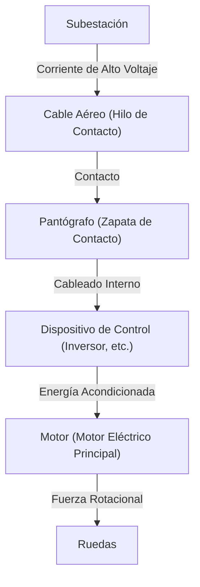

En la sociedad moderna, los trenes son un medio de transporte indispensable en nuestras vidas. Los ferrocarriles transportan a millones de personas todos los días y funcionan como las arterias de las ciudades, pero detrás de ellos se esconde una cristalización de ingeniería y física extremadamente avanzadas. Todo el mundo sabe que "los trenes funcionan con electricidad", pero ¿cómo se convierte exactamente la energía obtenida de las líneas de transmisión en la "propulsión" capaz de impulsar la carrocería de un vagón que pesa cientos de toneladas a velocidades de más de 100 kilómetros por hora?

Este artículo profundiza en los mecanismos técnicos del funcionamiento de los trenes. Explicaremos en detalle las tecnologías centrales que sustentan los ferrocarriles modernos, desde el viaje de la electricidad desde el pantógrafo hasta el motor, la última tecnología de control del inversor VVVF y el frenado regenerativo ecológico.

## 1. Suministro de energía y toma de corriente: El papel del pantógrafo

La fuente de energía para que un tren funcione es la electricidad suministrada desde el exterior. En muchos casos, la energía se toma de un "cable aéreo (hilo de contacto)" tendido sobre las vías. El dispositivo crucial que guía esta energía hacia el vehículo es el "pantógrafo".

### Contacto entre el cable aéreo y el pantógrafo
Corriente continua o corriente alterna de alto voltaje (por ejemplo, 1500 V CC, 20000 V CA) fluye a través del cable aéreo. El pantógrafo es presionado constantemente contra el cable aéreo con una cierta presión por presión neumática o fuerza de resorte. Durante el viaje, la parte del pantógrafo llamada "zapata de contacto" roza intensamente contra el cable aéreo, pero la zapata de contacto utiliza materiales especiales a base de carbono o de metal para mantener un contacto eléctrico confiable mientras previene el desgaste.

En los trenes de alta velocidad como el Shinkansen, se produce un "fenómeno de onda" en el que el cable aéreo ondula, por lo que se requiere una alta capacidad de seguimiento para evitar la "pérdida de contacto", donde el pantógrafo se separa del cable aéreo.

## 2. El corazón de la propulsión: Motor de CA y control de inversor VVVF

Los trenes más antiguos (coches con motor de CC) controlaban la velocidad ajustando el voltaje mediante resistencias, pero esto tenía inconvenientes como "gran pérdida de energía (calor)" y "difícil mantenimiento de las escobillas del motor". Los trenes modernos utilizan "motores de inducción de CA trifásicos (o motores síncronos)", que son más eficientes y no requieren mantenimiento.

Sin embargo, si la electricidad enviada desde el cable aéreo es corriente continua, no puede hacer girar un motor de CA tal cual. Aquí es donde entra en juego el "Inversor VVVF (Inversor de Voltaje Variable y Frecuencia Variable)".

### Cómo funciona el inversor VVVF
VVVF significa "Voltaje Variable, Frecuencia Variable". Un inversor es un dispositivo que convierte la corriente continua en corriente alterna, pero el inversor VVVF no solo puede convertirla, sino también **controlar libremente el nivel de voltaje y la frecuencia**.

La velocidad de rotación de un motor de CA es proporcional a la "frecuencia", y la fuerza (par) que genera depende de la "relación de voltaje a frecuencia". Al girarlo lentamente y con gran fuerza a baja frecuencia y bajo voltaje al arrancar, y luego aumentar la frecuencia y el voltaje a medida que aumenta la velocidad, se logra una aceleración extremadamente suave y altamente eficiente.

Los últimos inversores emplean semiconductores de potencia de próxima generación, como SiC (carburo de silicio) y GaN (nitruro de galio), que reducen significativamente la pérdida de energía y contribuyen a hacer que el equipo sea más pequeño y liviano.

## 3. Del motor a las ruedas: Mecanismo de transmisión de potencia

Cuando la energía controlada adecuadamente por el inversor se envía al motor, el eje giratorio del motor comienza a girar a alta velocidad. Sin embargo, incluso si la rotación del motor se transmite directamente a las ruedas, no hay suficiente fuerza y el tren no se moverá. Aquí es donde se necesita un mecanismo de desaceleración que utiliza "engranajes".

Un engranaje pequeño (piñón) está unido al eje giratorio del motor, y un engranaje grande (engranaje principal) está unido al eje de la rueda. Al girar el engranaje grande con el engranaje pequeño, la velocidad de rotación disminuye, pero el "par (fuerza de rotación)" aumenta en consecuencia. A través de este mecanismo, la rotación a alta velocidad del motor se convierte en la propulsión masiva necesaria para mover la pesada carrocería del tren.

Además, para evitar que las vibraciones del motor se transmitan directamente al eje, se utilizan acoplamientos especiales (acoplamientos flexibles) como los "acoplamientos WN" y los "acoplamientos TD", que mejoran la comodidad de marcha y reducen el ruido.

## 4. Tecnología para detenerse: Frenado regenerativo y frenado neumático

Para los trenes, es más importante no solo correr sino detenerse de forma segura y confiable. Los trenes modernos se detienen principalmente coordinando dos tipos de frenos.

### Frenado regenerativo (Frenado eléctrico)
Un motor se convierte en una "fuente de energía" cuando la electricidad pasa a través de él, pero a la inversa, cuando es girado por la fuerza desde el exterior, se convierte en un "generador". El frenado regenerativo utiliza este principio.
Al frenar, se cambia el control del inversor y se utiliza la fuerza de rotación de las ruedas para hacer girar el motor y generar electricidad. Debido a que generar electricidad requiere una gran cantidad de energía (resistencia), esto actúa como fuerza de frenado. Además, la electricidad generada aquí se devuelve al cable aéreo y se reutiliza como energía para otros trenes que circulan cerca. Esto logra importantes ahorros de energía.

### Frenado neumático (Frenado por fricción)
Al igual que los frenos de disco de un automóvil, se trata de un freno físico que se detiene por fricción presionando las zapatas de freno contra las ruedas o los discos. Dado que el frenado regenerativo se vuelve ineficaz cuando la velocidad desciende de manera extrema, este freno neumático se activa justo antes de detenerse o en caso de emergencia.

En los trenes recientes, el "control de mezcla", donde una computadora calcula instantáneamente la relación entre el frenado regenerativo y el frenado neumático y crea automáticamente la fuerza de frenado óptima, es común.

## Conclusión

Los trenes que usamos habitualmente operan mediante una combinación de múltiples tecnologías avanzadas: "toma de corriente por pantógrafo", "control preciso de energía por inversor VVVF utilizando semiconductores de potencia", "conversión de energía por motores y engranajes de CA de alta eficiencia" y "frenado regenerativo que no desperdicia energía".

Estas tecnologías continúan evolucionando en la actualidad, y los desafíos de los ingenieros continúan hacia la realización del sistema de transporte definitivo que sea más silencioso, tenga una mejor comodidad de viaje y tenga un menor impacto ambiental.
