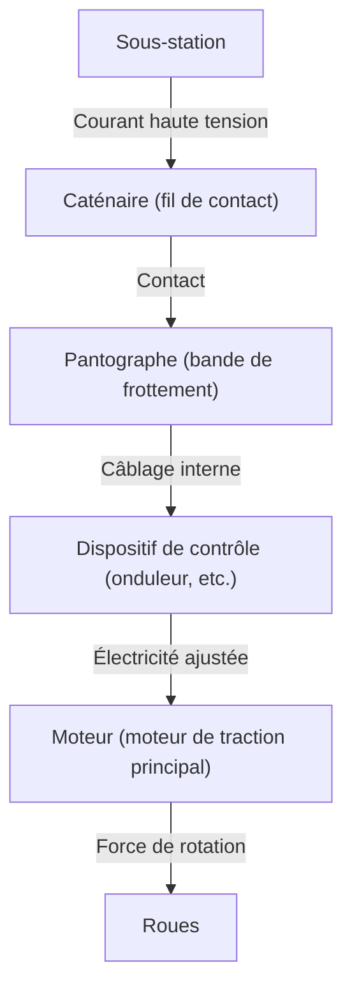

Dans la société moderne, le train est un moyen de transport indispensable à notre vie quotidienne. Les chemins de fer transportent des millions de personnes chaque jour et agissent comme les artères des villes, mais derrière cela se cachent des réalisations extrêmement avancées en matière d'ingénierie et de physique. Tout le monde sait que "les trains fonctionnent à l'électricité", mais comment, concrètement, l'énergie obtenue à partir des lignes de transmission est-elle convertie en une "force de propulsion" capable de faire rouler une carrosserie de plusieurs centaines de tonnes à plus de 100 km/h ?

Dans cet article, nous plongerons techniquement dans les mécanismes de fonctionnement des trains électriques. Du voyage de l'électricité depuis le pantographe jusqu'au moteur, en passant par la dernière technologie de contrôle par onduleur VVVF, et les freins à récupération écologiques, nous expliquerons en détail les technologies fondamentales qui soutiennent les chemins de fer modernes.

## 1. Alimentation en électricité et captage de courant : Le rôle du pantographe

La source d'énergie permettant aux trains de rouler est l'électricité fournie de l'extérieur. Dans de nombreux cas, l'énergie est tirée des "caténaires (fil de contact)" tendues au-dessus des voies. Le dispositif important qui guide cette électricité vers le véhicule est le "pantographe".

### Contact entre la caténaire et le pantographe
Une tension continue ou alternative élevée (par exemple, 1500 V en courant continu, 20000 V en courant alternatif, etc.) circule dans la caténaire. Le pantographe est constamment pressé contre la caténaire avec une pression constante grâce à une pression pneumatique ou à la force de ressorts. Pendant le trajet, la partie du pantographe appelée "bande de frottement" frotte intensément contre la caténaire, mais des matériaux spéciaux à base de carbone ou de métal sont utilisés pour cette bande, évitant ainsi l'usure tout en maintenant un contact électrique fiable.

Pour les trains à grande vitesse comme le Shinkansen, un "phénomène ondulatoire" se produit où la caténaire ondule, nécessitant un suivi très avancé pour empêcher le pantographe de se séparer de la caténaire (perte de contact).

## 2. Le cœur de la propulsion : Le moteur à courant alternatif et le contrôle par onduleur VVVF

Les anciens trains (trains à moteur à courant continu) contrôlaient leur vitesse en ajustant la tension à l'aide de résistances, mais cela présentait des inconvénients tels qu'une "perte d'énergie (chaleur) importante" et un "entretien difficile des balais du moteur". Les trains modernes utilisent un "moteur asynchrone triphasé (ou moteur synchrone)", qui est plus efficace et ne nécessite aucun entretien.

Cependant, si l'électricité envoyée depuis la caténaire est du courant continu, elle ne peut pas faire tourner un moteur à courant alternatif telle quelle. C'est là qu'intervient "l'onduleur VVVF (Variable Voltage Variable Frequency Inverter)".

### Comment fonctionne l'onduleur VVVF
VVVF signifie "Tension Variable, Fréquence Variable". Un onduleur est un appareil qui convertit l'électricité continue en électricité alternative, mais l'onduleur VVVF ne se contente pas de convertir ; il peut **contrôler librement la tension et la fréquence**.

La vitesse de rotation d'un moteur à courant alternatif est proportionnelle à la "fréquence", et la force (couple) qu'il génère dépend du "rapport entre la tension et la fréquence". Au démarrage, il tourne lentement avec une grande force en utilisant une basse fréquence et une basse tension, et à mesure que la vitesse augmente, la fréquence et la tension augmentent, réalisant ainsi une accélération extrêmement douce et très efficace.

Les onduleurs les plus récents intègrent des semi-conducteurs de puissance de nouvelle génération tels que le SiC (carbure de silicium) et le GaN (nitrure de gallium), réduisant considérablement les pertes de puissance et contribuant à la miniaturisation et à l'allègement de l'équipement.

## 3. Du moteur aux roues : Mécanisme de transmission de puissance

Lorsque l'électricité correctement contrôlée par l'onduleur est envoyée au moteur, l'arbre de rotation du moteur commence à tourner à grande vitesse. Cependant, si la rotation du moteur était transmise directement aux roues, la force serait insuffisante et le train ne bougerait pas. C'est ici qu'intervient le mécanisme de réduction avec des "engrenages".

Un petit engrenage (pignon) est fixé à l'arbre de rotation du moteur, et un grand engrenage est fixé à l'essieu de la roue. En faisant tourner le grand engrenage avec le petit engrenage, la vitesse de rotation diminue, mais le "couple (force de rotation)" augmente d'autant. Grâce à ce mécanisme, la rotation à grande vitesse du moteur est convertie en une puissante force de propulsion pour déplacer la lourde carrosserie du train.

De plus, afin de ne pas transmettre directement les vibrations du moteur à l'essieu, des accouplements spéciaux (accouplements flexibles) tels que les "accouplements WN" ou les "accouplements TD" sont utilisés, améliorant ainsi le confort de conduite et réduisant le bruit.

## 4. La technologie pour s'arrêter : Freinage par récupération et freinage pneumatique

Pour un train, il est non seulement important de rouler, mais surtout de s'arrêter de manière sûre et fiable. Les trains modernes s'arrêtent principalement en coordonnant deux types de freins.

### Frein par récupération (frein électrique)
Si on applique de l'électricité à un moteur, il devient une "force motrice", mais à l'inverse, s'il est tourné par une force externe, il devient un "générateur". Le freinage par récupération utilise ce principe.
Lors du freinage, la commande de l'onduleur est inversée et le moteur est tourné par la force de rotation des roues pour générer de l'électricité. Comme une grande énergie (résistance) est nécessaire pour produire de l'électricité, cela agit comme une force de freinage. De plus, l'électricité générée ici est renvoyée à la caténaire et réutilisée comme force motrice pour d'autres trains circulant à proximité. Cela permet de réaliser d'importantes économies d'énergie.

### Frein pneumatique (frein à friction)
À l'instar des freins à disque des automobiles, il s'agit d'un frein physique qui arrête le train par friction en pressant des mâchoires de frein contre les roues ou les disques. Les freins à récupération perdant leur efficacité lorsque la vitesse diminue drastiquement, ce frein pneumatique s'active juste avant l'arrêt ou en cas d'urgence.

Dans les trains récents, un "contrôle retardé" est courant, où un ordinateur calcule instantanément le rapport entre le frein à récupération et le frein pneumatique pour créer automatiquement la force de freinage optimale.

## Résumé

Les trains que nous utilisons de manière occasionnelle fonctionnent grâce à la combinaison de plusieurs technologies de pointe : "captage de courant par pantographe", "contrôle précis de la puissance via un onduleur VVVF utilisant des semi-conducteurs de puissance", "conversion de puissance par un moteur à courant alternatif hautement efficace et des engrenages", et "freinage par récupération qui ne gaspille pas l'énergie".

Ces technologies continuent d'évoluer aujourd'hui, et le défi des ingénieurs se poursuit vers la réalisation d'un système de transport ultime, plus silencieux, plus confortable et plus respectueux de l'environnement.
