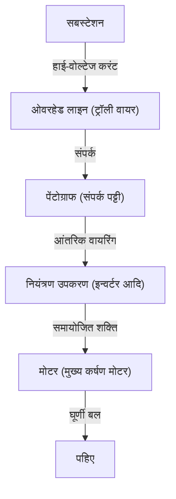

आधुनिक समाज में, ट्रेनें हमारे दैनिक जीवन के लिए एक अनिवार्य परिवहन साधन हैं। हर दिन लाखों लोगों को ले जाते हुए, रेलवे शहरों की धमनियों के रूप में कार्य करता है, लेकिन इसके पीछे अत्यधिक उन्नत इंजीनियरिंग और भौतिकी के चमत्कार छिपे हैं। हर कोई जानता है कि "ट्रेनें बिजली से चलती हैं," लेकिन वास्तव में ट्रांसमिशन लाइनों से प्राप्त विद्युत ऊर्जा को उस "प्रणोदन शक्ति" में कैसे बदला जाता है जो सैकड़ों टन वजन वाली ट्रेन को 100 किमी/घंटा से अधिक की गति से दौड़ा सकती है?

इस लेख में, हम इलेक्ट्रिक ट्रेन कैसे चलती है, इसके तंत्र में गहराई से तकनीकी गोता लगाएंगे। पैंटोग्राफ से मोटर तक बिजली की यात्रा, नवीनतम VVVF इन्वर्टर नियंत्रण तकनीक, और पर्यावरण के अनुकूल पुनर्योजी ब्रेक तक, हम आधुनिक रेलवे का समर्थन करने वाली मुख्य तकनीकों की विस्तार से व्याख्या करेंगे।

## 1. विद्युत आपूर्ति और धारा संग्रह: पैंटोग्राफ की भूमिका

ट्रेनों को चलाने के लिए ऊर्जा का स्रोत बाहर से आपूर्ति की जाने वाली बिजली है। कई मामलों में, पटरियों के ऊपर खींचे गए "ओवरहेड तार (ट्रॉली तार)" से बिजली ली जाती है। इस बिजली को वाहन में ले जाने वाला महत्वपूर्ण उपकरण "पैंटोग्राफ" है।

### ओवरहेड तार और पैंटोग्राफ का संपर्क
ओवरहेड तारों में उच्च वोल्टेज का डायरेक्ट करंट (DC) या अल्टरनेटिंग करंट (AC) बहता है (उदाहरण के लिए, 1500V DC, 20000V AC आदि)। वायुदाब या स्प्रिंग बल का उपयोग करके पैंटोग्राफ को लगातार एक निश्चित दबाव के साथ ओवरहेड तार के खिलाफ दबाया जाता है। चलते समय, पैंटोग्राफ का "संपर्क पट्टी (कांटेक्ट स्ट्रिप)" वाला भाग ओवरहेड तार से तेजी से रगड़ता है, लेकिन संपर्क पट्टी के लिए विशेष कार्बन-आधारित या धातु-आधारित सामग्री का उपयोग किया जाता है, जो टूट-फूट को रोकता है और एक विश्वसनीय विद्युत संपर्क बनाए रखता है।

शिंकनसेन (बुलेट ट्रेन) जैसी उच्च गति वाली ट्रेनों के लिए, एक "तरंग घटना" होती है जहां ओवरहेड तार लहराते हैं, इसलिए पैंटोग्राफ को ओवरहेड तार से अलग होने से रोकने के लिए अत्यधिक उन्नत ट्रैकिंग क्षमता की आवश्यकता होती है।

## 2. प्रणोदन का हृदय: AC मोटर और VVVF इन्वर्टर नियंत्रण

पुरानी ट्रेनें (DC मोटर ट्रेनें) रेसिस्टर्स (प्रतिरोधकों) का उपयोग करके वोल्टेज को समायोजित करके गति को नियंत्रित करती थीं, लेकिन इसमें "बड़ी ऊर्जा हानि (गर्मी)" और "कठिन मोटर ब्रश रखरखाव" जैसे नुकसान थे। आधुनिक ट्रेनें "थ्री-फेज AC इंडक्शन मोटर (या सिंक्रोनस मोटर)" का उपयोग करती हैं, जो अधिक कुशल और रखरखाव-मुक्त है।

हालाँकि, यदि ओवरहेड तार से भेजी गई बिजली डायरेक्ट करंट (DC) है, तो यह AC मोटर को वैसे ही नहीं घुमा सकती है। यहीं पर "VVVF इन्वर्टर (वेरिएबल वोल्टेज वेरिएबल फ्रीक्वेंसी इन्वर्टर)" काम आता है।

### VVVF इन्वर्टर का तंत्र
VVVF का अर्थ है "परिवर्तनीय वोल्टेज, परिवर्तनीय आवृत्ति"। इन्वर्टर एक ऐसा उपकरण है जो डायरेक्ट करंट को अल्टरनेटिंग करंट में परिवर्तित करता है, लेकिन VVVF इन्वर्टर केवल परिवर्तित ही नहीं करता, बल्कि यह **वोल्टेज और आवृत्ति (फ्रीक्वेंसी) को स्वतंत्र रूप से नियंत्रित** भी कर सकता है।

AC मोटर की घूर्णन गति "आवृत्ति" के समानुपाती होती है, और यह जो बल (टॉर्क) उत्पन्न करती है वह "वोल्टेज और आवृत्ति के अनुपात" पर निर्भर करता है। शुरू करते समय, यह कम आवृत्ति और कम वोल्टेज के साथ धीरे-धीरे और महान बल के साथ घूमती है, और जैसे-जैसे गति बढ़ती है, आवृत्ति और वोल्टेज को बढ़ाया जाता है, जिससे अत्यधिक सुचारू और उच्च दक्षता वाला त्वरण प्राप्त होता है।

नवीनतम इन्वर्टर SiC (सिलिकॉन कार्बाइड) और GaN (गैलियम नाइट्राइड) जैसे अगली पीढ़ी के पावर सेमीकंडक्टर्स का उपयोग करते हैं, जो बिजली के नुकसान को काफी कम करते हैं और उपकरणों को छोटा और हल्का बनाने में योगदान करते हैं।

## 3. मोटर से पहियों तक: शक्ति संचरण तंत्र

जब इन्वर्टर द्वारा उचित रूप से नियंत्रित बिजली मोटर में भेजी जाती है, तो मोटर का घूर्णन शाफ्ट उच्च गति से घूमना शुरू कर देता है। हालाँकि, यदि मोटर का घूर्णन सीधे पहियों तक पहुँचाया जाता है, तो बल अपर्याप्त होगा और ट्रेन नहीं हिलेगी। इसके लिए "गियर" वाले रिडक्शन मैकेनिज्म (गति कम करने वाले तंत्र) की आवश्यकता होती है।

मोटर के घूर्णन शाफ्ट में एक छोटा गियर (पिनियन गियर) जुड़ा होता है, और पहिये की धुरी में एक बड़ा गियर (बुल गियर) जुड़ा होता है। छोटे गियर से बड़े गियर को घुमाने से घूर्णन गति कम हो जाती है, लेकिन इसके अनुपात में "टॉर्क (घूमने वाला बल)" बढ़ जाता है। इस तंत्र के माध्यम से, मोटर का उच्च गति वाला घूर्णन भारी ट्रेन बॉडी को स्थानांतरित करने के लिए एक विशाल प्रणोदन शक्ति में परिवर्तित हो जाता है।

इसके अलावा, मोटर के कंपन को सीधे एक्सल में संचारित होने से रोकने के लिए, "WN कपलिंग" और "TD कपलिंग" जैसे विशेष कपलिंग (लचीले कपलिंग) का उपयोग किया जाता है, जो सवारी के आराम में सुधार करते हैं और शोर को कम करते हैं।

## 4. रुकने की तकनीक: रीजेनरेटिव ब्रेक और एयर ब्रेक

ट्रेन के लिए केवल चलना ही नहीं, बल्कि सुरक्षित और मज़बूती से रुकना सबसे महत्वपूर्ण बात है। आधुनिक ट्रेनें मुख्य रूप से रुकने के लिए दो तरह के ब्रेकों का समन्वय करती हैं।

### रीजेनरेटिव ब्रेक (इलेक्ट्रिक ब्रेक)
यदि मोटर में बिजली प्रवाहित की जाती है, तो यह "चालक शक्ति" बन जाती है, लेकिन इसके विपरीत, यदि इसे बाहरी बल द्वारा घुमाया जाता है, तो यह "जनरेटर" बन जाती है। रीजेनरेटिव ब्रेक (पुनर्योजी ब्रेक) इसी सिद्धांत का उपयोग करता है।
ब्रेक लगाते समय, इन्वर्टर के नियंत्रण को बदल दिया जाता है, और बिजली पैदा करने के लिए मोटर को पहियों के घूर्णी बल द्वारा घुमाया जाता है। चूँकि बिजली पैदा करने के लिए एक बड़ी ऊर्जा (प्रतिरोध) की आवश्यकता होती है, यह एक ब्रेकिंग बल के रूप में कार्य करता है। इसके अलावा, यहाँ उत्पन्न बिजली को ओवरहेड तार में वापस कर दिया जाता है और आस-पास चलने वाली अन्य ट्रेनों के लिए प्रेरक शक्ति के रूप में पुन: उपयोग किया जाता है। इससे काफी ऊर्जा बचत होती है।

### एयर ब्रेक (घर्षण ब्रेक)
कारों में डिस्क ब्रेक की तरह, यह एक भौतिक ब्रेक है जो पहियों या डिस्क के खिलाफ ब्रेक शूज़ को दबाकर घर्षण के माध्यम से रुकता है। चूँकि गति के अत्यधिक कम होने पर रीजेनरेटिव ब्रेक अपनी प्रभावशीलता खो देते हैं, इसलिए यह एयर ब्रेक रुकने से ठीक पहले या आपातकालीन स्थिति में सक्रिय हो जाता है।

हाल की ट्रेनों में, "विलंबित नियंत्रण (Delayed control)" आम है, जहाँ एक कंप्यूटर तुरंत रीजेनरेटिव ब्रेक और एयर ब्रेक के अनुपात की गणना करता है और स्वचालित रूप से इष्टतम ब्रेकिंग बल उत्पन्न करता है।

## निष्कर्ष

जिन ट्रेनों का हम स्वाभाविक रूप से उपयोग करते हैं, वे कई उन्नत तकनीकों के संयोजन से चलती हैं: "पैंटोग्राफ का उपयोग करके धारा संग्रह," "पावर सेमीकंडक्टर्स का उपयोग करके VVVF इन्वर्टर के साथ सटीक बिजली नियंत्रण," "अत्यधिक कुशल AC मोटर्स और गियर का उपयोग करके शक्ति रूपांतरण," और "रीजेनरेटिव ब्रेक जो ऊर्जा बर्बाद नहीं करते हैं।"

ये प्रौद्योगिकियां आज भी विकसित हो रही हैं, और इंजीनियरों की चुनौती एक परम परिवहन प्रणाली को साकार करने के लिए जारी है जो अधिक शांत, अधिक आरामदायक और पर्यावरण के अनुकूल है।
