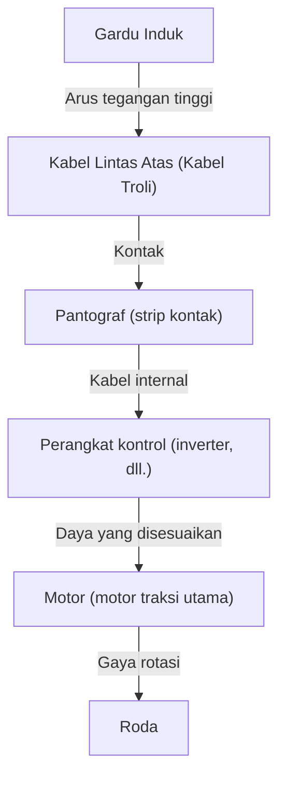

Dalam masyarakat modern, kereta api merupakan sarana transportasi yang tak terpisahkan dari kehidupan kita sehari-hari. Mengangkut jutaan orang setiap harinya, kereta api berfungsi sebagai urat nadi perkotaan, tetapi di baliknya tersembunyi pencapaian teknik dan fisika yang sangat canggih. Semua orang tahu bahwa "kereta api digerakkan oleh listrik", namun bagaimana tepatnya tenaga listrik yang diperoleh dari jaringan transmisi diubah menjadi "gaya dorong" yang mampu menggerakkan gerbong seberat ratusan ton dengan kecepatan lebih dari 100 km/jam?

Dalam artikel ini, kita akan menggali lebih dalam mekanisme teknis bagaimana kereta listrik bergerak. Mulai dari perjalanan listrik dari pantograf ke motor, teknologi kontrol inverter VVVF terbaru, hingga rem regeneratif yang ramah lingkungan, kami akan menjelaskan secara rinci teknologi inti yang mendukung perkeretaapian modern.

## 1. Pasokan Daya dan Pengumpulan Arus: Peran Pantograf

Sumber energi bagi kereta untuk berjalan adalah listrik yang dipasok dari luar. Dalam banyak kasus, tenaga diambil dari "Kabel Lintas Atas (kabel troli)" yang membentang di atas rel. Perangkat penting yang menyalurkan listrik ini ke dalam kendaraan adalah "pantograf".

### Kontak antara Kabel Lintas Atas dan Pantograf
Arus searah atau arus bolak-balik bertegangan tinggi (misalnya, DC 1500V, AC 20000V, dll.) mengalir melalui kabel lintas atas. Pantograf secara konstan ditekan ke kabel lintas atas dengan tekanan yang stabil menggunakan tekanan udara atau kekuatan pegas. Selama perjalanan, bagian dari pantograf yang disebut "strip kontak" bergesekan secara intens dengan kabel lintas atas, tetapi bahan khusus berbasis karbon atau logam digunakan untuk strip kontak tersebut, mencegah keausan sekaligus mempertahankan kontak listrik yang andal.

Untuk kereta berkecepatan tinggi seperti Shinkansen, terjadi "fenomena gelombang" di mana kabel lintas atas bergelombang, sehingga diperlukan kemampuan pelacakan yang sangat canggih untuk mencegah pantograf terlepas dari kabel lintas atas (kehilangan kontak).

## 2. Jantung Penggerak: Motor AC dan Kontrol Inverter VVVF

Kereta api model lama (kereta motor DC) mengontrol kecepatan dengan menyesuaikan tegangan menggunakan resistor, namun hal ini memiliki kelemahan seperti "kehilangan energi (panas) yang besar" dan "perawatan sikat motor yang sulit". Kereta api modern menggunakan "motor induksi AC tiga fase (atau motor sinkron)", yang lebih efisien dan bebas perawatan.

Namun, jika listrik yang dikirim dari kabel lintas atas adalah arus searah (DC), listrik tersebut tidak dapat digunakan langsung untuk memutar motor AC. Di sinilah "Inverter VVVF (Variable Voltage Variable Frequency Inverter)" berperan.

### Mekanisme Inverter VVVF
VVVF adalah singkatan dari "Tegangan Variabel, Frekuensi Variabel". Inverter adalah perangkat yang mengubah arus searah menjadi arus bolak-balik, tetapi inverter VVVF tidak hanya sekadar mengubahnya, ia juga dapat **mengontrol tegangan dan frekuensi secara bebas**.

Kecepatan rotasi motor AC berbanding lurus dengan "frekuensi", dan gaya (torsi) yang dihasilkannya bergantung pada "rasio tegangan dan frekuensi". Saat mulai berjalan, motor berputar perlahan dengan gaya yang besar menggunakan frekuensi rendah dan tegangan rendah, dan seiring bertambahnya kecepatan, frekuensi dan tegangan ditingkatkan, mencapai akselerasi yang sangat halus dan berefisiensi tinggi.

Inverter terbaru menggabungkan semikonduktor daya generasi berikutnya seperti SiC (Silikon Karbida) dan GaN (Galium Nitrida), secara signifikan mengurangi hilangnya daya dan berkontribusi pada pengecilan dan pengurangan berat peralatan.

## 3. Dari Motor ke Roda: Mekanisme Transmisi Daya

Ketika daya yang dikendalikan dengan tepat oleh inverter dikirim ke motor, poros rotasi motor mulai berputar dengan kecepatan tinggi. Namun, jika rotasi motor disalurkan langsung ke roda, gayanya tidak akan cukup dan kereta tidak akan bergerak. Di sinilah mekanisme reduksi dengan "roda gigi (gear)" diperlukan.

Roda gigi kecil (gigi pinion) dipasang pada poros rotasi motor, dan roda gigi besar dipasang pada poros roda. Dengan memutar roda gigi besar menggunakan roda gigi kecil, kecepatan rotasi berkurang, tetapi sebagai kompensasinya "torsi (gaya rotasi)" meningkat. Melalui mekanisme ini, rotasi kecepatan tinggi dari motor diubah menjadi gaya dorong besar untuk menggerakkan bodi kereta yang berat.

Selain itu, untuk mencegah transmisi getaran motor secara langsung ke poros roda, kopling khusus (kopling fleksibel) seperti "kopling WN" dan "kopling TD" digunakan, sehingga meningkatkan kenyamanan berkendara dan mengurangi kebisingan.

## 4. Teknologi untuk Berhenti: Rem Regeneratif dan Rem Udara

Bagi sebuah kereta api, tidak hanya berlari, tetapi berhenti dengan aman dan andal adalah hal yang paling penting. Kereta api modern terutama mengoordinasikan dua jenis rem untuk berhenti.

### Rem Regeneratif (Rem Listrik)
Jika aliran listrik dialirkan ke motor, motor tersebut menjadi "tenaga penggerak", namun sebaliknya, jika motor diputar oleh gaya dari luar, ia akan menjadi "generator". Rem regeneratif menggunakan prinsip ini.
Saat mengerem, kontrol inverter dialihkan, dan motor diputar oleh gaya rotasi roda untuk menghasilkan listrik. Karena energi yang besar (hambatan) diperlukan untuk menghasilkan listrik, hal ini bertindak sebagai gaya pengereman. Terlebih lagi, listrik yang dihasilkan di sini dikembalikan ke kabel lintas atas dan digunakan kembali sebagai tenaga penggerak untuk kereta lain yang melaju di dekatnya. Hal ini menghasilkan penghematan energi yang signifikan.

### Rem Udara (Rem Gesekan)
Sama seperti rem cakram pada mobil, ini adalah rem fisik yang berhenti melalui gesekan dengan menekan sepatu rem ke roda atau cakram. Karena rem regeneratif kehilangan keefektifannya saat kecepatan turun drastis, rem udara ini aktif tepat sebelum kereta berhenti atau dalam keadaan darurat.

Pada kereta api masa kini, "kontrol penundaan" adalah hal yang umum, di mana komputer secara instan menghitung rasio rem regeneratif dan rem udara lalu secara otomatis menciptakan gaya pengereman yang optimal.

## Kesimpulan

Kereta api yang biasa kita gunakan digerakkan oleh kombinasi berbagai teknologi canggih: "pengumpulan arus menggunakan pantograf", "kontrol daya presisi oleh inverter VVVF menggunakan semikonduktor daya", "konversi daya menggunakan motor AC berefisiensi tinggi dan roda gigi", serta "rem regeneratif yang tidak membuang-buang energi".

Teknologi-teknologi ini masih terus berkembang saat ini, dan tantangan bagi para insinyur terus berlanjut menuju perwujudan sistem transportasi mutakhir yang lebih senyap, lebih nyaman, dan lebih ramah lingkungan.
