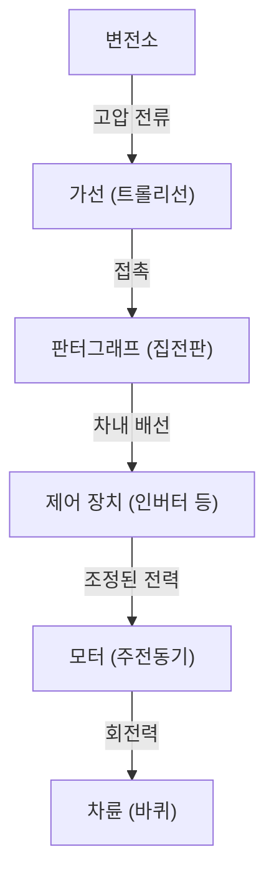

현대 사회에서 전동차는 우리의 생활에 없어서는 안 될 이동 수단입니다. 매일 수백만 명의 사람들을 실어 나르며 도시의 동맥 역할을 하는 철도이지만, 그 이면에는 극히 고도화된 공학과 물리학의 결정체가 숨겨져 있습니다. "전동차는 전기로 움직인다"는 것은 누구나 알고 있지만, 그렇다면 구체적으로 어떻게 송전선에서 얻은 전력을 수백 톤의 차체를 시속 100킬로미터 이상으로 달리게 할 만큼의 "추진력"으로 변환하고 있는 것일까요?

본 기사에서는 전동차가 움직이는 원리를 기술적으로 깊이 파헤쳐 봅니다. 판터그래프에서 모터에 이르기까지의 전기의 여정, 최신 VVVF 인버터 제어 기술, 그리고 친환경적인 회생 제동(재생 브레이크)까지, 현대 철도를 지탱하는 핵심 기술을 상세히 해설합니다.

## 1. 전력의 공급과 집전: 판터그래프의 역할

전동차가 달리기 위한 에너지원은 외부에서 공급되는 전력입니다. 많은 경우, 선로 상공에 쳐진 "가선(트롤리선)"에서 전력을 끌어옵니다. 이 전력을 차량으로 유도하는 중요한 장치가 "판터그래프(집전장치)"입니다.

### 가선과 판터그래프의 접촉
가선에는 직류 또는 교류의 고전압(예를 들어 직류 1500V, 교류 20000V 등)이 흐르고 있습니다. 판터그래프는 공기압이나 스프링의 힘으로 항상 가선에 일정한 압력으로 밀착되어 있습니다. 주행 중 가선과 판터그래프의 "집전판(습판)"이라고 불리는 부분은 격렬하게 마찰하지만, 집전판에는 특수한 카본계 또는 금속계 소재가 사용되어 마모를 방지하면서 확실한 전기적 접촉을 유지하고 있습니다.

고속 주행하는 신칸센 등에서는 가선이 물결치는 "파동 현상"이 발생하기 때문에 판터그래프가 가선에서 떨어지는 "이선(離線)"을 방지하는 고도의 추종성이 요구됩니다.

## 2. 추진의 심장부: 교류 모터와 VVVF 인버터 제어

옛날의 전동차(직류 모터 차)는 저항기를 사용하여 전압을 조정함으로써 속도를 제어했지만, 여기에는 "에너지 손실(열)이 크다", "모터 브러시의 유지보수가 힘들다"는 단점이 있었습니다. 현대의 전동차는 보다 효율적이고 유지보수가 필요 없는 "3상 교류 유도 모터(또는 동기 모터)"를 채용하고 있습니다.

하지만 가선에서 보내져 오는 전기가 직류일 경우, 그대로는 교류 모터를 돌릴 수 없습니다. 여기서 등장하는 것이 "VVVF 인버터(Variable Voltage Variable Frequency Inverter)"입니다.

### VVVF 인버터의 원리
VVVF란 "가변 전압 가변 주파수"라는 뜻입니다. 인버터는 직류 전기를 교류로 변환하는 장치인데, VVVF 인버터는 단순히 변환할 뿐만 아니라 **전압의 높이와 주파수를 자유자재로 컨트롤**할 수 있습니다.

교류 모터의 회전 속도는 "주파수"에 비례하고, 만들어내는 힘(토크)은 "전압과 주파수의 비율"에 의존합니다. 발진 시에는 낮은 주파수와 낮은 전압으로 천천히, 그리고 큰 힘으로 돌리고, 스피드가 올라감에 따라 주파수와 전압을 올려감으로써 극히 부드럽고 고효율의 가속을 실현하고 있습니다.

최신 인버터에는 SiC(탄화규소)나 GaN(질화갈륨) 등의 차세대 전력 반도체가 채용되어 전력 손실을 대폭 삭감하고 장치의 소형화·경량화에도 공헌하고 있습니다.

## 3. 모터에서 바퀴로: 동력 전달 기구

인버터에 의해 적절히 제어된 전력이 모터로 보내지면, 모터의 회전축이 고속으로 회전하기 시작합니다. 하지만 모터의 회전을 그대로 바퀴에 전달해도 힘이 부족하여 전동차는 움직이지 않습니다. 여기서 필요해지는 것이 "톱니바퀴(기어)"에 의한 감속 기구입니다.

모터의 회전축에는 작은 톱니바퀴(피니언 기어)가 장착되어 있고, 바퀴의 차축에는 큰 톱니바퀴(대치차)가 장착되어 있습니다. 작은 톱니바퀴로 큰 톱니바퀴를 돌림으로써 회전 속도는 떨어지지만, 그만큼 "토크(회전하는 힘)"가 커집니다. 이 원리에 의해 모터의 고속 회전이 무거운 차체를 움직이기 위한 막강한 추진력으로 변환되는 것입니다.

또한, 모터의 진동을 직접 차축에 전달하지 않게 하기 위해 "WN 이음"이나 "TD 이음"과 같은 특수한 커플링(요동 이음)이 사용되어 승차감 향상과 소음 저감을 도모하고 있습니다.

## 4. 멈추기 위한 기술: 회생 제동과 공기 제동

전동차는 달리는 것뿐만 아니라 안전하고 확실하게 멈추는 것이 가장 중요합니다. 현대의 전동차는 주로 2개의 브레이크를 협조시켜 정지합니다.

### 회생 제동 (전기 제동)
모터는 전기를 흘리면 "동력"이 되지만, 반대로 외부에서 힘으로 돌려지면 "발전기"가 됩니다. 회생 제동(재생 브레이크)은 이 원리를 이용한 것입니다.
브레이크를 걸 때, 인버터의 제어를 전환하여 바퀴의 회전력으로 모터를 돌려 발전시킵니다. 발전하려면 큰 에너지(저항)가 필요하기 때문에 이것이 브레이크 힘으로 작용합니다. 게다가 여기서 발전된 전기는 가선으로 되돌려져 근처를 달리는 다른 전동차의 동력으로 재이용됩니다. 이를 통해 대폭적인 에너지 절약을 실현하고 있습니다.

### 공기 제동 (마찰 제동)
자동차의 디스크 브레이크와 마찬가지로, 브레이크 슈를 바퀴나 디스크에 밀착시켜 마찰로 멈추는 물리적인 브레이크입니다. 회생 제동은 속도가 극단적으로 떨어지면 잘 듣지 않게 되므로, 정차하기 직전이나 비상시에는 이 공기 제동이 작동합니다.

최근의 전동차에서는 컴퓨터가 회생 제동과 공기 제동의 비율을 순식간에 계산하여 최적의 브레이크 힘을 자동으로 만들어내는 "지연 제어(blending control)"가 일반적입니다.

## 요약

우리가 아무렇지 않게 이용하고 있는 전동차는 "판터그래프에 의한 집전", "전력 반도체를 이용한 VVVF 인버터에 의한 정밀한 전력 제어", "고효율 교류 모터와 톱니바퀴에 의한 동력 변환", 그리고 "에너지를 낭비하지 않는 회생 제동"이라는 여러 고도화된 기술이 조합됨으로써 움직이고 있습니다.

이러한 기술들은 현재도 진화를 계속하고 있으며, 더 조용하고, 더 승차감이 좋고, 더 환경 부하가 적은 궁극의 수송 시스템의 실현을 향해 엔지니어들의 도전은 계속되고 있습니다.
