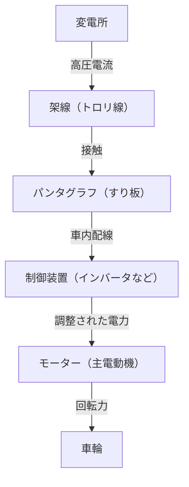

現代の社会において、電車は私たちの生活に欠かせない移動手段です。毎日何百万人もの人々を運び、都市の動脈として機能している鉄道ですが、その裏には極めて高度な工学と物理学の結晶が隠されています。「電車は電気で動く」ということは誰もが知っていますが、では具体的にどのようにして送電線から得た電力を、何百トンもの車体を時速100キロ以上で走らせるほどの「推進力」へと変換しているのでしょうか。

本記事では、電車の動く仕組みを技術的に深く掘り下げます。パンタグラフからモーターに至るまでの電気の旅、最新のVVVFインバータ制御技術、そして環境に優しい回生ブレーキまで、現代の鉄道を支える中核技術を詳細に解説します。

## 1. 電力の供給と集電：パンタグラフの役割

電車が走るためのエネルギー源は、外部から供給される電力です。多くの場合、線路の上空に張られた「架線（トロリ線）」から電力を取り込みます。この電力を車両へと導く重要な装置が「パンタグラフ」です。

### 架線とパンタグラフの接触
架線には直流または交流の高電圧（例えば直流1500V、交流20000Vなど）が流れています。パンタグラフは、空気圧やばねの力で常に架線に一定の圧力で押し付けられています。走行中、架線とパンタグラフの「すり板」と呼ばれる部分は激しく摩擦しますが、すり板には特殊なカーボン系または金属系の素材が使われており、摩耗を防ぎつつ確実な電気的接触を保っています。

高速走行する新幹線などでは、架線が波打つ「波動現象」が発生するため、パンタグラフが架線から離れてしまう「離線」を防ぐ高度な追従性が求められます。

## 2. 推進の心臓部：交流モーターとVVVFインバータ制御

昔の電車（直流モーター車）は、抵抗器を使って電圧を調整することで速度を制御していましたが、これには「エネルギーロス（熱）が大きい」「モーターのブラシのメンテナンスが大変」という欠点がありました。現代の電車は、より効率的でメンテナンスフリーな「三相交流誘導モーター（または同期モーター）」を採用しています。

しかし、架線から送られてくる電気が直流の場合、そのままでは交流モーターを回せません。そこで登場するのが「VVVFインバータ（Variable Voltage Variable Frequency Inverter）」です。

### VVVFインバータの仕組み
VVVFとは、「可変電圧・可変周波数」という意味です。インバータは、直流の電気を交流に変換する装置ですが、VVVFインバータはただ変換するだけでなく、**電圧の高さと周波数を自在にコントロール**することができます。

交流モーターの回転速度は「周波数」に比例し、生み出す力（トルク）は「電圧と周波数の比率」に依存します。発進時は低い周波数と低い電圧でゆっくりと、かつ大きな力で回し、スピードが上がるにつれて周波数と電圧を上げていくことで、極めてスムーズで高効率な加速を実現しています。

最新のインバータには、SiC（炭化ケイ素）やGaN（窒化ガリウム）などの次世代パワー半導体が採用されており、電力損失を大幅に削減し、装置の小型化・軽量化にも貢献しています。

## 3. モーターから車輪へ：動力伝達機構

インバータによって適切に制御された電力がモーターに送り込まれると、モーターの回転軸が高速で回転し始めます。しかし、モーターの回転をそのまま車輪に伝えても、力が足りず電車は動きません。ここで必要になるのが「歯車（ギア）」による減速機構です。

モーターの回転軸には小さな歯車（ピニオンギア）が取り付けられており、車輪の車軸には大きな歯車（大歯車）が取り付けられています。小さな歯車で大きな歯車を回すことで、回転速度は落ちますが、その分だけ「トルク（回転する力）」が大きくなります。この仕組みにより、モーターの高速回転が、重い車体を動かすための強大な推進力へと変換されるのです。

また、モーターの振動を直接車軸に伝えないようにするため、「WN継手」や「TD継手」といった特殊なカップリング（たわみ継手）が使われ、乗り心地の向上と騒音の低減が図られています。

## 4. 止まるための技術：回生ブレーキと空気ブレーキ

電車は走るだけでなく、安全かつ確実に止まることが最も重要です。現代の電車は主に2つのブレーキを協調させて停止します。

### 回生ブレーキ（電気ブレーキ）
モーターは、電気を流せば「動力」になりますが、逆に外部から力で回されると「発電機」になります。回生ブレーキは、この原理を利用したものです。
ブレーキをかけるとき、インバータの制御を切り替え、車輪の回転力でモーターを回して発電させます。発電するには大きなエネルギー（抵抗）が必要なため、これがブレーキ力として働きます。さらに、ここで発電された電気は架線に戻され、近くを走る他の電車の動力として再利用されます。これにより、大幅な省エネを実現しています。

### 空気ブレーキ（摩擦ブレーキ）
自動車のディスクブレーキと同じように、ブレーキシューを車輪やディスクに押し当てて摩擦で止める物理的なブレーキです。回生ブレーキは速度が極端に落ちると効かなくなるため、停車する直前や、非常時にはこの空気ブレーキが作動します。

最近の電車では、コンピュータが回生ブレーキと空気ブレーキの割合を瞬時に計算し、最適なブレーキ力を自動で作り出す「遅れ込め制御」が一般的です。

## まとめ

私たちが何気なく利用している電車は、「パンタグラフによる集電」「パワー半導体を用いたVVVFインバータによる精密な電力制御」「高効率な交流モーターと歯車による動力変換」、そして「エネルギーを無駄にしない回生ブレーキ」という、複数の高度な技術が組み合わさることで動いています。

これらの技術は現在も進化を続けており、より静かで、より乗り心地が良く、より環境負荷の少ない究極の輸送システムの実現に向けて、エンジニアたちの挑戦は続いています。
