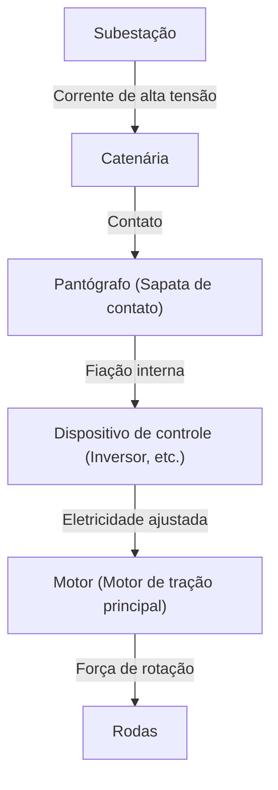

Na sociedade moderna, os trens são um meio de transporte essencial para nossas vidas. Eles transportam milhões de pessoas todos os dias e atuam como as artérias das cidades. No entanto, por trás disso, esconde-se a cristalização de engenharia e física extremamente avançadas. Todos sabem que "os trens funcionam a eletricidade", mas como exatamente a eletricidade obtida das linhas de transmissão é convertida em uma "força de propulsão" suficiente para fazer veículos de centenas de toneladas correrem a mais de 100 km/h?

Neste artigo, aprofundaremos tecnicamente no mecanismo de funcionamento dos trens. Desde a jornada da eletricidade, passando do pantógrafo até o motor, as mais recentes tecnologias de controle de inversores VVVF e até os freios regenerativos ecológicos, explicaremos detalhadamente as principais tecnologias que sustentam as ferrovias modernas.

## 1. Fornecimento de energia e coleta de corrente: O papel do pantógrafo

A fonte de energia para que os trens circulem é a eletricidade fornecida externamente. Na maioria dos casos, a eletricidade é captada de uma "rede aérea (catenária)" esticada sobre os trilhos. O dispositivo importante que conduz essa eletricidade para o trem é o "pantógrafo".

### Contato entre a catenária e o pantógrafo
Alta voltagem contínua ou alternada (por exemplo, 1500V CC, 20000V CA, etc.) flui através da catenária. O pantógrafo é constantemente pressionado contra a catenária com uma pressão constante pela força do ar comprimido ou de molas. Durante a viagem, a parte chamada "sapata de contato" do pantógrafo e a catenária sofrem atrito intenso, mas as sapatas usam materiais especiais à base de carbono ou metais para evitar o desgaste, mantendo ao mesmo tempo um contato elétrico seguro.

Em trens de alta velocidade, como o Shinkansen, ocorre um "fenômeno de onda" em que a catenária ondula. Portanto, é necessária uma alta capacidade de rastreamento para evitar a "separação", onde o pantógrafo se afasta da catenária.

## 2. O coração da propulsão: Motores CA e controle de inversores VVVF

Os trens antigos (veículos com motores CC) controlavam a velocidade ajustando a voltagem com resistores, mas isso tinha desvantagens, como "grande perda de energia (calor)" e "alta manutenção das escovas do motor". Os trens modernos usam "motores de indução trifásicos CA (ou motores síncronos)" que são mais eficientes e livres de manutenção.

No entanto, se a eletricidade enviada da catenária for CC, ela não pode girar o motor CA diretamente. É aqui que entra o "Inversor VVVF (Variable Voltage Variable Frequency)".

### Como funciona o inversor VVVF
VVVF significa "Tensão Variável, Frequência Variável". Um inversor é um dispositivo que converte eletricidade de corrente contínua em corrente alternada, mas um inversor VVVF não apenas converte, ele pode **controlar livremente o nível de voltagem e a frequência**.

A velocidade de rotação de um motor CA é proporcional à "frequência", e a força gerada (torque) depende da "razão entre voltagem e frequência". Ao partir, o motor gira lentamente e com grande força em baixa frequência e baixa voltagem. À medida que a velocidade aumenta, a frequência e a voltagem também aumentam, permitindo uma aceleração extremamente suave e altamente eficiente.

Os inversores mais recentes utilizam semicondutores de potência de próxima geração, como SiC (Carboneto de Silício) e GaN (Nitreto de Gálio), o que reduz drasticamente a perda de energia e contribui para a miniaturização e redução de peso do equipamento.

## 3. Do motor para as rodas: Mecanismo de transmissão de energia

Quando a eletricidade adequadamente controlada pelo inversor é enviada ao motor, o eixo do motor começa a girar em alta velocidade. No entanto, se a rotação do motor for transmitida diretamente para as rodas, a força será insuficiente e o trem não se moverá. Aqui entra a necessidade de um mecanismo de redução usando "engrenagens".

Uma engrenagem pequena (pinhão) é conectada ao eixo do motor, e uma engrenagem grande é conectada ao eixo da roda. Ao girar a engrenagem grande com a engrenagem pequena, a velocidade de rotação diminui, mas o "torque (força de rotação)" aumenta proporcionalmente. Esse mecanismo converte a rotação de alta velocidade do motor na poderosa força de propulsão necessária para mover a carroceria pesada.

Além disso, para evitar a transmissão direta da vibração do motor para o eixo, são usados acoplamentos flexíveis especiais, como "acoplamento WN" e "acoplamento TD", melhorando o conforto da viagem e reduzindo o ruído.

## 4. Tecnologia para parar: Freios regenerativos e freios pneumáticos

Para um trem, não é apenas importante andar; parar com segurança e precisão é a prioridade máxima. Os trens modernos param coordenando principalmente dois tipos de freios.

### Freio regenerativo (Freio elétrico)
Se a eletricidade fluir através de um motor, ele se torna uma "força motriz", mas, inversamente, se for girado por uma força externa, ele se torna um "gerador". O freio regenerativo usa esse princípio.
Ao aplicar os freios, o controle do inversor é alternado, e a força de rotação das rodas gira o motor para gerar eletricidade. Como é necessária grande energia (resistência) para gerar eletricidade, isso atua como força de frenagem. Além disso, a eletricidade gerada aqui é devolvida à catenária e reutilizada como força motriz para outros trens rodando nas proximidades. Isso alcança uma economia de energia significativa.

### Freio pneumático (Freio de fricção)
Semelhante aos freios a disco de um carro, é um freio físico que para através do atrito, pressionando pastilhas de freio contra as rodas ou discos. Como os freios regenerativos perdem eficácia quando a velocidade cai drasticamente, o freio pneumático é ativado pouco antes de parar ou em emergências.

Nos trens recentes, o "controle de atraso", no qual um computador calcula instantaneamente a proporção de freios regenerativos e pneumáticos e cria automaticamente a força de frenagem ideal, é comum.

## Resumo

Os trens que usamos casualmente operam graças à combinação de várias tecnologias avançadas: "coleta de corrente através de pantógrafos", "controle preciso de eletricidade usando inversores VVVF com semicondutores de potência", "conversão de energia através de motores CA de alta eficiência e engrenagens" e "freios regenerativos que não desperdiçam energia".

Essas tecnologias continuam a evoluir até hoje. Os engenheiros continuam seu desafio para realizar o sistema de transporte final: mais silencioso, mais confortável e com menor impacto ambiental.
