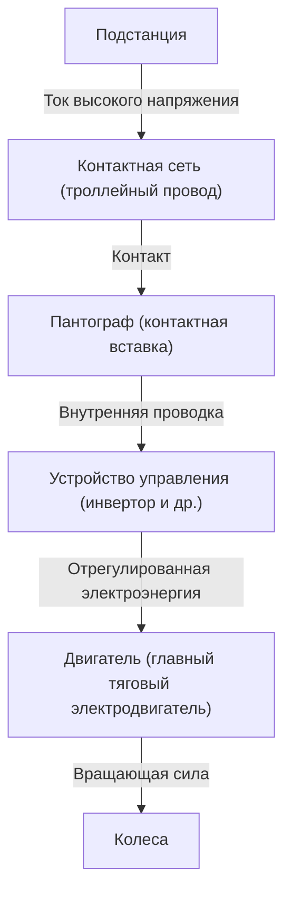

В современном обществе поезда являются неотъемлемым средством передвижения в нашей жизни. Железные дороги ежедневно перевозят миллионы людей и функционируют как артерии городов, но за этим скрывается кристаллизация сложнейших достижений инженерии и физики. Все знают, что «поезда работают на электричестве», но как именно электроэнергия, получаемая от линий электропередач, преобразуется в «движущую силу», достаточную для того, чтобы вагоны весом в сотни тонн двигались со скоростью более 100 км/ч?

В этой статье мы подробно рассмотрим механизм движения поездов с технической точки зрения. От путешествия электричества от пантографа до двигателя, новейших технологий управления инверторами VVVF до экологически чистых систем рекуперативного торможения — мы подробно объясним ключевые технологии, поддерживающие современные железные дороги.

## 1. Электроснабжение и токосъем: Роль пантографа

Источником энергии для движения поездов является электроэнергия, поставляемая извне. В большинстве случаев электричество берется от «контактной сети (троллейного провода)», натянутой над путями. Важным устройством, направляющим это электричество к поезду, является «пантограф».

### Контакт между контактной сетью и пантографом
По контактной сети протекает высокое напряжение постоянного или переменного тока (например, 1500 В постоянного тока, 20000 В переменного тока и т.д.). Пантограф постоянно прижимается к контактной сети с определенным давлением за счет силы сжатого воздуха или пружин. Во время движения часть пантографа, называемая «контактной вставкой», и контактная сеть подвергаются сильному трению, но во вставках используются специальные углеродные или металлические материалы для предотвращения износа при сохранении надежного электрического контакта.

В высокоскоростных поездах, таких как Синкансэн, возникает «волновое явление», при котором контактная сеть колеблется. Поэтому требуется высокая способность следования, чтобы предотвратить «отрыв», когда пантограф отделяется от контактной сети.

## 2. Сердце движения: Двигатели переменного тока и инверторное управление VVVF

Старые поезда (вагоны с двигателями постоянного тока) контролировали скорость путем регулировки напряжения с помощью резисторов, но это имело такие недостатки, как «большие потери энергии (тепло)» и «трудоемкое обслуживание щеток двигателя». В современных поездах используются более эффективные и не требующие обслуживания «трехфазные асинхронные двигатели переменного тока (или синхронные двигатели)».

Однако, если электричество, поступающее от контактной сети, является постоянным током, оно не может напрямую вращать двигатель переменного тока. Здесь на помощь приходит «инвертор VVVF (Variable Voltage Variable Frequency - переменное напряжение переменная частота)».

### Как работает инвертор VVVF
VVVF означает «Переменное напряжение и переменная частота». Инвертор — это устройство, которое преобразует электричество постоянного тока в переменный ток, но инвертор VVVF не просто преобразует его, он может **свободно управлять уровнем напряжения и частотой**.

Скорость вращения двигателя переменного тока пропорциональна «частоте», а создаваемая сила (крутящий момент) зависит от «соотношения напряжения и частоты». При трогании с места двигатель вращается медленно и с большой силой при низкой частоте и низком напряжении. По мере увеличения скорости частота и напряжение увеличиваются, обеспечивая чрезвычайно плавное и высокоэффективное ускорение.

В новейших инверторах используются силовые полупроводники следующего поколения, такие как SiC (карбид кремния) и GaN (нитрид галлия), что значительно снижает потери энергии и способствует миниатюризации и снижению веса оборудования.

## 3. От двигателя к колесам: Механизм передачи мощности

Когда правильно регулируемая инвертором электроэнергия подается на двигатель, вал двигателя начинает вращаться с высокой скоростью. Однако, если вращение двигателя передается непосредственно на колеса, силы будет недостаточно, и поезд не сдвинется с места. Здесь необходим механизм понижения с использованием «шестерен (зубчатых колес)».

На валу двигателя установлена небольшая шестерня (ведущая шестерня), а на оси колеса — большая шестерня. При вращении большой шестерни с помощью малой скорость вращения снижается, но пропорционально возрастает «крутящий момент (сила вращения)». Этот механизм преобразует высокоскоростное вращение двигателя в мощную движущую силу, необходимую для перемещения тяжелого кузова вагона.

Кроме того, чтобы предотвратить прямую передачу вибрации двигателя на ось, используются специальные гибкие муфты, такие как «муфта WN» и «муфта TD», что улучшает комфорт при езде и снижает уровень шума.

## 4. Технология остановки: Рекуперативное торможение и пневматические тормоза

Для поезда важно не только ехать, но и безопасно и надежно останавливаться. Современные поезда в основном останавливаются за счет координации двух типов тормозов.

### Рекуперативный тормоз (Электрический тормоз)
Если через двигатель пропустить электричество, он станет «двигателем», но и наоборот, если его вращать внешней силой, он станет «генератором». Рекуперативное торможение использует этот принцип.
При торможении управление инвертором переключается, и вращающая сила колес заставляет двигатель вращаться и вырабатывать электроэнергию. Поскольку для выработки электроэнергии требуется большая энергия (сопротивление), это действует как тормозная сила. Кроме того, вырабатываемая здесь электроэнергия возвращается в контактную сеть и повторно используется в качестве движущей силы для других поездов, идущих поблизости. Это позволяет добиться значительной экономии энергии.

### Пневматический тормоз (Фрикционный тормоз)
Подобно дисковым тормозам автомобиля, это физический тормоз, который останавливается за счет трения путем прижатия тормозных колодок к колесам или дискам. Поскольку рекуперативные тормоза теряют свою эффективность при резком падении скорости, пневматические тормоза активируются непосредственно перед остановкой или в экстренной ситуации.

В современных поездах распространено «управление с запаздыванием», при котором компьютер мгновенно рассчитывает соотношение рекуперативных и пневматических тормозов и автоматически создает оптимальное тормозное усилие.

## Заключение

Поезда, которыми мы небрежно пользуемся, работают благодаря комбинации нескольких передовых технологий: «токосъем через пантографы», «точное управление электроэнергией с использованием инверторов VVVF с силовыми полупроводниками», «преобразование мощности с помощью высокоэффективных двигателей переменного тока и шестерен» и «рекуперативное торможение, не тратящее энергию впустую».

Эти технологии продолжают развиваться и сегодня. Инженеры продолжают решать сложную задачу по созданию идеальной транспортной системы, которая была бы более тихой, более комфортной и оказывала меньшее воздействие на окружающую среду.
