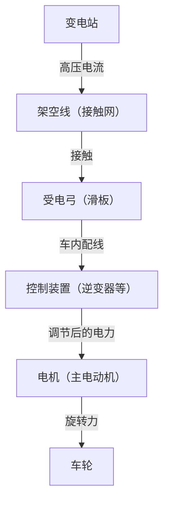

在现代社会中，电车是我们生活中不可或缺的交通工具。铁路每天运送着数百万人，发挥着城市动脉的作用，而在其背后隐藏着极其先进的工程学和物理学结晶。大家都知道“电车是用电驱动的”，但具体来说，从输电线中获得的电力是如何转化为能让重达数百吨的车体以超过100公里时速行驶的“推进力”的呢？

本文将从技术角度深入探讨电车运行的机制。从受电弓到电机的电力之旅，到最新的VVVF逆变器控制技术，再到环保的再生制动，我们将详细解说支撑现代铁路的核心技术。

## 1. 电力供应与集电：受电弓的作用

电车行驶的能量源是外部供应的电力。大多数情况下，电车会从架设在轨道上方的“架空线（接触网）”中获取电力。将这些电力导入车辆的重要装置就是“受电弓”。

### 架空线与受电弓的接触
架空线中流动着直流或交流的高压电（例如直流1500V、交流20000V等）。受电弓通过气压或弹簧的力量，始终以一定的压力压在架空线上。行驶中，受电弓上被称为“滑板”的部分会与架空线产生剧烈摩擦，但滑板使用了特殊的碳基或金属基材料，在防止磨损的同时保持了可靠的电气接触。

在高速行驶的新干线等列车上，架空线会产生波动的“波动现象”，因此需要极高的跟随性，以防止受电弓脱离架空线的“离线”现象。

## 2. 推进的心脏部位：交流电机与VVVF逆变器控制

以前的电车（直流电机车）是通过使用电阻器调节电压来控制速度的，但这存在“能量损耗（热量）大”和“电机电刷维护繁琐”的缺点。现代电车采用了更高效且免维护的“三相交流异步电机（或同步电机）”。

但是，如果从架空线送来的电是直流电，就不能直接转动交流电机。于是“VVVF逆变器（Variable Voltage Variable Frequency Inverter）”便应运而生。

### VVVF逆变器的原理
VVVF的意思是“可变电压、可变频率”。逆变器是一种将直流电转换为交流电的装置，但VVVF逆变器不仅能进行转换，还能**自由控制电压的高低和频率**。

交流电机的旋转速度与“频率”成正比，而产生的力（扭矩）取决于“电压与频率的比例”。起步时，以低频率和低电压让电机缓慢且有力地转动，随着速度的提高再逐步提高频率和电压，从而实现了极其平顺且高效的加速。

最新的逆变器采用了SiC（碳化硅）和GaN（氮化镓）等新一代功率半导体，大幅减少了电力损耗，也为装置的小型化和轻量化做出了贡献。

## 3. 从电机到车轮：动力传递机构

当由逆变器适当控制的电力送入电机时，电机的旋转轴就会开始高速旋转。然而，如果直接将电机的旋转传递给车轮，由于力量不足电车是无法开动的。这里就需要使用“齿轮”的减速机构。

电机的旋转轴上安装有小齿轮，车轮的车轴上安装有大齿轮。用小齿轮带动大齿轮转动，虽然旋转速度降低了，但“扭矩（旋转的力量）”会成比例增大。通过这种机制，电机的高速旋转就被转化为了推动沉重车体所需的强大推进力。

此外，为了防止将电机的振动直接传递给车轴，还使用了诸如“WN联轴器”或“TD联轴器”等特殊的挠性联轴器，从而提高了乘坐舒适度并降低了噪音。

## 4. 停车的技术：再生制动与空气制动

对于电车来说，不仅要能跑，安全可靠地停下来才是最重要的。现代电车主要通过协同两种制动器来停车。

### 再生制动（电气制动）
如果通电，电机就是“动力机”，反之，如果被外力带动旋转，它就成了“发电机”。再生制动就是利用了这个原理。
刹车时，切换逆变器的控制，利用车轮的旋转力带动电机转动来发电。因为发电需要消耗很大的能量（阻力），这就起到了制动力的作用。而且，这里发出的电会被送回架空线，作为附近行驶的其他电车的动力被重新利用。这就实现了大幅度的节能。

### 空气制动（摩擦制动）
与汽车的盘式制动器一样，这是通过将制动瓦块压向车轮或制动盘，利用摩擦力使列车停下的物理制动器。因为当速度降得非常低时再生制动会失去作用，所以在停车前夕或紧急情况下会启动这种空气制动。

在最近的电车中，计算机瞬间计算再生制动与空气制动的比例并自动产生最佳制动力的“延迟控制”已经非常普遍。

## 总结

我们平时不经意间乘坐的电车，是通过“受电弓集电”、“使用功率半导体的VVVF逆变器进行精密电力控制”、“高效交流电机与齿轮进行动力转换”以及“不浪费能量的再生制动”等多种先进技术组合在一起才得以运行的。

这些技术至今仍在不断发展，为了实现更安静、乘坐更舒适、对环境影响更小的终极运输系统，工程师们的挑战仍在继续。
