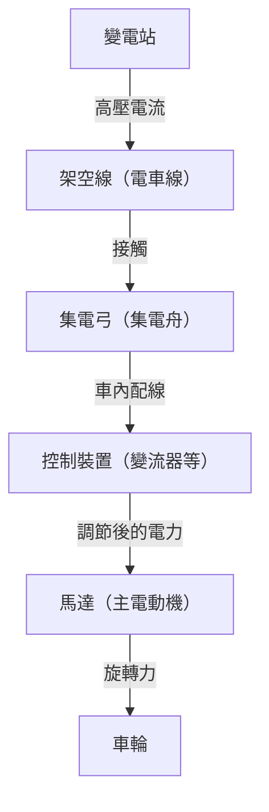

在現代社會中，電車是我們生活中不可或缺的交通工具。鐵路每天運送著數百萬人，發揮著城市動脈的作用，而在其背後隱藏著極其先進的工程學和物理學結晶。大家都知道「電車是用電驅動的」，但具體來說，從輸電線中獲得的電力是如何轉化為能讓重達數百噸的車體以超過 100 公里時速行駛的「推進力」的呢？

本文將從技術角度深入探討電車運行的機制。從集電弓到馬達的電力之旅，到最新的 VVVF 變流器控制技術，再到環保的再生制軔，我們將詳細解說支撐現代鐵路的核心技術。

## 1. 電力供應與集電：集電弓的作用

電車行駛的能量源是外部供應的電力。大多數情況下，電車會從架設在軌道上方的「架空線（電車線）」中獲取電力。將這些電力導入車輛的重要裝置就是「集電弓」。

### 架空線與集電弓的接觸
架空線中流動著直流或交流的高壓電（例如直流 1500V、交流 20000V 等）。集電弓透過氣壓或彈簧的力量，始終以一定的壓力壓在架空線上。行駛中，集電弓上被稱為「集電舟（滑板）」的部分會與架空線產生劇烈摩擦，但集電舟使用了特殊的碳基或金屬基材料，在防止磨損的同時保持了可靠的電氣接觸。

在高速行駛的新幹線等列車上，架空線會產生波動的「波動現象」，因此需要極高的跟隨性，以防止集電弓脫離架空線的「離線」現象。

## 2. 推進的心臟部位：交流馬達與 VVVF 變流器控制

以前的電車（直流馬達車）是透過使用電阻器調節電壓來控制速度的，但這存在「能量損耗（熱量）大」和「馬達碳刷維護繁瑣」的缺點。現代電車採用了更高效且免維護的「三相交流非同步馬達（或同步馬達）」。

但是，如果從架空線送來的電是直流電，就不能直接轉動交流馬達。於是「VVVF 變流器（Variable Voltage Variable Frequency Inverter）」便應運而生。

### VVVF 變流器的原理
VVVF 的意思是「可變電壓、可變頻率」。變流器是一種將直流電轉換為交流電的裝置，但 VVVF 變流器不僅能進行轉換，還能**自由控制電壓的高低和頻率**。

交流馬達的旋轉速度與「頻率」成正比，而產生的力（扭矩）取決於「電壓與頻率的比例」。起步時，以低頻率和低電壓讓馬達緩慢且有力地轉動，隨著速度的提高再逐步提高頻率和電壓，從而實現了極其平順且高效的加速。

最新的變流器採用了 SiC（碳化矽）和 GaN（氮化鎵）等新一代功率半導體，大幅減少了電力損耗，也為裝置的小型化和輕量化做出了貢獻。

## 3. 從馬達到車輪：動力傳遞機構

當由變流器適當控制的電力送入馬達時，馬達的旋轉軸就會開始高速旋轉。然而，如果直接將馬達的旋轉傳遞給車輪，由於力量不足電車是無法開動的。這裡就需要使用「齒輪」的減速機構。

馬達的旋轉軸上安裝有小齒輪，車輪的車軸上安裝有大齒輪。用小齒輪帶動大齒輪轉動，雖然旋轉速度降低了，但「扭矩（旋轉的力量）」會成比例增大。透過這種機制，馬達的高速旋轉就被轉化為了推動沉重車體所需的強大推進力。

此外，為了防止將馬達的振動直接傳遞給車軸，還使用了諸如「WN 聯軸器」或「TD 聯軸器」等特殊的撓性聯軸器，從而提高了乘坐舒適度並降低了噪音。

## 4. 停車的技術：再生制軔與氣軔

對於電車來說，不僅要能跑，安全可靠地停下來才是最重要的。現代電車主要透過協同兩種煞車來停車。

### 再生制軔（電氣煞車）
如果通電，馬達就是「動力機」，反之，如果被外力帶動旋轉，它就成了「發電機」。再生制軔就是利用了這個原理。
煞車時，切換變流器的控制，利用車輪的旋轉力帶動馬達轉動來發電。因為發電需要消耗很大的能量（阻力），這就起到了煞車力的作用。而且，這裡發出的電會被送回架空線，作為附近行駛的其他電車的動力被重新利用。這就實現了大幅度的節能。

### 氣軔（摩擦煞車）
與汽車的碟煞一樣，這是透過將煞車塊壓向車輪或煞車盤，利用摩擦力使列車停下的物理煞車。因為當速度降得非常低時再生制軔會失去作用，所以在停車前夕或緊急情況下會啟動這種氣軔。

在最近的電車中，電腦瞬間計算再生制軔與氣軔的比例並自動產生最佳煞車力的「延遲控制」已經非常普遍。

## 總結

我們平時不經意間乘坐的電車，是透過「集電弓集電」、「使用功率半導體的 VVVF 變流器進行精密電力控制」、「高效交流馬達與齒輪進行動力轉換」以及「不浪費能量的再生制軔」等多種先進技術組合在一起才得以運行的。

這些技術至今仍在不斷發展，為了實現更安靜、乘坐更舒適、對環境影響更小的終極運輸系統，工程師們的挑戰仍在繼續。
