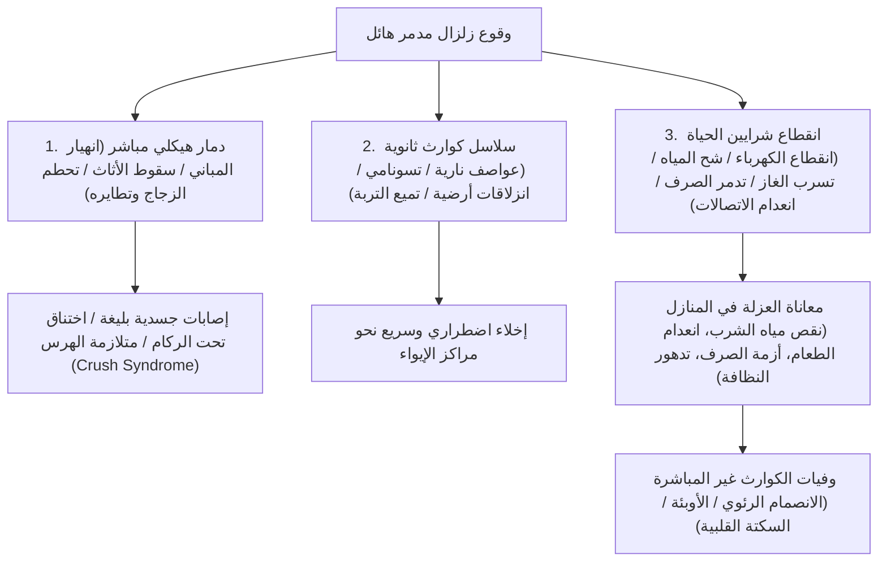
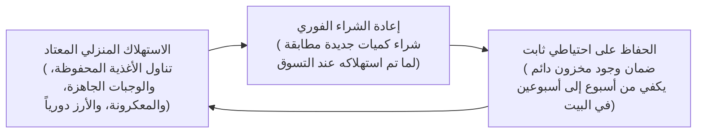
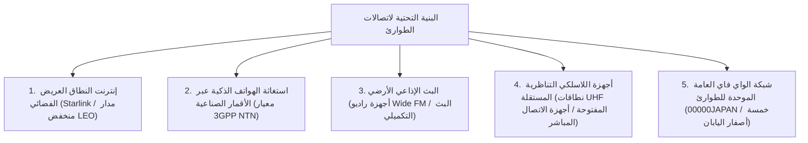

## مقدمة: ترسيخ "هندسة البقاء" في أرخبيل الكوارث المعقدة

يشغل الأرخبيل الياباني، الواقع على طول حزام النار في المحيط الهادئ، ما نسبته 0.25% فقط من إجمالي اليابسة على كوكب الأرض. ومع ذلك، يتركز داخل هذه المساحة الضيقة نحو 20% من إجمالي الزلازل العالمية التي تبلغ قوتها 6 درجات أو أكثر، فضلاً عن قرابة 7% من البراكين النشطة في العالم، مما يجعله إحدى أكثر البقاع عرضة للكوارث الطبيعية في الكوكب.

علاوة على ذلك، في القرن الحادي والعشرين، أدى ارتفاع درجات حرارة أسطح المحيطات وزيادة بخار الماء المشبع في الغلاف الجوي بفعل التغير المناخي إلى تحطيم نماذج التنبؤ بالأرصاد الجوية الخطية التقليدية. فقد أصبحت الأمطار الطوفانية الناتجة عن "أحزمة الأمطار الخطية" الثابتة، والفيضانات المركبة التي يلتقي فيها فيضان الأنهار وتكدس شبكات تصريف الأمطار الحضرية، والكوارث الكبرى الحتمية التي يقترب وقوعها — مثل زلزال فالق نankai العظيم (بقوة 8 إلى 9 درجات)، والزلزال المباشر تحت العاصمة طوكيو، وثوران بركان فوجي الانفجاري — تدفع بشبح الشلل المؤسسي التام للدولة إلى مستويات حرجة غير مسبوقة.

وفي ظل هذه الظروف القاسية، تواجه "المساعدة العامة" (كوجو) المقدمة من الدولة والبلديات حدوداً فيزيائية حتمية. ففي أعقاب الزلازل المدمرة مباشرة، يؤدي تقطع الطرق الشريانية، وتفشي الحرائق المتزامنة، وانهيار شبكات الاتصالات، والدمار الهيكلي للمقرات الحكومية ذاتها، إلى نشوء فجوة إغاثة حرجة ومطلقة: **"فترة فراغ لا تقل عن 72 ساعة (3 أيام)، وتتجاوز أسبوعاً كاملاً في الكوارث الإقليمية الشاملة"**، وذلك قبل أن تتمكن فرق الإنقاذ وقوافل الإمداد الحكومية من الوصول إلى كل منزل معزول.

إن العلم العملي والتطبيقي الذي يمكّن الفرد من الصمود ذاتياً خلال فترة الفراغ هذه وحماية أرواح عائلته ومجتمعه هو **"هندسة الحد من الكوارث (Disaster Mitigation Engineering)"**، وأداتها المادية التكتيكية هي **"معدات البقاء في الطوارئ (Emergency Survival Gear)"**. إن لوازم الطوارئ ليست تكديساً عشوائياً للسلع التموينية اليومية، بل هي نظام دعم حياة نقال ومستقل بذاته، صُمم للحفاظ على التوازن البيوكيميائي الداخلي لجسم الإنسان (Homeostasis) والصحة العامة في بيئة قاسية انقطعت فيها تماماً كافة الشرايين الحضرية: الكهرباء، مياه الشرب، الغاز، الصرف الصحي، والاتصالات.

تتناول هذه الدراسة التحليل الزمني للكوارث والتقييم الكمي للمخاطر، ونظرية التجهيز المعياري على ثلاث مراحل (المراحل 0 و1 و2)، والحلول البيوكيميائية والهندسية للمياه والغذاء والتخلص من الفضلات البشرية، وتوليد الطاقة المستقل خارج الشبكة، وصولاً إلى البروتوكولات الطبية لمنع الوفيات غير المباشرة المرتبطة بالكوارث داخل مراكز الإيواء.

```
【تسلسل مراحل الكوارث والانتشار الوظيفي لمعدات الطوارئ】

┌─────────────────┬───────────────────────────────┬───────────────────────────────┐
│ المرحلة         │ النطاق الزمني والبيئة المحيطة │ الوظائف والمعدات المطلوبة     │
├─────────────────┼───────────────────────────────┼───────────────────────────────┤
│ المرحلة 0       │ الروتين اليومي، التنقل، العمل │ EDC للمرحلة 0: صافرة نجاة،    │
│ (لحظة الصدمة)   │ (عدم قابلية التنبؤ بالموقع)   │ مصباح دقيق، كيس مرحاض كيميائي │
├─────────────────┼───────────────────────────────┼───────────────────────────────┤
│ المرحلة 1       │ الصدمة الفورية حتى 24 ساعة    │ حقيبة الإخلاء السريع (Go-Bag):│
│ (الإخلاء الطارئ)│ الهروب من الأنقاض والحرائق    │ خوذة حماية، كمامة N95، حذاء   │
│                 │ وموجات التسونامي العاتية      │ واقٍ من الثقب، مطارة مياه     │
├─────────────────┼───────────────────────────────┼───────────────────────────────┤
│ المرحلة 2       │ من 24 ساعة إلى 72 ساعة        │ انتظار الإنقاذ / الاحتماء في  │
│ (دعم الحياة)    │ انقطاع كامل للمرافق، وعزلة    │ المنزل: طقم صدمات، بطانية     │
│                 │ الأحياء السكنية               │ مايلر، فلتر مياه فائق الدقة   │
├─────────────────┼───────────────────────────────┼───────────────────────────────┤
│ المرحلة 3       │ من 72 ساعة إلى أكثر من أسبوع  │ المخزون اللوجستي المنزلي:     │
│ (الإيواء الممتد)│ طول فترة النزوح، والحفاظ      │ مؤن غذائية وماء، طاقة مستقلة، │
│                 │ الصارم على النظافة العامة     │ منظومة متقدمة لإدارة الفضلات  │
└─────────────────┴───────────────────────────────┴───────────────────────────────┘
```

---

## 1. آليات الكوارث المركبة وهندسة الخط الزمني

لبناء نظام دفاع مدني فعال ضد الكوارث، لا بد أولاً من فهم دقيق للميكانيكا الفيزيائية للظواهر الطبيعية التدميرية وسلسلة الانهيارات المتعاقبة في البنى التحتية الحضرية الحديثة.

### 1.1 فيزياء الحركات الزلزالية: زلازل نطاقات الاندساس المحيطية مقابل الفوالق النشطة القارية
تنقسم الزلازل المدمرة بشكل جوهري إلى صنفين رئيسيين بناءً على ميكانيكا التصدع:

1. **زلازل نطاقات الاندساس عند حدود الصفائح التكتونية (مثل: زلزال فالق نankai، وزلزال شرق اليابان الكبير 2011)**:
   تنشأ عند الحدود التي تنغرز فيها صفيحة محيطية تكتونية تحت صفيحة قارية. وبما أن نطاق التصدع يمتد لمئات الكيلومترات، فإن مدة الاهتزازات العنيفة تستمر لعدة دقائق متواصلة، ملحقة دماراً هائلاً على نطاق جغرافي شاسع. ويؤدي الإزاحة العمودية المفاجئة لقاع المحيط إلى توليد أمواج تسونامي عملاقة تضرب السواحل في غضون دقائق معدودة. كما تولد هذه الزلازل "حركات أرضية طويلة الأمد" تدخل في رنين تدميري مع ناطحات السحاب والأبراج العالية.
2. **زلازل الفوالق النشطة الضحلة داخل اليابسة (الضربات المباشرة) (مثل: زلزال كوبه 1995، وزلزال كوماموتو 2016)**:
   تنتج عن الانزلاق المفاجئ للفوالق النشطة الضحلة في القشرة القارية. ونظراً لأن البؤرة شديدة القرب من السطح، فإن الفارق الزمني بين وصول الموجات الأولية الطولية (P) والموجات العرضية التدميرية (S) — وهو زمن S-P — يقترب من الصفر. تضرب تسارعات عمودية هائلة وموجات نبضية عالية التردد المنشآت دون أي إنذار مسبق، مما يسحق المنازل الخشبية ويقذف الأثاث الثقيل ويقطع الجسور والطرق السريعة في ثوانٍ.



### 1.2 الانفجارات البركانية وديناميكا الشلل الحضري بفعل الرماد الكثيف
تضم اليابان 111 بركاناً نشطاً. إن ثوراناً بلينيانياً ضخماً من بركان فوجي أو أساما أو آسو أو ساكوراجيما يولد خطراً يتجاوز تدفقات الحمم المحلية؛ إذ يطلق **"تساقطاً واسع النطاق للرماد البركاني على مستوى الأقاليم"**، مسبباً شللاً متصاعداً لكافة المرافق.

الرماد البركاني ليس رماداً خشبياً عضوياً ليناً، بل يتكون من **"شظايا زجاجية دقيقة حادة وميكروسكوبية وشديدة الكشط وبلورات معدنية سيليكاتية (ثاني أكسيد السيليكون SiO₂)"**:
- **انهيار شبكات التوزيع الكهربائي**: إن تراكم طبقة بسماكة بضعة مليمترات فقط يصبح فائق التوصيل للكهرباء بمجرد أن يبتل بماء المطر، مما يؤدي إلى حدوث قوس كهربائي وتفريغ دارات قصيرة على العوازل الخزفية لخطوط الجهد العالي، متسبباً في إطفاء الشبكة العامة بالكامل.
- **شلل قطاع النقل والمواصلات**: يؤدي تراكم مليمترات قليلة من الرماد على الطرق إلى فقدان تام للتماسك وانزلاق المركبات؛ كما تسد الحبيبات الدقيقة فلاتر سحب الهواء في محركات الاحتراق الداخلي فتتوقف السيارات تماماً. وتتوقف خطوط السكك الحديدية نتيجة عزل التوصيل الكهربائي بين عجلات الفولاذ والقضبان. وتغلق المطارات كلياً لأن السيليكا المستنشقة تذوب داخل غرف احتراق المحركات النفاثة لتتحول إلى زجاج سائل يسد التوربينات.
- **انسداد شبكات الصرف الصحي**: إذا قام السكان بغسل الرماد في شبكات الصرف، فإنه يترسب ويتصلب كالخرسانة الهيدروليكية في قاع الأنابيب، مما يدمر البنية التحتية للصرف تحت الأرض بشكل نهائي.
- **أضرار تنفسية وبصرية**: تخترق الجسيمات التي يقل قطرها عن 2.5 ميكرون عمق الحويصلات الهوائية في الرئتين، متسببة في نوبات ربو حادة واضطرابات تنفسية شديدة، إضافة إلى تآكل قرنية العين.

لذا، يجب أن تتضمن معدات الحماية من البراكين كمامات واقية من الجسيمات (N95/FFP2 أو أعلى)، ونظارات سلامة محكمة الإغلاق على الوجه، وألبسة مطرية كتيمة، وأشرطة لاصقة متينة لعزل الغرف عن الهواء الخارجي.

---

## 2. الهندسة المنهجية لمعدات الطوارئ حسب المراحل (المراحل 0 و1 و2)

يجب تنظيم عتاد الطوارئ وتوزيعه في ثلاثة مستويات معيارية متكاملة، تتطابق مع نطاق حركة الإنسان والجدول الزمني لتطور الكارثة.

```
【الهندسة المعيارية ثلاثية المستويات لمعدات النجاة】

［المستوى 0: عتاد الحمل اليومي (EDC: Everyday Carry)］
・السياق: حمل دائم في الجيب أو الحقيبة الشخصية أثناء العمل أو التنقل (الوزن: 300 إلى 500 غرام كحد أقصى).
・الهدف: اجتياز الساعات الأولى الحرجة منذ لحظة وقوع الكارثة حتى العودة للمنزل أو الوصول لنقطة تجمع آمنة.

［المستوى 1: حقيبة الإخلاء السريع (Emergency Go-Bag)］
・السياق: توضع بشكل دائم عند مدخل المنزل أو بجانب السرير (الوزن: 10–15 كغ للرجال، 8–10 كغ للنساء).
・الهدف: الهروب الفوري في حال الخطر الدهم (انهيار، حريق، تسونامي) والحفاظ على المؤشرات الحيوية خلال 24–48 ساعة الأولى.

［المستوى 2: المخزون اللوجستي في المنزل (Home Stockpile)］
・السياق: موزع في غرف التخزين وخزائن المؤن المنزلية (يكفي لمدة تتراوح بين 7 إلى 14 يوماً).
・الهدف: الصمود الذاتي والحفاظ على المعايير الصحية داخل المنزل في ظل الانقطاع التام للمرافق والخدمات البلدية.
```

### 2.1 عتاد المرحلة 0 (EDC): حقيبة النجاة الدقيقة في قلب الحياة اليومية
يقضي الإنسان المعاصر أغلب ساعات يقظته خارج منزله (أبراج المكاتب، قطارات الأنفاق، المجمعات التجارية). إن مباغتة الزلزال للمرء نهاراً تعني احتمال الاحتجاز داخل المصاعد، أو التعطل في أنفاق القطارات المظلمة، أو السير لساعات طويلة وسط الركام للوصول إلى الديار.

```
【الحمولة الحيوية الأساسية لحقيبة EDC للمرحلة 0 (~400 غرام)】

1. مصباح يدوي LED فائق السطوع ومدمج (بطارية AA/AAA أو شحن USB-C، قوة >=100 لومن)
2. صافرة استغاثة صوتية عالية التردد (تصميم بدون كرة بغرفتين، قوة >=100 ديسيبل، تعمل في الماء)
3. بطانية طوارئ فضية من مايلر (عكس إشعاع حرارة الجسم بنسبة 90%، مانعة للرياح ومقاومة للماء)
4. أكياس صحية لتصريف الفضلات الطارئة (بوليمر فائق الامتصاص مصلب + كيس متعدد الطبقات مانع للروائح: استخدامان على الأقل)
5. بنك طاقة محمول عالي الكفاءة (5000 إلى 10000 مللي أمبير) + كابل شحن متعدد المنافذ متين
6. صيدلية مصغرة وطوارئ (ضمادات، مناديل معقمة، مسكنات، أدوية الأمراض المزمنة لـ 3 أيام، كمامات N95 مغلفة)
7. أموال نقدية ورقية وفئات معدنية (عملات صغيرة: لتشغيل هواتف الشارع العمومية؛ نقاط الدفع الإلكتروني تتوقف تماماً)
8. بطاقة تعريف طبية للطوارئ (فصيلة الدم، الحساسية الدوائية، التاريخ المرضي، وأرقام الطوارئ العائلية)
```

### 2.2 حقيبة الإخلاء السريع للمرحلة 1 (Go-Bag): هندسة توزيع الأوزان
إن الخطأ الأكثر خطورة في تجهيز حقائب الإخلاء هو الإفراط في حشوها حتى تصبح ثقيلة تعيق الحركة أو القفز فوق الركام. إن الحد الأقصى الآمن للحمل للحفاظ على خفة الحركة دون استنزاف قوى الجسد هو **"حوالي 20% من وزن الجسم للرجال البالغين (12–15 كغ) ونحو 15% للنساء البالغات (7–10 كغ)"**.

```
【بيئة العمل وتوزيع مركز الثقل في حقيبة الإخلاء】

・القسم العلوي والملاصق للعمود الفقري: الأغراض الأثقل وزناً (مياه الشرب، الأغذية المعلبة، محطات الطاقة)
  -> يرفع مركز الثقل قريباً من الظهر، مما يقلل بشدة من عزم اللي وإجهاد الفقرات القطنية.
・القسم الأوسط والخارجي: حمولات متوسطة الوزن (ملابس تبديل، معطف مطر، طقم الإسعافات الرضحية).
・القسم السفلي (قاع الحقيبة): الأغراض الخفيفة ذات الحجم الكبير (كيس نوم مدمج، ملابس صوفية، منشفة ميكروفايبر).
・الجيوب الجانبية والغطاء العلوي: أدوات الاستخدام الفوري (كشاف رأس، صافرة، خوذة قابلة للطي، قفازات متينة).
```

إن اختيار الأحذية للإخلاء يمثل عنصراً حاسماً للبقاء. فالفرار بالصنادل أو الأحذية الرياضية الخفيفة خطأ فادح: فالطرق بعد الزلزال تكون مغطاة بشظايا الزجاج المسلح الحاد وقضبان التسليح المنثنية والمسامير الصدئة. إن انتعال أحذية جبلية نصف صلبة مزودة بنعل داخلي مقاوم للاختراق من الفولاذ أو ألياف الأراميد، أو أحذية سلامة مهنية معتمدة، هو شرط نجاة لا يقبل المساومة.

---

## 3. تأمين مياه الشرب وهندسة المعالجة والتنقية

يشكل الماء قرابة 60% من وزن جسم الإنسان. ورغم قدرة الأيض البشري على احتمال انقطاع الغذاء الصلب لعدة أسابيع، فإن الحرمان التام من الماء يؤدي إلى جفاف خلوي حاد وصدمة نقص حجم الدم وفشل وظيفي متعدد للأعضاء يفضي إلى الموت في غضون 3 إلى 5 أيام فقط.

### 3.1 الحساب الكمي العلمي للاحتياج المائي الفسيولوجي
وفقاً لمعايير الصحة العامة المعتمدة في إدارة الكوارث، فإن الحد الأدنى اليومي للبقاء الفسيولوجي على قيد الحياة يُحدد بـ:

$$\text{معدل المياه الضروري لدعم الحياة} = 3.0 \text{ لتر / شخص / يوم}$$

وبناءً عليه، فإن عائلة مكونة من 4 أفراد تلتزم بالبقاء في المنزل لمدة أسبوع واحد تتطلب:

$$3 \text{ L} \times 4 \text{ أشخاص} \times 7 \text{ أيام} = 84 \text{ لتراً}$$

وهذا يعادل تخزين 42 عبوة مياه سعة لترين مخصصة حصرياً للشرب المباشر والترطيب الحيوي. وإذا أضفنا كميات المياه اللازمة لإعداد الأغذية الجافة، وغسل الأيدي، وتطهير الجروح، ونظافة الفم، فإن الكميات المطلوبة تتضاعف بشكل كبير.

### 3.2 تنقية المياه باستخدام أغشية الألياف المجوفة (Hollow Fiber Membrane)
حين ينفد المخزون المعبأ، تصبح أدوات التنقية الدقيقة المحمولة ذات الألياف المجوفة (مثل Sawyer Squeeze/Mini أو Katadyn BeFree) وسيلة النجاة الأساسية لتحويل مياه الأمطار أو الأنهار أو الآبار أو مياه حوض الاستحمام إلى مياه صالحة للشرب بكتيريولوجياً.

```
【ميكانيكية احتجاز الملوثات في أغشية الألياف المجوفة】

المياه الخام الملوثة (عوالق طينية، بكتيريا ممرضة، حويصلات أولية طفيلية)
  ↓
［أغشية مسامية من ألياف مجوفة: قياس المسام الاسمي 0.1 ميكرون (100 نانومتر)］
  │
  ├─ 【الملوثات المحتجزة والمستبعدة فيزيائياً】
  │   ・الأوالي الطفيلية الممرضة (خفية الأبواغ: ~4–6 μm، والجيارديا: ~8–14 μm)
  │   ・البكتيريا المعوية الممرضة (الإشريكية القولونية: ~0.5 × 2 μm، الكوليرا، السالمونيلا)
  │   ・الجسيمات البلاستيكية الدقيقة، الرواسب الغروية، العكارة العالقة
  │
  └─ 【الجزيئات والأيونات المارة عبر الغشاء】
      ・جزيئات الماء النقي (H₂O: القطر الجزيئي ~0.3 نانومتر)
      ・المعادن والإلكتروليتات المفيدة الذائبة (Na⁺, Ca²⁺, Mg²⁺)
  ↓
مياه شرب معقمة وآمنة بيولوجياً
```

ومع ذلك، تمتلك هذه الأغشية حدوداً فيزيائية؛ فالمواد الكيميائية الذائبة بالكامل (المعادن الثقيلة، المبيدات الزراعية، النظائر المشعة) والفيروسات النانوية (0.02 إلى 0.08 ميكرون مثل النوروفيروس وفيروس الروتا وفيروس التهاب الكبد A) يمكن أن تنفذ من مسام 0.1 ميكرون. ولذلك، عند الاشتباه باختلاط المياه بمياه الصرف الصحي، تقضي القواعد الصحية بوجوب دمج الترشيح الدقيق إما مع **الغليان الشديد المستمر لمدة لا تقل عن دقيقة واحدة** أو **التطهير الكيميائي بقطرات هيبوكلوريت الصوديوم**.

---

## 4. الكيمياء الحيوية لتموين الطوارئ وتقنيات الحفظ طويل الأمد

لا تقتصر التغذية أثناء الكوارث على تأمين السعرات الحرارية الأساسية، بل تؤدي وظيفة عصبية حيوية لحماية المناعة وضمان الاستقرار النفسي في مواجهة الإجهاد الشديد.

### 4.1 أرز ألفا: كيمياء تبلور النشا بين الجلتنة والنكوص
يشكل "أرز ألفا" (الأرز المجلتن والمجفف) الركيزة الأساسية لوجبات الدفاع المدني الحديثة، وهو تطبيق بارع في مجال كيمياء البوليمرات الغذائية.

```
【التحولات البلورية للنشا في أرز ألفا】

نشا الأرز الخام الطبيعي (نشا بيتا / β-starch)
・بنية بلورية ميسيلية شديدة التماسك. لا تنفذ إليها جزيئات الماء؛ وعصارة الأميليز البشرية عاجزة عن فك روابطها الجليكوسيدية.
  ↓ طهي حراري مائي (تفاعل الجلتنة / تحول ألفا)
النشا المجلتن (نشا ألفا / α-starch)
・تفكك الطاقة الحرارية الروابط الهيدروجينية، فتتحول البنية البلورية إلى هيدروجيل غير متبلور، منتفخ بالماء وسهل الهضم للغاية.
  ↓ (عند التبريد الطبيعي، يفقد الماء ويتبلور مجدداً إلى "نشا ناكص [نشا β']" قاسي وعسر الهضم)
［التجفيف الصناعي الومضي بالهواء فائق السخونة］
・يُعرّض الأرز المطهو الطازج في حالته ألفا المنتفخة لتيارات هواء جاف وساخن (80 إلى 100 °C فما فوق)، فتهبط الرطوبة فوراً دون 8–10%.
・يوقف هذا التجفيف الومضي إعادة التبلور الجزيئي، مما يجمد بنية المسام الإسفنجية لحالة ألفا بصورة دائمة.
  ↓
إعادة الترطيب بالخاصية الشعرية
・بمجرد سكب ماء مغلي (15 دقيقة) أو ماء بارد بدرجة حرارة الغرفة (60 دقيقة)، ينساب الماء في المسام الدقيقة بالقوى الشعرية، مستعيداً طراوة ومذاق الأرز الطازج. الصلاحية: 5 إلى 7 سنوات بدرجة حرارة الغرفة.
```

### 4.2 فيزياء التجفيف بالتجميد (التجفيد / Freeze-Drying)
تعتمد هذه التقنية المستخدمة في حفظ الحساء واليخنات والبروتينات على استغلال **"النقطة الثلاثية للماء"** (0.01 °مئوية عند ضغط 611.65 باسكال) لإجراء تسامٍ للجليد تحت تفريغ هوائي شديد.

تُجمد الأطعمة بسرعة فائقة عند حرارة تتراوح بين −30 °مئوية و−50 °مئوية، ثم توضع في حجرة مفرغة من الهواء ويهبط الضغط دون النقطة الثلاثية. ومع تزويد حرارة تسامٍ خفيفة، يتحول الجليد داخل الخلايا مباشرة إلى بخار دون المرور بالحالة السائلة.

```
【المزايا البيوفيزيائية للتجفيد الفراغي】

1. سلامة البنية المجهرية الخلوية:
   تجنب درجات الحرارة المرتفعة يمنع تمسخ البروتينات، ويحافظ على جدران الخلايا، ويحمي الفيتامينات الحساسة للحرارة (فيتامين C ومجموعة B).
2. تقليص هائل في الكتلة والوزن:
   إزالة 95% إلى 98% من الماء يخفض وزن المادة إلى جزء ضئيل من حالتها الطازجة، مما يخفف عبء الحمل في حقائب النجاة.
3. سرعة استعادة القوام الفورية:
   يترك الجليد المتسامي شبكة من الفجوات المجهرية المفتوحة (بنية إسفنجية). وعند سكب الماء، يمتص الشد السطحي السائل في ثوانٍ، معيداً القوام والنكهة الطبيعية.
```

### 4.3 آلية نظام الرصيد المتجدد (Rolling Stock System)
إن شراء صناديق من حصص الطوارئ الصلبة وتركها مهملة خمس سنوات في الخزانة حتى تنتهي صلاحيتها يعتبر أسلوباً قديماً غير فعال.
المعيار العالمي السائد حالياً هو **"نظام الرصيد المتجدد (إدارة المخزون التدويري المستمر)"**.



المكسب النفسي العظيم لهذا النظام هو **"توفير أطعمة معتادة ومريحة نفسياً (Comfort Foods) أثناء فترات الصدمة"**. ففي خضم مأساة النزوح، يؤدي إجبار المصابين والأطفال وكبار السن على تناول وجبات طوارئ جافة وغريبة إلى فقدان الشهية واضطرابات هضمية واكتئاب حاد. إن تدوير أغذية يومية ذات عمر تخزيني طويل هو الاستراتيجية الأكثر استدامة ومناعة.

---

## 5. الهندسة الصحية والبقاء في مراكز الإيواء (العدوى، الفضلات، والتنظيم الحراري)

يكشف التحليل الوبائي للوفيات في الزلازل الكبرى حقيقة مروعة: ففي زلازل كوبه (1995)، وكوماموتو (2016)، وشبه جزيرة نوتو (2024)، تجاوزت أعداد **"الوفيات غير المباشرة المرتبطة بالكوارث (Disaster-Related Deaths)"** — وهم الأفراد الذين نجوا من الردم المباشر أو التسونامي لكنهم قضوا لاحقاً خلال المعاناة القاسية في مراكز الإيواء — أعداد الضحايا المباشرين في عدة مناطق.

إن المسبب الرئيسي لهذه الوفيات ليس الجوع، بل **"الانهيار الشامل لمنظومة الصحة العامة"** و**"تعطل البنية التحتية لمعالجة الفضلات البشرية"**.

### 5.1 مراحيض الطوارئ الجافة وكيمياء البوليمرات فائقة الامتصاص (SAP)
عند انقطاع إمدادات المياه، **يُحظر تماماً سكب الماء في المراحيض المنزلية لتصريفها**. فإذا تعرضت أنابيب الصرف لكسور غير مرئية تحت الأرض أو داخل الجدران، فإن سكب الفضلات من الطوابق العليا سيؤدي إلى تدفق مياه الصرف العفنة وانفجارها من مراحيض الطوابق السفلية، محولاً المبنى بأكمله إلى بؤرة تلوث بيولوجي خطيرة.

الحل الهندسي هو استخدام أكياس تصريف خاصة تُثبت مباشرة على كرسي المرحاض مع إضافة مساحيق مصلبة. المادة التكنولوجية المحورية هنا هي **"البوليمر فائق الامتصاص (SAP: بولي أكريلات الصوديوم المتشابكة)"**.

```
【الكيمياء الحيوية لاحتجاز الفضلات بالبوليمر فائق الامتصاص】

┌─────────────────────────────────────────────────────────────┐
│ تفكك المجموعات الكارهة والمحبة للماء (-COONa):              │
│ بمجرد ملامسة البول المائي، تتفكك أيونات الصوديوم (Na⁺)،     │
│ تاركة شحنات كربوكسيلات سالبة ثابتة (-COO⁻) على طول السلسلة. │
│   ↓                                                         │
│ التمدد الشبكي الهائل بفعل التنافر الإلكتروستاتيكي:          │
│ يجبر التنافر المتبادل بين الشحنات السالبة المتجاورة الشبكة  │
│ الفراغية المتشابكة على الانبساط والتمدد الفوري والعنيف.     │
│   ↓                                                         │
│ الامتصاص الأسموزي الضخم والاحتجاز الدائم في هيدروجيل:       │
│ يولد التركيز الأيوني الداخلي المرتفع ضغطاً أسموزياً جارفاً  │
│ يمتص ما يعادل مئات إلى ألف ضعف وزنه الجاف من الماء، مقفلاً  │
│ عليه في هيدروجيل صلب يمتنع عن لفظ السائل حتى تحت الضغط.     │
└─────────────────────────────────────────────────────────────┘
```

تحتوي المساحيق المصلبة المتطورة على أيونات الفضة ($Ag^+$)، ومركبات الكلور، والعفص النباتي الذي يقضي على البكتيريا المعوية ويكبح الانبعاث الكيميائي لغازات الأمونيا ($NH_3$) وكبريتيد الهيدروجين ($H_2S$) الكريهة والسامة.

#### فسيولوجيا حبس البول ومتلازمة "الدرجة الاقتصادية"
حين تصبح مراحيض الإيواء مستنقعات مظلمة ومقززة، يتخذ النازحون (خاصة النساء والمسنين) سلوكاً تعويضياً خطيراً: **الامتناع الشديد عن شرب الماء لتجنب الذهاب إلى المرحاض**.

يسبب هذا الجفاف تركيزاً حاداً للدم ولزوجته (Hemoconcentration). وبسبب الجلوس الطويل دون حركة في السيارات أو النوم على الأرض، يضغط وزن الجسم على الأوردة المأبضية والفخذية مؤدياً لتشكل خثار الأوردة العميقة (DVT). وعند الوقوف المفاجئ، تنفصل الجلطة وتنتقل لتسد الشريان الرئوي مسببة انصماماً رئوياً صاعقاً ("متلازمة الدرجة الاقتصادية") ووفاة فجائية. لذا، فإن توفير مراحيض نظيفة ومضاءة ومحترمة هو تدخل طبي حاسم لإنقاذ الأرواح.

### 5.2 هندسة الحماية الحرارية: بطانيات مايلر العاكسة (PET المؤلمن)
إن انخفاض حرارة الجسم العرضي (هبوط درجة الحرارة المركزية دون 35 °مئوية) ليس مقصوراً على الصقيع؛ بل يمكن أن يقع في ذروة الصيف إذا تعرض الجسم للرياح بملابس مبللة بالعرق أو ماء المطر.

تُصنع بطانية النجاة الفضائية من فيلم بولي إيثيلين تيريفثاليت ثنائي المحور (BoPET / Mylar) بسماكة 12 ميكرون فقط، تُرسب عليه أبخرة الألومنيوم المعدني النقي تحت تفريغ هوائي فائق.
وبفضل الخصائص العاكسة لإلكترونات الألومنيوم الحرة، **"تعكس البطانية أكثر من 90% من الأشعة تحت الحمراء البعيدة (الحرارة الإشعاعية المنبعثة من الجسم)"** وتعيدها إلى الأعضاء الحيوية. وتمنع الحمل الحراري للرياح وتبريد التبخر، لتوفر عزلاً يعادل عدة بطانيات صوفية ثقيلة بوزن لا يتعدى 50 غراماً.

---

## 6. الطاقة المستقلة وشبكات الاتصال المقاومة للانهيار

إن انقطاع الكهرباء وصمت شبكات الهاتف يغرقان الناجين في ظلام دامس وعزلة نفسية ورعب تغذيه الشائعات. بناء بنية طاقة خارج الشبكة وقنوات اتصال متعددة الطبقات هو خط الدفاع الأول.

### 6.1 بطاريات فوسفات حديد الليثيوم (LiFePO₄): الأمان والكهروكيمياء
عند اختيار محطة طاقة محمولة للمنزل، تعتبر كيمياء مهبط خلايا البطارية المعيار الأهم للأمان. هناك فارق شاسع بين البطاريات الثلاثية التقليدية (NMC: نيكل-منغنيز-كوبالت) وبطاريات **"فوسفات حديد الليثيوم (LFP / $\text{LiFePO}_4$)"**.

```
【مقارنة الخصائص الكهروكيميائية: خلايا NMC مقابل LiFePO₄】

┌──────────────────────┬───────────────────────────────┬───────────────────────────────┐
│ وجه المقارنة         │ المنظومة الثلاثية (NMC/NCA)   │ فوسفات حديد الليثيوم (LiFePO₄)│
├──────────────────────┼───────────────────────────────┼───────────────────────────────┤
│ البنية البلورية      │ طبقات صخرية ملحية غير مستقرة  │ بنية الأوليفين (روابط تساهمية │
│                      │                               │ قوية جداً بين الفوسفور والأكسج│
│ حرارة الهروب الحراري │ ~200 إلى 210 °مئوية           │ ~400 إلى 500 °مئوية           │
│ (Thermal Runaway)    │ (عرضة للاشتعال السريع)        │ (استقرار حراري فائق وممتاز)   │
│ تحرر الأكسجين والحرائق│ ينبعث الأكسجين عند الشحن      │ لا يتحرر الأكسجين؛ لا تشتعل   │
│                      │ المفرط أو الثقب مسبباً انفجاراً│ أو تنفجر حتى عند حدوث دارة قصيرة│
├──────────────────────┼───────────────────────────────┼───────────────────────────────┤
│ دورات الشحن والتفريغ │ ~500 إلى 800 دورة             │ ~3000 إلى 4000 دورة (عمر تشغيلي│
│                      │ (تدهور سريع في السعة)         │ يتجاوز 10 سنوات كاملة)        │
│ كثافة الطاقة         │ مرتفعة (أخف وأصغر حجماً)      │ معتدلة (أثقل وزناً نسبياً)    │
└──────────────────────┴───────────────────────────────┴───────────────────────────────┘
```

في الدفاع المدني، حيث تُخزن المحطات لسنوات في بيئات حارة، **فإن استقرار بطاريات $\text{LiFePO}_4$ ضد الانفجار وعمرها الطويل جعلها المعيار الصناعي المعتمد دون منازع**.

### 6.2 الألواح الشمسية المحمولة ومنظمات الشحن الذكية بتقنية MPPT
في الانقطاعات الطويلة، تصبح مقابس الجدران عديمة الفائدة، ويصبح التوليد الكهروضوئي المستدام حتمياً.
إن دمج ألواح السيليكون أحادية البلورة القابلة للطي (كفاءة 22–24%+) مع منظمات الشحن المزودة بتقنية **MPPT (تتبع نقطة القدرة القصوى)** يضمن استخلاص أقصى طاقة ممكنة حتى في الأيام الغائمة أو عند زوايا الشروق والغروب الضعيفة.

---

## 2.3 الرعاية التكتيكية لإصابات الحوادث (Trauma Care) وعاصبة النزيف CAT

في الزلازل العنيفة، يعتبر **"النزيف الشرياني المتدفق الغزير"** السبب الأسرع للوفاة الفورية. إن انقطاع الشريان الفخذي أو العضدي يؤدي إلى فقدان ثلث حجم الدم الكلي (حوالي 8% من وزن الجسم) خلال دقائق معدودة. إن انتظار الإسعاف في مدينة مشلولة يعني الموت الحتمي بالصدمة النزفية.

وفقاً لإرشادات رعاية مصابي القتال التكتيكي (TCCC)، فإن المعيار الذهبي المطلق لوقف النزيف الكارثي في الأطراف هو **"عاصبة النزيف الميدانية (CAT: Combat Application Tourniquet)"**.

```
【بنية عاصبة النزيف CAT وبروتوكول الإطباق الشرياني】

┌─────────────────────────────────────────────────────────────┐
│ تثبيت مشبك الاحتكاك والحزام عالي المتانة:                   │
│ يُوضع الحزام على مسافة 5 إلى 7 سم فوق الجرح (باتجاه القلب).  │
│ (لا يُوضع فوق المفصل إطلاقاً. وإذا تعذر تحديد موضع النزف    │
│ بدقة في الظلام أو الفوضى، يُوضع في أعلى جذر الطرف فوراً).    │
│   ↓                                                         │
│ تدوير قضيب الشد البوليمري الصلب (المسمار / Windlass):       │
│ تدوير القضيب لشد الحزام الداخلي وتطبيق ضغط دائري متساوٍ يضغط│
│ الشريان على العظم. استمر بالتدوير حتى يتوقف النزف النبضي تماماً│
│ ويختفي النبض المحيطي.                                       │
│   ↓                                                         │
│ القفل في المشبك وتوثيق وقت الربط:                            │
│ تثبيت القضيب في مشبك الإغلاق. اكتب فوراً وبخط واضح وقت      │
│ التركيب على الشريط الأبيض بقلم دائم (أقصى مدة لنقص التروية:  │
│ ساعتان كحد أقصى لتفادي تموت الأنسجة).                       │
└─────────────────────────────────────────────────────────────┘
```

وفي الجروح العميقة عند مناطق الاتصال الجذعي (المغبن، الإبط، قاعدة الرقبة) حيث لا يمكن تركيب عاصبة، تعتبر **"الشاشات المرقئة المشبعة بمعدن الكاولين أو الشيتوزان (مثل QuikClot)"** الحل المنقذ الوحيد. يُنشط الكاولين فوراً العامل الثاني عشر (Factor XII) في شلال تخثر الدم، وبتعبئة الجرح والضغط اليدوي تتكون جلطة فبرين متماسكة خلال دقائق.

ولعلاج الجروح النافذة في الصدر الناتجة عن الزجاج أو قضبان الحديد ("الاسترواح الصدري المفتوح")، فإن **"لصقات الصدر ذات الصمام أحادي الاتجاه (Chest Seals)"** تطرد الهواء والدم المتراكمين وتمنع دخول الهواء الخارجي، مانعة الموت اختناقاً بالاسترواح الصدري الموتور.

---

## 5.3 المعايير الإنسانية الدولية: مشروع إسفير وهندسة "TKB48"

يمثل **"دليل إسفير (The Sphere Project)"** المرجع العالمي الأهم لحقوق وكرامة النازحين، وقد صاغته كبرى المنظمات الدولية والصليب الأحمر. إن الواقع التقليدي لمراكز الإيواء (النوم على أرضية الصالات الرياضية الباردة، وكرات الأرز الباردة، والمراحيض المتنقلة القذرة) يخالف حقوق الإنسان ويعرض الأرواح للهلاك.

لذا أطلق خبراء طب الكوارث في اليابان المبدأ الإلزامي **"TKB48 (نشر المراحيض والمطابخ والأسرة في غضون 48 ساعة / Toilets, Kitchen, Bed)"**.

```
【الأركان الثلاثة للصحة العامة في الإيواء: معايير TKB】

1. Ｔ (المراحيض / Toilet):
   ・معيار إسفير: مرحاض واحد على الأقل لكل 20 نازحاً؛ نسبة الفصل بين الذكور والإناث 1:3 (مراعاة للوقت البيولوجي للمرأة).
   ・الهندسة الصحية: إنارة ليلية دائمة، مغاسل بماء وصابون، حواجز لمنع تطاير الرذاذ، وأقفال أمان داخلية موثوقة.
   ・الهدف: صفر رائحة، صفر ظلام، صفر عوائق لمنع حبس البول.

2. Ｋ (المطبخ والوجبات الساخنة / Kitchen):
   ・تقديم أطعمة مطهوة دافئة: تشغيل مطابخ ميدانية ومواقد غاز في غضون 48 إلى 72 ساعة لتقديم حساء ساخن ومغذٍ.
   ・الأثر الفسيولوجي: درء انخفاض حرارة الجسم، تنشيط حركة الجهاز الهضمي، وخفض هرمونات التوتر الحاد.

3. Ｂ (الأسرة المرتفعة / Bed):
   ・التعميم الشامل لأسرة الكرتون المقوى: رفع سطح السرير 30 إلى 40 سم عن الأرضية.
   ・الأثر الطبي المباشر:
     ① عزل الجسد عن الفقدان الحراري بالتوصيل مع الخرسانة الباردة، مانعاً النزلات الصدرية وانخفاض الحرارة.
     ② رفع مستوى التنفس فوق طبقة 30 سم الملاصقة للأرض حيث تترسب الأتربة السامة ورذاذ النوروفيروس.
     ③ تسهيل وقوف كبار السن، مانعاً تدهور المفاصل والجلطات الوريدية العميقة.
```

### العناية بصحة الفم والوقاية من الالتهاب الرئوي الشفطي
السبب الأول لوفاة المسنين في مراكز الإيواء هو **"الالتهاب الرئوي الشفطي (Aspiration Pneumonia)"**.
مع انقطاع الماء، يهمل الناس تنظيف الأسنان. وخلال 48 ساعة تتكاثر البكتيريا اللاهوائية في الفم. وأثناء النوم، تتسرب قطرات اللعاب المحملة بملايين البكتيريا إلى القصبة الهوائية والرئتين، متسببة في التهابات رئوية قاتلة.
إن تزويد الحقائب بغسول فموي لا يحتاج شطفاً ومناديل تنظيف الفم يمثل خط دفاع لا يقل أهمية عن المضادات الحيوية.

---

## 6.3 هندسة شبكات الاتصال المتكررة: الأقمار الصناعية، الراديو، و00000JAPAN

عند وقوع الكوارث، تنهار أبراج الاتصالات الخلوية لنفاد بطارياتها الاحتياطية أو قطع كابلات الألياف الضوئية تحت الأرض أو فرض حجب خانق لحركة البيانات (بنسب تتجاوز 90% لتأمين خطوط الطوارئ). التغلب على "العتمة المعلوماتية" يستلزم تصميماً متعدد الطبقات.



### 1. هندسة استقبال راديو Wide FM (البث التكميلي)
راديو الموجة المتوسطة التقليدي AM (من 526.5 إلى 1606.5 كيلوهرتز)، رغم مداه الطويل، يتعرض للتلاشي الحاد داخل مباني الخرسانة المسلحة ويتشوش بالضوضاء الكهربائية الحضرية.
يقوم نظام "Wide FM" (نطاق VHF من 90.0 إلى 95.0 ميغاهرتز) بإعادة بث إذاعات الطوارئ الخاصة بـ AM عبر موجات FM فائقة الوضوح. تخترق هذه الموجات المباني الخرسانية ولا تتأثر بالتشويش الكهربائي، مما يضمن سماع إنذارات الزلازل المبكرة وتوجيهات الإخلاء بدقة. إن راديو Wide FM المزود بدينامو يدوي هو الحصن الدفاعي الأولي لكل أسرة.

### 2. ثورة الأقمار الصناعية: منظومة Starlink واستغاثة SOS عبر الهواتف الذكية
أحدثت كوكبة سبيس إكس "ستارلينك" (آلاف الأقمار في مدار منخفض ~550 كم) ثورة في إدارة الكوارث. يكفي توجيه هوائي صغير نحو السماء للحصول على سرعات إنترنت بمئات الميجابت وزمن استجابة فائق الضآلة في قلب الدمار، كما ثبت في زلزال شبه جزيرة نوتو 2024.

وفي الوقت نفسه، أصبحت الهواتف الذكية الحديثة تدعم شبكات الاتصال غير الأرضية (NTN) وفق معايير 3GPP Release 17/18. وحتى مع الانهيار التام للأبراج الأرضية، يتصل الهاتف مباشرة بالأقمار الصناعية ليرسل رسائل الاستغاثة والإحداثيات الجغرافية الدقيقة لفرق الإنقاذ.

---

## 2.4 حرائق المدن الكبرى، الإطفاء الأولي، وهندسة الهروب عبر الدخان

أحد أشد العوامل فتكاً بعد الزلازل هو نشوب آلاف الحرائق المتزامنة (**"عواصف النار الحضرية"**). في الأحياء الخشبية المكتظة، يؤدي انفجار أنابيب الغاز، والحرائق الكهربائية عند عودة التيار، وسقوط المدافئ، إلى إشعال حرائق هائلة تفوق طاقة أجهزة الإطفاء تماماً.

### كيمياء أقنعة الهروب من الدخان والغازات (Smoke Blocks)
نحو 60% من ضحايا الحرائق يقضون ليس بفعل الحروق، بل بسبب **"الاختناق واستنشاق الغازات السامة (أول أكسيد الكربون وسيانيد الهيدروجين)"**. يؤدي الاحتراق غير المكتمل للبلاستيك ومواد العزل إلى تصاعد سيانيد الهيدروجين ($HCN$) والفوسجين ($COCl_2$). وضع منشفة مبللة على الفم لا يمنع أول أكسيد الكربون غير القابل للذوبان في الماء ولا جزيئات السخام النانوية السامة.

تحتوي أقنعة الهروب المعتمدة على غطاء رأس ألوميني مقاوم للهب، وفلتر من الكربون النشط مدمج مع **"محفز الهوبكاليت (Hopcalite: أكاسيد النحاس والمنغنيز)"**. في درجة حرارة الغرفة، يؤكسد الهوبكاليت غاز أول أكسيد الكربون القاتل ($CO$) إلى ثاني أكسيد الكربون غير السام ($CO_2$)، مانحاً الناجي من 10 إلى 15 دقيقة من الهواء القابل للتنفس للفرار عبر الأدراج الممتلئة بالدخان الكثيف.

### معايير اختيار معدات الإطفاء الأولي
- **طفايات الحريق ذات السائل المقوى المائي (Loaded Stream)**: بخلاف طفايات البودرة الجافة (ABC) التي تعمي البصر بسحب الغبار الخانقة وتفشل في إخماد الجمر العميق، تطلق هذه الطفايات رذاذاً من محلول أملاح قلوية مائي. يتغلغل السائل عميقاً في مسام الخشب، مبرداً المادة ومانعاً عودة الاشتعال دون حجب الرؤية في الغرف الضيقة.
- **قواطع الدارات الكهربائية الزلزالية التلقائية (Earthquake-sensing breakers)**: لمنع الحرائق الناتجة عن عودة التيار الكهربائي للأجهزة المنقلبة، تفصل هذه القواطع الميكانيكية أو الكهرومغناطيسية المفتاح الكهربائي الرئيسي للمنزل تلقائياً بمجرد استشعار هزات زلزالية عنيفة تتجاوز شدة 5-أعلى.

---

## 1.3 التثبيت المضاد للزلازل للأثاث المنزلي: ميكانيكا التثبيت وأفلام حماية الزجاج
تؤكد تقارير الطب الشرعي لضحايا زلزالي كوبه ونوتو أن أكثر من 80% من الوفيات داخل المنازل نجمت عن **"الاختناق الرضحي والهرس الناتج عن انهيار المباني وسقوط الأثاث الثقيل والأجهزة المنزلية"**. تحت وطأة تسارعات زلزالية بشدة 6-أعلى إلى 7، تتحول الخزائن والثلاجات والبيانو إلى مقذوفات تقتل القاطنين وتغلق مسالك النجاة.

تأمين الأثاث يتطلب أسلوباً هندسياً يراعي ميكانيكا الإنشاءات.

```
【المتانة الميكانيكية ومعايير تركيب مثبتات الأثاث】

┌──────────────────────┬───────────────────────────────┬───────────────────────────────┐
│ نوع أداة التثبيت     │ مبدأ المقاومة الميكانيكية     │ قواعد التركيب الإلزامية       │
├──────────────────────┼───────────────────────────────┼───────────────────────────────┤
│ زوايا معدنية L متينة │ تُربط ببراغٍ مباشرة في القوائم │ تثبيت البراغي في ألواح الجبس  │
│ (المعيار الذهبي)     │ الهيكلية الخشبية أو الفولاذية │ وحدها لا يعطي أي قوة. استعمل  │
│                      │ تلغي عزم الانقلاب بقوى القص.  │ كاشفاً لتحديد القوائم الحاملة │
├──────────────────────┼───────────────────────────────┼───────────────────────────────┤
│ قضبان شد تلسكوبية    │ تولد قوة ضغط رأسية بين الأثاث │ الأسقف المستعارة الرقيقة تنثقب│
│ ＋ وسائد جل لزجة     │ والسقف؛ والوسائد الجيلاتينية  │ ضع لوحاً خشبياً عريضاً لتوزيع │
│ (نظام هجين مركب)     │ تمنع الانزلاق السفلي للأمام.  │ الحمل واقرنها بالوسائد الجيلات│
├──────────────────────┼───────────────────────────────┼───────────────────────────────┤
│ أحزمة نسيجية عالية   │ أحزمة متينة أو كابلات فولاذية │ اربط الألواح بقوائم الجدار    │
│ الشد وأسلاك فولاذية  │ تمسك الأجهزة ذات مركز الثقل   │ لامتصاص عزم الصدمة عبر مرونة  │
│                      │ المرتفع كالثلاجات بمرونتها.  │ وتمدد الحزام النسيجي.         │
└──────────────────────┴───────────────────────────────┴───────────────────────────────┘
```

### مقاومة الشد لأفلام حماية النوافذ من الشظايا (PET متعدد الطبقات)
حين تلتوي إطارات النوافذ تحت إجهادات القص الزلزالي، ينفجر الزجاج العادي متطايراً كشفرات حادة في أرجاء المكان.
إن تثبيت فيلم بوليستر (PET) متعدد الطبقات بسماكة 50 إلى 100 ميكرون على الوجه الداخلي للزجاج يضمن، بفضل لاصق الأكريليك القوي، بقاء الشظايا ملتصقة تماماً بالفيلم (الاحتواء الذاتي)، قاضياً على مخاطر الجروح القاطعة بنسبة 100%.

---

## 2.5 ديناميكا الموائع والنجاة من السيول الجارفة والفيضانات

تتطلب فيضانات الأعاصير وانهيارات السدود معدات تحكمها ميكانيكا الموائع، وهي تختلف كلياً عن متطلبات الزلازل.

### 1. أحذية الإخلاء: لماذا تُعد الأحذية المطاطية الطويلة فخاً قاتلاً؟
إن الخوض في مياه الفيضانات بأحذية مطاطية طويلة (جزمات المطر التي تصل للركبة) هو أفدح خطأ في عمليات الإنقاذ المائي.
فعندما يتجاوز منسوب الماء مستوى الركبة (حوالي 40–50 سم)، يفيض الماء لداخل الحذاء من الأعلى. وبما أن الماء لا يخرج، يتحول كل حذاء إلى ثقل وزنه عدة كيلوغرامات. يعجز الشخص عن رفع قدميه، ويسقط في بالوعات الصرف المفتوحة المخفية تحت المياه العكرة، ويغرق حتماً.
الحذاء الصحيح الوحيد هو **"حذاء رياضي ذو أربطة محكمة مع تصريف ممتاز للماء ＋ جوارب سميكة أو جوارب نيوبرين"**. إذا رُبط بإحكام، فلن تجرفه التيارات، ولن يحبس وزناً مائياً ميتاً، ويتيح حركة رشيقة فوق العوائق المغمورة.

### 2. الضغط الهيدروستاتيكي واستحالة فتح الأبواب
عند غمر المياه للمنزل أو السيارة، يُحسب الضغط المطبق على الأبواب التي تفتح للخارج بالمعادلة الكلاسيكية لسكون الموائع:

$$F = \rho g h A$$

حيث $\rho$ هي كثافة الماء، و$g$ تسارع الجاذبية، و$h$ عمق عمود الماء، و$A$ مساحة الباب المغمورة.
وعندما يصل ارتفاع الماء في الخارج إلى **40 أو 50 سم فقط**، فإن القوة الضاغطة على الباب تصل لمئات الكيلوغرامات، مما يجعل فتح الباب بالدفع من الداخل مستحيلاً بشرياً على أقوى الرجال.
لذا، يجب الإخلاء الرأسي أو المغادرة فور صدور تحذيرات المستوى 3 أو 4. وتقتضي الضرورة وجود **مطرقة طوارئ لكسر الزجاج برأس من كربيد التنغستن** في متناول اليد داخل كل سيارة لتحطيم النوافذ الجانبية في حال إطباق الأبواب بالضغط المائي.

---

## 5.4 الهندسة الوقائية للفئات الهشة (الرضع، المسنون، أصحاب الأمراض المزمنة، والحيوانات)

تُصمم معظم الحقائب التجارية للأصحاء البالغين، بينما الفئات الأكثر عرضة للموت في الكوارث الحقيقية هي الفئات الهشة ذات الاحتياجات الفسيولوجية الخاصة.

```
【بروتوكولات التجهيز المتخصص للفئات الأكثر هشاشة】

┌──────────────────────┬───────────────────────────────┬───────────────────────────────┐
│ الفئة المستهدفة      │ المخاطر والتحديات الخاصة      │ التجهيزات المتخصصة الإلزامية  │
├──────────────────────┼───────────────────────────────┼───────────────────────────────┤
│ الرضع والحوامل       │ تعذر غلي الماء لإعداد الحليب  │ حليب أطفال سائل معقم جاهز     │
│                      │ المجفف؛ الجفاف؛ توتر البكاء   │ للشرب (بحرارة الغرفة، بحلمات  │
│                      │                               │ مباشرة)، زجاجات معقمة، حمالة  │
├──────────────────────┼───────────────────────────────┼───────────────────────────────┤
│ كبار السن وذوو       │ الالتهاب الرئوي الشفطي؛ فقدان │ مساحيق تثخين السوائل، وجبات   │
│ الإعاقة              │ أطقم الأسنان؛ سوء التغذية؛   │ طرية مهروسة، بطاريات سماعات   │
│                      │ صعوبة قضاء الحاجة             │ نظارات بديلة، نسخ الوصفات     │
├──────────────────────┼───────────────────────────────┼───────────────────────────────┤
│ المرضى المزمنون      │ توقف غسيل الكلى، تلف الإنسولين│ نسخ رقمية من الوصفات سحابياً، │
│ وذوو الحالات الحرجة  │ توقف مولدات الأكسجين المنزلية │ جهاز شفط بلغم محمول بالبطارية،│
│                      │                               │ شبكة طوارئ مع المستشفيات      │
├──────────────────────┼───────────────────────────────┼───────────────────────────────┤
│ الحيوانات الأليفة    │ رفض دخولها للملاجئ العامة؛    │ قفص نقل صلب قابل للطي، طعام   │
│ (الكلاب والقطط)      │ الهروب هلعاً؛ التوتر الصوتي   │ وماء لعشرة أيام، شريحة إلكترو-│
│                      │                               │ نية، وسائد امتصاص للفضلات     │
└──────────────────────┴───────────────────────────────┴───────────────────────────────┘
```

لقد شكل اعتماد حليب الأطفال السائل المعقم الجاهز للرضاعة (المحفوظ بدرجة حرارة الغرفة دون الحاجة لماء ساخن أو تعقيم) إنجازاً تشريعياً وصحياً فارقاً في اليابان عام 2019. ففي ملاجئ الإيواء المنكوبة، يتيح تركيب الحلمة المعقمة مباشرة على العبوة إرضاع الصغير وإنقاذ حياته فوراً دون أي إبطاء.

---

### 7.1 البروتوكول التشغيلي للتدقيق المنزلي الدوري للكوارث (Disaster Audit)

حتى أكثر التجهيزات كمالاً تتحول لعبء عديم النفع إذا انتهت صلاحية الأدوية والمؤن، أو فرغت شحنات البطاريات، أو تغيرت تركيبة الأسرة دون متابعة.
يوصى بتطبيق **"التدقيق المنزلي للكوارث"** مرتين كل عام (مثل **11 مارس** ذكرى زلزال شرق اليابان الكبير، و**1 سبتمبر** يوم الوقاية من الكوارث الوطني):

1. **جرد مياه الشرب والمؤن**: التحقق من تواريخ الصلاحية واستهلاك ما شارف على الانتهاء ضمن الوجبات المعتادة وتعويضه فوراً بنظام Rolling Stock.
2. **صيانة دورات شحن البطاريات**: تفريغ وإعادة شحن محطات الطاقة وبنوك الطاقة لاختبار كفاءة الخلايا وإعادة معايرة نظام إدارة البطارية (BMS).
3. **فحص المواد الكيميائية والطبية**: التحقق من عدم تحجر مصلبات مراحيض الطوارئ بفعل الرطوبة، وعدم جفاف المناديل الكحولية، وسلامة العوازل المطاطية.
4. **تدريب أفراد الأسرة على خطة الطوارئ**: إجراء محاكاة للاتصال عبر خدمة الرسائل الصوتية للكوارث ("171") واستخدام تطبيقات المراسلة دون إنترنت.
5. **مراجعة خرائط المخاطر البلدية (Hazard Maps)**: الاطلاع على أحدث خرائط السيول والانهيارات، وإجراء مسير استطلاعي نهاري على الأقدام نحو الملجأ المحدد.

---

## 7. خاتمة: ثلاثية المساعدة الذاتية، التكافل المجتمعي، والدعم الحكومي

إن إعداد منظومة متكاملة لمعدات الطوارئ ليس مظهراً من مظاهر النزعة الاستهلاكية لتكديس البضائع. إنه تجسيد واعٍ لتحمل **"المسؤولية الشخصية (Personal Responsibility)"** تجاه صون الحياة الذاتية وحياة الأسرة — وهو خيار فلسفي نبيل ينبثق من العقلانية العلمية والإجلال الواعي لقوى الطبيعة الجبارة.

فمهما تعالت كواسر الأمواج الخرسانية ومهما تطورت هندسة التخميد الزلزالي للأبراج، تظل عاجزة عن ضمان الحصانة المطلقة أمام القوى التكتونية العاتية لكوكبنا. وحين تتهاوى الدفاعات الهندسية الكبرى، يبقى الخط الفاصل الأخير بين الحياة والموت هو كفاءة المعدات المتوفرة في أيدي الأفراد وحسن التدريب العملي على استخدامها بثبات تحت وطأة الأزمة.

وحين ينجح الفرد في تأمين صموده الذاتي باستقلالية أولاً (**المساعدة الذاتية / "جيجو"**)، تتولد لديه الطاقة والهدوء النفسي لمد يد العون لجيرانه وبناء شبكات الحماية المجتمعية الأهلية (**التكافل المجتمعي / "كيوجو"**). وبصمود المواطنين ذاتياً خلال الأيام الأولى، يستطيع رجال الإطفاء والشرطة والجيش وجراحو الطوارئ توجيه طاقاتهم المحدودة بالكامل لإنقاذ العالقين تحت الركام وإغاثة القرى المعزولة تماماً (**تعظيم فاعلية الدعم الحكومي / "كوجو"**).

إن غرس هذه الجاهزية اليقظة بهدوء وانضباط في نسيج الحياة اليومية الهانئة هو أسمى تعبير عن الحكمة الإنسانية الساعية لاستمرار شعلة الحياة والكرامة عبر أرجاء عالمنا العاصف.
