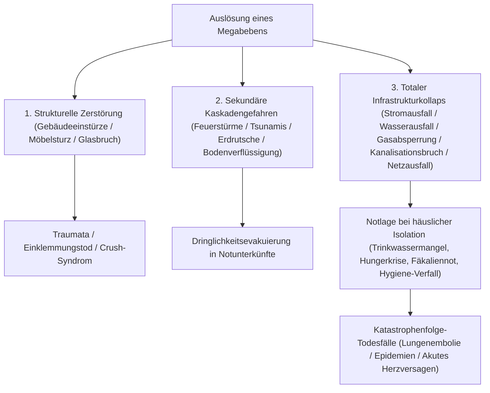
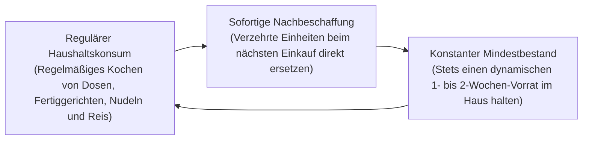
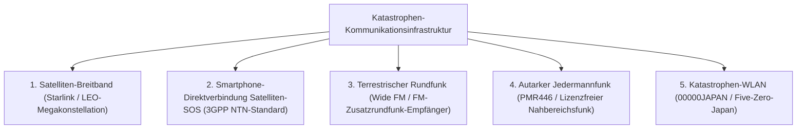

## Einleitung: Etablierung des „Überlebens-Ingenieurwesens“ auf einem Archipel multipler Katastrophen

Der japanische Archipel, am pazifischen Feuerring gelegen, nimmt lediglich 0,25 % der weltweiten Festlandfläche ein. Dennoch konzentrieren sich auf diesem schmalen Raum rund 20 % aller globalen Erdbeben der Magnitude 6 oder höher sowie etwa 7 % aller aktiven Vulkane der Erde – ein Höchstwert an natürlicher Gefahrendichte.

Im 21. Jahrhundert haben die globale Erwärmung, steigende Meeresoberflächentemperaturen und ein drastisch erhöhter Sättigungsdampfdruck der Atmosphäre herkömmliche lineare meteorologische Prognosen obsolet gemacht. Stationäre „lineare Regenfronten“ entfesseln extreme Sturzfluten, bei denen Flussdeichbrüche und urbane Binnenüberschwemmungen zusammenfallen. Hinzu kommt die statistische Gewissheit bevorstehender nationaler Mega-Katastrophen: das Nankai-Graben-Megabeben (Magnitude 8–9), das Direktbeben unter der Metropolregion Tokio und ein explosiver Plinianischer Ausbruch des Fuji bedrohen das Land mit einer totalen Lähmung staatlicher Infrastrukturen.

Unter solch extremen Bedingungen stößt die staatliche und kommunale Katastrophenhilfe („Kojo“) unweigerlich an physische Grenzen. Nach einem Großbeben führen zerstörte Fernstraßen, unkontrollierte Feuersbrünste, zusammengebrochene Telekommunikationsnetze und beschädigte Verwaltungsgebäude zu einer unausweichlichen Versorgungslücke: **„mindestens 72 Stunden (3 Tage), in großflächig verwüsteten Gebieten über eine Woche“**, bevor organisierte Rettungskräfte und Hilfsgüter die einzelnen Haushalte erreichen können.

Die fundierte Disziplin, um dieses Zeitfenster autonom zu überstehen und das Überleben von Familie und Nachbarschaft zu sichern, ist das **„Katastrophenminderungs-Ingenieurwesen (Disaster Mitigation Engineering)“**, und ihr materielles Instrumentarium ist die **„Notfall- und Schutzausrüstung (Emergency Survival Gear)“**. Notfallausrüstung ist kein planloses Horten gewöhnlicher Haushaltswaren. Sie bildet ein autarkes, tragbares Lebenserhaltungssystem, das konzipiert wurde, um die biochemische Homöostase des menschlichen Organismus und die öffentliche Hygiene in einem Extremzustand aufrechtzuerhalten, in dem Strom, Trinkwasser, Gas, Kanalisation und Telekommunikation vollständig kollabiert sind.

Die vorliegende Abhandlung analysiert die zeitliche Dynamik von Katastrophen und quantitative Risikobewertungen, die dreistufige modulare Ausrüstungsdoktrin (Phasen 0, 1 und 2), biochemische und sanitärtechnische Ansätze zur Wasser-, Nahrungsmittel- und Fäkalienentsorgung, netzunabhängige Notstromsysteme sowie klinische Protokolle zur Verhinderung indirekter Katastrophenopfer in Notunterkünften.

```
【Katastrophenphasen und funktionale Entfaltung der Notfallausrüstung】

┌─────────────────┬───────────────────────────────┬───────────────────────────────┐
│ Phase           │ Zeitachse & Umgebungszustand  │ Geforderte Funktion & Rüstung │
├─────────────────┼───────────────────────────────┼───────────────────────────────┤
│ Phase 0         │ Alltag, Pendeln, unterwegs    │ Phase-0-EDC: Signalpfeife,    │
│ (Schockmoment)  │ (Unvorhersehbarer Aufenthalts.)│ Kompaktleuchte, Not-WC-Beutel │
├─────────────────┼───────────────────────────────┼───────────────────────────────┤
│ Phase 1         │ Schockmoment bis 24 Stunden   │ Fluchtrucksack (Go-Bag):      │
│ (Erste Flucht)  │ Sofortflucht vor Trümmern,    │ Kopfschutz, N95-Staubmaske,   │
│                 │ Großbränden und Tsunamis      │ Sicherheitsschuhe, Feldflasche│
├─────────────────┼───────────────────────────────┼───────────────────────────────┤
│ Phase 2         │ 24 Stunden bis 72 Stunden     │ Rettungswartezeit / Schutz im │
│ (Lebenserhalt)  │ Totaler Infrastrukturkollaps  │ Heim: Trauma-Set, Rettungs-   │
│                 │ und vollständige Isolation    │ decke, Mikrofilter-System     │
├─────────────────┼───────────────────────────────┼───────────────────────────────┤
│ Phase 3         │ 72 Stunden bis über 1 Woche   │ Phase-2-Bevorratung (Logistik)│
│ (Langzeit-      │ Verlängerter Notaufenthalt,   │ Notnahrung, Trinkwasserdepot, │
│ Evakuierung)    │ Aufrechterhaltung der Hygiene │ autarker Strom, Desinfektion  │
└─────────────────┴───────────────────────────────┴───────────────────────────────┘
```

---

## 1. Mechanismen komplexer Katastrophen und Timeline-Engineering

Der Aufbau eines resilienten Schutzsystems erfordert ein präzises Verständnis der physikalischen Bruchmechanik von Naturphänomenen und der Kaskadeneffekte des infrastrukturellen Zusammenbruchs.

### 1.1 Bruchmechanik von Erdbeben: Subduktionszonen- vs. Intraplatten-Flachbeben
Zerstörerische Beben lassen sich geomechanisch in zwei Hauptgruppen unterteilen:

1. **Subduktionszonen-Beben (Plattengrenzenbeben) (z. B. Nankai-Graben, Tohoku-Beben 2011)**:
   Entstehen dort, wo eine ozeanische Lithosphärenplatte unter eine kontinentale Platte abtaucht. Da die Bruchzone hunderte Kilometer lang ist, dauert die Erschütterung mehrere Minuten an und verursacht gigantische Flächenschäden. Die plötzliche Hebung des Meeresbodens löst verheerende Tsunamis aus, die innerhalb von Minuten Küstenlinien verwüsten. Zudem entstehen langperiodische Bodenbewegungen, die Hochhäuser in resonante Schwingungen versetzen.
2. **Kontinentale Flachbeben (Direktbeben an aktiven Verwerfungen) (z. B. Kobe 1995, Kumamoto 2016)**:
   Werden durch plötzliche Rissverschiebungen aktiver Verwerfungen in geringer Tiefe unter Festlandgebieten ausgelöst. Wegen der geringen Herdtiefe ist das Intervall zwischen den primären Kompressionswellen (P-Wellen) und den zerstörerischen Scherwellen (S-Wellen) – die S-P-Zeit – nahezu null. Extreme Vertikalbeschleunigungen und hochfrequente Pulswellen treffen Gebäude ohne Vorwarnung, zerschmettern Holzhäuser wie Kartenhäuser und scheren Brückenkonstruktionen ab.



### 1.2 Vulkanausbrüche und die Dynamik urbaner Ascheniederschläge
In Japan existieren 111 aktive Vulkane. Ein großer Plinianischer Ausbruch von Fuji, Asama, Aso oder Sakurajima bedroht urbane Zentren nicht primär durch lokale Lavaströme, sondern durch **„weiträumige vulkanische Ascheniederschläge“**, die eine schleichende Lähmung moderner Lebensadern bewirken.

Vulkanasche ist keine weiche organische Verbrennungsasche, sondern besteht aus **„scharfkantigen, abrasiven Mikro-Glassplittern und Silikat-Mineralkristallen (Siliziumdioxid SiO₂)“**:
- **Kollaps des Hochspannungsnetzes**: Bereits wenige Millimeter Asche werden bei Befeuchtung durch Regen elektrisch leitfähig. Dies führt an keramischen Isolatoren zu massiven Kriechströmen und Überschlägen, die das gesamte Verbundnetz lahmlegen.
- **Verkehrsinfarkt**: Minimale Ascheschichten führen zu gefährlichen Rutschunfällen; feine abrasive Partikel verstopfen die Luftansaugfilter von Verbrennungsmotoren, sodass Fahrzeuge ausfallen. Züge stehen still, da Asche auf Schienen den Stromfluss zwischen Rad und Schiene unterbricht. Flughäfen schließen komplett, weil angesaugte Silikate in Brennkammern schmelzen und Turbinen zerstören.
- **Blockade der Kanalisation**: Gelangt Asche in die Kanalisation, setzt sie sich am Rohrboden ab und bindet hydraulisch wie Beton ab, was das unterirdische Abwassernetz dauerhaft zerstört.
- **Atemwegs- und Augenschäden**: Partikel unter 2,5 Mikrometern dringen tief in die Lungenbläschen ein, lösen schwere Asthmaanfälle und Lungenödeme aus und erodieren die Hornhaut des Auges.

Vulkanausrüstungen erfordern daher Feinstaubmasken (N95/FFP2 oder höher), gasdichte Schutzbrillen, wasserdichte Schutzanzüge sowie strapazierfähiges Klebeband zum luftdichten Versiegeln von Wohnräumen.

---

## 2. Modulare Konzeption der Notfallausrüstung nach Phasen (Phasen 0, 1 und 2)

Die Allokation von Schutzgütern muss strikt in drei Ebenen modularisiert werden, die auf den menschlichen Aktionsradius und das zeitliche Fortschreiten der Notlage abgestimmt sind.

```
【Dreistufige modulare Architektur der Katastrophenvorsorge】

［Phase-0-Ausrüstung: EDC (Everyday Carry / Tägliches Mitführen)］
・Kontext: Ständiges Mitführen auf dem Arbeitsweg, in der Schule oder auf Reisen (Gewicht: 300 bis max. 500 g).
・Ziel: Bewältigung der ersten kritischen Stunden vom Moment des Einschlags bis zur Rückkehr nach Hause oder zum Erreichen eines Sammelpunkts.

［Phase-1-Ausrüstung: Fluchtrucksack (Emergency Go-Bag)］
・Kontext: Dauerhaft im Eingangsbereich oder am Kopfende des Betts deponiert (Gewicht: 10–15 kg für Männer, 8–10 kg für Frauen).
・Ziel: Ermöglicht die blitzschnelle Flucht vor Einsturz, Brand oder Tsunami; sichert die Vitalfunktionen der ersten 24 bis 48 Stunden.

［Phase-2-Ausrüstung: Häusliche Schutzreserve (Home Stockpile)］
・Kontext: Dezentral in Vorratsräumen, Schränken und Kellern gelagert (Kapazität: 7 bis 14 Tage).
・Ziel: Aufrechterhaltung der biologischen Autonomie und Hygiene in der eigenen Wohnung bei vollständigem Ausfall aller kommunalen Netze.
```

### 2.1 Phase-0-EDC: Die unauffällige Überlebensausrüstung im Alltag
Der moderne Mensch verbringt den Großteil des Tages außerhalb der eigenen vier Wände (Bürokomplexe, U-Bahnen, Einkaufszentren). Ein schweres Beben am Tag führt unweigerlich zu blockierten Aufzügen, Stillstand in dunklen Tunneln oder stundenlangen Märschen durch Schutt und Scherben.

```
【Unverzichtbare Nutzlast des Phase-0-EDC-Etuis (~400 g)】

1. Kompakte Hochleistungs-LED-Taschenlampe (AA/AAA-Zelle oder USB-C-Akku, >=100 Lumen)
2. Akustische Signalpfeife (Kugellose Doppelkammerkonstruktion, >=100 dB, funktioniert auch nass)
3. Notfall-Rettungsdecke aus aluminiumbedampftem Mylar (Reflexion von Körperwärme, Windschutz, Wasserschutz)
4. Mobile Not-Sanitärbeutel für Fäkalien (Superabsorber-Granulat + geruchsdichte Mehrschichtbeutel: min. 2 Einsätze)
5. Leistungsstarke Powerbank (5.000 bis 10.000 mAh) + robustes Multi-Ladekabel
6. Persönliches Erste-Hilfe- und Medikamentenset (Pflaster, Wunddesinfektion, Schmerzmittel, 3-Tage-Reserve chronischer Medikamente, N95-Masken)
7. Kleingeld in bar (Münzen und kleine Scheine: für Münztelefone; Kartenterminals fallen bei Stromausfall aus)
8. Notfall-Gesundheitskarte (Blutgruppe, Medikamentenallergien, Vorerkrankungen und Notfallkontakte)
```

### 2.2 Phase-1-Fluchtrucksack (Go-Bag): Gewichtsökonomie von Evakuierungsrucksäcken
Der gravierendste Fehler bei Fluchtrucksäcken ist Überladung: Wer den Rucksack mit Ausrüstung vollstopft, kann weder rennen noch Trümmer überklettern. Das physiologische Limit für agiles Vorankommen liegt bei **„etwa 20 % des Körpergewichts bei erwachsenen Männern (12–15 kg) und ca. 15 % bei Frauen (7–10 kg)“**.

```
【Packordnung und Lastverteilung im Fluchtrucksack】

・Oberer, rückennaher Bereich: Schwerste Gegenstände (Trinkwasser, Dosen, Batterien)
  -> Bringt den Massenschwerpunkt nah an die Wirbelsäule und mindert Hebelkräfte auf die Lendenwirbelsäule.
・Mittlerer bis äußerer Bereich: Mittelschwere Güter (Ersatzkleidung, Regenschutz, Trauma-Set).
・Unterer Bodenbereich: Leichte, voluminöse Gegenstände (Kompaktschlafsack, Thermovlies, Mikrofaserhandtuch).
・Deckelfach und Außentaschen: Sofortausrüstung (Stirnlampe, Pfeife, Falt-Schutzhelm, schnittfeste Handschuhe).
```

Das Schuhwerk ist ein kritischer Überlebensfaktor. Die Flucht in leichten Sneakern oder Sandalen ist fatal: Nach einem Beben sind Straßen übersät mit Splittern von Drahtglas, verbogenen Armierungseisen und aufrecht stehenden rostigen Nägeln. Halbhochentwickelte Trekkingschuhe mit durchtrittsicherer Stahl- oder Aramid-Zwischensohle oder zertifizierte Sicherheitsschuhe sind zwingende Voraussetzung.

---

## 3. Trinkwasserbereitstellung und Wasseraufbereitungstechnik

Der menschliche Organismus besteht zu rund 60 Gewichtsprozent aus Wasser. Während der Stoffwechsel Nahrungsmangel über mehrere Wochen tolerieren kann, führt ein totaler Wasserentzug bereits nach 3 bis 5 Tagen zu massiver Dehydratation, hypovolämischem Schock und tödlichem Multiorganversagen.

### 3.1 Wissenschaftliche Berechnung des physiologischen Wasserbedarfs
Gemäß Richtlinien des Katastrophenschutzes wird der minimale Grundbedarf wie folgt quantifiziert:

$$\text{Lebensnotwendiger Wasserbedarf} = 3,0 \text{ Liter / Person / Tag}$$

Für einen 4-Personen-Haushalt, der sich für eine 7-tägige Autonomie rüstet, ergibt sich:

$$3 \text{ L} \times 4 \text{ Personen} \times 7 \text{ Tage} = 84 \text{ Liter}$$

Das entspricht 42 handelsüblichen 2-Liter-Flaschen ausschließlich für die basale Flüssigkeitszufuhr. Rechnet man Brauchwasser für die Nahrungszubereitung, Händereinigung, Wundspülung und Mundhygiene hinzu, vervielfacht sich die benötigte Wassermenge rapide.

### 3.2 Hohlfasermembran-Filtration (Hollow Fiber Membrane)
Sobald Vorräte aufgebraucht sind, wird ein portabler Membran-Mikrofilter (wie Sawyer Squeeze/Mini oder Katadyn BeFree) zur entscheidenden Lebensader, um Regenwasser, Flusswasser, Brunnen oder Badewannenreserven keimfrei aufzubereiten.

```
【Wasseraufbereitungsmechanismus der Hohlfasermembran】

Kontaminiertes Rohwasser (Schwebstoffe, pathogene Bakterien, Parasitenzysten)
  ↓
［Poröse Hohlfasermembran: Nominale Porengröße 0,1 Mikron (100 Nanometer)］
  │
  ├─ 【Physikalisch zurückgehaltene und eliminierte Krankheitserreger】
  │   ・Pathogene Protozoen (Cryptosporidien: ~4–6 μm, Giardien: ~8–14 μm)
  │   ・Bakterielle Erreger (Escherichia coli: ~0,5 × 2 μm, Cholera, Salmonellen)
  │   ・Mikroplastik, Trübstoffe, Feinsedimente
  │
  └─ 【Passierende Moleküle und Ionen】
      ・Reine Wassermoleküle (H₂O: Moleküldurchmesser ~0,3 Nanometer)
      ・Gelöste lebenswichtige Mineralien und Elektrolyte (Na⁺, Ca²⁺, Mg²⁺)
  ↓
Steriles, biologisch unbedenkliches Trinkwasser
```

Hohlfasermembranen haben jedoch physikalische Grenzen: Vollständig gelöste Chemikalien (Schwermetalle, Pestizide, Radioisotope) und Viren im Nanometerbereich (0,02 bis 0,08 Mikron wie Noroviren, Rotaviren, Hepatitis A) können 0,1-Mikron-Poren passieren. Bei Fäkalienbelastung des Rohwassers ist es daher eine fundamentale Regel, die Filtration mit **mindestens 1-minütigem sprudelndem Abkochen** oder **chemischer Chlorung mittels Natriumhypochlorit** zu kombinieren.

---

## 4. Biochemie von Notrationen und Langzeitkonservierung

Ernährung in Krisenzeiten dient nicht bloß der Deckung von Kalorien; sie erfüllt wesentliche neurochemische Funktionen zur Erhaltung des Immunsystems und Stabilisierung der Psyche unter extremem Dauerstress.

### 4.1 Alpha-Reis: Stärkegelatinierung und Retrogradationskinetik
Das Rückgrat moderner Zivilschutzverpflegung, der sogenannte „Alpha-Reis“ (vorgelatinierter Trockenreis), basiert auf gezielter Phasenumwandlung der Stärkekristallinität.

```
【Kristallographische Phasenumwandlung bei Alpha-Reis】

Native Rohreisstärke (Beta-Stärke / β-starch)
・Dicht gepackte micellare Kristallstruktur. Wasser dringt nicht ein; menschliche Alpha-Amylase kann glykosidische Bindungen nicht spalten.
  ↓ Hydrothermisches Garen (Gelatinierung / Alpha-Reaktion)
Gelatinierte Stärke (Alpha-Stärke / α-starch)
・Thermische Energie bricht Wasserstoffbrücken; das Gitter zerfällt in ein amorphes, quellfähiges, hochverdauliches Hydrogel.
  ↓ (Bei langsamem Abkühlen kristallisiert Stärke zur ungenießbaren, harten „retrogradierten Stärke [β'-Stärke]“ zurück)
［Industrielle Heißluft-Schocktrocknung］
・Der frisch gegarte Reis im Alpha-Zustand wird blitzartig mit Heißluft (80 bis 100 °C+) auf einen Feuchtigkeitsgehalt unter 8–10 % getrocknet.
・Dies stoppt die Rekristallisation und friert die poröse Alpha-Matrix dauerhaft ein.
  ↓
Rekonstitution durch Kapillarkräfte
・Bei Zugabe von kochendem Wasser (15 Min.) oder kaltem Wasser (60 Min.) dringt Wasser durch Kapillareffekte sekundenschnell in die Poren ein und stellt den Zustand von frisch gekochtem Reis wieder her. Haltbarkeit: 5 bis 7 Jahre bei Raumtemperatur.
```

### 4.2 Physik der Gefriertrocknung (Lyophilisation / Sublimationstrocknung)
Für Suppen, Eintöpfe und Proteine nutzt die Gefriertrocknung den **„Tripelpunkt des Wassers“** (0,01 °C bei 611,65 Pa), um Eis im Hochvakuum direkt zu sublimieren.

Lebensmittel werden auf −30 °C bis −50 °C tiefgefroren, in eine Vakuumkammer verbracht und der Druck unter den Tripelpunkt gesenkt. Durch dosierte Sublimationswärme geht das gefrorene Wasser direkt vom festen in den gasförmigen Zustand über, ohne je die flüssige Phase zu durchlaufen.

```
【Biophysikalische Vorzüge der Vakuum-Gefriertrocknung】

1. Strukturerhalt auf Zellebene:
   Da keine thermische Zersetzung stattfindet, bleiben Zellmembranen intakt und wärmeempfindliche Vitamine (Vitamin C, B-Komplex) geschützt.
2. Drastische Massenreduktion:
   95 % bis 98 % des Wassergehalts werden entzogen; das Eigengewicht sinkt auf einen Bruchteil der Frischware, was die Marschlast minimiert.
3. Blitzschnelle Rehydratation:
   Das entwichene Eis hinterlässt ein mikroskopisches Netzwerk offener Poren (Schwammstruktur). Zugegebenes Wasser wird durch Kapillarkräfte in Sekunden aufgesaugt und rekonstituiert Biss und Aroma perfekt.
```

### 4.3 Die Dynamik des Rolling-Stock-Verfahrens (Umlaufende Notfallbevorratung)
Das veraltete Konzept, Kisten mit ungenießbaren Notrationen für fünf Jahre im Keller verstauben zu lassen, um sie nach Ablauf wegzuwerfen, gilt im modernen Zivilschutz als gescheitert.
Standard ist heute das **„Rolling-Stock-System (Dynamisches Rotationslager)“**.



Der entscheidende psychologische Vorteil des Rolling-Stock-Systems liegt im **„Verzehr vertrauter Komfortnahrung (Comfort Foods) in der Extremsituation“**. Inmitten traumatischer Evakuierungsumstände führt das ausschließliche Verabreichen trockener, geschmackloser Riegel zu akuter Appetitlosigkeit, Magen-Darm-Problemen und Depressionen. Lang haltbare Alltagslebensmittel rotierend zu lagern, ist das robusteste und nachhaltigste Vorratsmodell.

---

## 5. Hygiene-Ingenieurwesen und Notunterkunfts-Überleben (Infektionsschutz, Fäkalien, Wärmeerhalt)

Epidemiologische Auswertungen historischer Megabeben offenbaren eine erschreckende Realität: Bei den Erdbeben in Kobe (1995), Kumamoto (2016) und auf Noto (2024) überstieg die Zahl der **„Katastrophenfolge-Todesfälle (Disaster-Related Deaths)“** – Menschen, die das eigentliche Beben überlebten, aber während der Evakuierung an Erschöpfung und Krankheiten starben – in manchen Regionen die Zahl der direkten Erdrutsch- und Einsturzopfer.

Die Hauptursache dieser Folge-Todesfälle ist kein Mangel an Nahrung, sondern der **„vollständige Zusammenbruch der öffentlichen Hygiene“** und der **„Ausfall der menschlichen Fäkalienentsorgung“**.

### 5.1 Notfall-Trockentoiletten und die Chemie der Superabsorber-Polymere (SAP)
Bei Wasserausfall ist das Nachspülen von WCs mit Eimern strengstens untersagt. Sind unterirdische Abwasserrohre oder Steigleitungen gebrochen, drückt das Spülwasser aus oberen Stockwerken als Fäkalienfontäne in den unteren Wohnungen heraus und verwandelt das gesamte Gebäude in eine biologische Gefahrenzone.

Die einzig hygienische Lösung ist der Einsatz von Trocken-Notfalltoilettenbeuteln im Toilettenbecken. Der technologische Kernstoff ist das **„Superabsorber-Polymer (SAP: vernetztes Natriumpolyacrylat)“**.

```
【Biochemie der Fäkalienimmobilisierung durch Superabsorber (SAP)】

┌─────────────────────────────────────────────────────────────┐
│ Dissoziation hydrophiler Gruppen (-COONa):                  │
│ Bei Kontakt mit Urin dissoziieren Natriumionen (Na⁺),       │
│ wodurch feste negative Carboxylatladungen (-COO⁻) entlang  │
│ der Polymerkette verbleiben.                                │
│   ↓                                                         │
│ Explosive Gitteraufweitung durch elektrostatische Abstoßung:│
│ Die gegenseitige Abstoßung gleicher Ladungen zwingt das eng │
│ verknäuelte 3D-Netzwerk, sich explosionsartig aufzuweiten.   │
│   ↓                                                         │
│ Osmotischer Einstrom und irreversible Hydrogel-Bindung:     │
│ Die hohe Ionenkonzentration im Gitterinneren erzeugt einen  │
│ gigantischen osmotischen Druck, der das Hundert- bis Tausend-│
│ fache des Eigengewichts an Wasser einsaugt und zu einem fes-│
│ ten Hydrogel bindet (gibt Wasser auch unter Druck nicht ab).│
└─────────────────────────────────────────────────────────────┘
```

Hochwertige Granulate enthalten Silberionen ($Ag^+$), Chlorverbindungen und pflanzliche Tannine, die Bakterien abtöten und das Ausgasen von giftigem Ammoniak ($NH_3$) und Schwefelwasserstoff ($H_2S$) dauerhaft chemisch unterbinden.

#### Pathophysiologie der Miktionshemmung und das „Economy-Class-Syndrom“
Verkommen Toiletten in Notunterkünften zu stockdunklen, stinkenden Ekelorten, reagieren Evakuierte (besonders Frauen und Senioren) instinktiv mit einer verhängnisvollen Strategie: **Sie trinken kaum noch Wasser, um den Toilettengang zu vermeiden**.

Dehydratation führt zu starker Bluteindickung (Hämokonzentration). Zusammen mit der Bewegungslosigkeit beim Schlafen im Auto oder auf harten Böden führt der Druck auf die Beinvenen zu tiefen Beinvenenthrombosen (TVT). Beim Aufstehen lösen sich Thromben, wandern zur Lunge und lösen eine tödliche Lungenembolie („Economy-Class-Syndrom“) aus. Saubere Not-Toiletten sind keine Komfortfrage, sondern lebensrettende Akutmedizin.

### 5.2 Wärmeschutz-Ingenieurwesen: Rettungsdecken aus aluminiumbedampftem PET
Akzidentelle Hypothermie (Absinken der Körperkerntemperatur unter 35 °C) droht nicht nur im Winter: Bei Wind und nasser Kleidung kann Unterkühlung selbst im Hochsommer binnen kürzester Zeit zum Kältetod führen.

Die Raumfahrt-Rettungsdecke besteht aus einer nur 12 Mikrometer dünnen BoPET-Folie (Mylar), auf die im Hochvakuum reinstes Aluminium aufgedampft wird.
Durch Spiegelflächenreflexion freier Metallelektronen **„reflektiert sie über 90 % der vom Körper abgestrahlten Ferninfrarot-Wärme“** zurück zum Körperkern. Gleichzeitig blockiert sie Windkonvektion und Verdunstungskälte vollständig und bietet bei nur 50 Gramm Gewicht die Isolierleistung mehrerer Wolldecken.

---

## 6. Autarke Notstromversorgung und resiliente Kommunikationstechnik

Der Zusammenbruch von Stromnetz und Mobilfunk stürzt Überlebende in absolute Finsternis, Isolation und Panik durch Falschmeldungen. Der Aufbau einer netzunabhängigen Energiebasis und redundanter Kommunikationspfade ist oberste Priorität.

### 6.1 Sicherheit und Elektrochemie von Lithium-Eisenphosphat-Akkus (LiFePO₄)
Bei der Auswahl von Powerstations ist die Zellchemie der Kathode das entscheidende Sicherheitskriterium. Zwischen ternären Lithium-Ionen-Zellen (NMC: Nickel-Mangan-Cobalt) und **„Lithium-Eisenphosphat-Zellen (LFP / $\text{LiFePO}_4$)“** liegen Welten.

```
【Physikalischer Vergleich: Ternäre Akkus (NMC) vs. LiFePO₄】

┌──────────────────────┬───────────────────────────────┬───────────────────────────────┐
│ Kriterium            │ Ternäre Systeme (NMC/NCA)     │ Lithium-Eisenphosphat (LiFePO₄│
├──────────────────────┼───────────────────────────────┼───────────────────────────────┤
│ Kristallgitter       │ Schichtgitter (instabil)      │ Olivinstruktur (robuste       │
│                      │                               │ kovalente P-O-Bindungen)      │
│ Thermisches Durch-   │ ~200 bis 210 °C               │ ~400 bis 500 °C               │
│ gehen (Thermal Run.) │ (Kritisch instabil)           │ (Extrem hitzebeständig)       │
│ Sauerstofffreisetz.  │ Spaltet bei Überladung Sauer- │ Extrem feste Bindung; spaltet │
│ & Brandgefahr        │ stoff ab; Explosionsbrand     │ keinen Sauerstoff ab; brennt  │
│                      │ nicht beherrschbar            │ selbst bei Nagelpunktion nicht│
├──────────────────────┼───────────────────────────────┼───────────────────────────────┤
│ Zykluslebensdauer    │ ~500 bis 800 Zyklen           │ ~3.000 bis 4.000 Zyklen       │
│                      │ (Rascher Kapazitätsverlust)   │ (Über 10 Jahre Lebensdauer)   │
│ Energiedichte        │ Hoch (Sehr leicht & kompakt)  │ Moderat (Etwas schwerer)      │
└──────────────────────┴───────────────────────────────┴───────────────────────────────┘
```

Für den Katastrophenschutz, wo Akkus über Jahre in heißen Autos oder Schränken lagern, sind Eigensicherheit gegen thermisches Durchgehen und extreme Zyklenfestigkeit unersetzlich: **$\text{LiFePO}_4$-Powerstations gelten als unangefochtener Industriestandard**.

### 6.2 Solarmodule und MPPT-Laderegler-Optimierung
Bei mehrwöchigen Stromausfällen nützen Steckdosen nichts. Photovoltaik-Nachladung ist zwingend nötig.
Hocheffiziente monokristalline Faltmodule (22–24 %+ Wirkungsgrad) in Kombination mit **MPPT-Ladereglern (Maximum Power Point Tracking)** stellen sicher, dass die Elektronik auch bei Bewölkung, diffusem Licht oder Morgen-/Abendsonne das absolute Leistungsmaximum aus den Modulen zieht.

---

## 2.3 Taktische Traumaversorgung (Trauma Care) und das Tourniquet (CAT)

Bei Einstürzen, umherfliegenden Glasscherben und Tsunami-Trümmern ist die **„aktive arterielle Massenblutung“** die schnellste Todesursache. Reißt die Oberschenkel- oder Oberarmarterie ab, verliert der Körper binnen Minuten ein Drittel seines gesamten Blutvolumens. Auf Rettungswagen zu warten, bedeutet den sicheren Verblutungstod.

Im modernen Trauma-Standard (TCCC) ist das **„Combat Application Tourniquet (CAT)“** der Goldstandard bei lebensgefährlichen Extremitätenblutungen, die durch Druckverband nicht beherrschbar sind.

```
【Anatomie des CAT-Tourniquets und Abbindeprotokoll】

┌─────────────────────────────────────────────────────────────┐
│ Klemmschnalle und hochfestes Nylonband anlegen:             │
│ 5 bis 7 cm proximal der Wunde (zum Herzen hin) anlegen.     │
│ (Niemals über Gelenken platzieren. Bei Unklarheit in der    │
│ Hektik sofort am obersten Extremitätenansatz anlegen).      │
│   ↓                                                         │
│ Knebel (Windlass Rod) drehen:                               │
│ Drehen, um das innere Band zuzuziehen, bis ein gleichmäßiger│
│ Zirkulardruck entsteht, der den arteriellen Druck übersteigt│
│ Drehen, bis die pulsierende Blutung absolut stoppt.         │
│   ↓                                                         │
│ Fixieren im Sicherungsclip & Uhrzeit notieren:              │
│ Knebel im Clip arretieren. Exakte Uhrzeit der Anlage mit    │
│ wasserfestem Stift auf das weiße Band schreiben (maximale   │
│ Ischämietoleranz: max. 2 Stunden).                          │
└─────────────────────────────────────────────────────────────┘
```

Für tiefe Wunden an Körperübergängen (Leiste, Achsel, Halsansatz), wo kein Tourniquet greift, sind **„Hämostyptische Gazen (z. B. QuikClot)“** mit Kaolin oder Chitosan lebensrettend. Kaolin aktiviert schlagartig den Gerinnungsfaktor XII; durch festes Tamponieren bildet sich in Minuten ein stabiles Fibrin-Gerinnsel.

Bei penetrierenden Brustkorbverletzungen („offener Pneumothorax“) verhindert ein **„Ventiliertes Brustpflaster (Chest Seal)“** mit Einwegeventil, dass Außenluft in den Pleuraspalt gesaugt wird, und bannt die Erstickungsgefahr durch Spannungspneumothorax.

---

## 5.3 Internationale Standards für Notunterkünfte: Das Sphäre-Projekt und „TKB48“

Der globale humanitäre Mindeststandard für Evakuierungsunterkünfte ist das **„Sphäre-Handbuch (The Sphere Handbook)“**, formuliert von Rotem Kreuz und weltweiten NGOs. Die klassische Praxis (Massenlager auf Turnhallenböden, kalte Reisbälle, verdreckte Chemie-Klos) verletzt elementare Menschenrechte.

Die japanische Katastrophenmedizin fordert daher ultimativ den **„TKB48-Standard (Toiletten, Küchen und Betten binnen 48 Stunden / Toilets, Kitchen, Bed)“**.

```
【Die drei Säulen der Unterkunfts-Hygiene: TKB-Standard】

1. Ｔ (Toilette / Toilet):
   ・Sphäre-Standard: Min. 1 Toilette pro 20 Personen; Geschlechterverhältnis 1:3 (Frauen benötigen biologisch mehr Zeit).
   ・Sanitärtechnik: Ausleuchtung rund um die Uhr, Handwaschplätze (Wasser & Seife), Sichtschutz, Riegel.
   ・Ziel: Gestankfrei, dunkelheitsfrei, schwellenfrei, um Urin-Unterdrückung zu verhindern.

2. Ｋ (Küche & Warmverpflegung / Kitchen):
   ・Warme Mahlzeiten binnen 48–72 Stunden: Feldküchen und Flüssiggas-Kochstellen zur Ausgabe heißer, nahrhafter Suppen.
   ・Wirkung: Verhindert Unterkühlung, regt die Magen-Darm-Tätigkeit an und dämpft akute Stresshormone.

3. Ｂ (Bettensysteme / Bed):
   ・Wellpappebetten (Cardboard Beds) für alle: Liegehöhe 30 bis 40 cm über dem Hallenboden.
   ・Klinische Wirkung:
     ① Stoppt Kälteauskühlung durch Wärmeleitung vom Boden (verhindert Lungenentzündungen).
     ② Hebt die Atemzone über die bodennahe 30-cm-Schicht schädlicher Stäube und Norovirus-Aerosole.
     ③ Erleichtert Senioren das Aufstehen und verhindert Immobilisationssyndrome und Thrombosen.
```

### Mundpflege zur Verhütung von Aspirationspneumonien
Die häufigste Todesursache älterer Schutzsuchender ist die **„Aspirationspneumonie“**.
Bei Wasserausfall unterbleibt das Zähneputzen. Binnen 48 Stunden vermehren sich anaerobe Bakterien im Mund rasant. Im Schlaf geraten Speicheltröpfchen mit Millionen Keimen in die Luftröhre und Lunge und entfachen tödliche bakterielle Lungenentzündungen.
Flüssige Mundspülungen ohne Nachspülen und Mundpflege-Feuchttücher in der Notfalltasche wirken wie ein unverzichtbarer Schutzschild gegen tödliche Infektionen.

---

## 6.3 Redundante Notfall-Telekommunikation: Satelliten, Funk und 00000JAPAN

Bei Katastrophen fallen Mobilfunkmasten durch Akkuerschöpfung, zerrissene Glasfaserkabel oder Überlastungssperren (Netzsperren über 90 %) sofort aus. Gegen den Informations-Blackout hilft nur mehrschichtige Redundanz.



### 1. Empfangstechnik für Wide-FM-Radios (FM-Zusatzrundfunk)
Klassischer Mittelwellen-AM-Rundfunk (526,5–1606,5 kHz) hat zwar Bodenwellen-Reichweite, wird aber durch Stahlbetonbauten massiv gedämpft und leidet unter urbanem Schaltnetzteil-Elektrosmog.
„Wide FM“ (VHF 90,0–95,0 MHz) überträgt AM-Katastrophensender simultan im rauschfreien UKW-Band. UKW durchdringt Betonwände und ist störungsfrei, was glasklaren Empfang von Frühwarnungen garantiert. Ein Kurbelradio mit Wide FM ist die primäre Verteidigungslinie.

### 2. Satelliten-Revolution: Starlink und Smartphone-Direkt-SOS
SpaceXs „Starlink“ (Satelliten im erdnahen Orbit in ~550 km Höhe) hat das Krisenmanagement revolutioniert. Eine kleine Antenne gen Himmel liefert hunderte Megabit pro Sekunde bei minimaler Latenz mitten in Trümmergebieten, wie beim Noto-Beben 2024 bewiesen.

Zugleich besitzen moderne Smartphones (z. B. iPhone 14+) Satellitenchipsätze nach 3GPP Release 17/18 (NTN). Ohne jede terrestrische Mobilfunkverbindung sendet das Smartphone Notfall-SMS und GPS-Koordinaten direkt an Satelliten im All.

---

## 2.4 Urbane Großbrände, Erstbrandbekämpfung und Flucht durch Rauchgase

Einer der tödlichsten Faktoren nach Starkbeben sind **„Simultane Flächenbrände (Feuerstürme)“**. Berstende Gasleitungen, umgestürzte Ölöfen und Wiederzündungen bei Netzwiederkehr („Stromrückkehr-Brände“) überfordern die Feuerwehr restlos.

### Chemie der Brandfluchthauben (Smoke Blocks)
Rund 60 % aller Brandtoten sterben nicht an Verbrennungen, sondern an **„Erstickung durch toxische Brandgase (Kohlenmonoxid und Cyanwasserstoff)“**. Pyrolyse von Kunststoffen setzt Blausäure ($HCN$) und Phosgen ($COCl_2$) frei. Ein nasses Tuch vor dem Mund stoppt unlösliches Kohlenmonoxid und toxische Rußpartikel nicht.

Qualifizierte Brandfluchthauben bestehen aus hitzefestem aluminiumbeschichtetem Gewebe mit Aktivkohle und **„Hopcalit-Katalysator (Kupfer-Mangan-Oxid)“**. Hopcalit oxidiert hochgiftiges Kohlenmonoxid ($CO$) bei Raumtemperatur blitzschnell zu unschädlichem Kohlendioxid ($CO_2$) und sichert 10 bis 15 Minuten Atemluft zur Flucht durch verqualmte Treppenhäuser.

### Kriterien für Erste-Hilfe-Löschgeräte
- **Feuerlöscher mit wässriger Salzlösung (Netzmittel/Loaded Stream)**: Im Gegensatz zu ABC-Pulverlöschern, die Sicht rauben und Glutnester oft nicht löschen, sprühen diese Geräte einen feinen Salznebel. Dieser dringt tief in Holzfasern ein, verhindert Wiederaufflammen und erhält die Sicht in engen Räumen.
- **Seismische Schutzschalter (Erdbebenschalter)**: Schalten bei Erschütterungen ab Erdbebenstärke 5-Oben die Hauptstromzufuhr automatisch ab, um Kurzschlussbrände bei Netzwiederkehr zu verhindern.

---

## 1.3 Erdbebensichere Innenraumverankerung: Möbelsturz- und Splitterschutz-Physik
Obduktionsdaten aus Kobe und Noto zeigen: Über 80 % der Toten in Innenräumen starben an **„Erstickung und Quetschungen durch einstürzende Wände und herabstürzende Möbel/Großgeräte“**. Bei Erschütterungen der Stärke 6-Oben bis 7 werden Schränke, Klaviere und Kühlschränke zu mörderischen Wuchtgeschossen, die Fluchtwege verriegeln.

Möbelsicherung erfordert strukturmechanische Ingenieurmethoden.

```
【Mechanische Belastbarkeit von Möbelverankerungen】

┌──────────────────────┬───────────────────────────────┬───────────────────────────────┐
│ Beschlagsart         │ Mechanisches Halteprinzip     │ Kritische Montagerichtlinie   │
├──────────────────────┼───────────────────────────────┼───────────────────────────────┤
│ Massive L-Winkel     │ Verschraubung direkt in Wand- │ Schrauben in nackter Gips-    │
│ aus Metall           │ ständer/Tragbalken. Scher- und│ platte halten nichts. Ständer │
│ (Goldstandard)       │ Zugkräfte stoppen Kippmoment. │ mit Sensor orten und treffen. │
├──────────────────────┼───────────────────────────────┼───────────────────────────────┤
│ Teleskop-Spannstangen│ Erzeugen Druckspannung zwi-   │ Dünne Deckenpaneele brechen   │
│ ＋ Antirutsch-Gel-Pads│ schen Möbel und Decke; Gel-   │ durch. Immer breite Querhölzer│
│ (Hybridsystem)       │ pads am Boden stoppen Rutschen│ unterlegen; mit Gel koppeln.  │
├──────────────────────┼───────────────────────────────┼───────────────────────────────┤
│ Schwerlast-Gurtbänder│ Hochfeste Gurte oder Stahl-   │ Kühlschrankgriffe mit Wand-   │
│ und Stahlseile       │ seile sichern kopflastige Ge- │ bock verschrauben; Gurte dämp-│
│                      │ räte durch Dehnungsaufnahme.  │ fen die kinetische Energie ab.│
└──────────────────────┴───────────────────────────────┴───────────────────────────────┘
```

### Reißfestigkeit von Fenster-Splitterschutzfolien (Mehrlagen-PET)
Verzieht das Erdbeben Fensterrahmen zu Rauten, bersten Glasscheiben explosiv und schleudern rasiermesserscharfe Splitter durch den Raum.
Eine 50 bis 100 Mikrometer dicke Mehrlagen-PET-Folie auf der Innenseite hält mit Acrylkleber alle Glassplitter fest zusammen (Selbsteinhausung) und bannt Schnittverletzungen zu 100 %.

---

## 2.5 Strömungsmechanik des Überlebens bei Sturmflut und Muren

Überschwemmungen durch Taifune und Dammbrüche erfordern Ausrüstungen nach den Gesetzen der Hydrodynamik – völlig verschieden von Erdbebenanforderungen.

### 1. Fluchtschuhe: Warum Gummistiefel eine tödliche Falle sind
In Flutwasser mit kniehohen Gummistiefeln zu waten, ist der verhängnisvollste Fehler der Wasserrettung.
Steigt das Wasser über Kniehöhe (40–50 cm), schwappt es von oben in die Stiefel. Da das Wasser nicht entweichen kann, wird jeder Stiefel zu einem mehrere Kilogramm schweren Bleigewicht. Man kann die Beine nicht mehr heben, stürzt in offene Kanalschächte und ertrinkt unweigerlich.
Die einzig richtige Ausrüstung sind **„wasserablaufende Schnür-Sneaker ＋ dicke Socken (oder Neoprensocken)“**. Fest geschnürt werden sie von der Strömung nicht abgestreift, füllen sich nicht mit totem Gewicht und erlauben agiles Gehen im trüben Wasser.

### 2. Hydrostatischer Druck und das Blockieren von Türen
Wird ein Fahrzeug oder Haus überflutet, berechnet sich der Druck auf eine nach außen öffnende Tür nach:

$$F = \rho g h A$$

Wobei $\rho$ die Wasserdichte, $g$ die Erdbeschleunigung, $h$ die Wassertiefe und $A$ die Türfläche ist.
Bereits bei **nur 40 bis 50 cm Wasserstand** lastet eine Kraft von mehreren hundert Kilogramm auf der Tür – es ist für einen Erwachsenen unmöglich, sie von innen aufzudrücken.
Daher gilt: Bei Warnstufe 3/4 sofort vertikal evakuieren. Im Auto gehört ein **Notfall-Rettungshammer mit Wolframcarbid-Spitze** griffbereit an Bord, um Scheiben bei blockierten Türen einzuschlagen.

---

## 5.4 Spezielles Schutz-Ingenieurwesen für vulnerable Gruppen (Säuglinge, Senioren, Kranke, Haustiere)

Standard-Sets sind für fitte Erwachsene ausgelegt. In der Realität sterben vor allem vulnerable Gruppen mit speziellen physiologischen Anforderungen.

```
【Spezifische Ausrüstungsprotokolle für vulnerable Gruppen】

┌──────────────────────┬───────────────────────────────┬───────────────────────────────┐
│ Zielgruppe           │ Spezifische Risiken           │ Unverzichtbare Zusatzausrüst. │
├──────────────────────┼───────────────────────────────┼───────────────────────────────┤
│ Säuglinge &          │ Kein Heißwasser für Milchpul- │ Trinkfertige Flüssignahrung   │
│ Schwangere           │ ver; Dehydratation; Weinen    │ (ungekühlt haltbar, sterile   │
│                      │ führt zu Isolation im Lager   │ Aufsaugaugsätze), Tragetuch   │
├──────────────────────┼───────────────────────────────┼───────────────────────────────┤
│ Senioren & Pflege-   │ Aspiration; Gebissverlust;    │ Andickungsmittel, passierte   │
│ bedürftige           │ Mangelernährung; Ausfall der  │ Fertiggerichte, Ersatzbrille, │
│                      │ Pflegeassistenz               │ Hörgerätebatterien, Notfallpass│
├──────────────────────┼───────────────────────────────┼───────────────────────────────┤
│ Chronisch Kranke     │ Ausfall von Dialyse, Insulin- │ Rezepte als Cloud-Backup,     │
│                      │ kühlung oder Heim-Sauerstoff  │ akkubetriebene Absauger,      │
│                      │ bedroht unmittelbar das Leben │ vorab definierte Notfallklinik│
├──────────────────────┼───────────────────────────────┼───────────────────────────────┤
│ Haustiere            │ Aufnahmeverweigerung im Lager;│ Faltbare Transportbox, Futter │
│ (Hunde, Katzen)      │ Panik-Flucht; Lärmstress      │ und Wasser für 10 Tage, Chip- │
│                      │                               │ Registrierung, Kotbeutel      │
└──────────────────────┴───────────────────────────────┴───────────────────────────────┘
```

Die Zulassung trinkfertiger Flüssigsäuglingsnahrung (ohne Wassererwärmung sofort trinkbar) war in Japan 2019 ein Meilenstein. In Unterkünften ohne sauberes Wasser und Gas schraubt man einfach einen Sauger auf und rettet Säuglingsleben ohne Verzug.

---

### 7.1 Halbjährliches Haushalts-Audit für Katastrophenschutz (Disaster Audit)

Selbst die beste Ausrüstung verkommt zu Schrott, wenn Batterien auslaufen, Lebensmittel verderben oder sich die Familie verändert.
Es empfiehlt sich ein festes **„Haushalts-Katastrophen-Audit“** zweimal jährlich (z. B. am **11. März** und **1. September**):

1. **Vorräte prüfen**: Ablaufdaten kontrollieren und ältere Bestände im Rolling-Stock-Verfahren verbrauchen.
2. **Akku-Wartung**: Powerstations und Powerbanks entladen und voll aufladen, um Zellgesundheit und Selbstentladung zu prüfen.
3. **Chemie- und Materialcheck**: Prüfen, ob Toiletten-Granulate verklumpt sind, Alkoholtupfer ausgetrocknet sind oder Gummis spröde wurden.
4. **Familienkommunikation üben**: Notfall-Sprachmailboxen („171“) und Messenger-Notfallfunktionen testen.
5. **Gefahrenkarten (Hazard Maps) abgleichen**: Überflutungs- und Erdrutschkarten prüfen und den Fußweg zur Notunterkunft am Tag ablaufen.

---

## 7. Fazit: Die Dreieinigkeit aus Selbsthilfe, Nachbarschaftshilfe und öffentlicher Hilfe

Eine professionelle Katastrophenausrüstung zusammenzustellen, ist kein Konsumwahn. Es ist die bewusste Übernahme von **„Eigenverantwortung (Personal Responsibility)“** für das eigene Leben und das der Familie – ein Lebensentwurf, der auf Vernunft und Respekt vor den Naturgewalten gründet.

Kein Deich und kein Dämpfer ist gegen die Urgewalten der Erde unzerstörbar. Wenn Beton bricht, entscheidet allein die Qualität der eigenen Ausrüstung und das trainierte Wissen über Leben und Tod.

Nur wer die eigene Existenz autonom absichert (**Selbsthilfe / „Jijo“**), hat die Kraft, dem Nachbarn zu helfen und Selbstschutzgruppen zu gründen (**Gemeinschaftshilfe / „Kyojo“**). Und weil die Bürger die ersten Tage aus eigener Kraft durchstehen, können Feuerwehr, Rettungsdienste und Notärzte ihre knappen Ressourcen voll auf Schwerstverletzte und isolierte Dörfer konzentrieren (**Maximierung der öffentlichen Hilfe / „Kojo“**).

Diese disziplinierte Wachsamkeit unaufgeregt in den friedlichen Alltag einzuweben, ist die höchste menschliche Weisheit, um das Leben auf diesem unruhigen Planeten in die Zukunft zu tragen.
