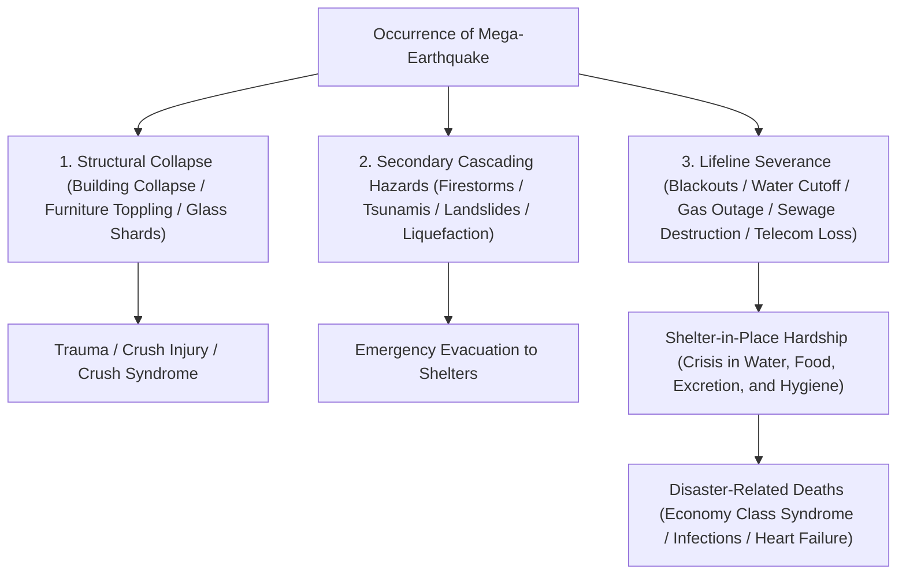
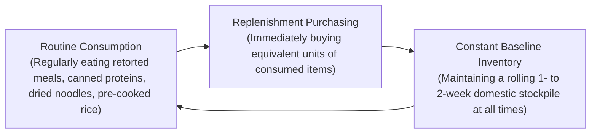
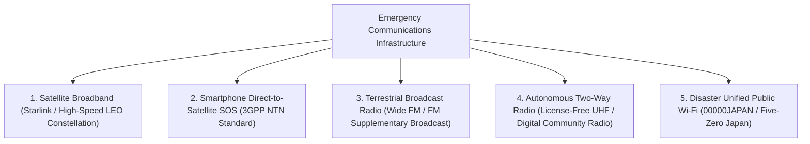

## Introduction: Establishing "Survival Engineering" in a Complex Disaster Archipelago

The Japanese archipelago, located along the Pacific Ring of Fire, occupies a mere 0.25% of the Earth's surface landmass. Yet within this narrow footprint lies approximately 20% of the world's earthquakes of magnitude 6 or greater and roughly 7% of its active volcanoes, making it one of the most natural-disaster-dense zones on the planet.

Moreover, as the 21st century unfolds, rising sea surface temperatures and increased atmospheric saturation water vapor driven by global climate change have shattered traditional linear forecasting models. Extreme torrential downpours caused by stationary "linear rainbands," compound flood disasters where external river overtopping and internal urban drainage failure collide, and catastrophic mega-disasters whose imminent occurrence is widely anticipated—such as the Nankai Trough Megaquake (Magnitude 8–9 class), the Tokyo Inland Earthquake, and an explosive eruption of Mount Fuji—are escalating the threat of national-scale system paralysis to unprecedented levels.

Under such catastrophic circumstances, there are severe physical limits to "Public Assistance" (government and municipal relief). Immediately following a massive earthquake, severed arterial roadways, uncontrollable urban conflagrations, paralyzed telecommunication backbones, and the structural devastation of municipal administrative centers themselves create a profound relief void: **"a minimum of 72 hours (3 days), extending to over a week in wide-area regional catastrophes,"** before official search-and-rescue teams and relief supplies can reach individual households.

Surviving this critical void autonomously and safeguarding the lives of one's family and community requires an empirical discipline: **"Disaster Mitigation Engineering."** The tangible physical instrument of this discipline is **"Emergency Survival Gear."** Disaster survival equipment is not a haphazard hoard of domestic commodities. It constitutes an autonomous, portable life-support system engineered to sustain human biochemical homeostasis and public health in an extreme environment where municipal lifelines—electricity, potable water, gas, municipal sewerage, and telecommunications—have suffered total collapse.

This treatise provides an exhaustive, scientifically rigorous framework of disaster survival: beginning with disaster progression timelines and quantitative risk assessments, proceeding through the three-tier modular equipment methodology (Phases 0, 1, and 2), biochemical and sanitary engineering approaches to water, sustenance, and waste management, emergency off-grid energy generation, and clinical protocols for eradicating disaster-related deaths within evacuation centers.

```
[Disaster Phase Progression and Survival Gear Functional Deployment]

┌─────────────────┬───────────────────────────────┬───────────────────────────────┐
│ Phase           │ Timeline & Conditions         │ Required Functions & Gear     │
├─────────────────┼───────────────────────────────┼───────────────────────────────┤
│ Phase 0         │ Routine / Out & Commuting     │ Phase 0 EDC: Whistle, compact │
│ (Impact Moment) │ (Unpredictable location)      │ light, portable toilet, IFAK  │
├─────────────────┼───────────────────────────────┼───────────────────────────────┤
│ Phase 1         │ Immediate post-disaster ~24h  │ Phase 1 Go-Bag: Head protect, │
│ (Initial Escape)│ Evacuation from collapse/tsunami dust mask, boots, canteen, ID  │
├─────────────────┼───────────────────────────────┼───────────────────────────────┤
│ Phase 2         │ 24h ~ 72h                     │ Standby rescue / Shelter-in-  │
│ (Life Support)  │ Complete lifeline cutoff/isol.│ place / Shelter: First aid,   │
│                 │                               │ emergency blanket, purifier   │
├─────────────────┼───────────────────────────────┼───────────────────────────────┤
│ Phase 3         │ 72h ~ 1 week and beyond       │ Phase 2 Stockpile (Logistics):│
│ (Sustained Life)│ Extended evacuation, hygiene  │ Food/water, power, sanitation │
└─────────────────┴───────────────────────────────┴───────────────────────────────┘
```

---

## 1. Mechanisms of Compound Disasters and Timeline Engineering

To engineer a resilient disaster defense system, one must first master the physical mechanics of primary natural phenomena and the sequential failure modes of modern urban infrastructure.

### 1.1 Physics of Seismic Motion: Subduction Zone vs. Inland Fault-Traversing Earthquakes
Earthquakes are fundamentally categorized into two distinct classes based on their faulting mechanics:

1. **Subduction Zone (Plate Boundary) Earthquakes (e.g., Nankai Trough Earthquake, 2011 Great East Japan Earthquake)**:
   Generated along the boundary where an oceanic tectonic plate subducts beneath a continental plate. Because the rupture fault zone spans hundreds of kilometers, the duration of intense seismic shaking lasts for several minutes, inflicting catastrophic destruction over vast geographical regions. Furthermore, vertical displacement of the seafloor generates monstrous tsunamis that strike coastal zones within minutes to tens of minutes. These quakes also generate destructive "long-period ground motion" that resonantly amplifies swaying in high-rise skyscrapers.
2. **Inland Fault-Traversing (Direct-Strike) Earthquakes (e.g., 1995 Kobe Earthquake, 2016 Kumamoto Earthquake)**:
   Caused by the sudden displacement of active shallow crustal faults within the landmass. Because the focal depth is exceptionally shallow, the time buffer between initial micro-tremors (P-waves) and the destructive shear wave arrival (S-waves)—the S-P interval—is virtually zero. Destructive vertical accelerations and high-frequency pulse waves hit overhead structures with zero warning, triggering immediate pancake collapses of wooden houses, violent toppling of furniture, and catastrophic shearing of roadways and bridges.



### 1.2 Volcanic Eruptions and Urban Dysfunction Dynamics of Wide-Area Ashfall
Japan hosts 111 active volcanoes. An explosive Plinian eruption of Mount Fuji, Mount Asama, Mount Aso, or Sakurajima poses a threat extending far beyond localized pyroclastic and lava flows: it inflicts **"Wide-Area Volcanic Ashfall,"** an insidious form of environmental infrastructural terrorism.

Volcanic ash is not soft combustible carbon ash; it consists of **"angular, abrasive microscopic glass shards and silicate mineral crystals (silica SiO₂)."**
- **Grid Failure**: Ash accumulating just a few millimeters becomes electrically conductive when wetted by rainfall, bridging ceramic insulators and causing widespread flashovers, short circuits, and catastrophic grid blackouts.
- **Transportation Paralysis**: A deposit of merely several millimeters on road surfaces causes severe vehicular skidding, while abrasive airborne particles clog combustion engine air intake filters, stalling vehicles. Rail transit ceases immediately due to electrical insulation between steel wheels and tracks. Commercial aviation shuts down entirely as airborne silica melts into glass inside high-temperature jet turbine combustion chambers, flaming out engines.
- **Sewerage Inundation**: Flushing volcanic ash into domestic drainage pipes causes the material to settle, compact, and cure like hydraulic cement, permanently occluding subterranean wastewater networks.
- **Respiratory and Ocular Trauma**: Particles under 2.5 microns penetrate deep into pulmonary alveoli, precipitating bronchial asthma attacks, acute respiratory distress, and corneal epithelial abrasions.

Consequently, specialized volcanic survival kits must include particulate respirators (certified N95/FFP2 or higher), hermetically sealed safety goggles, impermeable wet-weather outerwear, and polyethylene curing tape to hermetically seal interior living quarters.

---

## 2. Design Engineering of Phased Disaster Supplies (Phase 0, 1, 2)

Survival equipment allocation must be modularized into three strict operational tiers, calibrated against human mobility radii and post-disaster temporal progression.

```
[Disaster Preparedness Three-Tier Modular Architecture]

[Phase 0 Carry: EDC (Everyday Carry)]
- Context: Maintained continuously on one's person during daily commute, work, and travel (Weight: 300–500g).
- Objective: Overcome the immediate hours from the instant of disaster impact until reaching home or a primary emergency staging point.

[Phase 1 Evacuation: Go-Bag (Emergency Bug-Out Bag)]
- Context: Deployed at primary residential egress points (front foyer or bedside) (Weight: 10–15kg for males, 8–10kg for females).
- Objective: Enable rapid emergency escape from structural collapse, firestorms, or approaching tsunamis; sustain vital signs for the initial 24–48 hours.

[Phase 2 Stockpile: Shelter-in-Place Logistics (Home Stockpile)]
- Context: Dispersed throughout domestic pantries, storage depots, and closets (7–14 days capacity).
- Objective: Sustain complete biological life and public health autonomy inside a dwelling under total municipal utility severance.
```

### 2.1 Phase 0 EDC (Everyday Carry): The Survival Pouch in Daily Life
Modern citizens spend the overwhelming majority of their waking hours away from home—in commercial office high-rises, commuter transit, and public venues. A catastrophic daytime earthquake leaves individuals stranded in stalled elevator cabs, trapped within underground subway tunnels, or facing multi-hour pedestrian treks through debris-strewn urban landscapes.

```
[Phase 0 EDC Pouch Mandatory Payload (Recommended Weight: ~400g)]

1. High-Output Compact LED Flashlight (AA/AAA or USB-C rechargeable, >=100 lumens)
2. Rescue Signaling Whistle (Pea-less dual-chamber design, >=100 dB acoustic output, functional when wet)
3. Aluminized Mylar Emergency Blanket (Radiant barrier, thermal conservation, windbreak, rain cover, privacy screen)
4. Compact Portable Chemical Toilet Kits (Superabsorbent polymer coagulant + odor-barrier multi-layer bags: min. 2 uses)
5. High-Capacity Power Bank (5,000–10,000 mAh) + Heavy-Duty Multi-Connector Cable
6. Personal Pharmacopeia & First Aid (Adhesive bandages, antiseptic wipes, analgesics/antipyretics, 3-day supply of critical prescription medications, individually wrapped N95 masks)
7. Hard Currency (Small-denomination banknotes and coins: including 10/100 yen coins for public payphones; electronic payment networks fail during grid outages)
8. Emergency Medical & Contact ID Card (Emergency contacts, blood group, drug allergies, existing medical history)
```

### 2.2 Phase 1 Emergency Go-Bag: Weight Engineering for Evacuation Backpacks
The single most catastrophic failure mode in 1st-phase evacuation packs is overpacking: cramming excessive supplies into a bag until it exceeds human load carriage capacity, rendering the bearer incapable of running or traversing rubble. The physiological threshold for negotiating unstable terrain without structural exhaustion is **"approximately 20% of body mass for adult males (12–15 kg) and approximately 15% of body mass for adult females (7–10 kg)."**

```
[Phase 1 Evacuation Pack Packing Dynamics]

- Upper / Spinal Core Zone: Heaviest mass (potable water, canned rations, batteries) -> Raises the center of mass close to the dorsal column, drastically reducing biomechanical spinal torque.
- Mid-to-Outer Zone: Moderate mass (apparel, foul-weather gear, trauma kit).
- Lower Base Zone: Low-density, high-bulk items (compact sleeping bag, thermal layers, camp towel).
- Exterior Quick-Access Pockets / Top Lid: Critical rapid-deployment gear (tactical light, signaling whistle, protective headgear, heavy work gloves).
```

Footwear selection represents an absolute survival variable. Fleeing in sneakers or sandals is hazardous; earthquake-damaged corridors and roadways are blanketed with shattered plate glass, sheared structural rebar, and upward-projecting rusted nails. High-top hiking boots fitted with puncture-resistant stainless steel or aramid fiber midsole insoles, or certified industrial safety shoes, are mandatory survival gear.

---

## 3. Potable Water Procurement and Water Purification Engineering

The human physiological system is composed of approximately 60% water by weight. While human metabolism can endure food deprivation for several weeks, complete cessation of water intake causes severe cellular dehydration, hypovolemic shock, and fatal multi-organ failure within a mere 3 to 5 days.

### 3.1 Scientific Calculation of Required Water Volume
Under the emergency management guidelines established by public health agencies, the baseline water volume required for physiological survival is defined as:

$$\text{Life Support Required Water} = 3.0 \text{ Liters / person / day}$$

Consequently, calculating the survival baseline for a four-member household sheltering in place for a 1-week timeline yields:

$$3 \text{ L} \times 4 \text{ persons} \times 7 \text{ days} = 84 \text{ Liters}$$

This requires storing forty-two 2-liter PET bottles exclusively for basic metabolic survival. When factoring in secondary hygiene needs—food preparation, wound irrigation, and oral sanitization—the required domestic water volume expands substantially.

### 3.2 Hollow Fiber Membrane Filtration Engineering
When pre-packaged domestic water inventories are exhausted, converting non-potable environmental water sources—harvested rainwater, river water, well water, or stored domestic bathwater—into biologically safe drinking water via a micro-filtration system (e.g., Sawyer Squeeze/Mini, Katadyn BeFree) becomes the absolute lifeline.

```
[Hollow Fiber Membrane Water Treatment Mechanism]

Raw Contaminated Water (Suspended particulates, pathogenic bacteria, protozoan cysts)
  ↓
[Porous Hollow Fiber Membrane: Nominal Pore Size 0.1 Micron (100 Nanometers)]
  │
  ├─ [Physically Excluded & Retained Contaminants]
  │   - Pathogenic Protozoan Parasites (Cryptosporidium: ~4–6 μm, Giardia: ~8–14 μm)
  │   - Pathogenic Bacteria (Escherichia coli: ~0.5 × 2 μm, Vibrio cholerae, Salmonella)
  │   - Microplastics, Turbid Colloidal Silt, Suspended Sediments
  │
  └─ [Passing Molecules & Ions]
      - Pure Water Molecules (H₂O: ~0.3 nanometers)
      - Dissolved Beneficial Mineral Electrolytes (Na⁺, Ca²⁺, Mg²⁺)
  ↓
Biologically Safe, Sterile Drinking Water
```

Hollow fiber membranes possess distinct physical operational boundaries. Soluble chemical contaminants (heavy metals, synthetic agricultural pesticides, dissolved radioactive isotopes) and nanoscale viral pathogens (0.02–0.08 micron viruses such as Norovirus, Rotavirus, or Hepatitis A) can traverse single-stage 0.1-micron hollow fiber barriers. Therefore, whenever municipal water supplies are suspected of raw biological sewage contamination, combining hollow fiber microfiltration with subsequent thermal boiling (sustained vigorous rolling boil >=1 minute) or chemical chlorination (micro-titration with food-grade sodium hypochlorite) represents an uncompromising rule of public health engineering.

---

## 4. Biochemistry of Emergency Rations and Long-Term Preservation Technologies

Nutritional intake during catastrophic events serves not merely to fuel basal caloric metabolism, but to sustain immunocompetence and provide neurochemical stability to human victims navigating extreme psychological duress.

### 4.1 Alpha-Rice: The Starch Chemistry of Gelatinization and Retrogradation
The backbone of modern civil defense rations, "Alpha-Rice" (pre-gelatinized dehydrated rice), is a triumph of applied starch crystallography and food biophysics.

```
[Starch Crystallographic Transformations and Alpha-Rice Processing Mechanics]

Native Raw Rice Starch (Beta-Starch / β-starch)
- Densely packed micellar crystalline matrix. Water molecules cannot penetrate; human digestive alpha-amylase enzymes cannot hydrolyze the glycosidic bonds.
  ↓ Thermal Hydration (Cooking Process: Gelatinization)
Gelatinized Starch (Alpha-Starch / α-starch)
- Thermal energy disrupts intermolecular hydrogen bonds, disintegrating the crystalline lattice into an amorphous, highly digestible, water-swollen hydrogel.
  ↓ (Ambient cooling causes recrystallization into unpalatable, indigestible retrograded starch [β'-starch])
[Industrial Rapid Dehydration Engineering]
- Cooked, fully gelatinized alpha-rice is subjected to high-velocity heated dry air (80–100°C+), instantaneously driving down moisture content below 8–10%.
- This flash drying halts molecular recrystallization in its tracks, freezing the porous alpha-state crystal structure indefinitely.
  ↓
Rehydration via Aqueous Infiltration
- Injecting boiling water (15 min) or ambient-temperature unheated water (60 min) rapidly draws water molecules into the micro-porous matrix via capillary action, perfectly restoring tender, palatable cooked rice. Room-temperature shelf life: 5 to 7 years.
```

### 4.2 The Physics of Freeze-Drying (Lyophilization)
Used for the preservation of complete meals, proteins, and nutrient-dense stews, freeze-drying exploits the thermodynamic **"Triple Point of Water"** (0.01°C at 611.65 Pa) to execute ice sublimation under high vacuum.

Food matrices are deep-frozen to −30°C to −50°C, placed inside a hermetic vacuum chamber, and depressurized below the triple point. Regulated thermal sublimation energy is applied: ice crystals sublimate directly into gaseous vapor without passing through an intermediate liquid water phase.

```
[Lyophilization (Sublimation Drying) Biophysical Superiority]

1. Preservation of Cellular Architecture:
   Operating without high-temperature processing prevents thermal denaturation of proteins, keeps cellular walls intact, and preserves heat-labile vitamins (Vitamin C, B-complex).
2. Extreme Mass Reduction:
   Removes 95% to 98% of total water mass, reducing product weight to a fraction of its fresh state and slashing load-carriage burdens.
3. Instantaneous Rehydration Kinetics:
   Sublimated ice crystals leave behind an intricate network of open microscopic porous voids (sponge architecture). Added water is drawn inward via capillary forces within seconds, reconstituting original textural bite and aroma.
```

### 4.3 Operational Dynamics of the Rolling Stock Method
Procuring cases of unpalatable emergency rations, locking them in a dark closet for five years, and discarding them upon expiration is an outdated, high-failure paradigm.
Modern crisis logistics mandates the **"Rolling Stock System (Continuous Dynamic Inventory Management)."**



The profound psychological benefit of the Rolling Stock system lies in **"providing familiar comfort foods during times of extreme crisis."** Under the crushing stress of displacement, forcing traumatized individuals to consume foreign, unappetizing rations induces gastrointestinal distress, acute appetite loss, and profound depressive states. Integrating shelf-stable, highly palatable everyday staples into a rotating inventory creates the most sustainable and psychologically robust emergency food system.

---

## 5. Sanitary Engineering and Evacuation Shelter Survival (Infection Control, Excretion, and Thermoregulation)

Epidemiological analysis of mortality data from historic mega-earthquakes reveals a harrowing reality: during the 1995 Kobe Earthquake, the 2016 Kumamoto Earthquake, and the 2024 Noto Peninsula Earthquake, the volume of **"Disaster-Related Deaths"** (individuals who survived direct trauma, structural collapse, and tsunami waves, but succumbed to brutal conditions during evacuation) equaled or surpassed the number of direct fatalities in multiple devastated municipalities.

The primary vectors of disaster-related mortality are not famine or thirst, but the **"complete breakdown of public sanitation"** and the **"collapse of human excretion infrastructure."**

### 5.1 Emergency Toilets and the Chemistry of Superabsorbent Polymers (SAP)
During municipal water outages, flushing home toilets with buckets of water is strictly prohibited. If subterranean soil movement has fractured municipal sewer pipes or internal building soil stacks, flushing will force raw sewage to geyser upward out of fixtures on lower floors, transforming multi-story residential buildings into biohazardous cesspools.

The definitive sanitary solution is the dry chemical toilet system utilizing containment bags mounted directly over the toilet bowl. The functional core of this system is the **"Superabsorbent Polymer (SAP: Cross-Linked Sodium Polyacrylate)."**

```
[Biochemistry of Waste Immobilization via Superabsorbent Polymer (SAP)]

┌─────────────────────────────────────────────────────────────┐
│ Dissociation of Hydrophilic Functional Groups (-COONa):      │
│ Upon contact with aqueous urine, sodium ions (Na⁺) dissociate,│
│ leaving fixed negative carboxylate charges (-COO⁻) along the│
│ polymer backbone.                                           │
│   ↓                                                         │
│ Dramatic Mesh Network Expansion via Electrostatic Repulsion:│
│ Mutual repulsion between adjacent negative charges forces   │
│ the tightly folded, cross-linked three-dimensional network  │
│ to uncoil and expand violently.                             │
│   ↓                                                         │
│ Osmotic Infiltration and Irreversible Hydrogel Sequestration:│
│ High internal ionic concentration generates massive osmotic  │
│ pressure, drawing in hundreds to a thousand times the       │
│ polymer's dry weight in water, locking it into a rigid      │
│ cross-linked hydrogel that will not release moisture even    │
│ under substantial mechanical compressive forces.             │
└─────────────────────────────────────────────────────────────┘
```

Advanced coagulants incorporate broad-spectrum antimicrobial agents—silver ions ($Ag^+$), chlorinated compounds, and botanical polyphenols—which chemically suppress bacterial proliferation and permanently inhibit the volatilization of noxious ammonia ($NH_3$) and hydrogen sulfide ($H_2S$) gases.

#### Pathophysiology of Voluntary Urinary Retention and Economy Class Syndrome
When shelter sanitation facilities deteriorate into foul, unlit, biohazardous zones, evacuees (disproportionately elderly persons and females) instinctively practice **extreme voluntary fluid restriction** to minimize toilet visits.

Fluid restriction precipitates acute hemoconcentration (hyperviscosity of whole blood). Combined with prolonged physical immobility in cramped vehicles or floor-bound shelter quarters, mechanical compression of the popliteal and femoral veins induces deep vein thrombosis (DVT) in the lower extremities. Upon standing, detached venous thrombi travel through the vena cava into the pulmonary arterial bed, triggering fatal pulmonary thromboembolism ("Economy Class Syndrome"). Maintaining clean, dignified sanitary toilets is not an issue of comfort; it is a life-saving medical intervention.

### 5.2 Thermal Insulation Engineering: Aluminized Mylar (PET) Blankets
Accidental hypothermia (drop in core body temperature below 35°C) is not restricted to sub-zero winter environments; exposure to wind while wearing sweat- or rain-soaked clothing can rapidly induce hypothermia in mild summer conditions.

The Emergency Survival Blanket (Space Blanket) is an advanced optical barrier engineered by vacuum-depositing high-purity vaporized aluminum onto a 12-micron biaxially oriented polyethylene terephthalate (BoPET) film substrate.
The free-electron specular mirror properties of the metallic aluminum barrier **"reflect upwards of 90% of emitted far-infrared radiant body heat"** back toward the user's core. Concurrently, the impermeable film halts external convective heat loss and evaporative cooling, delivering thermal retention equivalent to multiple heavy wool blankets in an ultra-lightweight 50g package.

---

## 6. Self-Sufficient Energy and Resilient Communications Infrastructure Engineering

The severance of electric power and digital communication plunges survivors into absolute darkness, isolation, and psychological panic driven by unverified rumors. Establishing resilient off-grid energy generation and redundant communication channels is a critical operational mandate.

### 6.1 Safety and Electrochemistry of Lithium Iron Phosphate (LiFePO₄) Batteries
When engineering a domestic emergency power bank, the cathode cell chemistry is the paramount safety metric. A vast technological divide separates legacy ternary lithium-ion chemistries (NMC: Nickel-Manganese-Cobalt) from state-of-the-art **"Lithium Iron Phosphate (LFP / $\text{LiFePO}_4$)"** systems.

```
[Physical and Electrochemical Comparison: NMC vs. LiFePO₄]

┌──────────────────────┬───────────────────────────────┬───────────────────────────────┐
│ Metric               │ Ternary Chemistries (NMC/NCA) │ Lithium Iron Phosphate (LFP)  │
├──────────────────────┼───────────────────────────────┼───────────────────────────────┤
│ Crystal Lattice      │ Layered Rock-Salt Structure   │ Olivine Lattice (Strong P-O   │
│                      │                               │ covalent bonding)             │
│ Thermal Runaway Temp │ ~200–210 °C (Low stability)   │ ~400–500 °C (Extreme thermal  │
│                      │                               │ stability)                    │
│ Oxygen Release &     │ Releases molecular oxygen on  │ Robust covalent bonds release │
│ Thermal Hazard       │ overcharge or nail penetration;│ zero oxygen; will not combust │
│                      │ high risk of catastrophic fire│ or explode upon internal short│
├──────────────────────┼───────────────────────────────┼───────────────────────────────┤
│ Charge/Discharge Life│ ~500–800 cycles (Short life)  │ ~3,000–4,000 cycles (10-year+ │
│                      │                               │ operational longevity)        │
│ Energy Density       │ High (Extremely compact)      │ Moderate (Slightly heavier)   │
└──────────────────────┴───────────────────────────────┴───────────────────────────────┘
```

For disaster preparedness applications, where power stations may be stored inside living quarters or hot vehicles for years, absolute thermal stability and decade-long shelf-life outweigh minor volumetric penalties. **$\text{LiFePO}_4$ portable power stations have become the uncontested industry standard.**

### 6.2 Optimization of Portable Solar Panels and MPPT Charge Controllers
During protracted grid blackouts, wall outlets will not function. Sustainable photovoltaic energy harvesting is non-negotiable.
Pairing high-efficiency monocrystalline silicon solar arrays (22–24%+ photovoltaic conversion efficiency) with **MPPT (Maximum Power Point Tracking)** charge controllers ensures that the system continuously tracks the optimal voltage-current characteristic curve, extracting maximum theoretical wattage even under diffuse sunlight, cloud cover, and low dawn/dusk angles.

---

## 2.3 Trauma Care and Medical Engineering of the Combat Application Tourniquet (CAT)

In catastrophic earthquakes characterized by structural building collapses, flying glass shards, and tsunami debris impacts, the single fastest killer is **"active arterial exsanguination."** Transection of the femoral or brachial artery can deplete one-third of total blood volume (approximately 8% of body weight) within minutes. Relying on municipal emergency ambulances during a mass-casualty disaster guarantees death by hemorrhagic shock.

Under modern disaster trauma protocols (Tactical Combat Casualty Care / TCCC guidelines), the undisputed gold standard for severe extremity hemorrhage uncontrollable by direct local pressure is the **"Combat Application Tourniquet (CAT)."**

```
[CAT Structural Anatomy and Arterial Occlusion Protocol]

┌─────────────────────────────────────────────────────────────┐
│ Friction Buckle and High-Tensile Webbing Band:              │
│ Position the band 5 to 7 cm (2–3 inches) proximal to the    │
│ wound site (toward the heart). (Never apply directly over   │
│ a joint. If the exact bleeding site is obscured, position   │
│ high and tight at the absolute root of the extremity).      │
│   ↓                                                         │
│ Windlass Rod Rotation:                                      │
│ Rotate the rigid polymer windlass rod, tightening the       │
│ internal omnidirectional band to apply uniform circumferential│
│ pressure against deep bone structure. Torque until pulsatile│
│ arterial hemorrhage ceases completely and distal pulse fades.│
│   ↓                                                         │
│ Windlass Clip Lock & Time Documentation:                    │
│ Secure the windlass rod inside the locking clip. Write the  │
│ exact deployment timestamp on the white safety strap with a │
│ permanent marker (maximum ischemic threshold <=2 hours).    │
└─────────────────────────────────────────────────────────────┘
```

For deep junctional wounds (groin, axilla, neck base) where tourniquets cannot be mechanically seated, **Hemostatic Gauze (e.g., QuikClot Combat Gauze)** impregnated with inert aluminosilicate minerals (kaolin) or chitosan is critical. Kaolin accelerates enzymatic activation of Factor XII in the human coagulation cascade, generating a dense, robust fibrin clot within minutes of direct wound packing.

Furthermore, to manage open penetrating thoracic injuries from impaled metal or glass shards, carrying vented **Chest Seals (occlusive dressings with integrated one-way flutter valves)** is essential to prevent atmospheric air from being sucked into the pleural cavity, averting fatal tension pneumothorax.

---

## 5.3 International Shelter Standards: The Sphere Project and Public Health Engineering of "TKB48"

The definitive global benchmark for humanitarian disaster response is the **"Sphere Handbook,"** drafted jointly by global non-governmental organizations and the International Red Cross. Historical Japanese shelter protocols—cramming evacuees onto cold gymnasium floors, handing out cold rice balls, and deploying foul temporary chemical toilets—fall catastrophically short of international human rights and humanitarian health metrics.

Japanese disaster medicine advocates have consolidated critical shelter public health engineering into the operational mandate **"TKB48 (Deploying Toilets, Kitchens, and Beds within 48 Hours Post-Disaster)."**

```
[Public Health Engineering Benchmarks of TKB: Toilets, Kitchens, Beds]

1. T (Toilet):
   - Sphere Standard: Minimum of 1 toilet per 20 evacuees; segregated male-to-female ratio of 1:3 (accounting for longer female biological voiding duration).
   - Sanitary Engineering: Adequate nighttime illumination, functional handwashing stations (water and surfactant soap), aerosol containment, internal security deadbolts.
   - Objective: Eradicate voluntary urinary retention through zero odor, zero darkness, and zero physical barriers.

2. K (Kitchen):
   - Warm Meal Delivery: Deploy mobile catering kitchens and LPG modular burners to distribute nutritionally balanced hot soups and hot meals within 48 to 72 hours post-impact.
   - Biochemical Rationale: Mitigates acute hypothermia, stimulates gastrointestinal motility, and alleviates neuroendocrine stress responses.

3. B (Bed):
   - Universal Cardboard Bed Deployment: Elevating evacuees 30 to 40 cm above cold floor level.
   - Clinical Rationale:
     1. Thermally uncouples the body from cold concrete/hardwood subfloors, preventing hypothermia and secondary respiratory infections.
     2. Lifts the breathing zone above the 30 cm floor boundary layer where settled particulate debris, toxic dust, and Norovirus aerosols swirl.
     3. Drastically reduces the physical effort required for sit-to-stand transfers, preventing disuse syndrome and deep vein thrombosis in geriatric populations.
```

### Oral Care and Prevention of Aspiration Pneumonia
One of the primary causes of death among elderly evacuees in disaster shelters is **"Aspiration Pneumonia."**
When municipal water is cut off, evacuees cease regular oral hygiene. Within 48 hours, pathogenic anaerobic oral microflora blooms exponentially. During sleep, micro-aspiration of saliva carries millions of these pathogenic bacteria into the trachea and lungs, inducing severe, often fatal pneumonia. Equipping disaster bags with non-rinse liquid mouthwash and oral hygiene wipes serves as a frontline prophylactic vaccine against lethal respiratory collapse.

---

## 6.3 Redundant Telecommunication Network Engineering: Satellites, Radio, and 00000JAPAN

During mass disasters, terrestrial cellular networks fail instantaneously due to backup battery exhaustion at base stations, severed subterranean fiber optic backhauls, and brutal network throttling (over 90% access restrictions imposed by carriers to preserve emergency channels). Surviving the information blackout requires multi-layered architectural redundancy.



### 1. Reception Engineering of Wide FM (FM Supplementary Broadcasting)
While legacy AM radio (medium-wave 526.5–1606.5 kHz) provides long-distance groundwave coverage, it suffers severe structural attenuation inside modern reinforced concrete structures and is crippled by urban electromagnetic interference (inverter drives, switching power supplies).
"Wide FM" (utilizing VHF 90.0–95.0 MHz) simulcasts AM news programming over FM frequencies. VHF waves penetrate urban concrete buildings effectively and remain impervious to electrical switching noise, ensuring crystal-clear reception of Earthquake Early Warnings and evacuation orders. A multi-powered, hand-crank dynamo Wide FM radio is an essential household primary defense tool.

### 2. The Satellite Revolution: Starlink and Direct-to-Smartphone Satellite SOS
The deployment of SpaceX's "Starlink" megaconstellation (thousands of low-Earth orbit satellites orbiting at ~550 km) has revolutionized disaster relief. Pointing a compact phased-array antenna toward an open sky delivers hundreds of megabits per second of low-latency broadband directly into disaster epicenters where terrestrial networks are decimated, as demonstrated during the 2024 Noto Earthquake.

Simultaneously, flagship smartphones (such as iPhone 14 and newer) incorporate Non-Terrestrial Network (NTN) capabilities based on 3GPP Release 17/18 standards. Even when terrestrial cell towers are completely down or out of range, the handset links directly with overhead satellite constellations, transmitting emergency telemetry and precise GPS distress coordinates to search-and-rescue agencies.

---

## 2.4 Urban Conflagrations, Initial Firefighting, and Smoke Escape Engineering

In densely populated urban sectors, post-earthquake catastrophic mortality is heavily driven by **"Simultaneous Multi-Point Conflagrations (Firestorms)."** Ruptured low-pressure gas mains, overturned kerosene heaters, and electrical fires ignited during sudden grid restoration rapidly overwhelm municipal fire departments, resulting in uncontrolled urban burns.

### Chemistry of Smoke Evacuation Hoods (Smoke Blocks)
Approximately 60% of fire fatalities stem not from cutaneous burns, but from **"asphyxiation and inhalation of lethal toxic combustion gases (carbon monoxide and hydrogen cyanide)."** Pyrolysis of modern construction synthetics and polyurethane foams generates deadly hydrogen cyanide ($HCN$) and phosgene ($COCl_2$). Pressing a wet towel over the mouth cannot stop insoluble carbon monoxide or toxic sub-micron particulates.

Advanced smoke escape hoods incorporate high-temperature aluminized fire-retardant hoods with specialized multi-stage filters containing **Hopcalite Catalysts** (a copper-manganese oxide compound that catalytically oxidizes lethal carbon monoxide ($CO$) into carbon dioxide ($CO_2$) at ambient room temperature) alongside activated carbon layers. This provides 10 to 15 minutes of breathable air, allowing occupants to navigate zero-visibility, smoke-engulfed stairwells.

### Selection of Initial Firefighting Equipment
- **Residential Loaded Stream (Reinforced Liquid) Extinguishers**: Unlike conventional dry chemical (ABC) powder extinguishers that create blinding dust clouds and struggle with smoldering embers, loaded stream extinguishers discharge an atomized alkaline metal salt solution. It deeply penetrates fibrous wood matrices to permanently extinguish combustion and prevent reignition.
- **Seismic Circuit Breakers (Earthquake-Sensing Breakers)**: Designed to eliminate electrical restoration fires (which ignite when utility power returns to damaged heating appliances), these mechanical or electromagnetic interlocks automatically trip the structure's main electrical breaker upon sensing seismic accelerations exceeding Seismic Intensity 5-Upper.

---

## 1.3 Seismic Anchorage Engineering for Indoor Spaces: Physics of Furniture Bracing and Anti-Shatter Film

Forensic post-mortem data from the 1995 Kobe Earthquake and 2024 Noto Earthquake reveal that over 80% of immediate indoor fatalities were caused by **"crush asphyxiation and trauma resulting from collapsed structures and toppled heavy furniture."** Under Seismic Intensity 6-Upper to 7 ground accelerations, massive wardrobes, commercial refrigerators, grand pianos, and ceiling-height bookcases transform into lethal kinetic projectiles, crushing occupants and blocking emergency exit paths.

Bracing household furniture requires a rigorous mechanical engineering approach grounded in structural dynamics.

```
[Mechanical Anchorage Ratings and Installation Protocols for Heavy Furniture]

┌──────────────────────┬───────────────────────────────┬───────────────────────────────┐
│ Bracing Hardware     │ Mechanical Restraint Principle│ Critical Structural Protocol  │
├──────────────────────┼───────────────────────────────┼───────────────────────────────┤
│ L-Shaped Metal Angle │ Screwed directly into wall    │ Driving screws into gypsum    │
│ Brackets (Gold Std.) │ studs/framing members. Resists│ drywall alone yields zero hold│
│                      │ overturning tipping moments   │ strength. Always locate solid │
│                      │ via shear and tensile forces. │ studs using a sensor/pin probe│
├──────────────────────┼───────────────────────────────┼───────────────────────────────┤
│ Telescopic Tension   │ Generates compressive loading │ Thin ceiling panels (plywood) │
│ Rods + Viscoelastic  │ between ceiling and furniture,│ punch through under load.     │
│ Gel Pads (Hybrid)    │ while base polymer gel pads   │ Distribute stress with wide   │
│                      │ prevent shear slippage.       │ timber battens; pair with gel.│
├──────────────────────┼───────────────────────────────┼───────────────────────────────┤
│ Heavy-Duty Straps &  │ High-tensile woven straps or  │ Anchor refrigerator handles   │
│ Aircraft Cable Ties  │ steel cables restrain tall,   │ directly into structural wall │
│                      │ deep-gap appliances (fridges).│ studs to absorb momentum.     │
└──────────────────────┴───────────────────────────────┴───────────────────────────────┘
```

### Tensile Rupture Strength of Anti-Shatter Window Film (Multi-Layer PET)
When cyclic seismic forces torque architectural window frames into rhomboidal distortions, large annealed window panes detonate under shear strain, launching razor-sharp glass shards across interior living spaces like shrapnel.
Applying 50- to 100-micron multi-layer polyethylene terephthalate (PET) security film to interior glass surfaces ensures that, upon structural failure, high-tack cross-linked acrylic adhesives hold broken shards tenaciously to the film membrane (self-containment), completely eliminating ballistic glass hazards.

---

## 2.5 Fluid Dynamics of Flood and Mudslide Survival

Inundations triggered by typhoons, stationary linear rainbands, and river dyke failures require tactical equipment paradigms entirely distinct from seismic survival.

### 1. Evacuation Footwear: Why Rubber Rain Boots Are Absolutely Prohibited
Wading through urban floodwaters in knee-high rubber rain boots is one of the most hazardous miscalculations in water rescue dynamics.
Once floodwaters rise above knee level (approximately 40–50 cm), water pours over the boot collars, completely filling the boots. The trapped water cannot escape, transforming each boot into an immovable anchor weighing several kilograms. Victims lose physical footing, get swept into displaced manholes or roadside drainage trenches, and drown.
The only scientifically validated flood evacuation footwear is **"drainable, lace-up athletic sneakers paired with thick synthetic or neoprene socks."** Laced tightly, they cannot be sucked off by hydraulic drag, generate zero entrapped water buoyancy, and provide agile locomotion across submerged hazards.

### 2. Door Opening Limits Imposed by Hydrostatic Pressure
When floodwaters submerge the exterior of a dwelling or automobile, the inward hydrostatic force exerted on an outward-swinging door is governed by fluid mechanics:

$$F = \rho g h A$$

Where $\rho$ is the density of water, $g$ is gravitational acceleration, $h$ is the water column depth, and $A$ is the surface area of the door.
At an exterior water depth of **a mere 40 to 50 cm**, the hydrostatic force acting on the door exceeds hundreds of kilograms, rendering it humanly impossible for an adult male to push open the door from within.
Consequently, evacuating immediately when Level 3 or 4 evacuation alerts are issued—or preemptively seeking vertical refuge—is imperative. Furthermore, every passenger vehicle must carry an **Emergency Glass-Breaker Rescue Hammer with a Tungsten Carbide Tip** to punch through automotive tempered side windows when doors are hydrologically locked.

---

## 5.4 Specialized Disaster Engineering for Vulnerable Populations (Infants, Elderly, Chronic Illness, Pets)

Standard survival kits are engineered around the archetype of a healthy adult. In actual disaster environments, the populations facing the highest mortality curves are vulnerable groups with specialized medical and biological requirements.

```
[Specialized Survival Protocols for Vulnerable Populations]

┌──────────────────────┬───────────────────────────────┬───────────────────────────────┐
│ Target Group         │ Distinct Risks & Failure Modes│ Specialized Survival Payload  │
├──────────────────────┼───────────────────────────────┼───────────────────────────────┤
│ Infants & Expectant  │ Inability to reconstitute     │ Ready-to-feed liquid baby     │
│ Mothers              │ powdered formula; severe      │ formula (no heating required, │
│                      │ dehydration; psychological    │ sterile attachment nipples),  │
│                      │ distress from public crying   │ disposable bottles, hands-free│
│                      │                               │ baby wraps, fragrance-free wipes│
├──────────────────────┼───────────────────────────────┼───────────────────────────────┤
│ Geriatric & Care-    │ Fatal aspiration pneumonia;   │ Commercial food thickeners,   │
│ Dependent Persons    │ loss of dentures; acute       │ soft-texture retort meals,    │
│                      │ nutritional failure; assisted │ spare eyeglasses & hearing-aid│
│                      │ toileting collapse            │ batteries, prescription copies│
├──────────────────────┼───────────────────────────────┼───────────────────────────────┤
│ Chronic Illness &    │ Life-threatening cessation of │ Cloud-synced prescription     │
│ Intractable Patients │ hemodialysis, insulin storage,│ records; portable battery-    │
│                      │ or supplemental home oxygen   │ powered suction units; pre-   │
│                      │                               │ mapped hospital networks      │
├──────────────────────┼───────────────────────────────┼───────────────────────────────┤
│ Domestic Pets        │ Rejection from public shelters│ Heavy-duty folding hard crate,│
│ (Dogs, Cats)         │ zoonotic infections, panic-   │ 10-day veterinary therapeutic │
│                      │ induced escape                │ rations & water, microchip    │
│                      │                               │ registration, puppy pads      │
└──────────────────────┴───────────────────────────────┴───────────────────────────────┘
```

The legalization and widespread commercial distribution of shelf-stable, ready-to-feed liquid baby formula in Japan (2019) represents a major disaster milestone. In brutal evacuation zones lacking clean water, gas stoves to boil water, or sterilized bottles, these containers can be fitted directly with sterile disposable nipples, sustaining infant lives immediately with zero preparation.

---

### 7.1 Periodic Operational Protocol for Household Disaster Audits

Even the most meticulously engineered survival kit degrades into useless deadweight if component shelf-lives expire, battery cells deep-discharge, or family demographics evolve unchecked.
Households should institute an uncompromising operational protocol: conducting a comprehensive **"Household Disaster Audit"** biannually on **March 11 (Great East Japan Earthquake Memorial)** and **September 1 (National Disaster Prevention Day)**:

1. **Ration and Water Audit**: Verify expiration dates of all stored water and emergency meals; cycle aging units into daily meals under the Rolling Stock protocol.
2. **Electrochemical Battery Maintenance**: Cycle portable power stations and power banks to inspect self-discharge rates, battery state of health, and cell capacity.
3. **Chemical and Medical Inspection**: Check expiry dates on toilet polymer coagulants, disinfectants, burn dressings, and pharmaceutical supplies; inspect rubber and plastic seals for embrittlement.
4. **Emergency Telecommunication Rehearsal**: Conduct family-wide check-in drills using the national Disaster Emergency Message Dial ("171") and encrypted messaging channels.
5. **Geospatial Hazard Map Review**: Review updated local municipal hazard maps for flood, landslide, and tsunami revisions; conduct a physical daylight walking audit of the primary and secondary evacuation routes.

---

## 7. Conclusion: The Trinity of Self-Help, Mutual Aid, and Public Assistance in Creating a Resilient Society

Assembling an emergency survival infrastructure is not a trivial exercise in hoarding goods. It is the conscious assumption of **"Personal Responsibility"** for the survival of oneself and one's family—a lucid philosophical stance rooted in scientific intelligence and profound humility before the natural world.

No concrete seawall, retaining barrier, or seismic damping system is invulnerable to the unfathomable violent kinetics of planet Earth. When civil engineering defenses are breached, the ultimate line separating life from death is the quality of personal survival equipment held in hand and the disciplined competence to deploy it under pressure.

When an individual establishes an unshakeable foundation of personal survival (**Self-Help / "Jijo"**), they generate the surplus physical and psychological capacity required to assist neighbors and form autonomous community defense networks (**Mutual Aid / "Kyojo"**). And when the citizenry independently weathers the catastrophic first 72 to 168 hours, municipal emergency services, police forces, firefighters, military personnel, and critical surgical teams can concentrate their finite assets entirely on high-acuity trauma victims and isolated disaster zones (**Maximizing Public Assistance / "Kojo"**).

Weaving rigorous, quietly honed crisis preparedness into the fabric of everyday peaceful life is the supreme expression of human wisdom—ensuring that life, dignity, and civilization endure across our volatile, disaster-prone world.
