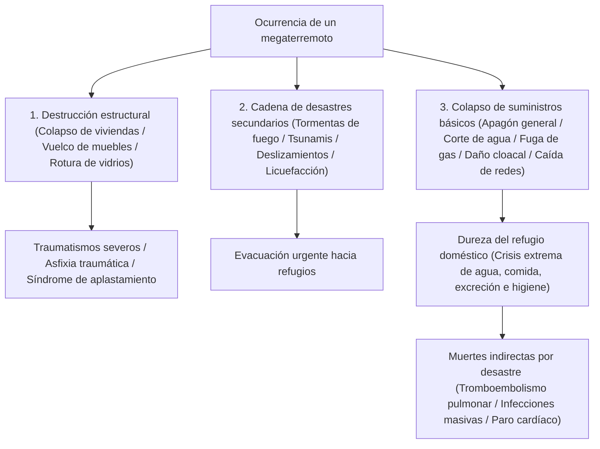
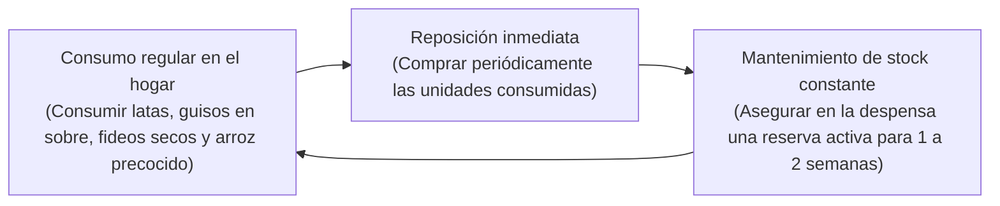
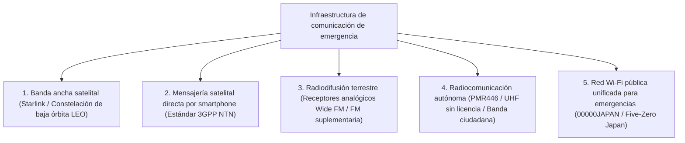

## Introducción: Establecimiento de la "Ingeniería de Supervivencia" en un archipiélago de desastres compuestos

El archipiélago japonés, ubicado a lo largo del Cinturón de Fuego del Pacífico, ocupa apenas el 0,25 % de la superficie terrestre emergida del planeta. Sin embargo, en este estrecho territorio se concentra aproximadamente el 20 % de los terremotos mundiales de magnitud 6 o superior y cerca del 7 % de los volcanes activos, constituyendo una de las zonas con mayor densidad de amenazas naturales del mundo.

Además, en el siglo XXI, el aumento térmico de la superficie oceánica y la mayor saturación de vapor de agua atmosférico impulsados por el cambio climático global han dinamitado los modelos predictivos lineales tradicionales. Precipitaciones torrenciales extremas provocadas por "bandas de lluvia lineales" estacionarias, inundaciones compuestas donde confluyen desbordamientos fluviales externos y colapsos de drenaje pluvial urbano, y megadesastres inminentes de escala histórica —como el megaterremoto de la Fosa de Nankai (magnitud 8 a 9), el terremoto directo bajo el área metropolitana de Tokio y una erupción explosiva del monte Fuji— elevan a niveles críticos la amenaza de una parálisis sistémica del Estado.

Bajo condiciones tan extremas, la "Asistencia Pública" gubernamental y municipal enfrenta límites físicos insoslayables. Inmediatamente después de un gran terremoto, el corte de arterias viales, la propagación incontrolada de incendios, la caída de las redes troncales de telecomunicaciones y el colapso estructural de las propias sedes administrativas generan un vacío insalvable: **"un período mínimo de 72 horas (3 días), que supera una semana en catástrofes regionales masivas"**, antes de que los equipos de rescate y los suministros de socorro puedan alcanzar a los hogares aislados.

La disciplina empírica para sobrevivir de forma autónoma a este vacío crítico y salvaguardar la vida de la familia y la comunidad es la **"Ingeniería de Mitigación de Desastres (Disaster Mitigation Engineering)"**, y su instrumento físico operativo es el **"Equipo de Supervivencia y Protección Civil (Emergency Survival Gear)"**. Los suministros de emergencia no consisten en un acaparamiento impulsivo de productos cotidianos; constituyen un sistema portátil y autónomo de soporte vital, diseñado para mantener la homeostasis bioquímica del organismo humano y la salud pública en un entorno extremo donde los servicios urbanos esenciales —electricidad, agua potable, gas, alcantarillado y telecomunicaciones— han colapsado por completo.

El presente tratado aborda la progresión temporal del desastre y la evaluación cuantitativa de riesgos, la metodología modular de equipamiento en tres fases (Fases 0, 1 y 2), los enfoques bioquímicos y sanitarios aplicados al agua, la alimentación y la excreción, los sistemas de autosuficiencia energética fuera de la red y los protocolos médicos para erradicar las muertes indirectas por desastre en los centros de evacuación.

```
【Evolución de fases del desastre y despliegue funcional de equipamiento】

┌─────────────────┬───────────────────────────────┬───────────────────────────────┐
│ Fase            │ Escala temporal y situación   │ Función y equipamiento exigido│
├─────────────────┼───────────────────────────────┼───────────────────────────────┤
│ Fase 0          │ Cotidianidad, transporte, vía │ EDC de Fase 0: Silbato, lin-  │
│ (Impacto inicial│ pública (Ubicación aleatoria) │ terna compacta, inodoro portá-│
│ del desastre)   │                               │ til químico, botiquín básico  │
├─────────────────┼───────────────────────────────┼───────────────────────────────┤
│ Fase 1          │ Impacto inmediato a 24 horas  │ Mochila de escape (Go-Bag):   │
│ (Evacuación de  │ Escape veloz ante derrumbes,  │ Casco/protección craneal, bar-│
│ emergencia)     │ incendios urbanos o tsunamis  │ bijo N95, calzado rígido, cantimplora │
├─────────────────┼───────────────────────────────┼───────────────────────────────┤
│ Fase 2          │ 24 horas a 72 horas           │ Espera de rescate / Refugio en│
│ (Soporte vital) │ Corte absoluto de suministros,│ el hogar: Primeros auxilios,  │
│                 │ aislamiento de vecindarios    │ manta térmica, purificador    │
├─────────────────┼───────────────────────────────┼───────────────────────────────┤
│ Fase 3          │ 72 horas a más de 1 semana    │ Acopio Fase 2 (Logística casa)│
│ (Subsistencia y │ Evacuación prolongada, mante- │ Alimentos y agua, energía in- │
│ saneamiento)    │ nimiento de la higiene pública│ dependiente, higiene profunda │
└─────────────────┴───────────────────────────────┴───────────────────────────────┘
```

---

## 1. Mecanismos de desastres compuestos e ingeniería de líneas temporales

Para estructurar un sistema de defensa eficaz frente a catástrofes, es imprescindible comprender con exactitud la física de los fenómenos naturales destructivos y la secuencia en cascada del colapso de las infraestructuras modernas.

### 1.1 Física del movimiento sísmico: Terremotos de subducción interplaca vs. fallas activas corticales
Los sismos destructivos se clasifican fundamentalmente en dos categorías según su mecánica de fractura:

1. **Terremotos de subducción en fosas oceánicas (límite de placas) (p. ej., Fosa de Nankai, Gran Terremoto del Este de Japón de 2011)**:
   Se originan en la zona donde una placa tectónica oceánica subduce bajo una placa continental. Como la zona de ruptura abarca cientos de kilómetros, las sacudidas intensas se prolongan durante varios minutos, provocando daños catastróficos a escala macrorregional. Además, el desplazamiento vertical del lecho marino genera tsunamis gigantescos que impactan en las costas en cuestión de minutos. Inducen también "movimientos sísmicos de período largo" que entran en resonancia destructiva con los rascacielos.
2. **Terremotos corticales intraplaca (directos bajo tierra firme) (p. ej., Gran Terremoto de Kobe de 1995, Terremoto de Kumamoto de 2016)**:
   Generados por la fractura súbita de fallas activas superficiales continentales. Dado que el hipocentro es muy poco profundo, el intervalo temporal entre las microvibraciones iniciales (ondas P) y las ondas transversales destructivas (ondas S)—el tiempo S-P—es prácticamente nulo. Aceleraciones verticales violentas y ondas de pulso de alta frecuencia golpean las estructuras superiores sin advertencia previa, pulverizando viviendas de madera, proyectando muebles pesados y quebrando puentes y carreteras al instante.



### 1.2 Erupciones volcánicas y la dinámica de parálisis urbana por ceniza masiva
Japón alberga 111 volcanes activos. Una erupción pliniana mayor del monte Fuji, Asama, Aso o Sakurajima genera una amenaza que excede con creces las coladas de lava y flujos piroclásticos locales: desata la **"Caída masiva de ceniza volcánica a escala regional"**, un colapso sigiloso de la infraestructura vital.

La ceniza volcánica no es ceniza blanda vegetal de combustión; está compuesta por **"microfragmentos angulares y abrasivos de vidrio volcánico y cristales de silicatos (sílice SiO₂)"**:
- **Colapso de la red eléctrica**: Un depósito de apenas unos milímetros se vuelve eléctricamente conductor al humedecerse con lluvia, provocando arcos eléctricos y cortocircuitos masivos en los aisladores cerámicos de las líneas de alta tensión, colapsando la red nacional.
- **Parálisis del transporte terrestre y aéreo**: Capas milimétricas provocan pérdidas drásticas de adherencia y despistes vehiculares, al tiempo que las partículas finas bloquean los filtros de aire de los motores térmicos, deteniéndolos. Los ferrocarriles quedan inoperativos por el aislamiento eléctrico entre ruedas de acero y rieles. Los aeropuertos cierran por completo debido a que la sílice inhalada por las turbinas de reacción se funde en vidrio a temperaturas operativas, apagando los motores en vuelo.
- **Obstrucción irreversible del alcantarillado**: Si la población vierte ceniza volcánica por los desagües, esta decanta, se compacta y fragua hidráulicamente como hormigón, destruyendo permanentemente la red subterránea.
- **Trauma ocular y respiratorio**: Las partículas menores a 2,5 micras penetran profundamente en los alvéolos pulmonares, desatando crisis asmáticas y dificultad respiratoria aguda, además de provocar desprendimientos del epitelio corneal.

Por consiguiente, el equipo de protección ante erupciones volcánicas debe incluir respiradores de partículas (clasificación N95/FFP2 o superior), gafas de seguridad herméticas de ajuste perimetral, trajes impermeables y cinta adhesiva de enmascarar para sellar herméticamente puertas y ventanas.

---

## 2. Ingeniería de diseño de suministros por fases operativas (Fase 0, 1 y 2)

La distribución y diseño del equipamiento de emergencia debe modularse estrictamente en tres niveles, calibrados según el radio de movilidad del individuo y la escala cronológica tras el impacto.

```
【Arquitectura modular en tres niveles para la supervivencia】

［Nivel 0: EDC (Everyday Carry / Transporte diario)］
・Entorno: Portado continuo durante desplazamientos cotidianos, trabajo o viajes (Peso límite: 300 a 500 g).
・Objetivo: Superar las primeras horas críticas desde el instante del impacto hasta llegar al domicilio o a un punto seguro.

［Nivel 1: Mochila de escape (Emergency Go-Bag)］
・Entorno: Ubicada permanentemente en el vestíbulo de entrada o junto a la cabecera de la cama (10 a 15 kg para hombres, 8 a 10 kg para mujeres).
・Objetivo: Permitir la evacuación veloz ante el peligro inminente de derrumbe, incendio o tsunami; preservar las constantes vitales durante las primeras 24 a 48 horas.

［Nivel 2: Acopio logístico en el hogar (Home Stockpile)］
・Entorno: Distribuido en despensas, armarios y bodegas del hogar (Capacidad calculada para 7 a 14 días).
・Objetivo: Mantener la vida y la higiene en el domicilio durante el corte total de servicios públicos municipales.
```

### 2.1 Equipamiento de Fase 0 (EDC): La bolsa de supervivencia en la vida diaria
El ciudadano contemporáneo pasa la mayor parte del día fuera de su hogar (edificios de oficinas, redes de metro, centros comerciales). Enfrentar un megaterremoto durante la jornada laboral implica quedar atrapado en ascensores, varado en túneles subterráneos o forzado a caminatas de varias horas sorteando escombros.

```
【Carga útil imprescindible para el pouch EDC de Fase 0 (~400 g)】

1. Linterna LED compacta de alto rendimiento (Batería AA/AAA o recarga USB-C, >=100 lúmenes)
2. Silbato de rescate de alta frecuencia (Diseño sin bola, dos cámaras, >=100 dB, operativo con agua)
3. Manta isotérmica aluminizada de Mylar (Retención térmica por radiación, cortavientos, impermeable, señalización)
4. Bolsas sanitarias de emergencia para excreción (Polímero coagulante + bolsas multicapa antiolor: mín. 2 usos)
5. Batería externa de alta capacidad (5.000 a 10.000 mAh) + Cable de carga múltiple reforzado
6. Botiquín personal básico (Apósitos adhesivos, toallitas desinfectantes, analgésicos, medicación crónica para 3 días, barbijos N95 individuales)
7. Dinero en efectivo fraccionado (Billetes de baja denominación y monedas: para teléfonos públicos; los pagos electrónicos colapsan)
8. Ficha médica y de contacto de emergencia (Grupo sanguíneo, alergias a fármacos, antecedentes clínicos y teléfonos clave)
```

### 2.2 Mochila de evacuación de Fase 1 (Go-Bag): Ingeniería del peso en mochilas de escape
El error más común y potencialmente letal en las mochilas de escape es el exceso de carga: saturar la bolsa hasta superar la capacidad física de porte, impidiendo correr o trepar sobre escombros. La masa límite recomendada para desplazarse con agilidad sin agotamiento estructural es de **"aproximadamente el 20 % de la masa corporal en hombres adultos (12 a 15 kg) y el 15 % en mujeres adultas (7 a 10 kg)"**.

```
【Distribución ergonómica y centro de gravedad en la mochila Go-Bag】

・Zona superior y pegada a la espalda: Objetos de mayor masa (agua potable, raciones densas, baterías)
  -> Eleva el centro de gravedad pegándolo a la columna dorsal, reduciendo drásticamente el momento torsor lumbar.
・Zona media e intermedia exterior: Masa intermedia (mudas de ropa, impermeable, botiquín de trauma).
・Zona inferior de la base: Artículos voluminosos y ligeros (saco de dormir ultraligero, prendas térmicas, toalla de microfibra).
・Bolsillos laterales y tapa superior: Equipamiento de extracción instantánea (linterna, silbato, casco plegable, guantes anticorte).
```

El calzado de evacuación es una variable determinante para sobrevivir. Huir en sandalias o zapatillas deportivas ligeras es una imprudencia crítica: tras un sismo violento, las calles quedan sembradas de cristales rotos, varillas de acero expuestas y clavos oxidados salientes. Disponer de botas de montaña con suela semirrígida y plantilla intermedia antiperforación de acero o aramida, o calzado industrial de seguridad certificado, constituye un requisito ineludible.

---

## 3. Aprovisionamiento y purificación de agua potable

El cuerpo humano está compuesto en aproximadamente un 60 % de agua en peso. Si bien el organismo puede tolerar la inanición durante varias semanas, la privación total de agua desencadena deshidratación celular aguda, shock hipovolémico y fallo multiorgánico terminal en solo 3 a 5 días.

### 3.1 Cálculo científico del volumen hídrico basal
De acuerdo con los estándares de salud pública en situaciones de desastre, el volumen diario indispensable para la supervivencia fisiológica se define como:

$$\text{Agua requerida para soporte vital} = 3,0 \text{ litros / persona / día}$$

Por consiguiente, para una familia de 4 personas que deba refugiarse en su domicilio durante 1 semana:

$$3 \text{ L} \times 4 \text{ personas} \times 7 \text{ días} = 84 \text{ litros}$$

Esto exige almacenar cuarenta y dos botellas de 2 litros exclusivamente para el consumo metabólico directo. Si se añade el agua indispensable para la preparación de alimentos, lavado elemental de manos, higiene de heridas y aseo bucal, el volumen requerido se incrementa sustancialmente.

### 3.2 Purificación con membranas de fibra hueca (Hollow Fiber Membrane)
Cuando se agotan las reservas envasadas, disponer de un purificador portátil con membrana de microfiltración (como Sawyer Squeeze/Mini o Katadyn BeFree) para transformar agua de lluvia, ríos, pozos o de la bañera en agua bacteriológicamente potable se convierte en la línea divisoria de la supervivencia.

```
【Mecanismo de separación por membrana de fibra hueca】

Agua cruda contaminada (Sedimentos en suspensión, bacterias patógenas, quistes de protozoos)
  ↓
［Membrana porosa de fibra hueca: Tamaño de poro nominal de 0,1 micras (100 nanómetros)］
  │
  ├─ 【Agentes patógenos retenidos y eliminados físicamente】
  │   ・Protozoos patógenos (Cryptosporidium: ~4 a 6 μm, Giardia: ~8 a 14 μm)
  │   ・Bacterias entéricas (Escherichia coli: ~0,5 × 2 μm, Vibrio cholerae, Salmonella)
  │   ・Microplásticos, lodos coloidales, turbidez suspendida
  │
  └─ 【Moléculas e iones que atraviesan la membrana】
      ・Moléculas de agua pura (H₂O: diámetro molecular ~0,3 nanómetros)
      ・Minerales y electrolitos disueltos beneficiosos (Na⁺, Ca²⁺, Mg²⁺)
  ↓
Agua estéril y biológicamente segura para beber
```

No obstante, las membranas de fibra hueca poseen límites operativos concretos: los solutos químicos disueltos (metales pesados, pesticidas agrícolas, radionúclidos) y los virus a escala nanométrica (de 0,02 a 0,08 micras, como norovirus, rotavirus o el virus de la hepatitis A) pueden franquear una barrera de 0,1 micras. Por ello, ante aguas presuntamente contaminadas por efluentes fecales, es un principio rector de salud pública complementar la ultrafiltración con una ebullición vigorosa durante al menos 1 minuto o una desinfección química con hipoclorito de sodio apto para consumo humano.

---

## 4. Bioquímica de las raciones de emergencia y tecnologías de conservación

La nutrición durante un desastre no se limita a suministrar calorías basales; desempeña un papel neurobioquímico primordial para sostener la competencia inmunológica y modular la estabilidad mental ante situaciones de estrés extremo.

### 4.1 Arroz alfa: Cristalografía del almidón entre gelatinización y retrogradación
Pilar de las raciones modernas de protección civil, el "arroz alfa" (arroz pregelatinizado deshidratado) es fruto de la ingeniería de transformación de fases cristalinas del almidón.

```
【Evolución estructural del almidón en el arroz alfa】

Almidón natural del grano crudo (Almidón beta / β-starch)
・Estructura cristalina micelar altamente densa. Las moléculas de agua no penetran; la alfa-amilasa digestiva humana es incapaz de hidrolizar los enlaces glucosídicos.
  ↓ Cocción hidrotérmica (Gelatinización / Reacción alfa)
Almidón gelatinizado (Almidón alfa / α-starch)
・La energía térmica rompe los puentes de hidrógeno, desmoronando la red cristalina en un hidrogel amorfo, hidratado y sumamente digestible.
  ↓ (En condiciones normales, al enfriarse y perder agua cristaliza de nuevo en el indigerible "almidón retrogradado [β'-starch]")
［Deshidratación ultraveloz con aire caliente industrial］
・El arroz recién cocido en estado alfa se expone a corrientes de aire caliente seco (80 a 100 °C o más), reduciendo instantáneamente la humedad por debajo del 8 al 10 %.
・Se detiene la reorganización cristalina, fijando y congelando la estructura porosa del estado alfa.
  ↓
Rehidratación capilar
・Al verter agua hirviendo (15 min) o agua a temperatura ambiente (60 min), el agua penetra instantáneamente por capilaridad en los microporos, recuperando el grano tierno original. Vida útil: de 5 a 7 años a temperatura ambiente.
```

### 4.2 Física de la liofilización (Freeze-Drying / Criodesecación al vacío)
Utilizada para preservar sopas, guisos, proteínas y vegetales con alto valor nutricional, la liofilización aprovecha el **"Punto Triple del Agua"** (0,01 °C a 611,65 Pa) para deshidratar mediante sublimación bajo alto vacío.

Los alimentos se congelan rápidamente entre −30 °C y −50 °C, se introducen en una cámara hermética de vacío y se reduce la presión por debajo del punto triple. Al aplicar una suave energía térmica de sublimación, los cristales de hielo intracelulares se transforman directamente en vapor sin pasar por la fase líquida intermedia.

```
【Ventajas fundamentales de la liofilización】

1. Preservación intacta de la microestructura celular:
   Al prescindir de altas temperaturas, no hay desnaturalización térmica de proteínas ni rotura celular, preservándose vitaminas termosensibles (como la vitamina C y el complejo B).
2. Reducción masiva de peso:
   Se elimina entre el 95 % y el 98 % del agua contenida, reduciendo la masa a una fracción mínima del producto fresco y aligerando la carga física.
3. Rehidratación casi instantánea:
   El espacio liberado por el hielo deja una red porosa microscópica interconectada (estructura de esponja). Al añadir agua, la tensión superficial capilar la absorbe en segundos, devolviendo textura, aroma y volumen originales.
```

### 4.3 Dinámica operativa del método Rolling Stock (Acopio rotativo continuo)
Comprar cajas de raciones de emergencia extrañas para olvidarlas cinco años en un armario hasta su vencimiento es un paradigma obsoleto y propenso al fracaso.
En su lugar, el estándar logístico actual es el **"Método Rolling Stock (Gestión de inventario rotativo dinámico)"**.



El enorme beneficio psicofisiológico de este método radica en **"disponer de alimentos familiares y reconfortantes (Comfort Foods) en medio de la catástrofe"**. Bajo el impacto emocional de un desastre, verse forzado a ingerir únicamente raciones comprimidas desconocidas y secas precipita pérdida de apetito, trastornos gastrointestinales y cuadros depresivos agudos. Consumir alimentos cotidianos de larga duración dentro de un ciclo dinámico constituye el enfoque más robusto y sostenible.

---

## 5. Ingeniería sanitaria y supervivencia en centros de evacuación (Infecciones, excretas y termorregulación)

El análisis epidemiológico de la mortalidad en grandes catástrofes revela una realidad escalofriante: en los terremotos de Kobe (1995), Kumamoto (2016) y Noto (2024), el número de **"Muertes Indirectas por Desastre (Disaster-Related Deaths)"** —personas que sobrevivieron al impacto directo del sismo o tsunami pero fallecieron en los días o semanas posteriores debido al deterioro ambiental de los refugios— superó en múltiples zonas el número de víctimas mortales directas.

El desencadenante principal de las muertes indirectas no es el hambre, sino el **"colapso absoluto de la higiene pública"** y la **"parálisis de los sistemas de evacuación de excretas"**.

### 5.1 Inodoros químicos de emergencia y polímeros superabsorbentes (SAP)
Tras un sismo, está terminantemente prohibido evacuar los inodoros domésticos vertiendo cubos de agua mientras el suministro esté interrumpido. Si las tuberías subterráneas o las bajantes estructurales han sufrido fisuras, los efluentes vertidos en plantas altas refluyen violentamente por los inodoros y sumideros de las plantas bajas, transformando las viviendas en focos infecciosos biológicamente letales.

La alternativa segura consiste en acoplar bolsas plásticas de contención sobre el propio inodoro y usar agentes gelificantes. El compuesto tecnológico clave es el **"Polímero Superabsorbente (SAP: poliacrilato de sodio reticulado)"**.

```
【Bioquímica de inmovilización de excretas mediante SAP】

┌─────────────────────────────────────────────────────────────┐
│ Disociación de grupos hidrófilos (-COONa):                  │
│ Al contacto con la orina, los iones sodio (Na⁺) se disocian,│
│ dejando cargas aniónicas fijas (-COO⁻) a lo largo de la     │
│ cadena polimérica.                                          │
│   ↓                                                         │
│ Expansión violenta de la red por repulsión electrostática:  │
│ La repulsión entre cargas negativas adyacentes obliga al    │
│ ovillo tridimensional entrecruzado a desenrollarse y        │
│ expandirse masivamente en cuestión de segundos.             │
│   ↓                                                         │
│ Infiltración osmótica y fijación irreversible en hidrogel:  │
│ La elevada concentración iónica interna genera una enorme   │
│ presión osmótica que absorbe de cientos a mil veces su peso │
│ seco en agua, aprisionándola en un hidrogel rígido que no   │
│ libera líquido ni siquiera bajo una intensa presión mecánica.│
└─────────────────────────────────────────────────────────────┘
```

Los polímeros de grado médico incorporan nanopartículas de plata ($Ag^+$), compuestos clorados y taninos polifenólicos vegetales que exterminan bacterias entéricas y suprimen químicamente la volatilización de gases pestilentes y peligrosos como el amoníaco ($NH_3$) y el sulfuro de hidrógeno ($H_2S$).

#### Patofisiología de la retención voluntaria y el "Síndrome de la Clase Turista"
Cuando los baños de los centros de evacuación se convierten en recintos insalubres, malolientes y a oscuras, los evacuados (principalmente ancianos y mujeres) recurren a un mecanismo compensatorio fatal: **restringir de manera drástica el consumo de agua para evitar orinar**.

Esta deshidratación voluntaria provoca una rápida hemoconcentración (hiperviscosidad sanguínea). Sumada a la inmovilidad forzada al dormir en el suelo o dentro de vehículos pequeños, la compresión de las venas femorales y poplíteas desencadena trombosis venosa profunda (TVP) en las extremidades inferiores. Al ponerse de pie bruscamente, los trombos se desprenden y migran hacia el árbol arterial pulmonar, provocando un tromboembolismo pulmonar fulminante ("Síndrome de la Clase Turista") y la muerte súbita. Garantizar inodoros higiénicos, dignos y accesibles es una intervención médica vital de primer orden.

### 5.2 Ingeniería de barrera radiante: Mantas isotérmicas de PET aluminizado
La hipotermia accidental (descenso de la temperatura central corporal por debajo de 35 °C) no es un riesgo exclusivo del invierno polar; puede desencadenarse en pleno verano si el individuo permanece expuesto al viento con ropas empapadas por sudor o lluvia fría.

La manta isotérmica de supervivencia está fabricada con una película de tereftalato de polietileno orientado biaxialmente (BoPET / Mylar) de solo 12 micras de espesor, sobre la cual se deposita vapor metálico de aluminio de alta pureza en una cámara de ultraalto vacío.
Gracias a las propiedades reflectoras especulares de los electrones libres del aluminio, **"refleja más del 90 % de la radiación infrarroja lejana (calor radiante) emitida por el cuerpo humano"** devolviéndola al núcleo vital. Paralelamente, sella la convección del aire gélido y la pérdida de calor latente por evaporación, proporcionando un aislamiento equivalente al de pesadas mantas de lana con un peso irrisorio de apenas 50 gramos.

---

## 6. Autosuficiencia energética y telecomunicaciones resilientes

El colapso de la energía eléctrica y el corte de las comunicaciones digitales sumergen a las poblaciones damnificadas en la incertidumbre, el aislamiento sensorial y el pánico generado por bulos. Dotarse de fuentes de energía aisladas y canales de información redundantes constituye una prioridad defensiva primaria.

### 6.1 Baterías de fosfato de hierro y litio (LiFePO₄): Seguridad y electroquímica
Al elegir una estación de energía portátil doméstica, la química del cátodo de la batería es el parámetro de seguridad determinante. Existe una diferencia abismal entre las celdas ternarias convencionales (NMC: Níquel-Manganeso-Cobalto) y las avanzadas de **"Fosfato de Hierro y Litio (LFP / $\text{LiFePO}_4$)"**.

```
【Comparativa fisicoquímica: Baterías ternarias (NMC) vs. LiFePO₄】

┌──────────────────────┬───────────────────────────────┬───────────────────────────────┐
│ Criterio evaluado    │ Química Ternaria (NMC/NCA)    │ Fosfato de Hierro y Litio(LFP)│
├──────────────────────┼───────────────────────────────┼───────────────────────────────┤
│ Estructura cristalina│ Estructura laminar tipo salina│ Estructura olivino (fuertes   │
│                      │ (fácilmente degradable)       │ enlaces covalentes P-O)       │
│ Temp. de embalamiento│ ~200 a 210 °C (inestabilidad  │ ~400 a 500 °C (estabilidad    │
│ térmico              │ térmica crítica)              │ térmica excepcional)          │
│ Liberación de O₂ y   │ Libera oxígeno molecular por  │ Los enlaces no liberan O₂ libre│
│ riesgo de combustión │ sobrecarga o punción; alto    │ No genera combustión explosiva│
│                      │ riesgo de deflagración interna│ incluso ante cortocircuitos   │
├──────────────────────┼───────────────────────────────┼───────────────────────────────┤
│ Ciclos de vida útil  │ ~500 a 800 ciclos             │ ~3.000 a 4.000 ciclos (más de │
│                      │ (degradación rápida)          │ 10 años de operatividad)      │
│ Densidad energética  │ Alta (peso y volumen reducidos│ Media (ligeramente más pesada │
│                      │ para la misma capacidad)      │ y voluminosa)                 │
└──────────────────────┴───────────────────────────────┴───────────────────────────────┘
```

En aplicaciones de protección civil, donde los generadores pueden almacenarse durante años en espacios cerrados o vehículos sometidos a calor extremo, **la seguridad frente al embalamiento térmico y la durabilidad decenal posicionan a las estaciones de $\text{LiFePO}_4$ como el estándar indiscutible de la industria**.

### 6.2 Optimización con paneles solares portátiles y controladores MPPT
Ante apagones que pueden prolongarse durante semanas, la recarga mediante enchufes convencionales queda anulada, siendo indispensable la captación fotovoltaica.
Integrar paneles solares plegables de silicio monocristalino (rendimiento de conversión del 22 al 24 % o superior) con un controlador de carga de tecnología **MPPT (Seguimiento del Punto de Máxima Potencia / Maximum Power Point Tracking)** garantiza rastrear continuamente la curva de tensión-corriente óptima, exprimiendo la máxima energía posible incluso bajo cielos encapotados o ángulos de radiación rasante al amanecer y al atardecer.

---

## 2.3 Atención táctica a traumatismos (Trauma Care) e ingeniería del torniquete CAT

En el marco de colapsos estructurales por terremotos, proyecciones de cristales rotos y arrastre de escombros por tsunamis, la causa de muerte prevenible más fulminante es la **"hemorragia arterial exanguinante masiva"**. La sección de una arteria femoral o braquial puede drenar un tercio del volumen sanguíneo corporal (aprox. 8 % del peso) en pocos minutos. Esperar una ambulancia en una catástrofe con saturación masiva de heridos conduce inevitablemente al shock hipovolémico letal.

Siguiendo los protocolos de Soporte Vital Táctico en Emergencias (TCCC), el estándar de oro incuestionable para cohibir hemorragias críticas en extremidades cuando la compresión directa resulta ineficaz es el **"Torniquete de Aplicación en Combate (CAT: Combat Application Tourniquet)"**.

```
【Anatomía del torniquete CAT y protocolo de hemostasia por oclusión】

┌─────────────────────────────────────────────────────────────┐
│ Cinta de fricción y banda de alta tenacidad:                │
│ Posicionar de 5 a 7 cm proximal a la herida (hacia el corazón).│
│ (Nunca sobre una articulación; si no se visualiza el punto  │
│ exacto de sangrado en el caos, colocar en la raíz del miembro).│
│   ↓                                                         │
│ Torsión del molinete rígido (Windlass Rod):                 │
│ Girar la barra de polímero tensando la banda circunferencial│
│ interna para aplicar una presión uniforme contra el hueso.   │
│ Apretar con fuerza hasta que cese por completo el sangrado  │
│ pulsátil y desaparezca el pulso distal.                     │
│   ↓                                                         │
│ Aseguramiento en clip y registro cronológico:               │
│ Encajar la barra en el clip de retención. Escribir con      │
│ rotulador permanente la hora exacta de aplicación en la tira│
│ de seguridad (límite isquémico tolerable: máximo 2 horas).  │
└─────────────────────────────────────────────────────────────┘
```

En heridas profundas localizadas en zonas de transición (ingle, axila, base del cuello) donde el torniquete no puede aplicarse anatómicamente, las **"Gasas Hemostáticas impregnadas con caolín o quitosano (p. ej., QuikClot)"** son vitales. El caolín activa intensamente el Factor XII de la cascada de coagulación; empacando firmemente la gasa en el lecho hemorrágico y comprimiendo durante varios minutos, se consolida un tapón de fibrina robusto.

Asimismo, frente a heridas penetrantes en el tórax ocasionadas por varillas metálicas o cristales rotos ("neumotórax abierto"), es indispensable contar con **"Parches Torácicos Valvulados (Chest Seals)"**, dotados de una válvula unidireccional que permite la salida de aire y sangre acumulados e impide la entrada de aire atmosférico, previniendo la asfixia por neumotórax a tensión.

---

## 5.3 Estándares humanitarios internacionales: Proyecto Esfera e ingeniería sanitaria del "TKB48"

El marco de referencia global para la dignidad y supervivencia en desastres es el **"Manual Esfera (The Sphere Project)"**, redactado por ONG de todo el mundo y la Cruz Roja Internacional. Los esquemas tradicionales de albergue (cientos de evacuados durmiendo en el suelo frío de un gimnasio, comidas frías y letrinas químicas insalubres) vulneran los derechos humanitarios básicos y amenazan la vida.

En la medicina de catástrofes de vanguardia se impulsa de forma prioritaria el programa **"TKB48 (Implementación de Inodoros, Cocinas y Camas en las primeras 48 horas / Toilets, Kitchen, Bed)"**.

```
【Tríada esencial de salud pública en refugios: Estándares TKB】

1. Ｔ (Inodoro / Toilet):
   ・Criterio Esfera: Mínimo 1 inodoro por cada 20 evacuados; proporción segregada de 1:3 para hombres y mujeres (dada la mayor duración miccional femenina).
   ・Diseño sanitario: Iluminación ininterrumpida, estaciones de lavado (agua corriente y jabón), tabiques de privacidad y cerraduras seguras.
   ・Meta: Cero olores, cero oscuridad, cero barreras físicas para eliminar la contención voluntaria de orina.

2. Ｋ (Cocina y alimento caliente / Kitchen):
   ・Distribución de comida caliente: Despliegue de cocinas móviles y quemadores modulares de GLP en un plazo de 48 a 72 horas para servir guisos y sopas reconstituyentes y nutritivas.
   ・Efecto fisiológico: Combate la hipotermia, reactiva la motilidad gastrointestinal y aplaca las descargas agudas de cortisol y catecolaminas.

3. Ｂ (Camas elevadas / Bed):
   ・Adopción generalizada de camas de cartón corrugado: Elevación de 30 a 40 cm del suelo.
   ・Impacto médico directo:
     ① Aísla el organismo de la pérdida de calor por conducción desde el suelo gélido, previniendo hipotermia e infecciones bronquiales.
     ② Eleva la zona de respiración por encima de los 30 cm del nivel del suelo, donde se concentran partículas de polvo tóxico y aerosoles de norovirus.
     ③ Facilita la bipedestación de ancianos con movilidad reducida, evitando el síndrome de desuso y la trombosis venosa.
```

### Higiene bucodental y prevención de la neumonía por aspiración
Una causa predominante de muerte en ancianos refugiados es la **"Neumonía por Aspiración"**.
Al interrumpirse el agua corriente, se suspende el cepillado dental. En 48 horas proliferan miles de millones de bacterias anaerobias en la cavidad oral. Durante el sueño, la microaspiración involuntaria de saliva arrastra estas colonias hacia el árbol traqueobronquial, desatando neumonías bacterianas fulminantes.
Incluir colutorios líquidos sin necesidad de enjuague y toallitas de limpieza oral en el kit de supervivencia representa una intervención profiláctica tan decisiva como la administración precoz de antibióticos.

---

## 6.3 Ingeniería de redes de comunicación redundantes: Satélites, radio analógica y 00000JAPAN

Ante una catástrofe, las torres de telefonía celular colapsan al agotarse sus baterías de respaldo, por rotura de enlaces troncales de fibra óptica o debido a saturación masiva (bloqueos del 90 % impuestos por las operadoras para preservar canales de auxilio). Salir del "apagón informativo" requiere una arquitectura de capas redundantes.



### 1. Ingeniería de recepción en radio Wide FM (FM suplementaria)
La radiodifusión en onda media AM (526,5 a 1606,5 kHz), aunque posee gran alcance, sufre una severa atenuación dentro de edificios de hormigón armado y es muy sensible a ruidos electromagnéticos urbanos (inversores, fuentes conmutadas).
El sistema "Wide FM" (90,0 a 95,0 MHz en banda VHF) retransmite simultáneamente la señal AM mediante ondas FM de alta fidelidad. Estas ondas atraviesan estructuras de hormigón y son inmunes a parásitos industriales, garantizando la recepción nítida de alertas sísmicas tempranas e instrucciones de evacuación. Una radio Wide FM con dinamo manual de recarga es el escudo defensivo básico de cada hogar.

### 2. Revolución de las comunicaciones satelitales: Starlink y SOS satelital directo
La constelación "Starlink" de SpaceX (miles de satélites en órbita terrestre baja a ~550 km) ha redefinido la asistencia en catástrofes. Con una antena orientada al cielo despejado, provee anchos de banda de cientos de megabits por segundo con latencia mínima en áreas aisladas con infraestructura terrestre destruida, como quedó demostrado en el terremoto de Noto de 2024.

A su vez, los smartphones de última generación incorporan módulos de comunicación no terrestre (NTN) bajo normas 3GPP Release 17/18. Incluso fuera de la cobertura de antenas terrestres, el terminal puede conectarse con satélites orbitales para enviar coordenadas geográficas precisas y mensajes de socorro a los servicios de rescate.

---

## 2.4 Incendios urbanos masivos, extinción inicial y evacuación en presencia de humo

Tras un terremoto severo, uno de los factores más destructivos es la aparición simultánea de múltiples focos de fuego (**"Tormentas de Fuego Urbanas"**). En zonas urbanas densas, las roturas de conducciones de gas, los incendios eléctricos originados al restablecerse el suministro y el vuelco de calentadores colapsan la capacidad de respuesta de los cuerpos de bomberos.

### Química de las campanas de escape contra humo (Smoke Blocks)
Aproximadamente el 60 % de las víctimas en incendios no fallece por quemaduras, sino por **"asfixia e inhalación de gases altamente tóxicos (monóxido de carbono y cianuro de hidrógeno)"**. La pirólisis de materiales plásticos y espumas de poliuretano desprende cianuro de hidrógeno ($HCN$) y fosgeno ($COCl_2$). Cubrirse la boca con una toalla húmeda no detiene el monóxido de carbono insoluble ni las nanopartículas tóxicas de hollín.

Las campanas de escape certificadas incorporan, dentro de su tejido aluminizado ignífugo, filtros combinados de carbón activo y **"Catalizador de Hopcalita (Hopcalite: óxidos de cobre y manganeso)"**. Este compuesto cataliza a temperatura ambiente la oxidación del letal monóxido de carbono ($CO$) a dióxido de carbono ($CO_2$), proporcionando entre 10 y 15 minutos de aire respirable para escapar a través de huecos de escalera anegados de humo denso.

### Criterios de selección para equipos de extinción inicial
- **Extintores de chorro cargado (líquido reforzado para uso residencial)**: A diferencia de los extintores de polvo químico seco (ABC), que generan nubes de polvo asfixiantes y pueden permitir la reignición de brasas, los de líquido cargado proyectan una niebla de solución salina alcalina. Esta penetra profundamente en las fibras de madera, evitando que el fuego reviva y manteniendo despejada la visibilidad en recintos cerrados.
- **Disyuntores sísmicos automáticos**: Diseñados para prevenir incendios al restablecerse el fluido eléctrico sobre electrodomésticos volcados, estos interruptores electromecánicos desenganchan automáticamente el suministro eléctrico principal de la vivienda al detectar oscilaciones sísmicas de intensidad destructiva.

---

## 1.3 Ingeniería de anclaje antisísmico en interiores: Física de sujeción de mobiliario y láminas de seguridad

Los informes forenses de los sismos de Kobe y Noto demuestran que más del 80 % de las muertes en interiores se debieron a **"asfixia traumática y aplastamiento ocasionados por el derrumbe de estructuras y la caída de muebles pesados y electrodomésticos"**. En sacudidas violentas de intensidad destructiva, armarios masivos, refrigeradores y estanterías se transforman en proyectiles cinéticos devastadores que sepultan a los habitantes y bloquean las vías de escape.

Fijar el mobiliario requiere un enfoque mecánico fundado en la resistencia estructural.

```
【Capacidad de soporte mecánico y protocolos de anclaje de mobiliario】

┌──────────────────────┬───────────────────────────────┬───────────────────────────────┐
│ Tipo de herraje      │ Principio de retención física │ Regla crítica de instalación  │
├──────────────────────┼───────────────────────────────┼───────────────────────────────┤
│ Escuadras metálicas  │ Atornilladas directamente al  │ Fijar tornillos solo en placas│
│ en "L" de alta carga │ montante de madera o acero de │ de yeso carece de resistencia.│
│ (Estándar de oro)    │ la pared. Neutralizan el vuel-│ Emplear detector para ubicar  │
│                      │ co por fuerzas de cizalla.    │ los montantes portantes.      │
├──────────────────────┼───────────────────────────────┼───────────────────────────────┤
│ Barras telescópicas  │ Generan tensión compresiva    │ Los techos de madera delgada  │
│ de presión vertical  │ vertical entre mueble y techo;│ ceden ante la carga. Interpo- │
│ ＋ Almohadillas de gel│ el gel viscoelástico absorbe  │ ner un tablero repartidor am- │
│ (Sistema híbrido)    │ el empuje horizontal de la base│ plio y combinar siempre con gel│
├──────────────────────┼───────────────────────────────┼───────────────────────────────┤
│ Correas textiles de  │ Sujetan electrodomésticos con │ Anclar firmemente las pletinas│
│ alta tenacidad y     │ alto centro de gravedad (fri- │ a elementos estructurales para│
│ cables de acero      │ goríficos) disipando energía  │ absorber la inercia con la de-│
│                      │ por deformación elástica.     │ formación de la correa.       │
└──────────────────────┴───────────────────────────────┴───────────────────────────────┘
```

### Resistencia a la tracción de láminas de seguridad para vidrios (PET multicapa)
Al deformarse los marcos de ventanas en paralelogramo por tensiones sísmicas, los vidrios comunes colapsan por cizallamiento, proyectando esquirlas como cuchillas a gran velocidad.
Instalar láminas multicapa de poliéster (PET) de 50 a 100 micras en la cara interior de los vidrios garantiza que, ante la rotura, el potente adhesivo acrílico mantenga los fragmentos adheridos entre sí, impidiendo su proyección lesiva contra los ocupantes.

---

## 2.5 Dinámica de fluidos en inundaciones repentinas y aluviones

Las inundaciones provocadas por tifones, lluvias torrenciales estacionarias y desbordamientos de cauces exigen equipamientos regidos por la mecánica de fluidos, muy distintos a los requeridos para sismos.

### 1. Calzado de evacuación: Por qué las botas altas de goma son una trampa mortal
Vadear corrientes de inundación urbana con botas impermeables de caña alta es uno de los errores más graves en rescate acuático.
Cuando el nivel supera la rodilla (unos 40 a 50 cm), el agua entra por la caña de las botas. Al llenarse, el líquido no puede salir, transformando cada bota en un ancla de varios kilogramos. El peso impide levantar las piernas, provocando caídas dentro de alcantarillas abiertas o zanjas ocultas bajo el agua y causando muertes por ahogamiento.
El calzado idóneo son **"zapatillas deportivas con cordones ajustados que permitan el drenaje de agua, combinadas con calcetines gruesos o de neopreno"**. Al atarse firmemente, resisten la succión de la corriente, no atrapan agua en su interior y permiten una movilidad ágil sobre obstáculos sumergidos.

### 2. Fuerza hidrostática y bloqueo de puertas de vehículos y viviendas
Cuando el agua inunda el exterior de una vivienda o un vehículo, la fuerza hidrostática que bloquea una puerta que abre hacia afuera se rige por la ecuación fundamental:

$$F = \rho g h A$$

Donde $\rho$ es la densidad del agua, $g$ la aceleración gravitatoria, $h$ la profundidad de la columna líquida y $A$ el área sumergida de la puerta.
Con una cota de agua de **apenas 40 a 50 cm**, la fuerza de empuje sobre la puerta asciende a cientos de kilogramos de peso, haciendo físicamente imposible para un adulto abrirla empujando desde el interior.
Por consiguiente, evacuar con anticipación al activarse alertas de nivel 3 o 4 (o buscar refugio vertical temprano) es perentorio. Asimismo, todo automóvil debe contar con un **Martillo de Emergencia para Rotura de Lunas dotado de punta de carburo de tungsteno**, para fracturar las ventanillas laterales si las puertas quedan selladas hidrostáticamente.

---

## 5.4 Ingeniería de protección civil para poblaciones vulnerables (Bebés, ancianos, enfermos crónicos y mascotas)

Los kits comerciales estándar se configuran pensando en un adulto sano promedio. En un desastre real, las personas que enfrentan la mayor morbimortalidad son los grupos vulnerables con necesidades fisiológicas estrictas.

```
【Protocolos especializados de suministros para grupos vulnerables】

┌──────────────────────┬───────────────────────────────┬───────────────────────────────┐
│ Grupo vulnerable     │ Riesgos específicos y fallos  │ Suministros especializados    │
├──────────────────────┼───────────────────────────────┼───────────────────────────────┤
│ Lactantes y madres   │ Imposibilidad de preparar fór-│ Fórmula infantil líquida lista│
│ gestantes            │ mula con agua hervida; deshi- │ para tomar (a temperatura am- │
│                      │ dratación aguda; llanto en el │ biente, con tetinas estériles),│
│                      │ refugio                       │ biberones desechables, fular  │
├──────────────────────┼───────────────────────────────┼───────────────────────────────┤
│ Ancianos y personas  │ Neumonía por aspiración; pér- │ Espesantes de líquidos, purés │
│ dependientes         │ dida de dentaduras postizas;  │ envasados blandos, pilas de au-│
│                      │ desnutrición; aseo complejo   │ dífonos, gafas de repuesto    │
├──────────────────────┼───────────────────────────────┼───────────────────────────────┤
│ Pacientes crónicos y │ Suspensión de hemodiálisis,   │ Recetas digitalizadas en la   │
│ con afecciones graves│ conservación de insulina o    │ nube, aspiradores de secrecio-│
│                      │ suministro de oxígeno médico  │ nes a batería, reserva médica │
├──────────────────────┼───────────────────────────────┼───────────────────────────────┤
│ Animales de compañía │ Rechazo de acceso en albergues│ Transportín rígido plegable,  │
│ (Perros, gatos)      │ estrés acústico, extravío,    │ ración y agua para 10 días,   │
│                      │ zoonosis                      │ registro de microchip, empapa-│
│                      │                               │ dores desechables             │
└──────────────────────┴───────────────────────────────┴───────────────────────────────┘
```

La aprobación y difusión de la fórmula láctea líquida estéril para bebés (que se conserva a temperatura ambiente sin requerir agua hervida ni biberones esterilizados) marcó un hito de protección civil en Japón desde 2019. En un refugio devastado, poder acoplar una tetina estéril directamente al envase y alimentar a un recién nacido salva incontables vidas infantiles.

---

### 7.1 Protocolo operativo periódico de Auditoría Doméstica de Desastres (Disaster Audit)

Incluso el kit de emergencia más avanzado se degrada en peso inútil si caducan sus insumos, se descargan sus baterías o no se ajusta a la composición familiar.
Se recomienda formalizar una **"Auditoría Doméstica de Desastres"** dos veces al año (coincidiendo con conmemoraciones de terremotos históricos o días de protección civil):

1. **Revisión de víveres y agua**: Controlar las fechas de caducidad y rotar los lotes próximos a vencer hacia el consumo diario mediante el método Rolling Stock.
2. **Ciclo de mantenimiento de baterías**: Someter estaciones de energía portátiles y acumuladores a ciclos de carga y descarga para verificar el estado de salud de las celdas y evitar la autodescarga profunda.
3. **Control de químicos y apósitos**: Comprobar que los coagulantes poliméricos de inodoro no se hayan apelmazado por humedad, que las toallitas con alcohol no se hayan secado y que los sellos elásticos mantengan su flexibilidad.
4. **Ensayo familiar de comunicaciones**: Entrenar el uso de buzones de voz de emergencia ante desastres y canales de mensajería sin conexión.
5. **Actualización de mapas de amenazas (Hazard Maps)**: Revisar las zonas de inundación y aludes delimitadas por los municipios y realizar a pie el itinerario hacia el centro de evacuación principal.

---

## 7. Conclusión: La trinidad de Autoayuda, Apoyo Mutuo y Asistencia Pública en la sociedad resiliente

Preparar un equipamiento riguroso de protección civil no es una muestra de acaparamiento material. Es la asunción consciente de la **"Responsabilidad Personal (Personal Responsibility)"** sobre la propia vida y la de la familia: un acto de lucidez fundado en el conocimiento científico y la reverencia hacia la naturaleza.

Ni el malecón de hormigón más imponente ni los edificios con los disipadores sísmicos más avanzados son invulnerables a la inmensa fuerza del planeta. Cuando las defensas infraestructurales son vulneradas, la última barrera entre la vida y la muerte es la calidad del equipo individual disponible y la solvencia práctica para emplearlo con serenidad bajo presión.

Al asegurar su propia supervivencia de forma autónoma (**Autoayuda / "Jijo"**), el ciudadano adquiere la capacidad física y mental indispensable para socorrer al vecino vulnerable y tejer redes de auxilio comunitario (**Apoyo Mutuo / "Kyojo"**). Y cuando los hogares resisten de manera autosuficiente los primeros días, los cuerpos de bomberos, policías, fuerzas armadas y cirujanos de trauma pueden concentrar sus recursos en los rescates críticos y las comunidades más aisladas (**Maximización de la Asistencia Pública / "Kojo"**).

Incorporar con serenidad y disciplina la previsión ante el desastre en la calma de la vida cotidiana representa la mayor expresión de sabiduría humana para preservar el legado de la vida en nuestro planeta.
