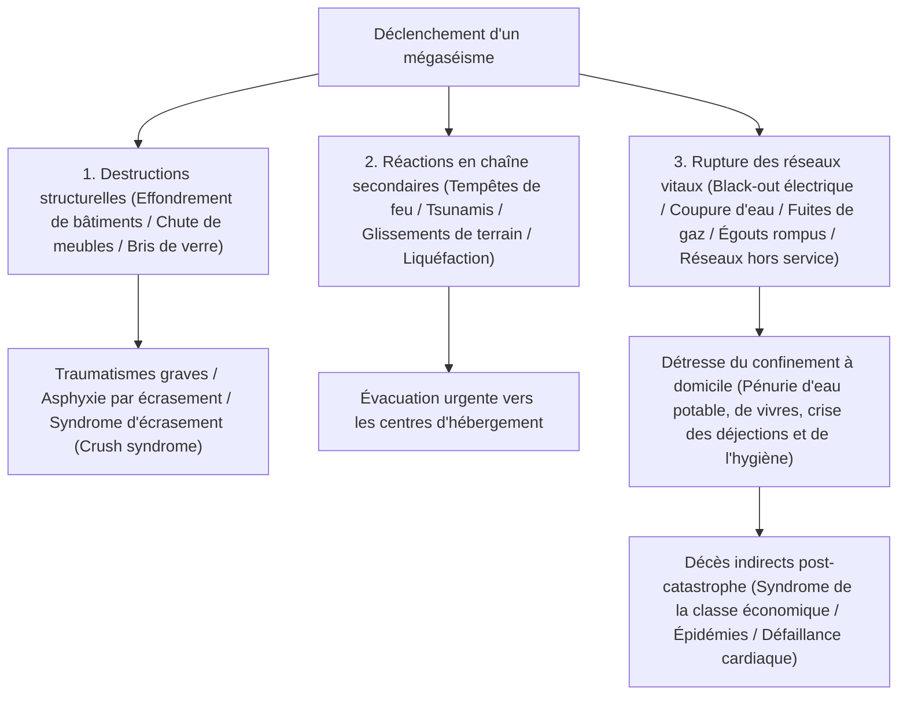
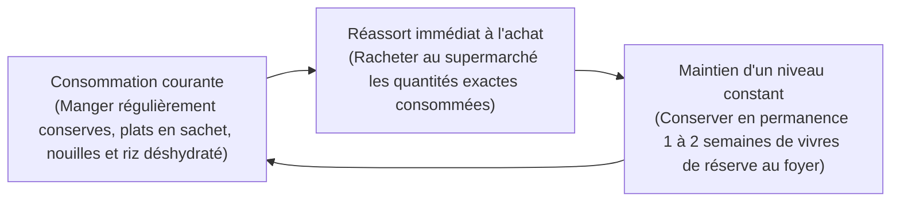
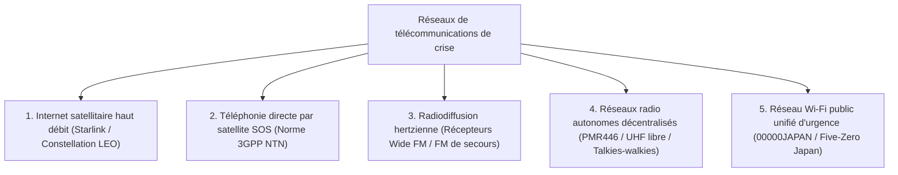

## Introduction : Établir « l'ingénierie de survie » dans un archipel de catastrophes composites

L'archipel japonais, situé sur la ceinture de feu du Pacifique, n'occupe que 0,25 % de la superficie terrestre émergée de la Terre. Pourtant, sur ce territoire exigu se concentrent environ 20 % des séismes mondiaux de magnitude égale ou supérieure à 6, ainsi que près de 7 % des volcans actifs du globe, ce qui en fait l'une des zones les plus densément exposées aux catastrophes naturelles sur la planète.

Au XXIe siècle, le réchauffement climatique mondial, qui intensifie la température de surface des océans et accroît la teneur en vapeur d'eau saturante de l'atmosphère, a anéanti les modèles prévisionnels météorologiques linéaires classiques. Les précipitations diluviennes torrentielles engendrées par des « bandes pluvieuses linéaires » stationnaires, les inondations complexes où se conjuguent ruptures de digues fluviales et saturation des réseaux d'évacuation urbains, ainsi que l'imminence certaine de mégacatastrophes nationales — à l'instar du mégaséisme de la Fosse de Nankai (magnitude 8 à 9), du séisme direct sous la métropole de Tokyo et d'une éruption plinienne explosive du mont Fuji — rendent tangible le spectre d'une paralysie générale de l'État.

Face à un tel chaos, les secours publics (« Kojo ») organisés par l'État et les municipalités atteignent d'emblée des limites physiques infranchissables. Immédiatement après un séisme de grande ampleur, la destruction des axes routiers majeurs, la propagation incontrôlable des incendies, l'anéantissement des réseaux de télécommunication et les dommages structurels infligés aux centres administratifs eux-mêmes créent une période de rupture totale : **« un vide d'au moins 72 heures (3 jours), s'étendant à plus d'une semaine lors de destructions régionales massives »**, avant que les unités de secours et les premiers approvisionnements ne puissent atteindre chaque foyer.

La discipline concrète permettant de survivre par ses propres moyens à ce vide critique et de préserver la vie de sa famille et de sa communauté locale est **« l'Ingénierie d'Atténuation des Catastrophes (Disaster Mitigation Engineering) »**, dont le vecteur matériel opérationnel est **« l'Équipement de Survie et de Protection Civile (Emergency Survival Gear) »**. Les fournitures de secours ne constituent en aucun cas une accumulation désordonnée de biens de consommation courante. Elles forment un système portatif et autonome de maintien des fonctions vitales, conçu pour préserver l'homéostasie biochimique de l'organisme et la santé publique dans un environnement hostile où les réseaux urbains fondamentaux — électricité, eau potable, gaz de ville, assainissement et télécommunications — ont totalement disparu.

Ce traité analyse la dynamique chronologique des catastrophes et l'évaluation quantitative des risques, la doctrine de dotation modulaire en trois étapes (Phases 0, 1 et 2), les fondements biochimiques et sanitaires de l'accès à l'eau, à l'alimentation et à la gestion des déjections, l'indépendance énergétique d'urgence en circuit fermé, ainsi que les protocoles médicaux de terrain pour éradiquer les décès indirects liés aux conditions de vie en centre d'hébergement d'urgence.

```
【Progression des phases de catastrophe et déploiement fonctionnel du matériel】

┌─────────────────┬───────────────────────────────┬───────────────────────────────┐
│ Phase           │ Échelle temporelle & contexte │ Fonctions & équipements requis│
├─────────────────┼───────────────────────────────┼───────────────────────────────┤
│ Phase 0         │ Quotidienneté, transports, rue│ EDC de Phase 0 : Sifflet,     │
│ (Impact initial │ (Imprévisibilité géographique)│ lampe torche compacte, sachet │
│ du sinistre)    │                               │ sanitaire chimique, secours   │
├─────────────────┼───────────────────────────────┼───────────────────────────────┤
│ Phase 1         │ De l'impact immédiat à 24 h   │ Sac d'évacuation d'urgence :   │
│ (Évacuation     │ Fuite immédiate face aux      │ Casque de protection, masque  │
│ d'urgence)      │ décombres, incendies, tsunamis│ N95, chaussures rigides, eau  │
├─────────────────┼───────────────────────────────┼───────────────────────────────┤
│ Phase 2         │ De 24 h à 72 h                │ Attente de secours / Confinem.│
│ (Maintien des   │ Rupture totale des réseaux,   │ à domicile / Refuge : Trousse │
│ fonctions vital.) isolement des quartiers       │ trauma, couverture or, filtre │
├─────────────────┼───────────────────────────────┼───────────────────────────────┤
│ Phase 3         │ De 72 h à plus d'une semaine  │ Stock de Phase 2 (Logistique) │
│ (Hébergement    │ Vie d'urgence prolongée,      │ Vivres et eau, générateur     │
│ prolongé)       │ maintien de l'hygiène publique│ autonome, assainissement lourd│
└─────────────────┴───────────────────────────────┴───────────────────────────────┘
```

---

## 1. Mécanismes des catastrophes composites et ingénierie de la chronologie

Pour concevoir un dispositif de protection civile efficient, il est impératif d'appréhender avec exactitude les fondements physiques des phénomènes telluriques et la cinétique d'effondrement en chaîne des infrastructures urbaines.

### 1.1 Physique des mouvements sismiques : Séismes de subduction océanique vs failles crustales continentales
Les séismes majeurs se subdivisent en deux grands groupes géomécaniques :

1. **Séismes de subduction interplaques (fosses océaniques) (ex. : mégaséisme de Nankai, séisme du Tohoku de 2011)** :
   Engendrés le long de la zone où une plaque océanique plonge sous une plaque continentale. La zone de rupture s'étendant sur des centaines de kilomètres, les secousses violentes durent plusieurs minutes, infligeant des destructions à l'échelle d'une région entière. Le déplacement vertical brusque du plancher océanique soulève d'immenses tsunamis qui déferlent sur les côtes en quelques minutes. Ils provoquent également des « mouvements sismiques à longue période » entrant en résonance destructrice avec les tours d'habitation et gratte-ciel.
2. **Séismes superficiels d'origine crustale continentale (séismes directs) (ex. : séisme de Kobe en 1995, séisme de Kumamoto en 2016)** :
   Déclenchés par le glissement soudain de failles actives situées à faible profondeur sous la croûte terrestre. L'hypocentre étant très proche de la surface, le délai entre les micro-secousses préliminaires (ondes P) et les ondes de cisaillement majeures destructrices (ondes S) — l'intervalle S-P — est quasi nul. Des accélérations verticales violentes et des ondes d'impulsion à haute fréquence pulvérisent les constructions en surplomb sans préavis, broyant instantanément les maisons en bois et cisaillant ponts et voies express.



### 1.2 Éruptions volcaniques et cinétique de paralysie urbaine par retombées de cendres
Le Japon compte 111 volcans actifs. Une éruption explosive de grande ampleur du mont Fuji, de l'Asama, de l'Aso ou du Sakurajima ne se limite pas à des coulées de lave ou pyroclastiques locales : elle engendre une **« pluie de cendres volcaniques à large échelle »**, véritable tétanisation environnementale des infrastructures.

La cendre volcanique n'est pas une suie végétale tendre ; elle est constituée de **« micro-éclats abrasifs et anguleux de verre volcanique et de cristaux minéraux silicatés (silice SiO₂) »** :
- **Court-circuit des réseaux électriques** : Une couche de quelques millimètres de cendres, humidifiée par la pluie, devient conductrice d'électricité. Les isolateurs en céramique des lignes à haute tension subissent des claquages et contournements massifs par arc électrique, provoquant un black-out généralisé.
- **Paralysie des transports** : Une accumulation minime sur le bitume entraîne une perte d'adhérence critique ; les particules fines colmatent les filtres à air d'admission des moteurs thermiques, calant les véhicules. Les réseaux ferroviaires s'interrompent par rupture de conductivité entre roues d'acier et rails. Les aéroports ferment car les particules de silice aspirées par les réacteurs d'avions fondent dans les chambres de combustion et vitrifient les turbines, éteignant les moteurs.
- **Engorgement hydraulique du tout-à-l'égout** : L'évacuation des cendres dans les canalisations domestiques provoque leur décantation et leur durcissement sous forme de béton hydraulique, obstruant irrémédiablement le réseau souterrain.
- **Pathologies respiratoires et ophtalmiques** : Les particules d'un diamètre inférieur à 2,5 microns pénètrent profondément dans les alvéoles pulmonaires, provoquant de sévères crises d'asthme et des détresses respiratoires aiguës, en plus d'ulcérer la cornée oculaire.

Ainsi, la dotation de protection volcanique impose impérativement des masques respiratoires à particules (N95/FFP2 ou supérieur), des lunettes-masques étanches scellées, des vêtements de pluie imperméables et du ruban adhésif résistant pour obturer hermétiquement portes et fenêtres.

---

## 2. Ingénierie de conception du matériel par phases opérationnelles (Phases 0, 1 et 2)

L'organisation des équipements de secours doit être rigoureusement modélisée en trois niveaux complémentaires, échelonnés selon le rayon d'action de l'individu et la chronologie post-impact.

```
【Architecture modulaire en trois paliers de la protection civile】

［Équipement de Phase 0 : EDC (Everyday Carry / Port quotidien)］
・Contexte : Porté en permanence sur soi durant les trajets quotidiens, au travail ou lors des sorties (Masse : 300 à 500 g maximum).
・Mission : Permettre de surmonter les premières heures d'isolement au moment du choc jusqu'au retour au foyer ou l'atteinte d'un point de regroupement.

［Équipement de Phase 1 : Sac d'évacuation d'urgence (Emergency Go-Bag)］
・Contexte : Placé en permanence dans l'entrée du domicile ou au chevet du lit (Masse : 10 à 15 kg pour un homme, 8 à 10 kg pour une femme).
・Mission : Permettre la fuite instantanée face à un péril imminent (effondrement, incendie, tsunami) et maintenir les fonctions vitales pendant les premières 24 à 48 heures.

［Équipement de Phase 2 : Réserve logistique de confinement à domicile (Home Stockpile)］
・Contexte : Stocké dans les celliers, placards et remises de l'habitat (Capacité dimensionnée pour 7 à 14 jours).
・Mission : Assurer l'autonomie biologique et le cordon sanitaire au sein du logement privé en cas d'interruption totale des réseaux publics municipaux.
```

### 2.1 Équipement de Phase 0 (EDC) : La pochette de survie au cœur du quotidien
L'homme moderne passe l'immense majorité de ses heures d'éveil hors de son logement (immeubles de bureaux, rames de métro, galeries marchandes). Être frappé par un mégaséisme en pleine journée implique de rester bloqué dans un ascenseur en panne, d'être immobilisé dans un tunnel souterrain obscur ou d'entamer une marche de plusieurs heures au milieu des gravats.

```
【Contenu essentiel de la pochette EDC de Phase 0 (Masse recommandée : ~400 g)】

1. Lampe torche LED compacte à haute intensité (Pile AA/AAA ou rechargeable USB-C, >=100 lumens)
2. Sifflet de détresse acoustique (Conception sans bille à double chambre, >=100 dB, fonctionnel sous l'eau)
3. Couverture isotherme de survie en Mylar aluminisé (Réflecteur thermique, coupe-vent, imperméable, signalement)
4. Sachets sanitaires pour déjections d'urgence (Polymer coagulant + sachet multicouche étanche anti-odeur : min. 2 utilisations)
5. Batterie externe haute capacité (5 000 à 10 000 mAh) + Câble de charge universel renforcé
6. Trousse pharmacie et hygiène (Pansements, lingettes désinfectantes, antipyrétiques/antalgiques, traitement chronique pour 3 jours, masques N95 individuels)
7. Monnaie fiduciaire divisionnaire (Petits billets et pièces : indispensables pour cabines téléphoniques ; les terminaux électroniques sont hors service)
8. Carte d'identification médicale d'urgence (Contacts prioritaires, groupe sanguin, allergies médicamenteuses, antécédents médicaux)
```

### 2.2 Sac d'évacuation d'urgence de Phase 1 (Go-Bag) : Ingénierie de la masse portée
L'erreur la plus préjudiciable dans la conception d'un sac d'évacuation consiste à le saturer de matériel au point de ne plus pouvoir courir ou franchir un monticule de gravats. La charge maximale permettant de conserver son agilité motrice sans épuisement prématuré est fixée à **« environ 20 % de la masse corporelle chez l'homme adulte (12 à 15 kg) et 15 % chez la femme adulte (7 à 10 kg) »**.

```
【Ergonomie de répartition des masses dans le sac d'évacuation】

・Partie supérieure et plaquée contre la colonne vertébrale : Objets de forte densité (eau potable, conserves, batteries)
  -> Rapproche le centre de gravité de l'axe dorsal, réduisant drastiquement le couple de cisaillement lombaire.
・Partie médiane et face externe : Masses intermédiaires (vêtements de rechange, tenue de pluie, trousse de secours trauma).
・Partie inférieure (fond de sac) : Éléments volumineux et très légers (duvet compact, polaire thermique, serviette microfibre).
・Poches latérales et rabat sommital : Équipements d'extraction immédiate (lampe frontale, sifflet, casque pliable, gants anti-coupure).
```

Le choix du chaussant d'évacuation est une condition sine qua non de survie. Fuir en sandales ou en baskets de ville légères est une faute critique : les chaussées dévastées sont jonchées d'éclats de vitres armées, de fers à béton tordus et de clous rouillés érigés. La dotation de chaussures de randonnée à tige moyenne équipées d'une semelle anti-perforation en acier ou fibres aramides, ou de chaussures de sécurité certifiées, constitue une exigence vitale absolue.

---

## 3. Approvisionnement et ingénierie de potabilisation de l'eau

Le corps humain est constitué à environ 60 % d'eau en masse. Si le métabolisme peut endurer l'absence de nourriture solide durant plusieurs semaines, l'interruption complète de l'apport hydrique entraîne une déshydratation cellulaire sévère, un choc hypovolémique et une défaillance multiviscérale fatale en seulement 3 à 5 jours.

### 3.1 Modélisation quantitative des besoins hydriques vitaux
Selon les critères de santé publique en situation de crise, la dotation minimale journalière indispensable à la survie physiologique s'établit à :

$$\text{Volume d'eau vital} = 3,0 \text{ litres / personne / jour}$$

Pour une famille de quatre personnes organisant son autonomie à domicile sur un horizon d'une semaine :

$$3 \text{ L} \times 4 \text{ personnes} \times 7 \text{ jours} = 84 \text{ litres}$$

Soit l'équivalent de 42 bouteilles de 2 litres, consacrées exclusivement à l'hydratation métabolique fondamentale. En intégrant l'eau indispensable à la réhydratation des vivres, au nettoyage sommaire des mains, des plaies et à l'hygiène buccale, les besoins hydriques réels augmentent de façon exponentielle.

### 3.2 Filtration sur membranes à fibres creuses (Hollow Fiber Membrane)
Lorsque les stocks d'eau embouteillée sont épuisés, disposer d'un micro-purificateur portatif à fibres creuses (type Sawyer Squeeze/Mini ou Katadyn BeFree) pour transformer les eaux de pluie, de rivière, de puits ou de réserve domestique en eau biologiquement saine devient l'ultime rempart de survie.

```
【Mécanisme de purification par membrane à fibres creuses】

Eau brute contaminée (Particules d'argile, bactéries pathogènes, kystes parasitaires)
  ↓
［Membrane poreuse à fibres creuses : Seuil de coupure nominal de 0,1 micron (100 nanomètres)］
  │
  ├─ 【Micro-organismes et contaminants physiquement interceptés】
  │   ・Protozoaires pathogènes (Cryptosporidium : ~4 à 6 μm, Giardia : ~8 à 14 μm)
  │   ・Bactéries infectieuses (Escherichia coli : ~0,5 × 2 μm, Vibrio cholerae, Salmonella)
  │   ・Microplastiques, limons en suspension, particules colloïdales
  │
  └─ 【Molécules et ions traversant la membrane】
      ・Molécules d'eau pure (H₂O : diamètre moléculaire ~0,3 nanomètre)
      ・Minéraux et électrolytes bénéfiques dissous (Na⁺, Ca²⁺, Mg²⁺)
  ↓
Eau potable stérile et biologiquement pure
```

Toutefois, la membrane à fibres creuses possède des limites physiques strictes : les polluants chimiques dissous (métaux lourds, pesticides agricoles, radio-isotopes) et les virus à l'échelle nanométrique (de 0,02 à 0,08 micron comme les norovirus, rotavirus et le virus de l'hépatite A) peuvent franchir un filtre de 0,1 micron. Par conséquent, sur une eau prélevée en milieu urbain suspectée de contamination fécale, la règle d'or de santé publique impose de coupler la filtration mécanique à **une ébullition soutenue pendant au moins 1 minute** ou à une **désinfection chimique par micro-gouttes d'hypochlorite de sodium**.

---

## 4. Biochimie des rations d'urgence et technologies de longue conservation

La nutrition en temps de crise ne se résume pas à apporter des calories brutes ; elle joue un rôle neurobiologique déterminant pour préserver l'immunité corporelle et assurer la stabilité psychique face à un stress aigu prolongé.

### 4.1 Le riz alpha : Cristallographie de l'amidon entre gélatinisation et rétrogradation
Pilier des stocks de sécurité civile moderne, le « riz alpha » (riz prégélatinisé déshydraté) constitue un chef-d'œuvre de la physico-chimie des polymères glucidiques.

```
【Cinétique cristallographique de l'amidon du riz alpha】

Amidon natif du grain cru (Amidon bêta / β-starch)
・Réseau cristallin micellaire dense. L'eau ne pénètre pas ; l'alpha-amylase digestive humaine est incapable de cliver les liaisons osidiques.
  ↓ Cuisson hydrothermique (Gélatinisation / Réaction alpha)
Amidon gélatinisé (Amidon alpha / α-starch)
・L'apport thermique détruit les liaisons hydrogène, désorganisant le réseau en un hydrogel amorphe gonflé d'eau, hautement digestible.
  ↓ (Refroidi naturellement, il perd son eau et recristallise sous forme d'« amidon rétrogradé [β'-starch] » dur et indigeste)
［Déshydratation industrielle ultra-rapide par flux thermique pulsé］
・Le riz fraîchement cuit à l'état alpha est soumis à un souffle d'air chaud asséchant (80 à 100 °C ou plus), abaissant la teneur en eau sous les 8 à 10 % instantanément.
・Ce séchage flash bloque la recristallisation moléculaire, figeant la matrice poreuse de l'état alpha de façon permanente.
  ↓
Réhydratation capillaire à l'usage
・L'ajout d'eau bouillante (15 min) ou d'eau froide à température ambiante (60 min) permet aux molécules d'eau de réinvestir la matrice poreuse par capillarité, restituant un riz tendre comparable à une cuisson minute. Conservation : 5 à 7 ans à température ambiante.
```

### 4.2 Physique de la lyophilisation (Freeze-Drying / Cryodessiccation sous vide)
Appliquée aux ragoûts, soupes riches et viandes déshydratées, la lyophilisation exploite les propriétés thermodynamiques du **« Point Triple de l'Eau »** (0,01 °C à 611,65 Pa) pour opérer une dessiccation par sublimation sous vide poussé.

Les denrées sont surgelées à très basse température (entre −30 °C et −50 °C), puis introduites dans une chambre étanche sous vide où la pression descend sous le point triple. Un apport calorifique mesuré (chaleur latente de sublimation) transforme directement la glace en vapeur d'eau sans transition par la phase liquide.

```
【Atouts biophysiques de la cryodessiccation sous vide】

1. Intégrité de la structure cellulaire :
   L'absence de montée en température prévient la dénaturation thermique des protéines, conserve les parois cellulaires et préserve les vitamines hydrosolubles thermosensibles (vitamine C, complexe B).
2. Allègement massique extrême :
   En extrayant 95 à 98 % de l'eau initiale, la masse du produit chute à une fraction infime de son état frais, allégeant considérablement le portage.
3. Vitesse de réhydratation instantanée :
   La sublimation de la glace laisse en place un réseau microporeux ouvert continu (structure d'éponge). Au contact de l'eau, les forces de tension superficielle absorbent le liquide en quelques secondes, redonnant au produit sa texture et ses arômes d'origine.
```

### 4.3 Dynamique opérationnelle du principe Rolling Stock (Stock tampon tournant)
Acheter des cartons d'aliments de survie austères pour les enfermer cinq ans au fond d'une armoire jusqu'à péremption est une pratique coûteuse et psychologiquement vouée à l'échec.
Le standard contemporain de la logistique de crise repose sur le **« Système Rolling Stock (Gestion dynamique de rotation des stocks) »**.



Le bénéfice psychologique déterminant du système Rolling Stock est **« d'offrir des aliments réconfortants et familiers (Comfort Foods) en plein cœur du désastre »**. Dans le chaos d'un déplacement d'urgence, contraindre des personnes traumatisées, notamment les enfants et les personnes âgées, à absorber des rations compactes inconnues induit anorexie réactionnelle, nausées et décompensation dépressive. Intégrer des denrées du quotidien à longue conservation dans un flux rotatif est la stratégie la plus pérenne.

---

## 5. Ingénierie sanitaire et survie en hébergement d'urgence (Infections, excrétions et thermorégulation)

L'étude épidémiologique des victimes des grands séismes fait apparaître un constat alarmant : lors du tremblement de terre de Kobe (1995), de Kumamoto (2016) et de la péninsule de Noto (2024), le nombre de **« Décès Indirects Liés aux Catastrophes (Disaster-Related Deaths) »** — des personnes rescapées du choc initial ou du tsunami mais décédées lors de la période d'évacuation — a dépassé dans plusieurs localités le nombre des victimes directes.

La cause racine de ces décès indirects n'est pas la famine, mais **« l'effondrement de l'hygiène publique »** et **« la paralysie des infrastructures d'évacuation des déjections humaines »**.

### 5.1 Toilettes chimiques d'urgence et chimie des polymères superabsorbants (SAP)
Lors d'une rupture du réseau d'eau, **il est formellement interdit de tirer la chasse des toilettes en y déversant des seaux d'eau**. Si les conduites enterrées ou les colonnes de chute du bâtiment sont fissurées, les matières fécales rejetées des étages supérieurs reflueront violemment par les cuvettes des étages inférieurs, contaminant l'immeuble d'agents hautement pathogènes.

Le dispositif sanitaire adapté consiste à habiller la cuvette de sacs étanches associés à des poudres gélifiantes. Le matériau technologique clé est le **« Polymère Superabsorbant (SAP : polyacrylate de sodium réticulé) »**.

```
【Biochimie du confinement des fluides corporels par polymère superabsorbant】

┌─────────────────────────────────────────────────────────────┐
│ Dissociation des groupements hydrophiles (-COONa) :         │
│ Au contact de l'urine aqueuse, les ions sodium (Na⁺) se     │
│ dissocient, chargeant la chaîne polymère d'anions fixes     │
│ négatifs (-COO⁻).                                           │
│   ↓                                                         │
│ Expansion brutale du réseau par répulsion électrostatique : │
│ La répulsion mutuelle entre charges négatives voisines      │
│ contraint le maillage tridimensionnel enchevêtré à se       │
│ déployer instantanément dans l'espace.                      │
│   ↓                                                         │
│ Captation osmotique massive et piégeage irréversible en gel :│
│ La forte concentration ionique interne crée une pression    │
│ osmotique colossale qui aspire des centaines à mille fois   │
│ sa masse sèche en eau, la verrouillant dans un hydrogel dur │
│ qui refuse de libérer le liquide même sous forte pression.  │
└─────────────────────────────────────────────────────────────┘
```

Les absorbants de qualité intègrent des agents désinfectants puissants — ions argent ($Ag^+$), hypochlorite et tanins polyphénoliques — qui neutralisent la prolifération bactérienne et inhibent chimiquement le dégagement d'ammoniac ($NH_3$) et d'hydrogène sulfuré ($H_2S$).

#### Physiopathologie de la rétention volontaire et « Syndrome de la classe économique »
Lorsque les toilettes d'un centre d'hébergement deviennent sordides, nauséabondes et obscures, les sinistrés (en particulier les femmes et les seniors) mettent en place un réflexe d'évitement délétère : **restreindre drastiquement leur consommation d'eau pour ne pas avoir à uriner**.

Cette déshydratation volontaire induit une hémoconcentration sévère (hyperviscosité sanguine). Conjuguée à l'immobilité forcée lors des nuits passées dans des véhicules exigus ou à même le béton des gymnases, la compression mécanique des veines fémorales et poplitées déclenche une thrombose veineuse profonde (TVP). Dès que le rescapé se lève, le caillot se détache, remonte par la veine cave et obstrue les artères pulmonaires, provoquant une embolie pulmonaire foudroyante (« Syndrome de la classe économique ») et une mort subite. Garantir des sanitaires propres, sûrs et dignes est un acte médical de sauvetage direct.

### 5.2 Ingénierie thermique : Les couvertures de survie en Mylar (PET aluminisé)
L'hypothermie accidentelle (chute de la température corporelle centrale sous les 35 °C) n'est pas l'apanage des tempêtes hivernales ; elle peut survenir en plein été sous l'action conjointe du vent et de vêtements saturés de pluie ou de sueur.

La couverture de survie spatiale est confectionnée à partir d'un film en polyéthylène téréphtalate bi-orienté (BoPET / Mylar) de 12 microns d'épaisseur seulement, revêtu d'une couche métallique d'aluminium pur appliquée sous ultra-vide.
Grâce au pouvoir réflecteur spéculaire des électrons libres du métal, **« elle réfléchit plus de 90 % du rayonnement infrarouge lointain (chaleur radiative) émis par le corps humain »** vers les organes vitaux. Simultanément, son étanchéité absolue stoppe les déperditions par convection et l'évaporation de l'humidité cutanée, offrant avec une masse dérisoire de 50 grammes une isolation thermique comparable à d'épaisses couvertures en laine.

---

## 6. Autonomie énergétique d'urgence et réseaux de télécommunication résilients

La rupture de l'alimentation électrique et la disparition des télécommunications cellulaires précipitent les survivants dans les ténèbres, l'isolement et la détresse psychologique alimentée par les rumeurs. Constituer une chaîne d'énergie déconnectée du réseau et multiplier les vecteurs de liaison radio sont des impératifs vitaux.

### 6.1 Bateries au phosphate de fer et de lithium (LiFePO₄) : Sécurité et électrochimie
Pour une station d'énergie portative domestique, la chimie du matériau cathodique est le critère de sécurité prépondérant. Une frontière sépare les batteries ternaires conventionnelles (NMC : Nickel-Manganèse-Cobalt) des cellules modernes au **« Phosphate de Fer et de Lithium (LFP / $\text{LiFePO}_4$) »**.

```
【Comparatif physico-chimique : Batteries ternaires (NMC) vs LiFePO₄】

┌──────────────────────┬───────────────────────────────┬───────────────────────────────┐
│ Critère d'évaluation │ Chimies Ternaires (NMC/NCA)   │ Phosphate de Fer Lithium (LFP)│
├──────────────────────┼───────────────────────────────┼───────────────────────────────┤
│ Structure cristalline│ Structure lamellaire instable │ Structure olivine (fortes     │
│                      │                               │ liaisons covalentes P-O)      │
│ Seuil d'emballement  │ ~200 à 210 °C (instabilité    │ ~400 à 500 °C (stabilité      │
│ thermique            │ thermique précoce)            │ thermique extrême)            │
│ Libération d'O₂ et   │ Dégagement d'oxygène gazeux en│ Aucune libération d'oxygène ; │
│ risque d'incendie    │ cas de surcharge ou perforation│ aucun risque de déflagration  │
│                      │ provoquant des feux explosifs │ même lors d'un court-circuit  │
├──────────────────────┼───────────────────────────────┼───────────────────────────────┤
│ Durée de vie (cycles)│ ~500 à 800 cycles             │ ~3 000 à 4 000 cycles (plus de│
│                      │ (dégradation rapide)          │ 10 ans d'usage opérationnel)  │
│ Densité massique     │ Élevée (plus compacte)        │ Modérée (légèrement plus lourde│
│                      │                               │ et encombrante)               │
└──────────────────────┴───────────────────────────────┴───────────────────────────────┘
```

En gestion de crise, où ces stations restent entreposées des années dans des véhicules surchauffés ou des habitations sans entretien permanent, **l'absence de risque d'incendie et la longévité décennale font du $\text{LiFePO}_4$ la référence universelle absolue**.

### 6.2 Optimisation par panneaux photovoltaïques et régulation MPPT
Lors de pannes de réseau s'étirant sur plusieurs semaines, les prises murales restent inertes. L'apport solaire photovoltaïque devient la seule source de recharge viable.
L'association de panneaux solaires pliables en silicium monocristallin (rendement de conversion de 22 à 24 % ou plus) et d'un régulateur de charge à technologie **MPPT (Maximum Power Point Tracking / Recherche du point de puissance maximale)** assure l'exploitation permanente du point optimal de la courbe tension-courant, extrayant l'énergie maximale même sous un ciel nuageux ou aux heures rasantes de l'aube et du crépuscule.

---

## 2.3 Secourisme tactique d'urgence (Trauma Care) et ingénierie médicale du garrot tourniquet CAT

Lors d'un séisme majeur, les effondrements de parois, les bris de vitrages projetés et les impacts de débris de tsunamis provoquent des lésions dont la plus foudroyante est **« l'hémorragie artérielle exsangue active »**. La section nette d'une artère fémorale ou brachiale peut vider un tiers de la masse sanguine totale (environ 8 % du poids corporel) en quelques minutes. Attendre l'arrivée d'une ambulance dans un environnement saturé de blessés conduit inéluctablement au choc hémorragique mortel.

Selon les recommandations du sauvetage au combat (TCCC), la référence absolue pour juguler une hémorragie cataclysmique des membres rebelle à la compression directe est le **« Garrot Tourniquet Tactique (CAT : Combat Application Tourniquet) »**.

```
【Anatomie mécanique du garrot CAT et protocole d'occlusion artérielle】

┌─────────────────────────────────────────────────────────────┐
│ Boucle de serrage et sangle en nylon haute résistance :     │
│ Positionner 5 à 7 cm au-dessus de la plaie (vers le cœur).  │
│ (Ne jamais poser sur une articulation. En cas de doute ou de│
│ visibilité nulle dans l'urgence, placer à la racine du membre)│
│   ↓                                                         │
│ Torsion de la tige de serrage rigide (Winch / Windlass) :    │
│ Tourner la tige de polymère pour resserrer la sangle interne│
│ et exercer une pression circonférentielle écrasant l'artère │
│ contre l'os. Tourner jusqu'à l'arrêt total du saignement    │
│ pulsatile et la disparition du pouls distal.                │
│   ↓                                                         │
│ Verrouillage dans le clip et « Inscription de l'heure » :   │
│ Bloquer la tige dans l'étrier de sécurité. Inscrire au      │
│ marqueur indélébile l'heure précise de pose sur la languette│
│ blanche (seuil limite d'ischémie toléré : 2 heures maximum).│
└─────────────────────────────────────────────────────────────┘
```

Pour les plaies jonctionnelles profondes (aine, aisselle, base du cou) inaccessibles à la pose d'un garrot, les **« Gazes Hémostatiques imprégnées de kaolin ou de chitosane (type QuikClot) »** sont indispensables. Le kaolin déclenche une activation enzymatique fulgurante du Facteur XII de la coagulation ; en tassant énergiquement la compresse dans la cavité hémorragique et en maintenant une pression manuelle ferme, un caillot de fibrine dense se forme en quelques minutes.

De surcroît, face aux traumatismes thoraciques pénétrants occasionnés par des fers à béton ou des éclats de verre (« pneumothorax ouvert »), l'application d'un **« Pansement Thoracique Valvulé (Vented Chest Seal) »** doté d'une valve antiretour évacue l'air et le sang hors de la cavité pleurale tout en empêchant l'air extérieur d'y pénétrer, évitant l'asphyxie par pneumothorax sous tension.

---

## 5.3 Normes humanitaires internationales : Le Projet Sphère et l'ingénierie « TKB48 »

Le référentiel mondial d'assistance humanitaire garantissant la dignité des réfugiés est consigné dans le **« Manuel Sphère (The Sphere Project) »**, élaboré par les ONG internationales et la Croix-Rouge. L'hébergement d'urgence traditionnel (gymnases où l'on s'entasse à même le sol, distribution de boulettes de riz froides, sanitaires chimiques extérieurs dégradés) se situe très en deçà des standards de survie dignes.

La médecine de catastrophe japonaise promeut activement le protocole opérationnel **« TKB48 (Déploiement des Toilettes, Cuisines et Lits sous 48 heures / Toilets, Kitchen, Bed) »**.

```
【Trépied fondamental d'hygiène publique en hébergement : Normes TKB】

1. Ｔ (Toilettes / Toilet) :
   ・Standard Sphère : Au moins 1 sanitaire pour 20 réfugiés ; parité de 1:3 entre hommes et femmes (prenant en compte le temps biologique féminin).
   ・Hygiène : Éclairage nocturne permanent, postes de lavage (eau et savon), écrans pare-projections et verrous de sécurité intérieurs.
   ・Objectif : Zéro odeur, zéro pénombre, zéro dénivelé pour supprimer tout motif de rétention urinaire.

2. Ｋ (Cuisine et repas chauds / Kitchen) :
   ・Distribution d'aliments chauds : Mise en place de camions-cuisines mobiles et d'équipements GPL dans les 48 à 72 heures pour servir des soupes et plats équilibrés fumants.
   ・Impact physiologique : Lutte contre l'hypothermie, réveil du péristaltisme digestif et apaisement des décharges massives d'hormones de stress.

3. Ｂ (Lits surélevés / Bed) :
   ・Généralisation des lits en carton ondulé : Couchage surélevé de 30 à 40 cm au-dessus du sol.
   ・Effets cliniques mesurés :
     ① Isole le corps de la déperdition thermique par conduction avec la dalle froide, prévenant bronchites et hypothermie.
     ② Élève les voies respiratoires hors de la nappe d'air au ras du sol (30 cm) où stagnent poussières toxiques et aérosols de norovirus.
     ③ Soulage l'effort articulaire des personnes âgées pour se relever, empêchant le syndrome de glissement et les phlébites.
```

### Soins bucco-dentaires et barrière contre la pneumonie d'inhalation
Une cause majeure de mortalité chez les personnes âgées en centre d'hébergement est la **« Pneumonie d'Inhalation (Aspiration Pneumonia) »**.
Faute d'eau courante, le brossage des dents est délaissé. En 48 heures, les bactéries anaérobies de la plaque dentaire prolifèrent. Durant le sommeil, des micro-fausses routes salivaires entraînent ces millions de germes dans les bronches et les alvéoles, provoquant de foudroyantes surinfections pulmonaires.
Intégrer des bains de bouche liquides sans rinçage et des lingettes d'hygiène buccale dans les trousses de secours constitue une barrière préventive tout aussi efficace que l'antibiothérapie curative.

---

## 6.3 Ingénierie des réseaux de télécommunication redondants : Satellites, ondes courtes et 00000JAPAN

Lors des cataclysmes, les stations de base des opérateurs mobiles s'effondrent immédiatement par épuisement des batteries de secours, cisaillement des dorsales de fibre optique souterraines ou blocage de saturation (filtrage d'accès supérieur à 90 % imposé par les opérateurs pour préserver les lignes d'urgence). Pour s'affranchir du « trou noir informationnel », une architecture de communication multi-couches redondante est indispensable.



### 1. Ingénierie de réception des récepteurs Wide FM (FM complémentaire)
La bande AM classique (ondes moyennes de 526,5 à 1606,5 kHz), malgré sa longue portée d'onde de sol, est très affaiblie à l'intérieur des bâtiments modernes en béton armé et sensible aux parasites industriels urbains (onduleurs, alimentations à découpage).
Le système « Wide FM » (VHF de 90,0 à 95,0 MHz) diffuse les programmes d'urgence AM sur des ondes FM haute fidélité. Les ondes VHF pénètrent bien dans les immeubles et ne sont pas perturbées par les bruits de commutation électrique, garantissant une écoute parfaite des alertes sismiques et des consignes d'évacuation. Un poste récepteur Wide FM doté d'une dynamo manuelle de recharge est le garant de la première ligne défensive du foyer.

### 2. Révolution satellitaire : Starlink et SOS satellite direct sur smartphone
Le déploiement de la mégaconstellation « Starlink » de SpaceX (satellites en orbite terrestre basse à ~550 km) a transformé le soutien opérationnel lors des catastrophes. Il suffit de pointer une antenne compacte vers le ciel dégagé pour obtenir un débit Internet descendant de plusieurs centaines de mégabits par seconde avec une faible latence dans les zones les plus dévastées, comme lors du séisme de Noto en 2024.

Dans le même temps, les smartphones récents intègrent des puces conformes aux spécifications 3GPP Release 17/18 pour les réseaux non terrestres (NTN). Même hors de portée de toute antenne-relais au sol, l'appareil se connecte directement aux satellites en orbite pour transmettre des messages de détresse textuels et des coordonnées GPS millimétrées aux centres de secours.

---

## 2.4 Incendies urbains, extinction initiale et ingénierie de fuite en milieu enfumé

L'un des périls les plus meurtriers consécutifs aux tremblements de terre est l'éclosion quasi simultanée de foyers multiples (**« Tempêtes de Feu Urbaines »**). Dans les quartiers à forte densité de constructions en bois, la rupture de canalisations de gaz, les feux d'origine électrique au rétablissement du courant et le renversement des chauffages d'appoint submergent totalement les capacités des services d'incendie.

### Chimie des cagoules de fuite anti-fumée (Smoke Blocks)
Environ 60 % des décès lors d'incendies d'habitations ne sont pas causés par des brûlures, mais par **« l'asphyxie et l'inhalation de gaz de combustion létaux (monoxyde de carbone et cyanure d'hydrogène) »**. La pyrolyse des matériaux d'isolation et des plastiques engendre du cyanure d'hydrogène ($HCN$) et du phosgène ($COCl_2$). Plaquer un tissu humide sur la bouche n'arrête pas le monoxyde de carbone insoluble ni les particules de suie submicroniques toxiques.

Les cagoules d'évacuation certifiées sont dotées d'un capuchon aluminisé ininflammable abritant des cartouches de charbon actif combinées au **« Catalyseur Hopcalite (mélange d'oxydes de manganèse et de cuivre) »**. À température ambiante, l'hopcalite oxyde catalytiquement le redoutable monoxyde de carbone ($CO$) en dioxyde de carbone ($CO_2$) inoffensif, offrant 10 à 15 minutes d'air respirable pour s'extraire de cages d'escalier saturées de fumées opaques.

### Sélection des équipements d'extinction de première intervention
- **Extincteurs à eau pulvérisée avec additif (solution saline alcaline renforcée)** : Contrairement aux extincteurs à poudre polyvalente (ABC) qui dégagent un nuage de poussière irrespirable masquant la vue et peinent sur les braises profondes, les extincteurs à eau avec additif projettent un brouillard mouillant pénétrant au cœur des fibres de bois, évitant toute reprise de flamme sans altérer la visibilité dans les pièces confinées.
- **Disjoncteurs sismiques automatiques** : Conçus pour prévenir les feux de réalimentation électrique (lorsque le courant est rétabli sur des appareils renversés), ces interrupteurs mécaniques ou électromagnétiques coupent automatiquement l'arrivée générale du tableau électrique dès qu'une secousse dépasse le seuil d'intensité 5-Supérieure.

---

## 1.3 Ingénierie d'ancrage parasismique intérieur : Fixation du mobilier et films anti-bris de verre

L'analyse médicolégale des corps des séismes de Kobe et de Noto révèle que plus de 80 % des décès survenus à l'intérieur des habitations étaient imputables à **« l'asphyxie par écrasement et aux traumatismes occasionnés par l'effondrement des bâtiments et le basculement de meubles massifs ou d'appareils électroménagers »**. Sous des accélérations destructrices, les armoires en bois massif, les réfrigérateurs et les bibliothèques deviennent de redoutables projectiles cinétiques écrasant les occupants et bloquant les issues de secours.

La sécurisation mécanique des espaces de vie impose une démarche rigoureuse appuyée sur la résistance des matériaux.

```
【Tenue mécanique et mise en œuvre des ferrures d'ancrage de mobilier】

┌──────────────────────┬───────────────────────────────┬───────────────────────────────┐
│ Dispositif d'ancrage │ Principe de résistance        │ Règle absolue de pose         │
├──────────────────────┼───────────────────────────────┼───────────────────────────────┤
│ Équerres métalliques │ Vissées directement dans les  │ Visser dans une plaque de     │
│ en « L » renforcées  │ montants ou l'ossature bois   │ plâtre seule n'offre aucune   │
│ (Le standard d'or)   │ du mur. Annulent le moment de │ résistance. Utiliser un détec-│
│                      │ basculement par cisaillement. │ teur pour ancrer dans l'ossat.│
├──────────────────────┼───────────────────────────────┼───────────────────────────────┤
│ Vérins télescopiques │ Génèrent une contrainte de    │ Les plafonds suspendus légers │
│ verticaux de plafond │ compression entre meuble et   │ se percent sous la pression.  │
│ ＋ Patins en gel     │ plafond ; le gel viscoélasti- │ Interposer un tasseau réparti-│
│ (Système hybride)    │ que bloque le glissement bas. │ teur large ; coupler au gel.  │
├──────────────────────┼───────────────────────────────┼───────────────────────────────┤
│ Sangles textiles à   │ Des sangles à haute ténacité  │ Ancrer les platines dans l'os-│
│ haute résistance et  │ retiennent les appareils à    │ sature dure pour absorber les │
│ câbles en acier      │ centre de gravité haut (frigo)│ forces d'inertie par déforma- │
│                      │ par déformation élastique.    │ tion élastique de la sangle.  │
└──────────────────────┴───────────────────────────────┴───────────────────────────────┘
```

### Résistance à la rupture des films pour vitrages (PET multicouche)
Lorsque les bâtis de fenêtres se déforment sous les contraintes de cisaillement sismiques, les vitres simples explosent violemment, projetant des éclats coupants comme des lames dans tout le volume intérieur.
L'application d'un film en polyester (PET) multicouche de 50 à 100 microns sur la face intérieure du vitrage garantit, grâce à un adhésif acrylique viscoélastique très performant, que tous les débris de verre brisé restent solidaires du film (autorenforcement), éliminant tout risque de projection vulnérante.

---

## 2.5 Mécanique des fluides et survie face aux inondations et coulées de boue

Les inondations provoquées par les typhons, les bandes pluvieuses diluviennes et les ruptures de digues imposent des doctrines d'équipement régies par la dynamique des fluides, très distinctes des contraintes sismiques.

### 1. Chaussures d'évacuation : Pourquoi les bottes en caoutchouc sont mortelles
Pénétrer dans des eaux d'inondation en bottes de pluie étanches montantes est l'une des erreurs les plus funestes en sauvetage aquatique.
Dès que la hauteur de crue dépasse le genou (environ 40 à 50 cm), l'eau se déverse à l'intérieur des bottes par le haut. Incapable de ressortir, cette masse liquide transforme chaque botte en une enclume de plusieurs kilos. L'évacué ne peut plus lever les jambes, perd l'équilibre, bascule dans une bouche d'égout ouverte invisible sous l'eau trouble et périt noyé.
Le seul équipement scientifiquement validé est la combinaison **« baskets de sport à lacets drainantes et adhérentes ＋ chaussettes épaisses ou en néoprène »**. Correctement serrées, elles ne peuvent être arrachées par le courant, ne créent aucun lest d'eau piégée et préservent la motricité sur les reliefs immergés.

### 2. Pression hydrostatique et blocage des portières de véhicules et de maisons
Lorsqu'un véhicule ou une habitation est entouré par les eaux, la poussée hydrostatique bloquant une porte s'ouvrant vers l'extérieur se calcule par l'équation de la statique des fluides :

$$F = \rho g h A$$

Où $\rho$ représente la masse volumique de l'eau, $g$ l'accélération de la pesanteur, $h$ la hauteur d'eau et $A$ la surface immergée de la porte.
Dès que la lame d'eau extérieure atteint **seulement 40 à 50 cm**, la poussée exercée sur l'ouvrant dépasse plusieurs centaines de kilogrammes-force, rendant humainement impossible l'ouverture de la porte depuis l'intérieur par la force des bras.
Il est donc impératif de se replier verticalement ou d'évacuer dès les alertes de niveau 3 ou 4. En outre, chaque habitacle automobile doit être pourvu d'un **Marteau de Secours Brise-Vitre à pointe en carbure de tungstène**, indispensable pour faire éclater les vitres latérales lorsque les portes sont verrouillées par la charge d'eau.

---

## 5.4 Dotations de secours spécialisées pour populations vulnérables (Nourrissons, personnes âgées, pathologies chroniques, animaux)

La plupart des kits de secours du commerce sont dimensionnés pour le profil stéréotypé de l'adulte valide. Sur le terrain réel des catastrophes, les fractions de la population les plus exposées au risque vital sont les groupes vulnérables aux contraintes physiologiques strictes.

```
【Protocoles d'équipements spécialisés par public vulnérable】

┌──────────────────────┬───────────────────────────────┬───────────────────────────────┐
│ Catégorie ciblée     │ Vulnérabilités & risques      │ Matériel d'urgence spécifique │
├──────────────────────┼───────────────────────────────┼───────────────────────────────┤
│ Nourrissons & femmes │ Impossibilité de chauffer l'eau│ Lait infantile liquide prêt à │
│ enceintes            │ pour le lait en poudre ; déshy-│ l'emploi (stérile, tétine     │
│                      │ dratation ; pleurs et isolement│ vissable directe), biberons   │
│                      │                               │ jetables, écharpe de portage  │
├──────────────────────┼───────────────────────────────┼───────────────────────────────┤
│ Seniors & personnes  │ Faux déglutitions et pneumo-  │ Épaississants de liquides,    │
│ dépendantes          │ nies ; perte de dentier et dé-│ plats mous en sachets, piles  │
│                      │ nutrition ; perte d'autonomie │ pour appareils auditifs, lunet.│
├──────────────────────┼───────────────────────────────┼───────────────────────────────┤
│ Patients souffrant de│ Arrêt de l'hémodialyse, décon-│ Sauvegarde numérique des or-  │
│ pathologies chroniq. │ gélation de l'insuline, arrêt │ donnances, aspirateurs de mu- │
│                      │ des concentrateurs d'oxygène  │ cosités à batterie, batteries │
├──────────────────────┼───────────────────────────────┼───────────────────────────────┤
│ Animaux de compagnie │ Refus d'admission en centre ; │ Cage de transport pliable ri- │
│ (Chiens, chats)      │ fuite par panique, zoonoses,  │ gide, croquettes de régime et │
│                      │ stress acoustique             │ eau pour 10 jours, alèses     │
└──────────────────────┴───────────────────────────────┴───────────────────────────────┘
```

La mise sur le marché et la reconnaissance réglementaire du lait infantile liquide prêt à l'emploi (conservable à température ambiante sans stérilisation ni eau chaude) a marqué un jalon majeur au Japon en 2019. Dans un abri privé de tout, visser une tétine stérile sur une brique hermétique et nourrir immédiatement un nouveau-né sans eau bouillie est une barrière de protection vitale inestimable.

---

### 7.1 Protocole périodique d'Audit Domestique des Risques (Disaster Audit)

Le kit de survie le plus élaboré devient un poids mort stérile si les consommables sont périmés, les batteries à plat ou l'organisation inadaptée à la composition de la famille.
Il est impératif d'instaurer un **« Audit Domestique des Risques »** deux fois par an (par exemple le **11 mars**, jour de commémoration du séisme du Tohoku, et le **1er septembre**, journée nationale de prévention des catastrophes) :

1. **Recensement des vivres et de l'eau** : Vérifier les dates limites de consommation et renouveler les stocks proches de l'échéance par le biais de la méthode Rolling Stock.
2. **Maintenance des batteries et accumulateurs** : Réaliser des cycles complets de décharge-charge des générateurs et batteries pour tester leur capacité et recalibrer le système de gestion (BMS).
3. **Contrôle des produits chimiques et pansements** : S'assurer que les poudres gélifiantes pour toilettes n'ont pas pris en masse sous l'effet de l'humidité, que les lingettes alcoolisées ne sont pas asséchées et que les joints en caoutchouc n'ont pas séché.
4. **Simulation des transmissions familiales** : Tester le serveur vocal de messagerie de crise (« 171 ») et les canaux de messagerie instantanée d'urgence.
5. **Vérification cartographique des aléas (Hazard Maps)** : Examiner les mises à jour municipales des cartes de crues et de mouvements de terrain, et effectuer une marche de reconnaissance en plein jour le long du chemin menant au refuge désigné.

---

## 7. Conclusion : Le triptyque Auto-assistance, Entraide mutuelle et Secours publics dans la création d'une société résiliente

Concevoir et maintenir un système complet de matériel d'urgence n'a rien d'un réflexe consumériste d'accumulation. C'est l'exercice conscient de la **« Responsabilité Personnelle (Personal Responsibility) »** envers sa propre vie et celle de ses proches : un choix philosophique fondé sur la rationalité scientifique et le respect de la nature.

Ni les digues côtières les plus épaisses ni les isolateurs sismiques les plus modernes ne peuvent prétendre à une invulnérabilité absolue face aux colossales énergies de notre planète. Lorsque les défenses matérielles collectives sont débordées, l'ultime frontière entre la survie et la mort réside dans la pertinence de l'équipement individuel disponible et l'entraînement à le mettre en œuvre avec lucidité.

C'est uniquement lorsqu'un individu sécurise son autonomie vitale (**Auto-assistance / « Jijo »**) qu'il dispose des ressources physiques et mentales pour tendre la main à ses voisins et organiser l'entraide communautaire (**Entraide mutuelle / « Kyojo »**). Et parce que les citoyens endurent par eux-mêmes les premiers jours critiques, les sapeurs-pompiers, policiers, forces de secours et chirurgiens de l'urgence peuvent focaliser l'ensemble de leurs moyens limités sur les personnes ensevelies et les zones en détresse absolue (**Optimisation des Secours Publics / « Kojo »**).

Intégrer avec discipline et sérénité cette veille face au risque au cœur du calme quotidien est l'expression de la plus haute sagesse humaine, garantissant la continuité de la vie et de la dignité par-delà les tourmentes de notre terre.
