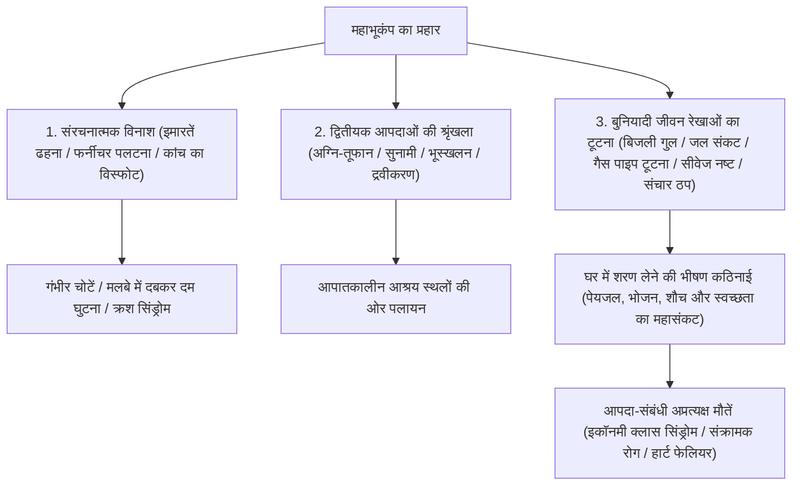
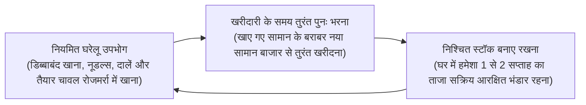
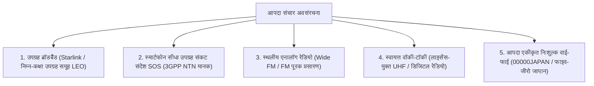

## प्रस्तावना: बहु-आपदा द्वीपसमूह में "उत्तरजीविता इंजीनियरिंग" की स्थापना

प्रशांत महासागरीय 'रिंग ऑफ फायर' पर स्थित जापानी द्वीपसमूह पृथ्वी के कुल भू-भाग का मात्र 0.25% है। फिर भी इस संकीर्ण भूभाग में विश्व के 6 या उससे अधिक तीव्रता वाले लगभग 20% महाभूकंप और लगभग 7% सक्रिय ज्वालामुखी केंद्रित हैं, जो इसे विश्व के सबसे सघन प्राकृतिक आपदा प्रवण क्षेत्रों में से एक बनाता है।

इसके अतिरिक्त, 21वीं सदी में वैश्विक जलवायु परिवर्तन के कारण समुद्र की सतह का बढ़ता तापमान और वायुमंडल में संतृप्त जलवाष्प की भारी वृद्धि ने पारंपरिक रैखिक मौसम पूर्वानुमान मॉडलों को पूरी तरह ध्वस्त कर दिया है। स्थिर "रेखीय वर्षा पट्टियों" (Linear Rainbands) द्वारा होने वाली मूसलाधार बारिश, नदियों के तटबंध टूटने और शहरी जल निकासी जाम होने से उत्पन्न होने वाली भयावह मिश्रित बाढ़, और निकट भविष्य में जिनकी पुनरावृत्ति निश्चित मानी जा रही है — जैसे "नानकाई ट्रफ महाभूकंप (तीव्रता 8-9)", "टोक्यो प्रत्यक्ष भूकंप", और "माउंट फ़ूजी का महाविस्फोट" — राष्ट्रीय व्यवस्था को पंगु बना देने वाली राष्ट्रीय संकट-स्तरीय बहु-आपदाओं के खतरे को अभूतपूर्व स्तर पर पहुंचा रहे हैं।

ऐसी चरम परिस्थितियों में, सरकार और नगर पालिकाओं द्वारा प्रदान की जाने वाली "सार्वजनिक सहायता" (कोजो) की अपरिहार्य भौतिक सीमाएं हैं। एक विनाशकारी भूकंप के तुरंत बाद मुख्य सड़कों के टूटने, अनियंत्रित आग के फैलने, दूरसंचार बैकबोन के ठप होने और प्रशासनिक मुख्यालयों के स्वयं क्षतिग्रस्त होने के कारण राहत दलों और रसद सामग्री को प्रत्येक परिवार तक पहुंचने में **"कम से कम 72 घंटे (3 दिन), और व्यापक विनाश के क्षेत्रों में 1 सप्ताह से अधिक"** का पूर्ण सहायता शून्यकाल उत्पन्न होता है।

इस क्रूर शून्यकाल में अपने बलबूते जीवित रहने तथा अपने परिवार व समुदाय के जीवन की रक्षा करने का व्यावहारिक विज्ञान ही **"आपदा न्यूनीकरण इंजीनियरिंग (Disaster Mitigation Engineering)"** है, और इसका भौतिक साधन **"आपातकालीन उत्तरजीविता उपकरण (Emergency Survival Gear)"** है। आपदा सुरक्षा उपकरण केवल रोजमर्रा की वस्तुओं की अंधी जमाखोरी नहीं है। यह बिजली, नल का पानी, गैस, सीवेज और दूरसंचार जैसे शहरी बुनियादी ढांचे के पूरी तरह नष्ट हो जाने पर मानव शरीर के जैव रासायनिक होमियोस्टेसिस (संतुलन) और सार्वजनिक स्वास्थ्य को स्वतंत्र रूप से बनाए रखने के लिए एक "पोर्टेबल जीवन रक्षक प्रणाली" है।

यह शोध-ग्रंथ आपदा की समयसीमा और मात्रात्मक जोखिम मूल्यांकन से शुरू होकर, चरण 0, 1 और 2 के त्रि-स्तरीय मॉड्यूलर उपकरण सिद्धांत, जल, भोजन और मानव अपशिष्ट प्रबंधन के जैव रासायनिक व स्वच्छता इंजीनियरिंग दृष्टिकोण, ऑफ-ग्रिड आपातकालीन ऊर्जा प्रणालियों तथा शरणार्थी शिविरों में आपदा-संबंधी मौतों को रोकने के चिकित्सा प्रोटोकॉल तक की संपूर्ण प्रणाली को वैज्ञानिक कठोरता के साथ उद्घाटित करता है।

```
【आपदा चरणों की प्रगति और सुरक्षा उपकरणों की कार्यात्मक तैनाती】

┌─────────────────┬───────────────────────────────┬───────────────────────────────┐
│ चरण (Phase)     │ समय-सीमा और परिस्थितियां      │ आवश्यक कार्य और उपकरण         │
├─────────────────┼───────────────────────────────┼───────────────────────────────┤
│ चरण 0           │ दैनिक जीवन, यात्रा, मार्ग में │ 0-चरण EDC: बचाव सीटी, कॉम्पैक्ट│
│ (आपदा का क्षण)  │ (स्थान की अप्रत्याशितता)      │ टॉर्च, पोर्टेबल टॉयलेट, IFAK  │
├─────────────────┼───────────────────────────────┼───────────────────────────────┤
│ चरण 1           │ आपदा के तुरंत बाद से 24 घंटे  │ त्वरित निकासी बैग (Go-Bag):   │
│ (त्वरित निकास)  │ मलबे, आग और सुनामी से तुरंत   │ सिर की सुरक्षा, N95 मास्क,    │
│                 │ जान बचाकर भागना               │ सुरक्षा जूते, पानी की बोतल    │
├─────────────────┼───────────────────────────────┼───────────────────────────────┤
│ चरण 2           │ 24 घंटे से 72 घंटे            │ बचाव की प्रतीक्षा / घर में शरण:│
│ (जीवन रक्षा)    │ बुनियादी ढांचे का पूर्ण विनाश │ प्राथमिक उपचार, थर्मल कंबल,   │
│                 │ और पड़ोस का अलगाव             │ सूक्ष्म जल शोधक               │
├─────────────────┼───────────────────────────────┼───────────────────────────────┤
│ चरण 3           │ 72 घंटे से 1 सप्ताह से अधिक   │ द्वितीयक घरेलू भंडार (लॉजिस्टिक्स):│
│ (दीर्घकालिक शरण)│ लंबे समय तक विस्थापन, लोक     │ आरक्षित भोजन/पानी, स्वतंत्र   │
│                 │ स्वच्छता का संरक्षण           │ ऊर्जा स्रोत, उन्नत स्वच्छता   │
└─────────────────┴───────────────────────────────┴───────────────────────────────┘
```

---

## 1. बहु-आपदाओं के भौतिक तंत्र और समयसीमा इंजीनियरिंग

एक प्रभावी आपदा न्यूनीकरण प्रणाली की रचना के लिए प्राकृतिक आपदाओं के भौतिक तंत्र और आधुनिक शहरी बुनियादी ढांचे के क्रमिक पतन की प्रक्रिया को सटीक रूप से समझना आवश्यक है।

### 1.1 भूकंपीय गति की भौतिकी: सबडक्शन ज़ोन बनाम अंतर्देशीय उथले भ्रंश
विनाशकारी भूकंपों को उनकी भ्रंश यांत्रिकी के आधार पर दो प्रमुख वर्गों में विभाजित किया जाता है:

1. **सबडक्शन ज़ोन (प्लेट सीमा) महाभूकंप (उदा. नानकाई ट्रफ भूकंप, 2011 तोहोकू महाभूकंप)**:
   यह उस सीमा पर उत्पन्न होता है जहां एक महासागरीय टेक्टोनिक प्लेट महाद्वीपीय प्लेट के नीचे धंसती है। चूंकि भ्रंश टूटने का क्षेत्र सैकड़ों किलोमीटर तक फैला होता है, इसलिए हिंसक झटकों की अवधि कई मिनटों तक खिंचती है और विशाल भौगोलिक क्षेत्र में तबाही मचाती है। समुद्र तल के अचानक ऊर्ध्वाधर विस्थापन से उत्पन्न विशाल सुनामी कुछ ही मिनटों में तटीय क्षेत्रों से टकराती है। यह "लंबी अवधि की भूकंपीय गति" भी उत्पन्न करता है, जिससे गगनचुंबी इमारतें गूंज के साथ खतरनाक रूप से झूलने लगती हैं।
2. **अंतर्देशीय उथले भ्रंश भूकंप (सीधा हमला) (उदा. 1995 कोबे भूकंप, 2016 कुमामोटो भूकंप)**:
   यह महाद्वीपीय भूपर्पटी के भीतर सक्रिय उथले भ्रंशों के अचानक खिसकने से होता है। अत्यधिक उथले केंद्र के कारण, प्रारंभिक सूक्ष्म तरंगों (P-तरंगों) और विनाशकारी कतरनी तरंगों (S-तरंगों) के आगमन के बीच का अंतराल (S-P समय) लगभग शून्य होता है। अत्यधिक तीव्र ऊर्ध्वाधर त्वरण और उच्च आवृत्ति वाली पल्स तरंगें ऊपर बनी संरचनाओं पर बिना चेतावनी के प्रहार करती हैं, जिससे लकड़ी के घर ढह जाते हैं, भारी फर्नीचर हवा में उड़ने लगता है और पुल तथा सड़कें तुरंत टूट जाती हैं।



### 1.2 ज्वालामुखी विस्फोट और राख गिरने की शहरी पक्षाघात गतिशीलता
जापान में 111 सक्रिय ज्वालामुखी हैं। माउंट फ़ूजी, असामा, आसो या सकूराजिमा के बड़े पैमाने पर होने वाले विस्फोट केवल स्थानीय लावा प्रवाह तक सीमित नहीं रहते, बल्कि **"व्यापक ज्वालामुखीय राख गिरने (Volcanic Ashfall)"** की स्थिति उत्पन्न करते हैं, जो बुनियादी ढांचे को चुपचाप पंगु बना देती है।

ज्वालामुखीय राख कोई नरम लकड़ी की राख नहीं है; यह **"नुकीले, अत्यधिक अपघर्षक सूक्ष्म कांच के टुकड़े और सिलिकेट खनिज क्रिस्टल (सिलिका SiO₂)"** से बनी होती है:
- **पावर ग्रिड का बंद होना**: बारिश से भीगने पर राख की कुछ मिलीमीटर की परत भी अत्यधिक विद्युत संवाहक बन जाती है, जिससे उच्च-वोल्टेज सिरेमिक इंसुलेटर में फ्लैशओवर और शॉर्ट सर्किट होते हैं, जिससे बड़े पैमाने पर ब्लैकआउट हो जाता है।
- **परिवहन व्यवस्था ठप**: सड़कों पर कुछ मिलीमीटर राख से फिसलन के गंभीर हादसे होते हैं, और सूक्ष्म कण वाहनों के एयर फिल्टर को जाम करके इंजन बंद कर देते हैं। पटरियों और स्टील के पहियों के बीच इंसुलेशन के कारण रेलगाड़ियां रुक जाती हैं। हवाई जहाजों के जेट इंजनों के भीतर सिलिका पिघलकर कांच बन जाती है, जिससे टरबाइन बंद हो जाते हैं और हवाई अड्डे पूरी तरह बंद करने पड़ते हैं।
- **सीवरेज का स्थायी जमाव**: राख को पानी से सीवर में बहाने पर वह कंक्रीट की तरह जम जाती है, जिससे भूमिगत सीवर पाइप स्थायी रूप से बंद हो जाते हैं।
- **श्वसन और आंखों को नुकसान**: 2.5 माइक्रोन से छोटे कण फेफड़ों के एल्वियोली में गहराई तक प्रवेश कर जाते हैं, जिससे गंभीर ब्रोन्कियल अस्थमा और तीव्र श्वसन संकट उत्पन्न होता है, और आंखों के कॉर्निया छिल जाते हैं।

अतः ज्वालामुखी आपदा किट में N95/FFP2 या उच्चतर श्वसन मास्क, पूरी तरह सीलबंद काले चश्मे (गॉगल्स), रेनकोट और खिड़कियों-दरवाजों को सील करने के लिए मास्किंग टेप अनिवार्य हैं।

---

## 2. चरणबद्ध आपदा उपकरणों की डिजाइन इंजीनियरिंग (चरण 0, 1 और 2)

सुरक्षात्मक संसाधनों की तैनाती को व्यक्ति के आवागमन के दायरे और आपदा के बाद के समय-प्रवाह के अनुसार तीन स्तरों में विभाजित किया जाना चाहिए।

```
【आपदा उपकरणों की त्रि-स्तरीय मॉड्यूलर वास्तुकला】

［चरण 0: EDC (Everyday Carry / दैनिक ले जाने योग्य सामान)］
・संदर्भ: कार्यालय, स्कूल या यात्रा के दौरान हमेशा शरीर पर रखना (वजन: 300 से 500 ग्राम अधिकतम)।
・उद्देश्य: आपदा के क्षण से लेकर घर लौटने या प्राथमिक शरण स्थल तक पहुंचने के शुरुआती कुछ घंटों को सुरक्षित काटना।

［चरण 1: त्वरित निकासी बैग (Emergency Go-Bag)］
・संदर्भ: घर के मुख्य द्वार या बिस्तर के पास स्थाई रूप से रखा गया बैग (वजन: पुरुषों के लिए 10-15 किग्रा, महिलाओं के लिए 8-10 किग्रा)।
・उद्देश्य: इमारत ढहने, आग या सुनामी से तुरंत जान बचाकर भागना; पहले 24 से 48 घंटों तक जीवन के आवश्यक मापदंडों को बनाए रखना।

［चरण 2: घरेलू लॉजिस्टिक्स भंडारण (Home Stockpile)］
・संदर्भ: घर की रसोई, अलमारी या स्टोररूम में विकेंद्रीकृत भंडारण (7 से 14 दिनों की क्षमता)।
・उद्देश्य: सभी नगरपालिका सेवाओं के पूर्णतः बंद होने पर घर के भीतर रहकर स्वच्छता और जीवन को आत्मनिर्भर रूप से बनाए रखना।
```

### 2.1 चरण 0 (EDC): दैनिक जीवन में छिपा उत्तरजीविता पाउच
आधुनिक नागरिक अपना अधिकांश समय घर से बाहर (कार्यालय, मेट्रो, मॉल) बिताते हैं। दिन के समय एक बड़ा भूकंप आने का अर्थ है लिफ्ट में फंसना, भूमिगत मेट्रो सुरंग में अंधेरे में अटक जाना, या मलबे के बीच से मीलों पैदल चलकर घर लौटना।

```
【चरण 0 EDC पाउच की अनिवार्य सामग्री (अनुशंसित वजन: ~400 ग्राम)】

1. उच्च-तीव्रता वाली कॉम्पैक्ट LED टॉर्च (AA/AAA बैटरी या USB-C रिचार्जेबल, >=100 लुमेन)
2. आपातकालीन बचाव सीटी (बिना गेंद वाली दोहरी-कक्षीय रचना, >=100 dB, पानी में भी बजने वाली)
3. एल्युमिनाइज्ड मायलर आपातकालीन थर्मल कंबल (शरीर की गर्मी का 90% परावर्तन, पवनरोधी, जलरोधी)
4. पोर्टेबल केमिकल टॉयलेट पाउच (सुपरएब्जॉर्बेंट पॉलिमर + गंध-अवरोधक बहुस्तरीय बैग: न्यूनतम 2 उपयोग)
5. उच्च क्षमता वाला पावर बैंक (5,000–10,000 mAh) + टिकाऊ मल्टी-चार्जिंग केबल
6. प्राथमिक चिकित्सा व दवा किट (बैंड-एड, एंटीसेप्टिक वाइप्स, दर्द निवारक, 3 दिन की नियमित दवाएं, N95 मास्क)
7. नकद नकदी (छोटे नोट और सिक्के: सार्वजनिक पे-फोन के लिए; ब्लैकआउट के दौरान डिजिटल भुगतान ठप हो जाता है)
8. आपातकालीन मेडिकल आईडी कार्ड (ब्लड ग्रुप, दवाओं से एलर्जी, बीमारियों का इतिहास और संपर्क नंबर)
```

### 2.2 चरण 1 निकासी बैग (Go-Bag): बैकपैक की वजन इंजीनियरिंग
निकासी बैग की तैयारी में सबसे घातक गलती अनावश्यक सामान भर लेना है, जिससे बैग इतना भारी हो जाता है कि व्यक्ति मलबे पर दौड़ या चढ़ नहीं सकता। चपलता बनाए रखने के लिए अधिकतम वजन की सुरक्षित सीमा **"वयस्क पुरुषों के लिए शरीर के वजन का लगभग 20% (12–15 किग्रा) और वयस्क महिलाओं के लिए लगभग 15% (7–10 किग्रा)"** है।

```
【निकासी बैकपैक में भार वितरण का एर्गोनॉमिक्स】

・पीठ से सटा ऊपरी हिस्सा: सबसे भारी सामान (पीने का पानी, डिब्बाबंद भोजन, बैटरी)
  -> गुरुत्वाकर्षण केंद्र को रीढ़ के पास ऊपर उठाता है, जिससे कमर पर पड़ने वाला तनाव बहुत कम हो जाता है।
・मध्यम से बाहरी परत: मध्यम वजन की वस्तुएं (कपड़े, रेनकोट, प्राथमिक चिकित्सा किट)।
・निचला तल: हल्की और अधिक आयतन वाली वस्तुएं (कॉम्पैक्ट स्लीपिंग बैग, थर्मल ऊन, तौलिया)।
・ऊपरी ढक्कन और बाहरी जेबें: तत्काल आवश्यक उपकरण (हेडलैम्प, सीटी, फोल्डेबल हेलमेट, कट-प्रतिरोधी दस्ताने)।
```

निकासी के समय पहने जाने वाले जूते जीवन-मरण का प्रश्न हैं। चप्पल या हल्के स्नीकर्स में भागना एक आत्मघाती कदम है: भूकंप के बाद सड़कें टूटे शीशे, नुकीले सरियों और जंग लगी कीलों से पटी होती हैं। स्टील या केवलर एंटी-पंचर मिडसोल वाले मिड-कट ट्रेकिंग जूते या प्रमाणित सुरक्षा जूते अनिवार्य हैं।

---

## 3. पेयजल की आपूर्ति और जल शोधन इंजीनियरिंग

मानव शरीर भार के अनुसार लगभग 60% पानी से बना है। यद्यपि चयापचय ठोस भोजन के बिना कई सप्ताह तक जीवित रह सकता है, जल का पूर्ण अभाव केवल 3 से 5 दिनों में निर्जलीकरण, हाइपोवोलेमिक शॉक और मल्टी-ऑर्गन फेलियर का कारण बनकर मृत्यु दे देता है।

### 3.1 शारीरिक रूप से आवश्यक जल का वैज्ञानिक निर्धारण
आपदा चिकित्सा के दिशानिर्देशों के अनुसार, जीवित रहने के लिए आवश्यक न्यूनतम दैनिक पानी की मात्रा है:

$$\text{जीवन रक्षा हेतु अनिवार्य जल} = 3.0 \text{ लीटर / व्यक्ति / दिन}$$

अतः 4 सदस्यों वाले परिवार के लिए 1 सप्ताह के घरेलू शरणकाल का हिसाब लगाने पर:

$$3 \text{ L} \times 4 \text{ व्यक्ति} \times 7 \text{ दिन} = 84 \text{ लीटर}$$

यह केवल मूलभूत शारीरिक चयापचय के लिए 2-लीटर की बयालीस बोतलों के बराबर है। यदि इसमें भोजन तैयार करने, हाथ धोने, घाव की सफाई और मौखिक स्वच्छता का पानी जोड़ दिया जाए, तो आवश्यक मात्रा बहुत बढ़ जाती है।

### 3.2 हॉलो फाइबर मेम्ब्रेन (खोखले फाइबर झिल्ली) जल शोधन
जब आरक्षित पानी समाप्त हो जाता है, तो बारिश के पानी, नदी, कुएं या बाथटब के पानी को सीधे पीने योग्य बनाने के लिए एक पोर्टेबल माइक्रोफिल्ट्रेशन शोधक (जैसे Sawyer Squeeze/Mini या Katadyn BeFree) अंतिम जीवनरेखा बन जाता है।

```
【खोखले फाइबर झिल्ली द्वारा जल शोधन का तंत्र】

प्रदूषित कच्चा पानी (कीचड़, रोगजनक बैक्टीरिया, प्रोटोजोआ सिस्ट)
  ↓
［छिद्रित खोखले फाइबर झिल्ली: छिद्र का आकार 0.1 माइक्रोन (100 नैनोमीटर)］
  │
  ├─ 【भौतिक रूप से रोके और हटाए गए सूक्ष्म रोगजनक】
  │   ・रोगजनक प्रोटोजोआ (क्रिप्टोस्पोरिडियम: ~4–6 μm, गियार्डिया: ~8–14 μm)
  │   ・संक्रामक बैक्टीरिया (ई. कोलाई: ~0.5 × 2 μm, हैजा, साल्मोनेला)
  │   ・माइक्रोप्लास्टिक्स, कीचड़, तैरते हुए तलछट कण
  │
  └─ 【झिल्ली से गुजरने वाले अणु और आयन】
      ・शुद्ध पानी के अणु (H₂O: आणविक व्यास ~0.3 नैनोमीटर)
      ・घुलनशील लाभकारी खनिज और इलेक्ट्रोलाइट्स (Na⁺, Ca²⁺, Mg²⁺)
  ↓
जीवाणुरहित, जैविक रूप से शुद्ध सुरक्षित पेयजल
```

तथापि, खोखले फाइबर फिल्टर की स्पष्ट भौतिक सीमाएं हैं: पानी में पूरी तरह घुले हुए रसायन (भारी धातुएं, कीटनाशक, रेडियोधर्मी समस्थानिक) और नैनोस्केल वायरस (0.02 से 0.08 माइक्रोन जैसे नोरोवायरस, रोटावायरस, हेपेटाइटिस ए) 0.1 माइक्रोन के छिद्र से निकल सकते हैं। इसलिए, सीवेज मिश्रित पानी के लिए झिल्ली छानने के बाद **कम से कम 1 मिनट तक खौलाना** अथवा **सोडियम हाइपोक्लोराइट की सूक्ष्म बूंदों से रासायनिक विसंक्रमण** करना सार्वजनिक स्वास्थ्य का अटल नियम है।

---

## 4. आपातकालीन राशन की जैव रसायन और दीर्घकालिक संरक्षण तकनीक

आपदा के समय पोषण केवल कैलोरी भरने के लिए नहीं है; यह अत्यधिक मानसिक तनाव के तहत प्रतिरक्षा प्रणाली को बनाए रखने और स्नायु-रासायनिक संतुलन की रक्षा करने का कार्य करता है।

### 4.1 अल्फा-चावल: स्टार्च की जिलेटिनाइजेशन और रेट्रोग्रेडेशन रसायन
नागरिक सुरक्षा का मुख्य आधार, "अल्फा-चावल" (प्री-जिलेटिनाइज्ड सूखा चावल), स्टार्च के क्रिस्टलीय चरण परिवर्तन को नियंत्रित करने वाली खाद्य इंजीनियरिंग की उत्कृष्ट उपलब्धि है।

```
【अल्फा-चावल में स्टार्च का क्रिस्टलीय रूपांतरण】

कच्चे चावल का प्राकृतिक स्टार्च (बीटा-स्टार्च / β-starch)
・घनी मिसेलर क्रिस्टल संरचना। पानी के अणु अंदर नहीं जा सकते; मानव लार और पाचन एंजाइम इसे पचा नहीं सकते।
  ↓ हाइड्रोथर्मल पकाना (जिलेटिनाइजेशन / अल्फा-प्रतिक्रिया)
जिलेटिनाइज्ड स्टार्च (अल्फा-स्टार्च / α-starch)
・ऊष्मा हाइड्रोजन बंधों को तोड़ती है, क्रिस्टल जाली ढह जाती है और पानी सोखकर एक सुपाच्य अनाकार हाइड्रोजेल बन जाती है।
  ↓ (सामान्य रूप से ठंडा होने पर पानी खोकर कठोर अपाच्य "रेट्रोग्रेडेड स्टार्च [β'-स्टार्च]" में बदल जाता है)
［औद्योगिक अल्ट्रा-फास्ट हॉट एयर ड्राईंग］
・पके हुए अल्फा-चावल को गर्म शुष्क हवा (80-100 °C+) के तीव्र झोंके से सुखाया जाता है, जिससे नमी तुरंत 8-10% से नीचे आ जाती है।
・यह तेजी से सूखना क्रिस्टलीकरण को रोक देता है, जिससे पोरस अल्फा-संरचना हमेशा के लिए स्थिर हो जाती है।
  ↓
उपयोग के समय केशिका पुनर्जलीकरण
・उबलता पानी डालने पर 15 मिनट (या सामान्य पानी में 60 मिनट) में केशिका क्रिया से पानी तेजी से छिद्रों में भर जाता है और ताजा पके चावल जैसी कोमलता प्राप्त होती है। शेल्फ लाइफ: कमरे के तापमान पर 5 से 7 वर्ष।
```

### 4.2 फ्रीज-ड्राइंग (लायोफिलाइजेशन / निर्वात ऊर्ध्वपातन) की भौतिकी
सूप, पौष्टिक स्ट्यू और प्रोटीनयुक्त भोजन के लिए, फ्रीज-ड्राइंग तकनीक बर्फ को सीधे भाप में बदलने के लिए **"जल के त्रिक बिंदु (Triple Point: 0.01 °C, 611.65 Pa)"** का उपयोग करती है।

खाद्य पदार्थों को −30 °C से −50 °C पर गहरा जमाया जाता है, निर्वात कक्ष में रखा जाता है और दबाव को त्रिक बिंदु से नीचे घटाया जाता है। हल्की ऊष्मा देने पर कोशिकाओं के भीतर मौजूद बर्फ तरल बने बिना सीधे वाष्प में "ऊर्ध्वपातित (Sublimate)" हो जाती है।

```
【फ्रीज-ड्राइंग के बायोफिजिकल लाभ】

1. कोशिकीय सूक्ष्म संरचना की पूर्ण सुरक्षा:
   उच्च तापमान न होने से प्रोटीन का क्षरण नहीं होता, कोशिका भित्ति अक्षुण्ण रहती है, और ऊष्मा-संवेदी विटामिन (विटामिन सी, बी-कॉम्प्लेक्स) सुरक्षित रहते हैं।
2. वजन में अत्यधिक कमी:
   भोजन का 95% से 98% पानी निकल जाता है, जिससे वजन ताजे भोजन का एक अंश मात्र रह जाता है और बैकपैक का भार घट जाता है।
3. तुरंत पुनर्जलीकरण:
   बर्फ के उड़ जाने से स्पंज जैसी खुली सूक्ष्म नलिकाएं रह जाती हैं। पानी डालते ही केशिका तनाव सेकंडों में पानी सोख लेता है और मूल बनावट और स्वाद वापस आ जाता है।
```

### 4.3 रोलिंग स्टॉक प्रणाली (सतत चक्रीय भंडारण प्रबंधन)
अजीबोगरीब आपातकालीन राशन खरीदकर अलमारी में पांच साल के लिए बंद कर देना और एक्सपायर होने पर फेंक देना एक असफल दृष्टिकोण है।
आज का आधुनिक मानक **"रोलिंग स्टॉक प्रणाली (डायनेमिक इन्वेंटरी रोटेशन)"** है।



रोलिंग स्टॉक का सबसे बड़ा मनोवैज्ञानिक लाभ यह है कि **"आपदा के गहरे आघात के बीच भी परिचित आरामदायक भोजन (Comfort Foods) मिलता है"**। विस्थापन के तनाव में अपरिचित और सूखा राशन खाने से भूख खत्म हो जाती है, पाचन खराब होता है और अवसाद घेर लेता है। नियमित खाद्य पदार्थों को घुमाते रहना सबसे टिकाऊ और मजबूत रणनीति है।

---

## 5. स्वच्छता इंजीनियरिंग और शरणार्थी शिविर उत्तरजीविता (संक्रमण, शौच और ऊष्मा संरक्षण)

ऐतिहासिक भूकंपों के मृत्यु आंकड़ों का महामारी विज्ञान विश्लेषण एक भयावह सच्चाई उजागर करता है: कोबे (1995), कुमामोटो (2016) और नोटो प्रायद्वीप (2024) के भूकंपों में **"आपदा-संबंधी अप्रत्यक्ष मौतों (Disaster-Related Deaths)"** की संख्या — वे लोग जो प्रत्यक्ष मलबे या सुनामी से बच गए लेकिन आश्रय शिविरों की कठोर परिस्थितियों के कारण मारे गए — कई क्षेत्रों में प्रत्यक्ष मृतकों से अधिक थी।

इन मौतों का प्राथमिक कारण भुखमरी नहीं, बल्कि **"सार्वजनिक स्वच्छता का पतन"** और **"मानव मल-मूत्र निपटान व्यवस्था का पूर्ण विनाश"** है।

### 5.1 आपातकालीन सूखे शौचालय और सुपरएब्जॉर्बेंट पॉलिमर (SAP)
पानी की आपूर्ति बंद होने पर **कमोड में बाल्टी से पानी डालकर फ्लश करना सख्त वर्जित है**। यदि भूमिगत सीवर पाइप या इमारत के पाइप टूट गए हैं, तो ऊपरी मंजिलों से बहाया गया मल निचली मंजिलों के टॉयलेट और नालियों से फव्वारे की तरह बाहर निकलेगा, जिससे पूरी इमारत जैविक आपदा क्षेत्र बन जाएगी।

सुरक्षित उपाय यह है कि कमोड सीट पर प्लास्टिक बैग लगाकर उसमें जमावट करने वाले केमिकल डाले जाएं। इसका मुख्य घटक **"सुपरएब्जॉर्बेंट पॉलिमर (SAP: क्रॉस-लिंक्ड सोडियम पॉलीएक्रिलेट)"** है।

```
【सुपरएब्जॉर्बेंट पॉलिमर द्वारा मल-मूत्र बांधने की जैव रसायन】

┌─────────────────────────────────────────────────────────────┐
│ हाइड्रोफिलिक समूहों (-COONa) का आयनीकरण:                   │
│ मूत्र के संपर्क में आते ही सोडियम आयन (Na⁺) अलग हो जाते हैं,│
│ जिससे पॉलिमर चेन पर स्थिर नकारात्मक आवेश (-COO⁻) छूट जाते हैं।│
│   ↓                                                         │
│ इलेक्ट्रोस्टैटिक प्रतिकर्षण से जाल का भारी विस्तार:          │
│ एक जैसे नकारात्मक आवेशों का आपसी प्रतिकर्षण मुड़े हुए त्रि- │
│ आयामी जाल को सेकंडों में हिंसक रूप से खोल और फैला देता है।  │
│   ↓                                                         │
│ ऑस्मोटिक अंतःस्रवण और अपरिवर्तनीय हाइड्रोजेल बंधन:          │
│ आंतरिक उच्च आयन सांद्रता भारी ऑस्मोटिक दबाव पैदा करती है, जो│
│ पॉलिमर के सूखे वजन से सैकड़ों से हजार गुना अधिक पानी सोखकर │
│ कठोर हाइड्रोजेल बना देती है (दबाने पर भी पानी नहीं निकलता)। │
└─────────────────────────────────────────────────────────────┘
```

उच्च गुणवत्ता वाले जमावट एजेंटों में सिल्वर आयन ($Ag^+$), क्लोरीन यौगिक और पौधों के टैनिन मिलाए जाते हैं, जो बैक्टीरिया को मारते हैं और जहरीली अमोनिया ($NH_3$) व हाइड्रोजन सल्फाइड ($H_2S$) गैसों को रासायनिक रूप से निकलने से रोकते हैं।

#### पेशाब रोकने की पैथोफिज़ियोलॉजी और "इकॉनमी क्लास सिंड्रोम"
जब शरणार्थी शिविरों के शौचालय गंदे, बदबूदार और अंधेरे हो जाते हैं, तो लोग (विशेष रूप से बुजुर्ग और महिलाएं) शौचालय जाने से बचने के लिए **पानी पीना बेहद कम कर देते हैं**।

पानी की यह कमी रक्त को गाढ़ा (हेमोकंसंट्रेशन) कर देती है। तंग कारों या ठंडे फर्श पर सोने की गतिहीनता के साथ मिलकर पैरों की नसों के दबने से डीप वेन थ्रोम्बोसिस (DVT) हो जाता है। अचानक खड़े होने पर यह थक्का फेफड़ों की धमनी में जाकर अटक जाता है, जिससे तुरंत पल्मोनरी एम्बोलिज्म ("इकॉनमी क्लास सिंड्रोम") और अचानक मृत्यु हो जाती है। साफ, सुरक्षित और गरिमापूर्ण शौचालयों की व्यवस्था करना सीधे तौर पर जीवन बचाने वाली चिकित्सा क्रिया है।

### 5.2 थर्मल इंजीनियरिंग: एल्युमिनाइज्ड मायलर (PET) इमरजेंसी ब्लैंकेट
आकस्मिक हाइपोथर्मिया (शरीर का आंतरिक तापमान 35 °C से नीचे गिरना) केवल सर्दियों में ही नहीं होता; पसीने या बारिश से भीगे कपड़ों में हवा लगने पर चिलचिलाती गर्मी में भी व्यक्ति ठंड से मर सकता है।

स्पेस सर्वाइवल ब्लैंकेट केवल 12 माइक्रोन पतली BoPET (मायलर) फिल्म से बना होता है, जिस पर निर्वात में शुद्ध एल्युमिनियम की परत चढ़ाई जाती है।
एल्युमिनियम के मुक्त इलेक्ट्रॉनों के परावर्तक प्रभाव से **"यह मानव शरीर से निकलने वाली दूर-अवरक्त विकिरण गर्मी के 90% से अधिक हिस्से को वापस शरीर की ओर परावर्तित कर देता है"**। साथ ही, यह हवा और वाष्पीकरण से होने वाली ठंडक को पूरी तरह रोकता है, और केवल 50 ग्राम वजन में कई भारी कंबलों जैसी गर्माहट देता है।

---

## 6. आपातकालीन ऊर्जा और सुदृढ़ दूरसंचार इंजीनियरिंग

बिजली कटने और मोबाइल नेटवर्क ठप होने से जीवित बचे लोग अंधकार, अलगाव और अफवाहों के खौफ में डूब जाते हैं। एक स्वतंत्र ऊर्जा प्रणाली और बहुस्तरीय संचार माध्यम स्थापित करना प्राथमिक रक्षा पंक्ति है।

### 6.1 लिथियम आयरन फॉस्फेट बैटरी (LiFePO₄): सुरक्षा और इलेक्ट्रोकेमिस्ट्री
घरेलू पोर्टेबल पावर स्टेशन चुनते समय बैटरी सेल की कैथोड केमिस्ट्री सबसे महत्वपूर्ण सुरक्षा मानक है। पारंपरिक टर्नरी लिथियम-आयन (NMC: निकल-मैंगनीज-कोबाल्ट) और आधुनिक **"लिथियम आयरन फॉस्फेट (LFP / $\text{LiFePO}_4$)"** के बीच जमीन-आसमान का अंतर है।

```
【भौतिक-रासायनिक तुलना: टर्नरी बैटरियां (NMC) बनाम LiFePO₄】

┌──────────────────────┬───────────────────────────────┬───────────────────────────────┐
│ मूल्यांकन पैरामीटर   │ टर्नरी रसायन (NMC/NCA)        │ लिथियम आयरन फॉस्फेट (LiFePO₄) │
├──────────────────────┼───────────────────────────────┼───────────────────────────────┤
│ क्रिस्टल संरचना      │ स्तरित अस्थिर संरचना          │ ओलिविन संरचना (अत्यंत मजबूत  │
│                      │                               │ सहसंयोजक P-O बंधन)            │
│ थर्मल रनवे तापमान    │ ~200 से 210 °C                │ ~400 से 500 °C                │
│                      │ (अत्यंत जल्दी अनियंत्रित)     │ (अत्यधिक उच्च थर्मल स्थिरता)  │
│ ऑक्सीजन उत्सर्जन और  │ ओवरचार्ज या पंचर पर ऑक्सीजन   │ ऑक्सीजन उत्सर्जित नहीं होती;  │
│ आग का खतरा           │ छोड़ती है; विस्फोटक आग लगती है│ शॉर्ट सर्किट पर भी विस्फोट या │
│                      │                               │ आग नहीं लगती                  │
├──────────────────────┼───────────────────────────────┼───────────────────────────────┤
│ चार्ज/डिस्चार्ज चक्र  │ ~500 से 800 चक्र              │ ~3,000 से 4,000 चक्र          │
│                      │ (जल्दी क्षमता घटती है)        │ (10 से अधिक वर्षों का जीवन)   │
│ ऊर्जा घनत्व          │ उच्च (हल्की और कॉम्पैक्ट)     │ मध्यम (थोड़ी भारी और बड़ी)    │
└──────────────────────┴───────────────────────────────┴───────────────────────────────┘
```

आपदा प्रबंधन के लिए, जहां उपकरण सालों तक गर्म कारों या कोठरियों में रखे रहते हैं, **थर्मल रनवे से पूर्ण सुरक्षा और 10 साल से अधिक की दीर्घायु $\text{LiFePO}_4$ पावर स्टेशनों को वैश्विक उद्योग का निर्विवाद मानक बनाती है**।

### 6.2 पोर्टेबल सोलर पैनल और MPPT चार्ज कंट्रोलर
हफ्तों तक चलने वाले ब्लैकआउट में दीवार के सॉकेट बेकार हो जाते हैं। सतत सौर ऊर्जा उत्पादन अनिवार्य है।
उच्च दक्षता वाले मोनोक्रिस्टलाइन फोल्डेबल पैनल (22–24%+ दक्षता) को **MPPT (Maximum Power Point Tracking)** कंट्रोलर के साथ जोड़ने से यह सुनिश्चित होता है कि प्रणाली बादल छाए रहने या सुबह-शाम के कम प्रकाश में भी अधिकतम संभव बिजली खींचती रहे।

---

## 2.3 टैक्टिकल ट्रॉमा केयर और कैट टूर्निकेट (CAT) का अनुप्रयोग

भूकंप में ढही इमारतों, उड़ते कांच और सुनामी के मलबे से लगने वाली चोटों में सबसे तेज मौत **"धमनी से होने वाले अत्यधिक रक्तस्राव"** से होती है। फीमोरल (जांघ) या ब्रेकियल (बांह) धमनी कटने पर कुछ ही मिनटों में शरीर का एक-तिहाई रक्त (शरीर के वजन का लगभग 8%) बह सकता है। मलबे में एम्बुलेंस की प्रतीक्षा करना रक्तस्रावी आघात से निश्चित मृत्यु की ओर ले जाता है।

टैक्टिकल कॉम्बैट कैजुअल्टी केयर (TCCC) दिशानिर्देशों के अनुसार, हाथ-पैरों के गंभीर रक्तस्राव को रोकने के लिए स्वर्ण मानक **"कॉम्बैट एप्लीकेशन टूर्निकेट (CAT: Combat Application Tourniquet)"** है।

```
【CAT टूर्निकेट की संरचना और धमनी अवरोध प्रोटोकॉल】

┌─────────────────────────────────────────────────────────────┐
│ बकल और उच्च-तन्यता नायलॉन बेल्ट को लगाना:                   │
│ घाव से 5 से 7 सेमी ऊपर (हृदय की ओर) लगाएं।                  │
│ (जोड़ों पर कभी न लगाएं। यदि अराजकता में घाव का सटीक स्थान    │
│ न दिखे, तो अंग के सबसे ऊपरी आधार पर तुरंत बांधें)।          │
│   ↓                                                         │
│ कठोर प्लास्टिक रॉड (विंडलास) को घुमाना:                     │
│ रॉड को घुमाकर आंतरिक पट्टी को कसें, ताकि हड्डी पर एक समान  │
│ दबाव पड़े जो धमनी के दबाव से अधिक हो। तब तक घुमाएं जब तक कि │
│ स्पंदित रक्तस्राव पूरी तरह बंद न हो जाए।                    │
│   ↓                                                         │
│ क्लिप में लॉक करना और समय दर्ज करना:                        │
│ रॉड को रिटेनर क्लिप में फंसाएं। सफेद सेफ्टी स्ट्रैप पर मार्कर│
│ से बांधने का सटीक समय लिखें (अधिकतम सहनीय सीमा: 2 घंटे)।    │
└─────────────────────────────────────────────────────────────┘
```

शरीर के संधि स्थलों (कमर, बगल, गर्दन का आधार) पर जहां टूर्निकेट नहीं लगाया जा सकता, **"काओलिन युक्त हेमोस्टैटिक पट्टी (जैसे QuikClot)"** जीवन रक्षक है। काओलिन मानव रक्त में थक्के के फैक्टर XII को तेजी से सक्रिय करता है; पट्टी को घाव के भीतर कसकर भरने और हाथ से दबाने पर कुछ ही मिनटों में एक मजबूत फाइब्रिन थक्का बन जाता है।

इसके अलावा, कांच या लोहे के सरियों से छाती में छेद होने पर ("ओपन न्यूमोथोरैक्स"), एकतरफा वाल्व वाले **"वेंटेड चेस्ट सील (Chest Seal)"** का उपयोग फेफड़ों से हवा और रक्त को बाहर निकालने देता है और बाहरी हवा को अंदर जाने से रोकता है, जिससे दम घुटने से होने वाली मौत टल जाती है।

---

## 5.3 अंतरराष्ट्रीय मानवीय मानक: स्फीयर प्रोजेक्ट और "TKB48"

शरणार्थियों के मानवीय सम्मान का वैश्विक मानक **"स्फीयर हैंडबुक (The Sphere Project)"** है, जिसे अंतरराष्ट्रीय रेड क्रॉस और गैर-सरकारी संगठनों ने मिलकर बनाया है। पारंपरिक राहत शिविरों की प्रथा (ठंडे फर्श पर सैकड़ों लोगों का सोना, ठंडे चावल और गंदे पोर्टेबल शौचालय) जीवन के अधिकार का हनन करती है।

जापानी आपदा चिकित्सा विशेषज्ञ **"TKB48 (आपदा के 48 घंटों के भीतर शौचालय, रसोई और बिस्तरों की तैनाती / Toilets, Kitchen, Bed)"** के प्रोटोकॉल पर जोर देते हैं।

```
【राहत शिविरों में सार्वजनिक स्वास्थ्य के तीन स्तंभ: TKB मानक】

1. Ｔ (शौचालय / Toilet):
   ・स्फीयर मानक: प्रति 20 शरणार्थियों पर न्यूनतम 1 शौचालय; पुरुषों और महिलाओं का अनुपात 1:3 (महिलाओं के अधिक समय को ध्यान में रखते हुए)।
   ・स्वच्छता: 24 घंटे रोशनी, साबुन और पानी के साथ वॉशबेसिन, छींटे रोकने वाले पर्दे और आंतरिक सुरक्षा ताले।
   ・लक्ष्य: शून्य दुर्गंध, शून्य अंधेरा, शून्य बाधा ताकि कोई पेशाब न रोके।

2. Ｋ (रसोई और गर्म भोजन / Kitchen):
   ・गर्म भोजन वितरण: 48 से 72 घंटों के भीतर मोबाइल रसोई और एलपीजी बर्नर से गर्म सूप और पौष्टिक भोजन परोसना।
   ・शारीरिक प्रभाव: हाइपोथर्मिया से बचाव, पाचन तंत्र को सक्रिय करना और अत्यधिक तनाव के हार्मोन को शांत करना।

3. Ｂ (ऊंचे बिस्तर / Bed):
   ・नालीदार कार्डबोर्ड बिस्तरों की अनिवार्य व्यवस्था: फर्श से 30 से 40 सेमी ऊंचा बिस्तर।
   ・नैदानिक प्रभाव:
     ① ठंडे कंक्रीट फर्श से होने वाले ऊष्मा क्षय को रोकता है, जिससे निमोनिया और ठंड से बचाव होता है।
     ② सांस लेने के क्षेत्र को फर्श से 30 सेमी ऊपर उठाता है, जहां जहरीली धूल और नोरोवायरस एरोसोल तैरते हैं।
     ③ बुजुर्गों के उठने-बैठने के घुटने और कमर के तनाव को कम करता है, जिससे नसों में खून जमने से बचाव होता है।
```

### मौखिक स्वच्छता और एस्पिरेशन निमोनिया की रोकथाम
शिविरों में बुजुर्गों की मृत्यु का एक प्रमुख कारण **"एस्पिरेशन निमोनिया (Aspiration Pneumonia)"** है।
पानी न होने पर लोग ब्रश करना छोड़ देते हैं। 48 घंटों में मुंह में अवायवीय बैक्टीरिया तेजी से बढ़ते हैं। नींद के दौरान लार की छोटी बूंदों के साथ लाखों बैक्टीरिया सांस की नली और फेफड़ों में चले जाते हैं, जिससे जानलेवा निमोनिया हो जाता है।
इमरजेंसी किट में बिना कुल्ला किए उपयोग होने वाला माउथवॉश और ओरल क्लीनिंग वाइप्स रखना किसी भी एंटीबायोटिक जितना ही महत्वपूर्ण जीवन रक्षक उपाय है।

---

## 6.3 दूरसंचार नेटवर्क की रिडंडेंसी: सैटेलाइट, रेडियो और 00000JAPAN

आपदा में जमीन के मोबाइल टावर बैकअप बैटरी खत्म होने, ऑप्टिकल फाइबर कटने या आपातकालीन सेवाओं के लिए नेटवर्क थ्रॉटलिंग (90% से अधिक प्रतिबंध) के कारण तुरंत बंद हो जाते हैं। सूचना के अंधेरे से बाहर निकलने के लिए बहुस्तरीय बैकअप संचार प्रणाली आवश्यक है।



### 1. वाइड एफएम (Wide FM पूरक प्रसारण) रेडियो की रिसेप्शन इंजीनियरिंग
पारंपरिक AM मध्यम-तरंग रेडियो (526.5–1606.5 kHz), हालांकि लंबी दूरी तय करता है, कंक्रीट की इमारतों में कमजोर पड़ जाता है और शहरी इलेक्ट्रॉनिक शोर से बाधित होता है।
"Wide FM" (VHF 90.0–95.0 MHz बैंड) स्पष्ट FM तरंगों पर महत्वपूर्ण AM आपदा कार्यक्रमों का एक साथ प्रसारण करता है। VHF तरंगें कंक्रीट की इमारतों को आसानी से पार कर जाती हैं और बिजली के शोर से सुरक्षित रहती हैं, जिससे भूकंप की पूर्व चेतावनी स्पष्ट सुनाई देती है। हाथ से घुमाने वाले डायनेमो वाला वाइड एफएम रेडियो हर घर की पहली रक्षा पंक्ति है।

### 2. उपग्रह क्रांति: Starlink और स्मार्टफोन डायरेक्ट सैटेलाइट SOS
स्पेसएक्स का "स्टारलिंक" (~550 किमी की निम्न कक्षा LEO में हजारों उपग्रह) आपदा राहत का चेहरा बदल चुका है। एक छोटे एंटीना को खुले आसमान की ओर करने पर मलबे के बीच भी सैकड़ों मेगाबिट प्रति सेकंड का हाई-स्पीड इंटरनेट चालू हो जाता है, जैसा कि 2024 के नोटो भूकंप में देखा गया।

इसके साथ ही, आधुनिक स्मार्टफोन 3GPP रिलीज 17/18 नॉन-टेरेस्ट्रियल नेटवर्क (NTN) से लैस हैं। जमीन पर कोई मोबाइल टावर न होने पर भी फोन सीधे आसमान के उपग्रहों से जुड़कर संकट संदेश और सटीक जीपीएस निर्देशांक बचाव दल को भेज सकता है।

---

## 2.4 शहरी महा-अग्निकांड, प्राथमिक अग्निशमन और धुआं निकास इंजीनियरिंग

भूकंप के बाद सबसे भयानक हत्यारों में से एक एक साथ कई स्थानों पर लगने वाली आग (**"शहरी अग्नि-तूफान"**) है। घनी बस्तियों में टूटी गैस पाइपलाइनें, बिजली की बहाली पर लगने वाली आग और गिरे हुए हीटर दमकल विभाग की क्षमता को पूरी तरह पंगु बना देते हैं।

### स्मोक एस्केप हुड (Smoke Block) का रसायन विज्ञान
आग लगने पर लगभग 60% मौतें जलने से नहीं, बल्कि **"जहरीली गैसों (कार्बन मोनोऑक्साइड और हाइड्रोजन साइनाइड) के सांस में जाने से दम घुटने से होती हैं"**। सिंथेटिक प्लास्टिक और इन्सुलेशन फोम के जलने से हाइड्रोजन साइनाइड ($HCN$) और फॉसजीन ($COCl_2$) बनती है। मुंह पर गीला तौलिया रखना अघुलनशील कार्बन मोनोऑक्साइड और जहरीले धुएं के कणों को नहीं रोक सकता।

प्रमाणित स्मोक हुड में एक्टिवेटेड चारकोल के साथ **"होपकालाइट उत्प्रेरक (Hopcalite: तांबा-मैंगनीज ऑक्साइड)"** होता है। कमरे के तापमान पर होपकालाइट घातक कार्बन मोनोऑक्साइड ($CO$) को तुरंत हानिरहित कार्बन डाइऑक्साइड ($CO_2$) में ऑक्सीकृत कर देता है, जिससे धुएं से भरी सीढ़ियों से भागने के लिए 10 से 15 मिनट की सांस लेने योग्य हवा मिलती है।

### प्राथमिक अग्निशामक उपकरणों का चयन
- **आवासीय लोडेड स्ट्रीम (प्रबलित तरल) अग्निशामक**: सूखे रासायनिक पाउडर (ABC) अग्निशामकों के विपरीत, जो धूल का गुबार बनाते हैं और दृश्यता छीन लेते हैं, लोडेड स्ट्रीम अग्निशामक क्षारीय लवण के घोल का महीन छिड़काव करते हैं। यह लकड़ी के रेशों में गहराई तक समाकर आग को पूरी तरह बुझा देता है और तंग कमरों में रोशनी बाधित नहीं करता।
- **भूकंप-संवेदी स्वचालित सर्किट ब्रेकर (Earthquake-sensing breakers)**: बिजली वापस आने पर गिरे हुए हीटरों से लगने वाली आग को रोकने के लिए, ये उपकरण 5-ऊपरी तीव्रता के तीव्र भूकंपीय झटके महसूस करते ही घर का मुख्य पावर स्विच अपने आप काट देते हैं।

---

## 1.3 इनडोर एंटी-सीस्मिक एंकरिंग: फर्नीचर स्थिरीकरण और शैटर्फ्रूफ ग्लास फिल्म
कोबे और नोटो भूकंपों के पोस्टमार्टम आंकड़े बताते हैं कि घरों के भीतर 80% से अधिक मौतें **"इमारतों के ढहने और भारी फर्नीचर तथा उपकरणों के गिरने से दबने और दम घुटने के कारण हुईं"**। 6-ऊपरी से 7 तीव्रता के तीव्र झटकों में भारी अलमारियां, फ्रिज और पियानो जानलेवा मिसाइल बन जाते हैं जो लोगों को कुचल देते हैं और निकास द्वार बंद कर देते हैं।

फर्नीचर को सुरक्षित करने के लिए संरचनात्मक यांत्रिकी पर आधारित इंजीनियरिंग दृष्टिकोण आवश्यक है।

```
【फर्नीचर फिक्सिंग हार्डवेयर की मजबूती और स्थापना नियम】

┌──────────────────────┬───────────────────────────────┬───────────────────────────────┐
│ हार्डवेयर का प्रकार │ यांत्रिक रोकथाम सिद्धांत      │ स्थापना का अनिवार्य नियम      │
├──────────────────────┼───────────────────────────────┼───────────────────────────────┤
│ भारी धातु के L-आकार  │ दीवार के भीतर लकड़ी या स्टील  │ केवल प्लास्टरबोर्ड पर पेंच कसने│
│ के ब्रैकेट           │ के खंभे में सीधे पेंच से कसना।│ से कोई मजबूती नहीं मिलती।     │
│ (स्वर्ण मानक)        │ कतरनी बल से पलटने से रोकता है।│ सेंसर से खंभा ढूंढकर ही कसें। │
├──────────────────────┼───────────────────────────────┼───────────────────────────────┤
│ टेलीस्कोपिक टेंशन पोल│ छत और फर्नीचर के बीच दबाव बल  │ पतली प्लाईवुड की छतें दबाव से │
│ ＋ विस्कोइलास्टिक जेल │ उत्पन्न करता है; जेल पैड नीचे │ टूट जाती हैं। पोल के नीचे चौड़ा│
│ (हाइब्रिड प्रणाली)   │ से फिसलने से रोकता है।        │ लकड़ी का तख्ता लगाकर जेल लगाएं।│
├──────────────────────┼───────────────────────────────┼───────────────────────────────┤
│ उच्च-शक्ति बद्धी पट्टे│ भारी फ्रिज और टीवी को पलटने से│ दीवार के मुख्य खंभे से कसकर   │
│ और स्टील केबल        │ रोकने के लिए पट्टे के लचीलेपन │ बांधें ताकि झटका पट्टे के खिंचाव│
│                      │ से गतिज ऊर्जा सोखते हैं।      │ से अवशोषित हो जाए।            │
└──────────────────────┴───────────────────────────────┴───────────────────────────────┘
```

### खिड़की सुरक्षा फिल्म (मल्टी-लेयर पीईटी) की तन्य शक्ति
जब भूकंप के झटकों से खिड़की के फ्रेम मुड़ते हैं, तो कांच कतरनी तनाव से फट जाता है और तेज छर्रों की तरह पूरे कमरे में उड़ता है।
कांच के अंदरूनी हिस्से पर 50 से 100 माइक्रोन मोटी मल्टी-लेयर पॉलिएस्टर (PET) सुरक्षा फिल्म लगाने से ऐक्रेलिक चिपकने वाला पदार्थ टूटे हुए कांच के टुकड़ों को फिल्म पर ही जकड़ कर रखता है, जिससे कटने का खतरा 100% समाप्त हो जाता है।

---

## 2.5 बाढ़ और भूस्खलन में जीवित रहने की द्रव गतिशीलता

तूफान और नदी तटबंध टूटने से आने वाली बाढ़ में द्रव गतिशीलता के नियमों के तहत काम करने वाले उपकरण चाहिए, जो भूकंप की जरूरतों से बिल्कुल अलग हैं।

### 1. निकासी के जूते: रबर के लंबे बूट्स क्यों जानलेवा हैं?
घुटने तक ऊंचे रबर के बूट्स पहनकर बाढ़ के पानी में चलना जल बचाव में सबसे खतरनाक भूल है।
जब पानी घुटने से ऊपर (लगभग 40–50 सेमी) उठता है, तो पानी बूट्स के ऊपर से अंदर भर जाता है। पानी बाहर नहीं निकल पाता, जिससे प्रत्येक जूता कई किलो वजनी सीसे का लंगर बन जाता है। व्यक्ति पैर नहीं उठा पाता, पानी में छिपे खुले सीवर के मैनहोल में गिर जाता है और डूबकर मर जाता है।
सही जूते **"पानी की आसान निकासी वाले फीतेदार स्नीकर्स ＋ मोटे मोजे (या नियोप्रिन मोजे)"** हैं। कसकर बंधे होने से वे बहाव में नहीं उतरते, उनमें पानी का भारी वजन नहीं भरता और जलमग्न मलबे पर तेज गति से चला जा सकता है।

### 2. हाइड्रोस्टैटिक दबाव और कार व घर के दरवाजे न खुलना
जब बाढ़ का पानी कार या घर के बाहर भर जाता है, तो बाहर की ओर खुलने वाले दरवाजे पर लगने वाला दबाव द्रवस्थैतिकी के सूत्र से तय होता है:

$$F = \rho g h A$$

जहां $\rho$ पानी का घनत्व है, $g$ गुरुत्वाकर्षण त्वरण है, $h$ पानी की गहराई है, और $A$ दरवाजे का डूबा हुआ क्षेत्रफल है।
बाहर पानी की गहराई **मात्र 40 से 50 सेमी** होने पर भी दरवाजे पर सैकड़ों किलोग्राम का बल लगता है, जिससे एक बलवान वयस्क पुरुष के लिए भी अंदर से धक्का देकर दरवाजा खोलना असंभव हो जाता है।
इसलिए, लेवल 3 या 4 चेतावनी जारी होते ही तुरंत ऊंची मंजिलों पर चले जाना या पहले ही सुरक्षित स्थान पर निकल जाना अनिवार्य है। इसके अलावा, हर कार में **टंगस्टन कार्बाइड टिप वाला आपातकालीन ग्लास-ब्रेकर हैमर** हाथ के पास होना चाहिए, ताकि दरवाजे जाम होने पर खिड़की तोड़ी जा सके।

---

## 5.4 कमजोर वर्गों (शिशुओं, बुजुर्गों, रोगियों और पालतू जानवरों) के लिए विशेष सुरक्षा इंजीनियरिंग

बाजार में मिलने वाले सामान्य किट स्वस्थ वयस्कों को ध्यान में रखकर बनाए जाते हैं। वास्तविकता में सबसे अधिक मृत्यु दर विशेष शारीरिक आवश्यकताओं वाले कमजोर वर्गों की होती है।

```
【कमजोर वर्गों के लिए विशेष उत्तरजीविता प्रोटोकॉल】

┌──────────────────────┬───────────────────────────────┬───────────────────────────────┐
│ लक्षित समूह          │ विशिष्ट जोखिम और समस्याएं     │ अनिवार्य विशेष उपकरण          │
├──────────────────────┼───────────────────────────────┼───────────────────────────────┤
│ शिशु एवं गर्भवती     │ पाउडर दूध के लिए गर्म पानी का │ रेडी-टू-फीड तरल शिशु फॉर्मूला │
│ महिलाएं              │ अभाव; निर्जलीकरण; रोने का तनाव│ (कमरे के तापमान पर सीधे निप्पल│
│                      │                               │ लगा बोतल), डिस्पोजेबल बोतलें  │
├──────────────────────┼───────────────────────────────┼───────────────────────────────┤
│ बुजुर्ग एवं देखभाल   │ एस्पिरेशन निमोनिया; नकली दांत │ तरल गाढ़ा करने वाले पाउडर,    │
│ पर निर्भर व्यक्ति    │ खोना; कुपोषण; शौच में लाचारी  │ नरम डिब्बाबंद भोजन, अतिरिक्त  │
│                      │                               │ चश्मा व श्रवण यंत्र की बैटरी  │
├──────────────────────┼───────────────────────────────┼───────────────────────────────┤
│ पुराने और गंभीर      │ डायलिसिस, इंसुलिन शीतलन या    │ नुस्खों का क्लाउड बैकअप, बैटरी│
│ रोगों के मरीज        │ घरेलू ऑक्सीजन बंद होने से जान │ से चलने वाला सक्शन यूनिट,     │
│                      │ का सीधा संकट                  │ अस्पताल का आपातकालीन संपर्क   │
├──────────────────────┼───────────────────────────────┼───────────────────────────────┤
│ पालतू जानवर          │ सामान्य शिविरों में नो-एंट्री; │ फोल्डेबल हार्ड कैरिज पिंजरा,  │
│ (कुत्ते, बिल्लियां)  │ डरकर भागना; शोर से भारी तनाव  │ 10 दिन का विशेष खाना व पानी,  │
│                      │                               │ माइक्रोचिप आईडी, टॉयलेट पैड   │
└──────────────────────┴───────────────────────────────┴───────────────────────────────┘
```

जापान में 2019 से उपयोग के लिए तैयार लिक्विड बेबी फॉर्मूला (बिना गर्म किए या बिना स्टरलाइज किए सीधे पीने योग्य) की मंजूरी एक ऐतिहासिक मील का पत्थर थी। गैस और साफ पानी से वंचित किसी भी राहत शिविर में पैकेज खोलकर सीधे निप्पल लगाकर बच्चे को दूध पिलाना हजारों नवजातों की जान बचाता है।

---

### 7.1 घरेलू आपदा ऑडिट का नियमित संचालन प्रोटोकॉल (Disaster Audit)

दुनिया का सबसे अच्छा किट भी बेकार साबित होगा यदि दवाएं और खाना एक्सपायर हो जाएं, बैटरियां खत्म हो जाएं या परिवार के सदस्यों की जरूरतें बदल जाएं।
वर्ष में दो बार (उदा. **11 मार्च** तोहोकू भूकंप स्मृति दिवस और **1 सितंबर** राष्ट्रीय आपदा निवारण दिवस) व्यापक **"घरेलू आपदा ऑडिट"** का नियम बनाना चाहिए:

1. **राशन और पानी की जांच**: एक्सपायरी डेट देखें और रोलिंग स्टॉक प्रणाली के तहत नजदीकी तारीख वाले सामान को खाकर नया सामान भरें।
2. **बैटरियों का रखरखाव**: पावर स्टेशनों और पावर बैंकों को पूरी तरह डिस्चार्ज और फुल चार्ज करके उनकी स्थिति और बैटरी मैनेजमेंट सिस्टम (BMS) जांचें।
3. **केमिकल और मेडिकल किट की जांच**: देखें कि टॉयलेट सोखने वाला पाउडर नमी से जम तो नहीं गया, अल्कोहल वाइप्स सूख तो नहीं गए, और रबर की सील ठीक हैं या नहीं।
4. **पारिवारिक संचार का अभ्यास**: राष्ट्रीय आपदा वॉयस डायल ("171") और ऑफलाइन मैसेजिंग ऐप्स का उपयोग करके अभ्यास करें।
5. **खतरा मानचित्र (Hazard Maps) का पुनरावलोकन**: बाढ़ और भूस्खलन के नए सरकारी नक्शों की जांच करें और दिन के समय निर्दिष्ट आश्रय स्थल तक पूरे परिवार के साथ पैदल चलकर रास्ते का मुआयना करें।

---

## 7. निष्कर्ष: लचीले समाज के निर्माण में स्व-सहायता, पारस्परिक सहायता और सार्वजनिक सहायता का त्रिकोण

आपदा से बचाव की संपूर्ण व्यवस्था जुटाना कोई भौतिकवादी वस्तुओं की जमाखोरी नहीं है। यह अपने और अपने प्रियजनों के जीवन के प्रति **"व्यक्तिगत जिम्मेदारी (Personal Responsibility)"** का सचेत बोध है — वैज्ञानिक समझ और प्रकृति की अगाध शक्तियों के प्रति सम्मान पर आधारित एक जीवन दर्शन।

प्रकृति के भीषण प्रहार के सामने न तो कंक्रीट की ऊंची दीवारें और न ही सबसे आधुनिक भूकंपरोधी इमारतें अटूट हैं। जब बाहरी भौतिक सुरक्षा ढह जाती है, तो जीवन और मृत्यु के बीच की अंतिम रेखा व्यक्ति के हाथ में मौजूद उपकरणों की गुणवत्ता और तनाव में उनका उपयोग करने का प्रशिक्षित ज्ञान ही होता है।

जब कोई व्यक्ति स्वतंत्र रूप से अपने अस्तित्व की रक्षा सुनिश्चित करता है (**स्व-सहायता / "जिजो"**), तभी उसमें पड़ोसियों की मदद करने और सामुदायिक रक्षा दल खड़े करने का सामर्थ्य आता है (**पारस्परिक सहायता / "क्योझो"**). और जब आम नागरिक अपने बलबूते शुरुआती दिनों को संभाल लेते हैं, तो दमकलकर्मी, पुलिस, सेना और ट्रॉमा सर्जन अपने सीमित संसाधनों को मलबे में दबे गंभीर घायलों और पूरी तरह कटे हुए गांवों तक पहुंचाने में लगा सकते हैं (**सार्वजनिक सहायता का अधिकतम उपयोग / "कोजो"**).

दैनिक जीवन की शांति में संकट से निपटने की अनुशासित तैयारी को चुपचाप बुनना ही मानव की सर्वोच्च बुद्धिमत्ता है, जो इस अस्थिर ग्रह पर जीवन और सभ्यता की मशाल को आने वाली पीढ़ियों तक प्रज्वलित रखती है।
