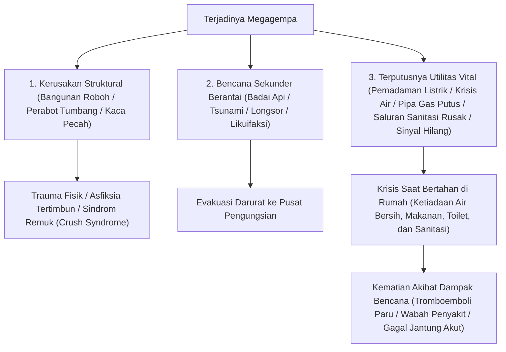
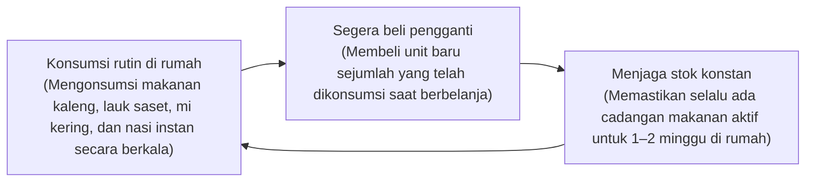
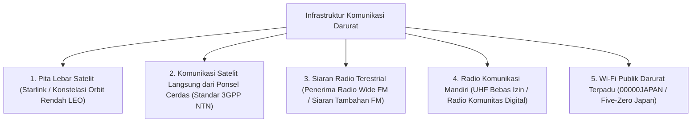

## Pendahuluan: Membangun "Rekayasa Kelangsungan Hidup" di Kepulauan Rawan Bencana Majemuk

Kepulauan Jepang, yang terletak di sepanjang Cincin Api Pasifik, hanya mencakup 0,25% dari total luas daratan bumi. Namun, di wilayah yang sempit ini terkonsentrasi sekitar 20% dari seluruh gempa bumi bermagnitudo 6 atau lebih di dunia, serta sekitar 7% dari gunung berapi aktif di bumi, menjadikannya salah satu kawasan dengan frekuensi dan densitas bencana alam tertinggi di dunia.

Memasuki abad ke-21, kenaikan suhu permukaan laut dan peningkatan kelembapan jenuh atmosfer akibat pemanasan global telah meruntuhkan model prediksi meteorologi linier konvensional. Curah hujan ekstrem akibat "pita hujan linier" stasioner, bencana banjir majemuk di mana luapan sungai dan kegagalan drainase perkotaan terjadi bersamaan, serta kepastian terjadinya bencana megadashyat berskala nasional — seperti Megagempa Palung Nankai (magnitudo 8–9), gempa langsung bawah wilayah metropolitan Tokyo, dan letusan eksplosif Gunung Fuji — meningkatkan ancaman kelumpuhan sistemik negara ke tingkat kritis.

Dalam situasi ekstrem seperti ini, "Bantuan Publik" (Kojo) dari pemerintah pusat dan daerah memiliki batas fisik yang nyata. Tepat setelah gempa besar terjadi, terputusnya jalan raya utama, menjalarnya kebakaran hebat yang tak terkendali, runtuhnya jaringan komunikasi, dan kerusakan struktural pada gedung-gedung pemerintahan itu sendiri menciptakan kekosongan bantuan: **"setidaknya 72 jam (3 hari), dan lebih dari 1 minggu di daerah yang hancur total"**, sebelum tim penyelamat resmi dan pasokan bantuan dapat menjangkau masing-masing rumah tangga.

Disiplin empiris untuk bertahan hidup secara mandiri selama masa kekosongan kritis ini serta melindungi nyawa keluarga dan komunitas adalah **"Rekayasa Mitigasi Bencana (Disaster Mitigation Engineering)"**, dan sarana fisiknya adalah **"Perlengkapan Bertahan Hidup Darurat (Emergency Survival Gear)"**. Perlengkapan darurat bukanlah penimbunan barang kebutuhan sehari-hari secara membabi buta. Perlengkapan ini merupakan sistem pendukung kehidupan portabel dan mandiri yang dirancang untuk menjaga homeostasis biokimia tubuh manusia dan sanitasi publik dalam lingkungan ekstrem ketika utilitas perkotaan — listrik, air bersih, gas, saluran pembuangan, dan telekomunikasi — terputus total.

Karya ilmiah ini memaparkan linimasa perkembangan bencana dan evaluasi risiko kuantitatif, doktrin perlengkapan modular tiga tahap (Fase 0, 1, dan 2), pendekatan biokimia dan rekayasa sanitasi untuk air, makanan, dan penanganan kotoran, sistem pembangkit energi mandiri, hingga protokol medis darurat untuk mencegah kematian tidak langsung akibat bencana di pusat pengungsian.

```
【Evolusi Fase Bencana dan Penerapan Fungsional Perlengkapan Darurat】

┌─────────────────┬───────────────────────────────┬───────────────────────────────┐
│ Fase            │ Skala Waktu & Situasi         │ Fungsi & Perlengkapan Wajib   │
├─────────────────┼───────────────────────────────┼───────────────────────────────┤
│ Fase 0          │ Rutinitas, bepergian, jalan   │ EDC Fase 0: Peluit sinyal,    │
│ (Saat Kejadian) │ (Lokasi tidak dapat diprediksi│ senter ringkas, kantong toilet│
│                 │                               │ darurat kimia, P3K pribadi    │
├─────────────────┼───────────────────────────────┼───────────────────────────────┤
│ Fase 1          │ Tepat pascabencana s.d. 24 jam│ Tas Siaga Bencana (Go-Bag):   │
│ (Evakuasi Awal) │ Evakuasi cepat dari reruntuhan│ Pelindung kepala, masker N95, │
│                 │ kebakaran, dan ancaman tsunami│ sepatu keselamatan, botol air │
├─────────────────┼───────────────────────────────┼───────────────────────────────┤
│ Fase 2          │ 24 jam s.d. 72 jam            │ Menunggu evakuasi / Berlindung│
│ (Daya Tahan     │ Terputusnya utilitas total &  │ di rumah: Kotak trauma medis, │
│ Kehidupan)      │ isolasi pemukiman warga       │ selimut termal, filter air    │
├─────────────────┼───────────────────────────────┼───────────────────────────────┤
│ Fase 3          │ 72 jam hingga lebih dari 1 mg │ Logistik Fase 2 (Rumah Tangga)│
│ (Pengungsian    │ Pengungsian berkepanjangan,   │ Stok makanan & air, generator │
│ Lanjutan)       │ menjaga sanitasi publik       │ listrik mandiri, sanitasi     │
└─────────────────┴───────────────────────────────┴───────────────────────────────┘
```

---

## 1. Mekanisme Bencana Majemuk dan Rekayasa Linimasa

Untuk merancang sistem pertahanan bencana yang tangguh, pertama-tama kita harus memahami secara presisi mekanisme fisik dari fenomena geologis serta proses runtuhnya infrastruktur perkotaan secara berantai.

### 1.1 Fisika Gerakan Seismik: Zona Subduksi Palung vs Sesar Aktif Dangkal Daratan
Gempa bumi yang merusak secara mendasar diklasifikasikan ke dalam dua kelompok berdasarkan mekanika patahannya:

1. **Gempa Bumi Zona Subduksi (Batas Lempeng Tektonik) (cth: Megagempa Palung Nankai, Gempa Besar Jepang Timur 2011)**:
   Terjadi di batas tempat lempeng samudra menunjam ke bawah lempeng benua. Karena bidang sesar membentang ratusan kilometer, durasi guncangan dahsyat berlangsung selama beberapa menit dan menyebabkan kehancuran di wilayah yang sangat luas. Pergeseran vertikal dasar laut secara mendadak memicu tsunami raksasa yang menerjang pantai dalam hitungan menit. Gempa ini juga memicu "gerakan tanah periode panjang" yang beresonansi merusak dengan gedung-gedung pencakar langit.
2. **Gempa Sesar Aktif Dangkal Daratan (Gempa Dangkal Langsung) (cth: Gempa Kobe 1995, Gempa Kumamoto 2016)**:
   Dipicu oleh pergeseran mendadak sesar aktif dangkal di kerak benua. Karena kedalaman hiposentrum yang sangat dangkal, jeda waktu antara getaran awal (gelombang P) dan gelombang geser perusak (gelombang S) — yaitu waktu S-P — hampir nol. Percepatan vertikal yang dahsyat dan gelombang pulsa frekuensi tinggi langsung menghantam bangunan di atasnya tanpa peringatan, seketika meratakan rumah kayu, merobohkan perabot berat, dan mematahkan jembatan serta jalan raya.



### 1.2 Letusan Gunung Berapi dan Dinamika Kelumpuhan Kota Akibat Hujan Abu Massal
Jepang memiliki 111 gunung berapi aktif. Letusan eksplosif skala besar dari Gunung Fuji, Asama, Aso, atau Sakurajima tidak hanya menimbulkan bahaya aliran lava dan awan panas lokal, melainkan menimbulkan **"Hujan Abu Vulkanik Skala Regional"**, yang melumpuhkan infrastruktur kota secara masif.

Abu vulkanik bukanlah abu pembakaran kayu yang lunak; abu ini terdiri dari **"serpihan kaca mikroskopis yang bersudut tajam, sangat abrasif, dan kristal mineral silikat (silika SiO₂)"**:
- **Kelumpuhan Jaringan Listrik**: Lapisan abu setebal beberapa milimeter saja akan menjadi konduktif secara elektrik saat dibasahi oleh air hujan, menyebabkan korsleting massal dan loncatan bunga api listrik pada isolator keramik tegangan tinggi, memicu pemadaman listrik total.
- **Kelumpuhan Sistem Transportasi**: Endapan beberapa milimeter di jalan raya menyebabkan kendaraan selip; debu abrasif menyumbat filter udara mesin pembakaran internal, mematikan mesin. Kereta api lumpuh karena hilangnya konduktivitas listrik antara roda baja dan rel. Bandara ditutup total karena partikel silika yang terisap ke dalam turbin jet meleleh menjadi kaca pada suhu tinggi, memadamkan mesin pesawat.
- **Penyumbatan Saluran Pembuangan**: Membuang abu vulkanik ke saluran pembuangan domestik akan menyebabkannya mengendap, memadat, dan mengeras seperti semen hidrolik, merusak sistem pipa bawah tanah secara permanen.
- **Cedera Pernapasan dan Mata**: Partikel berukuran di bawah 2,5 mikron menembus jauh ke dalam alveoli paru-paru, memicu serangan asma bronkial dan sindrom gangguan pernapasan akut, serta mengikis epitel kornea mata.

Oleh karena itu, perlengkapan perlindungan abu vulkanik harus mencakup respirator partikulat (standar N95/FFP2 atau lebih tinggi), kacamata pelindung tertutup rapat (goggles), jas hujan kedap air, dan lakban perekat kuat untuk menutup celah pintu dan jendela ruangan.

---

## 2. Rekayasa Desain Perlengkapan Berdasarkan Fase Operasional (Fase 0, 1, dan 2)

Penempatan dan konfigurasi pasokan bertahan hidup harus dimodularisasi secara ketat ke dalam tiga tingkatan, disesuaikan dengan radius mobilitas manusia dan perkembangan waktu pascabencana.

```
【Arsitektur Tiga Tingkat Modular Perlengkapan Bencana】

［Tingkat 0: EDC (Everyday Carry / Perlengkapan Harian)］
・Konteks: Dibawa setiap hari saat bekerja, bersekolah, atau bepergian (Batas berat: 300 hingga 500 gram).
・Tujuan: Bertahan melewati jam-jam kritis pertama sejak terjadinya bencana hingga berhasil pulang ke rumah atau mencapai posko evakuasi sementara.

［Tingkat 1: Tas Siaga Bencana (Emergency Go-Bag)］
・Konteks: Ditempatkan permanen di lorong pintu masuk rumah atau di samping tempat tidur (Berat: 10–15 kg untuk pria, 8–10 kg untuk wanita).
・Tujuan: Memungkinkan evakuasi kilat saat menghadapi ancaman roboh, kebakaran, atau tsunami; mempertahankan tanda vital selama 24 hingga 48 jam pertama.

［Tingkat 2: Pasokan Logistik Domestik di Rumah (Home Stockpile)］
・Konteks: Disimpan tersebar di lemari makanan, gudang, dan ruang penyimpanan rumah (Kapasitas untuk 7 hingga 14 hari).
・Tujuan: Mempertahankan kehidupan biologis dan batas higienis di dalam rumah saat utilitas perkotaan padam total.
```

### 2.1 Perlengkapan Fase 0 (EDC): Kantong Penyelamat dalam Keseharian
Masyarakat modern menghabiskan sebagian besar waktunya di luar rumah (gedung perkantoran, jaringan transportasi massal, pusat perbelanjaan). Menghadapi gempa bumi hebat saat beraktivitas di siang hari dapat berarti terjebak di dalam lift, tertahan di terowongan kereta bawah tanah yang gelap, atau harus berjalan kaki berjam-jam melewati reruntuhan kota.

```
【Daftar Muatan Wajib Kantong EDC Fase 0 (Berat Disarankan: ~400 g)】

1. Senter LED saku berdaya tinggi (Baterai AA/AAA atau isi ulang USB-C, >=100 lumen)
2. Peluit penyelamat darurat berfrekuensi tinggi (Desain tanpa bola dua ruang, >=100 dB, berfungsi saat basah)
3. Selimut termal darurat Mylar berlapisan aluminium (Memantulkan panas radiasi tubuh, penahan angin, tahan air)
4. Kantong sanitasi pembuangan darurat (Polimer superabsorben koagulan + kantong multi-lapis anti-bau: min. 2 paket)
5. Powerbank berkapasitas besar (5.000–10.000 mAh) + kabel pengisi daya multi-konektor tahan lama
6. Kotak P3K & obat pribadi (Plester luka, tisu antiseptik, analgesik/antipiretik, obat resep harian untuk 3 hari, masker N95 steril)
7. Uang tunai pecahan kecil (Uang kertas kecil dan koin: untuk telepon umum; sistem pembayaran digital mati saat listrik padam)
8. Kartu identitas medis darurat (Golongan darah, riwayat alergi obat, riwayat penyakit, dan kontak darurat keluarga)
```

### 2.2 Tas Siaga Bencana Fase 1 (Go-Bag): Rekayasa Berat Beban Evakuasi
Kesalahan paling fatal saat merancang tas siaga bencana adalah memasukkan terlalu banyak muatan hingga ransel kelewat berat dan pengguna tidak mampu berlari atau memanjat reruntuhan. Batas berat aman agar seseorang dapat bergerak lincah tanpa kelelahan ekstrem adalah **"sekitar 20% dari berat badan untuk pria dewasa (12–15 kg) dan sekitar 15% dari berat badan untuk wanita dewasa (7–10 kg)"**.

```
【Ergonomi Distribusi Beban Tas Siaga Bencana】

・Bagian atas menempel ke punggung: Barang-barang terberat (air minum, makanan kaleng, baterai daya)
  -> Mengangkat pusat massa mendekati tulang belakang, drastis mengurangi torsi beban pada pinggang.
・Bagian tengah hingga luar: Barang bermassa sedang (pakaian ganti, jas hujan, kotak trauma medis).
・Bagian bawah ransel: Barang bervolume besar namun ringan (kantong tidur ultralight, jaket fleece, handuk mikserat).
・Kantong luar dan kompartemen atas: Peralatan respons cepat (senter kepala, peluit, helm lipat, sarung tangan anti-potong).
```

Pemilihan alas kaki saat evakuasi adalah faktor penentu keselamatan hidup. Mencoba melarikan diri menggunakan sandal jepit atau sepatu kasual bersol tipis adalah kekeliruan fatal: pascagempa, jalanan akan dipenuhi pecahan kaca kawat, besi beton mencuat, dan paku berkarat yang berdiri. Menggunakan sepatu gunung semi-kaku dengan sol tengah tahan tembus berbahan pelat baja atau serat aramid, atau sepatu keselamatan bersertifikasi, merupakan syarat mutlak.

---

## 3. Penyediaan Air Minum dan Rekayasa Pemurnian Air

Tubuh manusia terdiri dari sekitar 60% air menurut beratnya. Meskipun metabolisme tubuh mampu menahan lapar tanpa makanan padat selama beberapa minggu, terhentinya asupan air secara total akan memicu dehidrasi seluler parah, syok hipovolemik, dan kegagalan multi-organ yang berujung kematian hanya dalam 3 hingga 5 hari.

### 3.1 Perhitungan Kuantitatif Kebutuhan Air Fisiologis
Berdasarkan pedoman kesehatan masyarakat dalam manajemen bencana, batas minimal volume air harian yang diperlukan untuk kelangsungan hidup fisiologis ditetapkan sebesar:

$$\text{Air Penunjang Kehidupan Wajib} = 3,0 \text{ liter / orang / hari}$$

Maka, perhitungan untuk sebuah keluarga beranggotakan 4 orang yang berlindung di rumah selama 1 minggu adalah:

$$3 \text{ L} \times 4 \text{ orang} \times 7 \text{ hari} = 84 \text{ liter}$$

Ini setara dengan empat puluh dua botol air kemasan 2 liter khusus untuk hidrasi metabolisme dasar. Jika ditambah dengan kebutuhan sekunder untuk melunakkan makanan instan, mencuci tangan, membersihkan luka, dan kebersihan gigi, volume air yang dibutuhkan akan membengkak drastis.

### 3.2 Pemurnian Air Berbasis Membran Serat Berongga (Hollow Fiber Membrane)
Ketika cadangan air botol habis, memiliki perangkat pemurni mikrofiltrasi portabel (seperti Sawyer Squeeze/Mini atau Katadyn BeFree) untuk menyulap air hujan, air sungai, air sumur, atau air cadangan bak mandi menjadi air yang aman secara bakteriologis menjadi batas pertahanan hidup utama.

```
【Mekanisme Pemisahan Kontaminan Melalui Membran Serat Berongga】

Air baku tercemar (Partikel lumpur suspensi, bakteri patogen, kista protozoa)
  ↓
［Membran berpori serat berongga: Ukuran pori nominal 0,1 mikron (100 nanometer)］
  │
  ├─ 【Kontaminan patogen yang ditahan dan disaring secara fisik】
  │   ・Protozoa parasit (Cryptosporidium: ~4–6 μm, Giardia: ~8–14 μm)
  │   ・Bakteri patogenik (Escherichia coli: ~0,5 × 2 μm, Kolera, Salmonella)
  │   ・Mikroplastik, lumpur koloid, partikel sedimen tersuspensi
  │
  └─ 【Molekul dan ion yang dapat menembus saringan】
      ・Molekul air murni (H₂O: diameter molekul ~0,3 nanometer)
      ・Mineral dan elektrolit terlarut yang bermanfaat (Na⁺, Ca²⁺, Mg²⁺)
  ↓
Air minum steril dan aman secara biologis
```

Kendati demikian, membran serat berongga memiliki batasan fisik tertentu: senyawa kimia terlarut (logam berat, pestisida sintetis, radionuklida) dan virus berskala nanometer (0,02 hingga 0,08 mikron seperti norovirus, rotavirus, atau virus hepatitis A) dapat lolos melalui pori 0,1 mikron. Oleh karena itu, jika menyaring air yang dicurigai terkontaminasi limbah tinja perkotaan, aturan baku kesehatan masyarakat mewajibkan kombinasi mikrofiltrasi dengan **perebusan mendidih bergolak minimal 1 menit** atau **desinfeksi kimiawi dengan tetesan natrium hipoklorit**.

---

## 4. Biokimia Ransum Darurat dan Teknologi Pengawetan Jangka Panjang

Asupan nutrisi saat bencana tidak hanya berfungsi mengisi kalori dasar tubuh, melainkan memainkan peran neurobiokimia vital untuk mempertahankan sistem kekebalan tubuh dan menjaga stabilitas mental di bawah tekanan psikologis yang ekstrem.

### 4.1 Beras Alfa: Kristalografi Pati antara Gelatinisasi dan Retrogradasi
Tulang punggung ransum pertahanan sipil modern, "Beras Alfa" (beras tergelatinisasi yang dikeringkan), merupakan mahakarya rekayasa kimia polimer pangan.

```
【Transformasi Kristalografi Pati dan Mekanisme Beras Alfa】

Pati mentah beras alami (Pati Beta / β-starch)
・Struktur kristal misel yang sangat padat. Molekul air tidak dapat menembus; enzim alfa-amilase pencernaan manusia tidak mampu menghidrolisis ikatan glikosidiknya.
  ↓ Pemasakan hidrotermal (Gelatinisasi / Reaksi Alfa)
Pati tergelatinisasi (Pati Alfa / α-starch)
・Energi termal memutuskan ikatan hidrogen, meruntuhkan kisi kristal menjadi hidrogel amorf yang mengembang, menyerap air, dan sangat mudah dicerna.
  ↓ (Jika mendingin secara alami, pati akan kehilangan air dan mengkristal kembali menjadi "pati teretrogradasi [β'-starch]" yang keras dan sukar dicerna)
［Rekayasa Dehidrasi Kilat Udara Panas Industri］
・Beras yang baru matang dalam kondisi alfa ditiup dengan udara kering bersuhu tinggi (80–100 °C atau lebih), seketika menurunkan kadar air di bawah 8–10%.
・Pengeringan instan ini menghentikan rekristalisasi molekuler, membekukan struktur matriks pori kondisi alfa secara permanen.
  ↓
Rehidrasi Melalui Daya Kapiler
・Dengan menuangkan air mendidih (15 menit) atau air dingin bersuhu ruang (60 menit), molekul air meresap ke dalam mikropori melalui aksi kapiler, mengembalikan kelembutan dan aroma nasi yang baru matang. Masa simpan: 5 hingga 7 tahun pada suhu ruangan.
```

### 4.2 Fisika Liofilisasi (Freeze-Drying / Pengeringan Beku Vakum)
Digunakan untuk mengawetkan sup bergizi, hidangan berprotein, dan sayuran, teknologi freeze-drying memanfaatkan **"Titik Tripel Air"** (0,01 °C pada tekanan 611,65 Pa) untuk menyublimasikan es di bawah kondisi vakum tinggi.

Bahan pangan dibekukan secara cepat pada suhu −30 °C hingga −50 °C, dimasukkan ke dalam ruang vakum kedap udara, dan tekanannya diturunkan di bawah titik tripel. Ketika energi panas sublimasi ringan diberikan, kristal es dalam jaringan sel berubah langsung menjadi uap tanpa melalui fase cair.

```
【Keunggulan Biofisik Pengeringan Beku Vakum (Freeze-Drying)】

1. Keutuhan struktur mikro seluler:
   Tanpa pemanasan tinggi, tidak terjadi denaturasi termal pada protein, dinding sel tetap utuh, dan vitamin yang peka terhadap panas (vitamin C dan kompleks B) tetap terjaga.
2. Penurunan massa yang sangat signifikan:
   Kadar air dikeluarkan sebanyak 95% hingga 98%, memangkas bobot menjadi sepersekian dari bobot segarnya sehingga meringankan beban ransel.
3. Kecepatan rehidrasi instan:
   Sublimasi kristal es meninggalkan rongga mikroskopis terbuka yang saling terhubung (struktur spons). Saat ditambahkan air, tegangan permukaan kapiler menyerap cairan dalam hitungan detik, mengembalikan tekstur dan aroma alaminya.
```

### 4.3 Dinamika Sistem Rolling Stock (Manajemen Stok Berputar Berkelanjutan)
Membeli berkotak-kotak ransum darurat asing yang tidak enak untuk disimpan selama lima tahun di sudut lemari sampai kedaluwarsa adalah paradigma lama yang terbukti gagal.
Standar logistik modern saat ini adalah **"Sistem Rolling Stock (Manajemen Inventaris Berputar Dinamis)"**.



Manfaat psikologis terbesar dari sistem Rolling Stock adalah **"tersedianya makanan akrab yang menenangkan (Comfort Foods) di tengah situasi krisis"**. Dalam tekanan pengungsian yang traumatis, dipaksa mengonsumsi biskuit darurat yang keras dan asing memicu hilangnya nafsu makan, gangguan pencernaan, dan keputusasaan mental. Mengintegrasikan bahan makanan lezat berdaya simpan lama ke dalam siklus konsumsi harian merupakan strategi ketahanan pangan yang paling kokoh.

---

## 5. Rekayasa Sanitasi dan Kelangsungan Hidup di Pengungsian (Infeksi, Ekskresi, dan Termoregulasi)

Analisis epidemiologis terhadap korban jiwa dalam gempa bumi besar memperlihatkan fakta yang mengerikan: pada Gempa Kobe (1995), Gempa Kumamoto (2016), dan Gempa Semenanjung Noto (2024), jumlah **"Kematian Akibat Dampak Bencana (Disaster-Related Deaths)"** — yaitu korban yang selamat dari guncangan gempa dan tsunami, namun meninggal dalam masa pengungsian yang keras — di beberapa wilayah melampaui jumlah korban tewas langsung.

Pemicu utama dari kematian tidak langsung ini bukanlah kelaparan, melainkan **"runtuhnya sistem sanitasi publik"** dan **"kelumpuhan infrastruktur pembuangan kotoran manusia"**.

### 5.1 Toilet Kimia Darurat dan Kimia Polimer Superabsorben (SAP)
Ketika pasokan air terputus, **menyiram toilet duduk dengan air seember sangat dilarang**. Jika pipa pembuangan di bawah tanah atau pipa tegak bangunan mengalami keretakan, menyiram kotoran dari lantai atas akan menyemburkan limbah tinja keluar dari toilet dan saluran pembuangan di lantai bawah, mengubah seluruh bangunan menjadi zona bahaya biologis.

Solusi teknis yang benar adalah memasang kantong penampung limbah kering langsung di atas kloset disertai bubuk koagulan. Senyawa teknologi kuncinya adalah **"Polimer Superabsorben (SAP: Natrium Poliakrilat Ikatan Silang)"**.

```
【Biokimia Pengikatan Limbah Cair Menggunakan Polimer SAP】

┌─────────────────────────────────────────────────────────────┐
│ Disosiasi gugus hidrofilik (-COONa):                        │
│ Begitu bersentuhan dengan cairan urine, ion natrium (Na⁺)   │
│ terdisosiasi, meninggalkan muatan karboksilat negatif       │
│ (-COO⁻) di sepanjang rantai polimer.                        │
│   ↓                                                         │
│ Pemuaian jaring molekul akibat tolak-menolak elektrostatik: │
│ Gaya tolak-menolak yang kuat antar-muatan negatif sejenis   │
│ memaksa jaring tiga dimensi yang terlipat rapat untuk       │
│ mengembang dan merenggang seketika.                         │
│   ↓                                                         │
│ Penyerapan osmotik masif & penguncian hidrogel permanen:    │
│ Konsentrasi ion internal yang tinggi menciptakan tekanan    │
│ osmotik luar biasa yang menyerap air ratusan hingga seribu  │
│ kali berat kering polimer, menguncinya menjadi hidrogel     │
│ padat yang tidak akan melepaskan cairan meski ditekan kuat. │
└─────────────────────────────────────────────────────────────┘
```

Koagulan berkualitas tinggi diperkaya dengan ion perak ($Ag^+$), senyawa klorin, dan tanin polifenol tumbuhan yang membunuh bakteri patogen usus serta menghentikan penguapan gas amonia ($NH_3$) dan hidrogen sulfida ($H_2S$) yang berbau busuk dan beracun.

#### Patofisiologi Menahan Buang Air Kecil dan "Sindrom Kelas Ekonomi"
Ketika toilet di pengungsian menjadi kotor, gelap, dan menjijikkan, para pengungsi (terutama lansia dan wanita) secara tidak sadar mengaktifkan mekanisme berbahaya: **membatasi minum air secara ekstrem agar tidak perlu buang air kecil**.

Dehidrasi sengaja ini menyebabkan pengentalan darah yang parah (hemokonsentrasi). Ditambah dengan posisi tubuh yang tidak bergerak saat tidur di dalam mobil sempit atau di lantai gedung yang keras, tekanan mekanis pada vena poplitea dan femoralis memicu terbentuknya trombosis vena dalam (DVT). Saat pengungsi berdiri mendadak, gumpalan darah tersebut terlepas dan menyumbat arteri pulmonalis, memicu emboli paru fatal ("Sindrom Kelas Ekonomi") dan kematian mendadak. Menyediakan toilet yang bersih, aman, dan bermartabat adalah tindakan medis penyelamatan nyawa yang fundamental.

### 5.2 Rekayasa Termal: Selimut Bertahan Hidup Mylar (PET Aluminisasi)
Hipotermia aksidental (penurunan suhu inti tubuh di bawah 35 °C) bukan hanya ancaman di musim dingin; kondisi ini dapat terjadi di tengah musim panas akibat terpaan angin kencang saat mengenakan pakaian basah kuyup oleh keringat atau air hujan.

Selimut darurat luar angkasa terbuat dari film polietilena tereftalat berorientasi biaksial (BoPET / Mylar) dengan ketebalan hanya 12 mikron, yang dilapisi uap logam aluminium murni di bawah ruang hampa udara tinggi.
Melalui efek pantulan cermin dari elektron bebas logam aluminium, **"selimut ini memantulkan lebih dari 90% radiasi inframerah jauh (panas radiasi tubuh)"** kembali ke tubuh pengguna. Secara bersamaan, lapisan kedap ini menghentikan hilangnya panas akibat konveksi angin dan pendinginan evaporatif, memberikan daya isolasi termal setara beberapa selimut wol tebal dengan bobot hanya 50 gram.

---

## 6. Pasokan Energi Mandiri dan Infrastruktur Komunikasi Berketahanan

Padamnya aliran listrik dan hilangnya sinyal seluler menjerumuskan para korban ke dalam kegelapan pekat, isolasi sosial, dan kepanikan akibat hoaks. Membangun rantai energi mandiri di luar jaringan (off-grid) dan mendiversifikasi saluran komunikasi darurat adalah prioritas pertahanan terdepan.

### 6.1 Keamanan dan Elektrokimia Baterai Litium Besi Fosfat (LiFePO₄)
Saat memilih pembangkit listrik portabel rumah tangga, kimia katode baterai adalah parameter keselamatan paling kritis. Terdapat perbedaan teknologi mendasar antara baterai litium-ion terner konvensional (NMC: Nikel-Mangan-Kobalt) dan sel modern **"Litium Besi Fosfat (LFP / $\text{LiFePO}_4$)"**.

```
【Perbandingan Fisikokimia: Baterai Terner (NMC) vs LiFePO₄】

┌──────────────────────┬───────────────────────────────┬───────────────────────────────┐
│ Parameter Evaluasi   │ Kimia Terner (NMC/NCA)        │ Litium Besi Fosfat (LiFePO₄)  │
├──────────────────────┼───────────────────────────────┼───────────────────────────────┤
│ Struktur Kristal     │ Struktur berlapis tidak stabil│ Struktur olivin (ikatan kovalen│
│                      │                               │ P-O yang sangat kokoh)        │
│ Suhu Thermal Runaway │ ~200 hingga 210 °C            │ ~400 hingga 500 °C            │
│                      │ (Ketidakstabilan termal dini) │ (Stabilitas termal ekstrem)   │
│ Pelepasan O₂ &       │ Melepaskan gas oksigen saat   │ Tidak melepaskan oksigen bebas│
│ Bahaya Ledakan/Api   │ overcharge atau tertusuk; api │ Tidak terbakar meledak bahkan │
│                      │ eksplosif tak terkendali      │ saat terjadi korsleting parah │
├──────────────────────┼───────────────────────────────┼───────────────────────────────┤
│ Siklus Masa Pakai    │ ~500 hingga 800 siklus        │ ~3.000 hingga 4.000 siklus    │
│                      │ (Penurunan kapasitas cepat)   │ (Masa pakai lebih dari 10 thn)│
│ Kepadatan Energi     │ Tinggi (Ringan dan kompak)    │ Moderat (Sedikit lebih berat) │
└──────────────────────┴───────────────────────────────┴───────────────────────────────┘
```

Untuk penanggulangan bencana, di mana baterai disimpan bertahun-tahun di dalam ruangan atau bagasi mobil yang panas, **ketahanan mutlak terhadap ledakan termal dan usia pakai satu dekade menjadikan stasiun daya portabel $\text{LiFePO}_4$ sebagai standar industri yang tak terbantahkan**.

### 6.2 Panel Surya Lipat dan Optimasi Pengontrol MPPT
Ketika pemadaman listrik berlangsung selama berminggu-minggu, stopkontak dinding tidak berguna. Pemanenan daya fotovoltaik menjadi keharusan mutlak.
Mengombinasikan panel surya silikon monokristalin lipat berefisiensi tinggi (konversi 22–24%+) dengan pengontrol pengisian daya berteknologi **MPPT (Maximum Power Point Tracking / Pelacakan Titik Daya Maksimum)** memastikan sistem melacak kurva voltase-arus optimal secara seketika, memeras daya listrik maksimal bahkan saat cuaca mendung atau sudut matahari rendah di pagi dan petang.

---

## 2.3 Penanganan Trauma Taktis (Trauma Care) dan Rekayasa Medis Torniket CAT

Dalam skenario reruntuhan bangunan akibat gempa, lontaran serpihan kaca tajam, dan hantaman puing tsunami, penyebab kematian paling cepat adalah **"pendarahan arteri aktif yang masif"**. Putusnya arteri femoralis atau brakialis dapat menguras sepertiga volume darah tubuh (sekitar 8% dari berat badan) hanya dalam hitungan menit. Menunggu ambulans di tengah kota yang lumpuh berarti mati karena syok hemoragik.

Dalam panduan Perawatan Korban Pertempuran Taktis (TCCC), standar emas mutlak untuk menghentikan pendarahan hebat pada anggota gerak yang gagal ditangani dengan balut tekan langsung adalah **"Torniket Aplikasi Tempur (CAT: Combat Application Tourniquet)"**.

```
【Anatomi Mekanis Torniket CAT dan Protokol Oklusi Arteri】

┌─────────────────────────────────────────────────────────────┐
│ Gesper friksi dan sabuk nilon berkekuatan tinggi:           │
│ Pasang 5 hingga 7 cm di atas luka (ke arah jantung).         │
│ (Jangan dipasang di atas persendian. Jika lokasi luka kabur │
│ dalam kekacauan, pasang di pangkal paling atas ekstremitas).│
│   ↓                                                         │
│ Putar batang penegang kaku (Windlass Rod):                  │
│ Putar batang polimer untuk mengencangkan sabuk internal guna│
│ memberikan tekanan melingkar merata yang menekan arteri     │
│ ke tulang. Putar hingga darah memancar berhenti total.      │
│   ↓                                                         │
│ Kunci di klip penahan & catat waktu pemasangan:             │
│ Kunci batang ke dalam klip penahan. Tulis waktu pemasangan  │
│ secara jelas pada tali pengaman putih dengan spidol permanen│
│ (batas toleransi iskemia jaringan: maksimal 2 jam).         │
└─────────────────────────────────────────────────────────────┘
```

Untuk luka robek dalam pada area pertemuan tubuh (selangkangan, ketiak, pangkal leher) yang tidak dapat dipasangi torniket, **"Kasa Hemostatik yang mengandung kaolin atau kitosan (seperti QuikClot)"** adalah penyelamat utama. Kaolin memicu aktivasi cepat Faktor XII dalam kaskade pembekuan darah; dengan memasukkan kasa secara padat ke dalam rongga luka dan menekan secara manual, sumbatan bekuan fibrin yang kokoh terbentuk dalam hitungan menit.

Selain itu, untuk menangani luka tembus di dada akibat tertusuk besi atau kaca ("pneumotoraks terbuka"), penggunaan **"Plester Dada Berventilasi (Vented Chest Seal)"** dengan katup satu arah memungkinkan keluarnya udara dan darah dari rongga pleura sambil mencegah udara luar masuk, menangkal kematian akibat gagal napas tension pneumothorax.

---

## 5.3 Standar Kemanusiaan Internasional: Proyek Sphere dan Rekayasa "TKB48"

Tolok ukur kemanusiaan global dalam penanganan pengungsi dirumuskan dalam **"Buku Panduan Sphere (The Sphere Project)"**, yang disusun bersama oleh LSM internasional dan Palang Merah Internasional. Praktik pengungsian konvensional (tidur berjejal di lantai gedung olahraga yang dingin, pembagian makanan dingin, toilet kimia kotor di luar gedung) melanggar standar hak asasi manusia dan membahayakan keselamatan jiwa.

Komunitas medis bencana Jepang mengusung protokol operasional **"TKB48 (Penyediaan Toilet, Dapur, dan Tempat Tidur dalam 48 Jam / Toilets, Kitchen, Bed)"**.

```
【Tiga Pilar Utama Sanitasi Publik Pengungsian: Standar TKB】

1. Ｔ (Toilet):
   ・Standar Sphere: Minimal 1 toilet per 20 orang pengungsi; rasio terpisah pria dan wanita 1:3 (mempertimbangkan waktu biologis wanita).
   ・Rekayasa Sanitasi: Penerangan malam permanen, fasilitas cuci tangan (air & sabun), partisi anti-cipratan, grendel pintu dalam yang aman.
   ・Target: Bebas bau, bebas gelap, bebas undakan lantai untuk mencegah penahanan buang air kecil.

2. Ｋ (Dapur Makanan Hangat / Kitchen):
   ・Penyediaan makanan hangat: Mengerahkan mobil dapur lapangan dan kompor LPG modular dalam 48 hingga 72 jam untuk membagikan sup panas bernutrisi.
   ・Manfaat fisiologis: Mencegah hipotermia, mengaktifkan gerak peristaltik pencernaan, dan meredakan lonjakan hormon stres akut.

3. Ｂ (Tempat Tidur / Bed):
   ・Penerapan tempat tidur kardus bergelombang untuk semua: Permukaan tempat tidur ditinggikan 30 hingga 40 cm dari lantai.
   ・Dampak klinis langsung:
     ① Memutus kehilangan panas tubuh akibat konduksi dengan lantai semen dingin, mencegah hipotermia dan infeksi saluran napas.
     ② Mengangkat zona pernapasan di atas lapisan 30 cm dari lantai tempat mengendapnya debu beracun dan aerosol norovirus.
     ③ Meringankan beban sendi lansia saat berdiri, mencegah atrofi otot dan trombosis vena dalam.
```

### Kebersihan Gigi-Mulut dan Pencegahan Pneumonia Aspirasi
Penyebab kematian tertinggi pada lansia di tempat pengungsian adalah **"Pneumonia Aspirasi"**.
Ketika air terputus, aktivitas menyikat gigi terhenti. Dalam 48 jam, bakteri anaerob di mulut berkembang biak secara masif. Saat tidur, mikroaspirasi air liur membawa jutaan bakteri patogen ini masuk ke saluran pernapasan dan paru-paru, memicu infeksi paru-paru akut yang mematikan.
Menyiapkan obat kumur cair tanpa bilas dan tisu basah khusus pembersih mulut di dalam tas darurat merupakan vaksin pencegahan infeksi yang sama efektifnya dengan terapi antibiotik.

---

## 6.3 Rekayasa Jaringan Telekomunikasi Redundan: Satelit, Radio, dan 00000JAPAN

Saat bencana berskala besar terjadi, menara pemancar seluler di darat langsung tumbang akibat kehabisan baterai cadangan, putusnya kabel serat optik bawah tanah, atau pembatasan akses jaringan (pembatasan hingga lebih dari 90% oleh operator untuk mengamankan jalur darurat). Menembus "kegelapan informasi" menuntut arsitektur komunikasi berlapis yang redundan.



### 1. Rekayasa Penerimaan Radio Wide FM (Siaran Tambahan FM)
Siaran radio AM gelombang menengah konvensional (526,5–1606,5 kHz), meskipun memiliki jangkauan gelombang tanah yang jauh, mengalami pelemahan sinyal drastis di dalam gedung beton bertulang dan rentan terhadap derau elektromagnetik perkotaan.
Sistem "Wide FM" (pita VHF 90,0–95,0 MHz) menyiarkan ulang siaran darurat AM melalui gelombang FM berkejernihan tinggi. Gelombang VHF mudah menembus dinding gedung beton dan kebal terhadap interferensi derau listrik, menjamin penerimaan peringatan dini gempa dan instruksi evakuasi secara jernih. Radio Wide FM bertenaga engkol dinamo tangan adalah instrumen pertahanan primer setiap keluarga.

### 2. Revolusi Satelit: Starlink dan SOS Satelit Ponsel Cerdas
Konstelasi satelit orbit rendah (LEO ~550 km) SpaceX "Starlink" telah merevolusi penanganan bencana. Cukup mengarahkan antena piringan ke langit terbuka, jaringan internet berkecepatan ratusan megabit per detik dengan latensi rendah langsung aktif di pusat kehancuran, seperti yang dibuktikan pada Gempa Semenanjung Noto 2024.

Di saat yang sama, ponsel cerdas modern telah mengintegrasikan cip jaringan non-terestrial (NTN) berbasis standar 3GPP Release 17/18. Sekalipun menara BTS di darat hancur total, ponsel dapat memancarkan sinyal langsung ke satelit di orbit untuk mengirim pesan darurat teks dan titik koordinat GPS presisi ke pusat operasi penyelamatan.

---

## 2.4 Kebakaran Perkotaan Masif, Pemadaman Awal, dan Rekayasa Pelarian Asap

Salah satu faktor pembunuh paling mematikan pascagempa bumi adalah **"Kebakaran Kota Simultan Skala Luas (Badai Api)"**. Di kawasan pemukiman padat kayu, pecahnya pipa gas, korsleting saat listrik menyala kembali, dan jatuhnya kompor minyak memicu ribuan titik api secara bersamaan, melumpuhkan total armada pemadam kebakaran.

### Kimia Tudung Pelindung Asap Darurat (Smoke Blocks)
Sekitar 60% korban tewas dalam kebakaran gedung bukan disebabkan oleh luka bakar langsung, melainkan akibat **"asfiksia dan menghirup gas pembakaran beracun (karbon monoksida dan hidrogen sianida)"**. Pembakaran material sintetis dan busa insulasi melepaskan hidrogen sianida ($HCN$) dan fosgen ($COCl_2$). Menempelkan handuk basah ke hidung tidak mampu menyaring gas karbon monoksida yang tidak larut dalam air serta jelaga beracun submikron.

Tudung pelindung asap bersertifikasi dilengkapi penutup kepala aluminisasi tahan api serta filter karbon aktif yang dipadukan dengan **"Katalis Hopcalite (senyawa tembaga-mangan oksida)"**. Pada suhu ruangan, hopcalite mengoksidasi gas mematikan karbon monoksida ($CO$) menjadi karbon dioksida ($CO_2$) yang tidak berbahaya, memberi waktu napas aman 10 hingga 15 menit untuk menuruni tangga yang pekat oleh asap beracun.

### Pemilihan Alat Pemadam Api Awal
- **Alat Pemadam Api Cairan Kimia Bertekanan (Loaded Stream)**: Berbeda dengan pemadam serbuk kimia kering (ABC) yang membutakan pandangan dan dapat memicu kebakaran ulang pada bara tersembunyi, pemadam cairan kimia menyemprotkan kabut larutan garam alkali. Cairan ini meresap ke serat kayu terdalam, memadamkan pembakaran secara tuntas tanpa mengaburkan pandangan di ruangan sempit.
- **Pemutus Arus Seismik Otomatis (Earthquake-sensing Breakers)**: Untuk mencegah kebakaran saat listrik PLN menyala kembali ke peralatan yang roboh, modul mekanis atau elektromagnetik ini otomatis mematikan sakelar utama listrik rumah saat mendeteksi getaran seismik berkekuatan intensitas 5-Atas.

---

## 1.3 Rekayasa Penjangkaran Antigempa Perabot Rumah dan Film Kaca Anti-Pecah
Data otopsi korban bencana di Kobe dan Noto menunjukkan bahwa lebih dari 80% kematian di dalam rumah diakibatkan oleh **"asfiksia mekanis dan benturan berat akibat runtuhnya bangunan dan jatuhnya perabot serta peralatan elektronik besar"**. Pada guncangan dahsyat skala intensitas 6-Atas hingga 7, lemari kayu besar, kulkas, dan rak buku berubah menjadi proyektil maut yang meremukkan penghuni dan menutup jalan keluar.

Mengamankan perabot rumah tangga membutuhkan metode rekayasa struktural yang terukur.

```
【Daya Tahan Mekanis dan Standar Pemasangan Pengunci Perabot】

┌──────────────────────┬───────────────────────────────┬───────────────────────────────┐
│ Jenis Perangkat Keras│ Prinsip Penahanan Mekanis     │ Aturan Pemasangan Mutlak      │
├──────────────────────┼───────────────────────────────┼───────────────────────────────┤
│ Braket Besi Siku "L" │ Disekrup langsung ke rangka   │ Memasang sekrup pada papan    │
│ Tugas Berat          │ pilar kayu atau baja dinding. │ gipsum saja tidak punya daya  │
│ (Standar Emas)       │ Menahan momen jungkir lewat   │ tahan. Wajib gunakan detektor │
│                      │ kekuatan geser dan tarik.     │ untuk menemukan pilar dinding.│
├──────────────────────┼───────────────────────────────┼───────────────────────────────┤
│ Batang Tekan Penyang-│ Memberikan gaya tekan vertikal│ Plafon tripleks tipis mudah   │
│ ga Teleskopik        │ antara perabot dan plafon; gel│ jebol tertekan. Wajib pasang  │
│ ＋ Bantalan Gel Getar│ viskoelastis di bagian dasar  │ papan kayu perata beban yang  │
│ (Sistem Hibrida)     │ menahan pergeseran maju.      │ luas di bawah batang dan gel. │
├──────────────────────┼───────────────────────────────┼───────────────────────────────┤
│ Tali Webbing Tenun   │ Tali nilon berkekuatan tinggi │ Kencangkan pelat ke pilar din-│
│ dan Kawat Baja       │ menahan perabot tinggi (kulkas│ ding untuk meredam inersia    │
│                      │ lewat deformasi elastis tali. │ melalui elastisitas tali.     │
└──────────────────────┴───────────────────────────────┴───────────────────────────────┘
```

### Kekuatan Tarik Film Pengaman Kaca (PET Multilapis)
Ketika kusen jendela terpelintir menjadi jajaran genjang akibat gaya geser gempa, kaca lembaran pecah meledak, menyemburkan serpihan setajam belati ke seluruh ruangan.
Memasang film poliester (PET) multilapis berketebalan 50 hingga 100 mikron pada sisi dalam kaca memastikan bahwa saat kaca pecah berkeping-keping, lem akrilik berkekuatan tinggi menahan seluruh pecahan kaca tetap melekat pada lapisan film, meniadakan risiko cedera teriris.

---

## 2.5 Dinamika Fluida dalam Bertahan Hidup Menghadapi Banjir dan Tanah Longsor

Banjir akibat badai topan dan jebolnya tanggul sungai menuntut sistem perlengkapan yang diatur oleh mekanika fluida, sangat berbeda dengan kebutuhan gempa bumi.

### 1. Sepatu Evakuasi: Mengapa "Sepatu Bot Karet Tinggi" Sangat Berbahaya
Menerjang genangan banjir perkotaan dengan memakai sepatu bot karet setinggi lutut adalah salah satu kesalahan paling mematikan dalam keselamatan air.
Saat air naik melebihi lutut (sekitar 40–50 cm), air banjir akan tumpah masuk ke dalam bot dari atas. Air yang terperangkap tidak dapat keluar, mengubah setiap sepatu menjadi beban seberat beberapa kilogram. Korban tidak mampu mengangkat kaki, terperosok ke dalam lubang gorong-gorong yang terbuka tertutup air keruh, dan tewas tenggelam.
Alas kaki evakuasi yang benar adalah **"sepatu kets bertali dengan lubang pembuangan air lancar ＋ kaus kaki tebal atau neoprena"**. Diikat kencang, sepatu tidak akan terlepas oleh arus air, tidak menampung beban air mati, dan memungkinkan langkah lincah di atas rintangan terendam.

### 2. Tekanan Hidrostatis dan Batas Ketidakmampuan Membuka Pintu
Ketika kendaraan atau lantai satu rumah mulai terendam air, gaya hidrostatis yang menahan pintu yang membuka ke arah luar dihitung dengan rumus mekanika fluida:

$$F = \rho g h A$$

Di mana $\rho$ adalah massa jenis air, $g$ adalah percepatan gravitasi, $h$ adalah kedalaman kolom air, dan $A$ adalah luas area pintu yang terendam.
Dengan ketinggian air di luar **hanya 40 hingga 50 cm saja**, gaya dorong pada pintu mencapai ratusan kilogram, sehingga mustahil bagi pria dewasa terkuat sekalipun untuk membuka pintu dengan mendorongnya dari dalam.
Oleh karena itu, sangat penting untuk segera melakukan evakuasi vertikal atau mengungsi lebih awal begitu peringatan Level 3 atau 4 diumumkan. Selain itu, setiap mobil wajib menyediakan **Palu Pemecah Kaca Darurat dengan Ujung Tungsten Karbida** di tempat yang mudah dijangkau untuk memecahkan kaca jendela samping jika pintu terkunci oleh tekanan air.

---

## 5.4 Rekayasa Perlindungan Khusus Kelompok Rentan (Bayi, Lansia, Penderita Kronis, Hewan Peliharaan)

Paket darurat komersial umumnya dirancang untuk profil orang dewasa sehat. Kenyataannya, pihak yang menghadapi kurva mortalitas tertinggi dalam bencana adalah kelompok rentan dengan kebutuhan fisiologis yang sangat spesifik.

```
【Protokol Perlengkapan Khusus untuk Kelompok Rentan】

┌──────────────────────┬───────────────────────────────┬───────────────────────────────┐
│ Kelompok Target      │ Risiko Spesifik               │ Perlengkapan Khusus Wajib     │
├──────────────────────┼───────────────────────────────┼───────────────────────────────┤
│ Bayi & Ibu Hamil     │ Tidak ada air panas untuk susu│ Susu formula cair steril siap │
│                      │ bubuk; dehidrasi akut; stres  │ minum (suhu ruang, dot pasang │
│                      │ akibat tangisan di pengungsian│ langsung), botol sekali pakai │
├──────────────────────┼───────────────────────────────┼───────────────────────────────┤
│ Lansia & Warga Butuh │ Tersedak berujung pneumonia;  │ Pengental makanan cair, bubur │
│ Pendampingan         │ gigi tiruan hilang; malnutri- │ instan lembut, kacamata ganti,│
│                      │ si; kesulitan ke toilet       │ baterai alat bantu dengar     │
├──────────────────────┼───────────────────────────────┼───────────────────────────────┤
│ Penderita Penyakit   │ Berhentinya cuci darah, suhu  │ Cadangan resep obat digital di│
│ Kronis               │ insulin rusak, hilangnya kon- │ cloud, aspirator dahak berten-│
│                      │ sentrator oksigen medis       │ aga baterai, kontak klinik    │
├──────────────────────┼───────────────────────────────┼───────────────────────────────┤
│ Hewan Peliharaan     │ Penolakan masuk di posko umum;│ Kandang jinjing lipat keras,  │
│ (Anjing, Kucing)     │ kabur panik; stres suara,     │ pakan & air untuk 10 hari,    │
│                      │ risiko zoonosis               │ identitas mikrocip, alas pup  │
└──────────────────────┴───────────────────────────────┴───────────────────────────────┘
```

Pemberian izin dan peredaran resmi susu formula cair bayi siap minum (yang tahan simpan pada suhu ruang tanpa perlu air panas atau botol steril) di Jepang sejak 2019 merupakan terobosan besar dalam mitigasi bencana. Di posko pengungsian yang porak-poranda, cukup membuka segel kemasan dan memasang dot steril bawaan, seorang bayi dapat langsung disusui tanpa jeda, menyelamatkan ribuan nyawa bayi.

---

### 7.1 Protokol Operasional Audit Bencana Rumah Tangga Berkala (Disaster Audit)

Perlengkapan darurat terlengkap sekalipun akan menjadi rongsokan tak berguna jika bahan habis pakai kedaluwarsa, baterai mati terkuras, atau komposisi keluarga berubah tanpa pengawasan.
Disarankan untuk menetapkan jadwal **"Audit Bencana Rumah Tangga"** dua kali setahun (misalnya pada tanggal **11 Maret** untuk mengenang Gempa Besar Jepang Timur dan **1 September** pada Hari Kesiapsiagaan Bencana Nasional):

1. **Pemeriksaan Stok Makanan dan Air Minum**: Periksa masa kedaluwarsa seluruh air kemasan dan makanan instan; konsumsi stok yang mendekati batas waktu dan ganti dengan stok baru melalui sistem Rolling Stock.
2. **Pemeliharaan Baterai Portabel**: Lakukan siklus pengosongan dan pengisian penuh pada stasiun daya litium dan powerbank untuk memeriksa laju pengosongan mandiri dan mengalibrasi BMS baterai.
3. **Pemeriksaan Bahan Kimia dan Medis**: Pastikan bubuk koagulan toilet tidak menggumpal akibat kelembapan, tisu pembersih alkohol tidak mengering, dan karet penyegel tidak getas.
4. **Simulasi Jalur Komunikasi Keluarga**: Latih kembali penggunaan pesan suara bencana darurat ("171") dan saluran aplikasi perpesanan secara luring.
5. **Pembaruan Peta Bahaya Bencana (Hazard Maps)**: Periksa revisi zonasi genangan banjir dan bahaya longsor terbaru dari pemerintah daerah, lalu lakukan simulasi berjalan kaki di siang hari menyusuri rute evakuasi menuju posko penampungan resmi.

---

## 7. Kesimpulan: Trinitas Kesiapan Mandiri, Gotong Royong, dan Bantuan Publik

Mempersiapkan sistem perlengkapan bencana bukanlah manifestasi dari penimbunan barang secara konsumtif. Ini adalah wujud kesadaran dalam memikul **"Tanggung Jawab Pribadi (Personal Responsibility)"** atas kelangsungan hidup diri sendiri dan keluarga tercinta: sebuah sikap hidup mulia yang berakar pada kecerdasan ilmiah dan rasa hormat yang mendalam kepada alam semesta.

Tembok pemecah ombak beton tertinggi maupun struktur peredam gempa tercanggih dapat hancur di hadapan kedahsyatan energi bumi. Ketika perlindungan fisik perkotaan tertembus, pembatas terakhir antara hidup dan mati adalah kualitas perlengkapan yang ada di tangan masing-masing dan kemahiran yang terlatih untuk menggunakannya di bawah tekanan.

Hanya ketika setiap individu berhasil menegakkan landasan kelangsungan hidupnya secara otonom (**Kesiapan Mandiri / "Jijo"**), ia memiliki sisa energi fisik dan ketenangan mental untuk menolong tetangga dan membangun jaringan pertahanan komunitas (**Gotong Royong / "Kyojo"**). Dan karena masyarakat mampu bertahan secara mandiri pada hari-hari awal yang genting, petugas pemadam kebakaran, kepolisian, tentara, dan tim bedah trauma dapat memusatkan 100% kapasitas mereka yang terbatas untuk menyelamatkan korban yang tertimbun reruntuhan dan warga desa yang terisolasi (**Memaksimalkan Bantuan Publik / "Kojo"**).

Merajut kesiapsiagaan menghadapi bencana secara tenang dan penuh disiplin ke dalam keheningan kehidupan sehari-hari adalah puncak kearifan tertinggi manusia, guna memastikan estafet kehidupan dan martabat peradaban terus berlanjut di planet kita yang dinamis ini.
