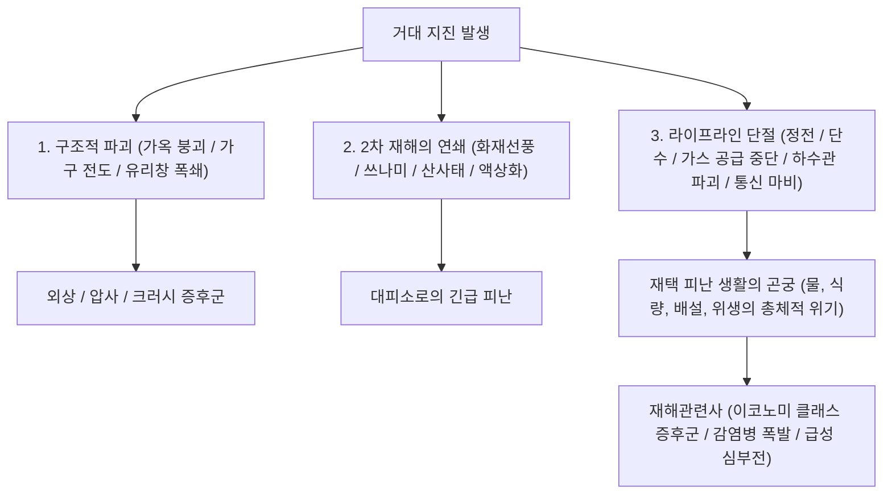
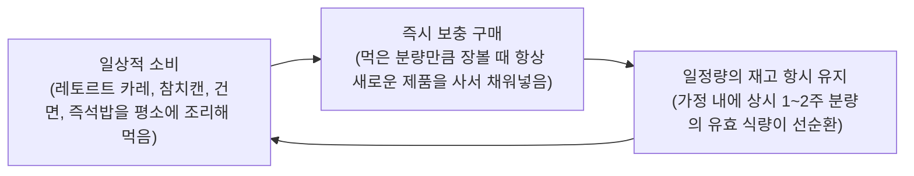
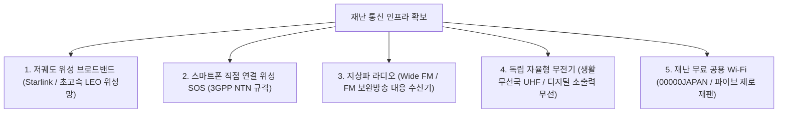

## 서론: 복합재해 열도에서의 '생존공학' 확립

환태평양 조산대(불의 고리)에 위치한 일본 열도는 전 세계 육지 면적의 단 0.25%에 불과하지만, 전 세계에서 발생하는 규모 6.0 이상의 거대 지진 중 약 20%, 활화산의 약 7%가 밀집된 세계 굴지의 자연재해 다발 지대이다.

더욱이 21세기에 접어들며 지구 온난화에 따른 해수면 온도 상승과 대기 중 포화수증기량의 폭발적 증가는 기존의 선형적 기상 예측 모델을 근본적으로 뒤흔드는 '선상강수대'에 의한 극한 호우, 하천 범람(외수 범람)과 도시 침수(내수 범람)가 겹치는 대규모 복합 수해를 빈발시키고 있다. 여기에 가까운 미래에 발생이 확실시되는 '난카이 트라프 거대지진(M8~9급)'과 '수도직하지진', '후지산 분화' 등 국가 기능의 마비를 초래할 '국난급 복합재해'의 절박성이 날로 고조되고 있다.

이러한 극한 상황에서 국가와 지자체에 의한 '공조(公助, 공적 지원)'에는 물리적 한계가 명백히 존재한다. 거대 지진 발생 직후에는 도로망 단절, 화재 연쇄 확산, 통신망 마비, 관공서 청사 자체의 붕괴 피해로 인해 공적 구조대와 구호물자가 개별 가구에 도달하기까지 **"최소 72시간(3일), 광역 괴멸 시에는 1주일 이상"**의 절대적인 공백기가 발생한다.

이 잔혹한 공백의 시간을 자력으로 생존하고, 가족과 지역사회의 생명을 방어하기 위한 실천적 학문 체계——그것이 바로 **'감재공학(Disaster Mitigation Engineering)'**이며, 그 물리적 수단이 **'방재 생존용품(Emergency Survival Gear)'**이다. 방재용품이란 단순한 생필품의 사재기가 아니다. 수도, 전기, 가스, 하수도, 통신이라는 현대 도시 인프라 공급이 완전히 차단된 극한 환경에서 인체의 생화학적 항상성(Homeostasis)과 공중보건을 자율적으로 유지하기 위한 '휴대용 생명 유지 시스템'이다.

본 논고에서는 재해 발생 타임라인과 정량적 리스크 평가를 시작으로, 0차·1차·2차 단계별 장비 운용론, 수분·식량·배설에 관한 생화학 및 위생공학적 접근, 비상용 독립 에너지 자립 시스템, 대피소 내 재해관련사 방지를 위한 임상의학적 프로토콜에 이르기까지 과학적 엄밀성을 바탕으로 그 전 체계를 완벽히 규명한다.

```
【재해의 단계적 진행과 방재용품의 기능 전개】

┌─────────────────┬───────────────────────────────┬───────────────────────────────┐
│ 단계 (Phase)    │ 시간축 및 상황                │ 요구되는 방재 기능 및 장비    │
├─────────────────┼───────────────────────────────┼───────────────────────────────┤
│ 페이즈 0        │ 일상·통근·외출·이동 중       │ 0차 휴대품(EDC): 호루라기,    │
│ (발재 순간)     │ (피재 장소의 예측 불가능성)   │ 소형 라이트, 휴대용 화장실 등 │
├─────────────────┼───────────────────────────────┼───────────────────────────────┤
│ 페이즈 1        │ 발재 직후 ~ 24시간            │ 1차 반출품(비상탈출배낭):      │
│ (초동·긴급탈출)│ 붕괴·화재·쓰나미로부터 긴급 탈출│ 머리 보호구, 방진마스크, 안전화│
├─────────────────┼───────────────────────────────┼───────────────────────────────┤
│ 페이즈 2        │ 24시간 ~ 72시간               │ 구조 대기·재택 대피 / 대피소: │
│ (생명유지구조기)│ 라이프라인 완전 차단 및 고립  │ 응급처치 외상키트, 보온알루미늄│
├─────────────────┼───────────────────────────────┼───────────────────────────────┤
│ 페이즈 3        │ 72시간 ~ 1주일 이상           │ 2차 비축품(재택 물류 로지스틱스)│
│ (대피생활지속기)│ 피난 생활의 장기화·공중보건 유지│ 비축 식량·식수, 독립전원, 위생│
└─────────────────┴───────────────────────────────┴───────────────────────────────┘
```

---

## 1. 복합재해의 메커니즘과 타임라인 공학

실효성 있는 방재 시스템을 구축하기 위해서는 먼저 직면해야 할 자연현상의 물리적 메커니즘과, 그것이 촉발하는 도시 인프라의 연쇄 붕괴 프로세스를 정밀하게 파악해야 한다.

### 1.1 지진동의 물리학: 해구형 vs 내륙 직하형
지진은 그 발생 단층 메커니즘에 따라 크게 두 가지 유형으로 분류된다.

1. **해구형(플레이트 경계형) 지진 (예: 난카이 트라프 거대지진, 2011 동일본 대지진)**:
   해양판이 대륙판 밑으로 섭입하는 경계부에서 발생한다. 단층 파열 영역이 수백 킬로미터에 달하므로 격렬한 지진동의 지속 시간이 수 분간 이어지며, 광범위한 지역에 괴멸적 파괴를 초래한다. 또한 해저 지각의 급격한 변위로 거대 쓰나미가 발생하여 수 분에서 수십 분 내에 해안가를 강타한다. 초고층 빌딩을 공진시켜 격렬하게 뒤흔드는 '장주기 지진동'을 유발한다.
2. **내륙 직하형(단층형) 지진 (예: 1995 고베 한신·아와지 대진재, 2016 구마모토 지진)**:
   내륙 지각 얕은 곳의 활단층이 급격히 어긋나며 발생한다. 진원이 얕기 때문에 초기 미동(P파)으로부터 파괴적인 주동(S파)에 도달하기까지의 유예시간(S-P 시간)이 거의 0에 가깝다. 강렬한 수직 가속도와 고주파 펄스형 충격파가 직하부를 강타하여 목조 가옥의 순식간 붕괴, 중대형 가구 전도, 도로 및 교량의 즉각적인 전단을 초래한다.



### 1.2 화산 분화와 광역 강재(降灰)의 도시 기능 정지 역학
일본에는 111개의 활화산이 존재하며 후지산, 아사마산, 아소산, 사쿠라지마 등의 대규모 분화는 국지적 용암류에 그치지 않고 **'광역 화산재 낙하'**라는 치명적인 도시 인프라 마비를 유발한다.

화산재는 부드러운 유기물 연소재(Ash)가 아니며, **'모서리가 극도로 날카로운 미세 유리 파편 및 규산염 광물 결정(실리카 SiO₂)'**이다.
- **송전망 정지**: 불과 수 밀리미터 두께의 화산재라도 빗물을 흡수하면 강한 도전성을 띠게 되어 고압 애자가 누전 및 섬락 단락되어 대규모 광역 정전이 발생한다.
- **교통망 마비**: 도로 위에 수 밀리미터만 쌓여도 차량 마찰력이 상실되어 슬립 사고가 빈발하며, 미세 규소 분진이 엔진 흡기 필터를 막아 차량이 멈춰 선다. 철도는 차륜과 레일 간 절연 불량으로 운행이 불가능해지며, 공항은 제트 엔진 흡기구에서 분진이 용융 유리화되어 엔진이 정지하므로 활주로가 전면 폐쇄된다.
- **하수도 폐쇄**: 주민들이 화산재를 물로 하수구에 흘려보낼 경우, 배관 내에서 콘크리트처럼 침전 및 경화되어 지하 하수관망을 영구적으로 물리 폐쇄시킨다.
- **인체 호흡기 및 안과 손상**: 2.5마이크론 이하의 미세입자가 폐포 깊숙이 침투하여 기관지 천식 및 급성 호흡부전을 유발하며, 각막 상피를 박리시킨다.

따라서 화산 방재용품으로는 특수 방진마스크(N95/KF94 등급 이상), 밀폐형 방진고글, 방수 비옷, 실내 기밀을 유지하기 위한 방재용 마스킹 테이프가 필수 장비다.

---

## 2. 단계별 방재용품의 설계공학 (0차·1차·2차)

방재용품의 배치와 구성은 인간의 행동 반경과 재해 발생 후의 시간 경과에 따라 엄격하게 3단계로 모듈화되어야 한다.

```
【방재용품 3단계 모듈형 아키텍처】

［0차 휴대품: EDC (Everyday Carry)］
・대상: 매일 출퇴근, 통학, 외출 시 상시 휴대 (중량: 300~500g 이내로 제한).
・목적: 외부에서 피재된 순간부터 귀가하거나 1차 대피 거점에 도달할 때까지의 초기 수 시간을 버텨냄.

［1차 반출품: 비상탈출배낭 (Emergency Go-Bag)］
・대상: 현관 입구나 침실 머리맡에 상시 거치하는 백팩 (중량: 성인 남성 10~15kg, 성인 여성 8~10kg 이내).
・목적: 가옥 붕괴, 대화재, 쓰나미의 엄습으로부터 즉각 탈출하여 대피소에서 초기 24~48시간 동안 생명을 보전함.

［2차 비축품: 재택 피난 로지스틱스 (Home Stockpile)］
・대상: 가정 내 팬트리, 수납장, 다용도실 등에 분산 비축 (7~14일분).
・목적: 도시 인프라가 전면 차단된 상태에서 익숙한 주택 내에서 공중보건을 유지하며 자급자족 생활을 완수함.
```

### 2.1 0차 휴대품 (EDC): 일상 속에 숨겨진 서바이벌 파우치
현대인은 하루의 대부분을 가정 외의 공간(오피스 빌딩, 지하철, 대형 상업시설)에서 보낸다. 일과 시간 중 거대 지진이 강타할 경우, 승강기 갇힘 사고, 지하철 터널 내 암흑 정차, 대중교통 마비로 인한 수 시간의 잔해 속 도보 귀가를 강요당하게 된다.

```
【0차 EDC 파우치 필수 페이로드 (권장 중량: 약 400g)】

1. 고휘도 소형 LED 플래시라이트 (AA/AAA 배터리 또는 USB-C 충전식, 100루멘 이상)
2. 구조요청용 고음 호루라기 (무구 구조 dual-chamber, 100dB 이상, 수분 침투 시에도 발음)
3. 휴대용 알루미늄 증착 보온 블랭킷 (체온 복사 보온, 방풍, 방수, 신호 반사, 사생활 차폐)
4. 휴대용 간이 배설봉투 (고분자 응고제 + 다층 방취 필름 봉투: 최소 2회분)
5. 대용량 보조배터리 (5,000~10,000mAh) + 내구성 멀티 충전 케이블
6. 상비의약품 및 위생키트 (밴드, 소독스왑, 진통해열제, 개인 만성질환약 3일분, 개별포장 KF94 마스크)
7. 비상 현금 (소액 지폐 및 100엔/동전: 공중전화 이용용. 정전 시 전자결제 및 ATM 완전 불통)
8. 비상 의료정보 ID 카드 (비상연락망, 혈액형, 알레르기, 기저질환 기록)
```

### 2.2 1차 반출품 (비상탈출배낭): 탈출용 백팩의 중량공학
1차 비상탈출배낭에서 발생하는 가장 치명적인 실패는 "불안감으로 인해 이것저것 무리하게 쑤셔 넣어 무게가 초과되어 배낭을 메고 달릴 수 없게 되는 것"이다. 인간이 잔해물과 단차를 신속하고 안전하게 극복할 수 있는 한계 중량은 **"성인 남성의 경우 체중의 약 20%(12~15kg), 성인 여성의 경우 체중의 약 15%(7~10kg)"**이다.

```
【1차 비상탈출배낭 패킹 역학】

・상부(등판 밀착부): 가장 무거운 물품 (음용수, 캔류, 배터리) -> 배낭의 무게중심을 높여 척추에 밀착시켜 하중 토크 경감.
・중앙부~외측: 중간 무게 물품 (여벌 의류, 우의, 응급처치 외상키트).
・하부: 가볍고 부피가 큰 물품 (초경량 침낭, 보온 플리스, 캠핑 타월).
・상단 헤드포켓 및 사이드 포켓: 비상 시 즉각 꺼내야 할 장구류 (라이트, 호루라기, 헬멧, 방진장갑).
```

피난 시의 신발 선택은 절대적인 생존 조건이다. 많은 이들이 당황하여 슬리퍼나 얇은 스니커즈를 신고 뛰쳐나가지만, 대지진 직후의 노면은 깨진 판유리, 날카로운 철근, 위로 솟은 녹슨 못으로 가득 차 있다. 바닥에 관통 방지 스테인리스 강판이나 아라미드 섬유 인솔이 삽입된 미드컷 트레킹화 또는 안전화 배치가 필수적이다.

---

## 3. 음용수 확보와 수질 정화 공학

인체 체중의 약 60%는 수분으로 이루어져 있다. 인간은 음식물 섭취가 차단되어도 수 주간 생존할 수 있으나, 수분 섭취가 전면 차단될 경우 단 3~5일 만에 탈수증으로 인한 저혈량성 쇼크와 다발성 장기 부전에 빠져 사망에 이른다.

### 3.1 생리적 필요 수량의 과학적 산출
공중보건 가이드라인에 따른 재난 시 1인당 최소 생리적 필요 수량은 다음과 같이 정의된다.

$$\text{생명유지 필요 수량} = 3.0 \text{ 리터 / 인 / 일}$$

따라서 4인 가구가 1주일간 재택 대피를 수행한다고 가정할 경우:

$$3 \text{ L} \times 4 \text{ 명} \times 7 \text{ 일} = 84 \text{ 리터}$$

라는 방대한 양의 음용수가 요구된다(2L 생수병 기준 42병). 여기에 조리용수, 세면, 손 씻기, 구강 케어 등 기초 생활용수를 합산하면 필요 수량은 폭발적으로 증가한다.

### 3.2 중공사막 필터(Hollow Fiber Membrane)의 정수 공학
비축된 생수가 소진되었을 때, 빗물, 하천수, 우물물, 욕조 저장수를 안전한 식수로 전환하기 위한 '휴대용 정수 필터(Sawyer, Katadyn 등)'는 절대적인 생명선이다.

```
【중공사막 필터의 수처리 미세 메커니즘】

원수 유입 (탁도 유발 미세 흙탕물, 병원성 박테리아, 원생동물 포낭 포함)
  ↓
［기공 크기(Pore Size) 0.1 마이크론(100 나노미터)의 다공성 중공사막］
  │
  ├─ 【물리적으로 완벽 차단·제거되는 물질】
  │   ・병원성 원생동물 (크립토스포리디움: 약 4~6μm, 지아디아: 약 8~14μm)
  │   ・병원성 세균 (대장균: 약 0.5×2μm, 콜레라균, 살모넬라, 장티푸스균)
  │   ・미세 부유 토사, 미세플라스틱
  │
  └─ 【통과하는 분자 및 이온】
      ・물 분자 (H₂O: 약 0.3 나노미터)
      ・용존 미네랄 전해질 성분 (Na⁺, Ca²⁺, Mg²⁺)
  ↓
무균화된 안전한 음용수 출수
```

단, 중공사막 필터에도 물리적 한계가 존재한다. 물에 완전히 용해된 화학물질(중금속, 농약 잔류물, 방사성 동위원소)이나 0.02~0.08마이크론 크기의 초미세 나노 바이러스(노로바이러스, 로타바이러스, A형 간염 바이러스 등)는 단층 중공사막을 통과할 수 있다. 따라서 분뇨 오염이 의심되는 하천수나 고인 물의 경우, 중공사막 여과 후 **'1분 이상의 활발한 가열 끓임'** 또는 **'식품첨가물 등급 차아염소산나트륨 미량 적하 소독'**을 병행하는 것이 공중보건학적 철칙이다.

---

## 4. 비상식량의 생화학과 장기 보존 기술

재해 시의 영양 섭취는 단순히 기초대사 칼로리를 충족시키는 것뿐만 아니라, 극심한 스트레스 환경에 처한 피재자의 면역력을 방어하고 신경생화학적 심리 안정을 지탱하는 핵심 역할을 수행한다.

### 4.1 알파화미: 전분의 호화와 노화 결정학
현대 비상식량의 핵심 주력을 이루는 '알파화미(Alpha-Rice)'는 전분의 미세 결정구조 전이를 제어한 식품 고분자 가공기술의 결정체다.

```
【전분의 미세 결정구조 변화와 알파화미 메커니즘】

생쌀의 천연 전분 (베타 전분 / β-starch)
・미셀 결정구조로 단단히 결합. 물 분자가 침투할 수 없으며, 인체 소화효소(아밀라아제)로 분해 불가.
  ↓ 열수 조리 가열 (취반 반응: 호화 / α화)
알파 전분 (α-starch)
・열에너지가 분자 간 수소결합을 절단하여 규칙적 결정격자가 붕괴되고 팽윤됨. 인체 소화흡수 용이.
  ↓ (일반적으로 상온 방치 시 수분을 잃고 다시 결정화되어 딱딱하고 소화 안 되는 '노화 전분(β' 전분)'으로 퇴행)
［산업용 초순간 열풍 건조 공학］
・갓 지어낸 완전 알파화 팽윤 상태의 밥을 80~100℃ 이상의 고속 건조 열풍에 노출시켜 수분 함량을 순식간에 8~10% 이하로 급속 탈수.
・전분 분자 격자의 재결정화를 완전히 차단하여 다공성 알파화 입체 구조를 그대로 동결 고정.
  ↓
주수(注水)에 의한 재수화 복원 메커니즘
・뜨거운 물을 부으면 약 15분(상온 냉수의 경우 약 60분) 만에 모세관 현상으로 물 분자가 미세 다공성 골격으로 급속 침투하여 갓 지은 밥맛으로 완벽 복원됨. 상온 보관 기준 유통기한 5~7년 보장.
```

### 4.2 동결건조(Freeze-Drying / 동결진공승화)의 물리학
국, 찌개, 고급 육류 반찬류 보존에 채택되는 동결건조 기술은 물의 상태도상 **'삼중점(Triple Point: 0.01℃, 611.65 Pa)'**을 이용한 승화 공학이다.

신선 식품을 영하 30℃~영하 50℃의 극저온으로 급속 동결시킨 후, 고진공 챔버에 투입하여 기압을 삼중점 이하로 감압한다. 이 감압 상태에서 미세한 승화열을 가하면, 식품 조직 내의 미세 얼음 결정은 액체 물을 거치지 않고 직접 수증기로 **'승화(Sublimation)'**되어 기화 탈수된다.

```
【동결건조(승화탈수) 공법의 압도적 우위성】

1. 세포 초미세 골격의 무손실 보존:
   고온 가열을 거치지 않으므로 단백질 열변성이 일어나지 않으며, 세포벽 파괴 없이 비타민 C 및 B군 등 열에 약한 영양소가 온전히 잔존.
2. 극한의 초경량화:
   식품 전체 수분의 95~98%가 완벽히 제거되므로 무게가 생물 상태의 수분의 일에서 십분의 일로 급감하여 배낭 휴대 부담을 획기적으로 줄임.
3. 초순간 재수화 특성:
   얼음 결정이 승화되어 빠져나간 자리가 미세한 스펀지 형태의 다공성 공극으로 그대로 남으므로, 물을 부으면 모세관 인력에 의해 수초 만에 수분이 중심부까지 침투하여 원래의 식감과 향미를 완벽히 재현.
```

### 4.3 롤링스톡(Rolling Stock System) 순환 비축법
"비싼 전투식량이나 비상식량 박스를 대량 구매해 창고 깊숙이 5년간 처박아 두었다가 유통기한이 지나 일괄 폐기하는" 구시대적 비축 방식은 현대 위기관리론에서 완전히 배제된다.
이를 대체하는 표준 프로토콜이 바로 **'롤링스톡(일상 순환 비축법)'**이다.



롤링스톡의 가장 지대한 신경정신의학적 이점은 **"재난 발생 시에도 평소 먹던 익숙한 맛(Comfort Food)을 섭취할 수 있다"**는 점이다. 극도의 대피 스트레스 환경에서 평소 접하지 않던 이질적이고 퍽퍽한 비상식량만을 강요받게 되면, 소아와 노약자를 중심으로 심각한 식욕부진과 소화기 장애, 급성 우울증이 유발된다. 일상의 연장선상에서 보존식을 회전시키는 것이 가장 지속 가능하고 강인한 비축 전략이다.

---

## 5. 위생공학 및 대피소 서바이벌 (감염병·배설·체온 관리)

역대 대지진의 희생자 통계를 역학적으로 분석하면 경악스러운 진실이 드러난다. 1995년 한신·아와지 대진재, 2016년 구마모토 지진, 2024년 노토반도 지진에서 가옥 붕괴나 쓰나미에 의한 직접사를 모면했음에도 불구하고, 이후 열악한 대피 생활 속에서 질병으로 사망한 **'재해관련사(Disaster-Related Deaths)'**의 숫자가 직접 사망자 수를 능가한 지자체들이 다수 존재했다.

재해관련사를 촉발하는 제1의 원인은 굶주림이 아니라 **'공중보건의 붕괴'**와 **'배설 인프라의 마비'**이다.

### 5.1 비상용 간이화장실과 고분자 흡수 폴리머(SAP)의 화학
단수 상태에서 수세식 양변기에 물을 양동이로 퍼붓는 행위는 절대 엄금이다. 지하 배수관이나 건물 오수 입관이 파손되어 있을 경우, 상층부에서 오수를 흘려보내면 저층 세대의 변기나 배수구로 분뇨가 역류 뿜어져 나와 건물 전체가 심각한 생물학적 오염 지대로 변질된다.

단수 시 필수적인 장비는 양변기에 특수 비닐봉투를 씌워 사용하는 '응고제형 비상 간이화장실'이다. 그 핵심 원천 소재가 바로 **'고분자 흡수 폴리머(SAP: 가교 폴리아크릴산 나트륨)'**이다.

```
【고분자 흡수 폴리머(SAP)의 분뇨 봉쇄 생화학 메커니즘】

┌─────────────────────────────────────────────────────────────┐
│ 친수성 카르복실기(-COONa)의 이온화 반응:                    │
│ 건조 폴리머에 요분이 접촉하는 순간, 나트륨 이온(Na⁺)이 해리 │
│ 되어 확산되며 고분자 사슬 골격에 음전하(-COO⁻)가 고밀도로   │
│ 형성된다.                                                   │
│   ↓                                                         │
│ 정전기적 동극 반발력에 의한 3차원 분자망의 폭발적 팽창:     │
│ 음전하 상호 간의 강력한 척력으로 인해 단단히 뭉쳐 있던 3차원│
│ 가교 그물망 구조가 순식간에 사방으로 크게 풀리며 확장된다. │
│   ↓                                                         │
│ 삼투압 구동에 의한 초대량 흡수 및 비가역적 하이드로겔 고정: │
│ 망 내부의 높은 이온 농도로 인해 강력한 삼투압 흡인력이 발생 │
│ 하여, 자중의 수백 배에서 천 배에 달하는 수분을 순식간에 흡 │
│ 수해 단단한 겔(Gel)로 고정한다 (외압을 가해도 수분 재용출 안 됨).│
└─────────────────────────────────────────────────────────────┘
```

우수한 품질의 응고제에는 폴리머 외에도 은이온($Ag^+$), 차아염소산염, 식물 추출 탄닌 폴리페놀 등 강력한 살균·소취 성분이 배합되어 대장균 증식을 박멸하고 암모니아($NH_3$) 및 황화수소($H_2S$) 가스의 휘발을 화학적으로 완벽 차단한다.

#### 배뇨 참기의 병태생리학과 '이코노미 클래스 증후군'
대피소 화장실이 악취와 분뇨로 뒤덮이고 암흑 상태가 되면, 피재자(특히 고령자와 여성)는 화장실 방문 횟수를 줄이기 위해 무의식적으로 **수분 섭취를 극단적으로 제한**하기 시작한다.

수분을 차단하면 혈액 점도가 급격히 상승(혈액 농축)한다. 여기에 비좁은 차량 내부 차박이나 차가운 체육관 바닥의 웅크린 자세로 하지 슬와정맥 및 대퇴정맥이 지속 압박되면 하지 깊은 곳 정맥에 혈전이 생성되는 심부정맥혈전증(DVT)이 유발된다. 그 상태에서 갑자기 일어나는 순간, 혈관벽에서 떨어져 나온 혈전이 혈류를 타고 폐동맥 본간을 막아 급성 호흡곤란과 심장마비를 일으키는 '폐색전증(이코노미 클래스 증후군)'으로 급사하게 된다. 청결하고 안전한 화장실 확보는 단순한 편의의 문제가 아니라 직결된 '인명 구조 의료 행위'이다.

### 5.2 열역학적 보온공학: 알루미늄 증착 PET 마일러 블랭킷
저체온증(인체 심부 체온이 35℃ 이하로 떨어지는 상태)은 혹한기 겨울뿐만 아니라, 땀이나 비에 젖은 옷을 입은 채 바람에 노출되면 한여름이라도 급격히 발생한다.

응급 서바이벌 우주 블랭킷은 두께가 불과 12마이크론에 불과한 폴리에틸렌 테레프탈레이트(BoPET) 필름 표면에 초고진공 상태에서 고순도 금속 알루미늄 증기를 균일 증착시킨 하이테크 소재다.
알루미늄 자유전자의 거울 반사 효과에 의해 **"인체에서 방출되는 원적외선 체온 복사열의 90% 이상을 반사"**하여 체내로 되돌린다. 동시에 차가운 외기의 대류를 원천 차단하고 수분 증발에 따른 기화열 손실을 막아내어, 불과 50g의 무게로 두꺼운 모포 여러 장에 필적하는 경이적인 보온 단열 성능을 발휘한다.

---

## 6. 비상용 독립 전원 및 통신 인프라 자립 공학

전력 차단과 디지털 통신의 두절은 피재자를 칠흑 같은 암흑과 고립, 그리고 유언비어가 난무하는 패닉 상태로 밀어 넣는다. 현대 방재 시스템에서 자립형 에너지원과 다중 통신 리던던시(Redundancy) 구축은 최우선 방어선이다.

### 6.1 인산철 리튬 이온 배터리(LiFePO₄)의 안전성과 전기화학
가정용 대용량 휴대용 파워뱅크(파워스테이션)를 선택할 때 가장 핵심적인 판단 기준은 배터리 셀의 양극재 화학 조성이다. 기존의 삼원계 리튬이온 배터리(NMC: 니켈·망간·코발트)와 첨단 **'인산철 리튬 배터리(LFP / $\text{LiFePO}_4$)'** 사이에는 결정적인 안전 격차가 존재한다.

```
【삼원계(NMC)와 인산철계(LiFePO₄) 물성 전기화학 비교】

┌──────────────────────┬───────────────────────────────┬───────────────────────────────┐
│ 비교 평가 항목       │ 삼원계 리튬 배터리 (NMC/NCA) │ 인산철 리튬 배터리 (LiFePO₄) │
├──────────────────────┼───────────────────────────────┼───────────────────────────────┤
│ 결정 구조            │ 층상 암염 구조 (열적 불안정)  │ 올리빈 결정 구조 (강한 P-O 공유│
│                      │                               │ 결합 골격)                    │
│ 열폭주 임계 온도     │ 약 200~210 ℃ (쉽게 촉발됨)   │ 약 400~500 ℃ (극도로 높은 안정│
│ 산소 방출 및 발화성  │ 과충전·못 관통 시 산소 가스  │ 견고한 결합으로 산소를 방출하 │
│                      │ 방출로 폭발적 연쇄 화재 유발  │ 지 않으며 단락 시에도 발화 안 됨│
├──────────────────────┼───────────────────────────────┼───────────────────────────────┤
│ 충방전 사이클 수명   │ 약 500~800 회 (빠른 성능 저하)│ 약 3,000~4,000 회 (10년 이상   │
│                      │                               │ 장기 운용 가능)               │
│ 에너지 밀도          │ 높음 (작고 가벼움)            │ 중간 수준 (부피와 무게 다소 큼)│
└──────────────────────┴───────────────────────────────┴───────────────────────────────┘
```

방재 용도로는 차량 트렁크나 실내 밀폐 공간에 장기간 보관해야 하므로, **열폭주 위험이 원천 배제되고 10년 이상의 수명을 자랑하는 인산철 리튬(LiFePO₄) 파워스테이션이 확고부동한 글로벌 표준**으로 자리 잡았다.

### 6.2 휴대용 태양광 패널과 MPPT 제어의 최적화
장기 정전 시 벽면 콘센트 전력 공급은 불가능하다. 지속 가능한 태양광 발전(PV) 결합이 필수적이다.
광전 변환 효율 22~24% 이상의 고품질 단결정 실리콘 접이식 패널과, 일사 조건 변동에 맞춰 항상 최대 출력점을 실시간 추적하는 **'MPPT(Maximum Power Point Tracking / 최대 전력점 추종)'** 충전 컨트롤러를 조합하면 흐린 날이나 일출·일몰 직후의 미약한 광량에서도 전력을 효율적으로 수거할 수 있다.

---

## 2.3 중증 외상 응급의료(Trauma Care)와 전술 지혈대(CAT)의 의공학

대지진 시 가옥 붕괴, 날카로운 유리 파편 폭쇄, 쓰나미 부유물 충돌로 인한 외상에서 즉각적으로 사망을 초래하는 최대 요인은 **'활동성 동맥 대출혈'**이다. 대퇴동맥이나 상완동맥이 파열될 경우, 인체 혈액량(체중의 약 8%)의 3분의 1 이상이 유실되는 데 걸리는 시간은 불과 수 분에 불과하다. 구급차가 마비된 대형 재난 현장에서 구급차를 기다리는 것은 곧 출혈성 쇼크사로 직결된다.

현대 전술 외상 처치(TCCC) 가이드라인에서 일반적인 직접 압박 지혈법으로 통제 불가능한 사지 대출혈에 대한 절대적 골드 스탠다드는 **'CAT 전술 지혈대(Combat Application Tourniquet)'**이다.

```
【CAT 전술 지혈대 구조 및 동맥 폐색 프로토콜】

┌─────────────────────────────────────────────────────────────┐
│ 버클 및 고장력 나일론 밴드 장착:                            │
│ 상처 부위보다 심장에 가까운 근심부 쪽으로 5~7cm 상단에 착용. │
│ (관절 부위 직접 거치 엄금. 출혈 부위가 불명확할 경우 사지 근부│
│ 최상단에 장착).                                             │
│   ↓                                                         │
│ 윈들러스(조임 막대 / Windlass) 회전 가압:                   │
│ 막대를 회전시켜 내부 원주 밴드를 조여 뼈를 향해 동맥압을 능가│
│ 하는 균일 압박을 가함. 박동성 출혈이 완전히 멈출 때까지 회전.│
│   ↓                                                         │
│ 고정 클립 잠금 및 '지혈 시각 기록':                         │
│ 조임 막대를 클립에 걸어 고정하고, 화이트 타임 스트랩에 매직으│
│ 로 정확한 장착 시각을 기재함 (허혈 한계 시간은 최대 2시간 이내).│
└─────────────────────────────────────────────────────────────┘
```

사타구니, 겨드랑이 등 지혈대를 감을 수 없는 체간 접합부 깊은 자상에는 고활성 알루미노규산염 점토 광물(카올린 Kaolin)이나 키토산이 함침된 **'지혈 거즈(QuikClot 거즈 등)'**가 유일한 대안이다. 카올린은 혈액 내 응고 제XII인자를 폭발적으로 활성화시켜 상처 내부에 깊숙이 쑤셔 넣는 패킹만으로 수 분 내에 단단한 피브린 혈전을 형성해 지혈을 완료한다.

아울러 깨진 유리나 철근이 흉벽을 관통하여 발생하는 '개방성 기흉(외기가 흉강으로 빨려 들어가 폐를 허탈시키는 치명상)'을 막기 위해, 일방통행 체크밸브가 장착된 **'흉부 밀폐 패치(Vented Chest Seal)'**는 긴장성 기흉에 의한 질식사를 막아주는 최상급 생존 장비다.

---

## 5.3 대피소 생활의 국제 인도주의 기준: 스피어 프로젝트와 'TKB48' 공중보건공학

재해관련사를 예방하기 위한 국제 가이드라인으로서 세계 각국의 NGO와 적십자가 공동 제정한 인도적 지원 최소 기준이 바로 **'스피어 핸드북(Sphere Handbook)'**이다. 차가운 체육관 바닥에 돗자리를 깔고 집단 숙식하며, 차가운 주먹밥을 배급받고, 비위생적인 이동식 화장실에 줄을 서는 과거의 피난소 환경은 국제 인권 기준에서 볼 때 명백히 생명을 위협하는 수준이다.

이에 일본 재난의학계가 강력히 주창하여 확립된 환경 개선 슬로건이 바로 **'TKB48 (발재 후 48시간 이내 화장실·주방·침대 구축 / Toilets, Kitchen, Bed)'**이다.

```
【대피소 공중보건 3대 핵심 요소: TKB 공학 기준】

1. Ｔ (화장실 / Toilet):
   ・스피어 기준: 피난민 20명당 최소 1기 화장실 배정; 남녀 비율 1:3 확보 (여성의 배설 소요 시간 반영).
   ・위생 설계: 조명 설비, 손 씻기 시설(물과 비누), 비산 방지 가림막, 내부 잠금장치 완비.
   ・목표: 악취 제로, 암흑 제로, 문턱 단차 제로를 통해 배뇨 참기 행위를 근절.

2. Ｋ (주방 온식 공급 / Kitchen):
   ・따뜻한 식사 제공: 발재 후 48~72시간 이내에 이동식 밥차 및 LPG 조리 설비를 투입해 따뜻한 국물과 영양 균형 잡힌 온식 배급.
   ・생리적 효과: 저체온증 차단, 위장관 운동 활성화, 극도의 스트레스 호르몬 분비 완화.

3. Ｂ (침대 보급 / Bed):
   ・골판지 침대(Cardboard Bed) 전원 도입: 바닥으로부터 높이 30~40cm 확보.
   ・의학적 방어 효과:
     ① 차가운 바닥 면으로부터의 전도열 손실을 차단하여 저체온증과 호흡기 감염병 예방.
     ② 바닥 위 30cm 이내에 부유하는 미세 잔해 먼지, 석면, 노로바이러스 에어로졸 흡입 회피.
     ③ 앉고 일어설 때의 무릎·허리 관절 부하를 경감시켜 고령자의 폐용증후군 및 DVT 혈전증 차단.
```

### 구강 위생 케어와 흡인성 폐렴의 차단
대피소 내 노약자 사망 원인 중 가장 높은 비중을 차지하는 질환이 바로 **'흡인성 폐렴(Aspiration Pneumonia)'**이다.
단수로 인해 칫솔질을 거르면 입안의 혐기성 유해 세균이 폭발적으로 증식한다. 수면 중 인두 반사가 둔화된 상태에서 침과 함께 이 세균들이 기도로 소량 흘러 들어가 급성 중증 폐렴을 유발한다.
따라서 방재 배낭 속에 물 없이 사용하는 '액체 치약(마우스워시)'이나 '구강 케어용 구강 청결 티슈'를 챙기는 것은 대량의 항생제를 투여하기 전 가장 강력한 생명 방어 백신이 된다.

---

## 6.3 다중화된 통신 네트워크 공학: 저궤도 위성·무선·00000JAPAN

재난 발생 시 기간통신사 기지국은 정전, 지중 광케이블 절단, 안부 확인 트래픽 폭주(통화량 90% 이상 강제 규제)로 즉각 마비된다. 치명적인 '정보 블랙아웃'을 극복하기 위해서는 다층적 통신 리던던시가 필수적이다.



### 1. 와이드 FM(FM 보완방송) 라디오의 수신 공학
기존 중파 AM 라디오(526.5~1606.5 kHz)는 장거리 지표파 전파에는 유리하나, 철근 콘크리트 아파트 내부에서는 전파가 급격히 감쇄되며, 인버터나 충전기 스위칭 노이즈에 매우 취약하다.
'와이드 FM(VHF 90.0~95.0 MHz 대역)'은 AM 재난 방송을 고음질 FM 전파로 동시 재송출하는 시스템이다. 콘크리트 빌딩 투과성이 우수하고 전자 노이즈의 간섭을 받지 않아 긴급지진속보와 피난 지시를 선명하게 청취할 수 있다. 수동 다이내모 자가발전 기능이 내장된 와이드 FM 라디오는 가정의 필수 1차 방어선이다.

### 2. 위성통신의 혁명: Starlink와 스마트폰 직접 위성 연결 SOS
스페이스X의 '스타링크(Starlink)'는 고도 약 550km의 저궤도(LEO)에 수천 기의 소형 위성을 배치하여, 지상 인프라가 전소된 극단적 재해 지역에서도 소형 안테나를 하늘로 향하기만 하면 수백 Mbps의 광대역 인터넷을 즉각 개통한다. 2024년 노토반도 지진에서도 지자체와 대피소의 기간 통신망으로 혁혁한 위력을 입증했다.

동시에 최신 스마트폰(아이폰 14 이후 등)에는 3GPP Release 17/18 표준에 기반한 '비지상파 네트워크(NTN: Non-Terrestrial Network)' 칩셋이 탑재되어, 지상 기지국 전파가 완전히 두절된 조난 상황에서도 하늘 위의 위성과 직접 통신하여 긴급 조난 텍스트와 정밀 GPS 좌표를 구조 당국에 즉각 타전할 수 있게 되었다.

---

## 2.4 도시 대화재와 초기 소화·방연 탈출 공학

지진 직후 발생하는 최악의 살상 요인 중 하나는 동시다발적으로 번지는 **'다발 화재(화재선풍 / Firestorms)'**이다. 밀집 목조 시가지에서는 도시가스 배관 균열, 전력 복구 시의 '통전 화재', 난로 전도로 인해 수천 곳에서 동시 발화가 일어나며, 소방서의 진압 능력을 완전히 초과한다.

### 방연 마스크(스모크 블록)의 화학 메커니즘
화재 현장 사망자의 약 60%는 화상이 아니라 **'유독가스 흡입에 의한 질식사(일산화탄소 및 시안화수소)'**이다. 건축 자재와 우레탄 단열재가 불완전 연소할 때 맹독성 시안화수소($HCN$)와 일산화탄소($CO$)가 다량 뿜어져 나온다. 젖은 수건으로 입을 가리는 민간요법은 물에 녹지 않는 일산화탄소와 초미세 독성 그을음을 전혀 차단하지 못한다.

고성능 방연 후드(스모크 블록)는 내열 알루미늄 후드 내부에 다공성 활성탄과 **'홉칼라이트 촉매(Hopcalite: 구리-망간 복합 산화물)'**를 장착하고 있다. 상온에서 유독한 일산화탄소($CO$)를 무해한 이산화탄소($CO_2$)로 촉매 산화시켜, 유독 연기가 꽉 찬 암흑의 계단실을 10~15분간 안전하게 돌파할 수 있는 호흡 생명선을 보장한다.

### 초기 소화기구의 올바른 선정
- **주택용 강화액 소화기**: 분사 시 시야를 가리는 분말 가루가 날리고 재발화 위험이 있는 분말(ABC) 소화기와 달리, 알칼리 금속염 수용액을 안개 형태로 방사한다. 목재 심부까지 깊숙이 침투하여 냉각 소화 및 재발화를 원천 차단하며, 좁은 실내에서도 시야 차단 없이 초동 진화가 가능하다.
- **감진 차단기(Earthquake-sensing Breaker)**: 거대 지진 후 송전선 복구 시 쓰러진 전열기구에 전기가 다시 흐르며 발생하는 '통전 화재'를 막기 위해, 진도 5강 이상의 강한 진동을 감지하여 메인 누전차단기를 자동으로 물리 차단하는 장치다.

---

## 1.3 실내 공간 내진 고정 공학: 가구 전도 방지와 유리 비산 방지 물리학
고베 지진과 노토 지진 피해자 부검 결과, 실내 사망 원인의 80% 이상이 '가옥 붕괴 및 무거운 가구·가전제품 전도에 의한 압사 및 질식사'였다. 진도 6강~7의 격진 하에서 수십~수백 킬로그램의 옷장, 냉장고, 피아노, 책장은 치명적인 운동에너지를 가진 흉기로 돌변하여 탈출로를 완전히 봉쇄한다.

실내 안전지대(Safe Zone)를 구축하기 위해서는 구조역학에 기초한 가구 고정 엔지니어링이 선행되어야 한다.

```
【가구 고정 하드웨어 역학적 원리 및 시공 프로토콜】

┌──────────────────────┬───────────────────────────────┬───────────────────────────────┐
│ 고정 철물 분류       │ 역학적 지지 원리              │ 시공 시 필수 주의 사항        │
├──────────────────────┼───────────────────────────────┼───────────────────────────────┤
│ L자형 금속 앵글 철물 │ 벽체 내부 스터드(목재 기둥)에 │ 석고보드에만 피스를 박으면 지 │
│ (최고 강도, 골드스탠)│ 직결 나사 체결. 전단력과 인발 │ 지력 제로. 반드시 스터드 탐지 │
│                      │ 력으로 가구의 전도 모멘트 차단│ 기로 내부 구조목을 찾아 고정. │
├──────────────────────┼───────────────────────────────┼───────────────────────────────┤
│ 신축식 텐션 폴       │ 천장과 가구 상판 사이 수직 압 │ 천장 합판이 얇으면 천장을 뚫  │
│ ＋ 내진 젤 패드      │ 축응력 형성 및 바닥 점탄성 젤 │ 고 파손됨. 반드시 넓은 덧댐목 │
│ (하이브리드 복합식)  │ 패드의 마찰력으로 하부 미끄러 │ 을 대고 내진 젤과 병용 시공.  │
│                      │ 짐 방지                       │                               │
├──────────────────────┼───────────────────────────────┼───────────────────────────────┤
│ 고장력 벨트·와이어   │ 무게중심이 높고 후면에 간극이 │ 냉장고 손잡이와 벽체 보강목을 │
│ 스트랩 고정구        │ 있는 대형 냉장고의 전도를 벨트│ 앵글로 연결, 급제동 관성력을  │
│                      │ 의 인장 변형 흡수로 억제      │ 벨트 탄성으로 상쇄.           │
└──────────────────────┴───────────────────────────────┴───────────────────────────────┘
```

### 유리 비산 방지 필름(PET 다층 필름)의 인장 파단 강도
지진동으로 창틀이 마름모꼴로 전단 변형되면, 대형 판유리는 한계 응력을 초과해 폭탄 파편처럼 실내 전체로 날아든다.
두께 50~100마이크론의 다층 폴리에스테르(PET) 비산방지 필름을 실내 측에 밀착 시공하면, 유리가 깨지더라도 고점착 아크릴 감압접착제가 파편을 필름에 강력히 붙잡아두어 비산 낙하를 100% 방지한다.

---

## 2.5 풍수해·토사재해 서바이벌의 유체역학

태풍, 선상강수대, 게릴라성 집중호우에 의한 도심 침수와 하천 제방 붕괴(외수·내수 복합 범람)에서는 지진과는 완전히 다른 유체역학적 위협에 맞춘 장비 체계가 요구된다.

### 1. 침수 대피 시의 신발: 왜 '장화(레인부츠)'는 절대 금기인가
수해 대피 시 무릎 높이의 고무장화를 신고 물속을 걷는 것은 수난구조공학상 가장 치명적인 자살행위다.
침수 깊이가 무릎(약 40~50cm)을 넘어서면 장화 입구로 흙탕물이 쏟아져 들어간다. 장화 안으로 유입된 물은 빠져나가지 않아 한쪽 다리당 수 킬로그램의 무거운 모래주머니로 돌변한다. 다리를 들어 올릴 수 없게 되어 수중의 열린 맨홀이나 배수로 턱에 걸려 넘어지며, 자력으로 일어나지 못하고 익사하는 사고가 끊이지 않는다.
올바른 수해 피난 복장은 **'배수가 원활한 끈 달린 운동화 ＋ 두꺼운 양말(또는 네오프렌 양말)'**이다. 신발 끈을 단단히 묶어 유속에 벗겨지지 않도록 밀착시키면 부력이 발생하지 않고 물살 속에서도 민첩한 보행이 가능하다.

### 2. 정수압(Hydrostatic Pressure)에 의한 차량·현관문 개폐 불능 한계
침수가 시작된 건물이나 침수 차량 내부에서 바깥쪽으로 열리는 문을 밀어낼 때 걸리는 유체역학적 수압 하중은 다음 공식으로 계산된다.

$$F = \rho g h A$$

여기서 $\rho$는 물의 밀도, $g$는 중력가속도, $h$는 수심, $A$는 문의 수압 면적이다.
외부 침수 깊이가 **단 40~50cm**에 도달하는 것만으로 문 전체에 가해지는 수압 하중은 수백 킬로그램에 달하여, 건장한 성인 남성이 온몸으로 밀어도 안에서 문을 여는 것은 물리적으로 불가능하다.
따라서 경보 3·4단계 발령 시 즉각적인 사전 수직 대피 및 조기 피난이 필수적이며, 모든 차량 내부에는 수압으로 문이 잠겼을 때 측면 강화유리를 타격 파쇄할 수 있는 **'텅스텐 카바이드 초경합금 팁 비상탈출 해머'**를 상시 비치해야 한다.

---

## 5.4 재해 취약자(영유아·고령자·만성질환자·반려동물) 특화 방재 공학

시중의 일반적인 방재 세트는 '건강한 성인'을 단일 모델로 상정하고 기획된 경우가 많다. 그러나 실제 피난 현장에서 가장 취약하며 생명의 위험에 노출되는 대상은 생리적 요구 조건이 특수한 '재해 취약자'들이다.

```
【재해 취약자별 특화 서바이벌 장비 프로토콜】

┌──────────────────────┬───────────────────────────────┬───────────────────────────────┐
│ 취약 계층 구분       │ 고유 리스크 및 직면 과제      │ 필수 보강 특화 방재용품       │
├──────────────────────┼───────────────────────────────┼───────────────────────────────┤
│ 영유아 및 임산부     │ 단수로 분유 조유 불가·탈수   │ 상온 액상 분유 (데울 필요 없이│
│                      │ 위생 악화·야간 울음으로 고립 │ 전용 멸균 니플 결합 수유), 일 │
│                      │                               │ 회용 젖병, 기저귀, 아기띠     │
├──────────────────────┼───────────────────────────────┼───────────────────────────────┤
│ 고령자 및 간병 대상자│ 연하 곤란으로 흡인성 폐렴 유발│ 연하 증점제(토로미), 연화식   │
│                      │ 틀니 분실로 영양 섭취 불능    │ 레토르트, 여분의 돋보기 및 보 │
│                      │ 배설 보조 붕괴                │ 청기 배터리, 복약수첩 사본    │
├──────────────────────┼───────────────────────────────┼───────────────────────────────┤
│ 만성질환·난치병 환자 │ 인공투석, 인슐린 보관, 가정용 │ 처방전 클라우드 백업 및 사본, │
│                      │ 산소공급기 중단으로 생명 위협 │ 휴대용 석션기, 독립 축전지,   │
│                      │                               │ 거점 의료기관과의 사전 비상망 │
├──────────────────────┼───────────────────────────────┼───────────────────────────────┤
│ 반려동물             │ 대피소 수용 거부·패닉 탈출   │ 접이식 하드 켄넬, 처방 사료 및│
│ (반려견, 반려묘 등)  │ 인수공통감염병 및 소음 스트레스│ 전용 식수 10일분, 동물등록증, │
│                      │                               │ 반려동물 전용 배변패드        │
└──────────────────────┴───────────────────────────────┴───────────────────────────────┘
```

특히 영유아를 위한 '상온 액상 분유(Ready-to-feed Liquid Formula)'의 등장은 방재 역사상 획기적인 진보였다. 물을 끓일 가스 불도, 멸균 소독할 젖병도, 깨끗한 식수도 없는 극단적 피난 환경에서 캔 뚜껑을 따고 전용 멸균 젖꼭지를 돌려 끼우는 것만으로 아기에게 즉각 수유할 수 있는 시스템은 무수한 영유아의 생명을 지키는 방파제가 되고 있다.

---

### 7.1 가정 내 방재 감사(Disaster Audit) 정기 운용 프로토콜

아무리 완벽한 방재 장비를 구비했더라도, 소모품의 경년 열화, 유통기한 초과, 가족 구성원 변화를 방치하면 유사시 작동하지 않는 무용지물이 된다.
따라서 매년 **'3월 11일(동일본 대지진 추모일)'**과 **'9월 1일(방재의 날)'** 연 2회를 '가정 내 방재 감사의 날'로 지정하고 다음 5대 항목을 정기 점검해야 한다.

1. **비축 식량 및 식수 유통기한 전수 검사**: 만료 임박 제품을 일상 식사로 소비하고 새로운 제품으로 롤링스톡 교체.
2. **휴대용 파워스테이션 및 보조배터리 완전 방전·충전 테스트**: 리튬 배터리 열화 점검 및 셀 밸런싱 교정.
3. **간이화장실 응고제 및 응급의약품 유효기간 점검**: 폴리머 응고제의 흡습 고결 여부, 소독약 휘발 여부, 고무·플라스틱 부품 경화 점검.
4. **가족 비상 연락망 및 재난 메시지 훈련**: 비상 재해용 전언 다이얼 '171' 및 SNS 메신저 오프라인 기능 시뮬레이션.
5. **지자체 최신 해저드 맵(Hazard Map) 대조**: 최신 침수·산사태 구역 개정안 확인 및 주간 도보 대피 훈련 실시.

---

## 7. 결론: 자조·공조·공조의 삼위일체와 감재 사회의 창조

방재용품을 구축한다는 행위는 단순히 '물건을 사 모으는 일'이 아니다. 그것은 자기 자신과 가족의 생명에 대한 **'능동적 책임(Personal Responsibility)'**을 온전히 짊어지는 것이며, 대자연에 대한 깊은 경외와 과학적 지성에 기반한 숭고한 삶의 태도이다.

아무리 거대한 콘크리트 방파제와 최첨단 면진 설계 빌딩이라 할지라도, 지구 내부의 상상을 초월하는 물리적 폭력 앞에서는 무너질 수 있다. 거시적 하드웨어 방어선이 돌파당했을 때, 마지막으로 삶과 죽음을 가르는 절대적 경계는 각자가 손에 쥔 장비의 질과, 이를 침착하게 운용할 수 있도록 훈련된 지식이다.

개인이 확고부동한 자립적 생존 기반을 확립할 때 비로소(**자조 / 自助**), 주변 이웃을 돌보고 마을 단위의 자율 방재대를 가동할 수 있는 잉여 역량이 태어난다(**공조 / 共助**). 그리고 시민들이 각자의 비축으로 혼란스러운 초기 수일간을 버텨내 줌으로써, 소방관, 경찰, 군 구조대, 응급외상 전문의들은 가장 위급한 매몰자 구조와 고립 지역 구호에 한정된 자원을 100% 집중할 수 있게 된다(**공조 / 公助의 극대화**).

평온하고 안락한 일상의 이면에 조용하고도 강인한 위기 대응의 칼날을 벼려 넣는 것. 이 지혜와 실천적 규율이야말로, 거센 재해의 파도가 몰아치는 행성 위에서 우리가 미래로 생명을 온전히 이어 나가기 위한 최고의 인간적 지혜인 것이다.
