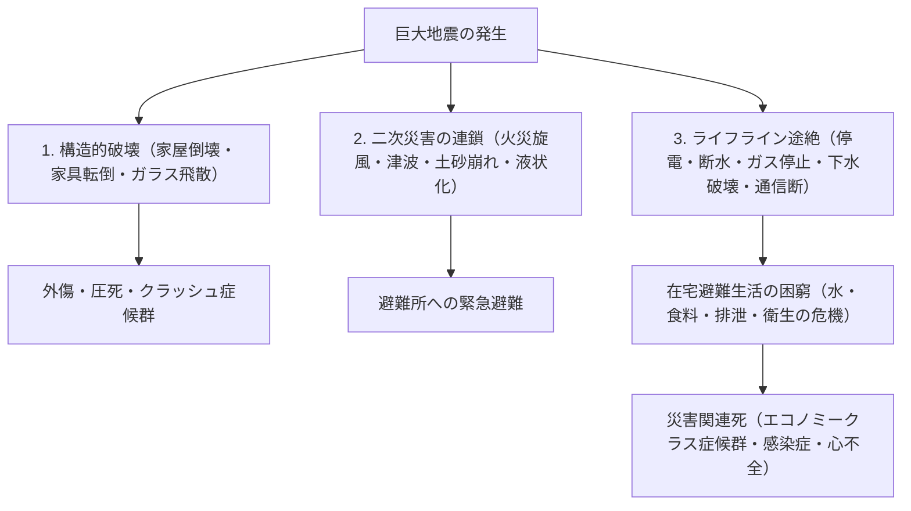
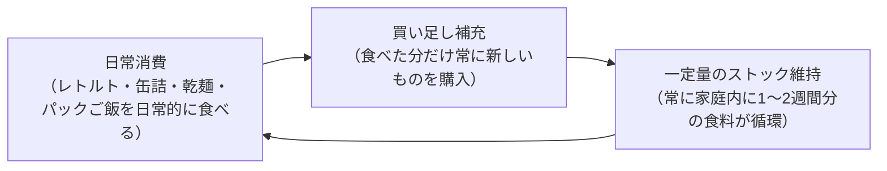
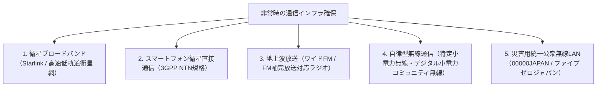

## 序論：複合災害列島における「生存工学」の確立

環太平洋変動帯に位置する日本列島は、地球表面積のわずか0.25%にすぎない国土面積の中に、世界で発生するマグニチュード6以上の巨大地震の約20%、活火山の約7%が集中する、世界屈指の自然災害多発地帯である。

さらに21世紀に入り、地球温暖化に伴う海水温上昇と大気中の飽和水蒸気量の増大は、従来の線形予測を根底から覆す「線状降水帯」による極端豪雨、外水氾濫と内水氾濫が重なる大規模水害、そして近い将来の発生が確実視される「南海トラフ巨大地震（M8〜9クラス）」や「首都直下地震」「富士山噴火」といった、国家機能の麻痺を伴う「国難級の複合災害」の切迫度を急速に高めている。

このような極限状況において、国や自治体による「公助」には物理的限界が存在する。大規模震災の発生直後、道路の寸断、火災の延焼、通信網のダウン、行政庁舎自体の被災により、公的救助隊や救援物資が個別の世帯に到達するまでには**「最低でも72時間（3日間）、広域壊滅時には1週間以上」**の空白期間が生じる。

この空白の時間を自力で生き延び、家族と地域社会の生命を防御するための実践知――それが**「減災工学（Disaster Mitigation Engineering）」**であり、その物理的手段が**「防災用品（Emergency Survival Gear）」**である。防災用品とは、単なる日用品の買い溜めではない。それは、電気、水道、ガス、下水道、通信という都市インフラの供給が完全に途絶した極限環境において、人体の生化学的ホメオスタシス（恒常性）と公衆衛生を自律的に維持するための「ポータブルな生命維持システム」である。

本稿では、災害発生のタイムラインとリスク評価から出発し、0次・1次・2次のフェーズ別装備論、水・食料・排泄の生化学的・衛生工学的アプローチ、非常用エネルギー自給システム、そして避難所における災害関連死防止の医学的プロトコルに至るまで、科学的厳密さをもってその全体系を網羅・解明する。

```
【災害のフェーズ進行と防災用品の機能展開】

┌─────────────────┬───────────────────────────────┬───────────────────────────────┐
│ フェーズ        │ 時間軸・状況                  │ 求められる防災機能・装備      │
├─────────────────┼───────────────────────────────┼───────────────────────────────┤
│ フェーズ0       │ 日常・外出時・移動中          │ 0次携帯品（EDC）：ホイッスル、│
│ （発災の瞬間）  │ （被災場所の予測不能性）      │ 小型ライト、携帯トイレ、救急品│
├─────────────────┼───────────────────────────────┼───────────────────────────────┤
│ フェーズ1       │ 発災直後〜24時間              │ 1次持ち出し品（非常持出袋）： │
│ （初動・緊急脱出│ 倒壊・火災・津波からの緊急避難│ 頭部保護、防塵マスク、靴、水筒│
├─────────────────┼───────────────────────────────┼───────────────────────────────┤
│ フェーズ2       │ 24時間〜72時間                │ 救助待機・在宅避難 / 避難所： │
│ （生命維持救助期│ ライフライン完全遮断・孤立    │ 応急手当、保温アルミ、浄水器  │
├─────────────────┼───────────────────────────────┼───────────────────────────────┤
│ フェーズ3       │ 72時間〜1週間以上             │ 2次備蓄品（ロジスティクス）： │
│ （避難生活継続期│ 避難生活の長期化・公衆衛生維持│ 備蓄食・水、非常用電源、衛生品│
└─────────────────┴───────────────────────────────┴───────────────────────────────┘
```

---

## 1. 複合災害のメカニズムとタイムライン工学

効果的な防災システムを構築するためには、まず直面すべき自然現象の物理的メカニズムと、それが引き起こす都市インフラの崩壊プロセスを正確に理解しなければならない。

### 1.1 地震動の物理学：海溝型 vs 内陸直下型
地震は、その発生機構によって大きく二つに大別される。

1. **海溝型（プレート境界型）地震（例：南海トラフ地震、東日本大震災）**:
   海洋プレートが大陸プレートの下に沈み込む境界で発生する。震源域が数百キロメートルに及ぶため、揺れの継続時間が数分間に及び、極めて広範囲に甚大な被害をもたらす。さらに、海底の地殻変動によって巨大津波が発生し、沿岸部に数分〜数十分で押し寄せる。また、高層ビルを共振させて激しく揺らす「長周期地震動」を引き起こす。
2. **内陸直下型地震（例：阪神・淡路大震災、熊本地震）**:
   陸域の活断層がずれることによって発生する。震源が浅いため、初期微動（P波）から主要動（S波）までの猶予時間（S-P時間）がほぼゼロであり、強烈な上下動と高周波数のパルス的揺れが直下を襲う。木造住宅の倒壊や家具の転倒、道路・橋梁の即時破壊を引き起こす。



### 1.2 火山噴火と広域降灰の都市機能停止力学
日本には111の活火山が存在し、富士山や浅間山、阿蘇山、桜島などの大規模噴火は、単なる局所的溶岩流にとどまらず、**「広域降灰（火山灰）」**という壊滅的なインフラテロを引き起こす。

火山灰は単なる燃えカスの灰（アッシュ）ではなく、「角張った微小なガラス片・鉱物結晶（シリカ SiO₂）」である。
- **送電網の停止**: わずか数ミリの降灰が雨水を含むと導電性を帯び、碍子（がいし）が漏電・短絡して広域大停電を引き起こす。
- **交通網の麻痺**: 道路上に数ミリ積もるだけでスリップ事故が多発し、車のエアフィルターが詰まってエンジンが停止。鉄道は車輪とレールの導通不良により運行不能。空港はジェットエンジン吸気部が溶融ガラス化するため全面閉鎖。
- **下水道の閉塞**: 住民が火山灰を下水に流すと、コンクリートのように沈殿・硬化して下水道管を完全に閉塞させる。
- **健康被害**: 2.5ミクロン以下の微粒子が肺胞深くに侵入し、気管支喘息や急性呼吸器疾患を誘発。角膜剥離を引き起こす。

したがって、火山防災用品としては、防塵マスク（N95規格以上）、密閉型防塵ゴーグル、雨合羽、そして室内の気密を保つ養生テープが必須装備となる。

---

## 2. フェーズ別防災用品の設計工学（0次・1次・2次）

防災用品の配置と構成は、人間の行動半径と災害後の時間軸に応じて、厳密に三段階にモジュール化されなければならない。

```
【防災用品の三層構造アーキテクチャ】

［0次携帯品：EDC（Everyday Carry）］
・対象：通勤・通学・外出時の常時携帯（重量：300〜500g以内）
・目的：外出先で被災した瞬間から、帰宅または一次避難所に到達するまでの数時間を凌ぐ。

［1次持ち出し品：非常持ち出し袋（Emergency Go-Bag）］
・対象：自宅の玄関や寝室に配備するリュック（重量：男性10〜15kg、女性8〜10kg以内）
・目的：火災や津波、家屋倒壊の危険から緊急脱出し、避難所で最初の24〜48時間を耐える。

［2次備蓄品：在宅避難ロジスティクス（Home Stockpile）］
・対象：自宅のパントリー、物置、クローゼット等に分散備蓄（7〜14日分）
・目的：ライフライン完全停止下で、住み慣れた自宅で公衆衛生を保ち自給自足生活を完遂する。
```

### 2.1 0次携帯品（EDC）：日常に潜むサバイバルポーチ
現代人は一日の大半を自宅以外の場所（オフィス、電車、商業施設）で過ごす。外出先で巨大地震に遭遇した場合、エレベーターの閉じ込め、地下鉄のトンネル内停車、交通途絶による数時間の徒歩帰宅を余儀なくされる。

```
【0次携帯ポーチ（推奨構成重量：約400g）の必須アイテム】

1. 高輝度小型LEDフラッシュライト（単3/単4電池またはUSB充電式、100ルーメン以上）
2. 救助要請用緊急ホイッスル（音圧100dB以上、水濡れでも鳴る無可動弁構造）
3. 携帯アルミ蒸着ブランケット（遮熱・保温・風防・雨除け・目隠し）
4. 携帯簡易トイレ（高分子ポリマー凝固剤＋防臭袋：最低2回分）
5. 大容量モバイルバッテリー（5000〜10000mAh）＋マルチ充電ケーブル
6. 常備薬・衛生用品（絆創膏、消毒綿、鎮痛解熱剤、持病薬3日分、個包装不織布マスク）
7. 現金（小銭・千円札：公衆電話用10円・100円硬貨を含む。停電時は電子マネー使用不能）
8. エマージェンシーIDカード（緊急連絡先、血液型、アレルギー、既往歴を記載）
```

### 2.2 1次持ち出し品（非常持ち出し袋）：脱出用バックパックの重量工学
1次持ち出し袋における最大の失敗は、「あれもこれもと詰め込みすぎて重量過多になり、背負って走れなくなること」である。人間が安全かつ迅速に瓦礫や段差を乗り越えて避難できる限界重量は、**「成人男性で体重の約20%（12〜15kg程度）、成人女性で体重の約15%（7〜10kg程度）」**である。

```
【1次持ち出し袋のパッキング工学】

・上部（背中側）：重いもの（飲料水、缶詰、バッテリー）→ 重心を高く背中に密着させ負荷軽減
・中央〜外側：中程度の重量（衣類、雨具、救急箱）
・下部：軽くて嵩張るもの（寝袋、防寒着、タオル）
・サイドポケット・最上部：緊急時に即座に取り出すもの（ライト、ホイッスル、ヘルメット、手袋）
```

また、避難時の履物は極めて重要である。多くの人がサンダルやスニーカーで逃げようとするが、大地震直後の道路は粉砕されたガラス、突き出た釘、鋭利な瓦礫で埋め尽くされている。底面に踏み抜き防止鋼板インソールを挿入したトレッキングシューズ、または耐踏み抜き安全靴の配備が絶対の生存条件となる。

---

## 3. 飲料水確保と水浄化の工学

人間の身体の約60%は水分で構成されている。人間は食料がなくても数週間生きられるが、水分が完全に断たれればわずか3日〜5日で脱水症状から多臓器不全に陥り死に至る。

### 3.1 必要水量の科学的算出
災害時における1人あたりの必要水量は、厚生労働省の基準において以下のように算出される。

$$	ext{生命維持必要水量} = 3.0 	ext{ リットル / 人 / 日}$$

したがって、4人家族が1週間の在宅避難を想定した場合、
$$3 	ext{ L} 	imes 4 	ext{ 人} 	imes 7 	ext{ 日} = 84 	ext{ リットル}$$
もの膨大な飲料水が必要となる（2Lペットボトルで42本分）。これに加え、調理用、手洗い用、口腔ケア用の生活用水を考慮すれば、さらに膨大な水資源の確保が求められる。

### 3.2 中空糸膜フィルター（Hollow Fiber Membrane）の浄水工学
備蓄水が底をついた場合、雨水、河川水、井戸水、風呂の残り湯を飲料水化するための「ポータブル浄水器（ソーヤー・ミニ、カタダイン等）」が生命線となる。

```
【中空糸膜フィルターによる水処理メカニズム】

原水（泥水・細菌・原虫を含む）
  ↓
［ポアサイズ（孔径）0.1ミクロン（100ナノメートル）の多孔質中空糸膜］
  │
  ├─ 【阻止・除去される物質】
  │   ・病原性原虫（クリプトスポリジウム：約4〜6μm、ジアルジア：約8〜14μm）
  │   ・病原性細菌（大腸菌：約0.5×2μm、コレラ菌、チフス菌、サルモネラ菌）
  │   ・微細な浮遊土砂・マイクロプラスチック
  │
  └─ 【通過するもの】
      ・水分子（H₂O：約0.3ナノメートル）
      ・溶解しているミネラル成分
  ↓
無菌化された安全な飲料水
```

ただし、中空糸膜フィルターにも限界が存在する。水に完全に溶解している化学物質（重金属、農薬、放射性物質）や、0.02〜0.08ミクロン程度の極小ウイルス（ノロウイルス、ロタウイルス、A型肝炎ウイルス等）は単層の中空糸膜を通過する可能性がある。したがって、汚染が疑われる水に対しては、中空糸膜濾過の後に「煮沸（1分以上の沸騰）」または「塩素系滅菌剤（次亜塩素酸ナトリウム微量滴下）」を併用することが公衆衛生上の鉄則である。

---

## 4. 非常食の生化学と長期保存技術

災害時の栄養摂取は、単にカロリーを充填するだけでなく、極度のストレス下にある被災者の免疫力を維持し、精神的安定を支える神経生化学的機能を担う。

### 4.1 アルファ化米（糊化と老化のデンプン化学）
現代の非常食の主力をなす「アルファ化米」は、デンプンの結晶構造変化を利用した高度な食品加工技術の産物である。

```
【デンプンの結晶構造とアルファ化米のメカニズム】

生米のデンプン（ベータデンプン / β-starch）
・密に結合したミセル結晶構造。水分子が侵入できず、人間の消化酵素（アミラーゼ）で分解不能。
  ↓ 加熱・加水（炊飯：糊化反応）
アルファデンプン（α-starch）
・熱によって水素結合が切断され、網目構造が崩壊して不規則に膨潤。消化吸収が容易。
  ↓ （通常放置すると水分を失って再び結晶化し、硬く消化しにくい「老化デンプン（β'デンプン）」に戻る）
［アルファ化米の工学的急速乾燥］
・炊き上がったアルファ状態の米を、熱風（80〜100℃以上）で瞬時に水分を約8〜10%以下まで急激に蒸発させる。
・デンプンの結晶再配向を阻止し、「アルファ状態（多孔質構造）」を凍結固定。
  ↓
注水による再水和
・熱湯を注げば約15分、水（常温）でも約60分で、水分子が多孔質構造に急速浸透し、炊き立てのご飯が完全に復元する。賞味期限は5年〜7年の常温保存が可能。
```

### 4.2 フリーズドライ（凍結乾燥 / Freeze-Drying）の物理学
スープ、味噌汁、主菜の保存に用いられるフリーズドライ技術は、水の「三重点（Triple Point: 0.01℃、611.65 Pa）」を利用した昇華工学である。

食品を−30℃〜−50℃で急速凍結させた後、高真空チャンバー内に配置し、気圧を限界まで減圧する。この状態でわずかな熱エネルギー（昇華潜熱）を加えると、食品組織内の氷結晶は液体の水を経由することなく、直接水蒸気へと「昇華（Sublimation）」して脱水される。

```
【フリーズドライ（昇華乾燥）の圧倒的優位性】

1. 組織構造の非破壊：
   高温加熱を行わないため、食品の細胞壁やタンパク質、ビタミンCなどの熱に弱い栄養素が破壊されずそのまま残存。
2. 究極の超軽量化：
   食品全体の水分の約95〜98%が除去されるため、重量は生の数分の一〜十分の一に激減（パッキング負担の大幅軽減）。
3. 瞬時の再水和性：
   氷が抜けた跡がそのまま無数の微細な空洞（スポンジ構造）として残るため、お湯を注ぐと毛細管現象によってわずか数秒で内部まで水分が浸透し、元の食感と風味が完璧に蘇る。
```

### 4.3 ローリングストック法（Rolling Stock System）の運用力学
「非常食を箱買いして押し入れに5年間しまい込み、期限が切れて廃棄する」という従来型の備蓄は、現代の危機管理論では推奨されない。
これに代わって標準となったのが**「ローリングストック（日常循環備蓄）」**である。



ローリングストックの最大の心理学的メリットは、**「発災時にも食べ慣れた日常の味（コンフォートフード）を摂取できる」**点にある。極限の避難生活において、普段と全く異なる味気ない非常食を食べ続けることは重大な食欲不振と精神的抑うつを招く。日常の延長として備蓄を回転させることが、最も持続可能で強靭な備蓄プロトコルである。

---

## 5. 衛生工学と避難所サバイバル（感染症・排泄・体温管理）

大震災における死者の内訳を分析したとき、戦慄すべき事実が浮き彫りとなる。東日本大震災や熊本地震、能登半島地震において、倒壊や津波による直接死を免れたにもかかわらず、その後の過酷な避難生活の中で命を落とす**「災害関連死」**の数が、直接死を上回る地域すら存在した。

災害関連死の最大要因は、飢えではなく**「公衆衛生の崩壊」**と**「排泄インフラの破綻」**である。

### 5.1 非常用簡易トイレと高分子ポリマー（Superabsorbent Polymer）の化学
断水時、水洗トイレに水を流すことは厳禁である。地中の排水管や下水本管が破損している場合、上層階から汚水を流せば下層階の便器から汚水が噴出（逆流）し、建物全体が生物学的汚染地帯と化す。

ここで必須となるのが、便器にポリ袋を被せて使用する「凝固剤式非常用簡易トイレ」である。その中核素材が**「高分子吸水ポリマー（SAP: ポリアクリル酸ナトリウム架橋体）」**である。

```
【高分子吸水ポリマーによる汚水封じ込めの生化学】

┌─────────────────────────────────────────────────────────────┐
│ 親水性基（-COONa）の電離：                                  │
│ 高分子ポリマーに水分が接触すると、ナトリウムイオン（Na⁺）が  │
│ 電離し、高分子鎖がマイナス（-COO⁻）に帯電する。             │
│   ↓                                                         │
│ 静電反発による分子網目の劇的拡張：                          │
│ マイナス同士が強く反発し合うことで、折りたたまれていた三次元│
│ 架橋ネットワークが一気に大きく広がる。                      │
│   ↓                                                         │
│ 浸透圧による大量吸水とゲル化固定：                          │
│ 網目内部のイオン濃度が高いため、強烈な浸透圧が生じ、自重の  │
│ 数百倍〜千倍もの水分を一瞬で内部に吸水・閉じ込めて硬質ゲル化│
│ （圧力をかけても二度と水分を放出しない）。                  │
└─────────────────────────────────────────────────────────────┘
```

凝固剤には、ポリマーに加えて「銀イオン（Ag⁺）」や「次亜塩素酸塩」「植物抽出タンニン」などの強力な殺菌・消臭成分が配合されており、アンモニアや硫化水素の揮発を化学的に封殺する。

#### トイレ我慢の病態生理とエコノミークラス症候群
避難所のトイレが劣悪・不潔で暗いと、被災者（特に高齢者や女性）は「トイレに行く回数を減らそう」として無意識に**水分摂取を極端に制限**し始める。
水分を断つと血液がドロドロに濃縮（血液濃縮）され、車中泊や狭い避難所の雑魚寝で下肢の静脈が圧迫されることと相まって、深部静脈に血栓が形成される。立ち上がった瞬間に血栓が血流に乗って肺動脈を塞ぐ「肺血栓塞栓症（エコノミークラス症候群）」を発症し、突然死に至る。快適で清潔なトイレの確保は、単なる利便性の問題ではなく、直接的な「人命救助」そのものなのである。

### 5.2 遮熱・保温工学：アルミ蒸着PETフィルムブランケット
低体温症（コア体温が35℃以下に低下すること）は、冬期のみならず、濡れた衣服を着用したまま風に晒されれば夏期であっても容易に発症する。

エマージェンシーブランケット（宇宙ブランケット）は、厚さわずか12ミクロンのポリエチレンテレフタレート（PET）フィルムの表面に、高純度アルミニウムを超高真空下で蒸着させたハイテク素材である。
アルミニウムの自由電子の鏡面効果により、**「人体から放射される遠赤外線（輻射熱）の90%以上を反射」**して体内に跳ね返す。同時に、冷たい外気の対流を完全に遮断し、わずか50g程度の超軽量でありながら毛布数枚分に匹敵する保温性能を発揮する。

---

## 6. 非常用電源と通信インフラの自給工学

情報と電力の途絶は、被災者を漆黒の闇と孤立、そしてデマの恐怖に突き落とす。現代の防災において、自立型エネルギーシステムと冗長通信路の確保は最優先の防衛ラインである。

### 6.1 リン酸鉄リチウムイオン電池（LiFePO₄）の安全性と電気化学
家庭用ポータブル電源を選ぶ際、最も重視すべきはバッテリーのセル化学（カソード材料）である。従来型の三元系リチウムイオン電池（NMC: ニッケル・マンガン・コバルト）と、最先端の**「リン酸鉄リチウム電池（LFP / LiFePO₄）」**には決定的な構造差が存在する。

```
【三元系（NMC）とリン酸鉄系（LiFePO₄）の物性比較】

┌─────────────────┬───────────────────────────────┬───────────────────────────────┐
│ 比較項目        │ 三元系（NCM / NCA）           │ リン酸鉄系（LiFePO₄）         │
├─────────────────┼───────────────────────────────┼───────────────────────────────┤
│ 結晶構造        │ 層状岩塩構造                  │ オリビン構造（強固なリン酸結合│
│ 熱暴走温度      │ 約 200〜210 ℃（比較的低熱）  │ 約 400〜500 ℃（極めて高熱安定│
│ 酸素放出・発火性│ 過充電・釘刺しで酸素放出し発火│ 結晶結合が強固で酸素を放出せず│
│                 │ 爆発の危険性が高い            │ 内部短絡しても発煙・発火しない│
├─────────────────┼───────────────────────────────┼───────────────────────────────┤
│ 充放電サイクル  │ 約 500〜800 回（寿命短）      │ 約 3,000〜4,000 回（10年寿命） │
│ エネルギー密度  │ 高い（小型軽量）              │ やや低い（少し重く嵩張る）    │
└─────────────────┴───────────────────────────────┴───────────────────────────────┘
```

防災用途においては、車載や室内保管時の極限の熱安定性と、10年以上にわたって放置しても性能が劣化しない長寿命が最優先されるため、**リン酸鉄リチウム（LiFePO₄）を採用したポータブル電源が圧倒的なデファクトスタンダード**となっている。

### 6.2 ポータブルソーラーパネルとMPPT制御の最適化
停電が長期化した場合、コンセントからの充電は期待できない。太陽光発電（ソーラーパネル）による持続的充電が不可欠となる。
高効率な単結晶シリコンパネル（光電変換効率22〜24%以上）と、日照条件の変動に応じて常に最大の電力を取り出す**「MPPT（Maximum Power Point Tracking / 最大電力点追従）方式」**の充電コントローラーを組み合わせることで、曇天や朝夕の微弱光環境下でも効率的な電力回収が可能となる。

---


---

## 2.3 外傷救急医療（トラウマケア）と止血帯（CAT）の医学工学

大規模震災における家屋倒壊やガラス飛散、津波漂流物による受傷において、即座に死に直結するのが**「活動性の外出血（動脈性大出血）」**である。大腿動脈や上腕動脈が切断された場合、人体内の血液（体重の約8%）の3分の1が失われるまでに要する時間はわずか数分であり、救急車の到着を待っていては確実に失血死（出血性ショック死）に至る。

現代の災害ファーストエイド（TACTICAL COMBAT CASUALTY CARE / TCCC基準）において、従来の「直接圧迫止血」で止まらない四肢の大出血に対するゴールドスタンダードが**「戦闘用止血帯（CAT: Combat Application Tourniquet）」**である。

```
【止血帯（CAT）の構造工学と駆血プロトコル】

┌─────────────────────────────────────────────────────────────┐
│ バックルと高強度ナイロンベルト：                            │
│ 負傷部位（創傷）より心臓側（中枢側）へ5〜7cm上の位置に装着。│
│ （関節部を避ける。位置が不明な場合は肢の最根部に装着）      │
│   ↓                                                         │
│ ウィンドラス（巻き上げ棒）の回転：                          │
│ 棒を回転させて内側の帯を締め上げ、動脈圧を上回る均一な円周  │
│ 圧迫を骨に向かって加える。拍動性の出血が完全に停止するまで   │
│ 確実に巻き上げる。                                          │
│   ↓                                                         │
│ ロックフックでの固定と「時刻の記録」：                      │
│ 巻き上げ棒をクリップに固定し、タイムストラップに装着時刻を  │
│ 油性ペンで明記する（虚血限界時間は最大2時間以内）。         │
└─────────────────────────────────────────────────────────────┘
```

また、通常のガーゼでは血液凝固が間に合わない大出血創に対しては、粘土鉱物（カオリン）やキトサンを浸透させた**「ヘモスタティックガーゼ（止血ガーゼ: クイッククロット等）」**が極めて有効である。カオリンが血液中の第XII凝固因子を爆発的に活性化させ、傷口に詰め込むだけで数分以内に強固な血栓を形成して止血を完了させる。

さらに、割れたガラスや鉄骨が胸部に突き刺さったことによる「開放性気胸（外気吸入により肺が虚脱する致命傷）」を防ぐため、逆止弁を備えた**「チェストシール（胸部密閉ドレッシング）」**の常備も、都市震災における極めて高度なサバイバル装備である。

---

## 5.3 避難所生活の国際基準：スフィア・プロジェクトと「TKB48」の公衆衛生工学

災害関連死を防ぐための公衆衛生の指針として、世界各国のNGOや赤十字が策定した国際人道支援の最低基準が**「スフィア・ハンドブック（Sphere Handbook）」**である。日本の従来の避難所（体育館での雑魚寝、冷たいおにぎりの配給、不潔な仮設トイレ）は、この国際人道基準から見て極めて劣悪な水準にあることが指摘されてきた。

近年、日本の防災医学界が強力に提唱しているのが、避難所の環境を劇的に改善するスローガン**「TKB48（発災後48時間以内の トイレ・キッチン・ベッド の配備）」**である。

```
【避難所公衆衛生の三大要素：TKBの工学的基準】

1. Ｔ（トイレ / Toilet）：
   ・スフィア基準：避難者20人に最低1基のトイレ。男女比は1:3（女性用を多く確保）。
   ・衛生工学：照明、手洗い設備（水と石鹸）、汚水飛散防止、防犯ロックの完備。
   ・目標：臭気ゼロ、暗さゼロ、段差ゼロのバリアフリー化による排泄我慢の撲滅。

2. Ｋ（キッチン / Kitchen）：
   ・温かい食事（温食）の提供：発災後48〜72時間以内に、温かい汁物や栄養バランスの取れた食事を自炊・配給できる移動式キッチンカーやプロパンガス調理設備の導入。
   ・生化学的効果：低体温症の防止、消化管機能の回復、極限ストレスの精神的緩和。

3. Ｂ（ベッド / Bed）：
   ・段ボールベッド（Cardboard Bed）の全数導入：床から高さ30〜40cmを確保。
   ・医学的効果：
     ① 地面からの伝導熱損失（底冷え）を遮断し、低体温症・呼吸器疾患を予防。
     ② 床上30cm以内に浮遊する粉塵、ハウスダスト、ノロウイルス等の飛沫吸入を劇的に低減。
     ③ 立ち上がり動作の負荷を激減させ、高齢者の廃用症候群・エコノミークラス症候群を防止。
```

### 口腔ケアと誤嚥性肺炎の阻止
避難所における高齢者の最大の死因のひとつが、**「誤嚥性肺炎（ごえんせいはいえん）」**である。
断水によって歯磨きをしなくなると、口腔内の雑菌（嫌気性細菌）が爆発的に繁殖する。就寝中に唾液とともにこれらの細菌が気管・肺へと流れ込み、重篤な肺炎を引き起こす。
したがって、防災グッズの中に「液体歯磨き（マウスウォッシュ）」や「口腔ケア用ウェットティッシュ」を配備することは、抗生物質を投与する以前の、最も強力な感染症予防ワクチンとなる。

---

## 6.3 冗長化された通信ネットワーク工学：衛星・無線・00000JAPAN

災害時、大手キャリアの携帯電話基地局は、停電、光ファイバー網の断線、そして通話・データ通信の殺到（アクセス集中による90%以上の通信規制）によって即座に機能不全に陥る。情報の空白（インフォメーション・ブラックアウト）を防ぐためには、地上波、衛星、自営無線の多層的冗長化（マルチレイヤ・リダンダンシー）が必須となる。



### 1. ワイドFM（FM補完放送）対応ラジオの受信工学
AMラジオ放送（中波）は長距離伝播に優れるが、鉄筋コンクリートのマンション内では電波が遮蔽されやすく、都市部の電気ノイズ（インバーターやスイッチング電源）に極めて弱い。
「ワイドFM（90.0〜95.0MHzの超短波）」は、AM放送の番組を高音質なFM電波で同時にサイマル放送するシステムである。FM波はビル内への透過性が高く、都市雑音の影響を受けにくいため、震災時でもクリアな緊急地震速報や避難情報を受信できる。手回しダイナモ発電機能を備えたワイドFMラジオは、すべての家庭の一次防衛ラインである。

### 2. 衛星通信の革命：Starlinkとスマートフォン直結衛星SOS
2020年代に実用化されたスペースXの「Starlink（スターリンク）」は、高度約550kmの地球低軌道（LEO）を周回する数千機の衛星コンステレーションにより、地上のインフラが完全に破壊された被災地でも、アンテナを空に向けるだけで数百Mbpsの超高速インターネット環境を提供する。能登半島地震においても避難所や自治体庁舎の通信バックボーンとして絶大な威力を発揮した。

さらに最新のスマートフォン（iPhone 14以降等）には、国際電気通信連合（ITU）の「3GPP Release 17/18」規格に基づく「非地上系ネットワーク（NTN: Non-Terrestrial Network）」機能が搭載され、地上の基地局が圏外であっても、上空の通信衛星と直接通信してテキストメッセージや位置情報を緊急通報機関へ送信することが可能となっている。

---

## 2.4 都市火災と初期消火・防煙脱出工学

震災時の最大の殺傷要因のひとつが、地震直後に多発する「同時多発火災（火災旋風）」である。密集市街地においては、プロパンガスの配管断裂、電気復旧時の「通電火災」、石油ストーブの転倒により無数の火の手が上がり、消防の消火能力を完全にオーバーフローさせる。

### 防煙マスク（スモークブロック）の化学
火災現場における死者の約6割は、火傷ではなく**「有毒ガス吸入による窒息死（一酸化炭素・シアン化水素）」**である。建材やプラスチックが不完全燃焼すると、致死性のシアン化水素（HCN）やホスゲンが発生する。濡れタオルを口に当てるだけでは、水に不溶性の微小煙粒子や一酸化炭素を完全に防ぐことはできない。

高機能防煙フード（スモークブロック）は、耐熱アルミフードの内側に、ホップカライト触媒（一酸化炭素を常温で二酸化炭素に酸化する特殊触媒）や多孔質活性炭フィルターを組み込んでおり、約10〜15分間にわたって有毒ガスを完全に無毒化し、煙で視界がゼロの猛烈な火災現場からの安全な脱出を可能にする。

### 初期消火用具の選定
- **住宅用強化液消火器**: 一般的な粉末ABC消火器と異なり、霧状のアルカリ金属塩水溶液を放射する。木材の深部まで浸透して再燃を防ぎ、視界を遮る粉塵を発生させないため、狭い室内での初期消火に極めて適する。
- **感震ブレーカー**: 大震災後の通電火災（倒壊したヒーターに電気が復旧して引火する現象）を未然に防ぐため、震度5強以上の揺れを感知して自動的に家庭の主幹電源を遮断する機械的・電磁的装置。防災用品としての事前設置が強く推奨される。


---

## 1.3 室内空間の耐震固定工学：家具転倒防止とガラス飛散防止の物理学

阪神・淡路大震災や能登半島地震における犠牲者の検死データを分析すると、死因の約8割は家屋の倒壊および「家具・家電の転倒・落下による圧迫死・窒息死」であった。震度6強から震度7の極大地震動において、数十キロから数百キロの大型タンス、冷蔵庫、ピアノ、本棚は、凶悪な凶器となって室内の人間を襲い、逃げ道を完全に塞ぎ、脱出不可能な状態で火災に巻き込ませる。

室内の安全空間（セーフゾーン）を構築するための家具固定は、建築力学に基づいた工学的アプローチが必要である。

```
【家具固定器具の力学的支持力と施工プロトコル】

┌─────────────────┬───────────────────────────────┬───────────────────────────────┐
│ 固定器具の種別  │ 力学的支持原理                │ 施工上の必須留意点            │
├─────────────────┼───────────────────────────────┼───────────────────────────────┤
│ L字型金属金具   │ 壁内の下地（間柱・スタッド）に│ 石膏ボードだけの壁に木ネジを打│
│ （最良・最強）  │ ビスで直接緊結。せん断力と引張│ っても強度はゼロ。必ず下地セン│
│                 │ 力で家具の転倒モーメント阻止  │ サーで間柱を特定して留める    │
├─────────────────┼───────────────────────────────┼───────────────────────────────┤
│ 伸縮突っ張り棒  │ 天井と家具天板の間に圧縮応力を│ 天井板が薄いベニヤ等の場合、突│
│ ＋ 耐震ジェル   │ 発生させ、底面の高分子粘着ジェ│ き破れて外れる。必ず厚い当て木│
│ （複合ハイブリッド│ ルの摩擦力で前方滑りを阻止    │ を挟み、耐震ジェルと併用する  │
├─────────────────┼───────────────────────────────┼───────────────────────────────┤
│ ベルト・ワイヤー│ 重心が高く背面に隙間がある冷蔵│ 冷蔵庫背面の取っ手と壁下地を金│
│ 式固定具        │ 庫やテレビの転倒を、高強度ベル│ 具で連結。急制動時の慣性力をベ│
│                 │ トの張力によって抑止          │ ルトの弾性変形で吸収          │
└─────────────────┴───────────────────────────────┴───────────────────────────────┘
```

### ガラス飛散防止フィルム（PET多層フィルム）の引張破断強度
地震の揺れによって窓枠が菱形に変形（剪断変形）すると、窓ガラスは限界を超えて破裂し、鋭利な破片が手裏剣のように室内全域に猛スピードで飛び散る。
厚さ50〜100ミクロンのポリエステル（PET）多層フィルムを室内側に貼付することで、ガラスが割れても強靭なアクリル系粘着剤が破片をフィルム上に強固に保持（自己保持）し、脱落や飛散を100%防止する。

---

## 2.5 水害・土砂災害サバイバルの流体力学

台風、線状降水帯、ゲリラ豪雨による都市浸水や河川氾濫（外水氾濫・内水氾濫）においては、地震とは全く異なる流体力学的脅威に対する装備体系が要求される。

### 1. 避難時の履物：なぜ「長靴」は絶対禁忌なのか
水害避難において、長靴（レインブーツ）を履いて避難することは水難救助工学的に最も危険な行為である。
水深が膝上（約40〜50cm以上）に達すると、長靴の履き口から一気に泥水が内部に流入する。長靴内の水は容易に抜けないため、片足あたり数キログラムの重石と化し、水底のマンホールや側溝に足を取られて転倒し、自力で立ち上がれずに溺死する事故が多発している。

水害避難の正解は、**「水抜けの良い紐付きスニーカー ＋ 厚手の靴下（またはネオプレンソックス）」**である。靴紐をしっかりと締め上げることで脱落を防ぎ、浮力を発生させず、水圧の中でも軽快な歩行を維持できる。

### 2. 水圧によるドア開放不能限界
浸水が始まった家屋や車内において、外開きドアにかかる水圧は以下の流体力学の公式によって計算される。

$$F = 
ho g h A$$

ここで、$
ho$ は水の密度、$g$ は重力加速度、$h$ は水深、$A$ はドアの受圧面積である。
外の浸水深が**わずか40〜50cm**に達しただけで、ドア全体にかかる水圧荷重は数百キログラムに達し、成人男性が力いっぱい押してもドアを内側から開けることは物理的に不可能となる。
したがって、浸水が迫る兆候（警戒レベル3・4）を察知した段階での早期垂直避難・立退き避難、および車内への「超硬合金チップ付き緊急脱出用レスキューハンマー」の配備が絶対の生存条件となる。

---

## 5.4 要配慮者（乳幼児・高齢者・慢性疾患・ペット）の特化型防災工学

標準的な防災セットは「健康な成人」をモデルケースとして設計されていることが多いが、現実の被災地において最も脆弱であり、命の危険に晒されるのは「要配慮者（災害弱者）」である。

```
【要配慮者別の特化型サバイバル装備プロトコル】

┌─────────────────┬───────────────────────────────┬───────────────────────────────┐
│ 対象区分        │ 特有のリスク・課題            │ 必須となる特化型防災用品      │
├─────────────────┼───────────────────────────────┼───────────────────────────────┤
│ 乳幼児・妊産婦  │ 断水による調乳不能・脱水      │ 液体ミルク（調乳不要・常温保存│
│                 │ 衛生環境悪化・夜泣きによる孤立│ 使い捨て哺乳瓶、おむつ、抱っこ│
│                 │                               │ 紐（両手を空ける）、お尻拭き  │
├─────────────────┼───────────────────────────────┼───────────────────────────────┤
│ 高齢者・要介護者│ 誤嚥・低栄養・持病の悪化      │ とろみ調整剤、やわらかレトルト│
│                 │ 義歯の紛失・口腔感染症        │ 予備の老眼鏡・補聴器用電池、  │
│                 │ 排泄介助の困難                │ 入れ歯ケース、お薬手帳のコピー│
├─────────────────┼───────────────────────────────┼───────────────────────────────┤
│ 慢性疾患・難病  │ 人工透析、インスリン、在宅酸素│ お薬手帳・処方箋のクラウド保存│
│                 │ の停止による生命危機          │ ポータブル吸引器・蓄電池、    │
│                 │                               │ 医療機関との事前緊急連絡網    │
├─────────────────┼───────────────────────────────┼───────────────────────────────┤
│ ペット（愛玩動物│ 避難所での受け入れ拒否・脱走  │ 折りたたみ式ハードケージ、    │
│ （犬・猫等）    │ 感染症・ノイズによるストレス  │ 療法食・水（10日分）、鑑札・マ│
│                 │                               │ イクロチップ登録証、ペットシーツ│
└─────────────────┴───────────────────────────────┴───────────────────────────────┘
```

特に乳幼児における「液体ミルク（常温保存乳児用調製液）」の2019年国内販売解禁は、日本の災害対策における画期的な進歩であった。お湯を沸かす熱源も、消毒した哺乳瓶も、清浄な水も存在しない過酷な避難環境下において、パッケージを開封してアタッチメントを取り付けるだけで即座に授乳できるシステムは、無数の赤ちゃんの命を救う防波堤となっている。


### 7.1 家庭内防災監査（Disaster Audit）の定期運用プロトコル

どれほど完璧な防災用品を揃えても、経年劣化や消費期限の超過、家族構成の変化を放置すれば、いざという瞬間に機能しない「死蔵装備」と化してしまう。
したがって、毎年「3月11日（東日本大震災）」および「9月1日（防災の日）」の年2回を『家庭内防災監査日』と定め、以下の項目を網羅的に点検・更新する運用規律が推奨される。

1. 備蓄食・飲料水の賞味期限チェックとローリングストックの入れ替え
2. ポータブル電源・モバイルバッテリーの充放電テスト（リチウム電池の自己放電防止・容量確認）
3. 簡易トイレ・救急医薬品の使用期限およびゴム・プラスチック材の劣化点検
4. 家族間での安否確認プロトコル（災害用伝言ダイヤル「171」やSNSグループ連絡訓練）のシミュレーション
5. ハザードマップの最新改定内容の確認と、最寄りの指定緊急避難場所への徒歩実地踏査

## 7. 結論：自助・共助・公助の三位一体と減災社会の創造

防災用品を揃えるという行為は、単なる「物資の収集」ではない。それは、自分自身と家族の生命に対する**「能動的責任（Personal Responsibility）」**の引き受けであり、自然に対する畏怖と知性に基づいた生き方の表明である。

完璧な防波堤も、耐震構造も、大自然の想像を絶する暴力の前には破壊され得る。ハードウェアの防御が破られたとき、最後に生死を分かつのは、各人が手元に備えた装備の質と、それらを使いこなす訓練された知識である。

個人が自立した生存基盤を確立すること（自助）によって、初めて隣人を助け、コミュニティの互助組織を立ち上げる余力（共助）が生まれる。そして、住民が自力で初期の数日間を耐え抜くことによって、警察、消防、自衛隊、医療従事者は、真に緊急救助を必要とする重傷者や孤立集落の救援に全力を集中させることができる（公助の最大化）。

日々の平穏な生活の中に、静かに研ぎ澄まされた危機への備えを織り込むこと。その知恵と規律こそが、過酷な災害列島に生きる私たちが未来へと命を繋ぐための、最大の叡智なのである。
