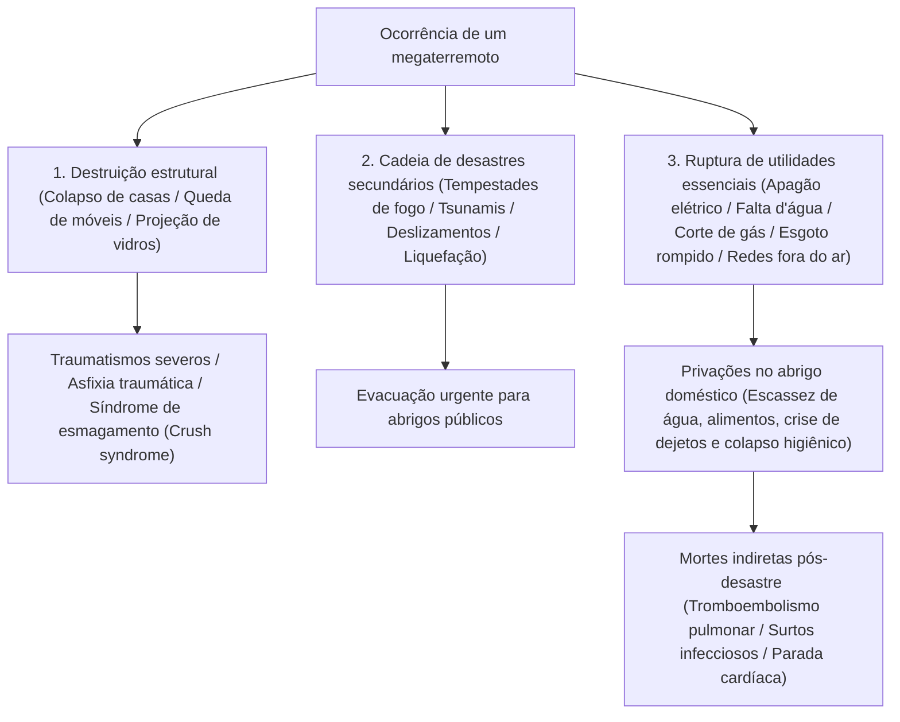
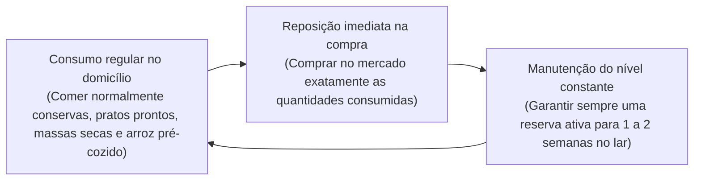
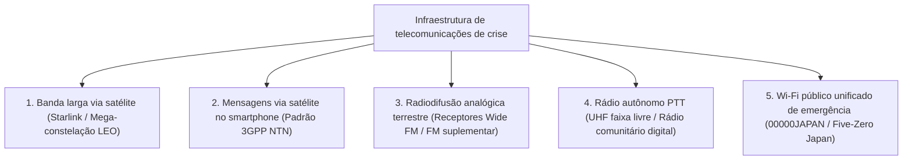

## Introdução: O estabelecimento da "Engenharia de Sobrevivência" em um arquipélago de desastres complexos

O arquipélago japonês, localizado ao longo do Círculo de Fogo do Pacífico, ocupa meros 0,25% da superfície terrestre emersa do planeta. No entanto, dentro desse território exíguo concentram-se aproximadamente 20% de todos os terremotos globais de magnitude igual ou superior a 6, bem como cerca de 7% dos vulcões ativos da Terra, constituindo uma das regiões de maior densidade de catástrofes naturais do mundo.

Além disso, no século XXI, a elevação térmica da superfície oceânica e o aumento da umidade atmosférica saturada decorrentes das mudanças climáticas globais desmantelaram os modelos preditivos meteorológicos lineares convencionais. Tempestades torrenciais extremas causadas por "faixas de precipitação lineares" estacionárias, inundações compostas em que o transbordamento fluvial externo coincide com a saturação das redes de drenagem pluvial urbana, somadas à certeza estatística de megadesastres nacionais iminentes — como o megaterremoto da Fossa de Nankai (magnitude de 8 a 9), o sismo direto sob a área metropolitana de Tóquio e uma erupção explosiva do Monte Fuji — elevam o perigo de paralisia sistêmica do Estado a níveis sem precedentes.

Sob circunstâncias tão extremas, a "Assistência Pública" governamental e municipal enfrenta limites físicos incontornáveis. Imediatamente após um sismo devastador, o corte de vias expressas e pontes, a propagação descontrolada de incêndios urbanos, a queda das redes tronciais de telecomunicações e os colapsos estruturais das próprias sedes administrativas provocam um vácuo absoluto de socorro: **"um período mínimo de 72 horas (3 dias), estendendo-se por mais de uma semana em catástrofes de destruição macrorregional"**, antes que equipes organizadas de resgate e suprimentos consigam alcançar cada domicílio isolado.

A disciplina empírica para sobreviver de maneira autônoma a esse vácuo crítico e salvaguardar a vida da família e da comunidade é a **"Engenharia de Mitigação de Desastres (Disaster Mitigation Engineering)"**, e seu instrumento físico e tático é o **"Equipamento de Sobrevivência e Proteção Civil (Emergency Survival Gear)"**. Suprimentos de emergência não são um mero acúmulo desordenado de bens de consumo cotidiano. Constituem um sistema portátil e autônomo de suporte à vida, projetado para sustentar a homeostase bioquímica do organismo humano e a saúde pública em um cenário extremo no qual os serviços urbanos essenciais — eletricidade, água potável, gás encanado, esgoto e telecomunicações — colapsaram totalmente.

Este tratado aborda a dinâmica temporal dos desastres e a avaliação quantitativa de riscos, a metodologia modular de equipamento em três etapas (Fases 0, 1 e 2), as soluções bioquímicas e sanitárias para água, alimentação e manejo de dejetos, a autossuficiência energética de emergência fora da rede e os protocolos médicos para erradicar as mortes indiretas por desastre em abrigos de evacuação.

```
【Evolução das fases do desastre e desdobramento funcional do equipamento】

┌─────────────────┬───────────────────────────────┬───────────────────────────────┐
│ Fase            │ Escala temporal e contexto    │ Função e equipamentos exigidos│
├─────────────────┼───────────────────────────────┼───────────────────────────────┤
│ Fase 0          │ Cotidiano, transporte, rua    │ EDC de Fase 0: Apito de res-  │
│ (Impacto inicial│ (Localização imprevisível)    │ gate, lanterna compacta, sani-│
│ do desastre)    │                               │ tário químico portátil, IFAK  │
├─────────────────┼───────────────────────────────┼───────────────────────────────┤
│ Fase 1          │ Do impacto imediato a 24 horas│ Mochila de fuga (Go-Bag):     │
│ (Evacuação de   │ Fuga urgente contra desaba-   │ Capacete/proteção craniana,   │
│ emergência)     │ mentos, incêndios e tsunamis  │ máscara N95, botas, cantil, ID│
├─────────────────┼───────────────────────────────┼───────────────────────────────┤
│ Fase 2          │ De 24 horas a 72 horas        │ Espera de socorro / Abrigo no │
│ (Suporte à vida)│ Corte absoluto de utilidades, │ domicílio: Primeiros socorros,│
│                 │ isolamento comunitário        │ manta térmica, purificador    │
├─────────────────┼───────────────────────────────┼───────────────────────────────┤
│ Fase 3          │ De 72 horas a mais de 1 semana│ Estoque de Fase 2 (Logística) │
│ (Subsistência   │ Abrigo prolongado, manutenção │ Alimentos e água, gerador au- │
│ prolongada)     │ da higiene pública e sanitária│ tônomo, saneamento avançado   │
└─────────────────┴───────────────────────────────┴───────────────────────────────┘
```

---

## 1. Mecanismos de desastres compostos e engenharia de linhas temporais

Para estruturar um sistema de defesa eficiente contra catástrofes, é imperativo compreender com exatidão a física dos fenômenos geológicos e a dinâmica em cascata do colapso das infraestruturas modernas.

### 1.1 Física do movimento sísmico: Terremotos de subdução em fossas vs. falhas ativas intraplaca
Os sismos destrutivos dividem-se fundamentalmente em duas classes com base em sua mecânica de ruptura:

1. **Terremotos de subdução (limite de placas oceânicas) (ex.: Fossa de Nankai, Grande Terremoto do Leste do Japão de 2011)**:
   Ocorrem ao longo do limite onde uma placa tectônica oceânica subduz sob uma placa continental. Como a zona de ruptura estende-se por centenas de quilômetros, a vibração violenta prolonga-se por vários minutos, infligindo danos catastróficos em escala macrorregional. O deslocamento vertical súbito do leito oceânico gera tsunamis colossais que atingem as áreas costeiras em poucos minutos. Além disso, provocam "movimentos sísmicos de período longo", que entram em ressonância destrutiva com arranha-céus e edifícios altos.
2. **Terremotos em falhas ativas continentais superficiais (sismos diretos) (ex.: Terremoto de Kobe de 1995, Terremoto de Kumamoto de 2016)**:
   Gerados pelo deslizamento repentino de falhas ativas rasas na crosta continental. Como o foco sísmico é extremamente superficial, o intervalo entre os tremores preliminares (ondas P) e as ondas destrutivas transversais (ondas S) — o tempo S-P — é praticamente nulo. Acelerações verticais intensas e ondas de pulso de alta frequência atingem as construções sem aviso prévio, esmagando casas de madeira, projetando móveis pesados e fraturando pontes e rodovias instantaneamente.



### 1.2 Erupções vulcânicas e a paralisia urbana por queda massiva de cinzas
O Japão abriga 111 vulcões ativos. Uma erupção pliniana de grandes proporções do Monte Fuji, Monte Asama, Monte Aso ou Sakurajima gera uma ameaça que supera com folga os fluxos piroclásticos e lavas locais: deflagra a **"Queda massiva de cinzas vulcânicas em escala regional"**, paralisando silenciosamente toda a malha urbana.

A cinza vulcânica não é uma fuligem vegetal macia; consiste em **"microfragmentos angulares, cortantes e abrasivos de vidro vulcânico e cristais minerais de silicato (sílica SiO₂)"**:
- **Colapso da rede elétrica**: Uma camada de apenas alguns milímetros torna-se eletricamente condutiva ao ser umedecida pela chuva, provocando arcos voltaicos e curtos-circuitos generalizados nos isoladores cerâmicos das linhas de transmissão, colapsando a rede regional.
- **Paralisia do transporte**: Depósitos milimétricos provocam perda drástica de aderência e acidentes viários; partículas finas abrasivas entopem os filtros de ar dos motores a combustão, parando os veículos. O transporte ferroviário cessa pela perda de contato elétrico entre rodas de aço e trilhos. Aeroportos fecham totalmente porque a sílica aspirada pelas turbinas dos aviões funde-se em vidro em altas temperaturas, paralisando os reatores.
- **Obstrução do esgoto**: Se os moradores descartarem cinzas pela rede de esgoto doméstico, o material decanta, compacta-se e endurece como concreto hidráulico, destruindo permanentemente a malha subterrânea.
- **Danos respiratórios e oculares**: Partículas menores que 2,5 micra penetram profundamente nos alvéolos pulmonares, provocando crises severas de asma e insuficiência respiratória aguda, além de erosões na córnea.

Portanto, o kit de proteção contra cinzas vulcânicas deve conter respiradores particulados (classe N95/P2/FFP2 ou superior), óculos de proteção com vedação periférica hermética, capas de chuva impermeáveis e fitas adesivas resistentes para vedação de portas e janelas.

---

## 2. Engenharia de projeto de suprimentos por fases operacionais (Fases 0, 1 e 2)

A alocação e organização do material de sobrevivência deve ser rigorosamente modularizada em três níveis, calibrados conforme o raio de mobilidade do indivíduo e a cronologia pós-impacto.

```
【Arquitetura modular em três níveis de proteção civil】

［Nível 0: EDC (Everyday Carry / Transporte Diário)］
・Ambiente: Porte contínuo nos trajetos cotidianos, trabalho ou estudos (Peso limite: 300 a 500 g).
・Objetivo: Superar as primeiras horas de isolamento no momento do impacto até retornar ao lar ou atingir um ponto de apoio seguro.

［Nível 1: Mochila de evacuação rápida (Emergency Go-Bag)］
・Ambiente: Posicionada de forma permanente no hall de entrada ou ao lado da cabeceira da cama (10 a 15 kg para homens, 8 a 10 kg para mulheres).
・Objetivo: Permitir a fuga imediata diante do perigo iminente de colapso, incêndio ou tsunami; sustentar os sinais vitais durante as primeiras 24 a 48 horas.

［Nível 2: Estoque logístico doméstico (Home Stockpile)］
・Ambiente: Distribuído na despensa, armários e depósitos da residência (Capacidade para 7 a 14 dias).
・Objetivo: Manter a sobrevivência e a higiene dentro de casa diante do corte total dos serviços públicos municipais.
```

### 2.1 Equipamento de Fase 0 (EDC): A bolsa de sobrevivência integrada ao cotidiano
O cidadão moderno passa a maior parte das horas ativas fora de casa (edifícios corporativos, trens metropolitanos, centros comerciais). Enfrentar um grande sismo durante o expediente implica ficar retido em cabines de elevador, preso em túneis escuros de metrô ou enfrentar longas caminhadas através de escombros urbanos.

```
【Carga essencial do pouch EDC de Fase 0 (Peso recomendado: ~400 g)】

1. Lanterna LED compacta de alto rendimento (Pilha AA/AAA ou recarregável via USB-C, >=100 lúmens)
2. Apito sonoro de emergência (Design sem esfera com câmara dupla, >=100 dB, funcional mesmo molhado)
3. Manta térmica aluminizada de Mylar (Retenção radiativa de calor, corta-vento, impermeável, sinalização)
4. Bolsas sanitárias descartáveis para excreção (Polímero superabsorvente coagulante + bolsa multicamada anti-odor: mín. 2 usos)
5. Powerbank de alta capacidade (5.000 a 10.000 mAh) + Cabo de carregamento múltiplo reforçado
6. Farmácia pessoal e primeiros socorros (Curativos adesivos, lenços desinfetantes, analgésicos, reserva de medicamentos de uso contínuo para 3 dias, máscaras N95 lacradas)
7. Dinheiro em espécie fracionado (Cédulas de baixo valor e moedas: para telefones públicos; maquininhas de cartão colapsam)
8. Cartão de identificação médica de emergência (Tipo sanguíneo, alergias medicamentosas, histórico clínico e contatos)
```

### 2.2 Mochila de evacuação de Fase 1 (Go-Bag): Engenharia de massa em mochilas de fuga
O erro mais comum e perigoso ao montar uma mochila de fuga é o excesso de peso: abarrotar a bolsa até que ela impeça o usuário de correr ou saltar sobre escombros. A carga limite segura para manter a agilidade sem esgotamento prematuro é de **"aproximadamente 20% do peso corporal para homens adultos (12 a 15 kg) e cerca de 15% para mulheres adultas (7 a 10 kg)"**.

```
【Ergonomia e centro de gravidade na mochila de fuga】

・Parte superior junto à coluna: Itens de maior densidade (água potável, conservas, baterias)
  -> Eleva o centro de gravidade colando-o ao dorso, reduzindo bruscamente o torque sobre a lombar.
・Parte intermediária e externa: Cargas médias (mudas de roupa, capa de chuva, kit trauma).
・Parte inferior (fundo da mochila): Itens leves e volumosos (saco de dormir ultraleve, fleece térmico, toalha de microfibra).
・Bolsos laterais e tampa superior: Equipamentos de extração imediata (lanterna de cabeça, apito, capacete dobrável, luvas anticorte).
```

O calçado de evacuação é um fator decisivo para a sobrevivência. Tentar fugir com sandálias ou tênis esportivos casuais é um erro gravíssimo: as vias ficam repletas de cacos afiados de vidro armado, vergalhões pontiagudos expostos e pregos enferrujados. O uso de botas de cano médio para trilha com palmilha intermediária antiperfuração em aço ou aramida, ou calçados industriais de segurança certificados, é mandatório.

---

## 3. Abastecimento e engenharia de potabilização da água

O organismo humano é composto por cerca de 60% de água em peso. Embora o metabolismo consiga tolerar o jejum alimentar por semanas, a privação absoluta de ingestão hídrica provoca desidratação celular severa, choque hipovolêmico e falência múltipla de órgãos terminal em apenas 3 a 5 dias.

### 3.1 Modelagem matemática da demanda hídrica básica
Conforme as diretrizes internacionais de saúde pública para cenários de desastre, o volume mínimo vital para a sobrevivência fisiológica é definido como:

$$\text{Demanda vital de água} = 3,0 \text{ litros / pessoa / dia}$$

Para uma família de 4 pessoas que planeja abrigar-se em casa por 1 semana:

$$3 \text{ L} \times 4 \text{ pessoas} \times 7 \text{ dias} = 84 \text{ litros}$$

Isso equivale ao armazenamento de quarenta e duas garrafas de 2 litros exclusivamente para hidratação metabólica direta. Acrescentando-se o volume para cocção de alimentos, assepsia básica das mãos, limpeza de ferimentos e higiene oral, a demanda real expande-se exponencialmente.

### 3.2 Purificação com membranas de fibra oca (Hollow Fiber Membrane)
Quando as reservas engarrafadas chegam ao fim, um microfiltro portátil de fibra oca (como Sawyer Squeeze/Mini ou Katadyn BeFree) para transformar água de chuva, rios, poços ou banheiras em água biologicamente segura torna-se a linha divisória da vida.

```
【Mecanismo de filtração por membrana de fibra oca】

Água bruta contaminada (Sedimentos turvos, bactérias patogênicas, cistos de protozoários)
  ↓
［Membrana porosa de fibra oca: Poro nominal de 0,1 mícron (100 nanômetros)］
  │
  ├─ 【Agentes retidos e excluídos fisicamente】
  │   ・Protozoários patogênicos (Cryptosporidium: ~4 a 6 μm, Giardia: ~8 a 14 μm)
  │   ・Bactérias entéricas (Escherichia coli: ~0,5 × 2 μm, Cólera, Salmonella)
  │   ・Microplásticos, partículas de silte, turbidez em suspensão
  │
  └─ 【Moléculas e íons que atravessam livremente】
      ・Moléculas de água pura (H₂O: diâmetro molecular ~0,3 nanômetro)
      ・Minerais e eletrólitos dissolvidos benéficos (Na⁺, Ca²⁺, Mg²⁺)
  ↓
Água estéril e biologicamente pura para beber
```

No entanto, as membranas de fibra oca têm limites operacionais estritos: compostos químicos dissolvidos (metais pesados, defensivos agrícolas, isótopos radioativos) e vírus em nanoescala (de 0,02 a 0,08 mícron como norovírus, rotavírus e vírus da hepatite A) podem transpor poros de 0,1 mícron. Portanto, em captações urbanas suspeitas de contaminação fecal, a regra de ouro de saúde pública exige associar a microfiltração à **fervura vigorosa contínua por no mínimo 1 minuto** ou à **desinfecção química com hipoclorito de sódio**.

---

## 4. Bioquímica das rações de emergência e tecnologias de conservação

A nutrição durante catástrofes não se destina apenas a suprir calorias basais; desempenha uma função neuroquímica indispensável para sustentar a competência imunológica e proteger a estabilidade emocional contra o estresse agudo.

### 4.1 Arroz alfa: Cristalografia do amido entre gelatinização e retrogradação
Pilar das reservas modernas de proteção civil, o "arroz alfa" (arroz pré-gelatinizado desidratado) é uma realização da química de polímeros aplicada aos alimentos.

```
【Cinética cristalográfica do amido no arroz alfa】

Amido nativo do grão cru (Amido beta / β-starch)
・Estrutura cristalina micelar compacta. A água não penetra; a alfa-amilase digestiva humana não hidrolisa as ligações glicosídicas.
  ↓ Cocção hidrotérmica (Gelatinização / Reação alfa)
Amido gelatinizado (Amido alfa / α-starch)
・A energia térmica rompe as pontes de hidrogênio; a rede colapsa num hidrogel amorfo, hidratado e altamente digerível.
  ↓ (No resfriamento natural, perde água e recristaliza no duro e indigesto "amido retrogradado [β'-starch]")
［Desidratação ultrarrápida por ar quente pulsado industrial］
・O arroz recém-cozido no estado alfa é submetido a jatos de ar seco e quente (80 a 100 °C+), reduzindo a umidade abaixo de 8–10% instantaneamente.
・A secagem brusca interrompe a reorganização cristalina, congelando a estrutura porosa do estado alfa de forma permanente.
  ↓
Reidratação por capilaridade
・Adicionando água fervente (15 min) ou água fria em temperatura ambiente (60 min), a água infiltra-se nos microporos por tensão capilar, reconstituindo o arroz macio original. Validade: 5 a 7 anos em temperatura ambiente.
```

### 4.2 Física da liofilização (Freeze-Drying / Criodessecação a vácuo)
Empregada em ensopados, sopas nutritivas e proteínas desidratadas, a liofilização explora o **"Ponto Triplo da Água"** (0,01 °C a 611,65 Pa) para sublimar o gelo sob alto vácuo.

Os alimentos são congelados rapidamente entre −30 °C e −50 °C, inseridos numa câmara hermética e a pressão é reduzida abaixo do ponto triplo. Ao aplicar uma suave energia térmica de sublimação, os cristais de gelo passam diretamente para o estado gasoso sem transitar pela fase líquida.

```
【Superioridade biofísica da liofilização a vácuo】

1. Preservação estrutural celular:
   Sem altas temperaturas, não há desnaturação térmica de proteínas nem rompimento de paredes celulares, preservando vitaminas termolábeis (como vitamina C e complexo B).
2. Redução massiva de peso:
   Elimina-se de 95% a 98% da água total, diminuindo o peso do produto a uma fração do estado fresco e aliviando a carga da mochila.
3. Reidratação instantânea:
   O gelo sublimado deixa em seu lugar uma rede microscópica de cavidades abertas (arquitetura de esponja). Ao adicionar água, a tensão capilar absorve o líquido em segundos, restaurando textura e aroma originais.
```

### 4.3 O método Rolling Stock (Gestão de estoque dinâmico contínuo)
Adquirir fardos de rações de emergência duras para esquecê-las por cinco anos no fundo de um armário até o vencimento é uma abordagem obsoleta e ineficiente.
O padrão logístico atual é o **"Sistema Rolling Stock (Estoque rotativo contínuo)"**.



O imenso benefício psicológico do Rolling Stock consiste em **"fornecer alimentos familiares e reconfortantes (Comfort Foods) durante o trauma da catástrofe"**. No caos de um abrigo, forçar sobreviventes abalados a consumir apenas barras comprimidas ressecadas e desconhecidas provoca inapetência severa, problemas gastrointestinais e quadros depressivos agudos. Manter alimentos habituais de longa vida útil num ciclo rotativo é a estratégia mais sustentável.

---

## 5. Engenharia sanitária e sobrevivência em abrigos (Infecções, dejetos e controle térmico)

A análise epidemiológica de mortalidade em grandes terremotos evidencia um dadoestarrecedor: nos terremotos de Kobe (1995), Kumamoto (2016) e na Península de Noto (2024), o número de **"Mortes Indiretas Ligadas a Desastres (Disaster-Related Deaths)"** — vítimas que sobreviveram ao desabamento ou ao tsunami, mas pereceram durante a dura rotina nos abrigos — superou em várias cidades o total de mortes diretas.

O principal vetor dessas mortes indiretas não é a inanição, mas o **"colapso completo do saneamento público"** e a **"paralisia das redes de escoamento de dejetos humanos"**.

### 5.1 Sanitários químicos de emergência e polímeros superabsorventes (SAP)
Com o corte no abastecimento de água, **é expressamente proibido despejar baldes de água no vaso sanitário**. Caso as tubulações enterradas ou colunas prediais estejam fraturadas, as descargas dos andares superiores retornarão pelos vasos e ralos dos andares térreos, transformando o prédio em um foco biológico perigoso.

A solução técnica correta consiste em acoplar sacos plásticos impermeáveis sobre a louça sanitária associados a agentes coagulantes. O composto fundamental é o **"Polímero Superabsorvente (SAP: poliacrilato de sódio reticulado)"**.

```
【Bioquímica de contenção de dejetos via polímeros superabsorventes】

┌─────────────────────────────────────────────────────────────┐
│ Dissociação dos radicais hidrofílicos (-COONa):             │
│ Ao contato com a urina aquosa, os íons sódio (Na⁺) dissocian-│
│ -se, deixando cargas negativas fixas (-COO⁻) na cadeia.     │
│   ↓                                                         │
│ Expansão drástica da rede por repulsão eletrostática:       │
│ A repulsão mútua entre cargas negativas adjacentes força o  │
│ novelo tridimensional entrecruzado a se desenrolar e        │
│ expandir-se maciçamente em poucos segundos.                 │
│   ↓                                                         │
│ Infiltração osmótica e retenção irreversível em hidrogel:   │
│ A elevada concentração iônica interna gera uma potente pres-│
│ são osmótica que atrai de centenas a mil vezes seu peso seco│
│ em água, travando-a num hidrogel rígido que não verte água  │
│ mesmo sob forte pressão mecânica externa.                   │
└─────────────────────────────────────────────────────────────┘
```

Coagulantes de alto desempenho incorporam nanopartículas de prata ($Ag^+$), sais de hipoclorito e taninos polifenólicos vegetais que exterminam bactérias intestinais e inibem a volatilização de amônia ($NH_3$) e gás sulfídrico ($H_2S$).

#### Fisiopatologia da retenção urinária e a "Síndrome da Classe Econômica"
Quando os sanitários dos abrigos tornam-se imundos, escuros e nauseantes, os refugiados (especialmente idosos e mulheres) adotam um comportamento perigoso: **restringem drasticamente a ingestão de água para não precisar ir ao banheiro**.

Essa desidratação intencional provoca rápida hemoconcentração (hiperviscosidade sanguínea). Associada à imobilidade prolongada ao dormir no chão duro ou dentro de carros pequenos, a compressão mecânica das veias poplíteas e femorais gera trombose venosa profunda (TVP). Ao levantar-se bruscamente, o coágulo desprende-se e obstrui os ramos da artéria pulmonar, causando embolia pulmonar fulminante ("Síndrome da Classe Econômica") e morte súbita. Manter banheiros dignos, iluminados e limpos é uma intervenção médica direta de salvamento.

### 5.2 Engenharia térmica: Mantas isotérmicas de Mylar (PET aluminizado)
A hipotermia acidental (queda da temperatura corporal central abaixo de 35 °C) não é um risco restrito a nevascas de inverno; pode manifestar-se em pleno verão se a pessoa ficar exposta ao vento com roupas encharcadas de chuva ou suor.

A manta de sobrevivência espacial é fabricada com um filme de tereftalato de polietileno biorientado (BoPET / Mylar) de apenas 12 micras de espessura, revestido por deposição de vapor de alumínio puro sob ultra-vácuo.
Graças às propriedades refletoras dos elétrons livres do metal, **"ela reflete mais de 90% da radiação infravermelha distante (calor radiante) emitida pelo próprio corpo"** de volta ao organismo. Paralelamente, bloqueia a convecção de vento frio e as perdas de calor por evaporação, proporcionando isolamento comparável ao de pesados cobertores com um peso de meros 50 gramas.

---

## 6. Autossuficiência energética e infraestrutura de comunicação resiliente

O colapso da rede elétrica e a mudez dos celulares mergulham os sobreviventes na escuridão, no isolamento e no pânico amplificado por boatos. Construir uma cadeia energética fora da rede e diversificar os meios de comunicação são barreiras defensivas capitais.

### 6.1 Segurança e eletroquímica das baterias de fosfato de ferro e lítio (LiFePO₄)
Ao selecionar uma estação de energia portátil doméstica, a química do cátodo das células da bateria é o parâmetro de segurança decisivo. Existe um abismo técnico entre as baterias ternárias convencionais (NMC: Níquel-Manganês-Cobalto) e as avançadas de **"Fosfato de Ferro e Lítio (LFP / $\text{LiFePO}_4$)"**.

```
【Comparativo físico-químico: Baterias ternárias (NMC) vs. LiFePO₄】

┌──────────────────────┬───────────────────────────────┬───────────────────────────────┐
│ Critério de avaliação│ Química Ternária (NMC/NCA)    │ Fosfato de Ferro e Lítio (LFP)│
├──────────────────────┼───────────────────────────────┼───────────────────────────────┤
│ Estrutura cristalina │ Estrutura lamelar instável    │ Estrutura olivina (fortes     │
│                      │                               │ ligações covalentes P-O)      │
│ Temperatura de fuga  │ ~200 a 210 °C                 │ ~400 a 500 °C                 │
│ térmica              │ (Instabilidade térmica precoce)│ (Estabilidade térmica extrema)│
│ Liberação de O₂ e    │ Libera oxigênio gasoso sob    │ Não libera oxigênio livre;    │
│ perigo de explosão   │ sobrecarga ou perfuração; fogo│ não queima mesmo em curto-cir-│
│                      │ explosivo incontrolável       │ cuito interno severo          │
├──────────────────────┼───────────────────────────────┼───────────────────────────────┤
│ Ciclos de vida útil  │ ~500 a 800 ciclos             │ ~3.000 a 4.000 ciclos (mais de│
│                      │ (Degradação rápida)           │ 10 anos de vida útil)         │
│ Densidade energética │ Elevada (Mais leve e compacta)│ Moderada (Pouco mais pesada)  │
└──────────────────────┴───────────────────────────────┴───────────────────────────────┘
```

Em proteção civil, onde as estações de energia ficam armazenadas por anos dentro de armários ou veículos quentes, **a estabilidade contra incêndios e a durabilidade decenal consolidaram o $\text{LiFePO}_4$ como o padrão absoluto da indústria**.

### 6.2 Otimização com painéis solares dobráveis e controladores MPPT
Em apagões que se prolongam por semanas, as tomadas elétricas permanecem inertes. A recarga fotovoltaica autônoma torna-se indispensável.
A combinação de painéis dobráveis de silício monocristalino (22 a 24 %+ de eficiência) com controladores de carga dotados de tecnologia **MPPT (Maximum Power Point Tracking / Rastreamento do Ponto de Máxima Potência)** garante que o circuito rastreie em tempo real a curva ótima de tensão e corrente, extraindo o rendimento energético máximo mesmo sob dias nublados ou luz difusa da alvorada e do crepúsculo.

---

## 2.3 Atendimento tático a traumatismos (Trauma Care) e o torniquete de combate CAT

Nos cenários de desabamentos, estilhaços de vidro e impacto de entulhos de tsunamis, a ameaça de morte mais imediata é a **"hemorragia arterial exanguinante ativa"**. O rompimento da artéria femoral ou braquial pode esgotar um terço do volume sanguíneo corporal (cerca de 8% do peso corporal) em questão de minutos. Aguardar uma ambulância num cenário de colapso urbano garante a morte por choque hipovolêmico.

Segundo as diretrizes de Atendimento Tático a Vítimas de Combate (TCCC), o padrão-ouro incontestável para hemorragias severas de extremidades não controláveis por pressão direta é o **"Torniquete de Aplicação em Combate (CAT: Combat Application Tourniquet)"**.

```
【Anatomia do torniquete CAT e protocolo de hemostasia oclusiva】

┌─────────────────────────────────────────────────────────────┐
│ Fivela de atrito e fita de náilon de alta tenacidade:        │
│ Posicionar de 5 a 7 cm proximal ao ferimento (rumo ao coração).│
│ (Nunca aplicar sobre articulações. Se a origem exata da san-│
│ gria estiver oculta no caos, posicionar na raiz do membro).  │
│   ↓                                                         │
│ Rotação da haste rígida de polímero (Molinete / Windlass):  │
│ Girar a haste torcendo a cinta interna circunferencial para │
│ aplicar pressão uniforme contra o osso, até que a hemorragia│
│ pulsátil cesse por completo e o pulso distal suma.          │
│   ↓                                                         │
│ Travamento no clipe e anotação imediata do horário:         │
│ Encaixar a barra no clipe de retenção. Anotar na fita branca│
│ o horário exato da aplicação com caneta permanente (limite   │
│ isquêmico tolerável: máximo de 2 horas).                    │
└─────────────────────────────────────────────────────────────┘
```

Em ferimentos profundos nas zonas juncionais (virilha, axila, base do pescoço) onde torniquetes mecânicos não podem ser posicionados, as **"Gazes Hemostáticas impregnadas com caulim ou quitosana (ex.: QuikClot)"** são vitais. O caulim acelera de forma fulminante o Fator XII da cascata de coagulação; inserindo a gaze firmemente no interior da ferida e aplicando pressão manual, forma-se um tampão de fibrina estável em poucos minutos.

Além disso, para lidar com perfurações torácicas ocasionadas por vergalhões ou vidros ("pneumotórax aberto"), a utilização de **"Selos Torácicos Valvulados (Chest Seals)"** com válvula unidirecional permite a saída de ar e sangue da cavidade pleural impedindo a entrada do ar externo, afastando o risco de asfixia por pneumotórax hipertensivo.

---

## 5.3 Padrões humanitários internacionais: O Projeto Esfera e a engenharia "TKB48"

O marco regulatório global de socorro humanitário e dignidade em abrigos é o **"Manual Esfera (The Sphere Project)"**, concebido por ONGs internacionais e pela Cruz Vermelha. A praxe tradicional (multidões dormindo no piso gelado de quadras esportivas, alimentação fria e banheiros químicos exteriores imundos) viola os direitos humanos fundamentais e ameaça a vida.

A medicina de desastres no Japão estabeleceu a doutrina prioritária **"TKB48 (Implementação de Banheiros, Cozinhas e Camas em até 48 horas / Toilets, Kitchen, Bed)"**.

```
【Tríade fundamental de saúde pública em abrigos: Padrões TKB】

1. Ｔ (Banheiro / Toilet):
   ・Norma Esfera: Mínimo de 1 sanitário para cada 20 pessoas; proporção segregada de 1:3 entre homens e mulheres (respeitando o tempo miccional feminino).
   ・Engenharia sanitária: Iluminação noturna permanente, lavatórios com água e sabão, divisórias anti-respingos e trincos internos confiáveis.
   ・Objetivo: Zero odor, zero escuridão, zero degraus para erradicar a retenção forçada de urina.

2. Ｋ (Cozinha e refeições quentes / Kitchen):
   ・Serviço de alimentação aquecida: Emprego de cozinhas móveis e queimadores a GLP em 48 a 72 horas para servir sopas nutritivas e refeições balanceadas quentes.
   ・Efeito fisiológico: Combate a hipotermia, estimula a digestão e atenua os picos hormonais de estresse agudo.

3. Ｂ (Camas elevadas / Bed):
   ・Adoção universal de camas de papelão ondulado: Elevação de 30 a 40 cm em relação ao piso.
   ・Benefícios médicos diretos:
     ① Bloqueia a perda de calor por condução contra o concreto gelado, prevenindo bronquites e hipotermia.
     ② Afasta as vias aéreas da camada de 30 cm rente ao chão, onde se concentram poeiras tóxicas e aerossóis de norovírus.
     ③ Reduz o esforço muscular dos idosos para ficar em pé, prevenindo a síndrome do desuso e tromboses.
```

### Higiene oral e prevenção da pneumonia aspirativa
Uma das principais causas de óbito em idosos nos abrigos é a **"Pneumonia Aspirativa"**.
Com o corte de água, a escovação dentária é abandonada. Em 48 horas, as bactérias anaeróbias da boca multiplicam-se. Durante o sono, microaspirações involuntárias de saliva carregam colônias bacterianas para os brônquios e alvéolos, desencadeando pneumonias graves.
Dispor de enxaguantes bucais sem enxágue e lenços umedecidos de higiene oral na mochila de emergência funciona como uma barreira protetora tão importante quanto o uso precoce de antibióticos.

---

## 6.3 Engenharia de redes de comunicação redundantes: Satélites, rádio analógico e 00000JAPAN

Nas catástrofes, as antenas de celular colapsam pelo fim das baterias de emergência, corte de cabos ópticos subterrâneos ou bloqueios operacionais de saturação (acima de 90% para reservar linhas de emergência). Romper o "apagão de informações" requer uma arquitetura com múltiplas camadas redundantes.



### 1. Engenharia de recepção em rádio Wide FM (FM suplementar)
O rádio AM convencional em ondas médias (526,5 a 1606,5 kHz), embora cubra longas distâncias, sofre forte atenuação dentro de edifícios de concreto armado e sofre com interferências de redes elétricas urbanas.
O sistema "Wide FM" (90,0 a 95,0 MHz na faixa VHF) retransmite a programação de emergência AM em ondas FM límpidas. O sinal VHF transpõe paredes de prédios e rejeita ruídos de comutação elétrica, permitindo a escuta nítida de alertas de terremotos e instruções de evacuação. Um rádio Wide FM com manivela de dínamo manual é o escudo básico de cada família.

### 2. A revolução dos satélites: Starlink e SOS via satélite em smartphones
A constelação "Starlink" da SpaceX (milhares de satélites em órbita baixa LEO a ~550 km) transformou a assistência em desastres. Apontando uma pequena antena para o céu limpo obtém-se banda larga de centenas de megabits por segundo no coração de cidades devastadas, como demonstrado no terremoto de Noto em 2024.

Concomitantemente, os smartphones modernos contam com modems integrados para redes não terrestres (NTN) segundo as normas 3GPP Release 17/18. Mesmo sem sinal de torres celulares terrestres, o aparelho comunica-se diretamente com satélites em órbita, transmitindo pedidos de socorro e coordenadas precisas de GPS aos centros de resgate.

---

## 2.4 Incêndios urbanos massivos, combate inicial e fuga em ambiente enfumaçado

Após um abalo violento, um dos fatores mais letais é a eclosão simultânea de múltiplos focos de incêndio (**"Tempestades de Fogo Urbanas"**). Em bairros com alta densidade de construções de madeira, vazamentos de gás liquefeito, aquecedores tombados e curtos-circuitos no retorno da energia elétrica sobrecarregam totalmente as guarnições do corpo de bombeiros.

### Química dos capuzes de fuga contra fumaça (Smoke Blocks)
Cerca de 60% das mortes em incêndios estruturais decorrem não de queimaduras, mas da **"asfixia e inalação de gases tóxicos quentes (monóxido de carbono e cianeto de hidrogênio)"**. A combustão incompleta de espumas e materiais sintéticos libera cianeto de hidrogênio ($HCN$) e fosgênio ($COCl_2$). Um pano molhado sobre o rosto não barra o monóxido de carbono insolúvel nem fuligens tóxicas submicrométricas.

Capuzes de fuga adequados utilizam tecido aluminizado antichamas e filtros combinados de carvão ativado com o **"Catalisador Hopcalite (composto de óxidos de cobre e manganês)"**. Em temperatura ambiente, a hopcalita catalisa a oxidação do letal monóxido de carbono ($CO$) em dióxido de carbono ($CO_2$) inofensivo, assegurando de 10 a 15 minutos de ar respirável para escapar de escadarias tomadas por fumaça espessa.

### Equipamentos para extinção inicial de incêndios
- **Extintores de líquido carregado (solução salina alcalina para uso residencial)**: Diferentemente dos extintores de pó químico seco (ABC), que lançam nuvens opacas asfixiantes e deixam brasas ocultas, os de líquido carregado lançam uma névoa salina alcalina. O líquido penetra nas fibras profundas da madeira, esfria o material e impede o retorno das chamas, mantendo a visibilidade livre em espaços confinados.
- **Disjuntores sísmicos automáticos**: Criados para evitar incêndios no momento em que a energia da rua é restabelecida sobre aparelhos caídos, esses dispositivos desligam a chave geral da casa automaticamente ao detectarem acelerações sísmicas perigosas (Intensidade 5-Superior).

---

## 1.3 Engenharia de ancoragem antissísmica interna: Física de fixação de móveis e películas para vidros

Laudos necroscópicos dos terremotos de Kobe e Noto revelam que mais de 80% das mortes dentro de residências foram causadas por **"asfixia traumática e esmagamento por estruturas desabadas e tombamento de móveis e eletrodomésticos pesados"**. Em tremores de alta intensidade, guarda-roupas de madeira maciça, geladeiras e estantes tornam-se projéteis cinéticos mortais que esmagam os moradores e bloqueiam saídas.

A fixação dos móveis exige procedimentos de engenharia fundamentados na mecânica estrutural.

```
【Capacidade mecânica e normas de instalação de ferragens para móveis】

┌──────────────────────┬───────────────────────────────┬───────────────────────────────┐
│ Tipo de fixação      │ Princípio de retenção física  │ Regra indispensável de montag.│
├──────────────────────┼───────────────────────────────┼───────────────────────────────┤
│ Cantoneiras metálicas│ Aparafusadas diretamente nos  │ Fixar em placas de gesso      │
│ em "L" de alta carga │ montantes de madeira ou aço da│ cartonado soltas não tem re-  │
│ (Padrão-ouro)        │ parede. Anulam o momento de   │ sistência. Usar sensor para   │
│                      │ tombamento por cisalhamento.  │ achar montantes estruturais.  │
├──────────────────────┼───────────────────────────────┼───────────────────────────────┤
│ Hastes telescópicas  │ Geram tensão de compressão    │ Tetos finos de compensado rom-│
│ de pressão vertical  │ vertical entre móvel e teto; o│ pem sob a carga. Usar sempre  │
│ ＋ Almofadas de gel  │ gel viscoelástico na base im- │ pranchões distribuidores de   │
│ (Sistema híbrido)    │ pede o escorregamento frontal.│ madeira sob a barra com o gel.│
├──────────────────────┼───────────────────────────────┼───────────────────────────────┤
│ Cintas têxteis de    │ Cintas reforçadas ou cabos de │ Ancorar as chapas no montante │
│ alta tenacidade e    │ aço seguram aparelhos com     │ da parede para absorver o im- │
│ cabos de aço         │ centro de gravidade elevado.  │ pacto por deformação elástica.│
└──────────────────────┴───────────────────────────────┴───────────────────────────────┘
```

### Resistência mecânica de películas para janelas (PET multicamadas)
Quando as esquadrias sofrem distorções em paralelogramo sob abalos sísmicos, os vidros quebram por cisalhamento, lançando fragmentos pontiagudos como lâminas pelo ambiente.
A aplicação de películas multicamadas de poliéster (PET) de 50 a 100 micras na face interna do vidro garante que, ao estilhaçar, o adesivo acrílico de alta adesão mantenha os cacos presos ao filme (autocontenção), eliminando ferimentos por cortes.

---

## 2.5 Dinâmica dos fluidos na sobrevivência a inundações e enxurradas

Enchentes desencadeadas por tufões e transbordamento de rios demandam equipamentos regidos pela mecânica dos fluidos, bastante diferentes das exigências para terremotos.

### 1. Calçado de evacuação: Por que galochas de borracha são mortais
Tentar caminhar em alagamentos urbanos usando galochas ou botas de borracha de cano longo é um dos maiores perigos no resgate aquático.
Quando a água ultrapassa o nível dos joelhos (cerca de 40 a 50 cm), ela transborda para o interior da bota. Como o líquido não sai, cada bota transforma-se num peso de chumbo de vários quilos. A pessoa não consegue erguer as pernas, cai em bueiros abertos encobertos pela água barrenta e morre afogada.
O calçado correto é o conjunto **"tênis de cadarço com boa drenagem e solado aderente ＋ meias grossas ou de neoprene"**. Bem amarrados, não se soltam com a correnteza, não retêm água acumulada e facilitam os passos sobre terrenos acidentados submersos.

### 2. Força hidrostática e o bloqueio de portas em veículos e residências
Quando uma casa ou automóvel começa a ser inundado, a força exercida pela água sobre uma porta que abre para fora segue a equação clássica da estática dos fluidos:

$$F = \rho g h A$$

Em que $\rho$ é a massa específica da água, $g$ a aceleração da gravidade, $h$ a coluna de água externa e $A$ a área submersa da porta.
Com uma lâmina d'água de **apenas 40 a 50 cm**, a força total sobre a porta alcança centenas de quilos, tornando humanamente impossível abri-la empurrando por dentro.
Por isso, é crucial evacuar preventivamente nos alertas de nível 3 ou 4 ou buscar abrigo vertical com antecedência. Além disso, todo carro deve ter um **Martelo de Resgate Automotivo com Ponta de Carboneto de Tungstênio**, para quebrar os vidros laterais se as portas travarem pela pressão d'água.

---

## 5.4 Proteção civil especializada para populações vulneráveis (Bebês, idosos, doentes crônicos e animais de estimação)

Kits comerciais comuns são preparados quase sempre tendo em vista um adulto saudável. Em cenários reais de tragédia, os que enfrentam as maiores taxas de morbimortalidade são os grupos vulneráveis com necessidades fisiológicas especiais.

```
【Protocolos especializados para públicos vulneráveis】

┌──────────────────────┬───────────────────────────────┬───────────────────────────────┐
│ Grupo prioritário    │ Vulnerabilidades e riscos     │ Itens especializados exigidos │
├──────────────────────┼───────────────────────────────┼───────────────────────────────┤
│ Lactentes e gestantes│ Impossibilidade de ferver água│ Fórmula infantil líquida pron-│
│                      │ para fórmula em pó; desidrata-│ ta para uso (armazenada em    │
│                      │ ção; choro que gera isolamento│ temperatura ambiente, bicos   │
│                      │                               │ estéreis), fraldas, canguru   │
├──────────────────────┼───────────────────────────────┼───────────────────────────────┤
│ Idosos e dependentes │ Pneumonia aspirativa; perda de│ Espessantes alimentares, re-  │
│ de cuidados          │ próteses dentárias; desnutri- │ feições pastosas em sachê, ócu-│
│                      │ ção; dificuldade de asseio    │ los extras, pilhas para ouvido│
├──────────────────────┼───────────────────────────────┼───────────────────────────────┤
│ Pacientes crônicos e │ Interrupção de hemodiálise,   │ Cópia de receitas em nuvem,   │
│ com doenças raras    │ conservação de insulina ou uso│ aspirador de secreções portátil│
│                      │ de concentradores de oxigênio │ a bateria, rede de apoio      │
├──────────────────────┼───────────────────────────────┼───────────────────────────────┤
│ Animais de estimação │ Recusa em abrigos comuns;     │ Caixa de transporte rígida do-│
│ (Cães, gatos)        │ fuga por pânico; estresse por │ brável, ração e água para 10  │
│                      │ ruído, zoonoses               │ dias, microchip, tapetes hig. │
└──────────────────────┴───────────────────────────────┴───────────────────────────────┘
```

A autorização sanitária da fórmula láctea líquida pronta para consumo (armazenada em temperatura ambiente, dispensando aquecimento ou esterilização) foi um avanço marcante no Japão a partir de 2019. Em um abrigo desprovido de gás ou água limpa, rosquear um bico estéril diretamente no frasco e amamentar uma criança salva vidas infantis de maneira imediata.

---

### 7.1 Protocolo operacional periódico de Auditoria Doméstica de Riscos (Disaster Audit)

Mesmo o equipamento mais sofisticado torna-se peso morto se itens vencerem, baterias descarregarem ou se a composição da família mudar.
Recomenda-se realizar uma **"Auditoria Doméstica de Riscos"** duas vezes ao ano (por exemplo, no dia **11 de março**, memorial do Grande Terremoto do Leste do Japão, e no dia **1º de setembro**, Dia Nacional da Prevenção de Desastres):

1. **Revisão de água e alimentos**: Checar prazos de validade e consumir os itens próximos do vencimento, repondo-os através do método Rolling Stock.
2. **Manutenção das baterias**: Realizar ciclos de carga e descarga nas estações de energia portáteis e powerbanks para checar o estado de saúde celular e recalibrar o BMS.
3. **Inspeção de químicos e insumos de saúde**: Checar se os polímeros dos sanitários empedraram com a umidade, se os lenços umedecidos com álcool secaram e se as vedações de borracha ressecaram.
4. **Simulação familiar de comunicação**: Treinar o uso de correios de voz de emergência diante de desastres e ferramentas de mensagens offline.
5. **Atualização de mapas de ameaças (Hazard Maps)**: Analisar revisões das manchas de inundação e deslizamento da prefeitura e caminhar durante o dia pelo trajeto a pé até o abrigo indicado.

---

## 7. Conclusão: A tríade de Autoajuda, Apoio Mútuo e Assistência Pública na criação de uma sociedade resiliente

Preparar um sistema completo de suprimentos de emergência não é um ato de consumismo compulsivo. É a aceitação consciente da **"Responsabilidade Pessoal (Personal Responsibility)"** sobre a própria sobrevivência e a dos entes queridos: uma escolha madura respaldada pelo raciocínio científico e pela reverência diante das forças da natureza.

Nenhum quebra-mar de concreto nem os mais avançados amortecedores sísmicos prediais são invulneráveis diante das forças extremas da Terra. Quando as defesas da engenharia pública cedem, o fator definitivo entre a vida e a morte é a excelência do equipamento mantido em mãos e o preparo consciente para utilizá-lo sob pressão.

Ao garantir sua própria integridade física de forma autônoma (**Autoajuda / "Jijo"**), o indivíduo passa a dispor de energia e equilíbrio emocional para apoiar seus vizinhos e estruturar redes comunitárias de proteção (**Apoio Mútuo / "Kyojo"**). E ao permitirem que a população resista com seus próprios recursos aos dias iniciais mais críticos, os bombeiros, policiais, forças militares e cirurgiões de trauma conseguem direcionar seus esforços aos feridos graves sob escombros e aos vilarejos isolados (**Maximização da Assistência Pública / "Kojo"**).

Inserir essa vigilância atenta com serenidade e disciplina no seio da tranquilidade cotidiana é a expressão máxima da inteligência humana para garantir a continuidade da vida e da dignidade em nosso mundo exposto a catástrofes.
