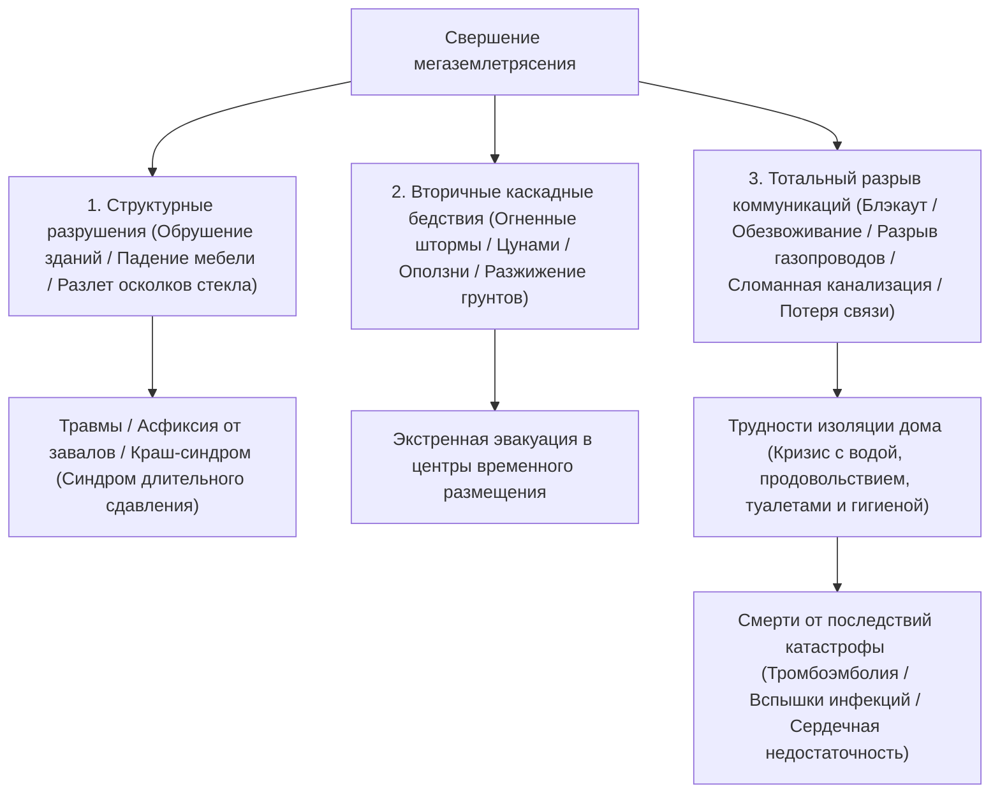
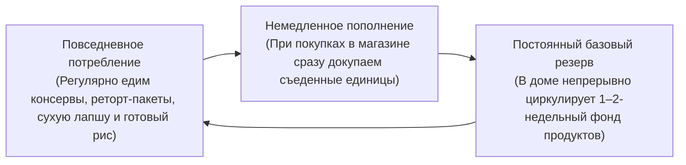
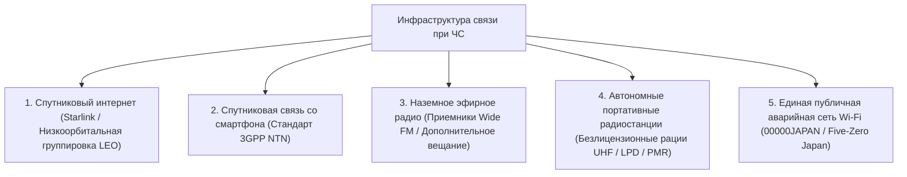

## Введение: Становление «инженерии выживания» на архипелаге комплексных катастроф

Японский архипелаг, расположенный вдоль Тихоокеанского огненного кольца, занимает всего 0,25 % площади суши планеты. Однако на этой узкой территории концентрируется около 20 % всех происходящих на Земле землетрясений магнитудой 6 и выше, а также порядка 7 % действующих вулканов мира, что делает регион одной из зон с наивысшей плотностью природных угроз.

В XXI веке глобальное потепление, вызывающее прогрев поверхностных вод океана и резкий рост влагоемкости атмосферы, окончательно разрушило классические линейные модели метеопрогнозирования. Экстремальные ливни, генерируемые стационарными «линейными дождевыми фронтами», масштабные комбинированные паводки, где прорывы речных дамб совпадают с параличом городской ливневой канализации, а также неизбежность прогнозируемых национальных мегакатастроф — таких как мегаземлетрясение в желобе Нанкай (магнитуда 8–9), прямое землетрясение под Токио и взрывное плинианское извержение вулкана Фудзи — приближают угрозу полного системного коллапса государства.

В столь экстремальных условиях государственная и муниципальная «Общественная помощь» (Кодзё) сталкивается с непреодолимыми физическими пределами. Сразу после разрушительного толчка разрывы дорожных артерий, неконтролируемые пожары, паралич магистральных оптоволоконных сетей и структурные повреждения самих административных зданий создают критический вакуум помощи: **«период как минимум в 72 часа (3 суток), перерастающий в катастрофах регионального масштаба в срок свыше одной недели»**, прежде чем поисково-спасательные отряды и гуманитарные грузы смогут достичь изолированных домохозяйств.

Прикладной дисциплиной, позволяющей автономно преодолеть этот смертоносный вакуум и спасти жизни своей семьи и местного сообщества, является **«Инженерия снижения риска бедствий (Disaster Mitigation Engineering)»**, а ее материальным носителем — **«Аварийно-спасательное снаряжение и экипировка выживания (Emergency Survival Gear)»**. Предметы гражданской обороны — это не хаотичная скупка повседневных товаров. Это автономная портативная система жизнеобеспечения, спроектированная для поддержания биохимического гомеостаза человеческого организма и санитарно-эпидемиологической безопасности в условиях абсолютного коллапса критической городской инфраструктуры — электросетей, водопровода, газоснабжения, канализации и связи.

В настоящем фундаментальном труде последовательно раскрываются временная динамика катастроф и количественная оценка рисков, трехступенчатая модульная архитектура экипировки (Фазы 0, 1 и 2), биохимические и санитарно-инженерные основы очистки воды, питания и утилизации экскрементов, автономные энергосистемы, а также клинические протоколы профилактики предотвратимой смертности в пунктах временного размещения.

```
【Эволюция фаз катастрофы и функциональное развертывание снаряжения】

┌─────────────────┬───────────────────────────────┬───────────────────────────────┐
│ Фаза            │ Временная шкала и обстановка  │ Требуемый функционал и состав │
├─────────────────┼───────────────────────────────┼───────────────────────────────┤
│ Фаза 0          │ Обычная жизнь, поездки, улица │ EDC Фазы 0: Спасательный сви- │
│ (Момент удара)  │ (Непредсказуемость локации)   │ сток, микрофонарь, туалет-пак │
├─────────────────┼───────────────────────────────┼───────────────────────────────┤
│ Фаза 1          │ Момент удара — первые 24 часа │ Эвакуационный рюкзак (Go-Bag):│
│ (Экстренный     │ Немедленное бегство от завалов│ Каска, респиратор N95, защит- │
│ отход)          │ городских пожаров и цунами    │ ные ботинки, фляга, ID-карта  │
├─────────────────┼───────────────────────────────┼───────────────────────────────┤
│ Фаза 2          │ От 24 до 72 часов             │ Ожидание спасателей / Укрытие │
│ (Жизнеобеспеч.) │ Полный блэкаут, разрыв сетей, │ дома: Травматологический набор│
│                 │ изоляция жилых кварталов      │ термоодеяло, мембранный фильтр│
├─────────────────┼───────────────────────────────┼───────────────────────────────┤
│ Фаза 3          │ От 72 часов до более 1 недели │ Резерв Фазы 2 (Домашний склад)│
│ (Длительное     │ Затяжное автономное укрытие,  │ Склады воды и пайков, автоном-│
│ выживание)      │ удержание санитарных норм     │ ный генератор, санузлы        │
└─────────────────┴───────────────────────────────┴───────────────────────────────┘
```

---

## 1. Механизмы комплексных катастроф и инженерия таймлайна

Построение эффективной системы гражданской защиты требует строгого физического анализа первичных природных явлений и каскадной последовательности отказов современных урбанистических систем.

### 1.1 Физика сейсмических колебаний: Субдукционные мегаразломы vs внутриконтинентальные разломы
Разрушительные землетрясения принципиально подразделяются на два геодинамических класса:

1. **Субдукционные землетрясения на границах плит (например, желоб Нанкай, Великое восточно-японское землетрясение 2011 года)**:
   Возникают вдоль границы, где океаническая плита погружается под континентальную. Протяженность зоны разрыва составляет сотни километров, вследствие чего фаза мощных сотрясений длится несколько минут, причиняя колоссальные разрушения на огромных пространствах. Вертикальная подвижка океанического дна рождает разрушительные цунами, обрушивающиеся на побережье за считанные минуты. Кроме того, генерируются длиннопериодные сейсмические волны, входящие в резонанс с высотными зданиями.
2. **Внутриконтинентальные мелкофокусные землетрясения (прямой удар) (например, землетрясение в Кобе 1995 года, землетрясение в Кумамото 2016 года)**:
   Вызываются внезапным сдвигом активных разломов в верхних горизонтах континентальной коры. Из-за предельно малой глубины очага разница во времени прихода первичных продольных волн (P-волн) и разрушительных поперечных волн (S-волн) — интервал S-P — практически равна нулю. Чудовищные вертикальные перегрузки и высокочастотные импульсные волны бьют в конструкции снизу вверх без предварительных микроколебаний, мгновенно складывая деревянные строения, опрокидывая тяжелую мебель и рассекая мостовые переходы.



### 1.2 Вулканические извержения и динамика паралича городов под слоем пепла
В Японии насчитывается 111 активных вулканов. Крупномасштабное плинианское извержение Фудзи, Асамы, Асо или Сакурадзимы несет угрозу, далеко выходящую за пределы локальных лавовых и пирокластических потоков: оно вызывает **«широкомасштабный пеплопад»**, оборачивающийся технологическим параличом инфраструктуры.

Вулканический пепел — это не мягкая органическая древесная зола; он представляет собой **«остроугольные, высокоабразивные микроскопические осколки вулканического стекла и кристаллов силикатных минералов (диоксид кремния SiO₂)»**:
- **Коллапс линий электропередач**: Слой пепла толщиной всего в несколько миллиметров при увлажнении дождем приобретает высокую электропроводность. На керамических изоляторах ЛЭП происходят электрические пробои и дуговые перекрытия, вызывающие масштабные веерные отключения энергосетей.
- **Транспортный коллапс**: На дорогах даже тончайший налет пепла снижает коэффициент сцепления до критических значений, провоцируя массовые заносы. Абразивная пыль моментально забивает воздушные фильтры двигателей внутреннего сгорания, глуша моторы. Железные дороги останавливаются из-за потери электрического контакта колес с рельсами. Аэропорты закрываются, поскольку частицы кремния плавятся в камерах сгорания реактивных двигателей, превращаясь в стекловидную глазурь и приводя к отказу турбин.
- **Цементация канализации**: Попытки смыть пепел водой в домашнюю канализацию приводят к его оседанию и затвердеванию на дне труб по типу гидробетона, что физически и безвозвратно уничтожает подземную коллекторную сеть.
- **Поражение дыхательных путей и органов зрения**: Частицы размером менее 2,5 мкм проникают в альвеолы легких, провоцируя тяжелые астматические приступы и острый отек легких, а также вызывая эрозию роговицы глаз.

Поэтому комплект защиты от вулканических угроз обязан включать респираторы класса N95/FFP2 или выше, герметичные панорамные очки, непромокаемую одежду и прочную строительную ленту для герметизации жилья.

---

## 2. Инженерное проектирование оснащения по фазам ЧС (Фазы 0, 1 и 2)

Эшелонирование аварийно-спасательных средств должно быть строго разделено на три функциональных уровня, откалиброванных по радиусу мобильности человека и временной шкале бедствия.

```
【Трехуровневая модульная архитектура защиты】

［Уровень 0: EDC (Everyday Carry / Повседневный карманный набор)］
・Контекст: Постоянное ношение при себе в транспорте, на работе и в поездках (Весовой лимит: от 300 до 500 г).
・Задача: Обеспечить выживание в первые изолированные часы от момента катастрофы до возвращения домой или в опорный пункт.

［Уровень 1: Тревожный рюкзак (Emergency Go-Bag)］
・Контекст: Постоянное размещение в прихожей у входной двери или у изголовья кровати (10–15 кг для мужчин, 8–10 кг для женщин).
・Задача: Обеспечить мгновенное бегство при угрозе обрушения, пожара или цунами; удержание жизненных параметров в первые 24–48 часов.

［Уровень 2: Домашний стратегический резерв (Home Stockpile)］
・Контекст: Рассредоточенное хранение в кладовых и технических помещениях жилья (Запас на 7–14 дней).
・Задача: Обеспечение биологической жизни и поддержание санитарного кордона в квартире при полном отключении коммунальных сетей.
```

### 2.1 Набор Фазы 0 (EDC): Скрытый тактический подсумок в повседневной жизни
Современный горожанин проводит большую часть активного времени вне дома (офисные башни, метрополитен, моллы). Внезапное землетрясение днем грозит зависанием в лифте, остановкой поезда в темном тоннеле или многочасовым маршем по завалам.

```
【Обязательная полезная нагрузка подсумка EDC Фазы 0 (~400 г)】

1. Компактный светодиодный фонарь высокой яркости (Питание AA/AAA или зарядка USB-C, >=100 люмен)
2. Спасательный бессферический свисток (Двухкамерный дизайн, громкость >=100 дБ, звучит в воде)
3. Спасательное металлизированное майларовое термоодеяло (Отражение тепла тела, ветро- и влагозащита)
4. Портативные химические туалетные пакеты (Суперабсорбирующий гранулят + барьерные мешки: мин. 2 шт.)
5. Надежный повербанк высокой емкости (5 000–10 000 мА·ч) + износостойкий мульти-кабель
6. Индивидуальная аптечка (Пластыри, спиртовые салфетки, анальгетики, 3-дневный запас личных препаратов, маски N95)
7. Разменные наличные деньги (Мелкие банкноты и монеты: для таксофонов; платежные терминалы при блэкауте мертвы)
8. Медицинская идентификационная карта (Группа крови, аллергии, хронические болезни, телефоны родственников)
```

### 2.2 Эвакуационный рюкзак Фазы 1 (Go-Bag): Весовая эргономика
Главная ошибка при сборе эвакуационного рюкзака — чрезмерная масса, превращающая человека в неподвижную мишень, неспособную бежать или преодолевать разрушенные конструкции. Предельно допустимая нагрузка для сохранения маневренности составляет **«около 20 % от массы тела для взрослого мужчины (12–15 кг) и около 15 % для взрослой женщины (7–10 кг)»**.

```
【Распределение центра тяжести в эвакуационном рюкзаке】

・Верхняя часть вплотную к спине: Самые тяжелые предметы (питьевая вода, сухие пайки, энергоблоки)
  -> Прижимает центр массы к позвоночнику, минимизируя скручивающий крутящий момент в пояснице.
・Средний слой и наружные отсеки: Предметы средней массы (сменная одежда, дождевик, травматологический набор).
・Нижняя донная часть: Легкие и объемные вещи (компактный спальник, теплая флисовая куртка, микрофибровое полотенце).
・Клапан и боковые карманы быстрого доступа: Снаряжение немедленного извлечения (налобный фонарь, свисток, каска, перчатки).
```

Обувь для эвакуации — это категорический фактор выживания. Попытка бежать в шлепанцах или тонких прогулочных кроссовках — фатальная ошибка: после сильного землетрясения асфальт усеян битым бронестеклом, торчащими штырями арматуры и гвоздями. Наличие треккинговых ботинок со стальной или арамидной антипрокольной стелькой в подошве или сертифицированной спецобуви является обязательным требованием.

---

## 3. Водообеспечение и инженерные методы очистки воды

Организм человека приблизительно на 60 % состоит из воды. Если без твердой пищи обмен веществ способен функционировать несколько недель, то полное прекращение гидратации приводит к острому клеточному обезвоживанию, гиповолемическому шоку и необратимой полиорганной недостаточности уже через 3–5 суток.

### 3.1 Научно обоснованный расчет физиологической потребности в воде
Согласно стандартам чрезвычайной медицины, базисный порог воды для поддержания жизни определен как:

$$\text{Минимальная потребность в воде} = 3,0 \text{ литра / человек / сутки}$$

Соответственно, для семьи из 4 человек, укрывающейся дома в течение одной недели:

$$3 \text{ L} \times 4 \text{ человека} \times 7 \text{ дней} = 84 \text{ литра}$$

Это требует заблаговременного запаса сорока двух 2-литровых бутылей исключительно для удовлетворения базового метаболизма. С учетом воды на приготовление пищи, гигиеническое мытье рук, санацию ран и уход за полостью рта реальный объем возрастает в разы.

### 3.2 Микрофильтрация на мембранах из полых волокон (Hollow Fiber Membrane)
Когда запасы бутилированной воды исчерпаны, портативный ультрафильтрационный мембранный фильтр (например, Sawyer Squeeze/Mini или Katadyn BeFree), позволяющий очищать дождевую, речную, колодезную или запасенную в ванне воду, становится абсолютной гранью выживания.

```
【Принцип очистки воды мембраной из полых волокон】

Исходная загрязненная вода (Глина, взвеси, патогенные бактерии, цисты простейших)
  ↓
［Пористая мембрана из полых волокон: Номинальный размер пор 0,1 мкм (100 нанометров)］
  │
  ├─ 【Физически удерживаемые и отсекаемые микроорганизмы】
  │   ・Патогенные простейшие (Cryptosporidium: ~4–6 мкм, Giardia: ~8–14 мкм)
  │   ・Инфекционные бактерии (Escherichia coli: ~0,5 × 2 мкм, холера, сальмонелла)
  │   ・Микропластик, коллоидный ил, взвешенные осадочные частицы
  │
  └─ 【Молекулы и ионы, свободно проходящие сквозь поры】
      ・Молекулы чистой воды (H₂O: размер молекулы ~0,3 нанометра)
      ・Растворенные полезные минеральные электролиты (Na⁺, Ca²⁺, Mg²⁺)
  ↓
Стерильная, биологически безопасная питьевая вода
```

Однако полые волокна имеют четкие физические ограничения: полностью растворенные химические вещества (тяжелые металлы, гербициды, радиоактивные изотопы) и вирусы нанометрового масштаба (0,02–0,08 мкм, такие как норовирус, ротавирус, гепатит A) способны преодолевать барьер в 0,1 мкм. Поэтому при заборе воды в городской черте с подозрением на канализационные стоки золотое правило требует сочетать ультрафильтрацию с **активным кипячением в течение не менее 1 минуты** либо с **химической дезинфекцией гипохлоритом натрия**.

---

## 4. Биохимия аварийных рационов и технологии консервации

Питание в условиях катастроф не сводится к банальному пополнению калорий; оно выполняет фундаментальную задачу по поддержанию иммунного статуса и обеспечению нейрохимического баланса в условиях запредельного стресса.

### 4.1 Альфа-рис: Кристаллография крахмала между клейстеризацией и ретроградацией
Основа современных рационов гражданской обороны — «альфа-рис» (быстроразвариваемый предварительно клейстеризованный обезвоженный рис) — представляет собой шедевр пищевой физической химии.

```
【Фазовые переходы кристаллической структуры крахмала в альфа-рисе】

Нативный крахмал сырого зерна (Бета-крахмал / β-starch)
・Плотная мицеллярная кристаллическая упаковка. Молекулы воды не проникают внутрь; альфа-амилаза желудочно-кишечного тракта человека не может расщепить связи.
  ↓ Гидротермическая варка (Клейстеризация / Альфа-реакция)
Клейстеризованный крахмал (Альфа-крахмал / α-starch)
・Тепловая энергия разрывает водородные связи, кристаллическая решетка распадается на легкоусвояемый рыхлый гидрогель.
  ↓ (При обычном медленном остывании крахмал теряет воду и переходит в жесткий неперевариваемый «ретроградированный крахмал [β'-крахмал]»)
［Промышленная высокотемпературная шоковая сушка］
・Свежесваренный рис в полностью набухшем альфа-состоянии подвергается резкой обдувке сухим воздухом (80–100 °C и выше), сбрасывая влажность ниже 8–10 %.
・Этот процесс мгновенно блокирует рекристаллизацию, навечно фиксируя пористую губчатую структуру альфа-состояния.
  ↓
Капиллярная регидратация при использовании
・При заливке кипятком (15 мин) или холодной водой (60 мин) вода мгновенно затягивается в микропоры за счет капиллярных сил, полностью восстанавливая вкус свежесваренного риса. Срок хранения: от 5 до 7 лет при комнатной температуре.
```

### 4.2 Физика сублимационной сушки (Freeze-Drying / Лиофилизация в вакууме)
Применяемая для супов, белковых блюд и овощей, лиофилизация использует свойства **«Тройной точки воды»** (0,01 °C при 611,65 Па) для испарения льда в глубоком вакууме без перехода в жидкую фазу.

Продукты подвергаются глубокой заморозке до температуры от −30 °C до −50 °C, помещаются в герметичную камеру, где давление откачивается ниже тройной точки. При контролируемой подаче скрытой теплоты сублимации кристаллы льда в клетках испаряются напрямую в виде пара.

```
【Биофизические преимущества вакуумной сублимационной сушки】

1. Сохранение микроструктуры тканей:
   Отсутствие высокотемпературной обработки исключает термическую денатурацию белков; клеточные мембраны остаются целыми, сохраняя термолабильные витамины группы B и C.
2. Кардинальное снижение массы:
   Удаляется 95–98 % всей влаги, снижая сухой вес до минимума, что снимает перегрузку с рюкзака.
3. Мгновенная восстанавливаемость:
   Испарившийся лед оставляет после себя открытую пористую губчатую матрицу. При контакте с водой поверхностное натяжение моментально заполняет поры, восстанавливая текстуру, сочность и аромат за секунды.
```

### 4.3 Метод динамической ротации запасов Rolling Stock
Покупка коробок жестких сухих пайков с целью запереть их в темной кладовке на пять лет до истечения срока годности — устаревшая и психологически ущербная концепция.
Современным стандартом является **«Метод Rolling Stock (Непрерывный оборот резервов)»**.



Ключевая психотерапевтическая ценность метода Rolling Stock — **«обеспечение пострадавших привычной комфортной едой (Comfort Foods) в эпицентре бедствия»**. В условиях тяжелейшего стресса принуждение людей (особенно детей и пожилых) к питанию безвкусными сухими прессованными брикетами вызывает потерю аппетита, гастриты и глубокую депрессию. Ротация долгохранящихся качественных продуктов повседневного меню — наиболее устойчивая модель.

---

## 5. Санитарная инженерия и выживание в пунктах эвакуации (Инфекции, экскременты и терморегуляция)

Анализ эпидемиологических данных катастрофических землетрясений выявляет пугающий факт: во время землетрясений в Кобе (1995), Кумамото (2016) и на полуострове Ното (2024) число **«Смертей от последствий катастрофы (Disaster-Related Deaths)»** — людей, которые выжили при толчках и цунами, но скончались в последующие дни и недели из-за антисанитарии в эвакуации — в ряде муниципалитетов превысило количество прямых жертв.

Главным триггером таких смертей является не голод, а **«коллапс общественной гигиены»** и **«паралич инфраструктуры утилизации человеческих нечистот»**.

### 5.1 Автономные сухие туалеты и химия суперабсорбирующих полимеров (SAP)
При перекрытии водопровода **категорически запрещено смывать унитазы, заливая в них воду из ведер**. Если подземные коллекторы или стояки в здании треснули, нечистоты с верхних этажей фонтаном хлынут из унитазов нижних квартир, превращая жилой дом в очаг опаснейшей биоугрозы.

Единственно верное решение — установка прочных утилизационных пакетов прямо на чашу унитаза с добавлением сорбентов-коагулянтов. Базовым веществом служит **«Суперабсорбирующий полимер (SAP: сшитый полиакрилат натрия)»**.

```
【Биохимия связывания жидких экскрементов полимером SAP】

┌─────────────────────────────────────────────────────────────┐
│ Диссоциация гидрофильных карбоксильных групп (-COONa):      │
│ При контакте с мочой ионы натрия (Na⁺) диссоциируют, остав- │
│ ляя отрицательно заряженные группы (-COO⁻) на полимерной цепи│
│   ↓                                                         │
│ Взрывное раскрытие сети за счет электростатического отталкив.:│
│ Силы взаимного отталкивания одноименных отрицательных зарядов│
│ заставляют свернутые полимерные клубки мгновенно расправляться│
│ и расширять объем пространственной сетки.                   │
│   ↓                                                         │
│ Осмотическое поглощение и необратимая фиксация в гидрогель: │
│ Высокая концентрация ионов внутри сетки создает колоссальное│
│ осмотическое давление, всасывающее объем воды в сотни и тысячу│
│ раз больше собственного веса полимера, запирая ее в жесткий │
│ гидрогель (жидкость не выделяется даже при сильном сжатии). │
└─────────────────────────────────────────────────────────────┘
```

Качественные коагулянты обогащены наночастицами серебра ($Ag^+$), солями хлора и растительными таннинами, которые уничтожают кишечную палочку и химически блокируют выделение аммиака ($NH_3$) и сероводорода ($H_2S$).

#### Патофизиология задержки мочи и «Синдром эконом-класса»
Когда общественные туалеты превращаются в темные зловонные рассадники заразы, эвакуированные (в особенности женщины и пожилые люди) инстинктивно включают опасный компенсаторный механизм: **они резко прекращают пить воду, чтобы не ходить в туалет**.

Отказ от жидкости ведет к сгущению крови (гемоконцентрации). В сочетании с неподвижностью при ночевках в тесных автомобилях или на холодном бетонном полу компрессия подколенных и бедренных вен приводит к тромбозу глубоких вен (ТГВ). При резком подъеме на ноги оторвавшийся тромб летит через сердце в легочные артерии, вызывая массивную тромбоэмболию легочной артерии («Синдром эконом-класса») и мгновенную смерть. Обеспечение чистых, освещенных и безопасных туалетов — это неотложное медицинское спасение жизней.

### 5.2 Тепловая защита: Алюминизированные майларовые термоодеяла (BoPET)
Случайная гипотермия (падение внутренней температуры тела ниже 35 °C) возможна не только в мороз: на ветру и в одежде, промокшей от пота или дождя, переохлаждение наступает даже в разгар лета.

Космическое термоодеяло изготавливается из биаксиально-ориентированной полиэтилентерефталатной пленки (BoPET / Mylar) толщиной всего 12 микрометров с вакуумным напылением металлического алюминия высокой чистоты.
Благодаря зеркальному эффекту свободных электронов металла **«оно отражает более 90 % длинноволнового инфракрасного излучения (лучистого тепла), выделяемого телом»**, обратно к человеку. Одновременно пленка ликвидирует конвективные потери тепла от ветра и охлаждение от испарения, при весе всего в 50 граммов заменяя несколько тяжелых шерстяных одеял.

---

## 6. Автономное электроснабжение и отказоустойчивая связь

Отключение электроэнергии и падение сотовой связи ввергают выживших в кромешную тьму, изоляцию и панику от дезинформации. Создание независимой энергосистемы и дублированных каналов связи — первичная линия обороны.

### 6.1 Литий-железо-фосфатные батареи (LiFePO₄): Безопасность и электрохимия
При подборе емкой портативной электростанции химический состав катода является важнейшим критерием безопасности. Между классическими трехкомпонентными литий-ионными батареями (NMC: никель-марганец-кобальт) и передовыми **«Литий-железо-фосфатными (LFP / $\text{LiFePO}_4$)»** существует фундаментальная разница.

```
【Сравнение физико-химических свойств: Батареи NMC vs LiFePO₄】

┌──────────────────────┬───────────────────────────────┬───────────────────────────────┐
│ Параметр сравнения   │ Тройные системы (NMC/NCA)     │ Литий-железо-фосфат (LiFePO₄) │
├──────────────────────┼───────────────────────────────┼───────────────────────────────┤
│ Кристаллическая реш. │ Слоистая нестабильная решетка │ Оливиновая структура (прочные │
│                      │                               │ ковалентные связи P-O)        │
│ Температура термораз-│ ~200–210 °C                   │ ~400–500 °C                   │
│ гона (Thermal Runaway│ (Низкий порог термоустойчив.) │ (Предельная термостабильность)│
│ Выделение кислорода и│ Бурно выделяет O₂ при переза- │ Кислород не выделяется;       │
│ пожароопасность      │ ряде или пробое; взрывное     │ возгорание и взрыв исключены  │
│                      │ катастрофическое горение      │ даже при прямом КЗ и пробое   │
├──────────────────────┼───────────────────────────────┼───────────────────────────────┤
│ Ресурс циклов заряда │ ~500–800 циклов               │ ~3 000–4 000 циклов (более    │
│                      │ (Быстрая деградация емкости)  │ 10 лет активной эксплуатации) │
│ Плотность энергии    │ Высокая (Легче и компактнее)  │ Умеренная (Немного массивнее) │
└──────────────────────┴───────────────────────────────┴───────────────────────────────┘
```

В сфере ЧС, где станции годами хранятся в тесных шкафах или раскаленных автомобилях, **термическая безопасность и десятилетний ресурс сделали генераторы на базе $\text{LiFePO}_4$ безальтернативным мировым стандартом**.

### 6.2 Солнечные панели и контроллеры заряда с алгоритмом MPPT
При затяжном отключении электричества розетки бесполезны. Необходим постоянный фотоэлектрический подзаряд.
Использование высокоэффективных складных монокристаллических панелей (КПД 22–24 %+) совместно с контроллерами заряда **MPPT (Maximum Power Point Tracking — отслеживание точки максимальной мощности)** обеспечивает снятие максимальной отдачи энергии даже при сплошной облачности и косых лучах на рассвете и закате.

---

## 2.3 Тактическая медицина катастроф (Trauma Care) и турникет CAT

При обрушениях зданий, разлете битого стекла и ударах плавающего мусора цунами главной причиной мгновенной гибели становится **«профузное артериальное кровотечение»**. Пересечение бедренной или плечевой артерии способно лишить пострадавшего трети объема циркулирующей крови (около 8 % веса тела) за считанные минуты. Ожидание скорой помощи при разрушенной инфраструктуре гарантирует летальный геморрагический шок.

По стандартам тактической помощи раненым (TCCC), эталонным средством для остановки массивных кровотечений из конечностей при неэффективности прямого давления признан **«Боевой кровоостанавливающий турникет (CAT: Combat Application Tourniquet)»**.

```
【Устройство турникета CAT и протокол окклюзии артерий】

┌─────────────────────────────────────────────────────────────┐
│ Наложение щелевой пряжки и высокопрочной нейлоновой ленты:  │
│ Расположить на 5–7 см выше раны (проксимальнее, к сердцу).   │
│ (Не накладывать на суставы. В суматохе и темноте при неясной │
│ локализации — накладывать максимально высоко на конечность). │
│   ↓                                                         │
│ Вращение прочного воротка (Windlass Rod):                    │
│ Вращать полимерный стержень, утягивая внутреннюю стропу для │
│ создания кругового давления, пережимающего артерию о кость. │
│ Закручивать до полной остановки пульсирующего кровотечения. │
│   ↓                                                         │
│ Фиксация в С-клипсе и запись точного времени:               │
│ Защелкнуть вороток в фиксаторе. Водостойким маркером четко  │
│ написать время наложения на белой стропе (максимально допус-│
│ тимый порог ишемии тканей — не более 2 часов).              │
└─────────────────────────────────────────────────────────────┘
```

В переходных узловых зонах (паховая складка, подмышечная впадина, основание шеи), где турникет неприменим, спасением служит **«Гемостатическая марля с каолином или хитозаном (например, QuikClot)»**. Каолин вызывает каскадную активацию фактора свертывания XII; при плотной тугой тампонаде раны прочный тромб образуется за несколько минут.

При проникающих ранениях груди осколками стекла или арматуры («открытый пневмоторакс») необходим **«Окклюзионный пластырь с клапаном (Vented Chest Seal)»**, позволяющий стравливать воздух и кровь наружу и не допускающий подсос воздуха внутрь, спасая от удушья при напряженном пневмотораксе.

---

## 5.3 Международные стандарты гуманитарной помощи: Проект «Сфера» и концепция «TKB48»

Мировым стандартом человеческого достоинства в лагерях беженцев является **«Справочник Сфера (The Sphere Project)»**, созданный Красным Крестом и международными организациями. Традиционная практика эвакуации (ночевки на ледяном полу спортзалов, холодные рисовые шарики, вонючие кабинки биотуалетов) признана опасной для жизни.

Японская медицина катастроф выдвинула обязательный норматив **«TKB48 (Развертывание туалетов, кухонь и кроватей за 48 часов / Toilets, Kitchen, Bed)»**.

```
【Три столпа общественной гигиены в убежищах: Стандарты TKB】

1. Ｔ (Туалеты / Toilet):
   ・Стандарт Сферы: Не менее 1 санузла на 20 человек; пропорция мужчин и женщин 1:3 (с учетом женской физиологии).
   ・Санитария: Круглосуточный свет, умывальники с мылом, перегородки от брызг, надежные внутренние задвижки.
   ・Цель: Отсутствие запаха, темноты и порогов, исключающее намеренное сдерживание мочеиспускания.

2. Ｋ (Кухня и горячее питание / Kitchen):
   ・Подача горячей еды: Запуск полевых кухонь на баллонном газе за 48–72 часа для раздачи горячих супов и сбалансированных блюд.
   ・Эффект: Защита от переохлаждения, нормализация перистальтики и снятие тяжелого психоэмоционального стресса.

3. Ｂ (Кровати / Bed):
   ・Повсеместное внедрение кроватей из плотного гофрокартона: Высота ложа 30–40 см над полом.
   ・Клинический эффект:
     ① Отсекает кондуктивную потерю тепла от бетонного пола, предотвращая переохлаждение и пневмонии.
     ② Поднимает зону дыхания выше 30-сантиметрового придонного слоя, где оседает токсичная пыль и аэрозоли норовируса.
     ③ Облегчает подъем пожилым людям, предотвращая атрофию мышц и тромбоз глубоких вен.
```

### Санация полости рта и защита от аспирационной пневмонии
Ведущая причина смертности пожилых эвакуированных людей — **«Аспирационная пневмония»**.
Из-за отсутствия воды прекращается чистка зубов. За 48 часов во рту происходит взрывной рост анаэробных бактерий. Во сне капли слюны с миллионами патогенов затекают в дыхательные пути, вызывая тяжелейшее воспаление легких.
Наличие в аварийной сумке несмываемого жидкого ополаскивателя для рта и специальных дентальных салфеток спасает жизни столь же надежно, как применение антибиотиков.

---

## 6.3 Инженерия резервированных сетей связи: Спутники, радиоволны и 00000JAPAN

При бедствиях наземные вышки сотовой связи отказывают из-за разряда аккумуляторов, обрыва оптоволокна или принудительной блокировки трафика (ограничения свыше 90 % для экстренных служб). Преодоление информационного вакуума требует многослойного дублирования.



### 1. Радиоприемники с поддержкой Wide FM (дополнительное FM-вещание)
Классическое AM-радио (средние волны 526,5–1606,5 кГц) обладает большой дальностью, но экранируется железобетонными стенами и глушится помехами импульсных блоков питания.
Система «Wide FM» (диапазон УКВ 90,0–95,0 МГц) транслирует передачи экстренного AM-вещания на чистых частотах FM. УКВ-сигналы легко проникают в здания и не боятся городских помех, гарантируя прием оповещений о землетрясениях и приказов об эвакуации. Радиоприемник с ручным динамо-генератором — базовый элемент защиты.

### 2. Спутниковая революция: Starlink и спутниковый SOS на смартфонах
Низкоорбитальная спутниковая сеть SpaceX «Starlink» (~550 км) перевернула ликвидацию ЧС. Компактная фазированная антенна обеспечивает интернет со скоростью в сотни мегабит в эпицентре разрушений, что подтвердилось при землетрясении на Ното в 2024 году.

Одновременно флагманские смартфоны получили поддержку стандарта 3GPP Release 17/18 Non-Terrestrial Network (NTN). Даже при полном отсутствии вышек связи телефон соединяется напрямую со спутниками на орбите, передавая экстренные текстовые сообщения и точные координаты бедствия спасателям.

---

## 2.4 Городские пожары, первичное тушение и защита от дыма

Одним из самых смертоносных факторов сильных землетрясений являются **«Множественные синхронные городские пожары (Огненные штормы)»**. В плотной застройке разрывы газовых труб, упавшие обогреватели и замыкания при подаче тока вызывают тысячи одновременных возгораний, парализуя пожарную охрану.

### Химия самоспасателей и противогазовых капюшонов (Smoke Blocks)
Около 60 % жертв пожаров погибают не от ожогов, а от **«отравления токсичными продуктами горения (угарным газом и цианистым водородом)»**. Горение синтетики и полиуретановых утеплителей порождает синильную кислоту ($HCN$) и фосген ($COCl_2$). Мокрое полотенце у рта бессильно против нерастворимого угарного газа и микрочастиц сажи.

Сертифицированные дымозащитные капюшоны содержат термостойкую фольгированную накидку, фильтр из активированного угля и **«Гопкалитовый катализатор (Hopcalite: смесь оксидов марганца и меди)»**. При комнатной температуре гопкалит мгновенно окисляет смертоносный угарный газ ($CO$) в безвредный углекислый газ ($CO_2$), давая 10–15 минут чистого дыхания для эвакуации по задымленным лестницам.

### Выбор первичных средств пожаротушения
- **Огнетушители с водным составом с добавками (водно-эмульсионные / Loaded Stream)**: В отличие от порошковых огнетушителей (АВС), ослепляющих едкой пылью и оставляющих тлеющие угли, водные огнетушители распыляют раствор щелочных солей. Он проникает в глубину волокон древесины, охлаждая ее и предотвращая повторное возгорание, не ухудшая видимость в тесных комнатах.
- **Сейсмические автоматы отключения сети (Earthquake-sensing breakers)**: Для защиты от пожаров при возобновлении подачи тока эти приборы обесточивают домашний электрощит при фиксации разрушительных толчков силой более 5 баллов.

---

## 1.3 Инженерия антисейсмического крепления мебели и защитные пленки на окна
Данные судмедэкспертиз после катастроф в Кобе и Ното подтверждают: более 80 % смертей в помещениях произошли от **«травматической асфиксии и сдавливания при обрушении стен и падении тяжелой мебели и бытовой техники»**. При толчках силой 6–7 баллов шкафы, холодильники и пианино превращаются в тяжелые снаряды, калечащие людей и наглухо блокирующие выходы.

Защита мебели требует механического расчета прочности.

```
【Механическая прочность крепежа и правила монтажа】

┌──────────────────────┬───────────────────────────────┬───────────────────────────────┐
│ Тип крепежа          │ Принцип механического удержан.│ Критическое правило монтажа   │
├──────────────────────┼───────────────────────────────┼───────────────────────────────┤
│ Мощные стальные      │ Прикручиваются напрямую к не- │ Вкручивать саморезы в один    │
│ L-образные уголки    │ сущим деревянным или металлич.│ только гипсокартон бесполезно.│
│ (Золотой стандарт)   │ стойкам стены. Держат опрокид.│ Искать стойки детектором.     │
├──────────────────────┼───────────────────────────────┼───────────────────────────────┤
│ Телескопические вер- │ Создают распорное сжатие меж- │ Тонкие фанерные потолки прола-│
│ тикальные штанги     │ ду шкафом и потолком; вязко-  │ мываются. Обязательно подкла- │
│ ＋ Вязкоупругий гель │ упругий гель внизу гасит сдвиг│ дывать широкие доски под упоры│
├──────────────────────┼───────────────────────────────┼───────────────────────────────┤
│ Высокопрочные тканые │ Прочные стропы или тросы удер-│ Жестко крепить к стойкам стены│
│ стропы и стальные тр.│ живают габаритную технику     │ чтобы поглощать инерцию за    │
│                      │ с высоким центром тяжести.    │ счет упругой деформации стропы│
└──────────────────────┴───────────────────────────────┴───────────────────────────────┘
```

### Защитные пленки от разлета осколков (многослойный ПЭТ)
При деформации оконных рам под воздействием землетрясения листовые стекла лопаются от сдвига, разбрасывая острые лезвия по комнатам.
Многослойная полиэфирная (ПЭТ) пленка толщиной 50–100 мкм, наклеенная изнутри, благодаря акриловому клею намертво удерживает осколки разбитого стекла единым полотном, на 100 % ликвидируя опасность порезов.

---

## 2.5 Гидродинамика выживания при наводнениях и селях

Затопления от тайфунов и прорывов дамб требуют совершенно иных правил экипировки, продиктованных законами гидродинамики.

### 1. Обувь для эвакуации: Почему высокие резиновые сапоги смертельно опасны
Идти по затопленным улицам в высоких резиновых сапогах — грубейшая ошибка в практике спасения на воде.
Как только уровень воды превышает колени (40–50 см), вода переливается через голенища внутрь. Обратно вода не выливается, превращая каждый сапог в многокилограммовую гирю. Человек не может оторвать ноги от дна, падает в открытые канализационные люки или придорожные канавы и захлебывается насмерть.
Единственно правильный выбор — **«прочные кроссовки на шнурках с быстрым сливом воды ＋ плотные синтетические или неопреновые носки»**. Плотно зашнурованные, они не слетают от течения, не набирают мертвого веса и защищают стопу от подводных препятствий.

### 2. Гидростатическое давление и блокировка дверей
При затоплении автомобиля или первого этажа сила, прижимающая наружную дверь, рассчитывается по формуле гидростатики:

$$F = \rho g h A$$

Где $\rho$ — плотность воды, $g$ — ускорение свободного падения, $h$ — глубина воды, $A$ — площадь смоченной поверхности двери.
При уровне воды снаружи **всего 40–50 см** сила давления на дверь достигает сотен килограммов, и открыть ее мускульной силой изнутри невозможно.
Поэтому эвакуироваться необходимо заблаговременно при объявлении 3-го или 4-го уровней тревоги. В каждом автомобиле под рукой должен быть **Аварийный молоток со стеклобоем из карбида вольфрама** для мгновенного разрушения боковых стекол.

---

## 5.4 Специализированная защита уязвимых групп (Младенцы, пожилые, хроники, животные)

Большинство готовых аптечек рассчитано на крепкого здорового взрослого человека. Но в реальности наибольшей опасности подвергаются уязвимые категории граждан со специфическими физиологическими потребностями.

```
【Специализированные протоколы для уязвимых групп】

┌──────────────────────┬───────────────────────────────┬───────────────────────────────┐
│ Категория            │ Специфические риски           │ Специальное оснащение         │
├──────────────────────┼───────────────────────────────┼───────────────────────────────┤
│ Младенцы и кормящие  │ Невозможность вскипятить воду │ Готовая жидкая молочная смесь │
│ матери               │ для смеси; обезвоживание;     │ в стерильной таре с насадками-│
│                      │ стресс от плача в убежище     │ сосками, одноразовые бутылочки│
├──────────────────────┼───────────────────────────────┼───────────────────────────────┤
│ Пожилые люди и мало- │ Аспирация; утрата зубных про- │ Загустители жидкости, мягкие  │
│ мобильные граждане   │ тезов; истощение; сложности   │ протертые блюда, батарейки для│
│                      │ отправления естественных нужд │ слуховых аппаратов, очки      │
├──────────────────────┼───────────────────────────────┼───────────────────────────────┤
│ Хронические больные  │ Срыв гемодиализа, отсутствие  │ Цифровые копии рецептов, пор- │
│                      │ холода для инсулина, остановка│ тативный электроотсасыватель, │
│                      │ кислородных концентраторов    │ связь с дежурным стационаром  │
├──────────────────────┼───────────────────────────────┼───────────────────────────────┤
│ Домашние животные    │ Отказ в допуске в приюты;     │ Складной жесткий бокс-перенос-│
│ (Собаки, кошки)      │ побег в панике; шум и стресс  │ ка, спецкорм и вода на 10 дней│
│                      │                               │ чип-паспорт, пеленки-туалеты  │
└──────────────────────┴───────────────────────────────┴───────────────────────────────┘
```

Разрешение продажи готовых жидких стерильных детских смесей комнатной температуры (не требующих кипячения и стерилизации) стало прорывом в Японии в 2019 году. В разрушенном укрытии возможность накрутить стерильную соску на баночку со смесью спасает жизни новорожденных без промедления.

---

### 7.1 Регулярный домашний аудит готовности к бедствиям (Disaster Audit)

Даже самое совершенное снаряжение превращается в бесполезный груз, если просрочены консервы, сели батареи или изменился состав семьи.
Рекомендуется проводить регулярный **«Домашний аудит готовности»** два раза в год (например, **11 марта** в годовщину Великого восточно-японского землетрясения и **1 сентября** в День предотвращения стихийных бедствий):

1. **Ревизия воды и продовольствия**: Проверить сроки годности и использовать близкие к истечению продукты в повседневном меню через систему Rolling Stock.
2. **Проверка аккумуляторов**: Провести цикл разряда и заряда портативных энергостанций и повербанков для калибровки контроллеров и проверки ячеек.
3. **Ревизия химических и медицинских средств**: Проверить, не слежался ли сорбент для туалета от влаги, не высохли ли спиртовые салфетки и целы ли резиновые прокладки.
4. **Тренировка связи в семье**: Отработать использование телефонной службы экстренных сообщений («171») и оффлайн-мессенджеров.
5. **Анализ карт опасностей (Hazard Maps)**: Проверить обновления зон затопления и оползней, пройти днем пешком весь путь до назначенного убежища.

---

## 7. Заключение: Триединство самопомощи, взаимопомощи и государственной поддержки

Формирование аварийно-спасательного запаса — это не потребительское накопительство. Это осознанное принятие **«Личной ответственности (Personal Responsibility)»** за выживание себя и своих близких — позиция, продиктованная научным расчетом и почтением к силам природы.

Ни массивные волноломы, ни современные сейсмоизолированные здания не дают абсолютной гарантии перед лицом тектонических сил Земли. Когда инженерная защита прорвана, последней гранью между жизнью и смертью становятся качество снаряжения в руках и навыки хладнокровного обращения с ним.

Лишь когда человек надежно обеспечивает собственную безопасность (**Самопомощь / «Дзидзё»**), у него появляются силы и эмоциональный ресурс помочь соседям и организовать низовую дружину (**Взаимовыручка / «Кёдзё»**). И благодаря тому, что граждане стойко выдерживают первые дни своими силами, спасатели, пожарные, армия и хирурги могут бросить 100 % своих ограниченных ресурсов на извлечение погребенных заживо и помощь отрезанным деревням (**Максимизация государственной помощи / «Кодзё»**).

Осознанно и спокойно вплетать готовность к катастрофам в ткань мирной повседневной жизни — это высшая форма человеческой мудрости, позволяющая сохранить жизнь и достоинство на нашей беспокойной планете.
