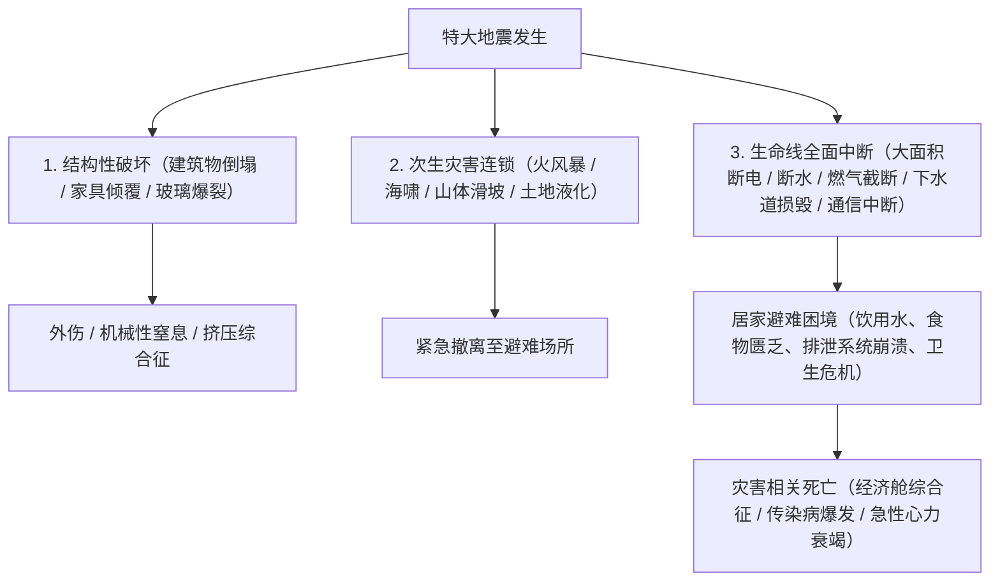
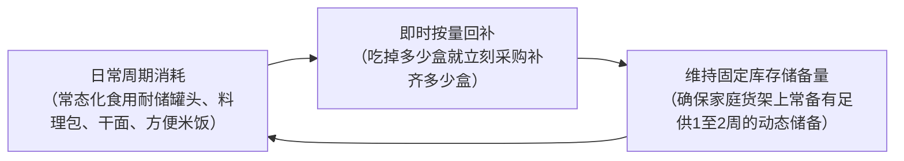
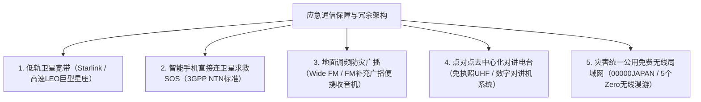

## 引言：多重灾害地带“生存工程学”的建立

位于环太平洋火山地震带的日本列岛，仅占全球陆地表面积的0.25%，却集中了全球约20%的6级以上强震以及约7%的活火山，是世界上自然灾害发生频率与密度最高的区域之一。

进入21世纪以来，伴随全球气候变暖导致的海表水温上升与大气饱和水汽量剧增，彻底打破了传统线性气候预测模型的“线状降水带”引发了极端暴雨；外水漫堤与内涝排洪受阻重叠的复合型洪涝频发；加之在不久的将来几乎必然发生的“南海海槽特大地震（8至9级）”、“首都直下型地震”以及“富士山爆发”，使得国家级系统功能陷入瘫痪的复合型巨灾威胁迫在眉睫。

在此类极端困境下，国家与地方政府提供的“公助”（官方应急救援）存在不可逾越的物理极限。在特大地震发生的最初阶段，道路网断裂、火灾连环蔓延、通信骨干网瘫痪、行政指挥机构自身受损，导致专业救援力量与救灾物资抵达各个孤立家庭之前，必然出现**“至少72小时（3天），在重度受灾区甚至长达一周以上”**的救援真空期。

在这一残酷的真空期内依靠自身力量求生、捍卫家庭与社区生命的实践科学——即**“减灾工程学（Disaster Mitigation Engineering）”**，而其实体承载工具便是**“防灾应急装备（Emergency Survival Gear）”**。防灾用品绝非普通日用品的盲目囤积，而是一套在自来水、电力、燃气、下水道及电信等现代城市生命线彻底崩溃的极端环境下，能够自主维持人体生化内环境稳态（Homeostasis）与公共卫生防线的“便携式生命支持系统”。

本文将从灾害发展的时间轴与风险量化评估切入，全面剖析0级、1级、2级分阶段装备配置理论，深入探讨饮用水净化、应急食品化学、排泄物高分子凝固等公共卫生工程，并系统阐述应急独立能源系统搭建及避难所中防范“灾害相关死亡”的医学救护方案，以严谨的科学体系全面揭示现代危机管理的完整图景。

```
【灾害演进阶段与防灾装备功能部署】

┌─────────────────┬───────────────────────────────┬───────────────────────────────┐
│ 灾害阶段        │ 时间轴与环境状态              │ 所需防灾功能与装备配置        │
├─────────────────┼───────────────────────────────┼───────────────────────────────┤
│ 0级阶段         │ 日常通勤、通学、外出移动中    │ 0级随身包（EDC）：高音求生哨、│
│ （受灾瞬间）    │ （受灾空间与时间不可预测）    │ 便携手电、简易应急厕所袋、急救│
├─────────────────┼───────────────────────────────┼───────────────────────────────┤
│ 1级阶段         │ 灾后即刻至24小时              │ 1级应急逃生包（Go-Bag）：     │
│ （初期紧急撤离）│ 从倒塌、火灾、海啸中快速逃生  │ 头部防护、防尘口罩、防护鞋、水│
├─────────────────┼───────────────────────────────┼───────────────────────────────┤
│ 2级阶段         │ 24小时至72小时                │ 搜救等待 / 居家避难 / 避难所：│
│ （生命维系期）  │ 生命线完全中断、处于孤立状态  │ 创伤急救、保温铝箔毯、净水器  │
├─────────────────┼───────────────────────────────┼───────────────────────────────┤
│ 3级阶段         │ 72小时至1周以上               │ 2级居家储备物资（后勤保障）： │
│ （避难生活持续）│ 避难生活长期化、公卫防线维持  │ 储备粮水、独立应急电源、卫生品│
└─────────────────┴───────────────────────────────┴───────────────────────────────┘
```

---

## 1. 复合型灾害机制与时间轴工程学

要构建行之有效的防灾系统，首先必须透彻理解主要自然灾害的物理成因，以及现代城市基础设施在灾害冲击下的连锁崩溃过程。

### 1.1 地震动物理学：俯冲带海沟型 vs 内陆断层直下型
根据断层破裂与发生机理，强震主要划分为两大类型：

1. **海沟型（板块边界型）地震（如：南海海槽地震、3·11东日本大地震）**：
   发生于大洋板块向大陆板块下方俯冲的消亡边界。由于断层破裂带绵延数百公里，剧烈震动持续时间往往长达数分钟，造成极广区域的严重破坏。海底地壳剧烈抬升或下沉会引发滔天海啸，在数分钟至数十分钟内席卷沿海地带；同时产生的“长周期地震动”会与数十层高的摩天大楼产生共振，导致高层建筑剧烈晃动。
2. **内陆断层直下型地震（如：阪神大地震、熊本地震）**：
   由大陆地壳浅层活动断层的突然错动引发。由于震源深度极浅，从最初的初动微震（P波）到破坏性横波（S波）抵达的预警时间（S-P时间差）几乎为零。极其猛烈的垂直向加速度与高频脉冲地震波直接冲击地表建筑，瞬间造成大量木质房屋整体坍塌、重型家具倾覆飞抛、桥梁道路即刻断裂。



### 1.2 火山喷发与大范围降灰导致的城市功能休克力学
日本境内共有111座活火山。富士山、浅间山、阿苏山、樱岛等大型火山的普林尼式剧烈喷发，其破坏力绝不仅限于局部的熔岩流与碎屑流，更在于**“大范围火山灰沉降”**引发的系统性基础设施休克。

火山灰绝非普通的木炭残灰，而是**“边缘极其锋利的微米级玻璃碎屑与硅酸盐矿物晶体（二氧化硅 SiO₂）”**：
- **电网短路瘫痪**：仅数毫米厚的火山灰层在吸收雨水中的湿气后即具备强导电性，导致高压输电线路的陶瓷绝缘子绝缘击穿、频繁闪络短路，引发大范围电网崩溃。
- **交通网络瘫痪**：道路积灰数毫米即可导致车辆抓地力锐减而频繁失控打滑，微细粉尘会瞬间堵塞内燃机进气滤清器导致发动机熄火；铁轨与车轮之间因绝缘导致信号系统失效停运；机场则由于微细硅质颗粒吸入喷气发动机涡轮燃烧室融化为玻璃态沉积物，导致引擎瞬间空中停机，跑道被迫全面关闭。
- **下水管网堵塞**：居民若将积灰直接冲入下水道，火山灰会在管道内沉淀板结硬化，其坚硬程度堪比混凝土，导致地下管网永久性物理瘫痪。
- **呼吸系统与视网膜损伤**：直径小于2.5微米的超细颗粒能够直接穿透人体防御屏障进入肺泡深处，诱发严重支气管哮喘与急性呼吸窘迫综合征，并导致角膜上皮大面积剥落。

因此，应对火山灾害的专用防护装备必须包括防颗粒物呼吸器（N95/KN95/FFP2级别以上）、全封闭防尘护目镜、高致密雨衣，以及用于室内门窗密封防渗透的专用压敏胶带。

---

## 2. 灾害阶段化防灾装备工程设计（0级、1级、2级）

防灾物资的科学布局与架构，必须依据灾后时间轴推移以及人体机能活动半径，严格划分为三个互不重叠又紧密衔接的层级。

```
【防灾用品三级模块化架构】

［0级随身装备：EDC（Everyday Carry）］
·携带场景：每日通勤、通学、出差或日常外出时随身携带（严格控制重量在300至500克以内）。
·核心使命：在外部突发灾害瞬间，保障幸存者能够度过最初数小时，并顺利徒步返回住所或抵达临时避难集结点。

［1级应急逃生包：Go-Bag（非常持出袋）］
·配置场景：常年放置于玄关门口或卧室床头易取位置（重量控制：成年男性10至15公斤，成年女性8至10公斤以内）。
·核心使命：在房屋倒塌、火灾逼近或海啸预警等极端危机下瞬间背负撤离，保障避难后最初24至48小时的生命体征稳定。

［2级居家应急储备：在宅避难后勤保障（Home Stockpile）］
·配置场景：分散储存于家庭储藏室、壁橱、食品储物柜等干燥阴凉处（储备基准为7至14天消耗量）。
·核心使命：在市政管网与电力彻底切断的前提下，完全依靠内部储备，维持家庭成员的生命摄入与公共卫生防线。
```

### 2.1 0级随身包（EDC）：日常生活中的隐形求生包
现代都市人群有超过三分之二的清醒时间处于家庭以外的场所（高层写字楼、轨道交通、商业综合体）。若在白天突发大地震，极易遭遇电梯失电悬停受困、地铁列车迫停地下隧道，或因全城轨道交通停运而必须长途步行数小时穿越废墟。

```
【0级EDC便携包核心必备清单（建议自重约400克）】

1. 高亮度紧凑型LED手电筒（AA/AAA干电池或Type-C直充，亮度>=100流明）
2. 应急求生高音哨（无珠双管设计，声压>=100分贝，进水仍可正常发声）
3. 便携式真空镀铝急救保温毯（防风、防雨、保暖反射热量、反光求救、隐私遮挡）
4. 应急排泄便携袋（高分子聚合凝固剂＋防臭多层复合袋：至少2次份）
5. 大容量移动电源（5000至10000毫安时）＋多合一耐磨充电线
6. 随身急救药包（创口贴、医用消毒湿巾、止痛退烧药、个人慢病处方药3日份、独立包装N95口罩）
7. 应急现金储备（小额纸币与硬币：包含公用电话专用硬币，全城断电时移动支付彻底瘫痪）
8. 个人紧急医疗识别卡（注明紧急联系人、血型、药物过敏史、既往病史）
```

### 2.2 1级应急逃生包（Go-Bag）：撤离背包的载重工程学
在配置1级逃生包时，最常见的致命误区就是“盲目塞入过多物资导致背包超重，导致无法奔跑越障”。在满地瓦砾、道路断裂的极端环境下，成年人能够安全且敏捷翻越障碍的最大负重上限是：**“成年男性约为体重的20%（12至15公斤），成年女性约为体重的15%（7至10公斤）”**。

```
【1级逃生背包重量配平工程学】

·背包上部（紧贴背部脊柱中轴）：放置最重物品（饮用水、金属罐头、储能电源）
  -> 使整体重心上移并紧贴躯干，极大减轻行进时腰背肌群的剪切扭矩。
·背包中部至外侧：放置中等重量物资（换洗衣物、雨具、外伤急救包）。
·背包底部：放置体积庞大但密度极轻的物品（超轻睡袋、保温抓绒衣、压缩毛巾）。
·顶部顶盖仓与侧袋：放置突发时需瞬间抽取的应急工具（手电筒、求生哨、折叠安全头盔、防割手套）。
```

避难逃生时的鞋履选择至关重要。许多人在慌乱中穿着拖鞋或普通轻薄运动鞋逃生，而强震过后的地面往往布满了锋利的碎玻璃、断裂的带刺钢筋和竖立的生锈铁钉。鞋底嵌入防穿刺不锈钢板或芳纶纤维防刺垫的高帮登山鞋，或符合工业防护标准的防刺劳保鞋，是确保撤离过程中脚底不被刺穿致残的绝对安全基石。

---

## 3. 饮用水安全保障与净水工程技术

人体体重的约60%由水分构成。人体在缺乏食物的情况下尚可依靠自身脂肪与肌肉储备维持数周，但若彻底切断水分摄入，仅仅在3至5天内就会发生严重的细胞脱水、低血容量性休克并最终导致多器官功能衰竭死亡。

### 3.1 应急需水量的科学计量模型
依据公共卫生应急救灾标准，维持人体基本生理代谢的极限需水量标准定义为：

$$\text{生命维系基本需水量} = 3.0 \text{ 升 / 人 / 日}$$

基于此公式，以一个四口之家在震后执行为期1周的居家避难场景进行量化推算：

$$3 \text{ L} \times 4 \text{ 人} \times 7 \text{ 天} = 84 \text{ 升}$$

这意味着仅仅为了保障四名家庭成员的基础生理代谢，就需要储备多达42瓶2升装瓶装纯净水。若进一步将食物烹制复水、洗手清洁、伤口冲洗以及口腔卫生等基本生活用水纳入考量，实际所需的水资源储备量将成倍剧增。

### 3.2 中空纤维超滤膜（Hollow Fiber Membrane）净水工程
当家庭预储的瓶装水告罄时，利用便携式超滤微孔净水器（如Sawyer Squeeze/Mini、Katadyn BeFree等）将收集的天然雨水、清澈河水、井水或未受污染的家庭生活储水转化为可直接饮用的安全水源，将成为维系生命的绝对技术底牌。

```
【中空纤维超滤膜水处理微观机制】

原水输入（含有泥沙微粒、致病细菌、原生寄生虫包囊）
  ↓
［多孔中空纤维超滤膜：孔径公差 0.1 微米（100 纳米）］
  │
  ├─ 【物理截留淘汰的微观有害物质】
  │   ·致病性原生动物（隐孢子虫：约4至6微米，贾第鞭毛虫：约8至14微米）
  │   ·致病性细菌（大肠杆菌：约0.5×2微米，霍乱弧菌，沙门氏菌，伤寒杆菌）
  │   ·悬浮泥沙胶体颗粒、微塑料碎片
  │
  └─ 【允许无阻穿透的分子与离子】
      ·水分子（H₂O：分子直径约0.3纳米）
      ·溶解态人体有益矿物质电解质离子（Na⁺、Ca²⁺、Mg²⁺）
  ↓
洁净无菌的安全饮用水输出
```

然而，中空纤维超滤膜技术存在明确的物理截留边界：对完全溶于水的化学溶解物（重金属离子、农药残留、放射性同位素）以及孔径在0.02至0.08微米之间的纳米级微小病毒（如诺如病毒、轮状病毒、甲肝病毒等），单层中空纤维超滤膜无法提供100%拦截。因此，针对疑似受到生活污水混合污染的水源，在经过中空超滤膜粗滤后，必须辅以**“持续剧烈沸腾煮沸1分钟以上”**或**“滴入微量食品级次氯酸钠消毒剂进行化学灭菌”**，这是公共卫生工程中不可动摇的底线。

---

## 4. 应急食品生物化学与长期保存技术

灾害环境下的营养补给，绝不仅是机械性地提供热量卡路里，更是维持受灾者自身免疫防御机制、稳定在极端恐惧与重压下神经生化系统平衡的核心支柱。

### 4.1 α化米：淀粉糊化与老化的晶体化学
现代应急战略储备粮的核心支柱——“α化米”（糊化脱水速食米），是利用淀粉物理微观相态变化的高分子食品工程杰作。

```
【淀粉微观晶体结构转变与α化米工艺机制】

天然生米淀粉（β-淀粉 / β-starch）
·分子间紧密排列为致密的胶束微晶结构。水分子无法渗透，人体消化道分泌的唾液及胰淀粉酶无法直接水解其糖苷键。
  ↓ 水浴加热熟化（蒸煮反应：糊化 / α化过程）
糊化淀粉（α-淀粉 / α-starch）
·热能彻底破坏分子内与分子间氢键，致密晶格瓦解崩塌，形成结构松散、极易被人体消化酶水解的高吸水性水凝胶。
  ↓ （常规自然冷却时，淀粉分子会脱水重新定向排列，形成质地坚硬、难以消化的“老化淀粉 / β'-淀粉”）
［工业级超瞬时热风脱水工程］
·将刚蒸煮成熟处于完全α化膨胀态的米饭，瞬间置入80至100℃以上的高速强干燥热风中，在极短时间内将水分强行抽离至8%至10%以下。
·瞬间脱水锁定了淀粉分子的空间排列，完全阻止晶体重组，将蓬松多孔的“α化状态”以海绵骨架形式永久固化。
  ↓
注水复水反应机制
·注入开水静置约15分钟（或常温凉水静置约60分钟），水分子借助毛细管效应瞬间渗透并填满多孔骨架，使米饭完美恢复至刚出锅时的软糯口感。常温密封环境下保质期可长达5至7年。
```

### 4.2 冷冻升华干燥（Freeze-Drying）物理学
用于保全高端主菜、炖菜、蛋汤及果蔬的冻干技术，是基于水在相图上的**“三相点（Triple Point：0.01℃，611.65 Pa）”**建立的升华脱水物理工程。

首先将新鲜食品在零下30℃至零下50℃的超低温环境中进行极速深冻，随后将其装入高真空绝热密闭腔体内，将系统气压抽吸至三相点压力以下。在此超低气压状态下，微弱施加升华潜热，食品物料细胞间隙中的固态冰晶无需经过液态水过渡阶段，直接升华为水蒸气逸出并被冷阱捕获。

```
【冷冻升华干燥工艺的核心工程优势】

1. 细胞超微骨架无损保全：
   由于全程在低温冰冻状态下脱水，避免了常规高温热风导致的蛋白质热变性交联，细胞壁完整无损，维生素C及B族等热敏性营养素得以高比例完整保留。
2. 极限超轻量化特性：
   彻底脱去食品组织中95%至98%的自由水与结合水，成品自重降至鲜食状态的几分之一甚至十分之一，大幅降低背包携行负担。
3. 超瞬时复水动力学表现：
   固态冰晶升华后在物料内部原位留下了无数微观互通的多孔孔隙（微观海绵结构）。当注入水分时，在强烈的毛细管表面张力驱动下，液体在数秒内迅速浸润渗透至物料内部，瞬间还原食材原有的弹性咬劲与自然色香味。
```

### 4.3 动态周转循环储备法（Rolling Stock System）
那种“成箱购买昂贵的专业应急口粮，扔进储藏室最深处尘封5年，临近过期变质时整批扔掉”的传统模式，在现代危机管理学中已被证明是成本高昂且失败率极高的落后方法。
取而代之并成为行业黄金法则的，是**“滚动循环储备法（Rolling Stock）”**。



滚动循环储备法最大的神经心理学与医学价值在于：**“在极端灾害发生时，依然能提供家庭成员身体习惯的日常风味食品（Comfort Food）”**。在直面家园受损、余震不断的巨大心理应激状态下，若被迫顿顿食用口感陌生、粗糙乏味的压缩干粮，极易导致受灾者尤其是老人和儿童出现严重食欲减退、消化不良及急性抑郁情绪。将日常保质期较长的优质食材融入动态循环体系，是构筑韧性家庭后勤最可持续的方案。

---

## 5. 卫生工程学与避难所生存（感染控制、排泄处理与体温维系）

在对历史重大地震的致死数据进行流行病学回溯时，一个令人触目惊心的事实展现在眼前：在1995年阪神大地震、2016年熊本地震以及2024年能登半岛地震中，有相当比例的遇难者并非当场死于房屋倒塌或海啸冲击，而是在随后漫长而恶劣的避难转移过程中丧命。这种被称为**“灾害相关死亡（Disaster-Related Deaths）”**的遇难人数，在某些局部灾区甚至全面超过了直接外伤致死人数。

诱发灾害相关死亡的首要致死根源，绝非饥饿，而是**“公共卫生体系的彻底崩溃”**以及**“人类排泄物无害化处理通道的彻底中断”**。

### 5.1 应急简易厕所与高分子吸水树脂（SAP）化学反应
城市供水中断后，**绝对严禁直接倒水冲洗室内抽水马桶**。若埋设在地下或楼体立管内部的排污排气管道已发生隐蔽性错位、断裂，上层住户强行冲刷的排泄物将无法排入化粪池，而是直接从低层住户的马桶中反涌喷出，使整座居民楼瞬间演变为极其危险的高污染生物灾难现场。

在断水断电状态下，唯一科学的方案是使用直接套装在马桶圈上的干式应急排泄凝固袋。其核心化学物质即为**“高分子吸水树脂（SAP：交联型聚丙烯酸钠）”**。

```
【高分子吸水聚合物固化排泄物的生物化学过程】

┌─────────────────────────────────────────────────────────────┐
│ 亲水性基团（-COONa）的水化电离反应：                        │
│ 干燥聚合物粉末接触尿液水分瞬间，钠离子（Na⁺）解离并扩散，   │
│ 高分子主链骨架上留下大量固定排列的高密度负电荷（-COO⁻）。   │
│   ↓                                                         │
│ 静电同极相斥驱动三维分子网络剧烈扩张伸展：                  │
│ 相邻负电荷之间的强大同性相斥力，迫使原本紧密缠绕卷曲的微观  │
│ 三维交联空间网格在数秒内以不可逆态势向外剧烈扩张膨胀。      │
│   ↓                                                         │
│ 渗透压驱动的超巨量吸水与坚固水凝胶晶格锁定：                │
│ 网格内部的高电解质离子浓度形成强大的渗透压驱动力，疯狂抽吸  │
│ 相当于自身干重数百倍乃至千倍的水分子进入微观空腔，将其转化为│
│ 极其坚硬的高弹态水凝胶（即使施加剧烈外力挤压也绝不渗出水滴）│
└─────────────────────────────────────────────────────────────┘
```

高品质的专业应急排泄凝固剂中，除了高分子吸水树脂外，还会深度复配超微银离子（$Ag^+$）、固体次氯酸盐以及植物提取多酚类单宁化合物，从微观生化层面长效杀灭大肠杆菌和厌氧菌，彻底阻断氨气（$NH_3$）及硫化氢（$H_2S$）气体的挥发逃逸。

#### 憋尿的病理生理学后果与“经济舱综合征”
当避难所内的公共厕所变成污水漫溢、恶臭刺鼻、缺乏照明且排队漫长的恶劣场所时，避难人群（尤其是高龄老人和女性）在潜意识中会产生强烈的心理抗拒，进而采取极度危险的生理代偿策略——**极力限制水分摄入以减少如厕频率**。

严重限制饮水会导致人体全血粘稠度急剧上升（血液高度浓缩）。在缺乏床铺、被迫长周期蜷缩在狭窄车厢或冰冷水泥地面杂乱铺位上时，下肢腘静脉及股静脉遭受物理压迫，极易在下肢深静脉内部诱发深静脉血栓（DVT）。一旦受灾者突然起立走动，脱落的静脉血栓随着血液循环回流穿过右心室，瞬间栓塞肺动脉主干，诱发急性肺栓塞（即“经济舱综合征”），患者常在数分钟内突发呼吸心跳骤停死亡。因此，建立干净、充足、尊严的排泄保障体系，本质上是最关键的“一线挽救生命医学手段”。

### 5.2 热学工程：真空镀铝PET聚酯薄膜保温毯
在灾害现场，意外低温症（人体核心体温下降至35℃以下）并非冬天的专属特权；如果身着被冷雨打湿或冷汗浸透的湿冷衣物暴露在呼啸冷风中，即便处于炎炎盛夏，人体核心热量也会在极短时间内散失殆尽，导致严重低体温死亡。

应急太空保温毯的核心材质，是在厚度仅为12微米的双向拉伸聚对苯二甲酸乙二醇酯（BoPET）薄膜表面，在极高真空腔体内精密物理气相沉积一层纯度极高的高反射金属铝薄层。
利用金属自由电子产生的镜面反射效应，**“能够将人体向外辐射散发的远红外线热能的90%以上精准反射拦截”**并重新辐射回人体躯干。与此同时，高密度的密闭薄膜彻底切断了外界冷空气对流传热以及由于衣物湿润引起的水分蒸发潜热流失，以区区50克的超轻重量，实现了比肩数条厚重纯羊毛毯的隔热保暖性能。

---

## 6. 应急独立能源与抗毁通信网络工程

电力的断绝与外界通信的中断，会将灾民瞬间推向绝对的黑暗深渊、信息孤岛以及无端谣言引发的群体恐慌中。在现代防灾装备工程中，构建自洽的离网能源系统与多级冗余通信链路，是家庭最关键的战略防御屏障。

### 6.1 磷酸铁锂（LiFePO₄）储能电池的安全特性与电化学机理
在选购大容量家庭应急便携式储能电源时，最核心的考量指标是电芯的正极材料化学体系。在传统的三元锂电池（NMC：镍钴锰酸锂）与先进的**“磷酸铁锂电池（LFP / $\text{LiFePO}_4$）”**之间，存在着决定生存安全的技术分野。

```
【三元锂（NMC）与磷酸铁锂（LiFePO₄）核心物性电化学对比】

┌──────────────────────┬───────────────────────────────┬───────────────────────────────┐
│ 核心对比指标         │ 三元锂电池体系（NCM / NCA）   │ 磷酸铁锂电池体系（LiFePO₄）   │
├──────────────────────┼───────────────────────────────┼───────────────────────────────┤
│ 晶体微观结构         │ 层状岩盐结构（不稳定脆弱层态）│ 橄榄石型晶体结构（坚固P-O共价 │
│                      │                               │ 键强力交联骨架）              │
│ 热失控临界温度       │ 约 200至210 ℃（极易被诱发）  │ 约 400至500 ℃（超高热稳定性）│
│ 氧气析出与起火爆炸性 │ 遭遇严重过充或针刺穿透时晶格  │ 牢固的三维P-O化学键在破坏状态 │
│                      │ 迅速崩解，向内部释放大量游离氧│ 下依然绝不释放游离氧气分子；即│
│                      │ 极易引发链式剧烈自燃甚至爆炸  │ 使彻底内部短路也仅冒烟不爆燃  │
├──────────────────────┼───────────────────────────────┼───────────────────────────────┤
│ 充放电循环衰减寿命   │ 约 500至800 次（衰减极快）    │ 约 3000至4000 次（超长寿命，在│
│                      │                               │ 规范使用下寿命长达10年以上）  │
│ 质量与体积能量密度   │ 极高（同容量下轻薄小巧）      │ 中等偏低（体积略显粗壮沉重）  │
└──────────────────────┴───────────────────────────────┴───────────────────────────────┘
```

针对防灾应急特种场景，由于设备需要常年在车内狭小空间或居家卧室环境中长期存放备用，且可能经历剧烈震动、颠簸乃至挤压穿刺，**热失控安全阈值极高且具备十年长效寿命的磷酸铁锂储能电源（$\text{LiFePO}_4$）已无可争议地成为行业唯一通用标准**。

### 6.2 便携式太阳能光伏板与MPPT智能追踪控制器
在面临跨越数周的大面积全网停电时，市电补能将化为泡影，可持续的太阳能光伏充电便成为唯一的生化能源抓手。
选用光电转换效率高达22%至24%以上的高品质单晶硅柔性/折叠电池板，与集成**MPPT（最大功率点跟踪 / Maximum Power Point Tracking）**智能微处理器的充电控制器相结合，系统能够以毫秒级频率实时动态追踪光伏板随日照倾角、浮云遮挡而剧烈波动的电压与电流极值点，确保即使在晨曦、薄暮或阴雨弱光环境下，也能榨取并回充最大极限的电量。

---

## 2.3 严重创伤急救医学（Trauma Care）与战术止血带（CAT）的应用工程学

在大地震引发的大规模建筑坍塌、尖锐玻璃狂暴飞溅以及海啸重型漂流物撞击造成的机械外伤中，死神降临最快的致命创伤莫过于**“外周大血管破裂引起的活动性动脉大出血”**。当股动脉或肱动脉被锐器瞬间斩断时，在短短数分钟内即可流失全身总血容量（约占体重的8%）的三分之一以上。在此种群死群伤的极端瘫痪环境下苦等急救车赶赴现场，结果唯有在绝望中失血性休克死亡。

在战术战斗伤亡照料（TCCC）与现代创伤现场急救指南中，针对四肢难以通过常规徒手直接压迫控制的喷射性大出血，无可撼动的黄金急救标准即为**“CAT战术止血带（Combat Application Tourniquet）”**。

```
【CAT战术止血带结构工程学与精准上止血带流程】

┌─────────────────────────────────────────────────────────────┐
│ 穿扣调节阻力环与高强度尼龙织带穿套：                        │
│ 将止血带套在伤口上方（靠近心脏近心端）约5至7厘米处。        │
│ （严禁直接绑在膝关节、肘关节等关节骨骼隆起处；若在黑暗或血泊│
│ 中难以精准判定创口具体点，则直接绑在该肢体最根部）。        │
│   ↓                                                         │
│ 强固旋转手柄（绞棒 / Windlass）持续加压旋转：               │
│ 顺时针或逆时针大力扭绞旋转手柄，绞紧内层周向环形束带，直至  │
│ 施加在骨骼外侧的环形压强彻底超越动脉收缩压峰值。持续绞紧至  │
│ 伤口处喷射性搏动出血完全彻底停止、远端动脉搏动消失。        │
│   ↓                                                         │
│ 锁定手柄卡槽并“清晰记录具体绞紧时间”：                      │
│ 将绞棒两端卡入固定锁定扣中，并在白色时间记录尼龙搭扣带上，  │
│ 迅速用油性笔清晰标注实施止血带止血的具体时间戳（肢体缺血坏死│
│ 容忍极限必须严格控制在2小时以内）。                         │
└─────────────────────────────────────────────────────────────┘
```

此外，针对止血带物理机械无法绑扎的躯干与四肢交界区深部伤口（如腹股沟、腋窝根部、颈根部），浸透有高活性纳米级铝硅酸盐粘土矿物（高岭土 Kaolin）或脱乙酰甲壳素的**“沸石止血敷料（如QuikClot战斗止血纱布）”**是唯一的挽救手段。高岭土能够以极高效率暴发性激活人体血液内的第XII凝血因子（内源性凝血途径），即使面对无法施压的深邃空腔撕裂伤，只要将纱布牢牢填塞入伤口内部并施压数分钟，就能诱发血小板网状聚拢，形成极其强韧的物理纤维蛋白凝血块以封闭破口。

同时，针对尖锐金属或破裂玻璃直刺胸廓导致的“开放性气胸（胸壁穿透性破口导致负压胸膜腔涌入外界空气压迫肺叶萎陷的致命创伤）”，携带具有单向活瓣泄气排气阀的**“胸腔排气密封贴（Vented Chest Seal）”**，能够允许胸腔内积气积血单向排出，严禁外部空气逆向吸入，是防范张力性气胸窒息而死的顶级求生战术装备。

---

## 5.3 避难所生活的国际人道准则：球体标准与“TKB48”公共卫生工程学

在探讨如何科学防范“灾害相关死亡”时，由全球多国非政府组织与红十字国际委员会联袂制定的国际人道救援底线公约——**《球体手册（The Sphere Handbook）》**构成了绝对的伦理与技术基石。传统日本避难所常见的“数百人无间隔蜷缩在冰冷体育馆硬地板上、整日发放冰凉干硬饭团、院内排队使用肮脏恶臭的简易临时塑料旱厕”，从国际人道主义卫生标准来看，存在着严重的健康危害隐患。

近年来，以灾难医学界专家为核心，大力推行的现代避难所环境工程革新口号正是**“TKB48（灾后48小时内必须彻底建立标准化 厕所-厨房-床位 / Toilets, Kitchen, Bed）”**。

```
【避难所现代公共卫生三大核心要素：TKB标准化工程体系】

1. Ｔ（厕所 / Toilet）：
   ·球体标准（Sphere Standard）：避难所必须确保每20名避难人员至少配备1座卫生间；男女厕所配比严格控制为1:3（充分考虑女性上厕所耗时较长的客观生理特征）。
   ·环境卫生学设计：完备的内部与外围夜间独立照明、水与抗菌洗手液配备、排泄物飞溅阻隔挡板、内部独立可靠防性侵门锁。
   ·核心目标：实现“无恶臭、无昏暗、无地面高差障碍”，彻底消弭因畏惧如厕而憋尿少喝水的致命生理代偿行为。

2. Ｋ（厨房热食 / Kitchen）：
   ·温热流质餐食无条件供给：在灾后48至72小时之内，必须依靠移动餐车与模块化液化气炊具，向全体人员按时发放温热的炖汤、营养均衡的热食。
   ·生理与心理学效益：有效抵御低体温侵袭，激活胃肠蠕动促进消化，并在神经生化层面大幅降低极度恐惧下的交感神经过载应激水平。

3. Ｂ（床位系统 / Bed）：
   ·全员推行瓦楞纸箱应急床（Cardboard Bed）：床面抬高距离水泥地板30至40厘米以上。
   ·三大决定性医学防护效益：
     ① 彻底隔断硬质水泥地坪传导性冷量吸收，彻底阻击低体温症及继发性肺炎侵袭。
     ② 将受灾者的平躺呼吸带高度拉升至地表30厘米以上，彻底避开了贴地沉降的建筑微细粉尘、有毒硅颗粒及诺如病毒气溶胶富集区。
     ③ 极大幅度减轻老年人起坐站立时的髋膝关节机械负荷，有效预防因极度虚弱卧床引起的废用综合征及下肢静脉血栓形成。
```

### 口腔卫生管理与吸入性肺炎的物理阻击
在灾后避难所内，夺走老年人生命的极其隐匿的头号杀手，正是**“吸入性肺炎（Aspiration Pneumonia）”**。
当断水导致灾民数日无法正常刷牙漱口时，口腔内部唾液分泌减少，各类厌氧菌群呈爆炸性几何级数疯狂繁殖。高龄老人在夜间熟睡时，因咽喉肌群反射迟钝，含有数以亿计恶性致病菌的唾液与反流胃液会微量误吸流入气管并深入肺泡，诱发严重的重症化学性细菌性肺炎。
因此，在防灾应急包中常备“免洗液体漱口水”或“医用口腔清洁护理湿巾”，其预防重症感染暴发的实际医学挽救效果，丝毫不亚于在病房中大剂量推注抗生素。

---

## 6.3 冗余化通信网络架构工程：低轨卫星、无源无线电与00000JAPAN

在巨灾降临的最初阶段，地面公网移动通信基站往往因市电中断蓄电池耗尽、地下传输光缆被拉断撕裂，以及海量用户同时拨打电话查询安危导致的话务量瞬时暴增90%以上，使得全城基站触发保护性断网限流。打破致命的“信息真空黑洞”，必须依靠天基卫星、无源空口电波与专网无线电构建的“多层立体冗余通信系统”。



### 1. 宽频FM（FM补充广播）收音机的无线电工程学
传统中波AM广播（526.5至1606.5 kHz）虽然地波传播距离远，但在现代由钢筋混凝土浇筑的高层公寓内部会遭受严重的电磁衰减屏蔽，并且极易受到现代都市中无处不在的开关电源、变频电机的剧烈工频噪声干扰。
“Wide FM（利用超短波VHF 90.0至95.0 MHz频段）”是以超高音质的调频电波，同频同步转播国家核心AM应急广播的新型广播体制。超短波FM电波对高层住宅楼体具有极强的绕射与穿透能力，且完全不受城市电子底噪干扰，即便在震后断电废墟中也能清晰稳定收听紧急地震速报与官方避难转移指令。一台搭载手摇自发电双向蓄电池的Wide FM应急收音机，是每个家庭不可动摇的底线通讯装备。

### 2. 低轨卫星通信的技术变革：Starlink与手机直连卫星SOS
以SpaceX“星链（Starlink）”为代表的低地球轨道（LEO，轨道高度约550公里）巨型卫星星座，彻底颠覆了传统灾难通信后勤模式。在地面基站光缆全部断绝的极端重灾区，仅需在平旷户外支起小型平板相控阵天线，即可瞬间建立下行速率达数百兆、时延仅数十毫秒的抗毁宽带网络，正如其在2024年能登半岛地震中作为指挥骨干网络大放异彩。

与此同时，最新一代旗舰智能手机已全面集成符合3GPP Release 17/18国际标准的“非地面网络通信（NTN：Non-Terrestrial Network）”基带射频硬件。即便身处没有任何地面铁塔信号覆盖的崇山峻岭或断网孤岛，手机天线也可跨越数百公里虚空直接锁定头顶掠过的通信卫星，将求救文本、精确GPS经纬度坐标与遇险遥测数据直接送达国家搜救中枢。

---

## 2.4 城市火灾防范、初起灭火与防烟逃生工程

在特大地震引发的各种致死因子中，最令人胆寒的恶性次生灾害莫过于伴随剧烈震动同时在数千个点位爆发的**“多点并发城市大火（火风暴 / Firestorms）”**。在人口密集的木结构住宅聚集区，破裂泄漏的液化石油气管道、打翻的柴油取暖炉以及市电重新送电瞬间引发的“通电火灾”，会在短时间内迅速连成一片火海，使城市消防管网与消防力量瞬间处于绝对过载瘫痪状态。

### 防烟防毒逃生面罩（Smoke Block）的化学机理
在建筑物火灾遇难者中，超过60%的死因并非直接来自明火的物理烧伤，而是**“由于吸入浓烟中所含的高毒性燃烧产物气体导致的窒息死亡（一氧化碳与氰化氢）”**。现代室内装潢中大量充斥着高分子聚氨酯海绵与工程塑料，不完全燃烧时会瞬间裂解产生剧毒的氰化氢（$HCN$）、光气（$COCl_2$）以及极高浓度的致命一氧化碳（$CO$）。仅仅在口鼻部捂上一块湿毛巾，对完全不溶于水的一氧化碳以及纳米级有毒悬浮烟尘颗粒根本起不到物理吸附过滤作用。

合格的高等级防烟防毒过滤呼吸逃生面罩，其核心在于耐高温镀铝阻燃风帽内部，搭载了由特殊多孔活性炭与**“霍普卡特催化剂（Hopcalite：铜锰氧化物催化剂）”**复配构成的多层过滤滤毒罐。霍普卡特催化剂能够在常温无源条件下，以极高的催化动力学速率，将无色无味却致命的一氧化碳（$CO$）原位催化氧化为低毒的二氧化碳（$CO_2$），为受灾者在浓烟滚滚、伸手不见五指的有毒楼道中争取到长达10至15分钟宝贵的安全脱险逃生时间。

### 初起灭火器材的高性能选型原则
- **家用强化液灭火器（水基型）**：与喷射后产生弥漫粉尘、严重遮蔽逃生视线且易造成精密仪器腐蚀损坏的传统干粉ABC灭火器相比，强化液灭火器喷射出的是呈细水雾状的碱金属有机盐高渗透水溶液。该溶液能够强效渗透进木材与织物深部纤维终止链式燃烧，杜绝死灰复燃，且喷射过程无粉尘遮蔽，极其适合在室内狭小密闭空间迅速扑灭初起火源。
- **感震断路器（自动断电安全装置）**：为了从源头彻底斩断大地震过后电力抢修送电时由于倒塌受损的电暖器、老化电线重新通电短路引发的“通电火灾”，在家庭强电箱内前置安装感震断路器至关重要。当该机械或电磁感应模块感知到烈度超过5强以上的剧烈地震动冲击时，会在数秒内自动切断家庭进线总电源，属于最高性价比的被动防火防灾装备。

---

## 1.3 室内空间抗震锚固工程：家具倾覆抑制与玻璃碎片飞散控制物理学
法医对阪神大地震与能登半岛地震遇难者遗体的解剖与死因归类表明：超过80%的室内当场死亡均由“房屋整体坍塌以及内部沉重家具、家用电器的剧烈倾覆砸压所导致的机械性窒息与严重挤压骨折”直接造成。在震度6强至7级的超强地震峰值加速度冲击下，重达数十至数百公斤的实木双开大衣柜、双门冰箱、大三角钢琴与满载硬壳书的顶天书柜，会瞬间转化为极具杀伤力的物理重锤扫平室内，砸死砸残室内乘员并彻底堵塞唯一的逃生安全通道。

在居室内构筑安全的“生存避险核心区”，必须依据结构力学原理对所有大件重型家具实施严谨的机械工程锚固。

```
【室内家具抗震防倾倒固定硬件受力原理与安装规范】

┌──────────────────────┬───────────────────────────────┬───────────────────────────────┐
│ 锚固硬件选型类别     │ 机械约束与抗剪切力学原理      │ 现场施工不可忽视的生命线规范  │
├──────────────────────┼───────────────────────────────┼───────────────────────────────┤
│ 镀锌高强金属L型角码  │ 采用自攻螺丝直接穿透并锁入    │ 绝对禁止直接固定在脆弱的单层石│
│ （防护等级最高、最牢）│ 墙体内部的轻钢龙骨或实木立柱  │ 膏板墙体上（握钉力几乎为零）。│
│                      │ 凭借高抗剪与抗拉力抵消翻转力矩│ 必须用探测器精准找到内部立柱  │
├──────────────────────┼───────────────────────────────┼───────────────────────────────┤
│ 双向伸缩顶撑杆       │ 在家具顶板与建筑吊顶天花板之间│ 若房屋天花板为薄胶合板吊顶，承│
│ ＋ 底部高粘性防震垫  │ 制造强预压垂直挤压应力，配合底│ 压时极易被顶穿塌陷失效。必须在│
│ （组合杂化减震体系） │ 部聚合物粘性胶垫的摩擦剪切阻力│ 顶板衬垫大面积硬实木分散压强  │
├──────────────────────┼───────────────────────────────┼───────────────────────────────┤
│ 高强度编织抗拉织带与 │ 针对高重心且背部预留较大散热间│ 将金属卡扣用螺丝深深锚固在墙体│
│ 航空级防断钢丝拉索   │ 隙的重型冰箱、大屏电视机，利用│ 实心龙骨上，利用织带的阻尼微变│
│                      │ 织带极高的抗拉断韧性抑制倾倒  │ 形吸能并拉住电器使其绝不倾倒  │
└──────────────────────┴───────────────────────────────┴───────────────────────────────┘
```

### 防飞散安全窗贴膜（多层PET聚酯膜）的抗拉断力学
在大地震发生时，狂暴的扭力会导致建筑窗框发生菱形剪切几何变形，使得镶嵌其中的平板玻璃在极限应变下产生爆裂，化作无数剃刀般锋利的玻璃飞刃，以极高的初速度横扫整个房间。
在所有室内玻璃朝内的一侧全面装贴厚度为50至100微米的微层压聚对苯二甲酸乙二醇酯（PET）安全防爆膜，能够利用高韧性膜体自身极高的断裂抗拉强度，以及耐老化压敏丙烯酸光学胶的强大吸附自持力，确保即便玻璃彻底震碎如蛛网，所有破裂碎渣依然被100%牢牢吸附固化在膜面原位，杜绝其飞溅割伤室内人员动静脉。

---

## 2.5 暴雨洪涝与泥石流灾害的流体力学求生体系

在由超强台风、长周期线状降水带以及极端雷暴引起的城市内涝与江河堤防溃决（外水泛滥与内涝排水不畅并发）场景下，所面对的是完全不同于地震动力学的流体力学致命风险，需要完全独立且严谨的特种装备逻辑。

### 1. 避难逃生鞋履：为何“高筒雨靴”属于绝对致命禁忌
在面对洪水漫灌的避难撤离过程中，穿着传统及膝的高筒橡胶雨靴涉水，是水难救援工程中最危险的严重致命错误。
一旦浑浊的洪水水深超过膝盖高度（约40至50厘米以上），水流会瞬间顺着靴口大口灌入雨靴内部。一旦倒灌灌满，由于靴体无法排水，每只雨靴就会化作数公斤重的水下铁陀。遇难者下肢肌群负担骤增无法抬腿，一旦在湍急水流中踩入被水压顶开的地下窨井、排水暗沟或路牙断层，身体瞬间失衡倒地，被水下负重死死拉入水底而活活呛水溺亡。
洪涝避难涉水的唯一科学正确方案是：**“穿着排水孔良好、牢固绑紧鞋带的高摩擦系带运动鞋 ＋ 搭配厚运动袜（或潜水氯丁橡胶袜）”**。将鞋带深绑紧扣以杜绝被水流强力吸脱，既不会在鞋内产生多余滞水负重，又能有效抵御水下异物割划，保障在水流阻力下的敏捷下肢机动。

### 2. 水压作用下的“车门致命死锁”物理极限
当车辆不幸滑入深水或房屋一楼遭遇外侧洪水急速漫灌时，想要推开向外敞开的车门或防盗门，需要克服极其庞大的水压推力。流体力学静水压强计算公式如下：

$$F = \rho g h A$$

其中，$\rho$ 为水体密度，$g$ 位重力加速度，$h$ 为水深高度，$A$ 为门板在水下的有效受压面积。
即使车门或房门外侧的积水深度**仅仅达到区区40至50厘米**时，水流作用在整扇外开门上的合外力就足以飙升至数千牛顿（相当于数百公斤重力）。此时即便是一名体格健壮的成年男性用尽全身力气从内侧推撞，也绝不可能凭借人力推开车门。
因此，在防灾减灾行动中，当接到3级或4级预警时，必须坚决在水流合围前执行“提早垂直避难或提前主动撤离”；同时，在私家车驾驶舱易取处常备一把搭载**“钨钢超硬合金冲针的一键式救生破窗器”**，是防止车辆落水后被死锁溺亡的绝对底线生命装备。

---

## 5.4 重点脆弱人群（婴幼儿、高龄老人、慢性病患与宠物）专项防护工程

绝大多数市售标准化防灾应急包均是以“身体健全的青壮年”为样本模型进行设计配置的。然而，在真实的巨灾现场，生命线防御能力最为脆弱、伤亡率高居不下的，永远是生理代谢具有特殊刚性需求的“重点脆弱人群（脆弱受灾群体）”。

```
【特殊重点脆弱人群专项防灾装备配置体系】

┌──────────────────────┬───────────────────────────────┬───────────────────────────────┐
│ 重点关照对象分类     │ 核心特殊风险与脆弱生理特征    │ 必须强制增配的专项特种防灾用品│
├──────────────────────┼───────────────────────────────┼───────────────────────────────┤
│ 婴幼儿与乳母孕产妇   │ 断水断电导致无法高温冲调奶粉；│ 常温液体配方奶（开听即饮，免冲│
│                      │ 极度脱水；夜间哭闹引发避难排挤│ 调、配套灭菌奶嘴）、一次性奶瓶│
│                      │                               │ 婴儿背巾（解放双手）、纯水湿巾│
├──────────────────────┼───────────────────────────────┼───────────────────────────────┤
│ 高龄老人与失能失智者 │ 咀嚼咽下障碍诱发吸入性肺炎；  │ 食物增稠剂（防止呛咳）、高热量│
│                      │ 假牙丢失致营养衰竭；慢病恶化  │ 软质料理包、备用老花镜与助听器│
│                      │ 严重依赖外部辅助排泄          │ 电池、假牙专用盒、病历卡复印件│
├──────────────────────┼───────────────────────────────┼───────────────────────────────┤
│ 慢性病与特种重症患者 │ 血液透析、胰岛素冷藏注射、家庭│ 纸质/云端电子处方本完整备份、 │
│                      │ 制氧吸氧机断电导致生命即刻危险│ 便携式直流低压医用吸痰器、大容│
│                      │                               │ 量应急蓄电池、前置透析转运渠道│
├──────────────────────┼───────────────────────────────┼───────────────────────────────┤
│ 伴侣宠物             │ 绝大多数公共公共避难所拒收；  │ 折叠便携式硬质航空航空笼、专用│
│ （家养犬、猫等）     │ 惊吓应激脱逃走失；人畜共患病  │ 处方粮与饮水（至少10日份）、微│
│                      │                               │ 芯片登记证明、宠物专用除臭尿垫│
└──────────────────────┴───────────────────────────────┴───────────────────────────────┘
```

特别值得强调的是，日本在2019年从国家立法层面批准“常温保存型婴幼儿液体配方奶”进入流通领域，是防灾医学史上的里程碑式进步。在既没有干净清水、又缺乏燃气加热器具、更无法实施高温蒸汽奶瓶消毒的恶劣灾后孤岛中，只需拉开拉环并旋接上配套无菌奶嘴，即可瞬间哺育啼哭饥饿的婴儿，这在极端环境下构成了守卫无数新生幼小生命的坚强长城。

---

### 7.1 家庭防灾审计（Disaster Audit）的常态化推进机制

哪怕你斥巨资购置并配备了世界上最精良齐全的应急装备，若任凭其尘封在角落，任由组件老化、电池失效、药品过期以及家庭人口结构变化而不加干预，一旦危机突袭，它们就会退化为毫无作战效能的“死重工业垃圾”。
因此，强力推行家庭层面的制度化规程：在每年的**“3月11日（3·11东日本大地震纪念日）”**与**“9月1日（防灾日）”**这两个具有历史警示意义的节点，定期组织开展全维度的“家庭防灾全要素审计（Household Disaster Audit）”：

1. **储备粮水保质期排查与动态循环周转**：全面核查所有库存饮用水与应急主食的有效保质期，将半年内即将到期的存货下架作为家庭正餐消耗，并同步采购同等数量的新鲜食品进行滚动式回填。
2. **大容量储能电源充放电健康体检**：对长期静置的磷酸铁锂移动储能电站以及各类随身充电宝进行完全的充放电循环测试，检查其自放电损耗率，校准BMS电池管理系统，防范电芯极度亏电损伤。
3. **高分子化学制剂与医药耗材性能核验**：抽检应急排泄凝固剂是否吸潮结块变质，检查医用酒精棉片是否挥发干燥，检查外伤包敷料是否过期发黄，排查密封橡胶条与防烟面罩硅胶是否硬化发黏脆变。
4. **全家族应急通信与集结点联络推演**：家庭全体成员集体复习并实机演练国家官方“171灾害应急留言语音平台”的拨打与留存操作，以及离线通信工具的信息交互机制。
5. **属地防灾灾害地图（Hazard Map）迭代核查**：调阅当地政府应急管理部门最新修订发布的水患、泥石流、海啸淹没危险区划图，并以家庭为单位，用双脚在日光下实际徒步踩点勘察一次从家到第一指定避难所的撤离路线。

---

## 7. 结语：自救、共助与公助的三位一体与减灾韧性社会构筑

动手为自己和家人悉心筹备一套完备的现代防灾应急装备，其深层本质绝非庸俗的“物资囤积贪恋”，而是以高度的生命自觉，主动承担起对自己以及所爱之人不可推卸的**“主体性生存责任（Personal Responsibility）”**，是一种在深谙自然敬畏与现代科学理性之上的崇高生存哲学。

再巍峨的水泥防波堤，再精密的抗震阻尼高楼，在地球无与伦比的深部地质暴击面前，都有可能在瞬间被撕扯粉碎。当一切外部宏观的硬核防御工程被自然暴击无情突破时，最后横亘在生与死之间的唯一防线，就是你亲手组装的装备质量，以及你早已在平素千百次推演中熟练内化的科学救生知识。

唯有当每一个公民个体首先构筑起坚不可摧的自主生存防线（**自救 / 自助**），我们才有充沛的体力、心理冗余与实物资源走出家门，伸手扶助隔壁的孤寡老人与受困邻居，并在废墟上迅速自发集结起有韧性的社区互助网络（**共助**）。而正是因为全社会的基层细胞凭借自身储备顽强抗住了灾后最凶险脆弱的最初几天，我们国家的消防队员、搜救武警部队、直升机搜救编队与前线急救创伤外科专家，才得以从日常琐碎的送水送粮中抽出身来，将每一分极其有限的黄金专业救援运力，百分之百精准集中投放至命悬一线的深层废墟挤压幸存者以及完全与世隔绝的孤岛村落中，从而实现全社会拯救生命效能的最大化（**公助效能极限释放**）。

在日常宁静祥和的安稳生活中，时刻以平静而内敛的专注，将应对未知极端危机的科学戒备编织进柴米油盐的每一寸缝隙。这份敬畏、智慧与钢铁般的行动纪律，正是我们在脆弱而风暴肆虐的星球地壳之上，跨越风雨洗礼，将文明与生命的火种代代绵延生生不息的最大底气与最高智慧。
