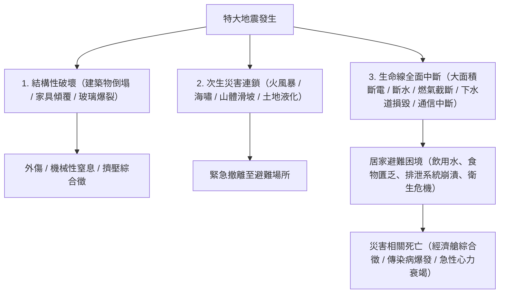
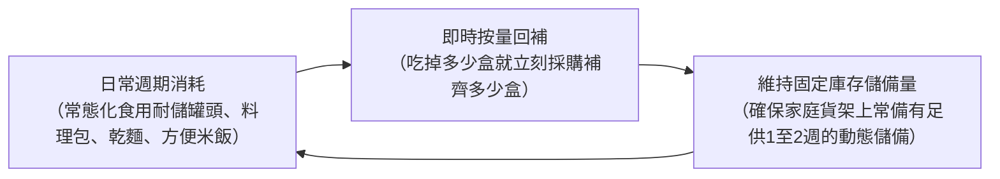
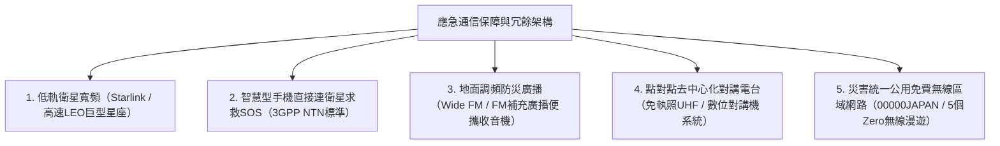

## 引言：多重災害地帶「生存工程學」的建立

位於環太平洋火山地震帶的日本列島，僅占全球陸地表面積的0.25%，卻集中了全球約20%的6級以上強震以及約7%的活火山，是世界上自然災害發生頻率與密度最高的區域之一。

進入21世紀以來，伴隨全球氣候變暖導致的海表水溫上升與大氣飽和水汽量劇增，徹底打破了傳統線性氣候預測模型的「線狀降水帶」引發了極端暴雨；外水漫堤與內澇排洪受阻重疊的複合型洪澇頻發；加之在不久的將來幾乎必然發生的「南海海槽特大地震（8至9級）」、「首都直下型地震」以及「富士山爆發」，使得國家級系統功能陷入癱瘓的複合型巨災威脅迫在眉睫。

在此類極端困境下，國家與地方政府提供的「公助」（官方應急救援）存在不可逾越的物理極限。在特大地震發生的最初階段，道路網斷裂、火災連環蔓延、通信骨幹網癱瘓、行政指揮機構自身受損，導致專業救援力量與救災物資抵達各個孤立家庭之前，必然出現**「至少72小時（3天），在重度受災區甚至長達一週以上」**的救援真空期。

在這一殘酷的真空期內依靠自身力量求生、捍衛家庭與社區生命的實踐科學——即**「減災工程學（Disaster Mitigation Engineering）」**，而其實體承載工具便是**「防災應急裝備（Emergency Survival Gear）」**。防災用品絕非普通日用品的盲目囤積，而是一套在自來水、電力、燃氣、下水道及電信等現代城市生命線徹底崩潰的極端環境下，能夠自主維持人體生化內環境穩態（Homeostasis）與公共衛生防線的「便攜式生命支持系統」。

本文將從災害發展的時間軸與風險量化評估切入，全面剖析0級、1級、2級分階段裝備配置理論，深入探討飲用水淨化、應急食品化學、排泄物高分子凝固等公共衛生工程，並系統闡述應急獨立能源系統搭建及避難所中防範「災害相關死亡」的醫學救護方案，以嚴謹的科學體系全面揭示現代危機管理的完整圖景。

```
【災害演進階段與防災裝備功能部署】

┌─────────────────┬───────────────────────────────┬───────────────────────────────┐
│ 災害階段        │ 時間軸與環境狀態              │ 所需防災功能與裝備配置        │
├─────────────────┼───────────────────────────────┼───────────────────────────────┤
│ 0級階段         │ 日常通勤、通學、外出移動中    │ 0級隨身包（EDC）：高音求生哨、│
│ （受災瞬間）    │ （受災空間與時間不可預測）    │ 便攜手電筒、簡易應急廁所袋、  │
│                 │                               │ 急救藥包                      │
├─────────────────┼───────────────────────────────┼───────────────────────────────┤
│ 1級階段         │ 災後即刻至24小時              │ 1級應急逃生包（Go-Bag）：     │
│ （初期緊急撤離）│ 從倒塌、火災、海嘯中快速逃生  │ 頭部防護、防塵口罩、防護鞋、水│
├─────────────────┼───────────────────────────────┼───────────────────────────────┤
│ 2級階段         │ 24小時至72小時                │ 搜救等待 / 居家避難 / 避難所：│
│ （生命維繫期）  │ 生命線完全中斷、處於孤立狀態  │ 創傷急救、保溫鋁箔毯、淨水器  │
├─────────────────┼───────────────────────────────┼───────────────────────────────┤
│ 3級階段         │ 72小時至1週以上               │ 2級居家儲備物資（後勤保障）： │
│ （避難生活持續）│ 避難生活長期化、公衛防線維持  │ 儲備糧水、獨立應急電源、衛生品│
└─────────────────┴───────────────────────────────┴───────────────────────────────┘
```

---

## 1. 複合型災害機制與時間軸工程學

要構建行之有效的防災系統，首先必須透徹理解主要自然災害的物理成因，以及現代城市基礎設施在災害衝擊下的連鎖崩潰過程。

### 1.1 地震動物理學：俯衝帶海溝型 vs 內陸斷層直下型
根據斷層破裂與發生機理，強震主要劃分為兩大類型：

1. **海溝型（板塊邊界型）地震（如：南海海槽地震、3·11東日本大地震）**：
   發生於大洋板塊向大陸板塊下方俯衝的消亡邊界。由於斷層破裂帶綿延數百公里，劇烈震動持續時間往往長達數分鐘，造成極廣區域的嚴重破壞。海底地殼劇烈抬升或下沉會引發滔天海嘯，在數分鐘至數十分鐘內席捲沿海地帶；同時產生的「長週期地震動」會與數十層高的摩天大樓產生共振，導致高層建築劇烈晃動。
2. **內陸斷層直下型地震（如：阪神大地震、熊本地震）**：
   由大陸地殼淺層活動斷層的突然錯動引發。由於震源深度極淺，從最初的初動微震（P波）到破壞性橫波（S波）抵達的預警時間（S-P時間差）幾乎為零。極其猛烈的垂直向加速度與高頻脈衝地震波直接衝擊地表建築，瞬間造成大量木質房屋整體坍塌、重型家具傾覆飛拋、橋樑道路即刻斷裂。



### 1.2 火山噴發與大範圍降灰導致的城市功能休克力學
日本境內共有111座活火山。富士山、淺間山、阿蘇山、櫻島等大型火山的普林尼式劇烈噴發，其破壞力絕不僅限於局部的熔岩流與碎屑流，更在於**「大範圍火山灰沉降」**引發的系統性基礎設施休克。

火山灰絕非普通的木炭殘灰，而是**「邊緣極其鋒利的微米級玻璃碎屑與矽酸鹽礦物晶體（二氧化矽 SiO₂）」**：
- **電網短路癱瘓**：僅數毫米厚的火山灰層在吸收雨水中的濕氣後即具備強導電性，導致高壓輸電線路的陶瓷絕緣子絕緣擊穿、頻繁閃絡短路，引發大範圍電網崩潰。
- **交通網絡癱瘓**：道路積灰數毫米即可導致車輛抓地力銳減而頻繁失控打滑，微細粉塵會瞬間堵塞內燃機進氣濾清器導致發動機熄火；鐵軌與車輪之間因絕緣導致信號系統失效停運；機場則由於微細矽質顆粒吸入噴氣發動機渦輪燃燒室融化為玻璃態沉積物，導致引擎瞬間空中停機，跑道被迫全面關閉。
- **下水管網堵塞**：居民若將積灰直接沖入下水道，火山灰會在管道內沉澱板結硬化，其堅硬程度堪比混凝土，導致地下管網永久性物理癱瘓。
- **呼吸系統與視網膜損傷**：直徑小於2.5微米的超細顆粒能夠直接穿透人體防禦屏障進入肺泡深處，誘發嚴重支氣管哮喘與急性呼吸窘迫綜合徵，並導致角膜上皮大面積剝落。

因此，應對火山災害的專用防護裝備必須包括防顆粒物呼吸器（N95/KN95/FFP2級別以上）、全封閉防塵護目鏡、高致密雨衣，以及用於室內門窗密封防滲透的專用壓敏膠帶。

---

## 2. 災害階段化防災裝備工程設計（0級、1級、2級）

防災物資的科學布局與架構，必須依據災後時間軸推移以及人體機能活動半徑，嚴格劃分為三個互不重疊又緊密銜接的層級。

```
【防災用品三級模塊化架構】

［0級隨身裝備：EDC（Everyday Carry）］
·攜帶場景：每日通勤、通學、出差或日常外出時隨身攜帶（嚴格控制重量在300至500克以內）。
·核心使命：在外部突發災害瞬間，保障倖存者能夠度過最初數小時，並順利徒步返回住所或抵達臨時避難集結點。

［1級應急逃生包：Go-Bag（非常持出袋）］
·配置場景：常年放置於玄關門口或臥室床頭易取位置（重量控制：成年男性10至15公斤，成年女性8至10公斤以內）。
·核心使命：在房屋倒塌、火災逼近或海嘯預警等極端危機下瞬間背負撤離，保障避難後最初24至48小時的生命體徵穩定。

［2級居家應急儲備：在宅避難後勤保障（Home Stockpile）］
·配置場景：分散儲存於家庭儲藏室、壁櫥、食品儲物櫃等乾燥陰涼處（儲備基準為7至14天消耗量）。
·核心使命：在市政管網與電力徹底切斷的前提下，完全依靠內部儲備，維持家庭成員的生命攝入與公共衛生防線。
```

### 2.1 0級隨身包（EDC）：日常生活中的隱形求生包
現代都市人群有超過三分之二的清醒時間處於家庭以外的場所（高層寫字樓、軌道交通、商業綜合體）。若在白天突發大地震，極易遭遇電梯失電懸停受困、地鐵列車迫停地下隧道，或因全城軌道交通停運而必須長途步行數小時穿越廢墟。

```
【0級EDC便攜包核心必備清單（建議自重約400克）】

1. 高亮度緊湊型LED手電筒（AA/AAA乾電池或Type-C直充，亮度>=100流明）
2. 應急求生高音哨（無珠雙管設計，聲壓>=100分貝，進水仍可正常發聲）
3. 便攜式真空鍍鋁急救保溫毯（防風、防雨、保暖反射熱量、反光求救、隱私遮擋）
4. 應急排泄便攜袋（高分子聚合凝固劑＋防臭多層複合袋：至少2次份）
5. 大容量行動電源（5000至10000毫安時）＋多合一耐磨充電線
6. 隨身急救藥包（OK繃、醫用消毒濕巾、止痛退燒藥、個人慢病處方藥3日份、獨立包裝N95口罩）
7. 應急現金儲備（小額紙幣與硬幣：包含公用電話專用硬幣，全城斷電時行動支付徹底癱瘓）
8. 個人緊急醫療識別卡（註明緊急聯絡人、血型、藥物過敏史、既往病史）
```

### 2.2 1級應急逃生包（Go-Bag）：撤離背包的載重工程學
在配置1級逃生包時，最常見的致命誤區就是「盲目塞入過多物資導致背包超重，導致無法奔跑越障」。在滿地瓦礫、道路斷裂的極端環境下，成年人能夠安全且敏捷翻越障礙的最大負重上限是：**「成年男性約為體重的20%（12至15公斤），成年女性約為體重的15%（7至10公斤）」**。

```
【1級逃生背包重量配平工程學】

·背包上部（緊貼背部脊柱中軸）：放置最重物品（飲用水、金屬罐頭、儲能電源）
  -> 使整體重心上移並緊貼軀幹，極大減輕行進時腰背肌群的剪切扭矩。
·背包中部至外側：放置中等重量物資（換洗衣物、雨具、外傷急救包）。
·背包底部：放置體積龐大但密度極輕的物品（超輕睡袋、保溫抓絨衣、壓縮毛巾）。
·頂部頂蓋倉與側袋：放置突發時需瞬間抽取的應急工具（手電筒、求生哨、折疊安全頭盔、防割手套）。
```

避難逃生時的鞋履選擇至關重要。許多人在慌亂中穿著拖鞋或普通輕薄運動鞋逃生，而強震過後的地面往往布滿了鋒利的碎玻璃、斷裂的帶刺鋼筋和豎立的生鏽鐵釘。鞋底嵌入防穿刺不銹鋼板或芳綸纖維防刺墊的高筒登山鞋，或符合工業防護標準的防刺勞保鞋，是確保撤離過程中腳底不被刺穿致殘的絕對安全基石。

---

## 3. 飲用水安全保障與淨水工程技術

人體體重的約60%由水分構成。人體在缺乏食物的情況下尚可依靠自身脂肪與肌肉儲備維持數週，但若徹底切斷水分攝入，僅僅在3至5天內就會發生嚴重的細胞脫水、低血容量性休克並最終導致多器官功能衰竭死亡。

### 3.1 應急需水量的科學計量模型
依據公共衛生應急救災標準，維持人體基本生理代謝的極限需水量標準定義為：

$$\text{生命維繫基本需水量} = 3.0 \text{ 升 / 人 / 日}$$

基於此公式，以一個四口之家在震後執行為期1週的居家避難場景進行量化推算：

$$3 \text{ L} \times 4 \text{ 人} \times 7 \text{ 天} = 84 \text{ 升}$$

這意味著僅僅為了保障四名家庭成員的基礎生理代謝，就需要儲備多達42瓶2升裝瓶裝純淨水。若進一步將食物烹製復水、洗手清潔、傷口沖洗以及口腔衛生等基本生活用水納入考量，實際所需的水資源儲備量將成倍劇增。

### 3.2 中空纖維超濾膜（Hollow Fiber Membrane）淨水工程
當家庭預儲的瓶裝水告罄時，利用便攜式超濾微孔淨水器（如Sawyer Squeeze/Mini、Katadyn BeFree等）將收集的天然雨水、清澈河水、井水或未受污染的家庭生活儲水轉化為可直接飲用的安全水源，將成為維繫生命的絕對技術底牌。

```
【中空纖維超濾膜水處理微觀機制】

原水輸入（含有泥沙微粒、致病細菌、原生寄生蟲包囊）
  ↓
［多孔中空纖維超濾膜：孔徑公差 0.1 微米（100 奈米）］
  │
  ├─ 【物理截留淘汰的微觀有害物質】
  │   ·致病性原生動物（隱孢子蟲：約4至6微米，賈第鞭毛蟲：約8至14微米）
  │   ·致病性細菌（大腸桿菌：約0.5×2微米，霍亂弧菌，沙門氏菌，傷寒桿菌）
  │   ·懸浮泥沙膠體顆粒、微塑膠碎片
  │
  └─ 【允許無阻穿透的分子與離子】
      ·水分子（H₂O：分子直徑約0.3奈米）
      ·溶解態人體有益礦物質電解質離子（Na⁺、Ca²⁺、Mg²⁺）
  ↓
潔淨無菌的安全飲用水輸出
```

然而，中空纖維超濾膜技術存在明確的物理截留邊界：對完全溶於水的化學溶解物（重金屬離子、農藥殘留、放射性同位素）以及孔徑在0.02至0.08微米之間的奈米級微小病毒（如諾羅病毒、輪狀病毒、甲肝病毒等），單層中空纖維超濾膜無法提供100%攔截。因此，針對疑似受到生活污水混合污染的水源，在經過中空超濾膜粗濾後，必須輔以**「持續劇烈沸騰煮沸1分鐘以上」**或**「滴入微量食品級次氯酸鈉消毒劑進行化學滅菌」**，這是公共衛生工程中不可動搖的底線。

---

## 4. 應急食品生物化學與長期保存技術

災害環境下的營養補給，絕不僅是機械性地提供熱量卡路里，更是維持受災者自身免疫防禦機制、穩定在極端恐懼與重壓下神經生化系統平衡的核心支柱。

### 4.1 α化米：澱粉糊化與老化的晶體化學
現代應急戰略儲備糧的核心支柱——「α化米」（糊化脫水速食米），是利用澱粉物理微觀相態變化的高分子食品工程傑作。

```
【澱粉微觀晶體結構轉變與α化米工藝機制】

天然生米澱粉（β-澱粉 / β-starch）
·分子間緊密排列為緻密的膠束微晶結構。水分子無法滲透，人體消化道分泌的唾液及胰澱粉酶無法直接水解其糖苷鍵。
  ↓ 水浴加熱熟化（蒸煮反應：糊化 / α化過程）
糊化澱粉（α-澱粉 / α-starch）
·熱能徹底破壞分子內與分子間氫鍵，緻密晶格瓦解崩塌，形成結構鬆散、極易被人體消化酶水解的高吸水性水凝膠。
  ↓ （常規自然冷卻時，澱粉分子會脫水重新定向排列，形成質地堅硬、難以消化的「老化澱粉 / β'-澱粉」）
［工業級超瞬時熱風脫水工程］
·將剛蒸煮成熟處於完全α化膨脹態的米飯，瞬間置入80至100℃以上的高速強乾燥熱風中，在極短時間內將水分強行抽離至8%至10%以下。
·瞬間脫水鎖定了澱粉分子的空間排列，完全阻止晶體重組，將蓬鬆多孔的「α化狀態」以海綿骨架形式永久固化。
  ↓
注水復水反應機制
·注入開水靜置約15分鐘（或常溫涼水靜置約60分鐘），水分子借助毛細管效應瞬間滲透並填滿多孔骨架，使米飯完美恢復至剛出鍋時的軟糯口感。常溫密封環境下保質期可長達5至7年。
```

### 4.2 冷凍升華乾燥（Freeze-Drying）物理學
用於保全高端主菜、燉菜、蛋湯及蔬果的凍乾技術，是基於水在相圖上的**「三相點（Triple Point：0.01℃，611.65 Pa）」**建立的升華脫水物理工程。

首先將新鮮食品在零下30℃至零下50℃的超低溫環境中進行極速深凍，隨後將其裝入高真空絕熱密閉腔體內，將系統氣壓抽吸至三相點壓力以下。在此超低氣壓狀態下，微弱施加升華潛熱，食品物料細胞間隙中的固態冰晶無需經過液態水過渡階段，直接升華為水蒸氣逸出並被冷阱捕獲。

```
【冷凍升華乾燥工藝的核心工程優勢】

1. 細胞超微骨架無損保全：
   由於全程在低溫冰凍狀態下脫水，避免了常規高溫熱風導致的蛋白質熱變性交聯，細胞壁完整無損，維生素C及B群等熱敏性營養素得以高比例完整保留。
2. 極限超輕量化特性：
   徹底脫去食品組織中95%至98%的自由水與結合水，成品自重降至鮮食狀態的幾分之一甚至十分之一，大幅降低背包攜行負擔。
3. 超瞬時復水動力學表現：
   固態冰晶升華後在物料內部原位留下了無數微觀互通的多孔孔隙（微觀海綿結構）。當注入水分時，在強烈的毛細管表面張力驅動下，液體在數秒內迅速浸潤滲透至物料內部，瞬間還原食材原有的彈性咬勁與自然色香味。
```

### 4.3 動態周轉循環儲備法（Rolling Stock System）
那種「成箱購買昂貴的專業應急口糧，扔進儲藏室最深處塵封5年，臨近過期變質時整批扔掉」的傳統模式，在現代危機管理學中已被證明是成本高昂且失敗率極高的落後方法。
取而代之並成為行業黃金法則的，是**「滾動循環儲備法（Rolling Stock）」**。



滾動循環儲備法最大的神經心理學與醫學價值在於：**「在極端災害發生時，依然能提供家庭成員身體習慣的日常風味食品（Comfort Food）」**。在直面家園受損、餘震不斷的巨大心理應激狀態下，若被迫頓頓食用口感陌生、粗糙乏味的壓縮乾糧，極易導致受災者尤其是老人和兒童出現嚴重食慾減退、消化不良及急性抑鬱情緒。將日常保質期較長的優質食材融入動態循環體系，是構築韌性家庭後勤最可持續的方案。

---

## 5. 衛生工程學與避難所生存（感染控制、排泄處理與體溫維繫）

在對歷史重大地震的致死數據進行流行病學回溯時，一個令人觸目驚心的事實展現在眼前：在1995年阪神大地震、2016年熊本地震以及2024年能登半島地震中，有相當比例的遇難者並非當場死於房屋倒塌或海嘯衝擊，而是在隨後漫長而惡劣的避難轉移過程中喪命。這種被稱為**「災害相關死亡（Disaster-Related Deaths）」**的遇難人數，在某些局部災區甚至全面超過了直接外傷致死人數。

誘發災害相關死亡的首要致死根源，絕非飢餓，而是**「公共衛生體系的徹底崩潰」**以及**「人類排泄物無害化處理通道的徹底中斷」**。

### 5.1 應急簡易廁所與高分子吸水樹脂（SAP）化學反應
城市供水中斷後，**絕對嚴禁直接倒水沖洗室內抽水馬桶**。若埋設在地下或樓體立管內部的排污排氣管道已發生隱蔽性錯位、斷裂，上層住戶強行沖刷的排泄物將無法排入化糞池，而是直接從低層住戶的馬桶中反湧噴出，使整座居民樓瞬間演變為極其危險的高污染生物災難現場。

在斷水斷電狀態下，唯一科學的方案是使用直接套裝在馬桶圈上的乾式應急排泄凝固袋。其核心化學物質即為**「高分子吸水樹脂（SAP：交聯型聚丙烯酸鈉）」**。

```
【高分子吸水聚合物固化排泄物的生物化學過程】

┌─────────────────────────────────────────────────────────────┐
│ 親水性基團（-COONa）的水化電離反應：                        │
│ 乾燥聚合物粉末接觸尿液水分瞬間，鈉離子（Na⁺）解離並擴散，   │
│ 高分子主鏈骨架上留下大量固定排列的高密度負電荷（-COO⁻）。   │
│   ↓                                                         │
│ 靜電同極相斥驅動三維分子網絡劇烈擴張伸展：                  │
│ 相鄰負電荷之間的強大同性相斥力，迫使原本緊密纏繞捲曲的微觀  │
│ 三維交聯空間網格在數秒內以不可逆態勢向外劇烈擴張膨脹。      │
│   ↓                                                         │
│ 滲透壓驅動的超巨量吸水與堅固水凝膠晶格鎖定：                │
│ 網格內部的高電解質離子濃度形成強大的滲透壓驅動力，瘋狂抽吸  │
│ 相當於自身乾重數百倍乃至千倍的水分子進入微觀空腔，將其轉化為│
│ 極其堅硬的高彈態水凝膠（即使施加劇烈外力擠壓也絕不滲出水滴）│
└─────────────────────────────────────────────────────────────┘
```

高品質的專業應急排泄凝固劑中，除了高分子吸水樹脂外，還會深度複配超微銀離子（$Ag^+$）、固體次氯酸鹽以及植物提取多酚類單寧化合物，從微觀生化層面長效殺滅大腸桿菌和厭氧菌，徹底阻斷氨氣（$NH_3$）及硫化氫（$H_2S$）氣體的揮發逃逸。

#### 憋尿的病理生理學後果與「經濟艙綜合徵」
當避難所內的公共廁所變成污水漫溢、惡臭刺鼻、缺乏照明且排隊漫長的惡劣場所時，避難人群（尤其是高齡老人和女性）在潛意識中會產生強烈的心理抗拒，進而採取極度危險的生理代償策略——**極力限制水分攝入以減少如廁頻率**。

嚴重限制飲水會導致人體全血粘稠度急劇上升（血液高度濃縮）。在缺乏床鋪、被迫長週期蜷縮在狹窄車廂或冰冷水泥地面雜亂鋪位上時，下肢膕靜脈及股靜脈遭受物理壓迫，極易在下肢深靜脈內部誘發深靜脈血栓（DVT）。一旦受災者突然起立走動，脫落的靜脈血栓隨著血液循環回流穿過右心室，瞬間栓塞肺動脈主幹，誘發急性肺栓塞（即「經濟艙綜合徵」），患者常在數分鐘內突發呼吸心跳驟停死亡。因此，建立乾淨、充足、尊嚴的排泄保障體系，本質上是最關鍵的「一線挽救生命醫學手段」。

### 5.2 熱學工程：真空鍍鋁PET聚酯薄膜保溫毯
在災害現場，意外低溫症（人體核心體溫下降至35℃以下）並非冬天的專屬特權；如果身著被冷雨打濕或冷汗浸透的濕冷衣物暴露在呼嘯冷風中，即便處於炎炎盛夏，人體核心熱量也會在極短時間內散失殆盡，導致嚴重低體溫死亡。

應急太空保溫毯的核心材質，是在厚度僅為12微米的雙向拉伸聚對苯二甲酸乙二醇酯（BoPET）薄膜表面，在極高真空腔體內精密物理氣相沉積一層純度極高的高反射金屬鋁薄層。
利用金屬自由電子產生的鏡面反射效應，**「能夠將人體向外輻射散發的遠紅外線熱能的90%以上精準反射攔截」**並重新輻射回人體軀幹。與此同時，高密度的密閉薄膜徹底切斷了外界冷空氣對流傳熱以及由於衣物濕潤引起的水分蒸發潛熱流失，以區區50克的超輕重量，實現了比肩數條厚重純羊毛毯的隔熱保暖性能。

---

## 6. 應急獨立能源與抗毀通信網絡工程

電力的斷絕與外界通信的中斷，會將災民瞬間推向絕對的黑暗深淵、資訊孤島以及無端謠言引發的群體恐慌中。在現代防災裝備工程中，構建自洽的離網能源系統與多級冗餘通信鏈路，是家庭最關鍵的戰略防禦屏障。

### 6.1 磷酸鐵鋰（LiFePO₄）儲能電池的安全特性與電化學機理
在選購大容量家庭應急便攜式儲能電源時，最核心的考量指標是電芯的正極材料化學體系。在傳統的三元鋰電池（NMC：鎳鈷錳酸鋰）與先進的**「磷酸鐵鋰電池（LFP / $\text{LiFePO}_4$）」**之間，存在著決定生存安全的技術分野。

```
【三元鋰（NMC）與磷酸鐵鋰（LiFePO₄）核心物性電化學對比】

┌──────────────────────┬───────────────────────────────┬───────────────────────────────┐
│ 核心對比指標         │ 三元鋰電池體系（NCM / NCA）   │ 磷酸鐵鋰電池體系（LiFePO₄）   │
├──────────────────────┼───────────────────────────────┼───────────────────────────────┤
│ 晶體微觀結構         │ 層狀岩鹽結構（不穩定脆弱層態）│ 橄欖石型晶體結構（堅固P-O共價 │
│                      │                               │ 鍵強力交聯骨架）              │
│ 熱失控臨界溫度       │ 約 200至210 ℃（極易被誘發）  │ 約 400至500 ℃（超高熱穩定性）│
│ 氧氣析出與起火爆炸性 │ 遭遇嚴重過充或針刺穿透時晶格  │ 牢固的三維P-O化學鍵在破壞狀態 │
│                      │ 迅速崩解，向內部釋放大量游離氧│ 下依然絕不釋放游離氧氣分子；即│
│                      │ 極易引發鏈式劇烈自燃甚至爆炸  │ 使徹底內部短路也僅冒煙不爆燃  │
├──────────────────────┼───────────────────────────────┼───────────────────────────────┤
│ 充放電循環衰減壽命   │ 約 500至800 次（衰減極快）    │ 約 3000至4000 次（超長壽命，在│
│                      │                               │ 規範使用下壽命長達10年以上）  │
│ 質量與體積能量密度   │ 極高（同容量下輕薄小巧）      │ 中等偏低（體積略顯粗壯沉重）  │
└──────────────────────┴───────────────────────────────┴───────────────────────────────┘
```

針對防災應急特種場景，由於設備需要常年在車內狹小空間或居家臥室環境中長期存放備用，且可能經歷劇烈震動、顛簸乃至擠壓穿刺，**熱失控安全閾值極高且具備十年長效壽命的磷酸鐵鋰儲能電源（$\text{LiFePO}_4$）已無可爭議地成為行業唯一通用標準**。

### 6.2 便攜式太陽能光伏板與MPPT智能追蹤控制器
在面臨跨越數週的大面積全網停電時，市電補能將化為泡影，可持續的太陽能光伏充電便成為唯一的生化能源抓手。
選用光電轉換效率高達22%至24%以上的高品質單晶矽柔性/折疊電池板，與集成**MPPT（最大功率點跟蹤 / Maximum Power Point Tracking）**智能微處理器的充電控制器相結合，系統能夠以毫秒級頻率實時動態追蹤光伏板隨日照傾角、浮雲遮擋而劇烈波動的電壓與電流極值點，確保即使在晨曦、薄暮或陰雨弱光環境下，也能榨取並回充最大極限的電量。

---

## 2.3 嚴重創傷急救醫學（Trauma Care）與戰術止血帶（CAT）的應用工程學

在大地震引發的大規模建築坍塌、尖銳玻璃狂暴飛濺以及海嘯重型漂流物撞擊造成的機械外傷中，死神降臨最快的致命創傷莫過於**「外周大血管破裂引起的活動性動脈大出血」**。當股動脈或肱動脈被銳器瞬間斬斷時，在短短數分鐘內即可流失全身總血容量（約占體重的8%）的三分之一以上。在此種群死群傷的極端癱瘓環境下苦等急救車趕赴現場，結果唯有在絕望中失血性休克死亡。

在戰術戰鬥傷亡照料（TCCC）與現代創傷現場急救指南中，針對四肢難以通過常規徒手直接壓迫控制的噴射性大出血，無可撼動的黃金急救標準即為**「CAT戰術止血帶（Combat Application Tourniquet）」**。

```
【CAT戰術止血帶結構工程學與精準上止血帶流程】

┌─────────────────────────────────────────────────────────────┐
│ 穿扣調節阻力環與高強度尼龍織帶穿套：                        │
│ 將止血帶套在傷口上方（靠近心臟近心端）約5至7公分處。        │
│ （嚴禁直接綁在膝關節、肘關節等關節骨骼隆起處；若在黑暗或血泊│
│ 中難以精準判定創口具體點，則直接綁在該肢體最根部）。        │
│   ↓                                                         │
│ 強固旋轉手柄（絞棒 / Windlass）持續加壓旋轉：               │
│ 順時針或逆時針大力扭絞旋轉手柄，絞緊內層周向環形束帶，直至  │
│ 施加在骨骼外側的環形壓強徹底超越動脈收縮壓峰值。持續絞緊至  │
│ 傷口處噴射性搏動出血完全徹底停止、遠端動脈搏動消失。        │
│   ↓                                                         │
│ 鎖定手柄卡槽並「清晰記錄具體絞緊時間」：                    │
│ 將絞棒兩端卡入固定鎖定扣中，並在白色時間記錄尼龍搭扣帶上，  │
│ 迅速用油性筆清晰標註實施止血帶止血的具體時間戳（肢體缺血壞死│
│ 容忍極限必須嚴格控制在2小時以內）。                         │
└─────────────────────────────────────────────────────────────┘
```

此外，針對止血帶物理機械無法綁紮的軀幹與四肢交界區深部傷口（如腹股溝、腋窩根部、頸根部），浸透有高活性奈米級鋁矽酸鹽粘土礦物（高嶺土 Kaolin）或脫乙醯甲殼素的**「沸石止血敷料（如QuikClot戰鬥止血紗布）」**是唯一的挽救手段。高嶺土能夠以極高效率暴發性激活人體血液內的第XII凝血因子（內源性凝血途徑），即使面對無法施壓的深邃空腔撕裂傷，只要將紗布牢牢填塞入傷口內部並施壓數分鐘，就能誘發血小板網狀聚攏，形成極其強韌的物理纖維蛋白凝血塊以封閉破口。

同時，針對尖銳金屬或破裂玻璃直刺胸廓導致的「開放性氣胸（胸壁穿透性破口導致負壓胸膜腔湧入外界空氣壓迫肺葉萎陷的致命創傷）」，攜帶具有單向活瓣洩氣排氣閥的**「胸腔排氣密封貼（Vented Chest Seal）」**，能夠允許胸腔內積氣積血單向排出，嚴禁外部空氣逆向吸入，是防範張力性氣胸窒息而死的頂級求生戰術裝備。

---

## 5.3 避難所生活的國際人道準則：球體標準與「TKB48」公共衛生工程學

在探討如何科學防範「災害相關死亡」時，由全球多國非政府組織與紅十字國際委員會聯袂制定的國際人道救援底線公約——**《球體手冊（The Sphere Handbook）》**構成了絕對的倫理與技術基石。傳統日本避難所常見的「數百人無間隔蜷縮在冰冷體育館硬地板上、整日發放冰涼乾硬飯糰、院內排隊使用骯髒惡臭的簡易臨時塑料旱廁」，從國際人道主義衛生標準來看，存在著嚴重的健康危害隱患。

近年來，以災難醫學界專家為核心，大力推行的現代避難所環境工程革新口號正是**「TKB48（災後48小時內必須徹底建立標準化 廁所-廚房-床位 / Toilets, Kitchen, Bed）」**。

```
【避難所現代公共衛生三大核心要素：TKB標準化工程體系】

1. Ｔ（廁所 / Toilet）：
   ·球體標準（Sphere Standard）：避難所必須確保每20名避難人員至少配備1座衛生間；男女廁所配比嚴格控制為1:3（充分考慮女性上廁所耗時較長的客觀生理特徵）。
   ·環境衛生學設計：完備的內部與外圍夜間獨立照明、水與抗菌洗手液配備、排泄物飛濺阻隔擋板、內部獨立可靠防性侵門鎖。
   ·核心目標：實現「無惡臭、無昏暗、無地面高差障礙」，徹底消弭因畏懼如廁而憋尿少喝水的致命生理代償行為。

2. Ｋ（廚房熱食 / Kitchen）：
   ·溫熱流質餐食無條件供給：在災後48至72小時之內，必須依靠移動餐車與模塊化液化氣炊具，向全體人員按時發放溫熱的燉湯、營養均衡的熱食。
   ·生理與心理學效益：有效抵禦低體溫侵襲，激活胃腸蠕動促進消化，並在神經生化層面大幅降低極度恐懼下的交感神經過載應激水平。

3. Ｂ（床位系統 / Bed）：
   ·全員推行瓦楞紙箱應急床（Cardboard Bed）：床面抬高距離水泥地板30至40公分以上。
   ·三大決定性醫學防護效益：
     ① 徹底隔斷硬質水泥地坪傳導性冷量吸收，徹底阻擊低體溫症及繼發性肺炎侵襲。
     ② 將受災者的平躺呼吸帶高度拉升至地表30公分以上，徹底避開了貼地沉降的建築微細粉塵、有毒矽顆粒及諾羅病毒氣溶膠富集區。
     ③ 極大幅度減輕老年人起坐站立時的髖膝關節機械負荷，有效預防因極度虛弱臥床引起的廢用綜合徵及下肢靜脈血栓形成。
```

### 口腔衛生管理與吸入性肺炎的物理阻擊
在災後避難所內，奪走老年人生命的極其隱匿的頭號殺手，正是**「吸入性肺炎（Aspiration Pneumonia）」**。
當斷水導致災民數日無法正常刷牙漱口時，口腔內部唾液分泌減少，各類厭氧菌群呈爆炸性幾何級數瘋狂繁殖。高齡老人在夜間熟睡時，因咽喉肌群反射遲鈍，含有數以億計惡性致病菌的唾液與反流胃液會微量誤吸流入氣管並深入肺泡，誘發嚴重的重症化學性細菌性肺炎。
因此，在防災應急包中常備「免洗液體漱口水」或「醫用口腔清潔護理濕巾」，其預防重症感染暴發的實際醫學挽救效果，絲毫不亞於在病房中大劑量推注抗生素。

---

## 6.3 冗餘化通信網絡架構工程：低軌衛星、無源無線電與00000JAPAN

在巨災降臨的最初階段，地面公網移動通信基站往往因市電中斷蓄電池耗盡、地下傳輸光纜被拉斷撕裂，以及海量用戶同時撥打電話查詢安危導致的話務量瞬時暴增90%以上，使得全城基站觸發保護性斷網限流。打破致命的「資訊真空黑洞」，必須依靠天基衛星、無源空口電波與專網無線電構建的「多層立體冗餘通信系統」。



### 1. 寬頻FM（FM補充廣播）收音機的無線電工程學
傳統中波AM廣播（526.5至1606.5 kHz）雖然地波傳播距離遠，但在現代由鋼筋混凝土澆築的高層公寓內部會遭受嚴重的電磁衰減屏蔽，並且極易受到現代都市中無處不在的開關電源、變頻電機的劇烈工頻噪聲干擾。
「Wide FM（利用超短波VHF 90.0至95.0 MHz頻段）」是以超高音質的調頻電波，同頻同步轉播國家核心AM應急廣播的新型廣播體制。超短波FM電波對高層住宅樓體具有極強的繞射與穿透能力，且完全不受城市電子底噪干擾，即便在震後斷電廢墟中也能清晰穩定收聽緊急地震速報與官方避難轉移指令。一台搭載手搖自發電雙向蓄電池的Wide FM應急收音機，是每個家庭不可動搖的底線通訊裝備。

### 2. 低軌衛星通信的技術變革：Starlink與手機直連衛星SOS
以SpaceX「星鏈（Starlink）」為代表的低地球軌道（LEO，軌道高度約550公里）巨型衛星星座，徹底顛覆了傳統災難通信後勤模式。在地面基站光纜全部斷絕的極端重災區，僅需在平曠戶外支起小型平板相控陣天線，即可瞬間建立下行速率達數百兆、時延僅數十毫秒的抗毀寬頻網絡，正如其在2024年能登半島地震中作為指揮骨幹網絡大放異彩。

與此同時，最新一代旗艦智慧型手機已全面集成符合3GPP Release 17/18國際標準的「非地面網路通信（NTN：Non-Terrestrial Network）」基帶射頻硬體。即便身處沒有任何地面鐵塔信號覆蓋的崇山峻嶺或斷網孤島，手機天線也可跨越數百公里虛空直接鎖定頭頂掠過的通信衛星，將求救文本、精確GPS經緯度座標與遇險遙測數據直接送達國家搜救中樞。

---

## 2.4 城市火災防範、初起滅火與防煙逃生工程

在特大地震引發的各種致死因子中，最令人膽寒的惡性次生災害莫過於伴隨劇烈震動同時在數千個點位爆發的**「多點併發城市大火（火風暴 / Firestorms）」**。在人口密集的木結構住宅聚集區，破裂洩漏的液化石油氣管道、打翻的柴油取暖爐以及市電重新送電瞬間引發的「通電火災」，會在短時間內迅速連成一片火海，使城市消防管網與消防力量瞬間處於絕對過載癱瘓狀態。

### 防煙防毒逃生面罩（Smoke Block）的化學機理
在建築物火災遇難者中，超過60%的死因並非直接來自明火的物理燒傷，而是**「由於吸入濃煙中所含的高毒性燃燒產物氣體導致的窒息死亡（一氧化碳與氰化氫）」**。現代室內裝潢中大量充斥著高分子聚氨酯海綿與工程塑料，不完全燃燒時會瞬間裂解產生劇毒的氰化氫（$HCN$）、光氣（$COCl_2$）以及極高濃度的致命一氧化碳（$CO$）。僅僅在口鼻部捂上一塊濕毛巾，對完全不溶於水的一氧化碳以及奈米級有毒懸浮煙塵顆粒根本起不到物理吸附過濾作用。

合格的高等級防煙防毒過濾呼吸逃生面罩，其核心在於耐高溫鍍鋁阻燃風帽內部，搭載了由特殊多孔活性炭與**「霍普卡特催化劑（Hopcalite：銅錳氧化物催化劑）」**複配構成的多層過濾濾毒罐。霍普卡特催化劑能夠在常溫無源條件下，以極高的催化動力學速率，將無色無味卻致命的一氧化碳（$CO$）原位催化氧化為低毒的二氧化碳（$CO_2$），為受災者在濃煙滾滾、伸手不見五指的有毒樓道中爭取到長達10至15分鐘寶貴的安全脫險逃生時間。

### 初起滅火器材的高性能選型原則
- **家用強化液滅火器（水基型）**：與噴射後產生彌漫粉塵、嚴重遮蔽逃生視線且易造成精密儀器腐蝕損壞的傳統乾粉ABC滅火器相比，強化液滅火器噴射出的是呈細水霧狀的鹼金屬有機鹽高滲透水溶液。該溶液能夠強效滲透進木材與織物深部纖維終止鏈式燃燒，杜絕死灰復燃，且噴射過程無粉塵遮蔽，極其適合在室內狹小密閉空間迅速撲滅初起火源。
- **感震斷路器（自動斷電安全裝置）**：為了從源頭徹底斬斷大地震過後電力搶修送電時由於倒塌受損的電暖器、老化電線重新通電短路引發的「通電火災」，在家庭強電箱內前置安裝感震斷路器至關重要。當該機械或電磁感應模組感知到烈度超過5強以上的劇烈地震動衝擊時，會在數秒內自動切斷家庭進線總電源，屬於最高性價比的被動防火防災裝備。

---

## 1.3 室內空間抗震錨固工程：家具傾覆抑制與玻璃碎片飛散控制物理學
法醫對阪神大地震與能登半島地震遇難者遺體的解剖與死因歸類表明：超過80%的室內當場死亡均由「房屋整體坍塌以及內部沉重家具、家用電器的劇烈傾覆砸壓所導致的機械性窒息與嚴重擠壓骨折」直接造成。在震度6強至7級的超強地震峰值加速度衝擊下，重達數十至數百公斤的實木雙開大衣櫃、雙門冰箱、大三角鋼琴與滿載硬殼書的頂天書櫃，會瞬間轉化為極具殺傷力的物理重錘掃平室內，砸死砸殘室內乘員並徹底堵塞唯一的逃生安全通道。

在居室內構築安全的「生存避險核心區」，必須依據結構力學原理對所有大件重型家具實施嚴謹的機械工程錨固。

```
【室內家具抗震防傾倒固定硬體受力原理與安裝規範】

┌──────────────────────┬───────────────────────────────┬───────────────────────────────┐
│ 錨固硬體選型類別     │ 機械約束與抗剪切力學原理      │ 現場施工不可忽視的生命線規範  │
├──────────────────────┼───────────────────────────────┼───────────────────────────────┤
│ 鍍鋅高強金屬L型角碼  │ 採用自攻螺絲直接穿透並鎖入    │ 絕對禁止直接固定在脆弱的單層石│
│ （防護等級最高、最牢）│ 牆體內部的輕鋼龍骨或實木立柱  │ 膏板牆體上（握釘力幾乎為零）。│
│                      │ 憑藉高抗剪與抗拉力抵消翻轉力矩│ 必須用探測器精準找到內部立柱  │
├──────────────────────┼───────────────────────────────┼───────────────────────────────┤
│ 雙向伸縮頂撐桿       │ 在家具頂板與建築吊頂天花板之間│ 若房屋天花板為薄膠合板吊頂，承│
│ ＋ 底部高粘性防震墊  │ 製造強預壓垂直擠壓應力，配合底│ 壓時極易被頂穿塌陷失效。必須在│
│ （組合雜化減震體系） │ 部聚合物粘性膠墊的摩擦剪切阻力│ 頂板襯墊大面積硬實木分散壓強  │
├──────────────────────┼───────────────────────────────┼───────────────────────────────┤
│ 高強度編織抗拉織帶與 │ 針對高重心且背部預留較大散熱間│ 將金屬卡扣用螺絲深深錨固在牆體│
│ 航空級防斷鋼絲拉索   │ 隙的重型冰箱、大螢幕電視機，利用│ 實心龍骨上，利用織帶的阻尼微變│
│                      │ 織帶極高的抗拉斷韌性抑制傾倒  │ 形吸能並拉住電器使其絕不傾倒  │
└──────────────────────┴───────────────────────────────┴───────────────────────────────┘
```

### 防飛散安全窗貼膜（多層PET聚酯膜）的抗拉斷力學
在大地震發生時，狂暴的扭力會導致建築窗框發生菱形剪切幾何變形，使得鑲嵌其中的平板玻璃在極限應變下產生爆裂，化作無數剃刀般鋒利的玻璃飛刃，以極高的初速度橫掃整個房間。
在所有室內玻璃朝內的一側全面裝貼厚度為50至100微米的微層壓聚對苯二甲酸乙二醇酯（PET）安全防爆膜，能夠利用高韌性膜體自身極高的斷裂抗拉強度，以及耐老化壓敏丙烯酸光學膠的強大吸附自持力，確保即便玻璃徹底震碎如蛛網，所有破裂碎渣依然被100%牢牢吸附固化在膜面原位，杜絕其飛濺割傷室內人員動靜脈。

---

## 2.5 暴雨洪澇與泥石流災害的流體力學求生體系

在由超強颱風、長週期線狀降水帶以及極端雷暴引起的城市內澇與江河堤防潰決（外水氾濫與內澇排水不暢併發）場景下，所面對的是完全不同於地震動力學的流體力學致命風險，需要完全獨立且嚴謹的特種裝備邏輯。

### 1. 避難逃生鞋履：為何「高筒雨靴」屬於絕對致命禁忌
在面對洪水漫灌的避難撤離過程中，穿著傳統及膝的高筒橡膠雨靴涉水，是水難救援工程中最危險的嚴重致命錯誤。
一旦渾濁的洪水水深超過膝蓋高度（約40至50公分以上），水流會瞬間順著靴口大口灌入雨靴內部。一旦倒灌灌滿，由於靴體無法排水，每隻雨靴就會化作數公斤重的水下鐵陀。遇難者下肢肌群負擔驟增無法抬腿，一旦在湍急水流中踩入被水壓頂開的地下窨井、排水暗溝或路牙斷層，身體瞬間失衡倒地，被水下負重死死拉入水底而活活嗆水溺亡。
洪澇避難涉水的唯一科學正確方案是：**「穿著排水孔良好、牢固綁緊鞋帶的高摩擦繫帶運動鞋 ＋ 搭配厚運動襪（或潛水氯丁橡膠襪）」**。將鞋帶深綁緊扣以杜絕被水流強力吸脫，既不會在鞋內產生多餘滯水負重，又能有效抵禦水下異物割劃，保障在水流阻力下的敏捷下肢機動。

### 2. 水壓作用下的「車門致命死鎖」物理極限
當車輛不幸滑入深水或房屋一樓遭遇外側洪水急速漫灌時，想要推開向外敞開的車門或防盜門，需要克服極其龐大的水壓推力。流體力學靜水壓強計算公式如下：

$$F = \rho g h A$$

其中，$\rho$ 為水體密度，$g$ 為重力加速度，$h$ 為水深高度，$A$ 為門板在水下的有效受壓面積。
即使車門或房門外側的積水深度**僅僅達到區區40至50公分**時，水流作用在整扇外開門上的合外力就足以飆升至數千牛頓（相當於數百公斤重力）。此時即便是一名體格健壯的成年男性用盡全身力氣從內側推撞，也絕不可能憑藉人力推開車門。
因此，在防災減災行動中，當接到3級或4級預警時，必須堅決在水流合圍前執行「提早垂直避難或提前主動撤離」；同時，在私家車駕駛艙易取處常備一把搭載**「鎢鋼超硬合金衝針的一鍵式救生破窗器」**，是防止車輛落水後被死鎖溺亡的絕對底線生命裝備。

---

## 5.4 重點脆弱人群（嬰幼兒、高齡老人、慢性病患與寵物）專項防護工程

絕大多數市售標準化防災應急包均是以「身體健全的青壯年」為樣本模型進行設計配置的。然而，在真實的巨災現場，生命線防禦能力最為脆弱、傷亡率高居不下的，永遠是生理代謝具有特殊剛性需求的「重點脆弱人群（脆弱受災群體）」。

```
【特殊重點脆弱人群專項防災裝備配置體系】

┌──────────────────────┬───────────────────────────────┬───────────────────────────────┐
│ 重點關照對象分類     │ 核心特殊風險與脆弱生理特徵    │ 必須強制增配的專項特種防災用品│
├──────────────────────┼───────────────────────────────┼───────────────────────────────┤
│ 嬰幼兒與乳母孕產婦   │ 斷水斷電導致無法高溫沖調奶粉；│ 常溫液體配方奶（開罐即飲，免沖│
│                      │ 極度脫水；夜間哭鬧引發避難排擠│ 調、配套滅菌奶嘴）、一次性奶瓶│
│                      │                               │ 嬰兒背巾（解放雙手）、純水濕巾│
├──────────────────────┼───────────────────────────────┼───────────────────────────────┤
│ 高齡老人與失能失智者 │ 咀嚼咽下障礙誘發吸入性肺炎；  │ 食物增稠劑（防止嗆咳）、高熱量│
│                      │ 假牙丟失致營養衰竭；慢病惡化  │ 軟質料理包、備用老花鏡與助聽器│
│                      │ 嚴重依賴外部輔助排泄          │ 電池、假牙專用盒、病歷卡複印件│
├──────────────────────┼───────────────────────────────┼───────────────────────────────┤
│ 慢性病與特種重症患者 │ 血液透析、胰島素冷藏注射、家庭│ 紙本/雲端電子處方本完整備份、 │
│                      │ 製氧吸氧機斷電導致生命即刻危險│ 便攜式直流低壓醫用吸痰器、大容│
│                      │                               │ 量應急蓄電池、前置透析轉運管道│
├──────────────────────┼───────────────────────────────┼───────────────────────────────┤
│ 伴侶寵物             │ 絕大多數公共公共避難所拒收；  │ 折疊便攜式硬質航空航空籠、專用│
│ （家養犬、貓等）     │ 驚嚇應激脫逃走失；人畜共患病  │ 處方糧與飲水（至少10日份）、微│
│                      │                               │ 晶片登記證明、寵物專用除臭尿墊│
└──────────────────────┴───────────────────────────────┴───────────────────────────────┘
```

特別值得強調的是，日本在2019年從國家立法層面批准「常溫保存型嬰幼兒液體配方奶」進入流通領域，是防災醫學史上的里程碑式進步。在既沒有乾淨清水、又缺乏燃氣加熱器具、更無法實施高溫蒸汽奶瓶消毒的惡劣災後孤島中，只需拉開拉環並旋接上配套無菌奶嘴，即可瞬間哺育啼哭飢餓的嬰兒，這在極端環境下構成了守衛無數新生幼小生命的堅強長城。

---

### 7.1 家庭防災審計（Disaster Audit）的常態化推進機制

哪怕你斥巨資購置並配備了世界上最精良齊全的應急裝備，若任憑其塵封在角落，任由組件老化、電池失效、藥品過期以及家庭人口結構變化而不加干預，一旦危機突襲，它們就會退化為毫無作戰效能的「死重工業垃圾」。
因此，強力推行家庭層面的制度化規程：在每年的**「3月11日（3·11東日本大地震紀念日）」**與**「9月1日（防災日）」**這兩個具有歷史警示意義的節點，定期組織開展全維度的「家庭防災全要素審計（Household Disaster Audit）」：

1. **儲備糧水保質期排查與動態循環周轉**：全面核查所有庫存飲用水與應急主食的有效保質期，將半年內即將到期的存貨下架作為家庭正餐消耗，並同步採購同等數量的新鮮食品進行滾動式回填。
2. **大容量儲能電源充放電健康體檢**：對長期靜置的磷酸鐵鋰移動儲能電站以及各類隨身行動電源進行完全的充放電循環測試，檢查其自放電損耗率，校準BMS電池管理系統，防範電芯極度虧電損傷。
3. **高分子化學製劑與醫藥耗材性能核驗**：抽檢應急排泄凝固劑是否吸潮結塊變質，檢查醫用酒精棉片是否揮發乾燥，檢查外傷包敷料是否過期發黃，排查密封橡膠條與防煙面罩矽膠是否硬化發黏脆變。
4. **全家族應急通信與集結點聯絡推演**：家庭全體成員集體複習並實機演練國家官方「171災害應急留言語音平台」的撥打與留存操作，以及離線通信工具的資訊交互機制。
5. **屬地防災災害地圖（Hazard Map）迭代核查**：調閱當地政府應急管理部門最新修訂發布的水患、泥石流、海嘯淹沒危險區劃圖，並以家庭為單位，用雙腳在日光下實際徒步踩點勘察一次從家到第一指定避難所的撤離路線。

---

## 7. 結語：自救、共助與公助的三位一體與減災韌性社會構築

動手為自己和家人悉心籌備一套完備的現代防災應急裝備，其深層本質絕非庸俗的「物資囤積貪戀」，而是以高度的生命自覺，主動承擔起對自己以及所愛之人不可推卸的**「主體性生存責任（Personal Responsibility）」**，是一種在深諳自然敬畏與現代科學理性之上的崇高生存哲學。

再巍峨的水泥防波堤，再精密的抗震阻尼高樓，在地球無與倫比的深部地質暴擊面前，都有可能在瞬間被撕扯粉碎。當一切外部宏觀的硬核防禦工程被自然暴擊無情突破時，最後橫亙在生與死之間的唯一防線，就是你親手組裝的裝備質量，以及你早已在平素千百次推演中熟練內化的科學救生知識。

唯有當每一個公民個體首先構築起堅不可摧的自主生存防線（**自救 / 自助**），我們才有充沛的體力、心理冗餘與實物資源走出家門，伸手扶助隔壁的孤寡老人與受困鄰居，並在廢墟上迅速自發集結起有韌性的社區互助網絡（**共助**）。而正是因為全社會的基層細胞憑藉自身儲備頑強抗住了災後最凶險脆弱的最初幾天，我們國家的消防隊員、搜救武警部隊、直升機搜救編隊與前線急救創傷外科專家，才得以從日常瑣碎的送水送糧中抽出身來，將每一分極其有限的黃金專業救援運力，百分之百精準集中投放至命懸一線的深層廢墟擠壓倖存者以及完全與世隔絕的孤島村落中，從而實現全社會拯救生命效能的最大化（**公助效能極限釋放**）。

在日常寧靜祥和的安穩生活中，時刻以平靜而內斂的專注，將應對未知極端危機的科學戒備編織進柴米油鹽的每一寸縫隙。這份敬畏、智慧與鋼鐵般的行動紀律，正是我們在脆弱而風暴肆虐的星球地殼之上，跨越風雨洗禮，將文明與生命的火種代代綿延生生不息的最大底氣與最高智慧。
