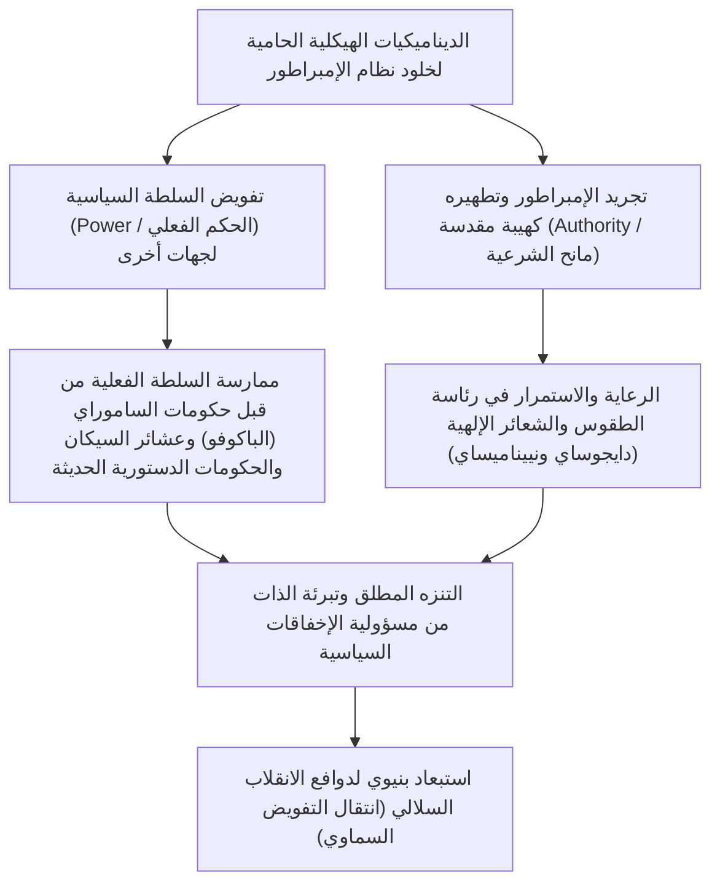
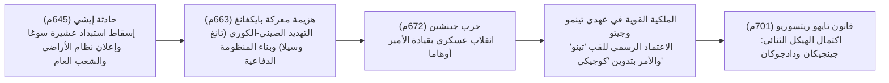
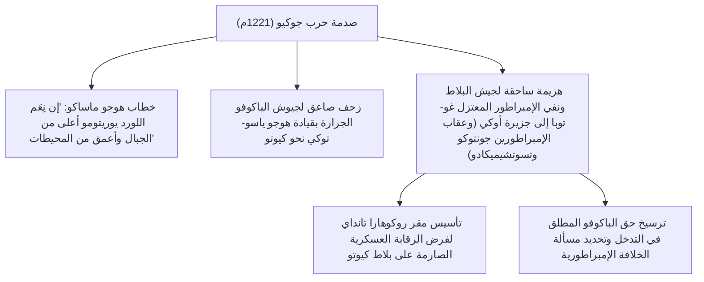
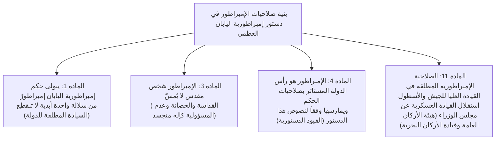
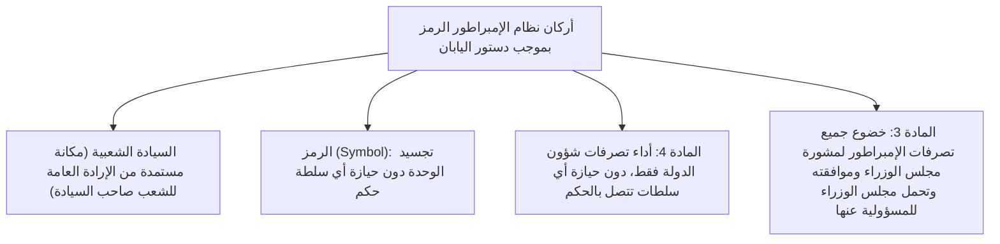
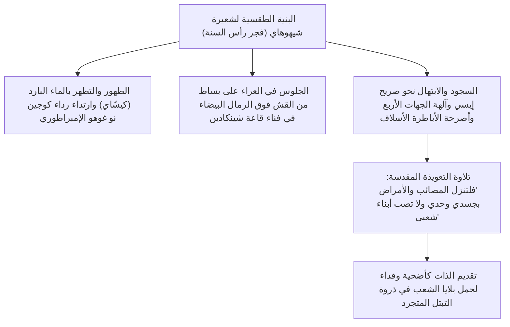
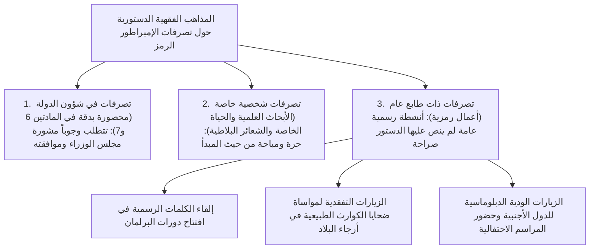

## 1. المقدمة: أقدم سلالة ملكية وراثية في العالم و«الفصل بين السلطة والهيبة»

### 1.1 مقولة «بانسي إيكي» (سلالة واحدة متصلة عبر الأزل) والواقع التاريخي والأثري

يتميز تاريخ إمبراطور اليابان (Emperor of Japan / تينو) والأسرة الإمبراطورية باستمرارية فريدة لا نظير لها عند مقارنتها بأي أسرة ملكية أو سلالة حاكمة باقية في عالمنا المعاصر. حتى إن موسوعة غينيس للأرقام القياسية تصنفها رسمياً بوصفها «أقدم ملكية وراثية متصلة باقية في العالم» (The oldest continuous hereditary monarchy).

وعلى الرغم من أن الخطاب القومي الحديث والمادة الأولى من دستور إمبراطورية اليابان العظمى (دستور ميجي) قد رفعا شعار «بانسي إيكي» (Bansei Ikkei: سلالة إمبراطورية واحدة أبدية لا تنقطع) الذي يرتدي حلة أيديولوجية وميثولوجية، فإن المعطيات التاريخية والآثارية الوضعية الرصينة تثبت حقيقة لا يتطرق إليها أدنى شك علمي: **وهي أنه على الأقل منذ أواخر القرن الخامس الميلادي في عهد الإمبراطور يورياكو (الملك العظيم واكاتاكيرو / واكاتاكيرو أوكيمي)، أو مطلع القرن السادس في عهد الإمبراطور كيتاي، استمرت سلالة ملكية واحدة تحكم نفس الحيز الجغرافي لأرخبيل اليابان على مدار ما يزيد عن 1500 عام بلا انقطاع.**

وحين نستعرض تاريخ الحضارات الإنسانية المختلفة، نجد أن الصين كانت تشهد تقلب «التفويض السماوي» عبر ما يُعرف بـ «الانقلاب السلالي أو تبديل الألقاب» (Yi Xing Ge Ming / 易姓革命)، حيث كان صعود سلالة جديدة يعني إبادة الأسرة الإمبراطورية السابقة ومحوها عن بكرة أبيها. وفي القارة الأوروبية، توالت السلالات الحاكمة الواحدة تلو الأخرى من النورمان إلى بلانتجنت، وتيودور، وستيوارت، وهانوفر. في مواجهة هذا المشهد العالمي، يبرز السؤال الفلسفي والتاريخي الأعمق: لماذا استطاعت سلالة ملكية واحدة في اليابان وحدها أن تبقى وتصمد حتى يومنا هذا، دون أن تمر بأي انقطاع ناتج عن استبدال سلالي؟



---

### 1.2 «الفصل بين السلطة والهيبة» من منظور علم الحضارات المقارن

كما أوضح مؤرخو الفكر وعلماء الثقافة المقارنة، وفي مقدمتهم ماساو ماروياما وروث بينيدكت، فإن السمة الكبرى البارزة في بنية الحكم بالحضارة اليابانية تكمن في **الفصل الثنائي الصارم بين «السلطة السياسية الفعلية» (Power: القوة العسكرية، وجباية الضرائب، والإدارة اليومية للدولة) و«الهيبة الروحية والسيادية المطلقة» (Authority: منبع الشرعية، والقداسة الدينية والرمزية).**

كان العاهل المطلق في الغرب (مثل لويس الرابع عشر في فرنسا) والإمبراطور المستبد في الصين يجمعان في شخصهما الصفتين معاً؛ فهما «أصحاب السلطة الفعلية» الذين يقودون الجيوش ويصدرون الأوامر، وهما في الوقت ذاته «أصحاب الهيبة والشرعية» للنظام والقانون. وحين تتطابق هاتان الصفتان، فإن أي فشل في الحكم، أو هزيمة عسكرية، أو اضطراب اجتماعي عارم يصيب شخص الحاكم مباشرة، مما يؤدي إلى اندلاع الثورات وسحله هو وعائلته من فوق العرش.

في المقابل، حافظ إمبراطور اليابان عبر التاريخ — بدءاً من عصر وصاية عشيرة فوجيوارا (حكم السيكان) في حقبة هييان، وحكم الأباطرة المعتزلين (الإنساي) منذ عهد الإمبراطور شيراكاوا، مروراً بحكومات الساموراي العسكرية في العصور الوسطى (شوغونيات كاماكورا وموروماتشي وإيدو)، وحتى تشكيل مجلس الوزراء في العصر الحديث — على بنية راسخة قوامها: **«تفويض ممارسة السلطة الدنيوية والحكم الفعلي دائماً إلى مستشارين خارجيين وقادة عسكريين»**. وحتى أقوى جنرالات الشوغونية (الباكوفو)، لكي يثبتوا شرعية حكمهم وهيمنتهم، كانوا ملزمين بالحصول على مرسوم إمبراطوري يقلدهم منصب «سيه-إي تايشوغون» (الجنرال الأكبر لقمع البرابرة).

وهكذا، كانت مسؤولية الإخفاقات السياسية تقع دوماً على عاتق الشوغونية أو الوزارة التي مارست الحكم الفعلي، فتسقط وتباد بالثورات والانقلابات، بينما ظل الإمبراطور — بصفته الينبوع الأسمى للشرعية — قابعاً وراء حدود المسؤولية الدنيوية المباشرة. ونتيجة لذلك، لم يجد أي طرف من القوى المتصارعة في أحلك عصور الفتن أي مصلحة أو دافع لاغتصاب العرش الإمبراطوري أو قتل الإمبراطور لتنصيب نفسه مكانه.

---

## 2. تشكل الدولة القديمة وظهور لقب «تينو» (الإمبراطور) والطقوس القانونية

### 2.1 الارتقاء من الملك العظيم (أوكيمي) إلى «تينو»

خلال عصر كوفون (عصر المقابر القديمة)، كان زعيم سلطة ياماتو المهيمنة على وسط الأرخبيل يُلقب بـ «أوكيمي» (الملك العظيم / أوكيمي حاكم ما تحت السماء). وقد أظهر النقش المنحوت على السيف الحديدي المكتشف في مقبرة إيناري-ياما القديمة بمحافظة سايتاما اسم «الملك العظيم واكاتاكيرو» (واكاتاكيرو أوكيمي = الإمبراطور يورياكو)، مما عكس بوضوح طبيعة منصبه كزعيم أعلى لتحالف يضم عشائر أرستقراطية محلية نافذة (نظام العشائر والألقاب: أوجي-كاباني).

وفي أواخر القرن السادس ومطلع القرن السابع، قام الأمير شوتوكو (الأمير أومايادو) وسوغا نو أوماكو، تحت مظلة الإمبراطورة سويكو، بسن نظام المراتب والقلانس الإثنتي عشرة (وهو نظام للمراتب الرسمية يستند إلى الكفاءة الشخصية لا الوراثة والنسب العائلي)، ووضع دستور المواد السبع عشرة (الذي نص على مبادئ: «السلام والوفاق أسمى الفضائل»، «بجلوا الكنوز الثلاثة»، «إذا تلقيتم المراسيم الإمبراطورية فالتزموا بها بكل خشوع»). وفي الرسالة الدبلوماسية الشهيرة الموجهة إلى الإمبراطور يانغ من سلالة سوي الصينية، والتي جاء فيها: «من ابن السماء في بلاد مشرق الشمس، إلى ابن السماء في بلاد مغرب الشمس، سلام عليك»، أعلنت اليابان خروجها واستقلالها عن منظومة التبعية والمبايعة الإمبراطورية الصينية (نظام الجزية والتبعية)، مرسخة مكانتها المستقلة والندّية كـ «ابن سماء» كامل السيادة.

وفي عام 645م، وقعت **«حادثة إيشي» (التي دشنت إصلاحات تايكا)**، حيث نفذ الأمير ناكا نو أوي (الإمبراطور تينجي لاحقاً) وناكاتومي نو كاماتاري (مؤسس عشيرة فوجيوارا) عملية اغتيال مدبرة داخل القصر الإمبراطوري ضد سوغا نو إيروكا لإنهاء استبداده. وأعلن النظام الجديد إلغاء الملكية الخاصة للأراضي والسكان من قِبل العشائر، طارحاً المبدأ الثوري المتمثل في «نظام الأراضي والشعب العام» (كوتشيكومين)، والذي يقضي بأن جميع الأراضي وجميع الرعايا يخضعون مباشرة للدولة وللإمبراطور.



---

### 2.2 حرب جينشين (672م) والسلطة المطلقة للإمبراطور تينمو

كانت **«حرب جينشين» (672م)**، التي اندلعت إثر وفاة الإمبراطور تينجي حول وراثة العرش، أضخم منعطف فاصل في التاريخ الياباني القديم. فقد استطاع الأمير أوهاما، الذي كان معتزلاً في جبال يوشينو، أن يحشد القوى العسكرية الضاربة في الأقاليم الشرقية (مينو وأوواري)، وشن هجوماً صاعقاً دمر به بلاط أومي التابع للأمير أوتومو، ثم اعتلى العرش بنفسه في قصر أسوكا كيوميهارا ملقباً بـ **«الإمبراطور تينمو»**.

وخلال عهد الإمبراطور تينمو وخليفته الإمبراطورة جيتو، اكتملت الأركان الجوهرية لمنظومة الحكم الإمبراطوري القانوني (ريتسوريو):
1. **الاعتماد الرسمي للقب «تينو» (الإمبراطور)**:
   - بدأ الاستخدام الرسمي للقب الأسمى «تينو» (天皇) في الألواح الخشبية (موكّان) والنقوش المعدنية، وهو لقب يُعتقد أن جذوره مستمدة من الإله الأسمى في الطاوية «إمبراطور السماء الأكبر» (天皇大帝 / تجسيد النجم القطبي).
2. **تسمية البلاد رسمياً بـ «نيهون» (اليابان)**:
   - تم استبدال الاسم القديم «واكوكو» (بلاد وا)، واعتماد الاسم الوطني المهيب «نيهون» (مشرق الشمس أو منبت النور).
3. **البدء في تدوين كتب التاريخ والأساطير القومية**:
   - بناءً على مرسوم إمبراطوري من الإمبراطور تينمو، جرى تنقيح الروايات المتوارثة بين العشائر لربط شرعية السلالة الإمبراطورية بآلهة الشمس أماتيراسو، وبدأ العمل على تدوين كتابي «كوجيكي» (أخبار الوقائع القديمة، اكتمل عام 712م) و«نيهون شوكي» (مدونات وقائع اليابان، اكتمل عام 720م).

---

### 2.3 البنية العميقة لأساطير «كيكي» والكنوز الإمبراطورية الثلاثة

تطرح المنظومة الأسطورية المفصلة في كتابي «كوجيكي» و«نيهون شوكي»، والتي تمتد من الآلهة السالفة أماتيراسو أوميكامي (آلهة الشمس العظمى) وصولاً إلى الإمبراطور الأول جينمو، الأساس الديني والكوني لسلطة وهيبة الإمبراطور:

- **هبوط الحفيد السماوي (تينسون كوران) و«المراسيم الإلهية الكبرى الثلاثة»**:
  - حين أرسلت أماتيراسو حفيدها نينيغي نو ميكوتو ليهبط إلى الأرض (قمة تاكاتشيهو)، أصدرت أمرها التأسيسي الخالد المعروف بـ **«المرسوم الإلهي لخلود العرش مع السماء والأرض» (تينجو موكيو نو شينتشوكو)**:
  > «إن أرض حقول الأرز الخصبة ذات الألف وخمسمائة خريف هي الأرض التي ينبغي لنسلي أن يسود عليها ويحكمها. فانزل أنت أيها الحفيد الإمبراطوري وتولَّ أمرها. وامضِ في طريقك، فلتكن عظمة عرشك الإمبراطوري وازدهاره أبدياً سرمداً كخلود السماء والأرض بلا نهاية.»
  - يمثل هذا المرسوم ميثاقاً إلهياً مقدساً يقضي بأن ولاية الحكم الدنيوي قد فُوّضت أبدياً للحفيد الإمبراطوري وسلالته بإرادة سماوية قطعية.
  - وإلى جانب ذلك، صدر «المرسوم الإلهي لحفظ المرآة المقدسة» الذي يأمر بعبادة المرآة بوصفها الروح الحية لأماتيراسو نفسها، و«المرسوم الإلهي لسنابل أرز الحديقة المقدسة» الذي قضى بزراعة سنابل أرز السماء في حقول الأرض.
- **الكنوز الإمبراطورية الثلاثة (سانشو نو جينغي)**:
  1. **مرآة ياتا (ياتا نو كاغامي)**: ترمز للحكمة الإلهية وقداسة الشمس (المستقر الإلهي في الحرم الداخلي لضريح إيسي، مع إيداع نسخة بديلة مقدسة في القصر الإمبراطوري).
  2. **جوهرة ياساكاني (ياساكاني نو ماغاتاما)**: ترمز للرحمة والقدرة الروحية (محفوظة دائماً في غرفة كينجي بالقصر الإمبراطوري).
  3. **سيف كوساناغي (كوساناغي نو تسوروغي / سيف الغيوم المتراكمة)**: يرمز للهيبة والبسالة العسكرية والشجاعة (المستقر الإلهي في ضريح أتسوتا، مع إيداع نسخة بديلة مقدسة في القصر الإمبراطوري).
  - وفي مراسم اعتلاء العرش لكل إمبراطور عبر التاريخ، يُعد طقس تسلم هذه الكنوز المقدسة «مراسم توارث السيف والجواهر» (كينجي-تو-شوكيه-نو-غي) الدليل الشرعي الجوهري الذي لا غنى عنه لإثبات استحقاق العرش الإمبراطوري.

---

### 2.4 ثنائية نظام ريتسوريو: جينجيكان ودادجوكان، وطقس الدايجوساي

أدخل النظام الإداري والقانوني المكتمل في «قانون تايهو ريتسوريو» (701م) تعديلاً استثنائياً وجوهرياً على النموذج البيروقراطي الصيني المستعار من سلالة تانغ.

فبينما وضعت المنظومة الصينية المؤسسة الدينية والطقسية (محكمة تايتشانغ / تايتشانغ سي) تحت إمرة الأجهزة الإدارية والتنفيذية الكبرى (الوزارات التنفيذية الثلاث)، أنشأ نظام ريتسوريو الياباني هيئة **«جينجيكان» (مكتب شؤون الآلهة والطقوس الإلهية)** وجعلها في نفس المكانة المستقلة والمكافئة — بل المتقدمة شرفياً — لمجلس **«دادجوكان» (مجلس الدولة الأكبر)** المنوط بإدارة وتصريف شؤون الدولة الدنيوية (نظام المجلسين والوزارات الثماني: نيكان هاشّو).

ولم تكن المهمة اليومية الجوهرية للإمبراطور تتمثل في ممارسة الشؤون السياسية الروتينية (القرارات الإدارية)، بل في **«الشعائر الإلهية» (شينجي: التبتل والصلوات المرفوعة إلى الآلهة وبودا غير المرئيين)**:
- **مهرجان نييناميساي (عيد تذوق المحصول الجديد)**: يقام في شهر نوفمبر من كل عام، حيث يقدم الإمبراطور نتاج الحصاد الجديد من الأرز والحبوب إلى الآلهة، ويتناول منها بنفسه في طقس مقدس يجمع بين الإله والبشر في مأدبة واحدة (شينجين كيوشوكو: المائدة المشتركة بين الآلهة والإنسان)، ابتهالاً لسلامة الدولة ووفاء المحاصيل وبركة الأمة.
- **طقس الدايجوساي (مهرجان التتويج الإمبراطوري الأكبر)**: هو السر الديني الأعظم الذي يُقام لمرة واحدة فقط في عمر الإمبراطور عقب اعتلائه العرش. يتم بناء جناحين مقدسين من الخشب الطبيعي الخالص على الطراز البدائي القديم يُعرفان بـ «قاعة يوكي» و«قاعة سوكي»، حيث يقضي الإمبراطور ليلته كاملة في عزلة صامتة يقدم فيها الطعام للآلهة السالفة ويأكل معها، لكي تسكن الروح الإمبراطورية المقدسة (قوة أرواح الأجداد الإمبراطوريين / تينو-ري) في جسده، ويولد من جديد كعاهل روحي وكوني حقيقي للأمة.

ومهما تقلبت أيدي السلطة الدنيوية الحاكمة، ظل هذا الدور للإمبراطور بصفته «رئيس الكهنة الأكبر المتفرغ للدعاء الخالص والتضرع المتجرد من الأنانية لسلامة الشعب والدولة» هو النواة الروحية الخالدة التي لا تمس لنظام الإمبراطورية اليابانية.

---

## 3. الهيكل الثنائي للهيبة والسلطة في العصور الوسطى والمبكرة

### 3.1 حكم السيكان والإنساي: ديناميكيات القوة داخل البلاط الإمبراطوري

خلال حقبة هييان، خضعت بنية السلطة المحيطة بالإمبراطور لعمليات تحول وصقل بالغة التعقيد:

- **حكم وصاية عشيرة فوجيوارا (القرنان العاشر والحادي عشر)**:
  - اعتمد الفرع الشمالي لعشيرة فوجيوارا (في أوج مجد ميتشيناغا ويوريميتشي) استراتيجية تزويج بناتهم كإمبراطورات (تشوغو) للأباطرة المتعاقبين. وحين يولد أمير إمبراطوري، يُدفع به إلى اعتلاء العرش وهو لا يزال طفلاً صغيراً، ليتولى الجد من جهة الأم (الأقارب الخارجيون: غايسيكي) منصب «الوصي» (سيشو)، ثم منصب «المستشار الأعلى» (كانباكو) بعد بلوغ الإمبراطور سن الرشد.
  - وبذلك استحوذت عشيرة فوجيوارا بالكامل على سلطة التعيينات وقرارات الدولة دون الحاجة إلى اغتصاب اللقب الإمبراطوري أو المساس بمقامه المقدس.
- **نشوء حكم الأباطرة المعتزلين (الإنساي) (أواخر القرن الحادي عشر وما بعده)**:
  - في عام 1086م، تنازل الإمبراطور شيراكاوا عن العرش للإمبراطور الطفل هوريكاوا وتلقب بـ «الإمبراطور المتقاعد» (جوكو أو تايجو تينو)، وأسس مقراً خاصاً به خارج القصر الإمبراطوري سُمي «إن-نو-تشو» (مكتب حكومة الدير/المعتزل).
  - وبصفته «تشيتين نو كيمي» (سيد الحكم الفعلي والعميد الأكبر للبيت الإمبراطوري)، نجح في إقصاء وصاية عشيرة فوجيوارا واستعادة مقاليد الحكم الفعلي. وعبر حلق رأسه ودخوله سلك الرهبنة البوذية متلقباً بـ «الإمبراطور الراهب» (هوو)، تحرر من القيود الكونفوشيوسية وقوانين ريتسوريو المفروضة على الإمبراطور الجالس على العرش، ومارس سلطة أوتوقراطية حاسمة.

---

### 3.2 ولادة حكومة الساموراي وحرب جوكيو (1221م)

في أواخر القرن الثاني عشر، وعقب القضاء على سلطة عشيرة تايرا، أسس ميناموتو نو يوريتومو **«شوغونية كاماكورا» (كاماكورا باكوفو)** في الأقاليم الشرقية.
وحصل يوريتومو من البلاط الإمبراطوري على اللقب العسكري الرسمي «سيه-إي تايشوغون»، كما نال المرسوم الإمبراطوري لعام بونجي (1185م) الذي خوّله حق تعيين حكام المقاطعات العسكريين (شوغو) ووكلاء الإقطاعيات (جيتو) في سائر أرجاء البلاد. ومن هنا، نشأت المنظومة الثنائية لحكم البلاد: «البلاط الإمبراطوري والنبلاء (كوغي)» في الغرب (كيوتو)، و«حكومة المحاربين (بوكي)» في الشرق (كاماكورا).

ولكن، في محاولة تاريخية كبرى لقلب هذه الموازين وإعادة الهيمنة إلى البلاط، خاض **الإمبراطور المعتزل غو-توبا**، الذي تمتع بطموح وبأس نادرين، مغامرة سياسية وعسكرية شاملة. ففي عام 1221م، أصدر مرسوماً إمبراطورياً يأمر فيه بالقضاء على الحاكم الفعلي لكاماكورا، الوصي هوجو يوشيتوكي، داعياً محاربي البلاد إلى الثورة ضد الشوغونية (**حرب جوكيو**).



انتهت حرب جوكيو بنصر ساحق ومطبق لصالح طبقة الساموراي. وداست أقدام المحاربين علانية على المراسيم الإمبراطورية، واقتيد الإمبراطور المعتزل — سيد الحكم الفعلي — إلى المنفى في جزيرة نائية. وجرد هذا الحدث بلاط كيوتو العاجز عسكرياً من أي قدرة على مواجهة القوة الحربية للساموراي. وفرضت الشوغونية هيمنتها المباشرة على خلافة العرش الإمبراطوري، لتصبح هي الحكم والفيصل الذي يقرر تناوب الجلوس على العرش بين خط دايكاكو-جي (الفرع الجنوبي) وخط جيميو-إن (الفرع الشمالي) في ما عُرف بنظام «التناوب بين الخطين» (ريوتو تيتسوريتسو).

---

### 3.3 استعادة كينمو واضطرابات عصر البلاطين الشمالي والجنوبي

في عام 1333م، استغل الإمبراطور غو-دايغو تذمر المحاربين، وحشد قادة الساموراي الكبار من أمثال أشيكاغا تاكاوجي، ونيتا يوشيسادا، وكوسونوكي ماساشيغي، ليقضي نهائياً على شوغونية كاماكورا، مطلقاً عهد الحكم الإمبراطوري المباشر المعروف بـ **«استعادة كينمو» (كينمو نو شينسيه)**.

غير أن هذه الحكومة الوليدة، التي أهملت مكافأة المحاربين واقتصرت على منح الامتيازات لأشراف البلاط مع تبني نهج أوتوقراطي رجعي يتعارض مع روح العصر، انهارت سريعاً في غضون عامين فقط. فانقلب أشيكاغا تاكاوجي على الإمبراطور، ونصب الإمبراطور كوميو (من خط جيميو-إن الشمالي) في كيوتو مؤسساً شوغونية موروماتشي، في حين فر الإمبراطور غو-دايغو إلى جبال يوشينو الوعرة متمسكاً بشرعيته الحصرية.

وعلى أثر ذلك، غرقت البلاد لنحو 60 عاماً في أتون حرب أهلية دامية عرفت بـ **«عصر البلاطين الشمالي والجنوبي» (1336–1392م)**، تنازع خلالها **«البلاط الشمالي»** في كيوتو و**«البلاط الجنوبي»** في يوشينو حول الشرعية الإمبراطورية. وفي عام 1392م، وبوساطة من الشوغون الثالث أشيكاغا يوشيميتسو، تم التوصل إلى «صلح عصر ميتوكو» لتوحيد البلاطين، حيث سلّم إمبراطور الجنوب غو-كامي-ياما الكنوز الإمبراطورية الثلاثة إلى إمبراطور الشمال غو-كوماتسو (وتتصل سلالة الأباطرة حتى يومنا هذا بنسب إمبراطور الشمال غو-كوماتسو، وإن كان البلاط قد أقر رسمياً في عصر ميجي بأن الشرعية التاريخية لتلك الحقبة كانت حكراً على البلاط الجنوبي لاحتفاظه بالكنوز الأصلية).

وفي أوج عصر موروماتشي، نال الشوغون أشيكاغا يوشيميتسو لقب «ملك اليابان» من الإمبراطور يونغلي إمبراطور سلالة مينغ الصينية، وسعى لتنصيب ابنه إمبراطوراً، ليكون أقرب شخصية في التاريخ الياباني إلى محاولة اغتصاب العرش الإمبراطوري، إلا أن وفاته المفاجئة قضت على تلك الطموحات في مهدها.

---

### 3.4 قوانين توكوغاوا للبلاط والنبلاء ومقررات «العلم والدراسة»

خلال الفوضى العارمة لعصر الحروب الأهلية (سينغوكو)، تردت الأوضاع المالية للبلاط الإمبراطوري إلى قاع الإفلاس، حتى اضطر الإمبراطور غو-نارا إلى كتابة بطاقات الشعر المخطوطة بيده وأدعية سوترا قلب الحكمة البوذية لبيعها من أجل تغطية نفقات المعيشة اليومية للقصر. ومع ذلك، فإن أعتى قادة التوحيد في اليابان — أودا نوبوناغا، وتويوتومي هيديوشي، وتوكوغاوا إياسو — لم يفكر أي منهم في إلغاء منصب الإمبراطور، بل قدموا له تبرعات مالية وأوقافاً ضخمة، وحرصوا كل الحرص على نيل أرفع الرتب الرسمية مثل المستشار الأكبر (كانباكو)، والوزير الأول (دادجو دايجين)، وقائد الجيوش (سيه-إي تايشوغون) لإسباغ الشرعية الدينية والسياسية القصوى على حكوماتهم.

وبعد توحيد البلاد، أصدر توكوغاوا إياسو في عام 1615م مجموعة تشريعات قانونية صارمة قيدت البلاط والنبلاء بالأغلال سميت **«كينتشو نارابيني كوجي شوهاتّو» (قوانين القصر الإمبراطوري ونبلاء البلاط - 17 مادة)**. وجاء في مطلع مادتها الأولى بعبارة حاسمة:

> **«فنون صاحب الجلالة السماوي: دراسة العلم والآداب أولاً وقبل كل شيء.»**

كانت الغاية السياسية الخبيثة والباردة من وراء هذا النص واضحة للغاية: «إن ما ينبغي للإمبراطور أن يكرس له حياته هو القراءة والتبحر في آداب البلاط والشعر والتراث القديم، ويحظر عليه حظراً باتاً التدخل في شؤون السياسة أو الحكم العسكري».
وقد تجلت هذه الهيمنة في «حادثة الرداء الأرجواني» (1629م)، حين ألغت الشوغونية المراسيم الإمبراطورية التي منح الإمبراطور غو-ميزونو بموجبها الرداء الأرجواني لكبار الرهبان البوذيين دون إذن مسبق من الباكوفو، مما دفع الإمبراطور إلى إعلان تنحيه المفاجئ احتجاجاً على إذلال سلطته. وهكذا تحول الإمبراطور في عصر إيدو إلى كائن رمزي خالص مجرد من أي أثر للفاعلية السياسية، محبوس داخل أسوار قصر كيوتو العتيق مفرغاً تماماً من أي قدرة على إحداث أي ضرر للنظام الحاكم.

---

## 4. استعادة ميجي وصناعة دولة «الإله المتجسد» الحديثة

### 4.1 من سونو جوي (تبجيل الإمبراطور وطرد البرابرة) إلى استعادة الحكم الإمبراطوري

منذ منتصف عصر إيدو، ومع تدوين كتاب «تاريخ اليابان الكبير» (داي نيهونشي) في مقاطعة ميتو، وازدهار مدرسة «الدراسات القومية» (كوكوغاكو) على يد موتوأوري نوريناغا، ترسخت عقيدة تبجيل الإمبراطور في صفوف طبقة الساموراي؛ وقوامها أن الشوغون لا يحكم إلا بتفويض مؤقت ممنوح له من الإمبراطور (نظرية التفويض الإمبراطوري للحكم: تايسيه إينين-رون).

وعقب وصول السفن الحربية السوداء الأمريكية بقيادة الكومودور بيري عام 1853م، وانكشاف عجز شوغونية توكوغاوا عن مواجهة الأخطار والضغوط الغربية، انفجرت مشاعر الغضب العارم لدى صغار الساموراي والوطنيين المتحمسين تحت شعار **«سونو جوي» (بجلوا الإمبراطور واطردوا البرابرة)**. وأصدر الإمبراطور كومي مراسيم تأمر بطرد الأجانب، وتحولت مقاطعات تشوشو وساتسوما إلى قوة ثورية تستند إلى هيبة البلاط الإمبراطوري كقطب للجاذبية السياسية.

وفي أكتوبر عام 1867م، رفع الشوغون الخامس عشر توكوغاوا يوشينوبو وثيقة «إعادة السلطة إلى الإمبراطور» (تايسيه هوكان). وفي 9 ديسمبر من العام نفسه، صدر برعاية إيواكورا تومومي وسايغو تاكاموري من ساتسوما **«مرسوم استعادة النظام الإمبراطوري» (أوسي فوكّو نو دايغوريه)**، والذي نص على:
- الإلغاء التام والنهائي لمنظومة الشوغونية (الباكوفو)، ومناصب الوصي (سيشو) والمستشار (كانباكو).
- العودة إلى روح التأسيس الأولى للإمبراطور الأول جينمو، وتدشين حكومة عصرية يتولى فيها الإمبراطور الحكم المباشر.
- اعتلاء الإمبراطور ميجي الشاب (16 عاماً) سدة الحكم، وتغيير اسم مدينة إيدو إلى «طوكيو» (العاصمة الشرقية)، ونقل القصر الإمبراطوري من كيوتو ليستقر نهائياً في قلعة طوكيو (قلعة إيدو سابقاً).

---

### 4.2 الثنائية الدستورية لدستور إمبراطورية اليابان العظمى (دستور ميجي، 1889م)

صاغ كبار رجالات عصر ميجي، وفي مقدمتهم إيتو هيروبومي، **«دستور إمبراطورية اليابان العظمى»** متخذين من النموذج الدستوري البروسي (الألماني) نبراساً لهم، مع تكييفه ليوافق البنية التاريخية الفريدة للمجتمع الياباني.



اتسمت مكانة الإمبراطور في ظل دستور ميجي بـ «ازدواجية بنيوية» بالغة الدقة والتعقيد:
1. **البُعد التراثي والديني الغيبي**: الإمبراطور هو سليل الآلهة، وينبوع الأخلاق القومية، وهو «إله متجسد في صورة بشر» (أراهيتوغامي)، شخصه مقدس منزه عن كل انتهاك ومبرأ من كل خطأ.
2. **البُعد الحداثي والدستوري**: الإمبراطور هو عاهل دستوري يمارس صلاحيات الحكم «وفقاً لنصوص هذا الدستور»؛ فلا يحق له إصدار مراسيم وأوامر ديكتاتورية بإرادته المنفردة، وتتطلب ممارسته للسلطة التنفيذية «المشورة والمصادقة الوزارية» (هوهيتسو) من قِبل وزراء الدولة (المادة 55)، في حين تخضع السلطة التشريعية لموافقة البرلمان الإمبراطوري (المجلس التشريعي).

وخلال حقبة تايشو، صاغ البروفيسور تاتسوكيتشي مينوبي، أستاذ القانون الدستوري بجامعة طوكيو الإمبراطورية، **«نظرية الإمبراطور كجهاز للدولة» (تينو كيكان-سيتسو)** — والتي اعتبرت أن الدولة هي شخص اعتباري صاحب السيادة، وأن الإمبراطور هو الهيئة العليا المنوط بها ممارسة سلطة الدولة ضمن الأطر الدستورية — لتشكل الأساس النظري لنظام الحكومة الحزبية البرلمانية في عهد «ديمقراطية تايشو».

غير أن دستور ميجي تضمن لغماً هيكلياً مدمراً: وهو **المادة 11 التي نصت على «استقلال القيادة العسكرية العليا» (إن قيادة الجيش والأسطول لا تخضع لمشورة مجلس الوزراء، بل تتبع الإمبراطور مباشرة عبر هيئة الأركان العامة)**. ومع مطلع عهد شوا، تذرعت القيادة العسكرية بهذا البند للتمرد على الرقابة المدنية لمجلس الوزراء والبرلمان، مما قاد المنظومة الدستورية برمتها إلى انهيار مأساوي محتوم.

---

## 5. اضطرابات عصر شوا والهزيمة والتحول الجذري إلى «نظام الإمبراطور الرمز»

### 5.1 كارثة أوائل عصر شوا و«القرار المقدس» لإنهاء الحرب

خلال ثلاثينيات القرن العشرين، وعقب أزمة التدخل في صلاحيات القيادة العليا، وحادثة 15 مايو 1932، وحادثة 26 فبراير 1936، لقت التجربة البرلمانية الحزبية حتفها، وانزلقت اليابان إلى غياهب الديكتاتورية العسكرية وحرب الاستنزاف في الصين، وصولاً إلى خوض حرب المحيط الهادئ الكارثية عام 1941م.

وتحولت «شنتو الدولة» إلى عقيدة تعصبية عمياء لُقن المواطنون في ظلها أن التضحية بالروح في سبيل الإمبراطور هي أسمى الفضائل الإنسانية. ورغم ذلك، عاش الإمبراطور شوا (هيروهيتو) صراعاً نفسياً مريراً بين قناعته كملك دستوري لا يستطيع نقض قرارات الحكومة وقيادة الأركان، وبين ابتهالاته المتكررة من أجل السلام وتفادي الدمار.

وفي أغسطس 1945م، وإثر إلقاء القنبلتين الذريتين على هيروشيما وناغاساكي ودخول الاتحاد السوفيتي الحرب، انقسم مجلس إدارة الحرب الأعلى مناصفة حول قضية «الحفاظ على الكيان الوطني واستمرار العرش الإمبراطوري» بين فريق يطالب بالاستسلام وفريق يدعو إلى القتال الانتحاري حتى الرمق الأخير (معركة الوطن الأم الفاصلة وفناء المائة مليون نسمة كالجواهر المهشمة: إيتشيوكو سوغيوكوساي).
وفي الاجتماعين التاريخيين المنعقدين داخل الملجأ المحصن تحت الأرض يومي 10 و14 أغسطس بحضور الإمبراطور، توجه رئيس الوزراء سوزوكي كانتارو طالباً من الإمبراطور أن يحسم الأمر. وهنا، انهمرت دموع الإمبراطور شوا وهو يتخذ **«القرار الإمبراطوري المقدس» (سيدان)** الذي غير مجرى التاريخ:

> **«إن واجبي الأسمى ينحصر في إنقاذ أبناء شعبي. ومهما كان مآل جسدي ومصيري الشخصي، فإني لا أستطيع أن أحتمل رؤية المزيد من شعبي يتساقطون صرعى في جحيم الحرب، أو أن أشهد فناء الحضارة الإنسانية واندثارها. ... إني عاقد العزم على إنهاء الحرب، متحملاً في سبيل ذلك ما لا يُحتمل، وصابراً على ما تنوء بحمله الرواسي.»**

وفي ظهيرة الخامس عشر من أغسطس، أذيع الخطاب المسجل بصوت الإمبراطور (البث الإمبراطوري الصوتي / غيوكو أون هوسو) معلناً القبول ببيان بوتسدام وانتهاء الحرب. ولولا هذا التدخل المباشر الحاسم بصوت الإمبراطور، لكان مؤكداً أن معركة الدفاع عن الجزر الرئيسية ستكلف الشعب الياباني ملايين الضحايا الإضافيين.

---

### 5.2 اللقاء مع ماكارثر وتفادي محاكمة طوكيو

عقب إعلان الاستسلام، حلت قوات الاحتلال التابعة للقيادة العامة لقوات الحلفاء (GHQ) بقيادة الجنرال الأمريكي دوغلاس ماكارثر في اليابان. وتعالت الأصوات في واشنطن ولندن وموسكو مطالبة بمحاكمة الإمبراطور شوا باعتباره «مجرم الحرب الأول المسؤول عن الكارثة» وإعدامه وإلغاء نظام الإمبراطورية من جذوره.

وفي 27 سبتمبر 1945م، توجه الإمبراطور شوا بمفرده إلى السفارة الأمريكية ليلتقي بماكارثر. وبحسب مذكرات ماكارثر، فإن الإمبراطور لم يأتِ مستجدياً النجاة بحياته، بل وقف أمامه بشجاعة مطلقة قائلاً:

> **«لقد جئت إلى هنا لأضع نفسي بين يديك، متحملاً المسؤولية الكاملة والمنفردة عن جميع القرارات السياسية والعسكرية والإجراءات التي اتخذها شعبي في خوض هذه الحرب. إنني لا أبالي إطلاقاً بما قد يحل بشخصي؛ وكل ما أرجوه وأتضرع به إليك هو أن توفروا لشعبي المنكوب ما يقيم أودهم ويقيهم شبح المجاعة.»**

هز هذا الموقف المتجرد مشاعر ماكارثر في الصميم، وأدرك على الفور ضرورة الإبقاء على نظام الإمبراطور وتجنيب شخص الإمبراطور أي ملاحقة قضائية في محاكمة طوكيو العسكرية؛ إذ خلص إلى أن إعدام الإمبراطور سيشعل حرب عصابات عارمة يشارك فيها ملايين اليابانيين، مما سيجعل إدارة الاحتلال العسكري مستحيلة.

وفي الأول من يناير 1946م، أصدر الإمبراطور شوا مرسوماً تاريخياً سمي **«إعلان بناء اليابان الجديدة» (والمعروف شعبياً بـ إعلان البشرية / نينغين سينغين)**، أعلن فيه بوضوح قاطع أن الروابط الوثيقة بين الإمبراطور وشعبه لا تقوم على أساطير غيبية أو وهم أنه إله متجسد في جسد إنسان، بل ترتكز على الثقة المتبادلة والمحبة والتقدير المشترك.

---

### 5.3 المادة الأولى من دستور اليابان: ترسيخ «نظام الإمبراطور الرمز»

أعادت **«دستور اليابان»** (الذي دخل حيز التنفيذ في 3 مايو 1947م) صياغة المكانة القانونية والدستورية للإمبراطور صياغة جذرية في مادته الأولى:

> **المادة 1: «يكون الإمبراطور رمزاً للدولة ورمزاً لوحدة الشعب، ويستمد مكانته هذه من إرادة الشعب الذي تستقر بيده السلطة السيادية.»**



- **التجريد الكامل من سلطات الحكم**: لم يعد الإمبراطور رأساً أو حاكماً للدولة، بل أصبح «رمزاً» (Symbol) يجسد ديمومة الكيان الوطني ووحدة الشعب وتضامنه.
- **حظر ممارسة السلطات السياسية (المادة 4)**: لا يحق للإمبراطور إلا أداء «تصرفات في شؤون الدولة» (كوكوجي-كوي) محددة وحصرية ذات طابع شكلي وبروتوكولي نص عليها الدستور (مثل دعوة البرلمان للانعقاد، وتعيين رئيس الوزراء المعين من البرلمان، والمصادقة على المعاهدات، ومنح الأوسمة الشرفية)، ويُحظر عليه حظراً تاماً التدخل في شؤون الحكم أو توجيه السياسات.
- **مشورة مجلس الوزراء وموافقته (المادة 3)**: تخضع سائر تصرفات الإمبراطور في شؤون الدولة وجوباً لمشورة وموافقة مجلس الوزراء، ومجلس الوزراء وحده هو الذي يتحمل المسؤولية السياسية والقانونية الكاملة عنها.

ورغم أن قطاعاً من المراقبين اعتبروا «نظام الإمبراطور الرمز» نظاماً غريباً فُرض قسراً على البلاد من قبل سلطات الاحتلال الأمريكي، إلا أن التأمل العميق في التاريخ الياباني الطويل يثبت أنه **يمثل أصفى وأصدق عودة إلى جوهر التقاليد التاريخية المتوارثة منذ العصور الوسطى: حيث يتنزه الإمبراطور تماماً عن ممارسة القهر والسلطة السياسية، متفرغاً بالكامل لمقام الهيبة الروحية والصلوات الصامتة المتجردة من أجل سلام وسعادة الأمة.**

---

## 2.5 البنية الطقسية لشعائر البلاط الإمبراطوري والديناميكية الروحية لشعيرة «شيهوهاي»

لفهم الماهية العميقة لإمبراطور اليابان، لا مناص من النفاذ إلى الأغوار الروحية لـ **«شعائر البلاط الإمبراطوري» (Imperial Court Rituals / كوتشو سايشي)**، وهي طقوس وممارسات دينية متوارثة عبر العصور داخل البيت الإمبراطوري، تنفصل تماماً واستقلالياً عن «تصرفات شؤون الدولة» ذات الطابع الدستوري المنصوص عليها في دستور اليابان.

وفي أقصى أعماق غابات قصر فوكياغي في قلب القصر الإمبراطوري بطوكيو، ترقد **«مزارات البلاط الإمبراطوري الثلاثة» (كوتشو ساندين)**:
1. **قاعة كاشيكو-دوكورو (المقام المهيب)**: وتُكرس فيها المرآة المقدسة «ياتا نو كاغامي» (النسخة الإمبراطورية البديلة) بوصفها التجسيد الإلهي لآلهة الشمس وأم الأجداد الإمبراطوريين أماتيراسو أوميكامي.
2. **قاعة كوري-دين (قاعة الأرواح الإمبراطورية)**: وتُكرس لتقديس وتخليد أرواح سائر الأباطرة والأسلاف الإمبراطوريين المتعاقبين منذ الإمبراطور الأول جينمو.
3. **قاعة شين-دين (المعبد الإلهي الأكبر)**: وتُكرس لعبادة سائر آلهة السماء والأرض (ياويوروزو نو كامي: الآلهة التي لا تُحصى).

يترأس الإمبراطور بنفسه عشرات الشعائر والطقوس الدينية الصارمة على مدار فصول السنة. ومن بين تلك المراسم قاطبة، تبرز شعيرة غامضة تمثل قمة التبتل الروحي وتثير أعمق مشاعر الهيبة، وهي شعيرة **«شيهوهاي» (عبادة الجهات الأربع)**، التي تُقام في فجر اليوم الأول من كل عام جديد (في تمام الساعة الخامسة والنصف صباحاً) وسط صقيع الشتاء القارس.



يقوم الإمبراطور بتطهير جسده بالماء البارد (ميسوغي)، ويرتدي الرداء الإمبراطوري الحريري العتيق (كوجين نو غوهو)، ثم يجلس في الهواء الطلق في فناء مكشوف على بساط متواضع من القش مفروش فوق الرمال البيضاء أمام قاعة شينكادين. وهناك، يسجد ويصلي بخشوع عميق باتجاه ضريح إيسي الكبير، وسائر الجبال والأنهار وآلهة الجهات الأربع، ثم نحو أضرحة الأباطرة الأسلاف. وفي ذلك السكون المطبق، يتلو الإمبراطور تعويذة قديمة تعود نصوصها إلى سجلات طقوس عصر هييان:

> **«إن كان للمصائب، والأوبئة الفتاكة، وأهوال الطوفان والحرائق أن تصيب عامة الشعب والرعايا، فلتمر بجسدي أنا أولاً، ولتصيبني وحدي دونهم!»**

إن المعنى الجوهري لهذا الطقس هو تقديم الإمبراطور لنفسه كـ «كبش فداء مطلق» يفتدي به شعبه وأمته، حاملاً على عاتقه سائر الشرور والكوارث الطبيعية والبشرية لدرء الأذى عن الناس. إنها ليست سلطة لممارسة القهر على الآخرين، بل روح تضحية روحية متجردة تنكر الذات وتبتهل لخير وسعادة الآخرين؛ وهذا الجوهر التضحوي الصامت هو الحقل المغناطيسي غير الواعي الذي نقش هيبة ومكانة الإمبراطور في الوجدان العميق للشعب الياباني على مدار آلاف السنين.

---

## 3.5 الواقع التاريخي للإمبراطورات الحاكمات وحقيقة مقولة «المرحلة الانتقالية»

في خضم السجالات الفقهية والسياسية المعاصرة حول وراثة العرش الإمبراطوري، كثيراً ما يُستشهد بنموذج **«الإمبراطورات الحاكمات الثماني عبر عشر فترات حكم»** اللاتي اعتلين العرش بالفعل في التاريخ الياباني القديم.

| الرقم والجيل | اسم الإمبراطورة | فترة الحكم | خلفية الاعتلاء والإنجازات التاريخية |
| :---: | :--- | :---: | :--- |
| **الجيل 33** | **الإمبراطورة سويكو** | 592–628م | اعتلت العرش كأول إمبراطورة لتجاوز الفوضى التي أعقبت اغتيال الإمبراطور سوشون. تحالفت مع الأمير شوتوكو وسوغا نو أوماكو، وأصدرت نظام الرتب الإثنتي عشرة ودستور المواد السبع عشرة. |
| **الجيل 35 / 37** | **الإمبراطورة كوغيوكو / الإمبراطورة سايمي** | 642–645م / 655–661م | اعتلاء العرش مرتين (تشوسو). شهد عهدها الأول حادثة إيشي، وفي عهدها الثاني (سايمي) قادت الجيوش شخصياً إلى كيوشو لخوض معركة بايكغانغ وتوفيت في ميدان الحرب. |
| **الجيل 41** | **الإمبراطورة جيتو** | 690–697م | قرينة الإمبراطور تينمو. واصلت مسيرة زوجها الراحل، فبنت عاصمة فوجيوارا-كيو، وطبقت قانون أسوكا كيوميهارا، ونقلت العرش بثبات إلى حفيدها الإمبراطور مومّو. |
| **الجيل 43** | **الإمبراطورة غينميه** | 707–715م | نقل العاصمة إلى هييجو-كيو (نارا) عام 710م، واكتمال تدوين كتاب «كوجيكي»، والأمر بتأليف كتب «فودوكي» الجغرافية. |
| **الجيل 44** | **الإمبراطورة غينشو** | 715–724م | ابنة الإمبراطورة غينميه (الحالة الوحيدة في التاريخ لانتقال العرش من الأم إلى ابنتها). اكتمل في عهدها كتاب «نيهون شوكي»، وسُنّ قانون سانسي-إيشين نو هو. |
| **الجيل 46 / 48** | **الإمبراطورة كوكن / الإمبراطورة شوتوكو** | 749–758م / 764–770م | ابنة الإمبراطور شومو. اعتلت العرش مرتين. قمعت تمرد فوجيوارا نو ناكامارو، وقربت الراهب البوذي دوكيو، وأحبطت مؤامرة اغتصاب دوكيو للعرش في حادثة وحي أوسا هاتشيمانغو. |
| **الجيل 109** | **الإمبراطورة مايشو** | 1629–1643م | مطلع عصر إيدو. اعتلت العرش إثر التنازل المفاجئ لوالدها الإمبراطور غو-ميزونو احتجاجاً على حادثة الرداء الأرجواني مع الباكوفو (وهي حفيدة الشوغون توكوغاوا هيديتادا). |
| **الجيل 117** | **الإمبراطورة غو-ساكوراماتشي** | 1762–1770م | منتصف عصر إيدو. تولت الحكم عقب وفاة الإمبراطور موموزونو المفاجئة لحين بلوغ الإمبراطور الصغير غو-موموزونو سن الرشد. وهي آخر إمبراطورة حاكمة في العصر الحديث المبكر. |

وعند التدقيق التاريخي الصارم في هذه الحالات، يتضح جلياً أن: **«جميع الإمبراطورات الحاكمات في تاريخ اليابان كنّ ينتمين إلى النسب الذكوري الإمبراطوري (دانكي جوشي: أي أن آباءهن كانوا أباطرة ذكوراً)»**؛ ولم يحدث في تاريخ اليابان قاطبة أن تزوجت إمبراطورة حاكمة من رجل من عامة الشعب أو من سلالة أجنبية ثم انتقل العرش إلى أبنائها من ذلك الزواج (أي أنه لم يوجد قط إمبراطور ينتمي إلى سلالة أمومية: جوكيه تينو).

وفضلاً عن ذلك، فإن معظمهن اعتلين العرش في أوقات الأزمات والضرورات القصوى — كأن يكون ولي العهد المرشح لا يزال طفلاً صغيراً، أو عند حدوث فراغ سياسي حرج إثر وفاة مباغتة للإمبراطور السابق — حيث كانت الإمبراطورة تتولى العرش كعميدة للأسرة الإمبراطورية لتفادي صراعات الوراثة الدامية، ثم تسلم الأمانة إلى وريث ذكر من السلالة الذكورية عند بلوغه الرشد، وهو ما يُعرف في الأدبيات التاريخية بدور «المرحلة الانتقالية» (ناكاتسوغي).

ولكن في الوقت نفسه، من الإجحاف اختزال دورهن في مجرد حلقة وصل عابرة؛ فقد برهنت شخصيات مثل الإمبراطورة سويكو والإمبراطورة جيتو عن كفاءة قيادية استثنائية وبأس سياسي نافذ ساهم في بناء الأركان الصلبة للدولة القديمة. وقد كان للموروث القديم في اليابان — حيث كانت المرأة تُعتبر وسيطة روحية تمتلك قدرات كهنوتية على استنزال الوحي الإلهي والاتصال بالآلهة (الشامانية)، وتتكامل روحياً مع السلطة الدنيوية للرجال ضمن نظام «هيمي-هيكو» الثنائي — أثر جوهري في تسهيل تقبل المجتمع لاعتلاء النساء سدة الملك والإمبراطورية.

---

## 4.6 نشوء شنتو الدولة والبهلوانيات الفلسفية الحديثة لمقولة «الشنتو ليست ديناً»

كان التحدي الأكبر والأعقد الذي واجه حكومة استعادة ميجي هو: «كيف يمكن صياغة مبدأ تكاملي يوحد الأمة الحديثة (Nation-State) على أسس قادرة على مجابهة ومقارعة القوى الاستعمارية الغربية؟»

### 1. عاصفة إلغاء البوذية وفصل الشنتو عن البوذية
على مدار أكثر من ألف عام، تعايشت الشنتو والبوذية وامتزجتا في نسيج عضوي فريد عُرف بـ «التوفيق والتكامل بين الشنتو والبوذية» (شينبوتسو شوغو / حيث كانت المعابد البوذية تُبنى داخل مزارات الشنتو وتعتبر الآلهة تجليات لبودا). ولكن حكومة ميجي عمدت بقسوة إلى تمزيق هذا النسيج بإصدارها **«مرسوم الفصل بين الشنتو والبوذية»** عام 1868م.

أشعل هذا الإجراء عاصفة هوجاء من التطرف التخريبي اجتاحت أرجاء البلاد وعرفت بحركة **«هايبوتسو كيشاكو» (إلغاء البوذية وتحطيم تماثيل شاكياموني)**؛ حيث هوجمت الأديرة والمعابد العريقة، وحُطمت التماثيل البوذية وأُحرقت المخطوطات والأسفار المقدسة، ودُمرت الصروح المعمارية، حتى إن البرج الخماسي الشهير لمعبد كوفوكوجي عُرض للبيع بمبلغ زهيد لا يتجاوز 25 يناً. ورغم أن الحكومة سعت في البداية لجعل الشنتو «ديناً رسمياً للدولة» عبر حملات التبشير الوطنية (حركة نشر العقيدة الكبرى)، إلا أنها اصطدمت بتمسك الشعب العميق بعقيدته البوذية، وواجهت ضغوطاً وانتقادات دبلوماسية غربية عنيفة اتهمتها بانتهاك «حرية الاعتقاد الديني».

### 2. الحيلة الدستورية لمقولة «أضرحة الشنتو ليست ديناً»
لتجاوز هذا المأزق الدبلوماسي والدستوري الشائك، ابتدع مهندسو النظام السياسي في عصر ميجي (وفي مقدمتهم إينوي كواشي) حيلة فقهية وفلسفية مذهلة تمثلت في صياغة أطروحة: **«إن شنتو الأضرحة ليست ديناً من الأديان» (جينجا هي-شوكيو-رون)**.
- نصت المادة 28 من دستور إمبراطورية اليابان العظمى على كفالة «حرية العقيدة الدينية»، معترفة بالمسيحية والبوذية بوصفهما «ديانات فردية خاصة».
- ولكن في الوقت نفسه، قررت الدولة أن «الطقوس والمراسم المؤداة في أضرحة الشنتو (مثل ضريح إيسي وضريح ياسوكوني) ليست أفعالاً دينية، بل هي **أخلاق وطنية عامة ومراسم لتكريم الأجداد واجبة على جميع المواطنين دون استثناء**».
- وترتب على هذه البهلوانية الفكرية أنه لا يحق لأي مواطن ياباني — حتى لو كان مسيحياً مخلصاً أو بوذياً متديناً — أن يمتنع عن زيارة أضرحة الشنتو أو تقديم التبجيل للإمبراطور، لأن ذلك يُعد خرقاً للواجب الوطني العام للدولة. وشكلت هذه المنظومة «شنتو الدولة» (State Shinto) كفضاء مطلق يعلو فوق كل الأديان؛ وهي ذات الثغرة الهيكلية التي مهدت لاحقاً في عصر شوا لتأليه الإمبراطور كـ «إله متجسد» واقتياد البلاد إلى أتون النزعة العسكرية والفاشية الجامحة.

---

## 5.5 السوابق القضائية الدستورية والخطوط الفاصلة لنظام الإمبراطور الرمز

خضع نظام الإمبراطور الرمز المنصوص عليه في دستور اليابان للعديد من الاختبارات الدستورية والسجالات القضائية التي صقلت حدوده ومفاهيمه القانونية.



### 1. إقرار دستورية «الأعمال العامة (التصرفات كرمز للدولة)»
تنص الفقرة الأولى من المادة الرابعة من الدستور على أن «الإمبراطور يؤدي فقط التصرفات في شؤون الدولة المنصوص عليها في هذا الدستور». وإذا ما أُخذ هذا النص الحرفي بجمود وظاهرية، فإن أي نشاط عام يقوم به الإمبراطور خارج القائمة الحصرية (مثل زيارة المناطق المنكوبة بالكوارث، واستقبال ضيوف الدولة الأجانب، وإلقاء كلمة في افتتاح البرلمان) سيكون باطلاً وغير دستوري.
وقد استقر القضاء والتفسير الحكومي الرسمي على أنه: «ما دام الإمبراطور يتبوأ مكانة رمز الدولة، فمن البديهي والطبيعي أن يُسمح له بالقيام بـ **أعمال ذات طابع عام (تصرفات كرمز للدولة)** تتناسب مع مقامه الرفيع»، واعتُبرت هذه الأنشطة دستورية ومشروعة تماماً طالما أنها تخضع للرقابة والمسؤولية والمشورة الفعلية لمجلس الوزراء.

### 2. مبدأ فصل الدين عن الدولة (المادتان 20 و89) وشعائر القصر الإمبراطوري
أثير جدل قانوني واسع حول ما إذا كان تمويل الطقوس الدينية للشنتو الإمبراطوري، مثل نييناميساي ودايجوساي، من الميزانية العامة للدولة (نفقات البلاط العامة) يشكل خرقاً لمبدأ فصل الدين عن الدولة، أم أنه ينبغي أن يُغطى حصراً من المصاريف الخاصة للأسرة الإمبراطورية (نفقات القصر الداخلية).
واستناداً إلى «معيار الهدف والأثر» الذي أرسته المحكمة العليا (في قضيتي طقس وضع حجر الأساس في تسو، وقضية رسوم القرابين في إيهيمي — ومفاده: هل يهدف الفعل إلى غايات دينية بحتة، وهل يترتب عليه دعم أو اضطهاد دين بعينه؟)، قُضي في مراسم التتويج لعصري هيسيه وريوا بأن طقس الدايجوساي يُعد «مراسم تقليدية وتاريخية للبيت الإمبراطوري تكتسي طابعاً عاماً»، وبناءً عليه اعتُبر تمويله من الأموال العامة (نفقات البلاط) متوافقاً مع أحكام الدستور.

---

## 6. ممارسات الإمبراطور الرمز في العصر الحديث وقضية وراثة العرش الإمبراطوري

### 6.1 «أسفار» عصر هيسيه وتحقيق التنحي عن العرش

كانت مسيرة الإمبراطور الخامس والعشرين بعد المئة (الإمبراطور المتقاعد الحالي أكيهيتو) وقرينته الإمبراطورة ميتشيكو هي التي بثت الروح الحية في جسد نظام الإمبراطور الرمز ومنحته نبضه الإنساني الدافئ.
إذ دأب الإمبراطور أكيهيتو على التساؤل الدائم: «ما الذي يعنيه أن تكون رمزاً؟»، وجسد ذلك عملياً بزيارته للمناطق المنكوبة في أرجاء اليابان (من ثوران بركان أونزين-فوغينداكي، وزلزال هانشين-أواجي، وصولاً إلى كارثة زلزال وتسونامي شرق اليابان الكبير)، حيث كان يجثو بركبتيه على أرضيات الملاجئ المتواضعة ليلتقي بالمنكوبين على نفس مستوى أعينهم، يشد على أيديهم ويبث في قلوبهم الأمل والمواساة. كما واظب على القيام بـ «رحلات الصلاة والتأبين لأرواح الضحايا» إلى أوكيناوا، وهيروشيما، وناغاساكي، وجزر المعارك الضارية في سايبان وبالاو وبيليليو والفلبين، لضمان ألا تُمحى مآسي الحرب من ذاكرة الأجيال الصاعدة.

وفي 8 أغسطس 2016م، وجه الإمبراطور رسالة متلفزة تاريخية واستثنائية إلى الشعب الياباني عبر فيها عن «مشاعره الصادقة»، مصارحاً الأمة بأنه مع تقدمه في السن بات يخشى أن يعجز يوماً عن أداء واجباته الرمزية بكامل قواه الجسدية والروحية. واستجابة لهذه الرغبة السامية، سن البرلمان الياباني عام 2017م «القانون الخاص بشأن التنازل عن العرش الإمبراطوري». وفي 30 أبريل 2019م، تحقق التنازل السلمي عن العرش في سابقة هي الأولى من نوعها منذ تنازل الإمبراطور كوكاكو قبل قرنين من الزمان في عصر إيدو، واعتلى ولي العهد ناروهيتو سدة العرش إمبراطوراً سادساً وعشرين بعد المئة لتدشن اليابان عهد «ريوا» الميمون.

---

### 6.2 النقاشات الدستورية والسياسية القانونية المعاصرة حول وراثة العرش الإمبراطوري

في مطلع القرن الحادي والعشرين، تواجه الأسرة الإمبراطورية أخطر أزمة وجودية في تاريخها، وتتمثل في «الانخفاض المتسارع في أعداد أفراد الأسرة وتناقص المرشحين المؤهلين لوراثة العرش».
إذ تنص المادة الأولى من «قانون البلاط الإمبراطوري» الحالي على أن **«العرش الإمبراطوري يرثه الذكور من نسل السلالة الإمبراطورية الذكورية»**.

وحالياً، لا يوجد في جيل الشباب الصاعد سوى أمير واحد فقط يحمل الأهلية القانونية لاعتلاء العرش مستقبلاً، وهو صاحب السمو الإمبراطوري الأمير هيساهيتو، مما يجعل مستقبل الوراثة يسير فوق حبل مشدود شديد الخطورة. وحول هذا المأزق الدستوري، يحتدم الجدل الوطني بين ثلاثة خيارات رئيسية:

| محور النقاش | مضمون المقترح | حجج المؤيدين | مخاوف المتحفظين والمعارضين |
| :--- | :--- | :--- | :--- |
| **1. إجازة تولي المرأة للعرش (الإمبراطورة الأنثى)** | السماح لابنة الإمبراطور باعتلاء العرش (مثال: اعتلاء الأميرة أيكو للعرش). | وجود سوابق تاريخية تضمنت 8 إمبراطورات و10 فترات حكم من الإمبراطورة سويكو حتى غو-ساكوراماتشي. كما يحظى بقبول وتأييد شعبي جارف. | قبولها طالما ظلت في إطار النسل الذكوري المباشر (ابنة الإمبراطور)، مع تخوف المحافظين من أن تكون خطوة تمهد للاعتراف بالسلالة الأنثوية (النظام الأمومي). |
| **2. إجازة وراثة العرش عبر السلالة الأنثوية (النظام الأمومي)** | السماح باعتلاء العرش لمن يرتبط بالنسب الإمبراطوري من جهة الأم فقط (مثل أبناء الإمبراطورة المتزوجة من رجل من عامة الشعب). | الحل العملي والوحيد لتفادي انقراض السلالة الإمبراطورية بشكل دائم ومستقر. ويتوافق مع مبدأ المساواة بين الجنسين. | معارضة شديدة ترى أن هذا الخيار يقضي على أصل شرعية العرش المتمثل في تقليد التوارث الذكوري الأبوي الصارم المتصل دون انقطاع على مدى 126 جيلاً. |
| **3. إعادة تأهيل البيوت الإمبراطورية القديمة (النبلاء الذكور السابقون)** | إعادة أحفاد الذكور من البيوت الإمبراطورية الإحدى عشرة القديمة الذين جُردوا من صفتهم الإمبراطورية بأمر قوات الاحتلال عام 1947م إلى صفوف العائلة الإمبراطورية عبر التبني أو المصاهرة. | يضمن الحفاظ التام والصارم على تقليد استمرار السلالة عبر الذكور من النسب الإمبراطوري المتصل (بانسي إيكي). | صعوبة التقبل الاجتماعي والنفسي لدى عامة الشعب لتحويل مواطنين عاديين عاشوا كأفراد من العامة لما يقرب من 80 عاماً بعد الحرب إلى أمراء إمبراطوريين بين عشية وضحاها. |

---

## 7. الخاتمة: نسب التبتل والطبقة الحضارية العميقة لليابان

إن نظام الإمبراطورية اليابانية ليس مجرد منظومة حكم سياسية أو بناء دستوري جاف، بل هو قبل كل شيء **«طبقة حضارية وثقافية عميقة تأسست على التبتل والدعاء»**، نمت وتجذرت في وجدان جزر اليابان وسكانها على امتداد آلاف السنين.

إنه وجود متسامٍ:
لا يتباهى بالسلطة وجبروتها كشأن الرؤساء والديكتاتورين،
ولا يستعرض الثراء الفاحش كالأثرياء ورجال الأعمال،
بل يقضي أيامه في السكون والرهبة المقدسة لغابات القصر الإمبراطوري، متطهراً لخدمة الطقوس والمزارات في فصول العام،
ليتفرغ لغاية واحدة سامية: الابتهال الخالص بلا انقطاع من أجل سعادة الشعب، وسلام العالم، وبركة المحاصيل وخيرات الأرض.

أمام هذا «المقام المكرس للصلاة المتجردة الخالصة من الأنانية»، حنى قادة العشائر القدامى رؤوسهم إجلالاً، وركع محاربو الساموراي الأشداء خضوعاً، ووقف رواد التحديث في عصر ميجي خاشعين، وإليه تطلعت قلوب الشعب وهي تنهض بإعجاز من ركام الدمار والهزيمة بعد الحرب العالمية الثانية.

ومهما تبدلت الهياكل الظاهرة للنظام على مر القرون — من دولة ريتسوريو القانونية، إلى الشوغونية الإقطاعية، ثم الإمبراطورية الدستورية الحديثة، وصولاً إلى رمز الديمقراطية المعاصرة — فإن الجوهر الروحي المتدفق في قلبه، والمتمثل في **«استمرارية الصلاة والتبتل المقدس»**، لم يخفت وميضه أو ينقطع نبضه ولو للحظة واحدة.

وفي عالم القرن الحادي والعشرين الذي يموج بالصراعات والتحولات المتسارعة، يقف إمبراطور اليابان كعقدة وصل حية تربط آلاف السنين الغابرة بآلاف السنين الآتية؛ ليبقى مرآة روحية سحيقة الغور ينظر فيها اليابانيون ليكتشفوا كنه هويتهم ومعنى بقائهم الحضاري.

---

### 2.6 الأبعاد الأنثروبولوجية العميقة لطقس الدايجوساي: جدل شينوبو أوريكوتشي حول «لحاف السرير المقدس» وكوسمولوجيا الأكل المشترك للحبوب الجديدة

إن طقس الدايجوساي، الذي يمثل ذروة مراسم التتويج الإمبراطوري، ليس مجرد امتداد احتفالي لمهرجان الحصاد، بل يكتسي طابع طقس عبور باطني ومراسم تكريس (Initiation) يتحول من خلالها الإمبراطور من حاكم سياسي إلى شخصية مقدسة تمتلك قوة الأجداد أو هيبة الكيان الإلهي المتجسد. وقد أثار هذا الهيكل الطقسي الغامض نقاشات فكرية وأكاديمية حامية الوطيس في مجالات الأنثروبولوجيا، والدراسات الدينية، والتاريخ منذ العصر الحديث.

ومن أشهر تلك الأطروحات النظرية التي صاغها عالم الفولكلوريات الشهير شينوبو أوريكوتشي حول ما سماه «ماتوكو أوفوسوما» (لحاف السرير المقدس الحقيقي). ففي دراسته الرائدة «المعنى الجوهري لطقس الدايجوساي» (1928م)، ركز أوريكوتشي على وجود وسادة خاصة («ساكاماكورا») وسرير إلهي مهيب («كاموفوشيدو») يُنصبان في أعمق أركان قاعتي يوكي وسوكي المشيدتين خصيصاً لمراسم الدايجوساي. وربط ذلك بما ورد في أساطير هبوط الحفيد السماوي نينيغي نو ميكوتو حين لف نفسه في «ماتوكو أوفوسوما» ليهبط إلى الأرض. وذهب أوريكوتشي إلى أن الإمبراطور الجديد يندس داخل هذا اللحاف المفرك على الفراش الإلهي ليمارس تجربة محاكاة رمزية لحالة الموت ثم الولادة من جديد، لكي تحل روح الإلهة أماتيراسو أو الأرواح الإمبراطورية في جسده. أي أن الدايجوساي بحسب هذا التأويل هو سر باطني لـ «حلول الروح وتجددها» (تامافوري وتاماشيزومي).

```
【التياران الأكاديميان الكبيران حول البنية الباطنية لطقس الدايجوساي】

1. نظرية شينوبو أوريكوتشي (نظرية الحلول الروحي ومراسم الولادة الجديدة)
   ・ المفهوم الجوهري: «ماتوكو أوفوسوما» (لحاف السرير المقدس) و«كاموفوشيدو» (الفراش الإلهي).
   ・ التفسير الطقسي: طقس سري للموت الرمزي والبعث يعتزل فيه الإمبراطور الجديد داخل اللحاف ليحل في جسده روح الأجداد وأماتيراسو.
   ・ الخلفية النظرية: نظريات كونيو ياناغيتا وشينوبو أوريكوتشي حول الإله الزائر (ماريبوتو)، ودراسات جزر أوكيناوا الجنوبية، وطقوس العبور في التجمعات القروية.

2. نظرية المؤرخين الوضعيين والطقوس البلاطية (مائدة الأرز الجديد والاتحاد الطقسي بين الإله والإنسان)
   ・ المفهوم الجوهري: «تقديم القرابين الإلهية» و«شينجين كيوشوكو» (المائدة المشتركة بين الآلهة والبشر).
   ・ التفسير الطقسي: طقس زراعي يتناول فيه الإمبراطور الجديد مع الآلهة الأرز والدخن ونبيذ الساكي المقدس لتجديد عهد الحكم وبركة الخصوبة.
   ・ أبرز الدراسات: الأبحاث التوثيقية لإعادة فحص نصوص «إنغيشيكي» والمخطوطات القديمة بقيادة شوجي أوكادا وإيساو توكورو وتارو ساكاموتو.
```

في المقابل، فند مؤرخون وباحثون في تاريخ الشنتو، من أمثال شوجي أوكادا وإيساو توكورو، هذه النظرية عبر التحقيق الفيلولوجي الصارم لمدونات طقوس الدايجوساي في كتاب «إنغيشيكي» العائد لعصر هييان والمخطوطات الإمبراطورية القديمة، مؤكدين ضعف السند التاريخي لفرضية أوريكوتشي. وأوضح هؤلاء أن جوهر طقس الدايجوساي ينحصر في الحقيقة في تقديم الإمبراطور بنفسه في جوف الليل قرابين الطعام المقدس (الأرز، والدخن، والساكي الأبيض والأسود، والأسماك المجففة وثمار البحر) للآلهة، ثم الجلوس أمام المحراب ليتناول من نفس ذلك الطعام في طقس الاتحاد الروحي بين الإله والبشر «شينجين كيوشوكو» (المائدة المشتركة بين الآلهة والإنسان). ومن خلال مقاسمة الطعام مع الآلهة، يُعبر عن الشكر لخصوبة المجتمع الزراعي وتُجدد الرابطة المقدسة مع الأسلاف؛ بينما يُعد الفراش الإلهي موضعاً لراحة ونزول الإله لا لرقاد الإمبراطور، حيث تنعدم السجلات التي تشير إلى أن الإمبراطور كان ينام هناك كالميت في تابوت.

ويميل الإجماع الأكاديمي المعاصر إلى تقدير الحدس الشعري والوثبة الأنثروبولوجية العميقة لنظرية أوريكوتشي، مع إدراك أن الواقع التاريخي يرتكز على منظومة مركبة تدمج تقاليد التتويج والطقوس الزراعية لشرق آسيا القديمة. ولكن بصرف النظر عن أي من التفسيرين نتبنى، تظل الحقيقة الثابتة التي لا مراء فيها هي أن الدايجوساي مثل عبر التاريخ حاجزاً روحياً حاسماً يتحول عبره الحاكم الدنيوي إلى راعٍ كهنوتي مكرس للخدمة المقدسة.

---

### 4.3 حركة إلغاء البوذية ونشر الدعوة الكبرى: إخفاق فرض الشنتو ديناً رسمياً والهندسة المؤسسية لـ «شنتو الدولة»

لم تكن «استعادة الملكية» في عهد ميجي مجرد انتقال سياسي للسلطة من حكومة عسكرية إقطاعية إلى مجلس دولة مركزي (دادجوكان)، بل كانت تنطوي على ثورة دينية وفكرية جذرية ترفع لواء العودة إلى مبدأ «وحدة الدين والسياسة» (سايسي إيتشي) السائد في العصور الغابرة. ففي مارس 1868م (السنة الأولى من ميجي)، أصدرت الحكومة الوليدة عبر مجلس الدولة بلاغاً عُرف بـ «مرسوم الفصل بين الشنتو والبوذية»، والذي هدف إلى تفكيك منظومة الاندماج التي دامت أكثر من ألف عام، وتطهير الأضرحة من كل المظاهر والرموز البوذية (التماثيل، وسوترا البوذية، وأجراس المعابد، وطبقة الرهبان المشرفين على الأضرحة).

أطلق هذا المرسوم العنان لموجات تخريب هستيرية في أرجاء البلاد، عُرفت بـ «هايبوتسو كيشاكو» (محو البوذية وسحق شاكياموني). وفي مقاطعات مثل ساتسوما، ونايغي، وأوكي، وتوياما، دُمرت المعابد البوذية تدميراً كاملاً، وأُحرقت التماثيل الأثرية، وتعرض الاقتصاد الديري لضربة قاصمة، حتى إن مقتنيات أثرية نفيسة كادت تباع بأبخس الأثمان.

```
【تطور أيديولوجيا وحدة الدين والسياسة في مطلع عصر ميجي】

إحياء مكتب شؤون الآلهة (جينجيكان، 1869م)
  -- "مساعي تيار كوكوغاكو المتطرف (مدرسة هيراتا) لفرض وحدة الدين والسياسة وجعل الشنتو ديناً رسمياً للدولة" -->
عاصفة الفصل بين الشنتو والبوذية وإلغاء البوذية (هايبوتسو كيشاكو: تدمير المعابد واضطهاد الرهبان)
  -- "مواجهة الاستنكار الشعبي الداخلي والضغوط الدبلوماسية الغربية" -->
حملة نشر العقيدة الكبرى (تايكيو سينبو، 1870م: إنشاء وزارة التعليم الديني ومحاولات غرس العقيدة في الشعب)
  -- "مقاومة رهبان مدرسة شينشو (شيمادي موكوراي) دفاعاً عن حرية العقيدة وضغوط القوى الغربية" -->
فشل مشروع جعل الشنتو ديناً رسمياً للدولة (1875م: حل المجمع التعليمي الديني الأكبر دايتوشيو-إن)
  -- "صياغة أطروحة 'الشنتو ليست ديناً' (بناء مؤسسة الأضرحة كجهاز إداري وتدشين شنتو الدولة)" -->
منظومة شنتو الدولة (إشراف إدارة الأضرحة بوزارة الداخلية، والارتقاء بالأضرحة كأخلاق قومية عليا تعلو على الأديان)
```

ومع ذلك، اصطدم مشروع جعل الشنتو ديناً قومياً حصرياً للدولة — الذي قاده غلاة مدرسة هيراتا أتسوتاني للدراسات القومية عبر إحياء «جينجيكان» — بصخور الواقع سريعاً. أولاً، شنت القوى البوذية (ولا سيما رهبان جودو شينشو بقيادة شيمادي موكوراي) مقاومة فكرية شرسة متسلحة بالنظريات الدستورية الغربية حول فصل الدين عن الدولة وحرية الضمير؛ إذ جادل موكوراي إثر جولته في أوروبا عام 1872م بأن حرية الاعتقاد هي حجر الزاوية للدولة الحديثة، وأنه يستحيل على أي حكومة عصرية أن تفرض مذهباً لاهوتياً معيناً على مواطنيها بالإكراه. ثانياً، كان رفع الحظر عن المسيحية وإزالة لوحات التجريم عام 1873م استجابة حتمية للضغوط الدولية، حيث أدركت قيادة ميجي أن وصم اليابان في عواصم الغرب كدولة متوحشة تنتهك حرية الأديان سيقضي نهائياً على أي أمل في تعديل المعاهدات غير المتكافئة.

وللخروج من هذه المعضلة الدبلوماسية والسياسية، ابتكر البيروقراطيون الكبار (وعلى رأسهم إينوي كواشي) هندسة مؤسسية بارعة عُرفت بـ «شنتو الدولة» المؤسسة على فرضية أن «الأضرحة ليست ديناً». فميزت الدولة بين الشنتو بوصفها «طقوس الدولة الرسمية وأساس الأخلاق والوطنية»، وبين الأديان الفردية كالمسيحية والبوذية وفِرق الشنتو الشعبية. وبذلك، ضمن النظام الدستوري الجديد كفالة «حرية المعتقد» ظاهرياً في المادة 28 من دستور ميجي، بينما فرض في الآن ذاته على جميع رعايا الإمبراطورية أداء التبجيل للأضرحة وللإمبراطور باعتباره واجباً مدنياً وقومياً فوق ديني ملزماً للكافة.

---

### 4.4 «المرسوم الإمبراطوري للجنود والبحارة» و«المرسوم الإمبراطوري للتعليم»: الإمبراطور القائد الأعلى والدمج القومي للأخلاق الباطنية

بينما كانت الدولة تسعى لبناء هيكل دستوري حديث يحاكي النظم الغربية، شُيدت في الوقت ذاته أجهزة معنوية وروحية لربط ضمائر المواطنين وعقيدة الجيش بشخص الإمبراطور ربطاً مطلقاً، وتجلى ذلك في صدور «المرسوم الإمبراطوري للجنود والبحارة» عام 1882م (السنة 15 من ميجي) و«المرسوم الإمبراطوري للتعليم» عام 1890م (السنة 23 من ميجي).

#### 1. «المرسوم الإمبراطوري للجنود والبحارة» ونظام الإمبراطور القائد الأعلى (داي-غينسوي)
صاغ المفكر نيشي أماني مسودة «المرسوم الإمبراطوري للجنود والبحارة»، وأدخل عليه ياماغاتا أريتومو تعديلات جوهرية، ليعلن أن الجيش هو «جيش الإمبراطور الخاص الذي يقوده بنفسه»، كاشفاً عن العلاقة المباشرة التي تربط كل جندي بشخص الإمبراطور دون وسيط:

> **«إن جيش بلادنا وقواتها المسلحة كانت عبر العصور خاضعة لقيادة الإمبراطور المباشرة. ... وإنني أنا القائد الأعلى الأكبر (داي-غينسوي) لكم معشر العسكريين. ومن ثَمَّ فإني أعتمد عليكم بوصفكم أذرعي وسواعدي، وأنتم تتطلعون إليّ بصفتي رأسكم وقائدكم، وبذلك تكون وشائج القربى بيننا وثيقة وخاصة لأبعد الحدود.»**

وهكذا، تم تشييد القوات المسلحة لا كمؤسسة تابعة للحكومة الدستورية أو مسؤولة أمام البرلمان الإمبراطوري، بل كمنظمة تدين بالولاء الشخصي المطلق للعاهل المفرد. وفرض المرسوم خمس فضائل عسكرية: «الولاء، والأدب، والشجاعة، والصدق، والبساطة»، وألزم الجنود بالقاعدة الصارمة: «اعلموا أن الواجب أثقل من الجبال الرواسي، وأن الموت أهون من ريشة طائر». وكانت هذه البنية التي تربط القوات المسلحة بالإمبراطور القائد الأعلى هي السند الروحي الذي أفرز مبدأ «استقلال القيادة العسكرية العليا» المانع لرئيس الوزراء من التدخل في العمليات الحربية، ليتحول في عصر شوا إلى مصيدة مؤسسية عطلت تماماً أي قدرة على لجم طيش المؤسسة العسكرية.

#### 2. «المرسوم الإمبراطوري للتعليم» والتوحيد القومي لأخلاق البر والولاء
صدر «المرسوم الإمبراطوري للتعليم» كثمرة للتسوية بين البيروقراطي القانوني إينوي كواشي والمربي الكونفوشيوسي موتودا ناغارازاني، وصيغ لا كقانون تشريعي، بل كخطاب أبوي يتوجه به الإمبراطور مباشرة إلى رعاياه. وبينما روج المرسوم لقيم الأسرة الكونفوشيوسية — كبر الوالدين، ومحبة الإخوة، والوئام بين الزوجين — فإنه حشد تلك الفضائل ووجهها نحو غاية واحدة قصوى: «إذا ما ألمّت بالبلاد نائبة، فهبّوا لخدمة الصالح العام بشجاعة وبسالة، لتصونوا وتدعموا عرش الإمبراطورية الخالد خلود السماء والأرض».

وأصبح هذا المرسوم يُتلى في سائر المدارس في المناسبات القومية الأربع الكبرى (عيد تأسيس الإمبراطورية، وعيد ميلاد الإمبراطور، وعيد الإمبراطور ميجي، وعيد رأس السنة)، حيث كان يوضع في مكان مقدس إلى جانب «الصورة الإمبراطورية الفوتوغرافية» (غوشين-إي) ويُجبر الجميع على الانحناء لهما بأقصى درجات الخشوع. وتجلت السطوة شبه الدينية للمرسوم في حادثة «ازدراء الذات الإمبراطورية لـ أوشيمورا كانزو» عام 1891م؛ حيث تردد المفكر المسيحي وأستاذ المدرسة الثانوية الأولى أوشيمورا كانزو في الركوع العميق أمام المرسوم بدافع من ضميره الديني، فتعرض للتنكيل والطرد من عمله، مما عكس تحول المرسوم إلى اختبار ولاء قومي عقائدي صارم يختبر خضوع الفرد التام للدولة.

---

### 4.5 صراع نظريات الكيان الوطني في عهود ميجي وتايشو وشوا المبكر: شينكيتشي أويسوغي ضد تاتسوكيتشي مينوبي ومأساة «نظرية الإمبراطور كجهاز للدولة»

عقب ترسيخ النظام الدستوري لإمبراطورية ميجي، اندلع أعنف خلاف فقهي وفكري في تاريخ الفكر السياسي الياباني حول طبيعة العلاقة بين الدولة والإمبراطور. وكانت ساحة هذا النزاع الكبرى هي المناظرة الشهيرة بين أستاذي القانون بجامعة طوكيو الإمبراطورية: شينكيتشي أويسوغي (ممثل مدرسة الحق الإلهي وسيادة الحاكم المطلقة) وتاتسوكيتشي مينوبي (ممثل مدرسة الشخصية الاعتبارية للدولة ونظرية الإمبراطور كجهاز).

```
【الصراع بين النظريتين الدستوريتين حول طبيعة الإمبراطور】

1. شينكيتشي أويسوغي (نظرية السيادة الملكية الإلهية المطلقة)
   ・ نظرية الدولة: الإمبراطور هو الدولة ذاتها. السيادة حق إلهي أصيل وخاص بالإمبراطور وحده.
   ・ تفسير صلاحيات الحكم: سلطة الحكم مطلقة وبلا حدود، والدستور ليس سوى قواعد توجيهية يقيد بها الإمبراطور نفسه طواعية.
   ・ الجذور الفكرية: نظرية العائلة الوطنية لهوزومي ياتسوكا، الملكية المطلقة، والينبوع النظري للفاشية القومية المتطرفة في عصر شوا.

2. تاتسوكيتشي مينوبي (نظرية الإمبراطور كجهاز للدولة / الشخصية الاعتبارية للدولة)
   ・ نظرية الدولة: الدولة شخص اعتباري يملك السيادة وسلطة الحكم العامة.
   ・ تفسير صلاحيات الحكم: الإمبراطور يمارس سلطة الحكم بوصفه «الهيئة العليا» للدولة ضمن أطر الدستور والقانون.
   ・ الجذور الفكرية: نظرية الدولة العامة لجورج يلينيك (Georg Jellinek)، والأساس النظري لديمقراطية تايشو والحكم البرلماني الحزبي.
```

لم تكن «نظرية الإمبراطور كجهاز للدولة» التي نادى بها تاتسوكيتشي مينوبي تنتقص بحال من مقام الإمبراطور، بل كانت تستند إلى النظرية القانونية الدقيقة للفقيه الألماني جورج يلينيك، وكان هدفها جعل اليابان دولة قانون ومؤسسات حقيقية، وتحصينها ضد الحكم الفردي الاستبدادي، وتقديم السند الفقهي لمشروعية الحكم البرلماني الحزبي ومسؤولية الوزارة. وخلال حقبة ديمقراطية تايشو، غدت هذه النظرية هي المذهب الرسمي المستقر في الجامعات والدوائر القضائية، واعتُمدت كمعيار لتصحيح امتحانات كبار موظفي الدولة.

إلا أنه مع صعود الفاشية العسكرية وتنامي قوى اليمين المتطرف في ثلاثينيات القرن العشرين، شُنت حملة شعواء لتشويه هذه النظرية بدعوى أنها «تهبط بالإمبراطور الإلهي إلى مجرد أداة أو جهاز في خدمة الدولة». وفي عام 1935م (السنة العاشرة من شوا)، فجر عضو مجلس الأعيان تاكيو كيكوتشي هجوماً نارياً في البرلمان استنفر الجيش ورابطات المحاربين القدامى فيما سُمي بحركة «توضيح الكيان الوطني» (كوكوتاي ميتشو أوندو). ورضخت حكومة كيسوكي أوكادا لإرهاب العسكر، فحظرت مؤلفات مينوبي الدستورية، وأُجبر على الاستقالة من مجلس الأعيان، بل وأصدرت الحكومة بيانين رسميين لتوضيح الكيان الوطني جزمت فيهما بأن «سلطة الحكم تنبع من الذات الإمبراطورية حصراً، وأن نظرية الجهاز تخالف الجوهر المقدس للأمة اليابانية».

كان سحق «نظرية الإمبراطور كجهاز للدولة» إعلاناً لموت سيادة القانون الدستوري في اليابان. وحل محلها تصور باطني ومقدس يضع الإمبراطور فوق كل قيد دستوري، واستغل قادة الجيش وهيئة الأركان هذا الفراغ للتحصن خلف «قداسة القيادة العسكرية العليا» وإلغاء أي شكل من أشكال الرقابة المدنية الديمقراطية، دافعين البلاد إلى الهاوية.

---

### 5.4 دراسة دستورية مقارنة لنظام الإمبراطور الرمز: الفروق الجوهرية مع الملكية البريطانية و«جدل رأس الدولة»

يمتلك «نظام الإمبراطور الرمز» المقر في المادة الأولى من دستور اليابان بنية قانونية فريدة واستثنائية تختلف اختلافاً جذرياً عن سائر الملكيات الدستورية في العالم المعاصر. وتتضح هذه الخصوصية بجلاء عند مقارنته بالملكية البريطانية التي تعد النموذج الأمثل للملكية الدستورية في القارة الأوروبية.

#### 1. التباين الهيكلي مع الملكية البريطانية
في النظام الدستوري البريطاني، يُعتبر التاج رسمياً ونظرياً «مصدر سلطات الحكم»، ويمارس البرلمان سلطة التشريع بصفته «الملك داخل البرلمان» (King-in-Parliament). والحكومة تُسمى رسمياً «حكومة جلالته»، والجيش هو «جيش صاحب الجلالة». وكما حلل المفكر والتر باجهوت في مؤلفه الكلاسيكي «الدستور الإنجليزي» (1867م)، يشكل الملك «الجزء المهيب والمبجل» (Dignified Part) من النظام في موازاة «الجزء الفعال والتنفيذي» (Efficient Part) المتمثل في مجلس الوزراء. ويؤكد باجهوت أن العاهل البريطاني يحتفظ بثلاثة حقوق دستورية جوهرية تمكنه من ممارسة نفوذ سياسي فعلي وهي: «الحق في أن يُستشار، والحق في أن يُشجّع، والحق في أن يُحذّر».

أما في اليابان في ظل دستور عام 1947م، فإن الإمبراطور لا يُعتبر حتى مصدراً شكلياً لسلطات الحكم؛ إذ تعلن المادة الأولى بصراحة مطلقة أن «السيادة تستقر بيد الشعب»، وتحظر المادة الرابعة في نص قطعي ممارسة الإمبراطور لـ «أي سلطة تتصل بنظام الحكم». فكل تصرفاته في شؤون الدولة (المادتان 6 و7) تستلزم حتماً «مشورة وموافقة مجلس الوزراء» الذي يتحمل المسؤولية منفرداً (المادة 3). والدستور الياباني يجرد الإمبراطور تجريداً كاملاً ومحكماً من إبداء أي رأي سياسي أو توجيه النصح والتحذير للسياسيين؛ وهو ما يجعل النموذج الياباني «نظام رمز خالص» يتفوق في تجريده السياسي على أي ملكية دستورية غربية.

```
【مقارنة بين الملكية الدستورية البريطانية ونظام الإمبراطور الرمز في دستور اليابان】

┌─────────────────────────┬────────────────────────────────────────┬────────────────────────────────────────┐
│ وجه المقارنة            │ بريطانيا (الملكية الدستورية البريطانية) │ اليابان (نظام الإمبراطور الرمز)        │
├─────────────────────────┼────────────────────────────────────────┼────────────────────────────────────────┤
│ مستقر السيادة           │ التاج داخل البرلمان (King-in-Parliament│ الشعب (السيادة الشعبية)                │
│ صفة الملك / الإمبراطور  │ رأس الدولة الشكلي ومصدر سلطة الحكم     │ رمز الدولة ورمز وحدة الشعب             │
│ الصلاحيات السياسية      │ حيازة الامتيازات الملكية (النقض والتعيين│ مجرد تماماً منها (المادة 4 فقرة 1)     │
│ التأثير والخطاب السياسي │ حق الاستشارة والتشجيع والتحذير         │ تجريد كامل ومطلق / مشورة وموافقة الوزارة│
│ العلاقة بالقوات المسلحة │ القائد الأعلى للقوات المسلحة           │ لا توجد علاقة قيادة قانونية بالدفاع    │
└─────────────────────────┴────────────────────────────────────────┴────────────────────────────────────────┘
```

#### 2. «جدل رأس الدولة» في الفقه الدستوري بعد الحرب
أفرزت هذه الهندسة الدستورية الاستثنائية جدلاً أكاديمياً ودبلوماسياً طويلاً في اليابان عُرف بـ «جدل رأس الدولة» (جينشو رونسو).
ويُعرف «رأس الدولة» (Chief of State) في القانون الدولي العام بأنه السلطة العليا التي تمثل الدولة في علاقاتها الخارجية وتتولى قمة جهاز الحكم في الداخل.

- **الاتجاه المؤيد (رأي المحافظين والممارسة الدبلوماسية)**: يركز هذا الرأي على أن الإمبراطور يتولى قبول أوراق اعتماد السفراء الأجانب والمصادقة على وثائق إبرام المعاهدات، ويُعامل في البروتوكول الدولي معاملة رؤساء الدول والملوك، مما يجعله بحكم الأمر الواقع رئيساً للدولة بالمعنى الخارجي والتمثيلي.
- **الاتجاه النافي (رأي غالبية فقهاء الدستور وفي طليعتهم توشي-يوشي ميازاوا)**: يرى هذا الاتجاه أن صلاحية إبرام المعاهدات وتسيير العلاقات الدبلوماسية منوطة دستورياً بمجلس الوزراء (المادة 73)، والتمثيل الفعلي للدولة في الخارج يعود لرئيس الوزراء. وبما أن الإمبراطور لا يرأس السلطة التنفيذية ولا يمتلك أي إرادة مستقلة في اتخاذ القرار، فلا يمكن قانوناً اعتباره رئيساً للدولة بالمعنى الدستوري الدقيق.
- **نظرية شبه رأس الدولة أو رأس الدولة الرمزي**: وهي محاولة توفيقية تجعل الإمبراطور ممثلاً بروتوكولياً للدولة أمام الخارج، بينما تبقي القيادة التنفيذية الحقيقية بيد رئيس مجلس الوزراء.

وقد استقر الموقف الحكومي الرسمي على صيغة دبلوماسية مرنة مفادها: «إن الإمبراطور، من خلال ممارسته لمهام المصادقة على المعاهدات واستقبال المبعوثين الدبلوماسيين، يؤدي دور ممثل الدولة في المحافل الخارجية، ومن ثم فلا حرج في وصفه برأس الدولة (أو رئيس الدولة الرمزي)».

---

### 6.3 انتقال العهد إلى ريوا وقانون البلاط الإمبراطوري الخاص (2017م): المادة 2 من الدستور «وراثة العرش» وفقه التنحي

شكلت الكلمة المتلفزة التي وجهها الإمبراطور الخامس والعشرون بعد المئة (الإمبراطور المتقاعد الحالي أكيهيتو) في 8 أغسطس 2016م حول «واجبات الإمبراطور كرمز للدولة» أكبر نقطة تحول في تاريخ نظام الإمبراطور الرمز في مرحلة ما بعد الحرب. فقد أحدث إفصاح الإمبراطور عن مشاعره وقلقه من أن يحول تقدمه في السن واعتلال صحته دون أداء مهامه الرمزية بكل تفانٍ هزة اجتماعية ودستورية كبرى أيقظت النقاش المجمد حول تعديل قانون البلاط الإمبراطوري.

كانت المادة الرابعة من قانون البلاط الإمبراطوري تنص على أنه «عند وفاة الإمبراطور، يعتلي ولي العهد العرش فوراً»، مكرسة مبدأ البقاء في المنصب مدى الحياة. وكان الدافع التاريخي لهذا التصلب هو الخشية الشديدة التي سيطرت على واضعي النظام في عصر ميجي من تكرار ظاهرة «ازدواجية السلطة» ونشوء صراع بين الإمبراطور المتنحي (جوكو) والإمبراطور الجالس، كما كان يحدث في العصور الوسطى.

إلا أن الحكومة سعت إلى إيجاد مخرج قانوني يحترم رغبة الإمبراطور ويحافظ في الوقت عينه على التناغم مع المادة الثانية من الدستور («تكون وراثة العرش الإمبراطوري بالوراثة وفقاً لأحكام قانون البلاط الإمبراطوري المقر من البرلمان»)، دون فتح الباب لتنحي الأباطرة بشكل دائم ومفتوح. وتمثل الحل في سن تشريع استثنائي لمرة واحدة في يونيو 2017م هو: **«القانون الخاص بشأن التنازل عن العرش الإمبراطوري»**.

```
【أبرز المحاور الدستورية والقانونية حول مسألة التنحي عن العرش】

1. سن قانون دائم (تعديل قانون البلاط) أم إقرار قانون خاص مؤقت؟
   ・ قرار الحكومة: الخشية من أن فتح باب التنحي الدائم قد يتيح فرض التنحي القسري على الأباطرة مستقبلاً أو التوظيف السياسي للعرش؛ لذا تقرر سن «قانون خاص استثنائي لمرة واحدة فقط» يقوم على التقدير والمحبة الشعبية العارمة.
   ・ مآخذ فقهاء الدستور: رأى بعض فقهاء الدستور أن نص المادة 2 الصريح «بموجب قانون البلاط الإمبراطوري المقر من البرلمان» يعني أن اللجوء إلى قانون استثنائي منفصل قد يشكل التفافاً على روح الدستور.

2. منع ازدواجية الهيبة وازدواجية السلطة
   ・ إعادة تنظيم الوضع القانوني للإمبراطور المتنحي (جوكو). استحداث ديوان «مكتب الإمبراطور المتقاعد» في وكالة البلاط الإمبراطوري، وحظر ممارسة أي تصرفات في شؤون الدولة أو أنشطة رمزية عامة لمنع التداخل مع الإمبراطور الجديد.

3. الآفاق المستقبلية لأهلية خلافة العرش
   ・ التناقص الحاد في أفراد الأسرة الإمبراطورية بسبب مغادرة الأميرات للأسرة عند الزواج.
   ・ بقاء النقاش الوطني معلقاً بيد الشعب صاحب السيادة حول: تولي الإناث (النسب الذكوري)، وراثة السلالة الأمومية، أو إعادة تأهيل أمراء الفروع الإمبراطورية القديمة عبر التبني.
```

وفي الأول من مايو 2019م، اعتلى صاحب السمو الإمبراطوري الأمير ناروهيتو سدة العرش الإمبراطوري، معلناً تدشين عصر «ريوا»؛ لتشهد اليابان أول عملية انتقال للعرش عن طريق التنحي السلمي منذ 202 عام، في أجواء غمرها الاستقرار والمشاعر الاحتفالية الجياشة. وقد برهن هذا الحدث التاريخي الاستثنائي للعالم أجمع على أن شرعية نظام الإمبراطور الرمز وديمومته لا تستندان إلى جمود النصوص وقوالبها الإدارية، بل تشيدان على التضامن الحي والتآلف الإنساني الديناميكي والثقة المتبادلة العميقة التي تجمع بين الإمبراطور والشعب صاحب السيادة.
