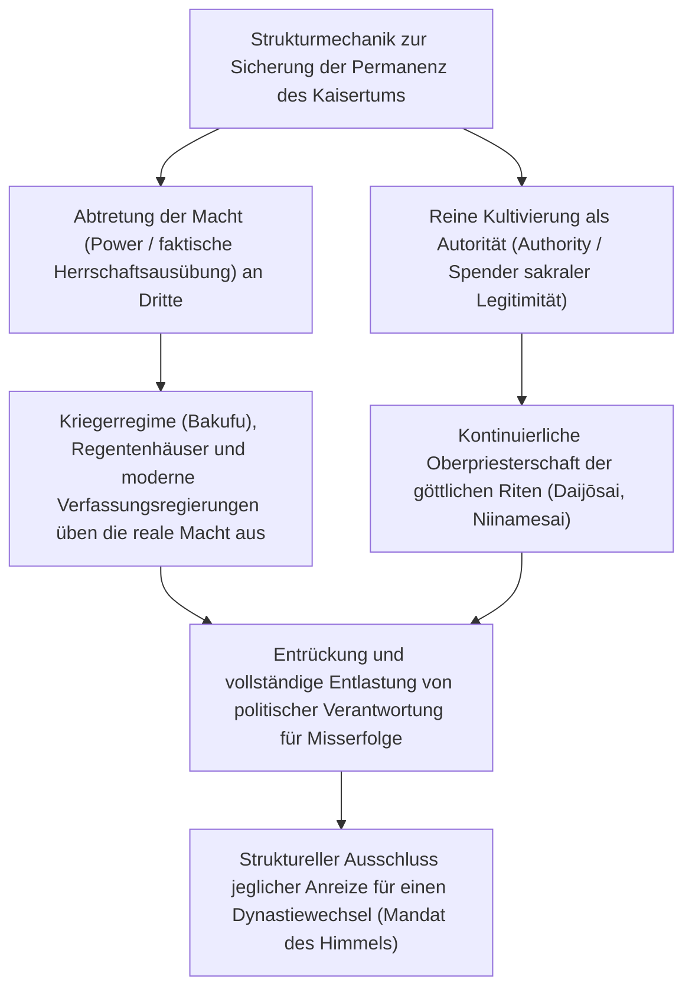
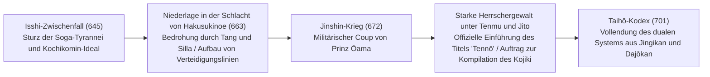
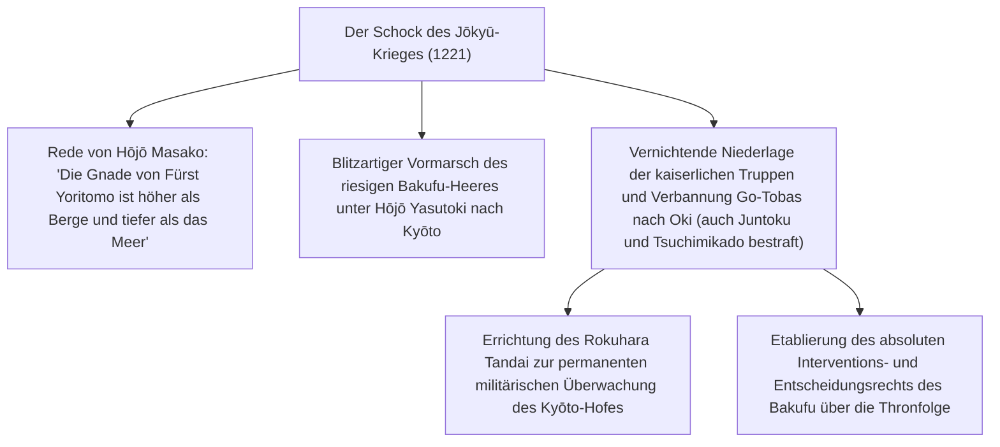
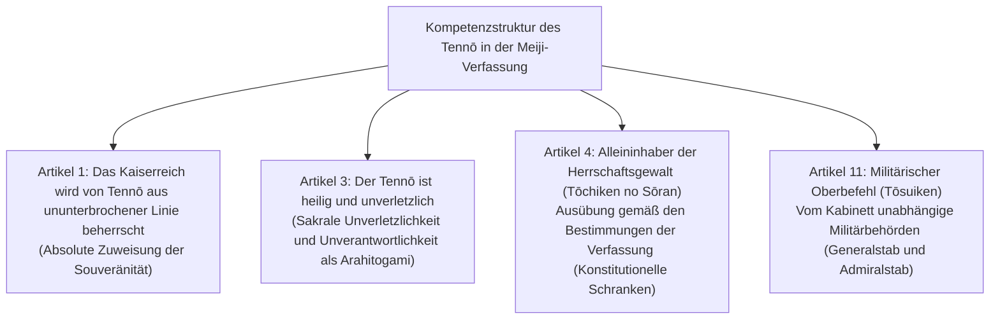
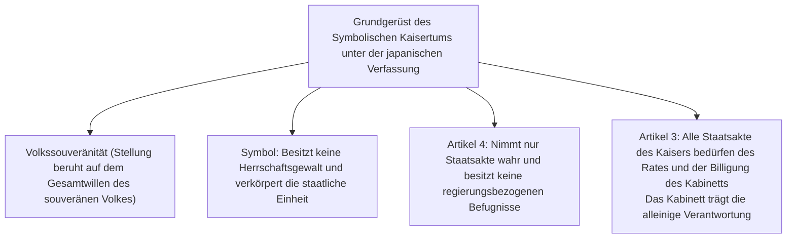
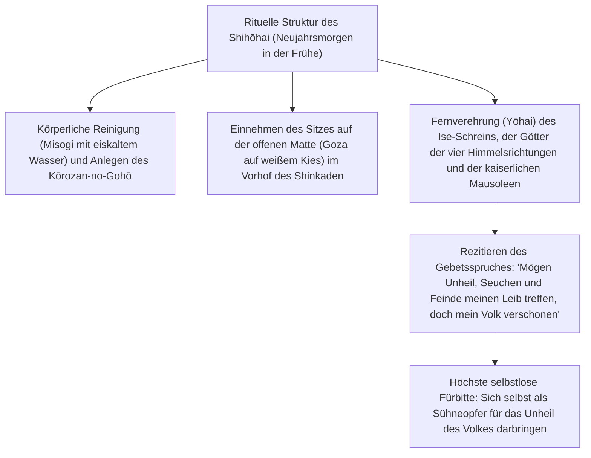
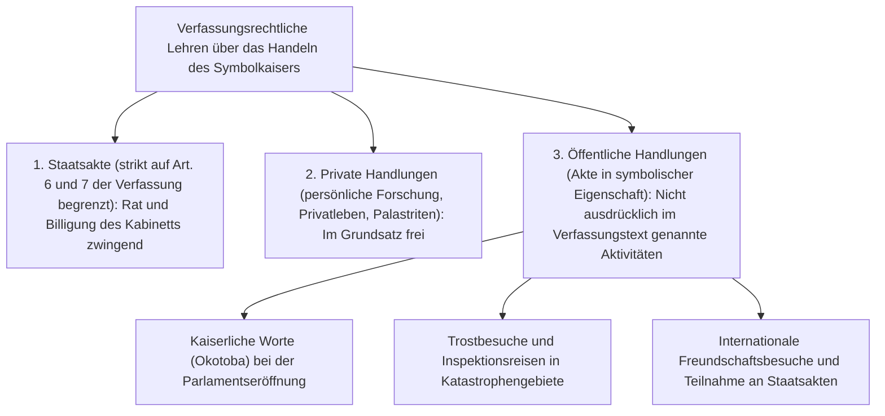

## 1. Einleitung: Die älteste erbliche Herrscherdynastie der Welt und die „Trennung von Macht und Autorität“

### 1.1 Der Diskurs der „ununterbrochenen Thronfolge für ewige Zeiten“ (Bansei Ikkei) und die historisch-archäologische Realität

Die Geschichte des japanischen Tennō (Kaiser von Japan / Emperor of Japan) und des kaiserlichen Hauses zeichnet sich im Vergleich zu allen anderen existierenden Monarchien und Dynastien der Welt durch eine beispiellose, singuläre Kontinuität aus. Auch im Guinness-Buch der Rekorde ist das japanische Kaiserhaus offiziell als „älteste kontinuierliche erbliche Monarchie der Welt“ (*The oldest continuous hereditary monarchy*) anerkannt.

Der Diskurs der „ununterbrochenen Thronfolge für ewige Zeiten“ (*Bansei Ikkei*: eine einzige, niemals abreißende dynastische Blutlinie), der von der neuzeitlichen Nationallehre (*Kokugaku*) systematisiert und in Artikel 1 der Verfassung des Großjapanischen Kaiserreiches (Meiji-Verfassung) verankert wurde, trägt zwar unverkennbar mythisch-ideologische Züge. Im Lichte der empirischen Geschichtswissenschaft und Archäologie ist es jedoch eine wissenschaftlich unbestreitbare historische Tatsache, **dass spätestens seit Kaiser Yūryaku (Großkönig Wakatakeru / Ōkimi) in der zweiten Hälfte des 5. Jahrhunderts oder Kaiser Keitai zu Beginn des 6. Jahrhunderts über einen Zeitraum von mehr als 1.500 Jahren eine einzige Herrscherdynastie kontinuierlich im selben Inselraum regiert hat**.

Blickt man auf die Geschichte der Weltzivilisationen, so wurde in China die regierende kaiserliche Familie im Zuge des „Dynastiewechsels“ (Mandat des Himmels / *Ekisei Kakumei* bzw. chinesisch *Yìxìng Gémìng*) bei jedem revolutionären Umsturz regelmäßig physisch vernichtet. Auch in den europäischen Staaten lösten sich die Dynastien fortwährend ab – vom Haus Normandie über die Plantagenets, Tudors, Stuarts bis hin zum Haus Hannover. Warum aber konnte einzig in Japan eine einzige Herrscherdynastie bis zum heutigen Tag fortdauern, ohne jemals einen dynastiewechselbedingten Bruch zu erleiden?



---

### 1.2 Die „Trennung von Macht und Autorität“ als zivilisationsvergleichende Erkenntnis

Wie Geistes- und Ideengeschichtler sowie Kulturkomparatisten wie Masao Maruyama und Ruth Benedict hervorgehoben haben, liegt das herausragendste Wesensmerkmal der Herrschaftsstruktur der japanischen Zivilisation darin, **dass „politische Macht“ (Power: militärische Gewalt, Steuererhebung, alltägliche Staatsführung) und „ultimative Autorität“ (Authority: Ursprung aller Legitimität, religiöse und symbolische Sakralität) konsequent und dualistisch voneinander getrennt wurden**.

Die absolutistischen Monarchen des Westens (wie Ludwig XIV. von Frankreich) oder die autokratischen Kaiser Chinas waren zugleich „Machtinhaber“, die persönlich Heere kommandierten und Befehle erteilten, und „Autoritätsträger“ von Recht und Ordnung. Fallen beide Dimensionen in einer Person zusammen, trifft die unmittelbare Verantwortung für politische Fehlentscheidungen, militärische Niederlagen oder gesellschaftliche Verwerfungen den Herrscher persönlich – und führt unweigerlich dazu, dass er samt seiner gesamten Sippe durch Aufstände und Revolutionen vom Thron gestürzt und vernichtet wird.

Demgegenüber behielt der japanische Tennō von den Fujiwara der Heian-Zeit (Sekkan-seiji / Regentschaftspolitik), der Klosterherrschaft (*Insei*) seit Kaiser Shirakawa, den Kriegerregimen des Mittelalters und der Frühen Neuzeit (Kamakura-, Muromachi- und Edo-Bakufu) bis hin zu den modernen Kabinetten ununterbrochen das Strukturprinzip bei, **„die säkulare Herrschaftsmacht (die reale Exekutivgewalt) stets an externe Berater, Regenten oder Kriegerclans zu delegieren“**. Selbst die Shōgune der Kriegerregierungen (*Bakufu*) mussten sich, um die Legitimität ihrer Herrschaft nachzuweisen, vom Tennō formell zum „Seii Taishōgun“ (Großer General zur Unterwerfung der Barbaren) ernennen lassen.

Die Verantwortung für politisches Versagen lastete stets auf dem Bakufu oder dem Kabinett, welche die reale Macht ausübten, und diese gingen bei Umstürzen oder Reformkrisen unter. Da der Tennō als Quelle aller Legitimität jedoch jenseits jeder politischen Verantwortlichkeit verharrte, entstand selbst in den turbulentesten Epochen des Umbruchs niemals ein Anreiz, das Kaisertum selbst zu usurpieren (den Tennō zu beseitigen, um selbst den Thron zu besteigen).

---

## 2. Die Entstehung des antiken Staates, der Titel „Tennō“ und die Geburt der Ritsuryō-Liturgie

### 2.1 Vom Großkönig (Ōkimi) zum „Tennō“

In der Kofun-Zeit wurde das Oberhaupt der Yamato-Herrschaft, die das Zentrum des Archipels beherrschte, als „Großkönig“ (*Ōkimi* / *Amenoshita Shiroshimesu Ōkimi* [Großkönig, der alles unter dem Himmel beherrscht]) bezeichnet. Der auf dem Eisenschwert des Inariyama-Kofun in der Präfektur Saitama eingravierte Name „Wakatakeru Ōkimi“ (Großkönig Wakatakeru, identifiziert mit Kaiser Yūryaku) trug noch deutlich die Züge eines Anführers einer Konföderation mächtiger lokaler Klanführer (Uji-Kabane-Aristokratie).

Ende des 6. und Anfang des 7. Jahrhunderts begründeten Prinz Shōtoku (Umayado no Ōji) und Soga no Umako unter Inthronisierung der Kaiserin Suiko das System der Zwölf Hofränge (*Kan'i Jūnikai*, ein Rangsystem nach individuellem Verdienst statt bloßer erblicher Klanherkunft) und erließen die Siebzehn-Artikel-Verfassung (*Jūshichijō Kenpō* mit den Grundsätzen: „Harmonie ist als das Kostbarste zu achten“, „Verehret aufrichtig die Drei Schätze [Buddha, Dharma, Sangha]“, „Empfanget ihr kaiserliche Befehle, so befolget sie mit aller Umsicht“). Wie das berühmte Staatsschreiben an Kaiser Yangdi der Sui-Dynastie bezeugt („Der Sohn des Himmels des Landes, wo die Sonne aufgeht, sendet ein Schreiben an den Sohn des Himmels des Landes, wo die Sonne untergeht. Seid Ihr ohne Beschwerde?“), löste sich Japan damit aus dem tributären Vasallensystem (Tribut- und Investiturordnung) des chinesischen Reiches und proklamierte sein Selbstverständnis als eigenständiger, gleichrangiger „Sohn des Himmels“ (*Tenshi*).

Im Jahr 645, im **„Isshi-Zwischenfall“ (*Isshi no Hen* / Beginn der Taika-Reformen)**, ermordeten Prinz Naka no Ōe (der spätere Kaiser Tenji) und Nakatomi no Kamatari (Stammvater des Fujiwara-Klans) den tyrannisch herrschenden Soga no Iruka im kaiserlichen Palast. Sie verwarfen das Privateigentum der Klangeistlichen an Land und Untertanen und proklamierten das Ideal des **Kochikomin-Systems (System des öffentlichen Landes und der öffentlichen Untertanen)**, wonach aller Boden und das gesamte Volk unmittelbar dem Staat (dem Tennō) unterstehen sollten.



---

### 2.2 Der Jinshin-Krieg (672) und die absolute Autorität des Kaisers Tenmu

Die bedeutendste Wasserscheide der antiken japanischen Geschichte markiert der nach dem Tod von Kaiser Tenji ausgebrochene Thronfolgekrieg, der **„Jinshin-Krieg“ (*Jinshin no Ran*, 672)**. Prinz Ōama, der sich nach Yoshino zurückgezogen hatte, mobilisierte die militärische Streitmacht der östlichen Provinzen (Mino und Owari), zerschlug in einer Blitzoffensive den kaiserlichen Hof von Ōmi unter Prinz Ōtomo und bestieg im Palast Asuka Kiyomihara no Miya selbst den Thron (**Kaiser Tenmu**).

Unter der Regentschaft des Kaisers Tenmu und seiner Gemahlin, Kaiserin Jitō, vollendete sich das fundamentale Gerüst der antiken Ritsuryō-Herrschaft:
1. **Offizielle Einführung des Titels „Tennō“**:
   - Aus dem daoistischen höchsten Himmelsgott „Tiānhuáng Dàdì“ (Vergöttlichung des Polarsterns) abgeleitet, wurde der erhabene Titel „Tennō“ (himmlischer Herrscher) auf Holztäfelchen (*Mokkan*) und Steininschriften offiziell gebräuchlich.
2. **Festlegung des Staatsnamens „Nihon“**:
   - Anstelle des bisherigen Namens „Wa-koku“ wurde der stolze Name „Nihon“ (Ursprung der Sonne / Land der aufgehenden Sonne) kodifiziert.
3. **Beginn der Kompilation der Reichs- und Mythengeschichten**:
   - Auf kaiserlichen Befehl Tenmus begann die Sammlung und Systematisierung der Klanüberlieferungen, um die Legitimität der kaiserlichen Herrscherlinie genealogisch auf die Sonnengöttin Amaterasu zurückzuführen – woraus das *Kojiki* (vollendet 712) und das *Nihonshoki* (vollendet 720) hervorgingen.

---

### 2.3 Die Tiefenstruktur der Kiki-Mythologie und die Drei Reichsinsignien

Das im *Kojiki* und *Nihonshoki* überlieferte Mythensystem, das von der kaiserlichen Ahnengöttin Amaterasu Ōmikami bis zum ersten menschlichen Kaiser Jinmu reicht, liefert das religiöse und kosmologische Fundament für die kaiserliche Autorität.

- **Der Abstieg des HimmelsenProperty (Tenson Kōrin) und die „Drei Großen Göttlichen Erlasse“**:
  - Als Amaterasu ihren Enkel Ninigi no Mikoto auf die irdische Welt (den Gipfel Takachiho) herabsendete, erließ sie die fundamentalste göttliche Weisung, das **„Göttliche Orakel der ewigen und unvergänglichen Herrschaft von Himmel und Erde“ (*Tenjō Mukyū no Shinchoku*)**:
  > „Das Schilfland der tausendfünfhundert Herbste und üppigen Ähren ist das Land, über welches Meine Nachkommen als Könige herrschen sollen. Gehe hinab, Du kaiserlicher Enkel, und herrsche dort! Ziehe hin! Möge das kaiserliche Schicksal blühen und gedeihen, ewig und unvergänglich wie Himmel und Erde.“
  - Damit wurde ein heiliger Bund gestiftet: Die irdische Herrschaftsgewalt wurde durch den Willen der Himmelsgötter dem kaiserlichen Enkel und dessen Nachkommen auf ewig übertragen.
  - Ergänzt wurde dies durch das „Gebot zur Verehrung des heiligen Spiegels“ (*Hōkyō Hōsai no Shinchoku*), der als Amaterasus eigene Seele verehrt werden sollte, sowie das „Gebot der heiligen Reisähren des Himmelsgartens“ (*Imiwa Inaho no Shinchoku*) zur Kultivierung des himmlischen Reises auf Erden.
- **Die Drei Reichsinsignien (*Sanshu no Jingi*)**:
  1. **Yata no Kagami (Der Spiegel Yata)**: Weisheit und solare Sakralität (Hauptheiligtum im inneren Schrein von Ise; ein Katashiro bzw. Substitut wird im Kaiserpalast aufbewahrt).
  2. **Yasakani no Magatama (Das Krummjuwel Yasakani)**: Barmherzigkeit und spirituelle Lebenskraft (dauerhaft aufbewahrt im Kenji-no-Ma des Kaiserpalastes).
  3. **Kusanagi no Tsurugi / Ame no Murakumo no Tsurugi (Das Grasschneideschwert)**: Militärische Entschlossenheit und Tapferkeit (Hauptheiligtum im Atsuta-Schrein; ein Katashiro befindet sich im Kaiserpalast).
  - Bei der Thronbesteigung jedes neuen Tennō gilt die rituelle Übergabe dieser Insignien („Kenji-tō-Shōkei-no-Gi“) als unverzichtbarer materieller und sakraler Beweis der Thronlegitimität.

---

### 2.4 Der Dualismus des Ritsuryō-Systems: Jingikan und Dajōkan sowie das Daijōsai

Die durch den „Taihō-Kodex“ von 701 vollendete antike Verwaltungsordnung übernahm zwar das Vorbild des chinesischen Tang-Rechts, vollzog jedoch eine zivilisatorisch folgenschwere Modifikation.

Während im Recht der Tang-Dynastie die Behörde für religiöse Riten (*Taichangsi*) den obersten administrativen Organen (den Drei Kanzleien) untergeordnet war, stellte das japanische Ritsuryō-System das **Jingikan (Götteramt / Amt für kultische Angelegenheiten)** gleichberechtigt neben oder gar protokollarisch über den **Dajōkan (Staatsrat / oberste weltliche Regierungsbehörde)** (System der zwei Ämter und acht Ministerien: *Nikan Hasshō-sei*).

Die wesentlichste alltägliche Pflicht des Tennō bestand keineswegs im tagespolitischen Entscheiden, sondern in den **„Shinji“ (den heiligen Riten und Fürbitten an die unsichtbaren Gottheiten und Buddhas)**.
- **Niinamesai**: Jedes Jahr im November bringt der Tennō den Göttern die Erstlinge der diesjährigen Reisernte dar und speist selbst gemeinsam mit ihnen (**Shinjin Kyōshoku**: sakrales Mahl von Göttern und Menschen), um die Einheit von Gottheit und Mensch zu vollziehen und für den Frieden des Reiches sowie reiche Ernten zu beten.
- **Daijōsai**: Die höchste, nur ein einziges Mal zu Beginn jeder Regentschaft gefeierte geheime Inthronisationsliturgie. Die beiden archaischen Hallen Yuki-den und Suki-den werden auf unberührtem Boden völlig neu errichtet; dort opfert der neue Kaiser die ganze Nacht hindurch den Ahnengöttern und speist mit ihnen, wodurch der kaiserliche Geist (*Tennō-rei*) seinen Körper durchdringt und er als wahrhafter geistlicher Souverän spirituell wiedergeboren wird.

Wie sehr sich die weltliche Macht im Laufe der Jahrhunderte auch verschieben mochte: Diese Rolle als „selbstloser oberster Priester, der unablässig zu den Göttern für das Wohl des Staates betet“, bildete den unzerstörbaren Wesenskern des japanischen Kaisertums.

---

## 3. Die Doppelstruktur von Autorität und Macht im Mittelalter und in der Frühen Neuzeit

### 3.1 Sekkan-seiji und Insei: Machtdynamiken innerhalb des kaiserlichen Hofes

In der Heian-Zeit erfuhr die Herrschaftsstruktur um den Kaiserhof eine außerordentliche Verfeinerung und Wandlung.

- **Die Sekkan-seiji des Fujiwara-Klans (10.–11. Jahrhundert)**:
  - Der nördliche Zweig der Fujiwara (*Fujiwara Hokke*; Blütezeit unter Michinaga und Yorimichi) verheiratete seine Töchter systematisch als kaiserliche Gemahlinnen (*Chūgū*) und ließ die aus diesen Verbindungen hervorgegangenen kaiserlichen Prinzen bereits im Kindesalter den Thron besteigen. Als mütterliche Großväter (*Gaiseki*) übernahmen die Fujiwara das Amt des **Sesshō (Regent für minderjährige Herrscher)** und nach Erreichen der Volljährigkeit das des **Kampaku (Kanzlerregent für erwachsene Kaiser)**.
  - Ohne jemals die kaiserliche Autorität selbst zu usurpieren, beherrschten sie über ihre Stellung als maternale Verwandte Personalpolitik und Regierungsgeschäfte absolut.
- **Die Etablierung des Insei (Klosterherrschaft, ab dem späten 11. Jahrhundert)**:
  - Im Jahr 1086 dankte Kaiser Shirakawa zugunsten des minderjährigen Kaisers Horikawa ab, nahm den Titel **Jōkō (abgedankter Kaiser / Daijō Tennō)** an und errichtete außerhalb des eigentlichen Palastes seine eigene Residenz und Kanzlei (*In-no-Chō*).
  - Als **„Chiten no Kimi“ (Herr des Reiches / Familienoberhaupt des Kaiserhauses)** drängte er die Fujiwara-Regenten beiseite und eroberte die faktische Regierungsgewalt für die kaiserliche Familie zurück. Indem der Jōkō die Tonsur empfing und zum **Hōō (Kaiserlicher Mönch)** wurde, entzog er sich den konfuzianischen und ritsuryō-rechtlichen Pflichten des amtierenden Kaisers und übte eine autokratische Machtfülle aus.

---

### 3.2 Die Entstehung der Kriegerregime und der Jōkyū-Krieg (1221)

In der zweiten Hälfte des 12. Jahrhunderts begründete Minamoto no Yoritomo nach der Niederwerfung des Taira-Klans das **Kamakura-Bakufu (Shōgunat)** im östlichen Kamakura.
Yoritomo erwirkte vom Hof den Titel des „Seii Taishōgun“ sowie kaiserliche Dekrete zur reichsweiten Einsetzung von Shugo (Militärgouverneuren) und Jitō (Landverwaltern) (Bunji-Dekrete, 1185). Damit entstand die duale Herrschaftsordnung von Hofadel (*Kuge* im Westen) und Kriegeradel (*Buke* im Osten).

Den Versuch, diese Hegemonie des Kriegeradels umzukehren, unternahm der tatkräftige abgedankte **Kaiser Go-Toba**.
1221 erließ er einen kaiserlichen Erlass (*Inzen*) zur Ächtung und Bestrafung des Regenten des Kamakura-Bakufu, Hōjō Yoshitoki, und rief die Krieger landesweit zum bewaffneten Aufstand auf (**Jōkyū-Krieg**).



Der Ausgang des Jōkyū-Krieges war ein überwältigender Sieg der Kriegerklasse. Zum ersten Mal traten Samurai ein kaiserliches Edikt offen mit Füßen und verbannten den Chiten no Kimi auf eine entlegene Insel. Damit trat die brutale Realität zutage: Ein Kaiserhof ohne militärische Heere vermag sich der Gewalt des Kriegeradels nicht zu widersetzen. Das Bakufu griff fortan direkt in die kaiserliche Thronfolge ein und schlichtete den alternierenden Wechsel zwischen den beiden Linien Daikakuji-tō (spätere Süd-Dynastie) und Jimyōin-tō (spätere Nord-Dynastie) im Turnus (*Ryōtō Tetsuritsu*).

---

### 3.3 Die Kenmu-Restauration und die Wirren der Nord- und Süd-Höfe (Nanbokuchō)

Im Jahr 1333 mobilisierte Kaiser Go-Daigo Kriegerführer wie Ashikaga Takauji, Nitta Yoshisada und Kusunoki Masashige, stürzte das Kamakura-Bakufu und rief die kaiserliche Direktregentschaft aus (**Kenmu-Restauration**).

Doch die restaurative Politik, welche die Belohnungsansprüche der Krieger missachtete, anachronistische Hofadelsprivilegien wiederbelebte und einen absolutistischen Willkürstil pflegte, brach nach kaum zwei Jahren zusammen. Ashikaga Takauji wandte sich ab, setzte in Kyōto Kaiser Kōmyō (Jimyōin-Linie) auf den Thron, begründete das Muromachi-Bakufu und zwang Kaiser Go-Daigo zur Flucht in die Berge von Yoshino, von wo aus dieser die alleinige Legitimität beanspruchte.

In den folgenden rund 60 Jahren tobte die **Nanbokuchō-Zeit (Zeit der Nord- und Süd-Höfe, 1336–1392)**, in der der **Nordhof** in Kyōto und der **Südhof** in Yoshino in bitteren Bürgerkriegen um die dynastische Legitimität rangen. Erst 1392 vermittelte der 3. Shōgun Ashikaga Yoshimitsu den Meitoku-Frieden (Zusammenführung beider Höfe), bei dem Kaiser Go-Kameyama vom Südhof die Drei Reichsinsignien an Kaiser Go-Komatsu vom Nordhof übergab. (Die bis heute fortbestehende kaiserliche Linie entstammt dem Nordhof ab Kaiser Go-Komatsu, wenngleich in der Meiji-Zeit offiziell dekretiert wurde, dass die historische Legitimität während des Schismas beim Südhof lag, da dieser die Insignien ununterbrochen hielt).

Auf dem Höhepunkt der Muromachi-Macht ließ sich Ashikaga Yoshimitsu vom Ming-Kaiser Yongle als „König von Japan“ (*Nihon Kokuō*) belehnen und unternahm Schritte, seinen eigenen Sohn auf den kaiserlichen Thron zu bringen – womit er einer Usurpation historisch am nächsten kam. Mit seinem plötzlichen Tod erlosch diese Ambition jedoch augenblicklich.

---

### 3.4 Die Gesetze für den kaiserlichen Hof und den Hofadel (Kinchū narabini Kuge Shohatto) des Tokugawa-Bakufu und das Gebot der Gelehrsamkeit

In den Wirren der Sengoku-Zeit verarmte der Hof derart dramatisch, dass Kaiser Go-Nara eigenhändig geschriebene Gedichte (*Waka*) und Abschriften des Herz-Sutras verkaufen musste, um den Palastunterhalt zu sichern. Dennoch wagte es keiner der Reichseiniger – weder Oda Nobunaga noch Toyotomi Hideyoshi noch Tokugawa Ieyasu –, den Tennō abzusetzen. Stattdessen stifteten sie beträchtliche Gelder und ließen sich als Kampaku, Dajō Daijin oder Seii Taishōgun ernennen, um die sakrale Legitimität ihrer Herrschaft abzusichern.

Nach der endgültigen Unterwerfung des Reiches erließ Tokugawa Ieyasu 1615 die **„Kinchū narabini Kuge Shohatto“ (Gesetze für den kaiserlichen Hof und den Hofadel, 17 Artikel)**, welche den Hof rechtlich vollständig an die Kandare nahmen. Gleich in Artikel 1 wurde unmissverständlich bestimmt:

> **„Unter allen Künsten des Himmelssohnes steht an erster Stelle die Gelehrsamkeit (Gogakumon).“**

Die eiskalte politische Absicht hinter dieser Bestimmung war glasklar: Der Tennō sollte sich ausschließlich der klassischen Gelehrsamkeit, den Riten des Hofzeremoniells (*Yūsoku Kojitsu*) und der Dichtkunst widmen; jede Einmischung in Politik oder Militär war ihm kategorisch verwehrt.
Wie der **Purpurgewand-Vorfall (Shie-Zwischenfall, 1629)** illustriert – bei dem das Shōgunat kaiserliche Ernennungen hochrangiger Mönche für nichtig erklärte und der protestierende Kaiser Go-Mizunoo brüsk abdankte –, war der Tennō in der Edo-Zeit tief im Inneren des Palastes von Kyōto eingeschlossen und als rein rituell-zeremonielles, wissenschaftliches Symbol vollkommen machtpolitisch neutralisiert und entmachtet worden.

---

## 4. Die Meiji-Restauration und die Erschaffung des modernen Staates der „menschgewordenen Gottheit“ (Arahitogami)

### 4.1 Von Sonno Joi zur Wiederherstellung der Monarchie (Ōsei Fukko)

Seit der Mitte der Edo-Zeit hatte sich durch das Monumentalwerk *Dai Nihonshi* der Mito-Schule und die Schriften der Nationallehre (*Kokugaku*, namentlich Motoori Norinaga) in der Kriegerkaste die Einsicht verbreitet, dass der Shōgun die Regierungsgewalt lediglich treuhänderisch vom Tennō delegiert bekommen habe (*Taisei Inin-ron*).

Als nach der Ankunft der Schwarzen Schiffe unter Commodore Perry 1853 die Unfähigkeit des Tokugawa-Bakufu zur Bewältigung der äußeren Bedrohung offenkundig wurde, explodierte unter den Samurai und Reformern die Bewegung **„Sonnō Jōi“ (Verehrung des Kaisers, Vertreibung der Barbaren)**. Kaiser Kōmei erließ Dekrete zur Barbarenvertreibung, und die mächtigen Daimyate Chōshū und Satsuma sammelten sich um den Kaiserhof als neuem politischen Gravitationszentrum.

Im Oktober 1867 erklärte der 15. Shōgun Tokugawa Yoshinobu die Rückgabe der Regierungsgewalt an den Kaiser (**Taisei Hōkan**). Am 9. Dezember desselben Jahres erging auf Betreiben von Iwakura Tomomi und Saigō Takamori der **kaiserliche Erlass zur Wiederherstellung der Monarchie (*Ōsei Fukko no Daigōrei*)**:
- Vollständige Abschaffung von Shōgunat, Sesshō und Kampaku.
- Rückkehr zur ursprünglichen Reichsgründung des ersten Kaisers Jinmu und Proklamation einer neuen Regierung unter persönlicher kaiserlicher Führung.
- Der 16-jährige Meiji-Tennō bestieg den Thron, Edo wurde in „Tōkyō“ umbenannt und die kaiserliche Residenz von Kyōto in die Burg von Edo (den heutigen Kaiserpalast) verlegt.

---

### 4.2 Der konstitutionelle Dualismus der Verfassung des Großjapanischen Kaiserreiches (Meiji-Verfassung, 1889)

Itō Hirobumi und die Meiji-Staatsmänner entwarfen die **„Verfassung des Großjapanischen Kaiserreiches“ (Meiji-Verfassung)**, wobei sie sich eng an der preußisch-deutschen Verfassungsordnung orientierten, diese jedoch an die spezifische Geistestradition Japans anpassten.



Der Tennō im Meiji-Verfassungssystem besaß eine hochgradige „Doppelnatur“ (Ambiguität):
1. **Traditionell-religiöse Dimension**: Er war der Nachfahre der Götter, die Quelle aller nationalen Moral und eine heilige, unantastbare menschgewordene Gottheit (*Arahitogami*).
2. **Modern-konstitutionelle Dimension**: Er war zugleich ein konstitutioneller Monarch, der seine Herrschaftsgewalt nur „gemäß den Bestimmungen der Verfassung“ ausübte. Er regierte keineswegs als absoluter Despot, sondern benötigte für exekutive Akte zwingend die „ministerielle Beratung und Gegenzeichnung“ (*Hohitsu*, Art. 55), während die Legislative der Mitwirkung des Reichstages bedurfte.

In der Taishō-Zeit formulierte Tatsukichi Minobe, Professor an der Kaiserlichen Universität Tōkyō, die **„Kaiser-Organ-Theorie“ (*Tennō Kikan-setsu*)**: Der Staat sei eine juristische Person mit eigenständiger Rechtspersönlichkeit, und der Kaiser fungiere als dessen oberstes Staatsorgan. Diese Lehre bildete das staatsrechtliche Fundament für das Aufblühen der Parteienkabinette während der Taishō-Demokratie.

Allerdings trug die Meiji-Verfassung einen verhängnisvollen systemischen Webfehler in sich: **Artikel 11 und das Prinzip der „Unabhängigkeit des militärischen Oberbefehls“ (*Tōsuiken no Dokuritsu*)**. Demnach unterstand die Führung von Heer und Marine nicht der Aufsicht des Zivilkabinetts, sondern war unmittelbar dem Kaiser personal unterstellt. Als die Militärführung in der frühen Shōwa-Zeit dieses Vorrecht als Waffe benutzte, um sich jeder parlamentarischen und kabinettlichen Kontrolle zu entziehen, brach der konstitutionelle Schutzwall in sich zusammen.

---

## 5. Die Shōwa-Krise, die Kriegsniederlage und der dramatische Übergang zum „Symbolischen Kaisertum“

### 5.1 Die Katastrophe der frühen Shōwa-Zeit und die kaiserliche „Heilige Entscheidung“ (Seidan)

In den 1930er Jahren erlosch nach der Eskalation um den Vorwurf der Verletzung des militärischen Oberbefehls, dem Attentat vom 15. Mai 1932 und dem Putschversuch vom 26. Februar 1936 die parlamentarische Parteienherrschaft. Japan taumelte in die Militärdiktatur, den unerbittlichen Zweiten Sino-Japanischen Krieg und schließlich 1941 in den Pazifischen Krieg.

Der Staats-Shinto wurde bis zum Äußersten dogmatisiert, und den Bürgern wurde eingebläut, dass die Aufopferung des eigenen Lebens für den Kaiser die höchste Tugend sei. Shōwa-Tennō selbst jedoch litt innerlich zutiefst unter dem unlösbaren Konflikt zwischen seiner verfassungsrechtlichen Bindung als konstitutioneller Herrscher, der die Beschlüsse von Kabinett und Generalstab nicht willkürlich verwerfen durfte, und seinem steten Verlangen nach Frieden.

Im August 1945, nach dem Abwurf der Atombomben auf Hiroshima und Nagasaki sowie dem Kriegseintritt der Sowjetunion, war der Oberste Kriegsrat hinsichtlich der Bedingungen der Potsdamer Erklärung – insbesondere der Frage des Fortbestands des Kaiserhauses (*Kokutai Goji*) – zwischen sofortiger Kapitulation und einem totalen Abwehrkampf auf den Hauptinseln (*Ichigō Sōgyokusai* / „Hundert Millionen sterben ehrenvoll“) unüberbrückbar im Verhältnis 3:3 gespalten.
In den dramatischen Sitzungen in Gegenwart des Kaisers (*Gozen Kaigi*) im unterirdischen Luftschutzbunker am 10. und 14. August bat Premierminister Suzuki Kantarō den Kaiser persönlich um eine Richtungsentscheidung. Unter Tränen fällte Shōwa-Tennō die historische **„Heilige Entscheidung“ (*Seidan*)**:

> **„Meine Aufgabe ist es, das Volk zu retten. Ganz gleich, was mit Meiner eigenen Person geschieht, Ich kann es nicht länger ertragen mitanzusehen, wie noch mehr Unserer Bürger den Flammen des Krieges zum Opfer fallen und die Zivilisation der Menschheit vernichtet wird. […] Wie unerträglich das Unerträgliche und wie unduldbar das Unduldbare auch sein mag, Ich habe den Entschluss gefasst, den Krieg zu beenden.“**

Am 15. August um 12 Uhr mittags verkündete der Kaiser in der historischen Rundfunkansprache (*Gyokuon-hōsō*) das Ende der Feindseligkeiten. Ohne diese direkte persönliche Intervention des Monarchen hätte eine Landschlacht um das japanische Kernland mit Sicherheit Millionen weiteren Menschen das Leben gekostet.

---

### 5.2 Das Treffen mit MacArthur und die Abwendung der Anklage bei den Tokioter Prozessen

Nach der Kapitulation besetzten die Alliierten unter General Douglas MacArthur (Supreme Commander for the Allied Powers, GHQ) das Land. Weite Teile der alliierten Öffentlichkeit in den USA, Großbritannien und der Sowjetunion forderten vehement, Shōwa-Tennō als Hauptkriegsverbrecher vor Gericht zu stellen, hinzurichten und das Kaisertum vollkommen zu liquidieren.

Am 27. September 1945 erschien Shōwa-Tennō zu einem vertraulichen Gespräch mit MacArthur in der US-Botschaft. Nach MacArthurs Erinnerungen bat der Kaiser keineswegs um Verschonung seines eigenen Lebens, sondern erklärte aufrecht:

> **„Ich bin hierhergekommen, um Mich Ihrer Obhut zu überlassen als derjenige, der die alleinige Verantwortung für jede politische und militärische Entscheidung und Handlung trägt, die Mein Volk bei der Führung des Krieges getroffen und vollzogen hat. Was auch immer mit Meinem eigenen Leben geschehen mag, ist ohne Belang. Doch Ich flehe Sie an: Geben Sie Meinem Volk zu essen.“**

MacArthur war von der erhabenen Selbstlosigkeit des Kaisers zutiefst erschüttert. Er erkannte sogleich, dass die Beibehaltung des Kaisertums und der Schutz des Tennō vor einer strafrechtlichen Verfolgung der Grundstein der alliierten Besatzungspolitik sein mussten. Hätte man den Kaiser hingerichtet, so MacArthurs Analyse, wäre in ganz Japan eine Welle von Partisanenaufständen mit Millionen Bewaffneten entbrannt, die jede friedliche Verwaltung unmöglich gemacht hätte.

Am 1. Januar 1946 veröffentlichte Shōwa-Tennō das **„Reskript zur Errichtung eines neuen Japan“ (die sogenannte Menschheitserklärung / *Ningen Sengen*)**. Darin erklärte er feierlich, dass die Bande zwischen Herrscher und Volk nicht auf mythischen Vorstellungen oder der Doktrin einer göttlichen Menschwerdung (*Arahitogami*) beruhten, sondern auf gegenseitigem Vertrauen und Achtung.

---

### 5.3 Artikel 1 der japanischen Verfassung: Die Etablierung des „Symbolischen Kaisertums“

Die am 3. Mai 1947 in Kraft getretene **Verfassung von Japan (*Nihon-koku Kenpō*)** definierte den rechtlichen Status des Tennō in Artikel 1 von Grund auf neu:

> **Artikel 1: „Der Kaiser ist das Symbol des Staates und der Einheit des Volkes; seine Stellung leitet sich vom Willen des Volkes ab, bei dem die souveräne Gewalt liegt.“**



- **Vollständiger Entzug der Herrschaftsgewalt**: Der Tennō ist nicht länger Herrscher oder Inhaber der Staatsgewalt, sondern das die Einheit des Volkes verkörpernde „Symbol“ (*Shōchō*).
- **Verbot der politischen Betätigung (Artikel 4)**: Der Kaiser übt ausschließlich die in der Verfassung taxativ aufgezählten formal-zeremoniellen **„Staatsakte“ (*Kokuji-kōi*)** aus (wie die Einberufung des Parlaments, die formelle Ernennung des Premierministers, die Ratifikation von Staatsverträgen oder die Verleihung von Orden) und besitzt keinerlei politische Befugnisse zur Führung der Staatsgeschäfte.
- **Rat und Billigung des Kabinetts (Artikel 3)**: Jeder Staatsakt bedarf zwingend des vorherigen Rates und der Genehmigung des Kabinetts, welches auch die volle verfassungsrechtliche Verantwortung dafür trägt.

Dieses „Symbolische Kaisertum“ wird zuweilen als ein von den alliierten Besatzern oktroyiertes, Japan fremdes Kunstprodukt missverstanden. Bei historischer Betrachtung erweist es sich jedoch als **die reinstmögliche Wiederkehr zu jener jahrhundertealten Tradition des japanischen Mittelalters, in welcher der Tennō keinerlei weltliche Gewalt ausübte, sondern als reine Verkörperung spiritueller Autorität und des Gebets für das Reich existierte**.

---

## 2.5 Die rituelle Struktur der Hofzeremonien und die geistige Dynamik des „Shihōhai“

Um das Wesen des Tennō in seiner historischen Tiefe zu begreifen, muss man zum innersten Kern der **kaiserlichen Hofzeremonien (*Kyūchū Saishi*)** vordringen, die im Inneren des kaiserlichen Hauses als privater Bereich überliefert werden – vollkommen losgelöst von den verfassungsrechtlichen „Staatsakten“ nach der Verfassung von Japan.

Die **„Drei Palastheiligtümer“ (*Kyūchū Sanden*)**, verborgen in den dichten Wäldern des Fukiage-Gartens im Inneren des Kaiserpalastes:
1. **Kashiko-dokoro**: Bewahrt das Katashiro (heiliges Substitut) des Spiegels Yata no Kagami auf, in welchem der Geist der kaiserlichen Ahnengöttin Amaterasu Ōmikami verehrt wird.
2. **Kōrei-den**: Geweiht den Seelen aller kaiserlichen Ahnen und Mitglieder des kaiserlichen Hauses seit dem mythischen ersten Kaiser Jinmu.
3. **Shin-den**: Geweiht den Himmels- und Erdgöttern (*Tenjin Chigi* / den Myriaden von Gottheiten des Shinto-Pantheons).

Im Jahreslauf leitet der Tennō persönlich Dutzende erhabener Liturgien. Das spirituell erschütterndste Ritual darunter ist das **„Shihōhai“ (Gebet in die vier Himmelsrichtungen)**, das am Neujahrsmorgen in aller Herrgottsfrühe (um 5:30 Uhr) in der eisigen Kälte des Hochwinters vollzogen wird.



Nach ritueller Waschung mit eiskaltem Wasser (*Kessai* / *Misogi*) und bekleidet mit dem feierlichen Ockergewand (*Kōrozan no Gohō*) nimmt der Tennō auf einer Binsenmatte (*Goza*) auf dem weißen Kies des Shinkaden-Vorhofs unter freiem Himmel Platz. Tief verneigt er sich in Richtung des Ise-Schreins, der Berge und Ströme aller vier Himmelsrichtungen sowie der Gräber der kaiserlichen Ahnen. Dabei rezitiert er jene uralte Formel, die in den Zeremonienbüchern der Heian-Zeit niedergeschrieben steht:

> **„Sollten Raub, Gewalttat, Seuchen oder die Schrecken von Feuer und Flut die Myriaden der Untertanen treffen, so mögen sie zuerst durch Meinen eigenen Leib hindurchgehen und erst dann eintreffen (Trifft das Volk Unheil, soll es zuerst Meinen Körper schlagen).“**

Sich selbst Gott als das „ultimative Sühneopfer“ (den Sündenbock) darzubieten, um das Unheil von Volk und Staat abzuwenden – nicht weltliche Macht, um andere zu beherrschen, sondern die radikale Selbstentäußerung im Gebet für das Glück anderer: Dieser Geist des sakralen Opfers bildet jenes unbewusste Kraftfeld, das die kaiserliche Autorität über Jahrtausende hinweg in das kollektive Bewusstsein der Japaner eingraviert hat.

---

## 3.5 Die historische Realität der regierenden Kaiserinnen und der Mythos der bloßen „Übergangslösung“

In den gegenwärtigen Debatten um die Thronfolge wird immer wieder auf die historischen Präzedenzfälle der **„acht regierenden Kaiserinnen in zehn Regentschaften“ (*Hachihō Jūdai no Josei Tennō*)** verwiesen.

| Generation | Name der Kaiserin | Regierungszeit | Hintergrund der Thronbesteigung und historische Leistungen |
| :---: | :--- | :---: | :--- |
| **33. Tennō** | **Kaiserin Suiko** | 592–628 | Erste regierende Kaiserin der Geschichte; bestieg den Thron zur Beilegung der Staatskrise nach der Ermordung Kaiser Sushuns. Regierte in engem Einvernehmen mit Prinz Shōtoku und Soga no Umako; Einführung der Zwölf Hofränge und der Siebzehn-Artikel-Verfassung. |
| **35./37. Tennō** | **Kaiserin Kōgyoku / Kaiserin Saimei** | 642–645 / 655–661 | Zweimalige Inthronisation (*Chōso*). Schauplatz des Isshi-Zwischenfalls; zog in ihrer zweiten Regierungszeit (*Saimei*) persönlich nach Kyūshū, um die Flotte für die Schlacht von Hakusukinoe zu rüsten, und verstarb im Feldlager. |
| **41. Tennō** | **Kaiserin Jitō** | 690–697 | Gemahlin des Kaisers Tenmu. Vollendete das Vermächtnis ihres Mannes: Errichtung der Planhauptstadt Fujiwara-kyō, Erlass des Asuka-Kiyomihara-Kodex und gesicherte Weitergabe des kaiserlichen Zepters an ihren Enkel Kaiser Monmu. |
| **43. Tennō** | **Kaiserin Genmei** | 707–715 | Verlegung der kaiserlichen Residenz nach Heijō-kyō (Nara, 710), Vollendung des *Kojiki*, kaiserlicher Befehl zur Kompilation der Landesbeschreibungen (*Fudoki*). |
| **44. Tennō** | **Kaiserin Genshō** | 715–724 | Tochter der Kaiserin Genmei (einzige direkte Thronfolge von Mutter zu Tochter in der Geschichte). Vollendung des *Nihonshoki*, Erlass des Sansei-Isshin-Gesetzes zur Förderung der Landurbarmachung. |
| **46./48. Tennō** | **Kaiserin Kōken / Kaiserin Shōtoku** | 749–758 / 764–770 | Tochter des Kaisers Shōmu; zweimalige Inthronisation (*Chōso*). Niederschlagung der Rebellion von Fujiwara no Nakamaro; Gunsterweise für den Mönch Dōkyō. Abwendung der Thronusurpation durch Dōkyō im Orakel-Zwischenfall des Usa-Hachiman-Schreins. |
| **109. Tennō** | **Kaiserin Meishō** | 1629–1643 | Frühe Edo-Zeit. Bestieg den Thron, nachdem ihr Vater Kaiser Go-Mizunoo aus Protest gegen das Shōgunat im Purpurgewand-Vorfall überraschend abgedankt hatte (sie war eine Enkelin des Shōguns Tokugawa Hidetada). |
| **117. Tennō** | **Kaiserin Go-Sakuramachi** | 1762–1770 | Mittlere Edo-Zeit. Übernahm nach dem plötzlichen Ableben Kaiser Momozonos die Thronverantwortung, bis der minderjährige Kaiser Go-Momozono heranwuchs. Letzte regierende Kaiserin der vormodernen Geschichte. |

Eine historisch-kritische Analyse macht eine fundamentale Tatsache unmissverständlich deutlich: **Alle historischen Kaiserinnen waren ausnahmslos „Frauen aus patrilinealer kaiserlicher Linie“ (*Dankei Joshi*)**, deren Väter jeweils Kaiser waren. Es existiert im Verlauf der japanischen Geschichte kein einziges historisches Beispiel dafür, dass eine Kaiserin einen bürgerlichen Mann oder einen Abkömmling einer fremden Dynastie geheiratet und die Thronfolge über die weibliche Linie (*Jokei*) weitergegeben hätte.

Zudem erfüllte die Mehrzahl von ihnen in akuten Krisensituationen – etwa bei Unmündigkeit des designierten Erben oder bei plötzlichen dynastischen Vakanzen – als angesehene Matriarchinnen des Kaiserhauses die Funktion einer temporären „Übergangsmonarchin“ (*Nakatsugi*), um dynastische Streitigkeiten abzuwenden und das Zepter sodann an die nächste Generation männlicher Nachkommen weiterzureichen.

Gleichzeitig ist es jedoch eine historische Gewissheit, dass Herrscherinnen wie Kaiserin Suiko und Kaiserin Jitō weit über die Rolle bloßer Übergangsfiguren hinauswuchsen, herausragende politische Führungskraft bewiesen und das institutionelle Gerüst des antiken Staates entscheidend prägten. In der antiken japanischen Gesellschaft erleichterte überdies die Tradition des **„Hime-Hiko-Systems“** – das harmonische Ineinandergreifen der schamanisch-sakralen Geisterbeschwörungskraft der Frau mit der weltlich-administrativen Exekutivgewalt des Mannes – die vorbehaltlose Akzeptanz weiblicher Herrscherinnen auf dem kaiserlichen Thron.

---

## 4.6 Die Erschaffung des Staats-Shinto und der philosophisch-juristische Spagat der „Schrein-Nichtreligions-Doktrin“

Die dramatischste Herausforderung, vor der die Regierung der Meiji-Restauration stand, war die Frage, wie ein modernes nationales Integrationsprinzip für den entstehenden Nationalstaat (*Nation-State*) konstruiert werden konnte, das den expansionistischen Westmächten geistig standhalten konnte.

### ① Der Sturm des Haibutsu Kishaku und die Zwangstrennung von Shinto und Buddhismus
Die über mehr als ein Jahrtausend gewachsene organische Einheit des **Shinbutsu-Shūgō (Synkretismus von Shinto und Buddhismus)** – in dessen Rahmen Shinto-Heiligtümer von buddhistischen Tempeln flankiert wurden und die Gottheiten (*Kami*) als Inkarnationen buddhistischer Heilsgestalten galten (*Honji-Suijaku-Doktrin*) – wurde durch die Meiji-Regierung im März 1868 mittels des **„Dekrets zur Trennung von Göttern und Buddhas“ (*Shinbutsu Hanrenrei*)** gewaltsam zerbrochen.

Dies entfesselte im ganzen Land die zerstörerische Welle des **„Haibutsu Kishaku“ (Anti-buddhistischer Bildersturm)**: Tempel wurden verwüstet, Buddha-Statuen zertrümmert oder verbrannt, jahrhundertealte Sutren vernichtet und Glockentürme abgerissen. Die anfängliche Kampagne der Regierung, den Shinto im Rahmen der „Bewegung zur Großen Verkündigung“ (*Taikyō Senpu Undō*) zur dogmatischen Staatsreligion zu erheben, stieß jedoch rasch auf den tief verwurzelten buddhistischen Glauben des Volkes sowie auf massive diplomatische Proteste der Westmächte gegen die Unterdrückung der Religionsfreiheit.

### ② Die juristische Fiktion der „Schrein-Nichtreligions-Doktrin“
Um diesen verfassungs- und außenpolitischen Widerspruch aufzulösen, entwickelten Meiji-Juristen wie Inoue Kowashi eine kühne ideologische Fiktion: die **„Schrein-Nichtreligions-Doktrin“ (*Jinja Hireikyō-ron*)**.
- In Artikel 28 der Meiji-Verfassung wurde dem Einzelnen die formelle „Religionsfreiheit“ zugesichert, sodass Christentum und Buddhismus als private religiöse Bekenntnisse des Bürgers anerkannt blieben.
- Gleichzeitig wurde dekretiert, dass die an den Shinto-Schreinen (wie Ise oder Yasukuni) vollzogenen Riten keineswegs Religion seien, sondern **„die überkonfessionelle, öffentliche Sittlichkeit und der gemeinsame Ahnenkult aller Reichsuntertanen“**.
- Damit entstand das System des **„Staats-Shinto“ (*Kokka Shintō*)**: Da der Schrein-Kult offiziell keine Religion war, durfte kein Untertan – gleich ob Buddhist oder Christ – den Besuch von Schreinen oder die Verehrung des Tennō unter Berufung auf seine Religionsfreiheit verweigern. Dieser kühne logische Spagat schuf jenen überreligiösen Absolutheitsraum, der in der Shōwa-Zeit den militärischen Kult um die „menschgewordene Gottheit“ (*Arahitogami*) institutionell möglich machte.

---

## 5.5 Verfassungsrechtsprechung und die Grenzlinien des Symbolischen Kaisertums

Unter der Verfassung von Japan hat sich die Interpretation des Symbolischen Kaisertums durch fundamentale staatsrechtliche Debatten und wegweisende höchstrichterliche Urteile fortentwickelt.



### ① Die Anerkennung „öffentlicher Handlungen (Handlungen in symbolischer Eigenschaft)“
Artikel 4 Absatz 1 der Verfassung bestimmt strikt: „Der Kaiser übt nur solche Handlungen in Angelegenheiten des Staates aus, die in dieser Verfassung vorgesehen sind“. Bei wörtlicher Auslegung wären alle öffentlichen Tätigkeiten des Monarchen außerhalb der Artikel 6 und 7 (wie der Besuch von Katastrophenopfern, der Empfang ausländischer Staatsgäste oder kaiserliche Ansprachen zur Parlamentseröffnung) verfassungswidrig.
Die herrschende Rechtslehre und Regierungspraxis etablierten daher die Kategorie der **„öffentlichen Handlungen (*Kōteki Kōi*)“**: Da der Tennō das Symbol des Staates ist, stehen ihm jene Handlungen zu, die seiner symbolischen Stellung entsprechen, sofern sie unter der ständigen Aufsicht, Beratung und Verantwortung des Kabinetts erfolgen.

### ② Die Trennung von Staat und Religion (Art. 20 und 89) und die Hofzeremonien
Hinsichtlich der großen Shinto-Riten des Kaiserhauses wie Niinamesai und Daijōsai entbrannte ein scharfer Verfassungsstreit darüber, ob diese aus staatlichen Haushaltsmitteln (dem öffentlichen Palastetat) oder ausschließlich aus der Privatschatulle der kaiserlichen Familie (*Naiteihī*) bestritten werden dürfen.
Unter Anwendung der „Zweck- und Wirkungsformel“ des Obersten Gerichtshofs (*Tsu-Jichinsai-Urteil*, *Ehime-Tamagushiryō-Urteil*) wurde geurteilt, dass das Daijōsai als traditioneller dynastischer Inthronisationsritus einen unbestreitbar öffentlichen Charakter trägt, weshalb die Finanzierung aus dem öffentlichen Palastetat nicht gegen das verfassungsrechtliche Gebot der Trennung von Staat und Religion verstößt.

---

## 6. Das Wirken des Symbolkaisers in der Gegenwart und das Thronfolgeproblem

### 6.1 Die „Reisen“ der Heisei-Ära und die Verwirklichung der Abdankung

Das 125. Kaiserpaar – Kaiser Akihito (der heutige Jōkō / emeritierte Kaiser) und Kaiserin Michiko – erfüllte die Verfassungsnorm des Symbolischen Kaisertums mit lebendigem Inhalt.
Stets der existenziellen Frage nachgehend, worin die Pflichten eines Symbols bestehen, reiste Kaiser Akihito unermüdlich in alle Katastrophengebiete Japans (beim Ausbruch des Unzen-Fugendake, nach dem Erdbeben von Kōbe 1995 und der Tōhoku-Katastrophe 2011). In den Notunterkünften kniete er auf den Binsenmatten nieder, begegnete den leidenden Menschen auf Augenhöhe und spendete Trost. Gleichzeitig unternahm er wiederholt „Reisen des Gedenkens“ (*Ireino Tabi*) nach Okinawa, Hiroshima, Nagasaki sowie auf die einstigen Schlachtfelder von Saipan, Peleliu und den Philippinen, um die Erinnerung an die Schrecken des Krieges wachzuhalten.

Am 8. August 2016 wandte sich der Kaiser in einer beispiellosen Videobotschaft an das Volk, in der er offenherzig schilderte, dass es ihm angesichts seines voranschreitenden Alters zunehmend schwerfalle, den Dienst als Symbol mit ganzem Herzen und vollem Einsatz zu leisten. Als Antwort darauf erließ das Parlament 2017 das **„Sondergesetz zum Kaiserlichen Hausgesetz über die Abdankung des Kaisers“**. Am 30. April 2019 vollzog sich die erste friedliche Abdankung eines Kaisers zu Lebzeiten seit rund 200 Jahren (seit Kaiser Kōkaku in der späten Edo-Zeit); Kronprinz Naruhito bestieg als 126. Tennō den Thron und leitete die Ära „Reiwa“ ein.

---

### 6.2 Verfassungs- und rechtspolitische Brennpunkte der Thronfolge in der Gegenwart

Im 21. Jahrhundert sieht sich das Kaiserhaus seiner bisher schwersten demographischen Existenzkrise gegenüber: dem rapiden Schwund kaiserlicher Familienmitglieder und der Verengung des Thronfolgerkreises.
Artikel 1 des geltenden Kaiserlichen Hausgesetzes legt unerbittlich fest: **„Die kaiserliche Thronfolge gebührt den männlichen Nachkommen der kaiserlichen Linie in patrilinealer Erbfolge.“**

Gegenwärtig besitzt in der jüngeren Generation einzig Prinz Hisahito die formelle Thronfolgeberechtigung – eine extrem fragile Konstellation. Die Debatte um die Sicherung der Thronfolge bewegt sich gegenwärtig im Spannungsfeld dreier Hauptoptionen:

| Streitpunkt | Vorschlag | Argumente der Befürworter | Bedenken der Skeptiker und Gegner |
| :--- | :--- | :--- | :--- |
| **① Zulassung von Kaiserinnen (*Josei Tennō*)** | Zulassung weiblicher Nachkommen des Tennō zur Thronfolge (z. B. Inthronisierung von Prinzessin Aiko). | Historisch untermauert durch acht regierende Kaiserinnen in zehn Regentschaften von Suiko bis Go-Sakuramachi. Findet breiten Rückhalt in der Bevölkerung. | Solange es sich um patrilineale Frauen (*Dankei Joshi*) handelt, unbedenklich; Konservative befürchten jedoch, dies öffne den Weg zur matrilinearen Thronfolge. |
| **② Zulassung einer matrilinearen Thronfolge (*Jokei Tennō*)** | Thronfolge durch Nachkommen, deren kaiserliche Abstammung ausschließlich über die mütterliche Linie vermittelt wird (z. B. Nachkommen einer Kaiserin aus der Ehe mit einem Bürgerlichen). | Die einzige mathematisch nachhaltige Methode, um das Erlöschen der Blutlinie dauerhaft abzuwenden; entspricht dem Grundsatz der Gleichberechtigung der Geschlechter. | Erbitterter Widerstand von Traditionalisten: Die seit 126 Generationen ungebrochene patrilineale Tradition als sakraler Seinsgrund des Kaisertums würde unwiderruflich zerstört. |
| **③ Wiedereinsetzung ehemaliger kaiserlicher Nebenlinien (*Kyū-Miyake*)** | Rückführung männlicher patrilinealer Nachkommen der elf Nebenlinien, die 1947 auf Befehl des GHQ ihren Status verloren, in den kaiserlichen Stand (z. B. im Wege der Adoption). | Ermöglicht die lückenlose Bewahrung der patrilinealen Tradition (*Bansei Ikkei*), ohne mit der Tradition brechen zu müssen. | Hohe psychologische und gesellschaftliche Akzeptanzhürden: Personen, die seit nahezu 80 Jahren als bürgerliche Privatleute gelebt haben, plötzlich als kaiserliche Hoheiten anzuerkennen. |

---

## 7. Fazit: Die Genealogie des Gebets und die Tiefenschichten der japanischen Zivilisation

Das japanische Kaisertum ist weit mehr als eine bloße politische Institution; es bildet die **„kulturelle Tiefenschicht des Geistes und des Gebets“**, welche der Lebensraum des japanischen Archipels und seine Menschen über Jahrtausende hinweg gemeinsam geformt haben.

Nicht Macht zur Schau stellend wie ein gewählter Präsident,
nicht Reichtum anhäufend wie ein globaler Oligarch,
vollzieht der Tennō in der erhabenen Stille des Palastes im Reigen der Jahreszeiten die heiligen Riten,
um einzig und unaufhörlich für das Wohlergehen des Volkes, den Weltfrieden und das Gedeihen der Ernte zu beten.

Vor diesem selbstlosen „Ort des Gebets“ verneigten sich die mächtigen Klanführer der Antike, die kriegerischen Samurai des Mittelalters, die Modernisierer der Meiji-Zeit und die Bürger, die das Land aus den Trümmern des Zweiten Weltkriegs wiederaufbauten.

Obgleich sich die institutionelle Hülle der Herrschaft im Wandel der Epochen chamäleonartig anpasste – vom antiken Ritsuryō-Staat über das Shōgunat der Krieger und das konstitutionelle Meiji-Reich bis hin zum modernen Symbolischen Kaisertum der Nachkriegsdemokratie –, ging der sakrale Wesenskern, **die Kontinuität des uneigennützigen Priesterkönigtums**, kein einziges Mal verloren.

In der stürmischen Welt des 21. Jahrhunderts bleibt der Tennō jenes lebendige Scharnier, das Jahrtausende der Vergangenheit mit den kommenden Jahrtausenden verbindet – und für das japanische Volk ein unergründlicher Spiegel seiner eigenen historischen und geistigen Identität.

---

### 2.6 Die kulturanthropologische Tiefendimension des Daijōsai: Der Disput um Orikuchi Shinobus „Matoko Ofusuma“ und die Kosmologie des gemeinsamen Mahls mit den Göttern

Das Inthronisationsritual Daijōsai als krönender Höhepunkt der kaiserlichen Thronbesteigung ist keineswegs ein bloßes Erntedankfest, sondern trug stets den Charakter eines tiefgreifenden Initiationsritus, durch welchen der neue Herrscher die spirituelle Macht der kaiserlichen Ahnengottheit empfängt und eine seelische Metamorphose zur „menschgewordenen Gottheit“ (*Arahitogami*) oder zu einer sakralen Wesenheit vollzieht. Über die rituelle Struktur dieser Liturgie entbrannte in der modernen Anthropologie, Religionswissenschaft und Geschichtsschreibung eine außerordentlich lebhafte wissenschaftliche Kontroverse.

Das prominenteste Paradigma formulierte der Ethnologe und Dichter Orikuchi Shinobu in seiner berühmt gewordenen Schrift *Daisōsai no Hongi* (1928), in welcher er die Theorie des **„Matoko Ofusuma“ (Die heilige Bettdecke / *Matoko Ofusuma*)** entwickelte. Orikuchi richtete sein Augenmerk auf das „Sakamakura“ (das verkehrte Kissen) und das „Kamufushido“ (das Götterlager), die in den Tiefen der Yuki-den und Suki-den des Daijōgū-Bezirks errichtet werden. Er verknüpfte dies mit der Mythenpassage über den Abstieg des HimmelsenProperty Ninigi no Mikoto, der in das heilige Tuch *Matoko Ofusuma* gehüllt auf die Erde hinabstieg. Orikuchi postulierte, der neue Tennō krieche in das Götterbett und hülle sich in die Decke (*Fusuma*), um einen rituellen Scheintod zu durchleben und in diesem Zustand die Seele von Amaterasu Ōmikami bzw. der kaiserlichen Urahnen in seinen Körper aufzunehmen und an sich zu binden. Nach Orikuchi ist das Daijōsai somit primär ein **„Ritus der Seelenwiedergeburt und Seelenbindung (*Tama-furi* / *Tama-shizume*)“**.

```
【Zwei wissenschaftliche Hauptströmungen zur Struktur des Daijōsai-Geheimrituals】

1. Die Theorie Orikuchi Shinobus (Seelenverschmelzung und Initiationsritus der Wiedergeburt)
   ・ Kernkonzepte: „Matoko Ofusuma“, „Kamufushido“ (Götterlager)
   ・ Riteninterpretation: Der neue Kaiser vollzieht durch das Einkehren in die heilige Decke einen rituellen Scheintod und eine Wiedergeburt, um die Seele der Ahnengöttin Amaterasu in sich aufzunehmen.
   ・ Theoretischer Hintergrund: Volkskundliche Theorien von Kunio Yanagita und Shinobu Orikuchi zu „Marebito“, Südsee-Einflüssen und Initiationsriten dörflicher Bruderschaften.

2. Die hofliturgisch-empirische Geschichtstheorie (Sakrales Erntemahl und Einswerdung von Gott und Mensch)
   ・ Kernkonzepte: „Shinsen-Kensen“ (Götterspeise-Darbringung), „Shinjin Kyōshoku“ (Gemeinsames Mahl von Gott und Mensch)
   ・ Riteninterpretation: Ein agrarischer Ritus, bei dem der neue Kaiser nachts gemeinsam mit den Ahnengöttern neuen Reis, Hirse und heiligen Sake verzehrt und damit den Bund der Herrschaft erneuert.
   ・ Führende Forscher: Empirische Quellenkritik der Hofzeremonienbücher (Engishiki) durch Shōji Okada, Isao Tokoro, Tarō Sakamoto u. a.
```

Dem traten Historiker und Shinto-Forscher wie Shōji Okada und Isao Tokoro entgegen, indem sie die Bestimmungen des *Engishiki* aus der Heian-Zeit und alte Hofaufzeichnungen einer rigorosen quellenkritischen Re-Evaluation unterzogen und die philologische Fragwürdigkeit von Orikuchis Thesen nachwiesen. Nach ihren empirischen Erkenntnissen liegt der reale Vollzug des Daijōsai darin, dass der neue Kaiser tief in der Nacht den Gottheiten persönlich die heiligen Opferspeisen (*Shinsen*: Reis, Hirse, weißer und schwarzer Sake, Abalone, Meeresfrüchte) darbringt und vor den Göttern dieselben Speisen verzehrt – das sakrale Mahl von Göttern und Menschen (**Shinjin Kyōshoku**). Durch dieses gemeinsame Speisen dankt er für die Fruchtbarkeit des Ackerbaus und erneuert den heiligen Bund mit den Ahnen. Das Götterlager (*Kamufushido*) sei lediglich der Ruhesitz für die herabgestiegene Gottheit, und es existiere kein historischer Beleg dafür, dass der Kaiser sich je wie in einen Sarg hineingelegt habe.

In der gegenwärtigen Wissenschaft gilt Orikuchis Theorie zwar als genialer anthropologischer Entwurf voller poetischer Kraft, die historische Realität wird jedoch überwiegend als vielschichtiger Komplex ostasiatischer Agrarriten und Inthronisationszeremonien verstanden. Doch ungeachtet der theoretischen Präferenz bleibt die unumstößliche Tatsache bestehen, dass das Daijōsai jene entscheidende spirituelle Transformationsschwelle darstellt, an welcher der irdische Thronfolger in das sakrale Amt des obersten Priesters hineingeboren wird.

---

### 4.3 Haibutsu Kishaku und die Kampagne der Großen Verkündigung: Das Scheitern des Shinto als Staatsreligion und die Institutionenökonomie des „Staats-Shinto“

Die Proklamation der kaiserlichen Restauration (*Ōsei Fukko*) war keineswegs bloß ein Wechsel von der feudalen Samurai-Herrschaft zur Administration des Staatsrates (*Dajōkan*), sondern trug die Züge einer radikalen geistigen Revolution, die auf die Wiederherstellung der antiken Einheit von Kult und Politik (**Saisei Itchi**) abzielte. Unmittelbar nach ihrer Konstituierung erließ die Regierung im März 1868 das „Dekret zur Trennung von Göttern und Buddhas“ (*Shinbutsu Hanrenrei*). Damit sollte die über tausendjährige Symbiose von Shinto und Buddhismus zerschlagen und alle buddhistischen Elemente (Statuen, Sutren, Glocken, Mönchsämter) aus den Shinto-Heiligtümern verbannt werden.

Diese Anordnung löste landesweit eine Welle zügelloser Zerstörungswut aus – den sogenannten Bildersturm des **„Haibutsu Kishaku“**. In Provinzen wie Satsuma, Naegi, Oki und Toyama wurden Klöster dem Erdboden gleichgemacht und Buddha-Statuen massenhaft zertrümmert oder verbrannt. Die berühmte fünfstöckige Pagode des Klosters Kōfuku-ji in Nara stand für den Spottpreis von nur 25 Yen zum Verkauf als Brennholz. Das traditionelle Kulturerbe Japans und das ökonomische Fundament der buddhistischen Klöster erlitten verheerende Verwüstungen.

```
【Wandel der Ideologie der Einheit von Ritus und Politik in der frühen Meiji-Zeit】

Wiedererrichtung des Götteramtes (Jingikan, 1869)
  -- "Durchsetzung von Saisei Itchi und Erhebung des Shinto zur Staatsreligion durch die radikale Hirata-Schule der Kokugaku" -->
Sturm der Trennung von Shinto und Buddhismus sowie des Haibutsu Kishaku (Landesweite Tempelzerstörung und Buddhistenverfolgung)
  -- "Konfrontation mit innen- und außenpolitischer Kritik sowie Unruhe im Volk" -->
Große Verkündigungsbewegung (Taikyō Senpu Undō ab 1870: Errichtung von Senkyōshi und Kyōbushō zur Volkserziehung)
  -- "Widerstand buddhistischer Reformer (Mokurai Shimaji u. a.) unter Berufung auf Religionsfreiheit; diplomatischer Druck des Westens" -->
Scheitern der Erhebung des Shinto zur Staatsreligion (1875: Auflösung des Daikyōin)
  -- "Herausbildung der Doktrin 'Schreine sind keine Religion' (Jinja Hireikyō-ron: Schreine als Verwaltungsinstitutionen und Entstehung des Staats-Shinto)" -->
System des Staats-Shinto (Unterstellung der Schreine unter das Innenministerium; Erhebung zur überkonfessionellen Nationalmoral)
```

Der Versuch der radikalen Hirata-Schule der Kokugaku, den Shinto über das Götteramt (*Jingikan*) zur offiziellen Staatsreligion zu erheben, scheiterte jedoch krachend. Zum einen leisteten prominente buddhistische Reformer (insbesondere Shimaji Mokurai von der Jōdo-Shinshū) unter Berufung auf moderne westliche Rechtslehren erbitterten Widerstand. Nach einer Europareise 1872 argumentierte Shimaji scharfsinnig, dass die Gewissens- und Religionsfreiheit der Grundpfeiler jedes zivilisierten Staates sei und kein Staat seinen Bürgern bestimmte Glaubenssätze aufzwingen dürfe. Zum anderen stand die Meiji-Regierung vor der Notwendigkeit, die ungleichen Verträge mit den Westmächten zu revidieren; als „barbarisches Regime ohne Religionsfreiheit“ wahrgenommen zu werden, hätte die außenpolitischen Ambitionen des Landes zunichtegemacht (was 1873 zur Aufhebung des Christenverbots führte).

Um diesem Dilemma zu entkommen, ersannen Meiji-Bürokraten wie Inoue Kowashi die institutionelle Konstruktion des „Staats-Shinto“ auf Basis der **„Schrein-Nichtreligions-Doktrin“ (*Jinja Hireikyō-ron*)**.
Die Regierung stufte die Shinto-Schreine fortan nicht als Religion (*Shūkyō*) ein, sondern als „nationale Ritenstätte“ und „Fundament der Staatsbürgermoral“. Während die Reichsverfassung in Artikel 28 formal die Religionsfreiheit für private Kulte (Buddhismus, Christentum, Sekten-Shinto) garantierte, wurden die Verehrung der Schreine und die Ehrerbietung vor den Hofzeremonien zu einer säkularen Bürgerpflicht aller Untertanen erhoben – eine kunstvolle ideologische Konstruktion, die das Fundament für die spätere ultranationalistische Indoktrination legte.

---

### 4.4 Das „Kaiserliche Reskript an Soldaten und Matrosen“ und das „Kaiserliche Erziehungsreskript“: Der Generalissimus-Tennō und die nationale Integration der Gesinnungsmoral

Parallel zum Aufbau der äußeren Institutionen eines Verfassungsstaates bedurfte das Meiji-Regime wirksamer Instrumente, um das Bewusstsein der Untertanen und die Disziplin des Heeres bedingungslos an die Person des Monarchen zu binden. Diese Funktion übernahmen das **„Kaiserliche Reskript an die Soldaten und Matrosen“ (*Gunjin Chokuyu*, 1882)** und das **„Kaiserliche Erziehungsreskript“ (*Kyōiku Chokugo*, 1890)**.

#### 1. Das *Gunjin Chokuyu* und das Generalissimus-Kaisertum
Das von Nishi Amane konzipierte und von Yamagata Aritomo redigierte Reskript an die Streitkräfte definierte die kaiserliche Armee als „vom Tennō persönlich befehligtes Heer“ und proklamierte das unmittelbare Treueverhältnis zwischen Soldat und Monarch:

> **„Die Streitkräfte Unseres Landes stehen seit Generationen unter dem Befehl des Tennō. […] Wir sind der Generalissimus (*Daigensui*) von euch Soldaten. Daher betrachten Wir euch als Unsere Arme und Beine, und ihr sollt zu Uns als eurem Haupt aufblicken; so soll Unsere Zuneigung zu euch von ganz besonderer Innigkeit sein.“**

Hierdurch wurde das Militär nicht als Organ des Staates konstituiert, das dem Kabinett oder dem Reichstag verantwortlich gewesen wäre, sondern als Gefolgschaft, die dem Kaiser persönlich zur unbedingten Treue verpflichtet war. Das Reskript schärfte den Soldaten fünf Kardinaltugenden ein: Treue, Höflichkeit, Tapferkeit, Wahrhaftigkeit und Einfachheit, gekrönt von der Mahnung: „Bedenket, dass die Pflicht schwerer wiegt als Berge, der Tod jedoch leichter ist als eine Federflocke.“ Diese direkte Identifikation des Monarchen als oberster Kriegsherr (*Daigensui*) lieferte die ideologische Rechtfertigung für die unheilvolle „Unabhängigkeit des militärischen Oberbefehls“, die in der Shōwa-Zeit jede zivile Kontrolle durch die Regierung unmöglich machte.

#### 2. Das *Kyōiku Chokugo* und die Einheit von Loyalität und Kindespietät
Das von Inoue Kowashi und Motoda Nagazane im Kompromiss verfasste Erziehungsreskript erging nicht als formaljuristisches Gesetz, sondern als väterliche Mahnung des Tennō an seine Untertanen. Es lehrte konfuzianische Tugenden wie Ehrfurcht vor den Eltern, Geschwisterliebe und Eintracht der Eheleute, unterwarf diese privaten Tugenden jedoch dem ultimativen Zweck der Selbstopferung für den Staat: „Sollte jemals Not am Mann sein, so opfert euch mutig für das Gemeinwesen auf, um das kaiserliche Geschick zu stützen, das ewig währen soll wie Himmel und Erde.“

Das Erziehungsreskript wurde zusammen mit dem kaiserlichen Bildnis (*Goshin'ei*) an allen Schulen bei feierlichen Anlässen (den Vier Nationalfeiertagen) unter tiefsten Verbeugungen verlesen und prägte das Wertesystem ganzer Generationen. Als der christliche Lehrer Uchimura Kanzō 1891 bei der Verlesung des Reskripts an der Ersten Höheren Mittelschule aus religiösem Gewissensvorbehalt eine tiefe Verbeugung verweigerte, wurde er als Landesverräter gebrandmarkt und entlassen (**Uchimura-Kanzō-Lèse-Majesté-Vorfall**). Dieses Ereignis verdeutlichte drastisch, dass das Erziehungsreskript nicht bloß Morallehre war, sondern als säkular-religiöser Gesinnungstest zur Erzwingung absoluter Unterwerfung unter das Kaiserreich fungierte.

---

### 4.5 Die Kokutai-Debatten der Meiji-, Taishō- und frühen Shōwa-Zeit: Shinkichi Uesugi vs. Tatsukichi Minobe und die Tragödie der „Kaiser-Organ-Theorie“

Nach dem Inkrafttreten der Meiji-Verfassung entbrannte in der Rechtswissenschaft und der politischen Öffentlichkeit ein erbitterter Streit über das Wesen des Staates und die verfassungsrechtliche Stellung des Tennō. Das intellektuelle Epizentrum dieser Kontroverse war das Duell zwischen den beiden Professoren der Kaiserlichen Universität Tōkyō: Shinkichi Uesugi (theokratische Souveränitätslehre) und Tatsukichi Minobe (konstitutionelle Organ-Theorie).

```
【Die zwei großen gegensätzlichen Kaiserauffassungen in der Staatsrechtslehre】

1. Shinkichi Uesugi (Theokratische Lehre von der Monarchensouveränität)
   ・ Staatslehre: Der Tennō ist der Staat. Die Souveränität ist ein dem Tennō ureigenes theokratisches Recht.
   ・ Auslegung der Herrschaftsgewalt: Die Herrschaftsgewalt ist absolut und unbeschränkt. Die Verfassung stellt lediglich eine moralische Selbstbeschränkung des Tennō dar.
   ・ Ideengeschichtliche Linie: Yatsuka Hozumis patriarchalische Kokutai-Lehre, absolutistische Monarchietheorie, theoretische Quelle des Shōwa-Ultrachauvinismus.

2. Tatsukichi Minobe (Kaiser-Organ-Theorie / Konstitutionelle Staatsjuristische-Person-Lehre)
   ・ Staatslehre: Der Staat ist eine juristische Person (Herrschaftsverband mit eigener Rechtspersönlichkeit), und die Souveränität (Herrschaftsgewalt) steht dem Staat zu.
   ・ Auslegung der Herrschaftsgewalt: Der Tennō übt als „oberstes Organ“ der juristischen Person des Staates die Herrschaftsgewalt innerhalb der verfassungsmäßigen Schranken aus.
   ・ Ideengeschichtliche Linie: Georg Jellineks Allgemeine Staatslehre; theoretische Stütze der Taishō-Demokratie und des parlamentarischen Parteienkabinetts.
```

Minobes Kaiser-Organ-Theorie zielte keineswegs darauf ab, den Monarchen herabzusetzen. Indem er sich auf Georg Jellineks Konzeption des Staates als juristischer Person stützte, wollte er Japan als modernen Rechtsstaat etablieren, absolutistische Willkürherrschaft ausschließen und die parlamentarische Parteienregierung verfassungsdogmatisch absichern. In der Taishō-Demokratie galt Minobes Lehre als herrschende Meinung in Wissenschaft und Ministerialbürokratie und bildete den offiziellen Bewertungsmaßstab der Prüfungen für den höheren Staatsdienst.

Als jedoch in den 1930er Jahren das Militär und faschistische Zirkel erstarkten, geriet die Organ-Theorie ins Visier fanatischer Angriffe: Sie wurde verleumdet als „Gotteslästerung, die den göttlichen Tennō zu einem bloßen Werkzeug des Staates degradiere“. Ausgelöst durch eine parlamentarische Hetzrede des Abgeordneten Baron Kikuchi Takeo im Herrenhaus 1935 organisierten Militär und Veteranenverbände die Bewegung zur „Klarstellung des Nationalwesens“ (*Kokutai Meichō Undō*). Die Regierung von岡田 Keisuke kapitulierte vor dem Druck: Minobes Schriften wurden verboten, und er selbst zum Rücktritt gezwungen. In zwei Regierungserklärungen dekretiere das Kabinett, dass die Herrschaftsgewalt allein dem göttlichen Tennō innewohne und die Organ-Theorie dem Nationalwesen widerspreche.

Die gewaltsame Auslöschung der Organ-Theorie besiegelte das Ende des konstitutionellen Rechtsstaates in Japan. Eine mystifizierte, allen rechtlichen Schranken entrückte Kaiserideologie bemächtigte sich des Staates und verlieh dem Militär die uneingeschränkte Handlungsfreiheit, unter Berufung auf den „heiligen kaiserlichen Oberbefehl“ jede zivile Kontrolle zu zertreten und das Land in den totalen Krieg zu stürzen.

---

### 5.4 Verfassungsvergleichende Analyse des Symbolischen Kaisertums: Differenzen zur britischen Monarchie und die „Staatsoberhaupt-Debatte“

Das durch Artikel 1 der Verfassung von Japan begründete Symbolische Kaisertum nimmt im weltweiten Spektrum der konstitutionellen Monarchien eine vollkommen einzigartige Sonderstellung ein. Ein Vergleich mit den europäischen Monarchien – allen voran dem britischen Westminster-Modell – verdeutlicht die spezifische Eigenart der japanischen Ordnung.

#### 1. Strukturelle Divergenzen zur britischen Monarchie
Im britischen Verfassungsrecht gilt der Monarch formell als „Quelle aller Herrschaftsgewalt“; die Legislative firmiert als „König im Parlament“ (*King-in-Parliament*), die Exekutive als „Regierung Seiner Majestät“ (*His Majesty's Government*) und die Streitkräfte als königliche Truppen. Wie Walter Bagehot in seinem Klassiker *The English Constitution* (1867) darlegte, bildet die Krone den „würdevollen Teil“ (*dignified part*), während das Kabinett den „effizienten Teil“ (*efficient part*) der Verfassung darstellt. Bagehot betonte ausdrücklich, dass dem Monarchen drei fundamentale politische Rechte verbleiben: „das Recht angehört zu werden, das Recht zu ermutigen und das Recht zu warnen“.

Demgegenüber ist der Tennō unter der japanischen Nachkriegsverfassung nicht einmal mehr formell die Quelle der Herrschaftsgewalt. Artikel 1 statuiert unmissverständlich, dass die souveräne Gewalt beim Volk liegt, und Artikel 4 untersagt dem Monarchen jede Befugnis in Regierungsangelegenheiten. Alle kaiserlichen Staatsakte (Artikel 6 und 7) bedürfen ausnahmslos des Rates und der Billigung des Kabinetts, welches die alleinige Verantwortung trägt (Artikel 3). Dem Tennō ist es verfassungsrechtlich strikt verwehrt, aus eigenem Antrieb politische Ansichten zu äußern oder Warnungen an Politiker auszusprechen. Es handelt sich um ein radikal entpolitisiertes „reines Symbolsystem“, das in seiner Konsequenz weit über die europäischen Modelle hinausgeht.

```
【Vergleich zwischen der britischen konstitutionellen Monarchie und dem Symbolischen Kaisertum nach der japanischen Verfassung】

┌─────────────────────────┬───────────────────────────────────────────┬───────────────────────────────────────────┐
│ Vergleichsdimension     │ Großbritannien (Konstitutionelle Monarchie│ Japan (Symbolisches Kaisertum nach Verf.) │
├─────────────────────────┼───────────────────────────────────────────┼───────────────────────────────────────────┤
│ Sitz der Souveränität   │ König und Parlament (King-in-Parliament)  │ Das Volk (Volkssouveränität)              │
│ Status des Monarchen    │ Formelles Staatsoberhaupt / Rechtsquelle  │ Symbol des Staates und der Einheit        │
│ Politische Befugnisse   │ Formelle Prärogativen (Veto, Ernennung)   │ Keinerlei Befugnisse (Art. 4 Abs. 1)      │
│ Politischer Einfluss    │ Recht auf Anhörung, Ermutigung, Warnung   │ Völlig entzogen / Rat und Billigung nötig │
│ Verhältnis zum Militär  │ Oberbefehlshaber der Streitkräfte         │ Keinerlei Befehlsgewalt über die SDF      │
└─────────────────────────┴───────────────────────────────────────────┴───────────────────────────────────────────┘
```

#### 2. Die Staatsoberhaupt-Debatte in der Nachkriegs-Rechtswissenschaft
Infolge dieser singulären Konstruktion schwelt in der japanischen Rechtslehre und Diplomatie seit Jahrzehnten die Kontroverse darüber, ob der Tennō als „Staatsoberhaupt“ (*Genshu*) zu qualifizieren ist. Im Völkerrecht bezeichnet das Staatsoberhaupt jenes Organ, das den Staat nach außen vertritt und nach innen die Spitze der Herrschaftsgewalt bildet.

- **Die bejahende Lehre (Konservative Rechtswissenschaft und Auswärtige Praxis)**:
  Verweist auf die staatsvertragliche Realität: Der Tennō vollzieht die Beglaubigung von Botschaftern und ratifiziert völkerrechtliche Verträge; im diplomatischen Protokoll wird er weltweit ausnahmslos wie ein vollwertiges Staatsoberhaupt (König oder Staatspräsident) empfangen. Er sei daher das faktische und völkerrechtliche Staatsoberhaupt Japans.
- **Die verneinende Lehre (Toshiyoshi Miyazawa und die herrschende Verfassungslehre)**:
  Betont, dass die auswärtige Gewalt und der Abschluss von Verträgen nach Artikel 73 der Verfassung materiell dem Kabinett obliegen und der Premierminister die reale außenpolitische Vertretungsmacht innehat. Da der Kaiser weder Chef der Exekutive ist noch eigenständige Willensbildungsbefugnisse besitzt, verbiete sich die Bezeichnung als Staatsoberhaupt im Sinne des modernen Staatsrechts.
- **Die vermittelnde Lehre (Quasi-Staatsoberhaupt / Symbolisches Staatsoberhaupt)**:
  Trennt zwischen nach außen gerichteter zeremonieller Repräsentation (beim Tennō) und nach innen wirkender politischer Leitungskompetenz (beim Premierminister).

Die offizielle Haltung der japanischen Regierung spiegelt diesen Kompromiss wider: Sie behilft sich mit der diplomatisch pragmatischen Formel, dass der Tennō „im Sinne der völkerrechtlichen Repräsentanz als Staatsoberhaupt bezeichnet werden kann (oder ein symbolisches Staatsoberhaupt darstellt)“, ohne ihm materielle Exekutivrechte zuzuschreiben.

---

### 6.3 Der Reiwa-Epochenwechsel und das Sondergesetz zum Kaiserlichen Hausgesetz (2017): Artikel 2 der Verfassung („Erbliche Thronfolge“) und die Rechtsdogmatik der Abdankung

Die am 8. August 2016 ausgestrahlte Videobotschaft von Kaiser Akihito markierte die tiefgreifendste Zäsur in der Geschichte des Nachkriegskaisertums. Die Offenlegung der Sorge des Monarchen, seine symbolischen Pflichten infolge des hohen Alters nicht mehr vollumfänglich erfüllen zu können, löste im ganzen Land eine fundamentale rechtspolitische Diskussion über die Institution der Abdankung aus.

Artikel 4 des geltenden Kaiserlichen Hausgesetzes legte ursprünglich strikt fest: „Verstirbt der Kaiser, so tritt der Thronfolger unverzüglich seine Nachfolge an.“ Die Regentschaft war somit zwingend auf Lebenszeit angelegt. Dieses Prinzip stammte aus der Meiji-Zeit und sollte das in der Vormoderne häufige Auftreten einer verhängnisvollen Doppelherrschaft zwischen dem regierenden Tennō und einem abgedankten Kaiser (*Jōkō*) ein für alle Mal unterbinden.

Um der kaiserlichen Bitte zu entsprechen, ohne das verfassungsrechtliche Prinzip von Artikel 2 der Verfassung („Die kaiserliche Thronfolge ist erblich und vollzieht sich nach Maßgabe des vom Parlament beschlossenen Kaiserlichen Hausgesetzes“) zu verletzen, suchte die Regierung nach einem rechtlichen Ausweg. Das Ergebnis war das im Juni 2017 verabschiedete **„Sondergesetz zum Kaiserlichen Hausgesetz über die Abdankung des Kaisers“**.

```
【Zentrale verfassungs- und rechtspolitische Brennpunkte der Abdankung】

1. Dauerhafte Kodifizierung (Änderung des Stammgesetzes) vs. Einzelfall-Sondergesetz
   ・ Entscheidung der Regierung: Eine generelle Zulassung der Abdankung barg die Gefahr künftiger erzwungener Abdankungen oder politischer Instrumentalisierungen; daher wurde ein „einmaliges Sondergesetz“ gewählt, gestützt auf das hohe Ansehen und Verständnis des Volkes.
   ・ Verfassungsrechtliche Kritik: Da Artikel 2 der Verfassung bestimmt, die Thronfolge vollziehe sich „nach Maßgabe des [vom Parlament beschlossenen] Kaiserlichen Hausgesetzes“, sahen Kritiker in einem separaten Sondergesetz eine Umgehung des Verfassungsgeistes (Einzelfallgesetzgebung für die Thronfolge).

2. Verhinderung von Doppelherrschaft und konkurrierender Autorität
   ・ Rechtliche Stellung des Jōkō (abgedankter Kaiser): Schaffung des „Jōkō-Amtes“ im Kaiserlichen Hofamt; vollständiger Verzicht auf öffentliche und Staatsakte, um einen reibungslosen Übergang der Symbolfunktion auf den neuen Tennō zu garantieren.

3. Zukunftsgestaltung der Thronfolgequalifikation
   ・ Dramatischer Mitgliederschwund durch den Ausschluss kaiserlicher Prinzessinnen bei Heirat mit Bürgern.
   ・ Fortbestehende gesamtgesellschaftliche Aufgabe: Debatten über regierende Kaiserinnen (patrilineare Frauen), matrilineare Kaiser und die Wiederaufnahme von Abkömmlingen ehemaliger Nebenlinien.
```

Am 1. Mai 2019 bestieg Kronprinz Naruhito den Thron, und die neue Ära „Reiwa“ begann. Diese Thronfolge – die erste Abdankung zu Lebzeiten nach 202 Jahren – vollzog sich in vollkommener Harmonie und unter dem einmütigen Beifall der Nation. Dieses historische Ereignis bewies eindrucksvoll, dass die Vitalität und Legitimität des Symbolischen Kaisertums nicht in starren Gesetzestexten erstarrt ist, sondern auf dem lebendigen wechselseitigen Vertrauen und der tiefen Resonanz zwischen dem kaiserlichen Haus und dem souveränen Volk beruht.
