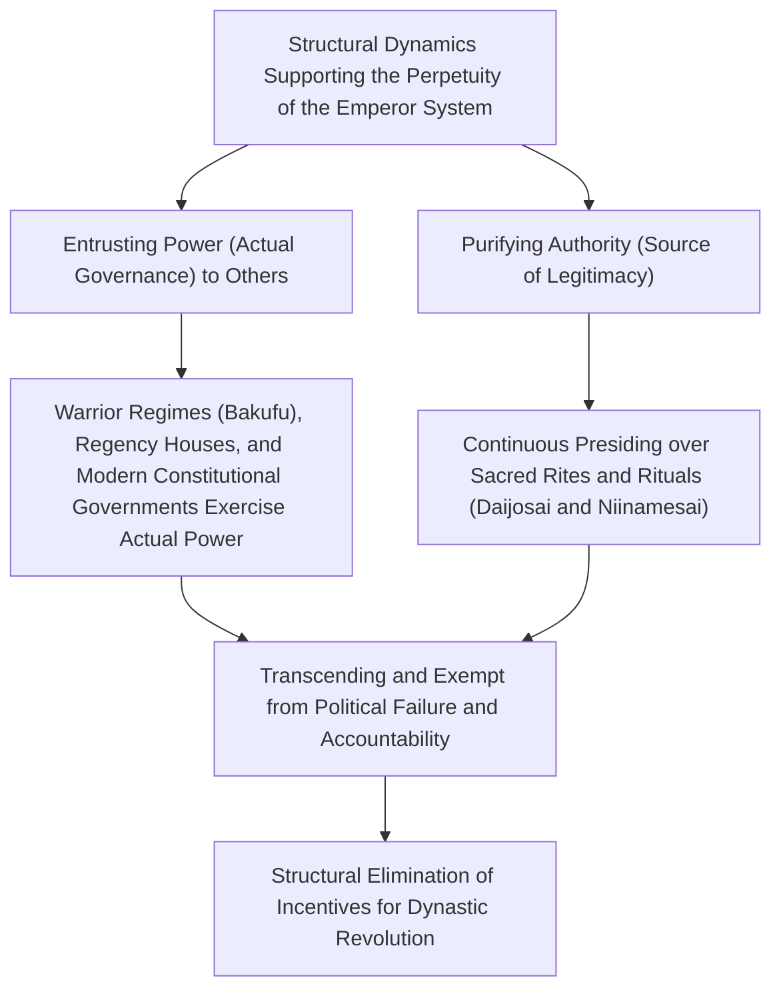
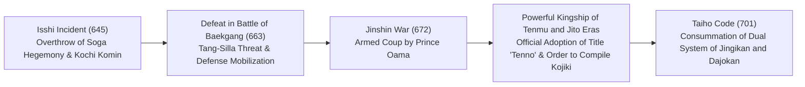
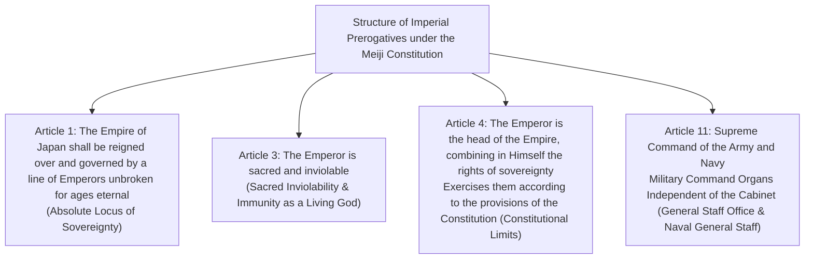
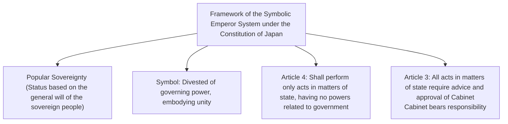
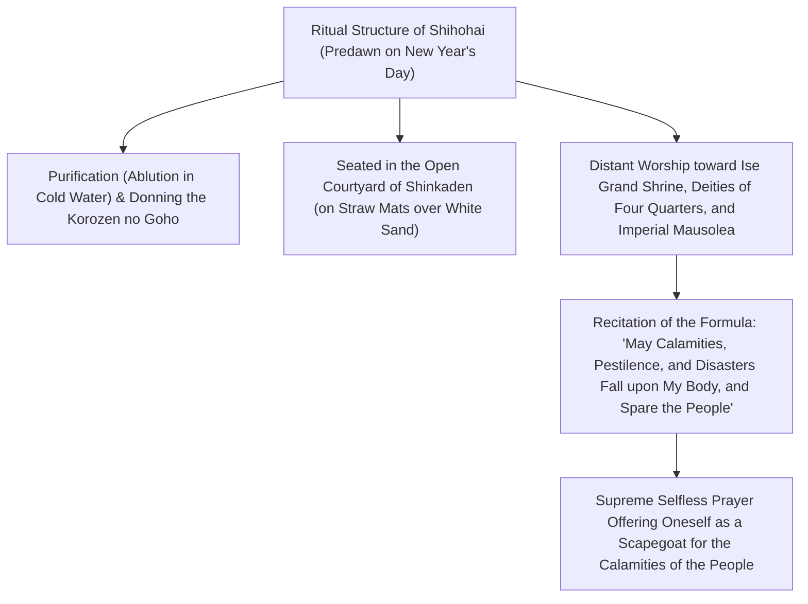
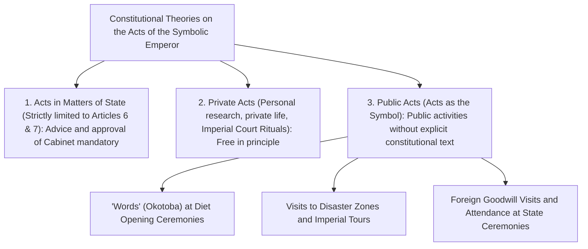

## 1. Introduction: The World's Oldest Hereditary Monarchy and the "Separation of Power and Authority"

### 1.1 The Discourse of "Bansei Ikkei" (Line Unbroken for Ages Eternal) and Historical/Archaeological Reality

The history of the Emperor of Japan (Tenno) and the Imperial House boasts an unparalleled, singular continuity when compared to any extant royal house or dynasty in the world. It is officially recognized even by Guinness World Records as "the oldest continuous hereditary monarchy" in existence.

While the discourse of "Bansei Ikkei" (an unbroken imperial lineage for ages eternal)—championed by modern Kokugaku (National Learning) and Article 1 of the Constitution of the Empire of Japan (Meiji Constitution)—carries mythological and ideological overtones, empirical historiography and archaeology demonstrate that **at least since Emperor Yuryaku (the Great King Wakatakeru) in the late 5th century, or Emperor Keitai in the early 6th century, a single royal lineage has continued unbroken within the same archipelago for over 1,500 years**. This stands as an indubitable historical fact in scholarly research.

A comparative survey of world civilizations reveals that in China, the Mandate of Heaven shifted through "dynastic revolutions" (Ekisei Kakumei / the Dynastic Cycle), wherein ruling imperial houses were systematically exterminated, while in European states, dynasties succeeded one another in perpetual succession—from the Norman and Plantagenet to the Tudor, Stuart, and Hanoverian dynasties. In contrast, why has Japan alone managed to preserve a single royal lineage down to the present day without experiencing dynastic rupture?



---

### 1.2 The "Separation of Power and Authority" from the Perspective of Comparative Civilization

As intellectual historians and comparative cultural scholars such as Maruyama Masao and Ruth Benedict have pointed out, the defining characteristic of the governance structure in Japanese civilization lies in the **thorough dualistic separation between "political power" (military force, taxation rights, day-to-day administration) and "ultimate authority" (the ultimate source of legitimacy, religious and symbolic sacrality)**.

Western absolute monarchs (such as Louis XIV of France) and Chinese autocratic emperors were simultaneously "holders of power" who personally commanded armies and issued decrees, and "figures of authority" embodying law and order. When these two dimensions are fused, any instance of misgovernment, military defeat, or profound social catastrophe strikes the monarch directly with political accountability, causing the entire ruling house to be dragged down from the throne through violent rebellion.

In contrast, the Japanese Emperor consistently maintained a structure of **"delegating secular governing power (actual political control) outward to external advisers, regents, and samurai warriors"**—spanning from the Fujiwara clan in the Heian period (Sekkan-seiji / Regency government) and the Cloistered Rule (Insei) initiated by Retired Emperor Shirakawa, to medieval warrior regimes (the Kamakura, Muromachi, and Edo bakufu) and modern cabinets. Even the shogun of the bakufu was required to receive formal appointment as Seii Taishogun (Barbarian-Subduing Generalissimo) from the Emperor in order to legitimize his rule.

Responsibility for misrule was invariably borne by the bakufu or cabinets that exercised actual power, leading to their overthrow or downfall in political upheavals. Yet, because the Emperor—as the fountainhead of legitimacy—remained positioned beyond the realm of political accountability, no incentive ever arose, even in the most turbulent epochs of civil strife, to usurp the imperial throne itself (by assassinating the sovereign to take the crown).

---

## 2. The Formation of the Ancient State, the Emergence of the Title "Tenno," and Ritsuryo Rituals

### 2.1 The Elevation from Okimi (Great King) to "Tenno"

During the Kofun period, the sovereign of the Yamato polity presiding over the center of the archipelago was titled "Okimi" (Great King / Amenoshita Shiroshimesu Okimi, Great King Who Rules All Under Heaven). The iron sword inscription unearthed from the Inariyama Kofun in Saitama Prefecture bears the inscription "Great King Wakatakeru" (獲加多支鹵大王, Emperor Yuryaku), reflecting a chieftain who still retained the strong character of a paramount leader within a confederation of powerful aristocratic clans (the uji-kabane system).

In the late 6th and early 7th centuries, Prince Shotoku (Prince Umayado) and Soga no Umako, having enthroned Empress Suiko, instituted the Twelve Level Cap and Rank System (a court ranking system based on individual merit rather than hereditary lineage) and the Seventeen-Article Constitution ("Harmony is to be valued," "Revere the Three Treasures," "When you receive imperial commands, fail not scrupulously to obey them"). As evidenced in the sovereign letter dispatched to Emperor Yang of the Sui Dynasty—"The Son of Heaven in the land where the sun rises sends a letter to the Son of Heaven in the land where the sun sets; are you without ailment?"—Japan broke away from the tributary investiture system (Sakuhō system) of the Chinese Empire, boldly asserting its autonomous status as an equal "Son of Heaven" (Tenshi).

In the **Isshi Incident (Taika Reform) of 645**, Prince Naka no Oe (later Emperor Tenji) and Nakatomi no Kamatari (progenitor of the Fujiwara clan) assassinated Soga no Iruka within the palace to crush the despotic Soga hegemony. They rejected the private ownership of land and people by powerful regional clans, articulating the ideal of "Kochi Komin" (public land, public people), which posited all land and subjects as belonging directly to the state (the Emperor).



---

### 2.2 The Jinshin War (672) and the Absolute Authority of Emperor Tenmu

The greatest watershed in ancient Japanese history was the **Jinshin War (672)**, an imperial succession conflict that erupted following the death of Emperor Tenji. Prince Oama, who had withdrawn in seclusion to Yoshino, mobilized eastern warrior forces from Mino and Owari, launched a lightning strike that annihilated Prince Otomo of the Omi Court, and ascended the throne at the Asuka Kiyomihara Palace as **Emperor Tenmu**.

During the reigns of Emperor Tenmu and his consort Empress Jito, the foundational institutional framework of the ancient Ritsuryo kingship was brought to completion:
1. **Official Adoption of the Title "Tenno"**:
   - The supreme honorific title "Tenno" (Emperor), believed to derive from the highest Daoist deity "Tenno Daitei" (the deified North Star, Heavenly Emperor), began to be formally utilized in wooden tablets (mokkan) and stone and metal epigraphy.
2. **Establishment of the State Name "Nihon"**:
   - Replacing the historical appellation "Wa" (Wakoku), the proud state designation "Nihon" (Origin of the Sun / Land of the Rising Sun) was officially instituted.
3. **Commencement of the Compilation of Official Histories (Mythology)**:
   - By imperial decree of Emperor Tenmu, ancestral traditions preserved across aristocratic clans were systematically edited and collated to trace the lineage's ultimate legitimacy back to the Sun Goddess Amaterasu, inaugurating the compilation of the *Kojiki* (Records of Ancient Matters, completed 712) and the *Nihon Shoki* (Chronicles of Japan, completed 720).

---

### 2.3 Deep Structure of the Kiki Mythology and the Three Sacred Treasures

The mythological system articulated in the *Kojiki* and *Nihon Shoki*, spanning from the imperial ancestral deity Amaterasu Omikami (the Great Sun Goddess) down to the first human sovereign, Emperor Jinmu, sets forth the religious and cosmological foundation of imperial authority.

- **Tenson Korin (Descent of the Heavenly Grandson) and the "Three Great Divine Decrees"**:
  - When Amaterasu commanded her grandson, Ninigi no Mikoto, to descend to the terrestrial realm (Mount Takachiho), the most fundamental mandate she bestowed was the **"Tenjo Mukyu no Shinchoku" (Divine Decree of Coevality with Heaven and Earth)**:
  > "The Reed-Plain Land of Fifteen Hundred Autumns of Fair Rice-Ears is the realm where my descendants shall be kings. Do thou, my Imperial Grandson, proceed thither and govern it. Go forth, and may the prosperity of the Imperial Throne be as boundless as the Heavens and the Earth."
  - This established a sacred covenant: sovereignty over the terrestrial land was granted eternally by the heavenly gods to the Imperial Grandson and his line.
  - Furthermore, she issued the "Divine Decree on Enshrining the Sacred Mirror" (Hokyo Hosa no Shinchoku), enjoining that the sacred mirror be worshipped as her very soul (mitama), and the "Divine Decree on the Rice-Ears of the Sacred Garden" (Saniva no Inaho no Shinchoku), commanding the cultivation on earth of the sacred rice nurtured in the heavenly plains.
- **The Three Sacred Treasures (Sanshu no Jingi)**:
  1. **Yata no Kagami (Eight-Hand Mirror)**: Embodying wisdom and solar sacrality (enshrined as the goshintai in the Inner Shrine of Ise Grand Shrine; a replica/yashiro is consecrated in the Kashikodokoro of the Imperial Palace).
  2. **Yasakani no Magatama (Eight-Foot Curved Jewel)**: Embodying benevolence and spiritual potency (permanently kept in the Kenji Room of the Imperial Palace).
  3. **Kusanagi no Tsurugi (Grass-Cutting Sword / Ame no Murakumo no Tsurugi)**: Embodying martial valor and bravery (enshrined as the goshintai at Atsuta Shrine; a replica/yashiro is kept in the Kenji Room of the Imperial Palace).
  - In the enthronement ceremonies of successive emperors, the ritual of inheriting these regalia—the "Kenji-to-Shokei-no-Gi" (Ceremony for Inheriting the Imperial Regalia)—has served as the indispensable, physical proof of imperial legitimacy.

---

### 2.4 The Dualism of the Ritsuryo System: Jingikan, Dajokan, and the Daijosai

The ancient governmental bureaucracy established under the Taiho Code (Taiho Ritsuryo) of 701, while modeled on the legal-administrative codes of the Tang Dynasty, introduced a singularly vital modification unique to Japan.

Whereas under the Tang system the ritual apparatus (the Court of Imperial Sacrifices / Taichangsi) was subordinated to the supreme administrative bodies (the Three Departments: Shangshu, Zhongshu, and Menxia), the Japanese Ritsuryo system placed the **Jingikan (Department of Divinities)**, which oversaw the rituals of the gods, on completely equal footing with—or even precedence over—the **Dajokan (Grand Council of State)**, which supervised secular state administration (the System of Two Departments and Eight Ministries / Nikan Hassho).

The Emperor's most essential daily duty lay not in mundane administration (political decision-making), but in **"Shinji" (Sacred Rites: praying to the unseen Kami and Buddhas)**.
- **Niinamesai**: The annual ritual in November where the Emperor presents newly harvested grains to the gods and personally partakes of them, uniting deity and mortal in communion (**Shinjin Kyoshoku** / divine-human communion) to pray for the peace of the realm and bountiful crops.
- **Daijosai**: The once-in-a-reign esoteric ritual performed immediately following an Emperor's enthronement. Primitive, ancient sanctuaries known as the Yuki Hall and Suki Hall are erected anew, where the Emperor spends the night offering new grains to the imperial ancestral deities and partaking of them himself, thereby embodying the Imperial Ancestral Spirit (Tenno-rei) within his mortal frame to be spiritually reborn as a true sacral sovereign.

Regardless of how secular political authority shifted, this role as "the supreme priest who prays selflessly and perpetually to the deities for the nation" remained the indestructible core of the Emperor system.

---

## 3. The Dual Structure of Authority and Power in the Medieval and Early Modern Eras

### 3.1 Regency Politics (Sekkan-seiji) and Cloistered Rule (Insei): Dynamics within the Imperial Court

During the Heian period, the political structure surrounding the Emperor underwent profound refinement and transformation.

- **Fujiwara Regency Politics (10th–11th centuries)**:
  - The Northern Branch of the Fujiwara clan (at its peak under Michinaga and Yorimichi) married their daughters into the imperial line as consorts and empresses (Chugu), secured the enthronement of infant imperial princes, and assumed the positions of Sessho (Regent for a minor) and Kanpaku (Chief Advisor to an adult sovereign) as maternal grandfathers (maternal relatives / gaiseki).
  - Without usurping imperial authority, they monopolized personnel appointments and supreme political decision-making entirely through their maternal status.
- **Emergence of Cloistered Rule (Insei, late 11th century onward)**:
  - In 1086, Emperor Shirakawa abdicated the throne in favor of the youthful Emperor Horikawa, assumed the title of "Joko" (Daijo Tenno / Retired Emperor), and established an autonomous organ (Incho) outside the imperial palace at the Shirakawa-in.
  - Acting as the **"Chiten no Kimi" (Master of the Realm / Patriarch of the Imperial Family)**, he reclaimed political supremacy by sidelining the Sekkan regents. By taking Buddhist vows to become a "Ho-o" (Cloistered Emperor), the retired monarch broke free from Confucian and Ritsuryo constraints binding the reigning sovereign, wielding autocratic power.

---

### 3.2 The Birth of Warrior Regimes and the Jokyu War (1221)

In the late 12th century, following the destruction of the Taira clan, Minamoto no Yoritomo founded the **Kamakura Bakufu** in eastern Japan.
Yoritomo secured the official post of Seii Taishogun from the Court along with imperial authorization (the Bunji Edict of 1185) to appoint Shugo (military governors) and Jito (estate stewards) nationwide. Thus arose the dual governance structure of Court (Kuge in the west) and Bakufu (Buke in the east).

Retired Emperor Go-Toba, endowed with extraordinary charisma and intellect, mounted a bold gamble to overturn this warrior hegemony. In 1221, he issued an imperial decree (Inzen) branding the Kamakura regent Hojo Yoshitoki a rebel, summoning warriors across Japan to rise up (**the Jokyu War**).

```mermaid
flowchart TD
    JOKYU["Impact of the Jokyu War (1221)"]
    JOKYU --> RETREAT["Hojo Masako's Address: 'The late Lord Yoritomo's benevolence is higher than the mountains and deeper than the sea'"]
    JOKYU --> MARCH["Kamakura's Vast Army Led by Hojo Yasutoki Launches Lightning Advance on Kyoto"]
    JOKYU --> DEFEAT["Crushing Defeat of Imperial Forces & Exile of Retired Emperor Go-Toba to Oki (Exile of Juntoku and Tsuchimikado as well)"]
    DEFEAT --> RESULT1["Establishment of Rokuhara Tandai for Military Surveillance over the Kyoto Court"]
    DEFEAT --> RESULT2["Consolidation of Absolute Bakufu Authority to Intervene in Imperial Succession"]
```



The outcome of the Jokyu War was an overwhelming victory for the samurai. The spectacle of warriors openly defying an imperial decree and exiling a Retired Emperor—the Chiten no Kimi—exposed the stark reality that an unarmed Court could not resist martial force. The Bakufu took direct control over imperial succession, eventually arbitrating the alternating accessions (Ryoto Tetsuritsu) between the Daikakuji line (Southern Court) and the Jimyoin line (Northern Court).

---

### 3.3 The Kenmu Restoration and the Upheaval of the Northern and Southern Courts

In 1333, Emperor Go-Daigo mobilized warrior chieftains like Ashikaga Takauji, Nitta Yoshisada, and Kusunoki Masashige to overthrow the Kamakura Bakufu, inaugurating direct imperial rule known as the **"Kenmu Restoration"**.

However, by disregarding warrior demands for rewards and pursuing anachronistic favoritism toward court nobles along with archaizing autocracy, the Restoration collapsed in just over two years. Ashikaga Takauji rebelled, enthroned Emperor Komyo (Jimyoin line) in Kyoto, and established the Muromachi Bakufu, while Emperor Go-Daigo fled into the mountains of Yoshino, maintaining his claim to sole legitimacy.

For nearly sixty years, the **Northern Court** in Kyoto and the **Southern Court** in Yoshino waged bloody civil war over legitimacy during the **Nanboku-cho Period (1336–1392)**. In 1392, mediated by the 3rd Muromachi Shogun Ashikaga Yoshimitsu, the "Meitoku Peace Pact" united the courts; Emperor Go-Kameyama of the Southern Court surrendered the Three Sacred Treasures to Emperor Go-Komatsu of the Northern Court. (While all subsequent sovereigns down to the present day descend biologically from Emperor Go-Komatsu of the Northern Court, modern imperial historiography since the Meiji period officially recognized the Southern Court as the legitimate lineage because it had retained the physical Sacred Regalia).

At the height of Muromachi power, Ashikaga Yoshimitsu was invested as "King of Japan" (Nihon Kokuo) by Emperor Yongle of the Ming Dynasty and sought to position his own son toward the throne, coming closer than anyone to imperial usurpation; however, with his sudden death, that ambition evaporated.

---

### 3.4 The Tokugawa Bakufu's Kinchu Narabini Kuge Shohatto and the Mandate of "Gogakumon"

During the chaotic Sengoku period, imperial finances dwindled to extreme impoverishment; Emperor Go-Nara was forced to sell his personal imperial calligraphy (waka poems and copies of the Heart Sutra) to defray court expenses. Yet warlords such as Oda Nobunaga, Toyotomi Hideyoshi, and Tokugawa Ieyasu never abolished the Emperor; instead, they made massive financial donations and sought appointments as Kanpaku, Dajodaijin, or Seii Taishogun to reinforce their political legitimacy.

Having unified the realm, Tokugawa Ieyasu promulgated the **Kinchu Narabini Kuge Shohatto (Code for the Imperial Court and Court Nobility, 17 articles)** in 1615 to bind the Court legally. Its opening article stated:

> **"Of all accomplishments of the Son of Heaven, Imperial Learning (Gogakumon) is the foremost."**

The cold, calculated intent behind this clause was unmistakable: the Emperor's realm was scholarship, ancient court precedent (Yusoku Kojitsu), and classical poetry; under no circumstances was he to dabble in politics or warfare.
As epitomized by the Purple Robe Incident of 1629 (where the Bakufu annulled imperial edicts conferring honorary purple robes upon high Buddhist monks, prompting Emperor Go-Mizunoo to abdicate in protest), the Edo-period emperors were sequestered deep within the Kyoto Imperial Palace, neutralized into purely symbolic figures devoted to ritual and learning, stripped of every shred of secular power.

---

## 4. The Meiji Restoration and the Creation of the Modern "Living God" (Arahitogami) State

### 4.1 From "Revere the Emperor, Expel the Barbarian" to the Restoration of Imperial Rule

From the mid-Edo period, the compilation of the *Dai Nihonshi* (Great History of Japan) by the Mito domain and the rise of Kokugaku (National Learning, Motoori Norinaga) popularized the ideology of Sonno (Revere the Emperor)—the view that the Shogun merely held governing power as a delegated trust from the Emperor (Taisei Inin-ron).

Following Commodore Perry's Black Ships in 1853, the Tokugawa Bakufu's inability to manage foreign crises ignited the passionate "Sonno Joi" (Revere the Emperor, Expel the Barbarian) movement among lower samurai and loyalist activists. Emperor Komei issued edicts commanding the expulsion of barbarians, and the Choshu and Satsuma domains rallied around the Imperial Court as a political focal point.

In October 1867, the 15th Shogun Tokugawa Yoshinobu petitioned for the "Taisei Hokan" (Restoration of Governing Power to the Crown). On December 9 of the same year, spearheaded by Iwakura Tomomi and Satsuma's Saigo Takamori, the **"Osei Fukko no Daigorei" (Great Decree for the Restoration of Imperial Rule)** was proclaimed:
- Abolishing the Bakufu, Sessho, and Kanpaku.
- Declaring a return to the foundational origins of the first human sovereign, Emperor Jinmu, establishing a government of direct imperial rule.
- The 16-year-old Emperor Meiji ascended the throne, Edo was renamed "Tokyo", and the imperial capital moved from Kyoto to Tokyo Castle (the former Edo Castle).

---

### 4.2 Constitutional Dualism of the Constitution of the Empire of Japan (Meiji Constitution, 1889)

Ito Hirobumi and the Meiji oligarchs drafted the **Constitution of the Empire of Japan (Meiji Constitution)**, taking Prussian constitutionalism as their model while adapting it to Japanese conditions.



The Emperor under the Meiji Constitution possessed a profound duality:
1. **Traditional/Religious Dimension**: The Emperor was the descendant of the gods, the font of national morality, and a sacred and inviolable living god (**Arahitogami**).
2. **Modern/Constitutional Dimension**: The Emperor was a constitutional monarch who exercised sovereignty "according to the provisions of the present Constitution." He could not issue arbitrary tyrannical decrees like an absolute autocrat; executive authority required the **"Hohitsu" (Advice and Assistance)** of Ministers of State (Article 55), while legislative authority required the consent of the Imperial Diet.

During the Taisho era, Professor Minobe Tatsukichi of Tokyo Imperial University advanced the **"Emperor Organ Theory" (Tenno Kikan-setsu)**—holding that the state is a juridical person (legal entity) possessing sovereignty, and the Emperor is its supreme organ—providing the constitutional foundation for party cabinet governance during the Taisho Democracy.

However, the Meiji Constitution harbored a fatal structural flaw: **Article 11's "Independence of the Supreme Military Command" (Tosui-ken no Dokuritsu)**, under which military command was exempt from cabinet advice and answered directly to the Emperor. In early Showa, when the military used this prerogative to escape cabinet and parliamentary control, the constitutional bulwarks collapsed.

---

## 5. The Upheavals of Showa, Defeat in War, and the Dramatic Transition to the "Symbolic Emperor System"

### 5.1 The Early Showa Catastrophe and the "Sacred Decision" (Seidan) Ending the War

In the 1930s, amid controversies over military command encroachment, the May 15 Incident, and the February 26 Incident, party politics perished, plunging Japan into military dictatorship, the quagmire of the Second Sino-Japanese War, and the Pacific War in 1941.

State Shinto was dogmatized, indoctrinating subjects that laying down one's life for the Emperor was the supreme virtue. Yet Emperor Showa agonized between his duty as a constitutional monarch unable to overrule cabinet and military decisions, and his personal prayers for peace.

In August 1945, facing the atomic bombings of Hiroshima and Nagasaki and the Soviet entry into the war, the Supreme Council for the Direction of the War deadlocked evenly over whether to accept surrender or wage a desperate homeland battle (one hundred million dying like shattered jewels / Ichioku Gyokusai) over the "preservation of the national polity" (Kokutai Goji).
At the Imperial Conferences of August 10 and 14 in an underground air-raid shelter, Prime Minister Suzuki Kantaro asked Emperor Showa to break the impasse. Weeping, the Emperor delivered his historic **"Seidan" (Sacred Decision)**:

> **"My duty is to save the people. Regardless of what becomes of my own person, I cannot bear to see my subjects fall further in the flames of war and human civilization destroyed. ... Bearing the unbearable and enduring the unendurable, I have resolved to bring an end to the war."**

At noon on August 15, the war ended via the Gyokuon-hoso (Jewel Voice Broadcast). Without the Emperor's direct personal intervention, a battle for the homeland would have cost millions of additional lives.

---

### 5.2 The Meeting with MacArthur and Averting the Tokyo Tribunal

Following defeat, General Douglas MacArthur's GHQ occupied Japan. Public sentiment across the Allied nations—including the US, Britain, and the USSR—demanded that Emperor Showa be executed as the "supreme war criminal" and the imperial institution eradicated.

On September 27, 1945, Emperor Showa visited MacArthur at the US Embassy alone. According to MacArthur's memoirs, rather than begging for his life, the Emperor stated:

> **"I come to you, General MacArthur, to offer myself to the judgment of the powers you represent as one to bear sole responsibility for every political and military decision made and action taken by my people in the conduct of war. It matters not what becomes of my own life. I ask only that you provide food for my people."**

Profoundly moved by this selfless demeanor, MacArthur settled occupation policy on preserving the Emperor system and exempting the sovereign from prosecution, calculating that executing the Emperor would trigger nationwide guerrilla insurrections of a million men, making peaceful Allied administration impossible.

On January 1, 1946, Emperor Showa issued the **"Imperial Rescript on the Construction of a New Japan" (the so-called Humanity Declaration / Ningen Sengen)**, proclaiming that the bond between the Emperor and the people rests on mutual trust and affection, not on myths or the notion of a living god (Arahitogami).

---

### 5.3 Article 1 of the Constitution of Japan: Establishment of the "Symbolic Emperor System"

Promulgated on November 3, 1946, and taking effect on May 3, 1947, the **Constitution of Japan** fundamentally redefined the legal status of the Emperor in Article 1:

> **Article 1: "The Emperor shall be the symbol of the State and of the unity of the People, deriving his position from the will of the people with whom resides sovereign power."**



- **Complete Divestment of Sovereign Power**: The Emperor ceased to be the head of state / ruler, becoming instead a "Symbol" embodying the state's existence and popular unity.
- **Prohibition of Political Involvement (Article 4)**: The Emperor performs only formal, ceremonial "acts in matters of state" enumerated in the Constitution (convoking the Diet, appointing the Prime Minister, attesting treaties, conferring honors, etc.), possessing no powers related to government.
- **Advice and Approval of the Cabinet (Article 3)**: All acts in matters of state require the advice and approval of the Cabinet, which bears all political responsibility.

While this "Symbolic Emperor System" is often viewed as an alien construct imposed by the Allied occupation, it can equally be understood as **the purest return to the traditional medieval-early modern structure: an Emperor who exercises no secular power, dedicating himself solely to authority and prayer.**

---

## 2.5 The Ritual Structure of Imperial Court Rituals and the Spiritual Dynamics of "Shihohai"

To comprehend the existence of the Emperor, one must explore the depths of **"Imperial Court Rituals" (Kyuchu Saishi)**, which have been handed down continuously within the Imperial House as a private realm strictly separated from "acts in matters of state" under the Constitution of Japan.

Enshrined deep within the secluded Fukiage Imperial Gardens of the Imperial Palace stand the **"Three Palace Sanctuaries" (Kyuchu Sanden)**:
1. **Kashikodokoro**: Enshrining the sacred Eight-Hand Mirror (replica / yashiro) as the embodiment of the imperial ancestral deity, Amaterasu Omikami.
2. **Koreiden**: Enshrining the spirits of successive emperors and imperial family members since Emperor Jinmu.
3. **Shinden**: Enshrining the Tenjin Chigi (the myriad deities of heaven and earth / Yaoyorozu no Kami).

The Emperor personally presides over dozens of solemn rituals throughout the year. Among them, the ritual that evokes the deepest spiritual tremor is the **"Shihohai" (Worship of the Four Quarters)**, performed in the freezing chill of predawn (5:30 AM) on New Year's Day.



Cleansing his body with freezing water, clad in the archaic brownish-yellow imperial robe (Korozen no Goho), the Emperor sits upon straw mats spread over the white sand in the open courtyard, bowing deeply in distant worship toward the Ise Grand Shrine, the mountains, rivers, and deities of the four quarters, and the tumuli of successive imperial ancestors. He then recites the sacred incantation recorded in Heian-period ceremonial compendia:

> **"If harm, pestilence, flood, or fire are to befall the myriad people, let them pass first through my own body before reaching them (should disaster strike the people, let it strike my flesh first)."**

Offering oneself to the deities as the "ultimate scapegoat" to absorb the afflictions of the nation and its people—this absolute spirit of sacrificial ritual, seeking not power to dominate others, but self-negation in selfless prayer for the happiness of others, constitutes the unconscious magnetic field through which imperial authority has been indelibly inscribed upon the collective psyche of the Japanese people across millennia.

---

## 3.5 The Historical Reality of Reigning Female Emperors and the Reality of the "Interim" (Nakantsugi) Theory

In contemporary debates over imperial succession, frequent reference is made to the historical reality of the **"eight female individuals across ten reigns of female emperors"** in Japanese history.

| Succession / Reign | Reigning Empress | Period | Background to Accession and Historical Achievements |
| :---: | :--- | :---: | :--- |
| **33rd** | **Empress Suiko** | 592–628 | Ascended as the first female monarch to resolve the crisis following the assassination of Emperor Sushun. Cooperated with Prince Shotoku and Soga no Umako to institute the Twelve Level Cap and Rank System and the Seventeen-Article Constitution. |
| **35th / 37th** | **Empress Kogyoku / Empress Saimei** | 642–645 / 655–661 | Choso (re-ascension). Reigned during the Isshi Incident; during her Saimei reign, she personally led an expedition to Kyushu for the Battle of Baekgang and died in camp. |
| **41st** | **Empress Jito** | 690–697 | Empress consort of Emperor Tenmu. Carrying out her husband's legacy, she constructed the Fujiwara-kyo capital, promulgated the Asuka Kiyomihara Code, and secured succession for her grandson, Emperor Monmu. |
| **43rd** | **Empress Genmei** | 707–715 | Transferred the capital to Heijo-kyo (Nara, 710), oversaw the completion of the *Kojiki*, and ordered the compilation of the *Fudoki*. |
| **44th** | **Empress Gensho** | 715–724 | Daughter of Empress Genmei (the only mother-to-daughter imperial succession in Japanese history). Oversaw the completion of the *Nihon Shoki* and enacted the Sanze Isshin Law. |
| **46th / 48th** | **Empress Koken / Empress Shotoku** | 749–758 / 764–770 | Daughter of Emperor Shomu. Choso. Crushed the rebellion of Fujiwara no Nakamaro and elevated the Buddhist prelate Dokyo. Averted Dokyo's usurpation of the throne following the Usa Hachimangu Oracle Incident. |
| **109th** | **Empress Meisho** | 1629–1643 | Early Edo period. Enthroned after Emperor Go-Mizunoo abruptly abdicated in protest against the bakufu over the Purple Robe Incident (granddaughter of Tokugawa Hidetada). |
| **117th** | **Empress Go-Sakuramachi** | 1762–1770 | Mid-Edo period. Following the sudden demise of Emperor Momozono, she reigned as sovereign until the youthful Emperor Go-Momozono came of age. The last reigning empress of early modern Japan. |

Scholarly scrutiny makes one historical fact abundantly clear: **all past female sovereigns were "patrilineal females" (dokei joshi / daughters of an emperor whose father was in the imperial line)**. There is zero historical precedent for an empress marrying a commoner or male of another dynasty and passing the imperial throne to matrilineal descendants (jokei tenno).

Furthermore, most reigned as "interim" (nakantsugi / placeholder) sovereigns during constitutional emergencies—such as when the heir was an infant or when an abrupt death threatened a political vacuum—stabilizing the dynastic succession before passing the baton to the next generation of patrilineal males.

Simultaneously, however, as demonstrated by Empress Suiko and Empress Jito, it is equally an undeniable fact that some female sovereigns exerted immense political leadership far beyond a mere placeholder role, cementing the very foundations of the ancient state. In ancient Japan, the tradition of the "hime-hiko" system—where female shamanic spiritual power (miko-like power to commune with the kami) and male secular political authority complemented each other—greatly facilitated the acceptance of female sovereigns.

---

## 4.6 The Creation of State Shinto and the Modern Philosophical Acrobatics of the "Theory of Shrines as Non-Religious"

The greatest dilemma confronting the Meiji Restoration government was how to forge a modern nation-state integrating principle capable of standing up to the Western imperial powers.

### 1. The Tempest of Haibutsu Kishaku and the Separation of Shinto and Buddhism
For over a millennium, Shinto and Buddhism had coexisted in syncretism (Shinbutsu Shugo: temples within shrine precincts, and the Honji Suijaku theory positing that Buddhas manifest as native Kami). In March 1868, the Meiji government forcefully severed this synthesis with the **"Shinbutsu Hanranrei" (Edict Separating Shinto and Buddhism)**.
This unleashed the violent tempest of **"Haibutsu Kishaku" (Abolish the Buddhas, Smash the Sutras)** across Japan: Buddhist statues were smashed, sutras incinerated, and pagodas dismantled. Although the government initially launched the "Taikyo Senpu Undo" (Great Promulgation Campaign) to elevate Shinto to a state religion, it foundered in the face of deep-seated popular Buddhist devotion and vehement diplomatic protests from Western powers alleging violations of religious freedom.

### 2. The Extralegal Fiction of the "Theory of Shrines as Non-Religious"
Here, Meiji statesmen (notably Inoue Kowashi) devised an astonishing juridical formula: the ideological fiction that **"Shrine Shinto is not a religion" (Theory of Shrines as Non-Religious / Jinja Hi-shukyo-ron)**.
- While Article 28 of the Meiji Constitution guaranteed "freedom of religious belief," recognizing Christianity and Buddhism as "private personal religions,"
- It simultaneously defined rites performed at Shinto shrines (such as Ise Grand Shrine and Yasukuni Shrine) not as a religion, but as **"the public civic morality and ancestral veneration rituals of the state,"** in which all subjects were obligated to participate.
- Consequently, even Christian or Buddhist subjects could not refuse shrine visitation or reverence toward the Emperor, as it was their civic duty as imperial subjects. Thus was erected the supra-religious, absolute sphere of **"State Shinto" (Kokka Shinto)**. This logical acrobatics created the institutional seedbed that enabled the runaway militarist "Arahitogami" worship of the Showa era.

---

## 5.5 Constitutional Case Law and the Boundaries of the Symbolic Emperor System

Under the Constitution of Japan, the symbolic emperor system has refined its legal interpretation through numerous constitutional controversies and judicial tests.



### 1. Affirmation of "Public Acts (Acts as the Symbol)"
Article 4, Paragraph 1 of the Constitution provides that "The Emperor shall perform only such acts in matters of state as are provided for in this Constitution." A strict textualist reading could render all public activities outside these provisions (disaster visits, hosting foreign dignitaries, opening addresses to the Diet) unconstitutional.
Judicial precedent and government interpretations, however, concluded that by virtue of his status as the symbol of Japan, the Emperor is naturally entitled to perform **"public acts (acts as the symbol)"** commensurate with that role, provided they are conducted under cabinet control (substantive advice and ministerial responsibility).

### 2. Separation of Religion and State (Articles 20 & 89) and Court Rituals
Controversy arose over whether Imperial Shinto ceremonies, such as Niinamesai and Daijosai, should be funded from the public state budget (Court Expenses / Kyutei-hi) or from the private Imperial Household budget (Inner Court Expenses / Naitei-hi).
Applying the Supreme Court's "purpose and effect test" (established in the Tsu Ground-Breaking Ceremony and Ehime Tamagushi-ryo decisions)—which evaluates whether an act has a religious objective and whether its effect aids, promotes, or suppresses a specific religion—the courts held that funding the Daijosai during the Heisei and Reiwa accessions from public funds (Court Expenses) was constitutional, recognizing it as a traditional public rite of the Imperial House possessing public significance.

## 6. Contemporary Endeavors of the Symbolic Emperor and the Succession Dilemma

### 6.1 The Heisei "Journeys" and the Realization of Abdication

The symbolic emperor system was infused with living vitality through the journey of the 125th Emperor (now Emperor Emeritus Akihito) and Empress Emerita Michiko.
Constantly asking "what ought the symbol to be?", Emperor Akihito traveled to disaster sites across Japan (Mount Unzen-Fugen, the Great Hanshin-Awaji Earthquake, the Great East Japan Earthquake), kneeling on shelter floors to meet survivors eye-to-eye and clasping their hands in encouragement. Furthermore, they embarked on "memorial journeys" (irei no tabi) to Okinawa, Hiroshima, Nagasaki, and wartime battlefields such as Saipan, Peleliu (Palau), and the Philippines, praying to ensure that memories of the war would not fade.

On August 8, 2016, the Emperor addressed the public in an unprecedented video message ("expressing his feelings"), confiding his apprehension that advancing age might make it difficult to carry out his duties as symbol with whole body and soul. In response, the Diet enacted the "Special Measures Act on the Imperial House Law" in 2017. On April 30, 2019, the first living abdication in roughly 200 years (since Emperor Kokaku in the Edo period) was peacefully realized; Crown Prince Naruhito ascended as the 126th Emperor, inaugurating the "Reiwa" era.

---

### 6.2 Contemporary Constitutional and Legal Policy Issues Surrounding Imperial Succession

In the 21st century, the Imperial House confronts its greatest crisis: dwindling imperial members and the shrinking circle of qualified successors.
Article 1 of the current Imperial House Law dictates: **"The Imperial Throne shall be succeeded to by a male offspring in the male line belonging to the Imperial Lineage."**

Presently, Prince Hisahito stands as the sole qualified successor in the next generation—a precarious, tightrope condition. Three primary options are vigorously debated nationwide:

| Succession Option | Proposal | Arguments by Proponents | Concerns of Cautious / Opposing Factions |
| :--- | :--- | :--- | :--- |
| **1. Recognition of Female Emperors (Josei Tenno)** | Allowing daughters of an emperor to ascend the throne (e.g., accession of Princess Aiko). | History documents 8 individuals across 10 reigns of female emperors from Empress Suiko to Empress Go-Sakuramachi. Strongly supported by public sentiment. | Seen by some as acceptable as long as it remains a patrilineal female, but feared as an opening wedge leading inevitably to matrilineal succession. |
| **2. Recognition of Matrilineal Emperors (Jokei Tenno)** | Allowing succession to individuals connected to the imperial line solely through the maternal line (e.g., children of a female emperor fathered by a commoner). | The only realistic solution to permanently prevent biological extinction of the line. Aligns with gender equality principles. | Intense opposition arguing it would fundamentally obliterate the very foundation of the Imperial House: an unbroken 126-generation tradition of patrilineal descent (male line). |
| **3. Reinstatement of Former Imperial Branches (Former Miyake)** | Restoring male-line descendants of the 11 former imperial branches stripped of royal status by GHQ order in 1947 back into the imperial family via adoption or legal restoration. | Perfectly preserves the unbroken patrilineal male-line tradition (Bansei Ikkei). | Emotional and democratic hurdles regarding public acceptance of making individuals who have lived for nearly 80 years as ordinary private citizens into royalty overnight. |

---

## 7. Conclusion: The Genealogy of Prayer and the Archaic Stratum of Japanese Civilization

Before it is a political institution, the Emperor system is a **"cultural substratum of spirit and prayer"** nurtured across thousands of years by the natural environment of the Japanese archipelago and its inhabitants.

Not flaunting power like a president,  
Not behaving like an ostentatious billionaire,  
In the solemn, sacred silence of the Court, purifying oneself through the seasonal divine rites,  
Devoted single-mindedly to praying for the peace of the world, the happiness of the people, and the bountiful harvest of the five grains.

Ancient regional clans, the fierce samurai of the medieval age, the Meiji reformers driving modernization, and the citizens rising from the ashes of postwar devastation—all have bowed their heads before this selfless "seat of prayer."

Even as its institutional form adapted fluidly over the ages—from the ancient Ritsuryo state and bakufu feudalism to the Meiji constitutional empire and postwar democratic symbol—the "continuity of sacred prayer" at its inner sanctum was never once broken.

In the rapidly transforming world of the 21st century, serving as a living historical nexus connecting thousands of years of the past with thousands of years into the future, the existential reality of the Emperor remains a profound mirror in which the Japanese people confront their own identity.

### 2.6 Ritual Anthropological Depths of the Daijosai: Orikuchi Shinobu's "Matoko Ofusuma" Controversy and the Cosmology of Communal Sacred Grain Consumption

The Daijosai, standing at the summit of enthronement ceremonies, transcends a mere harvest festival; it functions as an initiation rite (rite of passage) wherein the new Emperor inherits the divine charisma of the ancestral deities, undergoing a spiritual transformation into a living sacral sovereign or sacred divinity. The ritual structure of this esoteric rite has ignited intense academic debates in modern anthropology, religious studies, and historiography.

Foremost among these is the "Matoko Ofusuma" (True-Bed-Covering Quilt) theory advanced by folklorist Orikuchi Shinobu. In *The Fundamental Meaning of the Daijosai* (1928), Orikuchi focused on the "Sakamakura" (slope pillow) and "Kamufushido" (sacred couch/bed) installed deep within the Yuki and Suki Halls of the Daijokyu sanctuary. Linking this to the myth of the Descent of the Heavenly Grandson—wherein Ninigi no Mikoto descended wrapped in the "Matoko Ofusuma"—Orikuchi argued that the new sovereign experiences a symbolic ritual death by cloistering himself under the bed-quilt (fusuma) upon the sacred couch, thereby undergoing a secret ritual of divine communion and revitalization to receive and unite with the spirit of Amaterasu Omikami (or the ancestral divine spirit). That is, he interpreted the Daijosai as a rite of spiritual rebirth and soul-infusion (*tamafuri* / *tamashizume*).

```
[Two Major Academic Currents Concerning the Esoteric Structure of the Daijosai]

1. Orikuchi Shinobu's Theory (Spiritual Infusion & Rebirth Initiation)
   - Core Concepts: "Matoko Ofusuma," "Kamufushido"
   - Ritual Interpretation: A secret rite of spiritual transformation wherein the new Emperor enters a mock death and rebirth cloistered within a bed-coverlet, receiving the ancestral soul / spirit of Amaterasu Omikami.
   - Theoretical Background: Yanagita Kunio and Orikuchi Shinobu's Marebito theory, Ryukyu/Southern Island studies, rites of passage in Miyaza and youth associations.

2. Court Ritual & Empirical Historiography Theory (Communal Feast of Sacred Grains & Divine-Human Communion)
   - Core Concepts: "Offering of Sacred Offerings (Shinsen Kensen)," "Shinjin Kyoshoku" (Divine-Human Communion)
   - Ritual Interpretation: An agrarian ritual in which the new sovereign partakes of newly harvested rice, millet, and sacred sake together with the ancestral kami, reaffirming communal bonds and the covenant of governance.
   - Representative Research: Rigorous empirical reexaminations of ancient records and the Engishiki codes by Okada Shoji, Tokoro Isao, Sakamoto Taro, et al.
```

Against Orikuchi's thesis, historians and Shinto scholars such as Okada Shoji and Tokoro Isao collated the Heian-period *Engishiki* Daijosai ceremonial protocols and various ancient manuscripts, demonstrating the philological fragility of Orikuchi's claims. Their empirical research demonstrated that the heart of the Daijosai is **"Shinjin Kyoshoku" (divine-human communion)**, wherein the new Emperor personally presents sacred food offerings (rice, millet, white sake, dark sake, abalone, seafood) to the deities at midnight and partakes of the identical food before the kami. Dining with the deities expresses thanksgiving for agricultural abundance and renews the sacred covenant with ancestral gods. The Kamufushido is a sacred seat prepared for the resting of the deity, with no historical record indicating that the Emperor ever cloistered himself inside it like a burial shroud.

Contemporary academic consensus acknowledges Orikuchi's poetic intuition and anthropological daring, yet favors the empirical view of the Daijosai as a layered synthesis of ancient East Asian agrarian ceremonies and enthronement rituals. Regardless of the interpretation adopted, however, the fact remains indisputable that the Daijosai has functioned as a decisive spiritual threshold through which a "political ruler" is transformed into a "sacral priestly subject."

---

### 4.3 Haibutsu Kishaku and the Great Promulgation Campaign: The Frustration of Shinto State-Religion Policy and the Institutional Engineering of "State Shinto"

The "Restoration of Imperial Rule" in the Meiji Restoration was not merely a transfer of authority from the samurai bakufu to the Dajokan system; it possessed the dimension of a radical religious and ideological revolution championing the ancient ideal of **"Saisei Itchi" (Unity of Rites and Government)**. In March 1868 (Keio 4 / Meiji 1), immediately upon its establishment, the new government issued the "Edict Separating Shinto and Buddhism" (Shinbutsu Bunri-rei) via Dajokan proclamation. This aimed to dismantle the syncretic Buddhist-Shinto framework (Shinbutsu Shugo) that had served as the foundation of Japanese society for well over a millennium, forcefully expelling Buddhist elements (statues, scriptures, bells, and monks serving in betto or shoso roles) from Shinto shrines.

This separation unleashed extreme destructive fervor nationwide: the so-called **"Haibutsu Kishaku" (Abolish the Buddhas, Smash the Sutras)**. In domains such as Satsuma, Naegi, Oki, and Toyama, temples were demolished wholesale and Buddhist statues burned or crushed. The five-story pagoda of Kofuku-ji was nearly sold off for a mere 25 yen; Japanese traditional cultural assets and the Buddhist temple economy suffered catastrophic devastation.

```
[Ideological Evolution of the Unity of Rites and Government in the Early Meiji Era]

Restoration of the Department of Divinities (Jingikan, 1869)
  -- "Advancement of Saisei Itchi and Shinto State Religion by Radical Hirata Kokugaku" -->
Storm of Shinbutsu Bunri and Haibutsu Kishaku (Nationwide Destruction of Temples and Persecution of Buddhism)
  -- "Encountering Domestic and International Condemnation and Civil Unrest" -->
Great Promulgation Campaign (From 1870: Creation of Missionary Bureau & Ministry of Religion, Mass Indoctrination)
  -- "Resistance by True Pure Land Monks (Shimaji Mokurai) over Freedom of Religion & Western Diplomatic Pressure" -->
Collapse of Shinto State-Religion Policy (1875: Dissolution of the Daikyo-in)
  -- "Construction of the 'Theory of Shrines as Non-Religious' (Establishment of Shrines as Administrative Organs and State Shinto System)" -->
State Shinto System (Administered by Home Ministry's Shrine Bureau; Elevated to Supra-Religious Civic Morality)
```

However, the policy of establishing Shinto as the state religion under the revived Jingikan, led by radical Hirata-school Kokugaku scholars, quickly hit an impasse. First, Buddhist leaders—most notably Shimaji Mokurai of the Jodo Shinshu (True Pure Land) sect—mounted fierce resistance using modern Western legal principles of separation of religion and state and freedom of religion. Following his 1872 inspection tour of Europe, Shimaji demonstrated that freedom of religious belief is a cardinal principle of modern states, making it impossible for the state to impose specific sectarian creeds upon its populace. Second, as seen in the revocation of the anti-Christian edicts in 1873, being branded by Western powers as a "barbaric nation that suppresses freedom of religion" was a fatal diplomatic liability for a Meiji government desperate to revise the Unequal Treaties.

To escape this dilemma, Meiji bureaucrats (spearheaded by Inoue Kowashi) devised a sophisticated mechanism of governing technology: the creation of **"State Shinto" (Kokka Shinto)** predicated on the **"Theory of Shrines as Non-Religious" (Jinja Hi-shukyo-ron)**.
The government defined shrines not as private religions chosen by individuals (such as Buddhism, Christianity, or Sect Shinto), but as "the state rites" and "the foundation of civic morality." This constructed an ingenious, layered ideological space: Article 28 of the Imperial Constitution outwardly guaranteed "freedom of religious belief," while visiting Shinto shrines and revering Imperial Court Rituals were simultaneously imposed as the "public civic duty of all subjects."

---

### 4.4 The Imperial Rescript to Soldiers and Sailors and the Imperial Rescript on Education: The Generalissimo Emperor and National Moral Integration

While constructing the outward framework of a modern constitutional state, two pivotal spiritual mechanisms were instituted to bind the morale of the populace and military discipline directly and unconditionally to the Emperor: the **Imperial Rescript to Soldiers and Sailors (Gunjin Chokuyu, 1882)** and the **Imperial Rescript on Education (Kyoiku Chokugo, 1890)**.

#### 1. The Imperial Rescript to Soldiers and Sailors and the Generalissimo (Daigensui) Emperor
Drafted by Nishi Amane and amended by Yamagata Aritomo and others, the *Imperial Rescript to Soldiers and Sailors* defined the armed forces as the "army led directly by the Emperor," establishing an unmediated personal bond between soldier and sovereign:

> "The military forces of Our Empire have been under the supreme command of the Emperor throughout the ages. ... We are your supreme Commander-in-Chief (Daigensui). We rely upon you as Our limbs, and you look up to Us as your head; the intimacy between Us must be especially profound."

Here, the military was framed not as a public institution of the state accountable to the cabinet or the Imperial Diet, but as an organization pledged in absolute fealty to the person of the Emperor. The Rescript enjoined five supreme virtues: Loyalty, Propriety, Valor, Fidelity, and Simplicity, mandating: "Bear in mind that duty is heavier than a mountain while death is lighter than a feather." This direct bond between the Generalissimo Emperor and the military formed the spiritual bedrock for the "Independence of the Supreme Military Command," creating the institutional trap that rendered the runaway militarism of the Showa era impossible to arrest.

#### 2. The Imperial Rescript on Education and the Moral Synthesis of Loyalty and Filial Piety
Promulgated as a compromise crafted between Inoue Kowashi and Motoda Nagazane, the *Imperial Rescript on Education* was issued not as a legal statute, but in the form of a personal moral exhortation from the Emperor to his subjects. While preaching traditional Confucian familial virtues—filial piety to parents, affection among brothers, harmony between spouses—its ultimate imperative converged on selfless sacrifice for the state and throne: "Should emergency arise, offer yourselves courageously to the State; and thus guard and maintain the prosperity of Our Imperial Throne coeval with heaven and earth."

The Rescript was read aloud at solemn school ceremonies on the Four Great National Holidays alongside veneration of the *Goshin'ei* (official imperial photographic portraits), embedding itself deep within the national consciousness. In 1891, Christian educator Uchimura Kanzo hesitated to make a profound bow before the Rescript at the First Higher Middle School, resulting in severe public condemnation and dismissal (the Uchimura Kanzo Lèse-Majesté Incident)—an event demonstrating that the Rescript functioned far beyond a moral guide, serving as a quasi-religious litmus test of absolute fealty to the imperial state.

---

### 4.5 The Kokutai Debates in the Meiji, Taisho, and Early Showa Eras: Uesugi Shinkichi vs. Minobe Tatsukichi and the Tragedy of the "Emperor Organ Theory"

Following the establishment of the Meiji constitutional order, the most acute ideological collision in legal jurisprudence and political discourse centered on the constitutional interpretation of the relationship between the State and the Emperor. The epicenter of this clash was the intellectual duel between two Tokyo Imperial University professors: Uesugi Shinkichi (Divine Right / Monarchical Sovereignty school) and Minobe Tatsukichi (State Juridical Person / Organ Theory school).

```
[The Clash of Two Grand Constitutional Visions of the Emperor]

1. Uesugi Shinkichi (Divine Right Monarchical Sovereignty Theory)
   - Conception of the State: The Emperor IS the State. Sovereignty is an inherent, divine prerogative of the Emperor.
   - Interpretation of Governing Rights: Sovereign power is absolute and boundless. The Constitution is merely a set of self-limiting, advisory guidelines established by the Emperor.
   - Intellectual Lineage: Hozumi Yatsuka's Patriarchal National Polity (Kokutai) theory, absolute monarchism, ideological root of Showa ultranationalism.

2. Minobe Tatsukichi (Emperor Organ Theory / Constitutional State Juridical Person Theory)
   - Conception of the State: The State itself is a juridical person (a governing entity possessing legal personality); sovereignty resides in the State as a corporate body.
   - Interpretation of Governing Rights: The Emperor exercises sovereignty within the constitutional framework as the "highest organ" of the state corporation.
   - Intellectual Lineage: Georg Jellinek's General Theory of the State (Allgemeine Staatslehre); theoretical foundation of Taisho Democracy and party cabinet governance.
```

Minobe Tatsukichi's "Emperor Organ Theory" was never intended to diminish the imperial throne. Rooted in German public jurist Georg Jellinek's rigorous Staatslehre, it sought to establish Japan as a genuine Rechtsstaat (rule of law), prevent autocratic despotism, and legitimize parliamentary democracy and party governance. During the Taisho Democracy, the Organ Theory became the orthodox consensus across academia and the civil service, even serving as the standard grading rubric for the Higher Civil Service Examination.

By the 1930s, however, with the ascendancy of the military and right-wing nationalist factions, the Organ Theory came under ferocious assault, denounced as an "impious heresy that degrades the Emperor to a mere tool (organ) of the state." In 1935 (Showa 10), ignited by an inflammatory speech in the House of Peers by Baron Kikuchi Takeo, the military and the Imperial Reservists Association orchestrated the "Movement to Clarify the National Polity" (Kokutai Meicho Undo). The cabinet of Okada Keisuke capitulated to military pressure, banning Minobe's authoritative treatises (including *Principles of Constitutional Law* / *Kenpo Satsuyo*), and Minobe was forced to resign from the House of Peers. The government subsequently issued two official "Statements on Clarifying the National Polity," formally declaring: "The locus of sovereign power rests in the Emperor, and the Organ Theory runs counter to the fundamental essence of our Kokutai."

The suppression of the Emperor Organ Theory marked the de facto demise of constitutional legalism in prewar Japan. A mystical, transcendental conception of the Emperor, unbound by constitutional strictures, engulfed the nation. The Imperial General Headquarters and the military gained a logical carte blanche to dismantle all civilian control under the inviolable shield of the "sacred independence of the supreme military command."

---

### 5.4 Comparative Constitutional Dynamics of the Symbolic Emperor System: Divergences from the British Monarchy and the "Head of State Debate" (Genshu Ronso)

The "Symbolic Emperor System" ordained by Article 1 of the Constitution of Japan possesses a constitutional design extraordinary among world constitutional monarchies. Comparing it to European monarchies—most notably the archetype of constitutional monarchy, the United Kingdom of Great Britain and Northern Ireland—throws its unique architecture into sharp relief.

#### 1. Structural Divergences from the British Monarchy
In British constitutionalism, the Crown remains the formal "fount of authority," and Parliament exercises legislative power as the "King-in-Parliament." The administration is "His Majesty's Government," and the armed forces are "His Majesty's Armed Forces." As Walter Bagehot famously formulated in *The English Constitution* (1867), the monarch forms the "dignified parts" of the constitution, counterbalancing the "efficient parts" wielded by the Cabinet. Crucially, Bagehot observed that the monarch retains substantial political prerogatives: "the right to be consulted, the right to encourage, the right to warn."

Under the postwar Constitution of Japan, in stark contrast, the Emperor is not even the source of governing power. Article 1 proclaims that sovereignty resides with the People, while Article 4 explicitly bars the Emperor from having "powers related to government." All acts in matters of state performed by the Emperor (Articles 6 and 7) require the "advice and approval of the Cabinet," for which the Cabinet bears sole responsibility (Article 3). The Emperor is completely precluded from expressing autonomous political views or offering counsel/warnings to political leaders. This represents a distinct model that can be called a "pure symbolic monarchy"—divested of political prerogatives far more thoroughly than any European constitutional monarchy.

```
[Comparison: British Constitutional Monarchy vs. Symbolic Emperor System under the Constitution of Japan]

┌──────────────────────┬───────────────────────────────┬───────────────────────────────┐
│ Comparison Item      │ United Kingdom (British Const)│ Japan (Postwar Constitution)  │
├──────────────────────┼───────────────────────────────┼───────────────────────────────┤
│ Locus of Sovereignty │ Crown-in-Parliament           │ The People (Popular Sovereign)│
│ Status of Sovereign  │ Formal Head of State & Source │ Symbol of the State & Unity of│
│                      │ of Governing Authority        │ the People                    │
│ Powers over Gov.     │ Formal Royal Prerogatives     │ Completely None (Article 4,   │
│                      │ (Veto, Royal Assent, Appt.)   │ Paragraph 1)                  │
│ Political Influence  │ Retains rights to be consulted│ Completely stripped of power; │
│                      │ encouraged, and warned        │ advice & approval required    │
│ Relationship to Army │ Commander-in-Chief of Military│ No legal command relationship │
│                      │                               │ with Self-Defense Forces      │
└──────────────────────┴───────────────────────────────┴───────────────────────────────┘
```

#### 2. The Postwar Constitutional "Head of State Debate" (Genshu Ronso)
Because of this extraordinary constitutional structure, a protracted debate has raged in constitutional jurisprudence and diplomatic practice regarding whether the Emperor constitutes the "Head of State" (Genshu):
In public international law, a "Head of State" refers to the organ that represents the state externally and stands as the chief executive of governance internally.

- **Affirmative School (Conservative & Diplomatic Practice)**: Emphasizes that the Emperor receives foreign ambassadors and ratifies treaties, receiving the diplomatic protocol and honors accorded to foreign heads of state (kings or presidents) abroad. Hence, they argue the Emperor is the de facto and external Head of State.
- **Negative School (Miyazawa Toshiyoshi and Majority Constitutionalists)**: Notes that under the Constitution, treaty-making and foreign diplomacy belong exclusively to the Cabinet (Article 73), with external executive authority wielded by the Prime Minister. Because the Emperor possesses neither executive leadership nor discretionary authority, he cannot be deemed a Head of State in the legal sense.
- **Quasi-Head of State / Symbolic Head of State School**: Adopts a dualistic interpretation splitting external ceremonial representation (the Emperor) from substantive executive representation (the Prime Minister).

This dispute extends beyond academic semantics: the official government position maintains a deliberately ambiguous formula: "The Emperor performs functions of state representation externally, such as receiving foreign credentials and attesting treaty ratifications, and thus may be termed a Head of State (or a symbolic Head of State)."

---

### 6.3 The Reiwa Imperial Transition and the Special Measures Act on the Imperial House Law (2017): Constitutional Article 2 "Dynastic Succession" and the Jurisprudence of Abdication

On August 8, 2016 (Heisei 28), the address delivered to the nation by the 125th Emperor (now Emperor Emeritus Akihito)—"A Message from His Majesty the Emperor on His Duties as the Symbol"—marked the greatest turning point in the postwar symbolic emperor system. This video broadcast, in which the sovereign voiced his apprehension that failing health might impede his ability to carry out the heavy duties of the symbol, sent shockwaves through Japanese society and ignited nationwide debates over reforming the Imperial House Law.

Article 4 of the Imperial House Law had stipulated that "Upon the demise of the Emperor, the Imperial Heir shall immediately ascend the throne," enshrining the principle of lifelong reign. This reflected intense caution during the Meiji state-building period against the emergence of "dual authority" between a retired emperor (Joko) and a reigning emperor, a frequent occurrence in premodern times.

Seeking to harmonize the sovereign's wishes with Article 2 of the Constitution—which provides that "The Imperial Throne shall be dynastic and succeeded to in accordance with the Imperial House Law passed by the Diet"—the government pursued a single-instance legislative remedy: the **Special Measures Act on the Imperial House Law Concerning the Abdication of the Emperor** enacted in June 2017.

```
[Core Constitutional and Legislative Issues Surrounding Abdication]

1. Permanent Codification (Revising the Imperial House Law) vs. Special Measures Act
   - Government Rationale: Adopting permanent abdication risked enabling forced abdications against a future Emperor's will or political exploitation of abdication; hence, it was framed as a "one-off special statute" contingent upon broad public veneration and understanding.
   - Constitutional Critique: Since Article 2 specifies succession "in accordance with the Imperial House Law," some jurists argued that enacting a separate special statute circumvented the spirit of the Constitution by regulating imperial succession through ad hoc legislation.

2. Prevention of Dual Authority and Dual Prestige
   - Clarifying the legal status and powers of the Joko (Emperor Emeritus). Creating the "Office of the Emperor Emeritus" (Joko-shoku) within the Imperial Household Agency, ensuring no duplication of public acts or state duties, thus securing a complete institutional handover of symbolic functions to the new Emperor.

3. Future Trajectory of Succession Qualifications
   - Female imperial members continue to lose royal status upon marriage to commoners, severely reducing the pool of imperial family members supporting the throne.
   - National debate over female emperors (patrilineal women), matrilineal emperors (descendants through the maternal line), and the restoration of male-line descendants of former princely houses (former miyake) remains an unresolved challenge for the sovereign people.
```

The accession of Crown Prince Naruhito on May 1, 2019, and the dawn of the "Reiwa" era marked the first imperial succession by living abdication in 202 years, executed in an atmosphere of profound tranquility and nationwide celebration. This historic event dramatically reaffirmed that the legitimacy and endurance of the symbolic emperor system rest not upon institutional rigidity, but upon dynamic resonance and mutual trust with the collective will of the sovereign people.
