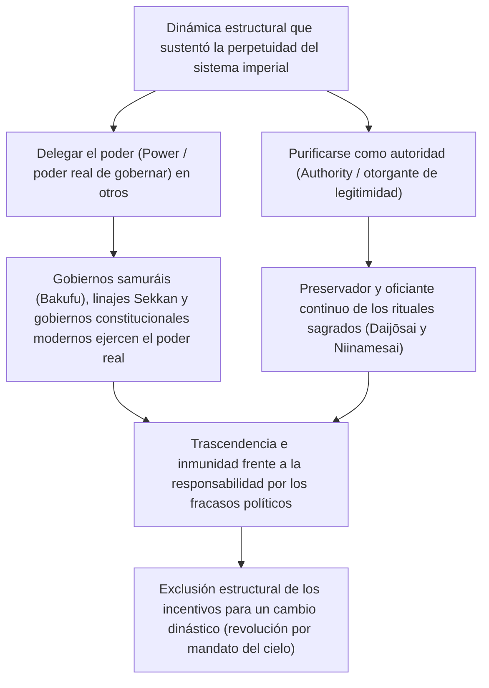
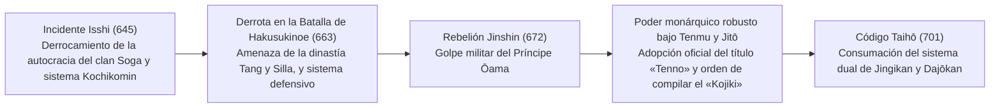
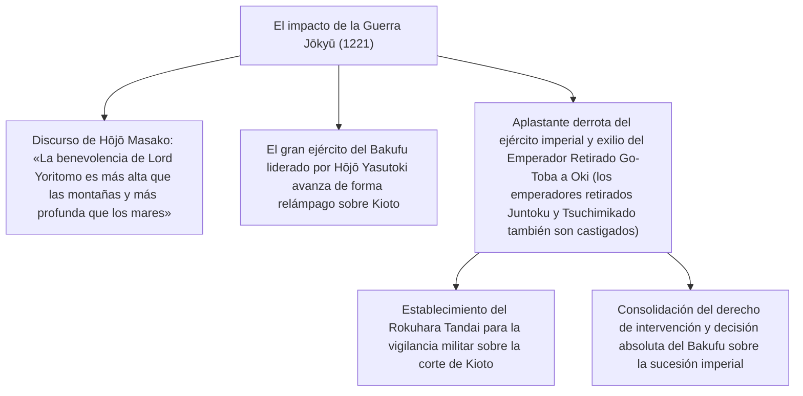
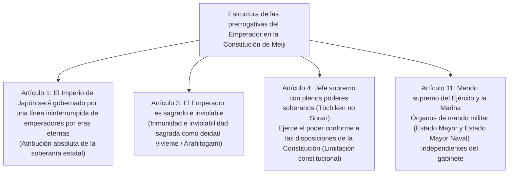
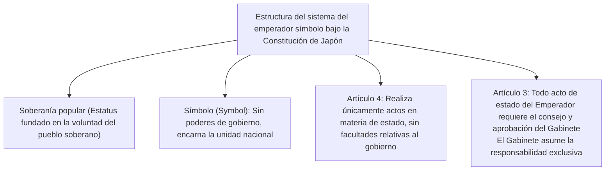
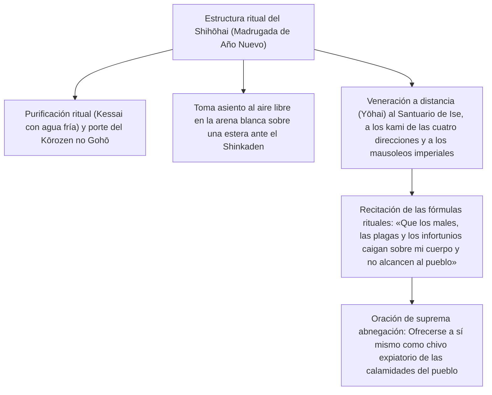
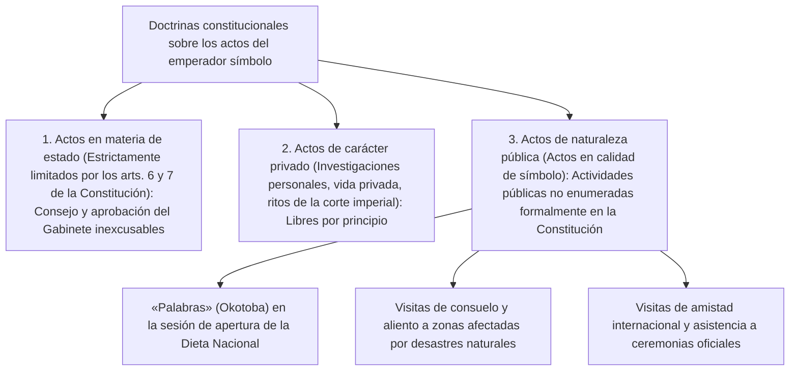

## 1. Introducción: La dinastía hereditaria más antigua del mundo y la «separación de poder y autoridad»

### 1.1 El discurso de la «línea ininterrumpida por eras eternas» y la realidad histórica y arqueológica

La historia del Emperador de Japón (*Tenno*) y de la Casa Imperial ostenta una continuidad insólita y sin parangón en comparación con cualquier otra casa real o dinastía existente en el mundo. El Libro Guinness de los Récords la reconoce formalmente como «la monarquía hereditaria continua más antigua del mundo» (*The oldest continuous hereditary monarchy*).

El discurso ideológico enarbolado por la corriente académica del *Kokugaku* en la época moderna y consagrado en el Artículo 1 de la Constitución del Gran Imperio de Japón bajo el lema *Bansei Ikkei* («una línea ininterrumpida por eras eternas») posee un innegable tinte mitológico. No obstante, a la luz de los testimonios rigurosos de la historiografía empírica y la arqueología moderna, **el hecho de que una única estirpe real se haya perpetuado de manera continua en el espacio geográfico del archipiélago japonés durante más de 1.500 años —al menos desde finales del siglo V con el reinado del Emperador Yūryaku (el Gran Rey Wakatakeru) o desde principios del siglo VI con el Emperador Keitai— constituye un hecho histórico incuestionable en el plano académico.**

Al contemplar la historia de las diversas civilizaciones humanas, observamos que en China el mandato del Cielo mudaba y el linaje imperial era exterminado de raíz mediante la «revolución por mandato del cielo» (*Isei Kakumei* o ciclo dinástico); del mismo modo, las naciones europeas experimentaron sucesivas rupturas y relevos dinásticos: las casas de Normandía, Plantagenet, Tudor, Estuardo y Hannover. Frente a este panorama universal, ¿por qué únicamente en Japón pudo sobrevivir una sola estirpe dinástica hasta nuestros días sin sufrir jamás la fractura de una sustitución dinástica?



---

### 1.2 La perspectiva de la civilización comparada: «Separación de poder y autoridad»

Tal como han señalado pensadores de la historia de las ideas y antropólogos culturales de la talla de Masao Maruyama y Ruth Benedict, la característica más sobresaliente de la estructura de gobernanza en la civilización japonesa radica en **la separación dual y radical entre el «poder político secular» (*Power*: la fuerza militar, la potestad tributaria y el ejercicio cotidiano del gobierno) y la «autoridad suprema» (*Authority*: la fuente originaria de la legitimidad y la sacralidad religiosa y simbólica).**

Tanto los monarcas absolutos de Occidente (como Luis XIV de Francia) como los emperadores despóticos de China eran, a la vez que «gobernantes efectivos» que comandaban ejércitos y dictaban órdenes de gobierno, las máximas «autoridades» de la ley y el orden. Cuando ambas esferas se funden en una sola persona, cualquier error de gobierno, derrota militar o cataclismo social recae de forma directa sobre la figura del soberano, quien, ante un levantamiento popular o rebelión armada, es derrocado del trono junto con la totalidad de su linaje.

Frente a ello, el Emperador japonés mantuvo invariablemente a lo largo de los siglos —desde la hegemonía del clan Fujiwara en el período Heian (gobierno de regencias *Sekkan*), el gobierno claustral de los emperadores retirados (*Insei*) a partir de Shirakawa, los regímenes militares del Medioevo y la Edad Moderna (los shogunatos o *Bakufu* de Kamakura, Muromachi y Edo), hasta el sistema de gabinetes ministeriales de la era moderna— una estructura institucional constante: **«delegar siempre el poder secular de gobierno (el poder efectivo) en mandatarios externos, ministros asistentes (*Hohitsu*) o caudillos militares».** Incluso el shogun más poderoso de un *Bakufu*, para legitimar su dominio sobre el país, requería imperativamente ser investido formalmente por el Emperador con el rango de *Seii Taishōgun* («gran general pacificador de los bárbaros»).

La responsabilidad por los fracasos políticos recaía siempre sobre el shogunato o el gabinete ministerial que había ejercido el poder fáctico, siendo estos depuestos o exterminados mediante rebeliones armadas o cambios de régimen. Sin embargo, dado que el Emperador —manantial último de la legitimidad— se hallaba situado en una esfera trascendente y más allá de toda responsabilidad política secular, en ninguna época de turbulencia histórica existió jamás el estímulo de usurpar el trono imperial (asesinar al soberano para colocarse la corona a sí mismo).

---

## 2. Formación del Estado antiguo, nacimiento del título «Tenno» y los rituales Ritsuryō

### 2.1 La sublimación de Okimi (Gran Rey) a «Tenno»

Durante el período Kofun, los jefes supremos de la corte de Yamato que reinaban sobre el centro del archipiélago eran denominados *Okimi* («Gran Rey» o *Chitenka Okimi*: «Gran Rey que gobierna cuanto existe bajo el Cielo»). La inscripción descubierta en la espada de hierro del túmulo funerario de Inariyama (prefectura de Saitama), dedicada al «Gran Rey Wakatakeru» (*Wakatakeru Okimi*, identificado con el Emperador Yūryaku), evidencia aún con gran nitidez su carácter originario como líder supremo de una confederación de poderosos clanes aristocráticos locales (*Uji-Kabane*).

Entre finales del siglo VI y comienzos del siglo VII, el Príncipe Shōtoku (*Umayado no Miko*) y Soga no Umako, quienes apoyaron el ascenso al trono de la Emperatriz Suiko, instituyeron el sistema de doce rangos de tocado (*Kan'i Jūnikai*, un escalafón burocrático sustentado en el talento y la valía individual antes que en el linaje hereditario) y promulgaron la Constitución de diecisiete artículos (*Jūshichijō Kenpō*, cuyos preceptos proclamaban: «La concordia y la armonía han de ser estimadas», «Reverenciad con fervor los Tres Tesoros» y «Acatad con diligencia los mandatos imperiales»). Asimismo, en la histórica misiva diplomática remitida al Emperador Yang de la dinastía Sui («El Hijo del Cielo de la tierra donde nace el sol envía esta misiva al Hijo del Cielo de la tierra donde se pone el sol; ¿gozáis de buena salud?»), la corte japonesa rompió definitivamente con el orden tributario y de investidura subordinada (*Sakuhō*) del Imperio chino, declarando su autonomía como un «Hijo del Cielo» (*Tenshi*) soberano y en pie de igualdad.

En el año 645, con el estallido del **«Incidente Isshi» (punto de partida de las Reformas Taika)**, el Príncipe Naka no Ōe (futuro Emperador Tenji) y Nakatomi no Kamatari (fundador del clan Fujiwara) asesinaron en el propio palacio imperial al despótico Soga no Iruka. Con este acto abolieron la posesión privada de tierras y personas por parte de los clanes aristocráticos, proclamando el magno ideal del sistema *Kochikomin*, conforme al cual la totalidad del territorio y los súbditos pasaban a ser propiedad eminente del Estado (encarnado en la figura imperial).



---

### 2.2 La Rebelión Jinshin (672) y la autoridad absoluta del Emperador Tenmu

El mayor punto de inflexión en la historia del Japón antiguo fue la **«Rebelión Jinshin» (672)**, una sangrienta guerra civil por la sucesión al trono desatada tras la muerte del Emperador Tenji. El Príncipe Ōama, que se había recluido en la región de Yoshino, movilizó con destreza las fuerzas guerreras de las comarcas orientales (*Tōgoku*, en Mino y Owari) y aniquiló mediante una ofensiva relámpago a la corte de Ōmi, encabezada por el Príncipe Ōtomo, para ascender personalmente al trono en el palacio Asuka Kiyomihara no Miya como el **Emperador Tenmu**.

Bajo los reinados del Emperador Tenmu y de su viuda y sucesora, la Emperatriz Jitō, se configuró definitivamente el andamiaje institucional fundamental del Estado monárquico y burocrático antiguo (*Ritsuryō*):

1. **Adopción oficial del título de «Tenno»**:
   - Comenzó a utilizarse de manera formal y sistemática en tablillas votivas de madera (*mokkan*) e inscripciones epigráficas el término supremo *Tenno* («Emperador celestial»), vocablo que se vincula con la deidad suprema del taoísmo, *Tenkō Taitei* (la divinización astronómica de la Estrella Polar).
2. **Establecimiento de la denominación oficial del país como «Nihon»**:
   - Se abandonó formalmente el arcaico eclesiónimo y etnónimo de «Wakoku» para adoptar con orgullo el nombre de «Nihon» (el origen o nacimiento del sol).
3. **Inicio de la compilación de las historias nacionales (mitología oficial)**:
   - Por mandato directo del Emperador Tenmu, se ordenó depurar y recopilar las tradiciones y memorias orales de los diversos clanes para redactar el *Kojiki* (culminado en 712) y el *Nihon Shoki* (finalizado en 720), textos fundacionales destinados a entroncar la legitimidad inmemorial del linaje imperial con la diosa solar Amaterasu.

---

### 2.3 Estructura profunda del mito de Kiki y los Tres Tesoros Sagrados

El vasto universo mitológico narrado en el *Kojiki* y en el *Nihon Shoki* (denominados conjuntamente *Kiki*), que se extiende desde la deidad progenitora Amaterasu Ōmikami (la Gran Diosa que Ilumina el Cielo) hasta el primer soberano humano terrenal, el Emperador Jinmu, establece el fundamento teológico, cósmico y sagrado de la autoridad imperial.

- **El descenso del nieto celestial (*Tenson Kōrin*) y los «Tres Grandes Mandatos Divinos»**:
  - Al encomendar a su nieto Ninigi no Mikoto la misión de descender desde las alturas celestiales a la cumbre del monte Takachiho, Amaterasu proclamó el mandamiento supremo conocido como el **«Mandato de la eternidad del cielo y la tierra» (*Tenjō Mukyū no Shinchoku*)**:
  > «La fértil tierra de los cañaverales de mil quinientos otoños y espigas abundantes (*Toyoashihara no Chiioaki no Mizuho no Kuni*) es la tierra sobre la cual reinarán mis descendientes. Ve tú, augusto nieto celestial, y gobierna allí. ¡Parte ya! La prosperidad de tu trono imperial será tan coetánea e inagotable como el cielo y la tierra.»
  - Este pacto sagrado establece que la soberanía de la tierra terrenal ha sido encomendada para siempre a los descendientes del linaje imperial por designio y voluntad de los dioses celestiales.
  - A este mandato se sumaron el «Mandato de veneración del espejo sagrado» (*Hōkyō Hōsai no Shinchoku*), por el cual se ordenaba reverenciar el espejo divino como si se tratara del espíritu viviente de la propia Amaterasu, y el «Mandato de las espigas del patio sagrado» (*Saitaniho no Shinchoku*), que prescribía cultivar en el mundo terrenal el arroz sagrado traído de los campos celestiales.

- **Los Tres Tesoros Sagrados (*Sanshu no Jingi*)**:
  1. **El Espejo de Yata (*Yata no Kagami*)**: Símbolo de la suprema sabiduría y de la sacralidad solar (cuerpo divino u objeto de culto, *Goshintai*, del Santuario Interior de Ise; en el Palacio Imperial se venera y custodia su réplica sagrada o *Katashiro*).
  2. **La Joya Curva de Yasakani (*Yasakani no Magatama*)**: Símbolo de la benevolencia compasiva y del poder espiritual anímico (custodiada de forma ininterrumpida en la cámara *Kenji no Ma* del Palacio Imperial).
  3. **La Espada de Kusanagi (*Kusanagi no Tsurugi* o *Ame no Murakumo no Tsurugi*)**: Símbolo de la marcialidad valerosa y la justicia resolutiva (objeto sagrado del Santuario de Atsuta; en el Palacio Imperial se resguarda su correspondiente réplica sagrada o *Katashiro*).
  - En la solemne ceremonia de entronización de cada nuevo emperador a lo largo de las eras, el rito de traspaso de estas insignias dinásticas (*Kenji-tō-shōkei no Gi*) ha constituido la prueba sacramental inexcusable de la legitimidad imperial.

---

### 2.4 El dualismo del sistema Ritsuryō: Jingikan y Dajōkan, y el Daijōsai

La estructura administrativa y burocrática antigua, consagrada plenamente en el «Código Taihō» del año 701, si bien tomó como modelo el refinado andamiaje legal de la dinastía Tang, introdujo una alteración institucional endógena de trascendental importancia.

Mientras que en el modelo continental chino el órgano cultual y ritual (*Taichangsi*) se hallaba subordinado jerárquicamente a los ministerios de la administración civil ejecutiva (*Shangshusheng*, *Zhongshusheng* y *Menxiasheng*), el sistema japonés situó al **Consejo de Divinidades (*Jingikan*)**, encargado en exclusiva del culto a los dioses celestiales y terrenales, en una posición de absoluta igualdad jerárquica —o incluso formalmente superior— frente al **Gran Consejo de Estado (*Dajōkan*)**, órgano civil que coordinaba la administración general del reino (el denominado sistema de dos consejos y ocho ministerios: *Nikan Hasshō-sei*).

La ocupación primordial y definitoria del Emperador no estribaba en la gestión burocrática de los negocios políticos cotidianos (*seimu*), sino en la consumación de los **«asuntos sagrados» (*Shinji*: la comunión orante ante los dioses y budas invisibles)**:

- **El Niinamesai**: Festividad litúrgica celebrada cada mes de noviembre, en la cual el soberano ofrece a las divinidades las primicias del arroz recién cosechado y participa personalmente de ellas en un banquete sagrado (*Shinjin Kyōshoku*: la comunión mística de dioses y seres humanos), impetrando la paz del reino y la fertilidad de las cosechas.
- **El Daijōsai**: La liturgia esotérica suprema que se celebra una única vez durante el reinado de cada monarca tras su entronización. En este rito extraordinario, se erigen desde sus cimientos pabellones sagrados de diseño arcaico y rústico llamados *Yuki-den* y *Suki-den*; en su interior, a lo largo de una noche de vigilia absoluta, el nuevo emperador presenta los frutos de la tierra ante los ancestros divinos, comulga con ellos y aloja en su propio cuerpo el espíritu imperial numinoso (*Tenno-rei*), renaciendo transformado en un soberano de linaje espiritual perfeccionado.

Independientemente de cómo mutaran o fluctuaran las riendas del poder político fáctico a lo largo de los siglos, este papel sagrado de «sumo sacerdote que ora con pureza y desinterés ante los dioses por la salvación de la nación» ha constituido el núcleo irreductible y perenne del sistema imperial.

---

## 3. La estructura dual de autoridad y poder en el Medioevo y la Edad Moderna

### 3.1 El gobierno Sekkan y el Insei: Dinámica de poder en el seno de la corte

Durante el período Heian, el entramado político y cortesano articulado en torno a la figura imperial alcanzó cotas extraordinarias de sofisticación y metamorfosis institucional:

- **El régimen de regencias del clan Fujiwara (*Sekkan-seiji*, siglos X–XI)**:
  - La rama norteña del clan Fujiwara (*Fujiwara Hokke*, que conoció su apogeo absoluto bajo Michinaga y Yorimichi) introdujo a sus hijas como emperatrices consortes (*Chūgū*) de sucesivos monarcas. Al conseguir que los príncipes imperiales nacidos de esas uniones ascendieran al trono a edad muy temprana, los caudillos Fujiwara se erigieron, en calidad de abuelos maternos (*Gaiseki*), en regentes de monarcas menores (*Sesshō*) y, una vez alcanzada la mayoría de edad de estos, en regentes cancilleres consultivos (*Kampaku*).
  - Lejos de abrigar pretensión alguna de usurpar la augusta autoridad del trono, el clan Fujiwara monopolizó de manera absoluta las decisiones políticas y la concesión de cargos públicos mediante el ejercicio vicario de su posición como parientes maternos.

- **La emergencia del gobierno claustral (*Insei*, desde finales del siglo XI)**:
  - En el año 1086, el Emperador Shirakawa abdicó voluntariamente en favor de su joven hijo, el Emperador Horikawa, convirtiéndose en Emperador Retirado (*Jōkō* o *Daijō Tenno*) y creando fuera del recinto formal de la corte una estructura institucional propia y directa: la oficina claustral (*In no Chō*).
  - Asumiendo la jefatura suprema de la Casa Imperial bajo el título de *Chiten no Kimi* («el Señor que gobierna el mundo»), marginó la influencia de las familias de regentes y recobró las riendas directas del poder político. Al ingresar en la vida monástica y adoptar la dignidad de «Emperador Enclaustrado Tonsurado» (*Hōō*), el soberano retirado quedaba eximido de los asfixiantes corsés rituales confucianos y formalismos propios del código *Ritsuryō*, lo que le permitía blandir una autoridad ejecutiva de carácter plenamente autocrático.

---

### 3.2 El nacimiento del poder samurái y la Guerra Jōkyū (1221)

Hacia finales del siglo XII, tras aplastar la hegemonía del clan guerrero Taira, Minamoto no Yoritomo instauró en la comarca oriental de Kamakura el primer régimen militar autónomo de la historia japonesa: el **«Shogunato de Kamakura» (*Kamakura Bakufu*)**.

Yoritomo recabó de la corte imperial de Kioto el nombramiento civil y militar como *Seii Taishōgun*, al tiempo que obtenía la sanción imperial del año 1185 (*Bunji no Chokkyo*), facultándole para designar gobernadores militares provinciales (*Shugo*) e intendentes recaudadores de fincas (*Jitō*) en todo el territorio nacional. Con ello quedó establecida una estructura dual de gobernanza nacional (*Kōbu Nigen Shihai*): la «Corte Imperial y la nobleza cortesana» (*Kuge*) en el oeste y el «Shogunato militar» (*Buke*) en el este.

Frente a esta creciente subordinación ante los guerreros feudales, un soberano dotado de un temple excepcional y desbordante energía, el **Emperador Retirado Go-Toba**, resolvió jugarse el todo por el todo en un audaz desafío armado. En el año 1221 emitió un decreto claustral (*inzen*) condenando como enemigo de la corte a Hōjō Yoshitoki, regente militar (*Shikken*) del Shogunato de Kamakura, convocando a las armas a la casta guerrera de todo el país en lo que la historia recuerda como la **Guerra Jōkyū (*Jōkyū no Ran*)**.



El desenlace de la Guerra Jōkyū supuso un triunfo total y arrollador para la causa de los samuráis. El hecho de que la soldadesca desafiara abiertamente los decretos imperiales de la corte y confinara en el destierro al propio señor de la Casa Imperial (*Chiten no Kimi*) puso dolorosamente al descubierto una realidad descarnada: una corte carente de espada y poderío bélico resultaba impotente ante el arbitrio militar. El Shogunato no solo estableció la comandancia del *Rokuhara Tandai* en Kioto para fiscalizar estrechamente a los nobles, sino que se arrogó la prerrogativa absoluta de intervenir de forma decisiva en la designación de los herederos del trono, imponiendo con el tiempo el sistema de alternancia sucesoria (*Ryōtō Tetsuritsu*) entre la línea Daikakuji (antepasada de la corte del Sur) y la línea Jimyōin (matriz de la corte del Norte).

---

### 3.3 La Restauración Kenmu y los disturbios del período Nanbokuchō

En 1333, el aguerrido Emperador Go-Daigo, tras concertar alianzas con destacados caudillos guerreros como Ashikaga Takauji, Nitta Yoshisada y Kusunoki Masashige, logró la destrucción del Shogunato de Kamakura y proclamó la restauración del gobierno personal directo del monarca: la **«Restauración Kenmu»**.

Sin embargo, su anhelo regresivo de recrear la primacía cortesana clásica, unido al flagrante menosprecio de las justas demandas de recompensa territorial de los guerreros y a un despotismo arcaizante y cortesano, provocó el colapso del nuevo régimen en apenas dos años. Tras distanciarse del monarca, Ashikaga Takauji tomó Kioto, entronizó al Emperador Kōmyō (perteneciente a la línea Jimyōin) e inauguró el Shogunato de Muromachi. Por su parte, Go-Daigo huyó a las agrestes montañas de Yoshino, proclamando la legitimidad inquebrantable de su causa.

Se inició así el **período Nanbokuchō (1336–1392)**, una prolongada fractura de casi seis décadas en la que la **«Corte del Norte»** en Kioto y la **«Corte del Sur»** en Yoshino compitieron encarnizadamente por la legitimidad dinástica mediante cruentas guerras civiles. Finalmente, en 1392, merced a la mediación del tercer shogun de Muromachi, Ashikaga Yoshimitsu, se pactó la reconciliación dinástica (*Meitoku no Wayaku*), mediante la cual el Emperador Go-Kameyama de la Corte del Sur entregó los Tres Tesoros Sagrados al Emperador Go-Komatsu de la Corte del Norte. (Si bien la genealogía biológica de la actual familia imperial desciende del linaje septentrional de Go-Komatsu, el Estado japonés reconoció formalmente a partir de la era Meiji que la legitimidad histórica soberana recayó exclusivamente en la Corte del Sur, por haber conservado las insignias sagradas).

Durante el cenit de su poderío, Ashikaga Yoshimitsu aceptó de manos del Emperador Yongle de la dinastía Ming el título de «Rey de Japón» (*Nihon Kokuō*) y llegó a albergar ambiciones de colocar a su propio vástago en el solio imperial, acariciando la tentación de usurpar el trono; empero, dicha pretensión se desvaneció por completo con su repentino fallecimiento.

---

### 3.4 Las «Leyes para la corte imperial y la nobleza» (Kinchū narabini Kuge Shohatto) del shogunato Tokugawa y la prescripción del «estudio académico»

Durante el caótico siglo y medio de la era Sengoku (el período de los estados en guerra), las finanzas de la corte imperial tocaron fondo, precipitándose en una indigencia tal que soberanos como el Emperador Go-Nara se vieron obligados a vender caligrafías de su propio puño y letra (*chinkan*, versos *waka* o copias del *Sutra del Corazón*) para costear los gastos elementales de palacio. Pese a todo, ninguno de los grandes unificadores militares del país —Oda Nobunaga, Toyotomi Hideyoshi o Tokugawa Ieyasu— osó jamás extinguir la monarquía; muy al contrario, aportaron cuantiosas donaciones financieras para restaurar los palacios y procuraron legitimar sus respectivos mandatos solicitando a la corte nombramientos tradicionales como *Kampaku*, *Dajō Daijin* (Gran Ministro de Estado) o *Seii Taishōgun*.

Habiendo pacificado y unificado el reino, Tokugawa Ieyasu promulgó en 1615 un riguroso cuerpo jurídico destinado a someter a la corte a un encuadramiento legal férreo: las **«Leyes para la corte imperial y la nobleza» (*Kinchū narabini Kuge Shohatto*, de 17 artículos)**. En la cúspide de dicho cuerpo legal, el Artículo 1 sentenció de forma taxativa:

> **«De las diversas artes del Hijo del Cielo, el primer lugar corresponde al estudio académico (*Gogakumon*).»**

La verdadera motivación de este precepto encerraba una frialdad y un cálculo político implacables: la vocación exclusiva del soberano debía ser el cultivo sosegado de los saberes literarios, el conocimiento de los precedentes ceremoniales cortesanos (*yūsokukojitsu*) y la composición poética, quedando rigurosamente vetada cualquier injerencia en los asuntos de la política práctica o la administración militar.

Tal como ilustró palmariamente el sonado «Incidente de las vestiduras púrpuras» (*Shie Jiken*, 1629 —episodio en el que el shogunato revocó y declaró nula una orden imperial del Emperador Go-Mizunoo que otorgaba mantos púrpuras a monjes eminentes, ante lo cual el monarca abdicó fulminantemente en señal de protesta—), a lo largo del período Edo el Emperador permaneció enclaustrado en las profundidades del palacio de Kioto (*Gosho*), totalmente neutralizado y despojado de cualquier resquicio de autoridad política: una pura entidad representativa de rango ceremonial, erudito y sagrado.

---

## 4. La Restauración Meiji y la creación del Estado moderno de la «deidad viviente» (Arahitogami)

### 4.1 Del Sonno Joi a la Restauración de la Monarquía

A partir de mediados del período Edo, gracias a la magna empresa historiográfica de la Escuela de Mito con la redacción del *Dai Nihonshi* («Gran Historia del Japón») y al florecimiento de los estudios nativistas del *Kokugaku* (impulsados por eruditos como Motoori Norinaga), arraigó con fuerza en la conciencia colectiva de la clase samurái la convicción de que el Shogunato no era más que un depositario transitorio al que el Emperador había delegado el ejercicio del poder (*Taisei Inin-ron*).

Cuando la súbita llegada de los «barcos negros» del comodoro Perry en 1853 desnudó la palmaria impotencia del shogunato Tokugawa para hacer frente a la amenaza colonial de las potencias extranjeras, el ardor político del movimiento *Sonno Joi* («Reverenciar al Emperador, expulsar a los bárbaros») prendió con violencia entre los samuráis de base y los jóvenes idealistas de la nación. El Emperador Kōmei dictó decretos imperiales exigiendo el rechazo de los tratados con Occidente, y feudos de vanguardia como Chōshū y Satsuma se congregaron en torno a la corte como epicentro indiscutible de la cohesión nacional.

En octubre de 1867, el 15.º shogun, Tokugawa Yoshinobu, presentó formalmente la devolución del poder gubernamental a la corona (*Taisei Hōkan*). Semanas más tarde, el 9 de diciembre de 1867, bajo el impulso decidido de figuras como Iwakura Tomomi y el patricio de Satsuma Saigō Takamori, se proclamó el solemne **«Edicto de Restauración Imperial» (*Ōseifukko no Daigōrō*)**:

- Se decretó la abolición definitiva del Shogunato, de las regencias *Sesshō* y de los cargos de *Kampaku*.
- Se anunció el retorno a los orígenes fundacionales del primer monarca mítico, el Emperador Jinmu, proclamando el alumbramiento de un nuevo gobierno regido por la autoridad directa del soberano (*Tennō Shinsei*).
- Un joven de apenas dieciséis años, el Emperador Meiji, ascendió al trono; la ciudad de Edo fue rebautizada con el nombre de «Tokio» (capital del este) y la residencia de la corte se trasladó definitivamente de Kioto al antiguo castillo de Edo (convertido en el Palacio Imperial).

---

### 4.2 El dualismo constitucional de la Constitución del Gran Imperio de Japón (Constitución de Meiji, 1889)

Los líderes fundadores de la era Meiji, bajo la batuta intelectual y política de Itō Hirobumi, tomaron como espejo el constitucionalismo prusiano (alemán) para alumbrar un texto normativo adaptado con precisión milimétrica a las particularidades de la idiosincrasia japonesa: la **«Constitución del Gran Imperio de Japón»**.



En el diseño institucional del andamiaje de Meiji, la figura del monarca albergaba una extraordinaria «naturaleza dual y ambivalente»:

1. **Vertiente tradicional y teológica**: El soberano es el descendiente directo de las deidades primordiales, la encarnación viva de la moral nacional y una deidad viviente (*Arahitogami*) que ostenta un carácter sagrado e inviolable.
2. **Vertiente moderna y constitucional**: El Emperador es un monarca constitucional que ejerce la soberanía del Estado «conforme a las disposiciones de la Constitución». Lejos de actuar como un déspota arbitrario, no puede promulgar mandatos sin el concurso formal de los órganos establecidos: para el ejercicio del poder ejecutivo requiere imperativamente la asistencia y refrendo ministerial (*Hohitsu*) de los ministros de Estado (Artículo 55), al tiempo que la potestad legislativa exige la aprobación de la Dieta Imperial.

Durante el florecimiento de la era Taishō, el catedrático de la Facultad de Derecho de la Universidad Imperial de Tokio, Tatsukichi Minobe, formuló la influyente **«Teoría del Órgano Imperial» (*Tennō Kikan-setsu*)** —doctrina que concebía al Estado como una persona jurídica titular originaria de la soberanía, definiendo al Emperador como su órgano supremo—. Dicha tesis proveyó el andamiaje dogmático fundamental que hizo posible el auge de los gabinetes parlamentarios partidistas en los años dorados de la «Democracia de Taishō».

No obstante, el diseño de la Constitución de Meiji encerraba un vicio estructural sumamente letal: la consagración en su **Artículo 11 de la «independencia del mando supremo militar» (*Tōsuiken no Dokuritsu*)**, conforme a la cual el mando operativo de las Fuerzas Armadas (el Estado Mayor del Ejército y el Estado Mayor de la Marina) no estaba sujeto a la tutela ministerial del gabinete civil, sino que dependía de forma directa del monarca. Cuando en la convulsa década de 1930 los estamentos castrenses esgrimieron dicha prerrogativa soberana para sustraerse de plano al control de los ministros civiles y del parlamento, las compuertas del constitucionalismo se quebraron de manera irremediable.

---

## 5. La turbulencia de Shōwa, la derrota bélica y el giro dramático hacia el «sistema del emperador símbolo»

### 5.1 La catástrofe de principios de Shōwa y la «Decisión Sagrada» (Seidan) del fin de la guerra

A partir de 1930, con la crisis provocada por la acusación de «violación de la prerrogativa del mando supremo» y los sangrientos magnicidios de los incidentes del 15 de mayo de 1932 y del 26 de febrero de 1936, el régimen constitucional de partidos colapsó definitivamente. Japón se precipito por la pendiente de la dictadura militarista, el cenagal bélico de la Segunda Guerra Sino-Japonesa y, a partir de diciembre de 1941, la conflagración total de la Guerra del Pacífico.

El Sintoísmo Estatal (*Kokka Shintō*) fue dogmatizado hasta extremos asfixiantes, inculcándose a la ciudadanía la doctrina de que ofrendar la propia existencia en el campo de batalla por el augusto soberano constituía la virtud suprema del ser japonés. En medio de esta vorágine, el propio Emperador Shōwa vivió desgarrado en su fuero interno: atado por su convicción de actuar como un monarca constitucional que no debía vetar las resoluciones colegiadas del gabinete y del alto mando bélico, al tiempo que sus oraciones íntimas clamaban desesperadamente por la paz.

En agosto de 1945, cercado por el apocalipsis atómico sobre Hiroshima y Nagasaki y la fulminante invasión soviética de Manchuria, el Consejo Supremo de Conducción de la Guerra se hallaba dividido en un empate irreconciliable de 3 contra 3 respecto a las condiciones de la rendición, debatiéndose entre la capitulación salvaguardando la estructura nacional (*Kokutai Goji*: la pervivencia de la Casa Imperial) o la inmolación bélica en el territorio metropolitano (*Hondo Kessen*, bajo la consigna del martirio colectivo de los cien millones: *Ichioku Sōgyokusai*).

En las reuniones de la Conferencia Imperial (*Gozen Kaigi*) celebradas bajo los refugios antiaéreos del palacio los días 10 y 14 de agosto, el primer ministro Kantarō Suzuki solicitó humildemente el pronunciamiento personal del monarca. Con lágrimas en los ojos, el Emperador Shōwa dictó su histórica **«Decisión Sagrada» (*Seidan*)**:

> **«Mi misión primordial consiste en salvar al pueblo. Sin importar lo que ocurra con mi propia persona, no puedo tolerar por más tiempo ver a mi pueblo perecer bajo el fuego bélico y contemplar la destrucción de la civilización humana. [...] He tomado la determinación de poner fin a la guerra soportando lo insoportable y tolerando lo intolerable.»**

Al mediodía del 15 de agosto, la voz del soberano radiada por primera vez a toda la nación a través del *Gyokuon-hōsō* (la emisión del rescripto imperial de rendición) puso punto final a la contienda. Es un juicio unánime de los historiadores que, sin la intervención moral directa de la investidura imperial, el combate a ultranza en el suelo continental habría arrojado un saldo adicional de millones de vidas segadas.

---

### 5.2 El encuentro con MacArthur y la exoneración del Juicio de Tokio

Tras la capitulación, las fuerzas del Cuartel General Supremo de las Potencias Aliadas (GHQ), al mando del general Douglas MacArthur, desembarcaron en territorio nipón. La opinión pública dominante en los Estados Unidos, el Reino Unido y la Unión Soviética exigía con furor que el Emperador Shōwa fuera procesado y ejecutado como el «máximo criminal de guerra de rango principal», reclamando la erradicación total del trono imperial.

El 27 de septiembre de 1945, el Emperador Shōwa acudió en persona y sin séquito a la Embajada de los Estados Unidos en Tokio para reunirse con MacArthur. De acuerdo con las memorias de este último, el soberano, lejos de formular súplica alguna por su propia inmunidad, le manifestó con serena dignidad:

> **«He venido aquí a entregarme en vuestras manos como el único responsable de todas y cada una de las decisiones y acciones políticas y militares que mi pueblo tomó en la conducción de la guerra. No me importa lo que sea de mi propia vida. Os ruego, sin embargo, que proveáis de alimento a mi pueblo.»**

Conmovido en lo más hondo ante la abnegación altruista del monarca, MacArthur reafirmó de manera inmediata la directriz estratégica de su política de ocupación: preservar la institución imperial y exonerar al soberano del banquillo de los acusados en el Juicio de Tokio. El mando militar comprendió lúcidamente que decapitar la figura imperial empujaría al pueblo japonés a una desesperada guerra de guerrillas de proporciones colosales, haciendo inviable la ocupación pacífica del archipiélago.

El 1 de enero de 1946, el soberano promulgó el célebre **«Rescripto sobre la construcción de un nuevo Japón» (conocido popularmente como la «Declaración de Humanidad» o *Ningen Sengen*)**, en el cual proclamó que los lazos que unen al trono con el pueblo no emanan de mitos arcaicos ni de la errónea concepción de una deidad viviente en la carne (*Arahitogami*), sino del afecto y la confianza mutua consolidada a través de las eras.

---

### 5.3 El Artículo 1 de la Constitución de Japón: Consolidación del «sistema del emperador símbolo»

Entrada en vigor el 3 de mayo de 1947, la **Constitución de Japón** redefinió desde sus cimientos ontológicos la naturaleza y condición jurídica del trono imperial en su Artículo 1:

> **Artículo 1: «El Emperador es el símbolo del Estado y de la unidad del pueblo, derivando su posición de la voluntad del pueblo, en quien reside la soberanía.»**



- **Pérdida absoluta de facultades de gobernación**: El soberano dejó de ser el monarca supremo titular de la soberanía para erigirse en el «Símbolo» que personifica la continuidad existencial del país y la unidad cívica de la colectividad popular.
- **Prohibición terminante de toda injerencia en la política (Artículo 4)**: El Emperador desempeña únicamente los «actos en materia de estado» (*Kokuji-kōi*) de estricta naturaleza formal y protocolaria taxativamente tasados por la Constitución (la promulgación de leyes, la apertura formal de la Dieta, el nombramiento ritual del Primer Ministro designado por las cámaras, la recepción de credenciales diplomáticas o la concesión de condecoraciones), teniendo rigurosamente vedada cualquier atribución de gobierno efectivo.
- **Asistencia inexcusable mediante el consejo y la aprobación del Gabinete (Artículo 3)**: Cualquier acto oficial del monarca en materia de estado requiere de manera indispensable el previo consejo y refrendo del Gabinete ministerial, correspondiendo exclusivamente a este último toda la responsabilidad política emanada de los mismos.

Este «sistema del emperador símbolo» suele considerarse a menudo un diseño ajeno e impuesto mecánicamente por las tropas de ocupación; sin embargo, desde una perspectiva histórica de largo alcance, constituye **el retorno más puro y decantado a la milenaria tradición estructural forjada en el archipiélago desde los albores del Medioevo: aquella en la que el Emperador no ejerce jamás el poder terrenal fáctico, sino que consagra su existencia entera a la custodia de la autoridad espiritual y a la oración sagrada.**

---

## 2.5 Estructura ritual de los ritos de la corte imperial y la dinámica espiritual del «Shihōhai»

Para comprender en toda su hondura la naturaleza ontológica del Emperador, resulta imprescindible adentrarse en el ámbito recóndito de los **«ritos de la corte imperial» (*Kyūchū Saishi*)**, una dimensión litúrgica privada preservada de forma ininterrumpida en el seno de la Casa Imperial y escindida de manera tajante de los «actos en materia de estado» fijados por la Constitución de Japón.

En el corazón de la frondosa espesura de los jardines de Fukiage, en el recinto del Palacio Imperial, se alzan los **«Tres Santuarios del Palacio» (*Kyūchū Sanden*)**:

1. **El Kashikodokoro**: Donde se custodia y venera la réplica sagrada (*Katashiro*) del Espejo de Yata, encarnación mística de la deidad progenitora celestial, Amaterasu Ōmikami.
2. **El Kōreiden**: Donde descansan y reciben culto los espíritus ancestrales de todos los emperadores y miembros de la familia imperial desde el mítico fundador, el Emperador Jinmu.
3. **El Shinden**: Dedicado a la adoración de todas las divinidades del cielo y de la tierra (*Tenjin Chigi*, los ocho millones de *kami*).

A lo largo del ciclo anual, el Emperador oficia personalmente decenas de ceremonias litúrgicas de extrema severidad ascética. Entre todas ellas, la liturgia que encierra una mayor sacudida espiritual se celebra en la gélida madrugada del día de Año Nuevo (a las cinco y media de la mañana), en pleno rigor del invierno: el solemne **«Shihōhai» (*Veneración de las cuatro direcciones*)**.



El monarca purifica su cuerpo con abluciones de agua helada (*Kessai*), viste la arcaica túnica imperial de color ocre rojizo (*Kōrozen no Gohō*) y toma asiento a la intemperie sobre una estera tendida en la grava blanca ante el pabellón Shinkaden. Allí, en la oscuridad invernal, se postra en devota veneración a distancia (*Yōhai*) hacia el Gran Santuario de Ise, hacia las montañas, ríos y divinidades de las cuatro esquinas del universo y hacia los mausoleos de sus ilustres predecesores dinásticos. En ese instante supremo, pronuncia la fórmula mística consignada en los manuales litúrgicos de la corte desde el período Heian:

> **«Si calamidades, pestes, infortunios de agua y fuego han de caer sobre el pueblo, que atraviesen primero mi propio cuerpo (que la desgracia me golpee a mí antes de tocar a los súbditos).»**

Ofrecerse a sí mismo como «chivo expiatorio supremo» (*scapegoat*) ante los dioses para asumir sobre sus espaldas las catástrofes que amenazan a la nación y a sus gentes. Lejos de constituir un poder mundano destinado a dominar a sus semejantes, este espíritu sacerdotal de sacrificio absoluto —que anula el propio yo para rogar exclusivamente por el bienestar y la salvación ajena— constituye el campo magnético inconsciente que ha grabado la autoridad sagrada del Emperador en lo más hondo del alma del pueblo japonés a lo largo de milenios.

---

## 3.5 Realidad histórica de las emperatrices reinantes y verdad y mito de la teoría de la «transición»

En los apasionados debates contemporáneos en torno a la sucesión al trono imperial, suele esgrimirse de forma recurrente el precedente histórico de las **«ocho mujeres emperatrices en diez reinados» (*Hachikō Juttai no Josei Tennō*)** que gobernaron Japón.

| Reinado / Generación | Nombre de la Emperatriz | Período de Reinado | Contexto de Entronización y Logros Históricos |
| :---: | :--- | :---: | :--- |
| **33.ª** | **Emperatriz Suiko** | 592–628 | Entronizada como la primera mujer emperatriz para superar el caos y la división interna tras el magnicidio del Emperador Sushun. En estrecha cooperación con el Príncipe Shōtoku y Soga no Umako, impulsó los doce rangos de tocado y la Constitución de diecisiete artículos. |
| **35.ª / 37.ª** | **Emperatriz Kōgyoku / Saimei** | 642–645 / 655–661 | Doble reinado (*Chōso*: reascenso al trono con un nuevo nombre imperial). Fue el testigo presencial del Incidente Isshi; bajo su segundo reinado (*Saimei*), lideró en persona la movilización militar de la corte hacia Kyushu con miras a la batalla de Hakusukinoe, falleciendo en el cuartel general de campaña. |
| **41.ª** | **Emperatriz Jitō** | 690–697 | Emperatriz consorte de Tenmu. Asumió el trono para consumar el designio de su difunto esposo: fundó la grandiosa capital de Fujiwara-kyō, promulgó el Código Asuka Kiyomihara y transfirió con firmeza el cetro dinástico a su nieto, el Emperador Monmu. |
| **43.ª** | **Emperatriz Genmei** | 707–715 | Decretó el traslado de la capital a Heijō-kyō (Nara, 710), promovió la culminación del *Kojiki* y ordenó la redacción oficial de los registros corográficos provinciales (*Fudoki*). |
| **44.ª** | **Emperatriz Genshō** | 715–724 | Hija de la Emperatriz Genmei (constituye el único caso en toda la historia de Japón de sucesión imperial directa de madre a hija). Durante su gobierno se culminó el *Nihon Shoki* y se promulgó la Ley de propiedad agraria por tres generaciones (*Sansei Isshin no Hō*). |
| **46.ª / 48.ª** | **Emperatriz Kōken / Shōtoku** | 749–758 / 764–770 | Hija del piadoso Emperador Shōmu. Reinó en dos ocasiones (*Chōso*). Sofocó militarmente la rebelión de Fujiwara no Nakamaro y colmó de poder al monje Dōkyō confiriéndole el rango de *Hōō*. Impidió la usurpación del trono imperial merced al decisivo Incidente del Oráculo de Usa Hachimangū. |
| **109.ª** | **Emperatriz Meishō** | 1629–1643 | Comienzos del período Edo. Ascendió al trono de forma fulminante tras la intempestiva abdicación de su padre, el Emperador Go-Mizunoo, motivada por el ultraje del shogunato en el Incidente de las vestiduras púrpuras (era nieta del segundo shogun, Tokugawa Hidetada). |
| **117.ª** | **Emperatriz Go-Sakuramachi** | 1762–1770 | Mediados del período Edo. Ocupó el trono tras el prematuro fallecimiento de su hermano, el Emperador Momozono, custodiando la corona hasta que el joven heredero Go-Momozono alcanzó la madurez necesaria para gobernar. Es la última emperatriz reinante de la historia premoderna. |

Un riguroso examen histórico pone de relieve un dato institucional trascendental: **todas y cada una de las emperatrices reinantes del pasado fueron «mujeres de estirpe patrilineal» (*Dankei Joshi*), es decir, hijas biológicas de un emperador varón previo.** En ningún caso de la historia japonesa una emperatriz contrajo nupcias con un varón plebeyo o ajeno a la estirpe imperial para legar el trono a una progenie de filiación exclusivamente matrilineal.

Asimismo, la mayoría de ellas asumieron el solio en situaciones críticas de emergencia institucional —bien ante la extrema minoría de edad de los herederos legítimos, bien para conjurar un peligroso vacío de poder derivado de la muerte repentina del soberano precedente—, actuando como respetadas matriarcas de la Casa Imperial destinadas a salvaguardar la estabilidad dinástica para luego devolver el cetro a la siguiente generación de varones patrilineales, ejerciendo así una función de «transición provisional» (*chūtsugi* o *pinch hitter*).

No obstante, resulta igualmente incontrovertible que figuras extraordinarias como las emperatrices Suiko y Jitō trascendieron con creces la condición de meras regentes intermedias, desplegando un liderazgo monumental que modeló y consumó el andamiaje institucional del Estado antiguo. En el Japón primordial, la milenaria tradición del sistema *Hime-Hiko* —en el cual el carisma sacerdotal y la facultad mediadora con lo numinoso encarnados por la mujer chamánica (*hime*) se articulaban armónicamente con el ejercicio secular del poder militar y administrativo desempeñado por el hombre (*hiko*)— facilitó y legitimó de forma natural el entronizamiento de insignes soberanas.

---

## 4.6 La creación del sintoísmo estatal y las acrobacias filosófico-modernas de la «teoría del carácter no religioso de los santuarios»

El dilema más acuciante al que se enfrentó el gobierno de la Restauración Meiji radicaba en cómo forjar un principio de cohesión e integración ciudadana propio de un Estado-nación moderno (*Nation-State*) capaz de rivalizar con las potencias imperialistas de Occidente.

### ① El furor del Haibutsu Kishaku y la separación sintoísta-budista

Mediante la **«Orden de Separación de Deidades y Budas» (*Shinbutsu Hanrenrei*)** de 1868, el nuevo régimen desgajó por la fuerza la milenaria simbiosis sincrética del *Shinbutsu Shūgō* (la concepción teológica del *Honji Suijaku*, conforme a la cual los templos budistas florecían dentro del recinto de los santuarios y los budas se manifestaban bajo el ropaje terrenal de los *kami* locales).

Esta directriz desencadenó un violento frenesí iconoclasta conocido como el **«Haibutsu Kishaku» (destrucción de budas y erradicación de templos)**. En feudos como Satsuma, Naegi, Oki o Toyama, innumerables monasterios fueron derribados de cuajo, los textos sagrados ardieron en piras y estatuas centenarias fueron hechas pedazos. Joyas artísticas incomparables corrieron grave peligro (la pagoda de cinco pisos de Kōfuku-ji en Nara estuvo a punto de ser vendida por apenas 25 yenes para ser quemada). Aunque en un primer momento las autoridades intentaron convertir el sintoísmo en la religión confesional de Estado mediante el «Movimiento de Gran Proclamación Doctrinal» (*Daikyō Senpu Undō*), la arraigada piedad budista del pueblo llano y las enérgicas recriminaciones de las cancillerías occidentales por vulnerar la libertad religiosa frustraron dicho proyecto.

### ② La ficción metajurídica de la «teoría del carácter no religioso de los santuarios»

Ante este atolladero, la brillante élite burocrática de Meiji (con juristas de la talla de Kowashi Inoue a la cabeza) concibió una de las ficciones conceptuales más audaces del derecho público moderno: la **«teoría de que los santuarios no constituyen una religión» (*Jinja Hi-shūkyō-ron*)**:

- En el Artículo 28 de la Constitución del Gran Imperio de Japón se garantizó formalmente la «libertad de credo religioso», reconociendo cultos como el budismo o el cristianismo en tanto religiones individuales y privadas.
- En paralelo, se dictaminó que los cultos y plegarias oficiados en los santuarios sintoístas (como el Santuario de Ise o el Santuario de Yasukuni) no pertenecían a la esfera de la «religión», sino que representaban **«ritos cívicos oficiales del Estado consagrados a la memoria ancestral y a la moral patriótica»**, a los cuales debía tributar adhesión obligatoria todo súbdito imperial.
- En virtud de esta acrobacia jurídica, ningún súbdito —fuese católico, protestante o budista devoto— podía excusarse de participar en la reverencia cívica a los santuarios ni en la veneración al monarca. Quedaba así configurado el espacio cuasirreligioso, dogmático y omnímodo del **Sintoísmo Estatal (*Kokka Shintō*)**, artilugio ideológico que decenios más tarde abriría de par en par las puertas al fanatismo militarista y al culto mesiánico a la «deidad viviente» (*Arahitogami*).

---

## 5.5 Jurisprudencia constitucional y fronteras del sistema del emperador símbolo

Bajo el marco de la Constitución de Japón de 1947, el sistema del emperador símbolo ha ido decantando y aquilatando sus contornos doctrinarios a través de encendidas controversias dogmáticas y de resonantes pronunciamientos judiciales.



### ① El reconocimiento doctrinario de los «actos de naturaleza pública» (actos en calidad de símbolo)

El Artículo 4, párrafo 1, de la Constitución estipula con severidad formal que «el Emperador realizará únicamente los actos en materia de estado previstos en esta Constitución». Una interpretación estrictamente exegética y literal convertiría en flagrantemente inconstitucional cualquier otra actividad de relevancia pública protagonizada por el monarca (tales como acudir a las zonas asoladas por terremotos, recibir a mandatarios extranjeros o pronunciar palabras de apertura ante la Dieta).

La jurisprudencia y la doctrina mayoritaria han concluido que, en tanto encarnación viva del símbolo nacional, resulta plenamente legítimo y natural que el soberano desempeñe **«actos de naturaleza pública (actos en calidad de símbolo)»**, siempre y cuando tales actividades se desenvuelvan en todo momento bajo el control sustantivo, el consejo y la responsabilidad del Gabinete ministerial.

### ② La separación de religión y Estado (Artículos 20 y 89 de la Constitución) y los ritos de la corte imperial

Un motivo recurrente de enconado litigio judicial ha sido determinar si liturgias sagradas como el Niinamesai y, singularmente, el Daijōsai deben ser sufragadas con cargo a los fondos públicos del Estado (presupuesto de la corte: *Kyūteahi*) o confinarse al patrimonio estrictamente privado de la familia imperial (*Naiteahi*).

Aplicando el «criterio de propósito y efecto» forjado por el Tribunal Supremo de Japón en litigios señeros (como la Sentencia del rito sintoísta de la tierra de Tsu y la Sentencia sobre las ofrendas sagradas Tamagushi de Ehime) —el cual analiza si un acto posee un propósito estrictamente proselitista y produce el efecto secular de auspiciar o coaccionar una determinada fe—, los tribunales dictaminaron, con ocasión de las entronizaciones de las eras Heisei y Reiwa, que el Daijōsai constituye una ceremonia tradicional de trascendencia dinástica revestida de interés público oficial, considerando plenamente constitucional financiarla con cargo al erario público.

---

## 6. El quehacer del emperador símbolo en la contemporaneidad y el dilema de la sucesión imperial

### 6.1 Los «viajes» de Heisei y la materialización de la abdicación

Quienes dotaron de calidez humana, empatía y cercanía viva al sistema del emperador símbolo fueron el 125.º Emperador (hoy Emperador Emérito Akihito) y la Emperatriz Emérita Michiko.

Interrogándose sin descanso sobre «cuál debe ser la verdadera misión del símbolo nacional», el monarca emérito recorrió incansablemente cada rincón de la geografía insular castigado por desastres de la naturaleza (las erupciones del monte Unzen Fugen-dake, el Gran Terremoto de Hanshin-Awaji de 1995 o el devastador sismo y tsunami del Gran Terremoto del Este de Japón de 2011). Arrodillándose sobre las esteras de los albergues de evacuación para estrechar las manos de los damnificados cara a cara y al mismo nivel visual, sembró el consuelo en los corazones desolados. Asimismo, emprendió conmovedores «viajes de conmemoración y plegaria fúnebre» (*Irei no Tabi*) a escenarios de dolor bélico como Okinawa, Hiroshima, Nagasaki, y a las remotas islas ensangrentadas de Saipán, Peleliu en Palaos y las Filipinas, orando con fervor para que la memoria de las tragedias bélicas jamás fuera borrada del alma colectiva.

El 8 de agosto de 2016, a través de un histórico e insólito mensaje televisado en vídeo (conocido como la expresión de «sus sentimientos íntimos» u *Okimochi*), el soberano compartió con el pueblo su honda inquietud de que el progresivo declive físico inherente a su avanzada edad le impidiera consumar con plenitud sus deberes simbólicos. En respuesta a su llamado, la Dieta Nacional promulgó en 2017 la «Ley Especial sobre la Ley de la Casa Imperial». El 30 de abril de 2019, tras dos siglos de ausencia desde la abdicación del Emperador Kōkaku en las postrimerías del período Edo, se consumó de forma pacífica y solemne la renuncia al trono. Al día siguiente, el Príncipe Heredero Naruhito ascendió al trono como el 126.º Emperador de Japón, dando comienzo a la luminosa era «Reiwa».

---

### 6.2 Dilemas constitucionales y de política jurídica contemporánea en torno a la sucesión imperial

En los albores del siglo XXI, el mayor desafío existencial que atenaza a la monarquía japonesa estriba en la alarmante merma demográfica de los miembros de la Casa Imperial y en la extrema estrechez de las normas sucesorias. El Artículo 1 de la Ley de la Casa Imperial vigente estipula con meridiana rigidez: **«El trono imperial será heredado por varones de linaje masculino pertenecientes a la estirpe imperial (*Dankei Danshi*).»**

En la actualidad, en la generación joven de la realeza solo existe un único sucesor varón cualificado para ceñir la corona: el Príncipe Imperial Hisahito. Esta asfixiante encrucijada mantiene a la nación enfrascada en un intenso debate polarizado en torno a tres alternativas fundamentales:

| Eje de Debate | Propuesta | Argumentos a Favor | Objeciones y Reservas de los Críticos |
| :--- | :--- | :--- | :--- |
| **① Admisión de emperatrices reinantes (*Josei Tennō*)** | Permitir que una mujer perteneciente a la estirpe imperial ascienda al trono (p. ej., la entronización de la Princesa Imperial Aiko). | Existen en los anales históricos ocho mujeres emperatrices en diez reinados, desde Suiko hasta Go-Sakuramachi. Goza de un amplísimo respaldo en los sondeos de la opinión pública ciudadana. | Quienes defienden la tradición advierten de que, aunque sea admisible para mujeres de linaje patrilineal (*dankei joshi*), constituiría la antesala inevitable que abriría la vía hacia la admisión de emperadores de filiación matrilineal. |
| **② Admisión de emperadores de linaje matrilineal (*Jokei Tennō*)** | Permitir la coronación de soberanos cuyo entronque con la sangre imperial proceda exclusivamente por línea materna (v. gr., los hijos tenidos por una emperatriz reinante con un varón plebeyo). | Constituye la única vía estructural y biológica capaz de asegurar a perpetuidad la supervivencia de la dinastía evitando la extinción del linaje. Responde al principio constitucional de igualdad de género. | Oposición frontal e irreconciliable de los sectores tradicionalistas: quebrantaría el principio medular innegociable de la institución imperial, a saber, la «tradición ininterrumpida de sucesión por vía patrilineal» conservada a lo largo de 126 generaciones. |
| **③ Reincorporación de las antiguas ramas colaterales (*Kōzoku Fukki*)** | Reintegrar al estatuto de la realeza, mediante adopciones legales o reformas, a los descendientes varones patrilineales de las 11 ramas colaterales (*Miyake*) despojadas de su rango en 1947 por orden del mando militar del GHQ. | Permite preservar de manera intachable la tradición milenaria de sucesión por línea ininterrumpida de varones patrilineales (*Bansei Ikkei*). | Existencia de un hondo abismo emocional en la ciudadanía: otorgar de la noche a la mañana la dignidad de príncipes imperiales a ciudadanos que han vivido como particulares comunes durante casi ocho decenios suscita serias dudas de aceptación social. |

---

## 7. Conclusión: La genealogía de la oración y los estratos arcaicos de la civilización japonesa

El sistema imperial japonés (*Tennōsei*), antes que una mera estructura de ingeniería política o constitucional, encarna un **«estrato cultural arcaico de espiritualidad y oración»** fecundado a lo largo de milenios por el clima, la tierra y las almas del archipiélago japonés.

Sin ostentar su propio poder terrenal a la manera de los mandatarios y presidentes,
sin vanagloriarse jamás de sus tesoros como los opulentos magnates del mundo,
en la majestuosa e insondable quietud de las arboledas palaciegas,
purificando su propio ser al compás de los ritos litúrgicos que jalonan las cuatro estaciones,
se yergue una presencia consagrada exclusiva y perpetuamente a implorar por la ventura de su pueblo, la paz del orbe y la fecunda generosidad de los campos.

Ante ese desinteresado y purísimo «asiento de la oración», doblaron la rodilla con devoción los antiguos patriarcas clánicos de Yamato, los indómitos guerreros samuráis del Medioevo feudal, los preclaros estadistas que pilotaron la vertiginosa modernización de Meiji y la abnegada ciudadanía que hizo renacer al país de las humeantes cenizas de la posguerra.

Aunque el ropaje institucional del trono fue mudando de fisonomía a través de las edades —desde el Estado burocrático de los códigos *Ritsuryō*, el prolongado régimen tutelar de los shogunatos militares y el imperio constitucional decimonónico, hasta el símbolo democrático de la paz contemporánea—, el núcleo luminoso que habita en su corazón, a saber, la inquebrantable continuidad de la oración sagrada, no se extinguió jamás.

En el vertiginoso e incierto horizonte del siglo XXI, en tanto gozne vivo de la historia que enlaza las raíces de milenios pretéritos con el porvenir de las generaciones venideras, la existencia del Emperador de Japón perdurará como el espejo más profundo en el que el pueblo japonés habrá de contemplarse para reencontrar las claves esenciales de su propia identidad.

---

### 2.6 Profundidad antropológico-ritual del Daijōsai: El debate de Shinobu Orikuchi sobre el «Matoko Ofusuma» y la cosmología del Shinjin Kyōshoku

El Daijōsai, cima indiscutible de los rituales de acceso a la corona, no representa una mera prolongación monumental de las fiestas agrarias de la cosecha, sino un trascendental rito de paso (*iniciación sacramental*) a través del cual el soberano hereda el poder anímico originario de los dioses ancestrales, operando una transfiguración mística hacia la condición de «deidad terrenal viviente» (*Arahitogami*) o dignidad numinosa. Esta liturgia milenaria ha constituido el epicentro de uno de los debates académicos más fascinantes en la historia de la antropología, la historia de las religiones y los estudios históricos de Japón.

La tesis más célebre fue formulada por el insigne folclorista y poeta Shinobu Orikuchi en su magna obra *El significado fundamental del Daijōsai* (*Daijōsai no Hongi*, 1928). Orikuchi centró su mirada en dos elementos enigmáticos situados en la recámara más secreta de los pabellones sagrados *Yuki-den* y *Suki-den*: la «almohada en pendiente» (*Sakamakura*) y el «lecho divino» (*Kamufushido*). Vinculando este escenario con el mito del *Tenson Kōrin* —donde se relata que el nieto celestial Ninigi no Mikoto descendió a la tierra arropado en la «sábana de cobertura sagrada» (*Matoko Ofusuma*)—, Orikuchi sostuvo que el nuevo monarca se introduce en el lecho sagrado envuelto en dicha vestidura funeraria para experimentar un trance de muerte aparente y resurrección mística. Mediante este descenso esotérico a las tinieblas simbólicas, el cuerpo del emperador absorbería y alojaría en sus entrañas el alma divina de Amaterasu Ōmikami (*Tenno-rei*). Así, el Daijōsai representaría esencialmente una «liturgia de renovación y posesión espiritual» (*Tamafuri* y *Tamashizume*).

```
【Dos grandes corrientes doctrinales sobre la estructura mistérica del Daijōsai】

1. Tesis de Shinobu Orikuchi (Teoría de la comunión espiritual y la iniciación de renacimiento)
   ・Conceptos clave: «Matoko Ofusuma» (sábana de cobertura sagrada), «Kamufushido» (lecho divino).
   ・Interpretación ritual: A través de una muerte y resurrección simuladas al recluirse en el lecho divino, el nuevo monarca experimenta una transfiguración mística alojando el espíritu ancestral de Amaterasu.
   ・Fundamentos teóricos: Las doctrinas de Kunio Yanagita y Shinobu Orikuchi sobre el «Marebito», los ritos de las islas Ryūkyū (Nantō) y los ritos de iniciación de las cofradías de Miyaza y Wakamonogumi.

2. Tesis de los ritualistas cortesanos y la historiografía positivista (Teoría del banquete sagrado de nuevos granos y unión mística divino-humana)
   ・Conceptos clave: «Shinsen Kensen» (ofrenda de manjares divinos), «Shinjin Kyōshoku» (comunión y banquete sagrado de dioses y humanos).
   ・Interpretación ritual: Liturgia agraria en la que el nuevo monarca consume junto a los dioses ancestrales el arroz, mijo y licor sagrado de la nueva cosecha, renovando el pacto de comunión y el derecho soberano.
   ・Investigaciones fundamentales: Reexamen positivista de registros antiguos y de los textos litúrgicos del Engishiki por Shōji Okada, Isao Tokoro y Tarō Sakamoto.
```

Frente a esta seductora tesis poético-chamánica, rigurosos historiadores del sintoísmo como Shōji Okada, Isao Tokoro y Tarō Sakamoto llevaron a cabo una minuciosa contrastación documental sobre los manuales litúrgicos del *Engishiki* y los códices medievales de palacio, demostrando la fragilidad textual de la postura de Orikuchi. Para estos investigadores empíricos, el corazón sacramental del Daijōsai estriba indefectiblemente en el banquete eucarístico sagrado: el soberano, en la soledad de la noche, presenta solemnemente a las deidades las ofrendas sagradas (*Shinsen*: arroz nuevo, mijo, licor blanco *shiroki*, licor negro *kuroki*, abalones y manjares del mar y del monte) y las consume en su propia mesa en íntima compañía divina (*Shinjin Kyōshoku*). El lecho divino (*Kamufushido*) no es una cámara funeraria donde el soberano se acueste como en un ataúd, sino el asiento sagrado reservado para el reposo invisible de las deidades.

En el consenso académico contemporáneo, aun reconociendo la genialidad poética e intuición antropológica de Orikuchi, la perspectiva mayoritaria concibe el Daijōsai como una síntesis monumental de las liturgias de entronización y las fiestas agrarias milenarias de Asia oriental. Con todo, independientemente de la corriente interpretativa adoptada, perdura una realidad inmutable: el Daijōsai ha servido como el umbral espiritual supremo en virtud del cual un mero mandatario civil transmuta en el custodio sagrado de la comunión litúrgica nacional.

---

### 4.3 El Haibutsu Kishaku y el Movimiento de Gran Proclamación Doctrinal: El fracaso del sintoísmo como religión estatal y la ingeniería institucional del «sintoísmo estatal»

La proclamación de la «Restauración Imperial» en la era Meiji no se limitó a una transferencia de prerrogativas políticas del Shogunato al *Dajōkan*, sino que entrañó una radical y vertiginosa revolución ideológica que pretendía restaurar la arcaica «unidad entre ritos y gobierno» (*Saisei Itchi*). En marzo de 1868 (año de transición de Keiō a Meiji), el gobierno naciente promulgó el célebre decreto de escisión de cultos (*Shinbutsu Bunrirei*), cuyo propósito era purgar de los santuarios tradicionales cualquier traza litúrgica budista acumulada durante más de un milenio (estatuas, escrituras canónicas, campanas monumentales y la presencia de monjes administradores *betto* o *shasō*).

Esta escisión provocó una pavorosa oleada de violencia popular e iconoclasia desenfrenada bautizada como el **«Haibutsu Kishaku»**. En feudos como Satsuma, Naegi, Oki o Toyama, los recintos monásticos fueron arrasados con saña implacable, las imágenes budistas fueron quemadas o martilleadas y miles de clérigos fueron secularizados por la fuerza. La propia pagoda de cinco pisos de Kōfuku-ji en Nara estuvo a punto de ser demolida por una ínfima suma monetaria, infligiendo una herida devastadora al patrimonio histórico y a la economía conventual del archipiélago.

```
【Evolución ideológica del principio de unidad entre ritos y gobierno (Saisei Itchi) en los albores de Meiji】

Restauración del Jingikan (Consejo de Divinidades, 1869)
  -- "Impulso de la unidad de ritos y gobierno y la estatalización del sintoísmo por los nacionalistas radicales de la escuela Hirata" -->
Vendaval de la separación sintoísta-budista y el Haibutsu Kishaku (Destrucción masiva de templos y persecución del budismo)
  -- "Enfrentamiento con el malestar social y las severas condenas diplomáticas internas y externas" -->
Movimiento de Gran Proclamación Doctrinal (Daikyō Senpu Undō, 1870 en adelante: Creación del Senkyōshi y del Ministerio de Doctrina, intento de adoctrinamiento nacional)
  -- "Resistencia doctrinal de los monjes budistas Shinshū (Mokurai Shimaji y otros) en defensa de la libertad de credo y presiones de las potencias occidentales" -->
Fracaso de la conversión del sintoísmo en religión estatal (1875: Disolución del Gran Instituto Doctrinal o Daikyōin)
  -- "Construcción de la «teoría del carácter no religioso de los santuarios» (Erección de los santuarios como instituciones administrativas e instauración del sistema de sintoísmo estatal)" -->
Sistema del sintoísmo estatal (Bajo la tutela del Departamento de Santuarios del Ministerio del Interior; elevación a moral ciudadana suprema por encima de todos los credos religiosos)
```

Pese al celo fanático de los eruditos del *Kokugaku* pertenecientes a la escuela radical de Atsutane Hirata —quienes lideraron la reinstauración del Consejo de Divinidades (*Jingikan*)—, el designio de transformar el sintoísmo en una religión confesional estatal colapsó con celeridad. En primer lugar, la jerarquía budista (muy singularmente los líderes de la rama Jōdo Shinshū encabezados por Mokurai Shimaji) esgrimió con maestría los principios iuspublicistas occidentales de separación entre Iglesia y Estado y la libertad de conciencia; tras una gira diplomática por Europa en 1872, Shimaji demostró con brillantez que imponer un dogma confesional particular a una ciudadanía diversa resultaba incompatible con un Estado moderno civilizado. En segundo término, para un gobierno empeñado en abolir los humillantes tratados comerciales desiguales suscritos con las potencias extranjeras, ser etiquetado por Occidente como una satrapía bárbara e intolerante que pisoteaba la libertad de cultos suponía un suicidio diplomático (lo que precipitó la retirada de los edictos de persecución anticristiana en 1873).

Para salvar esta contradicción irreconciliable, las mentes rectoras de la administración de Meiji idearon la insólita obra de ingeniería sociopolítica del «Sintoísmo Estatal», asentada sobre la **«teoría del carácter no religioso de los santuarios»**. Al despojar formalmente a los santuarios del rótulo de «religión» y recalificarlos como recintos seculares de deber ciudadano y devoción patriótica a los antepasados ilustres, el Estado lograba consagrar nominalmente la «libertad de conciencia» en el Artículo 28 de la Constitución de Meiji, al tiempo que obligaba inexcusablemente a todos los súbditos del Imperio a rendir culto cívico y sumisión reverente ante los altares sintoístas tutelados por el Ministerio del Interior.

---

### 4.4 El «Rescripto Imperial a los Militares» y el «Rescripto Imperial sobre la Educación»: El Emperador Generalísimo y la integración nacional de la moral interna

A la par que se dotaba al Imperio del andamiaje externo de una monarquía constitucional moderna, el Estado concibió dos portentosos artilugios espirituales destinados a fundir indisolublemente la moral de la ciudadanía y la férrea disciplina castrense en torno al monarca: el **«Rescripto Imperial a los Militares» (*Gunjin Chokuyu*, 1882)** y el **«Rescripto Imperial sobre la Educación» (*Kyōiku Chokugo*, 1890)**.

#### 1. El «Rescripto Imperial a los Militares» y el sistema del Emperador Generalísimo (*Dai-Gensui*)
Redactado originalmente por el ilustrado Amane Nishi y pulido meticulosamente por el mariscal Aritomo Yamagata, el Rescripto proclamó categóricamente que los ejércitos de la nación constituían las «huestes personales comandadas directamente por el Emperador», estableciendo un lazo umbilical místico e inquebrantable entre las tropas y la persona sagrada del soberano:

> «El ejército y la armada de nuestro Imperio han sido mandados de generación en generación por el Emperador. [...] Yo soy vuestro Generalísimo Supremo (*Dai-Gensui*). Por tanto, Yo os considero como mis brazos y piernas, y vosotros debéis mirarme como vuestra cabeza; así, la unión entre Nos y vosotros habrá de ser singularmente íntima.»

En virtud de este mandato, las fuerzas militares no eran concebidas como un servicio público subordinado a la fiscalización del Gabinete civil o de la Dieta parlamentaria, sino como una hermandad de armas consagrada a la devoción ciega e irrestricta hacia el monarca. El texto impuso como mandamientos éticos ineludibles cinco virtudes: «lealtad militar (*chūsetsu*), cortesía y decoro (*reigi*), intrepidez guerrera (*būyū*), buena fe y palabra de honor (*shingi*) y sobriedad de vida (*shisso*)», rubricando una consigna que marcaría a fuego la posteridad bélica: **«Tened siempre presente que el deber es más pesado que una colosal montaña, mientras que la muerte es más liviana que una pluma de ave».** Esta trabazón sagrada entre el *Dai-Gensui* y las tropas proveyó el fundamento doctrinal para consagrar la «independencia del mando supremo militar» (*Tōsuiken no Dokuritsu*), un abismo institucional que en la era Shōwa impediría de raíz cualquier tentativa de control civil (*civilian control*) sobre la cúpula militarista.

#### 2. El «Rescripto Imperial sobre la Educación» y la moral pública fundada en la unidad de lealtad y piedad filial (*Chūkō Ippon*)
Fruto del compromiso ideológico entre el jurista pragmático Kowashi Inoue y el preceptor confuciano Nagazane Motoda, el Rescripto sobre la Educación prescindió del formato de las leyes formales ordinarias para presentarse como una alocución paternal directa y moralizante del Emperador a sus amados súbditos. Tras ensalzar virtudes familiares de impronta confuciana —como la piedad hacia los progenitores, el afecto fraternal o la concordia conyugal—, el texto orientaba todo ese caudal afectivo hacia un destino teleológico supremo: la inmolación patriótica en favor de la dinastía:

> «Si sobreviniese una emergencia nacional, deberéis consagraros con valentía y patriotismo a la causa pública, para así coadyuvar a la perpetuidad de Nuestro Trono Imperial, coetáneo con el cielo y la tierra.»

El Rescripto sobre la Educación debía ser leído con solemnidad litúrgica en todas las escuelas y colegios de la nación durante las cuatro magnas festividades cívico-religiosas (*Sandaisetsu*: Kigensetsu, Tenchōsetsu, Meijisetsu y Genshisai), obligando a maestros y pupilos a postrarse en reverencia ante las «imágenes fotográficas sagradas» (*Goshinei*) del Emperador y la Emperatriz. El célebre «Incidente de lesa majestad de Kanzō Uchimura» de 1891 —en el cual este ilustre profesor y pensador cristiano dudó en inclinar servilmente la cabeza ante el Rescripto, siendo fulminantemente estigmatizado y apartado de la docencia— ilustró a las claras que el documento operaba en la práctica como un examen religioso y dogmático de adhesión incondicional al régimen.

---

### 4.5 Los debates sobre la estructura nacional (Kokutai) en Meiji, Taishō y comienzos de Shōwa: Shinkichi Uesugi contra Tatsukichi Minobe y la tragedia de la «Teoría del Órgano Imperial»

Tras la consolidación del andamiaje constitucional decimonónico, la arena académica y la tribuna política se convirtieron en el campo de batalla de una agria disputa dogmática en torno a la interpretación jurídica del monarca en el ordenamiento del Estado: el duelo doctrinal entre dos insignes catedráticos de la Universidad Imperial de Tokio, Shinkichi Uesugi (adalid de la soberanía divina del monarca) y Tatsukichi Minobe (defensor de la teoría del Estado como persona jurídica).

```
【Enfrentamiento de las dos grandes concepciones constitucionales del Emperador】

1. Shinkichi Uesugi (Doctrina de la soberanía monárquica de derecho divino)
   ・Concepción del Estado: El Emperador es el Estado mismo. La soberanía es un derecho divino originario e inherente al Emperador.
   ・Interpretación del poder de gobierno: El poder soberano es absoluto e ilimitado. La Constitución no es más que una directriz moral autoimpuesta con la que el Emperador modera graciosamente su propio arbitrio.
   ・Genealogía teórica: La teoría del Estado patriarcal de Yatsuka Hozumi, el absolutismo monárquico y la matriz ideológica del ultranacionalismo de Shōwa.

2. Tatsukichi Minobe (Teoría del Órgano Imperial y doctrina iuspublicista del Estado como persona jurídica)
   ・Concepción del Estado: El Estado es una persona jurídica (corporación soberana titular del poder de dominio) y la soberanía estatal radica en el Estado mismo.
   ・Interpretación del poder de gobierno: El Emperador ejerce los poderes de gobernación como el «órgano supremo» de esa persona jurídica estatal, estrictamente subordinado al marco constitucional.
   ・Genealogía teórica: La teoría general del Estado de Georg Jellinek, pilar doctrinal de la Democracia de Taishō y del parlamentarismo de gabinete de partidos.
```

Lejos de abrigar un propósito denigratorio hacia la figura del soberano, la «Teoría del Órgano Imperial» (*Tennō Kikan-setsu*) formulada por Tatsukichi Minobe se sustentaba en la depurada dogmática jurídica del maestro alemán Georg Jellinek con el noble fin de consolidar a Japón como un auténtico Estado de derecho (*Rechtsstaat*), contener las derivas despóticas y conferir una sólida legitimidad constitucional a la alternancia de gabinetes parlamentarios emanados de la voluntad popular. Durante los años de la Democracia de Taishō, esta corriente se convirtió en la doctrina dominante incuestionada en las facultades jurídicas y en el baremo oficial empleado para evaluar los exámenes del alto cuerpo de la administración pública (*Kōtō Bunkan Shiken*).

Sin embargo, en el clima asfixiante de la década de 1930, con el auge arrollador del estamento militar y de los círculos ultranacionalistas, la tesis del órgano fue objeto de una virulenta campaña de linchamiento ideológico, siendo tildada de «doctrina herética y sacrílega que degrada a la deidad imperial a la mezquina condición de una herramienta instrumental del Estado». En 1935 (año 10 de la era Shōwa), a raíz de una feroz interpelación parlamentaria en la Cámara de los Pares a cargo del militar y político Takeo Kikuchi, el ejército y las asociaciones de reservistas desataron el fanático **«Movimiento para la Clarificación de la Esencia Nacional» (*Kokutai Meichō Undō*)**.

Acorralado por las amenazas castrenses, el gabinete del almirante Keisuke Okada capituló vergonzosamente: prohibió la circulación de las obras jurídicas de Minobe (entre ellas su señero tratado *Kōhō Kenpō Satsuyō*), forzó al jurista a renunciar a su escaño parlamentario y dictó dos solemnes «Declaraciones Gubernamentales de Clarificación del Kokutai», en las cuales se proscribió oficialmente la tesis del órgano como incompatible con la sacralidad fundacional del Imperio.

La asfixia y persecución judicial de la Teoría del Órgano Imperial selló el certificado de defunción del constitucionalismo y del Estado de derecho en el Japón de entreguerras. Con la entronización dogmática de una visión mística, absoluta y metaconstitucional del Emperador, el Alto Mando Militar y el Cuartel General Imperial (*Daihon'ei*) se arrogaron una carta blanca omnímoda: enarbolando la «inviolabilidad sagrada de la prerrogativa del mando supremo», barrieron para siempre cualquier tentativa de subordinación a las autoridades democráticas civiles.

---

### 5.4 Teoría constitucional comparada del sistema del emperador símbolo: Diferencias con la monarquía británica y el «debate sobre el Jefe de Estado» (Genshu Ronsō)

El «sistema del emperador símbolo» consagrado en el Artículo 1 de la Constitución de Japón alberga una arquitectura normativa excepcionalmente singular que lo diferencia de manera sustantiva de los restantes modelos de monarquía constitucional del orbe. Un análisis comparativo frente a la monarquía del Reino Unido de Gran Bretaña e Irlanda del Norte —arquetipo indiscutible del parlamentarismo monárquico europeo— evidencia con nitidez sus rasgos distintivos más extraordinarios.

#### 1. Diferencias estructurales con la monarquía británica
En el ordenamiento constitucional británico, la Corona encarna formalmente el «manantial supremo del poder soberano»: el parlamento promulga leyes en tanto «el Rey en el Parlamento» (*King-in-Parliament*), el poder ejecutivo es formalmente «el Gobierno de Su Majestad» (*His Majesty's Government*) y las fuerzas armadas juran lealtad al monarca. Tal como sintetizó célebremente Walter Bagehot en su obra clásica *The English Constitution* (1867), la monarquía representa la «parte digna y venerable» (*dignified parts*) del Estado que se articula en equilibrio con el gabinete como la «parte eficiente» (*efficient parts*). De acuerdo con Bagehot, el monarca británico preserva tres prerrogativas políticas sustanciales frente a su primer ministro: «el derecho a ser consultado, el derecho a alentar y el derecho a advertir».

Frente a este diseño tradicional, el Emperador bajo la Constitución de Japón de 1947 no es siquiera, formalmente hablando, la fuente originaria del poder de gobierno. El Artículo 1 proclama sin ambages que «la soberanía reside en el pueblo japonés», mientras que el Artículo 4, párrafo 1, le prohíbe de manera tajante poseer «facultades relativas al gobierno». Los actos en materia de estado (*Kokuji-kōi*) tasados en los Artículos 6 y 7 exigen ineludiblemente el previo «consejo y aprobación del Gabinete», asumiendo este último toda la responsabilidad política (Artículo 3). Toda manifestación de opinión política personal o cualquier conato de amonestación a los gobernantes está terminantemente vetado por el texto fundamental. Nos encontramos, pues, ante un modelo insólito de **«monarquía de simbolismo puro»**, donde se ha extirpado de raíz cualquier resquicio de discrecionalidad política secular.

```
【Comparación entre la monarquía constitucional británica y el sistema del emperador símbolo de Japón】

┌───────────────────────────┬───────────────────────────────────────────┬───────────────────────────────────────────┐
│ Criterio de Comparación   │ Reino Unido (Monarquía Constitucional)    │ Japón (Sistema del Emperador Símbolo)     │
├───────────────────────────┼───────────────────────────────────────────┼───────────────────────────────────────────┤
│ Titularidad de la         │ El Rey en el Parlamento                   │ El pueblo soberano                        │
│ Soberanía                 │ (King-in-Parliament)                      │ (Soberanía popular)                       │
├───────────────────────────┼───────────────────────────────────────────┼───────────────────────────────────────────┤
│ Estatus del Monarca /     │ Jefe de Estado formal y fuente originaria │ Símbolo del Estado y de la unidad         │
│ Emperador                 │ del poder soberano                        │ del pueblo japonés                        │
├───────────────────────────┼───────────────────────────────────────────┼───────────────────────────────────────────┤
│ Competencias en Materia   │ Titular de prerrogativas regias formales  │ Carencia absoluta de facultades           │
│ de Gobierno               │ (derecho de veto, nombramientos)          │ de gobierno (Artículo 4, párrafo 1)       │
├───────────────────────────┼───────────────────────────────────────────┼───────────────────────────────────────────┤
│ Expresión e Influencia    │ Conserva el derecho a ser consultado,     │ Supresión total de influencia política;   │
│ Política                  │ a animar y a advertir al gobierno         │ subordinación al consejo y aprobación     │
├───────────────────────────┼───────────────────────────────────────────┼───────────────────────────────────────────┤
│ Relación con las Fuerzas  │ Comandante en Jefe Supremo de las         │ Ausencia de vínculo jurídico o mando      │
│ Armadas                   │ Fuerzas Armadas de Su Majestad            │ militar sobre las Fuerzas de Autodefensa  │
└───────────────────────────┴───────────────────────────────────────────┴───────────────────────────────────────────┘
```

#### 2. El «debate sobre el Jefe de Estado» (Genshu Ronsō) en la dogmática de posguerra
Esta atípica configuración jurídica ha alimentado durante decenios en el derecho constitucional y en la diplomacia internacional el denominado «debate sobre el Jefe de Estado» (*Genshu Ronsō*). En el derecho internacional público, la condición de «Jefe de Estado» (*Chief of State*) designa a la máxima dignidad que representa a la nación hacia el exterior y encabeza la potestad de gobierno hacia el interior. En torno a este dilema coexisten tres posturas doctrinales:

- **Tesis afirmativa (práctica diplomática y sector conservador)**: Arguye que, dado que el monarca recibe a los embajadores plenipotenciarios, ratifica los instrumentos internacionales y recibe el tratamiento ceremonial reservado a los soberanos en el protocolo diplomático internacional (*protocol*), el Emperador actúa como el Jefe de Estado *de facto* y representativo de Japón ante la comunidad de naciones.
- **Tesis negativa (abanderada por juristas insignes como Toshiyoshi Miyazawa y la doctrina mayoritaria)**: Destaca que la dirección de las relaciones diplomáticas y la potestad para suscribir tratados internacionales corresponden en exclusiva al Gabinete ministerial (Artículo 73), residiendo la cúspide de la representación estatal sustantiva en el Primer Ministro. Al carecer el Emperador de mando gubernamental o autonomía decisoria, no puede ser calificado jurídicamente como Jefe de Estado en sentido constitucional estricto.
- **Tesis del cuasi-jefe de Estado o Jefe de Estado simbólico**: Plantea una hermenéutica salomónica distinguiendo una dualidad de funciones: confiere al Emperador el rol de representación ceremonial exterior y al Primer Ministro la auténtica jefatura ejecutiva interna.

Esta pugna ha trascendido el mero debate teórico: en sus dictámenes oficiales ante la Dieta, el gobierno japonés ha mantenido invariablemente una calculada ambigüedad pragmática, afirmando que «en tanto el Emperador ejerce funciones protocolares de representación estatal ante las naciones extranjeras como la acreditación diplomática y la certificación de tratados, es legítimo denominarlo Jefe de Estado en el plano diplomático internacional, o bien Jefe de Estado de naturaleza estrictamente simbólica».

---

### 6.3 El cambio de era a Reiwa y la Ley especial de la Ley de la Casa Imperial (2017): El Artículo 2 constitucional sobre la «sucesión hereditaria» y la doctrina jurídica de la abdicación

El 8 de agosto de 2016 (año 28 de la era Heisei), el 125.º Emperador (hoy Emperador Emérito Akihito) se dirigió al pueblo mediante un conmovedor e histórico mensaje audiovisual: «Alocución de Su Majestad el Emperador acerca de sus deberes como símbolo del Estado». En dicha intervención, el soberano expuso su honda preocupación de que el inexorable declive de sus fuerzas físicas derivado de su avanzada edad le impidiera entregarse en cuerpo y alma a las exigencias que demanda el ejercicio del símbolo patrio. Aquella sincera manifestación conmovió los cimientos de la sociedad nipona y forzó al legislador a abrir un profundo debate sobre la reforma del régimen sucesorio.

El Artículo 4 de la Ley de la Casa Imperial de la posguerra prescribía de manera taxativa: «Al fallecimiento del Emperador, el heredero de la corona ascenderá de inmediato al trono», consagrando el principio de regencia vitalicia ininterrumpida. Dicha restricción se había introducido en los albores de la era Meiji como un escudo institucional destinado a exorcizar el fantasma de los «gobiernos duales» —la perniciosa bicefalia de poder que enfrentó en la Antigüedad y en el Medioevo a los emperadores retirados (*Jōkō*) con los monarcas reinantes—.

No obstante, el Ejecutivo hubo de ingeniar una solución jurídica respetuosa con el tenor del Artículo 2 de la Constitución de Japón —a cuyo tenor «el trono imperial será hereditario y se sucederá con arreglo a las normas de la Ley de la Casa Imperial aprobadas por la Dieta»—, buscando viabilizar una salida pacífica y excepcional circunscrita al monarca reinante. Fruto de ese consenso histórico fue la promulgación, en junio de 2017 (año 29 de Heisei), de la **«Ley Especial de la Ley de la Casa Imperial sobre la Abdicación del Emperador y Materias Conexas»**.

```
【Principales controversias constitucionales y jurídicas en torno a la abdicación】

1. Legislación permanente (Enmienda general a la Ley de la Casa Imperial) frente a Ley especial singular
   ・Decisión del Gobierno: Establecer la abdicación permanente abría el riesgo de abdicaciones forzosas contrarias a la voluntad del monarca o a manipulaciones políticas; por ello se optó por una «ley especial singular para un solo caso», fundamentada en el profundo afecto y consenso del pueblo soberano.
   ・Crítica iusconstitucionalista: Si el Artículo 2 prescribe que la sucesión se regule «conforme a la Ley de la Casa Imperial», recurrir a una ley singular paralela podría contravenir el espíritu constitucional al regular la sucesión por vía de leyes ad hoc.

2. Neutralización de la dualidad de autoridad o de poder
   ・Delimitación rigurosa del estatus legal y atribuciones del Jōkō (Emperador Emérito). Creación de la «Oficina del Jōkō» en la Agencia de la Casa Imperial; renuncia absoluta a cualquier acto de estado o representación pública para garantizar la transición total de las funciones de símbolo al nuevo emperador.

3. Prospectiva futura de la cualificación para la sucesión imperial
   ・Continúa la exclusión de las princesas al contraer matrimonio con plebeyos, mermando drásticamente el número de miembros de la familia imperial.
   ・Permanecen pendientes de resolución como tarea para la ciudadanía soberana los debates en torno a las emperatrices reinantes (mujeres de linaje patrilineal), emperadores de linaje matrilineal y la reincorporación de varones de las antiguas ramas principescas colaterales (antiguos Miyake).
```

El 1 de mayo de 2019 (año 1 de Reiwa), con la solemne entronización del nuevo monarca Naruhito y la proclamación de la era «Reiwa», culminó con extraordinario sosiego y unánime fervor cívico la primera sucesión por abdicación en vida presenciada por Japón en 202 años. Esta efeméride monumental acreditó palmariamente ante el mundo que la verdadera legitimidad, vitalidad y continuidad del sistema del emperador símbolo no radican en la rígida petrificación formal de sus estatutos decimonónicos, sino en el vínculo dinámico de recíproca confianza, honda sintonía moral y fecundo afecto compartido con el pueblo japonés, titular supremo de la soberanía nacional.
