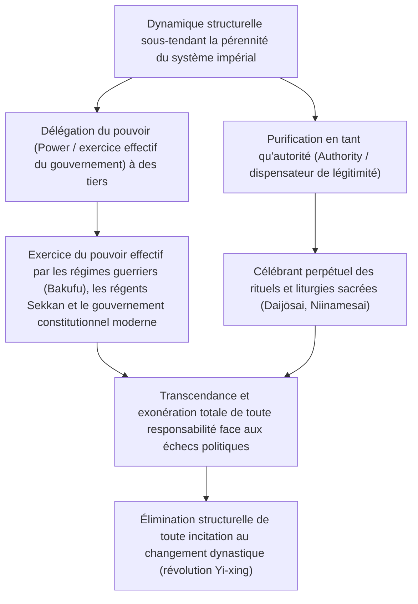
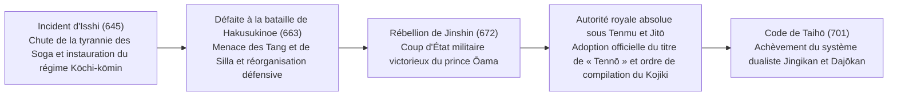
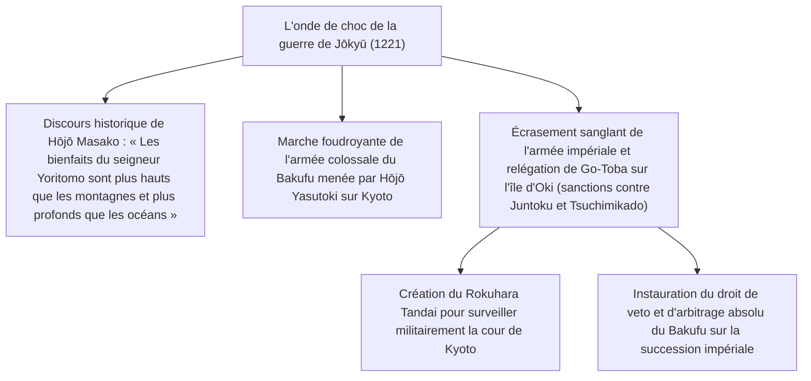
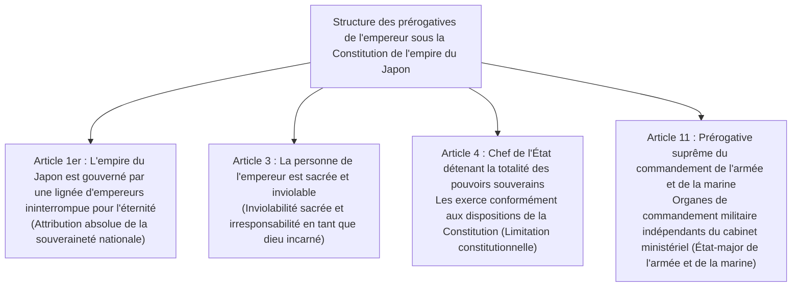
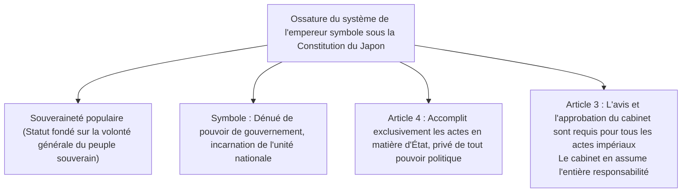
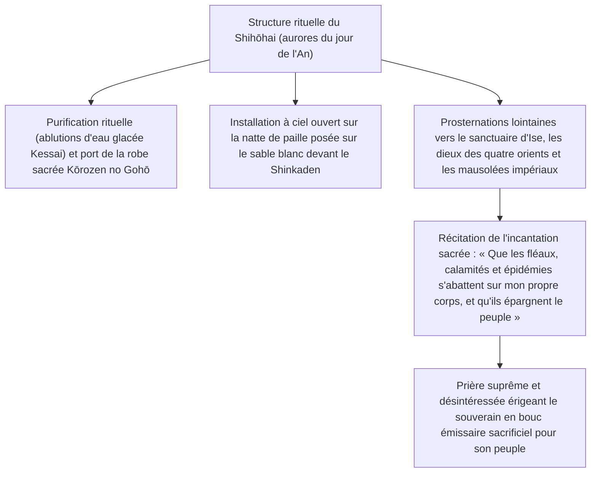
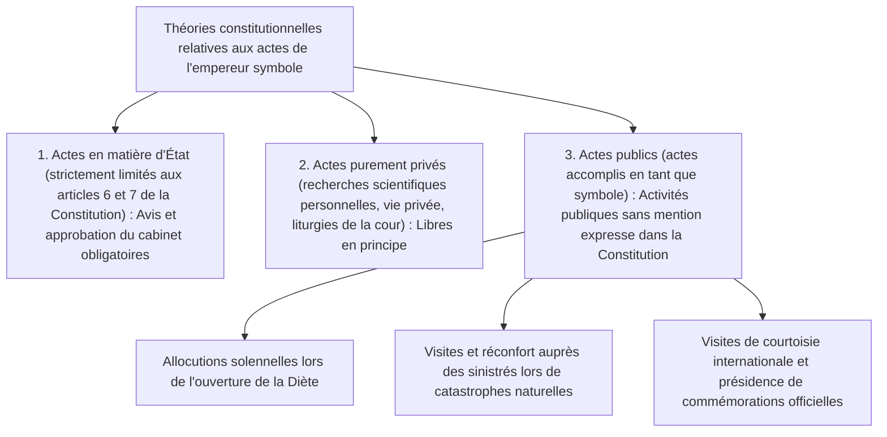

## 1. Introduction : La plus ancienne dynastie héréditaire du monde et la « séparation du pouvoir et de l'autorité »

### 1.1 Le discours du « Bansei Ikkei » et la réalité historico-archéologique

L'histoire de l'empereur du Japon (*Tennō* / *Emperor of Japan*) et de la maison impériale présente une continuité singulière, sans équivalent au sein des familles royales ou dynasties subsistant dans le monde actuel. Elle est d'ailleurs homologuée par le *Livre Guinness des records* comme « la plus ancienne dynastie monarchique héréditaire continue au monde » (*The oldest continuous hereditary monarchy*).

Bien que le discours du « *Bansei Ikkei* » (万世一系 : lignée ininterrompue pour l'éternité), brandi par les études nationales modernes (*Kokugaku*) et proclamé par l'article 1er de la Constitution de l'empire du Japon, soit empreint d'une tonalité idéologique et mythologique, il n'en demeure pas moins un fait historique incontestable au regard de l'historiographie et de l'archéologie empiriques : **depuis au moins la fin du Ve siècle sous l'empereur Yūryaku (le grand roi Wakatakeru) ou le début du VIe siècle sous l'empereur Keitai, une seule et même dynastie royale s'est maintenue sans rupture dans le même espace insulaire pendant plus de 1 500 ans**.

Si l'on examine l'histoire des civilisations mondiales, on constate qu'en Chine, les révolutions par changement de mandat céleste (*Yi-xing* / cycle dynastique) ont régulièrement anéanti les familles impériales régnantes, tandis qu'en Europe, les dynasties se sont succédé à un rythme soutenu — dynasties normande, Plantagenêt, Tudor, Stuart, Hanovre, entre autres. Face à ce constat, pourquoi le Japon est-il le seul pays où une unique lignée royale a pu subsister jusqu'à nos jours sans connaître la moindre rupture dynastique ?



---

### 1.2 La « séparation du pouvoir et de l'autorité » sous le prisme de la civilisation comparée

Comme l'ont souligné des historiens des idées et spécialistes de culture comparée tels que Masao Maruyama ou Ruth Benedict, le trait le plus saillant de la structure de gouvernement dans la civilisation japonaise réside dans **la séparation dualiste rigoureuse entre le « pouvoir politique » (*Power* : puissance militaire, droit de lever l'impôt, administration quotidienne) et l'« autorité ultime » (*Authority* : source de la légitimité, sacralité religieuse et symbolique)**.

Les monarques absolus d'Occident (à l'instar de Louis XIV en France) ou les empereurs autocrates de Chine étaient à la fois les détenteurs effectifs du pouvoir, commandant directement les armées et édictant les décrets, et l'autorité suprême incarnant la loi et l'ordre. Lorsqu'une telle fusion s'opère, la moindre erreur de gouvernance, une défaite militaire ou un bouleversement social majeur retombe directement sur la personne même du souverain, dont la lignée tout entière se voit renversée du trône par la révolte ou l'insurrection.

En revanche, l'empereur du Japon a constamment préservé une structure où **le pouvoir séculier de gouverner (l'autorité effective) était invariablement délégué à des conseillers extérieurs (*Hohitsu*) ou à des maisons guerrières** — depuis les régences du clan Fujiwara à l'époque de Heian (*Sekkan-seiji*), le gouvernement claustral des empereurs retirés depuis Shirakawa-in (*Insei*), les régimes guerriers médiévaux (shogunats de Kamakura, de Muromachi et d'Edo / *Bakufu*), jusqu'aux cabinets ministériels modernes. Même les shoguns des différents shogunats devaient impérativement être investis par l'empereur du titre de *Seii Taishōgun* (grand général pacificateur des barbares) pour asseoir la légitimité de leur domination.

La responsabilité des revers ou des crises politiques incombait systématiquement au shogunat ou au cabinet exerçant le pouvoir effectif, qui finissait renversé par un coup d'État ou une révolution politique. En revanche, l'empereur, en tant que fontaine matricielle de toute légitimité, demeurait au-delà de toute responsabilité politique temporelle. Par conséquent, quelles que fussent les turbulences des époques de guerre civile, aucune incitation ne poussait les prétendants au pouvoir à usurper la position impériale elle-même (c'est-à-dire à exécuter le souverain pour s'emparer du trône céleste).

---

## 2. Formation de l'État antique, émergence du titre de « Tennō » et rituels du Ritsuryō

### 2.1 De l'Okimi (Grand Roi) à la consécration du « Tennō »

À l'époque des Kofun, le chef suprême de la royauté du Yamato régnant sur le centre de l'archipel portait le titre d'« Okimi » (大王 : Grand Roi, ou Ame no Shita Shiroshimesu Okimi, « Grand Roi gouvernant tout sous le Ciel »). L'inscription gravée sur l'épée de fer exhumée du kofun d'Inariyama, dans la préfecture de Saitama, mentionnant le « Grand Roi Wakatakeru » (獲加多支鹵大王, identifié à l'empereur Yūryaku), illustre avec force son statut de primus inter pares à la tête d'une confédération de puissants clans aristocratiques locaux (*Shisei Kizoku*).

À la fin du VIe et au début du VIIe siècle, le prince Shōtoku (prince Umayado) et Soga no Umako, ayant intronisé l'impératrice Suiko, instituèrent le système des douze degrés de bonnets et de rangs de cour (un système de préséance fondé sur le mérite individuel et non plus exclusivement sur le lignage familial) ainsi que la Constitution en dix-sept articles (« L'harmonie est la plus précieuse des vertus », « Révérez les Trois Trésors », « Obéissez scrupuleusement aux décrets impériaux »). Comme en témoigne la célèbre lettre d'État adressée à l'empereur Yangdi de la dynastie Sui — « Le Fils du Ciel du pays où le soleil se lève adresse cette lettre au Fils du Ciel du pays où le soleil se couche ; vous portez-vous bien ? » —, le Japon s'affranchissait du système tributaire sinocentrique (l'ordre de vassalité tributaire) pour proclamer son autonomie en tant que « Fils du Ciel » souverain et d'égal à égal.

Lors de l'**incident d'Isshi (645)**, prélude aux réformes de Taika, le prince Naka no Ōe (futur empereur Tenji) et Nakatomi no Kamatari (fondateur du clan Fujiwara) assassinèrent au sein même du palais l'arrogant despote Soga no Iruka. Ils abolirent l'appropriation privée des terres et des populations par les clans pour proclamer l'idéal du régime *Kōchi-kōmin* (公地公民制 : terres publiques et sujets publics), selon lequel l'ensemble des terres et du peuple appartenaient désormais à l'État et à l'empereur.



---

### 2.2 La rébellion de Jinshin (672) et l'autorité absolue de l'empereur Tenmu

Le tournant le plus décisif de l'histoire du Japon antique fut la guerre civile de succession impériale déclenchée à la mort de l'empereur Tenji : **la rébellion de Jinshin (672)**. Réfugié à Yoshino, le prince Ōama mobilisa les forces militaires des provinces orientales (Mino, Owari), écrasa de manière foudroyante les armées de la cour d'Ōmi conduites par le prince Ōtomo, et monta lui-même sur le trône au palais d'Asuka Kiyomihara (**empereur Tenmu**).

Sous les règnes conjoints de l'empereur Tenmu et de son épouse, l'impératrice Jitō, l'armature institutionnelle de la royauté du Ritsuryō antique fut parachevée :
1. **Adoption officielle du titre de « Tennō »** :
   - Le titre suprême de « Tennō » (天皇), que les historiens rattachent à la divinité suprême du taoïsme *Tennō Taitei* (la divinisation de l'étoile polaire), commença à être formellement employé dans les tablettes de bois (*mokkan*) et les inscriptions épigraphiques.
2. **Adoption du nom de pays « Nihon » (Japon)** :
   - En remplacement de l'ancienne désignation « Wakoku » (倭国), le fier nom national de « Nihon » (日の本 : l'origine du soleil, le pays où le soleil se lève) fut officiellement instauré.
3. **Lancement de la compilation des chroniques historiques et mythologiques** :
   - Par rescrit de l'empereur Tenmu, la codification des traditions orales et généalogies des différents clans fut entreprise, donnant naissance au *Kojiki* (achevé en 712) et au *Nihon Shoki* (achevé en 720), qui ancraient la légitimité inaliénable de la lignée impériale dans sa filiation avec la déesse solaire Amaterasu.

---

### 2.3 La structure profonde des mythes du Kiki et les Trois Regalia sacrés

Le corpus mythologique exposé dans le *Kojiki* et le *Nihon Shoki*, s'étendant de la déesse ancestrale Amaterasu Ōmikami (天照大御神) jusqu'au premier empereur terrestre Jimmu, fournit le fondement religieux et cosmologique de l'autorité impériale.

- **La descente du Petit-Fils céleste et les « Trois grands édits divins »** :
  - Lorsqu'Amaterasu fit descendre son petit-fils Ninigi no Mikoto (瓊瓊杵尊) sur terre, au sommet du mont Takachiho, elle promulgua l'ordre le plus fondamental qui soit : **l'édit divin de la prospérité éternelle du trône, coextensive au Ciel et à la Terre (*Tenjō Mukyū no Shinchoku*)** :
  > « La contrée des mille automnes aux abondants épis de riz dans les plaines de roseaux fertiles est la terre sur laquelle règneront mes descendants. Toi, mon auguste Petit-Fils, va et règne sur elle. Pars, et que la prospérité de ton Trône précieux soit éternelle et sans fin, semblable au Ciel et à la Terre. »
  - Ce mandat constitue une alliance sacrée selon laquelle le droit de régner sur le monde terrestre est concédé à perpétuité au Petit-Fils céleste et à sa postérité par la volonté de la divinité suprême du Ciel.
  - S'y ajoutèrent l'« édit divin de la vénération du Miroir sacré » (*Hōkyō Hōsai no Shinchoku*), intimant de révérer le miroir sacré comme l'âme même d'Amaterasu, et l'« édit divin des épis de riz de la cour sacrée » (*Yuniwa no Inaho no Shinchoku*), commandant de cultiver sur terre le riz issu des rizières sacrées du ciel.
- **Les Trois Trésors sacrés ou Regalia impériaux (*Sanshu no Jingi*)** :
  1. **Le miroir de Yata (*Yata no Kagami*)** : Incarnation de la sagesse suprême et de la sacralité solaire (le corps divin ou *goshintai* réside au sanctuaire intérieur d'Ise / *Naikū*, tandis qu'une réplique sacrée ou *yorishiro* est vénérée au palais impérial).
  2. **Le joyau courbe de Yasakani (*Yasakani no Magatama*)** : Symbole de compassion et de force spirituelle (conservé en permanence dans la salle des insignes impériaux, le *Kenji-no-ma*, au palais impérial).
  3. **L'épée de Kusanagi (*Kusanagi no Tsurugi* / *Ame no Murakumo no Tsurugi*)** : Symbole de vaillance martiale et de courage (le *goshintai* repose au sanctuaire d'Atsuta, tandis qu'une réplique sacrée est conservée au palais impérial).
  - Lors des cérémonies d'avènement de chaque souverain successif, le rituel de transmission des trésors sacrés, le « Kenji-to-Shōkei-no-Gi » (cérémonie de transmission de l'épée, du joyau et des sceaux), a toujours constitué la preuve matérielle et métaphysique irremplaçable de la légitimité du trône impérial.

---

### 2.4 Le dualisme institutionnel du Ritsuryō : Jingikan, Dajōkan et le sacre du Daijōsai

Le système bureaucratique antique institué par le Code de Taihō en 701, bien qu'inspiré du modèle juridique et administratif de la dynastie Tang, introduisit une modification structurelle d'une portée capitale, propre au génie institutionnel japonais.

Alors que dans le système chinois des Tang, les organes chargés du culte et des rituels (*Taichangsi*) étaient subordonnés aux départements exécutifs suprêmes (les trois départements : Shangshu, Zhongshu, Menxia), le régime du Ritsuryō japonais plaça le **« Jingikan » (神祇官 : Département des affaires cultuelles et divines)** sur un pied de parfaite égalité, voire protocolairement supérieur, avec le **« Dajōkan » (太政官 : Grand Conseil d'État)** chargé de l'administration séculière et de la conduite des affaires publiques (système des deux ministères et huit départements, *Ni-kan Hachi-shō*).

La mission quotidienne la plus fondamentale du souverain ne consistait pas dans la gestion administrative ou les décisions d'opportunité politique, mais dans les **« Shinji » (神事 : rituels sacrés, prières adressées aux divinités invisibles)**.
- **Le Niinamesai (新嘗祭)** : Liturgie célébrée chaque année en novembre, au cours de laquelle l'empereur offre aux dieux les prémices du riz récolté durant l'année et les consomme lui-même dans une communion sacrée entre divinités et humains (*Shinjin Kyōshoku*, 神人共食), implorant la paix du royaume et l'abondance des cinq céréales.
- **Le Daijōsai (大嘗祭)** : L'arcane suprême célébré une seule fois par règne, immédiatement après l'avènement au trône d'un nouvel empereur. Dans des pavillons éphémères de bois brut et de chaume construits ex nihilo selon les canons architecturaux de la plus haute antiquité — le pavillon Yuki (*Yuki-den*) et le pavillon Suki (*Suki-den*) —, le souverain passe la nuit entière à offrir les nouvelles récoltes à la déesse ancestrale Amaterasu et aux dieux du Ciel et de la Terre, et à communier avec eux en mangeant ces offrandes. Ce faisant, il accueille en son corps le *Tennō-rei* (天皇霊 : l'esprit sacré de la fonction impériale légué par les ancêtres divins) et s'accomplit comme une régénération spirituelle en souverain sacré.

Quelles que fussent les vicissitudes et les mutations du pouvoir politique séculier, cette fonction de « grand prêtre souverain offrant des prières totalement désintéressées aux divinités pour le salut de la nation » est demeurée le noyau indestructible du système impérial japonais.

---

## 3. La double structure de l'autorité et du pouvoir aux époques médiévale et prémoderne

### 3.1 Le gouvernement Sekkan et l'Insei : La dynamique du pouvoir au sein de la cour

À l'époque de Heian, la structure politique gravitant autour de l'empereur atteignit un degré extrême de sophistication et connut de profondes métamorphoses :

- **Le régime de régence Sekkan du clan Fujiwara (Xe–XIe siècles)** :
  - La branche Hokke des Fujiwara (atteignant son apogée sous Michinaga et Yorimichi) fit entrer ses filles au palais impérial en tant qu'impératrices (*Chūgū*). En faisant introniser dès leur plus jeune âge les princes impériaux nés de ces unions, les patriarches Fujiwara devinrent les grands-pères maternels (*Gaiseki*) des empereurs et assumèrent les charges suprêmes de régent (*Sesshō* pendant la minorité impériale) et de grand chancelier (*Kampaku* après la majorité).
  - Sans jamais usurper l'autorité impériale, ils monopolisèrent de fait l'ensemble des nominations administratives et les décisions d'État par le truchement de leur statut de parenté maternelle.
- **L'avènement du gouvernement claustral (*Insei*, fin du XIe siècle)** :
  - En 1086, l'empereur Shirakawa abdiqua en faveur de son jeune fils, l'empereur Horikawa, pour prendre le titre d'empereur retiré (*Jōkō* ou *Daijō Tennō*) et établit hors du palais officiel son propre quartier général administratif, l'« Incho » (院庁).
  - En qualité de « Chiten no Kimi » (治天の君 : maître du gouvernement sous le Ciel et patriarche de la maison impériale), Shirakawa écarta la tutelle des régents Fujiwara pour reconquérir l'exercice effectif du pouvoir. En prononçant ses vœux bouddhistes pour devenir empereur cloîtré (*Hōō*), le souverain retiré s'émancipait des pesantes contraintes confucéennes et rituelles du Code Ritsuryō pesant sur l'empereur régnant, exerçant un pouvoir autocratique sans entraves.

---

### 3.2 L'émergence des régimes guerriers et la guerre de Jōkyū (1221)

Dans la seconde moitié du XIIe siècle, après l'anéantissement du clan Taira, Minamoto no Yoritomo fonda le **shogunat de Kamakura (*Kamakura Bakufu*)** dans les contrées orientales du Japon.
Yoritomo obtint de la cour impériale le titre officiel de *Seii Taishōgun*, ainsi que le rescrit de l'ère Bunji (1185) autorisant l'établissement des gouverneurs militaires provinciaux (*Shugo*) et des intendants terriens (*Jitō*) dans tout le pays. C'est ainsi que s'instaura la domination duelle dite *Kōbu* (公武二元支配), partageant l'archipel entre la cour aristocratique de Kyoto à l'ouest (*Kuge*) et le gouvernement guerrier de Kamakura à l'est (*Buke*).

Afin d'inverser ce basculement irréversible en faveur des guerriers, un souverain retiré doté d'une formidable vigueur politique et artistique, **l'empereur retiré Go-Toba**, tenta un coup de poker magistral pour restaurer la prééminence impériale.
En 1221, Go-Toba promulgua un décret claustral (*Inzen*) ordonnant la mise au ban et l'extermination du régent du shogunat de Kamakura, Hōjō Yoshitoki, appelant les guerriers de tout le pays à se soulever sous l'étendard impérial : ce fut **la guerre de Jōkyū (*Jōkyū no Ran*)**.



L'issue de la guerre de Jōkyū fut une victoire écrasante pour la classe guerrière. En foulant publiquement aux pieds le décret sacré de la cour impériale et en condamnant à l'exil le *Chiten no Kimi* lui-même, les guerriers mirent crûment en lumière une vérité implacable : dépourvue de puissance militaire propre, la cour était impuissante face aux armes du Bakufu. Le shogunat s'arrogea dès lors un droit d'intervention direct et contraignant dans la désignation des empereurs, finissant par imposer plus tard l'alternance obligatoire sur le trône entre la lignée du Daikaku-ji (future cour du Sud) et celle du Jimyō-in (future cour du Nord) — régime connu sous le nom de *Ryōtō Tetsuritsu* (両統迭立).

---

### 3.3 La restauration de Kenmu et les tourments de l'époque du Nanbokuchō

En 1333, l'empereur Go-Daigo mobilisa des chefs de clans guerriers d'envergure tels qu'Ashikaga Takauji, Nitta Yoshisada et Kusunoki Masashige pour anéantir le shogunat de Kamakura et inaugura la **restauration de Kenmu (*Kenmu no Shinsei*)**, instaurant le gouvernement personnel direct de l'empereur.

Néanmoins, méprisant les revendications légitimes de récompenses terriennes des guerriers et imposant un favoritisme anachronique envers la noblesse de cour couplé à un absolutisme archaïsant, ce nouveau régime s'effondra en à peine plus de deux ans. Entré en dissidence, Ashikaga Takauji intronisa à Kyoto l'empereur Kōmyō (de la lignée du Jimyō-in) et fonda le shogunat de Muromachi, contraignant Go-Daigo à s'enfuir dans les montagnes sauvages de Yoshino pour y proclamer la légitimité exclusive de son trône.

S'ouvrit alors, pendant près de six décennies, **l'époque des cours du Nord et du Sud (*Nanbokuchō-jidai*, 1336–1392)**, une longue guerre civile déchirant le pays entre la **Cour du Nord** à Kyoto et la **Cour du Sud** à Yoshino. En 1392, grâce à la médiation du troisième shogun de Muromachi, Ashikaga Yoshimitsu, fut conclu le « pacte de l'ère Meitoku » scellant la réunification des deux cours : l'empereur Go-Kameyama de la Cour du Sud transmit les Trois Regalia sacrés à l'empereur Go-Komatsu de la Cour du Nord. (Bien que la lignée généalogique des empereurs actuels descende sans discontinuer de la Cour du Nord à partir de Go-Komatsu, la légitimité historique officielle fut formellement attribuée, à partir de l'ère Meiji, à la Cour du Sud qui avait continuellement conservé les authentiques Regalia).

Au faîte de la puissance de Muromachi, Ashikaga Yoshimitsu se fit investir du titre de « roi du Japon » (*Nihon Kokuō*) par l'empereur Yongle de la dynastie Ming et envisagea même de faire monter son propre fils sur le trône céleste, apparaissant comme la figure historique qui frôla de plus près l'« usurpation du trône impérial » ; toutefois, sa mort soudaine mit un terme définitif à cette ambition.

---

### 3.4 Les lois sur la cour et la noblesse du shogunat Tokugawa et la prescription des « études académiques »

Durant le chaos de l'époque Sengoku (l'époque des provinces en guerre), les finances de la cour impériale sombrèrent dans une indigence extrême, au point qu'un souverain comme l'empereur Go-Nara en fut réduit à calligraphier de sa propre main des poèmes *waka* et le *Sūtra du Cœur* (*Hannya Shingyō*) pour les vendre afin de subvenir aux dépenses quotidiennes du palais. Pour autant, aucun des trois grands unificateurs du pays — Oda Nobunaga, Toyotomi Hideyoshi et Tokugawa Ieyasu — ne songea à abolir l'institution impériale ; ils rivalisèrent au contraire de libéralités foncières et financières, sollicitant avec ferveur les titres de grand chancelier (*Kampaku*), de ministre des Affaires suprêmes (*Dajō Daijin*) ou de grand général pacificateur (*Seii Taishōgun*) pour étayer la légitimité souveraine de leur domination.

Ayant parachevé l'unification du Japon, Tokugawa Ieyasu promulgua en 1615 un corpus juridique contraignant la cour de manière absolue : **les Lois sur la cour et la noblesse impériale (*Kinchū narabini Kuge Shohatto*, 17 articles)**. Dès l'ouverture, l'article 1er stipulait sans ambiguïté :

> **« De toutes les compétences que doit cultiver le Fils du Ciel, la première et fondamentale est l'étude académique (*O-gakumon*). »**

La finalité politique sous-jacente de cette disposition était d'un cynisme et d'une lucidité redoutables : le rôle exclusif assigné à l'empereur devait être l'érudition classique, la poésie *waka* et la maîtrise des précédents protocolaires ancestraux (*Yūsoku Kojitsu*), toute immixtion dans les affaires politiques ou militaires lui étant formellement et irrémédiablement proscrite.
Comme l'illustra de façon éclatante l'incident des robes pourpres (*Shie Jiken*, 1629) — où le Bakufu annula unilatéralement les décrets impériaux octroyant les prestigieuses robes de soie pourpre à de vénérables bonzes sans l'accord préalable du shogunat, entraînant l'abdication subite et indignée de l'empereur Go-Mizunoo —, les empereurs de l'époque d'Edo furent confinés au plus profond du palais impérial de Kyoto, dépouillés du moindre millimètre de pouvoir temporel effectif, et transformés en figures purement rituelles, cérébrales et symboliques, parfaitement neutralisées et privées de toute nuisance politique.

---

## 4. La Restauration de Meiji et la création de l'État moderne du « Dieu incarné » (*Arahitogami*)

### 4.1 Du mouvement Sonno Joi à la Restauration impériale (*Ōsei Fukko*)

À partir du milieu de l'époque d'Edo, sous l'impulsion de la monumentale entreprise de rédaction du *Dai Nihonshi* par le domaine de Mito et de l'éclosion des études nationales (*Kokugaku*, notamment avec Motoori Norinaga), la doctrine loyaliste impériale (*Sonnō*) gagna en profondeur la classe des samouraïs, soutenue par la théorie de la délégation du gouvernement (*Taisei Inin-ron*), selon laquelle le shogun n'exerçait la souveraineté temporelle que par mandat révocable confié par l'empereur.

À partir de 1853, lorsque l'arrivée des « Vaisseaux noirs » du commodore Perry révéla au grand jour l'incapacité criante du shogunat Tokugawa à faire face à la menace étrangère, la ferveur du mot d'ordre « Révérer l'Empereur, expulser les barbares » (*Sonnō Jōi*) enflamma les jeunes samouraïs et patriotes idéalistes (*Shishi*). L'empereur Kōmei promulgua des décrets impériaux ordonnant l'expulsion des étrangers, et les puissants domaines de Satsuma et de Chōshū firent de la cour de Kyoto le centre gravitationnel incontesté de l'opposition politique.

En octobre 1867, le 15e shogun, Tokugawa Yoshinobu, remit formellement le gouvernement à la cour impériale (*Taisei Hōkan*). Le 9 décembre de la même année, sous l'impulsion décisive de nobles de cour comme Iwakura Tomomi et de chefs militaires comme Saigō Takamori de Satsuma, fut proclamé le **Grand Rescrit de restauration impériale (*Ōsei Fukko no Daigōrei*)** :
- Abolition définitive du shogunat, des charges de régent (*Sesshō*) et de grand chancelier (*Kampaku*).
- Proclamation d'un retour aux origines fondatrices du premier empereur Jimmu et établissement d'un nouveau gouvernement dirigé personnellement par le souverain.
- Le jeune empereur Meiji, âgé de seize ans, monta sur le trône ; la cité d'Edo fut rebaptisée « Tokyo » (la capitale de l'Est), et la résidence impériale fut officiellement transférée de Kyoto au château de Tokyo (l'ancienne forteresse d'Edo).

---

### 4.2 Le dualisme constitutionnel de la Constitution de l'empire du Japon (Constitution de Meiji, 1889)

Les oligarques fondateurs de Meiji (*Genrō*), sous la houlette d'Itō Hirobumi, rédigèrent la **Constitution de l'empire du Japon**, prenant pour modèle principal le constitutionnalisme prussien et allemand tout en l'adaptant méticuleusement aux réalités nationales et traditionnelles de l'archipel.



Au sein du système constitutionnel de Meiji, la figure de l'empereur revêtait une « duplicité » ou ambivalence structurelle hautement sophistiquée :
1. **Dimension traditionnelle et religieuse** : L'empereur était le descendant direct des divinités du Ciel, la source matricielle de la morale civique et un « dieu incarné » (*Arahitogami*, 現人神) sacré et inviolable.
2. **Dimension moderne et constitutionnaliste** : L'empereur était un monarque constitutionnel exerçant les droits de la souveraineté « conformément aux dispositions de la présente Constitution » ; il ne pouvait gouverner en despote absolu, l'exercice du pouvoir exécutif exigeant l'« assistance » (*Hohitsu*, 輔弼) des ministres d'État (article 55), tandis que le pouvoir législatif nécessitait le consentement de la Diète impériale.

Durant l'ère Taishō, la célèbre **« théorie de l'empereur-organe » (*Tennō Kikan-setsu*)**, formulée par le professeur de droit public à l'université impériale de Tokyo Tatsukichi Minobe — postulant que l'État est une personne morale dont l'empereur est l'organe suprême, la souveraineté appartenant ultimement à la personnalité juridique de l'État —, devint le soubassement doctrinal et constitutionnel du gouvernement parlementaire partisan durant la démocratie de Taishō.

Toutefois, la Constitution de Meiji renfermait une faille structurelle fatale : **l'article 11 instituant l'« indépendance du haut commandement militaire » (*Tōsuiken no Dokuritsu*)**, selon lequel la direction stratégique et opérationnelle de l'armée et de la marine n'était soumise à aucune assistance ministérielle du cabinet, les états-majors relevant directement et exclusivement de la personne sacrée de l'empereur. Dès lors qu'au cours de l'ère Shōwa, les factions militaires utilisèrent cette prérogative suprême comme un bouclier impénétrable pour s'émanciper totalement du contrôle du gouvernement civil et du parlement, les digues du constitutionnalisme volèrent en éclats.

---

## 5. Les tourments de l'ère Shōwa, la défaite et la métamorphose radicale vers le « système de l'empereur symbole »

### 5.1 Le cataclysme des débuts de Shōwa et la « Décision sacrée » (*Seidan*) mettant fin à la guerre

Durant les années 1930, à travers la controverse sur l'empiètement sur les prérogatives du commandement militaire, l'incident du 15 mai 1932 et la tentative de coup d'État du 26 février 1936, le régime des partis s'éteignit, entraînant le Japon dans la dictature militaire, l'enlisement tragique de la guerre sino-japonaise, puis l'embrasement de la guerre du Pacifique en 1941.

Le shintoïsme d'État fut dogmatisé à son paroxysme, et le peuple fut endoctriné dans l'idée que « sacrifier sa vie pour l'empereur » représentait la vertu civique suprême. Pourtant, l'empereur Shōwa lui-même vécut un déchirement perpétuel, écartelé entre sa fidélité à son rôle de monarque constitutionnel incapable de s'opposer formellement aux décisions conjointes du cabinet et des chefs d'état-major, et ses prières intimes pour le rétablissement de la paix.

En août 1945, face aux bombardements atomiques d'Hiroshima et de Nagasaki et à l'entrée en guerre de l'Union soviétique, le Conseil suprême de direction de la guerre se divisa à égalité parfaite entre les partisans de la reddition conditionnée à la « préservation du Kokutai » (la pérennité de la maison impériale) et les jusqu'au-boutistes exigeant la résistance acharnée jusqu'au sacrifice collectif des cent millions de sujets (*Ichioku Sōgyokusai*).
Lors des conférences impériales (*Gozen Kaigi*) tenues les 10 et 14 août dans un abri antiaérien souterrain du palais, sollicité par le Premier ministre Kantarō Suzuki pour trancher cette impasse tragique, l'empereur Shōwa, les yeux baignés de larmes, rendit son historique **« Décision sacrée » (*Seidan*, 聖断)** :

> **« Mon devoir sacré est de sauver le peuple. Quel que soit le sort réservé à ma propre personne, je ne puis tolérer plus longtemps de voir mes sujets périr sous le feu des combats et la civilisation humaine sombrer dans l'anéantissement. […] Prêt à endurer l'inendurable et à souffrir ce qui est insouffrable, j'ai pris la décision irrévocable de mettre un terme à la guerre. »**

Le 15 août à midi, par la diffusion radiophonique de la « Voix du Joyau » (*Gyokun Hōsō*, le rescrit impérial de cessation des hostilités), la guerre prit fin. Les historiens s'accordent à reconnaître que sans cette intervention impériale directe et inédite, la bataille sur le sol métropolitain aurait provoqué le massacre de millions de vies supplémentaires.

---

### 5.2 L'entrevue historique avec MacArthur et l'exonération du procès de Tokyo

Au lendemain de la capitulation, le commandement suprême des forces alliées (GHQ) dirigé par le général Douglas MacArthur s'installa au Japon. Une large part des opinions publiques des nations alliées — notamment aux États-Unis, en Grande-Bretagne et en Union soviétique — exigeait que l'empereur Shōwa fût jugé et exécuté comme « criminel de guerre en chef » et que le système impérial fût purement et simplement aboli.

Le 27 septembre 1945, l'empereur Shōwa se rendit en personne à l'ambassade américaine pour y rencontrer MacArthur. Loin d'implorer la grâce pour sa vie, l'empereur déclara, selon les mémoires de MacArthur :

> **« Je suis venu ici m'en remettre entièrement à votre jugement en tant que seul responsable devant l'histoire de toutes les décisions politiques et militaires prises par mon peuple au cours de cette guerre. Peu m'importe ce qu'il adviendra de ma propre vie. Mais je vous en supplie, apportez de la nourriture à mon peuple qui meurt de faim. »**

Profondément bouleversé par la grandeur d'âme et l'abnégation absolue du souverain, MacArthur arrêta définitivement la ligne directrice de sa politique d'occupation : maintenir l'institution impériale et exclure toute poursuite pénale contre l'empereur lors du tribunal militaire international de Tokyo. Il avait acquis la conviction que l'exécution du souverain embraserait l'archipel dans une guérilla insurrectrice impliquant des millions de Japonais, rendant impossible toute administration pacifique des forces alliées.

Le 1er janvier 1946, l'empereur Shōwa promulgua le **Rescrit impérial sur la reconstruction d'un nouveau Japon (connu sous le nom de « Déclaration d'humanité » / *Ningen Sengen*)**, proclamant solennellement que les liens unissant l'empereur à son peuple ne reposaient pas sur des mythes chimériques ou l'illusion d'une divinité incarnée (*Arahitogami*), mais sur la confiance mutuelle et le respect partagé.

---

### 5.3 L'article 1er de la Constitution du Japon : L'institution du « système de l'empereur symbole »

Promulguée et entrée en vigueur le 3 mai 1947, la **Constitution du Japon** redéfinit de fond en comble le statut juridique de l'empereur dès son premier article :

> **Article 1er : « L'Empereur est le symbole de l'État et de l'unité du peuple, tenant sa position de la volonté du peuple en qui réside le pouvoir souverain. »**



- **Dépouillement total de tout pouvoir de gouvernement** : L'empereur cessa d'être le souverain gouvernant ou le monarque autocrate pour devenir le « symbole » (*Symbol*) incarnant l'existence même de l'État et l'unité vivante de la nation.
- **Interdiction formelle de toute immixtion politique (article 4)** : Il n'accomplit strictement que les « actes en matière d'État » (*Kokuji-kōi*) limitativement et formellement énumérés par la Constitution (convocation de la Diète, nomination du Premier ministre et du président de la Cour suprême sur désignation respective du Parlement et du Cabinet, promulgation des lois, ratification des traités, octroi des distinctions honorifiques), sans pouvoir exercer la moindre prérogative relative au gouvernement.
- **Avis et approbation obligatoires du Cabinet (article 3)** : Chacun de ses actes en matière d'État requiert impérativement l'avis préalable et l'approbation du Cabinet ministériel, qui en assume l'entière et exclusive responsabilité politique et juridique devant la Diète.

Bien que ce « système de l'empereur symbole » (*Shōchō Tennō-sei*) ait souvent été perçu comme un dispositif exogène imposé unilatéralement par les forces d'occupation américaines, il peut tout aussi bien s'interpréter, à la lumière de la longue histoire séculaire du Japon que nous avons retracée, comme **le retour le plus pur et le plus authentique à la structure traditionnelle médiévale : celle où l'empereur s'abstient rigoureusement d'exercer le pouvoir politique séculier pour se consacrer tout entier à la transcendance de l'autorité morale et au sacerdoce de la prière perpétuelle**.

---

## 2.5 Structure rituelle des liturgies impériales et dynamique spirituelle du « Shihōhai »

Pour appréhender la nature véritable de l'empereur, il est indispensable de pénétrer les arcanes des **« liturgies de la cour impériale » (*Kyūchū Saishi* / *Imperial Court Rituals*)**, transmises sans interruption au sein de la maison impériale comme un domaine strictement privé, totalement dissocié des « actes en matière d'État » définis par la Constitution du Japon.

Nichés au cœur de la forêt luxuriante du domaine de Fukiage au palais impérial se dressent les **« Trois Sanctuaires du Palais » (*Kyūchū Sanden*)** :
1. **Le Kashiko-dokoro (賢所)** : Abrite la réplique sacrée (*yorishiro*) du miroir de Yata, corps divin (*goshintai*) de la déesse ancestrale Amaterasu Ōmikami.
2. **Le Kōrei-den (皇霊殿)** : Consacré aux esprits ancestraux de tous les empereurs successifs depuis l'empereur Jimmu ainsi qu'aux membres défunts de la famille impériale.
3. **Le Shin-den (神殿)** : Consacré aux divinités du Ciel et de la Terre (*Tenjin Chigi*, les huit millions de kamis).

Tout au long de l'année, l'empereur préside personnellement plusieurs dizaines de rituels solennels. Parmi eux, la liturgie la plus bouleversante sur le plan spirituel est le **« Shihōhai » (四方拝 : l'Adoration des quatre orients)**, célébré aux aurores du jour de l'An (vers 5 h 30 du matin), dans le froid glacial de l'hiver.



Après s'être purifié à l'eau glacée, revêtu de la robe cérémonielle archaïque de couleur brun-roux (*Kōrozen no Gohō*), l'empereur prend place à ciel ouvert sur une natte de paille étendue sur le sable blanc immaculé. Il s'incline profondément et récite des prières en direction du grand sanctuaire d'Ise, des montagnes, fleuves et divinités des quatre points cardinaux, ainsi que des mausolées de ses prédécesseurs. Il prononce alors l'incantation rituelle consignée dans les livres de cérémonies de l'époque de Heian :
> **« Si les violences, les fléaux, les épidémies et les calamités des eaux et du feu doivent frapper le peuple, qu'ils traversent et frappent d'abord mon propre corps ! »**

S'offrir soi-même aux dieux comme « l'ultime substitut sacrificiel » (le bouc émissaire absolu) destiné à absorber tous les désastres menaçant la nation et le peuple : loin de tout désir d'exercer un pouvoir dominateur sur autrui, c'est cette spiritualité sacrificielle absolue consistant à s'annihiler soi-même pour prier pour le bonheur d'autrui qui constitue le champ magnétique inconscient par lequel l'autorité de l'empereur s'est gravée dans la psyché profonde du peuple japonais à travers les millénaires.

---

## 3.5 Réalité historique des impératrices régnantes et analyse critique de la thèse du « règne transitoire »

Dans les débats contemporains sur la succession au trône, on invoque constamment le précédent historique des **« huit souveraines pour dix règnes » (*Hachihō Jūdai no Josei Tennō*)** ayant régné au cours de l'histoire du Japon.

| Rang dynastique | Nom de l'impératrice | Années de règne | Contexte d'accession et accomplissements historiques |
| :---: | :--- | :---: | :--- |
| **33e souverain** | **Impératrice Suiko** | 592–628 | Intronisée comme première impératrice régnante pour résoudre la crise consécutive à l'assassinat de l'empereur Sushun. En concertation avec le prince Shōtoku et Soga no Umako, elle institua les douze rangs de cour et la Constitution en dix-sept articles. |
| **35e / 37e souverain** | **Impératrice Kōgyoku / Impératrice Saimei** | 642–645 / 655–661 | Double règne (*Chōso*). Témoin direct de l'incident d'Isshi. Sous le nom de Saimei, elle mena personnellement l'expédition militaire vers Kyūshū en vue de la bataille de Hakusukinoe, où elle s'éteignit en campagne. |
| **41e souverain** | **Impératrice Jitō** | 690–697 | Impératrice consort de l'empereur Tenmu. Poursuivant l'œuvre de son défunt époux, elle édifia la capitale de Fujiwara-kyō, promulgua le code d'Asuka Kiyomihara et transmit le trône en toute sécurité à son petit-fils, l'empereur Monmu. |
| **43e souverain** | **Impératrice Genmei** | 707–715 | Transfert de la capitale à Heijō-kyō (Nara, 710), achèvement du *Kojiki*, ordonnance de compilation du *Fudoki*. |
| **44e souverain** | **Impératrice Genshō** | 715–724 | Fille de l'impératrice Genmei (unique cas de succession directe d'une mère à sa fille dans l'histoire impériale). Achèvement du *Nihon Shoki*, promulgation de la loi sur les concessions foncières pour trois générations (*Sansei Isshin no Hō*). |
| **46e / 48e souverain** | **Impératrice Kōken / Impératrice Shōtoku** | 749–758 / 764–770 | Fille de l'empereur Shōmu. Double règne. Réprima la rébellion de Fujiwara no Nakamaro et accorda sa confiance au moine Dōkyō. Déjoua la tentative d'usurpation du trône par Dōkyō lors de l'incident de l'oracle du sanctuaire d'Usa Hachiman. |
| **109e souverain** | **Impératrice Meishō** | 1629–1643 | Début de l'époque d'Edo. Intronisée après l'abdication soudaine de l'empereur Go-Mizunoo en protestation contre le shogunat lors de l'incident des robes pourpres (petite-fille maternelle du shogun Tokugawa Hidetada). |
| **117e souverain** | **Impératrice Go-Sakuramachi** | 1762–1770 | Milieu de l'époque d'Edo. Assura la régence et le règne après le décès prématuré de l'empereur Momozono jusqu'à ce que le jeune empereur Go-Momozono atteigne l'âge de gouverner. Dernière impératrice régnante de l'époque prémoderne. |

L'analyse historico-critique met en évidence un fait fondamental indiscutable : **toutes les impératrices régnantes du passé étaient des « descendantes de lignée agnatique » (*Dankeijoshi*), c'est-à-dire que leur père biologique était lui-même un empereur** (il n'existe aucun exemple historique d'une souveraine ayant épousé un roturier ou un prince issu d'une autre dynastie pour transmettre le trône impérial à une descendance utérine / matrilinéaire).

De surcroît, la plupart d'entre elles montèrent sur le trône dans des contextes de crise aiguë — minorité du prince héritier légitime ou vide politique brutal causé par la disparition soudaine du prédécesseur — en qualité d'aînées prestigieuses de la maison impériale, jouant un rôle de « souveraine de transition » (*Nakatsugi* / régente palliative) pour conjurer les guerres de succession avant de transmettre le sceptre au mâle de lignée patrilinéaire de la génération suivante.

Toutefois, il est tout aussi indéniable que des figures souveraines telles que les impératrices Suiko ou Jitō ont largement dépassé le statut de simples souveraines d'intérim en déployant une autorité politique remarquable et en parachevant l'armature de l'État antique. Dans le Japon ancien, la tradition du système « Hime-Hiko » — où le charisme sacerdotal et chamanique de la femme en communication avec les divinités (*Miko*) complétait l'exercice du pouvoir séculier et guerrier de l'homme — a largement favorisé l'acceptation naturelle de femmes sur le trône impérial.

---

## 4.6 L'invention du shintoïsme d'État et l'acrobatie philosophico-juridique de la « non-religiosité des sanctuaires »

Le défi le plus ardu auquel se heurta le gouvernement de la Restauration de Meiji fut de concevoir le principe d'intégration spirituelle et civique d'un État-nation moderne (*Nation-State*) capable de rivaliser avec les puissances impérialistes occidentales.

### ① La tempête du Haibutsu Kishaku et la séparation du shinto et du bouddhisme
Le gouvernement de Meiji déchira violemment le syncrétisme shinto-bouddhique (*Shinbutsu Shūgō*) — qui unissait et fusionnait harmonieusement les deux cultes depuis plus d'un millénaire à travers la théorie du *Honji Suijaku* (selon laquelle les bouddhas se manifestent au Japon sous la forme des kamis autochtones) — en promulguant dès 1868 les **« édits de séparation du shinto et du bouddhisme » (*Shinbutsu Hanzen-rei*)**.
Il en résulta une violente vague iconoclaste de persécutions antibouddhiques connue sous le nom de **« Haibutsu Kishaku » (廃仏毀釈 : abolition du bouddhisme et destruction de ses attributs)** : des statues sacrées furent fracassées, des canons d'écritures saintes brûlés et des pagodes rasées dans tout le pays. Bien que le gouvernement eût initialement tenté d'ériger le shintoïsme en religion d'État à travers le « mouvement de promulgation de la Grande Doctrine » (*Taikyō Senpu Undō*), cette entreprise se solda par un échec cuisant face à l'attachement viscéral du peuple à la foi bouddhique et aux vives protestations diplomatiques des puissances occidentales dénonçant l'atteinte à la liberté religieuse.

### ② La fiction supra-juridique de la « non-religiosité des sanctuaires »
C'est alors que les architectes institutionnels de Meiji (au premier rang desquels Kowashi Inoue) forgèrent un artifice doctrinal et juridique sans équivalent : la fiction idéologique de la **« non-religiosité du shinto des sanctuaires » (*Jinja Hi-shūkyō-ron*)**.
- L'article 28 de la Constitution de l'empire du Japon garantissait formellement la « liberté de croyance religieuse », reconnaissant le christianisme et le bouddhisme comme des fois privées relevant de la conscience individuelle.
- Parallèlement, l'État décréta que « les sanctuaires shinto (tels que le grand sanctuaire d'Ise ou le sanctuaire Yasukuni) et leurs liturgies ne constituaient nullement une religion, mais **des devoirs publics de morale civique et des rituels nationaux de vénération des ancêtres** auxquels l'ensemble des sujets devaient obligatoirement participer ».
- En vertu de cette dissociation artificielle, aucun sujet impérial, qu'il fût fervent chrétien ou dévot bouddhiste, ne pouvait refuser de visiter les sanctuaires shinto ni de rendre hommage à l'empereur sans être accusé de trahison civique. C'est ainsi que fut édifié l'espace transcendant et supra-religieux du « shintoïsme d'État » (*State Shinto*). Cette acrobatie philosophique allait constituer le terreau institutionnel de la dérive militariste ultérieure de l'ère Shōwa et de l'apothéose belliciste du « Dieu incarné » (*Arahitogami*).

---

## 5.5 Jurisprudence constitutionnelle et délimitations du système de l'empereur symbole

Le système de l'empereur symbole instauré par la Constitution du Japon a affiné et précisé son interprétation juridique à travers une succession d'intenses débats constitutionnels et de décisions judiciaires majeures.



### ① La consécration doctrinale des « actes à caractère public » (actes en tant que symbole)
L'article 4, alinéa 1er de la Constitution dispose que « l'Empereur n'accomplit que les seuls actes en matière d'État prévus par la présente Constitution ». Selon une interprétation littérale stricte, toute activité publique étrangère aux actes d'État formels (visites de solidarité aux populations sinistrées, accueil protocolaire des chefs d'État étrangers, discours prononcés lors de la session inaugurale de la Diète) risquerait d'être entachée d'inconstitutionnalité.
La jurisprudence constitutionnelle et la doctrine gouvernementale ont toutefois résolu cette aporie en posant que « dès lors que l'empereur jouit du statut de symbole de l'État et de l'unité du peuple, il est naturellement habilité à accomplir des **« actes à caractère public » (*Kōteki Kōi* : actes accomplis en sa qualité de symbole)** conformes à cette position », leur constitutionnalité demeurant garantie pour autant qu'ils s'exercent sous le contrôle politique, l'avis effectif et la responsabilité solidaire du Cabinet ministériel.

### ② La séparation de la religion et de l'État (articles 20 et 89 de la Constitution) et les liturgies impériales
Une vive controverse constitutionnelle s'est nouée autour de la question de savoir si les cérémonies sacrées du shinto impérial, telles que le Niinamesai ou le Daijōsai, devaient être financées sur les deniers publics de l'État (les dépenses de la cour impériale, *Kyūtei-hi*) ou prélevées sur la cassette privée de la famille impériale (*Naitei-hi*).
En application du « critère du but et des effets » dégagé par la Cour suprême du Japon (notamment dans les célèbres arrêts sur le rituel de purification du sol de Tsu et sur l'offrande de branches sacrées Tamagushi d'Ehime) — examinant si l'acte litigieux poursuit une finalité confessionnelle prépondérante et si ses effets tendent à soutenir, opprimer ou favoriser une religion particulière —, il fut jugé lors des intronisations impériales des ères Heisei et Reiwa que le Daijōsai constituait « un rituel dynastique et traditionnel fondamental revêtu d'une portée publique solennelle », rendant ainsi son financement sur fonds publics (frais de la cour impériale) pleinement constitutionnel.

## 6. L'exercice contemporain du rôle de symbole et les débats sur la succession impériale

### 6.1 Les pèlerinages de l'ère Heisei et l'aboutissement de l'abdication

Ce sont le 125e empereur (l'actuel empereur retiré Akihito / *Jōkō*) et l'impératrice émérite Michiko qui donnèrent une substance humaine et chaleureuse au système de l'empereur symbole.
S'interrogeant inlassablement sur ce que devait être l'incarnation vivante du « symbole », le souverain d'Heisei se rendit personnellement dans toutes les régions meurtries par des catastrophes naturelles (éruption du mont Unzen-Fugendake, grand séisme de Hanshin-Awaji à Kobe, séisme et tsunami du 11 mars 2011 dans le Tōhoku), s'agenouillant à même le sol des gymnases d'évacuation pour regarder les sinistrés dans les yeux, leur serrer les mains et leur insuffler du réconfort. De même, le couple impérial multiplia les « pèlerinages de mémoire et de recueillement » à Okinawa, Hiroshima, Nagasaki, ainsi que sur les théâtres sanglants de la guerre du Pacifique à Saipan, Peleliu dans l'archipel des Palaos et aux Philippines, élevant des prières ferventes pour conjurer l'oubli des tragédies du passé.

Le 8 août 2016, l'empereur diffusa un message vidéo sans précédent adressé directement à la nation (« expression de ses sentiments intimes »), faisant part de son angoisse face à son grand âge qui risquait d'entraver l'accomplissement de ses devoirs de symbole de toute son âme et de toutes ses forces. En réponse à cette allocution, la Diète promulgua en 2017 la « loi d'exception sur la maison impériale ». Le 30 avril 2019, la première abdication impériale du vivant du souverain depuis celle de l'empereur Kōkaku à l'époque d'Edo, deux siècles plus tôt, s'accomplit pacifiquement : le prince héritier Naruhito monta sur le trône comme 126e empereur, ouvrant l'ère « Reiwa ».

---

### 6.2 Problématiques constitutionnelles et législatives contemporaines autour de la succession impériale

Au XXIe siècle, le défi le plus existentiel auquel est confrontée la maison impériale est l'érosion continue du nombre de membres de la famille impériale et le resserrement critique des héritiers éligibles au trône.
L'article 1er de l'actuelle Loi sur la maison impériale dispose que : **« Le trône impérial est transmis aux descendants mâles de lignée masculine appartenant à la lignée impériale (*Dankei Danshi*). »**

À ce jour, la génération cadette ne compte qu'un seul et unique prince héritier dynaste : Son Altesse Impériale le prince Hisahito, plaçant la perpétuation de la dynastie dans une vulnérabilité démographique extrême. Face à cette situation d'urgence, le débat national se polarise autour de trois grandes options stratégiques :

| Option débattue | Contenu de la proposition | Arguments des partisans | Objections et réserves des opposants |
| :--- | :--- | :--- | :--- |
| **① Autorisation des impératrices régnantes (*Josei Tennō*)** | Permettre à une fille d'empereur (une femme) de monter sur le trône (ex. : accession de la princesse Aiko). | L'histoire atteste de huit souveraines pour dix règnes, de Suiko à Go-Sakuramachi. Cette option jouit d'une adhésion écrasante dans l'opinion publique. | Bien qu'admissible tant qu'il s'agit d'une descendante de lignée agnatique (*Dankeijoshi*), certains traditionalistes redoutent que cela n'ouvre la voie à la succession matrilinéaire. |
| **② Autorisation des empereurs de lignée matrilinéaire (*Jokei Tennō*)** | Autoriser l'accession au trône de personnes rattachées à la maison impériale par leur seule mère (enfants d'une impératrice nés d'un époux roturier). | Seule issue pragmatique et pérenne pour conjurer définitivement l'extinction biologique du sang impérial. Conformité avec l'égalité des sexes. | Rupture sans retour avec la tradition bimillénaire de transmission patrilinéaire continue sur 126 générations, perçue comme la perte de la raison d'être ontologique de la monarchie. |
| **③ Réintégration des anciennes branches princières (*Kyū-Miyake*)** | Réintégrer dans la famille impériale, par voie d'adoption légale, les descendants mâles de lignée masculine issus des 11 branches cadettes exclues en 1947 par le GHQ. | Permet de préserver intacte la règle séculaire et immémoriale de la descendance agnatique (*Dankei Danshi*). | Difficulté psychologique pour le peuple d'accepter subitement comme membres de la famille impériale des citoyens ordinaires ayant vécu comme de simples civils depuis près de 80 ans. |

---

## 7. Conclusion : Généalogie de la prière et strate archaïque de la civilisation japonaise

Bien avant d'être une institution politique ou juridique, le système impérial japonais constitue la **« strate culturelle archaïque de la spiritualité et de la prière »** forgée depuis des millénaires par la terre de l'archipel nippon et les hommes qui y habitent.

Sans exhiber l'arrogance d'un pouvoir temporel comme les chefs d'État présidentiels,
Sans étaler d'ostentation matérielle comme les oligarques fortunés,
Dans le recueillement silencieux et sacré des sanctuaires du palais, se purifiant au fil des rituels immuables des quatre saisons,
L'empereur demeure cet être voué exclusivement à élever une prière perpétuelle pour le bonheur du peuple, la paix du monde et l'abondance des moissons.

Les fiers chefs de clans de l'Antiquité, les farouches guerriers samouraïs du Moyen Âge, les bâtisseurs visionnaires de la modernisation de Meiji, et les générations contemporaines ayant relevé le pays des décombres de l'après-guerre se sont tous, à travers les âges, inclinés devant ce foyer désintéressé de prière sacrée.

Si les formes extérieures de l'institution ont su s'adapter avec une infinie plasticité aux métamorphoses de l'histoire — de l'État antique du Ritsuryō aux régimes militaires des shogunats, de l'empire constitutionnel de Meiji au symbole démocratique de l'après-guerre —, la continuité immémoriale de cette sainte liturgie ne s'est pas interrompue une seule seconde.

Dans le tumulte d'un XXIe siècle en mutation permanente, trait d'union vivant reliant les millénaires du passé aux millénaires à venir, la présence souveraine de l'empereur demeure pour le peuple japonais le miroir le plus profond où contempler sa propre identité.

### 2.6 Profondeurs anthropologico-rituelles du Daijōsai : La controverse du « Matoko Ofusuma » de Shinobu Orikuchi et la cosmologie du banquet partagé

Point culminant des cérémonies d'avènement, le Daijōsai (大嘗祭) n'a jamais été une simple fête des récoltes agrandie ; il revêt la nature d'un rite de passage initiatique au cours duquel le nouvel empereur hérite de la puissance spirituelle de la déité ancestrale pour subir une transmutation sacrée en être divinisé. La structure rituelle de cette liturgie a suscité des débats scientifiques passionnés au sein de l'anthropologie, de la science des religions et de l'historiographie modernes.

L'exemple le plus emblématique en est la thèse du « Matoko Ofusuma » (真床追衾) avancée par l'éminent ethnologue et folkloriste Shinobu Orikuchi. Dans son essai fondateur *Le sens fondamental du Daijōsai* (*Daijōsai no Hongi*, 1928), Orikuchi porta son attention sur le « coussin incliné » (*Sakamakura*) et le « lit divin de repos » (*Kamufushido*) aménagés au plus secret des pavillons Yuki-den et Suki-den. Reliant ces éléments au récit mythologique de la descente sur terre où Ninigi no Mikoto descendit enveloppé dans la sainte couverture « Matoko Ofusuma », Orikuchi affirmait que le nouveau souverain s'enveloppait dans cette couverture sur le divan sacré pour faire l'expérience d'une mort simulée et d'une renaissance mystique, permettant à l'âme de la déesse Amaterasu (le *Mitama* impérial) de s'unir et de fusionner avec son corps mortel. Selon cette herméneutique, le Daijōsai était fondamentalement un mystère d'incorporation et de revivification de l'esprit divin (*Tamafuri* et *Tamashizume*).

```
【 Les deux grands courants académiques sur la structure ésotérique du Daijōsai 】

1. La thèse de Shinobu Orikuchi (Théorie de l'initiation par incorporation et renaissance spirituelle)
   ・Concepts clés : « Matoko Ofusuma » (couverture sacrée), « Kamufushido » (lit divin).
   ・Interprétation liturgique : Mystère de transmutation sacrée où le nouveau souverain, par une mort simulée et une renaissance en s'enveloppant dans la couche sacrée, accueille en son corps l'âme de la déesse Amaterasu et des ancêtres impériaux.
   ・Fondements théoriques : Théorie du Marebito (divinité visiteuse) de Kunio Yanagita et d'Orikuchi, anthropologie des îles du Sud (Okinawa), rites de passage des confréries villageoises (Miyaza, Wakamono-gumi).

2. La thèse historico-critique des liturgies de cour (Théorie de la communion agraire et de la commensalité homme-dieu)
   ・Concepts clés : « Shinsen Kensen » (offrande des nourritures divines), « Shinjin Kyōshoku » (communion par le banquet partagé).
   ・Interprétation liturgique : Liturgie agraire où le nouveau monarque offre et consomme en tête-à-tête avec les divinités les prémices du riz, du millet et des sakés sacrés, scellant ainsi l'alliance éternelle et la légitimité du gouvernement terrestre.
   ・Études de référence : Réexamens philologiques et empiriques des registres anciens et de l'Engishiki par Shōji Okada, Isao Tokoro et Tarō Sakamoto.
```

À l'encontre de cette vision, des historiens et spécialistes du shintoïsme tels que Shōji Okada et Isao Tokoro ont procédé à un examen philologique rigoureux des rituels du Daijōsai décrits dans l'empirique *Engishiki* de l'époque de Heian ainsi que dans les chroniques médiévales, démontrant la fragilité textuelle de la conjecture d'Orikuchi. D'après leurs travaux, le cœur battant du Daijōsai réside exclusivement dans le « Shinjin Kyōshoku » (神人共食 : banquet partagé des hommes et des dieux) : au cœur de la nuit, le souverain offre en personne les mets sacrés (*Shinsen* : riz, millet, vins rituels blanc et noir, ormeaux, poissons séchés) aux divinités, avant de consommer rituellement ces mêmes offrandes en leur présence immédiate. En partageant ce repas avec les kamis, il rend grâce pour la fertilité nourricière de la terre et renouvelle le pacte primordial avec les dieux ancestraux. Le lit divin (*Kamufushido*) est en réalité un siège sacré (*Shinza*) destiné au repos de la divinité elle-même, aucun texte ancien n'attestant que l'empereur s'y soit jamais allongé comme dans un cercueil mystique.

Le consensus scientifique contemporain, tout en saluant la formidable intuition poétique et le saut anthropologique d'Orikuchi, envisage désormais le Daijōsai comme un complexe sédimenté d'anciens rites agraires est-asiatiques et de cérémonies d'intronisation royales. Toutefois, quelle que soit la doctrine adoptée, il demeure incontestable que le Daijōsai a toujours fonctionné comme le dispositif de seuil spirituel décisif par lequel un « gouvernant temporel » se métamorphose en « célébrant liturgique suprême ».

---

### 4.3 Le Haibutsu Kishaku et le mouvement Taikyō Senpu : Échec de l'érection du shintoïsme en religion d'État et ingénierie institutionnelle du « shintoïsme d'État »

La « Restauration impériale » (*Ōsei Fukko*) de Meiji ne fut pas un simple transfert de pouvoir politique du shogunat guerrier vers les structures du Grand Conseil d'État (*Dajōkan*) ; elle comportait une dimension de révolution religieuse et intellectuelle radicale visant le rétablissement de l'antique « unité du culte et du gouvernement » (*Saisei Itchi*, 祭政一致). Dès mars 1868 (première année de Meiji), le nouveau gouvernement promulgua par décret du Dajōkan les « ordonnances de séparation du shinto et du bouddhisme » (*Shinbutsu Bunri-rei*). Celles-ci visaient à démanteler le régime syncrétique qui structurait la société japonaise depuis plus d'un millénaire et à purger de force les sanctuaires de tout attribut bouddhique (statues, textes sacrés, cloches monumentales, charges cléricales de desservants bouddhistes *bettō* ou *shasō*).

Cette mesure provoqua des explosions d'iconoclasme d'une rare violence dans plusieurs régions : ce fut le désastreux **« Haibutsu Kishaku » (廃仏毀釈 : abolition du bouddhisme et destruction de ses attributs)**. Dans les domaines féodaux de Satsuma, Naegi, Oki ou Toyama, des monastères furent systématiquement rasés, des reliques brûlées et des trésors artistiques pulvérisés. La magnifique pagode à cinq étages du Kōfuku-ji de Nara faillit même être mise à l'encan pour la modique somme de 25 yens, illustrant les ravages infligés au patrimoine séculaire et à l'économie monastique bouddhique.

```
【 Évolution de l'idéologie de l'unité du culte et de l'État au début de Meiji 】

Restauration du Jingikan (1869)
  -- "Promotion de l'unité culte-État et de la religion d'État par l'école Kokugaku radicale de Hirata" -->
Tempête de la séparation shinto-bouddhisme et Haibutsu Kishaku (destructions massives de temples et persécution bouddhique)
  -- "Confrontation aux remous populaires et aux critiques intérieures et internationales" -->
Mouvement de promulgation de la Grande Doctrine (1870~ : création des missionnaires d'État et du ministère des Cultes)
  -- "Combat des moines de la Véritable École de la Terre Pure (Mokurai Shimaji) pour la liberté religieuse et pressions occidentales" -->
Échec de l'érection du shinto en religion d'État officielle (1875 : dissolution du Daikyō-in)
  -- "Élaboration doctrinale de la « non-religiosité des sanctuaires » (les sanctuaires comme institutions publiques)" -->
Système du shintoïsme d'État (placé sous la tutelle du ministère de l'Intérieur, sanctifié en morale civique supra-confessionnelle)
```

Toutefois, la politique d'érection du shintoïsme en religion d'État poursuivie par le Jingikan sous l'influence des disciples radicaux d'Atsutane Hirata se heurta rapidement à une impasse insurmontable. D'une part, les grandes institutions bouddhiques — emmenées notamment par le réformateur de l'école Jōdo Shinshū Mokurai Shimaji — opposèrent une résistance intellectuelle farouche, s'appuyant sur les théories modernes occidentales de séparation de l'Église et de l'État et sur la liberté de conscience. Après sa mission en Europe en 1872, Shimaji démontra avec brio que la liberté religieuse était la pierre angulaire des nations civilisées et qu'un État moderne ne pouvait imposer une doctrine religieuse particulière à ses citoyens. D'autre part, comme l'illustra le retrait en 1873 des panneaux publics interdisant le christianisme, le gouvernement de Meiji, engagé dans une lutte acharnée pour obtenir la révision des traités inégaux, ne pouvait se permettre d'être stigmatisé par les puissances occidentales comme une nation barbare réprimant la liberté de culte.

Pour surmonter cette contradiction insoluble, les hauts fonctionnaires modernisateurs (en premier lieu Kowashi Inoue) conçurent un chef-d'œuvre d'ingénierie étatique : l'élaboration du « shintoïsme d'État » adossé au postulat de la « non-religiosité des sanctuaires » (*Jinja Hi-shūkyō-ron*).
L'État décréta que les sanctuaires relevaient d'un ordre radicalement distinct des religions privées de l'individu (bouddhisme, christianisme, sectes shintoïstes), les assimilant à des « rites d'État » et au « socle de la morale civique nationale ». Dès lors, tout en garantissant formellement la « liberté de croyance » à l'article 28 de la Constitution impériale, le régime pouvait exiger de chaque sujet qu'il révérât les sanctuaires et vénérât la lignée impériale comme un devoir civique transcendant et inaliénable.

---

### 4.4 Le « Rescrit impérial aux militaires » et le « Rescrit impérial sur l'éducation » : L'Empereur Grand Maréchal et l'intégration morale des consciences

Tandis que le Japon se dotait des apparences extérieures d'un État constitutionnel moderne, deux puissants instruments idéologiques furent forgés pour assujettir de façon absolue la discipline de l'armée et l'âme de la nation à la personne sacrée de l'empereur : le **« Rescrit impérial aux militaires » (*Gunjin Chokuyu*, 1882)** et le **« Rescrit impérial sur l'éducation » (*Kyōiku Chokugo*, 1890)**.

#### 1. Le « Rescrit impérial aux militaires » et l'institution de l'Empereur Grand Maréchal (*Daigensui*)
Rédigé à l'origine par le philosophe Amane Nishi et remanié par Aritomo Yamagata, le *Rescrit impérial aux militaires* définissait l'armée comme la force commandée en personne par le monarque, scellant un lien direct et mystique entre les soldats et l'empereur :

> « Les forces militaires de notre empire ont toujours été, d'âge en âge, sous le commandement direct de l'Empereur. […] Nous sommes le Grand Maréchal de vous tous, gens de guerre. Si Nous comptons sur vous comme sur Nos membres les plus indispensables, vous devez Nous regarder comme votre tête suprême, et Notre affection pour vous en sera d'autant plus profonde. »

Par cette déclaration, les forces armées cessèrent d'être une institution étatique ordinaire soumise au contrôle du gouvernement civil ou de la Diète pour devenir une fraternité vouée à l'obéissance aveugle envers la personne impériale. Le rescrit édictait cinq vertus cardinales imposées aux militaires — « fidélité, politesse cérémonielle, bravoure, foi dans la parole donnée et frugalité » —, martelant la célèbre maxime : « Sachez que le devoir est plus lourd qu'une montagne tandis que la mort est plus légère qu'une plume ». Cette fusion directe entre l'Empereur Grand Maréchal et les troupes constitua le soubassement idéologique de l'« indépendance du commandement suprême » (*Tōsuiken no Dokuritsu*), interdisant au Premier ministre civil la moindre ingérence dans les plans de guerre et devenant le piège institutionnel fatal rendant impossible l'endiguement de la folie militaire à l'époque de Shōwa.

#### 2. Le « Rescrit impérial sur l'éducation » et l'éthique civique de l'union de la fidélité et de la piété filiale
Fruit d'un savant compromis entre le juriste Kowashi Inoue et le tuteur confucéen Nagazane Motoda, le *Rescrit impérial sur l'éducation* n'était pas un décret juridique ordinaire, mais une allocution morale paternelle du souverain à ses sujets. Tout en professant les vertus morales confucéennes traditionnelles (piété filiale envers les parents, harmonie entre époux, concorde entre frères), le texte subordonnait ultimement l'ensemble de ces devoirs à une fin suprême : « En cas de crise nationale, offrez-vous courageusement à l'État et soutenez ainsi la prospérité du Trône céleste, éternelle comme le Ciel et la Terre ».

Le rescrit était conservé dans chaque établissement scolaire au côté du « portrait sacré » (*Goshin'ei*, la photographie solennelle du couple impérial) et faisait l'objet de prosternations rituelles lors des grandes fêtes nationales de l'empire (*Shi-daisetsu* : Kigensetsu, Tenchōsetsu, Meijisetsu, Genshisai), s'infiltrant au plus intime des consciences. En 1891, le jeune enseignant chrétien Kanzō Uchimura, professant au Premier Lycée supérieur de Tokyo, refusa de s'incliner profondément devant le texte lors de sa lecture rituelle, déclenchant un lynchage médiatique et sa révocation immédiate : ce retentissant « incident de lèse-majesté d'Uchimura Kanzō » démontra avec éclat que le rescrit dépassait la simple éthique pour fonctionner comme un test d'orthodoxie et une pierre de touche quasi-religieuse d'allégeance absolue à l'État impérial.

---

### 4.5 Les querelles du Kokutai sous Meiji, Taishō et au début de Shōwa : Shinkichi Uesugi contre Tatsukichi Minobe et la tragédie de la « théorie de l'empereur-organe »

Après la consolidation du régime constitutionnel de Meiji, le champ doctrinal du droit public et le débat politique devinrent le théâtre d'un affrontement titanesque quant à la nature juridique des liens entre l'État et la personne impériale. Cette arène eut pour protagonistes deux illustres professeurs de l'université impériale de Tokyo : Shinkichi Uesugi (chef de file de l'école absolutiste et théocratique de la souveraineté monarchique) et Tatsukichi Minobe (promoteur de la théorie de la personne morale de l'État et de la théorie de l'organe).

```
【 L'affrontement des deux grandes conceptions constitutionnelles de l'empereur 】

1. Shinkichi Uesugi (Théorie théocratique de la souveraineté monarchique absolue)
   ・Conception de l'État : L'Empereur EST l'État. La souveraineté est un droit divin inhérent à sa personne sacrée.
   ・Interprétation des pouvoirs : Pouvoir souverain absolu et sans bornes. La Constitution n'est qu'un acte gracieux par lequel l'empereur s'impose une autolimitation morale non contraignante.
   ・Filiation intellectuelle : Théorie patriarcale du Kokutai de Yatsuka Hozumi, monarchisme absolutiste, matrice idéologique de l'ultranationalisme de Shōwa.

2. Tatsukichi Minobe (Théorie de l'empereur-organe / Personnalité juridique de l'État)
   ・Conception de l'État : L'État est une personne morale titulaire de la personnalité juridique et sujet souverain de droit public ; la souveraineté appartient à la collectivité étatique.
   ・Interprétation des pouvoirs : L'empereur est « l'organe suprême » de la personne morale de l'État et exerce les prérogatives souveraines dans les limites fixées par la Constitution.
   ・Filiation intellectuelle : Théorie générale de l'État (Allgemeine Staatslehre) de Georg Jellinek, armature juridique de la démocratie de Taishō et du parlementarisme partisan.
```

Loin de déprécier la dignité impériale, la « théorie de l'empereur-organe » de Tatsukichi Minobe s'appuyait sur la rigoureuse théorie de la personne morale de l'État forgée par le juriste allemand Georg Jellinek. Elle constituait le rempart juridique indispensable pour enraciner le Japon dans l'État de droit (*Rechtsstaat*), conjurer les dérives despotiques et asseoir la légitimité du régime parlementaire fondé sur les partis politiques. À l'apogée de la démocratie de Taishō, cette doctrine devint l'orthodoxie officielle au sein des facultés de droit et de la haute administration, servant de critère d'évaluation lors des concours de la haute fonction publique (*Kōtō Bunkan Shiken*).

Néanmoins, avec l'ascension fulgurante des factions militaires et des ultranationalistes dans les années 1930, la théorie de l'organe fut violemment prise pour cible, calomniée comme une doctrine impie « rabaissant la majesté impériale au rang d'un simple instrument utilitaire ou rouage mécanique ». En 1935 (dixième année de Shōwa), à la suite d'un virulent discours prononcé à la Chambre des pairs par le baron Takeo Kikuchi, les milieux militaires et l'Association des réservistes lancèrent le violent « Mouvement pour la clarification de l'essence nationale » (*Kokutai Meichō Undō*). Cédant à l'intimidation et aux menaces des militaires, le cabinet de Keisuke Okada mit à l'index les ouvrages majeurs de Minobe (notamment son *Précis de droit constitutionnel*), et le savant fut contraint de démissionner de son siège à la Chambre des pairs. Le gouvernement alla jusqu'à promulguer deux « déclarations solennelles sur l'essence nationale », condamnant formellement la théorie de l'organe comme contraire à la nature sacrée de l'empire et réaffirmant que la souveraineté résidait exclusivement et sans partage dans la personne vivante de l'empereur.

L'écrasement de la théorie de l'organe marqua l'agonie irrémédiable de l'État de droit constitutionnel au Japon. Une conception mystique et supra-constitutionnelle de l'empereur submergea l'ensemble de l'appareil d'État, offrant aux états-majors et aux officiers fanatiques le blanc-seing doctrinal absolu pour répudier tout contrôle civil (*Civilian Control*) sous le prétexte de l'intangibilité sacrée du commandement suprême.

---

### 5.4 Droit constitutionnel comparé de l'empereur symbole : Différences avec la monarchie britannique et la « querelle sur le chef de l'État »

Le « système de l'empereur symbole » institué par l'article 1er de la Constitution du Japon présente une physionomie juridique tout à fait singulière dans le concert des monarchies constitutionnelles du monde. Une confrontation approfondie avec les monarchies européennes — au premier chef le Royaume-Uni de Grande-Bretagne et d'Irlande du Nord, modèle canonique de la monarchie parlementaire — met magistralement en lumière cette irréductible spécificité.

#### 1. Différences structurelles avec la monarchie britannique
Dans le droit constitutionnel britannique, le monarque demeure, en théorie formelle, la source originelle de la puissance étatique ; le Parlement légifère sous la formule du « Roi en son Parlement » (*King-in-Parliament*), l'exécutif porte le titre officiel de « Gouvernement de Sa Majesté » (*His Majesty's Government*) et les armées sont les troupes de la Couronne. Comme l'a théorisé Walter Bagehot dans son chef-d'œuvre *The English Constitution* (1867), la Couronne forme la « partie digne » (*dignified parts*) de la constitution, en contrepoint harmonieux avec le Cabinet qui en constitue la « partie efficiente » (*efficient parts*). Bagehot rappelait ainsi que le monarque conserve trois prérogatives politiques substantielles : « le droit d'être consulté, le droit d'encourager et le droit de mettre en garde ».

À l'opposé, sous l'empire de la Constitution japonaise de 1947, l'empereur n'est en aucune manière la source de la souveraineté. L'article 1er proclame sans équivoque que « la souveraineté réside dans le peuple », tandis que l'article 4 prohibe formellement à l'empereur la détention de « tout pouvoir relatif au gouvernement ». Chacun des actes accomplis par l'empereur en matière d'État (articles 6 et 7) requiert « l'avis et l'approbation du Cabinet », qui en endosse la pleine responsabilité (article 3). Toute expression d'opinions politiques personnelles et toute admonestation adressée aux ministres sont rigoureusement et hermétiquement proscrites au souverain par la charte fondamentale. Il s'agit là d'un modèle inédit de « symbolisme constitutionnel pur », dépouillé de prérogatives politiques de façon infiniment plus radicale qu'aucune monarchie constitutionnelle d'Europe.

```
【 Comparaison : Monarchie constitutionnelle britannique vs Empereur symbole sous la Constitution du Japon 】

┌──────────────────────┬────────────────────────────────────┬──────────────────────────────────────┐
│ Critères d'analyse   │ Royaume-Uni (Monarchie britannique)│ Japon (Empereur symbole constitutionnel)│
├──────────────────────┼────────────────────────────────────┼──────────────────────────────────────┤
│ Titulaire de la      │ Le Roi et le Parlement             │ Le Peuple                            │
│ souveraineté         │ (King-in-Parliament)               │ (Souveraineté populaire absolue)     │
├──────────────────────┼────────────────────────────────────┼──────────────────────────────────────┤
│ Statut juridique du  │ Chef de l'État formel et source    │ Symbole de l'État et de l'unité      │
│ Roi / de l'Empereur  │ nominale du pouvoir exécutif       │ du peuple (Article 1er)              │
├──────────────────────┼────────────────────────────────────┼──────────────────────────────────────┤
│ Prérogatives de      │ Détient formellement la prérogative│ Privé de tout pouvoir politique      │
│ gouvernement         │ royale (veto formel, dissolution)  │ quelconque (Article 4, alinéa 1er)   │
├──────────────────────┼────────────────────────────────────┼──────────────────────────────────────┤
│ Influence et paroles │ Conserve le droit d'être consulté, │ Dépouillement politique total ; tout │
│ politiques           │ d'encourager et de mettre en garde │ acte requiert avis/approbation du Cab│
├──────────────────────┼────────────────────────────────────┼──────────────────────────────────────┤
│ Rapports avec les    │ Commandant suprême en chef des     │ Aucun lien de commandement juridique │
│ forces armées        │ forces armées de la Couronne       │ avec les Forces d'autodéfense        │
└──────────────────────┴────────────────────────────────────┴──────────────────────────────────────┘
```

#### 2. La « querelle sur le chef de l'État » (*Genshu Ronsō*) dans la doctrine constitutionnelle d'après-guerre
En raison de cette architecture juridique inédite, la doctrine et la pratique diplomatique ont été le théâtre d'une controverse interminable : la « querelle sur la qualité de chef de l'État de l'empereur » (*Tennō Genshu Ronsō*).
En droit international public, le chef de l'État (*Head of State* / *Chief of State*) désigne l'autorité suprême qui représente la nation à l'extérieur et se trouve au sommet de l'ordre politique à l'intérieur.

- **Thèse affirmatrice (doctrine conservatrice et pratique diplomatique)** : Soulignant que l'empereur reçoit les ambassadeurs étrangers (lettres de créance) et atteste les instruments de ratification des traités, et qu'il jouit dans le protocole diplomatique international de tous les égards et immunités dévolus aux monarques et présidents étrangers, cette école soutient que l'empereur est le chef de l'État de fait sur la scène internationale.
- **Thèse négatrice (doctrine constitutionnelle majoritaire, notamment Toshiyoshi Miyazawa)** : Faisant valoir que la conduite exclusive de la diplomatie et la conclusion des traités incombent au Cabinet (article 73) et que le véritable représentant de l'État souverain est le Premier ministre, les partisans de cette thèse réfutent la qualification de chef de l'État, l'empereur n'étant ni titulaire du pouvoir exécutif ni doté d'aucune volonté décisionnelle autonome.
- **Thèse du quasi-chef de l'État ou du chef d'État symbolique** : Interprétation dualiste opérant une scission fonctionnelle : l'empereur assure la représentation protocolaire et symbolique extérieure, tandis que le Premier ministre assume la direction exécutive et gouvernementale effective.

Loin d'être une pure dispute scolastique, ce débat a conduit le gouvernement japonais à adopter une position officielle prudente et nuancée, affirmant que « dès lors que l'empereur exerce des fonctions éminentes de représentation internationale telles que l'accréditation des envoyés et l'attestation des traités, il n'est nullement inapproprié de le désigner comme chef de l'État (ou chef d'État symbolique) ».

---

### 6.3 L'avènement de l'ère Reiwa et la loi d'exception sur la maison impériale de 2017 : L'article 2 de la Constitution sur l'« hérédité du trône » et la théorie juridique de l'abdication

Le 8 août 2016 (vingt-huitième année de Heisei), l'allocution télévisée du 125e empereur (l'actuel empereur retiré Akihito), intitulée sobrement « Paroles de Sa Majesté l'Empereur relatives à ses devoirs en tant que symbole », constitua le tournant institutionnel le plus marquant du régime de l'empereur symbole d'après-guerre. Ce message vidéo sans précédent, dans lequel le monarque confiait ses craintes intimes de ne plus pouvoir accomplir pleinement et corps et âme ses fonctions de symbole en raison de son déclin physique, provoqua une onde de choc immense dans la société japonaise et ranima avec acuité le débat sur la révision de la Loi sur la maison impériale.

L'article 4 de la Loi sur la maison impériale stipulait sans équivoque : « Au décès de l'empereur, l'héritier impérial monte immédiatement sur le trône », érigeant ainsi le règne à vie en principe intangible. Cette prohibition de l'abdication avait été édictée sous l'ère Meiji par crainte obsessionnelle de voir ressusciter la « dualité du pouvoir » (*Nijū Kenryoku*) entre empereur régnant et empereur retiré (*Jōkō*), récurrente dans l'histoire prémoderne.

Néanmoins, soucieux de respecter l'article 2 de la Constitution — disposant que « le trône impérial est héréditaire et la succession s'opère conformément aux dispositions de la Loi sur la maison impériale votée par la Diète » —, le gouvernement élabora un compromis juridique strictement limité à la personne du souverain d'alors. Ce fut l'objet de la « Loi spéciale sur la maison impériale relative à l'abdication de l'Empereur » promulguée en juin 2017.

```
【 Principales controverses constitutionnelles et juridiques relatives à l'abdication 】

1. Pérennisation législative (réforme générale de la Loi sur la maison impériale) vs Formule de la loi d'exception
   ・Arbitrage gouvernemental : Autoriser l'abdication de manière générale risquait d'ouvrir la voie à des abdications forcées contraires à la volonté du souverain ou à des instrumentalisations politiques arbitraires ; le législateur opta donc pour une « loi spéciale ad hoc valable pour une seule génération », adossée à l'affection et à la vénération unanimes du peuple.
   ・Critique constitutionnelle : Plusieurs constitutionnalistes ont objecté que dès lors que l'article 2 de la Constitution impose que la succession soit régie « par la Loi sur la maison impériale », légiférer par une loi d'exception ad hoc constituait un contournement de l'esprit constitutionnel (succession impériale réglée au cas par cas).

2. Neutralisation préventive de la dualité d'autorité et de pouvoir
   ・Définition stricte du statut légal et des attributions de l'empereur retiré (Jōkō). Création au sein de l'Agence impériale d'un « Office du Jōkō », avec interdiction absolue d'accomplir des actes d'État ou des actes publics de représentation, garantissant le transfert sans faille de l'intégralité de la fonction symbolique au nouvel empereur.

3. Perspectives d'avenir sur l'éligibilité au trône
   ・L'obligation légale faite aux princesses impériales d'abandonner leur statut impérial en cas de mariage avec un roturier entraîne une fonte dramatique du nombre de membres de la famille impériale.
   ・Le débat national sur l'ouverture du trône aux impératrices de lignée agnatique (femmes empereurs), aux empereurs de lignée matrilinéaire ou la réintégration des descendants des anciennes branches princières par adoption demeure une question brûlante léguée à la nation souveraine.
```

Le 1er mai 2019 (première année de Reiwa), l'avènement au trône du prince impérial Naruhito et l'inauguration de la nouvelle ère « Reiwa » s'accomplirent dans la ferveur collective et une sérénité remarquable, marquant la première succession impériale par abdication depuis plus de deux siècles. Cet événement historique a réaffirmé avec éclat que la légitimité vivante et la pérennité du système de l'empereur symbole ne reposent pas sur une rigidité institutionnelle figée, mais sur une empathie dynamique et une confiance mutuelle sans cesse renouvelées avec la volonté générale du peuple souverain.
