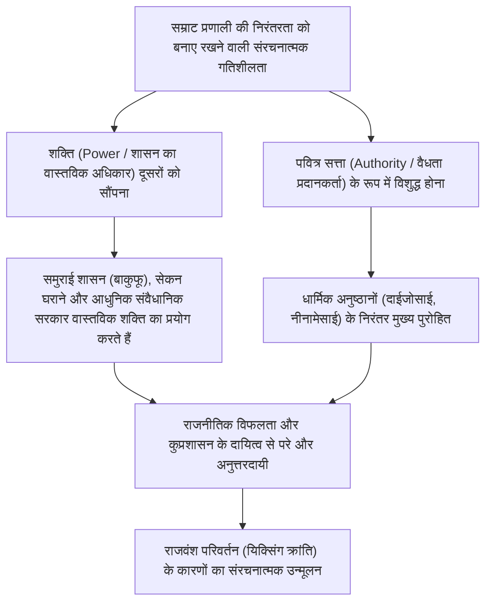
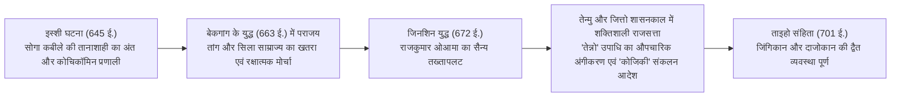
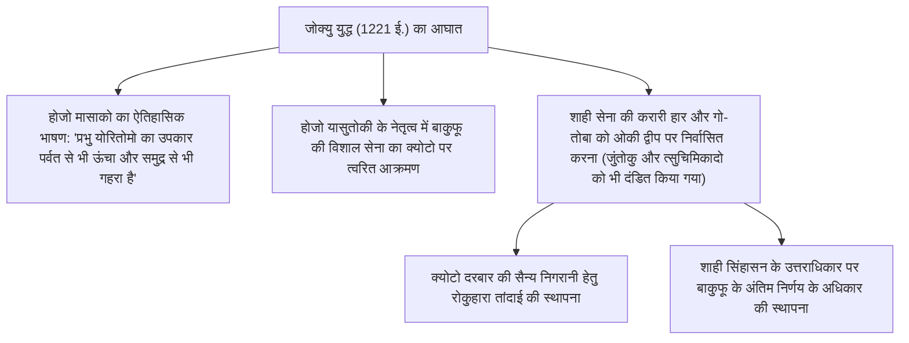
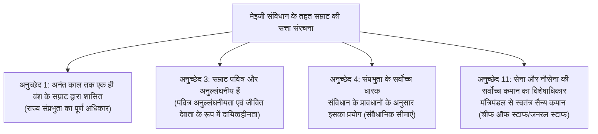
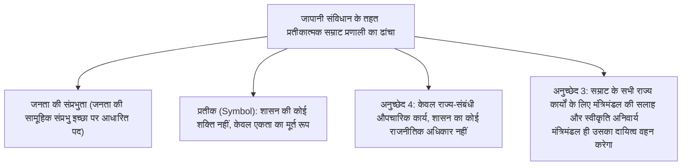
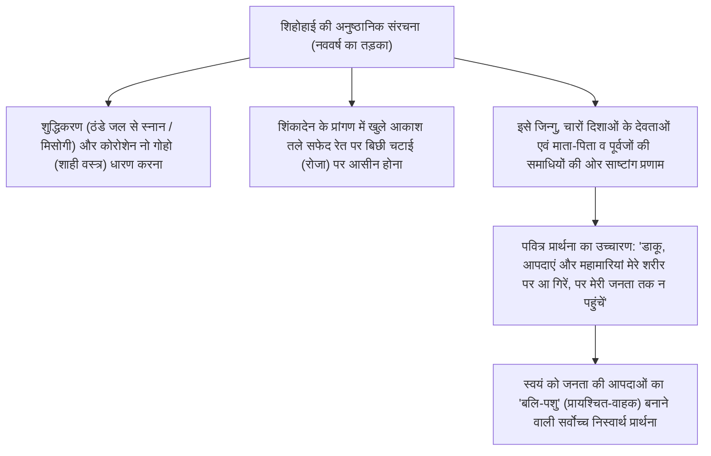
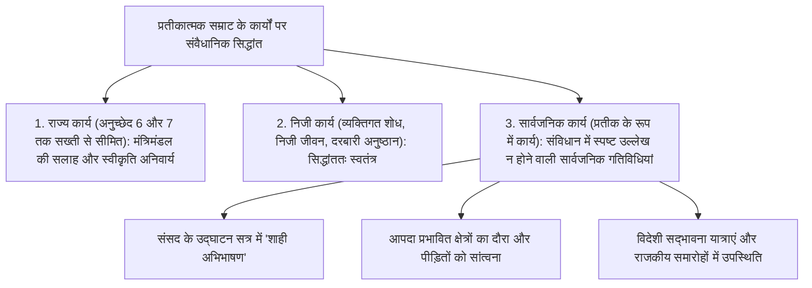

## 1. प्रस्तावना: विश्व का सबसे प्राचीन वंशानुगत राजवंश और "शक्ति और सत्ता का पृथक्करण"

### 1.1 'बानसेई इक्केई' (अटूट वंशपरंपरा) का आख्यान और ऐतिहासिक-पुरातात्विक यथार्थ

जापान में सम्राट (Emperor of Japan / तेन्नो) और शाही परिवार का इतिहास, विश्व में वर्तमान में अस्तित्व में किसी भी अन्य राजघराने या राजवंश की तुलना में एक अभूतपूर्व और अद्वितीय निरंतरता का प्रतीक है। गिनीज वर्ल्ड रिकॉर्ड्स में भी इसे "विश्व का सबसे प्राचीन निरंतर वंशानुगत राजशाही घराना (The oldest continuous hereditary monarchy)" के रूप में आधिकारिक मान्यता दी गई है।

आधुनिक काल के कोकुगाकू (राष्ट्रीय अध्ययन) और 1889 के ग्रेट जापान साम्राज्य के संविधान (मेइजी संविधान) के अनुच्छेद 1 द्वारा उद्घोषित "बानसेई इक्केई (Bansei Ikkei: अनंत काल तक एक ही रक्तरेखा में अटूट वंशपरंपरा)" का आख्यान यद्यपि पौराणिक और वैचारिक रंग लिए हुए है, किंतु प्रत्यक्षानुभविक (empirical) इतिहासलेखन और पुरातात्विक साक्ष्यों की दृष्टि से भी, **कम से कम 5वीं शताब्दी के उत्तरार्ध के सम्राट यूर्याकू (वाकाताकेरु ओकिमी / महान राजा) अथवा 6वीं शताब्दी के आरंभ के सम्राट केइताई के बाद से, लगभग 1500 से अधिक वर्षों से एक ही शाही राजवंश का उसी द्वीपसमूह के भौगोलिक विस्तार में निरंतर बना रहना** अकादमिक रूप से निर्विवाद ऐतिहासिक सत्य है।

यदि हम विश्व की विभिन्न सभ्यताओं के इतिहास का अवलोकन करें, तो चीन में 'स्वर्ग के आदेश' (Mandate of Heaven) के बदलने और कुलनाम बदलने की "यिक्सिंग क्रांति (Dynastic Cycle / राजवंश परिवर्तन)" के कारण पराजित सम्राट के पूरे परिवार का समूल विनाश कर दिया जाता था; वहीं यूरोपीय देशों में भी नॉर्मन, प्लांटैगेनेट, ट्यूडर, स्टुअर्ट और हनोवर जैसे राजवंश एक के बाद एक बदलते रहे। इसके विपरीत, केवल जापान में ही ऐसा क्यों संभव हुआ कि बिना किसी वंश-परिवर्तन के विच्छेद के, एक ही राजवंश आज तक अक्षुण्ण बना रहा?



---

### 1.2 'शक्ति और सत्ता का पृथक्करण': तुलनात्मक सभ्यता अध्ययन का दृष्टिकोण

जैसा कि मारुयामा मसाओ और रूथ बेनेडिक्ट सहित बौद्धिक इतिहासकारों एवं तुलनात्मक संस्कृतिविदों ने इंगित किया है, जापानी सभ्यता की शासन संरचना की सबसे बड़ी विशेषता यह रही है कि इसमें **"राजनीतिक शक्ति (Power: सैन्य बल, कर लगाने का अधिकार, दैनिक प्रशासनिक शासन)" और "परम पवित्र सत्ता (Authority: वैधता का स्रोत, धार्मिक एवं प्रतीकात्मक दिव्यता)" पूरी तरह से द्वैतवादी रूप से अलग-अलग रहे हैं।**

पश्चिमी निरंकुश सम्राट (जैसे फ्रांस के लुई चौदहवें) या चीनी निरंकुश सम्राट स्वयं सेना का नेतृत्व करते हुए आदेश देने वाले 'शक्ति-धारक' होने के साथ-साथ कानून और व्यवस्था के 'सत्ता-धारक' (प्राधिकारी) भी थे। जब ये दोनों एक ही व्यक्ति में समाहित होते हैं, तो किसी राजनीतिक विफलता, सैन्य पराजय अथवा गंभीर सामाजिक उथल-पुथल की स्थिति में उसका प्रत्यक्ष उत्तरदायित्व स्वयं सम्राट पर आता है, और विद्रोह के माध्यम से पूरे राजपरिवार को सिंहासन से अपदस्थ कर दिया जाता है।

इसके विपरीत, जापान के सम्राट ने हेइआन काल के फुजिवारा कबीले (सेकन-सेइजी / संरक्षण शासन), सम्राट शिराकावा के समय से प्रारंभ इनसेई (संन्यासी सम्राटों का शासन), मध्ययुगीन समुराई शासनों (कामाकुरा, मुरोमाची और ईदो बाकुफू), और आधुनिक काल के मंत्रिमंडलों तक निरंतर **"लौकिक शासन की वास्तविक शक्ति सदैव बाहरी सहायकों (होहित्सु) और समुराई शासकों को सौंपने"** की संरचना को बनाए रखा। यहाँ तक कि बाकुफू का शोगुन भी अपने शासन की वैधता सिद्ध करने के लिए सम्राट द्वारा 'सेई ताइशोगुन' (बर्बर-दमनकारी प्रधान सेनापति) के पद पर औपचारिक रूप से नियुक्त किए जाने पर निर्भर था।

नीतियों की असफलता का दायित्व सदैव उस शक्ति का उपभोग करने वाले बाकुफू अथवा मंत्रिमंडल पर होता था, जो तख्तापलट या राजनीतिक बदलाव से नष्ट हो जाते थे। किंतु वैधता का परम स्रोत होने के कारण सम्राट राजनीतिक उत्तरदायित्व के क्षितिज से परे बने रहे; इसलिए उथल-पुथल के किसी भी दौर में सम्राट को अपदस्थ करने या शाही पद छीनने (सम्राट की हत्या कर स्वयं सिंहासन पर बैठने) की कोई संरचनात्मक प्रेरणा काम नहीं करती थी।

---

## 2. प्राचीन राज्य का निर्माण, 'तेन्नो' (सम्राट) पदवी और रित्सुरिओ अनुष्ठानों का जन्म

### 2.1 'ओकिमी' (महान राजा) से 'तेन्नो' (सम्राट) का उत्थान

कोफुन काल में, जापानी द्वीपसमूह के केंद्र में शासन करने वाले यामातो राजसत्ता के प्रमुख को "ओकिमी (治天下大王 / चिनका दाइओ - आकाश के नीचे संपूर्ण भूमि पर शासन करने वाला महान राजा)" कहा जाता था। सैतामा प्रान्त के इनारियामा कोफुन (मजार) से प्राप्त लोहे की तलवार पर उत्कीर्ण अभिलेख में वर्णित "वाकाताकेरु ओकिमी (सम्राट यूर्याकू)" में शक्तिशाली कुलीन कुलों (उजी-काबाने अभिजात वर्ग) के संघ के गठबंधन प्रमुख का चरित्र स्पष्ट रूप से झलकता था।

छठी शताब्दी के अंत से सातवीं शताब्दी के आरंभ में, महारानी सुइको को सिंहासन पर आसीन करने वाले शोतोकू ताइशी (राजकुमार उमायादो) और सोगा नो उमाको ने कान्वि-जूनीकाई (पारिवारिक कुलीनता के बजाय व्यक्तिगत योग्यता पर आधारित बारह स्तरीय दरबारी पद व्यवस्था) और सत्रह अनुच्छेदों का संविधान ("सद्भाव और शांति को सर्वोच्च मानो", "त्रिरत्न (बुद्ध, धर्म, संघ) का आदर करो", "शाही आदेशों का पूरी निष्ठा से पालन करो") तैयार किया। सुई राजवंश के सम्राट यांग्दी को भेजे गए प्रसिद्ध राजनयिक पत्र—"जहाँ सूर्य उगता है उस देश का स्वर्गपुत्र (तेनशी), जहाँ सूर्य अस्त होता है उस देश के स्वर्गपुत्र को पत्र प्रेषित करता है, आशा है आप सकुशल होंगे"—में चीन की सहायक प्रणाली (श्रद्धांजलि/नजराना व्यवस्था) से बाहर निकलकर एक स्वतंत्र और संप्रभु "स्वर्गपुत्र" के रूप में अपनी स्वायत्तता की घोषणा की गई थी।

645 ईस्वी के **"इस्शी की घटना (ताइका सुधार)"** में, राजकुमार नाका नो ओए (बाद में सम्राट तेनजी) और नाकातामी नो कामातारी (फुजिवारा कबीले के संस्थापक) ने दरबारी महल में निरंकुश हो चुके सोगा नो इरुका की हत्या कर दी। उन्होंने कुलीनों द्वारा भूमि और प्रजा पर निजी स्वामित्व को खारिज करते हुए, राज्य (सम्राट) के अधीन सारी भूमि और समस्त नागरिकों को लाने वाले "कोचिकॉमिन प्रणाली (सार्वजनिक भूमि और सार्वजनिक नागरिक)" का आदर्श स्थापित किया।



---

### 2.2 जिनशिन युद्ध (672 ई.) और सम्राट तेन्मु का निरपेक्ष प्राधिकार

प्राचीन जापानी इतिहास का सबसे निर्णायक मोड़ सम्राट तेनजी की मृत्यु के बाद उत्तराधिकार को लेकर भड़का गृहयुद्ध था, जिसे **"जिनशिन युद्ध (672 ई.)"** कहा जाता है। योशिनो में एकांतवास कर रहे राजकुमार ओआमा ने मिनो और ओवारी जैसे पूर्वी क्षेत्रों के योद्धाओं को संगठित कर ओमी दरबारी शासन के राजकुमार ओतोमो को बिजली की गति से परास्त कर दिया और स्वयं असुका कियोमिहारा महल में सिंहासनारूढ़ हुए (**सम्राट तेन्मु**)।

सम्राट तेन्मु और उनकी महारानी (बाद में महारानी जित्तो) के शासनकाल में प्राचीन रित्सुरिओ राजसत्ता का बुनियादी ढांचा पूर्ण हुआ:
1. **'तेन्नो' (सम्राट) पदवी का औपचारिक अंगीकरण**:
   - ताओ धर्म के सर्वोच्च देवता "तेन्नो दाइतेई (ध्रुव तारे का दिव्य रूप)" से व्युत्पन्न मानी जाने वाली परम उपाधि "तेन्नो (Tenno)" का उपयोग काष्ठ-पट्टिकाओं (मोक्कन) और शिलालेखों में आधिकारिक तौर पर प्रारंभ हुआ।
2. **देश के नाम 'निहोन' (जापान) की स्थापना**:
   - पूर्ववर्ती नाम "वाकोकु" के स्थान पर "निहोन (日の本 / उगते सूर्य का देश)" जैसा गौरवशाली नाम आधिकारिक रूप से अंगीकार किया गया।
3. **इतिहास ग्रंथों (पौराणिक गाथाओं) का संकलन**:
   - सम्राट तेन्मु के शाही आदेश पर विभिन्न कुलों की मौखिक परंपराओं को संहिताबद्ध कर, शाही वंश की वैधता को सीधे सूर्य-देवी अमातेरासु से जोड़ने वाले ग्रंथों—'कोजिकी' (712 ई. में पूर्ण) और 'निहोन शोकी' (720 ई. में पूर्ण)—का संकलन प्रारंभ हुआ।

---

### 2.3 'किकी' पौराणिक कथाओं की अंतर्निहित संरचना और तीन पवित्र राजचिह्न

'कोजिकी' और 'निहोन शोकी' में वर्णित सूर्य-देवी अमातेरासु ओमिकामी से लेकर प्रथम सम्राट जिन्मु तक की पौराणिक वंशावली सम्राट के प्राधिकार का धार्मिक और ब्रह्मांडीय आधार प्रस्तुत करती है।

- **तेनसन कोरिन (स्वर्गीय पौत्र का अवतरण) और "तीन महान दिव्य आदेश"**:
  - अमातेरासु ने जब अपने पौत्र निनिगी-नो-मिकोतो को धरती (ताकाचिहो शिखर) पर भेजा, तो उन्हें सबसे बुनियादी आदेश दिया, जिसे **"तेन्जो मुक्यू नो शिंचोकु (अनंत काल तक स्वर्ग और पृथ्वी के समान शाश्वत शासन का दिव्य आदेश)"** कहा जाता है:
  > "लहलहाते नरकटों और प्रचुर धान की बालियों की यह भूमि (तोयोआशिहारा नो चिहोआकी नो मिजुहो नो कुनी) वह स्थान है जिस पर मेरे वंशजों को शासन करना चाहिए। हे मेरे स्वर्गीय पौत्र, तुम जाओ और उस पर शासन करो। तुम्हारा शाही सिंहासन स्वर्ग और पृथ्वी की भांति ही अनंत काल तक फलता-फूलता रहेगा।"
  - यह एक दिव्य अनुबंध था जिसके अनुसार पृथ्वी पर शासन का अधिकार स्वर्गीय देवताओं की इच्छा से शाही पौत्र और उनके वंशजों को अनंत काल के लिए सौंपा गया था।
  - इसके अतिरिक्त, पवित्र दर्पण को स्वयं अमातेरासु की आत्मा के रूप में पूजने का आदेश ("होक्यो होसाई नो शिंचोकु") और स्वर्ग के पवित्र खेत की धान की बालियों को पृथ्वी पर उगाने का आदेश ("साइतेई इनाहो नो शिंचोकु") दिया गया।
- **तीन पवित्र राजचिह्न (Sanshu no Jingi / सानशू नो जिंगी)**:
  1. **याता नो कागामी (पवित्र दर्पण)**: प्रज्ञा और सूर्य की दिव्यता का प्रतीक (इसे इसे जिन्गु के आंतरिक मंदिर का मुख्य विग्रह माना जाता है, तथा इसकी प्रतिकृति इंपीरियल पैलेस में प्रतिष्ठित है)।
  2. **यासाकानी नो मगातामा (पवित्र मुड़ा हुआ रत्न)**: करुणा और आध्यात्मिक ऊर्जा का प्रतीक (इंपीरियल पैलेस के केंजी-नो-मा कक्ष में स्थायी रूप से सुरक्षित)।
  3. **कुसानागी नो त्सुरुगी (पवित्र तलवार / अमे नो मुराकुमो नो त्सुरुगी)**: सैन्य पराक्रम और साहस का प्रतीक (अत्सुता जिन्गु का मुख्य विग्रह, जिसकी प्रतिकृति इंपीरियल पैलेस में रखी गई है)।
  - इतिहास में प्रत्येक नए सम्राट के राज्यारोहण के समय इन तीन प्रतीकों को ग्रहण करने की रस्म ("केंजी तो शोकेई नो गी") को शाही सिंहासन की वैधता का अनिवार्य प्रमाण माना जाता रहा है।

---

### 2.4 रित्सुरिओ प्रणाली का द्वैतवाद: जिंगिकान, दाजोकान और दाईजोसाई

701 ईस्वी की "ताइहो संहिता" में पूर्ण हुई प्राचीन प्रशासनिक प्रणाली तांग राजवंश की रित्सुरिओ व्यवस्था से प्रेरित थी, किंतु इसमें जापान के संदर्भ में अत्यंत मौलिक और क्रांतिकारी रूपांतरण किया गया था।

तांग व्यवस्था में प्रशासनिक सर्वोच्च अंगों (शांग्शू, झोंगशू, मेनक्सिया) के अधीन धार्मिक अनुष्ठान निकाय (ताइचांगसी) स्थित था; इसके विपरीत, जापानी रित्सुरिओ व्यवस्था में राज्य के धर्मनिरपेक्ष प्रशासन का संचालन करने वाले **"दाजोकान (महामंत्रिपरिषद)"** के समानांतर—या उससे भी उच्च स्थान पर—देवताओं के अनुष्ठानों को संचालित करने वाले **"जिंगिकान (धार्मिक मामलों की सर्वोच्च परिषद)"** को स्थापित किया गया (दो मंत्रालय और आठ विभाग प्रणाली / निकान हाश्शो सेई)।

सम्राट का सबसे मौलिक दैनिक कर्तव्य लौकिक शासन (राजनीतिक निर्णय लेना) नहीं, बल्कि **"शिंजी (अदृश्य देवताओं और बुद्धों से लोक-कल्याण की प्रार्थना)"** करना था:
- **नीनामेसाई (新嘗祭)**: प्रतिवर्ष नवंबर में आयोजित होने वाला अनुष्ठान, जिसमें सम्राट उस वर्ष उपजाए गए नए अनाजों को देवताओं को अर्पित करते हैं और स्वयं भी उनका उपभोग करते हैं। इस 'देव-मानव सह-भोज' (शिंजिन क्योशोकू) के माध्यम से देवता और मानव एकाकार होते हैं, और राष्ट्र की शांति तथा प्रचुर फसल की प्रार्थना की जाती है।
- **दाईजोसाई (大嘗祭)**: किसी नए सम्राट के सिंहासनारोहण के बाद जीवन में केवल एक बार आयोजित होने वाला गूढ़तम अनुष्ठान। यूकी-देन और सुकी-देन नामक प्राचीन और सरल शैली के दो अस्थायी काष्ठ भवनों का विशेष रूप से निर्माण किया जाता है। सम्राट पूरी रात जागकर शाही पूर्वज देवी को नए अन्न अर्पित करते हैं और स्वयं भी ग्रहण करते हैं। इस प्रक्रिया में 'तेन्नो-रेई' (शाही पूर्वज की आध्यात्मिक शक्ति) सम्राट के नश्वर शरीर में प्रविष्ट होती है, और वे एक सच्चे आध्यात्मिक संप्रभु के रूप में पुनर्जन्म लेते हैं।

राजनीतिक वास्तविक शक्ति चाहे जितने हाथों में बदली हो, "राष्ट्र और मानव जाति के कल्याण के लिए देवताओं से निस्वार्थ भाव से अनवरत प्रार्थना करने वाले सर्वोच्च प्रधान पुरोहित" के रूप में सम्राट की भूमिका ही सम्राट प्रणाली का अमर और अक्षुण्ण केंद्र बनी रही।

---

## 3. मध्यकाल और पूर्व-आधुनिक काल में सत्ता और शक्ति की दोहरी संरचना

### 3.1 सेकन-सेइजी और इनसेई: राजदरबार के भीतर की सत्ता-गतिशीलता

हेइआन काल में सम्राट के इर्द-गिर्द केंद्रित राजनीतिक संरचना में अत्यधिक परिष्कार और रूपांतरण हुआ:

- **फुजिवारा कबीले का सेकन शासन (10वीं-11वीं शताब्दी)**:
  - फुजिवारा होक्के (विशेषकर मिचीनागा और योरिमिची का स्वर्णकाल) ने अपनी पुत्रियों का विवाह सम्राटों से कराकर उन्हें महारानी बनाया। जब उनसे उत्पन्न राजकुमार अल्पायु में सम्राट बनते, तो नाना (मातृपक्षीय संबंधी) के रूप में वे 'सेशू' (अल्पवयस्क सम्राट के रीजेंट) और सम्राट के वयस्क होने पर 'कांपाकू' (मुख्य सलाहकार/चांसलर) बन जाते।
  - उन्होंने सम्राट की सर्वोच्च सत्ता को कभी नहीं छीना, बल्कि ननिहाल के विशेषाधिकार के माध्यम से प्रशासनिक नियुक्तियों और राजकीय निर्णयों पर पूर्ण नियंत्रण स्थापित किया।
- **इनसेई (संन्यासी सम्राटों के शासन) की स्थापना (11वीं शताब्दी के अंत से)**:
  - 1086 ईस्वी में, सम्राट शिराकावा ने अपनी गद्दी अपने अल्पवयस्क पुत्र सम्राट होरिकावा को सौंप दी और स्वयं 'जोको' (सेवानिवृत्त सम्राट / ताइजो तेन्नो) बन गए। उन्होंने राजदरबार से बाहर अपने निजी कार्यालय ('इनचो') की स्थापना की।
  - "चितेन नो किमी" (शाही घराने के कुलपति/प्रमुख) के रूप में, उन्होंने फुजिवारा कबीले को दरकिनार कर वास्तविक राजनीतिक सत्ता अपने हाथों में ले ली। जब संन्यासी सम्राट बौद्ध दीक्षा लेकर 'हो-ओ' (धार्मिक सम्राट) बने, तो वे कन्फ्यूशियसवादी और रित्सुरिओ नियमों के पारंपरिक बंधनों से भी मुक्त होकर निरंकुश शक्ति का प्रयोग करने लगे।

---

### 3.2 समुराई सत्ता का उदय और जोक्यु युद्ध (1221 ई.)

12वीं शताब्दी के उत्तरार्ध में, तायरा कबीले के पतन के बाद मिनामोटो नो योरितोमो ने पूर्वी जापान के कामाकुरा में **"कामाकुरा बाकुफू (शोगुनशाही)"** की स्थापना की।
योरितोमो ने शाही दरबार से 'सेई ताइशोगुन' की पदवी प्राप्त की, और साथ ही देश भर में सैन्य प्रशासक (शुगो) और भूमि प्रबंधक (जितो) नियुक्त करने का शाही फरमान (बुन्जी का फरमान, 1185 ई.) हासिल किया। इस प्रकार पश्चिम में 'शाही दरबार (कुगे)' और पूर्व में 'शोगुनशाही (बुके)' का द्वैत शासन ढांचा अस्तित्व में आया।

समुराई वर्ग के इस बढ़ते प्रभुत्व को उलटने और शाही सत्ता को पुनः स्थापित करने के उद्देश्य से एक असाधारण साहसी सम्राट, **सेवानिवृत्त सम्राट गो-तोबा** ने एक बड़ा ऐतिहासिक दांव खेला।
1221 ईस्वी में, उन्होंने कामाकुरा बाकुफू के शिकेन (रीजेंट) होजो योशितोकी के दमन का शाही आदेश जारी किया और देश भर के योद्धाओं को विद्रोह का आह्वान किया (**जोक्यु युद्ध**)।



जोक्यु युद्ध का परिणाम समुराई पक्ष की प्रचंड विजय के रूप में सामने आया। समुराई वर्ग द्वारा खुलेआम शाही आदेश की अवहेलना करने और 'चितेन नो किमी' (सेवानिवृत्त सम्राट) को निर्वासित करने की इस घटना ने यह स्पष्ट कर दिया कि सैन्य बल के बिना शाही दरबार समुराई शक्ति का सामना नहीं कर सकता। बाकुफू ने इसके बाद शाही उत्तराधिकार में सीधा हस्तक्षेप करना प्रारंभ किया और आगे चलकर दाइकाकुजी शाखा (दक्षिणी दरबार) और जिमोइन शाखा (उत्तरी दरबार) के बीच बारी-बारी से सिंहासन पर बैठने (र्योतो तेत्सुरीत्सु) का मध्यस्थ बन गया।

---

### 3.3 केन्मु पुनर्स्थापन और नानबोकुचो (उत्तर-दक्षिण दरबार) का गृहयुद्ध

1333 ईस्वी में, सम्राट गो-दाइगो ने आशियागा ताकाउजी, नित्ता योशिसदा और कुसुनोकी मसाशिगे जैसे समुराई सरदारों को लामबंद करके कामाकुरा बाकुफू का अंत कर दिया, और सम्राट के प्रत्यक्ष व्यक्तिगत शासन, **"केन्मु पुनर्स्थापन"** की शुरुआत की।

किंतु समुराई वर्ग की भूमि-इनाम संबंधी मांगों की उपेक्षा करने और रूढ़िवादी कुलीन-समर्थक तथा पुरातनपंथी निरंकुश नीतियों के कारण यह नया शासन मात्र दो वर्षों में ही बिखर गया। असंतुष्ट आशियागा ताकाउजी ने क्योटो में सम्राट कोम्यो (जिमोइन वंश) को सिंहासन पर बैठाकर मुरोमाची बाकुफू की नींव रखी, जबकि सम्राट गो-दाइगो भागकर योशिनो के पहाड़ों में चले गए और स्वयं को एकमात्र वैध सम्राट घोषित किया।

इसके बाद लगभग 60 वर्षों तक क्योटो के **"उत्तरी दरबार (होकुचो)"** और योशिनो के **"दक्षिणी दरबार (नानचो)"** के बीच वैधता को लेकर गृहयुद्ध चलता रहा, जिसे **"नानबोकुचो काल (1336–1392)"** कहा जाता है। 1392 ईस्वी में, मुरोमाची बाकुफू के तीसरे शोगुन आशियागा योशिमित्सु की मध्यस्थता से "मेइतोकु समझौता (उत्तर-दक्षिण विलय)" संपन्न हुआ, जिसके तहत दक्षिणी दरबार के सम्राट गो-कामेयामा ने तीन पवित्र राजचिह्न उत्तरी दरबार के सम्राट गो-कोमात्सु को सौंप दिए (यद्यपि वर्तमान शाही रक्तरेखा उत्तरी दरबार के सम्राट गो-कोमात्सु से ही निरंतर चली आ रही है, मेइजी काल में आधिकारिक रूप से यह स्वीकार किया गया कि ऐतिहासिक वैधता उन दक्षिणी सम्राटों के पास थी जिनके पास वास्तविक पवित्र राजचिह्न थे)।

मुरोमाची काल के चरम पर, आशियागा योशिमित्सु को मिंग राजवंश के सम्राट योंगले द्वारा "जापान का राजा" घोषित किया गया था, और उन्होंने अपने पुत्र को सम्राट के पद पर बैठाने का प्रयास किया था, जिसे इतिहास में "शाही तख्तापलट" के सबसे निकट का प्रयास माना जाता है; किंतु उनकी आकस्मिक मृत्यु के साथ ही यह महत्वाकांक्षा समाप्त हो गई।

---

### 3.4 तोकुगावा बाकुफू का 'किंचू नाराबिनी कुगे शोहात्तो' और 'अध्ययन' का वैधानिक नियम

सेनगोकू (युद्धरत राज्य) काल की अराजकता के दौरान शाही दरबार की वित्तीय स्थिति इतनी दयनीय हो गई थी कि सम्राट गो-नारा जैसे शासकों को राजदरबार के खर्च चलाने के लिए अपने हाथों से लिखे गए सुलेख (वाका कविताएं और प्रज्ञापारमिता हृदय सूत्र) बेचने पड़े थे। इसके बावजूद ओदा नोबुनागा, तोयोतोमी हिदेयोशी और तोकुगावा इयासू जैसे किसी भी विजेता ने सम्राट को समाप्त करने का प्रयास नहीं किया; बल्कि उन्होंने भारी दान दिया और अपने शासन की वैधता को पुष्ट करने के लिए कांपाकू, दाजो दाइजिन या सेई ताइशोगुन की उपाधियां प्राप्त कीं।

पूरे देश का एकीकरण करने के बाद तोकुगावा इयासू ने 1615 ईस्वी में शाही दरबार को कानूनी रूप से पूरी तरह नियंत्रित करने के लिए **"किंचू नाराबिनी कुगे शोहात्तो (शाही दरबार और कुलीनों के लिए 17 नियमों की संहिता)"** जारी की। इसके प्रथम अनुच्छेद में स्पष्ट रूप से लिखा गया था:

> **"सम्राट की सभी कलाओं और विद्याओं में, प्रथम स्थान 'अध्ययन' (विद्वत्ता) का है।"**

इस प्रावधान का अंतर्निहित उद्देश्य अत्यंत कठोर और स्पष्ट था: "सम्राट को केवल पारंपरिक ज्ञान, दरबारी शिष्टाचार और काव्य-साधना में लीन रहना चाहिए; उन्हें राजनीति अथवा सैन्य मामलों में किसी भी प्रकार का हस्तक्षेप करने की रत्ती भर भी अनुमति नहीं है।"
1629 ईस्वी की "बैंगनी वस्त्र घटना" (जिसमें बाकुफू की अनुमति के बिना उच्च बौद्ध भिक्षुओं को बैंगनी वस्त्र प्रदान करने के शाही आदेश को बाकुफू ने रद्द कर दिया, जिसके विरोध में सम्राट गो-मिजुनो ने अचानक पदत्याग कर दिया) से स्पष्ट हुआ कि ईदो काल के सम्राट क्योटो के शाही महल की चहारदीवारी के भीतर पूरी तरह कैद थे और राजनीतिक शक्ति से शून्य एक "अनुष्ठानिक एवं सांस्कृतिक प्रतीक" के रूप में शक्तिहीन बना दिए गए थे।

---

## 4. मेइजी पुनर्स्थापन और आधुनिक 'अराहितोगामी' (जीवित देवता) राष्ट्र का निर्माण

### 4.1 'सोन्नो जोई' (सम्राट का सम्मान, विदेशियों का निष्कासन) से शाही पुनर्स्थापन तक

ईदो काल के उत्तरार्ध में, मितो प्रांत के 'दाई निहोनशी' (महान जापान का इतिहास) संकलन और कोकुगाकू (मोटोओरी नोरिनागा आदि) के विकास के साथ, यह विचार समुराई वर्ग में गहराई से बैठ गया कि "बाकुफू का शोगुन तो केवल सम्राट द्वारा शासन का अधिकार सौंपा गया प्रतिनिधि मात्र है (ताइसेई इनिन-रोन)।"

1853 ईस्वी में कमोडोर मैथ्यू पेरी के काले जहाजों (ब्लैक शिप्स) के आगमन के बाद जब विदेशी संकट के सामने तोकुगावा बाकुफू की असमर्थता उजागर हुई, तो निम्न श्रेणी के समुराइयों और देशभक्तों (शिशी) के बीच "सोन्नो जोई (सम्राट का सम्मान करो, विदेशियों को खदेड़ो)" का ज्वार उमड़ पड़ा। सम्राट कोमेई ने विदेशियों के निष्कासन का आदेश दिया, और चोशू तथा सात्सुमा जैसे शक्तिशाली प्रांतों ने शाही दरबार को अपना राजनीतिक केंद्र बना लिया।

अक्टूबर 1867 में, 15वें शोगुन तोकुगावा योशिनोबु ने शासन की सत्ता सम्राट को लौटाने ("ताइसेई होकान") का प्रस्ताव रखा। उसी वर्ष 9 दिसंबर को इवाकुरा तोमोमी और सात्सुमा के साइगो ताकामोरी के नेतृत्व में **"शाही पुनर्स्थापन की महान घोषणा (ओसेई फुक्को नो दाइगोरेई)"** की गई:
- बाकुफू, सेशू और कांपाकू के पदों को पूरी तरह समाप्त कर दिया गया।
- प्रथम सम्राट जिन्मु के मूल आदर्शों की ओर लौटते हुए सम्राट के प्रत्यक्ष शासन वाली नई सरकार की स्थापना की घोषणा की गई।
- 16 वर्षीय सम्राट मेइजी सिंहासनारूढ़ हुए, ईदो का नाम बदलकर "टोक्यो" किया गया, और शाही राजधानी को क्योटो से टोक्यो के पूर्व ईदो महल में स्थानांतरित कर दिया गया।

---

### 4.2 ग्रेट जापान साम्राज्य का संविधान (मेइजी संविधान, 1889 ई.) का संवैधानिक द्वैतवाद

इतो हिरोबुमी सहित मेइजी के संस्थापकों ने प्रशिया (जर्मनी) के संविधानवाद को मॉडल बनाते हुए, जापान की ऐतिहासिक परिस्थितियों के अनुकूल **"ग्रेट जापान साम्राज्य का संविधान"** तैयार किया।



मेइजी संविधान व्यवस्था में सम्राट का स्वरूप अत्यंत गहरा "द्वैतवादी (दोहरा)" था:
1. **पारंपरिक एवं धार्मिक पहलू**: सम्राट देवताओं के प्रत्यक्ष वंशज, राष्ट्रीय नैतिकता के उद्गम और पवित्र व अनुल्लंघनीय 'अराहितोगामी' (मानव रूप में अवतरित जीवित देवता) थे।
2. **आधुनिक एवं संवैधानिक पहलू**: सम्राट "संविधान के प्रावधानों के अनुसार" शासन शक्ति का प्रयोग करने वाले एक संवैधानिक शासक थे। वे किसी निरंकुश तानाशाह की तरह मनमाने आदेश जारी नहीं कर सकते थे; प्रशासनिक शक्ति के प्रयोग के लिए संबंधित राज्य मंत्रियों की "सलाह और सहायता (होहित्सु)" अनिवार्य थी (अनुच्छेद 55), और विधायी शक्ति के लिए इंपीरियल डाइट (संसद) की सहमति आवश्यक थी।

ताइशो काल में, टोक्यो इंपीरियल यूनिवर्सिटी के विधि संकाय के प्रोफेसर मिनोबे तातसुकिती द्वारा प्रतिपादित **"सम्राट अंग सिद्धांत (तेन्नो किकान-सेत्सु)"**—जिसके अनुसार राज्य एक कानूनी व्यक्ति (निगम) है और सम्राट उस राज्य रूपी निकाय का सर्वोच्च 'अंग' हैं, तथा संप्रभुता संपूर्ण राज्य में निहित है—ताइशो लोकतंत्र के दौर में दलीय संसदीय सरकार का संवैधानिक सैद्धांतिक आधार बना।

किंतु मेइजी संविधान में एक अत्यंत घातक संरचनात्मक दोष विद्यमान था। वह था **अनुच्छेद 11 के तहत "सैन्य कमान की स्वतंत्रता" (सेना और नौसेना की सर्वोच्च कमान मंत्रिमंडल की सलाह के अधीन नहीं थी, बल्कि सेना सीधे सम्राट के अधीन थी)**। शोवा काल में जब सेना ने इसी विशेषाधिकार की आड़ लेकर मंत्रिमंडल और संसद के नियंत्रण से स्वयं को पूरी तरह स्वतंत्र कर लिया, तो संवैधानिक व्यवस्था की दीवारें ताश के पत्तों की तरह ढह गईं।

---

## 5. शोवा काल की उथल-पुथल, युद्ध में पराजय और 'प्रतीकात्मक सम्राट प्रणाली' में नाटकीय रूपांतरण

### 5.1 प्रारंभिक शोवा काल की त्रासदी और युद्ध समाप्ति का 'पवित्र निर्णय'

1930 के दशक में सैन्य कमान के उल्लंघन के विवाद, 15 मई की घटना और 26 फरवरी की घटना के सैन्य विद्रोहों के बाद दलीय राजनीति समाप्त हो गई, और जापान सैन्य तानाशाही, चीन के साथ अंतहीन युद्ध और 1941 में प्रशांत युद्ध के दलदल में धंसता चला गया।

राज्य शिंतो को चरम कट्टरपंथ तक पहुंचा दिया गया, और जनता को यह सिखाया गया कि "सम्राट के लिए अपने प्राण न्योछावर करना" ही सर्वोच्च मानवीय गुण है। किंतु स्वयं सम्राट शोवा (हिरोहितो) एक संवैधानिक शासक के रूप में मंत्रिमंडल और सेना के निर्णयों को न ठुकरा पाने की अपनी विवशता और शांति की अपनी आंतरिक प्रार्थना के बीच निरंतर मानसिक पीड़ा से जूझते रहे।

अगस्त 1945 में, हिरोशिमा और नागासाकी पर परमाणु बमबारी तथा सोवियत संघ के युद्ध में प्रवेश के बाद, सर्वोच्च युद्ध संचालन परिषद "कोकुताई गोजी (शाही व्यवस्था के संरक्षण)" के प्रश्न पर आत्मसमर्पण बनाम अंतिम निर्णायक युद्ध (मातृभूमि रक्षा संग्राम / संपूर्ण विनाश) के बीच बराबर-बराबर बंट गई।
10 और 14 अगस्त को बम-रोधी बंकर में आयोजित शाही उपस्थिति वाली बैठक (गोशेन काइगी) में प्रधानमंत्री सुजुकी कांतारो द्वारा राय मांगे जाने पर, सम्राट शोवा ने अश्रुपूरित नेत्रों से ऐतिहासिक **"सेइदान (पवित्र निर्णय)"** सुनाया:

> **"मेरा कर्तव्य अपनी प्रजा की रक्षा करना है। मेरी अपनी देह का चाहे जो भी हश्र हो, मैं अपनी प्रजा को और अधिक युद्ध की विभीषिका में नष्ट होते और मानव सभ्यता को विध्वंस की ओर जाते नहीं देख सकता। ...मैं असहनीय को सहते हुए और अकथनीय को झेलते हुए इस युद्ध को समाप्त करने का निर्णय लेता हूँ।"**

15 अगस्त की दोपहर को 'ग्योकुओन होसो' (रेडियो पर सम्राट के आत्मसमर्पण के शाही संदेश के प्रसारण) के साथ युद्ध समाप्त हुआ। यदि सम्राट के शब्दों द्वारा यह सीधा हस्तक्षेप न हुआ होता, तो यह निश्चित था कि जापानी मुख्य भूमि पर होने वाले युद्ध में लाखों और निर्दोष लोग मारे जाते।

---

### 5.2 जनरल मैकआर्थर से भेंट और टोक्यो परीक्षण से सम्राट की सुरक्षा

पराजय के बाद मित्र देशों की सेनाओं के सुप्रीम कमांडर जनरल डगलस मैकआर्थर के नेतृत्व में जीएचक्यू (GHQ) ने जापान का नियंत्रण संभाला। अमेरिका, ब्रिटेन, सोवियत संघ आदि मित्र देशों के जनमत का एक बड़ा हिस्सा सम्राट शोवा को "प्रमुख युद्ध अपराधी" मानकर उन पर मुकदमा चलाने और उन्हें मृत्युदंड देकर सम्राट व्यवस्था को पूरी तरह समाप्त करने की मांग कर रहा था।

27 सितंबर 1945 को, सम्राट शोवा ने अमेरिकी दूतावास में जाकर जनरल मैकआर्थर से अकेले भेंट की। मैकआर्थर के संस्मरणों के अनुसार, सम्राट ने अपनी प्राण-रक्षा की भीख मांगने के बजाय गरिमा के साथ यह कहा:

> **"मैं युद्ध के संचालन में जापानी जनता द्वारा लिए गए प्रत्येक राजनीतिक और सैन्य निर्णय एवं कार्रवाई की पूरी जिम्मेदारी स्वयं पर लेने के लिए यहाँ उपस्थित हुआ हूँ। मेरे अपने जीवन का चाहे जो भी हो, मुझे उसकी कोई चिंता नहीं है। मेरी केवल यही प्रार्थना है कि कृपया मेरे देश की भूखी जनता को भोजन उपलब्ध कराया जाए।"**

सम्राट की इस निस्वार्थ भावना से मैकआर्थर अत्यंत गहरे रूप से प्रभावित हुए, और उन्होंने तुरंत अपनी नीति को "सम्राट प्रणाली को बनाए रखने और सम्राट को मुकदमों से बचाने" की दिशा में मोड़ दिया। मैकआर्थर ने यह निष्कर्ष निकाला कि यदि सम्राट को दंडित किया गया, तो पूरे जापान में लाखों की संख्या में गुरिल्ला विद्रोह भड़क उठेंगे और मित्र देशों के लिए शांतिपूर्ण शासन चलाना असंभव हो जाएगा।

1 जनवरी 1946 को सम्राट शोवा ने **"नव जापान के निर्माण पर शाही घोषणा (तथाकथित 'मानवता की घोषणा' / निनगेन सेनगेन)"** जारी की। इसमें उन्होंने स्पष्ट घोषणा की कि सम्राट और जापानी जनता के बीच का संबंध पौराणिक कथाओं या 'जीवित देवता' की भ्रामक अवधारणाओं पर नहीं, बल्कि आपसी विश्वास और स्नेह पर आधारित है।

---

### 5.3 जापानी संविधान का अनुच्छेद 1: 'प्रतीकात्मक सम्राट प्रणाली' की स्थापना

3 मई 1947 को लागू हुए **"जापान के संविधान (निहोनकोकु केंपो)"** के अनुच्छेद 1 में सम्राट की कानूनी और संवैधानिक स्थिति को पूरी तरह से पुनर्परिभाषित किया गया:

> **अनुच्छेद 1: "सम्राट जापान राज्य का प्रतीक और जनता की एकता का प्रतीक होगा, और उसका यह पद उस जनता की संप्रभु इच्छा पर आधारित होगा जिसमें संप्रभुता निहित है।"**



- **शासन की शक्तियों से पूर्ण विमुक्ति**: सम्राट अब राज्य के शासक या संप्रभु राष्ट्राध्यक्ष नहीं रहे, बल्कि राज्य के अस्तित्व और जनता की एकता को साकार करने वाले "प्रतीक (Symbol)" बन गए।
- **राजनीति में हस्तक्षेप पर पूर्ण प्रतिबंध (अनुच्छेद 4)**: सम्राट केवल संविधान में विशेष रूप से उल्लिखित औपचारिक और अनुष्ठानिक "राज्य कार्य" (कोकुजी-कोई: जैसे संसद का सत्र बुलाना, प्रधानमंत्री की नियुक्ति, संधियों का अनुसमर्थन, सम्मान पदक प्रदान करना आदि) ही कर सकते हैं; उन्हें शासन से संबंधित कोई भी राजनीतिक शक्ति प्राप्त नहीं है।
- **मंत्रिमंडल की सलाह और अनुमोदन (अनुच्छेद 3)**: सम्राट के सभी राज्य कार्यों के लिए मंत्रिमंडल की सलाह और स्वीकृति अनिवार्य है, और उन कार्यों का संपूर्ण राजनीतिक उत्तरदायित्व मंत्रिमंडल का होता है।

इस "प्रतीकात्मक सम्राट प्रणाली" को प्रायः कब्जाधारी अमेरिकी सेना द्वारा थोपी गई एक विदेशी व्यवस्था माना जाता है, किंतु वास्तविकता में इसे पूर्वोक्त जापान के सुदीर्घ इतिहास—**"सम्राट राजनीतिक शक्ति का प्रयोग न करते हुए केवल पवित्र सत्ता और लोक-प्रार्थना तक सीमित रहें", जो मध्यकाल से चली आ रही पारंपरिक संरचना थी—की ओर सबसे विशुद्ध रूप में वापसी** के रूप में भी व्याख्यायित किया जा सकता है।

---

## 2.5 दरबारी अनुष्ठानों (क्यूचू सैशी) की संरचना और 'शिहोहाई' की आध्यात्मिक गतिशीलता

सम्राट के अस्तित्व और महत्व को समझने के लिए, जापानी संविधान के तहत निर्धारित "राज्य कार्यों (कोकुजी-कोई)" से पूरी तरह पृथक एक निजी क्षेत्र के रूप में शाही घराने के भीतर अटूट रूप से संजोए गए **"दरबारी अनुष्ठानों (क्यूचू सैशी / Imperial Court Rituals)"** के गूढ़ रहस्यों को समझना अनिवार्य है।

शाही महल (इंपीरियल पैलेस) के घने फुकियागे उद्यान के भीतर प्रतिष्ठित **"क्यूचू सांदेन (शाही दरबार के तीन पवित्र मंदिर)"**――
1. **काशीकोदोकोरो (賢所)**: यहाँ शाही पूर्वज देवी अमातेरासु ओमिकामी के मुख्य विग्रह 'याता नो कागामी' (पवित्र दर्पण की प्रतिकृति) को प्रतिष्ठापित किया गया है।
2. **कोरेइदेन (皇霊殿)**: यहाँ प्रथम सम्राट जिन्मु से लेकर इतिहास के सभी पूर्ववर्ती सम्राटों एवं शाही परिजनों की आत्माओं की पूजा की जाती है।
3. **शिन्देन (神殿)**: यहाँ तेनशिन चिगी (स्वर्ग और पृथ्वी के आठ लाख यानी अनंत देवी-देवताओं) की आराधना की जाती है।

सम्राट वर्ष भर में दर्जनों बार आयोजित होने वाले इन अत्यंत पवित्र एवं गंभीर अनुष्ठानों की स्वयं अध्यक्षता करते हैं। इनमें सबसे अधिक आध्यात्मिक रूप से विचलित और विस्मित कर देने वाला अनुष्ठान नववर्ष के दिन के तड़के (प्रातः 5:30 बजे), कड़ाके की शीत लहर में संपन्न होने वाला **"शिहोहाई (四方拝 / चारों दिशाओं की वंदना)"** है।



सम्राट ठंडे जल से स्नान करके अपनी काया को शुद्ध करते हैं, प्राचीन पारंपरिक शाही परिधान (कोरोशेन नो गोहो) धारण करते हैं, और खुले आसमान के नीचे सफेद रेत पर बिछी चटाई पर बैठकर इसे जिन्गु सहित चारों दिशाओं के पर्वतों, नदियों, देवी-देवताओं और पूर्ववर्ती सम्राटों की समाधियों की ओर मुख करके नतमस्तक होते हैं। इसके उपरांत वे हेइआन काल के अनुष्ठान ग्रंथों में दर्ज इस रहस्यमयी मंत्र का पाठ करते हैं:
> **"डकैती, हिंसक हमले, महामारियां, बाढ़ और अग्नि की विपदाएं—जो कुछ भी मेरी प्रजा पर आ पड़ने वाली हों—वे प्रजा तक पहुंचने से पूर्व सबसे पहले मेरे शरीर से होकर गुजरें (यदि प्रजा पर कोई संकट आए, तो वह पहले मुझे भस्म करे)।"**

स्वयं को राष्ट्र और प्रजा की समस्त विपदाओं को अपने ऊपर ले लेने वाले "परम बलि-पशु (Scapegoat / प्रायश्चित-वाहक)" के रूप में ईश्वर के समक्ष अर्पित कर देना—दूसरों पर शासन करने की शक्ति नहीं, बल्कि स्वयं को शून्य में विलीन करके दूसरों के सुख की कामना करने की यह पूर्ण आत्म-बलिदानी अनुष्ठानिक चेतना ही वह अचेतन चुंबकीय क्षेत्र है जिसने सहस्राब्दियों से सम्राट की सत्ता को जापानी जनमानस के अंतर्मन में अमिट रूप से अंकित किया है।

---

## 3.5 इतिहास में महिला सम्राटों का वास्तविक यथार्थ और 'मध्यवर्ती उत्तराधिकार' (पिंच-हिटर) सिद्धांत का सच

शाही उत्तराधिकार की बहसों में बार-बार इतिहास में वास्तविक रूप से शासन करने वाली **"8 व्यक्तियों और 10 शासनावधियों वाली महिला सम्राटों (जोसेई तेन्नो)"** का उदाहरण दिया जाता है।

| क्रम संख्या | सम्राट का नाम | शासनकाल | सिंहासनारोहण की पृष्ठभूमि और ऐतिहासिक उपलब्धियां |
| :---: | :--- | :---: | :--- |
| **33वीं** | **महारानी सुइको (推古天皇)** | 592–628 | सम्राट सुशुन की हत्या के बाद उपजी राजनीतिक अराजकता को शांत करने के लिए प्रथम महिला सम्राट के रूप में सिंहासनारूढ़ हुईं। राजकुमार शोतोकू और सोगा नो उमाको के साथ मिलकर कान्वि-जूनीकाई (बारह स्तरीय पद व्यवस्था) और सत्रह अनुच्छेदों के संविधान का निर्माण किया। |
| **35वीं / 37वीं** | **महारानी कोग्योकु / महारानी सैमेई (皇極天皇 / 斉明天皇)** | 642–645 / 655–661 | चोसो (重祚: दो बार सिंहासनारोहण)। इनका काल इस्शी घटना (ताइका सुधार) की पृष्ठभूमि बना; सैमेई के रूप में अपने दूसरे शासनकाल में बेकगांग के युद्ध की तैयारी के लिए स्वयं क्यूशू तक सैन्य अभियान का नेतृत्व किया और युद्धक्षेत्र में ही उनका निधन हुआ। |
| **41वीं** | **महारानी जित्तो (持統天皇)** | 690–697 | सम्राट तेन्मु की महारानी। अपने दिवंगत पति की इच्छा को आगे बढ़ाते हुए फुजिवारा-क्यो राजधानी का निर्माण कराया, असुका कियोमिहारा संहिता को लागू किया और अपने पौत्र सम्राट मोन्मु को शाही गद्दी सुरक्षित रूप से हस्तांतरित की। |
| **43वीं** | **महारानी गेन्मेई (元明天皇)** | 707–715 | हेइझो-क्यो (नारा) में राजधानी का स्थानांतरण (710 ई.), 'कोजिकी' का संकलन पूर्ण कराया, और 'फुदोकी' (प्रांतीय भूगोल एवं गाथाएं) के संकलन का आदेश दिया। |
| **44वीं** | **महारानी गेन्शो (元正天皇)** | 715–724 | महारानी गेन्मेई की सुपुत्री (जापानी इतिहास में मां से बेटी को शाही गद्दी मिलने का एकमात्र दृष्टांत)। 'निहोन शोकी' का संकलन पूर्ण हुआ और सांचे इसिन कानून लागू किया गया। |
| **46वीं / 48वीं** | **महारानी कोकेन / महारानी शोतोकु (孝謙天皇 / 称徳天皇)** | 749–758 / 764–770 | सम्राट शोमु की सुपुत्री। चोसो (दो बार राज्यारोहण)। फुजिवारा नो नाकामासो के विद्रोह का दमन किया और बौद्ध भिक्षु दोक्यो को धर्मगुरु के रूप में सर्वोच्च पद दिया। उसा हाचिमानगु देववाणी घटना के माध्यम से दोक्यो द्वारा शाही गद्दी हथियाने के षड्यंत्र को विफल किया। |
| **109वीं** | **महारानी मेइशो (明正天皇)** | 1629–1643 | प्रारंभिक ईदो काल। बैंगनी वस्त्र घटना के विरोध में सम्राट गो-मिजुनो द्वारा अचानक पदत्याग करने पर गद्दी पर बैठीं (तोकुगावा हिदेतादा की नातिन)। |
| **117वीं** | **महारानी गो-साकुरामाची (後桜町天皇)** | 1762–1770 | मध्य ईदो काल। सम्राट मोमोजोनो की असामयिक मृत्यु के बाद, उनके अल्पवयस्क पुत्र सम्राट गो-मोमोजोनो के वयस्क होने तक शासन संभाला। पूर्व-आधुनिक काल की अंतिम महिला सम्राट। |

ऐतिहासिक अनुसंधानों से जो निर्विवाद सत्य सामने आता है वह यह है कि **"इतिहास की सभी महिला सम्राट 'पितृवंशीय महिलाएं (दांकेई जोशी)' थीं, जिनके पिता स्वयं सम्राट थे"** (किसी सामान्य नागरिक या विदेशी वंश के पुरुष से विवाह करके अपनी संतानों के माध्यम से मातृवंशीय उत्तराधिकार चलाने का एक भी उदाहरण पूरे इतिहास में नहीं मिलता)।

इसके अतिरिक्त, उनमें से अधिकांश ने ऐसी आपातकालीन परिस्थितियों में शासन संभाला जब "भावी उत्तराधिकारी अल्पवयस्क थे" अथवा "पूर्व सम्राट की अचानक मृत्यु से राजनीतिक शून्यता उत्पन्न हो गई थी"। उन्होंने शाही परिवार के वरिष्ठ संरक्षक के रूप में गद्दी संभालकर संकट को टाला और फिर अगली पीढ़ी के पितृवंशीय पुरुष को गद्दी सौंपने वाले "मध्यवर्ती उत्तराधिकारी (पिंच-हिटर)" की भूमिका निभाई।

किंतु साथ ही, महारानी सुइको और महारानी जित्तो जैसी महिला संप्रभु भी थीं जिन्होंने केवल संकटमोचक होने से कहीं आगे बढ़कर असाधारण राजनीतिक नेतृत्व का प्रदर्शन किया और प्राचीन जापानी राज्य के आधारभूत ढांचे का निर्माण किया। प्राचीन जापान में महिलाओं की "दैवीय शक्तियों को आकर्षित करने वाली शामनिक/तांत्रिक आध्यात्मिक क्षमता (मिको)" और पुरुषों की लौकिक राजनीतिक शक्ति के पारस्परिक संतुलन पर आधारित "हिमे-हिको व्यवस्था" की परंपरा ने महिला सम्राटों की सामाजिक स्वीकार्यता को अत्यंत सहज बनाया था।

---

## 4.6 राज्य शिंतो का सृजन और 'मंदिर गैर-धार्मिकता सिद्धांत' का आधुनिक दार्शनिक करतब

मेइजी पुनर्स्थापन सरकार के समक्ष सबसे बड़ी चुनौती यह थी कि "पश्चिमी साम्राज्यवादी ताकतों का मुकाबला करने में सक्षम आधुनिक राष्ट्र-राज्य (Nation-State) के लिए एकता का कौन सा मौलिक सिद्धांत निर्मित किया जाए।"

### ① हाइबुत्सु किशाकु (बौद्ध धर्म विरोधी विनाश) का तूफान और शिंतो-बौद्ध पृथक्करण
एक हजार से अधिक वर्षों से सह-अस्तित्व और समन्वय में रहे "शिंतो-बौद्ध सम्मिश्रण (शिनबुत्सु शूगो — जिसके अंतर्गत शिंतो मंदिरों के परिसर में बौद्ध विहार बने थे और 'होंजी सुइजाकू' सिद्धांत के अनुसार बौद्ध देवता ही जापानी कामी के रूप में अवतरित माने जाते थे)" को मेइजी सरकार ने 1868 ईस्वी के **"शिनबुत्सु हान्ज़ेन-रेई (शिंतो-बौद्ध पृथक्करण आदेश)"** द्वारा बलपूर्वक विभाजित कर दिया।

इसके परिणामस्वरूप देश भर में बौद्ध मूर्तियों को तोड़े जाने, बौद्ध धर्मग्रंथों को जलाए जाने और बहुमंजिला पैगोडा को ध्वस्त किए जाने का उग्र **"हाइबुत्सु किशाकु (बौद्ध धर्म का विनाश)"** का तूफान उठ खड़ा हुआ। सरकार ने प्रारंभ में शिंतो को राज्य धर्म बनाने के लिए "ताइक्यो सेन्पू आंदोलन (महान धर्म प्रचार आंदोलन)" चलाया, किंतु जनता में बौद्ध धर्म की गहरी जड़ों और पश्चिमी देशों की ओर से "धार्मिक स्वतंत्रता के हनन" की तीखी राजनयिक आलोचनाओं के कारण यह योजना विफल हो गई।

### ② 'मंदिर गैर-धार्मिकता सिद्धांत' (जिंजा हि-शूक्यो-रोन) की असाधारण कानूनी कल्पना
इस गतिरोध को हल करने के लिए मेइजी के नीति-निर्माताओं (विशेषकर इनूए कोवाशी आदि) ने जो अद्भुत कानूनी तर्कशास्त्र गढ़ा, वह था **"मंदिर शिंतो कोई धर्म नहीं है (जिंजा हि-शूक्यो-रोन)"** की वैचारिक कानूनी कल्पना:
- ग्रेट जापान साम्राज्य के संविधान के अनुच्छेद 28 में "धार्मिक स्वतंत्रता" की गारंटी दी गई, और ईसाई धर्म तथा बौद्ध धर्म को "व्यक्तियों के निजी धर्म" के रूप में मान्यता दी गई।
- दूसरी ओर, यह परिभाषित किया गया कि "शिंतो मंदिरों (जैसे इसे जिन्गु और यासुकुनी जिन्गु आदि) में किए जाने वाले अनुष्ठान कोई धर्म नहीं हैं, बल्कि वे समस्त नागरिकों द्वारा अनिवार्य रूप से पालन किए जाने वाले **'राष्ट्र के सार्वजनिक नैतिक कर्तव्य और पूर्वज-पूजा के नागरिक संस्कार'** हैं।"
- इसके माध्यम से यह व्यवस्था बनाई गई कि चाहे कोई व्यक्ति ईसाई हो या बौद्ध, साम्राज्य की प्रजा होने के नाते वह शिंतो मंदिरों में नमन करने और सम्राट के प्रति श्रद्धा व्यक्त करने से इनकार नहीं कर सकता। इस प्रकार "राज्य शिंतो (State Shinto)" का एक परा-धार्मिक और निरपेक्ष विमर्श गढ़ा गया। इसी तार्किक बाजीगरी ने आगे चलकर शोवा काल में सैन्यवाद और 'जीवित देवता' (अराहितोगामी) के उन्माद को पनपने के लिए संस्थागत आधार प्रदान किया।

---

## 5.5 संवैधानिक न्यायिक निर्णय और प्रतीकात्मक सम्राट प्रणाली की सीमा-रेखाएं

जापान के वर्तमान संविधान के तहत प्रतीकात्मक सम्राट प्रणाली ने कई संवैधानिक विवादों और न्यायिक फैसलों की कसौटी पर अपनी व्याख्या को परिष्कृत किया है।



### ① 'सार्वजनिक कार्यों (प्रतीक के रूप में कार्य)' की संवैधानिक वैधता
संविधान का अनुच्छेद 4(1) यह स्पष्ट प्रावधान करता है कि "सम्राट केवल इस संविधान में निर्धारित राज्य-संबंधी कार्य ही करेंगे।" यदि इस शब्दावली की अत्यंत संकीर्ण व्याख्या की जाए, तो राज्य कार्यों के अतिरिक्त अन्य सभी सार्वजनिक गतिविधियां (जैसे आपदा पीड़ितों से मिलना, विदेशी राष्ट्राध्यक्षों का सत्कार, संसद के उद्घाटन पर भाषण देना) असंवैधानिक हो सकती हैं।
न्यायिक फैसलों और सरकार की आधिकारिक व्याख्या के अनुसार, "चूंकि सम्राट जापान राज्य के प्रतीक के पद पर आसीन हैं, अतः उनके लिए उस पद की गरिमा के अनुकूल **'सार्वजनिक कार्य (प्रतीक के रूप में कार्य)'** करना स्वाभाविक रूप से मान्य है।" यह निर्धारित किया गया कि जब तक ये कार्य मंत्रिमंडल के नियंत्रण (व्यावहारिक सलाह और उत्तरदायित्व) के अधीन किए जाते हैं, तब तक वे पूर्णतः संवैधानिक हैं।

### ② धर्मनिरपेक्षता (अनुच्छेद 20 और 89) और दरबारी अनुष्ठान
यह विवाद भी अदालतों में उठा कि क्या नीनामेसाई और दाईजोसाई जैसे शाही शिंतो अनुष्ठानों का व्यय राज्य के सार्वजनिक बजट (दरबारी व्यय / सार्वजनिक कोष) से किया जाना चाहिए अथवा शाही परिवार के निजी बजट (नैतेइही) से।
सर्वोच्च न्यायालय द्वारा प्रतिपादित (त्सू जिचिनसाई फैसला एवं एहिमे तामागुशी फैसला) "उद्देश्य और प्रभाव परीक्षण (क्या उस कार्य का उद्देश्य धार्मिक महत्व रखता है और क्या उसका प्रभाव किसी विशेष धर्म को सहायता, प्रोत्साहन या बाधा पहुंचाना है)" के आलोक में हेइसेई और रीवा काल के राज्यारोहण समारोहों में दाईजोसाई को "शाही परिवार का पारंपरिक अनुष्ठान होने के साथ-साथ सार्वजनिक चरित्र रखने वाला अनुष्ठान" माना गया और इसके लिए सार्वजनिक धन (दरबारी व्यय) के आवंटन को संवैधानिक ठहराया गया।

## 6. आधुनिक युग में प्रतीकात्मक सम्राट की भूमिका और शाही उत्तराधिकार का संकट

### 6.1 हेइसेई युग की 'यात्राएं' और ऐतिहासिक पदत्याग

प्रतीकात्मक सम्राट प्रणाली को वास्तविक मानवीय संवेदनशीलता और सजीवता प्रदान करने का श्रेय 125वें सम्राट (वर्तमान में सेवानिवृत्त सम्राट आकिहितो / जोको) और महारानी मिचिको के प्रयासों को जाता है।
"प्रतीक की वास्तविक भूमिका क्या होनी चाहिए?" इस प्रश्न का निरंतर आत्म-मंथन करते हुए सेवानिवृत्त सम्राट ने पूरे जापान के आपदा प्रभावित क्षेत्रों (उनज़ेन फुगेनदाके ज्वालामुखी विस्फोट, हैंशिन-आवाजी महाभूकंप, पूर्वी जापान महाभूकंप एवं सुनामी) का स्वयं दौरा किया, शरणार्थी शिविरों में घुटनों के बल बैठकर पीड़ितों की आंखों में आंखें डालकर उनके हाथ थामे और उन्हें संबल दिया। इसके अतिरिक्त ओकिनावा, हिरोशिमा, नागासाकी, और यहाँ तक कि द्वितीय विश्व युद्ध के भयानक युद्धक्षेत्रों—साइपान, पलाउ के पेलेलियू द्वीप और फिलीपींस—की कई "शोक और सांत्वना यात्राएं" कीं, ताकि युद्ध की त्रासदियों की स्मृति कभी धुंधली न पड़े।

8 अगस्त 2016 को सम्राट ने जापानी जनता के नाम एक अभूतपूर्व वीडियो संदेश जारी किया जिसमें उन्होंने अपनी "हार्दिक भावनाएं" व्यक्त कीं। उन्होंने अपनी ढलती उम्र और गिरते स्वास्थ्य के कारण पूर्ण समर्पण के साथ प्रतीक के कर्तव्यों का निर्वहन करने में आने वाली व्यावहारिक कठिनाइयों को साझा किया। इस पर त्वरित प्रतिक्रिया देते हुए जापानी संसद (डाइट) ने 2017 में "शाही घराना कानून विशेष उपाय अधिनियम" पारित किया। इसके परिणामस्वरूप 30 अप्रैल 2019 को ईदो काल के सम्राट कोकाकू के बाद लगभग 200 वर्षों में पहली बार शांतिपूर्ण ढंग से "जीवित अवस्था में पदत्याग" संपन्न हुआ। 1 मई 2019 को क्राउन प्रिंस नारुहितो 126वें सम्राट के रूप में आसीन हुए और "रीवा (Reiwa)" युग का शुभारंभ हुआ।

---

### 6.2 शाही उत्तराधिकार पर समकालीन संवैधानिक और कानूनी नीतियां

21वीं सदी में आज शाही परिवार जिस सबसे बड़े संकट का सामना कर रहा है, वह है "शाही सदस्यों की घटती संख्या और उत्तराधिकार के योग्य पात्रों का अत्यधिक संकुचित होना।"
वर्तमान "शाही घराना कानून (इंपीरियल हाउसहोल्ड लॉ) का अनुच्छेद 1" यह निर्धारित करता है कि: **"शाही सिंहासन शाही वंश के पितृवंशीय पुरुष (दांकेई दानशी) द्वारा ही ग्रहण किया जाएगा।"**

वर्तमान में अगली पीढ़ी में उत्तराधिकार के योग्य एकमात्र शाही सदस्य राजकुमार हिसाहितो हैं, जिससे व्यवस्था एक अत्यंत नाजुक दोराहे पर खड़ी है। इस समस्या के समाधान के लिए राष्ट्रीय बहस मुख्य रूप से तीन विकल्पों के इर्द-गिर्द केंद्रित है:

| विकल्प | प्रस्तावित स्वरूप | समर्थकों के तर्क | संशयवादियों एवं विरोधियों की चिंताएं |
| :--- | :--- | :--- | :--- |
| **① महिला सम्राट (जोसेई तेन्नो) की स्वीकृति** | सम्राट की पुत्री को सिंहासन पर बैठने की अनुमति देना (उदा. राजकुमारी आइको का राज्यारोहण)। | इतिहास में महारानी सुइको से लेकर महारानी गो-साकुरामाची तक 8 महिलाओं द्वारा 10 बार शासन करने के ऐतिहासिक प्रमाण हैं। यह जनभावना के भी सर्वथा अनुकूल है। | जब तक यह पितृवंशीय पुत्री (दांकेई जोशी) तक सीमित है तब तक कोई समस्या नहीं, किंतु आलोचकों को भय है कि यह मातृवंशीय सम्राटों का मार्ग प्रशस्त करेगा। |
| **② मातृवंशीय सम्राट (जोकेई तेन्नो) की स्वीकृति** | केवल माता के माध्यम से शाही रक्त रखने वाले व्यक्ति को सिंहासनारोहण की अनुमति देना (जैसे किसी महिला सम्राट का सामान्य नागरिक पुरुष से उत्पन्न पुत्र/पुत्री)। | शाही रक्तरेखा के कभी समाप्त न होने का एकमात्र स्थायी और व्यावहारिक समाधान। स्त्री-पुरुष समानता के आधुनिक मूल्यों के अनुरूप। | पिछले 126 पीढ़ियों से एक बार भी न टूटी हुई "पितृवंशीय परंपरा" नष्ट हो जाएगी, जो शाही घराने के अस्तित्व का बुनियादी आधार रही है। |
| **③ भूतपूर्व शाही शाखाओं (क्यु-मियाके) की पुनर्बहाली** | 1947 में जीएचक्यू के आदेश से सामान्य नागरिक बनाए गए 11 भूतपूर्व शाही घरानों के पितृवंशीय पुरुषों को गोद लेने आदि के माध्यम से शाही परिवार में पुनः शामिल करना। | 'बानसेई इक्केई' की सनातन पितृवंशीय पुरुष परंपरा बिना किसी समझौते के शत-प्रतिशत सुरक्षित रहेगी। | लगभग 80 वर्षों से आम नागरिकों की तरह जीवन व्यतीत कर रहे व्यक्तियों को अचानक शाही दर्जा दिए जाने पर जनता की भावनात्मक स्वीकार्यता में झिझक। |

---

## 7. निष्कर्ष: लोक-प्रार्थना की परंपरा और जापानी सभ्यता की प्राचीनतम अंतर्धारा

सम्राट प्रणाली केवल एक राजनीतिक व्यवस्था होने से पूर्व, जापानी द्वीपसमूह की प्राकृतिक जलवायु और वहाँ सदियों से निवास करने वाले जनसमुदाय द्वारा सहस्राब्दियों में संजोई गई **"आध्यात्म और प्रार्थना की सांस्कृतिक अंतर्धारा (सांस्कृतिक प्राचीनतम परत)"** है।

किसी राष्ट्रपति की भांति अपनी राजनीतिक शक्ति का प्रदर्शन किए बिना,
किसी वैभवशाली धनकुबेर की तरह ऐश्वर्य का प्रदर्शन किए बिना,
शाही महल की गंभीर नीरवता के बीच, ऋतु-चक्र के अनुसार आयोजित होने वाले अनुष्ठानों में अपनी काया को पवित्र करते हुए,
जनता के सुख-संतोष, विश्व शांति और धरती की उर्वरता एवं प्रचुर फसलों के लिए अनवरत निस्वार्थ प्रार्थना में लीन रहने वाला अस्तित्व।

प्राचीन काल के शक्तिशाली कुलीन कबीले हों, मध्यकाल के उद्दंड समुराई योद्धा हों, मेइजी आधुनिकीकरण के पुरोधा क्रांतिकारी हों, अथवा द्वितीय विश्व युद्ध के मलबे से नए जापान का निर्माण करने वाले आधुनिक नागरिक—सभी ने इस निस्वार्थ "प्रार्थना के आसन" के सम्मुख सदैव श्रद्धा से शीश झुकाया है।

एक व्यवस्था के रूप में सम्राट प्रणाली का बाह्य स्वरूप चाहे रित्सुरिओ राज्य, शोगुनशाही (बाकुफू), मेइजी संवैधानिक साम्राज्य और फिर युद्धोत्तर लोकतंत्र के प्रतीक के रूप में युगानुकूल बदलता रहा हो, किंतु इसके केंद्र में स्थित "पवित्र प्रार्थना की अविच्छिन्न निरंतरता" कभी एक क्षण के लिए भी खंडित नहीं हुई।

21वीं सदी के निरंतर बदलते और अशांत विश्व में, विगत सहस्राब्दियों और आगामी सहस्राब्दियों के समय को परस्पर जोड़ने वाले जीवंत ऐतिहासिक सेतु के रूप में, सम्राट का अस्तित्व जापानी समाज के लिए अपनी मूल पहचान का साक्षात्कार करने वाला एक अत्यंत गहरा और निर्मल दर्पण बना रहेगा।


### 2.6 दाईजोसाई का अनुष्ठानिक मानवशास्त्रीय रहस्य: ओरिकुची शिनोबु का 'मातोको ओफुसुमा' विवाद और नव-अन्न सह-भोज का ब्रह्मांड विज्ञान

राज्यारोहण के अनुष्ठानों के चरमोत्कर्ष के रूप में दाईजोसाई (大嘗祭) केवल एक साधारण फसल उत्सव का विस्तार नहीं है, बल्कि यह वह दीक्षा संस्कार (Passage Rite / इनीशिएशन) रहा है जिसके द्वारा नया सम्राट अपने आदि-पूर्वज देवताओं की आध्यात्मिक सत्ता को धारण कर 'अराहितोगामी' (जीवित देवता) अथवा 'पवित्र दिव्यता' में रूपांतरित होता है। इस अनुष्ठान की आंतरिक संरचना को लेकर आधुनिक काल के मानवशास्त्र, धर्मशास्त्र और इतिहासलेखन में अत्यंत जीवंत बौद्धिक बहसें हुई हैं।

इसका सबसे प्रमुख उदाहरण लोकसंस्कृतिविद ओरिकुची शिनोबु द्वारा प्रतिपादित "मातोको ओफुसुमा (真床追衾)" सिद्धांत है। ओरिकुची ने अपनी कृति 'दाईजोसाई नो होंगी' (1928 ई.) में दाईजोकू पैलेस के यूकी-देन और सुकी-देन के भीतरी कक्ष में स्थापित "साकामाकुरा" (विशेष तकिया) और "कामुफुशिदो" (दैवीय शय्या) पर ध्यान केंद्रित किया। 'तेनसन कोरिन' (स्वर्गीय पौत्र के अवतरण) की पौराणिक कथा में निनिगी-नो-मिकोतो के 'मातोको ओफुसुमा' (पवित्र बिछौना/कंबल) में लिपटकर उतरने के विवरण से इसे जोड़ते हुए, ओरिकुची ने यह तर्क दिया कि नए सम्राट कामुफुशिदो पर बिछौने में स्वयं को लपेटकर एक कृत्रिम/प्रतीकात्मक मृत्यु का अनुभव करते हैं, और इस गुप्त दीक्षा के माध्यम से सूर्य-देवी अमातेरासु की आत्मा ('तेनशो दाइजिन नो मितमा' अथवा शाही पूर्वजों की दिव्य शक्ति) को अपने शरीर में समाहित एवं जागृत करते हैं। संक्षेप में, उनके अनुसार दाईजोसाई "आत्मा के पुनर्जन्म एवं तादात्म्य का अनुष्ठान (तामाफुरी / तामाशिशुमे)" है।

```
【दाईजोसाई की गूढ़ अनुष्ठानिक संरचना पर दो प्रमुख अकादमिक धाराएं】

1. ओरिकुची शिनोबु सिद्धांत (आत्मा का तादात्म्य एवं पुनर्जन्म दीक्षा सिद्धांत)
   • मूल अवधारणाएं: "मातोको ओफुसुमा", "कामुफुशिदो"
   • अनुष्ठानिक व्याख्या: नया सम्राट बिछौने में छिपकर प्रतीकात्मक मृत्यु और पुनर्जन्म के माध्यम से पूर्वज देवी अमातेरासु की आत्मा को अपने भीतर धारण करने का रहस्यमयी रूपांतरण करता है।
   • सैद्धांतिक पृष्ठभूमि: यानागिता कुनियो और ओरिकुची शिनोबु का मारेबितो (दैवीय अतिथि) सिद्धांत, ओकिनावा/दक्षिणी द्वीप अध्ययन, तथा ग्राम्य युवा-मंडलों के दीक्षा संस्कार।

2. राजदरबारी अनुष्ठान एवं प्रत्यक्षानुभविक इतिहास सिद्धांत (नव-अन्न सह-भोज / देव-मानव एकाकारिता)
   • मूल अवधारणाएं: "देवताओं को पवित्र भोग अर्पण (शिनसेन)", "देव-मानव सह-भोज (शिंजिन क्योशोकू)"
   • अनुष्ठानिक व्याख्या: नया सम्राट आधी रात को पूर्वज देवताओं के साथ मिलकर नए उपजे चावल, बाजरा और पवित्र मदिरा का सह-भोज करता है, जिसके द्वारा वह साझा सामाजिक बंधन और शासन के अधिकार का दिव्य अनुबंध नवीनीकृत करता है।
   • प्रमुख अनुसंधान: ओकादा शोज़ी, तोकोरो इसाओ, साकामोतो तारो आदि द्वारा प्राचीन अभिलेखों एवं 'एंगेई-शिकी' संहिताओं का कठोर दस्तावेजी पुनर्परीक्षण।
```

इसके विपरीत, ओकादा शोज़ी और तोकोरो इसाओ जैसे इतिहासकारों एवं शिंतो विद्वानों ने हेइआन काल के 'एंगेई-शिकी' में उल्लिखित दाईजोसाई नियमों तथा विभिन्न प्राचीन अभिलेखों का सूक्ष्म परीक्षण करते हुए ओरिकुची के सिद्धांत के दस्तावेजी आधार की दुर्बलता को रेखांकित किया। उनके प्रत्यक्षानुभविक अध्ययनों के अनुसार, दाईजोसाई का वास्तविक केंद्र मध्यरात्रि में सम्राट द्वारा स्वयं देवताओं को पवित्र अन्न-नैवेद्य (चावल, बाजरा, सफेद मदिरा, काली मदिरा, समुद्री सीप और मत्स्य) अर्पित करना और देवताओं के सम्मुख स्वयं भी उसी अन्न को ग्रहण करना—यानी "शिंजिन क्योशोकू (देव-मानव सह-भोज)" है। देवताओं के साथ बैठकर भोजन करने से कृषि प्रधान समाज की समृद्धि के प्रति कृतज्ञता ज्ञापित होती है और पूर्वज देवताओं के साथ पवित्र अनुबंध का नवीनीकरण होता है। कामुफुशिदो वस्तुतः देवताओं के विश्राम के लिए बनाया गया पवित्र आसन है; इस बात का कोई ऐतिहासिक प्रमाण नहीं मिलता कि सम्राट किसी ताबूत की भांति उसके भीतर जाकर सोते थे।

समकालीन अकादमिक सर्वसम्मति ओरिकुची के सिद्धांत की काव्यात्मक कल्पनाशीलता और मानवशास्त्रीय अंतर्दृष्टि की सराहना तो करती है, किंतु ऐतिहासिक यथार्थ की दृष्टि से इसे प्राचीन पूर्वी एशिया के कृषि अनुष्ठानों एवं राज्यारोहण संस्कारों के बहुस्तरीय सम्मिश्रण के रूप में देखना अधिक प्रामाणिक मानती है। फिर भी, किसी भी दृष्टिकोण से देखा जाए, यह ऐतिहासिक तथ्य अडिग रहता है कि दाईजोसाई ने एक "राजनीतिक शक्ति-धारक" को एक "पवित्र अनुष्ठानिक संप्रभु" में रूपांतरित करने वाले निर्णायक आध्यात्मिक सेतु का कार्य किया है।

---

### 4.3 हाइबुत्सु किशाकु और ताइक्यो सेन्पू आंदोलन: शिंतो को राज्य धर्म बनाने की विफलता और 'राज्य शिंतो' की संस्थागत इंजीनियरिंग

मेइजी पुनर्स्थापन में "शाही सत्ता की पुनर्स्थापना" केवल समुराई शासन से महामंत्रिपरिषद (दाजोकान) को सत्ता सौंपना मात्र नहीं थी, बल्कि यह प्राचीन "सैसी इच्ची (धर्म और राजनीति का समन्वय / अनुष्ठान और शासन की एकता)" की पुनर्स्थापना का दावा करने वाली एक उग्र धार्मिक एवं वैचारिक क्रांति थी। नई सरकार ने अपनी स्थापना के तुरंत बाद मार्च 1868 में एक सरकारी अध्यादेश के माध्यम से "शिंतो-बौद्ध पृथक्करण आदेश" जारी किया। इसका उद्देश्य मध्यकाल से एक सहस्राब्दी से अधिक समय से जापानी समाज का आधार रही शिंतो-बौद्ध समन्वयवादी प्रणाली को समाप्त करना और शिंतो मंदिरों से सभी बौद्ध तत्वों (बौद्ध मूर्तियों, सूत्रों, घंटियों और बौद्ध पुजारियों के पदों) को बलपूर्वक निष्कासित करना था।

इस पृथक्करण ने देश के विभिन्न हिस्सों में उग्र विनाशकारी गतिविधियों को जन्म दिया, जिसे "हाइबुत्सु किशाकु (बौद्ध धर्म विरोधी तोड़फोड़)" कहा गया। सात्सुमा, नाएगी, ओकी और तोयामा जैसे क्षेत्रों में बौद्ध मंदिरों को पूरी तरह ध्वस्त कर दिया गया और मूर्तियों को जलाया या तोड़ा गया। यहाँ तक कि नारा के प्रसिद्ध कोफुकु-जी मंदिर का ऐतिहासिक पांच मंजिला पैगोडा मात्र 25 येन में बेचे जाने की नौबत आ गई थी। इस प्रकार जापान की पारंपरिक सांस्कृतिक धरोहर और बौद्ध मंदिर अर्थव्यवस्था को विनाशकारी आघात पहुंचा।

```
【प्रारंभिक मेइजी काल में 'सैसी इच्ची' (धर्म-शासन एकता) की वैचारिक यात्रा】

जिंगिकान की पुनर्स्थापना (1869 ई.)
  -- "कट्टरपंथी हिराता-शाखा कोकुगाकू द्वारा धर्म-शासन एकता एवं शिंतो को राज्य धर्म बनाने की पहल" -->
शिंतो-बौद्ध पृथक्करण एवं 'हाइबुत्सु किशाकु' की आंधी (देशव्यापी मंदिर विनाश और बौद्ध दमन)
  -- "घरेलू-विदेशी तीखी आलोचनाओं और जन-असंतोष का सामना" -->
ताइक्यो सेन्पू आंदोलन (1870 ई. से: धर्म-मंत्रालय की स्थापना और राष्ट्रव्यापी वैचारिक शिक्षा का प्रयास)
  -- "जोदो शिंशू भिक्षुओं (शिमाजी मोकुराई आदि) द्वारा धार्मिक स्वतंत्रता की मांग और पश्चिमी शक्तियों का दबाव" -->
शिंतो को राज्य धर्म बनाने की विफलता (1875 ई.: दाइक्यो-इन का विघटन)
  -- "'मंदिर गैर-धार्मिकता सिद्धांत' का निर्माण (प्रशासनिक संस्था के रूप में मंदिर और राज्य शिंतो की स्थापना)" -->
राज्य शिंतो व्यवस्था (गृह मंत्रालय के मंदिर ब्यूरो द्वारा संचालित, सभी धर्मों से परे राष्ट्रीय नैतिकता के रूप में उत्थान)
```

किंतु कट्टरपंथी हिराता-शाखा के कोकुगाकू विद्वानों द्वारा संचालित 'जिंगिकान' के माध्यम से शिंतो को राज्य धर्म बनाने की यह नीति शीघ्र ही संकट में घिर गई। पहला कारण यह था कि बौद्ध ताकतों (विशेषकर जोदो शिंशू संप्रदाय के विद्वान भिक्षु शिमाजी मोकुराई आदि) ने पश्चिमी देशों के आधुनिक धर्मनिरपेक्षता और धार्मिक स्वतंत्रता के सिद्धांतों को हथियार बनाकर सरकार का कड़ा विरोध किया। शिमाजी ने 1872 में अपने यूरोपीय दौरे के बाद यह अकाट्य तर्क दिया कि धार्मिक स्वतंत्रता ही आधुनिक राष्ट्र-राज्य का आधारभूत सिद्धांत है, और कोई भी आधुनिक राज्य अपनी जनता पर किसी विशिष्ट धार्मिक संप्रदाय को थोप नहीं सकता। दूसरा कारण यह था कि ईसाई धर्म पर लगे प्रतिबंधों को हटाने (1873 ई.) की प्रक्रिया में, असमान संधियों के संशोधन के लिए प्रयासरत मेइजी सरकार के लिए पश्चिमी शक्तियों की दृष्टि में "धार्मिक स्वतंत्रता का हनन करने वाला असभ्य देश" कहलाना एक आत्मघाती राजनयिक विफलता सिद्ध हो सकती थी।

इस असमंजस को सुलझाने के लिए मेइजी के चतुर नौकरशाहों (विशेषकर इनूए कोवाशी आदि) ने जिस परिष्कृत शासन-कला का आविष्कार किया, वह "मंदिर गैर-धार्मिकता सिद्धांत" पर आधारित "राज्य शिंतो" का निर्माण था। सरकार ने शिंतो मंदिरों को "व्यक्तियों द्वारा माने जाने वाले निजी धर्मों (बौद्ध धर्म, ईसाई धर्म, संप्रदाय शिंतो)" से पूरी तरह भिन्न स्तर पर रखते हुए उन्हें "राष्ट्र के सार्वजनिक अनुष्ठान" और "राष्ट्रीय नैतिकता की आधारशिला" घोषित कर दिया। इसके द्वारा साम्राज्य के संविधान के अनुच्छेद 28 में बाह्य रूप से "धार्मिक स्वतंत्रता" की गारंटी भी दे दी गई, और साथ ही मंदिरों में शीश नवाने तथा दरबारी अनुष्ठानों के प्रति आदर प्रदर्शित करने को "सभी नागरिकों का अनिवार्य नागरिक कर्तव्य" बना दिया गया। इस प्रकार एक अत्यंत चतुर और बहुस्तरीय वैचारिक व्यवस्था का निर्माण संपन्न हुआ।

---

### 4.4 'सैनिकों के लिए शाही आदेश' (गुंजिन चोकुयू) और 'शिक्षा पर शाही आदेश' (क्योइकु चोकुगो): प्रधान सेनापति सम्राट और अंतर्मन की नैतिकता का राष्ट्रीय एकीकरण

एक ओर जहाँ आधुनिक संवैधानिक राज्य का बाहरी ढांचा तैयार किया जा रहा था, वहीं दूसरी ओर जनता की आत्मा और सेना के अनुशासन को पूरी तरह सम्राट से जोड़ने वाले वैचारिक तंत्र के रूप में 1882 ईस्वी के 'सैनिकों के लिए शाही आदेश (गुंजिन चोकुयू)' और 1890 ईस्वी के 'शिक्षा पर शाही आदेश (क्योइकु चोकुगो)' ने कार्य किया।

#### 1. 'सैनिकों के लिए शाही आदेश' और प्रधान सेनापति (दाइगेन्सुई) सम्राट प्रणाली
निशि अमाने द्वारा प्रारूपित और यामागाता एर्रितोमो आदि द्वारा संशोधित 'सैनिकों के लिए शाही आदेश' ने सेना को "सम्राट के प्रत्यक्ष नेतृत्व वाली सेना" घोषित किया और सैनिकों तथा सम्राट के बीच सीधा संबंध स्थापित किया:

> "हमारे देश की सेना युगों-युगों से सम्राट की सर्वोच्च कमान के अधीन रही है। ...मैं तुम सैनिकों का प्रधान सेनापति (दाइगेन्सुई) हूँ। इसलिए मैं तुम्हें अपनी भुजाओं के समान मानता हूँ, और तुम मुझे अपना मस्तक मानकर सर्वोच्च आदर दो, ताकि हमारे बीच का यह आत्मीय संबंध अत्यंत गहरा और अटूट रहे।"

इसके माध्यम से सेना को मंत्रिमंडल अथवा संसद के प्रति उत्तरदायी एक सार्वजनिक राष्ट्रीय संस्था बनाने के बजाय सीधे सम्राट के प्रति व्यक्तिगत निष्ठा रखने वाले संगठन के रूप में ढाल दिया गया। इस शाही आदेश ने सैनिकों के लिए पांच मूल सद्गुण निर्धारित किए—"निष्ठा (चूसेत्सु), शिष्टाचार (रेइगी), पराक्रम (बुयू), सत्यनिष्ठा (शिनगी), और सादगी (शिस्सो)"—और यह प्रसिद्ध आदेश दिया कि **"कर्तव्य का भार पर्वत से भी भारी है और मृत्यु का भार पंख से भी हल्का है, इसे सदा स्मरण रखो।"** प्रधान सेनापति सम्राट और सेना का यह सीधा संबंध आगे चलकर "सैन्य कमान की स्वतंत्रता" (जिसमें प्रधानमंत्री भी सेना के युद्ध संचालन में हस्तक्षेप नहीं कर सकते थे) का आध्यात्मिक आधार बन गया, जिसने शोवा काल में सेना की उग्र निरंकुशता को रोकना असंभव बना दिया।

#### 2. 'शिक्षा पर शाही आदेश' और 'निष्ठा एवं पितृभक्ति की एकता' पर आधारित राष्ट्रीय नैतिकता
इनूए कोवाशी और मोतोदा नागाज़ाने के वैचारिक समझौते से तैयार हुआ 'शिक्षा पर शाही आदेश' कोई साधारण प्रशासनिक कानून नहीं था, बल्कि यह सम्राट द्वारा सीधे अपनी प्रजा को संबोधित करने के रूप में जारी किया गया था। इसमें माता-पिता के प्रति भक्ति, भाई-बहनों में प्रेम, और पति-पत्नी के सद्भाव जैसी कन्फ्यूशियसवादी पारिवारिक नैतिकता की शिक्षा देते हुए उसका अंतिम उद्देश्य इसमें समाहित किया गया:
**"यदि राष्ट्र पर कोई संकट आए, तो साहसपूर्वक स्वयं को राष्ट्र-सेवा में समर्पित कर दो और स्वर्ग और पृथ्वी के समान शाश्वत शाही सिंहासन की रक्षा करो।"**

यह आदेश सभी विद्यालयों के राष्ट्रीय पर्वों (चार प्रमुख राष्ट्रीय दिवस: किगेंजित्सु, तेन्चोजित्सु, मेइजीजित्सु और गेनशिसाई) पर सम्राट और महारानी की पवित्र तस्वीर (गोशिन-एई) के साथ सर्वोच्च नमन का विषय बना और प्रजा के अंतर्मन में गहराई से उतार दिया गया। 1891 ईस्वी में टोक्यो के प्रथम उच्च विद्यालय के अंशकालिक शिक्षक और ईसाई विचारक उचिमुरा कान्ज़ो द्वारा इस आदेश के पाठ के समय पूरी तरह झुककर नमन करने में हिचकिचाने पर जो विवाद भड़का और उन्हें अपनी नौकरी गंवानी पड़ी ("उचिमुरा कान्ज़ो ईशनिंदा विवाद"), वह इस बात का अकाट्य प्रमाण था कि यह शाही आदेश केवल नैतिक आदर्श नहीं, बल्कि राष्ट्र और सम्राट के प्रति पूर्ण निष्ठा की परीक्षा लेने वाला एक अर्ध-धार्मिक लिटमस टेस्ट बन चुका था।

---

### 4.5 मेइजी, ताइशो और प्रारंभिक शोवा काल में कोकुताई (राष्ट्रीय चरित्र) विवाद: उएसुगी शिंकिची बनाम मिनोबे तातसुकिती और 'सम्राट अंग सिद्धांत' की त्रासदी

साम्राज्य के संविधान के लागू होने के बाद कानून और राजनीति के क्षेत्र में जो सबसे तीखा वैचारिक संघर्ष छिड़ा, वह राज्य और सम्राट के पारस्परिक संबंधों की संवैधानिक व्याख्या को लेकर था। इसका मुख्य अखाड़ा टोक्यो इंपीरियल यूनिवर्सिटी के दो प्रख्यात विधि प्रोफेसरों—उएसुगी शिंकिची (दैवीय संप्रभुतावादी संप्रदाय) और मिनोबे तातसुकिती (राज्य कानूनी-व्यक्ति एवं अंग सिद्धांत संप्रदाय)—के बीच हुआ शास्त्रार्थ था।

```
【संवैधानिक विधि में सम्राट की अवधारणा पर दो महान प्रतिद्वंद्वी दृष्टिकोण】

1. उएसुगी शिंकिची (दैवीय राजतंत्रवादी संप्रभुता सिद्धांत)
   • राज्य की अवधारणा: सम्राट ही राज्य हैं। संप्रभुता सम्राट का जन्मजात दैवीय विशेषाधिकार है।
   • शासन शक्ति की व्याख्या: शासन शक्ति पूर्ण, असीम और निरंकुश है। संविधान केवल सम्राट द्वारा अपने ऊपर लगाया गया स्वैच्छिक नैतिक अनुशासन मात्र है।
   • वैचारिक परंपरा: होज़ुमी यात्सुका का पितृसत्तात्मक कोकुताई सिद्धांत, निरंकुश राजतंत्र और शोवा के उग्र-राष्ट्रवाद का वैचारिक स्रोत।

2. मिनोबे तातसुकिती (सम्राट अंग सिद्धांत / संवैधानिक राज्य कानूनी-व्यक्ति सिद्धांत)
   • राज्य की अवधारणा: राज्य स्वयं एक कानूनी व्यक्ति (कानूनी इकाई) है, और संप्रभुता (शासन शक्ति) संपूर्ण राज्य में निहित है।
   • शासन शक्ति की व्याख्या: सम्राट राज्य रूपी कानूनी निकाय के "सर्वोच्च अंग" के रूप में संविधान की सीमाओं के भीतर शासन शक्ति का प्रयोग करते हैं।
   • वैचारिक परंपरा: जॉर्ज जेलिनेक (Georg Jellinek) का सामान्य राज्य सिद्धांत, ताइशो लोकतंत्र एवं दलीय संसदीय मंत्रिमंडल प्रणाली का सैद्धांतिक आधार।
```

मिनोबे तातसुकिती का "सम्राट अंग सिद्धांत" किसी भी दृष्टि से सम्राट का अनादर करने वाला नहीं था, बल्कि यह प्रसिद्ध जर्मन न्यायविद् जॉर्ज जेलिनेक के परिष्कृत राज्य-निगम सिद्धांत पर आधारित था, जिसका उद्देश्य जापान को कानून के शासन वाला एक आधुनिक देश बनाना, निरंकुश तानाशाही को रोकना और संसदीय लोकतांत्रिक प्रणाली की वैधता की रक्षा करना था। ताइशो लोकतंत्र के काल में यह सिद्धांत नौकरशाही और अकादमिक जगत का सर्वमान्य सिद्धांत (स्थापित मत) बन चुका था और उच्च प्रशासनिक सिविल सेवा परीक्षाओं में मानक उत्तर के रूप में प्रयुक्त होता था।

किंतु 1930 के दशक में सैन्यवादियों और उग्र दक्षिणपंथियों के उभार के साथ, इस सिद्धांत को "सम्राट को राज्य का एक उपकरण या पुर्जा (मात्र एक अंग) बनाकर उनका अपमान करने वाला विधर्मी सिद्धांत" बताकर उस पर तीखा हमला बोला गया। 1935 ईस्वी (शोवा 10) में हाउस ऑफ पीयर्स (उच्च सदन) के सदस्य किकुची ताकेओ के भाषण से प्रेरित होकर सेना और पूर्व-सैनिक संगठनों ने "कोकुताई मेइचो आंदोलन (राष्ट्रीय चरित्र की शुद्धता का आंदोलन)" छेड़ दिया। प्रधानमंत्री ओकादा केइसुके का मंत्रिमंडल सेना के दबाव में झुक गया, मिनोबे की पुस्तकों ('केंपो सात्सुयो' आदि) पर प्रतिबंध लगा दिया गया, और मिनोबे को संसद से इस्तीफा देने पर विवश कर दिया गया। इसके अतिरिक्त सरकार ने दो बार आधिकारिक घोषणाएं जारी करके स्पष्ट किया कि "शासन शक्ति के परम स्वामी स्वयं सम्राट हैं, और अंग सिद्धांत कोकुताई के मूल स्वरूप के विरुद्ध है।"

सम्राट अंग सिद्धांत का यह दमन जापान में संवैधानिक विधि के शासन का वास्तविक अंत सिद्ध हुआ। संविधान की सीमाओं से परे एक परा-तार्किक और रहस्यमयी सम्राट की अवधारणा ने पूरे राष्ट्र को अपनी गिरफ्त में ले लिया, और सेना के जनरलों ने "सर्वोच्च सैन्य कमान की पवित्रता" की आड़ लेकर लोकतांत्रिक नागरिक नियंत्रण (Civilian Control) के सभी दरवाजों को हमेशा के लिए बंद कर दिया।

---

### 5.4 प्रतीकात्मक सम्राट प्रणाली का तुलनात्मक संवैधानिक अध्ययन: ब्रिटिश राजशाही से अंतर और 'राष्ट्राध्यक्ष विवाद' (गेनशू रोंसो)

जापान के संविधान के अनुच्छेद 1 में वर्णित "प्रतीकात्मक सम्राट प्रणाली" विश्व के संवैधानिक राजतंत्रों में एक अत्यंत अनूठी कानूनी संरचना प्रस्तुत करती है। आधुनिक संवैधानिक राजतंत्र के जनक माने जाने वाले ब्रिटेन (यूनाइटेड किंगडम) तथा अन्य यूरोपीय राजतंत्रों के साथ तुलना करने पर इसकी विशिष्टता स्पष्ट रूप से उभरकर सामने आती है।

#### 1. ब्रिटिश राजशाही के साथ संरचनात्मक अंतर
ब्रिटिश संवैधानिक व्यवस्था में सम्राट औपचारिक रूप से "शासन शक्ति का स्रोत" होता है, और संसद "संसद में विराजमान सम्राट (King-in-Parliament)" के रूप में कानून बनाती है। सरकार "महामहिम की सरकार (His Majesty's Government)" कहलाती है और सशस्त्र बल "महामहिम की सेना" होते हैं। वाल्टर बैजहॉट (Walter Bagehot) ने अपनी पुस्तक 'द इंग्लिश कॉन्स्टिट्यूशन' (1867 ई.) में जैसा विश्लेषण किया था, सम्राट राज्य का "गरिमामय अंग (Dignified parts)" होता है, जो मंत्रिमंडल रूपी "कार्यकारी अंग (Efficient parts)" के साथ संतुलन बनाता है। बैजहॉट के अनुसार सम्राट के पास राजनीति में "परामर्श दिए जाने का अधिकार, प्रोत्साहित करने का अधिकार, और चेतावनी देने का अधिकार" जैसे वास्तविक राजनीतिक प्रभाव के अवसर सुरक्षित रहते हैं।

इसके विपरीत, जापानी संविधान के तहत सम्राट शासन शक्ति के स्रोत तक नहीं हैं। संविधान का अनुच्छेद 1 स्पष्ट घोषणा करता है कि "संप्रभुता जनता में निहित है", और अनुच्छेद 4 यह स्पष्ट प्रतिबंध लगाता है कि सम्राट के पास "शासन से संबंधित कोई भी अधिकार नहीं होगा।" सम्राट द्वारा किए जाने वाले सभी राज्य-संबंधी कार्य (अनुच्छेद 6 और 7) केवल "मंत्रिमंडल की सलाह और अनुमोदन" से ही किए जा सकते हैं, और उनका समस्त उत्तरदायित्व मंत्रिमंडल का होता है (अनुच्छेद 3)। सम्राट को अपनी स्वतंत्र इच्छा से राजनीतिक विचार व्यक्त करने या राजनेताओं को चेतावनी देने का कोई संवैधानिक अधिकार प्राप्त नहीं है। यह मॉडल यूरोपीय संवैधानिक राजतंत्रों से भी कहीं आगे बढ़कर राजनीतिक शक्तियों से पूर्णतः मुक्त किया गया एक "विशुद्ध प्रतीकात्मक मॉडल (Pure Symbolic Monarchy)" है।

```
【ब्रिटिश संवैधानिक राजतंत्र और जापानी संविधान के तहत प्रतीकात्मक सम्राट प्रणाली की तुलना】

┌─────────────────┬───────────────────────────────┬───────────────────────────────┐
│ तुलना के बिंदु  │ ब्रिटेन (ब्रिटिश संवैधानिक राजतंत्र) │ जापान (जापानी प्रतीकात्मक सम्राट प्रणाली) │
├─────────────────┼───────────────────────────────┼───────────────────────────────┤
│ संप्रभुता का वास│ सम्राट और संसद (King-in-Parliament) │ जनता (जन-संप्रभुता)            │
│ सम्राट की स्थिति │ औपचारिक राष्ट्राध्यक्ष / शासन शक्ति का स्रोत │ राज्य एवं जन-एकता का प्रतीक    │
│ शासन की शक्तियां│ औपचारिक विशेषाधिकार (वीटो, नियुक्ति) │ रत्ती भर भी नहीं (अनुच्छेद 4)  │
│ राजनीतिक प्रभाव │ सलाह देने, प्रेरित करने, चेतावनी का अधिकार │ राजनीतिक शक्ति शून्य, मंत्रिमंडल अनुमोदन │
│ सेना से संबंध   │ राष्ट्रीय सशस्त्र बलों के सर्वोच्च सेनापति │ आत्मरक्षा बलों (SDF) से कोई कानूनी संबंध नहीं │
└─────────────────┴───────────────────────────────┴───────────────────────────────┘
```

#### 2. युद्धोत्तर संवैधानिक विधि में 'राष्ट्राध्यक्ष विवाद' (गेनशू रोंसो)
इस अद्वितीय संवैधानिक स्वरूप के कारण संवैधानिक न्यायशास्त्र और राजनयिक व्यवहार में दीर्घकाल से "सम्राट राष्ट्राध्यक्ष हैं या नहीं" का विवाद चला आ रहा है।
अंतरराष्ट्रीय कानून में राष्ट्राध्यक्ष (Chief of State / Head of State) उस पद को कहा जाता है जो बाह्य रूप से राष्ट्र का प्रतिनिधित्व करता है और आंतरिक रूप से शासन की सर्वोच्च सत्ता का प्रतीक होता है।

- **स्वीकृति पक्ष (राजनयिक व्यवहार एवं रूढ़िवादी दृष्टिकोण)**: यह पक्ष इस यथार्थ पर बल देता है कि सम्राट विदेशी राजदूतों के परिचय-पत्र स्वीकार करते हैं, संधियों के अनुसमर्थन पत्रों को प्रमाणित करते हैं, और अंतरराष्ट्रीय प्रोटोकॉल में उन्हें विदेशी राष्ट्राध्यक्षों (जैसे राष्ट्रपति या राजा) के समान सर्वोच्च सम्मान मिलता है; अतः वे वास्तविक एवं बाह्य राष्ट्राध्यक्ष हैं।
- **अस्वीकृति पक्ष (मियाज़ावा तोशियोशी सहित बहुसंख्यक संवैधानिक विद्वान)**: संविधान के अनुसार संधियां करने और वैदेशिक संबंध संचालित करने की वास्तविक शक्ति मंत्रिमंडल के पास है (अनुच्छेद 73), और देश का वास्तविक बाह्य प्रतिनिधित्व प्रधानमंत्री करते हैं। चूंकि सम्राट न तो कार्यपालिका के प्रमुख हैं और न ही उनके पास स्वतंत्र निर्णय लेने का अधिकार है, अतः वे संवैधानिक अर्थों में राष्ट्राध्यक्ष नहीं कहे जा सकते।
- **अर्ध-राष्ट्राध्यक्ष / प्रतीकात्मक राष्ट्राध्यक्ष दृष्टिकोण**: यह एक मध्यमार्गी दृष्टिकोण है जिसके अनुसार आंतरिक और बाह्य कार्यों को विभाजित करके सम्राट को औपचारिक-अनुष्ठानिक राष्ट्राध्यक्ष और प्रधानमंत्री को वास्तविक प्रशासनिक राष्ट्राध्यक्ष माना जाता है।

यह विवाद केवल एक सैद्धांतिक बौद्धिक विमर्श तक सीमित नहीं है, बल्कि सरकार का आधिकारिक रुख भी इसी लचीली और द्वैध भाषा पर टिका है कि "सम्राट संधियों के प्रमाणीकरण और विदेशी राजदूतों के स्वागत जैसे बाह्य राष्ट्रीय कार्य संपन्न करते हैं, अतः उन्हें राष्ट्राध्यक्ष (अथवा प्रतीकात्मक राष्ट्राध्यक्ष) कहने में कोई आपत्ति नहीं है।"

---

### 6.3 रीवा युग का प्रारंभ और 2017 का शाही घराना विशेष कानून: संविधान का अनुच्छेद 2 'शाही सिंहासन का वंशानुगत चरित्र' और पदत्याग का न्यायशास्त्र

8 अगस्त 2016 (हेइसेई 28) को 125वें सम्राट (वर्तमान में सेवानिवृत्त सम्राट आकिहितो) द्वारा जनता के नाम प्रसारित "प्रतीक के रूप में अपने कर्तव्यों के संबंध में सम्राट का संदेश" युद्धोत्तर प्रतीकात्मक सम्राट प्रणाली का सबसे ऐतिहासिक मोड़ सिद्ध हुआ। वृद्धावस्था के कारण प्रतीक के रूप में अपनी भारी जिम्मेदारियों को पूरी निष्ठा से निभा पाने में असमर्थ होने की आशंका व्यक्त करने वाले इस वीडियो संदेश ने जापानी समाज में गहरा कंपन पैदा किया और शाही घराना कानून में संशोधन की तीव्र बहस छेड़ दी।

शाही घराना कानून के अनुच्छेद 4 में यह प्रावधान था कि "सम्राट के देहावसान पर, शाही उत्तराधिकारी तुरंत सिंहासनारूढ़ होगा", जो जीवनपर्यंत पद पर बने रहने के सिद्धांत पर आधारित था। इसके पीछे आधुनिक जापानी राष्ट्र-राज्य के संस्थापकों की यह गहरी आशंका थी कि ईदो काल से पूर्व बार-बार उत्पन्न होने वाली सेवानिवृत्त सम्राट (जोको) और गद्दी पर आसीन सम्राट के बीच की "दोहरी सत्ता" के खतरे से बचा जा सके।

किंतु सरकार ने संविधान के अनुच्छेद 2—"शाही सिंहासन वंशानुगत होगा और संसद द्वारा पारित शाही घराना कानून के अनुसार इसका उत्तराधिकार होगा"—के साथ तालमेल बिठाते हुए केवल वर्तमान सम्राट के लिए एकमुश्त कानूनी समाधान तलाशा। इसके परिणामस्वरूप जून 2017 (हेइसेई 29) में "सम्राट के पदत्याग आदि से संबंधित शाही घराना कानून विशेष उपाय अधिनियम" पारित किया गया।

```
【पदत्याग को लेकर प्रमुख संवैधानिक एवं कानूनी विमर्श】

1. स्थायी कानून (मूल शाही घराना कानून में संशोधन) बनाम तदर्थ विशेष कानून
   • सरकार का निर्णय: यदि पदत्याग को स्थायी कानूनी अधिकार बना दिया जाए, तो भविष्य में किसी सम्राट को उनकी इच्छा के विरुद्ध जबरन पदत्याग कराने अथवा राजनीतिक दबाव के लिए इसका दुरुपयोग होने की आशंका थी; अतः जनमानस के व्यापक प्रेम और सम्मान के आधार पर इसे "केवल एक बार के लिए लागू होने वाला विशेष कानून" बनाया गया।
   • संवैधानिक विशेषज्ञों की आपत्ति: चूंकि संविधान के अनुच्छेद 2 में स्पष्ट लिखा है कि उत्तराधिकार "शाही घराना कानून के अनुसार" होगा, अतः मूल कानून में संशोधन किए बिना अलग से विशेष कानून बनाकर यह व्यवस्था करना संविधान की मूल भावना को चकमा देना (तदर्थ कानून द्वारा उत्तराधिकार तय करना) हो सकता है।

2. दोहरे प्राधिकार और दोहरी सत्ता का निवारण
   • सेवानिवृत्त सम्राट (जोको) की कानूनी स्थिति और अधिकारों का स्पष्ट निर्धारण। इंपीरियल हाउसहोल्ड एजेंसी में "जोको कार्यालय" की नई स्थापना की गई, और यह व्यवस्था की गई कि वे किसी भी प्रकार के सार्वजनिक या राज्य कार्यों में भाग नहीं लेंगे, जिससे नए सम्राट को सभी प्रतीकात्मक कार्य पूरी तरह निर्विवाद रूप से हस्तांतरित हो जाएं।

3. भावी शाही उत्तराधिकार की रूपरेखा
   • शाही राजकुमारियों द्वारा आम नागरिकों से विवाह करने पर शाही दर्जा समाप्त होने के नियम के कारण शाही घराने के सदस्यों की संख्या में भारी गिरावट।
   • महिला सम्राट (पितृवंशीय पुत्री), मातृवंशीय सम्राट (केवल माता के माध्यम से शाही रक्त), अथवा भूतपूर्व शाही घरानों के पुरुषों को गोद लेकर पुनः शामिल करने जैसे अत्यंत संवेदनशील प्रश्न आज भी संप्रभु जापानी जनता के समक्ष गंभीर चुनौती के रूप में अनुत्तरित खड़े हैं।
```

1 मई 2019 (रीवा 1) को क्राउन प्रिंस नारुहितो का राज्यारोहण और "रीवा" युग का प्रारंभ 202 वर्षों में पहली बार जीवित अवस्था में पदत्याग के माध्यम से संपन्न हुआ उत्तराधिकार था, जो अत्यंत शांतिपूर्ण, सौहार्दपूर्ण और उत्सव के वातावरण में संपन्न हुआ। इस ऐतिहासिक घटना ने यह सिद्ध कर दिया कि प्रतीकात्मक सम्राट प्रणाली की जीवंतता और वैधता किसी कठोर संस्थागत जड़ता पर नहीं, बल्कि संप्रभु जनता की सामूहिक चेतना, आत्मीय सहानुभूति और परस्पर विश्वास की गतिशील ऊर्जा पर टिकी हुई है।
