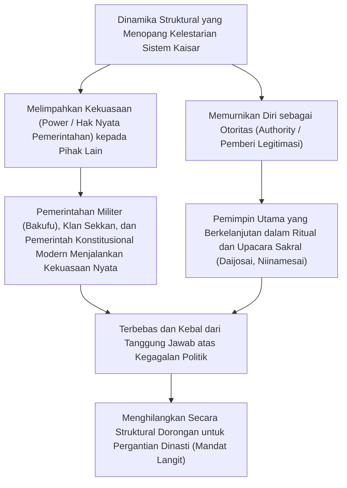
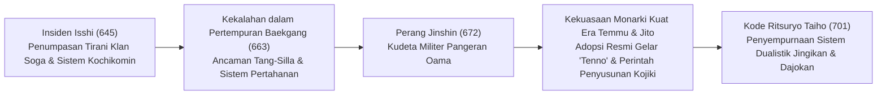
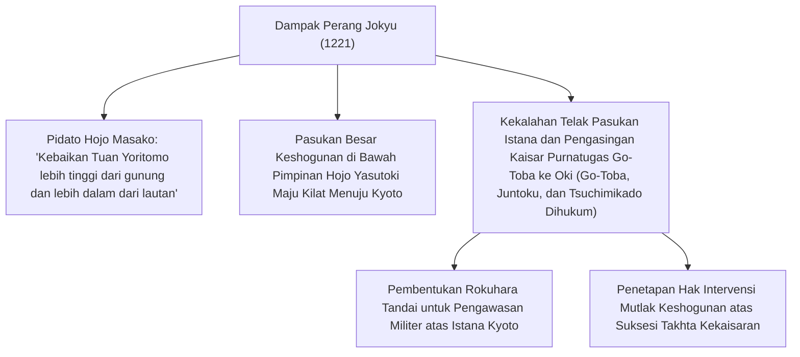
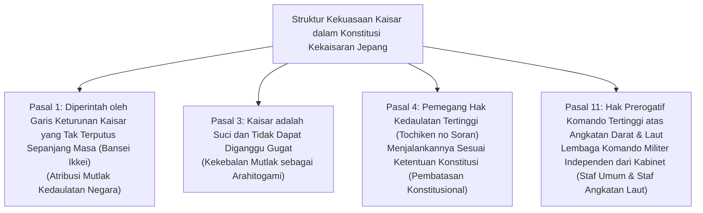
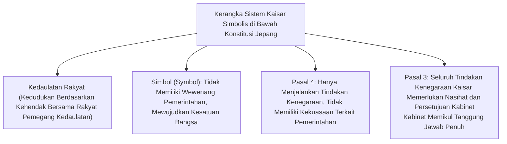
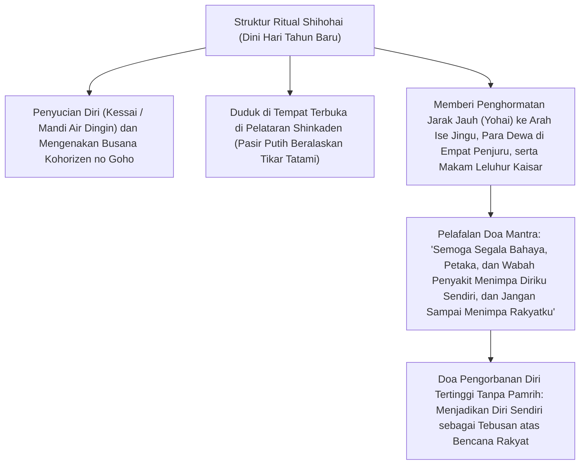
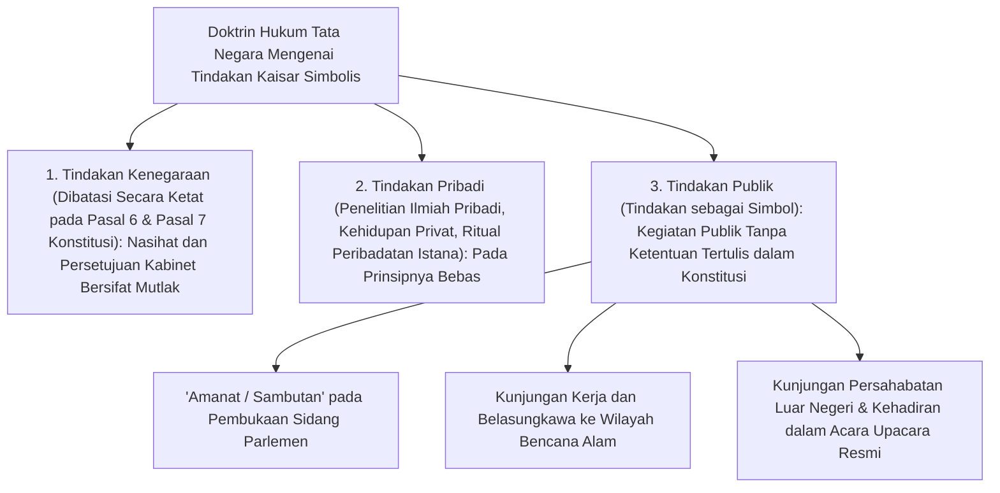

## 1. Pendahuluan: Garis Keturunan Turun-Temurun Tertua di Dunia dan "Pemisahan Kekuasaan dan Otoritas"

### 1.1 Wacana Bansei Ikkei serta Realitas Historis dan Arkeologis

Sejarah Kaisar Jepang (*Emperor of Japan* / *Tenno*) dan Rumah Tangga Kekaisaran memiliki kontinuitas yang sangat unik dan tiada tandingannya jika dibandingkan dengan keluarga kerajaan atau dinasti mana pun yang masih ada di dunia saat ini. Bahkan Guinness World Records mengakuinya secara resmi sebagai "dinasti monarki turun-temurun tertua yang masih bertahan di dunia" (*The oldest continuous hereditary monarchy*).

Wacana "Bansei Ikkei" (*Bansei Ikkei*: garis keturunan tunggal yang tak terputus sepanjang masa) yang dikedepankan oleh mazhab Kokugaku modern dan Pasal 1 Konstitusi Kekaisaran Jepang (Konstitusi Meiji) memang sarat dengan muatan ideologis mitologis. Namun, ditinjau dari sudut pandang historiografi empiris dan bukti-bukti arkeologis mutakhir, **fakta bahwa setidaknya sejak masa Kaisar Yuryaku (Raja Agung Wakatakeru) pada paruh kedua abad ke-5, atau sejak Kaisar Keitai pada awal abad ke-6, sebuah garis keturunan kerajaan tunggal telah berlanjut di ruang kepulauan yang sama selama lebih dari 1.500 tahun** merupakan kenyataan sejarah yang tak terbantahkan secara akademis.

Apabila kita meninjau sejarah peradaban dunia, di Tiongkok keluarga kekaisaran kerap ditumpas hingga ke akar-akarnya melalui "Revolusi Pergantian Dinasti / Mandat Langit" (*Yixing Geming* / *Dynastic Cycle*) ketika mandat surga berpindah dan nama marga berganti. Di negara-negara Eropa pun dinasti saling berganti silih berganti: Dinasti Norman, Plantagenet, Tudor, Stuart, hingga Dinasti Hanover. Sebaliknya, mengapa hanya di Jepang sebuah garis keturunan kerajaan tunggal dapat bertahan hingga hari ini tanpa pernah mengalami keputusasaan akibat pergantian dinasti?



---

### 1.2 Wawasan Perbandingan Peradaban: "Pemisahan Kekuasaan dan Otoritas"

Sebagaimana ditunjukkan oleh sejarawan pemikiran dan pakar perbandingan kebudayaan seperti Masao Maruyama dan Ruth Benedict, karakteristik paling mendasar dari struktur pemerintahan dalam peradaban Jepang terletak pada **pemisahan dualistik yang sangat radikal antara "kekuasaan politik" (*Power*: kekuatan militer, hak memungut pajak, dan administrasi pemerintahan sehari-hari) dan "otoritas tertinggi" (*Authority*: sumber legitimasi serta kesucian religius-simbolis)**.

Monarki absolut di Barat (seperti Louis XIV dari Prancis) atau kaisar lalim di Tiongkok adalah pemegang kekuasaan (*power*) yang memimpin tentara dan mengeluarkan perintah secara langsung, sekaligus pemegang otoritas (*authority*) atas hukum dan ketertiban. Ketika kedua elemen ini menyatu dalam diri satu orang, begitu terjadi salah urus pemerintahan (*misrule*), kekalahan perang, atau kekacauan sosial yang hebat, tanggung jawab akan langsung menimpa pribadi penguasa tersebut, dan pemberontakan akan menggulingkan seluruh keluarganya dari takhta.

Sebaliknya, Kaisar Jepang—sejak era klan Fujiwara pada zaman Heian (pemerintahan perwalian *Sekkan-seiji*), era pemerintahan biara (*Insei*) sejak Shirakawa-in, rezim militer abad pertengahan (Keshogunan Kamakura, Muromachi, dan Edo), hingga kabinet modern—selalu mempertahankan struktur di mana **"kekuasaan pemerintahan duniawi (kekuasaan nyata) senantiasa didelegasikan kepada penasihat eksternal (*Hohitsu*) atau kasta militer (*buke*)"**. Bahkan seorang Shogun di Keshogunan (*Bakufu*), demi membuktikan keabsahan kekuasaannya, harus diangkat secara resmi oleh Kaisar sebagai *Seii Taishogun* (Jenderal Penakluk Barbar).

Tanggung jawab atas kegagalan politik selalu dipikul oleh pihak yang menjalankan kekuasaan nyata, yaitu Keshogunan atau kabinet, yang kemudian runtuh melalui penggulingan kekuasaan (*tobaku*) atau kudeta politik. Namun, Kaisar yang bertindak sebagai sumber legitimasi senantiasa berada di seberang tanggung jawab politik praktis. Oleh karena itu, betapapun hebatnya era pergolakan yang melanda, tidak pernah muncul dorongan rasional bagi para penguasa de facto untuk merebut takhta (*usurpasi*, yakni membunuh kaisar dan mengangkat diri sendiri sebagai kaisar).

---

## 2. Pembentukan Negara Kuno, Lahirnya Gelar "Tenno", dan Ritual Ritsuryo

### 2.1 Peningkatan Status dari Okimi (Raja Agung) Menjadi "Tenno"

Pada zaman Kofun, kepala suku dari pemerintahan Yamato yang bertakhta di pusat kepulauan Jepang disebut "Okimi" (*Okimi* / Raja Agung yang Memerintah di Bawah Langit: *Chitenka Okimi*). Tulisan yang terukir pada pedang besi yang diekskavasi dari Kofun Inariyama di Prefektur Saitama menyebut "Raja Agung Wakatakeru" (Kaisar Yuryaku), yang dengan jelas memperlihatkan karakternya sebagai pemimpin utama (*primus inter pares*) dari konfederasi klan-klan bangsawan berpengaruh (*uji-kabane*).

Pada akhir abad ke-6 hingga awal abad ke-7, Pangeran Shotoku (Pangeran Umayado) dan Soga no Umako, yang mendukung kenaikan takhta Kaisar Wanita Suiko, menetapkan Sistem Dua Belas Tingkat Pangkat Topi (sistem pangkat pejabat berdasarkan bakat individu, bukan keturunan keluarga) dan Konstitusi Tujuh Belas Pasal ("Harmoni harus dijunjung tinggi", "Hormatilah Tiga Permata", "Patuhi titah kaisar dengan penuh kehati-hatian"). Sebagaimana tercermin dalam surat kenegaraan yang dikirimkan kepada Kaisar Yang dari Dinasti Sui: *"Dari Putra Langit di tempat matahari terbit, kepada Putra Langit di tempat matahari terbenam, semoga Anda senantiasa dalam keadaan sejahtera,"* Jepang melepaskan diri dari sistem upeti tributer (*sakuhou*) Kekaisaran Tiongkok dan memproklamasikan kemerdekaannya sebagai "Putra Langit" (*Tenshi*) yang setara dan berdaulat.

Dalam **"Insiden Isshi" (Reformasi Taika)** pada tahun 645, Pangeran Naka no Oe (kelak Kaisar Tenji) dan Nakatomi no Kamatari (leluhur klan Fujiwara) membunuh Soga no Iruka yang bertindak tiran di dalam istana kekaisaran. Mereka menolak penguasaan privat atas tanah dan rakyat oleh klan-klan bangsawan, serta mencanangkan cita-cita sistem *Kochikomin* (kepemilikan publik atas tanah dan rakyat), di mana seluruh tanah dan rakyat dinyatakan sebagai milik negara (Kaisar).



---

### 2.2 Perang Jinshin (672) dan Otoritas Mutlak Kaisar Temmu

Titik balik paling krusial dalam sejarah kuno Jepang adalah perang saudara suksesi kekaisaran yang meletus pascakematian Kaisar Tenji, yaitu **"Perang Jinshin (672)"**. Pangeran Oama, yang mengasingkan diri di Yoshino, memobilisasi kekuatan militer dari wilayah timur (Mino dan Owari) untuk menghancurkan Pangeran Otomo di Istana Omi dalam serangan kilat, dan kemudian naik takhta di Istana Asuka Kiyomihara (**Kaisar Temmu**).

Di bawah pemerintahan Kaisar Temmu dan permaisurinya, Kaisar Wanita Jito, kerangka dasar kekuasaan monarki Ritsuryo kuno disempurnakan:
1. **Adopsi Resmi Gelar "Tenno"**:
   - Gelar tertinggi "Tenno" (Kaisar), yang diyakini berakar dari dewa tertinggi Taoisme *Tenno Daitei* (personifikasi Bintang Kutub Utara), mulai digunakan secara resmi sebagaimana terbukti pada slip kayu (*mokkan*) dan prasasti logam/batu.
2. **Penetapan Nama Negara "Nihon / Nippon"**:
   - Menggantikan sebutan sebelumnya "Wa-koku", ditetapkanlah nama negara yang agung, "Nihon" (asal mula matahari / negeri matahari terbit).
3. **Penyusunan Kitab Sejarah dan Mitologi Resmi**:
   - Atas dekrit kekaisaran Kaisar Temmu, dimulailah penyusunan *Kojiki* (selesai 712) dan *Nihon Shoki* (selesai 720), yang mengkodifikasi tradisi lisan berbagai klan serta menautkan legitimasi silsilah kekaisaran langsung kepada dewi matahari Amaterasu.

---

### 2.3 Struktur Mendalam Mitologi Kiki dan Tiga Pusaka Kekaisaran

Sistem mitologi yang dinarasikan dalam *Kojiki* dan *Nihon Shoki*, yang terbentang dari dewi leluhur kekaisaran Amaterasu Omikami hingga Kaisar Jimmu yang pertama, meletakkan dasar keagamaan dan kosmologis bagi otoritas Kaisar.

- **Turunnya Cucu Surgawi (Tenson Korin) dan "Tiga Sabda Ilahi Agung" (San Dai Shinchoku)**:
  - Ketika Amaterasu mengutus cucunya, Ninigi no Mikoto, untuk turun ke bumi (Puncak Takachiho), titah paling mendasar yang diberikannya adalah **"Sabda Ilahi tentang Keabadian Takhta Langit dan Bumi" (*Tenjo Mukyu no Shinchoku*)**:
  > *"Negeri Dataran Bulir Padi yang Subur (Toyoashihara no Chi-i-ho-aki no Mizuho no Kuni) adalah tanah di mana keturunanku harus memerintah sebagai raja. Pergilah engkau, wahai Cucu Kekaisaran, dan perintahlah negeri itu. Berangkatlah! Kejayaan takhta kekaisaranmu akan abadi tanpa batas, setara dengan langit dan bumi."*
  - Ini adalah perjanjian sakral (*covenant*) yang menegaskan bahwa hak memerintah di bumi dianugerahkan secara abadi kepada Cucu Surgawi dan keturunannya berdasarkan kehendak para dewa langit.
  - Selain itu, diturunkan pula "Sabda Ilahi Pemuliaan Cermin Suci" (*Hokyo Hosai no Shinchoku*), yang memerintahkan agar cermin suci disembah sebagai jiwa dari Amaterasu sendiri, serta "Sabda Ilahi Bulir Padi Taman Suci" (*Yu Niwa Inaho no Shinchoku*), yang menitahkan budidaya bulir padi dari taman suci surgawi di atas bumi.
- **Tiga Pusaka Kekaisaran (*Sanshu no Jingi*)**:
  1. **Yata no Kagami (Cermin Yata)**: Melambangkan kebijaksanaan dan kesucian matahari (*goshintai* di Kuil Dalam Ise Jingu; replika sakralnya disemayamkan di Istana Kekaisaran).
  2. **Yasakani no Magatama (Permata Yasakani)**: Melambangkan belas kasih dan kekuatan spiritual (disimpan secara permanen di Ruang Kenji di Istana Kekaisaran).
  3. **Kusanagi no Tsurugi (Pedang Kusanagi / Ame no Murakumo no Tsurugi)**: Melambangkan keberanian dan keperkasaan militer (*goshintai* di Kuil Atsuta Jingu; replika sakralnya disemayamkan di Istana Kekaisaran).
  - Dalam upacara aksesi takhta kaisar dari generasi ke generasi, "Upacara Penerusan Pedang dan Permata" (*Kenji-to-Shokei no Gi*) diposisikan sebagai bukti mutlak dan tak terpisahkan dari legitimasi takhta kekaisaran.

---

### 2.4 Sistem Dualistik Kode Ritsuryo: Jingikan, Dajokan, dan Daijosai

Struktur birokrasi kuno yang disempurnakan dalam "Kode Ritsuryo Taiho" pada tahun 701, meskipun mengadopsi model sistem Ritsuryo dari Dinasti Tang, melakukan modifikasi mendasar yang sangat khas Jepang.

Dalam sistem Dinasti Tang, badan ritual keagamaan (*Taichang Si*) ditempatkan di bawah lembaga administratif tertinggi (*Tiga Departemen*: Shangshu Sheng, Zhongshu Sheng, Menxia Sheng). Sebaliknya, sistem Ritsuryo Jepang menyejajarkan—bahkan menempatkan di posisi yang lebih tinggi—**Jingikan** (Departemen Urusan Pemujaan / Shinto) di samping **Dajokan** (Dewan Negara Agung) yang mengoordinasikan urusan pemerintahan sekuler (Sistem Dua Dewan dan Delapan Kementerian / *Nikan Hassho-sei*).

Tugas harian Kaisar yang paling esensial bukanlah urusan pemerintahan administratif (*seimu* / keputusan politik praktis), melainkan **"Shinji" (ritual sakral dan doa kepada para dewa dan Buddha yang tak kasatmata)**:
- **Niinamesai (Festival Panen Baru)**: Diselenggarakan setiap bulan November, di mana hasil panen biji-bijian baru tahun itu dipersembahkan kepada para dewa, dan Kaisar sendiri turut memakannya. Ritual ini menyatukan dewa dan manusia dalam santapan bersama (*Shinjin Kyoshoku*), seraya memanjatkan doa bagi ketenteraman negara dan kelimpahan lima palawija.
- **Daijosai (Upacara Penobatan Agung / Aksesi Sakral)**: Ritual esoteris sekali seumur hidup yang dilaksanakan pertama kali setelah seorang kaisar baru naik takhta. Dua paviliun sederhana bergaya kuno yang disebut Aula Yuki (*Yuki-den*) dan Aula Suki (*Suki-den*) dibangun dari awal. Sepanjang malam suntuk, Kaisar mempersembahkan biji-bijian baru kepada dewa leluhur kekaisaran dan turut menyantapnya. Melalui proses ini, Kaisar menyerap roh kaisar (*Tenno-rei* / kekuatan spiritual leluhur kekaisaran) ke dalam raganya, terlahir kembali (*rebirth*) sebagai monarki spiritual yang sejati.

Bagaimanapun kekuasaan politik praktis berganti tangan dari waktu ke waktu, peran sebagai "Imam Agung yang tanpa pamrih terus berdoa kepada para dewa demi kesejahteraan bangsa dan rakyat" inilah yang menjadi inti abadi tak tergoyahkan dari sistem Kaisar.

---

## 3. Struktur Ganda Otoritas dan Kekuasaan pada Zaman Pertengahan dan Pra-Modern

### 3.1 Pemerintahan Sekkan dan Insei: Dinamika Kekuasaan di Lingkungan Istana

Pada zaman Heian, struktur politik di seputar Kaisar mengalami proses penyempurnaan dan transformasi yang sangat canggih:

- **Pemerintahan Perwalian Klan Fujiwara / Sekkan-seiji (Abad ke-10 hingga ke-11)**:
  - Cabang Utara Klan Fujiwara (*Fujiwara Hokke*, pada puncak kejayaan Michinaga dan Yorimichi) menikahkan putri-putri mereka dengan kaisar-kaisar yang bertakhta (*chugu* / permaisuri). Ketika seorang pangeran lahir dari pernikahan tersebut, kaisar belia ini segera dinobatkan, sehingga sang kakek dari garis ibu (*gaiseki*) dapat menjabat sebagai "Sessho" (Bupati / Wali bagi kaisar anak) dan "Kampaku" (Kanselir Utama setelah kaisar dewasa).
  - Tanpa pernah merampas otoritas kaisar, mereka memegang kendali penuh atas wewenang kepegawaian istana dan pengambilan keputusan kenegaraan semata-mata melalui posisi mereka sebagai kerabat dari garis ibu.
- **Lahirnya Pemerintahan Biara / Insei (Akhir Abad ke-11 dan Seterusnya)**:
  - Pada tahun 1086, Kaisar Shirakawa turun takhta dan menyerahkannya kepada putranya yang masih belia, Kaisar Horikawa. Shirakawa bergelar "Joko" (Kaisar Purnatugas / *Daijo Tenno*) dan mendirikan kantor pribadinya (*In-no-cho*) di luar kompleks istana kekaisaran (di Shirakawa-in).
  - Sebagai "Chiten no Kimi" (Kepala Rumah Tangga Keluarga Kekaisaran), Kaisar Purnatugas berhasil menyingkirkan klan Sekkan dan merebut kembali kekuasaan pemerintahan nyata. Dengan mencukur rambut menjadi biarawan Buddha (*Hoo* / Kaisar Biara), ia terbebas dari kekangan etika Konfusianisme dan hukum Ritsuryo yang membatasi kaisar bertakhta, sehingga dapat menjalankan kekuasaan monarki yang sangat otokratis.

---

### 3.2 Lahirnya Rezim Militer dan Perang Jokyu (1221)

Pada paruh kedua abad ke-12, pascapenumpasan rezim klan Taira, Minamoto no Yoritomo mendirikan **"Keshogunan Kamakura"** di Kamakura, Jepang timur.
Yoritomo memperoleh jabatan resmi "Seii Taishogun" dari istana, serta mengantongi dekrit kekaisaran untuk menempatkan Shugo (gubernur militer) dan Jito (pengurus tanah bangsawan) di seluruh negeri (Dekrit Kekaisaran Bunji, 1185). Sejak saat itu, terbentuklah struktur kekuasaan ganda sipil-militer (*Kobu Nigen Shihai*): "Istana Kekaisaran (Bangsawan Kuge)" di barat (Kyoto) dan "Keshogunan (Ksatria Samurai Buke)" di timur (Kamakura).

Tokoh yang melakukan pertaruhan besar untuk membalikkan arus dominasi militer ini adalah **Kaisar Purnatugas Go-Toba**, seorang penguasa dengan kecerdasan dan keberanian luar biasa.
Pada tahun 1221, Go-Toba mengeluarkan titah biara (*Inzen*) yang memerintahkan penumpasan Wali Keshogunan Kamakura, Hojo Yoshitoki, dan menyerukan para ksatria samurai di seluruh negeri untuk bangkit memberontak (**Perang Jokyu**).



Hasil dari Perang Jokyu adalah kemenangan telak bagi pihak samurai. Peristiwa di mana kasta militer secara terbuka mengabaikan titah biara istana dan bahkan menghukum buang Kaisar Purnatugas yang merupakan *Chiten no Kimi* menelanjangi kenyataan politik secara gamblang: "Istana yang tidak memiliki kekuatan militer tidak akan pernah mampu melawan kekuatan samurai." Keshogunan Kamakura mulai mengintervensi langsung suksesi takhta kekaisaran, dan kelak bertindak sebagai arbiter yang menetapkan pergantian takhta bergilir (*Ryoto Tetsuritsu*) antara Garis Daikakuji (cikal bakal Istana Selatan) dan Garis Jimyoin (cikal bakal Istana Utara).

---

### 3.3 Restorasi Kenmu dan Pergolakan Zaman Nanbokucho

Pada tahun 1333, Kaisar Go-Daigo memobilisasi para panglima samurai seperti Ashikaga Takauji, Nitta Yoshisada, dan Kusunoki Masashige untuk menumbangkan Keshogunan Kamakura, lalu memproklamasikan pemerintahan langsung di bawah Kaisar yang dikenal sebagai **"Restorasi Kenmu"**.

Namun, kebijakan pemerintahan baru ini mengabaikan tuntutan penghargaan (*onsho*) dari kasta samurai, bersikap anakronistik dengan mengistimewakan kaum bangsawan istana (*kuge*), dan menjalankan monarki absolut reaksioner, sehingga runtuh hanya dalam waktu dua tahun lebih. Ashikaga Takauji memberontak, mendirikan Keshogunan Muromachi di Kyoto dengan menobatkan Kaisar Komyo (dari Garis Jimyoin), sementara Kaisar Go-Daigo melarikan diri ke pegunungan Yoshino dan tetap mengklaim legitimasi takhtanya.

Sejak saat itu, berlangsunglah **"Periode Nanbokucho (Zaman Istana Utara dan Selatan, 1336–1392)"** selama kurang lebih 60 tahun, di mana **"Istana Utara"** di Kyoto dan **"Istana Selatan"** di Yoshino saling berebut legitimasi dalam perang saudara yang berkepanjangan. Pada tahun 1392, melalui mediasi Shogun ke-3 Keshogunan Muromachi, Ashikaga Yoshimitsu, tercapailah "Perjanjian Damai Meitoku (Penyatuan Istana Utara dan Selatan)". Tiga Pusaka Kekaisaran diserahkan dari Kaisar Go-Kameyama di Istana Selatan kepada Kaisar Go-Komatsu di Istana Utara. (Meskipun silsilah biologis kaisar turun-temurun berlanjut dari Kaisar Go-Komatsu dari Istana Utara hingga saat ini, sejak era Meiji secara resmi diakui bahwa legitimasi historis ortodoks berada di pihak Istana Selatan karena merekalah yang terus memegang Tiga Pusaka Kekaisaran selama periode perpecahan tersebut).

Pada puncak kejayaan Muromachi, Ashikaga Yoshimitsu dianugerahi gelar "Raja Jepang" (*Nihon Kokuo*) oleh Kaisar Yongle dari Dinasti Ming Tiongkok dan bahkan berupaya menaikkan putranya ke takhta kekaisaran, menjadikannya sosok yang dianggap paling dekat dengan "perampasan takhta kaisar" (*usurpasi*). Namun, dengan kematiannya yang mendadak, ambisi tersebut lenyap tanpa bekas.

---

### 3.4 Kinchu narabini Kuge Shohatto Keshogunan Tokugawa dan Ketentuan "Pendidikan/Kesarjanaan"

Selama kekacauan zaman Sengoku, keuangan istana kekaisaran jatuh miskin hingga ke titik nadir. Keadaannya begitu merana sampai-sampai Kaisar Go-Nara harus menjual kaligrafi kekaisaran tulisan tangannya sendiri (*shinkan*, berupa puisi waka dan Sutra Hati) demi menutup biaya kebutuhan istana. Kendati demikian, para penakluk pemersatu negeri—Oda Nobunaga, Toyotomi Hideyoshi, dan Tokugawa Ieyasu—tidak ada satu pun yang menghapuskan institusi Kaisar. Sebaliknya, mereka memberikan sumbangan finansial yang sangat besar, serta menerima pelantikan jabatan resmi dari kaisar seperti Kampaku, Daijo-daijin, atau Seii Taishogun guna memperkokoh legitimasi kekuasaan rezim mereka.

Tokugawa Ieyasu, yang berhasil menyatukan seluruh negeri, pada tahun 1615 mengundangkan **"Kinchu narabini Kuge Shohatto" (Peraturan Istana dan Kaum Bangsawan, 17 pasal)** yang mengikat istana kekaisaran secara hukum secara total. Pada pasal pembuka (Pasal 1) ditegaskan secara eksplisit:

> **"Mengenai berbagai keahlian Sang Putra Langit: yang paling utama adalah Pengkajian Ilmu Pengetahuan (O-gakumon)."**

Niat sejati di balik pasal ini sangat dingin dan kalkulatif: "Hal yang wajib ditekuni oleh Kaisar adalah kesarjanaan, tata krama istana kuno (*yusoku kojitsu*), dan seni puisi waka; Kaisar sama sekali tidak boleh mencampuri urusan politik praktis dan urusan militer."
Sebagaimana disimbolkan oleh Insiden Jubah Ungu (*Shie Jiken*, 1629: peristiwa di mana Keshogunan secara sepihak membatalkan dekrit kaisar yang menganugerahkan jubah ungu kepada biksu tinggi tanpa izin Keshogunan, yang memicu protes Kaisar Go-Mizunoo hingga beliau turun takhta secara mendadak), Kaisar pada zaman Edo dikurung jauh di dalam Istana Kekaisaran Kyoto. Mereka dilumpuhkan dan dijinakkan secara total menjadi "eksistensi simbolis bagi ritual dan kesarjanaan" murni yang tidak dapat menjalankan kekuasaan politik riil barang satu milimeter pun.

---

## 4. Restorasi Meiji dan Pembentukan Negara Modern Berporoskan "Arahitogami"

### 4.1 Dari Sonno Joi Menuju Pemulihan Monarki (Osei Fukko)

Sejak pertengahan zaman Edo, didorong oleh penyusunan *Dai Nihonshi* (Sejarah Agung Jepang) oleh Domain Mito dan berkembangnya mazhab Kokugaku (Motoori Norinaga dan kawan-kawan), gagasan loyalitas kepada kaisar (*Sonno*) meresap kuat ke dalam kasta samurai. Berkembanglah pemahaman bahwa "Shogun di Keshogunan hanyalah pihak yang menerima delegasi kekuasaan pemerintahan dari Kaisar semata" (*Taisei Inin-ron*).

Ketika kedatangan Komodor Perry pada tahun 1853 (Kapal Hitam) menelanjangi ketidakmampuan Keshogunan Tokugawa dalam menghadapi krisis eksternal dari bangsa asing, gelombang fanatisme "Sonno Joi" (Hormati Kaisar, Usir Orang Barbar) meledak di kalangan samurai rendahan dan para pejuang revolusioner (*shishi*). Kaisar Komei mengeluarkan titah pengusiran bangsa barbar, dan domain-domain kuat seperti Choshu dan Satsuma mengonsolidasikan kekuatan politik mereka dengan menjadikan istana kekaisaran sebagai pusat gravitasi politik.

Pada Oktober 1867, Shogun ke-15 Tokugawa Yoshinobu mengajukan *Taisei Hokan* (Pengembalian Kekuasaan Pemerintahan kepada Kaisar). Pada 9 Desember tahun yang sama, atas inisiatif Iwakura Tomomi dan Saigo Takamori dari Satsuma, dimaklumkanlah **"Dekrit Pemulihan Kekuasaan Monarki" (*Osei Fukko no Daigoro*)**:
- Keshogunan (*Bakufu*), jabatan Wali (*Sessho*), dan Kanselir (*Kampaku*) dihapuskan secara total.
- Diproklamasikan pembentukan pemerintahan baru yang berpusat pada kekuasaan langsung Kaisar (*shinsei*), dengan kembali pada landasan pendirian negara pada masa Kaisar Jimmu yang pertama.
- Kaisar Meiji yang berusia 16 tahun naik takhta; nama kota Edo diubah menjadi "Tokyo", dan istana kaisar dipindahkan dari Kyoto ke Istana Tokyo (bekas Istana Edo).

---

### 4.2 Dualisme Konstitusional Konstitusi Kekaisaran Jepang (Konstitusi Meiji, 1889)

Para pendiri negara era Meiji, yang dipimpin oleh Hirobumi Ito, menyusun **"Konstitusi Kekaisaran Jepang"** (Konstitusi Meiji) dengan mengambil model konstitusionalisme Prusia (Jerman) yang disesuaikan secara cermat dengan kondisi nasional Jepang.



Dalam sistem Konstitusi Meiji, kedudukan Kaisar memiliki "ambivalensi (karakter ganda)" yang sangat tinggi:
1. **Aspek Tradisional-Religius**: Kaisar adalah keturunan langsung para dewa, sumber moralitas nasional, serta dewa yang hidup dan mewujud (*Arahitogami*) yang suci dan tidak dapat diganggu gugat.
2. **Aspek Modern-Konstitusional**: Kaisar adalah monarki konstitusional yang menjalankan hak-hak kedaulatan "sesuai dengan ketentuan-ketentuan Konstitusi". Kaisar tidak dapat mengeluarkan dekrit diktatoris sewenang-wenang seperti presiden absolut; pelaksanaan kekuasaan eksekutif memerlukan "nasihat dan bantuan" (*Hohitsu*) dari para Menteri Negara (Pasal 55), dan kekuasaan legislatif memerlukan persetujuan Parlemen Kekaisaran (*Teikoku Gikai*).

Pada zaman Taisho, **"Teori Organ Kaisar" (*Tenno Kikansetsu*)** yang dipelopori oleh Profesor Fakultas Hukum Universitas Kekaisaran Tokyo, Tatsukichi Minobe—yakni teori yang menyatakan bahwa negara adalah suatu badan hukum (*juridical person*), kedaulatan melekat pada negara sebagai badan hukum tersebut, dan Kaisar adalah organ tertinggi di dalam badan hukum tersebut—menjadi landasan teori hukum tata negara bagi sistem kabinet partai pada era Demokrasi Taisho.

Kendati demikian, Konstitusi Meiji menanamkan sebuah cacat struktural yang fatal, yaitu **Pasal 11 tentang "Independensi Hak Komando Tertinggi Militer" (*Tosuiken no Dokuritsu*)**, di mana komando militer atas Angkatan Darat dan Angkatan Laut tidak berada di bawah nasihat kabinet, melainkan organ-organ komando militer (Staf Umum Angkatan Darat dan Staf Angkatan Laut) bertanggung jawab langsung kepada Kaisar secara terpisah. Ketika memasuki zaman Showa dan militer menggunakan hak prerogatif komando ini sebagai perisai untuk melepaskan diri sepenuhnya dari kendali kabinet dan parlemen, benteng konstitusionalisme tersebut runtuh dengan mengenaskan.

---

## 5. Pergolakan Showa, Kekalahan Perang, dan Transformasi Dramatis Menuju "Sistem Kaisar Simbolis"

### 5.1 Bencana Awal Showa dan "Keputusan Suci" (Seidan) untuk Mengakhiri Perang

Pada dekade 1930-an, melalui isu pelanggaran hak komando militer (*Tosuiken Kampan Mondai*), Insiden 15 Mei, dan Insiden 26 Februari, politik kepartaian menemui ajalnya. Jepang terjerumus ke dalam kediktatoran militer, kubangan Perang Tiongkok-Jepang Kedua, dan akhirnya meletusnya Perang Pasifik pada tahun 1941.

Shinto Negara didogmakan hingga ke titik ekstrem, dan rakyat didoktrin bahwa "mengorbankan nyawa demi Kaisar" adalah kebajikan moral tertinggi. Namun, Kaisar Showa sendiri terus mengalami penderitaan batin yang mendalam, terjepit di antara posisinya sebagai monarki konstitusional yang tidak dapat membatalkan keputusan kabinet dan markas komando militer, serta hasrat dan doanya bagi perdamaian.

Pada Agustus 1945, dihadapkan pada pengeboman atom di Hiroshima dan Nagasaki serta deklarasi perang oleh Uni Soviet, Dewan Pimpinan Perang Tertinggi terbelah dua sama kuat antara opsi menyerah tanpa syarat demi mempertahankan "Kokutai" (keberlanjutan Rumah Tangga Kekaisaran) atau bertempur habis-habisan hingga tetes darah penghabisan (pertempuran di tanah air Jepang / kehancuran seratus juta rakyat secara terhormat: *Ichioku Sokyokusai*).
Dalam Konferensi di Hadapan Kaisar (*Gozen Kaigi*) di dalam bunker perlindungan serangan udara pada 10 dan 14 Agustus, ketika Perdana Menteri Kantaro Suzuki memohon pandangannya, Kaisar Showa dengan berurai air mata menjatuhkan **"Keputusan Suci" (*Seidan*)** yang bersejarah:

> **"Tugasku adalah menyelamatkan rakyat. Bagaimanapun nasib yang akan menimpa diriku sendiri, aku tidak tahan lagi melihat rakyatku terus berguguran dalam kobaran api perang dan peradaban umat manusia dihancurkan. ... Aku memutuskan untuk mengakhiri perang ini dengan menahan apa yang tak tertahankan dan menanggung apa yang tak tertanggungkan."**

Pada siang hari tanggal 15 Agustus, melalui Siaran Suara Kaisar (*Gyokuon Hoso* / Reskrip Penghentian Perang), perang pun berakhir. Tanpa adanya intervensi langsung melalui kata-kata Kaisar ini, pertempuran di daratan utama Jepang hampir pasti akan menelan jutaan korban jiwa tambahan.

---

### 5.2 Pertemuan dengan MacArthur dan Penghindaran Pengadilan Tokyo

Pasca-kekalahan perang, Markas Besar Sekutu (GHQ) yang dipimpin oleh Panglima Tertinggi Sekutu Jenderal Douglas MacArthur mendarat di Jepang. Opini publik negara-negara Sekutu—termasuk Amerika Serikat, Inggris, dan Uni Soviet—sebagian besar menuntut agar Kaisar Showa dieksekusi sebagai "penjahat perang nomor satu" dan sistem kekaisaran dihapuskan secara total.

Pada 27 September 1945, Kaisar Showa mengunjungi MacArthur seorang diri di Kedutaan Besar Amerika Serikat. Menurut memoar MacArthur, alih-alih memohon ampunan bagi nyawanya sendiri, Kaisar Showa justru menyatakan hal berikut:

> **"Saya datang ke sini untuk menyerahkan diri saya kepada penghakiman dari kekuatan-kekuatan yang Anda wakili, sebagai pihak yang memikul tanggung jawab penuh atas setiap keputusan dan tindakan politik serta militer yang diambil oleh rakyat saya dalam melancarkan perang. Apapun yang terjadi pada diri saya tidaklah menjadi soal. Saya memohon dengan sangat, berikanlah makanan bagi rakyat saya."**

MacArthur sangat terguncang dan terkesan oleh sikap tanpa pamrih Kaisar tersebut, sehingga ia segera mengukuhkan kebijakan pendudukan untuk "mempertahankan sistem Kaisar dan mengecualikan Kaisar dari penuntutan pidana perang". MacArthur menyimpulkan bahwa jika Kaisar dieksekusi, pemberontakan gerilya berskala jutaan orang akan meletus di seluruh Jepang, sehingga mustahil bagi pasukan Sekutu untuk menjalankan pemerintahan pendudukan yang damai.

Pada 1 Januari 1946, Kaisar Showa mengeluarkan **"Reskrip Pembangunan Jepang Baru" (yang dikenal sebagai Deklarasi Kemanusiaan / *Ningen Sengen*)**. Deklarasi ini menegaskan bahwa ikatan antara Kaisar dan rakyat Jepang tidak didasarkan pada mitos atau konsep ketuhanan kaisar sebagai dewa yang hidup (*Arahitogami*), melainkan bertumpu pada rasa saling percaya dan kasih sayang timbal balik.

---

### 5.3 Pasal 1 Konstitusi Jepang: Pembentukan "Sistem Kaisar Simbolis"

**"Konstitusi Jepang"** yang mulai berlaku pada 3 Mei 1947 mendefinisikan ulang secara fundamental kedudukan hukum Kaisar dalam Pasal 1:

> **Pasal 1: "Kaisar adalah simbol Negara dan simbol kesatuan rakyat, dan kedudukannya didasarkan pada kehendak bersama rakyat yang memegang kedaulatan."**



- **Pencabutan Menyeluruh atas Hak Kedaulatan Memerintah**: Kaisar tidak lagi berkedudukan sebagai kepala negara penguasa (*ruler*), melainkan bertransformasi menjadi "Simbol" (*Symbol*) yang memanifestasikan eksistensi negara itu sendiri serta keutuhan rakyat.
- **Larangan Keterlibatan dalam Urusan Pemerintahan Negara (Pasal 4)**: Kaisar hanya berwenang melaksanakan "tindakan kenegaraan" (*Kokuji-koi*) yang bersifat formal dan seremonial sebagaimana dirinci dalam Konstitusi (seperti pembukaan sidang parlemen, pengangkatan Perdana Menteri, ratifikasi perjanjian internasional, penganugerahan tanda kehormatan), dan sama sekali tidak memiliki wewenang politis terkait urusan pemerintahan (*kokusei*).
- **Nasihat dan Persetujuan Kabinet (Pasal 3)**: Seluruh tindakan kenegaraan Kaisar mutlak memerlukan nasihat dan persetujuan dari Kabinet, dan segala tanggung jawab politik sepenuhnya dipikul oleh Kabinet.

"Sistem Kaisar Simbolis" ini kerap dipandang secara dangkal sebagai institusi asing yang dipaksakan oleh pasukan pendudukan Sekutu. Namun, jika dilihat dari bentang panjang sejarah Jepang yang telah diuraikan sebelumnya, sistem ini dapat ditafsirkan sebagai **sebuah kepulangan dalam bentuknya yang paling murni menuju struktur tradisional sejak zaman pertengahan—di mana Kaisar tidak pernah menjalankan kekuasaan politik riil, melainkan mendedikasikan diri sepenuhnya pada otoritas sakral dan doa**.

---

## 2.5 Struktur Ritual Peribadatan Istana (Kyuchu Saishi) dan Dinamika Spiritual "Shihohai"

Untuk memahami eksistensi sejati Kaisar, seseorang wajib menembus relung terdalam dari **"Peribadatan Istana" (*Kyuchu Saishi* / *Imperial Court Rituals*)**, yang diwariskan secara turun-temurun tanpa henti di dalam lingkungan Rumah Tangga Kekaisaran sebagai ranah privat yang terpisah sepenuhnya dari "tindakan kenegaraan" formal berdasarkan Konstitusi Jepang.

Di tengah keheningan lebat Hutan Fukiage di dalam kompleks Istana Kekaisaran Tokyo, berdiri megah **"Tiga Tempat Suci Istana" (*Kyuchu Sanden*)**:
1. **Kashikodokoro**: Tempat persemayaman suci bagi replika Yata no Kagami (Cermin Yata), wujud sakral (*goshintai*) dari dewi leluhur kekaisaran, Amaterasu Omikami.
2. **Koreiden**: Tempat pemuliaan roh suci para kaisar terdahulu dan anggota keluarga kekaisaran sejak masa Kaisar Jimmu.
3. **Shinden**: Tempat pemujaan bagi seluruh dewa langit dan dewa bumi (*Tenjin Chigi* / delapan juta dewa Shinto).

Sepanjang tahun, Kaisar memimpin sendiri puluhan upacara peribadatan yang khidmat dan sakral. Di antara seluruh ritual tersebut, upacara yang paling menggetarkan batin spiritual adalah **"Shihohai" (Penghormatan ke Empat Penjuru Mata Angin)**, yang diselenggarakan pada dini hari Tahun Baru (pukul 05.30 pagi) di tengah udara musim dingin yang menusuk tulang.



Kaisar menyucikan raga dengan siraman air dingin (*kessai*), mengenakan busana upacara kuno berwarna kuning kecokelatan (*Kohorizen no Goho*), lalu duduk di atas tikar tatami yang dihamparkan di atas hamparan pasir putih di pelataran terbuka Shinkaden. Dari sana, Kaisar bersujud membungkuk dalam-dalam melakukan penghormatan jarak jauh (*yohai*) ke arah Kuil Ise Jingu, pegunungan, sungai, dan para dewa di segenap penjuru mata angin, serta makam para kaisar leluhur. Kemudian, beliau melafalkan doa mantra kuno yang tercatat dalam kitab upacara zaman Heian:

> **"Segala ancaman penjahat, wabah penyakit menular, malapetaka air dan api yang hendak menimpa segenap rakyat jelata, biarlah terlebih dahulu melewati dan menimpa tubuh hamba (Jika malapetaka hendak menimpa rakyatku, biarlah tubuhku sendiri yang terlebih dahulu menanggungnya)."**

Mempersembahkan diri sendiri ke hadapan para dewa sebagai "kambing hitam / tebusan tertinggi (*scapegoat*)" yang memikul seluruh bencana yang mengancam bangsa dan rakyat: inilah hakikatnya. Bukan kekuasaan untuk mendominasi dan mengendalikan orang lain, melainkan kesediaan mengorbankan diri sendiri demi mendoakan kebahagiaan sesama manusia tanpa pamrih. Semangat imamat dan pengorbanan diri mutlak dalam ritual peribadatan inilah yang menjadi medan gravitasi tak sadar, yang menorehkan wibawa dan otoritas Kaisar begitu mendalam ke dalam psikologi bawah sadar bangsa Jepang melintasi rentang ribuan tahun.

---

## 3.5 Realitas Historis Para Kaisar Wanita yang Pernah Bertakhta dan Fakta di Balik Teori "Pemerintahan Transisi" (Nakatsugi)

Dalam perdebatan mengenai suksesi takhta kekaisaran, salah satu rujukan historis yang paling sering diangkat adalah keberadaan **"8 tokoh dalam 10 masa pemerintahan Kaisar Wanita" (*Hachifokata Jūdai no Josei Tennō*)** yang nyata pernah memerintah dalam sejarah Jepang.

| Nomor Urut | Nama Kaisar | Masa Pemerintahan | Latar Belakang Penobatan dan Capaian Historis |
| :---: | :--- | :---: | :--- |
| **Ke-33** | **Kaisar Suiko** | 592–628 | Naik takhta sebagai kaisar wanita pertama demi mengatasi krisis kekacauan pascapembunuhan Kaisar Sushun. Bekerja sama dengan Pangeran Shotoku dan Soga no Umako untuk menetapkan Sistem Dua Belas Tingkat Pangkat Topi dan Konstitusi Tujuh Belas Pasal. |
| **Ke-35 / Ke-37** | **Kaisar Kogyoku / Kaisar Saimei** | 642–645 / 655–661 | Menjabat dua kali (*Choso* / naik takhta dua periode terpisah). Menjadi saksi panggung berdarah Insiden Isshi; pada periode Saimei, memimpin langsung ekspedisi militer ke Kyushu untuk persiapan menghadapi Pertempuran Baekgang dan mangkat di garis depan pertempuran. |
| **Ke-41** | **Kaisar Jito** | 690–697 | Permaisuri mendiang Kaisar Temmu. Meneruskan wasiat agung suaminya, membangun ibu kota Fujiwara-kyo, memberlakukan Kode Asuka Kiyomihara, dan memastikan kelanjutan suksesi takhta dengan aman kepada cucunya, Kaisar Mommu. |
| **Ke-43** | **Kaisar Gemmei** | 707–715 | Pemindahan ibu kota ke Heijo-kyo (Nara, 710), perampungan naskah *Kojiki*, dan dekrit kekaisaran untuk penyusunan kitab geografi-budaya *Fudoki*. |
| **Ke-44** | **Kaisar Gensho** | 715–724 | Putri kandung Kaisar Gemmei (satu-satunya kasus suksesi takhta kekaisaran dari ibu kandung kepada anak perempuannya). Perampungan kitab sejarah resmi *Nihon Shoki*, dan penetapan Undang-Undang Sanze Isshin no Ho. |
| **Ke-46 / Ke-48** | **Kaisar Koken / Kaisar Shotoku** | 749–758 / 764–770 | Putri kandung Kaisar Shomu. Menjabat dua kali (*Choso*). Menumpas Pemberontakan Fujiwara no Nakamaro dan mengangkat biarawan Dokyo ke puncak kekuasaan sebagai Raja Hukum (*Hoo*). Melalui Insiden Ramalan Dewa Kuil Usa Hachimangu, berhasil menggagalkan konspirasi perebutan takhta oleh Dokyo. |
| **Ke-109** | **Kaisar Meisho** | 1629–1643 | Awal zaman Edo. Dinobatkan setelah ayahnya, Kaisar Go-Mizunoo, turun takhta secara mendadak sebagai bentuk protes keras terhadap Keshogunan dalam Insiden Jubah Ungu (beliau adalah cucu perempuan dari Shogun ke-2 Tokugawa Hidetada). |
| **Ke-117** | **Kaisar Go-Sakuramachi** | 1762–1770 | Pertengahan zaman Edo. Memerintah pascamangkatnya Kaisar Momozono secara mendadak demi mendampingi jalannya pemerintahan hingga keponakannya, Kaisar Go-Momozono yang masih belia, beranjak dewasa. Merupakan kaisar wanita terakhir dalam sejarah pra-modern Jepang. |

Fakta historis yang terbukti secara tak terbantahkan melalui kajian historiografi kritis adalah bahwa **"seluruh kaisar wanita di masa lalu adalah 'wanita dari garis keturunan ayah' (*Dan-kei Joshi*), yang mana ayah kandung mereka sendiri adalah seorang Kaisar"** (tidak ada satu pun contoh dalam sejarah di mana seorang kaisar wanita menikah dengan rakyat jelata atau bangsawan dinasti luar lalu mewariskan takhta kepada anak keturunan dari garis ibu / *Jo-kei Tenno*).

Selain itu, sebagian besar kaisar wanita tersebut dinobatkan dalam kondisi krisis darurat—seperti ketika calon penerus takhta laki-laki masih berusia terlampau belia atau terjadi kekosongan politik akibat mangkatnya kaisar secara mendadak. Dalam situasi tersebut, kaisar wanita bertindak sebagai sesepuh kekaisaran yang memegang peranan "penjaga transisi" (*nakatsugi* / *pinch-hitter*), guna menghindari perebutan takhta berdarah sebelum tongkat estafet dikembalikan kepada pangeran dari garis keturunan laki-laki (*Dan-kei Danshi*) pada generasi berikutnya.

Namun demikian, pada saat yang sama, fakta sejarah juga menunjukkan secara benderang bahwa tokoh-tokoh seperti Kaisar Wanita Suiko dan Kaisar Wanita Jito bukanlah sekadar penguasa transisi pasif, melainkan pemimpin monarki yang memiliki visi kepemimpinan agung dan wibawa luar biasa yang berhasil meletakkan kerangka dasar negara kuno Jepang. Dalam kebudayaan Jepang kuno, tradisi kepemimpinan dualistik "Hime-Hiko" (di mana kekuatan spiritualitas cenayang wanita yang mampu memanggil roh dewa bersinergi dengan kekuasaan pemerintahan duniawi ksatria pria) diyakini telah mempermudah penerimaan sosiologis masyarakat terhadap kehadiran kaisar wanita di atas takhta.

---

## 4.6 Pembentukan Shinto Negara dan Akrobat Filsafat Modern "Teori Kuil Shinto Bukan Agama" (Jinja Hi-shukyo-ron)

Tantangan intelektual dan politik terbesar yang dihadapi oleh pemerintah Restorasi Meiji adalah bagaimana menciptakan prinsip integrasi sebuah negara-bangsa modern (*Nation-State*) yang sanggup menandingi dominasi kekuatan kolonial Barat.

### ① Badai Prahara Haibutsu Kishaku dan Pemisahan Shinto-Buddha
Hubungan sinkretisme "Shinbutsu Shugo" (penyatuan dewa Shinto dan Buddha, di mana kuil Buddha dibangun di dalam pekarangan kuil Shinto dan para dewa Shinto dipandang sebagai manifestasi lokal dari Buddha berdasarkan doktrin *Honji Suijaku*), yang telah mengakar dan hidup berdampingan secara harmonis selama lebih dari 1.000 tahun, dirobek secara paksa oleh pemerintah Meiji melalui **"Dekrit Pemisahan Shinto dan Buddha" (*Shinbutsu Hanzen-rei* / *Shinbutsu Bunri-rei*)** pada tahun 1868.

Kebijakan ini menyulut ledakan aksi perusakan yang luar biasa brutal di berbagai penjuru negeri, yang dikenal sebagai gerakan **"Haibutsu Kishaku"** (penghapusan Buddhisme dan penghancuran patung Buddha). Patung-patung Buddha dihancurkan berkeping-keping, kitab-kitab sutra suci dibakar, lonceng-lonceng kuil dilebur, dan pagoda-pagoda bersejarah diruntuhkan. Pemerintah pada mulanya berupaya menjadikan Shinto sebagai agama resmi negara melalui "Gerakan Proklamasi Ajaran Agung" (*Daikyo Senpu Undo*). Namun, upaya ini mengalami kegagalan total akibat kuatnya akar keimanan Buddhisme di kalangan rakyat jelata, serta datangnya kritik diplomatik keras dari negara-negara Barat atas pelanggaran kebebasan beragama.

### ② Fiksi Ekstralegal "Teori Kuil Shinto Bukan Agama" (Jinja Hi-shukyo-ron)
Untuk keluar dari kebuntuan ideologis ini, para perancang hukum dan birokrat Meiji (terutama Kowashi Inoue) menciptakan formulasi hukum yang sangat mengejutkan, yaitu fiksi ideologis **"Kuil Shinto Bukanlah Agama" (*Jinja Hi-shukyo-ron*)**.
- Pasal 28 Konstitusi Kekaisaran Jepang secara eksplisit menjamin "kebebasan beragama", mengakui agama Kristen dan Buddhisme sebagai keyakinan pribadi warga negara.
- Di sisi lain, pemerintah mendefinisikan bahwa "ritual dan upacara yang dilaksanakan di kuil-kuil Shinto (seperti Ise Jingu, Kuil Yasukuni, dan lain-lain) bukanlah ritual keagamaan sekuler, melainkan **'kewajiban moral kenegaraan dan upacara penghormatan leluhur bangsa'** yang wajib diikuti oleh segenap warga negara".
- Konsekuensinya, seorang pemeluk Kristen atau Buddha sekalipun, selama ia berstatus sebagai kawula Kekaisaran Jepang (*shinmin*), tidak diizinkan untuk menolak ziarah ke kuil Shinto maupun menolak memberi penghormatan kepada Kaisar. Terciptalah sebuah ruang kemutlakan trans-religius yang disebut "Shinto Negara" (*State Shinto* / *Kokka Shinto*). Akrobat logika filsafat hukum inilah yang di kemudian hari menjadi lahan subur institusional bagi meluasnya kultus militeristik "Arahitogami" (dewa yang hidup) tanpa kendali pada era Showa.

---

## 5.5 Preseden Yuridis Konstitusi dan Batas-Batas Sistem Kaisar Simbolis

Di bawah naungan Konstitusi Jepang pascaperang, sistem Kaisar Simbolis telah mematangkan doktrin penafsirannya melalui serangkaian perdebatan hukum tata negara yang sengit serta pengujian dalam putusan peradilan.



### ① Pengakuan atas "Tindakan Publik (Tindakan sebagai Simbol)"
Pasal 4 Ayat 1 Konstitusi Jepang secara tegas menyatakan: *"Kaisar hanya akan menjalankan tindakan-tindakan yang berkenaan dengan urusan kenegaraan sebagaimana diatur dalam Konstitusi ini."* Jika pasal ini ditafsirkan secara gramatikal murni dan kaku, maka segala aktivitas publik Kaisar di luar tindakan kenegaraan formal—seperti kunjungan ke lokasi bencana alam, penerimaan tamu agung negara asing, atau pembacaan amanat pada upacara pembukaan Parlemen—dapat dianggap bertentangan dengan Konstitusi (*unconstitutional*).

Namun, yurisprudensi peradilan dan penafsiran resmi pemerintah menegaskan doktrin bahwa: "Mengingat Kaisar berkedudukan sebagai simbol negara Jepang, maka secara wajar diakui hak beliau untuk melaksanakan **'tindakan publik (tindakan sebagai simbol)'** yang sesuai dan melekat pada kedudukan tersebut." Seluruh aktivitas ini dinyatakan sah secara konstitusional sepanjang dilaksanakan di bawah kendali, arahan substansial, dan tanggung jawab penuh Kabinet.

### ② Pemisahan Agama dan Negara (Pasal 20 & Pasal 89 Konstitusi) serta Peribadatan Istana
Masalah konstitusional lainnya adalah apakah upacara keagamaan Shinto istana seperti Niinamesai dan Daijosai boleh dibiayai dari anggaran publik negara (Anggaran Istana / *Kyutei-hi*), ataukah wajib dibiayai dari dana pribadi Kaisar (Anggaran Rumah Tangga Kaisar / *Naitei-hi*).

Mahkamah Agung Jepang—melalui putusan bersejarah seperti Kasus Upacara Peletakan Batu Pertama Kuil Tsu (*Tsu Jichinsai*) dan Kasus Persembahan Dupa Kuil Ehime (*Ehime Tamagushiryo*)—menerapkan doktrin "Uji Tujuan dan Efek" (*Purpose and Effect Test*: apakah suatu tindakan bertujuan memajukan makna religius tertentu dan apakah efek utamanya membantu, menindas, atau mengintervensi agama tertentu). Dalam upacara penobatan era Heisei dan Reiwa, pelaksanaan Daijosai diputuskan sah menggunakan dana publik (*Kyutei-hi*) dengan pertimbangan hukum bahwa upacara tersebut merupakan "tradisi upacara bersejarah suksesi takhta Rumah Tangga Kekaisaran yang bernilai seremonial publik kenegaraan".

---

## 6. Dinamika Kaisar Simbolis di Era Modern dan Problematika Suksesi Takhta Kekaisaran

### 6.1 "Perjalanan" di Era Heisei dan Realisasi Turun Takhta (Abdikasi)

Sosok yang menghembuskan napas kehidupan nyata dan memberi wujud konkret pada institusi Kaisar Simbolis adalah Kaisar ke-125 (kini Kaisar Purnatugas / Joko Akihito) bersama Permaisuri Purnatugas Michiko.

Dengan senantiasa merenungkan pertanyaan mendasar "bagaimanakah wujud ideal seorang simbol negara", Joko Akihito secara konsisten mengunjungi berbagai wilayah yang dilanda bencana dahsyat di seantero Jepang (letusan Gunung Unzen-Fugendake, Gempa Bumi Hebat Hanshin-Awaji, hingga Bencana Gempa dan Tsunami Hebat Jepang Timur). Beliau berlutut di lantai tempat pengungsian, menyamakan ketinggian mata dengan para korban bencana, menggenggam tangan mereka, dan memberikan penghiburan yang mendalam. Selain itu, beliau melakukan serangkaian "perjalanan doa perdamaian" ke Okinawa, Hiroshima, Nagasaki, serta medan-medan pertempuran berdarah di Saipan, Pulau Peleliu di Palau, dan Filipina, demi memanjatkan doa bagi para korban perang dan merawat ingatan kolektif sejarah agar tidak sirna ditelan zaman.

Pada 8 Agustus 2016, Kaisar Akihito menyampaikan pesan video yang sangat luar biasa (*O-kimochi*) kepada seluruh rakyat Jepang. Beliau mengungkapkan pergulatan batinnya yang mendalam bahwa seiring bertambahnya usia yang kian senja, fisik beliau mulai merasa sulit untuk dapat terus menunaikan tugas-tugas sebagai simbol negara dengan segenap jiwa dan raga. Merespons kehendak tersebut, Parlemen Jepang mengesahkan "Undang-Undang Khusus Hukum Rumah Tangga Kekaisaran tentang Abdikasi Kaisar" pada tahun 2017. Pada 30 April 2019, untuk pertama kalinya dalam kurun waktu sekitar 200 tahun sejak era Kaisar Kokaku pada zaman Edo, proses "turun takhta selagi hidup" (abdikasi) terlaksana dengan damai dan khidmat. Putra Mahkota Naruhito resmi dinobatkan sebagai Kaisar ke-126, menandai dimulainya era baru, "Reiwa".

---

### 6.2 Isu Hukum Tata Negara dan Kebijakan Hukum Kontemporer Seputar Suksesi Takhta

Pada abad ke-21 ini, krisis paling eksistensial yang membayangi masa depan Rumah Tangga Kekaisaran adalah "menyusutnya jumlah anggota keluarga kekaisaran dan menyempitnya kualifikasi calon penerus takhta".
Pasal 1 Undang-Undang Rumah Tangga Kekaisaran (*Kōshitsu Tempen*) saat ini secara tegas menetapkan: **"Takhta Kekaisaran akan diwarisi oleh keturunan laki-laki dari garis keturunan kaisar laki-laki (Dan-kei Danshi)."**

Saat ini, satu-satunya anggota keluarga kekaisaran dari generasi muda yang memenuhi syarat hukum untuk mewarisi takhta hanyalah Yang Mulia Pangeran Hisahito seorang diri—sebuah kondisi suksesi yang berada di ujung tanduk. Menghadapi dilema ini, opini publik dan diskursus ketatanegaraan terbelah ke dalam tiga opsi usulan kebijakan utama:

| Pokok Masalah | Usulan Kebijakan | Argumen Pendukung | Kekhawatiran / Argumen Penolak |
| :--- | :--- | :--- | :--- |
| **① Penerimaan Kaisar Wanita (Josei Tenno)** | Mengizinkan putri kaisar (perempuan dari garis ayah) untuk naik takhta (misal: penobatan Putri Aiko). | Secara historis terdapat preseden 8 tokoh dalam 10 masa pemerintahan kaisar wanita dari Kaisar Suiko hingga Kaisar Go-Sakuramachi. Sangat selaras dengan sentimen dan simpati rakyat modern. | Tidak menjadi masalah selama terbatas pada perempuan dari garis keturunan ayah (*Dan-kei Joshi*), namun memicu kekhawatiran mendalam bahwa hal ini akan menjadi batu loncatan menuju kaisar dari garis ibu (*Jo-kei Tenno*). |
| **② Penerimaan Kaisar Garis Ibu (Jo-kei Tenno)** | Mengizinkan kenaikan takhta bagi keturunan yang terhubung dengan garis darah kekaisaran hanya melalui garis ibu (misalnya, anak dari kaisar wanita yang menikah dengan pria dari kalangan masyarakat biasa). | Merupakan satu-satunya solusi realistis jangka panjang untuk mencegah kepunahan garis keturunan kekaisaran secara permanen. Selaras dengan prinsip kesetaraan gender universal. | Muncul penolakan luar biasa keras bahwa tradisi suksesi dari garis laki-laki (*Dan-kei*) yang tak pernah terputus selama 126 generasi—yang menjadi fondasi ontologis paling mendasar bagi legitimasi takhta kekaisaran—akan lenyap dan musnah secara fundamental. |
| **③ Pemulihan Status Bekas Cabang Keluarga Kekaisaran (Kyu-Miyake)** | Memulihkan status laki-laki keturunan garis ayah dari 11 bekas cabang keluarga kekaisaran (*Kyu-Miyake*) yang dipaksa melepaskan status kekaisaran pada tahun 1947 atas perintah GHQ, melalui mekanisme adopsi ke dalam keluarga kekaisaran yang ada. | Mampu melestarikan tradisi suksesi laki-laki dari garis ayah (*Bansei Ikkei*) secara sempurna tanpa mengubah hukum fundamental leluhur. | Terdapat kendala psikologis dan emosional yang berat di kalangan masyarakat luas untuk menerima warga sipil biasa—yang telah hidup sebagai rakyat biasa selama hampir 80 tahun pascaperang—tiba-tiba diangkat menjadi anggota keluarga kekaisaran yang bertakhta. |

---

## 7. Kesimpulan: Silsilah Doa dan Lapisan Kebudayaan Terdalam Peradaban Jepang

Sistem Kaisar (*Tenno-sei*), jauh sebelum dipahami sebagai sebuah institusi politik formal, merupakan **"lapisan kebudayaan purba (*archetype*) dari spiritualitas dan doa"** yang telah dipupuk dan dirawat oleh bentang alam Kepulauan Jepang dan manusia yang mendiaminya selama ribuan tahun.

Tidak memamerkan kekuasaannya seperti seorang presiden penguasa,
Tidak menumpuk dan memamerkan kekayaan materiil seperti kaum oligarki borjuis,
Di tengah keheningan istana yang sakral dan khusyuk, menyucikan jiwa dan raga dalam ritual peribadatan berganti musim,
Hanya terus berdoa dengan tulus tanpa henti demi kebahagiaan rakyat, perdamaian semesta, dan kelimpahan lima palawija.

Para kepala suku kuno zaman dahulu, kaum ksatria samurai yang garang di medan pertempuran abad pertengahan, para pejuang revolusioner yang memodernisasi Jepang pada era Meiji, hingga segenap rakyat jelata yang bangkit dari puing-puing kehancuran pascaperang—semuanya senantiasa menundukkan kepala dengan takzim di hadapan "Singgasana Doa" yang tanpa pamrih ini.

Meskipun wujud kelembagaannya terus bertransformasi secara dinamis mengikuti tuntutan zaman—dari negara kuno Ritsuryo, hegemoni Keshogunan feodal, imperium konstitusional Meiji, hingga menjadi simbol demokrasi pascaperang—inti tunggal berupa "kontinuitas doa sakral bagi umat manusia" tidak pernah goyah atau terputus sedetik pun.

Di tengah dunia abad ke-21 yang terus bergolak dan berubah dengan cepat, eksistensi Kaisar hadir sebagai simpul waktu hidup yang menghubungkan ribuan tahun masa lalu dengan ribuan tahun masa depan—sebuah cermin spiritual yang amat jernih dan mendalam bagi bangsa Jepang untuk senantiasa berkaca dan memahami hakikat identitas dirinya.

---

### 2.6 Dimensi Antropologi Ritual Daijosai: Debat "Matoko Ofusuma" Orikuchi Shinobu dan Kosmologi Santapan Bersama Biji-bijian Baru (Shinjin Kyoshoku)

Upacara penobatan puncak Daijosai bukanlah sekadar festival panen biasa, melainkan ritual inisiasi sakral (*rite of passage*) di mana Kaisar baru menyerap kekuatan spiritual para dewa leluhur untuk mengalami transformasi batiniah menjadi "Arahitogami" atau sosok yang disucikan. Mengenai struktur esoteris ritual ini, telah berlangsung perdebatan akademis yang sangat tajam dalam bidang antropologi, studi agama, dan ilmu sejarah sejak era modern.

Rintisan perdebatan ini dipicu oleh teori "Matoko Ofusuma" (Selimut Sakral Tempat Tidur Surgawi) yang diajukan oleh pakar folklor terkemuka, Shinobu Orikuchi. Dalam karyanya *Daijosai no Hongi* (Makna Hakiki Daijosai, 1928), Orikuchi menaruh perhatian khusus pada keberadaan "Sakamakura" (bantal pembalik arah) dan "Kamu-fushido" (ranjang perbaringan dewa) yang dipersiapkan di relung terdalam Aula Yuki dan Aula Suki di kompleks Istana Daijogu. Mengaitkannya dengan narasi mitologi Tenson Korin di mana cucu surgawi Ninigi no Mikoto turun ke bumi dengan berbalut kain selimut sakral "Matoko Ofusuma", Orikuchi berargumen bahwa kaisar baru berbaring dan menyelubungi diri di dalam selimut sakral (*fusuma*) di ranjang tersebut untuk mengalami simulasi kematian semu (*pseudo-death*). Melalui kelahiran kembali secara spiritual tersebut, kaisar menyatukan dan menyerap roh Amaterasu Omikami (*Mitama*) atau roh dewa leluhur kekaisaran ke dalam raganya. Dengan kata lain, Daijosai ditafsirkan sebagai "ritual penyatuan dan kebangkitan roh" (*Tamafuri* dan *Tamashizume*).

```
【Dua Aliran Akademis Utama Seputar Struktur Esoteris Daijosai】

1. Teori Shinobu Orikuchi (Teori Inisiasi Kelahiran Kembali & Penggabungan Roh)
   ・Konsep Kunci: "Matoko Ofusuma" (Selimut Sakral Tempat Tidur Surgawi), "Kamu-fushido" (Tempat Berbaring Para Dewa).
   ・Interpretasi Ritual: Kaisar baru masuk dan berdiam diri di dalam selimut sakral (*fusuma*) untuk mengalami simulasi kematian semu dan kelahiran kembali, sehingga roh leluhur dan roh Amaterasu Omikami merasuk dan menyatu ke dalam raganya.
   ・Latar Belakang Teoretis: Konsep Marebito karya Kunio Yanagita dan Shinobu Orikuchi, teori Kepulauan Selatan (*Nanto-ron*), serta ritus peralihan (*rite of passage*) perkumpulan pemuda dan asosiasi keagamaan desa (*Miyaza*).

2. Teori Sejarah Empiris & Peribadatan Istana (Teori Ritual Santapan Bersama Panen Baru & Persatuan Manusia-Dewa)
   ・Konsep Kunci: "Shinsen Kensen" (Persembahan Makanan Suci Para Dewa), "Shinjin Kyoshoku" (Santapan Bersama Dewa dan Manusia).
   ・Interpretasi Ritual: Ritus agraris di mana kaisar baru menyantap makanan dan minuman suci (beras, milet, sake) bersama dengan dewa leluhur di tengah malam, menegaskan ikatan persekutuan sakral dan hak memerintah.
   ・Riset Representatif: Evaluasi ulang empiris atas catatan kuno dan teks *Engishiki* oleh Shoji Okada, Isao Tokoro, Taro Sakamoto, dan kawan-kawan.
```

Sebaliknya, sejarawan empiris dan pakar sejarah Shinto seperti Shoji Okada dan Isao Tokoro melakukan penelusuran filologis yang sangat ketat terhadap kitab tata cara upacara zaman Heian *Engishiki* serta berbagai arsip kuno istana, lalu membuktikan rapuhnya landasan tekstual dari teori Orikuchi. Menurut kajian empiris mereka, inti paling sentral dari upacara Daijosai sesungguhnya terletak pada "Shinjin Kyoshoku" (santapan bersama antara dewa dan manusia), di mana kaisar baru secara pribadi mempersembahkan hidangan sakral (*shinsen*: beras, jewawut/milet, arak putih, arak hitam, kerang abalon, dan aneka hasil laut) kepada para dewa di tengah keheningan malam, lalu beliau sendiri turut memakannya di hadapan hadirat Ilahi. Melalui perjamuan makan bersama dewa inilah manusia menyatakan rasa syukur atas kesuburan masyarakat agraris dan memperbarui perjanjian suci dengan para dewa leluhur. Ranjang *Kamu-fushido* hanyalah tempat peristirahatan simbolis bagi dewa (*shinza*), dan sama sekali tidak ada catatan sejarah yang membuktikan bahwa kaisar pernah masuk dan berbaring di dalamnya layaknya peti jenazah.

Konsensus akademis kontemporer memandang bahwa meski intuisi puitis dan lompatan antropologis Orikuchi patut diapresiasi, fakta sejarah yang sesungguhnya memperlihatkan Daijosai sebagai sebuah kesatuan kompleksitas berlapis dari tradisi upacara agraris Asia Timur kuno dan inisiasi penobatan raja. Namun demikian, terlepas dari perbedaan aliran penafsiran tersebut, fakta yang tidak terbantahkan adalah bahwa Daijosai berfungsi sebagai sebuah "gerbang batas spiritual penentu" di mana seorang pemegang kekuasaan politik ditransformasikan secara mistik menjadi subjek peribadatan tertinggi.

---

### 4.3 Haibutsu Kishaku dan Gerakan Daikyo Senpu: Kegagalan Menjadikan Shinto Agama Negara dan Rekayasa Kelembagaan "Shinto Negara"

Semboyan "Pemulihan Kekuasaan Monarki" (*Osei Fukko*) dalam Restorasi Meiji tidak semata-mata berarti peralihan wewenang politik dari Keshogunan feodal ke Dewan Negara Agung (*Dajokan*), melainkan mengandung dimensi revolusi keagamaan dan ideologis radikal yang mencita-citakan pemulihan doktrin kuno "Penyatuan Ritual dan Pemerintahan" (*Saisei Itchi*). Tak lama setelah pemerintahan baru berdiri, pada Maret 1868 (Keio 4 / Meiji 1), Dewan Negara Agung mengeluarkan Maklumat Pemisahan Shinto dan Buddha (*Shinbutsu Bunri-rei*). Kebijakan ini meruntuhkan tatanan sinkretisme Shinto-Buddha yang telah menjadi fondasi masyarakat Jepang selama lebih dari seribu tahun sejak abad pertengahan, serta menyingkirkan paksa seluruh elemen Buddhis (patung Buddha, kitab sutra, lonceng kuil, serta status kependetaan biksu pelindung kuil Shinto) dari lingkungan kuil Shinto.

Kebijakan pemisahan ini memicu gelombang kekerasan dan perusakan massal yang tak terkendali di berbagai daerah, yang dikenal sebagai **"Haibutsu Kishaku"** (penghapusan Buddhisme dan penghancuran patung Buddha). Di wilayah-wilayah seperti Domain Satsuma, Naegi, Oki, dan Toyama, kuil-kuil Buddha dihancurkan secara sistematis hingga rata dengan tanah, dan patung-patung suci dibakar atau dihancurkan. Pagoda lima tingkat milik Kuil Kofukuji yang masyhur bahkan nyaris dijual obral seharga 25 yen saja. Warisan cagar budaya tradisional dan tatanan ekonomi kuil-kuil Buddha di Jepang mengalami kehancuran yang sangat masif.

```
【Evolusi Ideologis Pemersatuan Ritual dan Politik (Saisei Itchi) pada Awal Era Meiji】

Pemulihan Jingikan (Departemen Pemujaan Shinto, 1869)
  -- "Dorongan mazhab radikal Hirata Kokugaku untuk pemersatuan ritual-politik dan penetapan Shinto sebagai agama negara" -->
Badai Pemisahan Shinto-Buddha dan Haibutsu Kishaku (Penghancuran kuil Buddha dan penindasan Buddhisme di seluruh negeri)
  -- "Menghadapi kecaman keras dari dalam dan luar negeri serta keresahan rakyat" -->
Gerakan Daikyo Senpu (Penyebaran Ajaran Agung, sejak 1870: Pembentukan Senkyoshi dan Departemen Agama Kyobusho, upaya indoktrinasi rakyat)
  -- "Perdebatan kebebasan beragama oleh para biksu Shinshu (Mokurai Shimaji dkk.) serta tekanan diplomatik kekuatan Barat" -->
Kegagalan Shinto sebagai Agama Negara (1875: Pembubaran Daikyoin)
  -- "Konstruksi 'Teori Kuil Shinto Bukan Agama' (Pembentukan lembaga kuil sebagai sistem administratif dan struktur Shinto Negara)" -->
Struktur Shinto Negara (Dikelola oleh Biro Kuil Shinto Kementerian Dalam Negeri, diangkat menjadi moralitas nasional yang melampaui seluruh sekte agama)
```

Akan tetapi, agenda penegakan Shinto sebagai agama tunggal negara yang dipimpin oleh faksi radikal mazhab Hirata Kokugaku melalui lembaga "Jingikan" segera menemui jalan buntu. Pertama, kekuatan ordo Buddhis (terutama para tokoh sekte Jodo Shinshu seperti Mokurai Shimaji) melancarkan perlawanan gigih dengan mempersenjatai diri menggunakan doktrin modern Barat mengenai pemisahan agama dan negara serta hak asasi kebebasan beragama. Melalui misinya ke Eropa pada tahun 1872, Shimaji menegaskan bahwa kebebasan beragama adalah pilar fundamental sebuah negara modern berperadaban, dan negara mustahil memaksakan doktrin agama tertentu ke dalam batin warganya. Kedua, sebagaimana tercermin dalam pencabutan papan larangan agama Kristen pada tahun 1873, bagi pemerintah Meiji yang tengah berjuang keras meratifikasi perjanjian-perjanjian tidak adil dengan negara-negara Barat, dipandang sebagai "bangsa biadab yang menindas kebebasan beragama" akan menjadi malapetaka diplomatik yang fatal.

Demi mengatasi kontradiksi ini, para arsitek birokrasi Meiji (khususnya Kowashi Inoue) merekayasa sebuah instrumen ketatanegaraan canggih: pembentukan sistem "Shinto Negara" (*State Shinto*) yang bertumpu pada premis "Kuil Shinto Bukanlah Agama" (*Jinja Hi-shukyo-ron*).
Pemerintah membedakan secara tegas kuil Shinto dari "agama-agama keyakinan pribadi individu (Buddhisme, Kekristenan, Shinto Sekte)". Kuil Shinto didefinisikan sebagai "upacara ritual kenegaraan" dan "fondasi moralitas kewarganegaraan". Dengan demikian, Pasal 28 Konstitusi Meiji di satu sisi secara formal menjamin "kebebasan beragama", namun di sisi lain, partisipasi dalam upacara kuil Shinto dan penghormatan kepada peribadatan istana diwajibkan sebagai "kewajiban publik seluruh kawula kekaisaran". Terciptalah sebuah struktur ideologis berlapis yang sangat lihai sekaligus problematik.

---

### 4.4 Reskrip Kekaisaran untuk Tentara dan Pelaut (Gunjin Chokuyu) serta Reskrip Kekaisaran tentang Pendidikan (Kyoiku Chokugo): Kaisar Panglima Tertinggi (Dai-Gensui) dan Integrasi Moralitas Batiniah Negara

Bersamaan dengan pembentukan kerangka luar negara konstitusional modern, diciptakanlah instrumen spiritual yang berfungsi mengikatkan batin rakyat dan disiplin militer secara mutlak kepada Kaisar: **"Reskrip Kekaisaran untuk Tentara dan Pelaut" (*Gunjin Chokuyu*, 1882)** dan **"Reskrip Kekaisaran tentang Pendidikan" (*Kyoiku Chokugo*, 1890)**.

#### 1. Reskrip Kekaisaran untuk Tentara dan Pelaut (*Gunjin Chokuyu*) dan Sistem Kaisar Panglima Tertinggi (*Dai-Gensui*)
Reskrip ini dirancang oleh Amane Nishi dan disempurnakan oleh Aritomo Yamagata. Dokumen ini mendefinisikan angkatan bersenjata sebagai "tentara yang dipimpin langsung oleh Kaisar" dan mendeklarasikan relasi vertikal langsung antara prajurit militer dengan Kaisar:

> **"Angkatan bersenjata negeri Kami dari generasi ke generasi berada di bawah pimpinan komando Kaisar. ... Kami adalah Panglima Tertinggi (Dai-Gensui) dari kalian para prajurit. Karena itu, Kami mengandalkan kalian sebagai kaki dan tangan Kami, dan kalian memandang Kami sebagai kepala kalian; maka ikatan kasih sayang di antara kita sungguh teramat mendalam."**

Melalui reskrip ini, militer tidak lagi diposisikan sebagai aparatur publik negara yang bertanggung jawab kepada Kabinet ataupun Parlemen, melainkan sebagai korps loyalitas pribadi yang mengabdi langsung kepada Kaisar. Reskrip ini membebankan lima kebajikan utama prajurit—"Kesetiaan, Tata Krama/Kehormatan, Keberanian, Ketaatan pada Janji, dan Kesederhanaan"—seraya menanamkan doktrin sakral: *"Camkanlah bahwa kewajibanmu lebih berat daripada gunung yang menjulang, sedangkan kematianmu lebih ringan daripada sehelai bulu burung."* Hubungan langsung antara Kaisar Panglima Tertinggi (*Dai-Gensui*) dan militer ini menjadi legitimasi doktriner bagi "Independensi Hak Komando Tertinggi" (*Tosuiken no Dokuritsu*), di mana Perdana Menteri sekalipun tidak berhak mencampuri urusan operasional strategi militer. Di kemudian hari, hal ini menjadi jebakan institusional yang melumpuhkan kemampuan pemerintah sipil untuk menghentikan petualangan perang militer pada era Showa.

#### 2. Reskrip Kekaisaran tentang Pendidikan (*Kyoiku Chokugo*) dan Moralitas Bangsa Berporoskan Loyalitas dan Bakti (*Chuko Ippon*)
Diterbitkan sebagai kompromi konseptual antara Kowashi Inoue dan Nagazane Motoda, Reskrip Pendidikan tidak mengambil bentuk undang-undang formal, melainkan petuah langsung Kaisar kepada para kawulanya. Mengangkat etika keluarga Konfusianisme seperti berbakti kepada orang tua, kerukunan antarsaudara, dan keharmonisan suami-istri, reskrip ini mengarahkan seluruh kebajikan tersebut pada tujuan akhirnya: *"Jika sewaktu-waktu terjadi keadaan darurat perang, baktikanlah dirimu dengan berani demi kepentingan umum untuk membantu dan mempertahankan Takhta Kekaisaran yang abadi bersama langit dan bumi."*

Reskrip ini dibacakan secara seremonial dalam perayaan empat hari besar nasional (*Shi-daisetsu*: Kigen-setsu, Tencho-setsu, Meiji-setsu, Genshi-sai) di hadapan foto resmi kaisar dan permaisuri (*Goshin'ei*) di seluruh sekolah, meresap sangat dalam ke sanubari seluruh rakyat. Pada tahun 1891 (Meiji 24), seorang pengajar paruh waktu beragama Kristen di Sekolah Menengah Pertama Tokyo Nomor Satu, Kanzo Uchimura, dituduh melakukan penodaan martabat kekaisaran dan dipecat dari jabatannya karena ragu-ragu untuk membungkuk takzim secara mendalam saat pembacaan Reskrip Pendidikan ("Insiden Pembangkangan Kanzo Uchimura" / *Uchimura Kanzo Fukei Jiken*). Peristiwa ini memperlihatkan bahwa Reskrip Pendidikan telah bertransformasi menjadi semacam "kertas uji keimanan" (*fumi-e*) religius yang menguji kepatuhan mutlak warga negara kepada negara kekaisaran.

---

### 4.5 Perdebatan Hakikat Negara (Kokutai) Era Meiji, Taisho, dan Awal Showa: Shinkichi Uesugi vs. Tatsukichi Minobe dan Tragedi "Teori Organ Kaisar"

Setelah arsitektur Konstitusi Meiji berdiri kokoh, arena hukum tata negara dan wacana intelektual publik diguncang oleh perdebatan teoretis yang paling menentukan mengenai hubungan hukum antara negara dan kaisar. Garis depan pertarungan ilmiah ini diperankan oleh dua mahaguru Fakultas Hukum Universitas Kekaisaran Tokyo: Shinkichi Uesugi (aliran hak ilahi / kedaulatan mutlak raja) dan Tatsukichi Minobe (aliran badan hukum negara / teori organ).

```
【Dua Pandangan Bertentangan tentang Kaisar dalam Ilmu Hukum Tata Negara】

1. Shinkichi Uesugi (Teori Kedaulatan Monarki Teokratis Mutlak)
   ・Teori Negara: Kaisar identik dengan negara (Kaisar adalah Negara itu sendiri). Kedaulatan adalah hak teokratis inheren kaisar.
   ・Interpretasi Hak Memerintah: Hak memerintah bersifat mutlak dan tanpa batas. Konstitusi hanyalah pedoman moral sukarela (*admonitory provision*) di mana Kaisar membatasi dirinya sendiri.
   ・Silsilah Pemikiran: Teori Kokutai Patriarkal Yatsuka Hozumi, doktrin monarki absolut, dan akar teoretis ultranasionalisme era Showa.

2. Tatsukichi Minobe (Teori Organ Kaisar / Teori Badan Hukum Negara Konstitusional)
   ・Teori Negara: Negara adalah sebuah badan hukum (*juridical person* / entitas pemerintahan berbadan hukum), dan kedaulatan (hak memerintah) melekat pada negara itu sendiri.
   ・Interpretasi Hak Memerintah: Kaisar menjalankan hak memerintah dalam batas-batas kerangka Konstitusi sebagai "organ tertinggi" dari negara yang berbadan hukum.
   ・Silsilah Pemikiran: Mazhab *Allgemeine Staatslehre* dari Georg Jellinek, pilar teoretis bagi Demokrasi Taisho dan sistem kabinet kepartaian.
```

Teori Organ Kaisar yang dirumuskan Minobe sama sekali tidak berniat merendahkan takhta suci, melainkan mengadaptasi pemikiran hukum tata negara Jerman karya Georg Jellinek (*Allgemeine Staatslehre*) untuk meletakkan Jepang di atas landasan negara hukum yang modern (*Rechtsstaat*), membendung absolutisme otoriter, dan memberikan legitimasi bagi bekerjanya demokrasi parlementer (kabinet berbasis partai politik). Pada masa kejayaan Demokrasi Taisho, Teori Organ Kaisar bahkan menjadi doktrin resmi yang diakui oleh birokrasi dan akademisi, serta menjadi materi standar dalam ujian perekrutan birokrat tingkat tinggi.

Namun, memasuki dekade 1930-an seiring dengan bangkitnya militerisme dan faksi sayap kanan ultranasionalis, teori ini diserang secara membabi buta sebagai "ajaran sesat yang merendahkan Kaisar menjadi sekadar alat/organ negara belaka". Pada tahun 1935 (Showa 10), dipicu oleh pidato berapi-api anggota Dewan Bangsawan Takeo Kikuchi, kalangan militer dan asosiasi veteran perang mengobarkan "Gerakan Penegasan Hakikat Negara" (*Kokutai Meicho Undo*). Kabinet Perdana Menteri Keisuke Okada bertekuk lutut di bawah tekanan militer: karya-karya Minobe (seperti *Kempo Sayoshi*) dilarang beredar, dan Minobe dipaksa meletakkan jabatannya dari Dewan Bangsawan. Pemerintah bahkan mengeluarkan dua kali Deklarasi Penegasan Kokutai, yang secara resmi memvonis bahwa "subjek pemegang kedaulatan mutlak berada pada diri Kaisar, dan Teori Organ bertentangan secara fundamental dengan hakikat sejati Kokutai".

Penindasan terhadap Teori Organ Kaisar menandai lonceng kematian bagi supremasi hukum konstitusional di Jepang. Pandangan mistik transendental tentang kaisar yang kebal dari pembatasan konstitusi menguasai seluruh ranah kehidupan bernegara, memberi kebebasan mutlak (*carte blanche*) bagi Markas Komando Militer (Daihon'ei) untuk menunggangi doktrin "kesucian hak komando militer" guna menghancurkan segala bentuk kendali sipil (*civilian control*).

---

### 5.4 Perbandingan Ketatanegaraan Konstitusi Mengenai Sistem Kaisar Simbolis: Perbedaan dengan Monarki Model Inggris dan "Perdebatan Kepala Negara" (Genshu Ronso)

Konsep "Sistem Kaisar Simbolis" yang digariskan dalam Pasal 1 Konstitusi Jepang memiliki arsitektur yuridis yang sangat unik jika dibandingkan dengan monarki-monarki konstitusional lain di dunia. Komparasi dengan monarki konstitusional klasik seperti Britania Raya (*United Kingdom*) memperlihatkan distingsi struktural yang sangat tajam.

#### 1. Perbedaan Struktural dengan Monarki Britania Raya
Dalam hukum tata negara Inggris, Monarki secara yuridis formal diposisikan sebagai "sumber kekuasaan pemerintahan", di mana parlemen menjalankan wewenang legislatif sebagai "Raja di dalam Parlemen" (*King-in-Parliament*). Pemerintahan disebut secara resmi sebagai "Pemerintahan Sri Baginda" (*His Majesty's Government*), dan angkatan bersenjata adalah "Tentara Sri Baginda". Sebagaimana dirumuskan oleh Walter Bagehot dalam adikaryanya *The English Constitution* (1867), Monarki membentuk "bagian yang bermartabat" (*dignified parts*), sementara Kabinet membentuk "bagian yang efisien" (*efficient parts*). Menurut Bagehot, Monarki Britania tetap memegang tiga hak politik substansial: "hak untuk diajak berkonsultasi, hak untuk memberi dorongan, dan hak untuk memberi peringatan" (*the right to be consulted, the right to encourage, the right to warn*).

Sebaliknya, di bawah naungan Konstitusi Jepang, Kaisar bukanlah sumber kekuasaan pemerintahan. Pasal 1 mendeklarasikan dengan lantang bahwa "kedaulatan berada di tangan rakyat", sedangkan Pasal 4 melarang secara tegas segala wewenang kaisar yang berkaitan dengan pemerintahan negara. Seluruh tindakan kenegaraan Kaisar (Pasal 6 dan 7) mutlak memerlukan "nasihat dan persetujuan Kabinet", dan Kabinetlah yang memikul seluruh tanggung jawabnya (Pasal 3). Kaisar sama sekali diharamkan menyuarakan opini politik pribadi maupun memberikan peringatan kepada politisi secara sepihak. Ini adalah sebuah model khas yang dapat disebut sebagai "Sistem Simbolis Murni", di mana seluruh wewenang politik riil telah dipangkas jauh lebih radikal dibandingkan monarki konstitusional Eropa mana pun.

```
【Perbandingan antara Monarki Konstitusional Britania Raya dan Sistem Kaisar Simbolis di Bawah Konstitusi Jepang】

┌─────────────────┬───────────────────────────────┬───────────────────────────────┐
│ Unsur Perbandingan│ Britania Raya (Monarki Konstitusional)│ Jepang (Sistem Kaisar Simbolis Konstitusi Jepang)│
├─────────────────┼───────────────────────────────┼───────────────────────────────┤
│ Letak Kedaulatan│ Raja dan Parlemen (King-in-Parliament)│ Rakyat (Kedaulatan Rakyat)   │
│ Kedudukan Raja/Kaisar│ Kepala Negara Formal / Sumber Hak Memerintah│ Simbol Negara & Simbol Kesatuan Rakyat Jepang│
│ Wewenang Pemerintahan│ Memiliki Hak Prerogatif Formal (Hak Veto, Pengangkatan/Pemberhentian)│ Sama Sekali Tidak Memiliki (Pasal 4 Ayat 1)│
│ Pengaruh Politik│ Memegang Hak Memberi Nasihat, Mendorong, & Memperingatkan│ Hak Politik Dicabut Total / Wajib Nasihat & Persetujuan Kabinet│
│ Hubungan dengan Militer│ Panglima Tertinggi Angkatan Bersenjata Kerajaan│ Tidak Memiliki Hubungan Komando Yuridis dengan Pasukan Bela Diri (JSDF)│
└─────────────────┴───────────────────────────────┴───────────────────────────────┘
```

#### 2. "Perdebatan Kepala Negara" (Genshu Ronso) dalam Hukum Tata Negara Pasca-Perang
Akibat keunikan arsitektur ketatanegaraan ini, muncul diskursus akademis dan diplomatik yang tak kunjung padam: "Perdebatan Apakah Kaisar adalah Kepala Negara" (*Genshu Ronso*).
Kepala Negara (*Chief of State* / *Head of State*) dalam hukum internasional publik didefinisikan sebagai organ yang mewakili negara ke luar dalam pergaulan internasional dan mengepalai kekuasaan pemerintahan di dalam negeri.

- **Pandangan Afirmatif (Praktisi Diplomatik & Kubu Konservatif)**: Menekankan realitas bahwa Kaisar menjalankan tugas menerima duta besar asing dan mengesahkan ratifikasi piagam perjanjian internasional, serta dalam tata krama diplomatik internasional (*protokol*) diperlakukan setara dengan kepala negara asing (presiden atau raja). Mereka berargumen bahwa Kaisar secara faktual adalah kepala negara seremonial dan eksternal.
- **Pandangan Negatif (Toshiyoshi Miyazawa & Mayoritas Pakar Hukum Tata Negara)**: Berpendapat bahwa menurut Konstitusi, wewenang penandatanganan perjanjian dan pengurusan hubungan diplomatik berada di tangan Kabinet (Pasal 73), dan perwakilan negara yang substantif dipegang oleh Perdana Menteri. Karena Kaisar tidak mengepalai kekuasaan eksekutif dan tidak memiliki kehendak politik mandiri, secara hukum tata negara beliau tidak dapat dikategorikan sebagai kepala negara.
- **Pandangan Kuasi-Kepala Negara / Kepala Negara Simbolis**: Penafsiran jalan tengah yang membagi fungsi kedaulatan: memposisikan Kaisar sebagai wakil seremonial eksternal bangsa, sementara Perdana Menteri bertindak sebagai kepala pemerintahan eksekutif substantif.

Perdebatan ini tidak pernah ditutup secara kaku. Dalam pernyataan resmi pemerintah Jepang, senantiasa digunakan formulasi fleksibel yang menyatakan bahwa: "Mengingat Kaisar menjalankan tugas perwakilan kenegaraan di panggung internasional seperti penerimaan surat kepercayaan duta besar asing, tidaklah keliru untuk menyebut beliau sebagai kepala negara dalam konteks hubungan internasional (atau sebagai kepala negara simbolis)."

---

### 6.3 Penggantian Era Reiwa dan Undang-Undang Khusus Hukum Rumah Tangga Kekaisaran (2017): Pasal 2 Konstitusi tentang "Takhta Turun-Temurun" dan Teori Hukum Abdikasi

Pernyataan bersejarah Kaisar ke-125 (kini Kaisar Purnatugas Akihito) pada 8 Agustus 2016 mengenai "Tugas-Tugas Beliau sebagai Simbol Negara" menjadi batu penjuru paling dramatis dalam sejarah sistem kaisar pascaperang. Pesan video yang menyuarakan kekhawatiran pribadi kaisar atas keterbatasan fisik dalam memikul beban simbolis memicu guncangan sosial yang masif dan membuka kembali perdebatan revisi hukum suksesi kekaisaran.

Pasal 4 Undang-Undang Rumah Tangga Kekaisaran pada waktu itu menetapkan prinsip jabatan seumur hidup: *"Apabila Kaisar mangkat, maka Putra Mahkota akan segera naik takhta."* Ketentuan ini sengaja dirancang pada era modern demi membendung bahaya laten timbulnya "dualisme kekuasaan" antara Kaisar Purnatugas (*Joko*) dan Kaisar bertakhta, sebagaimana kerap terjadi pada era pra-modern.

Namun, demi menyelaraskan kehendak tersebut dengan Pasal 2 Konstitusi Jepang—yang berbunyi: *"Takhta Kekaisaran adalah turun-temurun dan diwarisi menurut ketentuan yang ditetapkan oleh Undang-Undang Rumah Tangga Kekaisaran yang disetujui Parlemen"*—pemerintah mencari terobosan hukum yang berlaku khusus untuk satu kali peristiwa tersebut. Hasilnya adalah diundangkannya "Undang-Undang Khusus Rumah Tangga Kekaisaran tentang Abdikasi Kaisar" pada Juni 2017.

```
【Isu-Isu Pokok Konstitusional dan Perundang-undangan Seputar Abdikasi】

1. Legislasi Permanen (Amandemen UU Pokok) vs Pendekatan Undang-Undang Khusus
   ・Pertimbangan Pemerintah: Jika abdikasi diizinkan secara permanen dalam undang-undang umum, terdapat kekhawatiran timbulnya pemaksaan turun takhta di luar kehendak kaisar atau manipulasi politik atas abdikasi di masa depan; maka dibuatlah "undang-undang khusus yang hanya berlaku untuk satu kali ini saja" dengan landasan penghormatan dan pemahaman luas dari seluruh rakyat.
   ・Kritik Pakar Hukum Tata Negara: Mengingat Pasal 2 Konstitusi menyatakan suksesi diatur "menurut ketentuan yang ditetapkan oleh Undang-Undang Rumah Tangga Kekaisaran", penyelesaian melalui undang-undang khusus terpisah dinilai oleh sebagian kalangan akademisi sebagai upaya mengelak dari semangat konstitusi (suksesi takhta melalui undang-undang ad hoc).

2. Pencegahan Otoritas Ganda dan Kekuasaan Ganda
   ・Penataan status hukum dan wewenang Joko (Kaisar Purnatugas). Pembentukan "Joko-shoku" di Badan Rumah Tangga Kekaisaran (*Kunaicho*), tidak menjalankan tindakan publik maupun perwakilan tindakan kenegaraan sama sekali, serta merancang kelembagaan untuk pengalihan fungsi simbolis secara menyeluruh kepada Kaisar baru.

3. Prospek Masa Depan Mengenai Kelayakan Suksesi Takhta
   ・Penurunan drastis jumlah anggota keluarga kekaisaran akibat pelepasan status kekaisaran oleh putri-putri kaisar saat menikah dengan rakyat biasa.
   ・Wacana nasional seputar kaisar wanita (keturunan perempuan dari garis ayah), kaisar dari garis ibu (di mana hanya garis ibu yang memiliki darah kekaisaran), serta pemulihan anggota keluarga kekaisaran melalui adopsi laki-laki dari bekas cabang kekaisaran (*Kyu-Miyake*) tetap menjadi pekerjaan rumah yang tertunda bagi rakyat pemegang kedaulatan.
```

Penobatan Kaisar Naruhito pada 1 Mei 2019 dan pergantian nama zaman menuju era "Reiwa" menandai keberhasilan proses abdikasi kekaisaran pertama dalam 202 tahun terakhir, yang berlangsung dalam suasana penuh kedamaian dan sukacita nasional. Peristiwa monumental ini kembali menegaskan kenyataan historis bahwa legitimasi dan kelangsungan hidup sistem Kaisar Simbolis tidak bertumpu pada kekakuan doktriner sebuah aturan formal, melainkan dibangun di atas pilar resonansi emosional dinamis dan rasa saling percaya yang mendalam dengan segenap rakyat pemegang kedaulatan.
