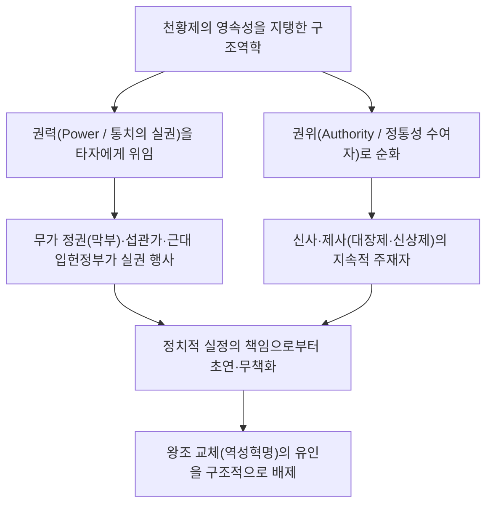
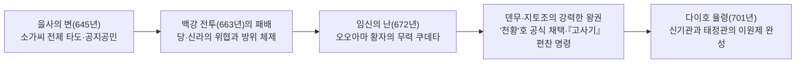
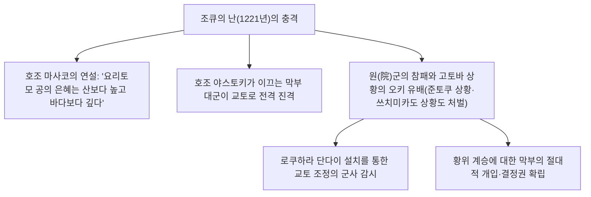
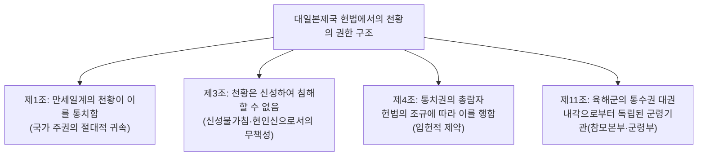
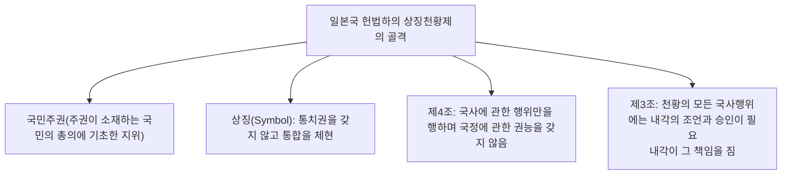
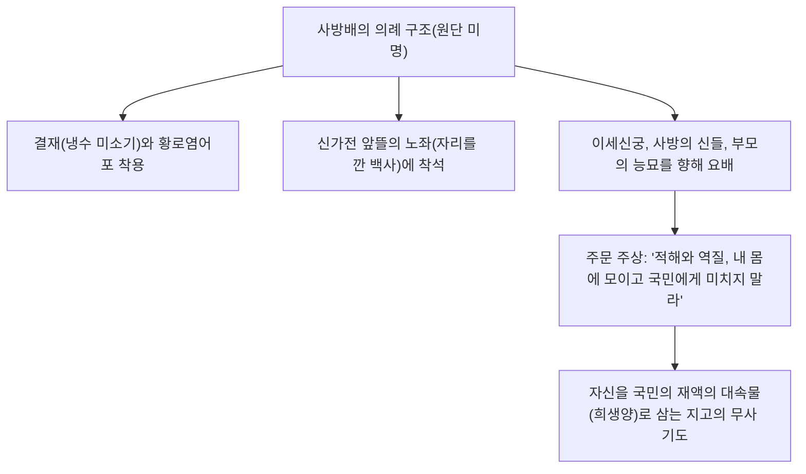
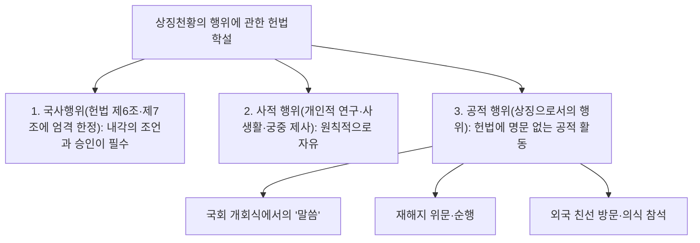

## 1. 서론: 세계 최고(最古)의 세습 왕통과 '권력과 권위의 분리'

### 1.1 만세일계라는 담론과 역사학·고고학적 실상

일본의 천황(Emperor of Japan, 덴노) 및 황실의 역사는 현존하는 전 세계의 그 어떤 왕실·왕조와 비교해도 유례를 찾아볼 수 없는 독보적인 연속성을 자랑한다. 기네스 세계기록에서도 "현존하는 세계 최고(最古)의 세습 군주 가문(The oldest continuous hereditary monarchy)"으로 공인되어 있다.

근대 국학(國學)이나 대일본제국 헌법 제1조가 내세운 '만세일계(万世一系, Bansei Ikkei: 영원히 끊어지지 않는 단일 혈통)'라는 담론은 신화적 이데올로기의 성격을 띠고 있으나, 실증적인 역사학 및 고고학적 지견에 비추어 보더라도 **적어도 5세기 후반의 유랴쿠 천황(와카타케루 대왕) 혹은 6세기 초의 게이타이 천황 이후 약 1,500년 이상 단일 왕통이 동일한 열도 공간에서 연속되어 왔다는 것**은 학술적으로도 의심의 여지가 없는 역사적 사실이다.

세계 여러 문명의 역사를 돌아볼 때, 중국에서는 천명이 바뀌고 성씨가 교체되는 '역성혁명(易姓革命, Dynastic Cycle)'에 의해 황제 일족이 몰살당했고, 유럽 제국(諸國)에서도 노르만 왕조, 플랜태저넷 왕조, 튜더 왕조, 스튜어트 왕조, 하노버 왕조 등으로 왕조 교체가 끊임없이 이어졌다. 이에 반해 왜 일본에서만 왕조 교체의 단절을 겪지 않고 단일 왕통이 오늘날까지 존속할 수 있었는가?



---

### 1.2 '권력과 권위의 분리'라는 비교문명론적 지견

마루야마 마사오(丸山眞男)나 루스 베네딕트(Ruth Benedict)를 비롯한 사상사가·비교문화학자들이 지적했듯이, 일본 문명의 통치 구조가 지닌 최대의 특질은 **'정치적 권력(Power: 군사력, 징세권, 일상적 통치)'과 '궁극적 권위(Authority: 정통성의 근원, 종교적·상징적 신성성)'가 철저하게 이원적으로 분리되어 왔다는 점**에 있다.

서양의 절대군주(프랑스의 루이 14세 등)나 중국의 전제황제는 스스로 군대를 통솔하며 명령을 내리는 '권력자'인 동시에 법과 질서의 '권위자'였다. 이 양자가 일체화되어 있는 경우, 한 번 실정이나 패전, 사회적 대혼란이 발생하면 그 책임은 군주 개인에게 직격하며, 반란에 의해 일족 전체가 옥좌에서 끌어내려진다.

이에 반해 일본의 천황은 헤이안 시대의 후지와라씨(섭관정치), 시라카와인(白河院) 이래의 원정(院政), 중세의 무가 정권(가마쿠라·무로마치·에도 막부), 그리고 근대의 내각에 이르기까지 **'세속의 통치 권력(실권)을 항상 외부의 보필자·무가에게 위임한다'**는 구조를 일관되게 유지했다. 막부의 쇼군이라 할지라도 자신의 지배 정당성을 증명하기 위해서는 천황으로부터 '정이대장군(征夷大將軍)'으로 임명받아야만 했다.

실정의 책임은 언제나 권력을 행사한 막부나 내각이 졌으며, 토막(討幕)이나 정변에 의해 멸망해 갔다. 그러나 정통성의 원천인 천황은 정치적 책임의 피안(彼岸)에 머물렀기에, 그 어떤 동란의 시대에도 천황 자체를 찬탈(살해하고 스스로 황위에 오르는 것)하려는 유인이 작동하지 않았던 것이다.

---

## 2. 고대 국가의 형성과 '천황'호·율령 제사의 탄생

### 2.1 대왕(오오키미)에서 '천황'으로의 승화

고분 시대, 열도의 중앙에 군림했던 야마토 왕권의 수장은 '대왕(오오키미 / 치천하대왕)'으로 불렸다. 사이타마현 이나리야마 고분에서 출토된 철검 명문에 새겨진 '획가다지려대왕(獲加多支鹵大王, 와카타케루 대왕 = 유랴쿠 천황)'은 유력 호족(씨성 귀족) 연합체의 맹주로서의 성격을 짙게 띠고 있었다.

6세기 말부터 7세기 초, 스이코 천황을 옹립한 쇼토쿠 태자(우마야도 황자)와 소가노 우마코는 관위 12계(가문이 아닌 개인의 재능에 따른 관위 제도)와 17조 헌법('화를 귀하게 여기라', '삼보를 공경하라', '조칙을 받들거든 반드시 삼가라')을 제정했다. 수 양제에게 보낸 국서 "해가 뜨는 곳의 천자가 해가 지는 곳의 천자에게 글을 보내노니, 무양하신가"에서 볼 수 있듯이, 중화 제국의 책봉 체제(조공 질서)에서 벗어나 독자적이고 대등한 '천자'로서의 자립을 선언했다.

645년 **'을사의 변(다이카 개신)'**에서 나카노오에 황자(훗날의 덴지 천황)와 나카토미노 가마타리(후지와라씨의 시조)는 전횡을 일삼던 소가노 이루카를 궁중에서 암살했다. 호족에 의한 토지와 인민의 사유를 부정하고, 모든 토지와 백성을 국가(천황)의 것으로 삼는 '공지공민제(公地公民制)'의 이상을 제시했다.



---

### 2.2 임신의 난(672년)과 덴무 천황의 절대적 권위

일본 고대사 최대의 분수령이 된 사건은 덴지 천황 사후 발발한 황위 계승 내란인 **'임신의 난(672년)'**이다. 요시노에 은둔해 있던 오오아마 황자는 미노·오와리의 동국(東國) 무력을 동원하여 오미 조정의 오오토모 황자를 전격적으로 멸망시키고, 스스로 아스카 기요미하라궁에서 즉위했다(**덴무 천황**).

덴무 천황과 그의 황후였던 지토 천황의 치세에 고대 율령 왕권의 기본적 틀이 완성되었다.
1. **'천황'호의 공식 채택**:
   - 도교의 최고신 '천황대제(북극성의 신격화)'에서 유래한 것으로 전해지는 '천황(Tenno, 덴노)'이라는 지고의 존칭이 목간이나 금석문에서 공식적으로 사용되기 시작했다.
2. **국호 '일본'의 제정**:
   - 이전까지의 '왜국(倭國)'을 대신하여 '해돋는 본고장(태양이 떠오르는 나라)'이라는 긍지 높은 국호가 제정되었다.
3. **역사서(신화) 편찬 개시**:
   - 덴무 천황의 칙명에 따라 제씨족에 전해 내려오던 전승을 정리하고, 황통의 정통성을 태양신 아마테라스로 소급시키는 『고사기(고지키)』(712년 완성) 및 『일본서기(니혼쇼키)』(720년 완성)의 편찬이 시작되었다.

---

### 2.3 기기 신화의 심층 구조와 삼종의 신기

『고사기』와 『일본서기』에서 전하는 황조신 아마테라스 오오미카미(천조대어신)로부터 초대 진무 천황에 이르는 신화 체계는 천황 권위의 종교적·우주론적 근거를 제시하고 있다.

- **천손강림과 '3대 신칙'**:
  - 아마테라스가 손자 니니기노 미코토(경경경존)를 지상(다카치호봉)으로 강림시킬 때 내린 가장 근본적인 명령이 바로 **'천양무궁의 신칙(天壌無窮の神勅)'**이다.
  > "풍위원의 천오백추의 서수국은 나의 자손이 왕이 될 땅이다. 너 황손아, 가서 다스려라. 가거라, 보조의 융성함이 마땅히 천양과 무궁하리라."
  - 지상의 통치권은 하늘 신의 의지에 의해 황손과 그 자손에게 영원히 부여되었다는 신성 계약이다.
  - 아울러 신경(神鏡)을 아마테라스 자신의 어령(御魂)으로 모실 것을 명한 '보경봉재의 신칙(寶鏡奉齋の神勅)', 천상의 제정(齋庭)의 벼이삭을 지상에서 기를 것을 명한 '제정유수의 신칙(齋庭稻穗の神勅)'이 내려졌다.
- **삼종의 신기(三種の神器, Sanshu no Jingi)**:
  1. **야타의 거울(八咫鏡, 야타노카가미)**: 예지·태양의 신성성(이세신궁 내궁의 신체, 황거에는 형대[形代]를 봉안).
  2. **야사카니의 곡옥(八尺瓊勾玉, 야사카니노마가타마)**: 자비·영력(황거 검새의 방에 상치).
  3. **구사나기의 검(草薙剣, 구사나기노쓰루기 / 아메노무라쿠모노쓰루기)**: 무위·용기(아쓰타 신궁의 신체, 황거에는 형대를 봉안).
  - 역대 천황의 즉위 의례에서 이 신기를 이어받는 '검새 등 승계의 의(剣璽等承継の儀)'는 황위의 불가결한 정통성의 증거로 여겨져 왔다.

---

### 2.4 율령 제도의 이원제: 신기관과 태정관, 그리고 대장제

701년 '다이호 율령'을 통해 완성된 고대 관제는 당나라의 율령 제도를 모방하면서도, 일본 독자적으로 극히 중요한 개변을 가했다.

당나라 제도에서는 행정 최고기관(상서성·중서성·문하성) 아래에 제사 기관(태상시)이 놓여 있었던 데 반해, 일본의 율령제는 국정을 총괄하는 **'태정관(太政官, 다이조칸)'**과 완전히 동등하거나 그 이상의 최상위에 신들의 제사를 관장하는 **'신기관(神祇官, 진기칸)'**을 병립시켰다(2관 8성제).

천황의 가장 본질적인 일상 임무는 정무(정치적 판단)가 아니라 **'신사(神事: 눈에 보이지 않는 신불에 대한 기도)'**에 있었다.
- **신상제(니이나메사이)**: 매년 11월, 그해 수확된 햅쌀과 햇곡식을 신들에게 바치고 천황 스스로도 이를 먹음으로써 신과 인간이 하나가 되어(신인공식, 神人共食), 국가의 안녕과 오곡풍요를 기원하는 의례.
- **대장제(다이조사이)**: 천황 즉위 후 최초로 거행되는 일대일도의 비의(秘儀). 유키전(悠紀殿)·스키전(主基殿)이라 불리는 고대의 소박한 침전을 처음부터 지어 밤을 지새우며 황조신에게 햇곡식을 올리고 스스로도 먹음으로써, 천황령(황조의 영위)을 신체에 깃들게 하여 진정한 영적 군주로 재생(거듭남)을 이루는 의식.

정치적 실권이 아무리 변천하더라도, '국가를 위해 신들에게 사심 없이 기도하기를 지속하는 최고 사제장'으로서의 역할이야말로 천황제의 불멸의 핵으로 남아 있었다.

---

## 3. 중세·근세의 권위와 권력의 이중 구조

### 3.1 섭관정치와 원정: 궁정 내부의 권력역학

헤이안 시대에 천황을 둘러싼 정치 구조는 고도의 세련화와 변용을 겪었다.

- **후지와라씨의 섭관정치(10~11세기)**:
  - 후지와라 북가(미치нага·요리미치의 전성기)는 자신의 딸들을 역대 천황의 황후(중궁)로 입내(入內)시키고, 태어난 황자를 유소년기에 즉위시킴으로써 외조부(외척)로서 '섭정' 및 성인 후의 '관백'에 취임했다.
  - 천황의 권위를 찬탈하지 않고 외척의 지위를 통해 인사권과 국정 결정권을 완전히 장악했다.
- **원정(院政)의 성립(11세기 말~)**:
  - 1086년, 시라카와 천황은 어린 호리카와 천황에게 양위하고 '상황(태상천황)'이 되어 궁정 밖(시라카와인)에 자신의 직속 기관(인청, 院廳)을 설치했다.
  - '치천의 군(治天の君: 천황가의 가장)'으로서 섭관가를 배제하고 정치 실권을 탈환했다. 상황은 출가하여 '법황'이 됨으로써 유교적·율령적 천황의 제약에서 벗어나 전제적인 권력을 행사했다.

---

### 3.2 무가 정권의 탄생과 조큐의 난(1221년)

12세기 후반 헤이씨 정권의 타도를 거쳐 미나모토노 요리토모가 동국 가마쿠라에 **'가마쿠라 막부'**를 창설했다.
요리토모는 조정으로부터 '정이대장군' 관직을 얻는 한편, 전국에 슈고(守護)와 지토(地頭)를 설치하는 칙허(분지의 칙허, 1185년)를 획득했다. 이로써 서쪽의 '조정(공가)'과 동쪽의 '막부(무가)'라는 공무(公武) 이원 지배 체제가 성립했다.

이 무가 우위의 조류를 뒤엎고자 건곤일척의 승부수를 던진 인물이 바로 탁월한 기개를 지녔던 **고토바 상황**이었다.
1221년, 상황은 가마쿠라 막부 집권 호조 요시토키를 토벌하라는 인젠(院宣)을 내리고 전국의 무사들에게 봉기를 촉구했다(**조큐의 난**).



조큐의 난의 결말은 무가 측의 압도적 승리였다. 무사가 조정의 인젠을 공공연히 짓밟고, 치천의 군인 상황을 유배형에 처한 이 사건을 통해 '군사력을 갖추지 못한 조정은 무가의 힘을 거스를 수 없다'는 역학이 백일하에 드러났다. 막부는 황위 계승에 직접 개입하게 되었고, 훗날 다이카쿠지통(남조 계통)과 지묘인통(북조 계통)의 교대 즉위(양통질립)를 재단하는 입장에 서게 되었다.

---

### 3.3 겐무 신정과 남북조의 동란

1333년, 고다이고 천황은 아시카가 다카우지와 닛타 요시사다, 구스노키 마사시게 등 무사단을 동원하여 가마쿠라 막부를 멸망시키고, 천황 친정인 **'겐무 신정(建武の新政)'**을 개시했다.

그러나 무사들의 은상 요구를 무시하고 시대착오적인 공가 우대와 복고주의적 전제를 추진한 신정은 불과 2년여 만에 붕괴했다. 이탈한 아시카가 다카우지는 교토에 고묘 천황(지묘인통)을 옹립하여 무로마치 막부를 열었고, 고다이고 천황은 요시노 산중으로 도주하여 정통성을 주장했다.

이후 약 60년에 걸쳐 교토의 **'북조'**와 요시노의 **'남조'**가 정통성을 다투며 내란을 벌이는 **'남북조 시대(1336–1392)'**가 지속되었다. 1392년, 무로마치 막부 3대 쇼군 아시카가 요시미쓰의 알선으로 '메이토쿠 화약(남북조 합일)'이 맺어졌고, 남조의 고카메야마 천황으로부터 북조의 고코마쓰 천황에게 삼종의 신기가 인도되었다(역대 천황의 황통은 북조의 고코마쓰 천황 이후의 혈통으로 오늘날까지 이어지고 있으나, 역사적 정통성은 신기를 줄곧 보존했던 남조 측에 있다고 메이지 이후 공식 인정되었다).

무로마치 전성기, 아시카가 요시미쓰는 명나라 영락제로부터 '일본국왕'으로 책봉되었고, 자신의 아들을 천황으로 즉위시키려 하는 등 '황위 찬탈'에 가장 근접했던 인물로 꼽히지만, 그의 급사와 함께 그 야망은 소멸했다.

---

### 3.4 도쿠가와 막부의 금중병공가제법도와 '어학문' 규정

전국시대의 난세 속에서 조정의 재정은 곤궁의 극에 달했고, 고나라 천황처럼 친필 신한(宸翰: 와카나 반야심경)을 매각하여 궁정 경비를 충당할 정도로 쇠미해졌다. 그러나 오다 노부나가, 도요토미 히데요시, 도쿠가와 이에야스 등 천하인들은 그 누구도 천황을 폐절하지 않았으며, 오히려 거액의 기진을 행하고 관백이나 태정대신, 정이대장군의 관직을 제수받음으로써 자신의 정권의 정통성을 보강했다.

천하를 통일한 도쿠가와 이에야스는 1615년, 조정을 법적으로 완전 구속하는 **'금중병공가제법도(全17조)'**를 반포했다. 그 권두 제1조에는 다음과 같이 명기되었다.

> **"천자(天子)의 제예(諸藝)에 관한 일, 첫째는 어학문(御學問)의 일이다."**

이 조문의 진정한 의도는 지극히 냉철했다. "천황이 닦아야 할 것은 학문과 유식고실(有職故實), 와카의 길이며, 정치나 군사에 관여하는 일은 결단코 있어서는 안 된다."
자의 사건(1629년: 막부의 허가 없이 고승에게 자의[紫衣]를 하사한 천황의 칙허를 막부가 무효화하자, 이에 항의한 고미즈노오 천황이 돌연 퇴위한 사건)이 상징하듯, 에도 시대의 천황은 교토 어소 깊숙이 유폐되어 정치적 실권을 1밀리미터도 행사할 수 없는 완전한 '의례와 학문의 상징적 존재'로서 철저히 무력화·무해화되었던 것이다.

---

## 4. 메이지 유신과 근대 '현인신' 국가의 창출

### 4.1 존황양이에서 왕정복고로

에독 시대 중기 이후, 미토번의 『대일본사』 편찬과 국학(모토오리 노리나가 등)의 발전에 따라 "막부의 쇼군은 천황으로부터 통치를 위임받았을 뿐이다(대정위임론)"라는 존황 사상이 무사 계층에 침투해 갔다.

1853년 페리 내항(흑선 내항) 이후 대외 위기에 대처하지 못하는 도쿠가와 막부의 무능이 폭로되자 하급 무사와 지사들 사이에서 '존황양이'의 열광이 폭발했다. 고메이 천황은 양이의 칙정을 내렸고, 조슈번과 사쓰마번은 조정을 정치적 구심점으로 삼아 결집했다.

1867년 10월, 15대 쇼군 도쿠가와 요시노부는 '대정봉환'을 상주했다. 같은 해 12월 9일, 이와쿠라 도모미와 사쓰마의 사이고 다카모리 등의 주도로 **'왕정복고의 대호령'**이 선포되었다.
- 막부, 섭정, 관백을 전면 폐지.
- 초대 진무 천황의 창업으로 되돌아가 천황 친정의 새로운 정부를 수립할 것을 선언했다.
- 16세의 메이지 천황이 즉위했고, 에도는 '도쿄'로 개칭되었으며, 황거가 교토에서 도쿄성(구 에도성)으로 이전되었다.

---

### 4.2 대일본제국 헌법(메이지 헌법, 1889년)의 입헌이원론

이토 히로부미 등 메이지의 원훈들은 프로이센(독일)의 입헌주의를 모범으로 삼으면서도 일본의 국정에 부합하는 **'대일본제국 헌법'**을 기초했다.



메이지 헌법 체제에서의 천황은 지극히 고도의 '양의성(이중성)'을 지니고 있었다.
1. **전통적·종교적 측면**: 천황은 신들의 자손이며, 국민 도덕의 원천이자 신성하여 침해할 수 없는 현인신(아라히토가미)이다.
2. **근대적·입헌주의적 측면**: 천황은 '헌법의 조규에 따라' 통치권을 행사하는 입헌군주이며, 대통령처럼 독재적 명령을 내릴 수는 없고, 행정권 행사에는 국무각대신의 '보필(輔弼)'을 요하며(제55조), 입법권은 제국의회의 협찬을 필요로 했다.

다이쇼 시대, 도쿄제국대학 법학부 교수 미노베 다쓰키치가 제창한 **'천황기관설'**(국가라는 법인에서의 최고 기관이 천황이며, 주권은 법인인 국가에 속한다는 학설)은 다이쇼 데모크라시 시기 정당내각제의 헌법이론적 지주가 되었다.

그러나 메이지 헌법에는 치명적인 구조적 결함이 내장되어 있었다. 그것이 바로 **제11조의 '통수권의 독립(육해군의 통수는 내각의 보필을 받지 않고, 군령기관이 천황에게 직속된다)'**이다. 쇼와에 접어들어 군부가 이 통수권을 방패 삼아 내각과 의회의 통제에서 완전히 벗어났을 때, 입헌주의의 방벽은 허망하게 붕괴하고 말았다.

---

## 5. 쇼와의 격동과 패전, 그리고 '상징천황제'로의 극적 전환

### 5.1 쇼와 초기의 파국과 종전의 '성단'

1930년대, 통수권 간범 문제, 5·15 사건, 2·26 사건을 거치며 정당정치는 숨을 거두었고, 일본은 군부 독재와 수렁에 빠진 중일전쟁, 그리고 1941년 태평양전쟁으로 돌입해 갔다.

국가신도가 극한까지 교조화되었고, 국민은 '천황을 위해 목숨을 바치는 것'을 미덕으로 교육받았다. 그러나 쇼와 천황 자신은 입헌군주로서 내각과 통수부의 결정을 거부할 수 없는 자신의 처지와 평화를 향한 기도 사이에서 극심하게 고뇌했다.

1945년 8월, 히로시마·나가사키 원폭 투하와 소련의 참전에 직면하여 최고전쟁지도회의는 '국체호지(황실의 존속)'를 둘러싸고 항복이냐 결사항전(본토 결전·일억 총옥쇄)이냐로 완전히 팽팽하게 갈라졌다.
8월 10일과 14일, 방공호 내 어전회의에서 스즈키 간타로 총리의 요청을 받은 쇼와 천황은 눈물을 흘리며 역사적인 **'성단(聖斷)'**을 내렸다.

> **"나의 임무는 국민을 구하는 데 있다. 내 일신이 어찌 되든, 더 이상 국민이 전란에 쓰러지고 인류의 문명이 파괴되는 것을 차마 볼 수 없다. ……나는 어떠한 참기 어려운 일도 참고 견디기 힘든 일도 견디며, 전쟁을 종결짓는 결단을 내렸다."**

8월 15일 정오, 옥음방송(종전 조서)을 통해 전쟁은 종결되었다. 천황의 육성에 의한 직접적인 개입이 없었다면, 본토 결전으로 인해 수백만 명의 추가 희생자가 발생했을 것이 확실시된다.

---

### 5.2 맥아더와의 회견과 도쿄재판의 회피

패전 후 연합국군 최고사령관 더글러스 맥아더가 이끄는 GHQ가 진주했다. 미·영·소를 비롯한 연합국 여론의 다수는 쇼와 천황을 '수괴급 전쟁범죄자'로 처형하고 천황제를 완전 폐지할 것을 요구하고 있었다.

1945년 9월 27일, 쇼와 천황은 미국 대사관의 맥아더를 단신으로 방문했다. 맥아더의 회고에 따르면, 쇼와 천황은 목숨을 구걸하기는커녕 다음과 같이 말했다고 한다.

> **"나는 일본 국민이 전쟁 수행에 있어 내린 모든 정치적·군사적 결단과 행동에 대해 전 책임을 지는 자로서, 여기에 몸을 맡기고자 왔습니다. 내 자신의 목숨이 어떻게 되든 상관없습니다. 부디, 국민들에게 먹을 것을 주십시오."**

맥아더는 천황의 이 무사(無私)한 정신에 깊은 충격을 받았고, 즉시 '천황제의 유지와 천황 소추 회피'로 점령 정책의 방침을 굳혔다. 만약 천황을 처형한다면 일본 전역에서 100만 명 규모의 게릴라 반란이 발발하여 연합국군의 평화적 통치가 불가능해질 것이라 판단한 것이다.

1946년 1월 1일, 쇼와 천황은 **'신일본 건설에 관한 조서(이른바 인간선언)'**를 발표했다. 천황과 국민 사이의 유대는 신화나 현인신의 관념에 의한 것이 아니라, 상호 신뢰와 경애에 바탕을 둔 것임을 선언했다.

---

### 5.3 일본국 헌법 제1조: '상징천황제'의 확립

1947년 5월 3일에 시행된 **'일본국 헌법'**은 제1조에서 천황의 법적 지위를 근본적으로 재정의했다.

> **제1조: "천황은 일본국의 상징이며 일본 국민 통합의 상징으로서, 그 지위는 주권이 소재하는 일본 국민의 총의에 기초한다."**



- **통치권의 완전 박탈**: 천황은 더 이상 국가의 원수(지배자)가 아니라 국가의 존재 자체와 국민의 일체성을 체현하는 '상징(Symbol)'이 되었다.
- **국정 관여의 금지(제4조)**: 헌법에 열거된 형식적·의례적인 '국사행위'(국회의 소집, 총리대신의 임명, 조약의 비준, 영전의 수여 등)만을 행하며, 어떠한 정치적 권능도 행사할 수 없다.
- **내각의 조언과 승인(제3조)**: 모든 국사행위에는 내각의 조언과 승인이 필수적이며, 정치적 책임은 전적으로 내각이 진다.

이러한 '상징천황제'는 점령군에 의해 강요된 이질적인 제도로 간주되기 쉽지만, 앞서 서술한 일본의 오랜 역사――**'천황은 정치 권력을 행사하지 않고 권위와 기도에 전념한다'는 중세 이래의 전통적 구조로의 가장 순수한 형태로의 회귀**였다고도 해석할 수 있다.

---

## 2.5 궁중 제사의 의례 구조와 '사방배'의 정신역학

천황의 존재를 이해함에 있어 일본국 헌법상의 '국사행위'와는 완전히 단절된 사적 영역으로서 황실 내에서 면면히 계승되어 온 **'궁중 제사(宮中祭祀, Imperial Court Rituals)'**의 심연을 들여다보지 않을 수 없다.

황거의 울창한 후키아게 어소(吹上御所) 깊숙한 곳에 진좌한 **'궁중삼전(宮中三殿)'**――
1. **현소(賢所, 가시코도코로)**: 황조신 아마테라스 오오미카미의 신체인 야타의 거울(형대)을 봉안.
2. **황령전(皇霊殿, 고레이덴)**: 진무 천황 이래 역대 천황·황족의 영령을 모심.
3. **신전(神殿, 신덴)**: 천신지지(八百萬의 신들)를 모심.

천황은 연중 수십 회에 달하는 엄숙한 제사를 손수 주재한다. 그중에서도 가장 강렬한 정신적 전율을 불러일으키는 의례가 바로 원단(새해 첫날) 미명(오전 5시 반), 엄동설한의 냉기 속에서 거행되는 **'사방배(四方拝, 시호하이)'**이다.



천황은 차가운 물로 몸을 정결히 하고, 고풍스러운 제복 차림으로 백사의 노좌에 앉아 이세신궁을 비롯한 사방의 산천과 제신(諸神), 그리고 역대 천황의 산릉을 향해 깊숙이 요배한다. 그리고 헤이안 시대 의식서에 기록된 주문을 주상한다.
> **"적해(賊害), 역질(厄疾), 수화(水火)의 난 중 만민에게 미칠 바의 것은, 먼저 내 몸을 거쳐 지나가게 하소서(재앙이 국민에게 닥쳐온다면 먼저 내 몸을 통과하게 하라)."**

자신을 국가와 국민의 재앙을 대신 짊어지는 '궁극의 대속물(희생양)'로서 신 앞에 바치는 것. 타자를 지배하기 위한 권력이 아니라, 자신을 무(無)로 돌려 타자의 행복을 기원하는 이 절대적 자기희생의 제사 정신이야말로 수천 년을 뛰어넘어 천황의 권위가 국민의 심층 심리에 각인되어 온 무의식의 자기장인 것이다.

---

## 3.5 역대 여성 천황의 역사적 실태와 '중계(징검다리)'론의 허실

황위 계승 논의에서 빈번하게 인용되는 역사적 사실이 바로 과거 일본사에 실재했던 **'8방 10대의 여성 천황'**이다.

| 대수 | 천황명 | 치세 | 즉위 배경과 역사적 업적 |
| :---: | :--- | :---: | :--- |
| **제33대** | **스이코 천황** | 592–628 | 스슌 천황 암살 후의 혼란을 수습하기 위해 최초의 여성 천황으로 즉위. 쇼토쿠 태자·소가노 우마코와 협조하여 관위 12계·17조 헌법을 제정. |
| **제35대/37대** | **고교쿠 천황 / 사이메이 천황** | 642–645 / 655–661 | 중조(重祚, 조소: 두 번 즉위). 을사의 변의 무대가 되었으며, 사이메이 시기에는 백강 전투를 위해 규슈로 친정, 전지에서 붕어. |
| **제41대** | **지토 천황** | 690–697 | 덴무 천황의 황후. 남편의 유지를 이어 후지와라경을 조영, 아스카 기요미하라령을 시행하고, 손자인 몬무 천황에게 황통을 확실히 계승. |
| **제43대** | **겐메이 천황** | 707–715 | 헤이조경 천도(710년), 『고사기』 완성, 『풍토기』 편찬 명령. |
| **제44대** | **겐쇼 천황** | 715–724 | 겐메이 천황의 딸(어머니에서 딸로 이어진 유일한 황위 계승). 『일본서기』 완성, 삼세일신법 제정. |
| **제46대/48대** | **고켄 천황 / 쇼토쿠 천황** | 749–758 / 764–770 | 쇼무 천황의 딸. 중조. 후지와라노 나카마로의 난을 진압하고 법왕 도쿄를 중용. 우사하치만궁 신탁 사건으로 도쿄의 황위 찬탈을 저지. |
| **제109대** | **메이쇼 천황** | 1629–1643 | 에도 시대 초기. 고미즈노오 천황이 자의 사건으로 막부에 항의하며 돌연 퇴위하자 즉위(도쿠가와 히데타다의 외손녀). |
| **제117대** | **고사쿠라마치 천황** | 1762–1770 | 에도 시대 중기. 모모조노 천황 급서 후, 어린 고모모조노 천황이 성장할 때까지 치세를 담당. 근세 마지막 여성 천황. |

역사학적 정밀 검토에서 명백히 드러나는 사실은 **"과거의 여성 천황은 모두 아버지가 천황인 '남계 여자(男系女子)'였다"**는 점이다(민간인이나 다른 왕조의 남성과 혼인하여 여계 자손에게 황위를 계승시킨 사례는 전무하다).

또한 그 대다수는 '황위 계승 후보자가 유소년기이다', '선제의 급서로 인한 정치적 공백의 위기'와 같은 비상사태에서 황실의 장로로서 즉위하여 황위 계승의 위기를 회피한 뒤, 차세대의 남계 남자에게 바통을 넘기는 '중계(징검다리, 핀치히터)'의 역할을 수행했다.

그러나 동시에 스이코 천황이나 지토 천황처럼 단순한 징검다리를 넘어 강력한 지도력을 발휘하여 고대 국가의 골격을 완성한 위대한 여성 군주가 존재했다는 사실 또한 엄연한 역사적 진실이다. 고대 일본에서 여성이 지닌 '신내림의 무녀적 영력(샤머니즘)'과 남성의 세속적 통치 권력이 상호 보완하는 '히메·히코제(ヒメ・ヒコ制)'의 전통이 여성 천황의 수용을 용이하게 만들었던 것으로 평가된다.

---

## 4.6 국가신도의 창출과 '신사비종교론'의 근대 철학적 아크로바틱

메이지 유신 정부가 직면했던 최대 난제는 "서구 열강에 대항할 수 있는 근대적 국민국가(Nation-State)의 통합 원리를 어떻게 창출할 것인가"였다.

### ① 폐불훼석의 광풍과 신불분리
천수백 년에 걸쳐 공존·융합해 온 '신불습합(신사 경내에 사찰이 세워지고 부처가 신의 모습으로 나타난다는 본지수적설)'을 메이지 정부는 1868년의 **'신불판연령(신불분리령)'**을 통해 강제적으로 찢어발겼다.
이로 인해 전국에서 불상이 파괴되고 경전이 불태워지며 5층 탑이 때려 부수어지는 과격한 **'폐불훼석(廢佛毁釋)'**의 광풍이 몰아쳤다. 정부는 당초 신도를 국교화하는 '대교선포운동'을 추진했으나, 민중의 뿌리 깊은 불교 신앙과 구미 열강의 '신교의 자유 침해'라는 거센 외교적 비판에 부딪혀 좌절되었다.

### ② '신사비종교론'이라는 초법규적 픽션
여기서 메이지의 지도자들(이노우에 고와시 등)이 고안해 낸 경이로운 법리가 바로 **'신사신도는 종교가 아니다(신사비종교론)'**라는 이데올로기적 픽션이었다.
- 대일본제국 헌법 제28조에서 '신교의 자유'를 보장하여 기독교나 불교를 '개인의 사적인 종교'로 인정했다.
- 그 한편으로 "신사(이세신궁이나 야스쿠니 신사 등)에서 행해지는 제사는 종교가 아니라, 국민 전체가 참여해야 할 **'국가의 공적인 도덕이자 조상 숭경의 의례'**이다"라고 정의했다.
- 이를 통해 기독교인이나 불교도라 할지라도 제국 신민인 이상 신사 참배나 천황에 대한 숭경을 거부하는 것은 용납되지 않는다는 '국가신도(State Shinto)'의 초종교적 절대 공간이 구축되었다. 이 논리적 곡예(아크로바틱)가 훗날 쇼와 시기 군국주의적 '현인신' 숭배의 폭주를 허용한 제도적 온상이 되었던 것이다.

---

## 5.5 헌법 판례와 상징천황제의 경계선

일본국 헌법하의 상징천황제는 수많은 헌법학적 논쟁과 사법 판단의 시험을 거치며 그 해석을 정교화해 왔다.



### ① '공적 행위(상징으로서의 행위)'의 긍정
헌법 제4조 제1항은 "천황은 이 헌법이 정하는 국사에 관한 행위만을 행하며"라고 규정하고 있다. 문언을 엄격히 해석하면 국사행위 이외의 공적 활동(재해지 방문, 외국 빈객 접대, 개회식에서의 말씀 등)은 모두 위헌이 될 소지가 있다.
판례 및 정부 해석은 "천황은 일본국의 상징으로서의 지위에 있는 이상, 그 지위에 걸맞은 **'공적 행위(상징으로서의 행위)'**를 행하는 것이 당연히 인정된다"고 보았으며, 이들 행위 역시 내각의 통제(실질적 조언과 책임) 아래 수행되는 한 합헌이라고 규정했다.

### ② 정교분리(헌법 제20조·제89조)와 궁중 제사
신상제나 대장제 같은 황실 신도 행사를 국가의 공적 예산(궁정비·공비)에서 지출해야 하는가, 아니면 내정비(천황가의 사비)에서 지출해야 하는가가 격렬하게 다투어졌다.
최고재판소(쓰 지진제 판결·에히메 다마구시료 판결)의 '목적·효과 기준(해당 행위의 목적이 종교적 의의를 가지며, 그 효과가 특정 종교를 원조·압박·간섭하는 것인가)'에 비추어, 헤이세이 및 레이와의 즉위례에서 대장제는 "황실의 전통적 의례이며 공적 성격을 띤다"는 이유로 공비(궁정비) 지출이 합헌으로 판단되었다.

---

## 6. 현대における 상징천황의 영위와 황위 계승 문제

### 6.1 헤이세이의 '여정'과 퇴위의 실현

상징천황제에 피와 살을 불어넣은 것은 제125대 천황(현 상황 아키히토)과 상皇后 미치코의 발자취였다.
'상징이란 어떠해야 하는가'를 끊임없이 자문했던 상황은 일본 전역의 재해지(운젠 후겐다케, 한신·아와지 대지진, 동일본 대지진)를 직접 찾아가 피난소 바닥에 무릎을 꿇고 이재민들과 같은 눈높이에서 손을 맞잡으며 위로를 건넸다. 또한 오키나와, 히로시마, 나가사키, 나아가 격전지였던 사이판과 팔라우 펠렐리우섬, 필리핀으로 '위령의 여정'을 거듭하며 과거 전쟁의 기억이 풍화되지 않도록 간절한 기도를 올렸다.

2016년 8월 8일, 천황은 이례적인 비디오 메시지('심경[お気持ち]' 표명)를 국민을 향해 발표했다. 고령에 따라 전신전령으로 상징의 책무를 다하기가 점차 어려워지고 있다는 심경을 토로한 것이다. 이에 부응하여 국회는 2017년 '황실전범 특례법'을 제정했다. 2019년 4월 30일, 에도 시대 고카쿠 천황 이후 약 200년 만에 '생전 퇴위'가 평화롭게 실현되었고, 나루히토 황태자가 제126대 천황으로 즉위하면서 '레이와(令和)'의 치세가 막을 열었다.

---

### 6.2 황위 계승을 둘러싼 현대의 헌법·법정책적 논점

21세기의 지금, 황실이 직면한 최대 위기는 '황족 수의 감소와 황위 계승 자격의 협애화'이다.
현행 '황실전범 제1조'는 **"황위는 황통에 속하는 남계의 남자가 이를 계승한다"**고 규정하고 있다.

현재 차세대 황위 계승 자격을 가진 황족은 히사히토 친왕 전하 단 한 분뿐이라는 극도로 아슬아슬한 상황에 놓여 있다. 이 과제를 둘러싸고 국론은 주로 세 가지 선택지를 두고 치열하게 대립하고 있다.

| 논점 | 제안 내용 | 추진파의 논거 | 신중파·반대파의 우려 |
| :--- | :--- | :--- | :--- |
| **① 여성 천황의 용인** | 천황의 딸(여성)이 즉위하는 것을 인정함(예: 아이코 내친왕의 즉위). | 역사상 스이코 천황부터 고사쿠라마치 천황까지 8방 10대 여성 천황의 실례가 존재함. 국민 감정에도 부합. | 남계 여자에 머무는 한 문제없으나, 여계 천황으로 가는 발판이 될 것을 경계하는 목소리. |
| **② 여계 천황의 용인** | 모계만을 통해 황통에 연결되는 자의 즉위를 인정함(여성 천황의 자녀가 민간인 남성과의 사이에서 낳은 황자 등). | 혈통의 고갈을 반영구적으로 회피할 수 있는 유일한 현실적 해법. 남녀평등의 정신. | 지난 126대에 걸쳐 단 한 번도 끊어진 적 없는 '남계 계승의 전통'이라는 황실의 존립 근거가 근본적으로 상실된다는 강한 반발. |
| **③ 구 궁가(남계 구 황족)의 복귀** | 1947년 GHQ의 명령으로 신적강하(이탈)한 구 11궁가의 남계 남자 자손을 양자 결연 등으로 황족에 복귀시킴. | 만세일계의 남계 남자 전통을 완벽하게 유지할 수 있음. | 전후 80년 가까이 일반 국민으로 살아온 민간인을 돌연 황족으로 삼는 것에 대한 국민적 수용성·정서의 장벽. |

---

## 7. 결론: 기도의 계보와 일본 문명의 고층(古層)

천황제란 정치적 제도이기 이전에 일본 열도라는 풍토와 그곳에 살아온 사람들이 수천 년에 걸쳐 길러 온 **'정신과 기도의 문화적 고층(古層)'**이다.

대통령처럼 자신의 권력을 과시하지도 않고,
부를 자랑하는 대부호처럼 행동하지도 않으며,
궁중의 삼엄하고 정적에 싸인 고요 속에서 사계절의 신사에 몸을 정결히 하고,
국민의 행복과 세계 평화, 오곡풍요를 오로지 일심으로 기원하기를 멈추지 않는 존재.

고대의 호족들도, 중세의 거친 무사들도, 메이지의 근대화를 추진한 지사들도, 그리고 전후 폐허 속에서 부흥을 일구어낸 국민들도 그 사심 없는 '기도의 자리' 앞에 머리를 숙여 왔다.

제도로서의 형태가 율령 국가, 막부 체제, 메이지 입헌 제국, 그리고 전후 민주주의의 상징으로 시대의 변천에 따라 자유자재로 적응하면서도, 그 중심에 있는 '신성한 기도의 연속성'만은 단 한 번도 상실된 적이 없었다.

끊임없이 격변하는 21세기 세계 속에서, 과거 수천 년과 미래 수천 년의 시간을 잇는 살아있는 역사의 결절점으로서 천황이라는 실존은 일본인이 스스로의 정체성과 마주하기 위한 심원한 거울로 영원히 기능할 것이다.

---

### 2.6 대장제의 제사 인류학적 심층: 오리쿠치 시노부 '마토코오후스마' 논쟁과 신곡공식의 코스몰로지

즉위 의례의 정점을 이루는 대장제(大嘗祭, 다이조사이)는 단순한 수확제의 연장이 아니라, 천황이 시조신의 영위를 계승하여 '현인신' 혹은 '성스러운 신격'으로 영적 변용을 이루는 통과의례(Initiation)로서의 성격을 띠어 왔다. 이 제사의 의례 구조를 둘러싸고는 근대 이후 인류학·종교학·역사학계에서 극히 열띤 학술 논쟁이 전개되어 왔다.

그 대표적인 예가 민속학자 오리쿠치 시노부(折口信夫)가 제창한 '마토코오후스마(真床追衾)'론이다. 오리쿠치는 『대장제의 본의(大嘗祭の本義)』(1928년)에서 대장궁의 유키전(悠紀殿) 및 스키전(主基殿) 깊숙한 곳에 마련되는 '사카마쿠라(坂枕)'와 '가무후시도(神臥床)'에 주목했다. 천손강림 신화에서 니니기노 미코토가 '마토코오후스마'에 싸여 강림했다는 기술과 결부시켜, 새 천황은 가무후시도에서 후스마(衾, 침구) 속에 몸을 숨김으로써 가사(假死) 상태를 의사(疑似) 체험하고, 아마테라스 오오미카미의 영혼('천조대신의 어령' 혹은 '황조의 신령')을 그 신체에 합체·감응시키는 밀의(密儀)를 행했다고 주장했다. 즉 대장제란 '영혼의 재생·합체 의례(진혼·타마후리)'라는 해석이다.

```
【대장제 비의 구조를 둘러싼 2대 학술 조류】

1. 오리쿠치 시노부설 (영혼 합체·재생 통과의례론)
   · 핵심 개념: "마토코오후스마(真床追衾)", "가무후시도(神臥床)"
   · 의례 해석: 신제가 이불(衾) 속에 틀어박히는 유사 죽음과 재생을 통해 조령·아마테라스 오오미카미의 영을 모시는 영적 변용의 비의.
   · 이론적 배경: 야나기타 구니오·오리쿠치 시노부의 마레비토(まれびと)론, 남도론(南島論), 미야자(宮座)·와카모노구미(若者組)의 통과의례.

2. 궁정 제사·실증사학설 (신곡공식·신인합일 제사론)
   · 핵심 개념: "신선헌선(神饌獻饌)", "신인공식(神人共食)"
   · 의례 해석: 신제가 조상신과 함께 햇곡식인 쌀·조·신주(神酒)를 음복하며 공동의 유대와 통치권을 맹약하는 농경 의례.
   · 대표적 연구: 오카다 쇼지, 도코로 이사오, 사카모토 다로 등에 의한 고기록·『연희식』 전적의 실증적 재검토.
```

이에 대해 오카다 쇼지나 도코로 이사오 등 역사학자·신도사가들은 헤이안 시대의 『연희식(엔기시키)』 대장제 의식 및 각종 고기록을 엄밀히 대조하며 오리쿠치설의 문헌적 근거의 취약성을 지적했다. 이들의 실증 연구에 따르면, 대장제 의례의 핵심은 어디까지나 심야에 새 천황이 직접 신선(쌀, 조, 백주, 흑주, 전복, 해산물)을 신기(神祇)에 바치고 신전 앞에서 스스로도 동일한 음식을 먹는 '신인공식(神人共食)'에 있다. 신과 식사를 함께함으로써 농경 사회의 풍요에 감사하고 조상신과의 성스러운 맹약을 갱신한다는 것이다. 가무후시도는 신이 휴식하기 위한 신좌(神座)일 뿐이며, 천황이 실제로 침관처럼 들어앉았다는 기록은 존재하지 않는다고 보았다.

현대 학계의 합의는 오리쿠치설의 대담한 시적 직관과 인류학적 도약을 높이 평가하면서도, 역사적 실태로서는 고대 동아시아의 농경 의례 체계 및 즉위 의례의 중층적 복합체로 파악하는 시각이 주류를 이루고 있다. 그러나 어느 해석에 서든 대장제가 '정치적 권력자'가 '제사적 주체'로 변모하는 결정적인 정신적 경계 장치로 기능해 왔다는 사실만은 흔들리지 않는다.

---

### 4.3 폐불훼석과 대교선포운동: 신도 국교화의 좌절과 '국가신도'의 제도공학

메이지 유신에서의 '왕정복고'는 단순한 무가 정권에서 태정관제로의 권력 이양이 아니라, 고대의 '제정일치'로의 복고를 표방한 급진적인 종교·사상 혁명의 측면을 지니고 있었다. 신정부는 성립 직후인 1868년(게이오 4년/메이지 원년) 3월, 태정관 포고를 통해 '신불분리령'을 내렸다. 이는 중세 이래 천수백 년 동안 일본 사회의 기반이었던 신불습합 체제를 해체하고, 신사에서 불교적 요소(불상, 경전, 범종, 승려의 별당·사승 신분)를 강제적으로 배제하는 조치였다.

이 신불분리는 각지에서 과격한 파괴 행동을 촉발했다. 이른바 '폐불훼석(廢佛毁釋)'이다. 사쓰마번이나 나에기번, 오키, 도야마 등지에서는 사찰이 철저히 파각되었고 불상이 소각되거나 파괴되었다. 고후쿠사의 5층 탑이 불과 25엔에 매각될 뻔하는 등 일본의 전통적 문화재와 불교 사찰 경제는 괴멸적인 타격을 입었다.

```
【메이지 초기 제정일치 사상(이데올로기) 변천】

신기관 복흥 (1869년)
  -- "급진적 히라타파 국학에 의한 제정일치·신도 국교화 추진" -->
신불분리·폐불훼석의 폭풍 (전국적 사찰 파괴와 불교 탄압)
  -- "국내외의 비판과 민중의 동요에 직면" -->
대교선포운동 (1870년~: 선교사·교부성 설치, 국민 교화의 시도)
  -- "진종 승려(시마지 모쿠라이 등)의 신교의 자유 논쟁·구미 열강의 압력" -->
신도 국교화의 좌절 (1875년: 대교원 해산)
  -- "'신사비종교론'의 구축 (행정 제도로서의 신사와 국가신도 체제의 성립)" -->
국가신도 체제 (내무성 신사국 관리, 전 종파를 초월한 국민 도덕으로의 승격)
```

그러나 급진적인 히라타파 국학자들이 주도한 '신기관' 중심의 신도 국교화 노선은 빠르게 암초에 부딪혔다. 첫째, 불교 세력(특히 정토진종의 시마지 모쿠라이 등)이 구미의 근대 정교분리론과 신교의 자유 법리를 무기로 강력한 저항을 전개했다는 점이다. 시마지는 1872년 유럽 시찰을 통해 신교의 자유야말로 근대 국가의 기본 원칙이며, 국가가 특정 교의를 국민에게 강제하는 것은 불가능하다고 논파했다. 둘째, 기독교 금지 괘방 철폐(1873년)에서 보듯, 불평등 조약 개정을 지향하던 메이지 정부에게 구미 열강으로부터 '신교의 자유를 인정하지 않는 야만국'으로 낙인찍히는 것은 외교적으로 치명상이었기 때문이다.

이 딜레마를 해결하기 위해 메이지 관료들(특히 이노우에 고와시 등)이 고안해 낸 고도의 통치 공학이 바로 '신사비종교론'에 기초한 '국가신도'의 형성이었다.
정부는 신사를 '개인이 신봉하는 종교(불교, 기독교, 교파신도)'와는 차원을 달리하는 '국가의 제사', '국민 도덕의 기초'로 정의했다. 이를 통해 제국 헌법 제28조에서 외견상 '신교의 자유'를 보장하면서도, 신사 참배나 궁중 제사에 대한 경의를 '전 신민의 공적 의무'로 의무화하는 교묘한 중층적 이데올로기 공간이 완성되었던 것이다.

---

### 4.4 『군인칙유』와 『교육칙어』: 대원수 천황과 내면 도덕의 국가 통합

근대 입헌국가로서의 외형을 갖추는 한편, 국민의 정신과 군대의 규율을 절대적으로 천황에게 결속시키기 위한 정신적 장치로 기능한 것이 바로 1882년(메이지 15년)의 『군인칙유』와 1890년(메이지 23년)의 『교육칙어』이다.

#### 1. 『군인칙유』와 대원수 천황제
니시 아마네(西周)가 기초하고 야마가타 아리토모 등이 수정을 가한 『군인칙유』는 군대를 '천황이 친히 통솔하는 군'으로 규정하고 군인과 천황의 직결 관계를 선언했다.

> "우리나라의 군대는 대대로 천황이 통솔하시는 바에 있도다. (중략) 짐은 너희 군인들의 대원수이니라. 그러므로 짐은 너희들을 고굉(股肱)으로 의지하고 너희들은 짐을 두수(頭首)로 우러러보아야 그 친밀함이 각별히 깊을 것이니라."

여기서 군대는 내각이나 제국의회에 책임을 지는 국가의 공적 조직이 아니라, 천황 개인에 대한 절대적 충성 조직으로 구축되었다. 칙유는 '충절·예의·무용·신의·질소'의 5개 조목을 군인의 덕목으로 부과하며 "의(義)는 산악보다 무겁고 죽음은 깃털보다 가볍다고 명심하라"고 명했다. 이 대원수 천황과 군대의 직결 구조는 내각총리대신조차 군의 작전 통수에 개입할 수 없다는 '통수권의 독립'의 정신적 근거가 되었고, 쇼와 시기 군부의 폭주를 제어 불가능하게 만든 제도적 덫(트랩)이 되었다.

#### 2. 『교육칙어』와 충효일본의 국민 모럴
이노우에 고와시와 모토다 나가자네의 타협적 합작으로 반포된 『교육칙어』는 법제상의 칙령이 아니라 천황이 신민에게 훈계하는 형식을 취했다. 부모에 대한 효도, 형제간의 우애, 부부의 화목 같은 유교적 가족 윤리를 설파하면서도, 그 궁극적 목적을 "일단 유사시가 되면 의용(義勇)을 다해 공(公)에 봉사함으로써 천양무궁한 황운(皇運)을 부익(扶翼)해야 하느니라"라는 국가 방위와 황실 유지를 위한 자기희생으로 수렴시켰다.

교육칙어는 모든 학교의 의식(4대 명절: 기원절, 천장절, 메이지절, 원시제)에서 '어진영(御眞影: 천황·황후의 초상사진)'과 함께 최경례의 대상이 되었으며 신민의 내면에 깊숙이 침투했다. 1891년(메이지 24년), 제1고등중학교 촉탁 교원이었던 기독교인 우치무라 간조가 교육칙어 봉독 때 최경례를 주저했다는 이유로 규탄받고 파면당한 '우치무라 간조 불경 사건'은, 교육칙어가 단순한 도덕 기준을 넘어 국가에 대한 절대적 충성을 시험하는 준종교적 리트머스 시험지(후미에)로 기능했음을 상징한다.

---

### 4.5 메이지·다이쇼·쇼와 초기의 국체 논쟁: 우에스기 신키치 vs 미노베 다쓰키치와 '천황기관설'의 비극

제국 헌법 체제가 확립된 후, 법학계와 정치 담론의 장에서 가장 첨예하게 대립한 것은 국가와 천황의 관계를 둘러싼 헌법 해석 논쟁이었다. 그 주된 전장이 바로 도쿄제국대학 교수였던 우에스기 신키치(주권론·신권학파)와 미노베 다쓰키치(국가법인설·기관설학파)의 논쟁이었다.

```
【헌법학에서의 2대 천황관 대립】

1. 우에스기 신키치 (신권적 군주주권설)
   · 국가론: 천황 즉 국가. 주권은 천황 고유의 신권적 권리.
   · 통치권 해석: 통치권은 절대·무제약. 헌법은 천황이 스스로를 자제하는 훈시적 규정에 불과.
   · 사상적 계보: 호즈미 야쓰카의 가장 국체론, 절대군주제 사상, 쇼와 초국가주의의 이론적 원류.

2. 미노베 다쓰키치 (천황기관설·입헌주의 국가법인설)
   · 국가론: 국가가 법인(법인격을 가진 통치단체)이며, 주권(통치권)은 국가에 귀속됨.
   · 통치권 해석: 천황은 법인인 국가의 '최고 기관'으로서 헌법의 틀 안에서 통치권을 행사함.
   · 사상적 계보: 게오르크 옐리네크(Georg Jellinek)의 일반국가학, 다이쇼 데모크라시·정당내각제의 이론적 지주.
```

미노베 다쓰키치의 '천황기관설'은 결코 천황을 경시하는 것이 아니었으며, 독일의 공법학자 게오르크 옐리네크(Georg Jellinek)의 정밀한 국가법인설을 기초로 삼아 일본을 법치국가로 만들고 전제정치를 방지하며 의회정치(정당내각제)의 정당성을 담보하기 위한 이론적 지주였다. 다이쇼 데모크라시 시기에는 기관설이 관계와 학계의 통설이 되었으며 고등문관시험의 표준 모범 답안으로 채택되기도 했다.

그러나 1930년대에 접어들어 군부와 우익 세력이 대두하자 기관설은 "천황을 국가의 도구(하나의 기관)로 격하시키는 불경한 학설"이라며 맹렬한 공격의 표적이 되었다. 1935년(쇼와 10년), 귀족원 의원 기쿠치 다케오의 연설을 발단으로 군부와 재향군인회가 봉기하여 '국체명징 운동'이 불붙었다. 오카다 게이스케 내각은 군부의 압력에 굴복하여 미노베의 저서(『헌법촬요』 등)를 발금 처분했고, 미노베는 귀족원 의원직을 사임해야 했다. 나아가 정부는 두 차례에 걸쳐 '국체명징 성명'을 발표하고 "통치권의 주체는 천황에게 있으며 기관설은 국체의 본의에 반한다"고 공식 단정했다.

천황기관설의 압살은 일본에서 입헌적 법치주의의 사실상의 종언을 의미했다. 헌법의 제약을 받지 않는 초월적·신비적 천황관이 국가를 뒤덮었고, 대본영과 군부가 '통수권의 신성'을 방패 삼아 일체의 문민통제(Civilian Control)를 배제하는 논리적 프리핸드를 획득했던 것이다.

---

### 5.4 상징천황제의 비교헌법 국제론: 영국형 군주제와의 상이점과 '원수 논쟁'

일본국 헌법 제1조가 정한 '상징천황제'는 세계의 입헌군주제 중에서도 극히 특이한 법 구조를 지니고 있다. 입헌군주제의 대표 격인 영국(그레이트브리튼 및 북아일랜드 연합왕국)을 비롯한 유럽의 군주제 국가들과 비교함으로써 그 독자성이 명확히 부각된다.

#### 1. 영국 군주제와의 구조적 상이점
영국 헌정에서 군주는 형식상 '통치권의 원천'이며, 의회는 '의회 내 국왕(King-in-Parliament)'으로서 입법권을 행사한다. 정부는 '국왕 폐하의 정부(His Majesty's Government)'이며, 군대는 '국왕 폐하의 군대'이다. 월터 배젓(Walter Bagehot)이 『영국 헌정론』(1867년)에서 정식화했듯이, 군주는 '존엄한 부분(dignified parts)'을 구성하며 '효율적인 부분(efficient parts)'인 내각과 짝을 이룬다. 배젓에 따르면 군주에게는 '조언을 받을 권리, 격려할 권리, 경고할 권리'라는 실질적인 정치적 영향력을 행사할 여지가 남아 있다.

이에 반해 일본국 헌법하의 천황은 통치권의 원천조차 아니다. 헌법 제1조는 '주권이 국민에게 소재함'을 엄숙히 선언하고 있으며, 헌법 제4조는 천황이 '국정에 관한 권능을 갖지 아니한다'고 명문으로 금지하고 있다. 천황이 행하는 국사행위(헌법 제6조·제7조)는 모두 '내각의 조언과 승인'을 필요로 하며 내각이 그 책임을 진다(제3조). 천황 자신의 자유의사에 따른 정치적 의견 표명이나 정치가에 대한 경고는 헌법상 완전히 봉쇄되어 있다. 이는 유럽형 입헌군주제보다 훨씬 철저하게 정치적 권능을 깎아낸 '순수 상징제'라 불러야 마땅한 독자적 모델이다.

```
【영국 입헌군주제와 일본국 헌법하 상징천황제 비교】

┌─────────────────┬───────────────────────────────┬───────────────────────────────┐
│ 비교 항목        │ 영국(영국 입헌군주제)         │ 일본(일본국 헌법하 상징천황제)│
├─────────────────┼───────────────────────────────┼───────────────────────────────┤
│ 주권의 소재      │ 국왕과 의회(King-in-Parliament│ 국민(국민주권)                │
│ 국왕／천황의 지위│ 형식적 원수·통치권의 원천    │ 일본국의 상징·국민통합의 상징 │
│ 국정에 관한 권능 │ 형식적 대권 보유(거부권·임면) │ 일체 갖지 않음(제4조 제1항)   │
│ 정치적 발언·영향│ 조언·격려·경고의 권리를 보유│ 정치적 권능 완전 박탈·조언승인│
│ 군대와의 관계    │ 국군의 최고사령관             │ 자위대와의 법적 지휘관계 없음 │
└─────────────────┴───────────────────────────────┴───────────────────────────────┘
```

#### 2. 전후 헌법학에서의 '원수 논쟁'
이러한 독특한 국제(國制)로 인해 헌법학 및 외교 실무에서 장기간에 걸쳐 다투어져 온 것이 바로 '천황 원수 논쟁'이다.
원수(Chief of State)란 대외적으로 국가를 대표하고 대내적으로 통치권의 수장인 지위를 가리키는 국제공법상의 개념이다.

- **긍정설 (실무·보수파)**: 외교사절의 접수나 조약 비준서의 인증을 행하며, 국제 의전(프로토콜)상 외국 원수와 동등한 예우(대통령이나 국왕으로서의 대우)를 받고 있는 현실을 중시하여 천황이 실질적·대외적 원수라고 주장한다.
- **부정설 (미야자와 도시요시 등 다수파 헌법학자)**: 헌법상 조약 체결권이나 외교관계 처리권은 내각에 속하며(제73조), 대외 대표권의 실질은 내각총리대신에게 있다. 천황은 행정권의 수장도 아니며 자율적 의사결정권도 갖지 않으므로 법의(法意)상의 원수라 부를 수 없다고 해석한다.
- **준원수설 / 상징적 원수설**: 내외의 기능을 분할하여 대외 의례적 대표를 천황, 실질적 행정 대표를 총리로 파악하는 이원론적 해석.

이 논쟁은 단순한 신학적 논쟁에 그치지 않고, 정부 공식 견해로서도 "천황은 조약 비준서의 인증이나 신임장의 접수 등 대외적인 국가 대표로서의 기능을 수행하고 있어 원수라 불러도 무방하다(혹은 상징적 원수이다)"라는 절충적이고 모호한 입장을 견지해 오고 있다.

---

### 6.3 레이와 개원과 황실전범 특례법(2017년): 헌법 제2조 '황위 세습'과 퇴위의 법리

2016년(헤이세이 28년) 8월 8일, 제125대 천황(현 상황 아키히토)이 국민을 향해 표명한 '상징으로서의 책무에 관한 천황 폐하의 말씀'은 전후 상징천황제에서 가장 중대한 획기를 이루었다. 천황이 고령에 따라 상징으로서의 막중한 책무를 충분히 완수하기 어려워질 수 있다는 우려를 토로한 이 비디오 메시지는 일본 사회에 거대한 충격을 안겨주었고 황실전범의 개정 논쟁을 촉발시켰다.

황실전범 제4조는 "천황이 붕어했을 때에는 황사가 즉시 즉위한다"고 규정하여 종신 재위를 원칙으로 삼고 있었다. 여기에는 에도 시대 이전에 빈번히 나타났던 태상천황(상황)과 재위 천황에 의한 '이중 권력'의 발생을 방지하려는 근대 국가 건설기의 강한 경계심이 배경에 깔려 있었다.

그러나 정부는 헌법 제2조 "황위는 세습되며, 국회가 의결한 황실전범이 정하는 바에 의하여 이를 계승한다"와의 정합성을 유지하면서 일대(一代)에 한하는 법적 해결을 모색했다. 그 결과 제정된 것이 바로 2017년(헤이세이 29년) 6월의 '천황의 퇴위 등에 관한 황실전범 특례법'이다.

```
【퇴위를 둘러싼 주요 헌법·법제상의 논점】

1. 항구법화 (전범 본법 개정) vs 특례법 방식
   · 정부의 판단: 항구적으로 퇴위를 용인할 경우, 장래 천황의 의사에 반하는 강제 퇴위나 자의적인 퇴위의 정치적 이용이 우려되므로, 국민의 광범위한 경애와 이해를 전제로 한 '일대에 한하는 특별법'으로 처리.
   · 헌법학의 지적: 헌법 제2조가 '황실전범이 정하는 바에 의하여'라고 규정하고 있는 이상, 전범 본법의 개정이 아니라 별개의 특례법으로 처리하는 것은 헌법 정신의 탈법(개별법에 의한 황위 계승)이 아닌가 하는 비판적 견해도 존재.

2. 이중 권위·이중 권력의 억제
   · 상황(퇴위 후의 천황)의 법적 지위와 권능의 정리. 궁내청에 '상황직(上皇職)'을 신설하고, 일체의 공적 행위·국사행위 대행을 행하지 않으며, 신 천황으로의 완전한 상징 기능 이행을 제도적으로 설계.

3. 황위 계승 자격의 미래상
   · 황족 여성의 혼인에 따른 황적 이탈 지속으로 황실을 지탱할 친족이 격감.
   · 여성 천황(남계 여자), 여계 천황(모계만을 통해 천황의 혈통을 이어받은 천황), 구 궁가 남계 남자의 양자 결연 복귀 등을 둘러싼 국민적 논의가 주권자인 국민의 과제로 잔존.
```

2019년(레이와 원년) 5월 1일 나루히토 친왕의 즉위, 그리고 '레이와' 개원은 202년 만에 이루어진 천황의 생전 퇴위에 의한 황위 계승으로서 지극히 평온하고 축복에 넘친 형태로 집행되었다. 이 역사적 사건은 상징천황제의 정통성과 존속이 제도의 고정성이 아니라, 주권자인 국민의 총의와의 역동적인 공감 및 상호 신뢰 위에 구축되어 있음을 극적으로 재확인시켜 준 것이었다.
