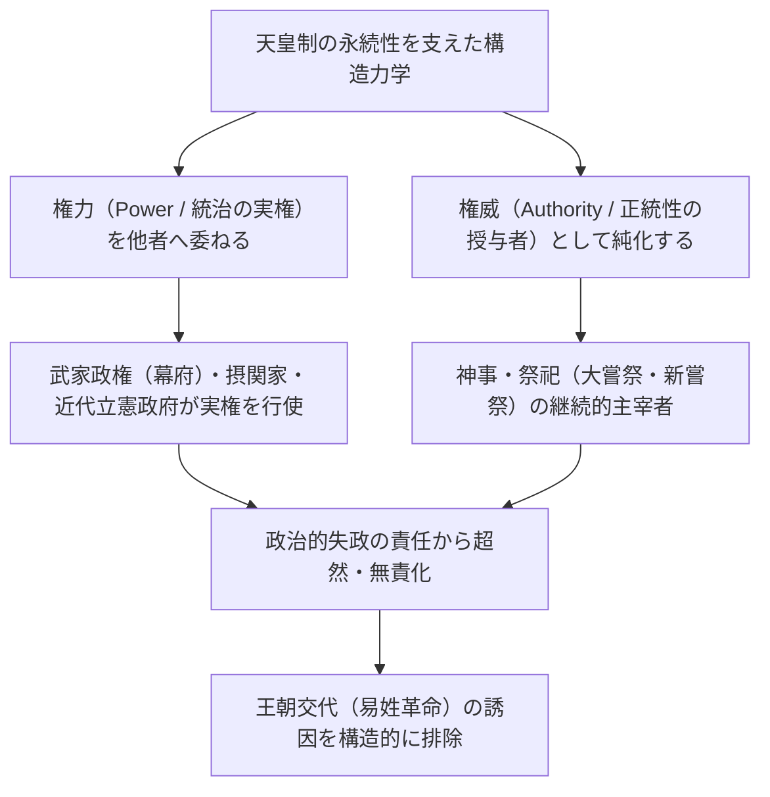
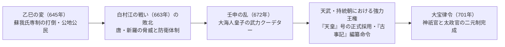
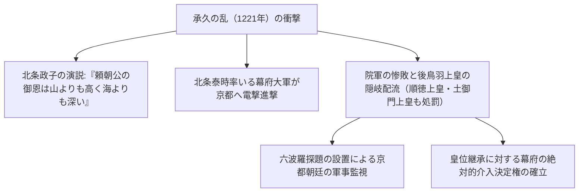
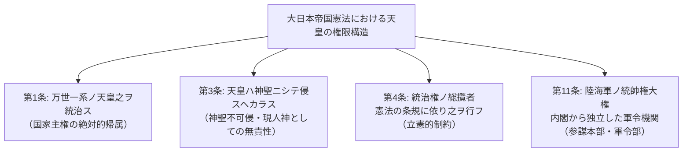
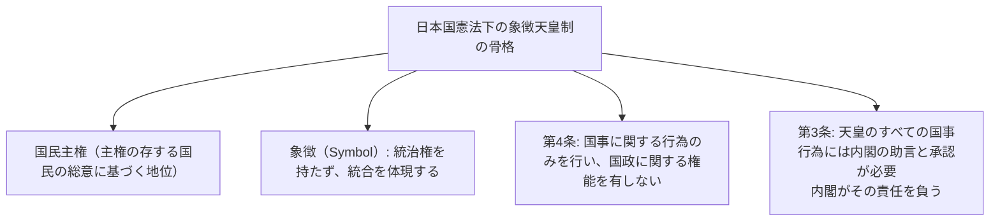
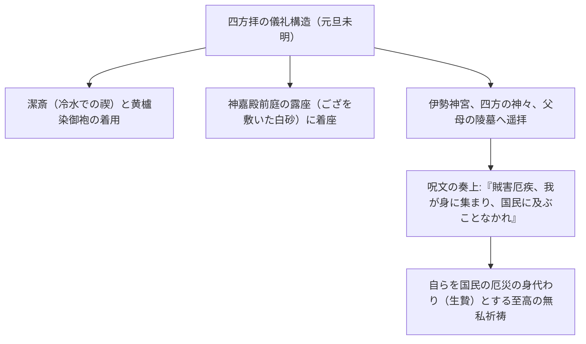
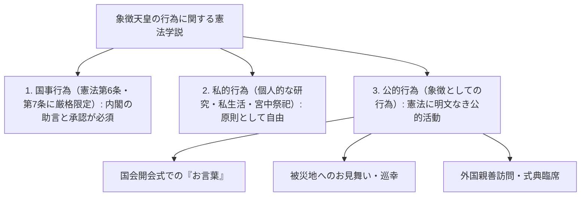

## 1. 序論：世界最古の世襲王統と「権力と権威の分離」

### 1.1 万世一系という言説と歴史学・考古学的実相

日本における天皇（Emperor of Japan）および皇室の歴史は、現存する世界のいかなる王室・王朝と比較しても、類を見ない特異な連続性を誇っている。ギネス世界記録においても「現存する世界最古の世襲君主家（The oldest continuous hereditary monarchy）」として認定されている。

近代の国学や大日本帝国憲法第1条が掲げた「万世一系（Bansei Ikkei: 永遠に絶えることのない単一の血統）」という言説は、神話的イデオロギーの色彩を帯びているが、実証的な歴史学および考古学の知見に照らしても、**少なくとも5世紀後半の雄略天皇（ワカタケル大王）あるいは6世紀初頭の継体天皇以降、およそ1500年以上にわたり単一の王統が同一の列島空間において連続してきたこと** は、学術的にも疑う余地のない歴史的事実である。

世界の諸文明の歴史を顧みるならば、中国においては天命が革まり姓が変わる「易姓革命（Dynastic Cycle）」によって皇帝一族が根絶やしにされ、ヨーロッパ諸国においてもノルマン朝、プランタジネット朝、チューダー朝、スチュアート朝、ハノーヴァー朝と王朝が次々に交替した。これに対し、なぜ日本においてのみ、王朝交代の断絶を経験することなく単一の王統が今日まで存続し得たのか？



---

### 1.2 「権力と権威の分離」という比較文明論的知見

丸山眞男やルース・ベネディクトをはじめとする思想史家・比較文化学者が指摘したように、日本文明における統治構造の最大の特質は、**「政治的権力（Power: 軍事力、徴税権、日常的統治）」と「究極的権威（Authority: 正統性の根源、宗教的・象徴的聖性）」が徹底して二元的に分離されてきたこと** にある。

西洋の絶対君主（フランスのルイ14世等）や中国の専制皇帝は、自ら軍隊を率いて命令を下す「権力者」であると同時に、法と秩序の「権威者」であった。この両者が一体化している場合、ひとたび失政や敗戦、社会的大混乱が起きれば、その責任は君主個人に直撃し、反乱によって一族もろとも玉座から引きずり下ろされる。

これに対し、日本の天皇は、平安時代の藤原氏（摂関政治）、白河院以来の院政、中世の武家政権（鎌倉・室町・江戸幕府）、そして近代の内閣に至るまで、**「世俗の統治権力（実権）を常に外部の補弼者・武家に委任する」** という構造を保持し続けた。幕府の将軍であっても、自らの支配の正当性を証明するためには、天皇から「征夷大将軍」に任命されなければならなかった。

失政の責任は常に権力を行使した幕府や内閣が負い、倒幕や政変によって滅び去る。しかし、正統性の源泉である天皇は政治的責任の彼岸に位置し続けたため、いかなる動乱の時代にあっても、天皇そのものを簒奪（殺害して自らが皇位に就くこと）する誘因が働かなかったのである。

---

## 2. 古代国家の形成と「天皇」号・律令祭祀の誕生

### 2.1 大王（オオキミ）から「天皇」への昇華

古墳時代、列島の中央に君臨したヤマト王権の首長は「大王（おおきみ / 治天下大王）」と呼ばれていた。埼玉県の稲荷山古墳から出土した鉄剣銘に刻まれた「獲加多支鹵大王（ワカタケル大王＝雄略天皇）」は、有力豪族（氏姓貴族）の連合体の盟主としての性格を色濃く残していた。

6世紀末から7世紀初頭、推古天皇を擁立した聖徳太子（厩戸皇子）と蘇我馬子は、冠位十二階（家柄ではなく個人の才覚による官位制度）と十七条憲法（「和を以て貴しと為す」「三宝を敬え」「詔を承けては必ず慎め」）を制定。隋の煬帝へ送った国書「日出ずる処の天子、書を日没する処の天子に致す、恙無きや」に見られるように、中華帝国の冊封体制（朝貢秩序）から脱頭し、独自の対等な「天子」としての自立を宣言した。

645年の**「乙巳の変（大化の改新）」** において、中大兄皇子（後の天智天皇）と中臣鎌足（藤原氏の祖）は、専横を極めた蘇我入鹿を宮中で暗殺。豪族による土地と人民の私有を否定し、すべての土地と民を国家（天皇）のものとする「公地公民制」の理想を打ち出した。



---

### 2.2 壬申の乱（672年）と天武天皇の絶対的権威

日本古代史最大の分水嶺となったのが、天智天皇の死後に勃発した皇位継承内乱**「壬申の乱（672年）」** である。吉野に隠棲していた大海人皇子は、美濃・尾張の東国武力を動員して近江朝廷の大友皇子を電撃的に滅ぼし、自ら飛鳥浄御原宮において即位した（**天武天皇**）。

天武天皇とその皇后であった持統天皇の治世において、古代律令王権の基本的枠組みが完成した。
1. **「天皇」号の公式採用**:
   - 道教の最高神「天皇大帝（北極星の神格化）」に由来するとされる「天皇（Tenno）」という至高の尊称が、木簡や金石文において正式に使用され始めた。
2. **国号「日本」の制定**:
   - それまでの「倭国」に代わり、「日の本（太陽が昇る国）」という誇り高き国号が定められた。
3. **歴史書（神話）の編纂開始**:
   - 天武天皇の勅命により、諸氏族に伝わる伝承を整理し、皇統の正統性を太陽神アマテラスへと遡源させる『古事記』（712年完成）および『日本書紀』（720年完成）の編纂が開始された。

---

### 2.3 記紀神話の深層構造と三種の神器

『古事記』『日本書紀』において語られる皇祖神アマテラスオオミカミ（天照大御神）から初代神武天皇に至る神話体系は、天皇の権威の宗教的・宇宙論的根拠を提示している。

- **天孫降臨と「三大神勅」**:
  - アマテラスが孫のニニギノミコト（瓊瓊杵尊）を地上（高千穂峰）に降臨させる際、下した最も根本的な命令が**「天壌無窮の神勅（てんじょうむきゅうのしんちょく）」** である。
  > 「豊葦原の千五百秋の瑞穂の国は、是れ吾が子孫の王たるべき地なり。爾皇孫、就でまして治らせ。行矣、宝祚の隆えまさむこと、当に天壌と窮り無かるべし。」
  - 地上の統治権は、天の神の意志によって皇孫とその子孫に永遠に与えられたという神聖契約である。
  - さらに、神鏡をアマテラス自身の御魂として祀るべきことを命じた「宝鏡奉斎の神勅」、天上の斎庭の稲穂を地上で育てることを命じた「斎庭稲穂の神勅」が下された。
- **三種の神器（Sanshu no Jingi）**:
  1. **八咫鏡（やたのかがみ）**: 叡智・太陽の神聖性（伊勢神宮内宮の御神体、皇居には形代を奉安）。
  2. **八尺瓊勾玉（やさかにのまがたま）**: 慈悲・霊力（皇居の剣璽の間に常置）。
  3. **草薙剣（くさなぎのつるぎ / 天叢雲剣）**: 武威・勇気（熱田神宮の御神体、皇居には形代を奉安）。
  - 歴代天皇の即位儀礼において、この神器を受け継ぐ「剣璽等承継の儀」は、皇位の不可欠の正統性の証拠とされてきた。

---

### 2.4 律令制度の二元制：神祇官と太政官、そして大嘗祭

701年の「大宝律令」において完成した古代官制は、唐の律令制度を模倣しつつも、日本独自の極めて重要な改変を施していた。

唐の制度では行政の最高機関（尚書省・中書省・門下省）の下に祭祀機関（太常寺）が置かれていたのに対し、日本の律令制は、国政を統括する**「太政官（だいじょうかん）」** と全く同等、あるいはそれ以上の最上位に、神々の祭祀を司る**「神祇官（じんぎかん）」** を並立させた（二官八省制）。

天皇の最も本質的な日常の任務は、政務（政治的判断）ではなく、**「神事（目に見えぬ神仏への祈り）」** にあった。
- **新嘗祭（にいなめさい）**: 毎年11月、その年に収穫された新穀を神々に捧げ、天皇自らもこれを食することで、神と人とが一体となり（神人共食）、国家の安寧と五穀豊穣を祈る儀礼。
- **大嘗祭（だいじょうさい）**: 天皇即位後、最初に執り行われる一代一度の秘儀。悠紀（ゆき）殿・主基（すき）殿と呼ばれる古代の素朴な寝殿を一から建て、夜を徹して皇祖神に新穀を供え、自らも食すことで、天皇霊（皇祖の霊威）を身体に宿し、真の霊的君主として再生（生まれ変わり）を遂げる。

政治的実権がいかに移り変わろうとも、この「国家のために神々に無私で祈り続ける司祭長」としての役割こそが、天皇制の不滅の核であり続けた。

---

## 3. 中世・近世における権威と権力の二重構造

### 3.1 摂関政治と院政：宮廷内部の権力力学

平安時代、天皇を巡る政治構造は高度な洗練と変容を遂げた。

- **藤原氏の摂関政治（10〜11世紀）**:
  - 藤原北家（道長・頼通の全盛期）は、自らの娘を歴代天皇の皇后（中宮）に入内させ、生まれた皇子を幼少で即位させることで、母方の祖父（外戚）として「摂政」および成人後の「関白」に就任。
  - 天皇の権威を簒奪することなく、外戚の地位を通じて人事権と国政決定権を完全に掌握した。
- **院政の成立（11世紀末〜）**:
  - 1086年、白河天皇は幼少の堀河天皇に位を譲って「上皇（太上天皇）」となり、宮廷の外（白河院）に自らの直属機関（院庁）を設置。
  - 「治天の君（ちてんのきみ: 天皇家の家長）」として、摂関家を排除して政治の実権を奪還した。上皇は出家して「法皇」となることで、儒教的・律令的な天皇の制約を脱し、専制的な権力を行使した。

---

### 3.2 武家政権の誕生と承久の乱（1221年）

12世紀後半、平氏政権の打倒を経て、源頼朝が東国鎌倉に**「鎌倉幕府」** を創設した。
頼朝は、朝廷から「征夷大将軍」の官職を得るとともに、全国に守護・地頭を設置する勅許（文治の勅許, 1185年）を獲得。ここに、西の「朝廷（公家）」と東の「幕府（武家）」という公武二元支配が成立した。

この武家優位の潮流を覆そうと乾坤一擲の賭けに出たのが、卓越した英気を持った**後鳥羽上皇**であった。
1221年、上皇は鎌倉幕府執権・北条義時追討の院宣を下し、全国の武士に蜂起を促した（**承久の乱**）。



承久の乱の結末は、武家側の圧倒的勝利であった。武士が朝廷の院宣を公然と踏みにじり、治天の君である上皇を流刑に処したこの事件により、「軍事力を持たぬ朝廷は、武家の力に逆らえない」という力学が白日の下に晒された。幕府は皇位継承に直接介入し、後の大覚寺統（南朝系）と持明院統（北朝系）の交代即位（両統迭立）を裁定する立場となった。

---

### 3.3 建武の新政と南北朝の動乱

1333年、後醍醐天皇は足利尊氏や新田義貞、楠木正成ら武士団を動員して鎌倉幕府を滅亡させ、天皇親政である**「建武の新政」** を開始した。

しかし、武士の恩賞要求を無視し、時代錯誤な公家優遇と復古主義的専制を進めた新政は、わずか2年余りで崩壊。離反した足利尊氏は京都に光明天皇（持持明院統）を擁立して室町幕府を開き、後醍醐天皇は吉野山中へと逃れて正統性を主張した。

以後、約60年間にわたり、京都の**「北朝」** と吉野の**「南朝」** が正統性を争って内乱を繰り広げる**「南北朝時代（1336–1392）」** が続いた。1392年、室町幕府3代将軍足利義満の斡旋により「明徳の和約（南北朝合一）」が結ばれ、南朝の後亀山天皇から北朝の後小松天皇へと三種の神器が引き渡された（歴代天皇の皇統は、北朝の後小松天皇以降の血統として今日まで続いているが、歴史的正統性は神器を保持し続けた南朝側にあると明治以降に公式認定されている）。

室町全盛期、足利義満は明の永楽帝から「日本国王」に冊封され、自らの子を天皇に即位させようとするなど「皇位簒奪」に最も近づいた人物とされるが、彼の急死とともにその野望は消滅した。

---

### 3.4 徳川幕府の禁中並公家諸法度と「御学問」の規定

戦国時代の乱世において、朝廷の財政は困窮を極め、後奈良天皇のように自筆の宸翰（和歌や般若心経）を売却して宮廷費を補うほどに衰微した。しかし、織田信長、豊臣秀吉、徳川家康ら天下人は、いずれも天皇を廃絶することなく、むしろ巨額の寄進を行い、関白や太政大臣、征夷大将軍の任官を受けて自らの政権の正統性を補強した。

天下を統一した徳川家康は、1615年、朝廷を法的に完全拘束する**「禁中並公家諸法度（全17条）」** を発布した。その冒頭、第1条には次のように明記された。

> **「天子諸芸のこと、第一御学問のこと。」**

この条文の真の意図は極めて冷徹であった。「天皇が修めるべきものは学問や有職故実、和歌の道であり、政治や軍事に関与することは断じてあってはならない」。
紫衣事件（1629年：幕府の許可なく高僧に紫衣を授与した勅許を幕府が無効化し、抗議した後水尾天皇が突然退位した事件）に象徴されるように、江戸時代の天皇は、京都御所の奥深くに幽閉され、政治的実権を1ミリも行使できない完全な「儀礼と学問の象徴的存在」として徹底的に無力化・無害化されたのである。

---

## 4. 明治維新と近代「現人神」国家の創出

### 4.1 尊皇攘夷から王政復古へ

江戸時代中期以降、水戸藩の「大日本史」編纂や国学（本居宣長ら）の発展により、「幕府の将軍は天皇から統治を委任されているに過ぎない（大政委任論）」という尊皇思想が武士階層に浸透していった。

1853年のペリー来航（黒船来航）以降、対外危機に対処できない徳川幕府の無能が露呈すると、下級武士や志士たちの間で「尊皇攘夷」の熱狂が爆発。孝明天皇は攘夷の勅定を下し、長州藩や薩摩藩は朝廷を政治的求心力として結集した。

1867年10月、15代将軍徳川慶喜は「大政奉還」を上奏。同年12月9日、岩倉具視や薩摩の西郷隆盛らの主導により**「王政復古の大号令」** が発せられた。
- 幕府、摂政、関白を全廃。
- 初代神武天皇の創業に立ち返り、天皇親政の新たな政府を樹立することを宣言した。
- 16歳の明治天皇が即位し、江戸は「東京」と改称され、皇居が京都から東京城（旧江戸城）へと遷された。

---

### 4.2 大日本帝国憲法（明治憲法, 1889年）の立憲二元論

伊藤博文ら明治の元勲たちは、プロイセン（ドイツ）の立憲主義を模範としつつ、日本の国情に適合した**「大日本帝国憲法」** を起草した。



明治憲法体制における天皇は、極めて高度な「両義性（二重性）」を持っていた。
1. **伝統的・宗教的側面**: 天皇は神々の子孫であり、国民道徳の源泉であり、神聖にして不可侵の現人神（あらひとがみ）である。
2. **近代的・立憲主義的側面**: 天皇は「憲法の条規に依り」統治権を行使する立憲君主であり、大統領のように独裁的命令を下すことはできず、行政権の行使には国務各大臣の「輔弼（ほひつ）」を要し（第55条）、立法権は帝国議会の協賛を要した。

大正時代、東大法学部教授・美濃部達吉が提唱した**「天皇機関説」**（国家という法人における最高機関が天皇であり、主権は法人たる国家に属するという学説）は、大正デモクラシー期における政党内閣制の憲法理論的支柱となった。

しかし、明治憲法には致命的な構造的欠陥が埋め込まれていた。それが**第11条の「統帥権の独立（陸海軍の統帥は内閣の輔弼を受けず、軍令機関が天皇に直隷する）」** である。昭和に入り、軍部がこの統帥権を盾にして内閣や議会の統制を完全に脱走したとき、立憲主義の防壁は脆くも崩壊することとなった。

---

## 5. 昭和の激動と敗戦、そして「象徴天皇制」への劇的転換

### 5.1 昭和初期の破局と終戦の「聖断」

1930年代、統帥権干犯問題、五・一五事件、二・二六事件を経て政党政治は息絶え、日本は軍部独裁と泥沼の日中戦争、そして1941年の太平洋戦争へと突入していった。

国家神道が極限まで教条化され、国民は「天皇のために命を捨てる」ことを美徳と教え込まれた。しかし、昭和天皇自身は、立憲君主として内閣と統帥部の決定を拒否できない自らの立場と、平和への祈りの間で激しく苦悩し続けた。

1945年8月、広島・長崎への原爆投下とソ連の参戦に直面し、最高戦争指導会議は「国体護持（皇室の存続）」をめぐって降伏か徹底抗戦（本土決戦・一億総玉砕）かで完全に同数に割れた。
8月10日および14日の防空壕内の御前会議において、鈴木貫太郎首相から意見を求められた昭和天皇は、涙を流しながら歴史的**「聖断」** を下した。

> **「私の任務は、国民を救うことにある。私の一身はどうなろうとも、これ以上国民が戦火に倒れ、人類の文明が破壊されるのを見るに忍びない。……私はどのような耐え難きことも耐え、忍び難きことも忍んで、戦争を終結させる決断をした。」**

8月15日正午、玉音放送（終戦の詔書）によって戦争は終結した。天皇の言葉による直接の介入がなければ、本土決戦によって数百万のさらなる犠牲者が出たことは確実視されている。

---

### 5.2 マッカーサーとの会見と東京裁判の回避

敗戦後、連合国軍最高司令官ダグラス・マッカーサー率いるGHQが進駐した。米英ソをはじめとする連合国世論の多くは、昭和天皇を「筆頭の戦争犯罪人」として処刑し、天皇制を完全廃絶することを要求していた。

1945年9月27日、昭和天皇はアメリカ大使館のマッカーサーを単身訪問した。マッカーサーの回想によれば、昭和天皇は命乞いをするどころか、次のように述べたという。

> **「私は、日本の国民が戦争遂行にあたって下したすべての政治的・軍事的決断と行動について、全責任を負う者として、ここに身を委ねるために参りました。私自身の命がどうなろうとも構いません。どうか、国民に食べるものを与えていただきたい。」**

マッカーサーはこの天皇の無私の精神に深い衝撃を受け、直ちに「天皇制の維持と天皇の訴追回避」へと占領政策の方針を固めた。もし天皇を処刑すれば、日本全国で100万規模のゲリラ反乱が勃発し、連合国軍の平和的統治が不可能になると判断したのである。

1946年1月1日、昭和天皇は**「新日本建設に関する詔書（いわゆる人間宣言）」** を発表。天皇と国民との絆は神話や現人神の観念によるものではなく、相互の信頼と敬愛によるものであると宣言した。

---

### 5.3 日本国憲法第1条：「象徴天皇制」の確立

1947年5月3日に施行された**「日本国憲法」** は、第1条において天皇の法的地位を根本から再定義した。

> **第1条：「天皇は、日本国の象徴であり日本国民統合の象徴であつて、この地位は、主権の存する日本国民の総意に基く。」**



- **統治権の完全剥奪**: 天皇はもはや国家の元首（支配者）ではなく、国家の存在そのものと国民の一体性を体現する「象徴（Symbol）」となった。
- **国政関与の禁止（第4条）**: 憲法に列挙された形式的・儀礼的な「国事行為」（国会の召集、総理大臣の任命、条約の批准、栄典の授与等）のみを行い、いかなる政治的権能も行使できない。
- **内閣の助言と承認（第3条）**: すべての国事行為には内閣の助言と承認が必須であり、政治的責任はすべて内閣が負う。

この「象徴天皇制」は、占領軍によって押し付けられた異質な制度と見なされがちであるが、前述した日本の長い歴史――**「天皇は政治権力を行使せず、権威と祈りに徹する」という中世以来の伝統的構造への、最も純粋な形での回帰** であったとも解釈できる。

---

---

## 2.5 宮中祭祀の儀礼構造と「四方拝」の精神力学

天皇の存在を理解する上で、日本国憲法上の「国事行為」とは完全に切り離された私的領域として皇室内で連綿と受け継がれている**「宮中祭祀（Imperial Court Rituals）」**の深奥に触れなければならない。

皇居の鬱蒼とした吹上御所の奥深くに鎮座する**「宮中三殿」**――
1. **賢所（かしこどころ）**: 皇祖神アマテラスオオミカミの御神体である八咫鏡（形代）を奉斎。
2. **皇霊殿（こうれいでん）**: 神武天皇以来の歴代天皇・皇族の御霊を祀る。
3. **神殿（しんでん）**: 天神地祇（八百万の神々）を祀る。

天皇は年間を通じて数十回に及ぶ厳粛な祭祀を自ら主宰する。その中で、最も精神的震撼を呼ぶ儀礼が、元旦の未明（午前5時半）、厳冬の寒気の中で執り行われる**「四方拝（しほうはい）」**である。



天皇は冷水で身を清め、古式ゆかしい装束で白砂の露座に座し、伊勢神宮をはじめとする四方の山河・諸神、そして歴代天皇の山陵に向かって深々と遥拝する。そして、平安時代の儀式書に記された呪文を奏上する。
> **「賊害、厄疾、水火の難、万民に及ぶべきものは、先ず我が身を通りて及べ（災厄が国民に降りかかるならば、まず私の身体を通過させよ）。」**

自らを国家と国民の災厄を引き受ける「究極の身代わり（スケープゴート）」として神に差し出すこと。他者を支配するための権力ではなく、自らを無に帰して他者の幸福を祈るこの絶対的な自己犠牲の祭祀精神こそが、数千年を超えて天皇の権威が国民の深層心理に刻印されてきた無意識の磁場なのである。

---

## 3.5 歴代女性天皇の歴史的実態と「中継ぎ」論の虚実

皇位継承論議において頻繁に引き合いに出されるのが、過去の日本史に実在した**「8方10代の女性天皇」**である。

| 代数 | 天皇名 | 治世 | 即位の背景と歴史的業績 |
| :---: | :--- | :---: | :--- |
| **第33代** | **推古天皇** | 592–628 | 崇峻天皇暗殺後の混乱を収拾するため、初の女性天皇として即位。聖徳太子・蘇我馬子と協調し、冠位十二階・十七条憲法を制定。 |
| **第35代/37代** | **皇極天皇 / 斉明天皇** | 642–645 / 655–661 | 重祚（ちょうそ: 二度即位）。乙巳の変の舞台となり、斉明期には白村江の戦いに向けて九州へ親征、戦地で崩御。 |
| **第41代** | **持統天皇** | 690–697 | 天武天皇の皇后。夫の遺志を継ぎ、藤原京を造営、飛鳥浄御原令を施行し、孫の文武天皇へと皇統を確実に繋ぐ。 |
| **第43代** | **元明天皇** | 707–715 | 平城京遷都（710年）、『古事記』完成、『風土記』編纂命令。 |
| **第44代** | **元正天皇** | 715–724 | 元明天皇の娘（母から娘への唯一の皇位継承）。『日本書紀』完成、三世一身法制定。 |
| **第46代/48代** | **孝謙天皇 / 称徳天皇** | 749–758 / 764–770 | 聖武天皇の娘。重祚。藤原仲麻呂の乱を鎮圧し、法王道鏡を重用。宇佐八幡宮神託事件で道鏡の皇位簒奪を阻止。 |
| **第109代** | **明正天皇** | 1629–1643 | 江戸時代初期。後水尾天皇が紫衣事件で幕府に抗議して突如退位したため即位（徳川秀忠の孫）。 |
| **第117代** | **後桜町天皇** | 1762–1770 | 江戸時代中期。桃園天皇急逝後、幼少の後桃園天皇が成長するまで治世を担当。近世最後の女性天皇。 |

歴史学的な精査において明らかな事実は、**「過去の女性天皇は、すべて父親が天皇である『男系女子』であった」** という点である（民間人や他王朝の男性と婚姻して女系の子孫に皇位を継承させた例は皆無）。

また、その多くが「皇位継承候補者が幼少である」「前帝の急死による政治的空白の危機」といった緊急事態において、皇室の長老として即位し、皇位継承の危機を回避した後に次世代の男系男子へとバトンを渡す「中継ぎ（ピンチヒッター）」の役割を果たした。

しかし同時に、推古天皇や持統天皇のように、単なる中継ぎを超えて強大な指導力を発揮し、古代国家の骨格を完成させた偉大な女性君主が存在したこともまた厳然たる事実である。古代日本において、女性が持つ「神降ろしの巫女的霊力（シャーマニズム）」と、男性の世俗的統治権力が補完し合う「ヒメ・ヒコ制」の伝統が、女性天皇の受容を容易にしたと考えられている。

---

## 4.6 国家神道の創出と「神社非宗教論」の近代哲学的アクロバット

明治維新政府が直面した最大の難題は、「西欧列強に対抗しうる近代的な国民国家（Nation-State）の統合原理をいかに創り出すか」であった。

### ① 廃仏毀釈の狂風と神仏分離
千数百年にわたり共存・融合してきた「神仏習合（神社境内に寺院が建ち、仏が神の姿で現れるという本地垂迹説）」を、明治政府は1868年の**「神仏判然令（神仏分離令）」**によって強制的に引き裂いた。
これにより、全国で仏像が打ち壊され、経典が焼かれ、五重塔が破壊される過激な**「廃仏毀釈（はいぶつきしゃく）」**の狂風が吹き荒れた。政府は当初、神道を国教化する「大教宣布運動」を進めたが、民衆の仏教信仰の根深さと、欧米諸国からの「信教の自由の侵害」という強い外交批判に直面して挫折した。

### ② 「神社非宗教論」という超法規的フィクション
ここで明治の指導者（井上毅ら）が編み出した驚異的な法理が、**「神社神道は宗教ではない（神社非宗教論）」**というイデオロギー的フィクションであった。
- 大日本帝国憲法第28条において「信教の自由」を保障し、キリスト教や仏教を「個人の私的な宗教」として認めた。
- その一方で、「神社（伊勢神宮や靖国神社等）で行われる祭祀は、宗教ではなく、国民全員が参加すべき**『国家の公的な道徳・祖先崇敬の儀礼』**である」と定義した。
- これにより、キリスト教徒や仏教徒であっても、帝国臣民である以上、神社への参拝や天皇への崇敬を拒否することは許されないという「国家神道（State Shinto）」の超宗教的絶対空間が構築された。この論理的アクロバットが、後の昭和期における軍国主義的「現人神」崇拝の暴走を許す制度的温床となったのである。

---

## 5.5 憲法判例と象徴天皇制の境界線

日本国憲法下における象徴天皇制は、数々の憲法学的論争と司法判断の試練を経て、その解釈を洗練させてきた。



### ① 「公的行為（象徴としての行為）」の肯定
憲法第4条第1項は「天皇は、この憲法の定める国事に関する行為のみを行ひ」と規定している。文言を厳格に解釈すれば、国事行為以外の公的な活動（被災地訪問、外国賓客の接遇、開会式でのお言葉）はすべて違憲となりかねない。
判例および政府解釈は、「天皇は日本国の象徴としての地位にある以上、その地位にふさわしい**『公的行為（象徴としての行為）』**を行うことが当然に認められる」とし、これらについても内閣のコントロール（実質的助言と責任）の下で行われる限り合憲であると位置づけた。

### ② 政教分離（憲法20条・89条）と宮中祭祀
新嘗祭や大嘗祭といった皇室神道行事は、国家の公的予算（宮廷費・公費）から支出されるべきか、それとも内廷費（天皇家の私費）から支出されるべきかが争われた。
最高裁判所（津地鎮祭判決・愛媛玉串料判決）の「目的・効果基準（当該行為の目的が宗教的意義を持ち、その効果が特定の宗教を援助・圧迫・干渉するものであるか）」に照らし、平成および令和の即位礼において、大嘗祭は「皇室の伝統的儀礼であり公的性格を持つ」として公費（宮廷費）からの支出が合憲と判断された。

## 6. 現代における象徴天皇の営みと皇位継承問題

### 6.1 平成の「旅」と退位の実現

象徴天皇制に血肉を通わせたのが、第125代天皇（現・上皇明仁）と上皇后美智子の歩みであった。
「象徴とはいかにあるべきか」を常に自問し続けた上皇は、日本全国の被災地（雲仙普賢岳、阪神淡路大震災、東日本大震災）に自ら足を運び、避難所の床に膝をついて被災者と同じ目線で手を握り、励まし続けた。また、沖縄、広島、長崎、さらには激戦地サイパンやパラオ・ペリリュー島、フィリピンへと「慰霊の旅」を重ね、過去の戦争の記憶を風化させないための祈りを捧げた。

2016年8月8日、天皇は異例のビデオメッセージ（「お気持ち」表明）を国民に向けて発信。高齢に伴い全身全霊で象徴の務めを果たすことが困難になりつつある心情を吐露した。これに応え、国会は2017年に「皇室典範特例法」を制定。2019年4月30日、江戸時代の光格天皇以来およそ200年ぶりとなる「生前退位」が平和裏に実現し、徳仁皇太子が第126代天皇に即位して「令和」の御代が幕を開けた。

---

### 6.2 皇位継承をめぐる現代の憲法・法政策的論点

21世紀の今、皇室が直面する最大の危機が「皇族数の減少と皇位継承資格の狭隘化」である。
現行の「皇室典範第1条」は、**「皇位は、皇統に属する男系の男子が、これを継承する」** と定めている。

現在、次世代の皇位継承資格を持つ皇族は、悠仁親王殿下一方のみという極めて綱渡りの状況にある。この課題を巡り、国論は主に3つの選択肢の間で激しく議論されている。

| 論点 | 提案内容 | 推進派の論拠 | 慎重派・反対派の懸念 |
| :--- | :--- | :--- | :--- |
| **① 女性天皇の容認** | 天皇の娘（女性）が即位することを認める（例：愛子内親王の即位）。 | 歴史上、推古天皇から後桜町天皇まで8方10代の女性天皇の実例が存在する。国民感情にも合致。 | 男系女子にとどまる限り問題ないが、女系天皇への足がかりになることを警戒する声。 |
| **② 女系天皇の容認** | 母方のみを通じて皇統に連なる者の即位を認める（女性天皇の子が民間人男性との間にもうけた皇子等）。 | 血統の枯渇を半永久的に回避できる唯一の現実的解法。男女平等の精神。 | 過去126代にわたり一度も途絶えたことのない「男系継承の伝統」という皇室の存立根拠が根本から失われるという強い反発。 |
| **③ 旧宮家（男系旧皇族）の復帰** | 1947年にGHQの命令で臣籍降下（離脱）した旧11宮家の男系男子子孫を、養子縁組等で皇族に復帰させる。 | 万世一系の男系男子の伝統を完璧に維持できる。 | 戦後80年近く一般国民として生活してきた民間人を突然皇族とすることに対する国民的受容性・感情の壁。 |

---

## 7. 結論：祈りの系譜と日本文明の古層

天皇制とは、政治的制度である以前に、日本列島という風土とそこに暮らす人々が数千年にわたって育んできた**「精神と祈りの文化的古層」** である。

大統領のように自らの権力を誇示することなく、
富を誇る大富豪のように振る舞うこともなく、
宮中の森厳なる静寂の中で、四季折々の神事に身を清め、
国民の幸福と世界平和、五穀の豊穣をただひたすらに祈り続ける存在。

古代の豪族たちも、中世の荒ぶる武士たちも、明治の近代化を推進した志士たちも、そして戦後の廃墟から復興を遂げた国民たちも、その無私の「祈りの座」の前に頭を垂れてきた。

制度としての形態が、律令国家、幕府体制、明治立憲帝国、そして戦後民主主義の象徴へと時代とともに変幻自在に適応しながらも、その中心にある「聖なる祈りの連続性」だけは一度たりとも失われることはなかった。

変容し続ける激動の21世紀世界において、過去数千年と未来の数千年の時間をつなぐ生きた歴史の結節点として、天皇という実存は、日本人が自らのアイデンティティと向き合うための深遠なる鏡であり続けるのである。


### 2.6 大嘗祭の祭祀人類学的深層：折口信夫「真床追衾」論争と新穀共食のコスモロジー

即位儀礼の頂点をなす大嘗祭（だいじょうさい）は、単なる収穫祭の延長ではなく、天皇が始祖神の霊威を承継し「現人神」あるいは「聖なる神格」へと霊的変容を遂げるイニシエーション（通過儀礼）としての性格を帯びてきた。この祭祀の儀礼構造をめぐっては、近代以降の人類学・宗教学・歴史学において極めて白熱した学術論争が展開されてきた。

その代表例が、民俗学者・折口信夫が提唱した「真床追衾（まとこおふすま）」論である。折口は『大嘗祭の本義』（1928年）において、大嘗宮の悠紀殿（ゆきでん）および主基殿（すきでん）の奥深くに設えられる「坂枕（さかまくら）」と「神臥床（かむふしど）」に着目した。天孫降臨神話においてニニギノミコトが「真床追衾」に包まれて降臨した記述と結びつけ、新帝は神臥床において衾（ふすま＝寝具）に身を潜めることで仮死状態を疑似体験し、天照大神の霊魂（「天照大神の御霊」あるいは「皇祖の神霊」）をその身体に合体・受振させる密儀を行ったと主張した。すなわち、大嘗祭とは「霊魂の再生・合体儀礼（魂振り・魂鎮め）」であるという解釈である。

```
【大嘗祭の秘儀構造をめぐる二大学術潮流】

1. 折口信夫説（霊魂合体・再生イニシエーション論）
   ・核心概念: 「真床追衾」「神臥床」
   ・儀礼解釈: 新帝が衾に籠もる疑似死と再生を通じ、祖霊・天照大神の霊を宿す霊的変容の秘儀。
   ・理論的背景: 柳田国男・折口信夫のマレビト論、南島論、宮座・若者組の通過儀礼。

2. 宮廷祭祀・実証史学説（新穀共食・神人合一祭祀論）
   ・核心概念: 「神饌献饌」「神人共食（しんじんきょうしょく）」
   ・儀礼解釈: 新帝が祖神とともに新穀の米・粟・神酒を飲食し、共同の絆と統治権を盟約する農耕儀礼。
   ・代表的研究: 岡田荘司、所功、坂本太郎らによる古記録・延喜式典籍の実証的再検討。
```

これに対し、岡田荘司や所功ら歴史学者・神道史家は、平安期の『延喜式』大嘗祭儀式や各種古記録を厳密に照合し、折口説の文献的根拠の脆弱さを指摘した。彼らの実証研究によれば、大嘗祭の儀礼の中心はあくまで深夜に新帝自らが神饌（米、粟、白酒、黒酒、鮑、魚介類）を神祇に捧げ、神前で自らも同じ食物を食する「神人共食（しんじんきょうしょく）」にある。神と食事を共にすることによって、農耕社会の豊饒を感謝し、祖先神との聖なる盟約を更新する。神臥床は神が休息するための神座であり、天皇が実際に寝棺のように籠もった記録は存在しないとする。

現代の学問的合意としては、折口説の大胆な詩的直観と人類学的跳躍を評価しつつも、歴史的実態としては古代東アジアの農耕儀礼体系および即位儀礼の重層的複合体として捉える視角が主流となっている。しかし、いずれの解釈に立つとしても、大嘗祭が「政治的権力者」が「祭祀的主体」へと変貌する決定的な精神的境界装置として機能してきた事実は動かない。

---

### 4.3 廃仏毀釈と大教宣布運動：神道国教化の挫折と「国家神道」の制度工学

明治維新における「王政復古」は、単なる武家政権から太政官制への権力委譲ではなく、古代の「祭政一致」への復古を標榜する急進的な宗教・思想革命の側面を有していた。新政府は成立直後の1868年（慶応4年/明治元年）3月、太政官布告をもって「神仏分離令」を発した。これは中世以来千数百年にわたって日本社会の基盤であった神仏習合体制を解体し、神社から仏教的要素（仏像、経典、梵鐘、僧侶の別当・社僧身分）を強制的に排除するものであった。

この神仏分離は、各地で過激な破壊行動を引き起こした。いわゆる「廃仏毀釈（はいぶつきしゃく）」である。薩摩藩や苗木藩、隠岐、富山などでは寺院が徹底的に破却され、仏像が焼却あるいは破壊された。興福寺の五重塔がわずか25円で売りに出されそうになるなど、日本の伝統的文化財と仏教寺院経済は壊滅的打撃を受けた。

```
【明治初期の祭政一致イデオロギー変遷】

神祇官復興（1869年）
  -- "急進的平田派国学による祭政一致・神道国教化推進" -->
神仏分離・廃仏毀釈の嵐（全国的寺院破壊と仏教弾圧）
  -- "国内外の批判と民衆の動揺に直面" -->
大教宣布運動（1870年〜：宣教使・教部省設置、国民教化の試み）
  -- "真宗僧侶（島地黙雷ら）の信教の自由論争・欧米列強の圧力" -->
神道国教化の挫折（1875年：大教院解散）
  -- "「神社非宗教論」の構築（行政制度としての神社と国家神道体制の成立）" -->
国家神道体制（内務省神社局管理、全宗派を超越した国民道徳への昇格）
```

しかし、急進的な平田派国学者が主導した「神祇官」による神道国教化路線は、急速に暗礁に乗り上げた。第一に、仏教勢力（特に浄土真宗の島地黙雷ら）が欧米の近代政教分離論と信教の自由の法理を武器に強力な抵抗を展開したことである。島地は1872年の欧州視察を通じて、信教の自由こそが近代国家の基本原則であり、国家が特定の教義を国民に強制することは不可能であると論破した。第二に、キリスト教禁令の高札撤廃（1873年）に見られるように、不平等条約改正を目指す明治政府にとって、欧米列強から「信教の自由を認めない野蛮国」と見なされることは外交的致命傷であった。

このジレンマを解決するために明治官僚（特に井上毅ら）が編み出した高度な統治工学が、「神社非宗教論」に基づく「国家神道」の形成であった。
政府は神社を「個人の信奉する宗教（仏教、キリスト教、教派神道）」とは次元を異にする「国家の祭祀」「国民道徳の基礎」と定義した。これにより、帝国憲法第28条で外見的に「信教の自由」を保障しつつ、神社への参拝や宮中祭祀への敬意を「全臣民の公的義務」として義務づけるという、巧妙な重層的イデオロギー空間が完成したのである。

---

### 4.4 『軍人勅諭』と『教育勅語』：大元帥天皇と内面道徳の国家統合

近代立憲国家としての外形を整える一方で、国民の精神と軍隊の規律を絶対的に天皇に結びつけるための精神的装置として機能したのが、1882年（明治15年）の『軍人勅諭』と1890年（明治23年）の『教育勅語』である。

#### 1. 『軍人勅諭』と大元帥天皇制
西周（にし・あまね）が起草し、山縣有朋らが修正を加えた『軍人勅諭』は、軍隊を「天皇親率の軍」と規定し、軍人と天皇の直結関係を宣言した。

> 「我が国の軍隊は、世々天皇の統帥し給ふ所にぞある。（中略）朕は汝等軍人の大元帥なるぞ。されば朕は汝等を股肱と頼み、汝等は朕を頭首と仰ぎて、其親ぞ特に深かるべき」

ここにおいて、軍隊は内閣や帝国議会に対して責任を負う国家の公的組織ではなく、天皇個人に対する絶対的忠誠組織として構築された。勅諭は「忠節・礼儀・武勇・信義・質素」の五箇条を軍人の徳目として課し、「義は山岳よりも重く死は梯毛よりも軽しと心得よ」と命じた。この大元帥天皇と軍隊の直結構造は、内閣総理大臣ですら軍の作戦統帥に介入できないという「統帥権の独立」の精神的根拠となり、昭和期における軍部の暴走を抑止不能にする制度的罠（トラップ）となった。

#### 2. 『教育勅語』と忠孝一本の国民モラル
井上毅と元田永孚の妥協的合作として公布された『教育勅語』は、法制上の勅令ではなく、天皇が臣民に語りかける形式をとった。親への孝行、兄弟の友愛、夫婦の和といった儒教的家族倫理を説きつつ、その終局の目的を「一旦緩急アレバ義勇公ニ奉ジ以テ天壌無窮ノ皇運ヲ扶翼スベシ」という、国家防衛と皇室維持への自己犠牲に収斂させた。

教育勅語は全学校の儀式（四大節：紀元節、天長節、明治節、元始祭）において「御真影（天皇・皇后の肖像写真）」とともに最敬礼の対象とされ、臣民の内面に深く浸透した。1891年（明治24年）、第一高等中学校の嘱託教員であったキリスト教徒・内村鑑三が教育勅語奉読の際に最敬礼を躊躇したことで糾弾・失職した「内村鑑三不敬事件」は、教育勅語が単なる道徳基準を超えて、国家への絶対的忠誠を試す準宗教的踏み絵として機能していたことを象徴している。

---

### 4.5 明治・大正・昭和初期の国体論争：上杉慎吉 vs 美濃部達吉と「天皇機関説」の悲劇

帝国憲法体制が確立したのち、法学界と政治言説の場において最も先鋭に対立したのが、国家と天皇の関係をめぐる憲法解釈論争である。その主戦場が、東京帝国大学教授であった上杉慎吉（主権論・神権学派）と美濃部達吉（国家法人説・機関説学派）による論争であった。

```
【憲法学における二大天皇観の対立】

1. 上杉慎吉（神権的君主主権説）
   ・国家論: 天皇即国家。主権は天皇固有の神権的権利。
   ・統治権解釈: 統治権は絶対・無制約。憲法は天皇が自らを自制する訓示的規定にすぎない。
   ・思想的系譜: 穂積八束の家長国体論、絶対君主制思想、昭和超国家主義の理論的源流。

2. 美濃部達吉（天皇機関説・立憲主義国家法人説）
   ・国家論: 国家が法人（法人格を有する統治団体）であり、主権（統治権）は国家に帰属する。
   ・統治権解釈: 天皇は法人たる国家の「最高機関」として憲法の枠組みのなかで統治権を行使する。
   ・思想的系譜: ゲオルグ・イェリネクの一般国家学、大正デモクラシー・政党内閣制の理論的支柱。
```

美濃部達吉の「天皇機関説」は、決して天皇を軽視するものではなく、ドイツの公法学者ゲオルグ・イェリネク（Georg Jellinek）の精緻な国家法人説を基礎として、日本を法治国家たらしめ、専制政治を防ぎ、議会政治（政党内閣制）の正統性を担保するための理論的支柱であった。大正デモクラシー期には機関説が官界・学界の通説となり、高等文官試験の標準答案としても採用されていた。

しかし、1930年代に入り軍部と右翼勢力が台頭すると、機関説は「天皇を国家の道具（一機関）に貶める不敬の学説」として猛烈な攻撃の標的となった。1935年（昭和10年）、貴族院議員・菊池武夫の演説を端緒として軍部・在郷軍人会が蜂起し、「国体明徴運動」が巻き起こる。岡田啓介内閣は軍部の圧力に屈し、美濃部の著書（『憲法撮要』等）を発禁処分とし、美濃部は貴族院議員を辞任に追い込まれた。さらに政府は二度にわたる「国体明徴声明」を出し、「統治権の主体は天皇にあり、機関説は国体の本義に反する」と公式に断じた。

天皇機関説の圧殺は、日本における立憲的法治主義の事実上の終焉を意味した。憲法の制約を受けない超越的・神秘的な天皇観が国家を覆い尽くし、大本営や軍部が「統帥権の神聖」を楯にしてあらゆる文民統制（シビリアン・コントロール）を排除する論理的フリーハンドを獲得したのである。

---

### 5.4 象徴天皇制の比較憲法国制論：英国型君主制との相違と「元首論争」

日本国憲法第1条が定める「象徴天皇制」は、世界の立憲君主制のなかでも極めて特異な法構造を有している。立憲君主制の代表格であるイギリス（グレートブリテン及び北アイルランド連合王国）をはじめとするヨーロッパの君主制諸国と比較することで、その独自性が明確に浮き彫りとなる。

#### 1. 英国君主制との構造的相違
イギリス憲政において、君主は形式上「統治権の源泉」であり、議会は「議会における国王（King-in-Parliament）」として立法権を行使する。政府は「陛下の政府（His Majesty's Government）」であり、軍隊は「国王陛下の軍隊」である。ウォルター・バジョット（Walter Bagehot）が『イギリス憲政論』（1867年）で定式化したように、君主は「尊厳ある部分（dignified parts）」を構成し、「能率的な部分（efficient parts）」たる内閣と対をなす。バジョットによれば、君主には「助言を受ける権利、励ます権利、警告する権利」という実質的な政治的影響力の行使余地が残されている。

これに対し、日本国憲法下の天皇は、統治権の源泉ですらない。憲法第1条は「主権が国民に存する」ことを高らかに宣言し、憲法第4条は天皇が「国政に関する権能を有しない」と明文で禁じている。天皇が行う国事行為（憲法第6条・7条）はすべて「内閣の助言と承認」を必要とし、内閣がその責任を負う（第3条）。天皇自らの自由意思による政治的意見の表明や政治家への警告は、憲法上完全に封殺されている。これは、ヨーロッパ型立憲君主制よりも徹底して政治的権能を削ぎ落とした「純粋象徴制」と呼ぶべき独自モデルである。

```
【英国立憲君主制と日本国憲法下象徴天皇制の比較】

┌─────────────────┬───────────────────────────────┬───────────────────────────────┐
│ 比較項目        │ イギリス（英国立憲君主制）    │ 日本（日本国憲法下象徴天皇制）│
├─────────────────┼───────────────────────────────┼───────────────────────────────┤
│ 主権の所在      │ 国王と議会（King-in-Parliament│ 国民（国民主権）              │
│ 国王／天皇の地位│ 形式的元首・統治権の源泉      │ 日本国の象徴・日本国民統合象徴│
│ 国政に関する権能│ 形式的大権保持（拒否権・任免）│ 一切有しない（第4条第1項）    │
│ 政治的発言・影響│ 助言・激励・警告の権利を保持  │ 政治的権能完全剥奪・助言承認要│
│ 軍隊との関係    │ 国軍の最高司令官              │ 自衛隊との法的指揮関係なし    │
└─────────────────┴───────────────────────────────┴───────────────────────────────┘
```

#### 2. 戦後憲法学における「元首論争」
この特異な国制ゆえに、憲法学および外交実務において長期にわたり争われてきたのが「天皇元首論争」である。
元首（Chief of State）とは、対外的に国家を代表し、対内的に統治権の首長たる地位を指す国際公法上の概念である。

- **肯定説（実務・保守派）**: 外交使節の接受や条約の批准書の認証を行い、国際儀礼（プロトコル）上、外国元首と同等の処遇（大統領や国王としての待遇）を受けている現実を重視し、天皇は実質的・対外的な元首であると主張する。
- **否定説（宮沢俊義ら多数派憲法学者）**: 憲法上、条約締結権や外交関係処理権は内閣に属し（第73条）、対外代表権の実質は内閣総理大臣にある。天皇は行政権の長でもなければ自律的意思決定権も持たないため、法意としての元首とは呼べないと解する。
- **準元首説 / 象徴的元首説**: 内外の機能を分割し、対外儀礼的代表を天皇、実質的行政代表を首相とする二元論的解釈。

この論争は単なる神学論争にとどまらず、政府公式見解としても「天皇は条約批准書の認証や信任状の接受など対外的な国家代表としての機能を果たしており、元首と呼んでも差し支えない（あるいは象徴的元首である）」という玉虫色の表現を維持し続けている。

---

### 6.3 令和改元と皇室典範特例法（2017年）：憲法第2条「皇位世襲」と退位の法理

2016年（平成28年）8月8日、第125代天皇（現上皇明仁）が国民に向けて表明された「象徴としてのお務めについての天皇陛下のおことば」は、戦後象徴天皇制における最大の画期となった。天皇が高齢に伴い象徴としての重責を十分に果たすことが困難となる懸念を吐露されたこのビデオメッセージは、日本社会に巨大な衝撃を与え、皇室典範の改正論争を呼び起こした。

皇室典範第4条は「天皇が崩じたときは、皇嗣が、直ちに即位する」と定め、終身在位を原則としていた。これには、江戸時代以前に頻繁に見られた太上天皇（上皇）と在位の天皇による「二重権力」の発生を防ぐという近代国家建設期の強い警戒感が背景にあった。

しかし、政府は憲法第2条「皇位は、世襲のものであつて、国会の議決した皇室典範の定めるところにより、これを継承する」との整合性を保ちつつ、一代限りの法的解決を模索した。その結果制定されたのが、2017年（平成29年）6月の「天皇の退位等に関する皇室典範特例法」である。

```
【退位をめぐる主要な憲法・法制上の論点】

1. 恒久法化（典範本法改正） vs 特例法方式
   ・政府の判断: 恒久的に退位を容認すれば、将来の天皇の意に反する強制退位や、恣意的な退位の政治利用が懸念されるため、国民の広範な敬愛と理解を前提とした「一代限りの特別法」とした。
   ・憲法学の指摘: 憲法第2条が「皇室典範の定めるところにより」と規定している以上、典範本法の改正ではなく別個の特例法で処理することは憲法精神の脱法（個別法による皇位継承）ではないかという批判的見解も存在。

2. 二重権威・二重権力の抑止
   ・上皇（退位後の天皇）の法的地位と権能の整理。宮内庁に「上皇職」を新設し、一切の公的行為・国事行為代行を行わず、新天皇への完全な象徴機能の移行を制度設計。

3. 皇位継承資格の将来像
   ・皇族女子の婚姻に伴う皇籍離脱の継続により、皇室を支える親族が激減。
   ・女性天皇（男系女子）、女系天皇（母方のみが天皇の血を引く天皇）、旧宮家男系男子の養子縁組復帰などをめぐる国民的議論が、主権者たる国民の課題として残存。
```

2019年（令和元年）5月1日の徳仁親王の即位、そして「令和」改元は、202年ぶりとなる天皇の生前退位による皇位継承として、極めて平穏かつ祝福に満ちた形で執行された。この歴史的出来事は、象徴天皇制の正統性と存続が、制度の固定性ではなく、主権者たる国民の総意との動的な共感と相互信頼の上に築かれていることを劇的に再確認させたのである。

