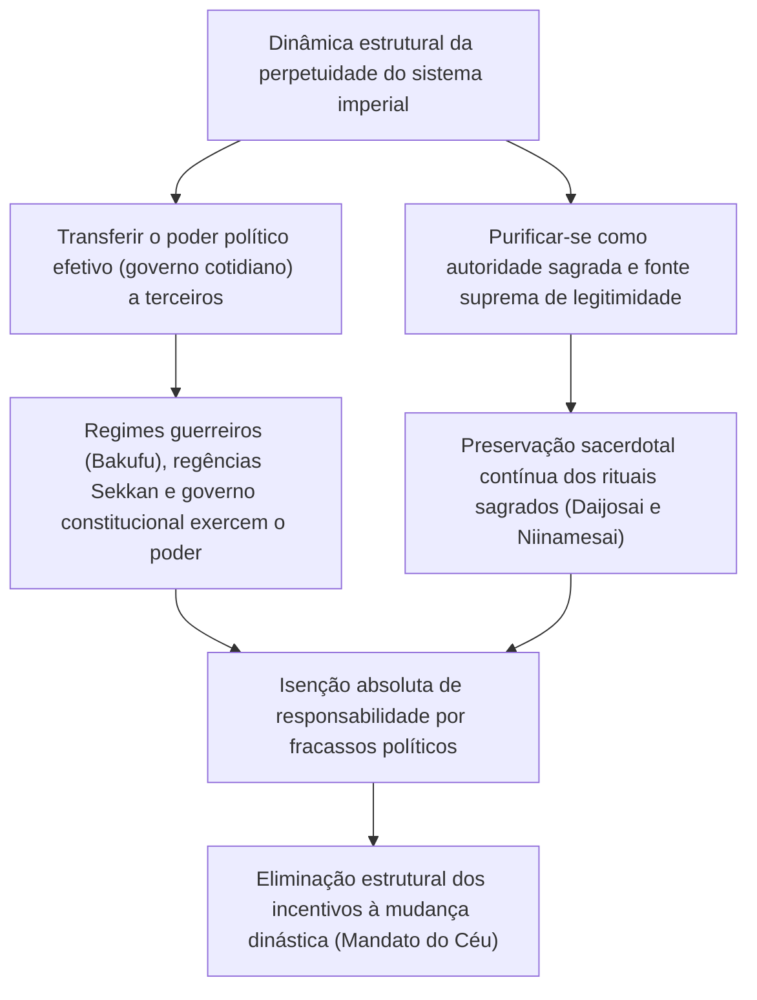
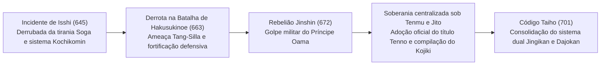
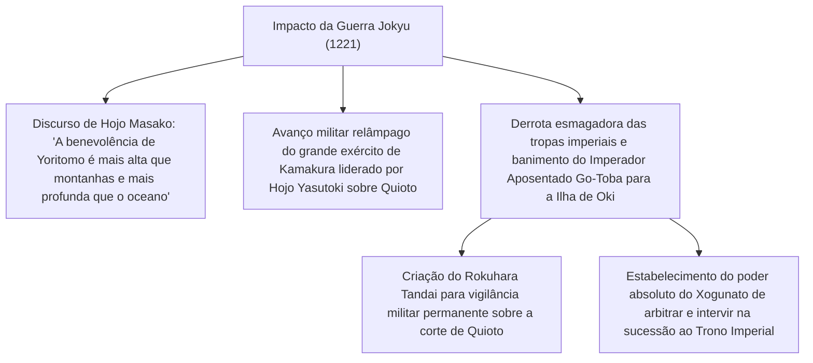
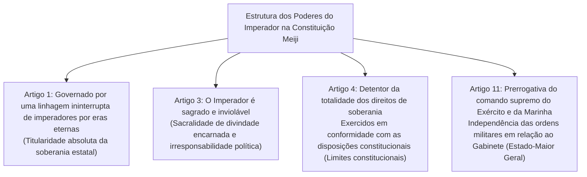
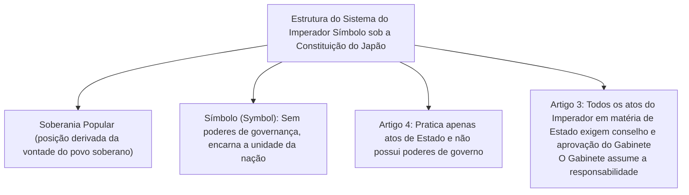
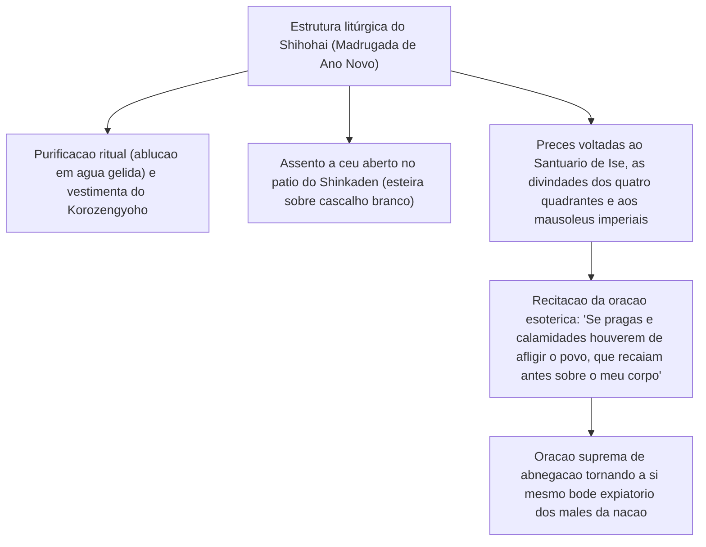
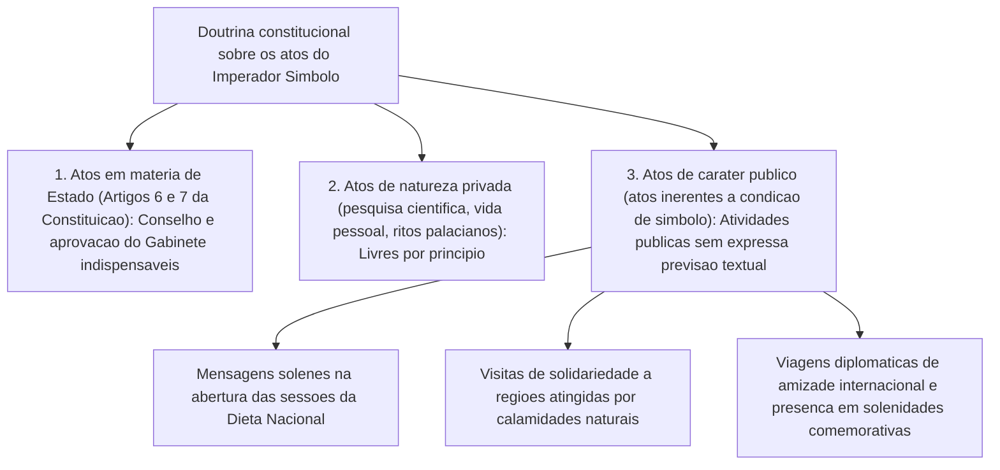

## 1. Introdução: A Dinastia Hereditária Mais Antiga do Mundo e a "Separação entre Poder e Autoridade"

### 1.1 O Discurso da "Linhagem Ininterrupta por Eras Eternas" (Bansei Ikkei) e a Realidade Histórica e Arqueológica

A história do Imperador do Japão (*Tenno* / Emperor of Japan) e da Casa Imperial ostenta uma continuidade singular sem paralelo com qualquer outra casa real ou dinastia remanescente no mundo. O Livro Guinness dos Recordes Mundiais a reconhece formalmente como "a mais antiga monarquia hereditária contínua do mundo" (*The oldest continuous hereditary monarchy*).

Embora o discurso do *Bansei Ikkei* (万世一系 — linhagem ininterrupta por eras eternas), propagado pelo *Kokugaku* (Estudos Nacionais) da modernidade e pelo Artigo 1 da Constituição do Grande Império do Japão (Constituição Meiji), esteja revestido de forte coloração ideológica e mitológica, à luz das evidências históricas e arqueológicas empíricas, **a continuidade de uma única linhagem dinástica no mesmo espaço arquipelágico por aproximadamente 1.500 anos — pelo menos desde o Grande Rei Yūryaku (Wakatakeru Okimi) no final do século V ou do Imperador Keitai no início do século VI — constitui um fato histórico incontestável no meio acadêmico**.

Ao contemplarmos a história das civilizações mundiais, na China imperial, as famílias dinásticas eram sistematicamente exterminadas através da "Revolução Dinástica / Mandato do Céu" (*Ekisei Kakumei* / Dynastic Cycle), na qual o mandato celestial mudava e o patronímico imperial era substituído. Na Europa, as dinastias sucederam-se ininterruptamente: normanda, plantageneta, tudor, stuart, hanoveriana, entre outras. Em contrapartida, por que apenas no Japão uma única linhagem régia conseguiu sobreviver até os dias de hoje sem jamais sofrer a ruptura de uma mudança de dinastia?



---

### 1.2 A "Separação entre Poder e Autoridade" sob a Perspectiva da Teoria das Civilizações Comparadas

Como apontaram historiadores do pensamento e antropólogos culturais como Masao Maruyama e Ruth Benedict, o traço mais distintivo da estrutura de governança da civilização japonesa reside no fato de que **o "poder político efetivo" (*Power*: força militar, autoridade tributária, governança cotidiana) e a "autoridade sagrada derradeira" (*Authority*: fonte primordial de legitimidade, sacralidade religiosa e simbólica) foram rigorosa e sistematicamente dissociados de maneira dual**.

Os monarcas absolutistas ocidentais (como Luís XIV da França) e os imperadores autocráticos chineses eram, a um só tempo, "homens de poder" que lideravam pessoalmente exércitos e emitiam ordens executivas, e "símbolos de autoridade" da lei e da ordem cósmica. Quando ambas as funções estão fundidas em uma única figura, no momento em que sobrevêm desastres políticos, derrotas militares ou convulsões socioeconômicas, a responsabilidade recai diretamente sobre a pessoa do monarca, que é derrubado do trono junto com toda a sua estirpe por insurreições populares ou golpes de Estado.

Em contrapartida, o Imperador do Japão manteve, de forma inabalável — desde o clã Fujiwara no período Heian (governo *Sekkan*), passando pelo governo enclausurado (*Insei*) inaugurado pelo Imperador Aposentado Shirakawa, pelos regimes guerreiros medievais e modernos (*Bakufu* de Kamakura, Muromachi e Edo), até os gabinetes de ministros da era moderna —, uma estrutura em que **"o poder de governar secularmente (o poder executivo fático) é invariavelmente delegado a conselheiros auxiliares (*hohitsu*) e à classe dos samurais"**. Mesmo o xogum do *Bakufu*, para legitimar o seu domínio sobre o país, necessitava ser formalmente investido pelo Imperador com o título de *Seii Taishōgun* (Grande General Apaziguador dos Bárbaros).

A responsabilidade pelos fracassos da governança recaía invariavelmente sobre o *Bakufu* ou o gabinete ministerial que exerceu o poder coercitivo, sendo estes aniquilados por sublevações ou transformações de regime. No entanto, como o Imperador, fonte primordial de legitimação, permanecia em uma dimensão transcendente, situada para além de qualquer responsabilidade política, jamais operou, mesmo nas eras de mais violenta conflagração civil, o incentivo estrutural para usurpar o trono imperial (ou seja, assassinar o monarca e proclamar uma nova dinastia).

---

## 2. A Formação do Estado Antigo, o Título de "Tenno" e o Nascimento dos Rituais Ritsuryō

### 2.1 A Sublimação de Grande Rei (Okimi) a "Tenno" (Imperador)

Durante o período Kofun, o soberano primordial da corte de Yamato, que reinava sobre o centro do arquipélago, era denominado *Okimi* (大王 — Grande Rei / *Ame no Shita Shiroshimesu Okimi* — "Grande Rei que Governa sob os Céus"). O inscriptionado na espada de ferro escavada no túmulo Inariyama Kofun, na província de Saitama, que registra o nome de *Wakatakeru Okimi* (Grande Rei Wakatakeru = Imperador Yūryaku), evidenciava claramente a sua natureza como líder primordial de uma confederação de clãs nobres aristocráticos (*Uji-Kabane*).

No final do século VI e início do século VII, o Príncipe Shōtoku (Príncipe Umayado) e Soga no Umako, entronizando a Imperatriz Suiko, instituíram o sistema de Doze Posições de Touca (distinção burocrática baseada no talento individual e não na nobreza hereditária) e promulgaram a Constituição de Dezessete Artigos ("A harmonia deve ser valorizada acima de tudo", "Reverenciai os Três Tesouros do Budismo", "Recebei os decretos imperiais com estrita obediência"). Na famosa missiva diplomática endereçada ao Imperador Yang de Sui — *"O Filho do Céu da terra onde o Sol nasce envia esta carta ao Filho do Céu da terra onde o Sol se põe; tendes passado bem?"* —, o Japão rompeu com o sistema de tributação e investidura da corte imperial chinesa (*tributary system*), declarando solenemente a sua independência como um soberano e "Filho do Céu" em pé de perfeita igualdade.

No **"Incidente de Isshi" (Reformas Taika, 645)**, o Príncipe Naka no Ōe (posteriormente Imperador Tenji) e Nakatomi no Kamatari (patriarca ancestral do clã Fujiwara) assassinaram Soga no Iruka em pleno palácio imperial, derrubando a tirania do clã Soga. Eles proclamaram o ideal do *Kochikomin* (公地公民制 — terras e povo sob a posse pública e soberana do Estado e do Imperador), negando a posse privada de terras e servos pelos nobres locais.



---

### 2.2 A Rebelião Jinshin (672) e a Autoridade Absoluta do Imperador Tenmu

O divisor de águas mais monumental da história antiga do Japão foi a **"Rebelião Jinshin" (672)**, uma violenta guerra de sucessão dinástica que eclodiu após a morte do Imperador Tenji. O Príncipe Ōama, que vivia em reclusão nas montanhas de Yoshino, mobilizou as forças guerreiras orientais das províncias de Mino e Owari, destruiu de forma fulminante a corte de Ōmi liderada pelo Príncipe Ōtomo e ascendeu ao trono no Palácio Asuka Kiyomihara como o **Imperador Tenmu**.

Sob o reinado do Imperador Tenmu e de sua viúva e sucessora, a Imperatriz Jitō, consolidou-se a matriz fundacional do Estado imperial sob o regime *Ritsuryō*:
1. **Adoção Oficial do Título "Tenno" (天皇)**:
   - Derivado do conceito taoísta supremo do "Grande Imperador Celestial" (*Tennō Taitei*, a deificação da Estrela Polar), a dignidade sagrada de *Tenno* passou a ser gravada de forma sistemática em tabuletas de madeira (*mokkan*) e inscrições lapidares.
2. **Instituição do Nome Nacional "Nihon" (日本)**:
   - Substituindo a antiga designação depreciativa ou externa de "Wakoku" (País de Wa), consagrou-se o orgulhoso nome *Nihon* ("A Origem do Sol" / Terra onde nasce o Sol).
3. **Início da Compilação das Obras Históricas Oficiais e Mitologias Nacionais**:
   - Por decreto imperial de Tenmu, organizaram-se as antigas tradições orais e genealogias dos clãs para remontar a legitimidade da linhagem imperial diretamente à deusa solar Amaterasu Ōmikami, culminando nas compilações do *Kojiki* (712) e do *Nihon Shoki* (720).

---

### 2.3 A Estrutura Profunda da Mitologia Kiki e os Três Regalias Sagrados

O cosmos mitológico narrado no *Kojiki* e no *Nihon Shoki*, que parte da deusa ancestral da linhagem imperial, Amaterasu Ōmikami, até o primeiro monarca humano, o Imperador Jimmu, oferece o substrato religioso e cosmológico da autoridade imperial.

- **A Descida do Neto Celestial (*Tenson Kōrin*) e os Três Mandatos Sagrados**:
  - No instante em que Amaterasu enviou seu neto Ninigi no Mikoto para descender dos céus à Terra (no cume do Monte Takachiho), proclamou o mais fundacional decreto divino: o **"Mandato Sagrado da Coeternidade Celestial e Terrestre" (*Tenjō Mukyū no Shinchoku*)**:
  > *"A terra dos arrozais viçosos e outonos abundantes é a terra sobre a qual meus descendentes reinarão. Vai, ó meu Neto Imperial, e governa-a. Segue o teu caminho! A prosperidade do Teu Trono Imperial florescerá e será coeterna com o Céu e a Terra."*
  - Este constitui o pacto sagrado que estabelece que o direito de reinar sobre a Terra foi concedido perpetuamente ao Neto Imperial e à sua prole pela vontade dos deuses celestiais.
  - A este juntaram-se o Mandato do Culto ao Espelho Sagrado (*Hōkyō Hōsai no Shinchoku*, que determinava que o espelho divino fosse venerado exatamente como a alma de Amaterasu) e o Mandato das Espigas Celestiais de Arroz (*Imiwa Inaho no Shinchoku*, que ordenava o cultivo na Terra dos grãos sagrados dos céus).
- **As Três Regalias Sagradas (*Sanshu no Jingi*)**:
  1. **Yata no Kagami (八咫鏡 — Espelho de Yata)**: Encarna a sabedoria transcendental e a sacralidade solar (objeto sagrado corporificado no Santuário Interior de Ise, com réplica ritual guardada no Palácio Imperial).
  2. **Yasakani no Magatama (八尺瓊勾玉 — Joia Curva de Yasakani)**: Simboliza a benevolência e a energia espiritual sagrada (permanece custodiada no Palácio Imperial, no aposento *Kenji-no-ma*).
  3. **Kusanagi no Tsurugi (草薙剣 — Espada de Kusanagi / Ame no Murakumo no Tsurugi)**: Representa a coragem e a autoridade marcial justa (objeto sagrado do Santuário de Atsuta, com réplica ritual no Palácio Imperial).
  - Em todas as cerimônias de entronização imperial ao longo das eras, o ritual de transmissão dessas relíquias sagradas (*Kenji-tō Shōkei no Gi*) permaneceu como o penhor indispensável da legitimidade do Trono.

---

### 2.4 O Sistema Dual do Ritsuryō: Jingikan, Dajōkan e o Daijōsai

O sistema governamental burocrático antigo, consolidado pelo **Código Taihō (701)**, embora tomasse por modelo a estrutura do império chinês da dinastia Tang, introduziu uma alteração estrutural extraordinária e exclusivamente japonesa.

Enquanto na China as instituições de rituais (*Taichangsi*) eram subordinadas aos ministérios executivos da burocracia (*Shangshusheng*), o modelo *Ritsuryō* japonês estabeleceu no topo do governo duas corporações de nível equivalente — e com precedência cerimonial ao sagrado: o **Dajōkan (太政官 — Conselho de Estado)**, responsável pela administração política, e o **Jingikan (神祇官 — Conselho das Divindades)**, encarregado dos rituais dedicados aos deuses celestiais e terrestres (*sistema de dois conselhos e oito ministérios*).

A missão cotidiana mais primordial do Imperador não residia na administração política ordinária, mas sim nos **rituais sagrados (*Shinji* — preces aos deuses e budas invisíveis)**:
- **Niinamesai (新嘗祭)**: Realizado anualmente em novembro, ritual no qual o Imperador oferece os primeiros grãos colhidos naquele ano às divindades e, em seguida, come deles em comunhão íntima com os deuses (*Shinjin Kyōshoku* — banquete sagrado entre homens e divindades), orando pela paz do Estado e pela fartura dos cinco cereais.
- **Daijōsai (大嘗祭)**: O rito supremo e secreto celebrado uma única vez na vida de cada Imperador logo após sua entronização. Pavilhões rústicos de arquitetura arcaica primordial, denominados *Yuki-den* e *Suki-den*, são erigidos do zero; ali, durante a vigília da noite inteira, o monarca oferece os novos grãos à deusa ancestral e deles se alimenta em solidão litúrgica, incorporando em seu próprio corpo a força anímica primordial (*Tenno-rei* — o espírito sagrado imperial) e renascendo como autêntico soberano sagrado.

Por maiores que fossem as vicissitudes e transferências do poder político profano, esse papel de "sumo sacerdote que ora desinteressada e continuamente pelas divindades em favor do povo e da nação" permaneceu como o núcleo indestrutível do sistema imperial.

---

## 3. A Estrutura Dual de Autoridade e Poder nos Períodos Medieval e Pré-Moderno

### 3.1 A Regência Sekkan e o Governo Enclausurado (Insei): A Dinâmica Interna da Corte

Durante o período Heian, a arquitetura política que cercava o Imperador atingiu uma refinada sofisticação e metamorfose institucional.

- **A Regência Sekkan do Clã Fujiwara (séculos X a XI)**:
  - O ramo Hokke dos Fujiwara (em seu apogeu com Michinaga e Yorimichi) introduzia sistematicamente suas filhas no palácio como imperatrizes consortes (*Chūgū*). Quando os príncipes imperiais nelas gerados ascendiam ao trono ainda crianças, os nobres Fujiwara assumiam as funções de avô materno (*Gaiseki*), exercendo os cargos supremos de *Sesshō* (Regente na menoridade) e, na maioridade, de *Kampaku* (Chanceler e Porta-voz Imperial).
  - Sem jamais tentar usurpar o Trono imperial, controlavam com mão de ferro as nomeações burocráticas e a condução do Estado amparados exclusivamente na autoridade do parentesco materno com o Imperador.
- **A Emergência do Governo Enclausurado (*Insei*, a partir do final do século XI)**:
  - Em 1086, o Imperador Shirakawa abdicou prematuramente em favor do jovem Imperador Horikawa, tornando-se *Jōkō* (Imperador Retirado / Aposentado) e estabelecendo seu próprio quartel-general administrativo fora do palácio tradicional (*In-no-Chō*).
  - Na qualidade de *Chiten no Kimi* (治天の君 — Patriarca Supremo da Casa Imperial), Shirakawa expeliu os regentes Fujiwara e reassumiu o poder político efetivo. Ao tomar ordens religiosas budistas e tornar-se *Hōō* (Imperador Enclausurado), libertou-se das amarras rituais confucianas e das normas do *Ritsuryō* que aprisionavam o imperador reinante, exercendo um poder autocrático formidável.

---

### 3.2 O Nascimento do Regime Guerreiro e a Guerra Jōkyū (1221)

No final do século XII, após a derrocada do clã Taira, Minamoto no Yoritomo fundou o **Xogunato de Kamakura (*Kamakura Bakufu*)** nas províncias do leste.
Yoritomo obteve da corte imperial a nomeação para o cargo de *Seii Taishōgun* e o decreto imperial de Bunji (1185), que outorgava ao xogunato o direito de estabelecer administradores militares (*Shugo*) e intendentes fiscais de terras (*Jitō*) em todo o território nacional. Consolidava-se assim a ordem de governo dual entre nobres da corte (*Kuge*) no oeste (Quioto) e guerreiros samurais (*Buke*) no leste (Kamakura).

A tentativa mais audaciosa de reverter essa preponderância dos guerreiros foi empreendida pelo intrépido e brilhante **Imperador Aposentado Go-Toba**.
Em 1221, Go-Toba emitiu um édito retirado (*Inzen*) ordenando a todos os guerreiros do país a punição e derrubada de Hōjō Yoshitoki, o regente (*Shikken*) de Kamakura, deflagrando a **Guerra Jōkyū**.



O desfecho da Guerra Jōkyū foi uma vitória avassaladora dos samurais. Ao desobedecerem abertamente o édito imperial e condenarem o próprio patriarca da corte (*Chiten no Kimi*) ao exílio perpétuo, revelou-se cristalinamente a dura realidade material: a corte, desprovida de poder militar próprio, não podia rivalizar com o poder bélico dos samurais. O *Bakufu* passou a intervir diretamente na sucessão imperial, arbitrando a alternância entre a linhagem Daikakuji (sulista) e a linhagem Jimyōin (nortista) no sistema conhecido como *Ryōtō Tetsuritsu*.

---

### 3.3 A Restauração Kenmu e o Conflito das Cortes do Norte e do Sul (Nanbokuchō)

Em 1333, o Imperador Go-Daigo mobilizou clãs de guerreiros descontentes como Ashikaga Takauji, Nitta Yoshisada e Kusunoki Masashige para aniquilar o Xogunato de Kamakura, inaugurando o governo pessoal do Imperador conhecido como a **"Restauração Kenmu"**.

Todavia, ao ignorar os anseios de recompensas de terras dos guerreiros e impor um favoritismo anacrônico aos aristocratas da corte acompanhado de um absolutismo restauracionista, o novo regime ruiu em apenas dois anos. Rompendo com Go-Daigo, Ashikaga Takauji entronizou o Imperador Kōmyō (da linhagem Jimyōin) em Quioto, fundando o Xogunato Muromachi. Go-Daigo, por sua vez, fugiu para as montanhas de Yoshino, reivindicando a legitimidade intransferível do Trono.

Inaugurou-se assim o turbulento **Período das Cortes do Norte e do Sul (Nanbokuchō, 1336–1392)**, no qual a **Corte do Norte** (Quioto) e a **Corte do Sul** (Yoshino) lutaram pela legitimidade ao longo de quase sessenta anos. Em 1392, sob a mediação do terceiro xogum Ashikaga Yoshimitsu, firmou-se o Tratado de Meitoku (a reunificação das Cortes), com a entrega das Três Regalias Sagradas do Imperador Go-Kameyama (Corte do Sul) para o Imperador Go-Komatsu (Corte do Norte). A linhagem imperial moderna descende genealogicamente do Imperador Go-Komatsu da Corte do Norte, conquanto a legitimidade histórica oficial tenha sido reconhecida na era Meiji em favor da Corte do Sul, guardiã original das Regalias Sagradas durante o cisma.

No ápice do poder de Muromachi, Ashikaga Yoshimitsu foi investido pelo imperador Yongle da dinastia Ming com o título de "Rei do Japão" (*Nihon Kokuō*) e ensaiou planos para elevar seu próprio filho ao Trono imperial — sendo considerado a figura histórica que mais perto chegou de uma genuína usurpação dinástica —, mas com a sua morte repentina tais pretensões dissolveram-se por completo.

---

### 3.4 As Ordenações do Xogunato Tokugawa para a Corte e a Nobreza (Kinchū narabini Kuge Shohatto) e o Primado dos "Estudos Eruditos"

Durante o caos sangrento do período Sengoku (Guerra Civil), as finanças da corte imperial atingiram a penúria extrema; registros atestam que soberanos como o Imperador Go-Nara chegaram a vender caligrafias de sua própria autoria com poemas *waka* e cópias do Sutra do Coração para custear as despesas do palácio. Não obstante, os unificadores nacionais — Oda Nobunaga, Toyotomi Hideyoshi e Tokugawa Ieyasu — jamais cogitaram extinguir o imperador; ao contrário, realizaram volumosas doações financeiras e buscaram a sua própria investidura em cargos como *Kampaku*, *Dajō Daijin* (Primeiro-Ministro imperial) e *Seii Taishōgun* a fim de sacralizar e legitimar seu poder político.

Após consolidar a hegemonia absoluta sobre o país, Tokugawa Ieyasu promulgou em 1615 as **"Ordenações para o Palácio Imperial e a Nobreza da Corte" (*Kinchū narabini Kuge Shohatto*, 17 artigos)**, submetendo a corte a uma rigorosa blindagem e vigilância jurídica. A abertura do Artigo 1 estipulava com frieza categórica:

> **"Dentre as várias artes a serem cultivadas pelo Filho do Céu, a primeira e primordial deve ser o Estudo Erudito (*Gakumon*)."**

A real e desapiedada intenção desse preceito era cristalina: a vocação do monarca devia circunscrever-se à erudição dos clássicos, aos costumes ancestrais da corte (*Yūsoku Kojitsu*) e à arte da poesia lírica, sendo-lhe terminantemente vedada qualquer ingerência no governo civil ou nos assuntos militares.
Como ficou demonstrado no **Incidente dos Mantos Roxos** (1629) — no qual o xogunato revogou sumariamente decretos imperiais que outorgavam vestimentas púrpuras honoríficas a monges eminentes sem o aval prévio de Edo, levando o indignado Imperador Go-Mizunoo a abdicar subitamente em protesto —, o imperador durante o período Edo foi mantido no recolhimento do Palácio de Quioto, privado de qualquer fração de poder fático, inteiramente neutralizado como uma "entidade puramente simbólica dedicada ao ritual e à erudição".

---

## 4. A Restauração Meiji e a Criação do Estado Moderno da "Divindade Encarnada" (Arahitogami)

### 4.1 Do Movimento Sonno Joi à Restauração da Monarquia

A partir de meados do período Edo, a compilação da *Dai Nihon Shi* (Grande História do Japão) pelo domínio de Mito e a maturação do *Kokugaku* (com pensadores como Motoori Norinaga) disseminaram entre os samurais o pensamento lealista de que "o xogum do *Bakufu* é apenas um delegado a quem o Imperador outorgou temporariamente a administração secular (*Taisei Inin-ron*)".

Com a chegada das "Naus Negras" do Comodoro Matthew Perry em 1853 e a incapacidade do xogunato Tokugawa de repelir a ameaça colonialista ocidental, explodiu a vaga nacionalista e revolucionária do **Sonno Joi (尊皇攘夷 — "Reverenciar o Imperador, Expelir os Bárbaros")**. O Imperador Kōmei emitiu ordens sagradas de expulsão, e domínios rebeldes como Chōshū e Satsuma aglutinaram-se em torno da corte como centro de gravidade política indiscutível.

Em outubro de 1867, o 15º xogum Tokugawa Yoshinobu apresentou formalmente a devolução do governo ao Imperador (**Taisei Hōkan**). Em 9 de dezembro do mesmo ano, liderados por Tomomi Iwakura e Takamori Saigō, os insurgentes promulgaram o **"Decreto de Restauração da Monarquia" (*Ōsei Fukko no Daigōrei*)**:
- Extinção total do Xogunato, da regência *Sesshō* e do cargo de *Kampaku*.
- Proclamação do retorno à matriz primordial fundada pelo Imperador Jimmu e instauração de um novo governo sob o comando pessoal do soberano.
- O jovem Imperador Meiji (de apenas 16 anos) ascendeu ao centro do poder; Edo foi rebatizada como "Tóquio" (Capital do Leste), e a residência imperial foi transferida de Quioto para o Castelo de Tóquio (antigo Castelo de Edo).

---

### 4.2 O Dualismo Constitucional da Constituição do Grande Império do Japão (Constituição Meiji, 1889)

Hirobumi Itō e os estadistas oligarcas de Meiji elaboraram a **Constituição do Grande Império do Japão**, inspirando-se no modelo constitucional da Prússia (Alemanha), adaptando-o com requintes dogmáticos às peculiaridades institucionais japonesas.



O sistema da Constituição Meiji continha uma complexa e engenhosa "duplicidade de natureza":
1. **Dimensão Tradicional e Religiosa**: O Imperador é descendente direto dos deuses primordiais, a matriz moral suprema do povo e uma divindade viva encarnada (*Arahitogami*), sagrado e inviolável.
2. **Dimensão Moderna e Constitucional**: O Imperador é um monarca constitucional que exerce os direitos de soberania "em conformidade com as disposições da presente Constituição" (Artigo 4); ele não podia ditar ordens autocráticas como um tirano pessoal: o exercício do poder executivo exigia a "assistência ministerial" (*Hohitsu*) dos Ministros de Estado (Artigo 55), e o poder legislativo dependia do consentimento do Parlamento Imperial (*Teikoku Gikai*).

No período Taishō, o eminente professor da Faculdade de Direito da Universidade Imperial de Tóquio, Tatsukichi Minobe, desenvolveu a **"Teoria do Órgão Imperial" (*Tennō Kikansetsu*)**, segundo a qual o Estado é uma pessoa jurídica titular da soberania, e o Imperador é o seu "órgão supremo", servindo de alicerce teórico ao parlamentarismo e aos gabinetes partidários da fase da Democracia Taishō.

Contudo, a Constituição Meiji trazia incrustada uma falha estrutural fatal: o **Artigo 11 e a "Independência do Comando Militar Supremo" (*Tōsuiken no Dokuritsu*)**, que prescrevia que o comando das forças armadas não se submetia à assistência do Gabinete ministerial, subordinando-se diretamente ao monarca por meio das chefias do Estado-Maior do Exército e do Comando Geral da Marinha. Quando os militares na era Shōwa usaram essa prerrogativa para escapar por completo ao controle civil do Gabinete e do Parlamento, as defesas do constitucionalismo ruíram inexoravelmente.

---

## 5. A Turbulência da Era Shōwa, a Derrota na Guerra e a Transformação Radical para o "Sistema do Imperador Símbolo"

### 5.1 O Colapso no Início da Era Shōwa e a "Sagrada Decisão" (Seidan) de 1945

Na década de 1930, na esteira do conflito da prerrogativa de comando militar, do Incidente de 15 de Maio e do Incidente de 26 de Fevereiro de 1936, a política partidária foi estrangulada, arrastando o Japão para a ditadura militar, o atoleiro da Guerra Sino-Japonesa e, em 1941, a conflagração da Guerra do Pacífico.

O Xintoísmo de Estado transformou-se em dogma fanático, inculcando-se na população a ideia de que "morrer pelo Imperador" representava a mais sublime virtude moral. Todavia, o próprio Imperador Shōwa (Hirohito), enquanto monarca constitucional educado nas tradições britânicas, viveu em constante agonia interior, dividido entre a sua obrigação formal de sancionar as decisões unânimes do Gabinete e do Alto Comando e as suas preces íntimas pela preservação da paz.

Em agosto de 1945, diante da devastação atômica em Hiroshima e Nagasaki e da declaração de guerra pela União Soviética, o Conselho Supremo de Direção da Guerra rachou ao meio, paralisado entre aceitar os termos de rendição para preservar a Casa Imperial (*Kokutai Goji*) ou lançar a população em uma luta suicida até o último habitante no solo pátrio (*Hondo Kessen / Ichioku Gyokusai*).
Nas conferências imperiais (*Gozen Kaigi*) realizadas em 10 e 14 de agosto no abrigo subterrâneo do palácio, instado a manifestar sua vontade pelo Primeiro-Ministro Kantarō Suzuki, o Imperador Shōwa, banhado em lágrimas, proferiu a histórica **"Sagrada Decisão" (*Seidan*)**:

> **"A minha missão primordial é salvar o povo. Pouco importa o que venha a ser do meu próprio destino; não posso suportar ver mais pessoas do meu povo perecerem nas chamas da guerra e a civilização da humanidade ser reduzida a cinzas... Resolvi pôr fim à guerra, suportando o insuportável e tolerando o intolerável."**

Ao meio-dia de 15 de agosto, através da histórica transmissão radiofônica da "Voz da Joia" (*Gyokuon Hōsō* — o Rescrito de Término da Guerra), o conflito encerrou-se. Especialistas concordam categoricamente que, sem essa intervenção pessoal direta do imperador, a batalha no arquipélago teria custado a vida de milhões de civis e soldados adicionais.

---

### 5.2 O Encontro com MacArthur e a Isenção no Tribunal de Tóquio

Com a capitulação incondicional, as forças de ocupação aliadas comandadas pelo General Douglas MacArthur (GHQ) desembarcaram no Japão. A opinião pública dominante nos Estados Unidos, Grã-Bretanha e União Soviética clamava ruidosamente pela execução do Imperador Shōwa como o "criminoso de guerra número um" e pela abolição definitiva do sistema imperial.

Em 27 de setembro de 1945, o Imperador Shōwa compareceu pessoalmente e sem escolta à Embaixada Americana para se encontrar com MacArthur. Conforme os relatos comovidos do próprio general norte-americano em suas memórias, longe de suplicar pela preservação da sua própria vida, o Imperador declarou:

> **"Venho a vós para oferecer-me ao julgamento das potências que representais, como o único detentor da responsabilidade total por cada decisão política e militar e por cada ação empreendida pelo meu povo na condução da guerra. Não me importo com o que aconteça à minha própria vida; mas rogo-vos encarecidamente que providencieis alimento para o meu povo faminto."**

Profundamente impactado pela nobreza moral e desprendimento do imperador, MacArthur firmou ali a política de ocupação de "preservar a instituição imperial e afastar o soberano do banco dos réus do Tribunal de Tóquio". O comando aliado compreendeu perfeitamente que executar o Imperador atearia fogo a uma insurgência guerrilheira nacional de milhões de japoneses, inviabilizando qualquer transição pacífica.

Em 1º de janeiro de 1946, o Imperador Shōwa promulgou o **Rescrito sobre a Construção de um Novo Japão (denominado popularmente como a "Declaração de Humanidade" / *Ningen Sengen*)**, proclamando que os laços espirituais entre o monarca e o povo japonês repousam na confiança e afeição mútuas, e não em mitologias ou na falsa concepção de que o imperador seja uma divindade encarnada (*Arahitogami*).

---

### 5.3 O Artigo 1 da Constituição do Japão: A Consolidação do "Imperador Símbolo"

Promulgada em 3 de novembro de 1946 e entrada em vigor em 3 de maio de 1947, a **Constituição do Japão** redefiniu a raiz fundamental do estatuto jurídico do monarca em seu emblemático Artigo 1:

> **Artigo 1: "O Imperador é o símbolo do Estado e da unidade do povo, derivando a sua posição da vontade do povo soberano em quem reside a soberania."**



- **Supressão Total dos Poderes de Governo**: O Imperador deixou de ser o soberano governante (*Genshu*) e tornou-se o "símbolo" (*Symbol*) que reflete a existência perene do Estado e a unidade orgânica da comunidade nacional.
- **Proibição de Participação na Governança Política (Artigo 4)**: O monarca exerce estritamente os "atos em matéria de Estado" (*Kokuji-kōi*) formais e cerimoniais tipificados no texto constitucional (convocação do Parlamento, nomeação protocolar do Primeiro-Ministro designado pela Dieta, promulgação de leis e tratados, concessão de honrarias), sendo desprovido de qualquer competência decisória de governo.
- **Conselho e Aprovação do Gabinete (Artigo 3)**: Todos os atos do Imperador em matéria de Estado dependem imperativamente do "conselho e aprovação" do Gabinete de ministros, cabendo exclusivamente a este último toda a responsabilidade política e jurídica.

Conquanto o "Sistema do Imperador Símbolo" seja frequentemente apresentado como um modelo forâneo transplantado pelas forças aliadas vitoriosas, sob a lente da longa história japonesa examinada anteriormente, ele representou, na realidade, **o regresso à sua forma mais pura da estrutura tradicional milenar iniciada na Idade Média — a saber: o Imperador despojado de poder coercitivo fático, consagrado unicamente à autoridade sagrada e à oração desinteressada pela coletividade**.

---

## 2.5 A Estrutura Litúrgica dos Rituais Palacianos e a Dinâmica Espiritual do "Shihōhai"

Para compreender a essência do Imperador, é imperativo penetrar no âmago dos **"Rituais da Corte Imperial" (*Kyūchū Saishi*)**, uma dimensão sagrada mantida ininterruptamente no seio da Família Imperial como esfera reservada e inteiramente distinta dos "atos em matéria de Estado" previstos na Constituição do Japão.

Nas profundezas da luxuriante e secular vegetação do bosque de Fukiage, no interior do Palácio Imperial de Tóquio, erguem-se os solenes **"Três Santuários do Palácio" (*Kyūchū Sanden*)**:
1. **Kashikodokoro (賢所)**: Santuário sagrado onde está entronizada a réplica ritual do Espelho de Yata (*Yata no Kagami*), corporificação divina da deusa solar Amaterasu Ōmikami.
2. **Kōreiden (皇霊殿)**: Santuário ancestral que acolhe e reverencia os espíritos de todos os imperadores e membros da linhagem imperial desde o Imperador Jimmu.
3. **Shinden (神殿)**: Santuário cósmico dedicado ao culto conjunto de todas as divindades celestiais e terrestres (*Amatsukami* e *Kunitsukami* / os oito milhões de kami do xintoísmo).

Ao longo de todo o ano, o Imperador celebra pessoalmente dezenas de complexas e rigorosas cerimônias litúrgicas. Dentre elas, a que evoca o mais profundo assombro espiritual é o **"Shihōhai" (四方拝 — Reverência às Quatro Direções)**, oficiado no romper da aurora do dia de Ano Novo (às 5h30 da manhã), sob o frio congelante do ápice do inverno.



Após purificar seu corpo banhando-se em água gelada e envergando os trajes arcaicos de seda imperial (*Kōrozengyōhō*), o Imperador toma assento sobre uma esteira de palha estendida diretamente sobre o cascalho branco no pátio a céu aberto do pavilhão Shinkaden. Ali, inclina-se em profunda reverência voltado para o Grande Santuário de Ise, para os deuses e espíritos dos quatro quadrantes celestes e para os mausoléus de seus ancestrais. Em seguida, recita a prece mística registrada nos manuais litúrgicos do período Heian:

> **"Se pragas e calamidades, aflições, pestes e flagelos de fogo e inundações houverem de desabar sobre o meu povo, que passem primeiro pelo meu próprio corpo antes de atingi-los."**

Oferecer-se perante as divindades como um "supremo bode expiatório" que atrai sobre si todos os males e infortúnios da nação e de sua gente. Não se trata de um poder secular exercido para dominar ou subjugar outrem, mas sim de uma atitude sacrificial absoluta que anula a própria individualidade para interceder pela felicidade alheia: é precisamente esse espírito sacerdotal de oração e autoabnegação que constitui o campo gravitacional inconsciente pelo qual a autoridade do Imperador permaneceu gravada na psique profunda do povo japonês através dos milênios.

---

## 3.5 A Realidade Histórica das Imperatrizes Reinantes e a Dialética do Papel de "Transição"

Nos debates hodiernos sobre a sucessão ao Trono Imperial, evoca-se com frequência o precedente histórico indiscutível das **"oito imperatrizes reinantes em dez reinados" (8方10代の女性天皇)** que governaram o Japão no passado.

| Reinado/Ordem | Nome da Imperatriz | Período de Reinado | Contexto da Sucessão e Realizações Históricas |
| :---: | :--- | :---: | :--- |
| **33ª** | **Imperatriz Suiko** | 592–628 | Primeira mulher a ascender ao Trono, entronizada para pacificar a grave crise institucional após o assassinato do Imperador Sushun. Em aliança virtuosa com o Príncipe Shōtoku e Soga no Umako, instituiu o sistema de Doze Posições de Touca e a Constituição de Dezessete Artigos. |
| **35ª / 37ª** | **Imperatriz Kōgyoku / Imperatriz Saimei** | 642–645 / 655–661 | Duplo reinado (*Chōso*). O seu primeiro governo foi o palco do Incidente de Isshi; no segundo reinado, liderou pessoalmente a expedição militar imperial a Kyushu para socorrer o reino aliado de Baekje na Batalha de Hakusukinoe, vindo a falecer no acampamento de guerra. |
| **41ª** | **Imperatriz Jitō** | 690–697 | Esposa e consorte do Imperador Tenmu. Honrando a visão do falecido esposo, construiu a monumental capital de Fujiwara-kyō, promulgou o Código de Asuka Kiyomihara e consolidou a transmissão segura da coroa para o seu neto, o Imperador Monmu. |
| **43ª** | **Imperatriz Genmei** | 707–715 | Transferiu a capital imperial para Heijō-kyō (Nara, 710), supervisionou a conclusão solene do *Kojiki* e decretou a compilação das geografias e lendas regionais (*Fudoki*). |
| **44ª** | **Imperatriz Genshō** | 715–724 | Filha da Imperatriz Genmei (o único caso de sucessão direta de mãe para filha na história imperial). Supervisionou a conclusão do *Nihon Shoki* e promulgou a Lei de Posse de Terras por Três Gerações (*Sansei Isshin no Hō*). |
| **46ª / 48ª** | **Imperatriz Kōken / Imperatriz Shōtoku** | 749–758 / 764–770 | Filha do Imperador Shōmu. Reinou duas vezes. Esmagou militarmente a rebelião de Fujiwara no Nakamaro e conferiu imenso poder de influência ao monge budista Dōkyō. Barrou categoricamente a usurpação do Trono por Dōkyō graças ao oráculo sagrado obtido no Santuário Usa Hachimangū. |
| **109ª** | **Imperatriz Meishō** | 1629–1643 | Início do período Edo. Ascendeu ao Trono após a renúncia abrupta do Imperador Go-Mizunoo em protesto contra as arbitrariedades do Xogunato Tokugawa no Incidente dos Mantos Roxos (era neta materna do segundo xogum, Hidetada Tokugawa). |
| **117ª** | **Imperatriz Go-Sakuramachi** | 1762–1770 | Meados do período Edo. Assumiu as rédeas da corte após o falecimento súbito do Imperador Momozono, assegurando a estabilidade institucional até que o jovem Imperador Go-Momozono atingisse a idade madura. Foi a última imperatriz reinante da era pré-moderna. |

O exame historiográfico rigoroso evidencia um dado basilar incontestável: **todas as imperatrizes reinantes do passado eram invariavelmente "mulheres da linhagem patrilinear" (*Dankei Joshi*), isto é, princesas cujo pai biológico era um Imperador**. Não existe nenhum caso histórico em que uma imperatriz reinante tenha desposado um plebeu ou membro de outra linhagem e transmitido a coroa imperial a uma descendência matrilinear.

Ademais, a imensa maioria dessas soberanas foi alçada ao Trono em situações de grave crise ou vácuo político — como a menoridade dos herdeiros masculinos legítimos ou a morte repentina do soberano reinante —, funcionando como patriarcas e guardiãs veneráveis da Casa Imperial para contornar cismas sucessórios e entregar o cetro, em momento oportuno, ao varão da geração seguinte na linhagem masculina (a função institucional de transição ou "substituta temporária" — *Nakatsugi*).

Não obstante, é imperioso sublinhar que governantes magistrais como Suiko e Jitō estiveram longe de ser meras regentes decorativas; demonstraram uma extraordinária capacidade de liderança política e estratégica, moldando as fundações arquitetônicas do Estado antigo. No Japão primitivo, a tradição do sistema dual "Hime-Hiko" — no qual a liderança sacerdotal e mediúnica feminina de invocação das divindades (*Miko*) operava em perfeita complementaridade com a governança secular e militar exercida pelos chefes masculinos — facilitou e legitimou amplamente o prestígio e a aceitação coletiva das mulheres no Trono Imperial.

---

## 4.6 A Criação do Xintoísmo de Estado e o Malabarismo Filosófico da "Doutrina do Santuário como Não-Religião"

O desafio mais complexo e angustiante enfrentado pelos artífices da Restauração Meiji residia na formulação de um princípio ideológico moderno de integração nacional capaz de equiparar o país às potências imperiais do Ocidente (*Nation-State*).

### ① A Fúria do Haibutsu Kishaku e a Separação Forçada entre Xintoísmo e Budismo
Por mais de doze séculos, o Japão floresceu sob o regime harmônico do sincretismo xintoísta-budista (*Shinbutsu Shūgō*), alicerçado na doutrina do *Honji Suijaku* (segundo a qual os budas universais manifestam-se no Japão sob a roupagem acessível das divindades xintoístas locais, erigindo-se templos budistas no interior dos santuários). Contudo, em março de 1868, o novel governo Meiji emitiu as **"Ordens de Separação de Deuses e Budas" (*Shinbutsu Bunri-rei*)**, rompendo violentamente essa fusão histórica.

Essa determinação desencadeou em todo o território nacional uma tempestade de iconoclastia radical conhecida como **"Haibutsu Kishaku" (廃仏毀釈 — Erradicação do Budismo)**. Estátuas budistas preciosas foram decapitadas ou calcinadas, escrituras sagradas foram queimadas e mosteiros milenares foram sumariamente demolidos. Em feudos como Satsuma, Naegi, Oki e Toyama, o budismo foi temporariamente banido por completo; até mesmo o sublime pagode de cinco andares do templo Kōfukuji, em Nara, chegou a ser colocado à venda pela irrisória quantia de apenas 25 ienes. O patrimônio artístico tradicional japonês e a base econômica dos templos sofreram devastações irreparáveis.

Inicialmente, os teocratas imperiais tentaram converter o Xintoísmo na religião oficial e compulsória de Estado por meio da "Campanha de Proclamação da Grande Doutrina" (*Taikyō Senpu Undō*). Todavia, esbarraram na resistência visceral do clero budista e na severa reprovação diplomática dos governos ocidentais, que acusavam o Japão de esmagar a liberdade de consciência religiosa.

### ② A Ficção Jurídico-Filosófica da "Doutrina do Santuário como Não-Religião" (Jinja Hi-shūkyō-ron)
Para desatar esse nó górdio, os juristas e pensadores constitucionais de Meiji (com destaque para Kowashi Inoue) engendraram um dos mais sofisticados malabarismos doutrinários do direito público moderno: a **"Doutrina do Santuário como Não-Religião" (*Jinja Hi-shūkyō-ron*)**.
- Por um lado, o Artigo 28 da Constituição Meiji consagrou expressamente a "liberdade de crença religiosa", reconhecendo o Budismo, o Cristianismo e as seitas xintoístas como religiões de foro privado e escolha individual.
- Por outro lado, definiu-se que "os rituais oficiados nos santuários xintoístas (como o Grande Santuário de Ise e o Santuário Yasukuni) não constituem religião, mas sim **o culto cívico e público da moral nacional e da reverência coletiva aos antepassados da pátria**".
- Desta forma, nenhum súdito do Império — fosse ele católico, protestante ou budista — tinha o direito de recusar a reverência aos santuários ou o culto ao Imperador, porquanto tais deveres pertenciam à esfera supraconfessional da cidadania imperial. Essa engenhosa blindagem concebeu o espaço absoluto do **"Xintoísmo de Estado" (*State Shinto*)**, que, anos mais tarde, na conflagração ultranacionalista da era Shōwa, desembocaria no culto totalitário e fanático à "divindade encarnada" (*Arahitogami*).

---

## 5.5 A Jurisprudência Constitucional e os Limites do Sistema do Imperador Símbolo

No regime inaugurado pela Constituição do Japão de 1947, a figura do Imperador Símbolo teve seus contornos dogmáticos lapidados ao longo de sucessivos embates doutrinários e precedentes judiciais de alta voltagem.



### ① A Consagração Doutrinária dos "Atos de Caráter Público (Atos Inerentes à Condição de Símbolo)"
O Artigo 4, §1º da Carta Magna estabelece textualmente: *"O Imperador exercerá estritamente os atos em matéria de Estado previstos nesta Constituição e não terá poderes de governo"*. Se interpretada sob estrito rigor gramatical, qualquer outra conduta pública fora do rol taxativo dos Artigos 6 e 7 — tais como prestar conforto às vítimas de terremotos, discursar na abertura da Dieta ou recepcionar dignitários estrangeiros — seria formalmente inconstitucional.

Tanto a jurisprudência dominante quanto a doutrina oficial do governo fixaram o entendimento de que, sendo o Imperador o símbolo vivo do Estado, é-lhe naturalmente legítimo realizar **"atos de caráter público decorrentes de sua condição de símbolo" (*Kōteki Kōi*)**. Estabeleceu-se, contudo, a salvaguarda estrita de que tais atos devem necessariamente apoiar-se no controle, aprovação material e responsabilidade política irrestrita do Gabinete ministerial, preservando a imunidade política e a neutralidade da Coroa.

### ② O Princípio da Separação entre Estado e Religião (Artigos 20 e 89) e os Rituais Palacianos
Um dos temas mais litigiosos residiu em saber se os grandes rituais xintoístas da corte, em particular o *Niinamesai* e o monumental *Daijōsai*, poderiam ser financiados por dotações orçamentárias públicas (Despesas da Corte / *Kyūtei-hi*) ou se deveriam limitar-se aos recursos estritamente privados do monarca (Despesas Privadas da Família Imperial / *Naitē-hi*).

À luz do padrão jurisprudencial do "Propósito e Efeito" delineado pela Suprema Corte do Japão (nos célebres julgamentos sobre o Ritual Shintoísta de Purificação do Solo em Tsu e as Oferendas de Ramos Sagrados Tamagushi em Ehime), pacificou-se nas cerimônias de entronização das eras Heisei e Reiwa que o *Daijōsai* possui natureza de rito tradicional público indissociável da sucessão da chefia dinástica, sendo plenamente constitucional o seu custeio mediante verbas públicas estatais.

---

## 6. A Atuação Contemporânea do Imperador Símbolo e a Crise da Sucessão Imperial

### 6.1 As "Viagens" da Era Heisei e a Efetivação da Abdicação

A transformação do modelo formal do Imperador Símbolo em uma realidade viva, palpável e calorosa junto ao povo foi a obra histórica empreendida pelo 125º Imperador (o atual Imperador Emérito Akihito) e pela Imperatriz Emérita Michiko ao longo das três décadas da era Heisei.

Indagando-se permanentemente sobre "o que significa ser o símbolo de uma nação", o soberano deslocou-se incansavelmente até os locais de grandes tragédias coletivas (como a erupção do Monte Unzen-Fugendake, o Terremoto de Kobe em 1995 e o Grande Terremoto e Tsunami do Leste do Japão em 2011). Ali, de joelhos sobre as esteiras e o chão frio dos abrigos provisórios, segurou com ternura as mãos dos sobreviventes feridos, consolando-os de olhar para olhar, no mesmo nível de sua gente humilde. Paralelamente, realizou consecutivas "peregrinações da memória e do luto" (*Irei no Tabi*) a Okinawa, Hiroshima, Nagasaki, bem como aos antigos e sanguinolentos teatros de guerra do Pacífico — Saipan, Peleliu em Palau e Filipinas —, orando incessantemente para que a tragédia da conflagração bélica jamais caísse no esquecimento coletivo.

Em 8 de agosto de 2016, o Imperador transmitiu uma extraordinária e histórica mensagem em vídeo à nação (manifestação de seus "Sentimentos íntimos" / *Okimochi*). Diante do peso da idade avançada, revelou com delicadeza e sinceridade a sua preocupação de não mais conseguir desempenhar de corpo e alma as extenuantes obrigações inerentes ao papel de símbolo. Em resposta ao clamor público, a Dieta Nacional aprovou em junho de 2017 a "Lei Especial da Casa Imperial sobre a Abdicação do Imperador". Em 30 de abril de 2019, consumou-se de forma pacífica a primeira renúncia de um soberano reinante em mais de dois séculos desde o Imperador Kōkaku no período Edo; no dia subsequente, o Príncipe Herdeiro Naruhito ascendeu como o 126º Imperador, inaugurando a radiante era "Reiwa".

---

### 6.2 Questões Constitucionais e Político-Jurídicas Contemporâneas sobre a Sucessão Imperial

No alvorecer do século XXI, a instituição imperial defronta-se com sua mais profunda e silenciosa encruzilhada estrutural: a rápida rarefação demográfica dos membros da realeza e a extrema escassez de sucessores elegíveis.
O Artigo 1 da vigente Lei da Casa Imperial de 1947 preceitua taxativamente: **"O Trono Imperial será sucedido por descendentes masculinos na linhagem masculina pertencentes à Linhagem Imperial."**

Presentemente, o Príncipe Hisahito de Akishino é o único e exclusivo membro da novel geração a possuir legitimidade legal para a sucessão futura ao Trono, desenhando um quadro de extrema vulnerabilidade biológica e dinástica. Perante esse abismo sucessório, as correntes doutrinárias e políticas no Japão dividem-se em torno de três alternativas capitais:

| Ponto em Debate | Proposta | Argumentos Favoráveis | Preocupações e Objeções |
| :--- | :--- | :--- | :--- |
| **① Reconhecimento da Imperatriz Reinante (*Josei Tennō*)** | Permitir a ascensão de uma mulher descendente de linhagem patrilinear (exemplo: entronização da Princesa Aiko, filha do atual soberano). | Existem oito soberanas históricas consagradas (de Suiko a Go-Sakuramachi). Desfruta de imensa aceitação na opinião pública e alinha-se aos sentimentos da cidadania. | Não suscita ruptura desde que mantida na linhagem patrilinear; contudo, setores tradicionalistas temem que sirva de ponte direta para a sucessão de linhagem matrilinear. |
| **② Reconhecimento do Imperador de Linhagem Matrilinear (*Jokei Tennō*)** | Admitir a sucessão por indivíduos cuja linhagem imperial derive exclusivamente por via materna (exemplo: o filho de uma imperatriz reinante com um consorte plebeu). | Representa a única garantia demográfica e biológica realista para erradicar em definitivo o risco de extinção da linhagem. Reflete o imperativo universal de igualdade de gênero. | Repúdio veemente dos setores conservadores, que alegam a destruição do pilar fundacional da monarquia: a tradição ininterrupta de sucessão patrilinear (*Dankei*) jamais quebrada ao longo de 126 gerações. |
| **③ Reintegração dos Ramos Principescos Colaterais (*Kyū-Miyake*)** | Reintegrar à nobreza imperial, mediante adoção ou restauração legal de estatuto, os varões patrilineares dos onze ramos colaterais desvinculados em 1947 por ordem do GHQ. | Preserva com absoluta pureza o preceito tradicional milenar do *Bansei Ikkei* estritamente por descendência masculina patrilinear. | Objeção sociológica e afetiva da população em aceitar como membros da realeza indivíduos e famílias que viveram por quase oitenta anos na condição de cidadãos civis anônimos. |

---

## 7. Conclusão: A Genealogia da Prece e a Camada Profunda da Civilização Japonesa

O sistema imperial japonês (*Tennōsei*), antes de constituir um mero arcabouço político ou constitucional, corporifica a **"camada cultural e arcaica primordial de espiritualidade e prece"** cultivada durante milênios pelos povos que habitaram as ilhas do arquipélago.

Sem ostentar prerrogativas de dominação coercitiva como um autocrata ou presidente,
Sem desfilar privilégios materiais como os grandes potentados da riqueza secular,
No silêncio sagrado e austero dos santuários da floresta do palácio, purificando seu corpo no ritmo imutável das quatro estações,
O Imperador permanece simplesmente como aquela presença que intercede em oração contínua pela felicidade do povo, pela fertilidade da terra e pela paz da humanidade inteira.

Os antigos clãs aristocráticos da antiguidade, os bravios e indômitos guerreiros samurais da Idade Média, os estadistas modernizadores da era Meiji e os cidadãos anônimos que reergueram a nação sobre os escombros da Segunda Guerra Mundial curvaram, todos eles, as suas frontes em reverência perante essa transcendente "sé da prece desinteressada".

Conquanto a roupagem jurídica e a feição institucional tenham mudado de forma maleável e proteiforme com o decorrer das épocas — transmutando-se do Estado Ritsuryō burocrático ao Xogunato feudal, do Império Constitucional de Meiji ao símbolo democrático do pós-guerra —, a essência fulcral que pulsa em seu âmago, a saber, **a continuidade ininterrupta do ministério sagrado da oração sacerdotal**, jamais conheceu um único instante de ruptura.

Neste vertiginoso e mutável século XXI, como o nó de união vivo e atuante que entrelaça milênios de memória ancestral ao horizonte do futuro desconhecido, a existência singular do Imperador do Japão prosseguirá como o mais profundo e límpido espelho no qual a civilização japonesa descobre e contempla a sua própria identidade fundamental.

---

### 2.6 A Profundidade Antropológico-Litúrgica do Daijōsai: O Debate da "Cobertura de Leito Sagrado" (Matoko Ofusuma) de Shinobu Orikuchi e a Cosmologia da Comunhão de Novos Grãos

O *Daijōsai* (大嘗祭), ápice sublime de toda a liturgia de entronização imperial, transcende a natureza de um grandioso festival da colheita agrícola; ele carrega o significado de uma iniciação misteriosa (*rite de passage*) por meio da qual o novo Imperador recebe e incorpora a força anímica primordial das divindades inaugurais, transfigurando-se espiritualmente em monarca sagrado. Em torno da hermenêutica dessa liturgia secreta desenrolou-se, desde os alvores da modernidade, uma das mais acaloradas controvérsias intelectuais nos campos da antropologia, da história e da ciência das religiões.

O marco fulcral dessa contenda foi erigido pelo célebre etnólogo e poeta Shinobu Orikuchi em sua tese seminal da "Cobertura do Leito Sagrado" (*Matoko Ofusuma*). Em sua obra *O Significado Fundamental do Daijōsai* (*Daijōsai no Hongi*, 1928), Orikuchi dirigiu sua atenção à presença do "Leito Sagrado" (*Kamufushido*) e do "Travesseiro de Declive" (*Sakamakura*) dispostos na alcova mais íntima dos pavilhões arcaicos *Yuki-den* e *Suki-den*. Estabelecendo um paralelo com a passagem mitológica da descida celestial (*Tenson Kōrin*) — na qual Ninigi no Mikoto descende dos céus envolto na manta protetora *Matoko Ofusuma* —, Orikuchi sustentou que o novo imperador recolhe-se no interior do leito sagrado sob as cobertas (*Fusuma*) para vivenciar uma mística morte aparente e subsequente renascimento ritual. Nesse transe de reclusão litúrgica, operava-se a união mística e transferência anímica da alma de Amaterasu (*Amaterasu Ōmikami no Mitama* ou *Tenno-rei*) para dentro da carne mortal do príncipe (*Tamahuri / Tamashizume*). Sob essa ótica instigante, o *Daijōsai* constituiria fundamentalmente um mistério iniciático de ressurreição e transmissão espiritual.

```
【Duas Grandes Correntes Acadêmicas sobre a Estrutura Litúrgica Secreta do Daijōsai】

1. Teoria de Shinobu Orikuchi (Tese da Iniciação e Renascimento por Fusão Anímica)
   ・Conceitos Fundamentais: "Matoko Ofusuma" (真床追衾), "Kamufushido" (神臥床).
   ・Interpretação Litúrgica: Através do confinamento místico sob as cobertas (fusuma), o novo soberano vivencia uma morte aparente e renascimento ritual, acolhendo em seu corpo a alma da deusa ancestral Amaterasu e dos espíritos ancestrais.
   ・Fundamentos Teóricos: As teorias do Marebito de Kunio Yanagita e Shinobu Orikuchi, estudos sobre as ilhas do sul (Ryūkyū) e os ritos de passagem das confrarias juvenis (Wakamono-gumi).

2. Teoria Historiográfico-Documental e dos Ritos Palacianos (Tese do Banquete Agrícola de Comunhão Divino-Humana)
   ・Conceitos Fundamentais: "Shinsen Kensen" (oferenda dos alimentos sagrados), "Shinjin Kyōshoku" (神人共食 — comunhão sagrada de alimentos entre deuses e homens).
   ・Interpretação Litúrgica: Rito agrícola primordial no qual o novo monarca consagra e compartilha arroz, milhete e saquê sagrado com as divindades ancestrais na calada da noite, renovando o pacto de governança e a comunhão espiritual.
   ・Pesquisadores Representantes: Reexame crítico e empírico dos registros antigos e do Engishiki por historiadores e estudiosos do Xintoísmo como Shōji Okada, Isao Tokoro e Tarō Sakamoto.
```

Em oposição frontal à poética sugestiva de Orikuchi, eminentes historiadores do Xintoísmo e documentalistas clássicos como Shōji Okada, Isao Tokoro e Tarō Sakamoto procederam ao reexame minucioso dos códices rituais do período Heian — com destaque para as cerimônias do *Engishiki* — demonstrando a absoluta fragilidade empírica e textual da conjectura de Orikuchi. As fontes históricas atestam sem margem a dúvida que o ápice solene do *Daijōsai* concentra-se no ato em que o monarca, na calada da noite, consagra com suas próprias mãos os manjares sagrados (*Shinsen*: arroz, milhete, saquê branco, saquê negro, abalone e iguarias marinhas) perante o altar invisível dos deuses celestiais e terrestres, consumindo em seguida ele próprio os mesmos alimentos em comunhão eucarística (*Shinjin Kyōshoku*). Ao comungar do mesmo banquete cósmico com a deusa geratriz, o soberano celebra a gratidão pela abundância dos grãos e renova o pacto sagrado da governança terrestre. O chamado "leito sagrado" constituía, em verdade, o assento sagrado reservado para o repouso temporário da própria divindade invocada, não existindo qualquer indício documental de que o Imperador tenha jamais se sepultado em seu interior como em um ataúde místico.

O consenso historiográfico contemporâneo, conquanto reconheça a genial intuição literária e o fulgor antropológico do postulado de Orikuchi, inclina-se a interpretar o *Daijōsai* como um complexo e multifacetado estrato ritual originado nos arcaicos banquetes agrários da Ásia Oriental fundidos aos ritos de posse régia. Contudo, sob qualquer dos prismas teóricos adotados, permanece inabalável o fato de que o *Daijōsai* operou historicamente como o limiar sagrado e psicológico decisivo através do qual o líder político transmudava-se na figura sacerdotal e transcendente do sumo mediador cósmico.

---

### 4.3 O Haibutsu Kishaku e o Movimento de Proclamação da Grande Doutrina: O Fracasso da Oficialização do Xintoísmo e a Engenharia Institucional do "Xintoísmo de Estado"

A proclamação da "Restauração da Monarquia Imperial" (*Ōsei Fukko*) em 1868 não representou unicamente a devolução formal do poder do xogunato para a nobreza cortesã; ela trazia em suas entranhas a pretensão de uma radical revolução teocrática e ideológica que aspirava ao restabelecimento integral da arcaica "União entre Rito e Governo" (*Saisei Itchi*). Imediatamente após assumir o poder, o novel governo promulgou em março de 1868 o Decreto de Separação de Deuses e Budas (*Shinbutsu Bunri-rei*), com o propósito deliberado de desmantelar o regime do sincretismo xintoísta-budista que servira de sustentáculo espiritual à sociedade japonesa desde os tempos do Príncipe Shōtoku, extirpando brutalmente das dependências dos santuários todas as estátuas búdicas, sutras, campenários e a autoridade dos monges administradores (*Bettō* e *Shasō*).

Essa ruptura institucional culminou em uma conflagração destrutiva sem precedentes em escala nacional: o movimento iconoclasta do **Haibutsu Kishaku (廃仏毀釈 — Abolição dos Budas e Destruição de Sakyamuni)**. Em províncias como Satsuma, Naegi, Oki e Toyama, monastérios centenários foram arrasados até os alicerces e incontáveis obras de arte budista foram incineradas ou jogadas nos rios. Episódios dramáticos como a tentativa de desmanchar e leiloar o famoso pagode do templo Kōfukuji por meros 25 ienes ilustram o abalo sísmico que atingiu a economia dos templos e a herança cultural nipônica.

```
【Evolução Ideológica da União entre Rito e Governo (Saisei Itchi) no Início da Era Meiji】

Restauração do Jingikan (Conselho das Divindades) (1869)
  -- "Impulso dos discípulos radicais da escola de Atsutane Hirata pela oficialização do Xintoísmo" -->
Tempestade do Shinbutsu Bunri e Haibutsu Kishaku (Destruição em massa de templos e perseguição ao Budismo)
  -- "Enfrentamento de severas críticas internacionais e profunda inquietação popular" -->
Movimento de Proclamação da Grande Doutrina (Taikyō Senpu Undō) (a partir de 1870: criação dos Senkyōshi e do Ministério da Doutrinação)
  -- "Resistência de monges budistas (Mokurai Shimaji do Jōdo Shinshū) em defesa da liberdade religiosa e pressão ocidental" -->
Fracasso da Oficialização do Xintoísmo como Religião Estatal (1875: Dissolução do Grande Tribunal Doutrinário / Daikyōin)
  -- "Construção da engenhosa ficção do 'Jinja Hi-shūkyō-ron' (Santuários como instituições públicas não religiosas)" -->
Consolidação do Regime do Xintoísmo de Estado (Administrado pela Diretoria de Santuários do Ministério do Interior, erigido a dever cívico e moral de todos os súditos)
```

Não obstante o ímpeto inicial, o projeto encabeçado pelos teólogos tradicionalistas da escola de Atsutane Hirata de converter o Xintoísmo na religião oficial e compulsória do Estado soçobrou rapidamente diante da realidade. Em primeiro lugar, o clero budista — com destaque para a liderança intelectual de Mokurai Shimaji, influente monge da escola Jōdo Shinshū — travou uma estrondosa batalha doutrinária contra o governo, municiado com os conceitos da moderna separação ocidental entre Igreja e Estado e o princípio sagrado da liberdade de consciência. Após retornar de sua missão diplomático-religiosa pela Europa em 1872, Shimaji demonstrou cabalmente às autoridades que a imposição de um catecismo estatal sobre as mentes individuais era impossível em uma nação civilizada e solapava os próprios fundamentos da coesão cívica. Em segundo lugar, como comprovado pela revogação compulsória dos editais de proibição ao Cristianismo em 1873, a ambição suprema do governo de Tóquio de rever os "Tratados Desiguais" impostos pelas potências ocidentais ruiria caso o Japão continuasse a ser tachado de teocracia obscurantista hostil à liberdade religiosa.

Diante desse impasse incontornável, a burocracia de elite da era Meiji (sob a brilhante engenharia conceitual de Kowashi Inoue) forjou a monumental saída jurídica da "Doutrina do Santuário como Não-Religião" (*Jinja Hi-shūkyō-ron*), lançando as bases definitivas do **Xintoísmo de Estado**. Ao desvincular juridicamente os ritos dos santuários da categoria vulgar de "religião privada" e elevá-los à dignidade de "dever ético de Estado e liturgia pública da nacionalidade", o governo garantiu na Constituição formal a liberdade religiosa individual e, simultaneamente, impôs a reverência ao Trono e a frequência aos santuários como preceitos patrióticos de acatamento obrigatório e universal para todos os súditos do Império.

---

### 4.4 O "Rescrito Imperial aos Militares" e o "Rescrito Imperial sobre a Educação": O Imperador como Generalíssimo e a Unificação Moral do Povo

Em paralelo à edificação da arquitetura exterior de um Estado constitucional representativo, a oligarquia de Meiji estruturou poderosas âncoras ideológicas encarregadas de vincular indissoluvelmente a psique popular e a disciplina das armas à figura do monarca: o **Rescrito Imperial aos Militares (*Gunjin Chokuyu*, 1882)** e o **Rescrito Imperial sobre a Educação (*Kyōiku Chokugo*, 1890)**.

#### 1. O Rescrito Imperial aos Militares e a Monarquia do Generalíssimo Supremo (Daigensui)
Redigido originalmente pelo erudito ocidentalista Amane Nishi e burilado pelo marechal Aritomo Yamagata, o *Rescrito Imperial aos Militares* definiu as Forças Armadas não como milícias do Estado subordinadas aos órgãos deliberativos civis, mas como "o exército pessoalmente liderado e comandado pelo Imperador":

> *"As forças armadas do Nosso Império foram, geração após geração, comandadas pessoalmente pelos Nossos Soberanos Antepassados... Nós somos o vosso Generalíssimo Supremo (*Daigensui*). Confiamos em vós, Militares, como no Nosso próprio corpo e membros, e vós deveis contemplar-Nos como a vossa cabeça suprema, sendo esse laço de afeição singularmente íntimo e sagrado."*

Com essa proclamação solene, o Exército e a Marinha foram investidos de um vínculo de lealdade mística e direta para com o monarca, excluídos de qualquer prestação de contas perante o Primeiro-Ministro ou o Parlamento. Impondo os cinco mandamentos éticos inalienáveis — lealdade irrestrita, cortesia, bravura marcial, fidelidade à palavra e frugalidade —, o rescrito cravou o lema indelével: *"Tende a justiça como mais pesada do que as montanhas, e a vossa própria morte em combate como mais leve do que uma pluma"*. Essa comunhão transcendente entre o Generalíssimo e os combatentes serviu de esteio doutrinário à nefasta prerrogativa da "Independência do Comando Supremo", impedindo no período Shōwa que os governos constitucionais contivessem a volúpia belicista do Alto Comando.

#### 2. O Rescrito Imperial sobre a Educação e a Fusão Moral de Lealdade e Piedade Filial
Nascido do pacto reflexivo entre o jurista pragmático Kowashi Inoue e o conselheiro confuciano imperial Nagazane Motoda, o *Rescrito Imperial sobre a Educação* não adotou a roupagem fria de uma lei promulgada pela Dieta, mas sim a postura íntima e paternal de uma alocução ética emanada diretamente do soberano a seus fiéis súditos. Ele combinava a piedade filial doméstica, o amor fraterno, o respeito conjugal e a obediência às leis para, no clímax discursivo, ordenar: *"Na hora da emergência ou calamidade nacional, oferecei-vos valentemente em sacrifício ao bem público, com o coração inabalável, para amparar e perpetuar a prosperidade da Casa Imperial coeterna com o Céu e a Terra"*.

Distribuído solenemente a cada estabelecimento de ensino primário e secundário de todo o arquipélago, o Rescrito era depositado em santuários escolares envidraçados ao lado das sagradas fotos oficiais do Imperador e da Imperatriz (*Goshin'ei*). No decorrer das quatro magnas celebrações nacionais anuais (*Shi-daisetsu*), diretores escolares trajando luvas brancas recitavam o texto de joelhos perante alunos e professores prostrados em veneração absoluta. O escândalo desencadeado em 1891 pelo professor e ensaísta cristão Kanzō Uchimura — que, atuando na Primeira Escola Secundária Superior, hesitou em inclinar a cabeça diante do texto sagrado por considerá-lo idolatria contrária ao mandamento divino, sendo sumariamente demitido sob execração pública como traidor da pátria — demonstrou de forma inequívoca que o Rescrito sobre a Educação passara a funcionar como um teste inquisitorial de ortodoxia política e sacralidade cívica inegociável.

---

### 4.5 O Debate sobre o Kokutai nas Eras Meiji, Taishō e Início de Shōwa: Shinkichi Uesugi vs Tatsukichi Minobe e a Tragédia da "Teoria do Órgão Imperial"

Uma vez erguido o arcabouço da Constituição Meiji, as salas de aula e os palanques parlamentares tornaram-se trincheiras de uma estrondosa batalha hermenêutica acerca da natureza jurídica da soberania monárquica. O núcleo fulcral dessa controvérsia esteve polarizado entre dois eminentes catedráticos da Faculdade de Direito da Universidade Imperial de Tóquio: Shinkichi Uesugi (expoente do absolutismo teocrático e do dogma da soberania régia indiscutível) e Tatsukichi Minobe (arauto do constitucionalismo liberal e da Teoria do Órgão Imperial).

```
【O Confronto entre as Duas Grandes Concepções Constitucionais sobre o Imperador】

1. Shinkichi Uesugi (Teoria da Soberania Monárquica Absoluta e Direito Divino)
   ・Teoria do Estado: O Imperador identifica-se com o próprio Estado (L'État, c'est l'Empereur). A soberania é um direito divino e inato do monarca.
   ・Interpretação da Soberania: O poder de governar é absoluto e ilimitado. A Constituição representa meras diretrizes morais de autolimitação do próprio Imperador.
   ・Linhagem Doutrinária: Doutrina do Kokutai patriarcal de Yatsuka Hozumi, absolutismo monárquico e matriz teórica do ultranacionalismo da era Shōwa.

2. Tatsukichi Minobe (Teoria do Órgão Imperial e Estado como Pessoa Jurídica)
   ・Teoria do Estado: O Estado é uma pessoa jurídica (entidade corporativa dotada de personalidade de direito público), e a soberania pertence ao Estado.
   ・Interpretação da Soberania: O Imperador exerce a totalidade dos direitos de governança como o "órgão supremo" do Estado, estritamente circunscrito pela Constituição.
   ・Linhagem Doutrinária: Teoria Geral do Estado de Georg Jellinek, base teórico-jurídica da Democracia Taishō e do parlamentarismo partidário.
```

A **"Teoria do Órgão Imperial" (*Tennō Kikansetsu*)** sistematizada por Tatsukichi Minobe não pretendia, de modo algum, apequenar a majestade soberana. Amparando-se na densa jurisprudência pública do mestre alemão Georg Jellinek sobre a personalidade jurídica estatal, Minobe procurava resguardar o Japão da tirania autocrática, erigindo os diques do império da lei e conferindo respaldo jurídico inatacável à alternância democrática dos partidos no Gabinete ministerial (*Kensei no Jōdō*). Durante o esplendor da "Democracia Taishō", a lição de Minobe reinou suprema nos tribunais e na burocracia, servindo de gabarito para os concursos da alta carreira pública imperial.

Todavia, em meados da década de 1930, diante da escalada do militarismo e da ascensão de facções ultranacionalistas, essa nobre construção dogmática passou a ser ferozmente denunciada como uma aberração iconoclasta que "rebaixava a divindade imperial a um mero apêndice mecânico ou ferramenta administrativa do Estado". Em 1935, atiçada por um inflamado discurso do deputado e general reformado Takeo Kikuchi na Câmara dos Pares, eclodiu a tempestade política da "Campanha de Clarificação da Essência Nacional" (*Kokutai Meichō Undō*). Encurralado pelas pressões avassaladoras do Alto Comando militar, o Gabinete do Almirante Keisuke Okada baniu os clássicos tratados de Minobe da circulação pública e forçou o jurista a renunciar à sua cadeira senatorial na Câmara dos Pares. Na esteira da crise, o governo editou sucessivas e categóricas Declarações Governamentais de Clarificação do Kokutai, decretando oficialmente que a titularidade soberana pertencia de modo indivisível e absoluto à pessoa sacrossanta do Imperador, banindo a Teoria do Órgão como perniciosa heterodoxia.

O estrangulamento da Teoria do Órgão selou a morte do Estado de Direito constitucional no Japão pré-guerra. Com a sacralização de uma monarquia mística e desvinculada de qualquer freio constitucional positivo, o Quartel-General Imperial (*Daihon'ei*) e as camarilhas militares arrogavam-se a condição de únicos intérpretes da vontade do monarca sob o manto da "santidade do comando supremo", liquidando definitivamente qualquer resquício de controle civil (*Civilian Control*) e arrastando a nação para a vertigem da conflagração global.

---

### 5.4 A Teoria Comparada do Sistema do Imperador Símbolo: Divergências com a Monarquia Britânica e o "Debate sobre o Chefe de Estado" (Genshu Ronsō)

O "Sistema do Imperador Símbolo" entalhado no Artigo 1 da Constituição do Japão de 1947 ostenta uma tessitura normativa profundamente singular no horizonte do direito público comparado. Ao cotejá-lo com o protótipo clássico da monarquia constitucional europeia — em especial a Coroa Britânica (Reino Unido da Grã-Bretanha e Irlanda do Norte) —, a fisionomia inédita do modelo japonês ressalta com admirável limpidez.

#### 1. Distinções Estruturais em Relação ao Modelo Britânico
No direito público do Reino Unido, a Coroa permanece nominalmente como a fonte originária de todo o poder estatal; as leis são votadas pelo soberano na qualidade de "Rei no Parlamento" (*King-in-Parliament*), a administração secular atua como "o Governo de Sua Majestade" (*His Majesty's Government*) e os tribunais distribuem justiça em Seu augusto nome. Como formulou o célebre ensaísta Walter Bagehot em seu clássico *The English Constitution* (1867), o soberano encarna a "parte digna" (*dignified parts*) da governança ao lado da "parte eficiente" (*efficient parts*) representada pelo Gabinete. Bagehot destacou que o rei britânico preserva três prerrogativas políticas substantivas e intransferíveis: *"o direito de ser consultado, o direito de encorajar e o direito de advertir"*.

No ordenamento japonês vigente, contudo, o Imperador foi despojado até mesmo do atributo formal de fonte soberana. O Artigo 1 estipula em alto e bom som que a soberania reside inteira e irrevogavelmente no seio do Povo soberano. O Artigo 4, §1º proíbe peremptoriamente ao monarca qualquer ingerência ou manifestação em matéria de condução dos negócios públicos (*Kokusei ni kansuru kennō o yūshinai*). A totalidade dos "atos em matéria de Estado" (*Kokuji-kōi*) delineados estritamente na Constituição exige a tutela formal, o conselho e a expressa anuência prévia do Gabinete de ministros, cabendo a este a responsabilidade jurídica integral (Artigo 3). Ao contrário do monarca britânico, é categoricamente defeso ao Imperador do Japão advertir ministros, censurar medidas legislativas ou manifestar em público qualquer juízo de valor com repercussão governamental. Trata-se, em suma, de um modelo revolucionário de **"simbolismo monárquico puro"**, desprovido de qualquer resquício de poder discricionário secular.

```
【Comparação entre a Monarquia Constitucional Britânica e o Sistema do Imperador Símbolo no Japão】

┌────────────────────────┬─────────────────────────────────────┬─────────────────────────────────────┐
│ Critério de Comparação │ Reino Unido (Monarquia Parlamentar) │ Japão (Sistema do Imperador Símbolo)│
├────────────────────────┼─────────────────────────────────────┼─────────────────────────────────────┤
│ Titularidade da        │ O Rei no Parlamento                 │ O Povo                              │
│ Soberania              │ (King-in-Parliament)                │ (Soberania Popular)                 │
├────────────────────────┼─────────────────────────────────────┼─────────────────────────────────────┤
│ Posição Jurídica do    │ Chefe de Estado formal e fonte de   │ Símbolo do Estado e da unidade      │
│ Monarca / Imperador    │ toda a autoridade de governo        │ do povo (sem prerrogativas de mando)│
├────────────────────────┼─────────────────────────────────────┼─────────────────────────────────────┤
│ Competências em        │ Prerrogativas formais mantidas      │ Nenhuma competência de governo      │
│ Matéria de Governo     │ (veto real, nomeação executiva)     │ (Artigo 4, §1º da Constituição)     │
├────────────────────────┼─────────────────────────────────────┼─────────────────────────────────────┤
│ Expressão Política e   │ Mantém o direito de ser consultado, │ Privação total de arbítrio político;│
│ Influência Pessoal     │ de encorajar e de advertir          │ atos exigem conselho e aprovação    │
├────────────────────────┼─────────────────────────────────────┼─────────────────────────────────────┤
│ Relação com as         │ Comandante Supremo das Forças       │ Nenhuma autoridade jurídica ou de   │
│ Forças Armadas         │ Armadas da Coroa                    │ comando sobre as Forças de Autodefesa│
└────────────────────────┴─────────────────────────────────────┴─────────────────────────────────────┘
```

#### 2. O Longo Embate Doutrinário sobre o "Chefe de Estado" (Genshu Ronsō)
Em decorrência dessa arquitetura peculiar, a teoria do direito constitucional e a diplomacia do pós-guerra travaram renhidas contendas no chamado **Debate sobre o Chefe de Estado (*Genshu Ronsō*)**. A noção de "Chefe de Estado" no direito internacional público designa a entidade individual que representa com plenitude a soberania nacional externamente e chefia os poderes de governança internamente.

- **Tese Afirmativa (Corrente Conservadora e Prática Diplomática)**: Salienta que o Imperador recebe comissões diplomáticas estrangeiras, atesta instrumentos de ratificação de tratados e goza perante o cerimonial das nações (*protocolo diplomático*) de todas as honrarias privativas dispensadas a um chefe de Estado soberano (como reis ou presidentes), sustentando que o Imperador é, de fato e no plano externo, o Chefe de Estado do Japão.
- **Tese Negativa (Toshiyoshi Miyazawa e a Maioria dos Constitucionalistas)**: Evidencia que as atribuições substantivas da representação externa e da assinatura de tratados pertencem privativamente ao Gabinete (Artigo 73), cabendo ao Primeiro-Ministro a chefia executiva do país. Não possuindo soberania originária nem autonomia de vontade para deliberar, o Imperador não pode, em termos de dogmática jurídica estrita, ser qualificado como chefe de Estado.
- **Tese do Quase-Chefe de Estado / Chefe de Estado Simbólico**: Adota uma postura conciliatória de caráter dual, reconhecendo o Primeiro-Ministro como líder executivo e o monarca como representação cerimonial de cúpula.

Essa clivagem teórica não constitui mero capricho de hermenêutica; ela reverbera na postura ambivalente e cautelosa mantida pelo próprio governo nipônico em suas respostas parlamentares oficiais, que se resumem ao compromisso pragmático: *"Exercendo o Imperador a recepção solene de embaixadores e a autenticação formal de atos externos, não há óbice em qualificá-lo pragmaticamente como Chefe de Estado, ou ao menos como Chefe de Estado de natureza puramente simbólica"*.

---

### 6.3 A Transição para Reiwa e a Lei Especial da Casa Imperial (2017): O Princípio da Hereditariedade do Artigo 2 e a Doutrina Jurídica da Abdicação

Em 8 de agosto de 2016, a comovente alocução televisionada do 125º Imperador Akihito — intitulada "Sentimentos de Sua Majestade o Imperador sobre os seus Deveres como Símbolo" — representou o momento mais decisivo de refundação consensual do sistema imperial no Japão do pós-guerra. Ao manifestar publicamente a sincera inquietação de que o avanço inexorável da idade e o declínio do vigor físico viessem a impedi-lo de honrar condignamente o múnus sacerdotal e cívico de símbolo da nação, o soberano provocou uma onda de profunda comoção social, deflagrando um inadiável debate sobre a reforma do ordenamento imperial.

A Lei da Casa Imperial de 1947 estipulava em seu Artigo 4 com austeridade imutável: *"Ao falecer o Imperador, o herdeiro imperial ascenderá imediatamente ao Trono"*, adotando a regra rígida do mandato vitalício. Essa intransigência fora concebida deliberadamente na era Meiji para evitar a reedição dos perigosos governos duplos entre o imperador entronizado e o imperador aposentado (*Insei* / *Jōkō*), que dilaceraram o poder cortesão em séculos pretéritos.

Não obstante, cabia ao Gabinete e ao Parlamento descortinar uma equação jurídica harmonizável com o Artigo 2 da Constituição: *"O Trono Imperial é hereditário e será sucedido em conformidade com a Lei da Casa Imperial aprovada pela Dieta"*. A solução legislativa culminou na histórica promulgação, em junho de 2017, da "Lei Especial da Casa Imperial sobre a Abdicação do Imperador e Assuntos Correlatos".

```
【Principais Questões Constitucionais e Jurídicas em Torno da Abdicação】

1. Legislação Permanente (Reforma da Lei da Casa Imperial) vs Lei de Caráter Excepcional
   ・Posicionamento Governamental: Admitir a abdicação de forma permanente abria o risco de futuras renúncias forçadas contra a vontade do soberano ou manipulações políticas arbitrárias; optou-se, portanto, por uma "lei especial válida para um único monarca", fundamentada na unânime afeição e compreensão do povo.
   ・Objeções Constitucionais: Críticos apontaram que, dispondo o Artigo 2 da Constituição que a sucessão se dará "em conformidade com a Lei da Casa Imperial aprovada pela Dieta", regular a abdicação por meio de legislação avulsa especial poderia configurar um desvio oblíquo da letra constitucional.

2. Neutralização do Risco de Dupla Autoridade ou Duplo Poder
   ・Definição estrita do estatuto jurídico do Jōkō (Imperador Emérito). Instituiu-se a "Chancelaria do Imperador Emérito" (Jōkōshoku) na Agência da Casa Imperial, despojando o monarca emérito de qualquer representação oficial ou ato em matéria de Estado, garantindo a transição plena e inequívoca da função simbólica ao novo Imperador.

3. O Futuro das Qualificações Sucessórias e a Demografia Imperial
   ・A exigência de perda do estatuto de nobreza imperial pelas princesas ao se casarem com cidadãos comuns reduz drasticamente o número de membros da Família Imperial.
   ・Permanece em aberto na consciência dos cidadãos soberanos o debate nacional sobre a admissão de imperatrizes reinantes (mulheres da linhagem patrilinear), imperadores de linhagem matrilinear (filhos de imperatrizes com homens plebeus) ou a reintegração por adoção dos varões patrilineares dos antigos ramos colaterais desvinculados em 1947.
```

A ascensão solene do Príncipe Herdeiro Naruhito em 1º de maio de 2019 e a adoção do auspicioso lema de era "Reiwa" (Bela Harmonia) concretizaram, com impecável serenidade e jubilosa aclamação popular, a primeira abdicação e sucessão em vida operada no Japão ao longo de 202 anos. Esse memorável acontecimento reafirmou à sociedade contemporânea que a legitimidade, a nobreza e a perenidade do sistema do imperador símbolo não descansam sobre o absolutismo ou sobre dogmas inamovíveis, mas sim sobre a mútua e fecunda ressonância de afeto, dignidade e comunhão espiritual viva mantida com a vontade do povo soberano.
