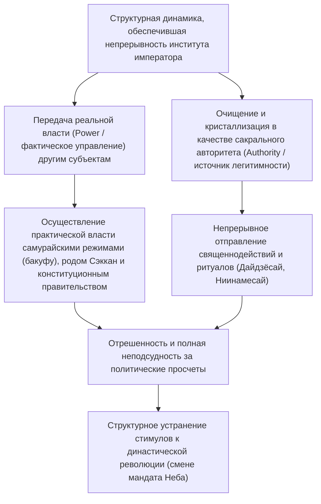
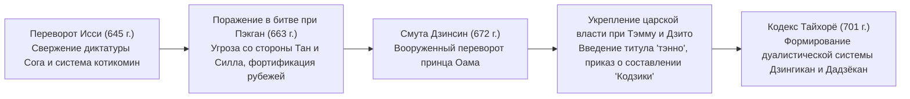
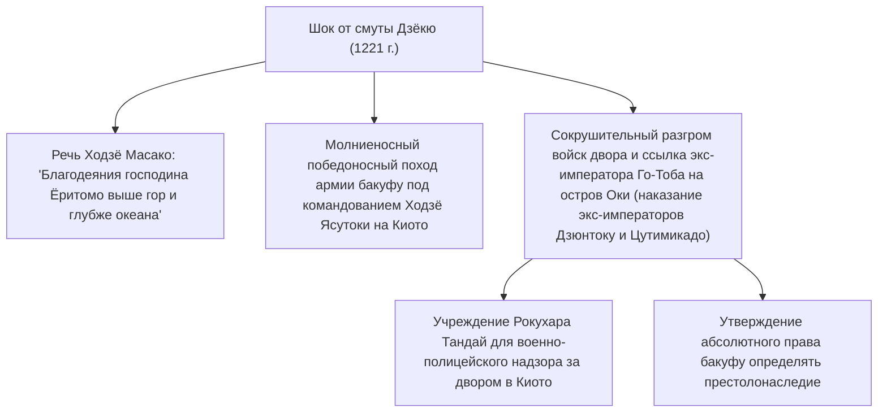
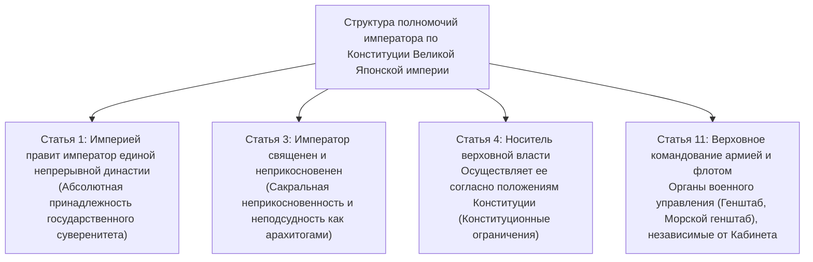
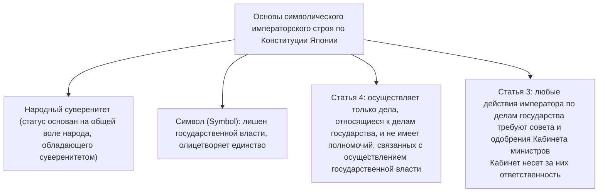
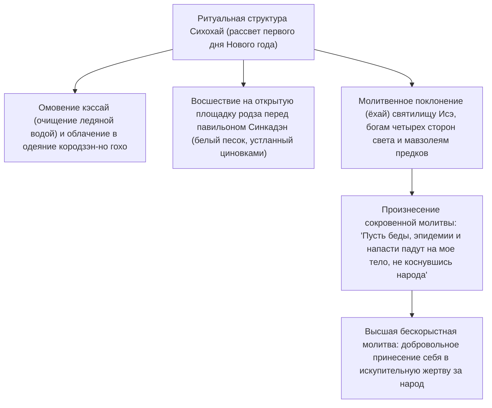
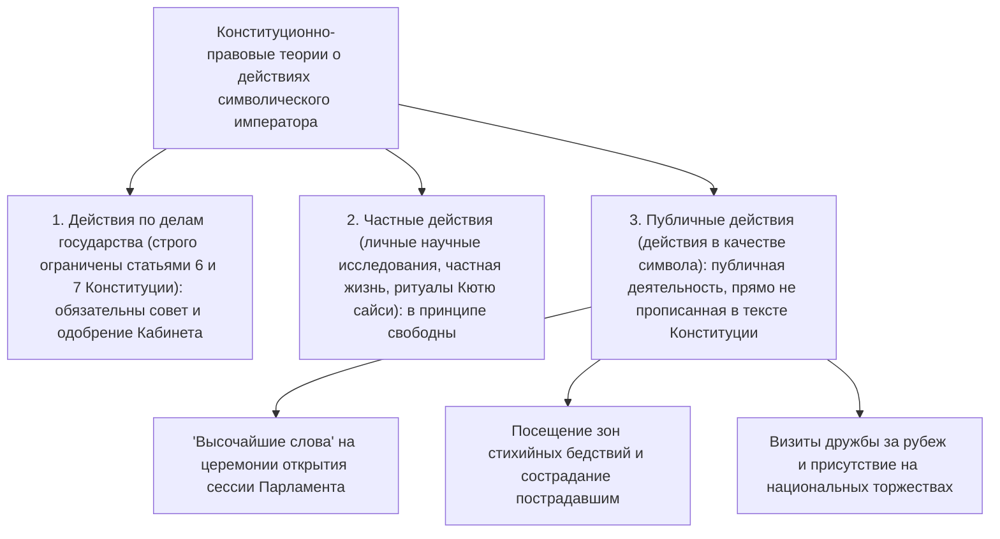

## 1. Введение: Древнейшая в мире наследственная монархия и «разделение власти и авторитета»

### 1.1 Дискурс о «Бансэй Иккэй» (единой непрерывной династии) и историко-археологическая реальность

История японского императора (Emperor of Japan, тэнно) и императорского дома демонстрирует беспрецедентную, уникальную преемственность в сравнении с любыми ныне существующими королевскими или правящими династиями мира. В Книге рекордов Гиннесса японский императорский дом официально признан «старейшей непрерывной наследственной монархией в мире» (The oldest continuous hereditary monarchy).

Хотя сформулированный идеологами кокугаку Нового времени и закрепленный в статье 1 Конституции Великой Японской империи концепт «Бансэй Иккэй» (Bansei Ikkei: единая непрерывная династия на вечные времена) несет отчетливую окраску мифологической идеологии, данные позитивной исторической науки и археологии подтверждают непреложный факт: **по меньшей мере со второй половины V века (правление императора Юряку / великого правителя Вакатакеру) или с начала VI века (правление императора Кэйтая) на протяжении более полутора тысяч лет единый царский род непрерывно преемствовал в одном и том же пространстве Японского архипелага**, что является историческим фактом, не вызывающим сомнений в академической среде.

Обращаясь к истории мировых цивилизаций, мы видим, что в Китае в результате «смены династий / смены мандата Неба» (Исин гэмин / Dynastic Cycle), когда Небесный мандат отзывался, правящий императорский род полностью истреблялся, а в европейских странах происходила постоянная череда династических смен: Нормандская, Плантагенеты, Тюдоры, Стюарты, Ганноверская династия. Почему же только в Японии единая правящая династия смогла сохраниться вплоть до сегодняшнего дня, ни разу не пережив катастрофического разрыва династической преемственности?



---

### 1.2 «Разделение власти и авторитета» в оптике сравнительной цивилизациологии

Как отмечали историки общественной мысли и исследователи сравнительной культурологии, в том числе Маруяма Масао и Рут Бенедикт, фундаментальной особенностью структуры управления в японской цивилизации является **последовательное дуалистическое разделение «политической власти» (Power: военная сила, сбор налогов, повседневное государственное управление) и «высшего авторитета» (Authority: первоисточник легитимности, религиозная и символическая сакральность)**.

Абсолютные монархи Запада (такие как Людовик XIV во Франции) или китайские деспотические императоры выступали одновременно и носителями «власти» (лично командуя армиями и отдавая оперативные приказы), и носителями «авторитета» права и порядка. При слиянии этих начал любые политические просчеты, военные поражения или масштабные социальные потрясения непосредственно били по фигуре самого монарха, которого в ходе восстаний свергали с престола вместе со всем правящим родом.

Напротив, японский император (тэнно) на протяжении столетий — от регентства рода Фудзивара (правление Сэккан) эпохи Хэйан, монастырского правления Инсэй со времен экс-императора Сиракавы, средневековых самурайских правительств (Камакурского, Муроматского и Эдоского бакуфу) и вплоть до кабинетов министров Нового времени — неизменно сохранял конструкцию: **«полное делегирование мирской власти управления (реальной власти) внешним советникам-помощникам (хохицуся) и самурайским домам»**. Даже всесильный сёгун бакуфу, дабы доказать легитимность своего господства, обязан был получить от императора титул «сэйи-тайсёгун» (великий полководец, покоритель варваров).

Вся полнота ответственности за ошибки управления неизменно ложилась на бакуфу или правительство, реально осуществлявшее власть, и именно они свергались в результате революций или военных переворотов. Однако император, оставаясь незамутненным источником легитимности, пребывал по ту сторону политической ответственности. Именно поэтому даже в самые ожесточенные эпохи гражданских войн и смут у военачальников отсутствовал системный стимул к узурпации императорского сана (то есть к физическому уничтожению династии ради восшествия на престол).

---

## 2. Формирование древнего государства, появление титула «тэнно» и рождение ритуалов Рицурё

### 2.1 Возвышение от окими (великого правителя) к «тэнно» (императору)

В эпоху курганов (Кофун) верховный правитель государства Ямато, властвовавший в центральной части архипелага, именовался «окими» (великий правитель / правитель Поднебесной — «амэ-но сита сиросимесу окими»). Надпись на железном мече, извлеченном из кургана Инарияма в префектуре Сайтама, с именем «великого правителя Вакатакеру» (Вакатакиру дайо = император Юряку), наглядно демонстрирует, что в ту эпоху правитель еще выступал прежде всего как вождь-гегемон коалиции могущественных кланов (родовой знати удзи-кабанэ).

На рубеже VI–VII веков принц Сётоку (принц Умаядо) и Сога-но Умако, возведя на трон императрицу Суйко, ввели систему двенадцати рангов (систему чинов, основанную на личных способностях человека, а не на знатности рода) и провозгласили «Законоположения из семнадцати статей» (включавшие знаменитые постулаты: «Согласие да будет чтимо превыше всего», «Благоговейно почитайте Три Сокровища», «Получив царский указ, непременно повинуйтесь ему с осмотрительностью»). В дипломатическом послании китайскому императору Ян-ди династии Суй («Сын Неба страны, где восходит солнце, направляет послание Сыну Неба страны, где солнце заходит; пребываете ли вы в добром здравии?») японское государство демонстративно вышло из вассально-даннической системы (порядка сакухо) Китайской империи, заявив о своей независимости в статусе суверенного и равного «Сына Неба».

В 645 году в ходе **«переворота Исси» (начало реформ Тайка)** принц Нака-но Оэ (будущий император Тэндзи) и Накатоми-но Каматари (родоначальник клана Фудзивара) совершили во дворце убийство зарвавшегося диктатора Сога-но Ируки. Они отвергли частное владение землей и людьми родовыми кланами, провозгласив идеал системы «котикомин» (государственной земли и государственных подданных), согласно которой вся земля и все жители объявлялись достоянием государства и императора.



---

### 2.2 Смута Дзинсин (672 г.) и абсолютный авторитет императора Тэмму

Крупнейшим водоразделом в древней истории Японии стала междоусобная война за престолонаследие, вспыхнувшая после кончины императора Тэндзи — **«смута Дзинсин» (672 г.)**. Удалившийся в изгнание в Ёсино принц Оама мобилизовал военные силы восточных провинций (Мино и Овари), молниеносным ударом разгромил двор Оми принца Отомо и взошел на трон во дворце Асука Киёмихара под именем **императора Тэмму**.

В эпоху правления императора Тэмму и его супруги, императрицы Дзито, были заложены фундаментальные основы древней монархии Рицурё:
1. **Официальное принятие титула «тэнно» (天皇)**:
   - Высочайший титул «тэнно», восходящий, как считается, к даосскому верховному божеству Тяньхуан Дади (обожествлению Полярной звезды), начал официально фиксироваться на деревянных табличках моккан и в эпиграфических памятниках.
2. **Утверждение названия государства «Нихон» (日本)**:
   - Прежнее наименование «Ва» (倭国) сменилось исполненным достоинства именем «Нихон» / «Хиномото» («Страна восходящего солнца»).
3. **Начало составления сводов официальной истории (мифологии)**:
   - По высочайшему повелению императора Тэмму началась систематизация родовых преданий и составление хроник «Кодзики» (завершены в 712 г.) и «Нихон сёки» (завершены в 720 г.), возводивших легитимность императорской династии к верховной богине солнца Аматэрасу.

---

### 2.3 Глубинная структура мифов Кики и Три священных сокровища

Мифологическая система «Кодзики» и «Нихон сёки», ведущая начало от божественной прародительницы Аматэрасу Омиками к первому земному императору Дзимму, заложила религиозное и космологическое обоснование сакрального авторитета императора.

- **Снисхождение небесного внука и «Три великих божественных указа» (Сандай синтёку)**:
  - В момент, когда Аматэрасу направляет своего внука Ниниги-но микото сойти на землю (на пик Такатихо), она провозглашает фундаментальный божественный завет — **«Указ о вечности Неба и Земли» (Тэндзё мукю-но синтёку)**:
  > «Страна богатых тростниковых равнин и обильных колосьев риса полутора тысяч осеней — это земля, где подобает царствовать моим потомкам. Ступай же, о божественный внук, и правь ею. Иди, и процветание императорского престола да пребудет бесконечным, как Небо и Земля!»
  - Земное владычество по воле небесных богов передается божественному внуку и его потомству как нерушимый священный завет на вечные времена.
  - Кроме того, были дарованы «Указ о почитании священного зеркала» (повелевавший почитать зеркало как саму душу Аматэрасу) и «Указ о колосьях священного сада» (наказывавший возделывать на земле небесный рис).
- **Три священных сокровища (Сансю-но дзинги)**:
  1. **Ята-но кагами (Восьмипядевое зеркало)**: Высшая мудрость и сакральность солнца (синтай — воплощение божества во Внутреннем святилище Исэ дзингу; во дворце хранится его священная копия — катасиро).
  2. **Ясакани-но магатама (Подвески из яшмы)**: Милосердие и духовная сила (постоянно пребывает в Покое священных меча и яшмы Императорского дворца).
  3. **Кусанаги-но цуруги (Меч Кусанаги / Меч Амэ-но муракумо)**: Воинская доблесть и мужество (синтай в святилище Ацута; во дворце хранится его священная копия — катасиро).
  - В ритуале интронизации каждого императора церемония принятия этих регалий — «Кэндзи то сёкэй-но ги» (передача священных меча и яшмы) — служит неотъемлемым свидетельством легитимности императорской власти.

---

### 2.4 Дуализм системы Рицурё: Дзингикан и Дадзёкан, и таинство Дайдзёсай

Государственный аппарат, оформившийся с принятием кодекса «Тайхорё» в 701 году, хоть и ориентировался на танскую систему Рицурё, внес в нее кардинальное, уникальное для Японии изменение.

В танском Китае ритуальное ведомство (Тайчансы) находилось в подчиненном положении под тремя высшими исполнительными палатами (Шаншушэн, Чжуншушэн, Мэньсяшэн). В японской же системе Рицурё наряду с **Дадзёканом (Государственным советом)**, ведавшим светским управлением страной, на абсолютно равной, а по сакральному статусу даже более высокой ступени был поставлен **Дзингикан (Палата небесных и земных богов)**, ведавший священнодействиями и культом ками (система двух палат и восьми министерств — никан хассё).

Самой сущностной, фундаментальной обязанностью императора было не администрирование («сэйму» — текущие политические решения), а **«синдзи» — священнодействие (непрестанная молитва незримым богам и буддам)**.
- **Ниинамесай**: Совершаемый ежегодно в ноябре ритуал, в ходе которого император подносит богам зерно нового урожая этого года и вкушает его сам, благодаря чему божество и человек соединяются воедино (синдзин кёсёку — совместная трапеза богов и людей), вознося моления о благоденствии государства и обильном урожае пяти злаков.
- **Дайдзёсай**: Совершаемое лишь единожды в жизни каждого императора первое великое таинство после восшествия на престол. Для него с нуля возводятся архаичные деревянные покои Юкидэн и Сукидэн, где монарх на протяжении всей ночи подносит прародительнице новое зерно и разделяет с ней трапезу, тем самым принимая в свое тело «тэннорэй» (божественный дух предков) и претерпевая мистическое перерождение в подлинного духовного владыку.

Как бы радикально ни менялась мирская политическая власть, именно эта роль «верховного первосвященника, непрестанно и бескорыстно молящегося богам во имя народа и государства», оставалась бессмертным ядром института императора.

---

## 3. Дуальная структура авторитета и власти в Средние века и раннее Новое время

### 3.1 Правление Сэккан и система Инсэй: силовая динамика императорского двора

В эпоху Хэйан политическая организация вокруг трона претерпела глубокую эволюцию:

- **Правление Сэккан рода Фудзивара (X–XI вв.)**:
  - Северная ветвь рода Фудзивара (эпоха апогея Фудзивара-но Митинаги и Ёримити) отдавала своих дочерей в императорские жены и императрицы (тюгу), возводила на престол малолетних внуков и, выступая в статусе деда по материнской линии (гайсеки — родственника по женской линии), занимала посты «сэссё» (регента при несовершеннолетнем государе) и «кампаку» (канцлера при взрослом императоре).
  - Не посягая на авторитет трона и не узурпируя его, Фудзивара всецело сосредоточили в своих руках назначение чиновников и принятие государственных решений через механизм матрилинейного родства.
- **Возникновение системы Инсэй (монастырского правления, с конца XI в.)**:
  - В 1086 году император Сиракава уступил трон малолетнему сыну Хорикаве, принял титул «дзёко» (дайдзё тэнно — экс-императора) и создал собственную канцелярию (интё) вне стен официального дворца (в резиденции Сиракава-ин).
  - В качестве «титэн-но кими» (владыки Поднебесной / патриарха императорского дома) отрекшийся монарх отстранил род регентов Сэккан и вернул в руки династии реальные рычаги власти. Принимая буддийский постриг и становясь «хоо» (императором-иноком), отрекшийся государь освобождался от конфуцианских и ритуальных ограничений кодекса Рицурё, налагавшихся на правящего императора, и осуществлял автократическое управление.

---

### 3.2 Рождение самурайского правления и смута Дзёкю (1221 г.)

Во второй половине XII века, свергнув власть дома Тайра, Минамото-но Ёритомо основал на востоке в Камакуре **«Камакурский сёгунат» (Камакура бакуфу)**.
Ёритомо добился от императорского двора назначения на должность «сэйи-тайсёгун», а также императорского соизволения (указа Бундзи, 1185 г.) на учреждение постов военных губернаторов (сюго) и земельных управляющих (дзито) по всей стране. Так возник дуализм двора и самурайства (кобу нигэн сихай) — аристократического императорского двора (кугэ) на западе в Киото и военного бакуфу (букэ) на востоке в Камакуре.

Попытку переломить тенденцию самурайского доминирования и вернуть верховную власть двору предпринял выдающийся, энергичный государь — **экс-император Го-Тоба**.
В 1221 году экс-император издал указ (инзэн) об объявлении вне закона и сокрушении сиккэна (регента) Камакурского бакуфу Ходзё Ёситоки, призвав самураев со всей страны подняться на борьбу (**смута Дзёкю**).



Исход смуты Дзёкю ознаменовался сокрушительным триумфом самурайства. Воины открыто попрали священный указ двора и отправили верховного владыку (титэн-но кими) в ссылку на далекий остров Оки. Это событие с предельной ясностью обнажило историческую реальность: двор, лишенный собственной военной мощи, не способен противостоять силе самураев. С этого момента бакуфу стало напрямую вмешиваться в престолонаследие, став высшим арбитром в чередовании на троне двух соперничавших ветвей императорского дома — Дайкакудзи (будущей Южной династии) и Дзимёин (будущей Северной династии) (система рёто тэцурицу).

---

### 3.3 Реставрация Кэмму и смута эпохи Намбокутё

В 1333 году император Го-Дайго, сплотив вокруг себя полководцев Асикагу Такаудзи, Нитту Ёсисаду и Кусуноки Масасигэ, сокрушил Камакурский сёгунат и провозгласил прямое императорское правление — **«Реставрацию Кэмму»**.

Однако новое правительство, игнорировавшее чаяния самураев о земельных пожалованиях и проводившее ретроградную архаичную политику в пользу столичной знати кугэ, рухнуло всего через два с небольшим года. Восставший против двора Асикага Такаудзи возвел в Киото императора Комё (из линии Дзимёин) и основал Сёгунат Муромати, в то время как император Го-Дайго бежал в горы Ёсино, заявляя о своей исключительной легитимности.

Так началась почти 60-летняя гражданская война за династическую легитимность между **«Северным двором»** в Киото и **«Южным двором»** в Ёсино — **период Намбокутё (1336–1392 гг.)**. В 1392 году при посредничестве 3-го сёгуна Муромати Асикаги Ёсимицу было заключено «соглашение эпохи Мэйтоку» (воссоединение Северного и Южного дворов), в ходе которого император Южного двора Го-Камеяма передал Три священных сокровища императору Северного двора Го-Комацу. (Хотя генеалогическая линия императоров непрерывно продолжается от императора Го-Комацу Северного двора вплоть до наших дней, в эпоху Мэйдзи было официально признано, что историческая легитимность того периода принадлежала Южному двору, хранившему подлинные священные регалии).

В эпоху апогея власти Муромати Асикага Ёсимицу принял от минского императора Юнлэ титул «Ван Японии» (ван-поданный) и, по мнению многих историков, вплотную подошел к узурпации императорского трона, планируя возвести на него собственного сына, однако его внезапная смерть положила конец этим замыслам.

---

### 3.4 «Кинтю нарибини кугэ сёхатто» сёгуната Токугава и предписание о «науках и искусствах»

В огне эпохи Сэнгоку («Эпохи воюющих провинций») императорский двор дошел до крайней нищеты; упадок был столь глубок, что император Го-Нара был вынужден собственноручно переписывать и продавать свитки со своими стихами вака и Сутрой Сердца (Хання сингё), дабы покрыть дворцовые расходы. Тем не менее, объединители страны — Ода Нобунага, Тоётоми Хидэёси и Токугава Иэясу — ни в коем случае не упразднили императора; напротив, они выделяли двору щедрые пожалования и принимали из рук монарха назначения на посты кампаку, дадзё-дайдзина (главного министра) и сэйи-тайсёгуна, тем самым укрепляя легитимность собственных режимов.

Объединив страну под своей властью, Токугава Иэясу в 1615 году издал кодекс **«Кинтю нарибини кугэ сёхатто» (Законы о дворянских и придворных родах, 17 статей)**, полностью связавший двор жесткими юридическими рамками. В первой же строке статьи 1 провозглашалось:

> **«Среди всех занятий Сына Неба первейшим являются науки и искусства (御学問 — учение).»**

Истинный замысел этой статьи был предельно прагматичен и беспощаден: «Императору надлежит совершенствоваться в науках, придворном церемониале (юсоку кодзицу) и поэзии вака, и ни в коем случае не сметь касаться политики или военного дела».
Как показал «инцидент с пурпурными одеяниями» (1629 г., когда бакуфу аннулировало указ императора о даровании высшим буддийским иерархам пурпурных облачений сиэ без согласования с сёгунатом, после чего император Го-Мидзуноо в знак протеста внезапно отрекся от престола), в эпоху Эдо император был фактически заперт в глубине Киотского императорского дворца и превращен в совершенно бессильную, лишенную малейшего политического влияния «символическую фигуру ритуала, церемоний и классической учености».

---

## 4. Реставрация Мэйдзи и создание современного государства с монархом-«арахитогами»

### 4.1 От лозунга «Сонно дзёи» к Реставрации монархии

Начиная с середины эпохи Эдо благодаря составлению колоссального труда «Дай Нихонси» («История Великой Японии») в княжестве Мито и развитию школы национальной филологии кокугаку (Мотоори Норинага и др.) в самурайском сословии укоренилась концепция «сонно» (почитания императора), гласившая, что власть сёгуната — не более чем делегированное императором управление («тайсэй ининрон»).

После прибытия «черных кораблей» коммодора Мэттью Перри в 1853 году неспособность бакуфу Токугава противостоять внешней угрозе стала очевидной, породив в среде низшего самурайства и пассионарных активистов-сиси неистовое движение «Сонно дзёи» («Почитание императора, изгнание варваров»). Император Комэй издал указ об изгнании чужеземцев, а княжества Тёсю и Сацума сделали императорский двор центром политической консолидации нации.

В октябре 1867 года 15-й сёгун Токугава Ёсинобу подал прошение о «возвращении государственной власти императору» (Тайсэй хокан). 9 декабря того же года по инициативе Ивакуры Томоми и Сайго Такамори из Сацумы был обнародован исторический манифест — **«Указ о реставрации монархии» (Осэй фукко но дайгорё)**:
- Были полностью упразднены институты бакуфу, сэссё и кампаку.
- Было провозглашено возвращение к истокам деяний основателя державы, первого императора Дзимму, и создание нового правительства прямого императорского правления (синсэй).
- Шестнадцатилетний император Мэйдзи взошел на трон, город Эдо был переименован в «Токио» («Восточная столица»), а императорская резиденция была перенесена из Киото в Токийский замок (бывший замок Эдо).

---

### 4.2 Конституционный дуализм Конституции Великой Японской империи (Конституции Мэйдзи, 1889 г.)

Государственные деятели эпохи Мэйдзи во главе с Ито Хиробуми, взяв за образец прусский конституционализм, разработали адаптированную к японским реалиям **«Конституцию Великой Японской империи»**.



Статус императора в структуре Конституции Мэйдзи сочетал в себе глубочайшую двойственность:
1. **Традиционно-религиозный аспект**: Император представал прямым потомком богов, первоисточником национальной морали и сакральным, священным и неприкосновенным богочеловеком («арахитогами» — воплощенным ками).
2. **Модерный конституционный аспект**: Император выступал конституционным монархом, осуществлявшим суверенную власть «согласно положениям Конституции» (ст. 4); он не мог править самовластно подобно диктатору — осуществление исполнительной власти требовало скрепляющего содействия и совета (хохицу) государственных министров (ст. 55), а законодательная власть осуществлялась с одобрения (кёсан) Имперского парламента.

В эпоху Тайсё профессор юридического факультета Токийского императорского университета Минобэ Тацукити выдвинул **«теорию императора как органа государства»** (согласно которой государство является юридическим лицом, обладающим суверенитетом, а император — высшим органом этого государства), ставшую теоретико-правовым фундаментом партийных кабинетов эпохи «демократии Тайсё».

Однако в конструкции Конституции Мэйдзи был заложен фатальный системный изъян: **статья 11 о «независимости верховного командования» (верховное командование армией и флотом не подчинялось совету министров Кабинета, а замыкалось непосредственно на монарха через военные штабы)**. Когда в эпоху Сёва милитаристы, прикрываясь неприкосновенностью прерогативы верховного командования (тосуйкэн), полностью вышли из-под контроля правительства и парламента, хрупкие барьеры конституционализма с легкостью рухнули.

---

## 5. Бури эпохи Сёва, поражение в войне и драматический переход к «символическому императорскому строю»

### 5.1 Катастрофа начала эпохи Сёва и «Священное решение» об окончании войны

В 1930-е годы после споров о «нарушении прерогативы верховного командования», инцидента 15 мая (1932 г.) и путча 26 февраля (1936 г.) партийная демократия угасла, и Япония погрузилась в военную диктатуру, трясину затяжной японо-китайской войны, а затем в 1941 году — в пламя войны на Тихом океане.

Государственный синто был доведен до предела догматизации, а гражданам внушали, что самопожертвование «ради императора» является высшей гражданской добродетелью. Сам же император Сёва непрестанно мучился внутренним разрывом между своим долгом конституционного монарха, не имевшего права отвергать решения Кабинета и верховного командования, и личными молитвами о мире.

В августе 1945 года перед лицом атомных бомбардировок Хиросимы и Нагасаки и вступления в войну СССР Высший совет по руководству войной раскололся поровну по вопросу о капитуляции с сохранением «кокутай» (императорского строя) против продолжения войны до последнего (решающей битвы на Японских островах — гибели всех ста миллионов подданных как разбитой яшмы).
На заседаниях Высшего совета в присутствии императора (годзэн кайги) в бомбоубежище 10 и 14 августа, когда премьер-министр Судзуки Кантаро обратился к монарху за решением, император Сёва, сдерживая слезы, вынес историческое **«Священное решение» (Сэйдан)**:

> **«Мой долг — спасти народ. Что бы ни случилось со мной лично, я более не в силах видеть, как гибнут под ударами войны мои подданные и рушится человеческая цивилизация. ...Претерпевая то, что претерпеть невозможно, и снося то, что снести не под силу, я принял решение положить конец войне».**

В полдень 15 августа по радио прозвучала «Запись драгоценного голоса» (Гёкуон хосо — чтение императорского рескрипта об окончании войны). Без прямого вмешательства слова монарха ожесточенная битва за метрополию неминуемо унесла бы жизни еще миллионов людей.

---

### 5.2 Встреча с Макартуром и избежание Токийского трибунала

После поражения в страну вступили оккупационные войска Генерального штаба союзных держав (GHQ) во главе с генералом Дугласом Макартуром. Общественное мнение стран антигитлеровской коалиции (США, Великобритании, СССР и др.) требовало объявить императора Сёва «главным военным преступником», казнить его и полностью ликвидировать институт императора.

27 сентября 1945 года император Сёва лично посетил Макартура в американском посольстве. Согласно воспоминаниям генерала, монарх не только не просил о пощаде или сохранении собственной жизни, но произнес:

> **«Я пришел сюда, дабы отдать себя на суд союзных держав как лицо, несущее единоличную и полную ответственность за каждое политическое и военное решение и действие, предпринятое японским народом в ходе ведения войны. Мне безразлично, что станет со мной лично. Я лишь молю вас: дайте пропитание моему народу».**

Потрясенный этим величием духа и бескорыстием, Макартур окончательно утвердил стратегию оккупационной политики: «сохранить институт императора и оградить императора от судебного преследования». Он осознал, что в случае казни монарха по всей Японии вспыхнет миллионное партизанское восстание, сделав мирное управление оккупационными силами невозможным.

1 января 1946 года император Сёва издал **«Императорский рескрипт о строительстве новой Японии» (известный как «Декларация человечности» — Нингэн сэнгэн)**, в котором провозгласил, что узы между монархом и народом зиждутся не на мифах или концепциях «воплощенного божества» (арахитогами), а на взаимном доверии, уважении и любви.

---

### 5.3 Статья 1 Конституции Японии: утверждение «символического императорского строя»

Вступившая в силу 3 мая 1947 года **«Конституция Японии»** радикально переосмыслила правовой статус императора в статье 1:

> **Статья 1: «Император является символом государства и символом единства народа, его статус основывается на воле всего народа, которому принадлежит суверенитет».**



- **Полное лишение правящей власти**: Император перестал быть главой государства (властителем) и стал «символом» (Symbol), олицетворяющим само бытие государства и монолитное единство народа.
- **Запрет на вмешательство в государственную власть (статья 4)**: Император может совершать исключительно формальные, протокольные «действия, относящиеся к делам государства» (кокудзи кои — созыв Парламента, назначение премьер-министра, обнародование законов, ратификация договоров, награждение орденами и знаками отличия), будучи абсолютно лишен каких-либо полномочий, связанных с реальным управлением государством.
- **Совет и одобрение Кабинета министров (статья 3)**: Любые действия по делам государства требуют обязательного совета и одобрения Кабинета министров, и именно Кабинет несет за них полную политическую и правовую ответственность.

Хотя «символический императорский строй» нередко воспринимают как чужеродную конструкцию, навязанную оккупационными властями, в контексте тысячелетней японской истории его можно трактовать как **наиболее чистое и кристаллизованное возвращение к традиционной средневековой структуре, где император не осуществлял светскую политическую власть, целиком посвящая себя сакральному авторитету и непрестанной молитве**.

---

## 2.5. Ритуальная структура дворцовых священнодействий (Кютю сайси) и духовная динамика «Сихохай»

В сокровенных глубинах лесного массива императорской резиденции Фукиагэ в Императорском дворце расположены **«Три святилища Императорского дворца» (Кютю сандэн)**:
1. **Касикодокоро**: Святилище, где благоговейно хранится священное Восьмипядевое зеркало (его священная копия — катасиро), служащее земным воплощением (синтай) божественной прародительницы Аматэрасу Омиками.
2. **Корэйдэн**: Святилище духов предков, где почитаются души всех сменявших друг друга императоров от основателя династии Дзимму, а также членов императорской фамилии.
3. **Синдэн**: Святилище небесных и земных божеств, где возносятся моления всем сонмам богов неба и земли (яоёродзу-но ками — восьми миллионам божеств).

На протяжении всего года император лично возглавляет несколько десятков торжественных ритуалов и богослужений. Среди них самым духовно потрясающим и сокровенным является **«Сихохай» (ритуал поклонения четырем сторонам света)**, совершаемый на рассвете (в 5:30 утра) в первый день Нового года в леденящем холоде суровой зимы.



Император очищает тело ледяной водой, облачается в архаичное ритуальное одеяние цвета охры (кородзэн-но гохо), садится на открытом помосте родза прямо на белом песке и совершает глубокие простирания и поклонения (ёхай) в направлении Святилища Исэ, гор, рек и божеств четырех сторон света, а также мавзолеев предков — государей минувших веков. Затем он читает сокровенную молитвенную формулу (дзюмон), зафиксированную еще в церемониальных сводах эпохи Хэйан:

> **«Злодейства, эпидемии, моровые язвы, бедствия огня и воды, коим суждено постичь народ, пусть прежде пройдут сквозь мое собственное тело (если бедствиям суждено обрушиться на моих подданных, пусть они сначала поразят меня).»**

Добровольно принести себя пред богами в «высшую искупительную жертву (козла отпущения)», принимающую на себя любые беды и напасти государства и подданных. Не власть ради порабощения и господства над другими, но абсолютное самоотречение, растворение себя в небытии ради счастья других — именно этот сакральный дух ритуального самопожертвования на протяжении тысячелетий служит тем бессознательным силовым полем, благодаря которому авторитет императора столь глубоко запечатлен в глубинной психологии японского народа.

---

## 3.5 Историческая реальность царствовавших императриц и истина концепции «временного связующего звена» (накацуги)

В дискуссиях о престолонаследии в качестве ключевого исторического аргумента постоянно фигурируют **«8 царствовавших императриц (10 правлений)»**, реально существовавших в японской истории.

| Номер в порядке престолонаследия | Имя императрицы | Годы правления | Исторический контекст воцарения и главные деяния |
| :---: | :--- | :---: | :--- |
| **33-я** | **Императрица Суйко** | 592–628 | Взошла на престол как первая в истории царствовавшая императрица ради преодоления смуты после убийства императора Сусюна. В союзе с принцем Сётоку и Сога-но Умако учредила 12 рангов и приняла «Законоположения из 17 статей». |
| **35-я / 37-я** | **Императрица Когёку / Императрица Сайтэй** | 642–645 / 655–661 | Тёсо (двукратное восшествие на престол). Во время первого правления произошел переворот Исси; в период Сайтэй лично возглавила поход на Кюсю в преддверии битвы при Пэкган и скончалась в военном лагере. |
| **41-я** | **Императрица Дзито** | 690–697 | Супруга императора Тэмму. Воплощая волю покойного супруга, построила столицу Фудзивара-кё, ввела кодекс Асука Киёмихарарё и надежно передала престол своему внуку, императору Момму. |
| **43-я** | **Императрица Гэммэй** | 707–715 | Перенос столицы в Хэйдзё-кё (Нара, 710 г.), завершение составления хроники «Кодзики», указ о составлении географических описаний «Фудоки». |
| **44-я** | **Императрица Гэнсё** | 715–724 | Дочь императрицы Гэммэй (единственный в истории случай прямой передачи престола от матери к дочери). Завершение свода «Нихон сёки», принятие закона о землях Сансэй иссин хо. |
| **46-я / 48-я** | **Императрица Кокэн / Императрица Сётоку** | 749–758 / 764–770 | Дочь императора Сёму. Двукратное восшествие. Подавила мятеж Фудзивара-но Накамаро, возвысила буддийского монаха Докё. Благодаря оракулу святилища Уса Хатиман предотвратила узурпацию престола Докё. |
| **109-я** | **Императрица Мэйсё** | 1629–1643 | Начало эпохи Эдо. Взошла на престол (будучи внучкой 2-го сёгуна Токугава Хидэтады) после внезапного отречения императора Го-Мидзуноо в знак протеста против бакуфу в «инциденте с пурпурными одеяниями». |
| **117-я** | **Императрица Го-Сакурамати** | 1762–1770 | Середина эпохи Эдо. Взошла на трон после скоропостижной кончины императора Момодзоно, управляя государством до совершеннолетия юного императора Го-Момодзоно. Последняя женщина на императорском троне в истории. |

Скрупулезный исторический анализ доказывает фундаментальный факт: **«абсолютно все царствовавшие женщины-императрицы прошлого были представительницами мужской линии династии (данкей дзёси — дочерьми императоров по мужской линии)»**. В истории Японии нет ни единого примера, когда императрица вступила бы в брак с простолюдином или представителем чужого рода и передала престол потомкам по женской линии (дзёкей).

Кроме того, подавляющее большинство из них возводились на трон в чрезвычайных обстоятельствах — когда наследник мужского пола был еще слишком мал или когда внезапная кончина государя грозила опасным вакуумом власти. В этих ситуациях царствовавшие императрицы выступали в роли старейшин дома, устранявших кризис престолонаследия, а затем передававших эстафету власти следующему мужчине по мужской линии — то есть выполняли функцию «временного связующего звена» (накацуги / пинч-хиттера).

В то же время непреложным фактом является и то, что такие правительницы, как императрица Суйко или императрица Дзито, отнюдь не ограничивались ролью «временного звена», но проявляли могучую государственную волю и заложили сам костяк древнего японского государства. Считается, что в древней Японии принятию женщин на троне благоприятствовала глубинная архаичная традиция «химэ-хико» (система соправительства жрицы и вождя), в которой женская шаманистическая духовная сила призывания божеств (мико) гармонично дополняла мужскую мирскую власть управления.

---

## 4.6 Создание государственного синто и модерный философско-правовой кульбит «доктрины о внерелигиозности святилищ»

Главнейшей дилеммой, вставшей перед правительством Реставрации Мэйдзи, был вопрос: как создать объединяющий принцип современного национального государства (Nation-State), способного противостоять давлению западных колониальных держав?

### ① Ураган «хайбуцу кисяку» и насильственное разделение синто и буддизма
Синтез синто и буддизма (симбиоз синбуцу сюго, в рамках которого на территории святилищ строились храмы, а будды почитались как истинные сущности, проявляющиеся в образе местных богов ками — доктрина хондзи суйдзяку), органично существовавший более тысячи лет, был насильственно разорван правительством Мэйдзи **«Указом о разделении богов и будд» (Синбуцу хандзэнрэй)** в марте 1868 года.
По всей стране пронесся сокрушительный вихрь движения **«хайбуцу кисяку» (искоренения буддизма)**: фанатики крушили драгоценные буддийские статуи, сжигали священные сутры, сносили древние пятиярусные пагоды. Вначале правительство пыталось сделать синто исключительной государственной религией через так называемое «Движение за распространение Великого учения» (Тайкё сэмпу ундо). Однако эта политика натолкнулась на глубоко укорененную буддийскую веру народных масс и на жесткое дипломатическое давление западных держав, обвинивших Японию в грубом нарушении свободы вероисповедания, и потерпела крах.

### ② Внеправовая фикция: «доктрина о внерелигиозности святилищ» (Дзиндзя хи-сюкёрон)
Тогда государственные мужи эпохи Мэйдзи (в первую очередь Иноуэ Коваси) изобрели изощреннейшую юридическую конструкцию — идеологическую фикцию: **«святилищный синто не является религией» (дзиндзя хи-сюкёрон)**.
- В статье 28 Конституции Великой Японской империи формально провозглашалась «свобода вероисповедания», а христианство и буддизм признавались «частными религиями отдельных граждан».
- В то же время ритуалы, совершаемые в синтоистских святилищах (включая Святилище Исэ, Ясукуни и др.), определялись не как «религия», а как **«общегосударственные публичные обряды почитания предков и основы гражданской морали»**, в которых обязан был участвовать каждый подданный Империи.
- В результате сформировалось надрелигиозное абсолютное пространство «государственного синто» (State Shinto): ни буддист, ни христианин, будучи подданным Империи, не имел права уклониться от поклонения святилищам и почитания священной особы императора. Этот поразительный понятийный кульбит и стал институциональной почвой, открывшей путь к фанатичному обожествлению «арахитогами» и милитаристскому безумию эпохи Сёва.

---

## 5.5 Судебная конституционная практика и демаркационные линии символического императорского строя

В условиях действия Конституции Японии символический императорский строй прошел горнило многочисленных конституционно-правовых споров и судебных прецедентов, оттачивавших толкование его пределов.



### ① Легитимация «публичных действий» (действий в качестве символа)
Пункт 1 статьи 4 Конституции гласит: «Император осуществляет только такие действия, относящиеся к делам государства, которые предусмотрены настоящей Конституцией». При строго буквальном толковании любая публичная активность за пределами формального списка дел государства (посещение зон бедствий, прием иностранных гостей, приветственное слово на открытии Парламента) могла бы трактоваться как антиконституционная.
Судебная практика и официальная правительственная позиция разрешили этот вопрос, признав: «Поскольку император обладает статусом символа государства Япония, ему безусловно подобает осуществлять **публичные действия (действия в качестве символа)**, соответствующие этому высокому статусу». Данная деятельность признана полностью конституционной при условии, что она осуществляется под полным контролем, содержательным советом и политической ответственностью Кабинета министров.

### ② Принцип отделения религии от государства (статьи 20 и 89) и ритуалы Кютю сайси
Предметом острых юридических баталий стал вопрос: должны ли синтоистские обряды императорского дома (такие как Ниинамесай и Дайдзёсай) финансироваться из государственного бюджета (дворцовых расходов — кютэйхи, то есть публичных средств) или исключительно из средств личного содержания императорской семьи (найтэйхи — частных средств)?
Опираясь на выработанный Верховным судом Японии «критерий цели и эффекта» (решения по делу о ритуале дзитинсай в городе Цу и делу о подношении тамагуси в префектуре Эхимэ), определяющий, имеет ли действие религиозную направленность и ведет ли оно к поддержке или притеснению конкретной религии, суды постановили: при интронизации императоров эпох Хэйсэй и Рэйва таинство Дайдзёсай признано «традиционным историческим обрядом императорского дома, носящим публичный характер», а покрытие связанных с ним расходов из публичных дворцовых фондов (кютэйхи) признано конституционным.

## 6. Деятельность символического императора в современную эпоху и проблема престолонаследия

### 6.1 Деятельность эпохи Хэйсэй и осуществление прижизненного отречения

Подлинную плоть и кровь институту символического императора дали самоотверженные труды 125-го императора (ныне экс-императора, дзёко Акихито) и императрицы Митико.
Неустанно вопрошая себя: «Каким должен быть символ?», дзёко Акихито лично посещал все регионы страны, пострадавшие от страшных стихийных бедствий (извержение вулкана Ундзэн-Фугандакэ, Великое землетрясение Хансин-Авадзи, Великое восточно-японское землетрясение 2011 года). Преклоняя колени прямо на полу эвакуационных центров, он смотрел в глаза пострадавшим, держал их за руки и находил слова сердечного утешения. Он также совершал непрестанные «путешествия упокоения душ погибших» в Окинаву, Хиросиму, Нагасаки, а также на поля ожесточенных сражений былой войны — Сайпан, Пелелиу в Палау и Филиппины, непрестанно молясь о том, чтобы память о трагедии войны никогда не угасла.

8 августа 2016 года император обратился к нации с беспрецедентным видеообращением (выражением «сокровенных мыслей»), в котором признался, что в силу преклонного возраста ему становится все труднее всецело отдавать душевные и телесные силы исполнению священных обязанностей символа. В ответ на это Парламент Японии в 2017 году принял «Специальный закон к Закону об императорском доме». 30 апреля 2019 года впервые за последние 200 лет (со времен отречения императора Кокаку в эпоху Эдо) мирно совершилось «прижизненное отречение от престола»: наследный принц Нарухито взошел на трон в качестве 126-го императора, ознаменовав наступление эры «Рэйва».

---

### 6.2 Современные конституционные и политико-правовые дилеммы престолонаследия

В XXI веке императорский дом столкнулся с острейшим экзистенциальным кризисом: «стремительным сокращением численности членов императорской фамилии и критическим сужением круга лиц, имеющих право на престолонаследие».
Действующая статья 1 Закона об императорском доме непреложно гласит: **«Императорский трон наследуется потомком мужского пола по мужской линии, принадлежащим к императорской династии»**.

В настоящее время во всем следующем молодом поколении право на трон имеет единственный наследник — Его Императорское Высочество принц Хисахито, что ставит преемственность династии в положение предельного риска («канатоходца над пропастью»). В связи с этим в японском обществе развернулись ожесточенные дискуссии вокруг трех основных подходов:

| Вариант реформы | Суть предложения | Аргументы сторонников | Возражения и опасения консерваторов |
| :--- | :--- | :--- | :--- |
| **① Допущение женщин-императриц (дзёсэй тэнно)** | Разрешение восшествия на трон дочери императора (например, принцессы Айко). | В истории Японии существовали прецеденты 8 царствовавших императриц (10 правлений) от Суйко до Го-Сакурамати. Это пользуется широкой поддержкой общественного мнения. | Сторонники сохранения традиции не возражают против дочери императора по мужской линии (данкей дзёси), однако опасаются, что это послужит ступенью к переходу к наследованию по женской линии. |
| **② Допущение наследования по женской линии (дзёкей тэнно)** | Допущение на престол государей, чья связь с императорским родом идет только по материнской линии (детей императрицы, рожденных от мужчины-простолюдина). | Единственное реалистичное решение, позволяющее навсегда устранить угрозу физического угасания правящей династии. Соответствие принципу гендерного равенства. | Резкое неприятие: исчезнет фундаментальная основа императорского дома — «непрерывная мужская линия (данкей)», не прерывавшаяся на протяжении 126 поколений, что приведет к утрате сакральной легитимности. |
| **③ Возвращение бывших боковых ветвей (данкей кю-кодзоку)** | Возвращение в состав императорского дома потомков мужского пола по мужской линии из 11 ветвей миякэ, исключенных из династии в 1947 г. по требованию GHQ (через усыновление). | Позволяет безупречно сохранить древнюю традицию наследования по непрерывной мужской линии (Бансэй Иккэй). | Психологический барьер и неприятие в обществе: трудно воспринять людей, на протяжении почти 80 лет живших обычной жизнью частных граждан, в качестве членов правящей семьи. |

---

## 7. Заключение: Генеалогия молитвы и глубинный пласт японской цивилизации

Институт императора — это прежде всего не политическая конструкция, но **«культурный и духовный древнейший пласт молитвы»**, взлелеянный природным ландшафтом Японского архипелага и его народом на протяжении тысячелетий.

Не кичась своей мирской властью, подобно президентам,
Не кичась своим богатством, подобно магнатам,
В священном безмолвии дворцовых рощ совершая омовения в череде священнодействий всех четырех времен года,
Пребывает правитель, непрестанно и бескорыстно молящийся лишь о счастье народа, мире на всей Земле и обильном урожае злаков.

И могучие древние кланы, и грозные средневековые самураи, и реформаторы-сиси эпохи Мэйдзи, создававшие современную державу, и поколения граждан, поднявшие страну из послевоенного пепла — все они склоняли головы перед этой бескорыстной «обителью молитвы».

Хотя внешние институциональные формы монархии с непревзойденной гибкостью адаптировались к переменам эпох — от государства Рицурё к сёгунатам бакуфу, затем к конституционной империи Мэйдзи и, наконец, к символу послевоенной демократии, — сияющее в самом сердце института ядро, «непрерывность священной молитвы», ни разу не прервалось за всю историю.

В непрестанно меняющемся, турбулентном мире XXI века живое бытие императора — как узловая точка исторического времени, соединяющая тысячелетия прошлого с тысячелетиями грядущего, — остается тем сокровенным зеркалом, в котором японская нация постигает собственную идентичность.

### 2.6 Сакрально-антропологическая глубина Дайдзёсай: спор вокруг концепции «Матоко офусума» Орикути Синобу и космология совместного вкушения нового зерна

Таинство Дайдзёсай, венчающее собой интронизационные ритуалы, издревле воспринималось не просто как празднество благодарения за урожай, но как фундаментальная инициация (обряд перехода), в ходе которой новый государь наследует божественную силу первопредка и претерпевает мистическую метаморфозу в «арахитогами» (воплощенное божество) или существо священной божественной природы. Вокруг ритуальной структуры этого священнодействия в современной антропологии, религиоведении и исторической науке развернулась острейшая академическая полемика.

Классическим примером тому служит выдвинутая выдающимся этнологом и фольклористом Орикути Синобу концепция «Матоко офусума» («священного покрова»). В своем фундаментальном труде «Истинный смысл Дайдзёсай» (1928 г.) Орикути обратил внимание на возводимые в сокровенных покоях Юкидэн и Сукидэн священного комплекса Дайдзёгю возвышенное ложе «сакамакура» и священное ложе «камуфусидо». Сопоставив это с мифом о снисхождении небесного внука, где Ниниги-но микото сошел на землю, спеленатый священным покровом «матоко офусума», Орикути утверждал, что новый государь, скрываясь под ритуальным покрывалом (фусума) на священном ложе, переживал мистический опыт мнимой смерти (псевдосмерти) и последующего возрождения, в ходе которого в его тело вселялся и соединялся с ним божественный дух прародительницы Аматэрасу Омиками («тэннорэй» / дух предков). Иными словами, Дайдзёсай трактовался им как мистерия обновления и соединения душ (тамафури и тамадзидзумэ).

```
【Два главных академических направления в изучении сокровенной структуры Дайдзёсай】

1. Теория Орикути Синобу (мистическое соединение душ и инициация перерождения)
   - Ключевые концепты: «Матоко офусума», «Камуфусидо» (божественное ложе).
   - Ритуальная интерпретация: новый император погружается в ритуальное покрывало, проходя через символическую смерть и воскресение, принимая в тело душу духа-предка Аматэрасу.
   - Теоретический базис: концепция «марэбито» Янагиты Кунио и Орикути Синобу, южноостровная теория, обряды инициации в сельских общинах (миядза) и союзах молодежи.

2. Дворцово-ритуальная и позитивно-историческая теория (совместное вкушение нового зерна и единение богов и людей)
   - Ключевые концепты: «Синсэн кэнсэн» (подношение священной снеди), «Синдзин кёсёку» (совместная трапеза богов и людей).
   - Ритуальная интерпретация: аграрный обряд священного союза, в ходе которого государь вкушает зерна риса, проса и священное сакэ вместе с богами, подтверждая взаимный союз и право на правление.
   - Ведущие исследователи: Окада Сёдзи, Токоро Исао, Сакамото Таро (текстологический анализ «Энгисики» и древних придворных хроник).
```

В противовес этому историки и исследователи синто Окада Сёдзи и Токоро Исао провели скрупулезную сверку древних ритуальных текстов, в частности «Энгисики» эпохи Хэйан, доказав слабую источниковую обоснованность гипотезы Орикути. Согласно их позитивным изысканиям, смысловым центром Дайдзёсай является совершаемое глухой ночью самим монархом подношение священных даров (риса, проса, белого и черного сакэ, морского ушка акаби, рыбы) и вкушение этой же пищи перед лицом богов — «синдзин кёсёку» (совместная трапеза богов и людей). Разделяя трапезу с божеством, правитель благодарит за плодородие земли и возобновляет сакральный союз с предками. Ложе «камуфусидо» предназначалось для отдыха спускающегося божества (камидза), и в источниках нет никаких свидетельств того, что император когда-либо ложился туда подобно саркофагу.

Современный научный консенсус, отдавая должное поэтической интуиции и смелому антропологическому обобщению Орикути, склоняется к пониманию Дайдзёсай как многослойного комплекса восточноазиатских аграрных священнодействий и интронизационных ритуалов. Однако, какой бы трактовки ни придерживаться, остается непреложным: Дайдзёсай исторически служил тем решающим сакральным пограничным рубежом, благодаря которому мирской политический правитель превращался в подлинного жреца и молитвенника.

---

### 4.3 Хайбуцу кисяку и Движение за распространение Великого учения: крах огосударствления синто и институциональная инженерия «государственного синто»

«Реставрация монархии» в эпоху Мэйдзи представляла собой не просто переход власти от бакуфу к государственному аппарату Дадзёкан, но несла в себе черты радикальной религиозной и интеллектуальной революции, провозглашавшей возвращение к древнему идеалу «единства культа и управления» (сайсей итти). В марте 1868 года правительство издало указ Дадзёкана о «разделении синто и буддизма». Это разрушило тысячелетний синкретический уклад (синбуцу сюго) и привело к принудительному изгнанию из святилищ любых буддийских элементов (статуй, сутр, храмовых колоколов, священнических званий бэтто и сясо).

Это разделение вылилось на местах в безудержные погромы — волну движения «хайбуцу кисяку». В княжествах Сацума, Наэги, на островах Оки, в Тояме буддийские монастыри уничтожались до основания, а бесценные изваяния сжигались и дробились на куски. Дошло до того, что знаменитая пятиярусная пагода монастыря Кофукудзи в Наре едва не была продана на слом за жалкие 25 иен; национальному культурному наследию и экономике буддизма был нанесен сокрушительный удар.

```
【Эволюция идеологии единства культа и политики в раннюю эпоху Мэйдзи】

Возрождение Палаты Дзингикан (1869 г.)
  -- "Продвижение единства культа и политики радикальными последователями школы Хирата кокугаку" -->
Буря разделения богов и будд, и движения хайбуцу кисяку (повальный разгром храмов и гонения на буддизм)
  -- "Столкновение с волнениями внутри страны и резкой критикой великих держав" -->
Движение за распространение Великого учения (с 1870 г.: учреждение Сэнкёси и Министерства вероучений)
  -- "Борьба буддистов школы Дзёдо-синсю (Симадзи Мокураи) за свободу совести и давление Запада" -->
Крах идеи синто как государственной религии (1875 г.: роспуск Академии Дайкёин)
  -- "Создание доктрины 'внерелигиозности святилищ' (святилища как административный институт)" -->
Система государственного синто (управление Бюро святилищ МВД, возведение в статус общенациональной морали)
```

Однако курс на прямое превращение синто в государственную религию под эгидой возрожденной Палаты Дзингикан, продвигавшийся радикальными учеными хиратовской ветви кокугаку, быстро зашел в тупик. Во-первых, буддийское духовенство (в особенности лидер школы Дзёдо-синсю Симадзи Мокураи), вооружившись западными теориями свободы совести и отделения церкви от государства, развернуло мощное сопротивление. Симадзи, вернувшись из европейской поездки 1872 года, доказал, что свобода вероисповедания — краеугольный камень современного государства, и принуждать граждан к единому вероучению недопустимо. Во-вторых, как показало снятие антихристианских досок-запретов косацу в 1873 году, стремление правительства добиться отмены неравноправных договоров с западными державами делало обвинения в «религиозном варварстве» дипломатически самоубийственными.

Дабы разрешить эту дилемму, прагматичные чиновники Мэйдзи (прежде всего Иноуэ Коваси) разработали изощренную социально-правовую инженерию — создание «государственного синто» на основе «доктрины о внерелигиозности святилищ».
Власти объявили святилища принципиально отличными по природе от «индивидуальных конфессий граждан (буддизма, христианства, сектантского синто)», возведя их в статус «государственных церемоний» и «основы гражданской нравственности». Тем самым правительство внешне гарантировало свободу вероисповедания в статье 28 Конституции, но одновременно сделало почитание святилищ и дворцовых ритуалов непререкаемым гражданским долгом каждого подданного Империи.

---

### 4.4 «Императорский рескрипт к армии и флоту» и «Императорский рескрипт об образовании»: император как генералиссимус и консолидация внутренней морали нации

Создавая внешние институты современного конституционного государства, правительство разработало два мощнейших духовных механизма, неразрывно спаявших дисциплину армии и сознание подданных с особой монарха: «Императорский рескрипт к военнослужащим» (Гундзин тёкую, 1882 г.) и «Императорский рескрипт об образовании» (Кёику тёкуго, 1890 г.).

#### 1. «Рескрипт к военнослужащим» и институт императора-генералиссимуса (Дайгэнсуй)
Составленный философом Ниси Аманэ и доработанный Ямагатой Аритомо «Рескрипт к военнослужащим» определял вооруженные силы как «армию, лично предводительствуемую императором», провозглашая непосредственную связь между армией и монархом:

> «Войска нашей державы из поколения в поколение состоят под верховным предводительством императора... Я есмь ваш, воинов, генералиссимус (Дайгэнсуй). Посему Я полагаюсь на вас как на Свои руки и ноги, вы же должны взирать на Меня как на своего главу, и близость наша да пребудет сугубо глубокой».

Тем самым армия мыслилась не как государственный институт, подотчетный Кабинету министров или Парламенту, но как организация, присягнувшая на безусловную верность лично императору. Рескрипт налагал пять воинских добродетелей: верность, вежливость, мужество, верность слову и скромность, провозглашая бессмертную заповедь: «Помни, что долг тяжелее горы, а смерть легче птичьего пера». Эта непосредственная спайка между императором-генералиссимусом и армией послужила идеологическим обоснованием «независимости верховного командования», запрещавшей даже премьер-министру вмешиваться в оперативные военные решения, что превратилось в фатальную институциональную ловушку, обусловившую бесконтрольность военных в эпоху Сёва.

#### 2. «Рескрипт об образовании» и государственная этика «единства преданности и сыновней почтительности» (Тюко иппон)
Обнародованный в результате компромисса между Иноуэ Коваси и конфуцианским наставником Мотодой Нагадзанэ «Рескрипт об образовании» был оформлен не как закон или ордонанс, а как непосредственное отеческое обращение государя к подданным. Излагая конфуцианскую семейную мораль — сыновнюю почтительность, братскую любовь, супружеское согласие, — рескрипт подчинял всю эту этическую систему высшей цели: «В случае опасности для государства мужественно отдавайте себя на служение общему благу и тем самым способствуйте процветанию Небесного императорского трона, вечного, как Небо и Земля».

Текст Рескрипта об образовании торжественно зачитывался во всех школах страны в дни главных государственных праздников (Кигэнсэцу, Тэнтёсэцу, Мэйдзисэцу, Гэнсисай) перед «Госинъэй» (священными портретами императора и императрицы), перед которыми совершался земной поклон сайкэйрэй. В 1891 году преподаватель Первой высшей школы христианин Утимура Кандзо во время торжественной церемонии заколебался совершить полный поклон перед рескриптом, что вызвало волну травли и его увольнение («инцидент оскорбления величества Утимуры Кандзо»). Этот инцидент ярко продемонстрировал, что рескрипт вышел за рамки морального наставления, превратившись в квазирелигиозную пробу на абсолютную лояльность режиму (фумиэ).

---

### 4.5 Споры о сущности «кокутай» в эпохи Мэйдзи, Тайсё и ранней Сёва: Уэсуги Синкити против Минобэ Тацукити и трагедия «теории императора как органа государства»

После утверждения Конституции Мэйдзи острейшим полем битвы в правоведении и политической мысли стали дебаты о природе отношений между государством и монархом. Главной ареной этого противостояния стал ожесточенный диспут между профессорами Токийского императорского университета Уэсуги Синкити (сторонником абсолютного монархического суверенитета и теологической школы права) и Минобэ Тацукити (последователем теории государства как юридического лица и теории императора как органа).

```
【Противостояние двух главных конституционных концепций императора】

1. Уэсуги Синкити (теория теократического монархического суверенитета)
   - Концепция государства: император и есть само государство. Суверенитет — неотъемлемое божественное право монарха.
   - Трактовка правящей власти: власть императора абсолютна и неограниченна. Конституция — лишь добровольное самоограничение государя, носящее инструктивный характер.
   - Идейные истоки: теория патриархального кокутай Ходзуми Яцуки, европейский абсолютизм; послужила базой ультранационализма эпохи Сёва.

2. Минобэ Тацукити (теория императора как органа государства / конституционная доктрина государства как юрлица)
   - Концепция государства: государство само является юридическим лицом (субъектом права, наделенным властью), суверенитет принадлежит государству как корпорации.
   - Трактовка правящей власти: император — высший орган государства, осуществляющий власть строго в рамках Конституции.
   - Идейные истоки: общее учение о государстве Георга Еллинека; служила теоретической опорой демократии Тайсё и партийных кабинетов.
```

Теория императора как органа государства Минобэ Тацукити ни в малейшей степени не умаляла авторитет трона. Напротив, опираясь на фундаментальное учение немецкого правоведа Георга Еллинека (Georg Jellinek) о государстве как юридическом лице, она стремилась утвердить в Японии правовое государство (Rechtsstaat), поставить заслон автократическому произволу и обосновать легитимность парламентаризма и партийных кабинетов. В эпоху «демократии Тайсё» теория органов стала общепризнанной в научных кругах и правительственной бюрократии, войдя в стандартные критерии экзаменов на высшие государственные должности (кото бункан сикэн).

Однако с наступлением 1930-х годов и возвышением милитаризма теория органов подверглась оголтелой травле как «кощунственное учение, низводящее богоподобного императора до роли простого инструмента (органа) государства». В 1935 году после скандальной речи члена Палаты пэров Кикути Такэо военные круги и Союз резервистов развернули кампанию «За уяснение сущности национальной структуры» (Кокутай мэйтё ундо). Кабинет Окады Кэйсукэ спасовал перед натиском генералитета: фундаментальные труды Минобэ (включая «Основы конституционного права») были запрещены к публикации, а самого ученого вынудили сложить полномочия члена Палаты пэров. Правительство издало две «Декларации об уяснении национальной структуры», официально заклеймив теорию органов как антинациональную ересь и утвердив постулат о том, что носитель верховного суверенитета — сам император.

Разгром теории императора как органа означал фактическую смерть конституционного правопорядка в Японии. Мистическое, стоящее над любыми законами понимание монарха возобладало в государстве, а Генеральный штаб и военщина получили карт-бланш на сокрушение любого гражданского контроля (civilian control) под предлогом защиты «священной прерогативы верховного командования».

---

### 5.4 Сравнительно-правовой анализ института символического императора: отличия от британской монархии и «дебаты о статусе главы государства» (Гэнсю ронсо)

Строй символического императора, установленный статьей 1 Конституции Японии, обладает исключительно своеобразной правовой структурой среди конституционных монархий мира. Его специфика становится особенно рельефной при сопоставлении с классической европейской конституционной монархией — Великобританией (Соединенным Королевством Великобритании и Северной Ирландии).

#### 1. Структурные отличия от британской монархии
В британской конституционной модели монарх формально выступает «источником правящей власти»: законодательная власть осуществляется «Королем в Парламенте» (King-in-Parliament), правительство именуется «Правительством Его Величества» (His Majesty's Government), а вооруженные силы — «Королевскими вооруженными силами». Как сформулировал Уолтер Бэйджхот (Walter Bagehot) в классическом труде «Английская конституция» (1867 г.), монарх образует «сакрально-парадную часть» (dignified parts) государственного устройства, уравновешивающую «эффективно-действующую часть» (efficient parts) в лице Кабинета. По Бэйджхоту, британский монарх сохраняет за собой три важнейших политических права: «право на консультации, право поощрять и право предостерегать», обладая определенным реальным политическим влиянием на премьера.

В отличие от этого, император по действующей Конституции Японии не является даже формальным источником суверенитета. Статья 1 провозглашает, что суверенитет принадлежит исключительно народу, а статья 4 прямо запрещает императору обладать какими-либо «полномочиями, связанными с осуществлением государственной власти». Любые действия императора по делам государства (статьи 6 и 7) требуют безусловного «совета и одобрения Кабинета министров», возлагающего на себя всю полноту ответственности (ст. 3). Император Японии конституционно лишен какого-либо права высказывать собственные политические взгляды или делать предостережения министрам. Это уникальная модель «чистого символизма», в которой политические прерогативы ампутированы с гораздо большей радикальностью, чем в любой европейской монархии.

```
【Сравнение британской конституционной монархии и символической монархии по Конституции Японии】

┌─────────────────┬───────────────────────────────┬───────────────────────────────┐
│ Критерий        │ Великобритания                │ Япония (Конституция 1947 г.)  │
├─────────────────┼───────────────────────────────┼───────────────────────────────┤
│ Носитель власти │ Король в Парламенте           │ Народ (Народный суверенитет)  │
│ Статус монарха  │ Формальный глава государства  │ Символ государства и единства │
│ Права по власти │ Формальные королевские права  │ Не имеет вовсе (ст. 4 п. 1)   │
│ Влияние/советы  │ Право поощрять и предостерегать│ Полный запрет, совет Кабинета │
│ Вооруженные силы│ Верховный главнокомандующий   │ Нет правовой связи с Силами сам.│
└─────────────────┴───────────────────────────────┴───────────────────────────────┘
```

#### 2. Послевоенные конституционно-правовые дебаты о статусе главы государства (Гэнсю ронсо)
Вследствие этой специфики в японской науке конституционного права и дипломатической практике не утихают дискуссии о том, является ли император главой государства (Chief of State / гэнсю). В международном праве глава государства — лицо, представляющее государство во внешних сношениях и возглавляющее верховную власть внутри страны.

- **Утвердительная позиция (дипломатическая практика, консервативное крыло)**: Акцентирует внимание на том, что император принимает верительные грамоты иностранных послов, удостоверяет ратификационные грамоты, а по международному протоколу пользуется почестями, абсолютно эквивалентными главе государства (наравне с королями и президентами), и делает вывод, что император является фактическим и внешнеполитическим главой государства.
- **Отрицательная позиция (Миядзава Тосиёси и большинство конституционалистов)**: Указывает, что право заключения договоров и ведения внешней политики принадлежит исключительно Кабинету министров (ст. 73), а реальным представителем государства во внешней политике выступает премьер-министр. Поскольку император не возглавляет исполнительную власть и не обладает автономией воли, в строгом юридическом смысле он не может именоваться главой государства.
- **Теория «квази-главы государства» / «символического главы государства»**: Компромиссная позиция, разделяющая функции: представительские и церемониальные функции выполняет император, а реальные исполнительные — премьер-министр.

Эта полемика выходит далеко за рамки чистого академизма: официальная позиция правительства Японии по сей день придерживается осторожной дипломатичной формулировки: «Император выполняет внешнеполитические функции представительства государства, такие как принятие верительных грамот и удостоверение договоров, поэтому его вполне допустимо называть главой государства (или символическим главой государства)».

---

### 6.3 Смена эры на Рэйва и Специальный закон к Закону об императорском доме (2017 г.): статья 2 Конституции о «наследственности престола» и юриспруденция отречения

8 августа 2016 года обращение 125-го императора (ныне экс-императора Акихито) «Послание Его Величества Императора об исполнении обязанностей в качестве символа» стало важнейшим поворотным пунктом в истории послевоенной символической монархии. Это видеообращение, в котором монарх высказал опасения о невозможности полноценного исполнения обязанностей символа в связи с преклонным возрастом, потрясло японское общество и дало мощный толчок дебатам о реформе Закона об императорском доме.

Статья 4 Закона об императорском доме непреложно устанавливала принцип пожизненного правления: «После кончины императора наследник престола незамедлительно восходит на трон». Данная норма основывалась на острой настороженности отцов японской модернизации эпохи Мэйдзи, стремившихся предотвратить возникновение «двоевластия» между правящим государем и отрекшимся экс-императором (дайдзё тэнно), столь часто сотрясавшего страну в древности и Средневековье.

Тем не менее правительство, стремясь соблюсти соответствие со статьей 2 Конституции Японии («Императорский трон является наследственным и передается в соответствии с Законом об императорском доме, принятым Парламентом»), нашло разовое юридическое решение для данного конкретного случая. В июне 2017 года был принят «Специальный закон к Закону об императорском доме об отречении императора и сопутствующих вопросах».

```
【Ключевые конституционно-правовые дилеммы вокруг отречения от престола】

1. Бессрочная реформа (внесение правок в сам Закон) против Специального разового закона
   - Решение правительства: закрепление права на отречение в качестве постоянной нормы несет риск принудительного отстранения будущих императоров или политических спекуляций, поэтому был принят специальный разовый закон для одного конкретного государя, основанный на искреннем уважении и понимании народа.
   - Критика конституционалистов: статья 2 Конституции требует, чтобы престолонаследие регулировалось исключительно самим «Законом об императорском доме», поэтому решение вопроса через отдельный специальный акт расценивалось критиками как опасный обход духа Конституции (престолонаследие на основе ad-hoc законодательства).

2. Предотвращение дуализма сакрального авторитета и власти
   - Четкое юридическое оформление статуса отрекшегося императора («дзёко»). Создание в Управлении императорского двора специального «Управления экс-императора» (Дзёкотё); полный отказ от публичных и государственных актов ради безупречного и нераздельного перехода роли символа к новому императору.

3. Будущие контуры квалификации престолонаследия
   - Выход принцесс из состава императорской семьи в результате брака с простолюдинами неуклонно сокращает численность династии.
   - Вопрос о допущении царствующих императриц (данкей дзёси), наследовании по женской линии (дзёкей тэнно) и возвращении боковых мужских линий бывших принцев (кю-кодзоку) остается открытой исторической задачей для нации как носителя суверенитета.
```

Восшествие на трон наследного принца Нарухито 1 мая 2019 года и наступление новой эры «Рэйва» стали первой за 202 года передачей престола в результате прижизненного отречения, совершившейся в атмосфере глубокого общественного спокойствия и всенародного ликования. Это историческое событие драматически продемонстрировало, что легитимность и жизнеспособность строя символического императора покоятся не на мертвой закостенелости догм, а на динамичном сопереживании, созвучии и взаимном доверии с общей волей народа, являющегося единственным источником государственного суверенитета.
